# 九、聚类基础

在这一章中，我们将介绍聚类的基本概念和一些可以有效解决许多问题的常见算法的结构。然而，他们的假设有时过于严格；特别地，那些关于簇的凸性的问题会导致在采用它们时的一些限制。阅读完本章后，读者应该了解每种策略可以产生准确结果的环境，以及如何衡量性能并在聚类数量方面做出正确选择。

特别是，我们将讨论以下内容:

*   聚类的一般概念
*   **k-最近邻** ( **k** **-NN** )算法
*   高斯混合
*   K-均值算法
*   选择最佳聚类数的常用方法(惯性、侧影图、卡林斯基-哈拉巴斯指数和聚类不稳定性)
*   基于基本事实(同质性、完整性和调整后的 Rand 指数)的评估方法


# 聚类基础

让我们考虑一个由 m 个维度样本组成的数据集:

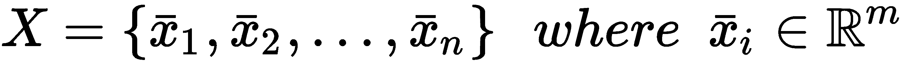

让我们假设有可能找到一个标准(不是唯一的)，以便每个样本可以根据其特有的特征和数据集的整体结构与特定的组相关联:

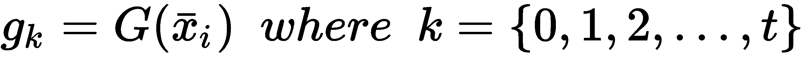

习惯上，每个组称为一个**聚类**，寻找函数 *G* 的过程称为**聚类**。现在，我们没有对聚类施加任何限制；然而，由于我们的方法是无监督的，应该有一个相似性标准来连接一些元素和分离其他元素。不同的聚类算法基于不同的策略来解决这个问题，并且可以产生非常不同的结果。

在下图中，有一个基于四组二维样本的聚类示例；将点分配给聚类的决定仅取决于其特征，有时还取决于一组其他点(邻域)的位置:

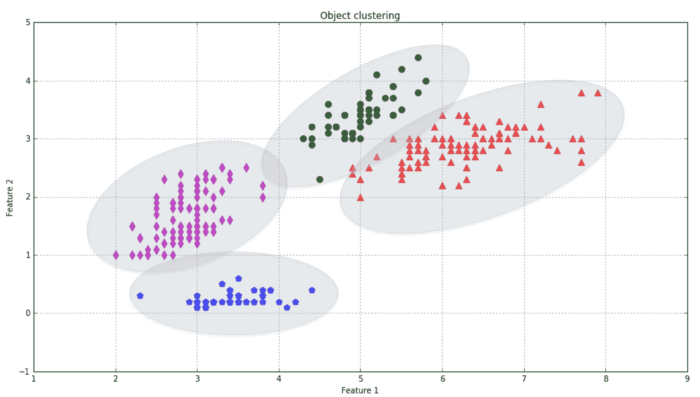

分割成四个聚类的二维数据集示例

在本书中，我们将讨论大量的**硬聚类**技术，其中每个元素必须属于一个单独的聚类。另一种方法称为**软聚类**(有时称为**模糊聚类**)，基于成员分数，该分数定义了元素与每个聚类的兼容程度*。通用聚类函数如下所示:*

*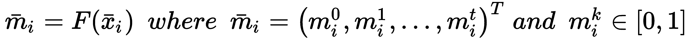

一个向量，*m[I]，代表*x[I]的相对隶属度，通常被归一化为一个概率分布(即总和总是被强制等于 *1* )。在其他情况下，单度保持在 *0* 和 *1* 之间，因此被视为不同的概率。这通常是基础算法的结果。正如我们将在*高斯混合*部分看到的，一个样本隐含地属于所有的分布，因此对于它们中的每一个，我们获得一个相当于隶属度的概率。在大多数情况下，硬聚类是最合适的选择，特别是如果分配的聚类是一条立即用于其他任务的信息。在所有这些情况下，输出为向量的软方法必须转换为单个预测(通常使用运算符*arg max()*)。但是，在某些特定的应用中，软聚类算法的矢量输出被输入到另一个模型中(例如，与其他特征一起)，以便产生不同的最终输出(例如，一组建议项目)。在这些场景中，由于次级选择(即，不是具有最高程度/概率的类)和其他参数之间的潜在关系，具有多个隶属度(也是归一化的)可以提高性能。这种系统的一个例子是推荐引擎。在这些模型中，描述用户的软聚类通常与其他时变信息相关联，并且输出受主导聚类(可以代表用户段)以及次要聚类的影响，次要聚类根据例如用户的导航历史变得越来越重要。**


# k-神经网络

该方法本质上是最简单的算法之一，属于基于实例的学习方法家族。这种通用方法不是基于例如为了最大化可能性而必须拟合的参数化模型。相反，基于实例的算法完全依赖于数据及其底层结构。特别是，k-NN 是一种可以用于不同目的的技术(即使我们将它视为一种聚类算法)，它基于这样一种思想，即就预定义的距离度量而言接近的样本也是相似的，因此它们可以共享其特有的特征。更正式地说，让我们考虑一个数据集:


为了度量相似性，我们需要引入一个距离函数。最常见的选择是闵可夫斯基度量，其定义如下:

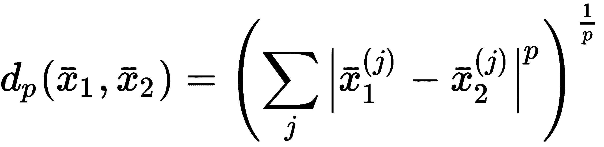

*p = 1，d[1]()*成为曼哈顿(或城市街区)距离，而 *p = 2，d[2][()]*则是经典的欧氏距离。更大的 *p* 值导致更短的测量，对于 *p → ∞，**d[p]()*，收敛到最大分量绝对差，*| x[1]^((k))-x[2]^((k))|*(假设 *k* 为在许多应用中，欧几里德距离是最佳选择；然而，分配给 *p* 的值会影响度量本身的*语义*。实际上，当 *p = 1* 时，所有元件都以同样的方式考虑。这个度量被称为曼哈顿，因为给定两个点，距离相当于一辆汽车沿着一条分段的线移动的路径(就像纽约的出租车一样)。另一方面，增加 *p* 将成比例地减少所有小组件差异的影响，迫使测量仅代表最相关的一个。为 *p* 寻找最合适的值需要对数据集进行预先分析，并掌握完整的领域知识(例如，在特定领域中，两个样本在单个组件中有很大差异，必须视为不相似，而在另一个领域中，欧几里德距离是衡量其相似性的最准确方法)。我总是建议测试不同的值，比较结果，选择最能代表潜在问题结构的一个。

一旦选择了距离函数，就很容易定义邻居。一般来说，采用两种方法。第一种是基于最近邻的数量(这证明了算法的名称)，因此，给定一个样本( *x [i]* )，邻域被定义如下:

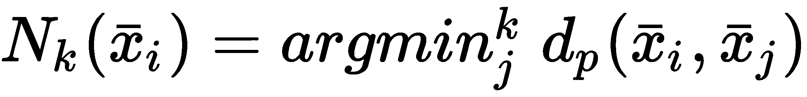

在上式中，*arg min[j]^k()*函数选择与中心距离最小的 *k* 最后一个指标*j**x[I]*。然而，在某些情况下，获得距离小于预定半径的所有邻居的集合是有帮助的， *R* :

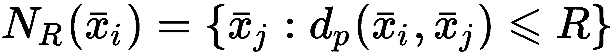

这两种方法完全兼容；然而，只有当数据科学家完全了解距离时，才能使用第二种方法。事实上，对于高维数据集，设置最大邻点数通常比找到正确的半径更简单。然而，这是一个上下文敏感的问题，正确的选择不能轻易概括。

考虑到前面的公式，眼尖的读者应该已经注意到它们效率极低。事实上，如果数据集包含 *n* 个样本*x[I]∈ℜ^m*，由于需要计算所有的两两距离，计算复杂度为 *O(mn ² )* 。出于这个原因， *vanilla* k-NNs 是一个负担得起的选择，但只适用于小的低维集合，而在所有其他情况下，已经设计了更有效的解决方案。

第一种方法是基于一个 **KD 树**，它是一个二叉树到 *m* 维向量的扩展。在每个级别，选择一个特征并进行分割。在下图中，有一个三维示例:

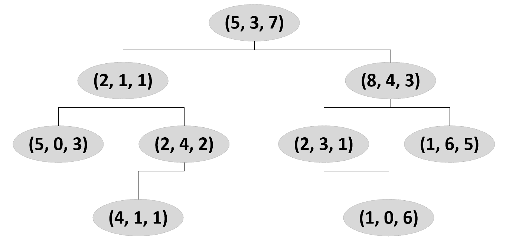

基于三维向量的 KD 树示例

正如可能看到的，第一级是基于第一个特征，等等，直到叶子。如果树是完全平衡的，计算复杂度类似于二进制版本，变成 *O(m log n* *)* 。即使 KD 树在大多数情况下提供了有效的解决方案，它们也容易不平衡，特别是当 *m > > 1* 时，由于*维数灾难*，复杂度趋向于 *O(mn)* 。第一个问题可以通过始终选择与相应子集的中值相对应的特征来缓解，但第二个问题要严重得多，并且在许多情况下，没有实际的解决方案。

另一种方法与基于半径的邻域紧密相关，这是基于一种叫做**球树**的数据结构。一个以样本为中心的球，*x[I]T22，在形式上等价于*N[R](x[I])*，其中 *R* 定义了半径。因此，该树是通过将较小的球(就半径而言)嵌套到较大的球中来构建的，如下图所示:*

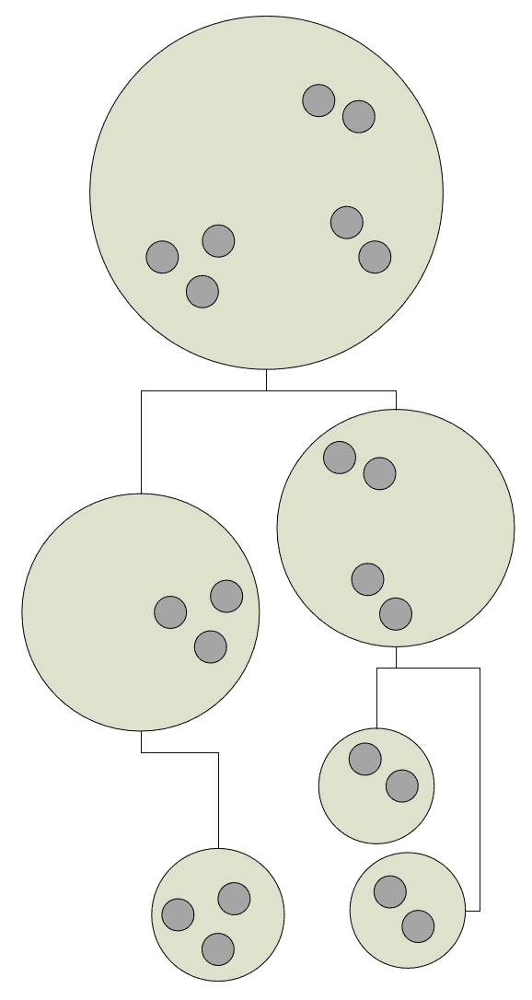

球树示例

样品中极其重要的条件可以属于单个球。这一招即使在*m>1*时，也能保持计算复杂度等于*O(m log n)*。由于球的性质，只需测量点到中心的距离就可以知道它是否属于球。因此，从叶子(最小的球)开始，可以重复这个操作，直到找到正确的球。很明显，当数据集被分割成可以在同一个球中找到的邻居时，这样的数据结构是一个完美的选择。这意味着包含在树叶中的样本数量不能太小，因为这增加了树的深度，并且可以导致搜索扩展到更多的节点(特别是，当邻居的数量固定时)。显然，相反的情况(节点有太多样本)非常类似于香草算法，这种方法的大部分优势都丧失了。叶片大小的选择与问题密切相关。让我们假设一个应用基于由 *Nk* 个查询组成的循环，每个循环需要 *1 k = 10* 个查询和 *20 k = 30* 个查询。在这种情况下，如果叶大小接近 30(稍小或稍大)，第二个查询块的计算成本可以显著降低。即使第一个查询被扣分，更复杂的部分也会被简化。读者应始终考虑实际应用，选择负面影响最小的应用。在任何情况下，都很难找到在任何情况下都是最佳的叶子大小，并且在大多数现实生活场景中，需要进行权衡。

为了测试这个算法，我们将使用 MNIST 手写数字数据集，它可以在`scikit-learn`库中找到。与原始版本相反，在这种情况下，有 1，797 个灰度 8 × 8 图像表示从 0 到 9 的数字。我们的目标是使用 k-NNs 对它们进行聚类，然后找到噪声样本的邻居。第一步通常包括加载和缩放数据集:

```
from sklearn.datasets import load_digits
from sklearn.preprocessing import StandardScaler

digits = load_digits()

ss = StandardScaler(with_std=False)
X = ss.fit_transform(digits['data'])
```

我们选择在`StandardScaler`实例中设置`with_std=False`属性，以便将流程限制在平均值以内。对样本进行缩放后，这些值被限制在-1.0 和 1.0 之间。

此时，我们可以用`algorithm='ball_tree'`、`n_neighbors=25`和`leaf_size=30`实例化`NearestNeighbors`类。作为练习，我邀请读者修改这些参数，并用不同的查询对性能进行基准测试(例如，当叶大小为 30 时，可以比较 1，000 k = 10 个查询和 1，000 k = 100 个查询的计算时间):

```
from sklearn.neighbors import NearestNeighbors

knn = NearestNeighbors(algorithm='ball_tree', n_neighbors=25, leaf_size=30)
knn.fit(X)
```

一旦模型被拟合，我们期望属于同一类的数字将具有非常短的距离，并且特别地，当数字是手写的时，变形围绕平均值均匀地分布(平均值应该是每个特定数字的完美表示)。因此，我们希望用一个新的样本来查询模型，该样本是通过将高斯噪声应用于现有样本而获得的:

```
import numpy as np

X_noise = X[50] + np.random.normal(0.0, 1.5, size=(64, ))
```

原版本(代表 a 2)和吵杂的如以下截图所示:

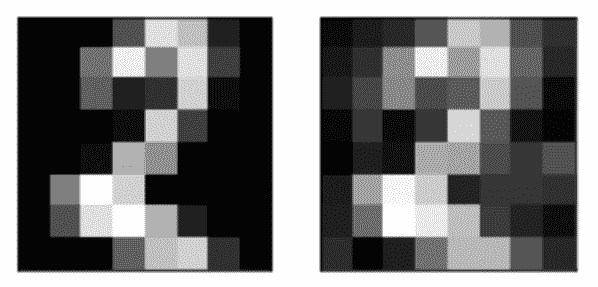

原始数字(左)和噪声版本(右)

我们现在可以使用`kneighbors`函数来检索样本的 25 个最近邻(该函数返回索引，而不是样本本身)。如果缺少`n_neighbors`属性，将使用默认值(在构造函数中声明)。此外，设置`return_distance=True`属性还允许我们以升序获得距离:

```
distances, neighbors = knn.kneighbors(X_noise.reshape(1, -1), return_distance=True)

print(distances[0])

[ 11.12060333  20.28609914  23.02542331  27.44598861  27.59396014

  29.31642387  30.05927362  31.04779967  31.67898264  32.00076453

  32.9237453   33.12438956  33.77814375  34.09565415  34.16874265

  34.36520324  34.59085311  35.12394042  35.37141415  35.42838394

  35.59343185  35.72420622  35.79115518  35.86460867  36.07930963]
```

由于噪音的影响，最小的距离并不是很小，但是它有助于绘制样本，以便我们确认结果:

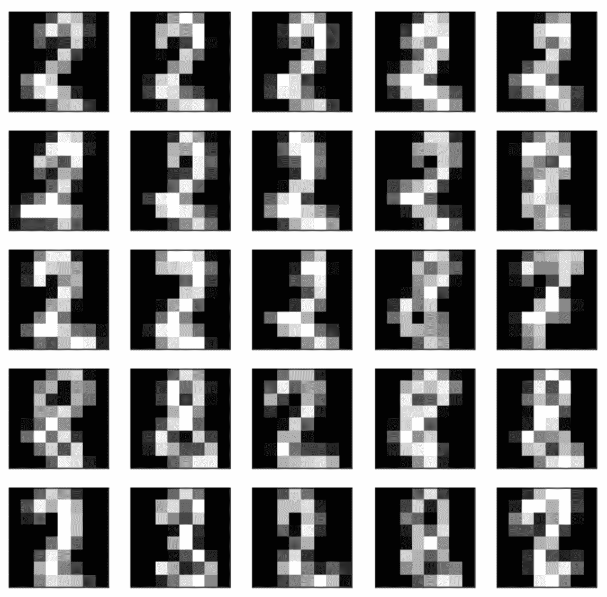

噪声样本的最近邻

该集合还包含一些虚假数字(特别地，属于类别 8 和 3)，但是该算法成功地找到了足够多的相似样本。该示例显示了过程的简单性，并强调了距离度量函数的重要性，这是唯一真正的区分元素。在这种特殊情况下，欧几里德距离非常有效，但在某些情况下，结果可能会更糟。特别是，这可能是当样本的复杂性导致相似的距离时，即使存在很大的差异。我邀请读者使用 Olivetti Faces 数据集(可在`scikit-learn`库中获得)重复这个例子，添加一些噪声或从训练过程中排除一个测试人脸。理解 k-NN 何时是可靠的是许多机器学习领域(例如，推荐引擎)中最重要的任务之一，因此用户必须意识到两个特征向量之间的相似性可以通过使用距离函数来获得的所有情况，以及相反何时需要更复杂的步骤(例如，在自然语言处理中，不能比较两个单词，考虑到它们的 ASCII 或 UTF 表示和诸如 Word2Vec 的算法已经被设计来有效地解决这个问题)。


# 高斯混合

假设我们有一个由从数据生成过程中提取的*n*m 维点、 *p [数据]* 组成的数据集:


在许多情况下，可以假设斑点(即最密集和最分离的区域)围绕一个平均值对称(通常，每个轴的对称性不同)，因此它们可以表示为多元高斯分布。在这种假设下，我们可以想象每个样本的概率是作为由均值向量、*μ[j]和协方差矩阵、*σ[I]参数化的 *k* (聚类数)多元高斯的加权和获得的:**

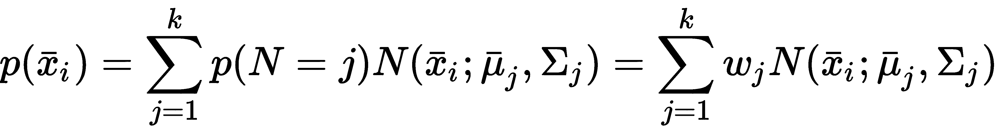

这个模型被称为**高斯混合**，既可以作为软聚类算法，也可以作为硬聚类算法。前一种选择显然是*固有的*方式，因为每个点都与一个概率向量相关联，该概率向量表示每个聚类(即每个高斯分布)的隶属度。然而，在许多情况下，最好应用一个*arg max()*函数来获得最可能的聚类。正如我们将在下一节中讨论的，这种选择导致了另一个非常著名的算法 K-means 的行为(这一点也不奇怪，高斯混合也被称为**软 K-means** )。

在前面的公式中，项*p(N = j)= w[j]是每个高斯的相对权重(它们的总和必须等于 *1* ，因为我们要表示一个概率分布)，因此必须学习的参数是 *k* 权重、 *k* 均值向量和 *k* 协方差矩阵。考虑到[第 2 章](dd32b61f-bc53-4e94-8c17-d5910a8e528d.xhtml)、*中讨论的统计学习介绍，机器学习*中的重要元素，读者应该已经明白寻找参数的最佳方法是**最大似然估计** ( **MLE** )。事实上，从随机值开始，我们希望调整权重、均值和协方差，以提高模型生成每个样本的概率。所以解决这个问题的标准方式是基于 em 算法，需要很多计算(整个推导可以在*掌握机器学习算法*、 *Bonaccorso G* 、 *Packt 出版*、 *2018* 中找到)。由于复杂性不是微不足道的，我们省略了证明，直接显示最终结果(这是非常容易计算的)。*

为了简单起见，让我们将所有的参数组合成一个向量 *θ=(w [j] ，μ [j] ，σ[j])，*并且让我们假设一个序列，*θ[0]→θ[1]**→...→θ[t]→θ*→*∞*，从一个随机的初始猜测开始， *θ* [*0*] 经过足够多的步后收敛到最优值， *θ [∞]* ，使可能性最大化。这是 EM 算法遵循的迭代方法，因此我们将用 *θ [t]* 来表示时间 *t* 时的通用参数集。而且，我们定义一个高斯的概率， *j* ，给定一个样本， *x [i]* ，参数集， *θ [t]* ，为*p(j | x[I]；θ [t] )* 。迭代后每个参数的一般值 *t* 如下:

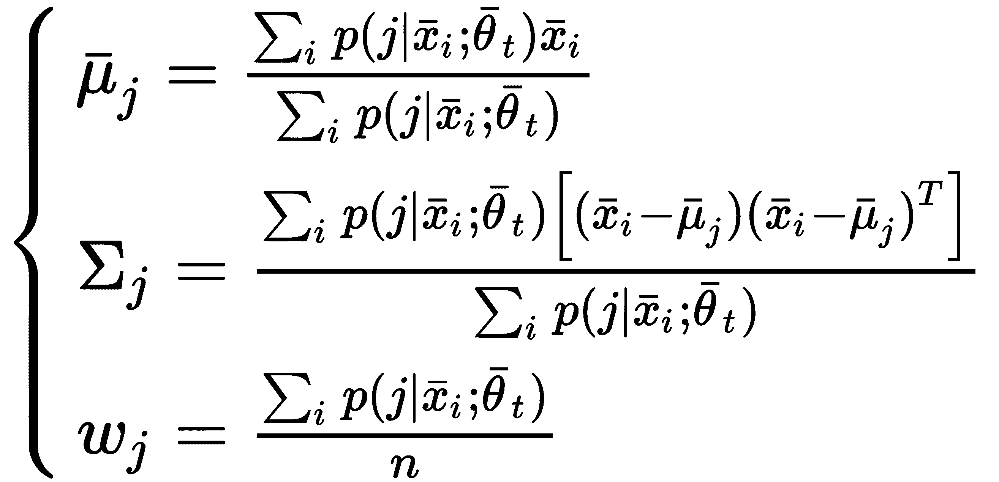

每次迭代都是基于对 p(j|x [i] 的计算；θ [t] *)* ，利用贝叶斯定理很容易得到:

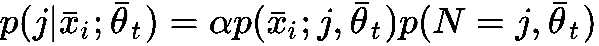

右侧的第一项是高斯分布下样本的概率， *j* ，而第二项是高斯分布的相对权重， *j* ，假设参数设置为 *θ [t]* 。一旦计算出这个概率，就有可能获得参数的新值(协方差必须在均值之后计算，因为它需要)。重复该过程，直到收敛或者在设置了最大迭代次数之后。在一般情况下，这也是默认情况，协方差矩阵是独立的，没有施加对角约束。然而，scikit-learn 允许设置`covariance_type`属性(默认值为`full`，但用户也可以选择`tied`，这将强制所有高斯函数共享同一个协方差矩阵`diag`，这将强制对角化条件(不相关协方差)和`spherical`，其中协方差矩阵退化为单个方差。

在本例中，我们将创建一个合成的二维数据集，其中包含三个部分重叠的斑点:

```
from sklearn.datasets import make_blobs

nb_samples = 800

X, Y = make_blobs(n_samples=nb_samples, n_features=2, centers=3, cluster_std=2.2, random_state=1000)
```

下图显示了数据集的曲线图:

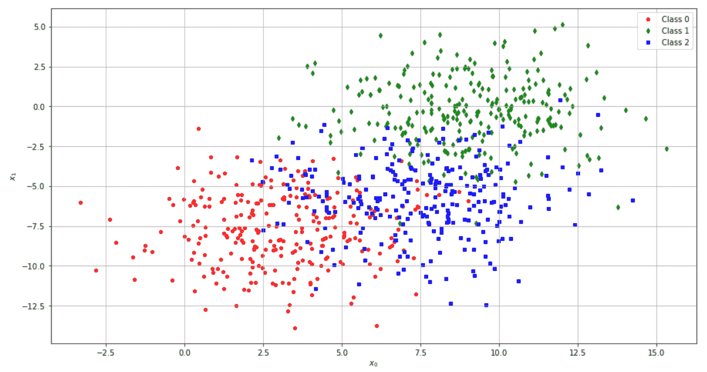

高斯混合聚类数据集

我邀请读者直接使用前面的公式实现算法；然而，在这种情况下，我们将使用 scikit-learn 实现`GaussianMixture`和`n_components=3`(我们期望生成三个高斯分布)和`max_iter=1000`。我们保留默认的全协方差，因为我们不想对最终矩阵施加任何限制:

```
from sklearn.mixture import GaussianMixture

gm = GaussianMixture(n_components=3, max_iter=1000, random_state=1000)
gm.fit(X)
```

一旦模型被拟合，我们可以通过使用实例变量`means_` *、* `covariances_`和`weights_`来检查均值、协方差和权重:

```
print(gm.means_)

[[ 2.98469906 -7.43734851]

 [ 9.07336044 -0.42240226]

 [ 7.73445792 -6.05424097]]

print(gm.covariances_)

[[[ 4.11923384  0.46244723]

  [ 0.46244723  5.99491645]]

 [[ 4.7835118   0.07778618]

  [ 0.07778618  4.70847923]]

 [[ 4.16916545  0.41469122]

  [ 0.41469122  5.52496132]]]

print(gm.weights_)

[ 0.34896872  0.34073081  0.31030047]
```

可以看出，三个最终高斯分布几乎是去相关的，我们可以绘制它们，假设对角元素为零。结果如下图所示:

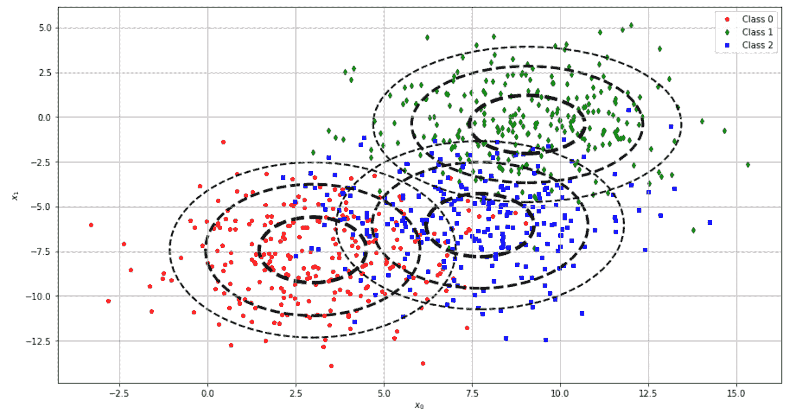

具有最后三个高斯分布的数据集

结果证实了数据生成过程可以近似为高斯混合的假设(在本章的最后，读者还将学习如何在已知基本事实的情况下测量聚类的质量)。现在，让我们检查两个测试点的概率:

```
import numpy as np

X_test_1 = np.array([10.0, -2.5])
print(gm.predict_proba(X_test_1.reshape(1, -1)))

[[ 0.00078008  0.76294815  0.23627177]]

X_test_2 = np.array([5.0, -6.0])
print(gm.predict_proba(X_test_2.reshape(1, -1)))

[[ 0.5876569   0.00776548  0.40457762]]
```

在第一种情况下，样本相对于顶部聚类具有 76%的隶属度，相对于中心聚类具有 23%的隶属度(检查均值以进行确认)。这种*不对称*是由于顶部高斯的较高方差，这迫使分布捕捉更多的潜在异常值。相反，在第二种情况下，该点位于下高斯和中高斯之间的边界上，前者的可能性更大。在这两种情况下，都有可能看到如何使用软聚类方法来管理存在内在不确定性的情况。在一些特定的应用中，两个测试点可以代表边界样本，该边界样本可以与它们的程度成比例地继承两个分配的聚类的共同特征。例如，在推荐系统中，属于多个聚类的用户向量可以以与其隶属度成比例的概率接收来自每个聚类的建议。


# 寻找组件的最佳数量

当所需的组件数量未知或没有具体限制时，有必要评估不同的模型，以决定哪种配置是最佳的。由于高斯混合是一种基于最大似然的模型，**阿凯克信息准则** ( **AIC** )提供了一种有用的方法。假设参数总数为 *n [p]* (当然，我们不考虑超参数，只考虑均值、协方差和权重)，拟合模型后达到的最大对数似然为 *L [opt]* 。如果是这种情况，那么 *AIC* 定义如下:

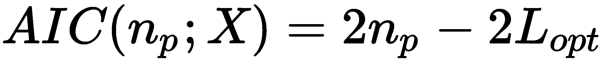

当它考虑负对数似然时， *AIC* 越小，分数越高。然而，与仅基于可能性的方法相反， *AIC* 基于奥卡姆剃刀原理，并且用非常大量的参数惩罚模型。因此，最佳值总是 MLE 和复杂度之间的折衷。另一个类似的方法是**贝叶斯信息准则** ( **BIC** )，它也考虑了训练样本的数量 *n* :

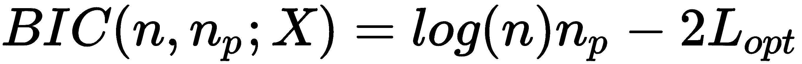

这两种方法的主要区别在于罚款，通常 *BIC* 的罚款更高，这迫使人们选择更简单的型号。在许多情况下，这两个指数表现出相似的性质；然而，已经证明 *AIC* 通常更可靠，即使它通常需要大量样本以避免过度拟合。另一方面，当训练样本的数量足够大时(理论上，当 *n → ∞* 时)，BIC 的最小值对应于一个模型，该模型的概率分布 *p [m]* 满足*D[KL](p[m]| | p[数据【T28)→0]*。换句话说， *BIC* 保证找到一个可以完美重现数据生成过程的模型。

为了更好地理解这一点，让我们考虑先前定义的数据集和一组不同数量的组件来计算这两个值:

```
nb_components = [2, 3, 4, 5, 6, 7, 8]

aics = []
bics = []

for n in nb_components:
    gm = GaussianMixture(n_components=n, max_iter=1000, random_state=1000)
    gm.fit(X)
    aics.append(gm.aic(X))
    bics.append(gm.bic(X))
```

下图显示了这两个指数的曲线图:

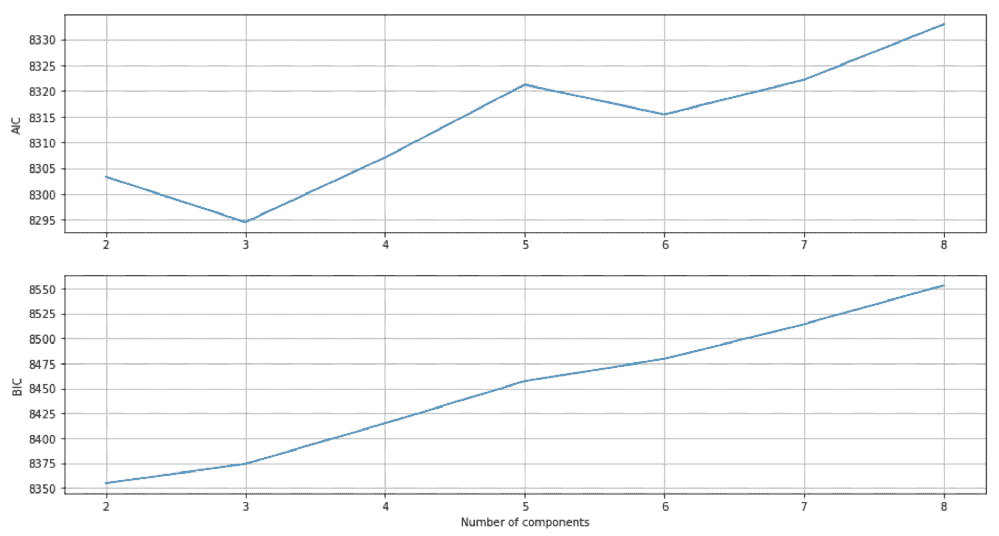

AIC 指数(上图)和 BIC 指数(下图)是组件数量的函数

**AIC** 有一个最小值对应 **3** 组件(这是地面实况)。另一方面， **BIC** 的惩罚项(与 *log(800) ≈ 6.7* 成比例，而不是 **2** )不允许你达到同样的最小值。然而，可以看到斜率的微小变化，这表明当组件的数量大于 **3** 时，产生的 **BIC** 增加得更快。我建议在分析 BIC 之前先分析 AIC，如果有小的差异，则选择 AIC 提供的最小值，除非训练样本的数量非常少。如果数据科学家至少对基本事实有部分了解，那么研究就可以直接在预期数量的组件附近进行。否则，较简单的模型通常比复杂的模型更可取(就参数的数量而言),以避免簇间分离的损失(例如，在我们的例子中，6 个高斯分布的混合必然需要将斑点分成两个部分重叠的部分)。


# k 均值

在上一节中，我们讨论了一种基于数据生成过程可以表示为多元高斯分布的加权和的假设的算法。当协方差矩阵向零收缩时会发生什么？很容易想象，当*σ[I]→0*时，相应的分布退化为以平均值为中心的狄拉克δ。换句话说，如果样本非常接近均值，概率将几乎变为 *1* ，否则变为 *0* 。在这种情况下，分类的成员资格变为二元，并且仅由样本和平均值之间的距离决定(最短的距离将决定获胜的分类)。

K-means 算法是高斯混合的自然硬扩展，其特点是 *k* (预定)**质心**或**表示**(名副其实):

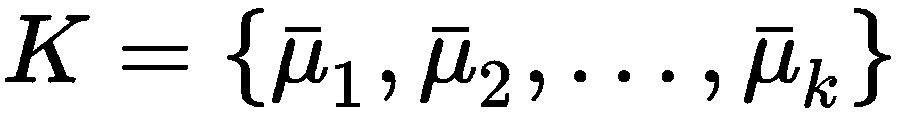

类似于高斯混合，该算法的目标是找到最佳质心，以便最大化以下各项:

*   聚类内凝聚力
*   簇间分离

换句话说，我们希望找到一种方法，使得属于同一聚类的所有点彼此之间的距离比与任何其他点之间的距离都要近，同时，属于不同聚类的最近点之间的最短距离总是大于最大聚类内距离。

这个过程是迭代的，从随机猜测质心开始。在每一步，计算每个样本和每个质心之间的距离，并将该样本分配给距离最小的聚类。这种方法通常被称为**最小化聚类的惯性**，定义如下:

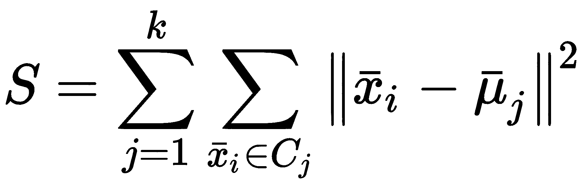

考虑到前面的公式，可以理解当 *S* 很大时，内部内聚力很低，这可能是因为太多的点被分配给了质心很远的簇。在一定程度上，前一个可以认为是一个成本函数，因为它的最小化对应于原问题的解。然而，正如我们将在下一节中讨论的那样，惯性与聚类的数量密切相关，因此，在给定某个问题结构的情况下，它可以用来为 *k* 选择最佳值(例如，如果 *k = n* ，每个点代表一个聚类，而 *S = 0* ，但显然这是一种不期望的情况)。

一旦处理了所有的样本，计算一组新的质心， *K ^((t))* (现在考虑属于该聚类的实际元素)，并且重新计算所有的距离。该算法(正式名称为**劳埃德算法**)在达到所需公差时停止，或者换句话说，在质心变得稳定时停止，因此惯性最小。当然，这种方法对初始条件相当敏感，并且已经研究了一些方法来提高收敛速度。

其中一种叫做**K-means++**(*K-Means 类型算法的鲁棒种子选择算法*， *Karteeka Pavan K* )。阿拉姆·阿帕·拉奥。，*和斯里达尔 G.R* 。，*国际计算机科学与信息技术杂志 3* ，*第 5 期*，*10 月 30 日*， *2011* )，选取初始质心，使其在统计上接近最终质心。这个数学解释在*掌握机器学习算法，Bonaccorso G* 中讨论。、 *Packt 出版*、*2018*；然而，这种方法是 scikit-learn 的默认选择，并且通常是用这种算法可以解决的任何聚类问题的最佳选择。一般情况下，考虑到随机性，该过程重复固定次数(在 scikit-learn 中，可以考虑参数`n_init`设置该值，其默认值为 10)，选择惯性最低的配置作为初始猜测。

现在，让我们考虑一个数据集类似于高斯混合数据集的示例(该示例非常简单，以便能够立即直观地确认结果):

```
from sklearn.datasets import make_blobs

nb_samples = 1000
X, _ = make_blobs(n_samples=nb_samples, n_features=2, centers=3, cluster_std=1.5, random_state=1000)
```

由于每个斑点的标准偏差，我们期望有三个具有二维特征和部分重叠的聚类。在我们的例子中，我们不会使用 *Y* 变量(它包含预期的聚类),因为我们只想生成一组局部一致的点来测试我们的算法。

结果图如下图所示:

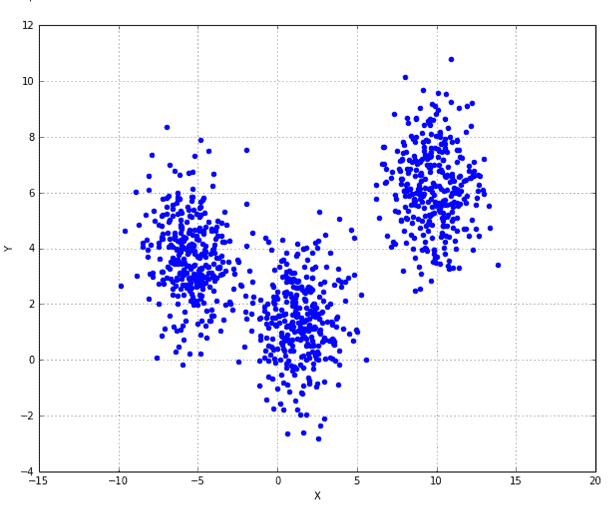

包含三个斑点的数据集

使用不同的随机种子可以获得稍微不同的数据集。然而，`make_blobs()`函数的最终结果只受到部分影响，聚类数应该保持等于 3。

在这种情况下，问题很容易解决，因此我们期望 K-means 在[-5，0]之间有界的区域 *X* 中以最小误差分离三个组。保留默认值，我们得到以下结果:

```
from sklearn.cluster import KMeans

km = KMeans(n_clusters=3)
km.fit(X)

KMeans(algorithm='auto', copy_x=True, init='k-means++', max_iter=300,
    n_clusters=3, n_init=10, n_jobs=1, precompute_distances='auto',
    random_state=None, tol=0.0001, verbose=0)

print(km.cluster_centers_)

[[ 1.39014517,  1.38533993]
 [ 9.78473454,  6.1946332 ]
 [-5.47807472,  3.73913652]]
```

使用三种不同的标记重新绘制数据，可以验证 K-means 是如何成功分离数据的:

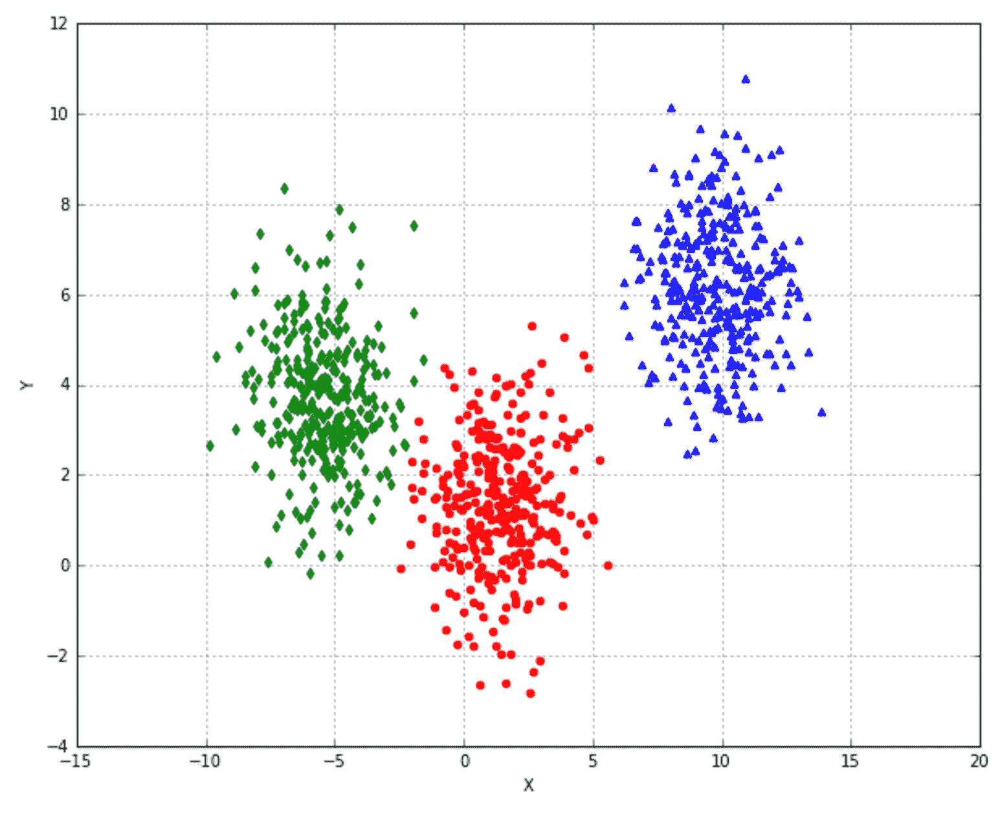

使用 K-means 算法聚类的数据集

在这种情况下，分离是非常容易的，因为 K-means 是基于欧氏距离的，欧氏距离是径向的，因此聚类应该是凸的。当这种情况没有发生时，使用这种算法就不能解决问题。很多时候，即使不完全保证凸性，K-means 也能产生很好的结果，但是有几种情况下，期望聚类是不可能的，让 K-means 找出质心会导致完全错误的解。

让我们考虑同心圆的情况。scikit-learn 提供了一个生成此类数据集的内置函数:

```
from sklearn.datasets import make_circles

nb_samples = 1000
X, Y = make_circles(n_samples=nb_samples, noise=0.05)
```

该数据集的图如下图所示:

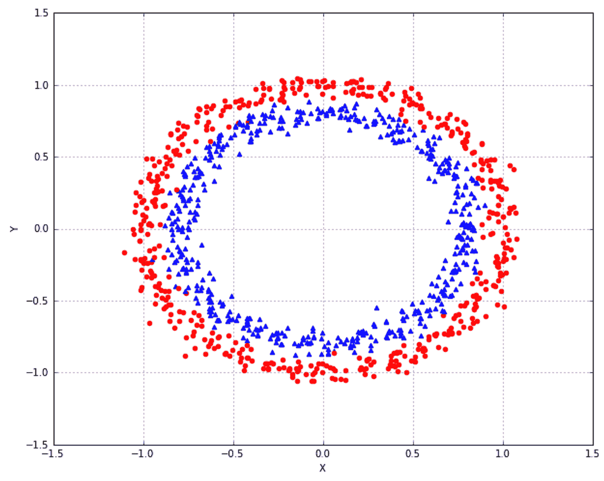

非凸数据集的示例

我们希望有一个内部聚类(对应于用三角形标记描绘的样本)和一个外部聚类(用点描绘)。但是，这样的集合不是凸的，K-means 也不可能正确分离(均值应该是一样的！).事实上，假设我们尝试对算法应用两个聚类:

```
km = KMeans(n_clusters=2)
km.fit(X)

KMeans(algorithm='auto', copy_x=True, init='k-means++', max_iter=300,
    n_clusters=2, n_init=10, n_jobs=1, precompute_distances='auto',
    random_state=None, tol=0.0001, verbose=0)
```

我们得到了下图所示的分离:

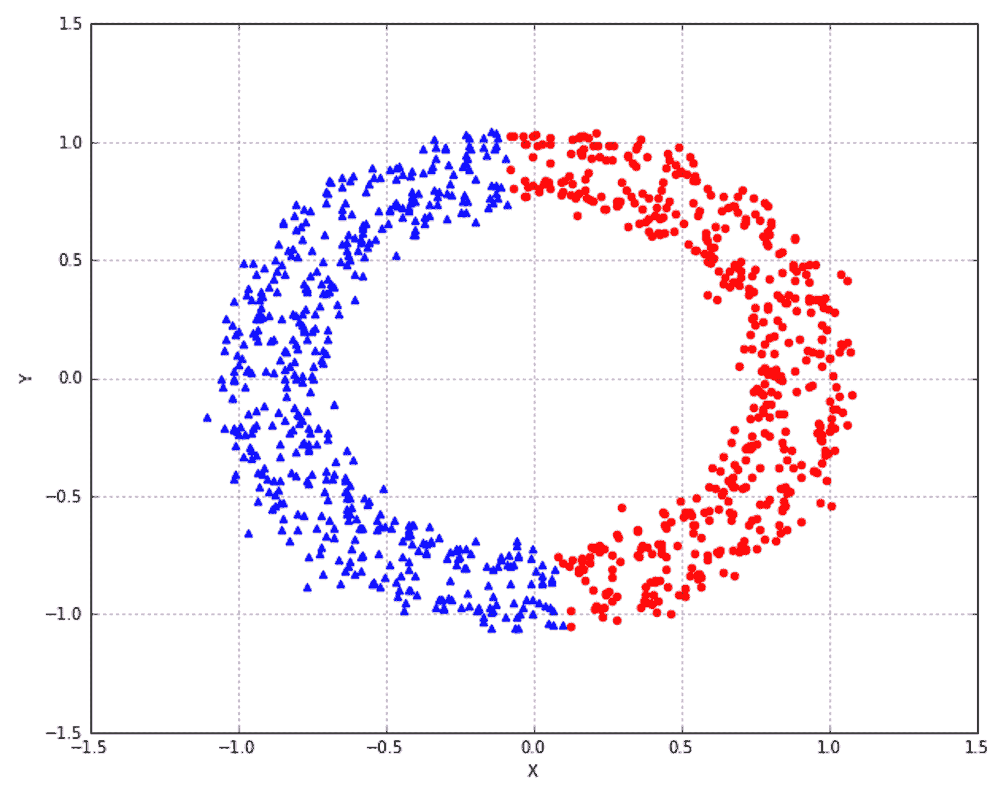

使用 K-均值聚类的非凸数据集

正如预期的那样，K-means 收敛在两个半圆中间的两个质心上，得到的聚类与我们预期的完全不同。而且，如果样本必须根据离共同中心的距离被认为是不同的，这个结果将导致完全错误的预测。很明显，数据集的凸性是一个基本条件，只要不满足，K-means(以及高斯混合)将无法正确聚类。在所有这些情况下，必须选择另一种解决方案。在下一章[第 10 章](e7ec070a-9bfa-46e4-8d90-93526c8144f3.xhtml)，*高级聚类*中，我们将讨论几个对这个问题不敏感的算法，可以以更精确的方式对更复杂的数据集进行聚类。另一方面，当维数较高时，评估凸性并不是一项简单的任务，因此有必要使用本章末尾描述的方法之一来评估聚类性能。不幸的是，它们可以产生有价值的结果，但只有当基本事实是可访问的(即，训练样本的标签必须是已知的)时。在所有其他情况下，有必要执行更复杂的评估，考虑随机选择的样本和它们的相对分配的相似性。在嵌套圆的情况下，很容易验证，当从每个聚类中选取 *N* 对随机样本时，它们之间的平均距离远低于平均真实聚类内距离。例如，看看下面的内容:

```
import numpy as np

from scipy.spatial.distance import pdist

true_distances = pdist(X[Y == 0], metric='euclidean')
print(np.mean(true_distances))

1.281

Y_pred = km.predict(X)
sampled_X = np.random.choice(X[Y_pred == 0, 0], replace=False, size=300).astype(np.int32)

distances = pdist(X[sampled_X], metric='euclidean')

print(np.mean(distances))

0.175
```

在这种特殊情况下，平均簇内距离等于`0.175`(相对于`1.281`的基本事实)意味着没有正确处理非凸性。事实上，平均而言，属于同一直径的两个点的距离应该大于`0.175`(请参见前面的图进行确认)。显然，只有当数据科学家对数据集结构有清晰的理解时，才能采用这种方法，但是为了理解 K-means 的局限性和其他算法的优势，这是一个很好的练习。


# 寻找最佳的聚类数

K-means 最常见的缺点之一与最佳聚类数的选择有关。过小的值将确定包含异类元素的大型分组，而过大的值将导致难以识别聚类之间的差异。因此，我们将讨论一些方法，这些方法可以用来确定适当的分割数量，并评估相应的性能。


# 优化惯性

我们要考虑的第一种方法是基于这样的假设，即适当数量的星系团必须产生一个小的惯性。但是，当聚类数等于样本数时，该值达到最小值(0.0)。所以不能找最小值，要找一个在惯性和合理的簇数之间权衡的值。

假设我们有一个包含 1，000 个元素的数据集(比如上一个示例中使用的数据集):

```
nb_samples = 1000
X, _ = make_blobs(n_samples=nb_samples, n_features=2, centers=3, cluster_std=1.5, random_state=1000)
```

我们可以计算并收集不同数量的聚类的惯性(scikit-learn 将这些值存储在`inertia_`实例变量中):

```
from sklearn.cluster import KMeans

nb_clusters = [2, 3, 5, 6, 7, 8, 9, 10]

inertias = []

for n in nb_clusters:
    km = KMeans(n_clusters=n)
    km.fit(X)
    inertias.append(km.inertia_)
```

绘制这些值，我们会得到下图所示的结果:

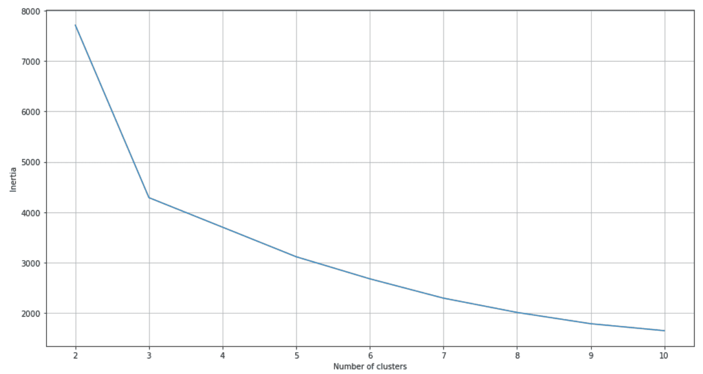

惯性作为聚类数量的函数

正如你所看到的，在 **2** 和 **3** 之间有一个戏剧性的减少(初始惯性大约是**8000**，增加一个单独的聚类允许我们将其减少到大约**4000**)，然后曲线开始降低斜率。我们想找到一个值，如果减少，会导致很大的惯性增加，如果增加，会产生很小的惯性减少。因此，较好的选择可能是 **4** 或 **5** ，而较大的值可能会产生不必要的簇内分裂(直到每个点变成单个簇的极端情况)。另一方面，对于 *k = 4* ，惯性约为 3800，因此没有理由拒绝判定的基础事实的先验知识(对应于 *k = 3* )。然而，让我们假设我们没有任何先验信息，让我们保留潜在值 **3** 、 **4** 和 **5** (可能性较小)。

这种方法非常简单，可以作为确定潜在范围的第一种方法。一般来说，最佳值总是一个权衡，因为惯性单调下降，因此决定使用该方法的数据科学家总是必须从关于潜在聚类数的最少知识开始，并选择一个接近它的值。以下策略更复杂，可用于查找最终的聚类数。


# 剪影分数

剪影评分基于*最大内聚力和最大聚类分离*的原则。换句话说，我们希望找到将数据集细分为彼此分离的密集块的聚类数。这样，每个聚类将包含非常相似的元素，并且选择属于不同聚类的两个元素，它们的距离应该大于最大聚类内距离。

在定义了距离度量(欧几里德通常是一个好的选择)之后，我们可以计算每个元素的平均类内距离:

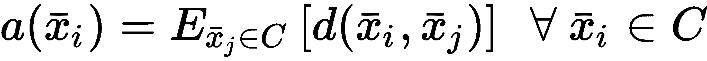

我们还可以定义平均最近簇距离(对应于最低簇间距离):

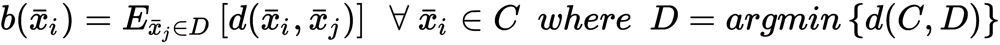

元素的轮廓分数*x[I]定义如下:*

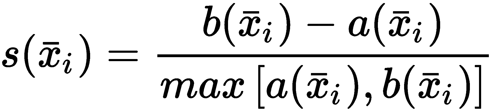

该值介于 *-1* 和 *1* 之间，解释如下:

*   接近 *1* 的值是好的( *1* 是最佳条件)，因为这意味着*a(x[I])<<b(x[I])*
*   接近 *0* 的值意味着类内和类间度量之间的差异几乎为零，因此存在类重叠
*   接近 *-1* 的值意味着样本已经被分配到错误的组，因为*a(x[I])>>b(x[I])*

scikit-learn 允许您计算平均轮廓分数，以便对不同数量的聚类有一个即时的概述:

```
from sklearn.metrics import silhouette_score

nb_clusters = [2, 3, 5, 6, 7, 8, 9, 10]

avg_silhouettes = []

for n in nb_clusters:
    km = KMeans(n_clusters=n)
    Y = km.fit_predict(X)
    avg_silhouettes.append(silhouette_score(X, Y))
```

相应的曲线如下图所示:

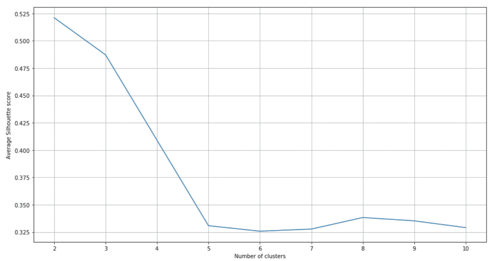

作为聚类数量的函数的平均轮廓分数

排除选项 *k = 2* ，最佳值为 **3** (与地面真相相对应，即使有少量重叠和错误赋值)。在 **2** 和 **5** 之间，分数降至最低，因此不再考虑 **5** 是有意义的。然而，在 **3** 和 **4** 之间的最终决定不是立即做出的，还应考虑数据集的性质进行评估。轮廓分数，连同基础事实，表明有三个密集聚集体(没有基础事实，单个聚类可以被认为是最佳选择)，但是惯性图表明它们中的一个(至少)可能被分成两个聚类。为了更好地理解聚类是如何工作的，还可以绘制轮廓图，显示所有聚类中每个样本的排序分数。在下面的代码片段中，我们为等于`2`、`3`、`4`和`8`的多个聚类创建了图:

```
import matplotlib.pyplot as plt
import matplotlib.cm as cm

from sklearn.metrics import silhouette_samples

fig, ax = plt.subplots(2, 2, figsize=(15, 10))

nb_clusters = [2, 3, 4, 8]
mapping = [(0, 0), (0, 1), (1, 0), (1, 1)]

for i, n in enumerate(nb_clusters):
    km = KMeans(n_clusters=n)
    Y = km.fit_predict(X)

    silhouette_values = silhouette_samples(X, Y)

    ax[mapping[i]].set_xticks([-0.15, 0.0, 0.25, 0.5, 0.75, 1.0])
    ax[mapping[i]].set_yticks([])
    ax[mapping[i]].set_title('%d clusters' % n)
    ax[mapping[i]].set_xlim([-0.15, 1])
    ax[mapping[i]].grid()
    y_lower = 20

    for t in range(n):
        ct_values = silhouette_values[Y == t]
        ct_values.sort()

        y_upper = y_lower + ct_values.shape[0]

        color = cm.Accent(float(t) / n)
        ax[mapping[i]].fill_betweenx(np.arange(y_lower, y_upper), 0, 
                                     ct_values, facecolor=color, edgecolor=color)

        y_lower = y_upper + 20
```

使用`silhouette_values`函数计算每个样本的轮廓系数(该函数总是限制在 *-1* 和 *1* 之间)。在这种情况下，我们将图表限制在`-0.15`和`1`之间，因为没有更小的值。然而，在限制之前检查整个范围是很重要的。

结果输出如下图所示:


聚类 2、3、4 和 8 的轮廓图

每个轮廓的宽度与属于特定聚类的样本数成比例，其形状由每个样本的分数决定。一个理想的地块应该包含同类地块，没有不对称性。轮廓应该很长，没有尖锐的峰(它们必须类似于梯形而不是三角形)，因为我们希望在同一聚类中的样本之间具有非常低的分数差异。理想的形状更像雪茄，而次优的形状看起来像刀片。

对于 **2** 簇，形状是可以接受的，但是一个簇比另一个簇大，我们知道这是不太可能的情况。在对应于 8 个聚类的图中示出了完全不同的情况。所有的轮廓都是三角形的，它们的最高分略大于 0.6。这意味着所有的聚类都是内部一致的，但是分离是不可接受的。有了三个聚类，剧情几乎完美，除了第三个剪影的宽度(有点太尖锐，但比其他任何配置都好)。

如果没有进一步的度量标准，我们可以认为这个数字是最佳选择(这也可以通过平均分数得到证实)，但是群集数量越多，惯性就越低。对于 4 个聚类，情节稍差，两个轮廓的最高得分约为 0.5。这意味着两个聚类是完全一致和分离的，而其余两个是相当一致的，但它们可能没有很好地分离。现在，我们应该在 3(目前的最佳选择)和 4 之间做出选择。下面的方法将帮助我们消除所有的疑虑。


# 卡林斯基-哈拉巴斯指数

另一种基于密集且分离良好的聚类概念的方法是卡林斯基-哈拉巴斯指数。要构建它，我们首先需要定义聚类间的分散性。如果我们有 *k* 个具有相对质心和全局质心的簇，则簇间离差或簇间离差 ( **BCD** )的**定义如下:**

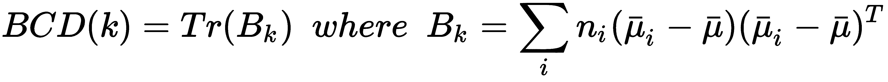

在前面的表达式中， *n [i]* 是属于该聚类的元素的数量， *i* ， *μ* 是全局质心，*μ[I]是聚类 *i、*的质心，*Tr()*是一个方阵的迹。组内离差或组内离差 ( **WCD** )定义如下:*

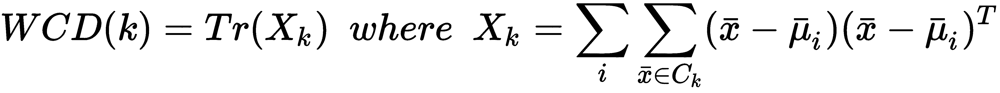

卡林斯基-哈拉巴斯指数定义为 *BCD(k)* 和 *WCD(k)* 之间的比值:

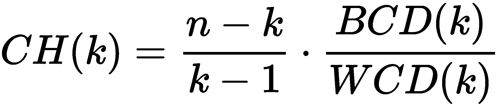

当我们寻找低的簇内分散(密集的聚集体)和高的簇间分散(分离良好的聚集体)时，我们需要找到使该指数最大化的簇的数量。我们可以用类似于我们已经对轮廓分数所做的方式来获得一个图表:

```
from sklearn.metrics import calinski_harabaz_score

nb_clusters = [2, 3, 5, 6, 7, 8, 9, 10]

ch_scores = []

for n in nb_clusters:
    km = KMeans(n_clusters=n)
    Y = km.fit_predict(X)
    ch_scores.append(calinski_harabaz_score(X, Y))
```

结果图如下图所示:

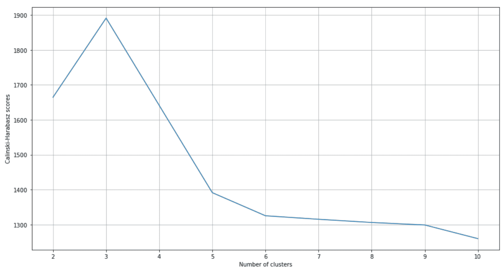

卡林斯基-哈拉巴斯指数是聚类数的函数

正如所料，使用 **3** 群集获得了最高值(大约 1900)，而 **4** 群集产生了大约 1650 的值。仅考虑这种方法，毫无疑问最佳选择是 **3** ，即使 **4** 仍然是一个合理的数值。让我们考虑最后一个策略，它评估整体稳定性。


# 团簇不稳定性

另一种方法基于*团簇稳定性:概述*，*冯·卢克斯堡大学*中定义的团簇不稳定性概念。2010 年 7 月 7 日。直觉上，如果同一数据集的扰动版本产生非常相似的结果，我们可以说聚类方法是稳定的。更正式地说，如果我们有一个数据集， *X* ，我们可以定义一组 *X [n]* 的 *m* 扰动(下采样或噪声)版本:

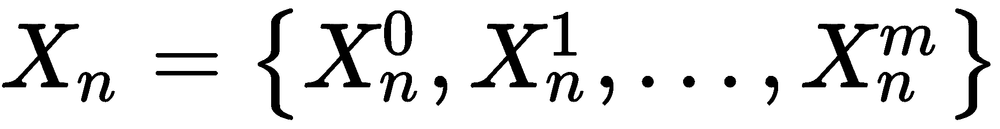

考虑具有相同数量( *k* )的聚类的两个聚类之间的距离度量 *d(C(X [1] ，C(X[2])*，不稳定性被定义为噪声版本的聚类对之间的平均距离:

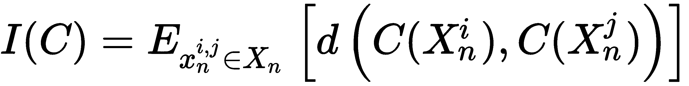

出于我们的目的，我们需要找到使 *I(C)* 最小化的 *k* 的值(因此，使稳定性最大化)。首先，我们需要产生数据集的一些噪声版本。假设 *X* 包含 1000 个二维样本，标准偏差为 10.0。我们可以通过添加一个概率为`0.25`的均匀随机值(在[ `-2.0`，`2.0` ]范围内)来扰动 *X* :

```
import numpy as np

nb_noisy_datasets = 10

X_noise = []

for _ in range(nb_noisy_datasets):
    Xn = np.ndarray(shape=(1000, 2))

    for i, x in enumerate(X):
        if np.random.uniform(0, 1) < 0.25:
            Xn[i] = X[i] + np.random.uniform(-2.0, 2.0)
        else:
            Xn[i] = X[i]

    X_noise.append(Xn)
```

这里，我们假设我们有四个扰动版本。作为一种度量，我们采用汉明距离，它与不一致的输出元素的数量成比例(如果归一化的话)。

由于噪声数据集基于随机扰动，因此当改变随机种子时，不稳定性可能略有不同。然而，当噪声具有相同的特征(均值和标准差)时，总体趋势不应受到不同随机序列的影响。

此时，我们可以计算不同数量的星团的不稳定性:

```
from sklearn.metrics.pairwise import pairwise_distances

instabilities = []

for n in nb_clusters:
    Yn = []

    for Xn in X_noise:
        km = KMeans(n_clusters=n)
        Yn.append(km.fit_predict(Xn))

    distances = []

    for i in range(len(Yn)-1):
        for j in range(i, len(Yn)):
            d = pairwise_distances(Yn[i].reshape(-1, 1), Yn[j].reshape(-1, 1), 'hamming')
            distances.append(d[0, 0])

    instability = (2.0 * np.sum(distances)) / float(nb_noisy_datasets ** 2)
    instabilities.append(instability)
```

由于距离是对称的，我们只能计算矩阵上三角部分的距离。结果如下图所示:

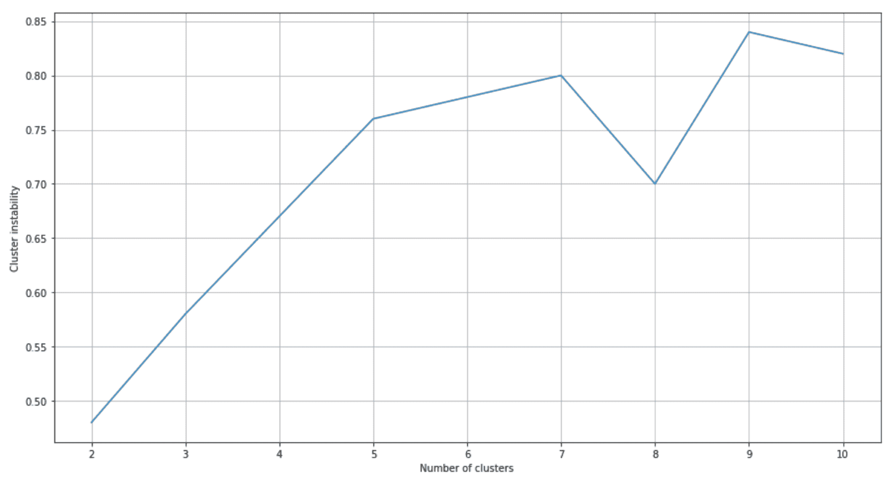

作为团簇数量函数的团簇不稳定性

排除具有 **2** 簇的配置，其中惯性非常高，我们有一个用于 **3** 簇的最小值，该值已经由之前的三种方法确认。所以我们最终可以决定设置`n_clusters=3`，排除 4 个或者更多聚类的选项。这种方法非常有效，但是使用合理数量的噪声数据集评估稳定性非常重要，注意不要过度改变原始几何。一个好的选择是使用方差设置为数据集方差的一部分(例如，1/10)的高斯噪声。备选方法见*聚类稳定性:概述*、*冯·卢克斯堡*大学、 *arXiv 1007:1075v1* 、*2010 年 7 月 7 日*。

即使我们用 K-means 给出了这些方法，它们也可以应用于任何聚类算法来评估和比较它们的性能。


# 基于地面实况的评价方法

在本节中，我们将介绍一些需要了解基础知识的评估方法。这个条件并不总是容易获得，因为聚类通常是作为一种无监督的方法来应用的；然而，在某些情况下，训练集已经被手动(或自动)标记，在预测新样本的聚类之前评估模型是有用的。


# 同种

聚类算法的一个重要要求(给定基本事实)是每个聚类应该只包含属于单个类的样本。在第二章、*机器学习中的重要元素*中，我们定义了熵 *H(X)* 和条件熵 *H(X|Y)* 的概念，在已知 *Y* 的情况下，度量 *X* 的不确定性。因此，如果类集合被表示为 *C* 并且聚类集合被表示为 *K* ， *H(C|K)* 是在聚类数据集之后确定正确类的不确定性的度量。为了获得同质性得分，有必要考虑类集合的初始熵来归一化该值， *H(C)* :

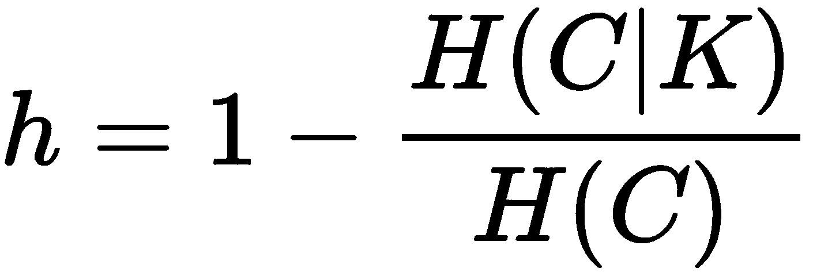

如果我们定义函数 *n(i [true] ，j [pred] )* ，它对应于具有真标签的样本数， *i* ，分配给聚类， *j* ，以及函数*n[pred](j[pred])*，它计算分配给聚类的样本数， *j*

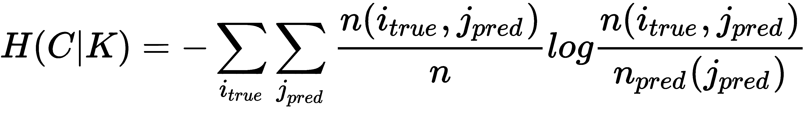

以同样的方式，熵 *H(C)* 被获得如下(函数 *n [真] (i [真] )* ，计算属于类的样本的数量， *i* ):

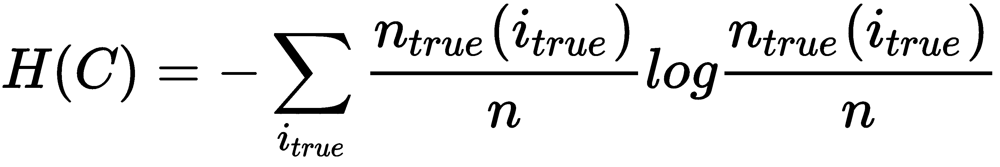

在 scikit-learn 中，有一个内置的`homogeneity_score()`函数可以用来计算这个值。对于这个例子和接下来的几个例子，我们标记了数据集`X`(带有真实标签`Y`)，它是我们在上一节中创建的:

```
from sklearn.metrics import homogeneity_score

km = KMeans(n_clusters=3)
Yp = km.fit_predict(X)

print(homogeneity_score(Y, Yp))
0.430000122123
```

值为 0.43 意味着有大约 57%的剩余不确定性，因为一个或多个聚类包含属于另一个类的一些点(考虑到斑点的高标准偏差，这很容易验证)。与上一节中介绍的其他方法一样，可以使用同质性得分来确定最佳聚类数。


# 完全

一个补充要求是属于一个类别的每个样本被分配到同一个聚类。该度量可以通过使用条件熵 *H(K|C)* 来确定，条件熵是在给定类的知识的情况下确定正确聚类的不确定性。与同质性得分一样，我们需要使用熵 *H(K)* 对其进行标准化:

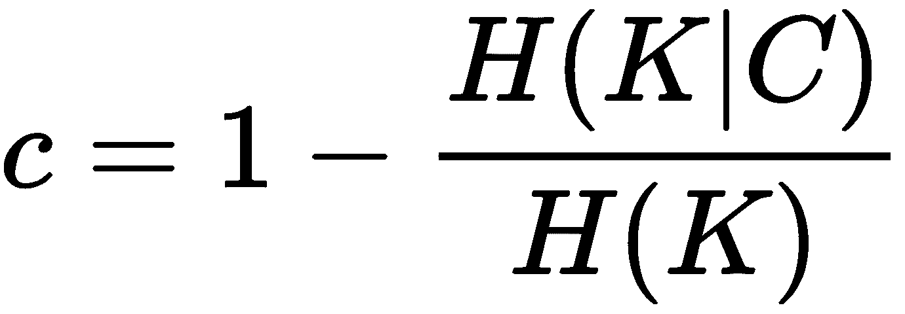

条件熵 *H(K|C)* 和熵 *H(K)* 可以使用频率计数来计算，计算方式与上一节所示相同。

我们可以通过使用`completeness_score()`函数来计算这个分数(在同一个数据集上):

```
from sklearn.metrics import completeness_score

km = KMeans(n_clusters=3)
Yp = km.fit_predict(X)

print(completeness_score(Y, Yp))
0.897314145389
```

在这种情况下，该值相当高，这意味着属于一个类别的大多数样本都被分配到同一个聚类中。通过使用不同数量的聚类或选择另一种算法，可以进一步提高该值。


# 调整后的兰德指数

调整后的 Rand 指数测量原始类划分( *Y* )和聚类之间的相似性。记住前面分数中采用的相同符号，我们可以定义如下:

*   **a** :属于类集合*C*中的同一分区和聚类集合 *K* 中的同一分区的元素对的数量
*   **b** :属于类集合中不同分区的元素对的数量， *C，*和属于聚类集合中不同分区的元素对的数量， **K**

如果数据集中的样本总数为 *n* ，则 Rand 指数定义如下:

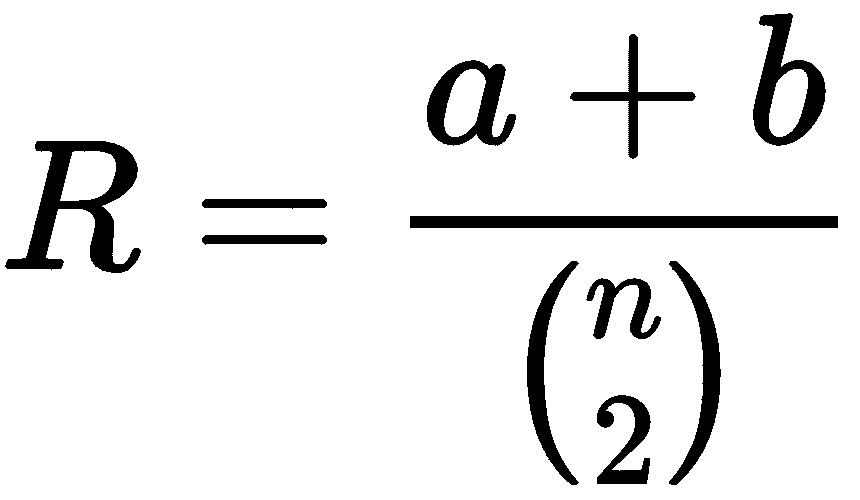

随机修正的*版本是调整后的 Rand 指数，定义如下:*

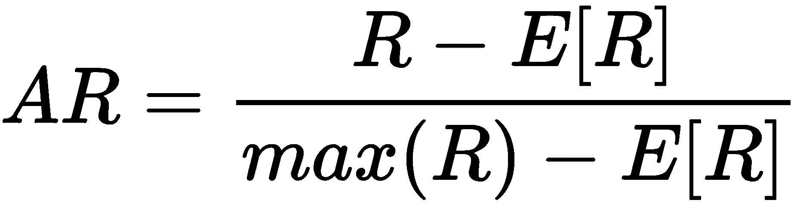

我们可以通过使用`adjusted_rand_score()`函数来计算调整后的 Rand 指数(或得分):

```
from sklearn.metrics import adjusted_rand_score

km = KMeans(n_clusters=3)
Yp = km.fit_predict(X)

print(adjusted_rand_score(Y, Yp))
0.374445476535
```

由于调整后的 Rand 指数限制在 *-1.0* 和 *1.0* 之间，负值表示糟糕的情况(分配是强烈不相关的)，分数 0.37 意味着聚类与地面真实情况相似，即使有一些差异(这也由斑点的同质性分数和高标准偏差所证实)。此外，在这种情况下，可以通过尝试不同数量的聚类或聚类策略来优化该值。


# 摘要

在本章中，我们介绍了基本的聚类算法，从 k-NN 开始，它是一种基于实例的方法，只要有助于检索给定查询点的最相似样本，就可以使用它。然后，我们讨论了高斯混合方法，重点是它的特性和要求，讨论了当软聚类比硬聚类更可取时如何使用它。

具有零协方差的高斯混合的自然发展导致了 K-means 算法，该算法基于定义(随机地，或者根据一些标准) *k* 形心的思想，该形心代表聚类并且优化它们的位置，使得每个聚类中的每个点和形心的平方距离的和最小。我们已经讨论了找出最佳聚类数的不同方法，并因此评估了有和没有基本事实知识的算法的性能。

由于距离是径向函数，K-means(以及高斯混合)假设聚类是凸的，因此，该算法不能解决形状具有深凹的问题(例如半月形问题)。因此，在下一章[第 10 章](e7ec070a-9bfa-46e4-8d90-93526c8144f3.xhtml)，*高级聚类*中，我们将介绍一些算法，它们没有这样的限制，也可以有效地应用于非凸场景。*