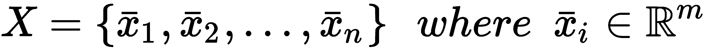

# 十、高级聚类

在本章中，我们将讨论一些高级聚类算法，当 K-means(以及其他类似的方法)无法对数据集进行聚类时，可以使用这些算法。在[第 9 章](ed25eb07-f07d-4084-96e9-64ee87c94331.xhtml)、*聚类基础、*中，我们已经看到这样的模型是基于凸簇可以被超球边界包围的假设。这样，可以使用简单的距离度量来确定正确的标记。不幸的是，许多现实生活中的问题是基于凹的和不规则的结构，这些结构被 K-means 或高斯混合错误地分割。

我们还将解释两个著名的在线算法，当数据集太大而不适合内存时，或者当数据以实时流的形式传输时，可以选择这两个算法。令人惊讶的是，即使这些模型处理有限数量的样本，它们的性能也只比用整个数据集训练的标准模型稍差一点。

特别是，我们将讨论以下内容:

*   **基于密度的应用空间聚类与噪声** ( **DBSCAN** )聚类
*   谱聚类
*   在线聚类(小批量、K 均值和 BIRCH)
*   双聚类(光谱双聚类算法)


# 基于密度的噪声应用空间聚类

DBSCAN 是一个强大的算法，可以很容易地解决 K-means 失败的非凸问题。主要思想很简单:星团是一个被低密度区域包围的高密度区域(对其形状没有限制)。这种说法通常是正确的，并且不需要关于预期聚类数量的初始声明。该过程主要基于度量函数(通常是欧几里德距离)和半径 *ε* 。给定一个样本*x[I]，对其他样本检查其边界。如果它被至少 *n [min]* 个点包围，它就成为一个核心点:*


样本 *x [j]* 定义为从核心点 *x [i]* 可直接到达的*如果:*


一个类似的概念适用于一系列可直接到达的点。因此，如果有一个序列*x[I]→x[I+1]**→...→ x [j]* ，那么 *x [i]* 和 *x [j]* 就说是*可达*。而且，给定一个样本 *x [k]* ，如果 *x [i]* 和 *x [j]* 从 *x [k]* 可达，则称它们为*密度连通*。所有不符合这些要求的样本都被视为有噪声。

所有密度相关的样本都属于一个簇，其几何结构没有限制。在第一步之后，考虑邻居。如果它们也具有高密度，则它们与第一区域合并；否则，它们确定拓扑分离。当所有的区域都被扫描后，聚类也被确定，它们看起来就像被几个嘈杂样本包围的空白空间的岛屿。

Scikit-learn 允许我们用两个参数控制该程序:

*   `eps`:负责定义两个邻居之间的最大距离。较高的值将聚合更多的点，而较小的值将创建更多的聚类。
*   `min_samples`:决定定义一个区域需要多少个周围点(也称为核心点)。

让我们用一个非常困难的聚类问题来试试 DBSCAN，叫做**半月形**。可以使用内置函数创建数据集:

```
from sklearn.datasets import make_moons

nb_samples = 1000
X, Y = make_moons(n_samples=nb_samples, noise=0.05)
```

下图显示了数据集的曲线图:


用于 DBSCAN 聚类测试的半月形数据集

为了更好地理解差异，我们可以检查 K-means 如何对这个集合进行聚类。如[第 9 章](ed25eb07-f07d-4084-96e9-64ee87c94331.xhtml)、*聚类基础中所述，*通过寻找最佳凸性来工作，结果如下图所示:


使用 K-means 聚类的半月数据集

当然，这种分离是不可接受的，也没有办法提高精度(K-means 以及任何其他类似的算法都不可能获得更好的凹聚类结果)。

让我们尝试使用`DBSCAN`(将`eps`设置为`0.1`，将`5`的默认值设置为`min_samples`)进行聚类:

```
from sklearn.cluster import DBSCAN

dbs = DBSCAN(eps=0.1)
Y = dbs.fit_predict(X)
```

与其他实现不同，DBSCAN 在训练过程中预测标签，因此我们已经有了一个数组`Y`，其中包含分配给每个样本的分类。在下图中，有一个带有两种不同标记的表示:


使用 DBSCAN 聚类的半月数据集

正如您所看到的，精确度非常高，只有三个孤立的点被分配到错误的聚类，因为它们非常嘈杂(也就是说，它们没有密度连接到任何其他样本)。当然，通过执行网格搜索，很容易找到在每个特定场景中优化聚类过程的最佳值。一般来说，调整参数以避免两个常见问题是很重要的:几个大聚类和许多小聚类。使用**谱聚类算法**可以很容易地避免这个问题。


# 谱聚类

**谱聚类**是一种更复杂的方法，基于数据集的 *G={V，E}* 图。顶点集 *V、*由样本组成，而连接两个不同样本的边 *E* 根据相似性度量进行加权，其值与原始空间或更合适的空间中的两个样本的距离成比例(以类似于核 SVMs 的方式)。

如果有 *n 个*样本，引入一个**对称亲和矩阵**是有帮助的:


每个元素*w[ij]代表两个样本之间的亲和力的度量。最扩散的度量(scikit-learn 也支持)是**径向基函数** ( **RBF** )和**k-最近邻** ( **k-NN** )。前者定义如下:*


后者基于定义邻居数量的参数 *k* :


RBF 总是非空的，而 k-NN 如果图是部分连通的(并且样本*x[I]不包含在邻域内)可以产生奇异亲和矩阵。这通常不是一个严重的问题，因为可以修正权重矩阵使其总是可逆的，但是我邀请读者测试这两种方法，以检查哪一种是最准确的。每当这些方法不合适时，可以使用任何定制的内核来产生具有相同距离特征(非负、对称和递增)的度量。*

该算法基于归一化拉普拉斯图:


矩阵 *D* 称为*度矩阵*，定义如下:


Scikit-learn 实现了 Shi-Malik 算法(*归一化切割和图像分割*，*Shi J* ， *Malik J* ， *IEEE 模式分析和机器智能汇刊*， *Vol* *22* ， *08/2000* ，也称为**归一化切割**，它将样本分成两组() 这些图是形式上的图，其中每个点是一个顶点，并且边是从归一化拉普拉斯矩阵*1[n]中导出的，使得对应于聚类内的点的权重高于属于该切割的权重。 完整的数学解释不在本书范围内，可以在*掌握机器学习算法*、 *Bonaccorso G* 、 *Packt 出版*、 *2018* 中找到。然而，注意到 *L [n]* (由于其特征分解)的主要作用是定义一个新的子空间，其中的分量是凸的，并且可以使用标准算法如 K-means 容易地分离。没有任何复杂的数学问题，读者可以想象核 PCA 的过程，在这种情况下，这是一个准备步骤。事实上，谱聚类是一种需要具体算法来分配标签的方法(例如，K-means)。*

让我们考虑前面的半月形例子。在这种情况下，相似性(就像 DBSCAN 一样)应该基于最近邻函数；然而，比较不同的内核是很有用的。在第一个实验中，我们使用一个具有不同参数值的 RBF 核:

```
import numpy as np

from sklearn.cluster import SpectralClustering

Yss = []
gammas = np.linspace(0, 12, 4)

for gamma in gammas:
    sc = SpectralClustering(n_clusters=2, affinity='rbf', gamma=gamma)
    Yss.append(sc.fit_predict(X))
```

在这个算法中，我们需要指定我们想要多少个聚类，所以我们将值设置为`2`。结果图如下图所示:


半月数据集使用不同γ值的 RBF 谱聚类进行聚类

如您所见，当缩放因子 **Gamma** 增加时，分离变得更加精确。然而，考虑到数据集，最近邻核(默认值为`n_neighbors=10`)也是一个有效的选择:

```
sc = SpectralClustering(n_clusters=2, affinity='nearest_neighbors')
Ys = sc.fit_predict(X)
```

结果图如下图所示:


使用 10-NN 谱聚类进行聚类的半月数据集

与许多其他基于核的方法一样，谱聚类需要先前的分析来检测哪个核可以为亲和矩阵提供最佳值。scikit-learn 还允许我们为那些使用标准内核无法轻松解决的任务定义自定义内核。然而，与 DBSCAN 相反，在这种情况下很容易避免噪声样本的错误分配。


# 在线聚类

有时，数据集 *X* 太大，算法会变得非常慢，需要相应的内存。在这些情况下，最好采用批处理策略，在数据流动的同时进行学习。由于参数的数量通常非常少，在线聚类非常快，并且只比处理整个数据集的标准算法稍差一点点。


# 小批量 K 均值

我们要考虑的第一种方法是标准 K-means 算法的小批量版本。在这种情况下，我们无法计算所有样本的质心，因此主要问题是定义一个标准，以便在部分拟合后重新分配质心。标准过程基于流平均值，因此会有样本数较高的质心和样本数较低的质心。在 scikit-learn 中，这个过程的微调是通过使用`reassigment_ratio`参数(其默认值为`0.01`)来实现的。较小的值(例如，0.0001)将使聚类中样本数较少的质心在更长时间内达到相同的值，从而产生次优但更快的解决方案。另一方面，如果数据集的结构更复杂，并且批处理大小非常小，则最好增加该值，以强制该过程更频繁地重新分配*次*质心。为了更好地理解这个过程，让我们考虑一个有两个大的水平斑点的场景。如果第一批包含属于一个小区域的 95%的样本，并且剩余的样本远离该块，则该过程可以创建伪质心来映射隔离的样本。当流式处理继续进行时，这样的样本越来越接近其他样本；因此，在低重新分配率的情况下，质心保持不变，直到收集了大量的样本，而在高重新分配率的情况下，更新它们的概率增加，甚至单个新批次也可以强制重新分配。很明显，后一种方法将产生更准确的结果，因为更新的次数更多，并且该过程将需要更多的迭代来收敛。

让我们用一个包含使用`80`样本批次传输的`2000`样本的数据集来分析这个算法:

```
from sklearn.datasets import make_blobs

nb_samples = 2000
batch_size = 80

X, Y = make_blobs(n_samples=nb_samples, n_features=2, centers=5, cluster_std=1.5, random_state=1000)
```

`make_blobs`功能会自动洗牌。在所有其他情况下，这是一个极其重要的步骤，可以保证每一批都以最准确的方式表示原始数据生成过程(即使它总是部分表示)。此时，可以用默认的重新分配比率实例化`MiniBatchKMeans`类，并使用`partial_fit()`方法开始批量训练过程。因为我们想要评估整体性能，所以我们将收集到某一时刻的所有样本的预测值:

```
from sklearn.cluster import MiniBatchKMeans

mbkm = MiniBatchKMeans(n_clusters=5, max_iter=1000, batch_size=batch_size, random_state=1000)

X_batch = []
Y_preds = []

for i in range(0, nb_samples, batch_size):
    mbkm.partial_fit(X[i:i + batch_size])

    X_batch.append(X[:i + batch_size])
    Y_preds.append(mbkm.predict(X[:i + batch_size]))
```

最终结果如以下截图所示:


使用小批量 K-均值获得的部分聚类

正如你所看到的，质心显示出可以忽略的变化，最显著的变化(然而，这是非常小的)只发生在较低的块中，在那里分离几乎为零。现在，让我们将整个数据集的性能与具有相同参数的标准 K 均值进行比较:

```
from sklearn.cluster import KMeans
from sklearn.metrics import adjusted_rand_score

print(adjusted_rand_score(mbkm.predict(X), Y))
0.916704982063   #Output
km = KMeans(n_clusters=5, max_iter=1000, random_state=1000)
km.fit(X)

print(adjusted_rand_score(km.predict(X), Y))
0.920328850257   #Output
```

正如预期的那样，使用小批量的性能仅比标准 K-means 稍差，但在计算和存储复杂性方面的优势更高。我邀请读者用一个更大、更复杂的数据集重复这个例子，试图找出最佳参数(特别是`reassignment_ratio`和`batch_size`)，这些参数产生的调整后的 r and 指数几乎等于标准 K 均值指数。


# 桦树

另一种在线算法是**Ba**平衡迭代约简和使用层次聚类 ( **BIRCH** )。这个结构稍微复杂一点，但是它基本上是基于一个叫做**C**聚类-特征树(**CF-树**)的树结构，有时也叫做**特征-特征树**。具体来说，假设我们有一个数据集， *X* :



级别为 *k* 的 CF-Tree 是包含以下内容的元组:


第一个元素是属于子聚类的样本数量，而其余两个元素是点的总和以及点的平方和。无需过多的数学解释，我们可以将 BIRCH 的初始行为描述为 CF-Tree 的创建，假设一个参数 *B* `branching_factor`(在 scikit-learn 中，默认值是 50 个样本)。一个非终结节点必须包含最多 *B* 个值，这些值与对其直接子节点的引用一起存储。取而代之的是直接存储叶子(在实际实现中，也插入对相邻叶子的引用，以加速计算)。每个终端节点代表一个子聚类，其中区别特征是点的和以及平方和。与谱聚类类似，BIRCH 不会自动执行聚类，但在压缩步骤(将树叶连接起来以避免过度碎片化并增加内部凝聚力)后，它会采用标准的**分层聚类算法**(将在下一章中讨论，[第 11 章](73cab6de-2a23-4a71-acfd-991ff9bd2f5f.xhtml)、*分层聚类*)来对数据进行分段。

在流过程中，当样本*x[I]被输入到模型中时，它被放入到根 CF 中并沿着树传播，直到它到达其质心和样本之间的距离最小的终端节点(叶子)。为了控制树的结构，采用了阈值 *T* 。用法非常专业；但是，为了保证平衡的结构，每当添加新样本产生一个半径大于 *T* 和总数量 *CFs > B* 的子聚类时，就会分配一个新的块。此时，BIRCH 将扫描子聚类以找到最不相似的子聚类，然后将它们分成两部分(其中一部分将被移动到新的空白空间)。通过这种方式，所有子聚类将保持非常紧凑，因此在最终的全局聚类之前将它们合并更容易。*

让我们考虑之前定义的数据集，并使用带有`branching_factor=100`和`threshold=0.15`的`Birch`类对其进行聚类:

```
from sklearn.cluster import Birch

birch = Birch(n_clusters=5, threshold=0.15, branching_factor=100)

X_batch = []
Y_preds = []

for i in range(0, nb_samples, batch_size):
    birch.partial_fit(X[i:i + batch_size])
    X_batch.append(X[:i + batch_size])
    Y_preds.append(birch.predict(X[:i + batch_size])) 

print(adjusted_rand_score(birch.predict(X), Y))
```

以下是输出:

```
0.902818524742
```

在这种情况下，性能比小批量 K-means 稍差，并且对超参数的微小变化非常敏感。最终结果显示在以下输出中:


使用 BIRCH 获得的部分聚类

如果我们将这个结果与前一个结果进行比较，我们可以立即注意到在训练过程中的一些变化(由于先前解释的合并策略)以及在包含三个接近斑点的块中的一些不精确。一般来说，该算法的性能非常类似于小批量 K-means，除非子聚类的数量非常大。在这种情况下，实际上，BIRCH 在合并过程中要灵活得多，并且会产生更好的结果。然而，找到正确的分支因子和阈值并不总是一个立即的操作；因此，当地面实况已知时，我建议进行网格搜索。或者，可以采用**轮廓图**或**群集不稳定性**等方法，更好地了解动态和最终行为。


# 双聚类

在某些特定的情况下，数据集可以像矩阵一样结构化，其中行代表一个类别，列代表另一个类别。例如，假设我们有一组表示用户对一组项目的偏好(或评级)的特征向量。在本例中，我们可以随机创建这样一个矩阵，强制 50%的评分为空(考虑到用户从未对所有可能的项目进行评分，这是现实的):

```
import numpy as np

nb_users = 100
nb_products = 150
max_rating = 10

up_matrix = np.random.randint(0, max_rating + 1, size=(nb_users, nb_products))
mask_matrix = np.random.randint(0, 2, size=(nb_users, nb_products))
up_matrix *= mask_matrix
```

在这种情况下，我们假设 *0* 表示没有提供评级，而介于 1 和 10 之间的值是实际评级。生成的矩阵如下面的屏幕截图所示:


双聚类示例的用户产品矩阵

给定这样一个矩阵，有可能假设有一个潜在的棋盘结构。换句话说，我们的假设授权我们假设有可能重新排列行和列来确定矩阵内的相干块。这是**双聚类**的主要概念，每当需要根据它们的共同属性分割一组特征向量时(例如，出于营销目的或在推荐引擎中)，这是非常有用的。在我们的示例中，我们的目标是找到一个矩阵，其中每个块都与一组用户和产品相关联(例如，将 8 评为第四产品的所有用户)。

我们将要使用的算法叫做**光谱双聚类**，它基于一些特定的步骤。第一个是行列规范化，其目标是找到一组值，使所有的行总和与列总和相等。此时，使用**奇异值分解** ( **SVD** )对归一化矩阵 *A [n]* 进行因式分解:


矩阵 *U* 和 *V* 包含了 *A* [*n*] 的左右奇异向量(即分别为*A[n]A[n]T^T*和*A^Tn*的特征向量)。丢弃第一个奇异向量(*u[1]和*v[1]，选择其余的。实际的双聚类是通过根据精确的标准重新排列奇异向量来执行的。假设我们考虑一个一般的分段常数向量:**


奇异向量根据它们与分段常数向量(表示我们的棋盘结构的构建块，类似于前面显示的示例)的相似性按比例排列。该操作通常使用 K-means 算法并测量原始向量和聚类向量之间的差异来执行。一旦确定了顶部的 *k* 向量，数据集就被投影到这些向量上，从而获得最终的表示。此时，应用 K-means 并计算聚类(对于行和列)。

在我们的例子中，我们感兴趣的是根据排名进行分段；让我们应用算法，设置`n_clusters=10`:

```
import numpy as np

from sklearn.cluster.bicluster import SpectralBiclustering

sbc = SpectralBiclustering(n_clusters=10, random_state=1000)
sbc.fit(up_matrix)

up_clustered = np.outer(np.sort(sbc.row_labels_) + 1, np.sort(sbc.column_labels_) + 1)
```

最终的`up_clustered`矩阵作为排序的行和列标签的外积获得(通过`row_labels_`和`column_labels_`实例变量获得):


结果如以下截图所示:


使用谱双聚类的用户-产品矩阵双聚类

正如您所看到的，最终的结构是一个棋盘，其中每个方块代表一个等级。现在假设我们想要找出分配给聚类 6(等级 7)的所有行(用户)；我们可以使用`rows_`实例变量来做到这一点，它是一个包含(`n_clusters`、`n_rows`)值的布尔数组。所有的`True`值代表属于一个聚类的特定行:

```
import numpy as np

print(np.where(sbc.rows_[6, :] == True))
```

以下是输出:

```
(array([12, 15, 18, 39, 48, 74, 75, 81, 90], dtype=int64),)
```

结果显示，我们需要查看特定的行，排除剩余的行。同样，我们可以对列(产品)执行此操作:

```
print(np.where(sbc.columns_[6, :] == True))
```

以下是输出:

```
(array([  4,  12,  29,  46,  48,  76,  86,  88,  96, 110, 111, 126, 147, 148], dtype=int64),)
```

以这种方式，我们有一个双重分割，可以用来找到关于评级的相似用户，以及关于表达相同评级的用户的相似产品(从视觉角度来看，一个段在最终矩阵中是一个同质的矩形)。我们将在[第 12 章](aeaa410b-5375-4274-8957-a931dfa96747.xhtml)、*介绍推荐系统*中讨论类似的方法。在这种情况下，我们的目标将是基于不同的相似性标准找到最佳建议。


# 摘要

在这一章中，我们讨论了两个可以很容易地解决非凸聚类问题的算法。第一种称为 DBSCAN，是一种简单的算法，用于分析被其他样本和边界样本包围的点之间的差异。这样，它可以很容易地确定高密度区域(成为聚类)和它们之间的低密度空间。没有关于簇的形状或数量的假设，因此有必要调整其他参数以生成正确的簇数量。

谱聚类是基于样本间相似性度量的一系列算法。它在由亲和矩阵的拉普拉斯算子生成的子空间上使用经典方法(例如 K-means)。通过这种方式，可以利用许多核函数来对非凸数据集进行聚类。

我们还讨论了两个在线算法:小批量 K-means 和 BIRCH。前者是标准 K-means 的直接对应物，当现有的平衡被新样本改变时，质心被动态重新分配。我们已经展示了，一般来说，该算法如何能够以最小的内存消耗实现与 K-means 几乎相同的性能。BIRCH 是一种基于特定树的备选解决方案，其本身基于包含每个子聚类摘要的元组。

我们讨论的最后一个主题是双聚类算法，只要数据集具有底层棋盘结构，就可以使用该算法。双聚类的任务是重新排列行和列，以显示所有同类区域。

在[第 11 章](73cab6de-2a23-4a71-acfd-991ff9bd2f5f.xhtml)、*分层聚类*中，我们将讨论另一种方法，称为分层聚类。它允许我们通过分割和合并聚类来分割数据，直到达到最终配置。