# 十一、分层聚类

在这一章中，我们将讨论一种叫做**层次聚类**的特殊聚类技术。这种方法不是处理整个数据集中存在的关系，而是从包含所有元素的单个实体开始(**divided**或*N*separate elements(agglomerate))，然后根据一些特定的标准来拆分或合并聚类，我们将对这些标准进行分析和比较。

特别是，我们将讨论以下内容:

*   分层策略
*   聚集聚类(指标、联系和树状图)
*   凝聚聚类的连通性约束


# 分层策略

分层聚类基于查找部分聚类的层次结构的一般概念，使用自底向上或自顶向下的方法构建。更正式地说，它们分为两类:

*   **聚集聚类**:该过程从底部开始(每个初始聚类由单个元素组成)，并通过合并聚类继续进行，直到达到停止标准。一般来说，在该过程结束时，目标具有足够少数量的簇。
*   **分裂聚类** : 在这种情况下，初始状态是具有所有样本的单个聚类，并且该过程通过分裂中间聚类进行，直到所有元素被分离。在这一点上，该过程继续执行基于元素间不相似性的聚合标准。一个著名的方法叫做**分裂分析法**(**DIANA**)；然而，该算法超出了本书的范围。

scikit-learn 只实现聚集聚类。然而，这并不是真正的限制，因为分裂聚类的复杂性更高，而凝聚聚类的性能与分裂方法实现的性能非常相似。


# 凝聚聚类

让我们考虑以下数据集:


我们定义**亲和度**，一个具有相同维度的两个自变量的度量函数 *m* 。最常见的指标(scikit-learn 也支持)如下:

*   **欧几里得**或 *L2(闵可夫斯基距离与 p=2)* :


*   **曼哈顿**(又称**城市街区**)或 ***L1** (闵可夫斯基距离与 p=1)* :

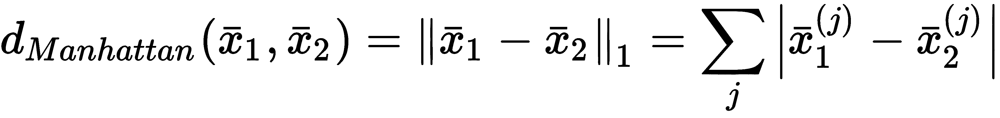

*   **余弦距离**:


欧几里德距离通常是一个好的选择，但有时它对与欧几里德距离的差异越来越大的度量是有用的。正如在[第 9 章](ed25eb07-f07d-4084-96e9-64ee87c94331.xhtml)、*聚类基础*中所讨论的，曼哈顿指标具有这一特性。在下图中，有一个图表示从属于直线 *y = x* 的点的原点的距离:

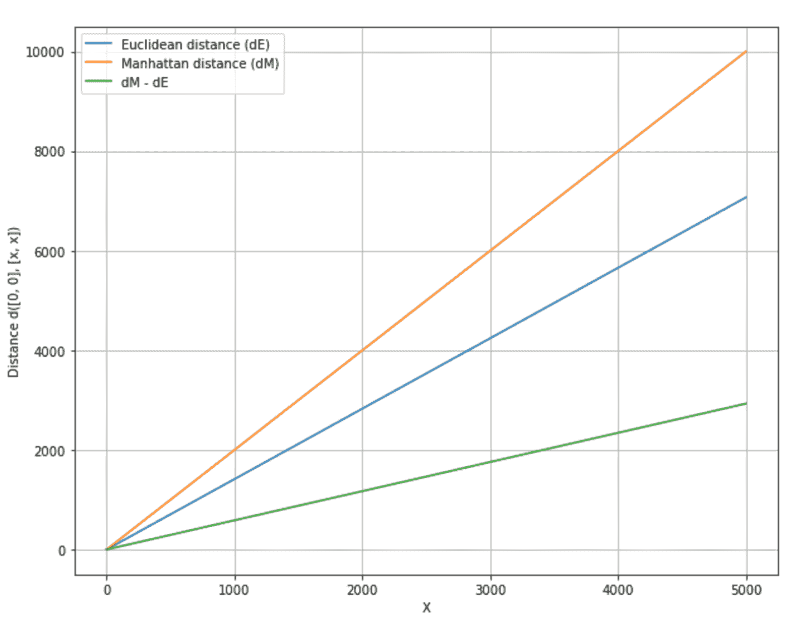

使用欧几里德度量和曼哈顿度量计算点(x，x)到(0，0)的距离

当我们需要与两个向量之间的角度成比例的距离时，余弦距离反而有用。如果方向相同，则距离为零，而当角度等于 180°时距离最大(表示方向相反)。当聚类不必考虑每个点的 *L2* 范数时，可以使用该距离。例如，一个数据集可能包含不同尺度的二维点，我们需要将它们分组到对应于圆形扇区的簇中。或者，我们可能对它们在四个象限中的位置感兴趣，因为我们已经给每个象限赋予了特定的含义(不随点和原点之间的距离而变化)。

一旦选择了一个度量标准(姑且称之为 *d(x，y)* ，下一步就是定义一个策略(称为 **linkage** )来聚合不同的聚类。有许多可能的方法，但是 scikit-learn 支持三种最常见的方法:

*   **完全链接**:对于每一对聚类，算法计算并合并它们，以最小化聚类之间的最大距离(换句话说，最远元素的距离):

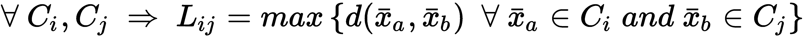

*   **平均关联**:类似于完全关联，但是在这种情况下，算法使用聚类对之间的平均距离:

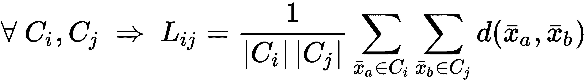

*   **Ward's linkage** :在这种方法中，考虑了所有的聚类，算法计算聚类内的距离平方和，并将其合并，使之最小化。从统计学的观点来看，聚集的过程导致每个结果聚类的方差减少。措施如下:


沃德连锁只支持欧几里德距离。


# 系统树图

为了更好地理解聚集过程，引入一种称为**树状图**的图形方法是有用的，它以静态方式显示了聚集是如何进行的，从底部(所有样本都被分离)开始到顶部(链接完成)。可惜 scikit-learn 不支持。然而，SciPy 提供了一些有用的内置函数。

让我们首先创建一个虚拟数据集:

```
from sklearn.datasets import make_blobs

nb_samples = 25
X, Y = make_blobs(n_samples=nb_samples, n_features=2, centers=3, cluster_std=1.5)
```

为了避免结果图过于复杂，样本数量一直保持很低。在下图中，有数据集的表示:

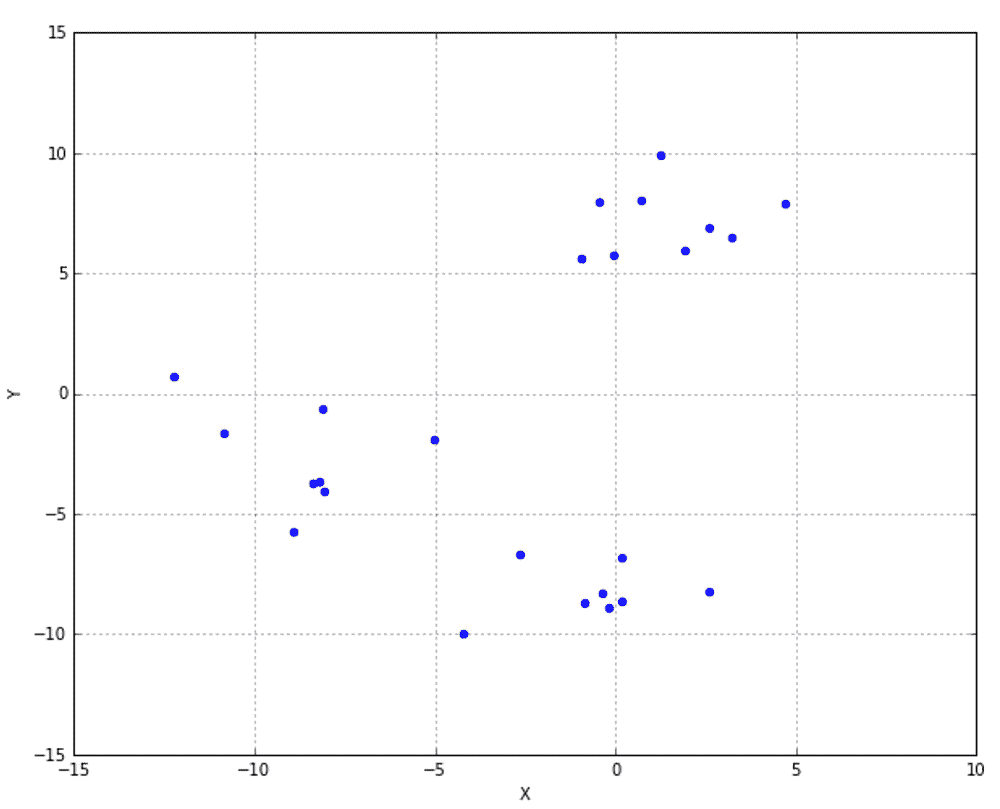

用于树状图计算的简单数据集

现在，我们可以计算树状图。第一步是计算距离矩阵:

```
from scipy.spatial.distance import pdist

Xdist = pdist(X, metric='euclidean')
```

我们选择了一个`euclidean`度量，这是最适合这种情况的。此时，有必要决定我们想要哪个`linkage`。就拿`ward`来说吧；但是，支持所有已知的方法:

```
from scipy.cluster.hierarchy import linkage

Xl = linkage(Xdist, method='ward')
```

现在，可以创建和可视化`dendrogram`:

```
from scipy.cluster.hierarchy import dendrogram

Xd = dendrogram(Xl)
```

生成的图如下面的屏幕截图所示:

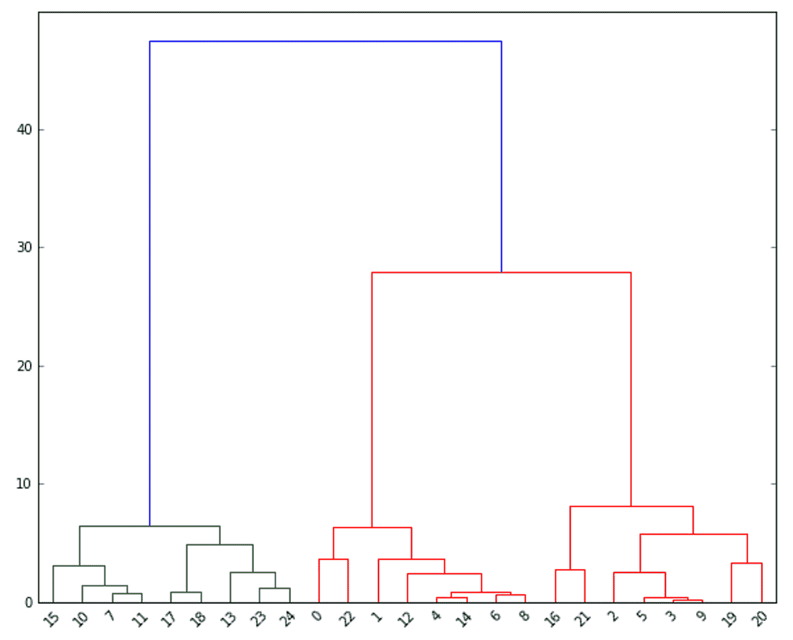

描述虚拟数据集的树状图

在 *x* 轴有样本(递增编号)，而 *y* 轴代表距离(即相异度)。每个拱门连接两个由算法合并在一起的聚类。例如， **23** 和 **24** 是合并在一起的单个元素。元素 **13** 然后被聚集到结果聚类，因此过程继续。一般而言，凝聚过程从底部开始(对应于零相异度)并沿着 *y* 轴进行，合并子聚类，直到达到期望的聚类数量。

例如，如果我们决定在略低于 **30** 的距离处切割图形(其中右边部分的子聚类合并成单个聚类)，我们得到两个独立的聚类:第一个从 **15** 到 **24** ，另一个从 **0** 到 **20** 。相反，如果我们在 **10** 处切割图形，我们获得三个群集: **15** 到 **14** 、 **0** 到 **8** 以及 **16** 到 **20** 。查看前面的数据集图，所有带有 *Y < 10* 的点都被认为是第一个聚类的一部分，而其他点属于第二个聚类。如果我们增加距离，关联会变得非常明显(特别是在这个只有几个样本的例子中)，并且当值大于 **27** 时，只会生成一个聚类(即使内部方差非常高！).


# scikit-learn 中的凝聚聚类

让我们考虑一个更复杂的带有`8`中心的虚拟数据集:

```
from sklearn.datasets import make_blobs
nb_samples = 3000
X, Y = make_blobs(n_samples=nb_samples, n_features=2, centers=8, cluster_std=2.0)
```

下图显示了一个图形表示:

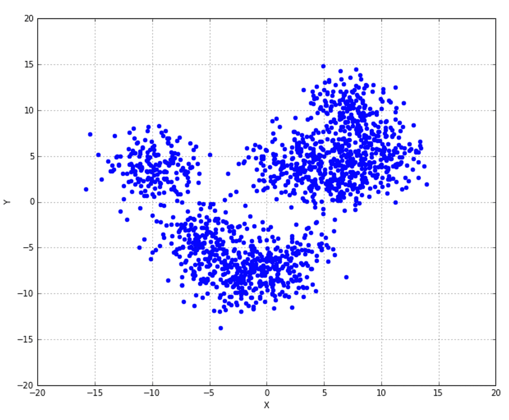

为聚集聚类示例创建的数据集

我们现在可以使用不同的链接执行凝聚聚类(始终保持欧几里德距离)并比较结果。让我们从一个完整的联动开始(`AgglomerativeClustering`使用了`fit_predict()`；训练模型和转换原始数据集的方法)，还计算`silhouette_score`和`adjusted_rand_score`:

```
from sklearn.cluster import AgglomerativeClustering
from sklearn.metrics import silhouette_score, adjusted_rand_score

ac = AgglomerativeClustering(n_clusters=8, linkage='complete')
Y_pred = ac.fit_predict(X)

print('Silhouette score (Complete): %.3f' % silhouette_score(X, Y_pred))
Silhouette score (Complete): 0.352  #This is the output

print('Adjusted Rand score (Complete): %.3f' % adjusted_rand_score(Y, Y_pred))
Adjusted Rand score (Complete): 0.481  #This is the output
```

下图显示了结果图(使用不同的标记和颜色):

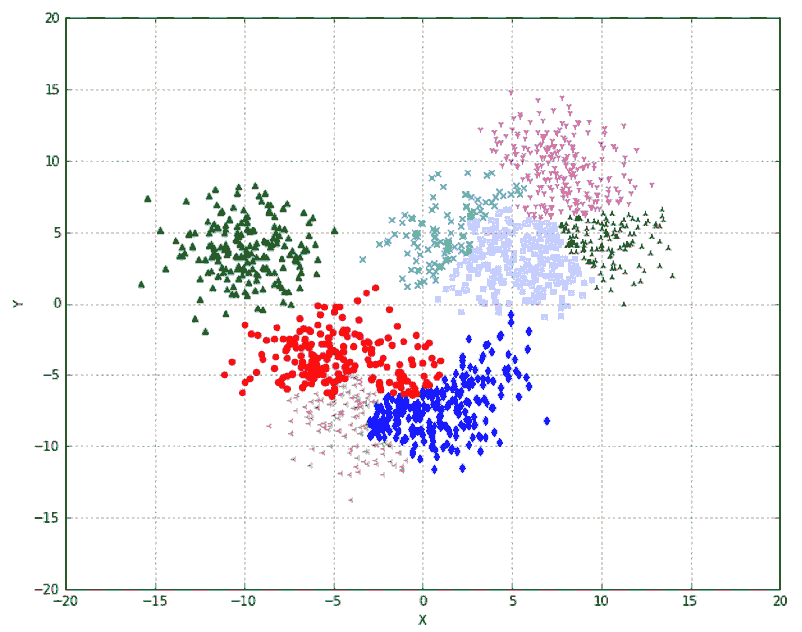

完全连锁聚类

结果几乎让人无法接受。这种方法惩罚了方差间性，并合并了在大多数情况下应该不同的聚类(然而，它们的最终结构没有显示重叠，也如`silhouette_score`所示)。在前面的图中，中间的三个聚类相当模糊，考虑到点所代表的聚类的方差，错误放置的概率非常高。

现在让我们考虑一下`'average'`联动装置:

```
ac = AgglomerativeClustering(n_clusters=8, linkage='average')
Y_pred = ac.fit_predict(X)

print('Silhouette score (Average): %.3f' % silhouette_score(X, Y_pred))
Silhouette score (Average): 0.320  #This is the output

print('Adjusted Rand score (Average): %.3f' % adjusted_rand_score(Y, Y_pred))
Adjusted Rand score (Average): 0.476 #This is the output
```

结果如下图所示:

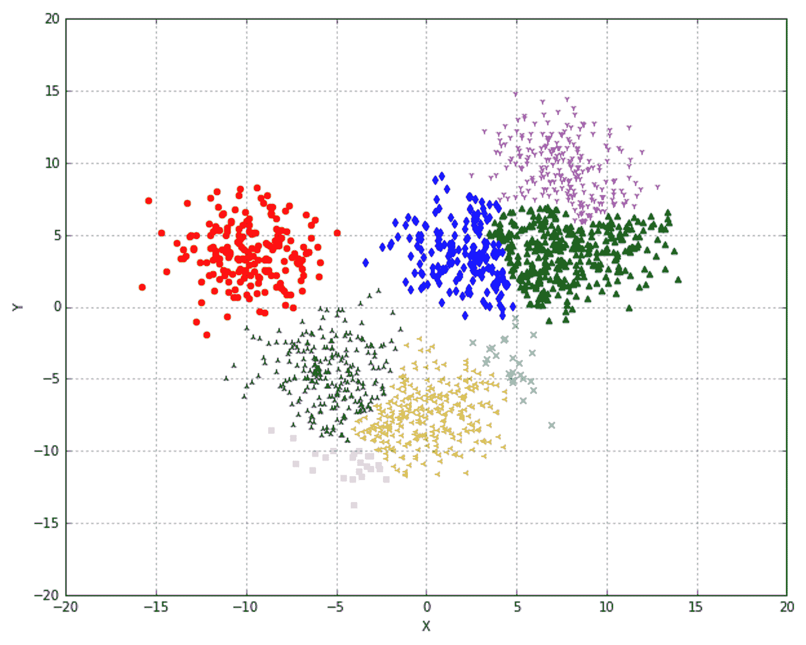

平均连锁聚类

在这种情况下，聚类看起来在视觉上被更好地定义，即使它们中的一些可能已经变得非常小，这也通过轮廓和调整后的 Rand 分数的恶化来指示。尝试其他指标(特别是 *L1* )并比较结果也很有用。最后一种方法，通常是最好的(这是默认的)，是沃德联动；它只能与欧几里德度量(也是默认度量)一起使用:

```
ac = AgglomerativeClustering(n_clusters=8)
Y_pred = ac.fit_predict(X)

print('Adjusted Rand score (Ward): %.3f' % adjusted_rand_score(Y, Y_pred))
Adjusted Rand score (Ward): 0.318   #This is the output

print('Adjusted Rand score (Ward): %.3f' % adjusted_rand_score(Y, Y_pred))
Adjusted Rand score (Ward): 0.531   #This is the output
```

结果图如下图所示:

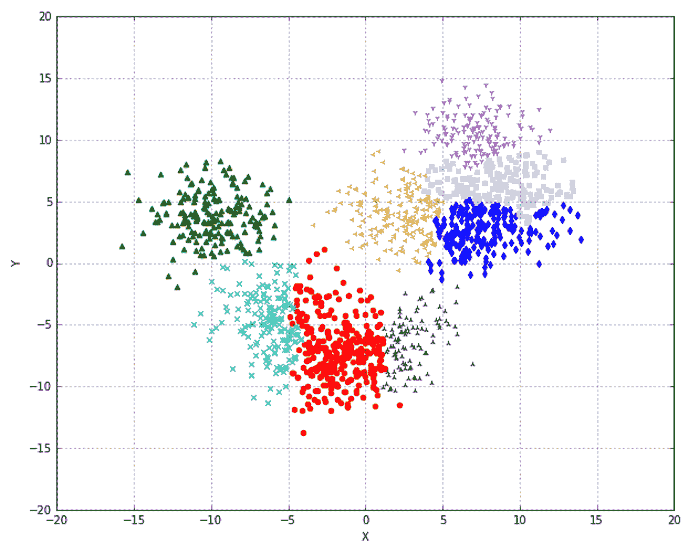

沃德连锁聚类

在这种情况下，剪影得分仅比平均链接稍差，但调整后的 Rand 指数有所改善，这表明分配的准确性更高。由于地面真相是众所周知的，这个分数应该被认为比剪影一个更可靠。相反，每当没有关于真实标签的信息时，轮廓分数提供了测量内聚性和同质性的好方法。与 Ward 的关联一样，不可能修改度量标准，因此一个有效的替代方法可能是平均关联，它可以用于每个亲缘关系和网格搜索。


# 连通性限制

scikit-learn 还允许指定一个连接矩阵，该矩阵可以在查找要合并的聚类时用作约束。这样，彼此远离(在连接矩阵中不相邻)的聚类被跳过。创建这种矩阵的一种非常常见的方法是使用**k-最近邻** ( **k-NN** )图形函数(实现为`kneighbors_graph()`)，该函数基于样本具有的邻居数量(根据特定的度量)。在下面的例子中，我们考虑一个**圆形虚拟数据集**，没有地面实况:

```
from sklearn.datasets import make_circles

nb_samples = 3000
X, Y = make_circles(n_samples=nb_samples, noise=0.05)
```

图示如下所示:

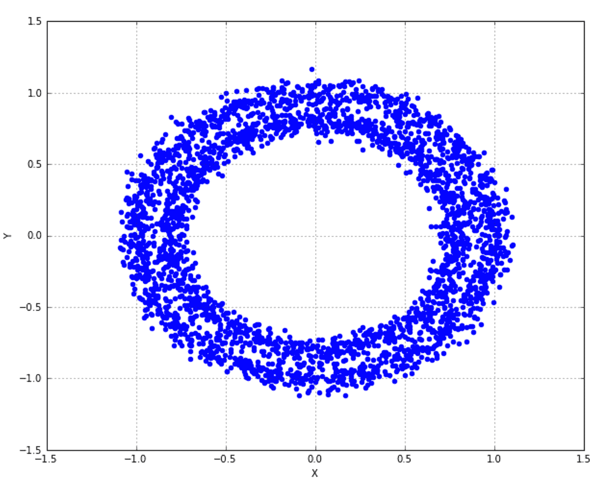

连通性约束示例的圆形数据集

我们从基于`'average'`链接的非结构化凝聚聚类开始，施加`20`聚类，并计算轮廓分数:

```
from sklearn.metrics import silhouette_score

ac = AgglomerativeClustering(n_clusters=20, linkage='average')
Y_pred = ac.fit_predict(X)

print('Silhouette score: %.3f' % silhouette_score(X, Y_pred))
Silhoette score: 0.310   #This is the output
```

在这种情况下，我们使用了`fit_predict()`方法，因为`AgglomerativeClustering`类在被训练后，通过`labels_`实例变量、暴露标签(聚类数)，当聚类数非常高时，使用该变量更容易。`silhouette_score`是`0.310`，表示没有重叠，但也是不完全平衡的簇。然而，由于我们不知道基本事实，并且我们已经实施了`20`聚类，我们可以使用该值作为初始基准(当然，我邀请读者重复该练习以测试其他解决方案并改进结果)。

下图显示了结果的图形:

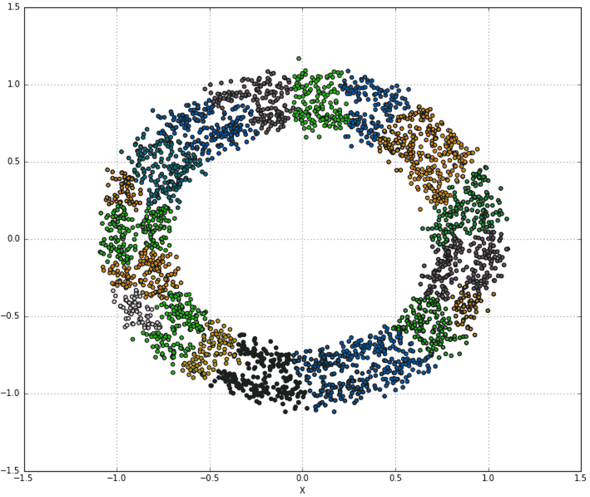

平均链接的聚类结果

现在我们可以尝试对`k`、*、*、*、*施加不同值的约束来计算`silhouette_score`:

```
from sklearn.neighbors import kneighbors_graph
from sklearn.metrics import silhouette_score

acc = []
k = [50, 100, 200, 500]

for i in k:
    kng = kneighbors_graph(X, i)
    ac1 = AgglomerativeClustering(n_clusters=20, connectivity=kng, linkage='average')
    Y_pred = ac1.fit_predict(X)
    print('Silhouette score (k=%d): %.3f' % (i, silhouette_score(X, Y_pred)))
    acc.append(ac1)
```

输出如下所示:

```
Silhouette score (k=50): -0.751
Silhouette score (k=100): -0.221
Silhouette score (k=200): 0.277
Silhouette score (k=500): 0.310
```

结果图如下图所示:


不同 k 值的聚类结果

正如您所看到的，施加约束(在这种情况下，基于 k-NN)允许我们控制聚集如何创建新的聚类，并且可以成为调整模型的强大工具，或者用于过滤那些在合并阶段可以考虑的原始空间中距离非常大的元素(这在聚类图像时特别有用)。考虑到前面的例子，`k=50`产生了一个非常大的聚类，其中只有一些异常值。结构从`k=100`开始出现，但是聚类还是很不平衡，有一个占优势的群和一些小的、孤立的群。结果对`k=200`来说似乎相当不错，即使同质性还不完美。对于`k=500`来说，剪影评分是正的但还是挺低的；然而，它表明没有重叠，但有一些潜在的错误分配。此外，它对应于在没有约束的情况下获得的分数；因此，我们可以假设这个级别的`k`削弱了太多的约束。此时，必须做出选择，考虑关于数据集的所有可能的信息。除了前两种情况，可以在范围 *(200，500)* 中执行另一种分析，以尝试确定与我们已知的约束条件相匹配的最佳解决方案(例如，即使最终结构不平衡，一些样本也属于单个聚类)。作为一个补充练习，我建议分析范围 *(200，500)，*选择一些潜在的现实约束，并检查哪个值可以产生最优解。


# 摘要

在本章中，我们介绍了层次聚类，将我们的注意力集中在凝聚版本上，这是 scikit-learn 支持的唯一版本。我们讨论了它的哲学，它与许多其他方法所采用的哲学相当不同。在凝聚聚类中，该过程从将每个样本视为单个聚类开始，并通过合并块来进行，直到达到期望的聚类数。要完成这项任务，需要两个要素:一个度量函数(也称为亲和力)和一个链接标准。前者用于确定元素之间的距离，而后者是用于确定必须合并哪些聚类的目标函数。

我们还看到了如何使用 SciPy 通过树状图来可视化这个过程。当需要保持对过程的完全控制，并且最初不知道最终的聚类数时(更容易决定在哪里切割图形)，这种技术非常有用。我们展示了如何使用 scikit-learn 来执行具有不同度量和链接的凝聚式聚类，并且在本章的最后，我们还介绍了连接性约束，当需要强制执行该过程时，连接性约束非常有用，可以避免合并相距太远的聚类。

在[第 12 章](aeaa410b-5375-4274-8957-a931dfa96747.xhtml)、*介绍推荐系统、*中，我们将介绍许多不同系统每天都在使用的推荐系统，这些系统根据用户与其他用户的相似性和偏好，自动向用户推荐商品。