# 十二、推荐系统简介

想象一下，一个拥有数千种商品的网店。如果你不是注册用户，你可能会看到一个有一些亮点的主页，但是如果你已经购买了一些商品，如果网站显示你可能会购买的产品，而不是随机选择，这将是很有趣的。这就是推荐系统的目的，在这一章中，我们将讨论创建这样一个系统的最常见的技术。

基本概念是用户、商品和评级(或者关于产品的隐性反馈，比如你已经购买了它们)。每个模型都必须使用已知数据(如在监督场景中)，以便能够建议最合适的项目或预测尚未评估的所有项目的评级。

我们将讨论两种不同的策略:

*   基于用户或基于内容
*   协同过滤

第一种方法是基于我们拥有的关于用户或产品的信息，其目标是将新用户与现有的一组同行相关联，以建议其他成员积极评价的所有项目，或者根据产品的特征对产品进行聚类，并提出与所考虑的项目相似的项目子集。第二种方法稍微复杂一点，使用显式评级，其目的是预测每个项目和每个用户的值。即使协同过滤需要模式计算能力，廉价资源的巨大可用性允许对每个大型数据集使用这些算法，产生几乎实时的推荐。该模型还可以每天重新训练或更新。


# 简单的基于用户的系统

在第一个场景中，我们假设我们有一组用户，由 *m* 维特征向量表示:

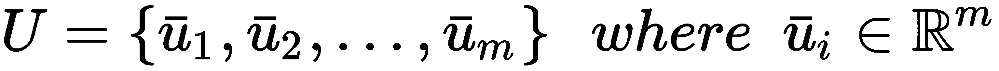

典型的特征是年龄、性别、兴趣等等。所有这些都必须使用前面章节中讨论的技术之一进行编码(例如，可以将它们二进制化、在固定范围内归一化或转换为一个热点矢量)。但是，一般来说，避免不同的方差会对相邻点之间的距离计算产生负面影响是很有用的。

我们有一套 *k* 的物品:

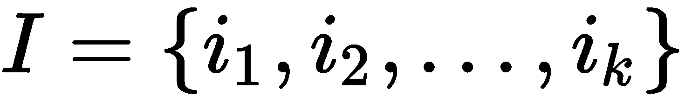

我们还假设存在将每个用户与项目子集(已购买或好评)相关联的关系，对于这些项目，已经执行了明确的动作或反馈:

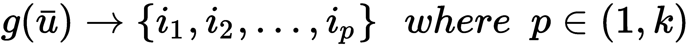

在基于用户的系统中，用户被周期性地聚类(通常使用**k-最近邻** ( **k-NN** )方法)，因此考虑一个普通用户 *u* (也是一个新样本)，我们可以立即确定一个半径为 *R* 的球，它包含所有与我们的样本相似(因此是邻居)的用户:

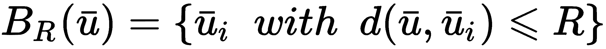

此时，我们可以使用前面介绍的关系创建建议项目集:

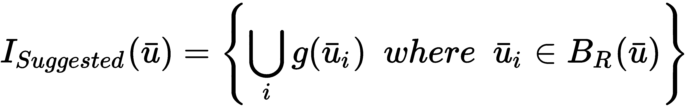

换句话说，这个集合包含了所有被邻居积极评价或购买的独特产品。我使用形容词 n *aive* 是因为有一个类似的选择，我们将在专门讨论协同过滤的部分讨论。


# 用 scikit-learn 实现基于用户的系统

出于我们的目的，我们需要创建一个用户和产品的虚拟数据集(但是使用真实数据集非常容易):

```py
import numpy as np

nb_users = 1000
users = np.zeros(shape=(nb_users, 4))

for i in range(nb_users):
   users[i, 0] = np.random.randint(0, 4)
    users[i, 1] = np.random.randint(0, 2)
    users[i, 2] = np.random.randint(0, 5)
    users[i, 3] = np.random.randint(0, 5)
```

我们假设有`1000`个用户具有`4`个特征，用介于`0`和`4`或`5`之间的整数表示。它们是什么意思并不重要；它们的作用是描述用户的特征并允许集合的聚类。当然，特征必须与任务相符。换句话说，我们假设距离可以**接地**。因此，如果 *d(A，B) < d(B，C)* ，则意味着实际用户 *A* 比 *C* 更类似于 *B* 。

对于产品，我们还需要创建关联:

```py
nb_product = 20
user_products = np.random.randint(0, nb_product, size=(nb_users, 5))
```

我们假设我们有`20`个不同的项目(从 1 到 20；`0`表示用户没有购买任何东西)和一个关联矩阵，其中每个用户都链接到在`0`和`5`(最大值)之间限定的多个产品，例如:

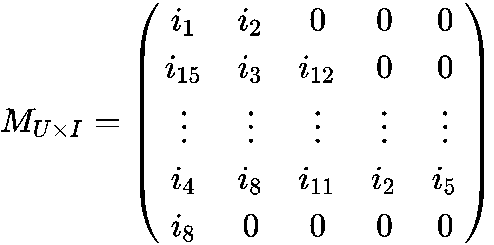

此时，我们需要使用 scikit-learn 提供的`NearestNeighbors`实现对用户进行聚类:

```py
from sklearn.neighbors import NearestNeighbors

nn = NearestNeighbors(n_neighbors=20, radius=2.0)
nn.fit(users)
```

我们选择了`20`个邻居，欧几里得半径等于`2.0`。当我们想要查询模型以了解球(其中心是一个样本且具有固定半径)中包含哪些项目时，会使用此参数。在我们的例子中，我们将查询模型以获得测试用户的所有邻居:

```py
test_user = np.array([2, 0, 3, 2])
d, neighbors = nn.kneighbors(test_user.reshape(1, -1))

print(neighbors)
array([[933,  67, 901, 208,  23, 720, 121, 156, 167,  60, 337, 549,  93,
        563, 326, 944, 163, 436, 174,  22]], dtype=int64)
```

现在，我们需要使用关联矩阵构建推荐列表(出于教学目的，这一步没有得到很好的优化):

```py
suggested_products = []

for n in neighbors:
    for products in user_products[n]:
        for product in products:
            if product != 0 and product not in suggested_products:
                suggested_products.append(product)

print(suggested_products)
[14, 5, 13, 4, 8, 9, 16, 18, 10, 7, 1, 19, 12, 11, 6, 17, 15, 3, 2]
```

对于每个邻居，我们检索他们购买的产品并执行联合，避免包含零值(意味着没有产品)和重复元素。结果是可以为许多不同的系统几乎实时地获得建议的列表(未排序)。在某些情况下，当用户或项目的数量太大时，可以将列表限制为固定数量的元素，并减少邻居的数量。这种方法也很幼稚，因为它没有考虑用户之间的实际距离(或相似性)来衡量建议。可以考虑将距离作为一个加权因素，但是采用协作过滤方法更简单，它提供了一个更健壮的解决方案。


# 基于内容的系统

这可能是最简单的方法，它仅基于建模为 m 维特征向量的产品:

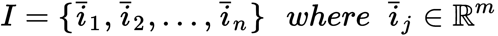

就像用户一样，特征也可以是分类的(事实上，对于产品来说更容易)，例如，一本书或一部电影的流派，它们可以在编码后与数值(如价格、长度、正面评论数等)一起使用。

然后，采用聚类策略，即使最常用的策略是 k-NN，因为它允许我们控制每个邻域的大小，以确定给定样品产品的质量和建议的数量。

使用 scikit-learn，首先我们创建一个虚拟产品数据集:

```py
nb_items = 1000
items = np.zeros(shape=(nb_items, 4))

for i in range(nb_items):
    items[i, 0] = np.random.randint(0, 100)
    items[i, 1] = np.random.randint(0, 100)
    items[i, 2] = np.random.randint(0, 100)
    items[i, 3] = np.random.randint(0, 100)
```

在这种情况下，我们有`1000`个样本，其`4`个整数特征被限制在`0`和`100`之间。然后，我们继续像前面的例子一样，对它们进行聚类:

```py
nn = NearestNeighbors(n_neighbors=10, radius=5.0)
nn.fit(items)
```

此时，可以使用`radius_neighbors()`方法、查询我们的模型，这允许我们将研究限制在有限的子集内。默认半径(通过`radius`参数设置)为`5.0`，但我们可以动态更改:

```py
test_product = np.array([15, 60, 28, 73])
d, suggestions = nn.radius_neighbors(test_product.reshape(1, -1), radius=20)

print(suggestions)
[array([657, 784, 839, 342, 446, 196], dtype=int64)]

d, suggestions = nn.radius_neighbors(test_product.reshape(1, -1), radius=30)

print(suggestions)
[ array([844, 340, 657, 943, 461, 799, 715, 863, 979, 784, 54, 148, 806,
 465, 585, 710, 839, 695, 342, 881, 864, 446, 196, 73, 663, 580, 216], dtype=int64)]
```

当然，当尝试这些例子时，建议的数量可以不同，因为我们使用随机数据集，所以我建议尝试不同的半径值(特别是当使用不同的度量时)。

当使用 k-NN 进行聚类时，考虑用于确定样本之间距离的度量是很重要的。scikit-learn 的缺省值是**闵可夫斯基距离** *d [p] (a，b)* ，正如在[第 11 章](73cab6de-2a23-4a71-acfd-991ff9bd2f5f.xhtml)、*、*中讨论的，它是欧几里德距离的推广。参数 *p* 控制距离的类型，默认值为 *2* ，因此得到的度量是经典的欧几里德距离。其他距离由 SciPy 提供(在`scipy.spatial.distance`包中)，例如包括**汉明**和**JAC card**距离。前者定义为两个向量之间的不一致比例(如果是二进制的，这是归一化的不同比特数)，例如:

```py
from scipy.spatial.distance import hamming

a = np.array([0, 1, 0, 0, 1, 0, 1, 1, 0, 0])
b = np.array([1, 1, 0, 0, 0, 1, 1, 1, 1, 0])
d = hamming(a, b)

print(d)
0.40000000000000002
```

意味着有 40%的不一致比例，或者考虑到两个向量都是二进制的，有 4 个不同的位(满分 10)。当需要强调某个特定特征的存在/不存在时，这种方法会很有用。

Jaccard 距离定义如下:

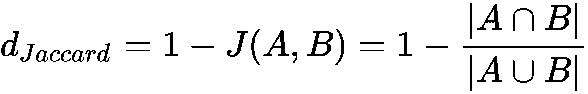

测量两个不同项目集( *A* 和 *B* )之间的差异特别有用。如果我们的特征向量是二进制的，考虑到标准布尔操作符`OR`和`AND`，可以立即应用这个距离。使用之前的测试值，我们得到:

```py
from scipy.spatial.distance import jaccard

d = jaccard(a, b)
print(d)
0.5714285714285714
```

这个度量被限制在*零*(相等向量)和*一*(完全不同)之间。

至于汉明距离，当需要比较由二进制状态组成的项目时(例如*存在/不存在*、*是/否*等等)，它会非常有用。如果您想对 k-NN 采用不同的度量，可以使用`metric`参数直接指定:

```py
nn = NearestNeighbors(n_neighbors=10, radius=5.0, metric='hamming')
nn.fit(items)

nn = NearestNeighbors(n_neighbors=10, radius=5.0, metric='jaccard')
nn.fit(items)
```


# 无模型(或基于记忆)的协同过滤

与基于用户的方法一样，让我们考虑两组元素:用户和项目。然而，在这种情况下，我们并不假设它们具有明确的特征。相反，我们尝试基于每个用户(行)对每个项目(列)的偏好来建模用户-项目矩阵，例如:

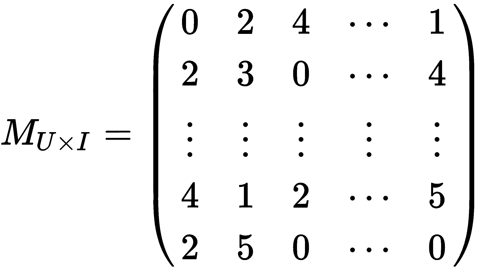

在这种情况下，评分限制在 *1* 和 *5* 之间( *0* 表示没有评分)，我们的目标是根据用户的评分向量(即基于特定类型特征的内部表示)对用户进行聚类。这使得我们即使在没有关于用户的明确信息的情况下也能产生推荐。然而，它有一个缺点，称为**冷启动**，这意味着当新用户没有评级时，不可能找到正确的邻居，因为他们可以属于几乎任何聚类。

一旦聚类完成，就很容易检查哪些产品(尚未评级)对给定用户的评级最高，因此更有可能被购买。在 scikit-learn 中实现一个解决方案是可能的，就像我们以前做的那样，但是我想介绍一个叫做 **Crab** 的小框架(见本节末尾的方框)来简化这个过程。

为了构建模型，我们首先需要将`user_item_matrix`定义为一个 Python 字典，其结构如下:

```py
{ user_1: { item1: rating, item2: rating, ... }, ..., user_n: ... }
```

内部用户字典中缺少值意味着没有评级。在我们的示例中，我们考虑拥有`5`项的`5`用户:

```py
from scikits.crab.models import MatrixPreferenceDataModel

user_item_matrix = {
    1: {1: 2, 2: 5, 3: 3},
    2: {1: 5, 4: 2},
    3: {2: 3, 4: 5, 3: 2},
    4: {3: 5, 5: 1},
    5: {1: 3, 2: 3, 4: 1, 5: 3}
}

model = MatrixPreferenceDataModel(user_item_matrix)
```

一旦定义了`user_item_matrix`，我们需要选择一个度量，因此，需要选择一个距离函数 *d(u [i] ，u [j] )* ，以构建一个相似性矩阵:

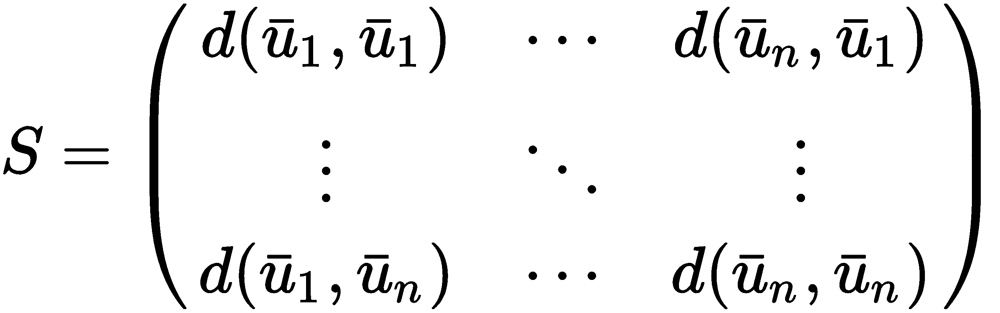

使用 Crab，我们按照以下方式实现这一点(使用欧几里德度量):

```py
from scikits.crab.similarities import UserSimilarity
from scikits.crab.metrics import euclidean_distances

similarity_matrix = UserSimilarity(model, euclidean_distances)
```

有很多指标，比如皮尔森和雅克卡德，所以我建议访问网站([http://muricoca.github.io/crab](http://muricoca.github.io/crab))了解更多信息。此时，可以构建推荐系统(基于 k-NN 聚类方法)并测试它:

```py
from scikits.crab.recommenders.knn import UserBasedRecommender

recommender = UserBasedRecommender(model, similarity_matrix, with_preference=True)

print(recommender.recommend(2))
[(2, 3.6180339887498949), (5, 3.0), (3, 2.5527864045000417)]
```

因此，`recommender`为用户`2`建议以下预测评级:

*   **第 2 项** : 3.6(可四舍五入至 4.0)
*   第五项 : 3
*   **第 3 项** : 2.5(可四舍五入为 3.0)

运行代码时，您可能会看到一些警告(Crab 正在持续开发中)。但是，它们不会影响功能。如果您想避免它们，您可以使用`catch_warnings()`上下文管理器:

```py
import warnings

with warnings.catch_warnings():
    warnings.simplefilter("ignore")
    print(recommender.recommend(2))
```

可以建议所有项目，或者将列表限制在最高评级(例如，避免项目`3`)。这种方法非常类似于基于用户的模型。然而，它速度更快(非常大的矩阵可以并行处理),并且它不关心可能产生误导结果的细节。只有评级被认为是定义用户的有用特征。像基于模型的协同过滤一样，冷启动问题可以通过两种方式解决:

*   要求用户评价一些项目(这种方法经常被采用，因为很容易展示一些电影/书籍的封面，并要求用户选择他们喜欢什么和不喜欢什么)。
*   通过随机分配一些平均评级将用户置于平均邻域中。在这种方法中，可以立即开始使用推荐系统。然而，有必要在开始时接受一定程度的误差，并在产生真实评级时纠正虚假评级。

Crab 是一个用于构建协同过滤系统的开源框架。它仍在开发中，因此没有实现所有可能的功能。然而，它非常容易使用，并且对于许多任务来说非常强大。带有安装说明和文档的主页是 http://muricoca.github.io/crab/index.html。螃蟹靠`scikits.learn`，和 Python 3 还是有些问题的。因此，对于这个例子，我推荐使用 Python 2.7。可以使用`pip` : `pip install -U scikits.learn`和`pip install -U crab`安装两个包。


# 基于模型的协同过滤

这是目前最先进的方法之一，也是上一节已经介绍过的方法的延伸。起点始终是基于评级的用户项目矩阵:

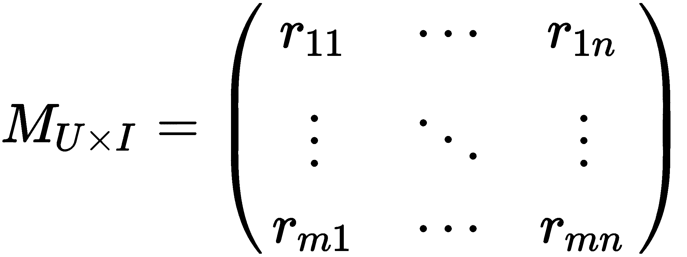

然而，在这种情况下，我们假设用户和商品都存在**潜在因素**。换句话说，我们将一般用户定义如下:

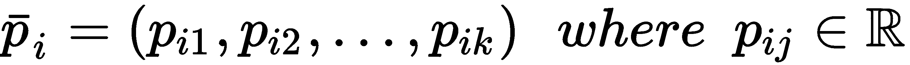

通用物料的定义如下:

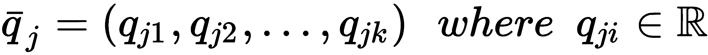

我们不知道每个向量分量的值(因此它们被称为潜在的)，但是我们假设获得如下排序:

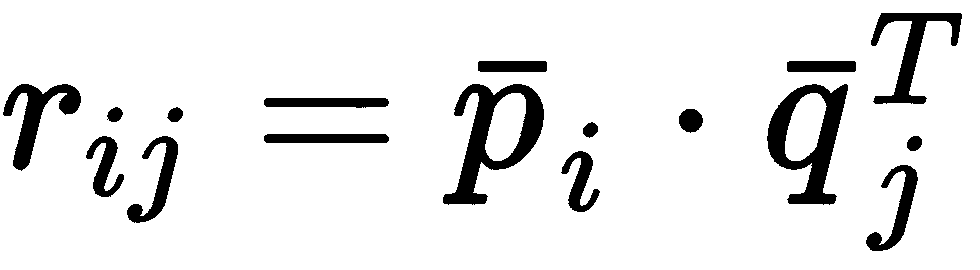

因此，我们可以说，排名是从排名为 *k* 的潜在空间中获得的，其中 *k* 是我们想要在我们的模型中考虑的潜在变量的数量。一般来说，确定 k*的正确值是有规则的，所以最好的方法是检查不同的值，并用已知等级的子集测试模型。然而，还有一个大问题需要解决:找到潜在变量。有几种策略，但是在讨论它们之前，理解我们问题的维度是很重要的。如果我们有 1000 个用户和 500 个产品， *M* 有 500000 个元素。如果我们决定等级等于 10，这意味着我们需要找到 5，000，000 个受已知等级约束的变量。可以想象，这个问题很容易变得无法用标准方法解决，必须采用并行解决方案。*


# 奇异值分解策略

第一种方法基于用户项目矩阵的**奇异值分解** ( **SVD** )。这种技术允许通过低秩分解来变换矩阵，并且也可以以增量的方式使用，如在 2002 年的*用于高度可扩展的推荐系统的增量奇异值分解算法*、*萨瓦 B* 、*卡里皮斯 G* 、*康斯坦 J* 、*里德尔 J* 中所述。特别是，如果用户项矩阵有 *m* 行和 *n* 列:

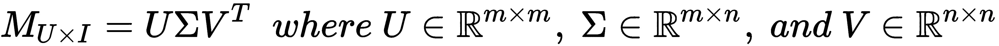

我们已经假设我们有实矩阵(在我们的例子中经常是这样)，但是一般来说它们是复杂的。 *U* 和 *V* 为酉矩阵，而*σ*为矩形对角矩阵。 *U* 的列包含左奇异向量，转置的 *V* 的行包含右奇异向量，而对角矩阵*σ*包含奇异值。选择 *k* 潜在因子意味着取第一个 *k* 奇异值，因此取相应的 *k* 左右奇异向量:

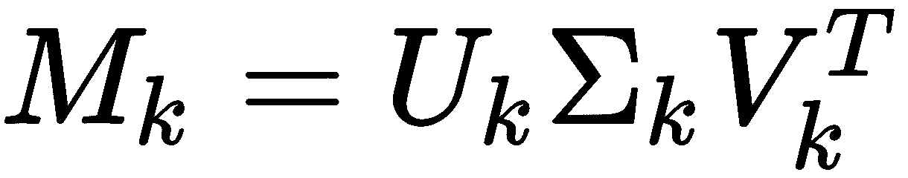

这种技术的优点是对于 *k* 的任何值，最小化 *M* 和 *M [k]* 之差的 Frobenius 范数，因此这是近似完全分解的最佳选择。在进入预测阶段之前，让我们使用 SciPy 创建一个示例。首先要做的是创建一个虚拟的用户项目矩阵:

```py
M = np.random.randint(0, 6, size=(20, 10))

print(M)
array([[0, 4, 5, 0, 1, 4, 3, 3, 1, 3],
       [1, 4, 2, 5, 3, 3, 3, 4, 3, 1],
       [1, 1, 2, 2, 1, 5, 1, 4, 2, 5],
       [0, 4, 1, 2, 2, 5, 1, 1, 5, 5],
       [2, 5, 3, 1, 1, 2, 2, 4, 1, 1],
       [1, 4, 3, 3, 0, 0, 2, 3, 3, 5],
       [3, 5, 2, 1, 5, 3, 4, 1, 0, 2],
       [5, 2, 2, 0, 1, 0, 4, 4, 1, 0],
...
```

我们假设我们有`20`个用户和`10`个产品。评级在`1`和`5`之间，`0`表示不评级。现在，我们可以分解`M`:

```py
from scipy.linalg import svd

import numpy as np

U, s, V = svd(M, full_matrices=True)
S = np.diag(s)

print(U.shape)
(20L, 20L)

print(S.shape)
(10L, 10L)

print(V.shape)
(10L, 10L)
```

现在，让我们只考虑前八个奇异值，它们对于用户和项目都有八个潜在因素:

```py
Uk = U[:, 0:8]
Sk = S[0:8, 0:8]
Vk = V[0:8, :]
```

重要的是要记住，在 SciPy 的 SVD 实现中， *V* 已经被转置了。当不需要完整的矩阵时，可以设置`full_matrices=False`参数。在这种情况下，包含奇异向量的两个矩阵将使用最小维数 *k = min(m，n)* 来切割。因此，尺寸如下所示:

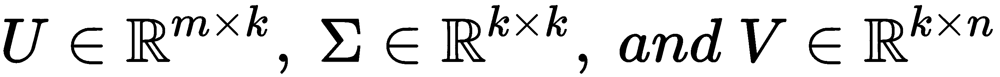

如果所需组件的数量小于或等于 *k* ，这个解决方案允许更快的计算，强烈推荐。

根据*高度可扩展推荐系统的增量奇异值分解算法*、*、*、 *Sarwar B* 、 *Karypis G* 、 *Konstan J* 、 *Riedl J* 、 *2002* ，我们可以很容易地得到一个考虑客户和产品之间余弦相似度(与点积成正比)的预测。两个潜在因素矩阵如下:

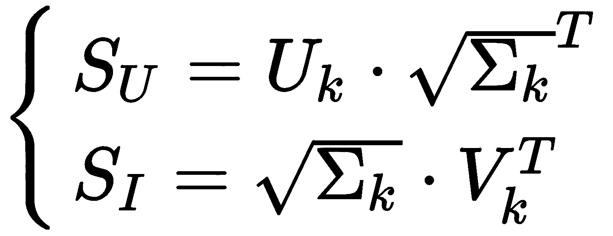

考虑到精确度的损失，考虑每个用户的平均评级(对应于用户-项目矩阵的平均行值)是有用的，因此用户 *i* 和项目 *j* 的最终评级预测变成如下:

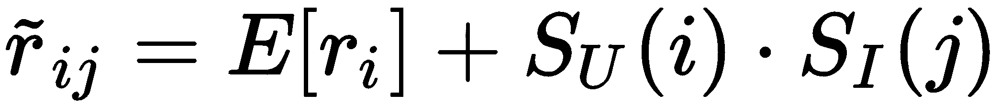

这里， *S [U] (i)* 和 *S [I] (j)* 分别是用户和产品向量。继续我们的示例，让我们确定用户`5`和项目`2`的评级预测:

```py
Su = Uk.dot(np.sqrt(Sk).T)
Si = np.sqrt(Sk).dot(Vk).T
Er = np.mean(M, axis=1)

r5_2 = Er[5] + Su[5].dot(Si[2])

print(r5_2)
2.38848720112
```

这种方法具有中等的复杂性。特别地，SVD 是 *O(m ³ )* 并且当添加新的用户或项目时，必须采用增量策略(如在*用于高度* *可伸缩推荐系统的增量奇异值分解算法*、*萨瓦尔 B* 、*卡里皮斯 G* 、*康斯坦 J* 、*里德尔 J* 、2002 中所述)；然而，当元素的数量不太大时，它可以是有效的。在所有其他情况下，可以采用下一个策略(以及并行架构)。


# 交替最小二乘策略

通过定义以下损失函数，寻找潜在因素的问题可以容易地表达为最小二乘优化问题:

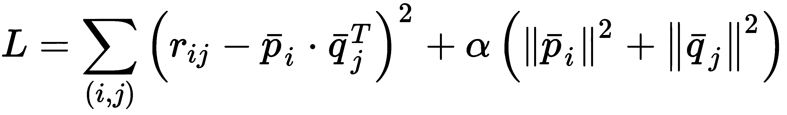

*L* 仅限于已知样本(用户、物品)。第二项作为正则化因子，整个问题可以很容易地用任何优化方法解决。然而，还有一个额外的问题:我们需要确定两组不同的变量(用户和项目因素)。我们可以用一种叫做**交替最小二乘法** ( **ALS** )的方法来解决这个问题，这种方法在*推荐系统的矩阵分解技术*、 *Koren Y* 、 *Bell R* 、 *Volinsky C* 、 *IEEE 计算机杂志*、*8 月**2009*中有所描述该算法非常容易描述，可以概括为两个主要的迭代步骤:**

*   *p[I]固定，*q[j]优化**
*   *q* [*j*] 固定， *p [i]* 优化

当达到预定精度时，算法停止。它可以很容易地用并行策略实现，以便能够在短时间内处理巨大的矩阵。此外，考虑到虚拟聚类的价格，也可以定期重新训练模型，以立即(在可接受的延迟内)包括新产品和用户。


# 使用 Apache Spark MLlib 的 ALS

Apache Spark 超出了本书的范围，所以如果您想了解这个强大框架的更多信息，我建议您阅读在线文档或许多可用书籍中的一本。在*Machine Learning with Spark*、 *Pentreath N* 、 *Packt Publishing* 中，有关于**机器学习库** ( **MLlib** )以及如何实现本书讨论的大部分算法的有趣介绍。

Spark 是一个并行计算引擎，现在是 Hadoop 项目的一部分(即使不使用它的代码)，它可以在本地模式或非常大的聚类(具有数千个节点)上运行，以使用海量数据执行复杂的任务。它主要基于 Scala，尽管也有针对 Java、Python 和 r 的接口。在本例中，我们将使用 PySpark，这是一个内置的 shell，用于使用 Python 代码运行 Spark。

在本地模式下启动 PySpark 后，我们会得到一个标准的 Python 提示符，然后我们就可以开始工作了，就像使用任何其他标准 Python 环境一样:

```py
# Linux
>>> ./pyspark

# Mac OS X
>>> pyspark

# Windows
>>> pyspark

Python 3.X.X |Anaconda X.0.0 (64-bit)| (default, Apr 26 2018, 11:07:13)
Type "help", "copyright", "credits" or "license" for more information.
Anaconda is brought to you by Continuum Analytics.
Please check out: http://continuum.io/thanks and https://anaconda.org
Using Spark's default log4j profile: org/apache/spark/log4j-defaults.properties
Setting default log level to "WARN".
To adjust logging level use sc.setLogLevewl(newLevel).
Welcome to
 ____ __
 / __/__ ___ _____/ /__
 _\ \/ _ \/ _ `/ __/ '_/
 /__ / .__/\_,_/_/ /_/\_\ version 2.0.2
 /_/

Using Python version 3.X.X (default,Apr 26 2018, 11:07:13)
SparkSession available as 'spark'.
>>>
```

Spark MLlib 通过一个非常简单的机制实现 ALS 算法。`Rating`类是元组(用户、产品、评级)的包装器，所以我们可以很容易地定义一个虚拟数据集(这只是一个例子，因为它非常有限):

```py
from pyspark.mllib.recommendation import Rating

import numpy as np

nb_users = 200
nb_products = 100

ratings = []

for _ in range(10):
    for i in range(nb_users):
        rating = Rating(user=i, 
                        product=np.random.randint(1, nb_products), 
                        rating=np.random.randint(0, 5))
        ratings.append(rating)

ratings = sc.parallelize(ratings)
```

我们假设我们有`200`个用户和`100`个产品，并且我们已经通过迭代主循环填充了一个`ratings`的列表，该主循环将一个等级分配给一个随机产品`10`次。我们没有控制重复或其他不寻常的情况。`last sc.parallelize()`命令是一种让 Spark 将我们的列表转换成一种叫做**弹性分布式数据集** ( **RDD** )的结构的方法，这种结构将用于剩余的操作。对这些结构的大小没有实际限制，因为它们分布在不同的执行器上(如果在聚类模式下),并且可以处理 Pb 级数据集，就像我们处理 kb 级数据集一样。

此时，我们可以训练一个`ALS`模型(正式名称为`MatrixFactorizationModel`)并使用它进行一些预测:

```py
from pyspark.mllib.recommendation import ALS

model = ALS.train(ratings, rank=5, iterations=10)
```

我们需要`5`潜在因素和`10`优化迭代。如前所述，为每个模型确定正确的等级并不容易，因此在训练阶段之后，总会有一个使用已知数据的验证阶段。**均方误差** ( **MSE** )是理解模型如何工作的一个好方法。我们可以使用相同的训练数据集来完成。首先要做的是删除 ratings(因为我们只需要由`user`和`product`组成的元组):

```py
test = ratings.map(lambda rating: (rating.user, rating.product))
```

如果您不熟悉 MapReduce 范式，您只需要知道`map()`对所有元素应用相同的函数(在本例中是`lambda`)。现在，我们可以大量预测收视率:

```py
predictions = model.predictAll(test)
```

然而，为了计算误差，我们还需要添加`user`和`product`来获得可以比较的元组:

```py
full_predictions = predictions.map(lambda pred: ((pred.user, pred.product), pred.rating))
```

结果是一系列行，其结构`((user, item), rating)`就像标准字典条目`(key, value)`。这很有用，因为使用 Spark，我们可以通过使用它们的键来连接两个 rdd。我们对原始数据集也做了同样的事情，然后我们继续将训练值与预测相结合:

```py
split_ratings = ratings.map(lambda rating: ((rating.user, rating.product), rating.rating))
joined_predictions = split_ratings.join(full_predictions)
```

现在，对于每个键`(user, product)`我们有两个值:`target`和`prediction`。因此，我们可以计算出均方误差:

```py
mse = joined_predictions.map(lambda x: (x[1][0] - x[1][1]) ** 2).mean()
```

第一个映射将每一行转换成`target`和`prediction`之间的平方差，而`mean()`函数计算平均值。此时，让我们检查我们的错误并产生一个`prediction`:

```py
print('MSE: %.3f' % mse)
MSE: 0.580

prediction = model.predict(10, 20)
print('Prediction: %3.f' % prediction)
Prediction: 2.810
```

因此，我们的误差很小，但是可以通过改变迭代的等级或次数来改善。用户对产品`20`的评分`prediction`约为`2.810`(可四舍五入至 3)。如果您运行代码，这些值可能会不同，因为我们使用的是随机的用户项矩阵。此外，如果您不想使用 shell 并直接运行代码，则需要在文件的开头显式声明`SparkContext`:

```py
from pyspark import SparkContext, SparkConf

conf = SparkConf().setAppName('ALS').setMaster('local[*]')
sc = SparkContext(conf=conf)
```

我们已经通过`SparkConf`类创建了一个配置，并指定了一个应用名和一个主程序(在本地模式下，所有内核都可用)。这足以运行我们的代码。但是，如果您需要更多信息，请访问本章末尾信息框中提到的页面。要运行应用(从 Spark 2.0 开始)，您必须执行以下命令:

```py
# Linux, Mac OSx
./spark-submit als_spark.py

# Windows
spark-submit als_spark.py
```

当使用`spark-submit`运行脚本时，您将看到成百上千的日志行，这些日志行向您告知正在执行的所有操作。其中，在计算结束时，您还会看到打印功能消息(`stdout`)。

当然，这只是对 Spark ALS 的介绍，但我希望了解该过程有多简单以及如何有效解决尺寸限制是有用的。

如果您不知道如何设置环境并启动 PySpark，我建议您阅读在线快速入门指南([https://spark.apache.org/docs/2.1.0/quick-start.html](https://spark.apache.org/docs/2.1.0/quick-start.html))，即使您不知道所有的细节和配置参数，这也很有用。


# 摘要

在本章中，我们讨论了构建推荐系统的主要技术。在一个基于用户的场景中，我们假设我们有足够多的关于用户的信息可以对他们进行聚类，并且我们隐含地假设相似的用户会喜欢相同的产品。通过这种方式，可以很快确定每个新用户的邻居，并推荐被他们的同行积极评价的产品。同样，基于内容的场景是基于根据产品的特殊特征对其进行聚类。在这种情况下，假设较弱，因为购买某个项目或给予肯定评价的用户很可能也会对类似的产品采取同样的做法。

然后，我们引入了协作过滤，这是一种基于显式评级的技术，用于预测所有用户和产品的所有缺失值。在基于内存的变体中，我们不训练模型，而是尝试直接使用用户产品矩阵，寻找测试用户的 k-NN，并通过平均值计算排名。这种方法与基于用户的场景非常相似，也有相同的局限性；特别是，管理大型矩阵非常困难。另一方面，基于模型的方法更复杂，但是在训练模型之后，它可以实时预测评级。此外，还有诸如 Spark 这样的并行框架，可以用来使用廉价的服务器聚类处理大量数据。

在[第 13 章](5afb3604-3bdd-49d1-aea7-df0e414e34ff.xhtml)、*介绍自然语言处理、*我们将介绍一些**自然语言处理** ( **NLP** )技术，这些技术在自动分类文本或使用机器翻译系统时非常重要。