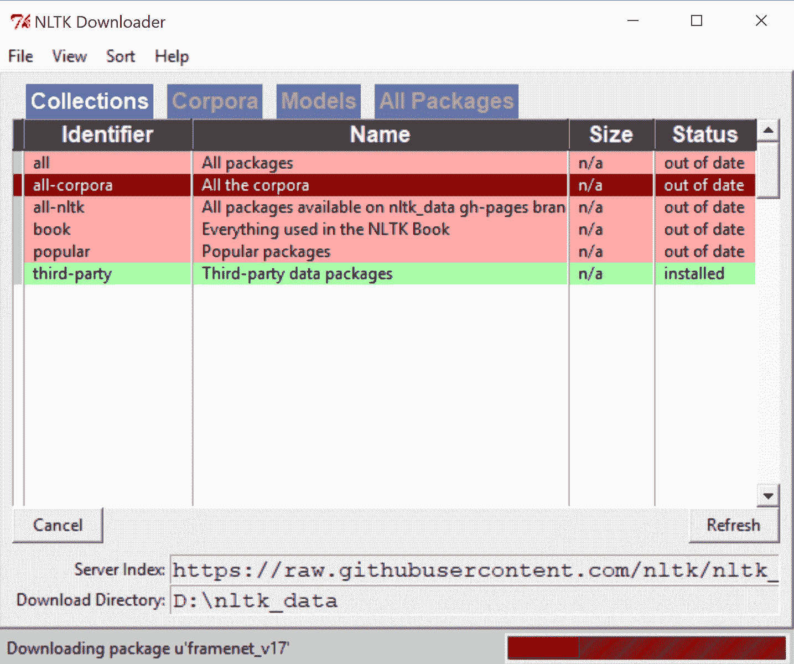
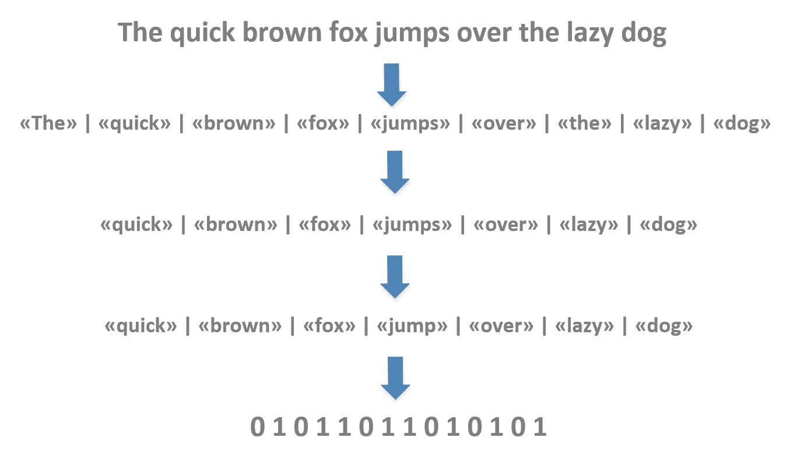
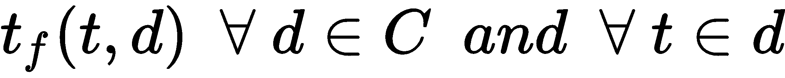
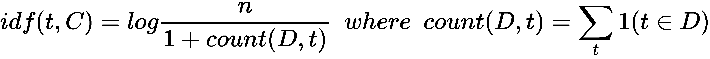
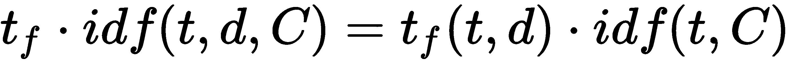

# 十三、自然语言处理简介

**自然语言处理** ( **NLP** )是一套机器学习技术，允许处理文本文档，考虑它们的内部结构和单词的分布。在这一章中，我们将讨论所有收集文本、将它们分解成原子并将其转换成数字向量的常用方法。特别是，我们将比较不同的方法来标记文档(分隔每个单词)，过滤它们，应用特殊的转换来避免屈折或变形形式，并最终建立一个通用的词汇表。使用该词汇表，可以应用不同的矢量化方法来构建可轻松用于分类或聚类目的的特征向量。为了向您展示如何实现整个管道，在本章的最后，我们将为新闻行设置一个简单的分类器。

特别是，我们将讨论以下主题:

*   **自然语言工具包** ( **NLTK** )语料库以及如何访问它们来训练模型
*   **单词包**策略(标记化、停用词移除、词干化和矢量化)
*   **词性** ( **词性**)标注和**命名实体识别** ( **NER** )


# NLTK 和内置语料库

NLTK 是一个非常强大的 Python 框架，它实现了大多数 NLP 算法，本章将与 scikit-learn 一起采用它。而且，NLTK 提供了一些内置的语料库，可以用来测试算法。在开始使用 NLTK 之前，通常需要使用特定的图形界面下载所有附加元素(语料库、词典等等)。这可以通过以下方式实现:

```py
import nltk

nltk.download()
```

该命令将启动用户界面，如下面的屏幕截图所示:



NLTK 下载程序窗口

可以选择每一个特性或下载所有元素(如果有足够的空闲空间，我建议使用这个选项)来立即利用所有 NLTK 功能。或者，可以使用以下命令安装所有依赖项:

```py
python -m nltk.downloader all
```

NLTK 可以使用`pip` ( `pip install -U nltk`)或者在[http://www.nltk.org](http://www.nltk.org)可用的二进制发行版之一来安装。在同一个网站上，有完整的文档可用于深入了解每个主题。


# 语料库示例

提供了古腾堡项目的子集，可以通过以下方式免费访问:

```py
from nltk.corpus import gutenberg

print(gutenberg.fileids())

[u'austen-emma.txt', u'austen-persuasion.txt', u'austen-sense.txt', u'bible-kjv.txt', u'blake-poems.txt', u'bryant-stories.txt', u'burgess-busterbrown.txt', u'carroll-alice.txt', u'chesterton- ...
```

单个文档可以作为原始版本访问，也可以分成句子或单词:

```py
print(gutenberg.raw('milton-paradise.txt'))

[Paradise Lost by John Milton 1667] 

Book I 

Of Man's first disobedience, and the fruit 
Of that forbidden tree whose mortal taste...

print(gutenberg.sents('milton-paradise.txt')[0:2])

[[u'[', u'Paradise', u'Lost', u'by', u'John', u'Milton', u'1667', u']'], [u'Book', u'I']]

print(gutenberg.words('milton-paradise.txt')[0:20])

[u'[', u'Paradise', u'Lost', u'by', u'John', u'Milton', u'1667', u']', u'Book', u'I', u'Of', u'Man', u"'", u's', u'first', u'disobedience', u',', u'and', u'the', u'fruit']
```

正如我们将要讨论的，在许多情况下，使用定制策略将原始文本拆分成单词是非常有用的。在许多其他情况下，直接访问句子允许使用原始的结构细分。其他语料库包括网络文本、路透社新闻专线、布朗语料库等等。例如，Brown Corpus 是一个著名的按流派划分的文档集合:

```py
from nltk.corpus import brown

print(brown.categories())

[u'adventure', u'belles_lettres', u'editorial', u'fiction', u'government', u'hobbies', u'humor', u'learned', u'lore', u'mystery', u'news', u'religion', u'reviews', u'romance', u'science_fiction']

print(brown.sents(categories='editorial')[0:100])

[[u'Assembly', u'session', u'brought', u'much', u'good'], [u'The', u'General', u'Assembly', u',', u'which', u'adjourns', u'today', u',', u'has', u'performed', u'in', u'an', u'atmosphere', u'of', u'crisis', u'and', u'struggle', u'from', u'the', u'day', u'it', u'convened', u'.'], ...]
```

关于语料库的进一步信息可以在 http://www.nltk.org/book/ch02.html 找到。


# 词汇袋策略

在 NLP 中，一个非常常见的管道可以细分为以下步骤:

1.  将文档收集到语料库中
2.  标记化、停用词(冠词、介词等)删除和词干化(简化为基数形式)
3.  建立共同的词汇
4.  向量化文档
5.  对文档进行分类或聚类

这种管道被称为单词包，将在本章中讨论。一个基本的假设是，句子中每个单词的顺序并不重要。事实上，在定义特征向量时，正如我们将要看到的，所考虑的度量总是与频率相关，因此它们对所有元素的局部定位不敏感。从某些观点来看，这是一种限制，因为在自然语言中，句子的内部顺序是保持意思所必需的；然而，有许多模型可以有效地处理文本，而不需要复杂的局部排序。当绝对有必要考虑小序列时，将通过采用标记组(称为 **n-grams** )来完成，但在向量化步骤中将它们视为单个原子元素。

在下图中，有一个示例文档(句子)的流程示意图(不包括第五步):



描述单词袋策略的一系列步骤

有许多不同的方法用于执行每个步骤，其中一些是特定于上下文的。然而，目标总是相同的:最大化文档的信息，并通过删除过于频繁或源自相同基数的术语(如动词)来减少公共词汇表的大小。文档的信息内容实际上是由特定术语(或一组术语)的存在决定的，这些术语在语料库中的出现频率是有限的。在上图所示的例子中， **< <狐狸> >** 和 **< <狗> >** 是重要的术语，而**<<>>**是无用的(通常称为**停用词**)。而且 **< <跳> >** 可以转换成标准形式 **< <跳> >** ，以不同形式呈现时表达一个特定的动作(如*跳*或*跳*)。最后一步是转换成数字向量，因为我们的算法处理数字，限制向量的长度以提高学习速度和内存消耗是很重要的。在接下来的部分中，我们将详细讨论每个步骤，最后，我们将为新闻行构建一个样本分类器。


# 符号化

处理一段文本或一个语料库的第一步是将它分成原子(句子、单词或单词的一部分)，通常定义为**记号**。这样的过程相当简单；然而，解决特定问题可以有不同的策略。


# 句子标记化

在许多情况下，将大文本分成句子是很有用的，句子通常由句号或另一个等价的符号分隔。由于每种语言都有自己的拼写规则，NLTK 提供了`sent_tokenize()`方法，它接受一种语言(默认为英语)并根据特定的规则拆分文本。在下面的示例中，我们展示了该函数在不同语言中的用法:

```py
from nltk.tokenize import sent_tokenize

generic_text = 'Lorem ipsum dolor sit amet, amet minim temporibus in sit. Vel ne impedit consequat intellegebat.'

print(sent_tokenize(generic_text))

['Lorem ipsum dolor sit amet, amet minim temporibus in sit.',
 'Vel ne impedit consequat intellegebat.']

english_text = 'Where is the closest train station? I need to reach London'

print(sent_tokenize(english_text, language='english'))

['Where is the closest train station?', 'I need to reach London']

spanish_text = u'¿Dónde está la estación más cercana? Inmediatamente me tengo que ir a Barcelona.'

for sentence in sent_tokenize(spanish_text, language='spanish'):
    print(sentence)

¿Dónde está la estación más cercana?
Inmediatamente me tengo que ir a Barcelona.
```


# 单词标记化

将句子标记成单词的最简单方法是由`TreebankWordTokenizer`类提供的；然而，这有一些限制:

```py
from nltk.tokenize import TreebankWordTokenizer

simple_text = 'This is a simple text.'

tbwt = TreebankWordTokenizer()

print(tbwt.tokenize(simple_text))

['This', 'is', 'a', 'simple', 'text', '.']

complex_text = 'This isn\'t a simple text'

print(tbwt.tokenize(complex_text))

['This', 'is', "n't", 'a', 'simple', 'text']
```

正如您所看到的，在第一种情况下，句子被正确地拆分成单词，保持标点符号独立(这不是一个真正的问题，因为它可以在第二步中删除)。然而，在复杂的例子中，收缩`isn't`已经被拆分为`is`和`n't`。不幸的是，如果没有进一步的处理步骤，将带缩写的标记转换成其正常形式就不那么容易了(在本例中是`not`)；因此，必须采用另一种策略。`RegexpTokenizer`类提供了一种解决标点符号分离问题的好方法，它提供了一种根据正则表达式拆分单词的灵活方法:

```py
from nltk.tokenize import RegexpTokenizer

complex_text = 'This isn\'t a simple text.'

ret = RegexpTokenizer('[a-zA-Z0-9\'\.]+')

print(ret.tokenize(complex_text))

['This', "isn't", 'a', 'simple', 'text.']
```

使用这个类可以轻松解决大多数常见问题，所以我建议您学习如何编写可以匹配特定模式的简单正则表达式。例如，我们可以删除句子中的所有数字、逗号和其他标点符号:

```py
complex_text = 'This isn\'t a simple text. Count 1, 2, 3 and then go!'

ret = RegexpTokenizer('[a-zA-Z\']+')

print(ret.tokenize(complex_text))

['This', "isn't", 'a', 'simple', 'text', 'Count', 'and', 'the', 'go']
```

即使 NLTK 提供了其他类，它们也可以使用定制的`RegexpTokenizer`来实现，它足够强大，可以解决几乎每一个特定的问题，所以我不想在本章中更深入地讨论这个主题。


# 停用词删除

停用词是正常语音的一部分(冠词、连词等等)，但是它们的出现频率非常高，并且它们不提供任何有用的语义信息。出于这些原因，通过删除所有句子和语料库来过滤它们是一个很好的做法。NLTK 为最常见的语言提供了停用词列表，并且可以立即使用:

```py
from nltk.corpus import stopwords

sw = set(stopwords.words('english'))
```

下面的代码片段显示了英语停用词的子集:

```py
print(sw)

{u'a',
 u'about',
 u'above',
 u'after',
 u'again',
 u'against',
 u'ain'...
```

要过滤一个句子，可以采用功能方法:

```py
complex_text = 'This isn\'t a simple text. Count 1, 2, 3 and then go!'

ret = RegexpTokenizer('[a-zA-Z\']+')
tokens = ret.tokenize(complex_text)
clean_tokens = [t for t in tokens if t not in sw]
print(clean_tokens)
['This', "isn't", 'simple', 'text', 'Count', 'go']
```


# 语言检测

停用词和其他重要特性一样，都与特定的语言密切相关，因此在进行任何其他步骤之前，通常有必要检测该语言。`langdetect`库提供了一个简单、免费、可靠的解决方案，它是从 Google 的语言检测系统移植过来的。它的使用是即时的:

```py
from langdetect import detect

print(detect('This is English'))
en

print(detect('Dies ist Deutsch'))
de
```

该函数返回 ISO 639-1 代码([https://en.wikipedia.org/wiki/List_of_ISO_639-1_codes](https://en.wikipedia.org/wiki/List_of_ISO_639-1_codes))，该代码可用作字典中的关键字来获取完整的语言名称。文本越复杂，检测就越困难，知道是否有歧义是很有用的。可以通过`detect_langs()`方法获得预期语言的概率:

```py
from langdetect import detect_langs

print(detect_langs('I really love you mon doux amour!'))
[fr:0.714281321163, en:0.285716747181]
```

`langdetect` can be installed using `pip` (`pip install --upgrade langdetect`). Further information is available at [https://pypi.python.org/pypi/langdetect](https://pypi.python.org/pypi/langdetect).

# 堵塞物

词干化是用于将特定单词(例如动词或复数)转换成其部首形式的过程，以便保留语义而不增加唯一标记的数量。例如，如果我们考虑三种表达方式*我跑*、*他跑*和*跑*，它们可以简化成一种有用的(虽然语法不正确)形式:*我跑*、*他跑*、*跑*。这样，我们就有了一个定义相同概念的单个标记( *run* )，为了聚类或分类的目的，可以在没有任何精度损失的情况下使用这个标记。NLTK 提供了许多词干分析器实现。最常见(也最灵活)的是基于多语言算法的`SnowballStemmer`:

```py
from nltk.stem.snowball import SnowballStemmer

ess = SnowballStemmer('english', ignore_stopwords=True)
print(ess.stem('flies'))
fli

fss = SnowballStemmer('french', ignore_stopwords=True)
print(fss.stem('courais'))
cour
```

`ignore_stopwords`参数通知词干分析器不要处理停用词。其他实现还有`PorterStemmer`和`LancasterStemmer`。通常，结果是相同的，但在某些情况下，词干分析器可以实现更具选择性的规则，例如:

```py
from nltk.stem.snowball import PorterStemmer
from nltk.stem.lancaster import LancasterStemmer

print(ess.stem('teeth'))
teeth

ps = PorterStemmer()
print(ps.stem('teeth'))
teeth

ls = LancasterStemmer()
print(ls.stem('teeth'))
tee
```

如你所见，雪球和波特算法保持单词不变，而兰开斯特提取一个基数(无意义)。另一方面，后一种算法实现了许多特定的英语规则，这确实可以减少唯一令牌的数量:

```py
print(ps.stem('teen'))
teen

print(ps.stem('teenager'))
teenag

print(ls.stem('teen'))
teen

print(ls.stem('teenager'))
teen
```

不幸的是，Porter 和 Lancaster 词干分析器在 NLTK 中都只有英语版本，所以默认选择通常是 Snowball，它在许多语言中都有，并且可以与适当的停用词集结合使用。


# 矢量化

这是单词包管道的最后一步，是将文本标记转换成数字向量所必需的。最常见的技术基于计数或频率计算，它们都可以在 scikit-learn 中使用稀疏矩阵表示(考虑到许多标记只出现几次，而向量必须具有相同的长度，这是一个可以节省大量空间的选择)。


# 计数矢量化

该算法非常简单，它基于表示一个令牌，考虑它在文档中出现的次数。当然，必须对整个语料库进行处理，以确定存在多少独特的标记及其频率。让我们看一个简单语料库上的`CountVectorizer`类的例子:

```py
from sklearn.feature_extraction.text import CountVectorizer

corpus = [
       'This is a simple test corpus',
       'A corpus is a set of text documents',
       'We want to analyze the corpus and the documents',
       'Documents can be automatically tokenized'
]

cv = CountVectorizer()
vectorized_corpus = cv.fit_transform(corpus)
print(vectorized_corpus.todense())
[[0 0 0 0 0 1 0 1 0 0 1 1 0 0 1 0 0 0 0]
 [0 0 0 0 0 1 1 1 1 1 0 0 1 0 0 0 0 0 0]
 [1 1 0 0 0 1 1 0 0 0 0 0 0 2 0 1 0 1 1]
 [0 0 1 1 1 0 1 0 0 0 0 0 0 0 0 0 1 0 0]]
```

如您所见，每个文档都被转换成了一个固定长度的向量，其中`0`表示相应的标记不存在，而正数表示出现的次数。如果需要排除所有文档频率小于预定义值的令牌，可以通过`min_df`参数设置(默认值为 *1* )。有时，避免使用非常常见的术语会很有用；然而，下一个策略将以更可靠和完整的方式管理这个问题。

词汇表可以通过`vocabulary_`实例变量来访问:

```py
print(cv.vocabulary_)
{u'and': 1, u'be': 3, u'we': 18, u'set': 9, u'simple': 10, u'text': 12, u'is': 7, u'tokenized': 16, u'want': 17, u'the': 13, u'documents': 6, u'this': 14, u'of': 8, u'to': 15, u'can': 4, u'test': 11, u'corpus': 5, u'analyze': 0, u'automatically': 2}
```

给定一个通用向量，可以通过逆变换检索相应的记号列表:

```py
vector = [0, 0, 0, 0, 0, 1, 0, 1, 0, 0, 1, 1, 0, 0, 1, 0, 0, 1, 1]
print(cv.inverse_transform(vector))
[array([u'corpus', u'is', u'simple', u'test', u'this', u'want', u'we'], 
       dtype='<U13')]
```

这种方法和下面的方法都可以使用外部标记器(通过`tokenizer`参数)；可以使用前面章节中讨论的技术对其进行定制:

```py
ret = RegexpTokenizer('[a-zA-Z0-9\']+')
sw = set(stopwords.words('english'))
ess = SnowballStemmer('english', ignore_stopwords=True)

def tokenizer(sentence):
    tokens = ret.tokenize(sentence)
    return [ess.stem(t) for t in tokens if t not in sw]

cv = CountVectorizer(tokenizer=tokenizer)
vectorized_corpus = cv.fit_transform(corpus)
print(vectorized_corpus.todense())
[[0 0 1 0 0 1 1 0 0 0]
 [0 0 1 1 1 0 0 1 0 0]
 [1 0 1 1 0 0 0 0 0 1]
 [0 1 0 1 0 0 0 0 1 0]]
```

有了我们的标记器(使用停用词和词干)，词汇表更短了，向量也更短了。


# N-grams

到目前为止，我们只考虑了单个标记(也称为 **unigrams** )，但是，在许多上下文中，将单词的短序列(**二元模型**或**三元模型**)视为我们的分类器的原子是有用的，就像所有其他标记一样。例如，如果我们正在分析一些文本的情感，考虑二元模型可能是个好主意，比如*相当好*、*非常差*等等。事实上，从语义的角度来看，重要的是不仅要考虑副词，还要考虑整个复合形式。可以告知我们的矢量器我们想要考虑的 n 元文法的范围。例如，如果我们需要 unigrams 和 bigrams，我们可以使用下面的代码片段:

```py
cv = CountVectorizer(tokenizer=tokenizer, ngram_range=(1, 2))
vectorized_corpus = cv.fit_transform(corpus)
print(vectorized_corpus.todense())
[[0 0 0 0 0 1 0 1 0 0 1 1 0 0 1 0 0 0 0]
 [0 0 0 0 0 1 1 1 1 1 0 0 1 0 0 0 0 0 0]
 [1 1 0 0 0 1 1 0 0 0 0 0 0 2 0 1 0 1 1]
 [0 0 1 1 1 0 1 0 0 0 0 0 0 0 0 0 1 0 0]]

print(cv.vocabulary_)
{u'and': 1, u'be': 3, u'we': 18, u'set': 9, u'simple': 10, u'text': 12, u'is': 7, u'tokenized': 16, u'want': 17, u'the': 13, u'documents': 6, u'this': 14, u'of': 8, u'to': 15, u'can': 4, u'test': 11, u'corpus': 5, u'analyze': 0, u'automatically': 2}
```

如您所见，词汇表现在包含了二元模型，向量包含了它们的相对频率。


# TF-IDF 矢量化

计数矢量化最常见的限制是算法在考虑每个标记的频率时没有考虑整个语料库。矢量化的目标通常是为分类器准备数据；因此，有必要避免经常出现的要素，因为当全局出现次数增加时，它们的信息会减少。例如，在关于一项运动的语料库中，单词`match`可能出现在大量的文档中；所以作为分类特征几乎没什么用。为了解决这个问题，我们需要一种不同的方法。如果我们有一个语料库 *C* 和 *n* 个文档，我们定义**词频** ( **TF** )，一个标记在一个文档中出现的次数如下:



我们将**逆文档频率** ( **IDF** )定义为以下度量:



换句话说， *idf(t，C)* 衡量每一项提供了多少信息。事实上，如果 *count(D，t) = n* ，则意味着令牌始终存在并且 *idf(t，C)* 接近 *0* ，反之亦然。分母中的 *1* 项是一个修正因子，它避免了当 count *(D，t) = n* 时出现空 *idf* 。因此，我们不是只考虑 TF，而是通过定义一个新的度量来衡量每个令牌:



scikit-learn 提供了`TfIdfVectorizer`类，我们可以将它应用于上一段中使用的相同玩具语料库:

```py
from sklearn.feature_extraction.text import TfidfVectorizer

tfidfv = TfidfVectorizer()
vectorized_corpus = tfidfv.fit_transform(corpus)
print(vectorized_corpus.todense())
[[ 0\.          0\.          0\.          0\.          0\.          0.31799276
   0\.          0.39278432  0\.          0\.          0.49819711  0.49819711
   0\.          0\.          0.49819711  0\.          0\.          0\.          0\.        ]
...
```

现在让我们检查一下词汇表，以便与简单的计数矢量化进行比较:

```py
print(tfidfv.vocabulary_)
{u'and': 1, u'be': 3, u'we': 18, u'set': 9, u'simple': 10, u'text': 12, u'is': 7, u'tokenized': 16, u'want': 17, u'the': 13, u'documents': 6, u'this': 14, u'of': 8, u'to': 15, u'can': 4, u'test': 11, u'corpus': 5, u'analyze': 0, u'automatically': 2}
```

术语`documents`是两个矢量器的第六个特征，出现在最后三个文档中。你可以看到，它的权重大约是 0.3，而`the`这个词只在第三个文档中出现了两次，它的权重大约是 0.64。一般规则是这样的:如果一个术语代表一个文档，它的权重接近 1.0，而如果在一个样本文档中找到它，我们就不能很容易地确定它的类别，那么它的权重就会降低。

此外，在这种情况下，可以使用外部标记器并指定所需的 n 元语法范围。此外，可以规范化向量(通过`norm`参数)并决定是否包含或排除`idf`分母的加数`1`(通过`smooth_idf`参数)。还可以使用`min_df`和`max_df`参数定义接受文档频率的范围，以便排除出现次数低于或超过最小/最大阈值的标记。它们既接受整数(出现次数)，也接受在*【0.0，1.0】*(文档比例)范围内的浮点数。在下一个示例中，我们使用其中一些参数:

```py
tfidfv = TfidfVectorizer(tokenizer=tokenizer, ngram_range=(1, 2), norm='l2')
vectorized_corpus = tfidfv.fit_transform(corpus)
print(vectorized_corpus.todense())
[[ 0\.          0\.          0\.          0\.          0.30403549  0\.          0.
   0\.          0\.          0\.          0\.          0.47633035  0.47633035
   0.47633035  0.47633035  0\.          0\.          0\.          0\.          0\.        ]
...

print(tfidfv.vocabulary_)
{u'analyz corpus': 1, u'set': 9, u'simpl test': 12, u'want analyz': 19, u'automat': 2, u'want': 18, u'test corpus': 14, u'set text': 10, u'corpus set': 6, u'automat token': 3, u'corpus document': 5, u'text document': 16, u'token': 17, u'document automat': 8, u'text': 15, u'test': 13, u'corpus': 4, u'document': 7, u'simpl': 11, u'analyz': 0}
```

特别是，如果向量必须用作分类器的输入，归一化向量总是一个好的选择，我们将在下一章[第 14 章](11d3e480-6542-411f-96de-642633c42ad8.xhtml)、*自然语言处理*中的主题建模和情感分析中看到。


# 词性

在某些情况下，检测文本的单个语法成分来执行特定的分析是有帮助的。例如，给定一个句子，我们可能有兴趣找到代表动作意图的动词。或者，我们可能需要提取其他属性，比如位置、名称和时间依赖性。尽管这个主题非常复杂，超出了本书的范围，但我们还是想提供一些可以立即应用于更复杂场景的示例。

这个过程的第一步叫做**词性标注**，包括给每个单词添加一个语法标识符。NLTK 有一个基于 **Penn Treebank** POS 语料库的内置模型，它为英语提供了大量的标准标签(完整列表请查看[https://www . ling . upenn . edu/courses/Fall _ 2003/ling 001/Penn _ tree bank _ POS . html](https://www.ling.upenn.edu/courses/Fall_2003/ling001/penn_treebank_pos.html))。为了更好地理解这种动态，让我们考虑几个简单的句子，这些句子使用标准的`work_tokenize()`函数进行标记化(当然，标记化策略没有限制)，并使用`pos_tag()`函数进行处理:

```py
from nltk import word_tokenize, pos_tag

sentence_1 = 'My friend John lives in Paris'

tokens_1 = word_tokenize(sentence_1)
tags_1 = pos_tag(tokens_1)

print(tags_1)
[('My', 'PRP$'), ('friend', 'NN'), ('John', 'NNP'), ('lives', 'VBZ'), ('in', 'IN'), ('Paris', 'NNP')]
```

如您所见，每个令牌都被转换成一个包含 POS 标记的元组。在前面提到的链接中，读者可以找到每个标签的描述；然而，很容易直观地理解其中的一些。例如，`PRP$`标识物主代词，`NNP`是专有名词，`VBZ`是第三人称单数形式的动词。如果我们需要识别动作，我们可以跳过除了`'lives'`(动词)之外的所有标记，专注于意图。一个非常简单的聊天机器人可以解析以下请求:

```py
sentence_2 = 'Search a hotel in Rome'

print(tags_2)
[('Search', 'VB'), ('a', 'DT'), ('hotel', 'NN'), ('in', 'IN'), ('Rome', 'NNP')]
```

动词是`'Search'`，可以和一个具体动作联系起来。介词`'in'`后跟`'Rome'`提供了额外的信息来完成请求。然而，由于`'Rome'`是一个专有名词，我们不能确定它是否匹配意图(例如，对于一个搜索动作，我们期望一个位置)。因此，我们需要引入一个更复杂的工具来帮助消除歧义。


# 命名实体识别

**命名实体识别** ( **NER** )是一种从标记中提取特定语义信息的方法。考虑最后一个例子:我们有兴趣了解罗马是一个城市、一个湖还是一个公司。我们的简单聊天机器人所执行的动作实际上与通用专有名词所指示的上下文元素严格相关(例如，如果罗马是一个城市，则可以很容易地满足请求，而如果是一家公司，则聊天机器人应该询问确切的位置)。让我们考虑另一个例子(第一步与前面的步骤相同):

```py
from nltk import word_tokenize, pos_tag, ne_chunk, tree2conlltags

sentence_2 = 'Search a hotel in Cambridge near the MIT'

print(tree2conlltags(ne_chunk(tags_2)))
[('Search', 'VB', 'O'), ('a', 'DT', 'O'), ('hotel', 'NN', 'O'), ('in', 'IN', 'O'), ('Cambridge', 'NNP', 'B-GPE'), ('near', 'IN', 'O'), ('the', 'DT', 'O'), ('MIT', 'NNP', 'B-ORGANIZATION')]
```

`ne_chunk()`函数执行 NER，但是它输出一个显示关系的树。因为我们想要获得一个元组列表，所以我们需要使用`tree2colltags()`函数。现在每个元组都有一个额外的元素，指示被识别的实体。让我们来关注一下`'Cambridge'`和`'MIT'`。标签`'B-GPE'`表示一个**地缘政治实体** ( **GPE** )(可以是一个城市或一个州，但在很多情况下，这足以限制我们的研究)，而`'B-ORGANIZATION'`则明确表示一家通用公司(上市公司或私营公司)。有了这两条附加信息，我们可以使用 intent `'Search'`并在`Cambridge`中执行对`MIT`的查找。一旦我们获得了一个有效的地址(例如，使用 Google Maps API)，我们就可以寻找离想要的目的地很近的目标(一个酒店)。

由于这是对 NLP 的介绍，我们不能分析更复杂的场景；然而，我邀请读者查阅《用 Python 进行自然语言处理的实践》(hand-On Natural Language Processing)一书*，*， *Arumugam R，Shanmugamani R，Packt Publishing，*， *2018，*以了解更多信息和示例。我还建议阅读标准的 NLTK 文档，在那里可以找到每个特定函数中使用的语言算法和方法的详细描述。


# 基于路透社语料库的样本文本分类器

我们将基于 NLTK Reuters 语料库构建一个样本文本分类器。这条新闻由数千条新闻组成，分为 90 个类别:

```py
from nltk.corpus import reuters

print(reuters.categories())
[u'acq', u'alum', u'barley', u'bop', u'carcass', u'castor-oil', u'cocoa', u'coconut', u'coconut-oil', u'coffee', u'copper', u'copra-cake', u'corn', ...
```

为了简化这个过程，我们将只选取两个类别，它们具有相似数量的文档:

```py
import numpy as np

Xr = np.array(reuters.sents(categories=['rubber']))
Xc = np.array(reuters.sents(categories=['cotton']))
Xw = np.concatenate((Xr, Xc))
```

由于每个文档已经被分割成标记，并且我们想要应用我们的定制标记化器(通过停用词移除和词干化)，我们需要重新构建完整的句子:

```py
X = []

for document in Xw:
    X.append(' '.join(document).strip().lower())
```

现在我们需要准备标签向量，将`0`分配给`rubber`并将`1`分配给`cotton`:

```py
Yr = np.zeros(shape=Xr.shape)
Yc = np.ones(shape=Xc.shape)
Y = np.concatenate((Yr, Yc))
```

此时，我们可以向量化我们的语料库:

```py
tfidfv = TfidfVectorizer(tokenizer=tokenizer, ngram_range=(1, 2), norm='l2')
Xv = tfidfv.fit_transform(X)
```

现在数据集准备好了，我们可以继续将它分成训练和测试子集，最后训练我们的分类器。我决定采用随机森林，因为它对于这种任务特别有效，但是读者可以尝试不同的分类器并比较结果:

```py
from sklearn.model_selection import train_test_split
from sklearn.ensemble import RandomForestClassifier

X_train, X_test, Y_train, Y_test = train_test_split(Xv, Y, test_size=0.25, random_state=1000)

rf = RandomForestClassifier(n_estimators=25)
rf.fit(X_train, Y_train)
score = rf.score(X_test, Y_test)
print('Score: %.3f' % score)
Score: 0.874
```

评分在 88%左右，是相当不错的成绩，但是我们用一句假新闻台词来试一试预测:

```py
test_newsline = ['Trading tobacco is reducing the amount of requests for cotton and this has a negative impact on our economy']

yvt = tfidfv.transform(test_newsline)
category = rf.predict(yvt)
print('Predicted category: %d' % int(category[0]))
Predicted category: 1
```

分类结果正确；然而，通过采用我们将在下一章讨论的一些技术，[第 14 章](11d3e480-6542-411f-96de-642633c42ad8.xhtml)，*自然语言处理中的主题建模和情感分析，*也有可能在更复杂的现实生活问题中获得更好的性能。


# 摘要

在这一章中，我们讨论了所有基本的自然语言处理技术，从语料库的定义开始，直到最终转换成特征向量。我们分析了不同的标记化方法来解决将文档拆分成单词的特定问题或情况。然后，我们介绍了一些过滤技术，这些技术对于删除所有无用的元素(也称为停用词)以及将变形形式转换为标准标记是必要的。

这些步骤对于通过删除常用术语来增加信息内容非常重要。当文档被成功清理后，可以使用一种简单的方法对它们进行矢量化，比如由计数矢量化工具实现的方法，或者一种考虑到术语全局分布的更复杂的方法，比如 TF-IDF。引入后者是为了完成词干提取阶段所做的工作；其实它的目的就是定义在信息量大的情况下，每个分量会接近 1 的向量，反之亦然。通常，出现在许多文档中的单词对于分类器来说不是一个好的标记；因此，如果没有被前面的步骤移除，TF-IDF 将自动减少其重量。在本章的最后，我们构建了一个简单的文本分类器，实现了整个单词包管道，并使用随机森林对新闻行进行分类。

在下一章中，[第 14 章](11d3e480-6542-411f-96de-642633c42ad8.xhtml)，*自然语言处理中的主题建模和情感分析，*我们将简要讨论一些高级技术，如主题建模、潜在语义分析和情感分析，以此来结束这个介绍。