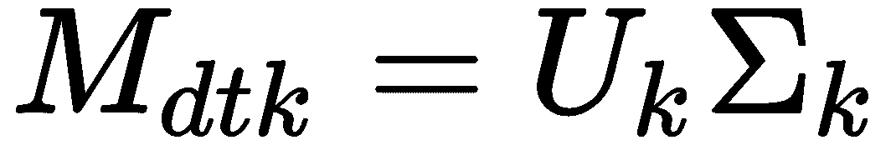
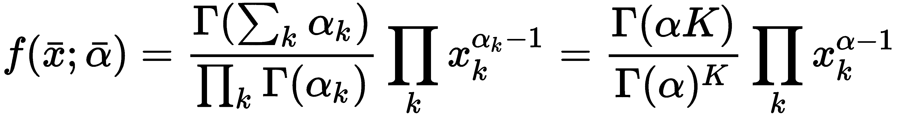

# 十四、自然语言处理中的主题建模和情感分析

在这一章中，我们将介绍一些众所周知的建模方法，并讨论一些应用。**主题建模**是**自然语言处理** ( **NLP** )的一个非常重要的部分，其目的是从文档语料库中提取语义信息。我们要讨论的**潜在语义分析** ( **LSA** )，最著名的方法之一；它基于已经讨论过的基于模型的推荐系统的相同原理。我们还将讨论它的概率变体，**概率潜在语义分析** ( **PLSA** )，其目的是在没有任何先验分布假设的情况下建立潜在因素概率模型。另一方面，**潜在狄利克雷分配** ( **LDA** )是一种类似的方法，假设潜在变量的先验狄利克雷分布。在最后一节中，我们将讨论 **Word2vec** 和情感分析的基础知识，并给出一个基于免费 Twitter 数据集的具体例子。

特别是，我们将讨论以下主题:

*   主题建模
*   带 Gensim 的 Word2vec
*   情感分析


# 主题建模

自然语言处理中主题建模的主要目标是分析语料库，识别文档中的共同主题。在这种情况下，即使我们谈论语义，这个概念也有特定的含义，由一个非常重要的假设驱动。主题来源于同一文档中特定术语的使用，并且在第一个条件为真的情况下，通过不同文档的多样性来确认。

换句话说，我们不考虑面向人的语义，而是考虑处理有意义文档的统计建模(这保证术语的使用旨在表达特定的概念，因此，它们背后有人类语义目的)。由于这个原因，我们所有方法的起点是一个**出现矩阵**，通常定义为**文档-术语矩阵**(我们已经在第 12 章、*介绍自然语言处理*中讨论了计数矢量化和 TF-IDF):


在许多论文中，这个矩阵是转置的(它是一个术语-文档)；然而，scikit-learn 产生了文档术语矩阵，为了避免混淆，我们将考虑这种结构。


# 潜在语义分析

LSA 背后的想法是因式分解 M dw 以便提取一组潜在变量(这意味着我们可以假设它们的存在，但是它们不能被直接观察到),作为文档和术语之间的连接器。正如在第十一章、*介绍推荐系统*中所讨论的，一种很常见的分解方法是**奇异值分解** ( **SVD** ):


然而，我们对完全分解不感兴趣；我们只对由顶部 *k* 奇异值定义的子空间感兴趣:


考虑到 Frobenius 范数，这种近似被认为是最好的近似，因此它保证了非常高的精度。当将其应用于文档术语矩阵时，我们获得以下分解:


下面是一个更紧凑的版本:


这里，第一个矩阵定义了文档和 *k* 潜在变量之间的关系，第二个矩阵定义了 *k* 潜在变量和单词之间的关系。考虑到原始矩阵的结构以及本章开头所解释的内容，我们可以将潜在变量视为定义文档投影的子空间的**主题**。通用文档现在可以定义如下:


再者，每个话题都变成了单词的线性组合。由于许多单词的权重接近于零，我们可以决定只取最上面的 *r* 个单词来定义一个主题；因此，我们得到以下结果:


这里每个*h[Ji]都是对*M[twk]列排序后得到的。为了更好地理解这个过程，让我们展示一个基于 Brown 语料库子集的完整示例(来自`'news'`类别的`500`文档):**

```
from nltk.corpus import brown

sentences = brown.sents(categories=['news'])[0:500]
corpus = []

for s in sentences:
    corpus.append(' '.join(s))
```

定义语料库后，我们需要使用 TF-IDF 方法进行标记化和矢量化:

```
from sklearn.feature_extraction.text import TfidfVectorizer

vectorizer = TfidfVectorizer(strip_accents='unicode', stop_words='english', norm='l2', sublinear_tf=True)
Xc = vectorizer.fit_transform(corpus).todense()
```

现在可以对`Xc`矩阵应用 SVD 了(记住，在 SciPy 中，`V`矩阵已经被转置了):

```
from scipy.linalg import svd

U, s, V = svd(Xc, full_matrices=False)
```

由于语料库不是很小，设置`full_matrices=False`参数有助于节省计算时间。我们假设有两个主题，因此我们可以提取子矩阵:

```
import numpy as np

rank = 2

Uk = U[:, 0:rank]
sk = np.diag(s)[0:rank, 0:rank]
Vk = V[0:rank, :]
```

如果我们想要分析每个主题的前十个单词，我们需要考虑这个:


因此，在使用矢量器提供的`get_feature_names()`方法对矩阵进行排序后，我们可以获得每个主题的最重要的单词:

```
Mtwks = np.argsort(Vk, axis=1)[::-1]

for t in range(rank):
    print('\nTopic ' + str(t))
        for i in range(10):
            print(vectorizer.get_feature_names()[Mtwks[t, i]])

Topic 0
said
mr
city
hawksley
president
...

Topic 1
plainfield
wasn
copy
released
absence
...
```

在这种情况下，我们只考虑`Vk`矩阵中的非负值；然而，由于话题是单词的混合，所以负面成分也应该被考虑在内。在这种情况下，我们需要对`Vk`的绝对值进行排序:

```
Mtwks = np.argsort(np.abs(Vk), axis=1)[::-1]
```

如果我们想分析文档在这个子空间中是如何表示的，我们必须使用这个:



例如，让我们考虑我们的`corpus`的第一个文档:

```
print(corpus[0])
The Fulton County Grand Jury said Friday an investigation of Atlanta's recent primary election produced `` no evidence '' that any irregularities took place .

Mdtk = Uk.dot(sk)

print('d0 = %.2f*t1 + %.2f*t2' % (Mdtk[0][0], Mdtk[0][1]))
d0 = 0.15*t1 + -0.12*t2
```

因为我们是在二维空间中工作，所以绘制每个文档对应的所有点很有意思:


文件分发是两个主题的功能

在上图中，我们可以看到许多文档都是相关的，只有一小部分是异常值。这可能是因为我们对两个主题的选择是限制性的。如果我们使用两个棕色语料库类别(`'news'`和`'fiction'`)重复相同的实验，我们会观察到不同的行为:

```
sentences = brown.sents(categories=['news', 'fiction'])
corpus = []

for s in sentences:
 corpus.append(' '.join(s))
```

剩下的计算我就不重复了，因为都差不多。(唯一的区别是我们的语料库现在稍微大了一点，这导致了更长的计算时间。为此，我们将讨论一个更快的替代方案。)标绘对应于文档的点，我们现在得到以下内容:


文件分发是两个主题的功能

现在更容易区分两组，几乎是*正交*(意思是很多文档只属于一个类别)。我建议用不同的语料库和等级重复这个实验。不幸的是，不可能画出超过三个维度的图，但是只使用数字计算总是可以检查子空间是否正确地描述了底层语义。

正如预期的那样，当出现矩阵很大时，标准的 SciPy SVD 实现会非常慢；然而，scikit-learn 提供了一个截断的 SVD 实现，`TruncatedSVD`，它只与子空间一起工作。结果要快得多(它也可以直接管理稀疏矩阵)。让我们使用这个类重复前面的实验(使用完整的语料库):

```
from sklearn.decomposition import TruncatedSVD

tsvd = TruncatedSVD(n_components=rank)
Xt = tsvd.fit_transform(Xc)
```

通过`n_components`参数，可以设置期望的等级，丢弃矩阵的剩余部分。拟合模型后，我们直接得到文档-主题矩阵 *M [dtk]* 作为`fit_transform()`方法的输出，而主题-单词矩阵 *M [twk]* 可以使用`components_instance`变量访问:

```
Mtws = np.argsort(tsvd.components_, axis=1)[::-1]

for t in range(rank):
    print('\nTopic ' + str(t))
        for i in range(10):
            print(vectorizer.get_feature_names()[Mwts[t, i]])

Topic 0
said
rector
hans
aloud
liston
...

Topic 1
bong
varnessa
schoolboy
kaboom
keeeerist
...
```

读者可以验证这个过程可以快多少；因此，我建议只在需要访问完整矩阵时才使用标准的 SVD 实现。不幸的是，正如文档中所写的，这种方法对算法和随机状态非常敏感。它还会遇到一种称为**符号不确定性**的现象，这意味着如果使用不同的随机种子，所有组件的符号都会改变。正如我们已经在其他章节中所做的那样，我建议声明一个固定的随机种子:

```
import numpy as np

np.random.seed(1000)
```

在每个文件(甚至 Jupyter 笔记本)的开头使用一个固定的种子来这样做，以确保可以重复计算并总是获得相同的结果。

此外，我邀请读者使用**非负矩阵分解** ( **NNMF** )算法重复这个实验，如第 3 章、*特征选择和特征工程*中所述。


# 概率潜在语义分析

之前的模型基于确定性方法，但是也可以在由文档和单词确定的空间上定义概率模型 PLSA。在这种情况下，我们不对先验概率做任何假设(这将在下一个方法中完成)，我们将确定使我们的模型的对数似然最大化的参数。特别是，考虑下图所示的平板符号(如果你想了解更多关于这种技术，请阅读 https://en.wikipedia.org/wiki/Plate_notation】中的[:](https://en.wikipedia.org/wiki/Plate_notation)


PLSA 板块图

我们假设我们有一个由 **m** 个文档组成的语料库，每个文档由 **n** 个单词组成(两个元素都被观察到，因此用灰色圆圈表示)；然而，我们还假设存在有限的一组 *k* 共同的潜在因素(主题),这些潜在因素将一个文档与一组单词联系起来(因为它们没有被观察到，所以圆圈是白色的)。如前所述，我们无法直接观察到它们，但我们可以假设它们的存在。

找到具有特定单词的文档的联合概率如下:


因此，在引入潜在因素后，在特定文档中找到一个单词的条件概率可以写成:


初始联合概率 *P(d，w)* 也可以用潜在因子表示:


这包括先验概率 *p(t)* 。由于我们不想使用它，最好使用表达式 *p(w|d)* 。为了确定这两个条件概率分布，一种常见的方法是**期望最大化** ( **EM** )算法，该算法在[第 2 章](dd32b61f-bc53-4e94-8c17-d5910a8e528d.xhtml)、*机器学习中的重要元素*中介绍。完整的描述可以在*概率潜在语义分析的无监督学习*、*霍夫曼 T* 、*机器学习 42* 、 *177-196* 、 *2001* 、 *Kluwer 学术出版社*中找到。在这种背景下，考虑到复杂性，我们只展示最终结果，没有任何形式证明。

对数似然可以写成如下形式:


如果我们展开所有的项，前面的公式就变成这样:


*M [dw] 为简单起见，我们将通过排除第一项(不依赖于 *t [k]* )来近似它:*


而且，引入条件概率 p *(t|d，w)* 是很有用的，它是给定一个文档和一个单词的情况下，一个题目的概率。EM 算法在后验概率 *P(t|d，w)* (代表实际对数似然的代理)下最大化期望的完全对数似然:


算法的 *E* 阶段可以表示如下:


它必须扩展到所有主题、单词和文档，并且必须用每个主题的总和进行标准化，以始终具有一致的概率。

M 阶段被分成两个计算阶段:


此外，在这种情况下，计算必须扩展到所有主题、单词和文档。但是在第一种情况下，我们按文档求和，并通过按单词和文档求和来归一化，而在第二种情况下，我们按单词求和，并通过文档的长度来归一化。

该算法必须迭代，直到对数似然停止增加其幅度。不幸的是，scikit-learn 没有提供 PLSA 实现(可能因为下一个策略 LDA 被认为更加强大和高效)，所以我们需要从头开始编写一些代码。让我们从定义棕色语料库的一个小子集开始，从`'editorial'`类别中选取`10`个句子，从`'fiction'`类别中选取`10`:

```
sentences_1 = brown.sents(categories=['editorial'])[0:10]
sentences_2 = brown.sents(categories=['fiction'])[0:10]
corpus = []

for s in sentences_1 + sentences_2:
    corpus.append(' '.join(s))
```

现在我们可以使用`CountVectorizer`类进行矢量化:

```
import numpy as np

from sklearn.feature_extraction.text import CountVectorizer

cv = CountVectorizer(strip_accents='unicode', stop_words='english')
Xc = np.array(cv.fit_transform(corpus).todense())
```

在这一点上，我们可以定义`rank`(为了简单起见，我们选择`2`)、稍后将使用的两个常数以及保存概率 *p(t|d)* 、 *p(w|t)* 和 *p(t|d，w)* 的矩阵:

```
import numpy as np

rank = 2
alpha_1 = 1000.0
alpha_2 = 10.0

Ptd = np.random.uniform(0.0, 1.0, size=(len(corpus), rank))
Pwt = np.random.uniform(0.0, 1.0, size=(rank, len(cv.vocabulary_)))
Ptdw = np.zeros(shape=(len(cv.vocabulary_), len(corpus), rank))

for d in range(len(corpus)):
    nf = np.sum(Ptd[d, :])
    for t in range(rank):
       Ptd[d, t] /= nf

for t in range(rank):
    nf = np.sum(Pwt[t, :])
    for w in range(len(cv.vocabulary_)):
       Pwt[t, w] /= nf
```

两个矩阵 *p(t|d)* 、 *p(w|t)* 必须被归一化以便与算法一致；另一个被初始化为零。现在我们可以定义`log_likelihood`函数了:

```
def log_likelihood():
    value = 0.0

    for d in range(len(corpus)):
       for w in range(len(cv.vocabulary_)):
          real_topic_value = 0.0

          for t in range(rank):
             real_topic_value += Ptd[d, t] * Pwt[t, w]

          if real_topic_value > 0.0:
             value += Xc[d, w] * np.log(real_topic_value)

    return value
```

我们还可以定义`expectation()`和`maximization()`函数:

```
 def expectation():
    global Ptd, Pwt, Ptdw

    for d in range(len(corpus)):
       for w in range(len(cv.vocabulary_)):
          nf = 0.0

          for t in range(rank):
             Ptdw[w, d, t] = Ptd[d, t] * Pwt[t, w]
             nf += Ptdw[w, d, t]

          Ptdw[w, d, :] = (Ptdw[w, d, :] / nf) if nf != 0.0 else 0.0
```

在前面的函数中，当归一化因子为`0`时，对于每个主题，概率 *p(t|w，d)* 被设置为`0.0`:

```
def maximization():
    global Ptd, Pwt, Ptdw

    for t in range(rank):
       nf = 0.0

       for d in range(len(corpus)):
          ps = 0.0

          for w in range(len(cv.vocabulary_)):
             ps += Xc[d, w] * Ptdw[w, d, t]

          Pwt[t, w] = ps
          nf += Pwt[t, w]

       Pwt[:, w] /= nf if nf != 0.0 else alpha_1

    for d in range(len(corpus)):
       for t in range(rank):
          ps = 0.0
          nf = 0.0

          for w in range(len(cv.vocabulary_)):
             ps += Xc[d, w] * Ptdw[w, d, t]
             nf += Xc[d, w]

          Ptd[d, t] = ps / (nf if nf != 0.0 else alpha_2)
```

当归一化因子变为 0 时，使用常量`alpha_1`和`alpha_2`。在这种情况下，为概率指定一个小值会很有用；因此，我们将分子除以这些常数。我建议尝试不同的值，以便为不同的任务调整算法。

此时，我们可以用有限的迭代次数来尝试我们的算法:

```
print('Initial Log-Likelihood: %f' % log_likelihood())

for i in range(50):
    expectation()
    maximization()
    print('Step %d - Log-Likelihood: %f' % (i, log_likelihood()))

Initial Log-Likelihood: -1242.878549
Step 0 - Log-Likelihood: -1240.160748
Step 1 - Log-Likelihood: -1237.584194
Step 2 - Log-Likelihood: -1236.009227
Step 3 - Log-Likelihood: -1234.993974
Step 4 - Log-Likelihood: -1234.318545
...
```

可以在第 30 步后验证收敛性。此时，我们可以检查每个主题的前五个单词，考虑到按每个主题权重降序排序的 *p(w|t)* 条件分布:

```
Pwts = np.argsort(Pwt, axis=1)[::-1]

for t in range(rank):
    print('\nTopic ' + str(t))
        for i in range(5):
          print(cv.get_feature_names()[Pwts[t, i]])

Topic 0
years
questions
south
reform
social

Topic 1
convened
maintenance
penal
year
legislators
```


# 潜在狄利克雷分配

在前面的方法中，我们在分发之前没有对主题做任何假设，这可能会导致一个限制，因为算法不是由任何现实世界的直觉驱动的。相反，LDA 是基于这样一种思想，即一个主题由一小群重要的词来表征，通常一个文档不会包含很多主题。为此，主要假设先验主题分布是一个**对称** **狄利克雷**分布( *α [1] = α [2] =...= α [K] = α* )。概率密度函数定义如下:



如果浓度参数 *α* 小于 1.0，分布将如期望的那样稀疏。这允许我们对主题-文档和主题-单词分布进行建模，这些分布总是集中在几个值上。这样我们可以避免以下情况:

*   分配给文档的主题混合变得扁平(许多主题具有相似的权重)
*   考虑单词集合变得类似于背景的主题结构(事实上，只有有限数量的单词必须是重要的；否则，语义边界会消失)

使用板块符号，我们可以表示文档、主题和单词之间的关系，如下图所示:


潜在狄利克雷分配的图版图

在上图中， **α** 是用于主题-文档分布的狄利克雷参数，而 **γ** 对于主题-词分布具有相同的作用。相反， **θ** 是特定文档的主题分布，而 **β** 是特定单词的主题分布。

如果我们有一个由 **m** 个文档组成的语料库和一个由 **n** 个单词组成的词汇表(每个文档有*n[I]t*个单词),并且我们假设有 **k** 个不同的主题，那么生成算法可以用以下步骤来描述:

1.  对于每个文档，我们从主题-文档分布中抽取一个样本(主题混合物):


2.  对于每个主题，我们从主题词分布中抽取一个样本:


这两个参数都必须被估计。此时，考虑到出现矩阵*M[dw]和符号*z[Mn]来定义分配给第*M*文档中第 n*个单词的主题，我们可以迭代文档(索引 *d* 和单词(索引 *w* ):*

*   根据**分类分布**选择文档 *d* 和单词 *w* 的主题，考虑到狄利克雷分布是其共轭先验:


*   根据以下内容选择一个单词:


在这两种情况下，*分类*分布都是一次试验的多项式分布。如何估计参数的完整描述相当复杂，超出了本书的范围；然而，主要问题是找到潜在变量的分布:


读者可以在*潜在狄利克雷分配*、 *Blei D* 、 *Ng A* 、 *Jordan M* 、*机器学习研究杂志*、 *3* 、 *(2003) 993-1022 中找到更多信息。*然而，LDA 和 PLSA 之间一个非常重要的区别是 LDA 的生成能力，它允许处理看不见的文档。事实上，PLSA 训练过程仅针对语料库找到最优参数 *p(t|d)* ，而 LDA 采用随机变量。通过将 theta(主题混合)的概率定义为与一组主题和一组单词的联合，并以下列模型参数为条件，可以理解这个概念:


如前面提到的论文中所示，以模型参数为条件的文档(一组单词)的概率可以通过积分获得(所有的数学证明由于其复杂性而被省略，但是它们可以在前面提到的论文中找到):


这个表达显示了 PLSA 和 LDA 的不同。一旦学会， *p(t|d)* PLSA 不能概括，而 LDA，从随机变量中取样，总能为一个看不见的文档找到合适的主题组合。

scikit-learn 通过`LatentDirichletAllocation`类提供了完整的 LDA 实现。我们将把它用于一个更大的数据集(4000 个文档),这个数据集是从 Brown 语料库的一个子集构建的:

```
sentences_1 = brown.sents(categories=['reviews'])[0:1000]
sentences_2 = brown.sents(categories=['government'])[0:1000]
sentences_3 = brown.sents(categories=['fiction'])[0:1000]
sentences_4 = brown.sents(categories=['news'])[0:1000]
corpus = []

for s in sentences_1 + sentences_2 + sentences_3 + sentences_4:
    corpus.append(' '.join(s))
```

现在，我们可以通过假设我们有八个主要主题来矢量化、定义和训练我们的 LDA 模型:

```
from sklearn.decomposition import LatentDirichletAllocation

cv = CountVectorizer(strip_accents='unicode', stop_words='english', analyzer='word', token_pattern='[a-z]+')
Xc = cv.fit_transform(corpus)

lda = LatentDirichletAllocation(n_topics=8, learning_method='online', max_iter=25)
Xl = lda.fit_transform(Xc)
```

在`CountVectorizer`中，我们添加了一个正则表达式，通过`token_pattern`参数过滤令牌。这很有用，因为我们没有使用完整的标记器，而且在语料库中，也有许多我们想要过滤掉的数字。`LatentDirichletAllocation`类允许我们指定学习方法(通过`learning_method`)，可以是`'batch'`或`'online'`。我们选择了`'online'`,因为它更快；然而，这两种方法都采用变分贝叶斯来学习参数。前者采用整个数据集，而后者使用小批量。在 0.20 版本中将删除`'online'`选项；因此，现在使用它时，您会看到一个弃用警告。theta 和 beta 狄利克雷参数都可以通过`doc_topic_prior` (theta)和`topic_word_prior` (beta)来指定。默认值(我们也采用)是 1.0 / `n_topics`。保持两个值都很小很重要，特别是小于 1.0，以鼓励稀疏。最大迭代次数(`max_iter`)和其他学习相关的参数可以通过阅读内置文档或访问[http://sci kit-learn . org/stable/modules/generated/sk learn . decomposition . latentdirichletallocation . html](http://scikit-learn.org/stable/modules/generated/sklearn.decomposition.LatentDirichletAllocation.html)来应用。

现在，我们可以通过提取每个主题的前五个关键词来测试我们的模型。与`TruncatedSVD`一样，主题词分布结果存储在`components_`实例变量中:

```
Mwts_lda = np.argsort(lda.components_, axis=1)[::-1]

for t in range(8):
    print('\nTopic ' + str(t))
       for i in range(5):
          print(cv.get_feature_names()[Mwts_lda[t, i]])

Topic 0
code
cadenza
unlocks
ophthalmic
quo

Topic 1
countless
harnick
leni
addle
chivalry

...
```

有一些重复，可能是由于一些题目的构成，读者可以尝试不同的先验参数来观察变化。可以做一个实验来检验这个模型是否正确。

让我们考虑两个文档:

```
print(corpus[0])
It is not news that Nathan Milstein is a wizard of the violin.

print(corpus[2500])
The children had nowhere to go and no place to play , not even sidewalks.
```

它们非常不同，主题分布也是如此:

```
print(Xl[0])
[ 0.85412134 0.02083335 0.02083335 0.02083335 0.02083335 0.02083677
 0.02087515 0.02083335]

print(Xl[2500])
[ 0.22499749 0.02500001 0.22500135 0.02500221 0.025 0.02500219
 0.02500001 0.42499674]
```

对于第一个文档，我们有一个主导主题( *0.85t [0]* )，对于第二个文档，我们有一个混合主题(*0.22t[0]+0.22t[2]+0.42t[7]*)。现在让我们考虑两个文档的连接:

```
test_doc = corpus[0] + ' ' + corpus[2500]
y_test = lda.transform(cv.transform([test_doc]))

print(y_test)
[[ 0.61242771 0.01250001 0.11251451 0.0125011 0.01250001 0.01250278
 0.01251778 0.21253611]]
```

在结果文档中，不出所料，混合物发生了变化:*0.61t[0]+0.11t[2]+0.21t[7]*。换句话说，该算法通过削弱主题 *2* 和主题 *7* 引入了之前占优势的主题 *5* (现在更强了)。这是合理的，因为第一个文档的长度小于第二个文档，因此主题 *5* 不能完全抵消其他主题。


# 使用 Gensim 介绍 Word2vec

自然语言处理和主题建模中最常见的问题之一是由词袋策略的语义无关结构所代表的。事实上，正如上一章所讨论的，[第 13 章](5afb3604-3bdd-49d1-aea7-df0e414e34ff.xhtml)，*介绍自然语言处理，*这种策略是基于频率计数的，并没有考虑记号的位置和相似性。这个问题可以通过使用 n-gram 得到部分缓解；然而，仍然无法检测单词的上下文相似性。例如，假设一个语料库包含句子*约翰住在巴黎*和*马克住在罗马*。如果我们进行**词性** ( **词性**)和**命名实体识别** ( **NER** )标注，我们可以发现*约翰*和*马克*是专有名词*巴黎*和*罗马*是城市。因此，我们可以推断，这两个句子共享相同的结构；*巴黎*和*罗马*一定有相似之处(至少，限于特定语境)。

我们将要介绍的技术(称为 **Word2vec** )就是为了克服这个问题而设计的，它为我们提供了代表每个单词的特征向量(*w[I]∈ℜ^m*，其中 *m* 是维度)，因此它们的距离与它们的相异度成比例。让我们考虑下图:


代表三个单词及其关系的特征向量

在这种情况下，我们分析的是三个词:*巴黎*、*罗马*、*汽车*(方块代表对应的特征向量)。如果我们将另一个句子添加到我们的语料库中(例如，*汽车是交通工具*，我们期望如下:


换句话说，上下文语义必须迫使城市比出现在完全不同的上下文中的术语*汽车*更接近。当然，这不是确定语义的一种非常精确的方法，但是它可以极大地提高许多模型的性能。显然，代价是存储特征向量所需的额外空间(特征向量可能很长，例如， *m > 200* )，但是，另一方面，代价可以减少确定术语相似性时的计算成本。对算法的完整描述(实际上并不复杂)需要一些深度学习知识，而且，由于这是一本介绍性的书，我们更喜欢直接展示一些使用 Gensim 框架的示例(有关更多信息，请参见本节末尾的信息框)。对细节感兴趣的读者可以阅读原文*词语的分布表示及其构成*、*米科洛夫 T* 、*苏茨科夫 I* 、*陈 K* 、*科拉多 G* 。，*院长 J* 。，*arXiv:1310.4546【cs。CL]* 和网站[https://code.google.com/archive/p/word2vec/](https://code.google.com/archive/p/word2vec/)。

我们现在可以使用**自然语言工具包** ( **NLTK** )内置的棕色语料库来测试 Word2vec 模型。第一步是加载数据集，将所有单词设置为小写(否则，两个版本会被视为不同的标记)并删除停用词:

```
from nltk.corpus import brown
from nltk.corpus import stopwords

brown_corpus = brown.sents()

sw = set(stopwords.words('english'))

corpus = []

for sent in brown_corpus:
    c_sent = [w.strip().lower() for w in sent if w.strip().lower() not in sw]
    corpus.append(c_sent)
```

此时，我们可以实例化 Gensim `Word2Vec`类，设置`size=300`(特征向量维数)，和`window=10`(该参数与底层算法严格相关；但是，它决定了在预测目标时要考虑的周围单词的数量)。出于我们的目的，我们可以说小窗口限制了上下文，而大窗口会创建错误的语义关系。我建议从默认值(`window=5`)开始，只有当最终精度低于预期时才增加。`min_count`参数决定了令牌出现的最少次数，而`workers`有助于利用现代 CPU 的多处理特性(我们将使用所有可用的内核):

```
import multiprocessing

from gensim.models import Word2Vec

model = Word2Vec(corpus, size=300, window=10, min_count=1, workers=multiprocessing.cpu_count())
wv = model.wv
del model 
```

一旦模型被定型，复制单词向量并删除实例以节省内存是一个好主意。我们现在可以检查这个算法的特性。让我们开始分析向量的结构:

```
print(wv['committee'])

[  3.43790025e-01   1.70713723e-01   4.63349819e-02  -3.11405450e-01

   2.85413533e-01   4.22946483e-01   7.18410164e-02   6.64607957e-02

   4.88715507e-02  -2.26669595e-01  -1.02209471e-01  -3.95602554e-01

   4.93697792e-01   3.61298062e-02  -1.56762660e-01   1.78436086e-01

   1.88913181e-01  -2.47268111e-01  -3.87201369e-01  -2.34532371e-01

   5.29331207e-01  -5.41749746e-02  -1.57853425e-01  -2.29428243e-02
...
```

可以看到，字典中包含的每个单词现在都表示为一个 300 维的实向量。这些值可以输入复杂的模型(例如，**深度神经网络** ( **DNN** )或**支持向量机** ( **支持向量机**))，但 Gensim 也提供了一些非常有用的实用函数。让我们假设，例如，我们发现了一个没有被分析的单词，我们想要检查与它严格相关的术语。我们可以使用`most_similar()`函数获得最相似的令牌列表:

```
print(wv.most_similar('house'))

[('door', 0.9965364933013916), ('room', 0.9964739084243774), ('turned', 0.9958587884902954), ('left', 0.9955481886863708), ('walked', 0.9954644441604614), ('plunged', 0.9951649904251099), ('corridor', 0.9951382875442505), ('side', 0.9950708150863647), ('open', 0.9949836134910583), ('deduce', 0.993992805480957)]
```

在这种情况下，我们没有找到同义词，而是找到了一组与查询词(`'house'`)具有相同上下文语义的术语。一般来说，这种查询的结果依赖于语料库，并且当它被构建来满足特定要求时会变得非常准确。例如，商业聊天机器人可以使用 FAQ 进行训练，因此它能够立即将问题与潜在的匹配答案相关联。考虑我们的例子，一家家具公司可以有一个知识库，其中有许多包含与`'house'`相关联的单词`'door'`的问题；因此，当检测到后一项时，自动系统可以基于项`'door'`和`'room'`显示一些建议。另一个问题是确定单词之间的相似性:

```
print(wv.similarity('committee', 'president'))
0.967507
```

`similarity()`函数计算相应特征向量的反距离。在这种情况下，例如，我们知道，给定棕色语料库，单词`'committee'`和`'president'`是严格相关的，因为它们在许多句子中出现在相同的上下文中。重要的是要记住，Word2vec 使用本地语义模型；因此，这种相似性有时会显得*怪异*。我邀请读者使用不同的语料库(可能是非常有针对性的语料库)重复这个练习，并使用 **t 分布随机邻居嵌入** ( **t-SNE** )来可视化单词向量的子集。

gensim([https://radimrehurek.com/gensim/](https://radimrehurek.com/gensim/))是一个针对高级自然语言处理、主题建模和单词嵌入而优化的 Python 框架。可以使用标准的`pip install -U gensim`命令进行安装。关于进一步的细节和完整的文档，我建议查看官方网站。


# 情感分析

NLP 最广泛的应用之一是短文本(推文、帖子、评论、评论等等)的**情感分析**。从营销的角度来看，理解这些信息在表达情感方面的语义是非常重要的。正如你所理解的，当评论是精确的，并且只包含一组肯定/否定的词语时，这项任务可能是非常容易的，但是当在同一个句子中有可能相互冲突的不同命题时，它就变得更加复杂了。例如，*我喜欢那家酒店。这是一次美妙的经历*显然是正面评价，而*酒店不错；然而，这家餐厅很糟糕，而且，即使服务员很友好，我也不得不与一名接待员打架，以获得另一个枕头*。在这种情况下，情况更难管理，因为既有积极的因素，也有消极的因素，从而导致了中立的审查。出于这个原因，许多应用不是基于二元决策，而是接受中间水平(至少一个来表示中立)。

这类问题通常会受到监督(正如我们将要做的)，但也有更便宜、更复杂的解决方案。评估情感最简单的方法是寻找特定的关键词。这种基于字典的方法速度很快，加上一个好的词干分析器，可以立即标记肯定和否定的文档。另一方面，它没有考虑术语之间的关系，也无法了解如何对不同的组件进行加权。例如，*可爱的一天；坏情绪*将导致中性 *(+1，-1)* ，而使用监督方法，有可能使模型了解到*情绪*非常重要，而*坏情绪*通常会导致负面情绪。其他方法(复杂得多)基于主题建模(你现在可以理解如何应用 LSA 或 LDA 来确定积极或消极的潜在主题)；然而，他们需要进一步的步骤来使用主题-单词和主题-文档分布。这在评论的真实语义中是有帮助的，例如，一个积极的形容词通常与其他类似的成分(如动词)一起使用。比如*可爱的酒店；我一定会回来的。在这种情况下(如果样本数量足够大)，一个话题可以从词语的组合中浮现出来，比如*可爱的*或者*惊艳的、*和(正)动词，比如*归来的*或者*回来的*。*

另一种方法是考虑正面和负面文档的主题分布，并在主题子空间中使用监督方法。其他方法包括深度学习技术(如 Word2vec 或 fastText ),并基于生成向量空间的想法，在该空间中相似的单词彼此靠近，以轻松管理同义词。例如，如前一节所述，如果训练集包含句子*可爱的酒店、*但不包含*美妙的酒店*，则 Word2vec 模型可以从其他示例中了解到*可爱的*和*美妙的*非常接近。因此，新文档*精彩酒店*立即使用第一条评论提供的知识进行分类。

现在让我们考虑我们的例子，它基于 *Twitter 情感分析训练语料库*数据集的子集。为了加快这个过程，我们将实验限制在 10 万条推特上。下载文件后(见本段末尾的方框)，有必要对其进行解析(使用 UTF-8 编码):

```
dataset = 'dataset.csv'

corpus = []
labels = []

with open(dataset, 'r', encoding='utf-8') as df:
    for i, line in enumerate(df):
    if i == 0:
       continue

    parts = line.strip().split(',')
    labels.append(float(parts[1].strip()))
    corpus.append(parts[3].strip())
```

`dataset`变量必须包含 CSV 文件的完整路径。该过程读取所有行，跳过第一行(即标题)，并将每条 tweet 作为一个新的列表条目存储在`corpus`变量中，并将相应的情绪(二进制、`0`或`1`)存储在`labels`变量中。在这一点上，我们照常进行，标记化、矢量化，并准备训练和测试集:

```
from nltk.tokenize import RegexpTokenizer
from nltk.corpus import stopwords
from nltk.stem.lancaster import LancasterStemmer

from sklearn.feature_extraction.text import TfidfVectorizer
from sklearn.model_selection import train_test_split

rt = RegexpTokenizer('[a-zA-Z0-9\.]+')
ls = LancasterStemmer()
sw = set(stopwords.words('english'))

def tokenizer(sentence):
    tokens = rt.tokenize(sentence)
    return [ls.stem(t.lower()) for t in tokens if t not in sw]

tfv = TfidfVectorizer(tokenizer=tokenizer, sublinear_tf=True, ngram_range=(1, 2), norm='l2')
X = tfv.fit_transform(corpus[0:100000])
Y = np.array(labels[0:100000])

X_train, X_test, Y_train, Y_test = train_test_split(X, Y, test_size=0.1, random_state=1000)
```

我们选择在`RegexpTokenizer`实例中包含点、字母和数字，因为它们对于表达特定的情感很有用。此外，`ngram_range`已经被设置为`(1, 2)`，所以我们包括二元模型(读者也可以尝试三元模型)。此时，我们可以训练一个随机森林:

```
from sklearn.ensemble import RandomForestClassifier

import multiprocessing

rf = RandomForestClassifier(n_estimators=20, n_jobs=multiprocessing.cpu_count())
rf.fit(X_train, Y_train)
```

现在，我们可以生成一些指标来评估模型:

```
from sklearn.metrics import precision_score, recall_score

print('Precision: %.3f' % precision_score(Y_test, rf.predict(X_test)))
Precision: 0.720

print('Recall: %.3f' % recall_score(Y_test, rf.predict(X_test)))
Recall: 0.784
```

性能不是很好(使用 Word2vec 可以获得更好的精度)。然而，它们对于许多任务来说是可以接受的。特别是，78%的召回意味着大约 20%的假阴性，当使用情感分析进行自动处理任务时，这可能是有用的(在许多情况下，自动发布负面评论的风险阈值相当低，因此，必须采用更好的解决方案)。这些性能也可以通过相应的 ROC 曲线来证实:


情绪分析器的 ROC 曲线

示例中使用的 *Twitter 情感分析训练语料库*数据集(作为 CSV 文件)可以从[http://thinknook . com/WP-content/uploads/2012/09/perspective-Analysis-dataset . zip](http://thinknook.com/wp-content/uploads/2012/09/Sentiment-Analysis-Dataset.zip)下载。考虑到数据量，训练过程可能会非常长(甚至在较慢的机器上需要几个小时)。


# 基于 NLTK 的 VADER 情感分析

对于英语语言，NLTK 提供了一个已经训练好的模型，称为**配价感知词典和情感推理机** ( **VADER** )，其工作方式略有不同，采用规则引擎和词典来推断一段文本的情感强度。更多信息和细节可以在 *VADER:一个基于规则的社交媒体文本情感分析的简约模型*、*休顿* C *J* 、*吉尔伯特 E* 、 *AAAI* 、 *2014 中找到。*

NLTK 版本使用了`SentimentIntensityAnalyzer`类，并且可以立即用于由四个部分组成的极性情感测量:

*   积极因素
*   消极因素
*   中性因素
*   复合因子

前三个不需要任何解释，而最后一个是一个特定的度量(标准化的总得分)，计算如下:


这里，*情绪(w [i] )* 是单词*w[I]的得分价， *α* 是应该逼近最大期望值的归一化系数(NLTK 中设置的默认值为 15)。这个类的用法是直接的，下面的代码片段可以证实这一点:*

```
from nltk.sentiment.vader import SentimentIntensityAnalyzer

text = 'This is a very interesting and quite powerful sentiment analyzer'

vader = SentimentIntensityAnalyzer()
print(vader.polarity_scores(text))
{'neg': 0.0, 'neu': 0.535, 'pos': 0.465, 'compound': 0.7258} 
```

NLTK VADER 实现使用 Twython 库来实现一些功能。即使没有必要，为了避免警告，也可以使用`pip` ( `pip install twython`)来安装它。


# 摘要

在本章中，我们介绍了主题建模。我们讨论了基于截断 SVD、PLSA(其目的是建立一个没有关于潜在因素先验概率的假设的模型)和 ld a 的潜在语义分析，LDA 优于先前的方法，并且基于潜在因素具有稀疏先验 Dirichlet 分布的假设。这意味着一个文档通常只包含有限数量的主题，一个主题只由几个重要的词来描述。

在上一节中，我们讨论了 Word2vec 的基础知识和文档的情感分析，情感分析旨在确定一段文本表达的是积极的还是消极的情感。为了展示一个可行的解决方案，我们构建了一个基于 NLP 管道和随机森林的分类器，该分类器具有平均性能，可用于许多实际情况。

在下一章中，[第 15 章](40fb6ddf-fc70-4689-80c0-a899a559f0fd.xhtml)，*介绍神经网络，*我们将简要介绍深度学习，以及 TensorFlow 框架。由于这个主题需要一本专门的书，我们的目标是定义主要概念，并提供一些实际例子。如果读者想了解更多的信息，在这一章的末尾，将提供一份完整的参考书目。