<title>Introducing Neural Networks</title>  

# 神经网络简介

在这一章中，我将通过一些基于 Keras 的例子来简要介绍深度学习。这个题目相当复杂，需要专门的书籍；然而，我的目标是让读者在开始完整的课程之前理解一些可能有帮助的基本概念。在第一部分，我将介绍人工神经网络的结构，以及它们如何在具有几个不同层的复杂计算图中进行转换。在第二篇中，我将介绍 Keras 的基本概念，我们将看到一个基于非常著名的测试数据集的示例。

特别是，我们将讨论以下内容:

*   人工神经元的结构
*   **多层感知器** ( **MLP** )
*   反向传播算法
*   如何用 Keras 建造和训练 MLP
*   如何将 Keras 与 scikit 接口-学习

<title>Deep learning at a glance</title>  

# 深度学习一目了然

在过去的几十年里，深度学习变得非常有名，这要归功于数百种正在改变我们与许多电子(和非电子)系统交互方式的应用。语音、文本和图像识别；自动驾驶汽车；智能机器人(仅举几个例子)是通常基于深度学习模型的常见应用，这些模型优于任何以前的经典方法。然而，为了更好地理解什么是深度架构，我们需要后退一步，谈谈标准的**人工神经网络** ( **ANNs** )。

<title>Artificial neural networks</title>  

# 人工神经网络

人工神经网络或简称为神经网络是一种定向或递归的计算结构，它将输入层连接到输出层。通常，所有的运算都是可微的，总的矢量函数可以很容易地写成如下:

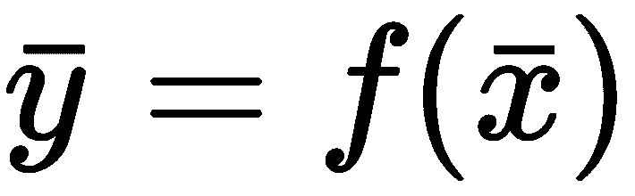

该函数通过对元素应用相同的运算符，将一个向量转换为另一个向量。因此，我们假设如下:

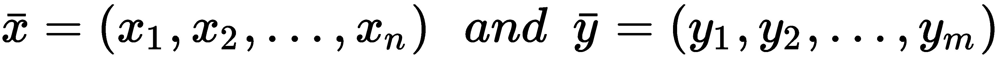

形容词 *neural* 来自两个重要元素:基本计算单元的内部结构和它们之间的相互联系。先说前者。在下图中，有一个人工神经元的示意图:

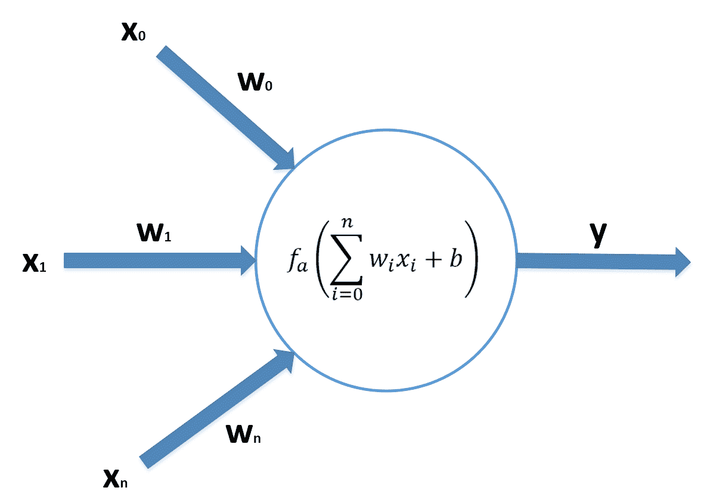

人工神经元的一般结构

一个神经元核心与 **n** 个输入通道相连，每个输入通道都以一个突触权重**w[I]为特征。输入被分解成它的分量，它们被乘以相应的权重并被计算。可以在这个和上增加一个可选的偏差(它的工作原理类似于连接到一个单位输入的另一个权重)。得到的和由激活函数**f[a]过滤(例如，一个 sigmoid，如果你记得逻辑回归是如何工作的)，并因此产生输出。在第 5 章、*线性分类算法*中，我们还讨论了感知器(第一个 ann)，它正好对应于这种具有二进制步骤激活函数的架构。另一方面，即使是逻辑回归也可以表示为单神经元神经网络，其中 *f [a] (x)* 是一个 sigmoid。这种架构的主要问题是它本质上是线性的，因为输出总是输入向量和权重向量之间点积的函数。你已经知道这样一个系统的所有限制；因此，有必要向前一步，创造第一个 MLP。在下图中，有一个 MLP 的示意图，它具有一个 *n* 维输入、 *p* 维隐藏神经元和一个 *k* 维输出:****

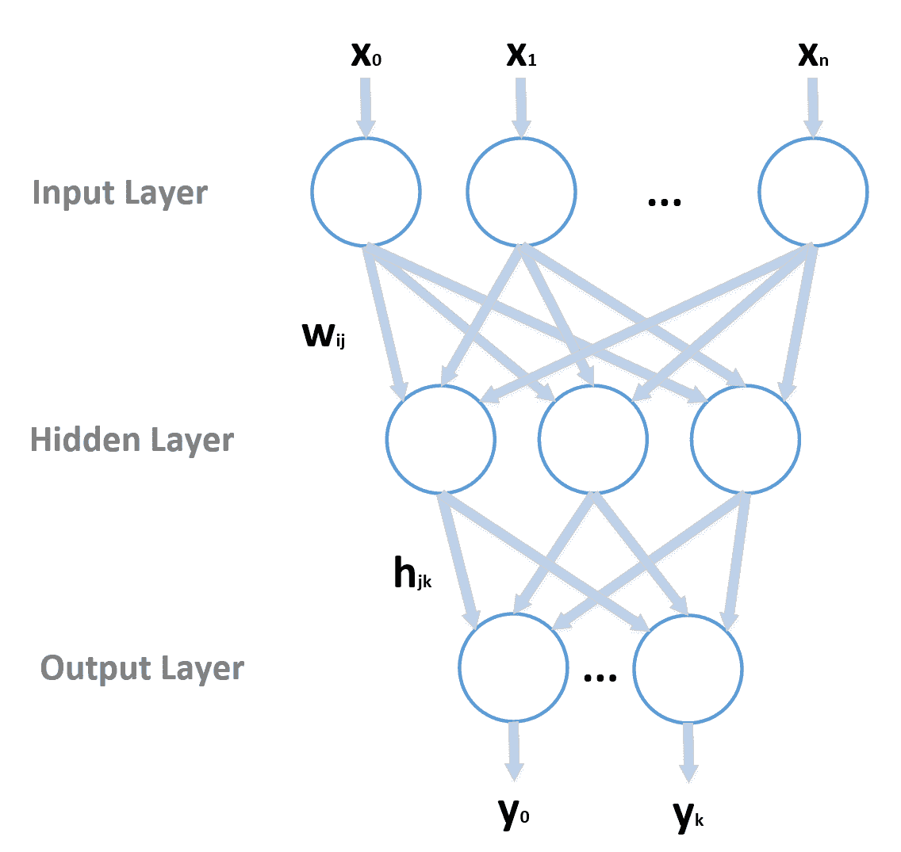

具有单一隐藏层的 MLP 的结构

有三层(尽管数量可以更大):接收输入向量的**输入层**；一个**隐藏层**；以及**输出层**，负责产生输出。正如您所看到的，每个神经元都连接到属于下一层的所有神经元，现在我们有两个权重矩阵，*W =(W[ij])***和 *H = (h [jk] )* ，使用的约定是第一个索引指向上一层，第二个指向下一层。**

 **因此，每个隐藏神经元的净输入和相应的输出如下:

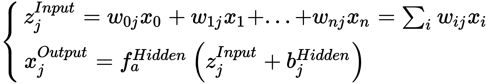

同样，我们可以计算网络输出:

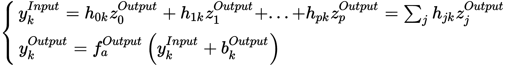

如您所见，网络已经变得高度非线性，这一特性使我们能够模拟用线性方法无法管理的复杂场景。但是我们如何确定所有突触权重和偏差的值呢？最著名的算法叫做**反向传播**，它以非常简单的方式工作(唯一重要的假设是两个 *f [a] (x)* 必须是可微的)。

首先，我们需要定义一个误差(损失/成本)函数。对于许多分类任务，它可以是总(或平均)平方误差:

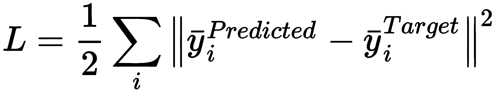

这里，我们假设有 *N* 个输入样本。展开它，我们得到如下结果:

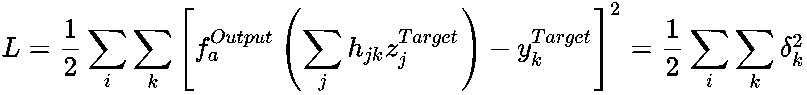

这个函数依赖于所有变量(权重和偏差)，但是我们可以从底层开始，首先只考虑*h*[*JK*](为了简单起见，我不把偏差当作正态权重)。因此，我们可以计算梯度并更新权重:

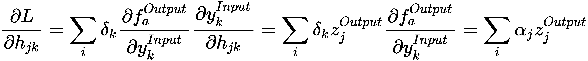

同样，利用导数的链式法则，我们可以推导出相对于*w[ij]的梯度:*

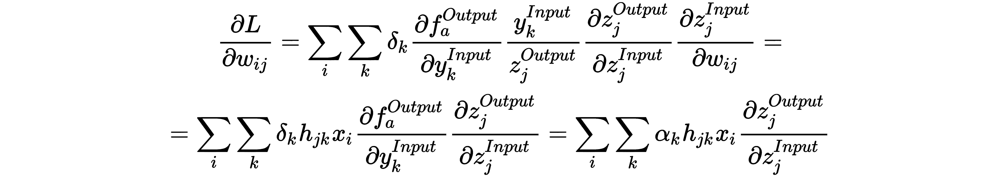

如你所见，项 *α* (与误差 *δ* 成比例)从输出层反向传播到隐藏层。如果有许多隐藏层，这个过程应该递归地重复，直到第一层。该算法采用梯度下降法；因此，它迭代地更新权重，直到收敛:

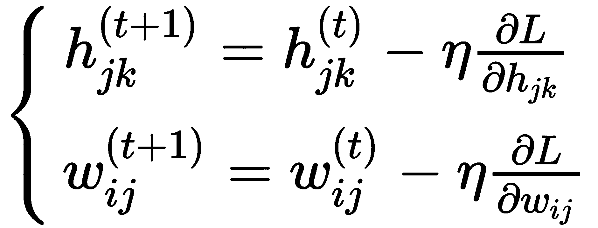

这里，参数 *η* 是学习率，必须选择它以避免在存在离群值的情况下发生太多变化。事实上，大的η迫使权重向负梯度的方向移动，具有大的跳跃*和*，这可以减缓向全局最小值的收敛。相反，非常小的值避免了错误校正的问题，但是需要更多的迭代。最佳值取决于每一个问题，必须从一组常见选项(例如，0.001、0.01 和 0.1)开始进行网格搜索，并通过*将*放大到精度和收敛速度达到最佳值的范围。

在许多实际问题中，采用了**随机梯度下降** ( **SGD** )方法(查看[第 5 章](12eae5a4-4216-4bb2-a195-337a64743f01.xhtml)，*线性分类算法*，以了解更多信息)，该方法处理成批的输入样本，而不是考虑整个数据集。此外，可以采用许多优化来加速收敛，但这超出了本书的范围。在*掌握机器学习算法，Bonaccorso G* ， *Packt 出版*， *2018* 中，读者可以找到关于其中大多数算法的所有细节。就我们的目的而言，重要的是要知道，我们可以建立一个复杂的网络，并在定义一个全局损失函数后，用一个标准程序(例如，SGD)优化所有的权重。

<title>MLPs with Keras</title>  

# 带 Keras 的 MLP

keras([https://keras . io](https://keras.io))是一个高级深度学习框架，可以与 TensorFlow、Theano、**微软认知工具包** ( **CNTK** 等低级深度学习后端无缝协作。在 Keras 中，模型就像一系列层，其中每个输出都被输入到下一个计算模块，直到到达最后一层，并且可以对成本函数进行评估和区分。

模型的一般结构如下:

```
from keras.models import Sequential

model = Sequential()

model.add(...)
model.add(...)
...
model.add(...)
```

`Sequential`类定义了一个通用的空顺序模型，该模型已经实现了添加层、根据底层框架编译模型(即，将高级描述转换成与底层后端兼容的一组命令)、拟合和评估模型以及预测给定输入的输出所需的所有方法。

所有最常见的层都已经实现(其中一些将在下一章[第 16 章](0ebe6902-df77-445c-91fa-fbb9e77aee5b.xhtml)、*高级深度学习模型*中解释)，包括以下内容:

*   密集(标准 MLP 图层)、下降和展平图层
*   卷积(1D、2D 和 3D)图层
*   池层
*   零填充层
*   **递归神经网络** ( **RNN** )层

可以使用几个损失函数(如**均方误差** ( **MSE** )或交叉熵)和所有最扩散的 SGD 优化算法(如 **RMSProp** 或 **ADAM** )来编译一个模型。关于这些方法的数学基础的进一步细节，请参考*掌握机器学习算法*、 *Bonaccorso G* 、 *Packt 出版*、 *2018* 。

让我们从一个 MLP 的具体示例开始分析，该示例基于一个著名的数据集，该数据集是通过嵌套两个螺线创建的，这两个螺线的点(每个螺线 500 个)属于同一个类:

```
import numpy as np

from sklearn.preprocessing import StandardScaler
from sklearn.utils import shuffle

nb_samples = 1000

X = np.zeros(shape=(nb_samples, 2), dtype=np.float32)
Y = np.zeros(shape=(nb_samples,), dtype=np.float32)

t = 15.0 * np.random.uniform(0.0, 1.0, size=(int(nb_samples / 2), 1))

X[0:int(nb_samples / 2), :] = t * np.hstack([-np.cos(t), np.sin(t)]) + \
                              np.random.uniform(0.0, 1.8, size=(int(nb_samples / 2), 2))
Y[0:int(nb_samples / 2)] = 0

X[int(nb_samples / 2):, :] = t * np.hstack([np.cos(t), -np.sin(t)]) + \
                             np.random.uniform(0.0, 1.8, size=(int(nb_samples / 2), 2))
Y[int(nb_samples / 2):] = 1

ss = StandardScaler()
X = ss.fit_transform(X)

X, Y = shuffle(X, Y, random_state=1000)
```

一旦生成，使用一个`StandardScaler`类来规范化数据集是很有帮助的，可以强加零均值和单位方差。下图显示了数据集的图形表示:


双螺旋数据集的图形表示

很容易理解，线性分离是不可能的，考虑到螺旋是嵌套的，并且离中心的距离变得越来越大，即使更复杂的分类器也需要足够的容量来找到分离超曲面。为了更好地理解这种行为，让我们尝试使用逻辑回归:

```
import numpy as np

from sklearn.linear_model import LogisticRegression
from sklearn.model_selection import cross_val_score

lr = LogisticRegression(penalty='l2', C=0.01, random_state=1000)
print(np.mean(cross_val_score(lr, X, Y, cv=10)))
0.5694999999999999
```

平均交叉验证分数略高于 0.5，这表示纯粹的随机猜测(由于随机性，该值可能不同；但是，它永远无法克服一个最大值，这个值一般低于 0.6)。考虑到分离是用一条线实现的，这样的结果并不令人惊讶:

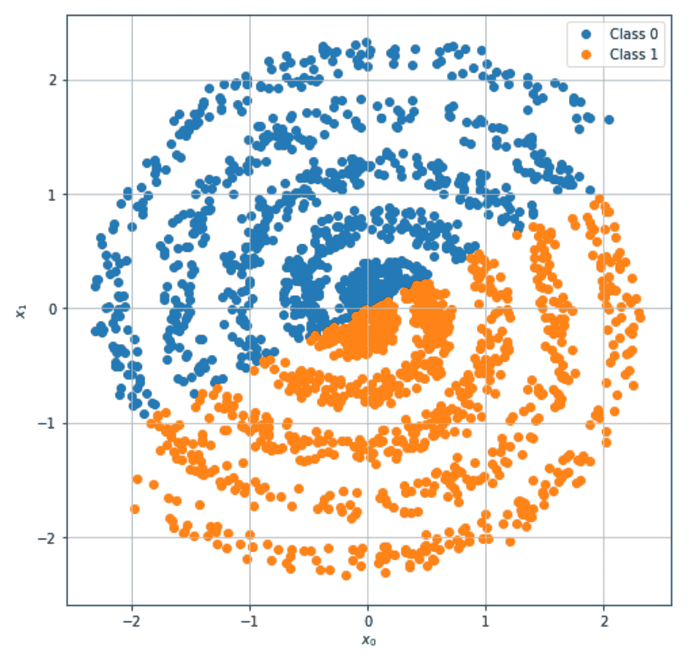

逻辑回归的分类结果

很明显，没有办法提高线性模型的性能。让我们尝试使用 Keras 建模的 MLP 来解决这个问题。第一步是定义结构:

```
from keras.models import Sequential
from keras.layers import Dense, Activation

model = Sequential()

model.add(Dense(64, input_dim=2))
model.add(Activation('relu'))

model.add(Dense(32))
model.add(Activation('relu'))

model.add(Dense(16))
model.add(Activation('relu'))

model.add(Dense(2))
model.add(Activation('softmax'))
```

在声明了一个新的`Sequential`模型之后，我们开始添加层。在这种情况下，我们选择了配置:

*   带有`64`神经元的输入层
*   第一个隐藏层有`32`神经元
*   带有`16`神经元的第二隐藏层
*   带有`2`神经元的输出层

所有层都是`Dense`类的实例，代表一个完全连接的标准 MLP 层。Keras 要求用户在第一层中指定输入形状(同时在其他层中自动检测)。这可以使用`input_shape`参数(例如，100 × 100 矩阵的`input_shape=(100, 100)`)来完成，或者，当样本具有单轴时，使用`input_dim`参数。在这两种情况下，都不需要提供批量大小，而是在训练过程中隐式检测。由于我们的数据集具有形状 *(2000，2)* ，样本的唯一维度是 *2，*，因此我们采用了第二个选项。

前三层的激活函数(表示为基于`Activation`类的一个实例的附加层)是一个非常常见的函数，称为**整流线性单元** ( **ReLU** ，定义如下:

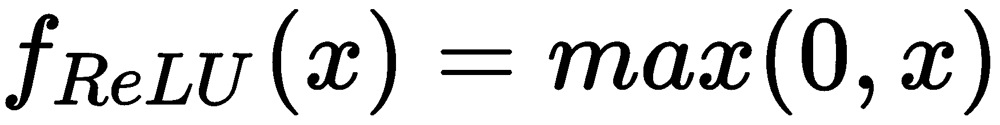

这个函数的主要优点是，即使它是非线性的，它对 *x > 0* 有一个恒定的梯度。这样，收敛速度不受饱和度的影响，此时梯度变得接近 *0* (例如，sigmoid 或双曲正切)。相反，输出激活基于 softmax 函数(其允许表示概率分布)。使用 *n* 值，该激活定义如下:

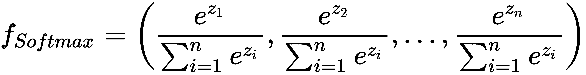

这种函数的选择在深度分类器中非常常见，因为它允许使用交叉熵损失(稍后解释)来管理多类问题。一旦定义了模型，就有必要对其进行编译，以便 Keras 可以将描述转换成与底层后端兼容的计算图:

```
model.compile(optimizer='adam',
              loss='categorical_crossentropy',
              metrics=['accuracy'])
```

Keras 将把高级描述转换成低级操作，增加了一个`'categorical_crossentropy'`损失(`loss`参数)和`'adam'`优化器(这是大多数任务中非常常见的选择)。此外，它将应用准确性度量(`metrics`参数)来动态评估性能。给定一个数据生成过程， *p [数据，]* 以及从中抽取的一组训练样本，分类器的目标是找到一个分布 *p [mlp]* ，其 kull back-Leibler 散度与 *p [数据]* 接近 *0* (参见[第二章](dd32b61f-bc53-4e94-8c17-d5910a8e528d.xhtml)，*机器学习中的重要元素*交叉熵定义如下:

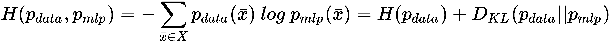

因此，考虑到 *H(p [data] )* 是一个常数，通过最小化交叉熵，我们还最小化了 kull back-lei bler 散度，并迫使模型学习分布*p[MLP]≈p[data]*。

此时，可以对模型进行训练。我们只需要两个初步操作:

*   将数据集分为训练集和测试集。
*   对整数标签应用独热编码。这个操作是必要的，因为我们使用了交叉熵损失，并且真实标签总是以 *(1，0)* 和 *(0，1)*的形式，这意味着第一类和第二类的概率分别是 *1* 。

第一个操作可以使用 scikit-learn `train_test_split()`函数执行，而第二个操作可以使用 Keras `to_categorical()`内置函数轻松执行:

```
from sklearn.model_selection import train_test_split
from keras.utils import to_categorical

X_train, X_test, Y_train, Y_test = \
    train_test_split(X, to_categorical(Y), test_size=0.2, random_state=1000)
```

我们希望用由`32`图像组成的批次进行训练，并持续`100`个时期。读者可以自由地改变所有这些值来比较结果。这个过程可以使用`fit()`方法开始，该方法也接受一个包含验证数据集的元组:

```
model.fit(X_train, Y_train, 
          epochs=100, 
          batch_size=32,
          validation_data=(X_test, Y_test))
```

Keras 提供的输出显示了学习阶段的进展:

```
Train on 1600 samples, validate on 400 samples

Epoch 1/100

1600/1600 [==============================] - 1s 687us/step - loss: 0.6839 - acc: 0.5406 - val_loss: 0.6707 - val_acc: 0.5925

Epoch 2/100

1600/1600 [==============================] - 0s 219us/step - loss: 0.6723 - acc: 0.5975 - val_loss: 0.6665 - val_acc: 0.6125

Epoch 3/100

1600/1600 [==============================] - 0s 273us/step - loss: 0.6668 - acc: 0.6138 - val_loss: 0.6612 - val_acc: 0.6150

Epoch 4/100

1600/1600 [==============================] - 0s 234us/step - loss: 0.6638 - acc: 0.6131 - val_loss: 0.6580 - val_acc: 0.6250

Epoch 5/100

1600/1600 [==============================] - 0s 244us/step - loss: 0.6596 - acc: 0.6238 - val_loss: 0.6523 - val_acc: 0.6300
...
Epoch 100/100

1600/1600 [==============================] - 0s 217us/step - loss: 0.0528 - acc: 0.9838 - val_loss: 0.0569 - val_acc: 0.9800
```

在训练过程结束时，验证准确率约为 98%，这意味着分类器几乎能够完美地区分这两个类别。为了确认，让我们预测所有点的标签(因为这是一个概率，所以使用`argmax`操作符进行最终选择):

```
Y_pred_mlp = np.argmax(model.predict(X), axis=1)
```

结果图如下图所示:

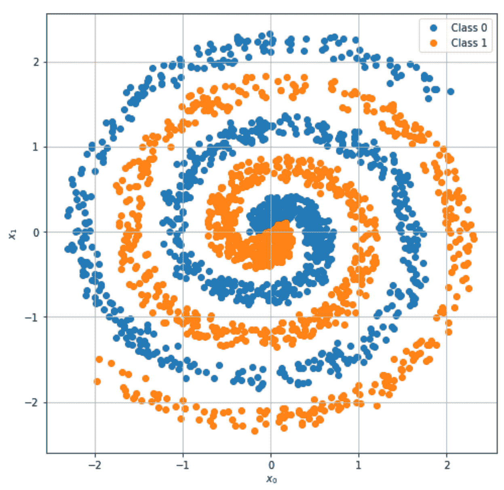

多层感知器的分类结果

很容易看出，错误分类只涉及到几个有噪声的点，而大多数样本都被正确地分配到原始类。为了进一步确认，我们可以绘制逻辑回归和 MLP 的决策面。我们可以通过在`-2.0`和`2.0`(两个轴)之间创建一个网格并计算所有点的预测来轻松实现这个目标:

```
import numpy as np

Xm = np.linspace(-2.0, 2.0, 1000)
Ym = np.linspace(-2.0, 2.0, 1000)
Xmg, Ymg = np.meshgrid(Xm, Ym)
X_eval = np.vstack([Xmg.ravel(), Ymg.ravel()]).T

Y_eval_lr = lr.predict(X_eval)
Y_eval_mlp = np.argmax(model.predict(X_eval), axis=1)
```

结果图如下图所示:

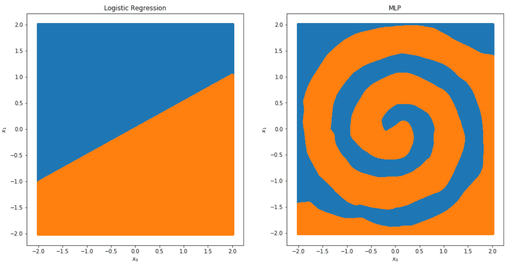

逻辑回归(左)和 MLP(右)的决策面

正如预期的那样，逻辑回归将平面分成两个子平面(总是达到大约 50%的精度)，而 MLP 已经成功地了解到原始分布也能够以最小的误差进行概括。这个简单的例子展示了深度架构的威力，使用了最基本的构建模块(在下一章，[第 15 章](40fb6ddf-fc70-4689-80c0-a899a559f0fd.xhtml)，*介绍神经网络，*我们将分析更复杂的例子)。我邀请读者重复这个练习，使用不同的激活(例如，双曲正切，更大或更小的批量，以及不同的层数)。

安装不同后端(有无 GPU 支持)的 Keras 所需的所有信息，以及官方文档都可以在网站上找到: [https://keras.io](https://keras.io) 。

<title>Interfacing Keras to scikit-learn</title>  

# Keras 与 scikit 的接口-学习

即使 Keras 提供了许多支持功能，但在某些情况下，使用 scikit-learn 执行特定操作更容易。例如，我们可能对自动交叉验证网格搜索感兴趣；正如我们将在[第 17 章](5fe2b675-9428-4499-9128-05366981777f.xhtml)、*创建机器学习架构*中讨论的那样，创建一个完整的处理管道来对数据集执行所有初步操作，然后训练模型是很有帮助的。为了解决这些问题，Keras 提供了两个包装器，`KerasClassifier`和`KerasRegressor`，它们实现了标准的 scikit-learn 接口(用于分类器和回归器)，但是使用 Keras 模型。

为了展示如何使用这些包装器，让我们对之前定义的模型执行网格搜索。第一步是定义一个必须创建和编译 Keras 模型的函数:

```
from keras.models import Sequential
from keras.layers import Dense, Activation
from keras.optimizers import Adam

def build_model(lr=0.001):
 model = Sequential()

 model.add(Dense(64, input_dim=2))
 model.add(Activation('relu'))

 model.add(Dense(32))
 model.add(Activation('relu'))

 model.add(Dense(16))
 model.add(Activation('relu'))

 model.add(Dense(2))
 model.add(Activation('softmax'))

 model.compile(optimizer=Adam(lr=lr),
              loss='categorical_crossentropy',
              metrics=['accuracy'])

 return model
```

`build_model()`函数必须接受用默认值构建模型所需的所有参数。在我们的例子中，对于优化器，我们使用了一个`Adam`类的实例，它允许设置一个定制的学习率(一个我们想要调整的超参数)。此时，我们可以创建一个`KerasClassifier`实例:

```
from keras.wrappers.scikit_learn import KerasClassifier

skmodel = KerasClassifier(build_fn=build_model, epochs=100, batch_size=32, lr=0.001)
```

第一个参数是建模函数，而其他参数是训练模型所需的默认值。由于 scikit-learn 接口实现了一个`fit()`方法，该方法不接受历元数和批处理大小，我们需要在构造函数中提供它们的默认值。包装器会将对`fit()`、`score()`和`predict()`函数的标准 scikit-learn 调用转换成相应的 Keras 语法。

下一步是设置网格搜索(与我们在前面章节中所做的一样):

```
from sklearn.model_selection import GridSearchCV
from keras.utils import to_categorical

parameters = {
 'lr': [0.001, 0.01, 0.1],
 'batch_size': [32, 64, 128]
}

gs = GridSearchCV(skmodel, parameters, cv=5)
gs.fit(X, to_categorical(Y, 2))
```

网格搜索将检查最佳组合，考虑三个学习率值和三个批次大小。通常，在过程的最后(当模型非常复杂时，过程可能会很长)，我们可以检查最佳分数和参数集:

```
print(gs.best_score_)
0.9815

print(gs.best_params_)
{'lr': 0.01, 'batch_size': 128}
```

因此，最佳学习率是`0.01`，批量大小为`128`个样本。在这种情况下，交叉验证精度大约为`0.9815`，比我们初始配置获得的精度稍好。这是一个非常普通的任务的例子，但是`skmodel`实例可以提供给每个需要分类器/回归器的 scikit-learn 函数或类。例如，可以使用`cross_val_score()`评估交叉验证分数，使用`learning_curve()`函数创建学习曲线，或者使用`ParameterSampler`类生成参数的随机分布。此外，在[第 17 章](5fe2b675-9428-4499-9128-05366981777f.xhtml)、*创建机器学习架构*中，读者将学习如何将特征工程方法、维度缩减和模型训练合并到一个单独的块中，该块可以使用全局网格搜索进行优化。我建议用更多的超参数测试这些 Keras 功能，记住训练时间可能会变得很长(因此，最好从简单的例子开始，可能的话，从 GPU 支持开始)。

<title>Summary</title>  

# 摘要

在本章中，我们简要讨论了一些基本的深度学习概念，读者现在应该理解什么是计算序列图，以及如何使用 Keras 对它进行建模。事实上，深层架构可以被看作是一系列相互连接的层。它们可以有不同的特征和用途，但整个图表始终是一个有向结构，将输入值与最终输出图层相关联。因此，有可能导出一个全局损失函数，该函数将通过训练算法进行优化。

我们已经介绍了 Keras，这是一个高级框架，允许对复杂的深度学习架构进行建模和训练。作为一个介绍性的例子，我们向读者展示了如何构建一个能够解决双螺旋问题的 MLP，以及如何将一个 Keras 模型包装到一个实现标准 scikit-learn 分类器/回归器接口的类中。这样，就有可能使用所有 scikit-learn 函数和类来执行网格搜索、交叉验证和所有其他复杂的操作。

在下一章中，我们将讨论几个更高级的深度学习概念，如**卷积**和**递归网络**，给出一些基于 Keras 和 TensorFlow 的例子。**