# 高级深度学习模型

在这一章中，我们将简要讨论最常见的深度学习层，并给出两个基于 Keras 的示例。第一个是用于分类 MNIST 数据集的深度卷积网络。另一个是使用基于**长短期记忆**(**)细胞的递归网络进行时间序列处理的例子。我们还将介绍张量流的基本概念，给出一些基于前几章已经讨论过的算法的具体例子。**

 **特别是，我们将讨论以下内容:

*   深度学习层(卷积、丢弃、批量标准化、递归)
*   深度卷积网络的一个例子
*   循环(LSTM)网络示例
*   张量流简介，包括梯度计算、逻辑回归和卷积


# 深层模型层

在这一部分，我们将简要讨论深度学习架构中采用的最重要的层类型。很明显，由于这是一本介绍性的书，我们并不介绍所有的数学细节，而是把注意力集中在具体的应用上。进一步的细节和理论基础可以在*掌握机器学习算法*、 *Bonaccorso G* 、 *Packt 出版*、 *2018* 中找到。


# 完全连接的层

一个**全连接** **层**(有时称为**密集层**)由 *n 个*神经元组成，每个神经元接收来自前一层的所有输出值(如**多层感知器** ( **MLP** )中的隐藏层)。它可以由权重矩阵、偏置向量和激活函数来表征:

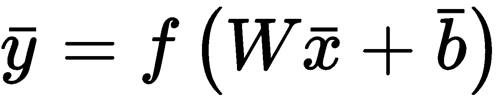

请务必记住，MLP 必须包含非线性激活(例如，sigmoid、双曲线正切或 ReLU)。实际上，一个有 *n* 个线性隐层的网络就相当于一个标准的感知器。在复杂的架构中，它们通常被用作中间层或输出层，尤其是在需要表示概率分布的时候。例如，深度架构可以用于具有 *m* 个输出类别的图像分类。在这种情况下， *softmax* 激活函数允许有一个输出向量，其中每个元素是一个类的概率(所有输出的总和总是归一化为 1.0)。在这种情况下，自变量被认为是一个 *logit* 或几率的对数:

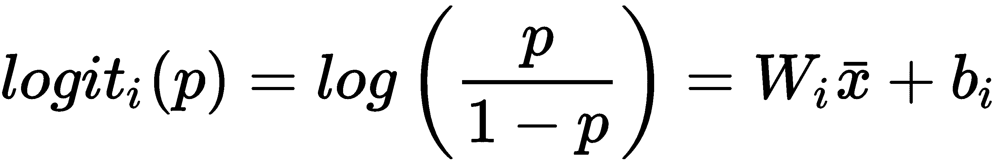

*W[I]是 *W* **的第*I*排。**通过对每个 *logit* 应用 *softmax* 函数，获得一个类*y**I***的概率:*

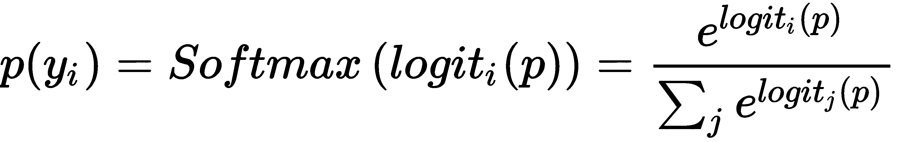

这种类型的输出可以很容易地使用交叉熵损失函数进行训练，就像上一章已经讨论过的那样。


# 卷积层

**卷积层**通常应用于二维输入(即使它们可以用于矢量和 3D 矩阵)，由于它们在图像分类任务中的非凡性能，它们变得特别有名。它们基于小内核 *k* 与二维输入(可以是另一个卷积层的输出)的离散卷积:

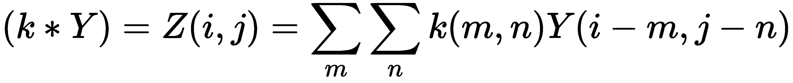

一层通常由 *n* 个固定大小的内核组成，其值是必须使用反向传播算法优化的权重。在大多数情况下，卷积架构从具有几个较大内核(例如，16 (8 x 8)矩阵)的层开始，并将它们的输出馈送到具有更多较小内核(32 (5 x 5)、128 (4 x 4)和 256 (3 x 3))的其他层。通过这种方式，第一层应该学会捕捉更多的通用特征(如方向)，而后面的层将被训练来捕捉越来越小的元素(如眼睛、鼻子和嘴在人脸中的位置)。最后一个卷积层的输出通常被展平(转换成 1D 向量)并用作一个或多个全连接层的输入。

在下图中，有一个图片卷积的示意图:

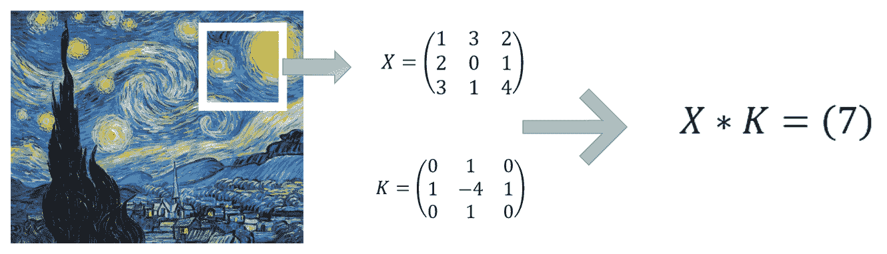

具有 3 × 3 内核的卷积示例

每个 3×3 像素的正方形集合与拉普拉斯核进行卷积，并被转换成单个值，该单个值对应于上、下、左和右像素(考虑中心)的总和减去中心像素的四倍。在下一节中，我们将看到一个使用这个内核的完整例子。

当卷积的数量非常高时，为了降低复杂性，可以采用一个或多个**汇集层**。他们的任务是使用预定义的策略将每组输入点(图像中的像素)转换为单个值。最常见的池层如下:

*   **Max pooling** :将( *m* x *n* 个像素的每个二维组转换为该组中值最大的单个像素
*   **平均池**:每个二维组( *m* x *n* )像素被转换成一个单个像素，其值是该组的平均值

以这种方式，原始矩阵的维数可以随着信息的损失而减少，但是这通常可以被丢弃(特别地，在第一层中，其中特征的粒度是粗糙的)。此外，池层提供了对小翻译的中等鲁棒性，增加了网络的泛化能力。

层的另一个重要类别是**零填充**层。它们通过在输入(1D)前后或在 2D 输入的左侧、右侧、顶部和底部添加空值(0)来工作。


# 脱落层

丢弃层用于通过将固定数量的输入元素随机设置为零来防止网络的过拟合(通常，这是通过将元素的概率设置为无效来实现的)。该层在培训阶段被采用，但是通常在测试、验证和生产阶段被停用。辍学网络可以利用更高的学习率，在损失面上向不同方向移动(将隐藏层中的几个随机输入值设置为零相当于训练不同的子模型)，并排除所有不会导致一致优化的误差面区域。Dropout 在非常大的模型中非常有用，它可以提高整体性能，并降低冻结某些权重和过度拟合模型的风险。对这种行为的简单解释是基于这样一种想法，即考虑到丢失的随机性，每一批都将用于训练一个特定的子网，该子网具有较低的容量(因此不太容易过度拟合)。随着该过程重复多次，整个网络被迫调整其行为以适应单个组件的重叠，这可以在训练样本的特定子集上变得专门化。通过这种方式，大训练率的负面影响被减轻，并且全球网络不能通过增加其方差而容易地过度适应。


# 批量标准化图层

当网络非常深时，可以观察到整个网络中批次的平均值和标准偏差的渐进变化。这种现象被称为**协变偏移**，主要是训练速度方面的性能损失。批次标准化层负责校正每个批次的统计参数，通常插在标准层之后。与 dropout 类似，批处理归一化仅在定型阶段运行，但是在这种情况下，模型将在预测阶段应用对所有样本计算的归一化。已经观察到，作为次要效果，批量归一化层提供了防止模型过度拟合的正则化效果(或者至少减少了该效果)。由于这个原因，它们经常被用来代替丢弃层，以便在提高收敛速度的同时利用模型的全部容量。


# 递归神经网络

递归层由呈现递归连接的特定神经元组成，以便将时间 *t* 的状态绑定到其先前的值(通常只有一个)。当需要捕捉输入序列的时间动态时，这类计算单元特别有用。事实上，在许多情况下，我们期望输出值必须与相应输入的历史相关联。但是 MLP 以及我们讨论过的其他模型是无状态的。因此，它们的输出仅由电流输入决定。**递归神经网络** ( **RNNs** )通过提供一个可以捕捉短期和长期依赖关系的内部存储器来克服这个问题。

最常见的细胞是 LSTM 和**门控循环单元** ( **GRU** )，它们都可以使用标准的反向传播方法进行训练。由于这只是一个介绍，我不能深入(RNN 数学的复杂性是不平凡的)。然而，记住无论何时深度模型中必须包含时间维度，rnn 都会提供稳定而强大的支持。LSTM 和 GRU 的完整数学描述可在*掌握机器学习算法*、*博纳科索 G* 、*帕克特出版*、 *2018* 中找到。


# 带有 Keras 的深度卷积网络示例

在这个例子中，我们将使用 Keras 和原始的 MNIST 手写数字数据集(可通过 Keras 实用函数获得)实现一个完整的深度卷积网络。它由 60，000 张用于训练的灰度 28 × 28 图像和 10，000 张用于测试模型的图像组成。下面的屏幕截图显示了一个示例:


从原始 MNIST 数据集中提取的样本

第一步是加载和标准化数据集，使每个样本包含介于`0`和`1`之间的值:

```
from keras.datasets import mnist

(X_train, Y_train), (X_test, Y_test) = mnist.load_data()

width = height = X_train.shape[1]

X_train = X_train.reshape((X_train.shape[0], width, height, 1)).astype(np.float32) / 255.0
X_test = X_test.reshape((X_test.shape[0], width, height, 1)).astype(np.float32) / 255.0
```

标签可以使用`to_categorical()`函数获得，因此要训练具有分类交叉熵损失的模型:

```
from keras.utils import to_categorical

Y_train = to_categorical(Y_train, num_classes=10)
Y_test = to_categorical(Y_test, num_classes=10)
```

该网络基于以下配置:

*   *p=0.25 时的压差*
*   16 (3 × 3)核的 2D 卷积和 ReLU 激活
*   *p=0.5 时的压差*
*   16 (3 × 3)核的 2D 卷积和 ReLU 激活
*   *p=0.5 时的压差*
*   面积为(2 × 2)像素的 2D 平均池
*   32 (3 × 3)核的 2D 卷积和 ReLU 激活
*   面积为(2 × 2)像素的 2D 平均池
*   64 (3 × 3)核的 2D 卷积和 ReLU 激活
*   *p=0.5 时的压差*
*   面积为(2 × 2)像素的 2D 平均池
*   展平层(需要将多维输出转换为一维矢量)
*   具有 512 个 ReLU 神经元的致密层
*   *p=0.5 时的压差*
*   具有 10 个 softmax 神经元的密集层

此时，我们可以实现模型:

```
from keras.models import Sequential
from keras.layers import Dense, Activation, Dropout, Conv2D, AveragePooling2D, Flatten

model = Sequential()

model.add(Dropout(0.25, input_shape=(width, height, 1), seed=1000))

model.add(Conv2D(16, kernel_size=(3, 3), padding='same'))
model.add(Activation('relu'))
model.add(Dropout(0.5, seed=1000))

model.add(Conv2D(16, kernel_size=(3, 3), padding='same'))
model.add(Activation('relu'))
model.add(Dropout(0.5, seed=1000))

model.add(AveragePooling2D(pool_size=(2, 2), padding='same'))

model.add(Conv2D(32, kernel_size=(3, 3), padding='same'))
model.add(Activation('relu'))

model.add(AveragePooling2D(pool_size=(2, 2), padding='same'))

model.add(Conv2D(64, kernel_size=(3, 3), padding='same'))
model.add(Activation('relu'))
model.add(Dropout(0.5, seed=1000))

model.add(AveragePooling2D(pool_size=(2, 2), padding='same'))

model.add(Flatten())

model.add(Dense(512))
model.add(Activation('relu'))
model.add(Dropout(0.5, seed=1000))

model.add(Dense(10))
model.add(Activation('softmax'))
```

像往常一样，下一步是编译模型。我们选择了学习率为`lr=0.001`的`Adam`优化器。根据以下公式，`decay`参数负责学习率的逐步减少(每个时期):

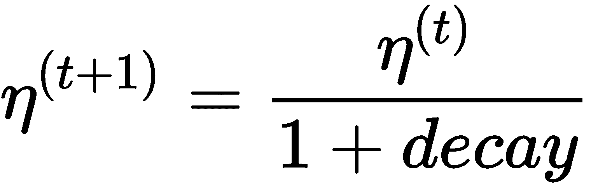

这样，在第一次迭代期间，权重更新更强，而当接近最小值时，权重更新变得越来越小，使得更精确的适应(微调)成为可能:

```
from keras.optimizers import Adam

model.compile(optimizer=Adam(lr=0.001, decay=1e-5),
              loss='categorical_crossentropy',
              metrics=['accuracy'])
```

一旦模型编译完成，就可以开始训练过程(我们已经决定设置`epochs=200`和`batch_size=256`):

```
history = model.fit(X_train, Y_train,
                    epochs=200,
                    batch_size=256,
                    validation_data=(X_test, Y_test))

Train on 60000 samples, validate on 10000 samples
Epoch 1/200
60000/60000 [==============================] - 18s 301us/step - loss: 0.5601 - acc: 0.8163 - val_loss: 0.1253 - val_acc: 0.9624
Epoch 2/200
60000/60000 [==============================] - 15s 254us/step - loss: 0.1846 - acc: 0.9422 - val_loss: 0.0804 - val_acc: 0.9769
Epoch 3/200
60000/60000 [==============================] - 16s 265us/step - loss: 0.1392 - acc: 0.9565 - val_loss: 0.0618 - val_acc: 0.9818
Epoch 4/200
60000/60000 [==============================] - 16s 272us/step - loss: 0.1160 - acc: 0.9645 - val_loss: 0.0484 - val_acc: 0.9848
Epoch 5/200
60000/60000 [==============================] - 17s 281us/step - loss: 0.1063 - acc: 0.9665 - val_loss: 0.0480 - val_acc: 0.9857

...

Epoch 200/200
60000/60000 [==============================] - 29s 484us/step - loss: 0.0783 - acc: 0.9923 - val_loss: 0.0141 - val_acc: 0.9943
```

最终的验证准确率在 99.5%左右，考虑到很多样本都相当相似(比如很多手写的 *1* s 都有可能被误归类为 *7* s，甚至被人类误归类)，这是绝对可以接受的。最终的验证损失证实了学习的分布几乎与数据生成过程相同，并且假设测试样本是由不同人书写的真实数字，则模型能够正确地概括。

在本例中，我们收集了`fit()`函数的输出，它是一个 Keras `History`类实例，包含在每个时期计算的以下字段:

*   `history['acc']`和`history['val_acc']`，分别为训练精度和验证精度
*   `history['loss']`和`history['val_loss']`，分别为训练损失和验证损失

相应的图如下图所示:

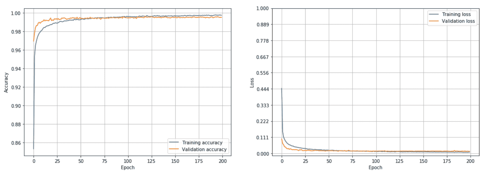

精度图(左)，损耗图(右)

如你所见，模型很早就达到了最大精度，没必要达到 200 个历元。然而，漏失层阻止了模型过度拟合；事实上，损失函数继续减少，最终几乎保持不变。我邀请读者用不同的配置重复这个练习(例如，更少或更多的层，并调整批次大小和时期数，以最大化最终精度和最小化训练时间)。我也建议去掉池层，观察行为。这种选择如何影响参数的数量？另一个练习是用`BatchNormalization()`层替换掉的层，并观察最终效果。在这种情况下，必须在卷积/密集层及其激活层之间插入批量标准化层。


# 带有 Keras 的 LSTM 网络示例

即使我们没有详细分析 LSTM 细胞的内部动力学，我们也想用这种模型给出一个时间序列预测的简单例子。为了完成这项任务，我们选择了一个由 **G** **全球气候概览** ( **GCAG** *) 【T26)提供的平均地球温度异常数据集(每月收集一次)，该数据集可通过 data hub([https://data hub . io](https://datahub.io))获得。*

可以直接从[https://datahub.io/core/global-temp](https://datahub.io/core/global-temp)下载 CSV 文件；但是，我建议通过`pip -U install datapackage`命令安装 Python 包，并使用 API(如示例所示)来获取所有可用的数据集。

第一步是下载和准备数据集:

```
from datapackage import Package

package = Package('https://datahub.io/core/global-temp/datapackage.json')

for resource in package.resources:
    if resource.descriptor['datahub']['type'] == 'derived/csv':
        data = resource.read()

data_gcag = data[0:len(data):2][::-1]
```

由于数据集包含两个交错的序列(由不同的组织收集)，我们只选择了第一个序列并将其反转，因为它是按日期降序排序的。列表中的每个元素都包含三个值:源、时间戳和实际温度异常。我们只对最后一个感兴趣，所以我们需要提取列。此外，由于值的范围在-0.75 和 1.25 之间，最好使用`MinMaxScaler`类在区间`(-1.0, 1.0)`内对它们进行规范化(使用`inverse_transform()`方法总是可以获得原始值):

```
from sklearn.preprocessing import MinMaxScaler

Y = np.zeros(shape=(len(data_gcag), 1), dtype=np.float32)

for i, y in enumerate(data_gcag):
    Y[i - 1, 0] = y[2]

mmscaler = MinMaxScaler((-1.0, 1.0))
Y = mmscaler.fit_transform(Y)
```

下图显示了生成的时间序列图(包含 1，644 个样本):

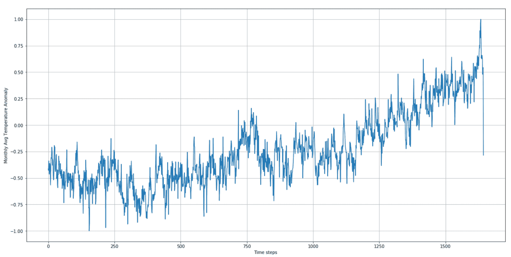

时间序列的完整图

可以观察到，时间序列显示出季节性、非常高频率的小振荡，以及从大约时间步长 **750** 开始的趋势。我们的目标是训练一个能够获取 20 个输入样本并预测后续样本的模型。为了训练模型，我们需要将序列分割成固定长度的滑块列表:

```
import numpy as np

nb_samples = 1600
nb_test_samples = 200
sequence_length = 20

X_ts = np.zeros(shape=(nb_samples - sequence_length, sequence_length, 1), dtype=np.float32)
Y_ts = np.zeros(shape=(nb_samples - sequence_length, 1), dtype=np.float32)

for i in range(0, nb_samples - sequence_length):
    X_ts[i] = Y[i:i + sequence_length]
    Y_ts[i] = Y[i + sequence_length]

X_ts_train = X_ts[0:nb_samples - nb_test_samples, :]
Y_ts_train = Y_ts[0:nb_samples - nb_test_samples]

X_ts_test = X_ts[nb_samples - nb_test_samples:, :]
Y_ts_test = Y_ts[nb_samples - nb_test_samples:]
```

我们将序列限制为`1600`样本(1400 个用于训练，最后 200 个用于验证)。当我们处理时间序列时，我们避免了为了在整个训练过程中利用 LSTM 块的内存而打乱数据。通过这种方式，我们期望更有效地对短期和长期依赖关系进行建模。考虑到本示例的教学目的，我们将创建一个具有单个 LSTM 层的网络，该网络包含四个细胞和一个输出线性神经元:

```
from keras.models import Sequential
from keras.layers import LSTM, Dense, Activation

model = Sequential()

model.add(LSTM(8, stateful=True, batch_input_shape=(20, sequence_length, 1)))

model.add(Dense(1))
model.add(Activation('linear'))
```

我们设置了`stateful=True`属性，因为我们想要强制 LSTM 使用对应于一个批次的最后一个样本的内部状态(代表内存)作为后续批次的初始状态。有了这个选择，我们必须提供一个`batch_input_shape`，其中批处理大小被显式声明为元组的第一个元素(剩余部分类似于`input_shape`的内容)。在这种情况下，我们选择了批量大小为`20`的块。我们可以使用**均方误差** ( **MSE** )损失函数(`loss='mse'`)和`Adam`优化器来编译模型:

```
from keras.optimizers import Adam

model.compile(optimizer=Adam(lr=0.001, decay=0.0001),
              loss='mse',
              metrics=['mse'])
```

作为度量函数，我们选择了相同的损失函数；因此，也有可能删除它。下一步是开始训练过程，使用`epochs=100`、`batch_size=20`和`shuffle=False`(这在网络有状态时是必要的):

```
model.fit(X_ts_train, Y_ts_train,
          batch_size=20,
          epochs=100,
          shuffle=False,
          validation_data=(X_ts_test, Y_ts_test))

Train on 1400 samples, validate on 180 samples

Epoch 1/100

1400/1400 [==============================] - 8s 5ms/step - loss: 0.0568 - mean_squared_error: 0.0568 - val_loss: 0.0651 - val_mean_squared_error: 0.0651

Epoch 2/100

1400/1400 [==============================] - 3s 2ms/step - loss: 0.0206 - mean_squared_error: 0.0206 - val_loss: 0.0447 - val_mean_squared_error: 0.0447

Epoch 3/100

1400/1400 [==============================] - 3s 2ms/step - loss: 0.0177 - mean_squared_error: 0.0177 - val_loss: 0.0322 - val_mean_squared_error: 0.0322

Epoch 4/100

1400/1400 [==============================] - 3s 2ms/step - loss: 0.0151 - mean_squared_error: 0.0151 - val_loss: 0.0248 - val_mean_squared_error: 0.0248

Epoch 5/100

1400/1400 [==============================] - 3s 2ms/step - loss: 0.0138 - mean_squared_error: 0.0138 
- val_loss: 0.0206 - val_mean_squared_error: 0.0206

...

Epoch 100/100
1400/1400 [==============================] - 3s 2ms/step - loss: 0.0100 - mean_squared_error: 0.0100 - val_loss: 0.0100 - val_mean_squared_error: 0.0100
```

最终的 MSE 为`0.010`，对应的平均准确率约为 95%。为了得到确认，我们可以开始绘制训练集和相对预测:

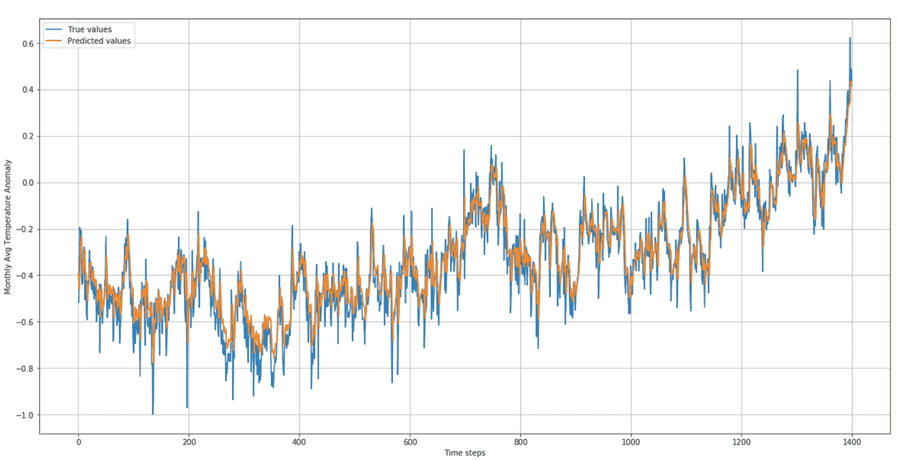

时间序列训练集和相关预测

正如您所看到的，该模型在训练数据上非常准确，它已经成功地学习了季节性和本地振荡。现在让我们展示验证数据(200 个样本)的相同图表:

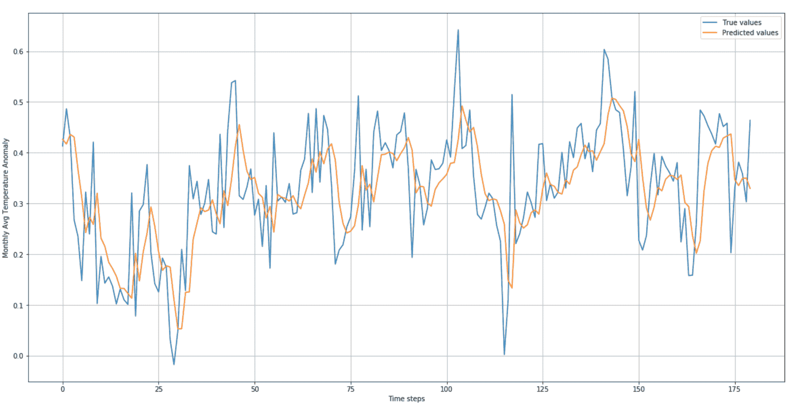

时间序列验证集和相对预测

在这种情况下，较大的标度允许观察到一些不精确，然而，这仅限于小的局部振荡。全球趋势和季节性预测正确(延迟最小)，证实了 LSTM 细胞学习短期和长期依赖性的能力。我邀请读者用不同的配置重复这个例子，记住当一个 LSTM 跟随着另一个 LSTM 层时，第一个必须有`return_sequences=True`参数。通过这种方式，整个输出序列被送入后续层。相反，最后一个只输出最终值，由密集层进一步处理。


# 张量流简介

**TensorFlow** 是谷歌创建的一个计算框架，已经成为传播最广的深度学习工具包之一。它可以与 CPU 和 GPU 一起工作，并且已经实现了构建和训练复杂模型所需的大多数操作和结构。TensorFlow 可以作为 Python 包安装在 Linux、macOS 和 Windows 上(有无 GPU 支持)。但是，我建议您按照网站上提供的说明(链接可以在本章末尾的信息框中找到)来避免常见错误，并根据每个特定环境以最佳方式安装它。

TensorFlow 背后的主要概念是计算图或一组将输入批量转换为所需输出的后续操作。在下图中，有一个图表的示意图:

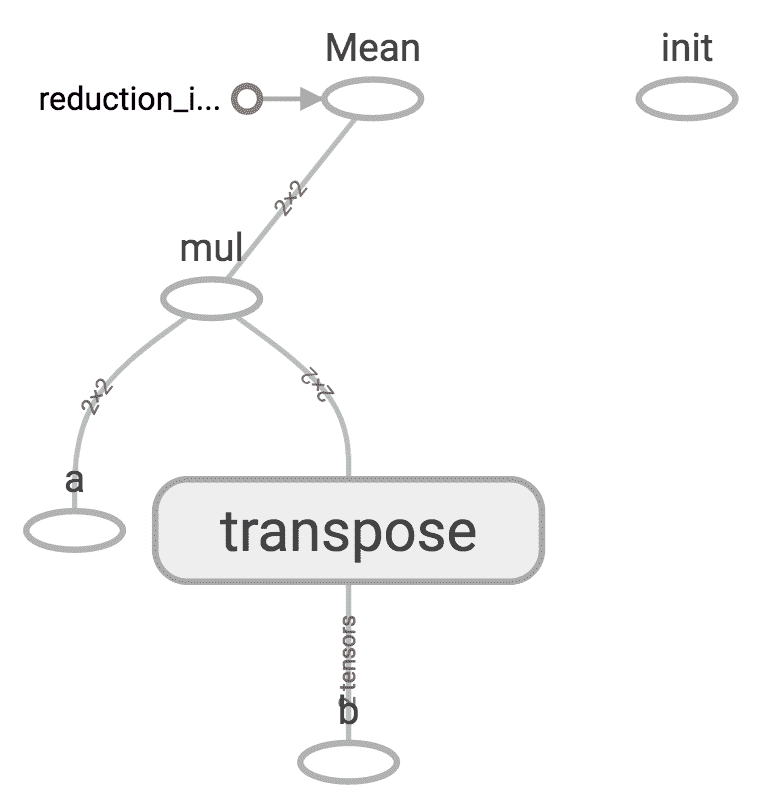

简单计算图示例

从底部开始，我们有两个输入节点( **a** 和 **b** )、一个转置操作(作用于 **b** )、一个矩阵乘法和一个均值归约。 **init** 块是一个独立的操作，它是图的一部分，但它不直接连接到任何其他节点；因此，它是自治的(事实上，它是一个全局初始化器)。

由于这只是一个简短的介绍，因此列出与 TensorFlow 合作所需的所有最重要的战略元素是很有用的，以便能够构建几个简单的示例来展示该框架的巨大潜力:

*   **图**:这表示通过由运算组成的有向网络将一般输入批次与输出张量连接起来的计算结构。它被定义为一个`tf.Graph()`实例，通常与 Python 上下文管理器一起使用。
*   **占位符**:这是一个对外部变量的引用，当直接或间接使用它的操作的输出请求它时，必须显式提供。例如，占位符可以表示一个`x`变量，该变量首先被转换为它的平方值，然后求和为一个常数值。然后输出是`x²+c`，通过为`x`传递一个具体的值来实现。它被定义为一个`tf.placeholder()`实例。
*   **变量**:内部变量，用于存储算法更新的值。例如，变量可以是包含逻辑回归权重的向量。它通常在训练过程之前初始化，并由内置的优化器自动修改。它被定义为一个`tf.Variable()`实例。变量也可以用于存储在训练过程中不需要考虑的元素；在这种情况下，必须用`trainable=False`参数声明。
*   **常量**:定义为`tf.constant()`实例的常量值。
*   **运算**:可以处理占位符、变量和常量的数学运算。比如两个矩阵相乘就是定义为`tf.matmul(A, B)`的运算。在所有的运算中，梯度计算是最重要的运算之一。张量流允许确定从计算图形中确定的点开始的梯度，直到原点或逻辑上必须在它之前的另一个点。我们将看到这个操作的一个例子。
*   **Session** :这是一种 TensorFlow 和我们的工作环境之间的包装器接口(例如，Python 或 C++)。当需要对图形进行评估时，该宏操作将由一个会话管理，该会话必须输入所有占位符值，并将使用所请求的设备产生所需的输出。出于我们的目的，没有必要深入这个概念；然而，我邀请读者从网站或本章末尾列出的资源中检索进一步的信息。它被声明为`tf.Session()`的一个实例，或者像我们将要做的那样，声明为`tf.InteractiveSession()`的一个实例。这种类型的会话在使用笔记本或 shell 命令时特别有用，因为它会自动将自己设置为默认会话。
*   **设备**:物理计算设备，如 CPU 或 GPU。它通过类`tf.device()`的实例显式声明，并与上下文管理器一起使用。当架构包含更多的计算设备时，可以拆分作业，以便并行化许多操作。如果没有指定设备，TensorFlow 将使用默认设备(如果安装了所有必要的组件，则是主 CPU 或合适的 GPU)。

我们现在可以用这些概念分析一些简单的例子。


# 计算梯度

计算所有输出张量相对于任何连接的输入或节点的梯度的选项是 TensorFlow 最有趣的功能之一，因为它允许我们创建学习算法，而不必担心所有转换的复杂性。在这个例子中，我们首先定义一个线性数据集，表示函数 *f(x) = x* 在范围 *(-100，100)* 内:

```
import numpy as np

nb_points = 100
X = np.linspace(-nb_points, nb_points, 200, dtype=np.float32)
```

相应的曲线如下图所示:

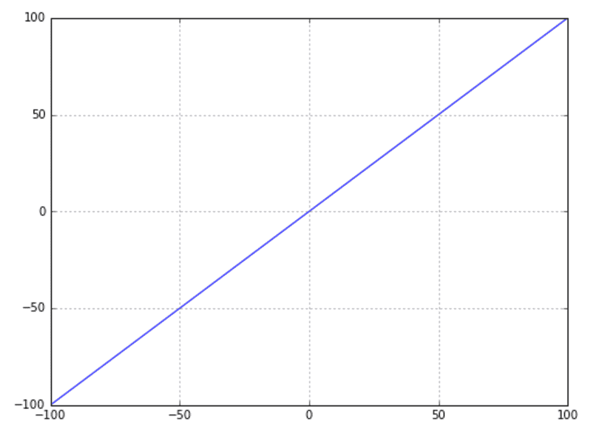

梯度计算的输入数据

现在，我们想使用张量流来计算以下内容:

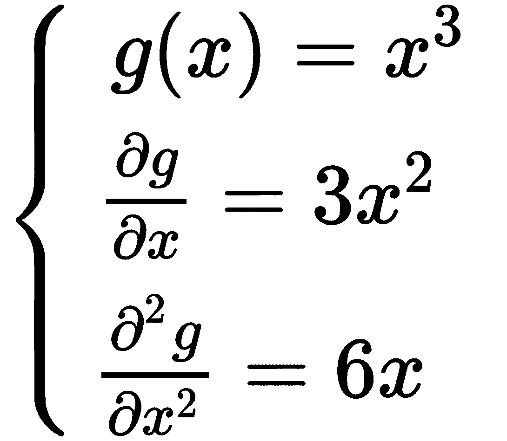

第一步是定义一个`graph`变量:

```
import tensorflow as tf

graph = tf.Graph()
```

在这个`graph`的上下文中，我们可以定义我们的输入占位符和其他操作:

```
with graph.as_default():
    Xt = tf.placeholder(tf.float32, shape=(None, 1), name='x')
    Y = tf.pow(Xt, 3.0, name='x_3')
    Yd = tf.gradients(Y, Xt, name='dx')
    Yd2 = tf.gradients(Yd, Xt, name='d2x')
```

占位符通常由类型(第一个参数)、形状和可选名称定义。我们决定使用`tf.float32`类型，因为这是唯一一种也受 GPU 支持的类型。选择`shape=(None, 1)`意味着可以使用第二维度等于`1`的任何二维向量。

如果`Xt`在所有元素上工作，第一个操作计算三次幂。第二个操作计算`Y`相对于输入占位符`Xt`的所有梯度。最后一次操作将重复梯度计算，但在这种情况下，它使用的是第一次梯度操作的输出`Yd`。

我们现在可以通过一些具体的数据来看结果。首先要做的是创建一个连接到此图的会话:

```
session = tf.InteractiveSession(graph=graph)
```

通过使用这个会话，我们使用`run()`方法询问任何计算。所有的输入参数都必须通过提要字典提供，其中键是占位符，而值是实际的数组:

```
X2, dX, d2X = session.run([Y, Yd, Yd2], feed_dict={Xt: X.reshape((nb_points*2, 1))})
```

我们需要改变数组的形状以符合占位符。`run()`的第一个参数是我们想要计算的张量列表。在这种情况下，我们需要所有的操作输出。下图显示了它们各自的曲线图:

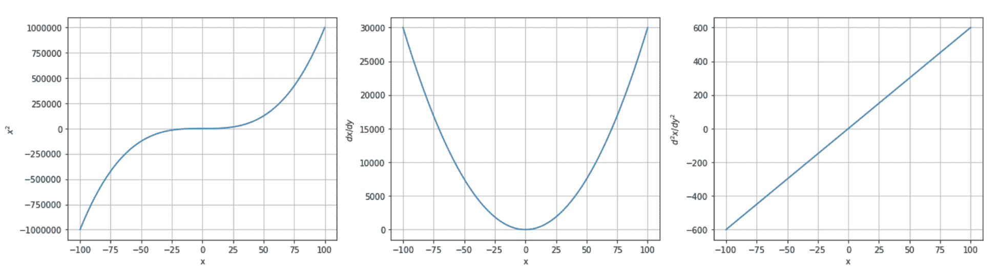

张量流输出:g(x)(左)、一阶导数(中)和二阶导数(右)

不出所料，他们分别代表:*x³、*3x²、 *6x* 。**


# 逻辑回归

现在我们可以尝试一个实现逻辑回归算法的更复杂的例子。通常，第一步是创建一个虚拟数据集:

```
from sklearn.datasets import make_classification

nb_samples = 500
X, Y = make_classification(n_samples=nb_samples, n_features=2, n_redundant=0, n_classes=2)
```

数据集如下图所示:

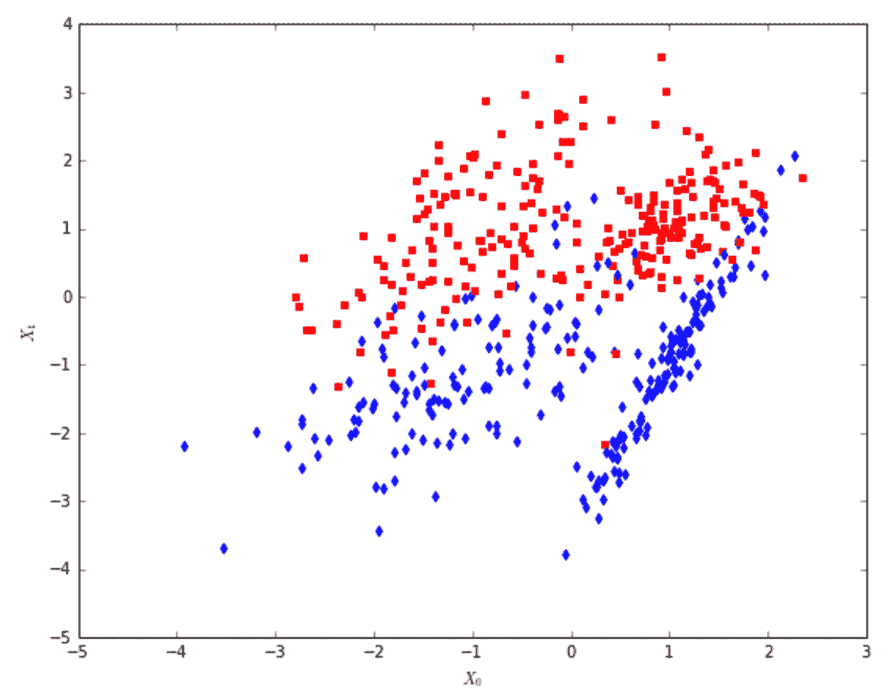

使用 TensorFlow 进行逻辑回归时使用的数据集

此时，我们可以创建图形以及所有占位符、变量和操作:

```
import tensorflow as tf

graph = tf.Graph()

with graph.as_default():
    Xt = tf.placeholder(tf.float32, shape=(None, 2), name='points')
   Yt = tf.placeholder(tf.float32, shape=(None, 1), name='classes')

   W = tf.Variable(tf.zeros((2, 1)), name='weights')
   bias = tf.Variable(tf.zeros((1, 1)), name='bias')

   Ye = tf.matmul(Xt, W) + bias
   Yc = tf.round(tf.sigmoid(Ye))

   loss = tf.reduce_mean(tf.nn.sigmoid_cross_entropy_with_logits(logits=Ye, labels=Yt))
   training_step = tf.train.GradientDescentOptimizer(0.025).minimize(loss)
```

点需要占位符`Xt`，而`Yt`代表标签。在这一点上，我们需要涉及几个变量:如果你还记得，它们存储的值是由训练算法更新的。在这种情况下，我们需要一个`W`权重向量(有两个元素)和一个`bias`。当声明一个变量时，必须提供它的初始值；我们决定使用`tf.zeros()`函数将两者都设置为零，该函数接受所需张量的形状作为参数。

现在我们可以分两步计算输出(如果你不记得一个逻辑回归是如何工作的，请退一步到第五章，*逻辑回归*)首先是 sigmoid 指数`Ye`，然后是实际的二进制输出`Yc`，它是通过对 sigmoid 值进行舍入得到的。逻辑回归的训练算法使负对数似然最小化，负对数似然对应于真实分布`Y`和`Yc`之间的交叉熵。实现这个损失函数很容易；然而，`tf.log()`函数在数值上是不稳定的(当它的值变得接近零时，它趋向于负无穷大，产生一个`NaN`值)；因此，TensorFlow 实现了一个更强大的函数`tf.nn.sigmoid_cross_entropy_with_logits()`，该函数在假设输出由 sigmoid 产生的情况下计算交叉熵。它有两个参数，存储在`Yt`中的`logits`(对应于指数`Ye`和目标`labels`。

现在，我们可以使用 TensorFlow 最强大的功能之一:训练优化器。定义损失函数后，它将依赖于占位符、常数和变量。训练优化器(如`tf.train.GradientDescentOptimizer()`)通过其`minimize()`方法，接受损失函数进行优化。在内部，根据每个特定的算法，它将计算损失函数相对于所有可训练变量的梯度，并将相应的修正应用于这些值。传递给优化器的参数是学习率。

因此，我们定义了一个名为`training_step`的额外操作，它对应于单个状态更新步骤。图形有多复杂并不重要；损失函数中涉及的所有可训练变量将用一条指令进行优化。

现在是时候训练我们的逻辑回归了。要做的第一件事是让 TensorFlow 初始化所有变量，以便在操作必须使用它们时它们已准备就绪:

```
session = tf.InteractiveSession(graph=graph)
tf.global_variables_initializer().run()
```

此时，我们可以创建一个简单的训练循环(当`Loss`停止下降时应该停止；然而，我们有固定的迭代次数):

```
feed_dict = {
    Xt: X,
   Yt: Y.reshape((nb_samples, 1))
}

for i in range(5000):
   loss_value, _ = session.run([loss, training_step], feed_dict=feed_dict)
   if i % 100 == 0:
   print('Step %d, Loss: %.3f' % (i, loss_value))

Step 0, Loss: 0.269
Step 100, Loss: 0.267
Step 200, Loss: 0.265
Step 300, Loss: 0.264
Step 400, Loss: 0.263
Step 500, Loss: 0.262
Step 600, Loss: 0.261
Step 700, Loss: 0.260
Step 800, Loss: 0.260
Step 900, Loss: 0.259
...
Step 9900, Loss: 0.256
```

正如你所看到的，在每次迭代中，我们要求 TensorFlow 计算损失函数和一个训练步骤，我们总是传递相同的包含`X`和`Y`的字典。在这个循环结束时，损失函数是稳定的，我们可以通过绘制分离超平面来检查这个逻辑回归的质量:

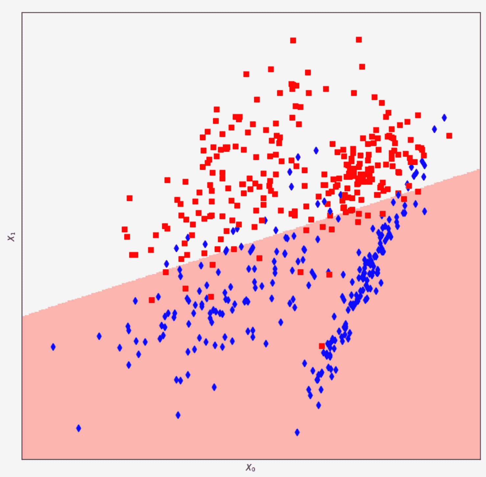

分隔线的分类结果

其结果大致相当于用 scikit-learn 实现获得的结果。如果我们想知道系数(权重)和截距(偏差)的值，我们可以通过对每个变量调用`eval()`方法来请求 TensorFlow 检索它们:

```
Wc, Wb = W.eval(), bias.eval()

print(Wc)
[[-1.16501403]
 [ 3.10014033]]

print(Wb)
[[-0.12583369]]
```


# 用多层感知器分类

我们现在可以构建一个具有两个密集层的架构，并为更复杂的数据集训练一个分类器。让我们从创建它开始:

```
from sklearn.datasets import make_classification

nb_samples = 1000
nb_features = 3

X, Y = make_classification(n_samples=nb_samples, n_features=nb_features, 
                           n_informative=3, n_redundant=0, n_classes=2, n_clusters_per_class=3)
```

即使我们只有两个类，数据集也有三个特征，每个类有三个聚类；因此，线性分类器几乎不可能以非常高的精度将其分离。下图显示了数据集的曲线图:

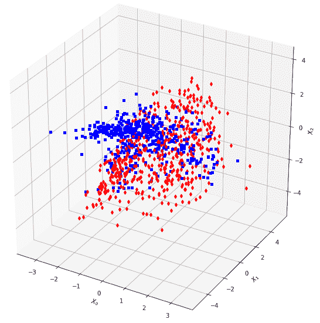

数据集的三维表示

出于基准测试的目的，测试逻辑回归很有用:

```
from sklearn.model_selection import train_test_split
from sklearn.linear_model import LogisticRegression

X_train, X_test, Y_train, Y_test = train_test_split(X, Y, test_size=0.2)

lr = LogisticRegression()
lr.fit(X_train, Y_train)

print('Score: %.3f' % lr.score(X_test, Y_test))
Score: 0.715
```

在测试集上计算的分数约为 71%，这并不算太差，但低于可接受的阈值。让我们尝试一个具有 50 个隐藏神经元(双曲正切激活)和一个 sigmoid 输出神经元的 MLP。双曲正切的定义如下:

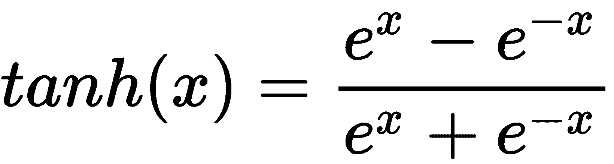

它在-1.0 和 1.0 之间渐近有界，其中梯度趋于饱和到 0.0。

我们不打算手动实现每一层，但是我们使用内置的`tf.layers.dense()`类。它接受输入张量或占位符作为第一个参数(`inputs`参数)，接受层输出神经元的数量作为第二个参数(`units`参数)。可以使用`activation`属性指定激活功能:

```
import tensorflow as tf

graph = tf.Graph()

with graph.as_default():
    Xt = tf.placeholder(tf.float32, shape=(None, nb_features), name='X')
    Yt = tf.placeholder(tf.float32, shape=(None, 1), name='Y')

   layer_1 = tf.layers.dense(input=Xt, units=50, activation=tf.nn.tanh)
   layer_2 = tf.layers.dense(input=layer_1, units=1, activation=tf.nn.sigmoid)

   Yo = tf.round(layer_2)

   loss = tf.nn.l2_loss(layer_2 - Yt)
   training_step = tf.train.GradientDescentOptimizer(0.025).minimize(loss)
```

和前面的例子一样，我们定义了两个占位符`Xt`和`Yt`，以及两个完全连接的层。第一个接受输入`Xt`，有 50 个输出神经元(激活`tanh`)，而第二个接受前一层的输出(`layer_1`)，只有一个 sigmoid 神经元，代表类。舍入输出由`Yo`提供，而损失函数是总平方误差，它是使用基于网络输出(`layer_2`)和目标类占位符`Yt`之间的差异计算的`tf.nn.l2_loss()`函数实现的。按照逻辑回归示例，使用标准梯度下降优化器来实现训练步骤。

我们现在可以实现一个训练循环，将数据集分成固定数量的批次(样本数量在`batch_size`变量中定义),并对`nb_epochs`时期重复一个完整的循环:

```
session = tf.InteractiveSession(graph=graph)
tf.global_variables_initializer().run()

nb_epochs = 200
batch_size = 50

for e in range(nb_epochs):
    total_loss = 0.0
    Xb = np.ndarray(shape=(batch_size, nb_features), dtype=np.float32)
    Yb = np.ndarray(shape=(batch_size, 1), dtype=np.float32)

    for i in range(0, X_train.shape[0]-batch_size, batch_size):
        Xb[:, :] = X_train[i:i+batch_size, :]
        Yb[:, 0] = Y_train[i:i+batch_size]

        loss_value, _ = session.run([loss, training_step], 
                                     feed_dict={Xt: Xb, Yt: Yb})
        total_loss += loss_value

        Y_predicted = session.run([Yo], 
                                  feed_dict={Xt: X_test.reshape((X_test.shape[0], nb_features))})
        accuracy = 1.0 - (np.sum(np.abs(np.array(Y_predicted[0]).squeeze(axis=1) - \
                   Y_test)) / float(Y_test.shape[0]))

        print('Epoch %d) Total loss: %.2f - Accuracy: %.2f' % (e, total_loss, accuracy))

Epoch 0) Total loss: 78.19 - Accuracy: 0.66
Epoch 1) Total loss: 75.02 - Accuracy: 0.67
Epoch 2) Total loss: 72.28 - Accuracy: 0.68
Epoch 3) Total loss: 68.52 - Accuracy: 0.71
Epoch 4) Total loss: 63.50 - Accuracy: 0.79
Epoch 5) Total loss: 57.51 - Accuracy: 0.84
...
Epoch 195) Total loss: 15.34 - Accuracy: 0.94
Epoch 196) Total loss: 15.32 - Accuracy: 0.94
Epoch 197) Total loss: 15.31 - Accuracy: 0.94
Epoch 198) Total loss: 15.29 - Accuracy: 0.94
Epoch 199) Total loss: 15.28 - Accuracy: 0.94
```

正如您所看到的，在不特别注意所有细节的情况下，在测试集上计算的准确率是 94%。考虑到数据集的结构，这是一个可接受的值。在前面提到的书*、*中，读者会发现许多重要概念的细节，这些概念仍然可以提高性能并加快收敛过程。


# 图像卷积

即使我们没有建立一个完整的深度学习模型，我们也可以用一个简单的例子来测试卷积是如何工作的。我们使用的输入图像已经由 SciPy 提供:

```
from scipy.misc import face

img = face(gray=True)
```

原图如下图:

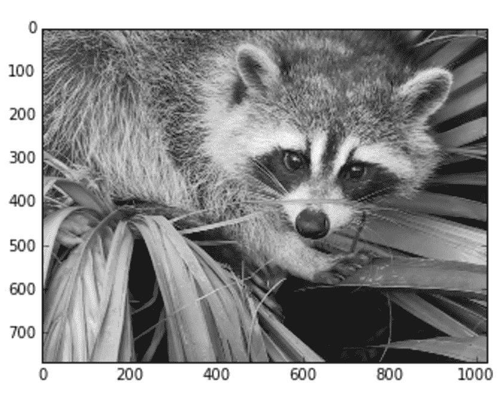

测试卷积特性的示例图片

我们将应用拉普拉斯过滤器(即，它相当于离散拉普拉斯算子)，它强调每个形状的边界:

```
import numpy as np

kernel = np.array(
    [[0, 1, 0],
     [1, -4, 0],
     [0, 1, 0]], 
     dtype=np.float32)

cfilter = np.zeros((3, 3, 1, 1), dtype=np.float32)
cfilter[:, :, 0, 0] = kernel
```

`kernel`必须重复两次，因为张量流`tf.nn.conv2d`卷积函数需要一个输入和一个输出滤波器。我们现在可以构建`graph`并测试它:

```
import tensorflow as tf

graph = tf.Graph()

with graph.as_default():
    x = tf.placeholder(tf.float32, shape=(None, 768, 1024, 1), name='image')
    f = tf.constant(cfilter)

    y = tf.nn.conv2d(x, f, strides=[1, 1, 1, 1], padding='same')

session = tf.InteractiveSession(graph=graph)

c_img = session.run([y], feed_dict={x: img.reshape((1, 768, 1024, 1))})
n_img = np.array(c_img).reshape((768, 1024))
```

`strides`参数是一个四维向量(每个值对应于输入维度，所以第一个是批次，最后一个是通道数)，指定滑动窗口必须移动多少像素。在这种情况下，我们不希望在移动时跳过像素，因此对于所有维度，该参数都设置为等于 1。`padding`参数决定新尺寸必须如何计算，以及是否需要应用零填充。在我们的例子中，我们使用值`'same'`，它通过将原始尺寸除以相应的步幅值舍入到下一个整数来计算尺寸(因为后者都是 1.0，所以结果图像大小将与原始图像完全相同)。

输出如下所示:

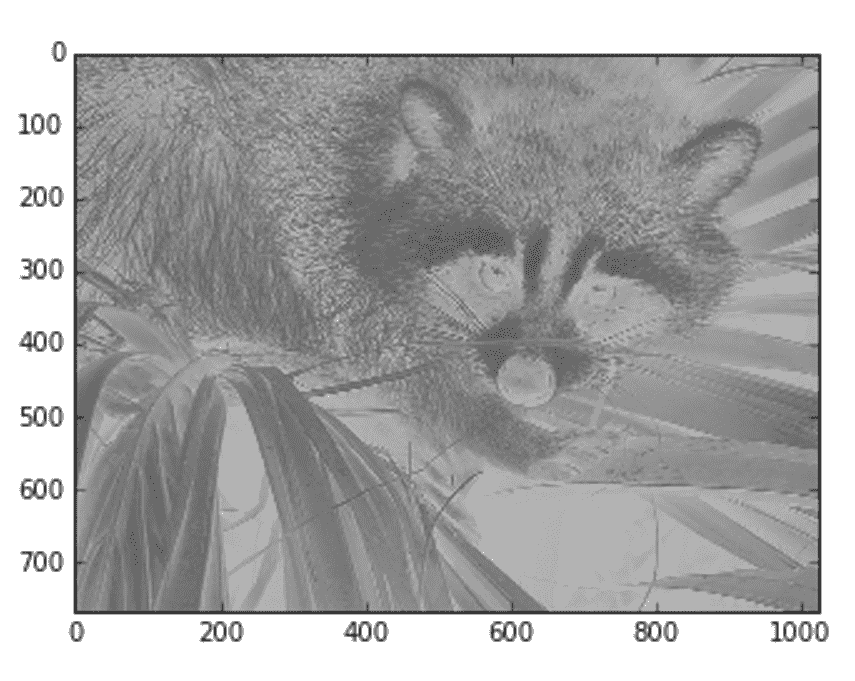

卷积结果

在[https://www.tensorflow.org/install/](https://www.tensorflow.org/install/)可以找到 TensorFlow 针对每个操作系统(有无 GPU 支持)的安装说明。


# 摘要

在本章中，我们简要介绍了最重要的深度学习层，并讨论了两个基于 Keras 的具体示例。我们已经看到了如何对深度卷积网络进行建模以对图像进行分类，以及当需要了解时间序列中的短期和长期相关性时，如何轻松使用 LSTM 模型。

我们还看到 TensorFlow 如何计算输出张量相对于任何先前连接层的梯度，以及如何将标准反向传播策略无缝实施到深层架构。我们还没有详细讨论实际的深度学习问题和方法，因为它们需要更多的空间。然而，读者可以很容易地找到许多有效的资源来继续他们对这个迷人领域的探索。同时，可以修改示例并继续一个*边做边学*的过程。

在下一章，[第 17 章](5fe2b675-9428-4499-9128-05366981777f.xhtml)，*高级深度学习模型*我们将总结之前讨论的许多概念，来创建复杂的机器学习架构。**