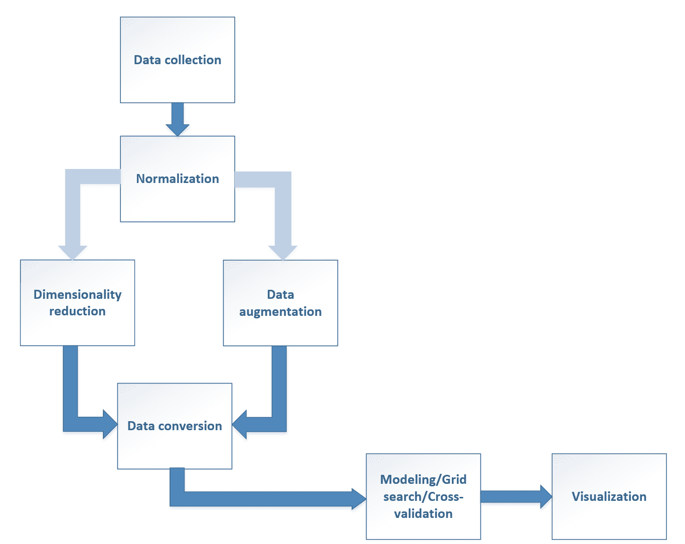
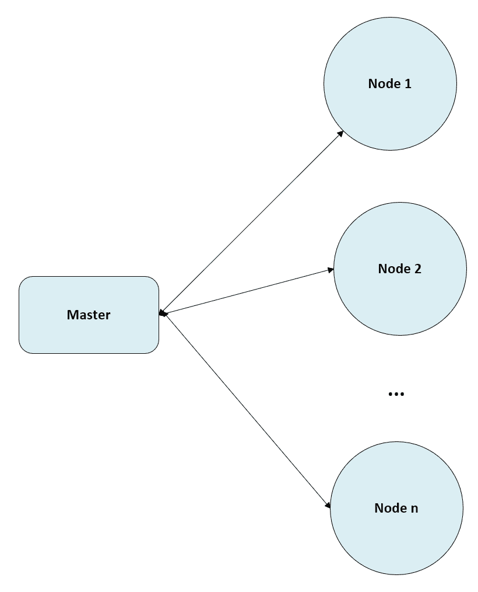

# 十七、创建机器学习架构

在这一章中，我们将总结书中讨论的许多概念，目的是定义一个完整的机器学习架构，该架构能够对输入数据进行预处理、分解/扩充、分类/聚类，并最终使用图形工具显示结果。我们还将展示 scikit-learn 如何管理复杂的管道，以及如何在完整架构的全局环境中拟合它们并搜索最佳参数。

特别是，我们将讨论以下内容:

*   数据收集、预处理和扩充
*   标准化、正则化和降维
*   矢量化计算和 GPU 支持
*   分布式架构
*   管线和特征联合


# 机器学习架构

到目前为止，我们已经讨论了可以用来解决特定问题的单一方法。然而，在实际环境中，很难有定义明确的数据集可以立即输入到标准分类器或聚类算法中。机器学习工程师通常必须设计一个完整的架构，外行人会认为这就像一个黑匣子，原始数据进入其中，结果自动产生。实现最终目标所需的所有步骤都必须正确地组织起来，并无缝地连接在一个类似于计算图的处理链中(事实上，它通常是一个直接的非循环图)。不幸的是，这是一个非常规的过程，因为每个现实生活中的问题都有其独特之处。然而，有一些通常包含在几乎所有 ML 管道中的通用步骤。

下图是该过程的示意图:



机器学习流水线的结构

现在，我们将简要说明每个阶段的细节以及一些可能的解决方案。


# 数据收集

第一步总是最通用的，因为它依赖于每一个单独的上下文。然而，在处理任何数据集之前，有必要从存储数据的所有来源收集数据。理想的情况是有一个可以立即加载的**逗号分隔值** ( **CSV** )(或另一种合适的格式)转储，但是，更多情况下，工程师必须查找所有数据库表，定义正确的 SQL 查询来收集所有信息，并管理数据类型转换和编码。

我们不打算讨论这个主题(它与数据工程更相关)，但是不要低估这个阶段是很重要的，因为它可能比预期的要困难得多。我建议尽可能提取扁平的表，其中所有字段都放在同一行，因为使用**数据库管理系统** ( **DBMS** )或大数据工具更容易处理大量数据，但如果在普通 PC 上直接使用 Python 工具处理，会非常耗时且消耗内存。此外，对所有文本字段使用标准字符编码也很重要。最常见的选择是 UTF-8，但也有可能找到用其他字符集编码的数据库表，通常在开始其他操作之前转换所有文档是一个好习惯。

一个非常著名和强大的用于数据操作的 Python 库是**pandas**(SciPy 的一部分)。它主要基于**data frame**(SQL 表的抽象)的概念，并实现了许多方法，允许选择、连接、分组和统计处理适合内存的数据集。在大多数数据科学任务中，这可能是最佳选择之一，因为它可以快速为用户提供完整的数据洞察，并允许实时操作字段或源。在*Learning pandas-Python Data Discovery and Analysis Made Easy*、 *Heydt M* 、 *Packt Publishing* 中，读者可以找到使用本库解决许多现实生活场景所需的所有信息。在这一阶段，必须解决的两个常见问题是对缺失特征进行归因和对分类特征进行管理。在第 3 章、*特征选择和特征工程*中，我们讨论了在开始以下步骤之前可以自动采用的一些实用方法。即使 scikit-learn 提供了许多强大的工具，这一步骤也可以使用 pandas 来执行，因此，可以分配给没有完整机器学习知识的数据科学家/工程师。


# 规范化和正规化

归一化数值数据集是最重要的步骤之一，尤其是当不同的要素具有不同的比例时。在第三章、*特征选择和特征工程*、*和*中，我们讨论了几种可以用来解决这个问题的方法。通常情况下，使用`StandardScaler`来白化数据就足够了，但有时更好的做法是考虑噪声特征对全局趋势的影响，并使用`RobustScaler`来过滤掉它们，而没有限制其余特征的风险。此外，有许多算法可以受益于白化数据集；因此，我建议使用网格搜索(我们将在本章的后面讨论如何合并不同的转换)并选择最佳的组合。

当使用标准化和非标准化数据集时，读者可以很容易地验证同一分类器(特别是**支持向量机** ( **支持向量机**)和神经网络)的不同性能。正如我们将在下一节中看到的，可以将归一化步骤作为第一批动作之一包括在处理管道中，并将`C`参数包括在网格搜索中，以在训练阶段实施 *L1* / *L2* 正则化(参见第 4 章、*回归算法*中正则化的重要性，当讨论脊、套索和弹性网时)。


# 降维

这一步并不总是强制性的，但是，在许多情况下，这是避免内存泄漏或长时间计算的好办法。当数据集具有许多要素时，某些隐藏相关性的概率相对较高。例如，一个产品的最终价格直接受到所有材料价格的影响，并且，如果我们去掉一个次要元素，价值会发生微小的变化(一般来说，我们可以说总方差几乎保持不变)。如果你还记得**主成分分析** ( **PCA** )是如何工作的，你就会知道这个过程也对输入数据进行去相关处理。因此，检查主成分分析或核主成分分析(对于非线性数据集)是否可以删除一些成分，同时保持解释的方差接近 100%是有用的(这相当于以最小的信息损失压缩数据)。

在第 3 章、*特征选择和特征工程*中还讨论了其他方法，如`NMF`或`SelectKBest`，这些方法可用于根据各种标准(如**方差分析** ( **ANOVA** )或卡方检验)仅选择最佳特征。在项目的初始阶段测试每个因素的影响可以节省时间，这在需要评估更慢和更复杂的算法时非常有用。**独立分量分析** ( **ICA** )和字典学习可以有效地应用于任何优选的基于特征稀疏组合的内部编码的时候。例如，图像处理模型可以更有效地使用代表从样本中提取的主要元素的合成输入(特征向量)。

由于每个场景都有自己的特点，定义一个关于维度减少的经验法则并不容易；但是，我建议将它的使用视为复杂性和准确性之间的权衡。主要的评价标准是基于解释的方差，当应用 PCA 时，方差总是较低。由于信息与方差成比例，损失必须通过一致的复杂性降低来证明(例如，如果解释的方差为 90%，而模型需要十分之一的参数，并且产生的精度与原始模型相当，则应采用 PCA)。


# 数据扩充

有时，原始数据集只有一些非线性特征，标准分类器很难捕捉动态变化。此外，在复杂数据集上强制执行算法可能会导致模型过度拟合，因为在仅考虑训练集而不考虑泛化能力的情况下，尝试最小化错误的所有能力都已耗尽。因此，有时使用通过现有要素的某些函数获得的派生要素来丰富数据集是很有用的。

`PolynomialFeatures`是数据扩充的一个例子，它可以真正提高标准算法的性能，避免过度拟合。在其他情况下，引入三角函数(如 *sin(x)* 或 *cos(x)* 或相关特征(如*x[1]x[2]*)可能会很有用。前者允许更简单地管理径向数据集，而后者可以为分类器提供关于两个特征之间的互相关的信息。数据扩充的另一个常见用途是图像分类器，其中考虑到现实生活应用中所需的可能性数量，数据集通常太小。例如，我们可以有一个自动驾驶汽车必须识别的交通标志数据集。但是，相机捕捉旋转或部分遮挡的图像，这些图像通常与训练分布不匹配。因此，使用基于旋转、重缩放、噪声添加、剪切等的变量来扩大数据集是很有用的。所有这些样本，即使是合成的，也代表了汽车可能遇到的潜在样本；因此，数据扩充允许训练更大和更有效的模型，而不需要数百万的上下文变量。

通常，在尝试更复杂的算法之前，可以采用基于特征的数据扩充。例如，逻辑回归(这是一种线性方法)可以成功地应用于扩充的非线性数据集(在讨论多项式回归时，我们在第 4 章、*回归算法*中看到了类似的情况)。选择采用更复杂(容量更高)的模型还是尝试扩充数据集取决于工程师，必须仔细考虑，考虑利弊。要考虑的一个非常重要的标准是在从真实的数据生成过程中抽取的验证集上评估模型。事实上，数据扩充会产生完全不同的分布，与生产中考虑的分布不匹配。因为目标是最大限度地提高验证的准确性，所以确保根据真实示例(例如，具有相同分辨率、特征质量等的图像)测试模型是非常重要的。

例如，在许多情况下，最好不要修改原始数据集(这可能相当大)，而是创建一个 scikit-learn 接口来实时扩充数据。在其他情况下，神经模型可以提供更快、更准确的结果，而无需数据扩充。加上参数选择，这与其说是真正的科学，不如说是一门艺术，实验是收集有用知识的唯一途径。


# 数据变换

在处理分类数据时，这一步可能是最简单的，同时也是最重要的。我们已经讨论了几种使用数字向量对标签进行编码的方法，没有必要重复已经解释过的概念。一个通用规则是关于整数或二进制值的使用(一键编码)。当分类器的输出是值本身时，后者可能是最好的选择，因为，正如在第 3 章、*特征选择和特征工程*中所讨论的，它对噪声和预测误差更加鲁棒。另一方面，一键编码非常消耗内存。因此，每当有必要处理概率分布时(如在 NLP 中)，整数标签(代表字典条目或频率/计数值)会更有效。


# 建模/网格搜索/交叉验证

建模意味着选择最适合每个特定任务的分类/聚类算法。我们已经讨论了不同的方法，读者应该能够理解什么时候一组算法是合理的选择，什么时候寻找另一种策略更好。然而，机器学习技术的成功通常也取决于对模型中涉及的每个参数的正确选择。正如已经讨论过的，当谈到数据扩充时，很难找到一种精确的方法来确定要分配的最佳值，而最佳方法总是基于网格搜索。scikit-learn 提供了一种非常灵活的机制来研究具有不同参数组合的模型的性能，以及交叉验证(这允许在不减少训练样本数量的情况下进行稳健的验证)，这确实是一种更合理的方法，即使对于专家工程师来说也是如此。此外，当执行不同的转换时，选择的效果会影响整个管道，因此，(我们将在下一节看到几个例子)我总是建议同时对所有组件应用网格搜索，以便能够评估每个可能选择的交叉影响。


# 形象化

有时候，可视化中间和最终步骤的结果是有用的/必要的。在本书中，我们一直使用 matplotlib 显示绘图和图表，matplotlib 是 SciPy 的一部分，提供了一个灵活而强大的图形基础设施。即使它不是本书的一部分，读者也可以很容易地修改代码以获得不同的结果。更深入的理解，请参考*掌握 matplotlib* 、*麦格雷戈 D* 、 *Packt 出版*。由于这是一个不断发展的领域，许多新项目正在开发，提供新的和更时尚的绘图功能。其中一个是 Bokeh(http://bokeh.pydata.org)，它使用一些 JavaScript 代码来创建可以嵌入网页的交互式图形。我强烈建议读者学习主要的 matplotlib 命令，并直接从 Jupyter 笔记本上使用这个库。在整个分析和建模过程中，轻松嵌入和重新计算图的可能性非常有用。


# GPU 支持

在前两章中，[第 15 章](40fb6ddf-fc70-4689-80c0-a899a559f0fd.xhtml)、*介绍神经网络*和[第 16 章](0ebe6902-df77-445c-91fa-fbb9e77aee5b.xhtml)、*高级深度学习模型、*我们已经讨论了深度学习模型的基本概念，强调了表征这种架构的参数数量有多少。如果我们还考虑数据集的维度，很容易理解计算复杂性会变得非常大。scikit-learn 等框架主要基于 NumPy，其中包含运行在多核 CPU 上的高度优化的原生代码。此外，NumPy 与**单指令多数据** ( **SIMD** )命令一起工作，并公开矢量化原语。在许多情况下，这个特性允许摆脱显式循环，同时加快执行时间。让我们考虑一个基于两个 500 × 500 矩阵相乘的简单例子。没有任何矢量化，代码如下所示:

```
import numpy as np
import time

A1 = np.random.normal(0.0, 2.0, size=(size, size)).astype(np.float32)
A2 = np.random.normal(0.0, 2.0, size=(size, size)).astype(np.float32)

size = 500

D = np.zeros(shape=(size, size)).astype(np.float32)

start_time = time.time()

for i in range(size):
    for j in range(size):
        d = 0.0
        for k in range(size):
            d += A1[i, k] * A2[k, j]
        D[i, j] = d

end_time = time.time()
elapsed = end_time - start_time

print(elapsed)
115.05700373649597
```

由于每个元素都是作为行和列之间的点积获得的，因此该算法的复杂度为 *O(n ³ )* ，对应 1.25 亿次运算，在现代 CPU(英特尔酷睿 i7)上的执行时间为 115 秒。现在让我们使用 NumPy `dot()`函数重复这个例子:

```
import numpy as np
import time

start_time = time.time()

D = np.dot(A1, A2)

end_time = time.time()
elapsed = end_time - start_time

print(elapsed)
0.003000020980834961
```

现在执行时间大概是 3 ms！应该清楚的是，使用 NumPy 对于几乎任何机器学习项目都是必不可少的，读者必须尽可能地使用矢量化。

执行时间受 CPU、全局架构以及 Python 和 NumPy 版本的影响；然而，两个版本之间的差异总是非常大。在矢量化版本中，开始/结束时间测量会影响最终值。所以我建议用大矩阵来增加计算时间。

然而，大多数机器学习和深度学习任务是相当重复的，并且，在许多情况下，矩阵乘积和相关操作被执行 100 万次。不幸的是，即使 CPU SIMD 指令非常强大，核心数量通常也非常少 *(4，8，16)* 。事实上，CPU 被设计为通用处理器，每个内核都必须能够执行最复杂的操作。相反，GPU 是非常专业的处理器，拥有更多内核(例如，2000 个或更多)，可以执行复杂性有限的并行计算。在深度学习环境中，即使最复杂的模型也主要基于矩阵操作，其中主要障碍由维度表示。为此，设计了特定的低级库(例如 NVIDIA Cuda)并免费分发。TensorFlow 等框架可以轻松地与一个或多个 GPU 接口，允许在合理的时间内训练大型模型(在这个非常时期，谷歌等大公司已经开始提供甚至更专业的处理器；这些被称为**张量处理单元** ( **TPUs** )。

GPU 使用的主要限制之一是内存。事实上，虽然 CPU 可以访问所有可用的 RAM，但 GPU 有自己的专用内存( **VRAM** )，通常不会很大(特别是在通用设备中)。当一个矩阵需要处理时，第一步是将它移动到 VRAM 中，然后开始 GPU 计算。现代框架经过优化，尽量减少 CPU 和 GPU 之间的交换次数；但是，很大的块可能无法放入 VRAM。现在常见的深度架构，在输入数据不太大的情况下，大部分都可以在中级 GPU 上进行训练。一种缓解方案是减少批处理大小，但是这种选择会对性能产生负面影响，因为需要更多的内存交换。当使用单个 GPU 时，我请读者检查内存限制并测试不同的配置，以尝试找到最合适的折衷方案。

对于大多数任务，TensorFlow 是一个极其强大的选择；然而，有时代码已经用 NumPy 编写好了，它的转换可能会很昂贵。一个非常强大的解决方案由**CuPy**([https://cupy.chainer.org/](https://cupy.chainer.org/))提供，这是一个免费的框架，实现了一个非常类似于 NumPy 的接口(一些功能不可用，但大多数操作具有完全相同的语法)，但与 NVIDIA GPU 支持一起工作。完整的讨论超出了本书的范围(我推荐官方文档，它非常清楚)，但我想展示使用中级 GTX 960M 可能获得的性能改进。

假设我们有两个随机的 5000×5000 矩阵， *A/B [1]* 和 *A/B [2]* (因为 GPU 不支持 64 位浮点，所以必须定义为`float32`)。让我们执行 100 个顺序点积(即一个点积的结果乘以 *A [2]* )来模拟一个复杂的处理流水线。矢量化的 NumPy 代码如下:

```
import numpy as np
import time

size = 5000

A1 = np.random.normal(0.0, 2.0, size=(size, size)).astype(np.float32)
A2 = np.random.normal(0.0, 2.0, size=(size, size)).astype(np.float32)

Ad = A1.copy()

start_time = time.time()

for _ in range(100):
    Ad = np.dot(Ad, A2)

end_time = time.time()
elapsed = end_time - start_time

print(elapsed)
236.12225341796875
```

NumPy 需要大约四分钟来完成任务。现在让我们使用 CuPy:

```
import cupy as cp
import time

B1 = cp.random.normal(0.0, 2.0, size=(size, size))
B2 = cp.random.normal(0.0, 2.0, size=(size, size))

Bd = B1.copy()

start_time = time.time()

for _ in range(100):
    Bd = cp.dot(Bd, B2)

end_time = time.time()
elapsed = end_time - start_time

print(elapsed)
0.3540008068084717
```

计算时间现在是 0.35 秒！此外，代码中唯一的外部差异是名称空间`cp`而不是`np`。当然，并非所有的 NumPy 函数都可以在 GPU 上实现，但大多数机器学习任务都可以在没有特定限制的情况下有效转换。然而，在幕后，CuPy 与 NumPy 略有不同，事实上，当两个矩阵被创建时，它们被传输到 VRAM(如果没有足够的空闲空间，就会引发异常)，结果被放入 GPU 内存，直到它们被进一步的 CPU 计算所需要。由于这个原因，一旦`B1`和`B2` 被创建(连同支持矩阵`Bd`),`dot()`命令将在不与 CPU 进行任何其他通信的情况下运行，因为引用的数据块立即可用。结果是一个非常快速的并行处理，在大多数情况下表现出更好的性能(相对于现代 CPU)。

可以使用`pip install -U cupy`命令安装 CuPy([https://cupy.chainer.org/](https://cupy.chainer.org/))；但是，它要求系统中已经安装了 CUDA 库。我邀请读者去看看 https://docs-cupy.chainer.org/en/stable/install.html，那里有所有必需组件的详细说明和链接。


# 分布式体系结构简介

很多现实生活中的问题可以用单机解决，有足够的计算能力；但是，在某些情况下，数据量太大，无法执行内存中的操作。在讨论使用 Spark 的**交替最小二乘法** ( **ALS** )策略时，我们已经在[第 12 章](aeaa410b-5375-4274-8957-a931dfa96747.xhtml)、*介绍推荐系统*中看到了这样一个场景的例子。在这种情况下，用户-产品矩阵会变得非常大，解决这个问题的唯一方法是采用分布式架构。下图显示了一个通用架构:



通用分布式体系结构

在这种架构中，一般有两个主要组件:一个 master(名称可以更改，但其角色一般是相同的)和一些计算节点。一旦设计并部署了模型，主设备就开始对其进行分析，以确定作业的最佳物理分布。通常，第一步是加载训练和验证数据集，我们假设数据集太大，无法放入单个节点的内存中。因此，主节点将通知每个节点仅加载一部分并使用它，直到接收到新的命令。此时，每个节点都准备好开始它的计算，它总是本地的(也就是说，节点 *A* 对它的对等节点一无所知)。一旦完成，结果被发送回**主机**，它将运行进一步的操作(例如，洗牌和聚集方块)。如果该过程是迭代的(如在机器学习中经常发生的那样)，主节点还负责检查目标值(准确性、损失或任何其他指标)，向所有节点共享新参数，并重新开始计算。

根据问题的性质，策略可以不同。在某些情况下，可以使用 MapReduce 范式(它要求函数是可交换的和关联的)，但有时最好使用一个与主节点定期同步的小子集在每个节点上训练相同的模型。例如，深度学习模型可以在累积梯度更新的每个单个节点上进行局部训练。在固定数量的步骤之后，节点将向主节点发送其更新贡献，并等待更新的权重。在这种情况下，主节点的作用是累积所有的梯度更新，将它们应用到中心模型，执行验证(通常是轻量级的)，并与节点同步。显然，每个节点将总是使用稍微次优的模型，因为更新通常是部分的，并且仅在几个时期之后执行。但是，最终结果通常非常准确，并且通过向聚类添加新节点，可以执行更多迭代，而不会影响训练时间。考虑到中级云机器的成本(通常它们只能在实际训练阶段提供)，这种方法允许有效地解决许多复杂的问题，其中数据量非常大。

对这些方法的详细分析超出了本书的范围；然而，我邀请读者看看 Spark ml lib(【https://spark.apache.org/mllib/】)作为 scikit-learn for big data 的替代方案。主要建议是准确评估问题的性质，避免在不需要复杂解决方案时使用它们。事实上，尽管 Spark 很强大，但是由于聚类的管理，它有一个开销。当一台具有足够内存和计算能力的机器能够解决问题时，它通常比分布式系统更可取。数据集持续增长的情况除外。例如，一家需要推荐系统的初创公司可以用单台机器开始处理有限的数据。然而，用户数量不断增加；因此，数据集对于调配的机器来说变得太大。在这种情况下，与其寻找更强大的解决方案，不如切换到分布式解决方案，从小聚类开始，并在需要时添加新资源。事实上，扩展的工作量通常非常低(一般来说，当使用云环境时，只需要更新配置)，而当代码已经在生产中时重写代码(并且不可能再处理整个数据集)则更加困难和危险。


# scikit-用于机器学习架构的学习工具

现在，我们将介绍两个非常重要的 scikit-learn 类，它们可以帮助机器学习工程师创建复杂的处理结构，包括从原始数据集生成所需结果所需的所有步骤。


# 管道

Scikit-learn 为创建由后续处理步骤组成的管道提供了一种灵活的机制。这是可能的，因为大多数类都实现了标准接口；因此，大多数组件(数据处理器/转换器和分类器/聚类工具)可以无缝交换。`Pipeline`类接受一个单独的`steps`参数，它是一个元组列表，格式为(组件名——实例),并使用标准的 fit/transform 接口创建一个复杂的对象。例如，如果我们需要应用 PCA(标准缩放),然后我们希望使用 SVM 进行分类，我们可以通过以下方式创建管道:

```
from sklearn.decomposition import PCA
from sklearn.pipeline import Pipeline
from sklearn.preprocessing import StandardScaler
from sklearn.svm import SVC

pca = PCA(n_components=10)
scaler = StandardScaler()
svc = SVC(kernel='poly', gamma=3)

steps = [
    ('pca', pca),
    ('scaler', scaler),
    ('classifier', svc)
]

pipeline = Pipeline(steps)
```

此时，管道可以像单个分类器一样拟合(使用标准的`fit()`和`fit_transform()`方法)，即使输入样本首先被传递到`PCA`实例，缩减的数据集被`StandardScaler`实例归一化，最后，结果样本被传递到分类器。

一个`pipeline`和`GridSearchCV`一起使用也非常有用，可以评估不同的参数组合，不限于单个步骤，而是考虑整个过程。考虑到前面的例子，我们可以创建一个虚拟数据集，并尝试找到最佳参数:

```
from sklearn.datasets import make_classification

nb_samples = 500
X, Y = make_classification(n_samples=nb_samples, n_informative=15, n_redundant=5, n_classes=2)
```

数据集是冗余的。因此，我们需要找到 PCA 的最佳组件数和 SVM 的最佳核。使用管道时，必须使用组件 ID 指定参数名称，后跟一个双下划线，然后是实际名称，例如`classifier__kernel`(如果您想用正确的名称检查所有可接受的参数，执行`print(pipeline.get_params().keys())`就足够了)。因此，我们可以使用以下参数字典执行网格搜索:

```
from sklearn.model_selection import GridSearchCV

param_grid = {
    'pca__n_components': [5, 10, 12, 15, 18, 20],
    'classifier__kernel': ['rbf', 'poly'],
    'classifier__gamma': [0.05, 0.1, 0.2, 0.5],
    'classifier__degree': [2, 3, 5]
}

gs = GridSearchCV(pipeline, param_grid)
gs.fit(X, Y)
```

正如预期的那样，最佳估计器(这是一个完整的管道)有 15 个主成分(这意味着它们是不相关的)和一个具有相对较高的`gamma`值(`0.2`)的 RBF SVM:

```
print(gs.best_estimator_)
Pipeline(steps=[('pca', PCA(copy=True, iterated_power='auto', n_components=15, random_state=None,

  svd_solver='auto', tol=0.0, whiten=False)), ('scaler', StandardScaler(copy=True, with_mean=True, with_std=True)), ('classifier', SVC(C=1.0, cache_size=200, class_weight=None, coef0=0.0,

  decision_function_shape=None, degree=2, gamma=0.2, kernel='rbf',

  max_iter=-1, probability=False, random_state=None, shrinking=True,

  tol=0.001, verbose=False))])
```

相应的分数如下:

```
print(gs.best_score_)
0.96
```

也可以结合使用`pipeline`和`GridSearchCV`来评估不同的组合。例如，将一些分解方法与各种分类器混合起来进行比较会很有用:

```
from sklearn.datasets import load_digits
from sklearn.decomposition import NMF
from sklearn.feature_selection import SelectKBest, f_classif
from sklearn.linear_model import LogisticRegression

digits = load_digits()

pca = PCA()
nmf = NMF()
kbest = SelectKBest(f_classif)
lr = LogisticRegression()

pipeline_steps = [
    ('dimensionality_reduction', pca),
    ('normalization', scaler),
    ('classification', lr)
]

pipeline = Pipeline(pipeline_steps)
```

我们想要比较基于 ANOVA 标准的`PCA`、`NMF`和`kbest`特征选择，以及逻辑回归和内核化 SVM:

```
pca_nmf_components = [10, 20, 30]

param_grid = [
    {
        'dimensionality_reduction': [pca],
        'dimensionality_reduction__n_components': pca_nmf_components,
        'classification': [lr],
        'classification__C': [1, 5, 10, 20]
    },
    {
        'dimensionality_reduction': [pca],
        'dimensionality_reduction__n_components': pca_nmf_components,
        'classification': [svc],
        'classification__kernel': ['rbf', 'poly'],
        'classification__gamma': [0.05, 0.1, 0.2, 0.5, 1.0],
        'classification__degree': [2, 3, 5],
        'classification__C': [1, 5, 10, 20]
    },
    {
        'dimensionality_reduction': [nmf],
        'dimensionality_reduction__n_components': pca_nmf_components,
        'classification': [lr],
        'classification__C': [1, 5, 10, 20]
    },
    {
        'dimensionality_reduction': [nmf],
        'dimensionality_reduction__n_components': pca_nmf_components,
        'classification': [svc],
        'classification__kernel': ['rbf', 'poly'],
        'classification__gamma': [0.05, 0.1, 0.2, 0.5, 1.0],
        'classification__degree': [2, 3, 5],
        'classification__C': [1, 5, 10, 20]
    },
    {
        'dimensionality_reduction': [kbest],
        'classification': [svc],
        'classification__kernel': ['rbf', 'poly'],
        'classification__gamma': [0.05, 0.1, 0.2, 0.5, 1.0],
        'classification__degree': [2, 3, 5],
        'classification__C': [1, 5, 10, 20]
    },
]

gs = GridSearchCV(pipeline, param_grid)
gs.fit(digits.data, digits.target)
```

执行网格搜索，我们得到由具有`20`分量的 PCA(原始数据集具有 64 个特征)和具有非常小的`gamma`值(`0.05`)和中等值(`5.0` ) *L2* 惩罚参数`C`的 RBF SVM 组成的管道:

```
print(gs.best_estimator_)
Pipeline(steps=[('dimensionality_reduction', PCA(copy=True, iterated_power='auto', n_components=20, random_state=None,

  svd_solver='auto', tol=0.0, whiten=False)), ('normalization', StandardScaler(copy=True, with_mean=True, with_std=True)), ('classification', SVC(C=5.0, cache_size=200, class_weight=None, coef0=0.0,

  decision_function_shape=None, degree=2, gamma=0.05, kernel='rbf',

  max_iter=-1, probability=False, random_state=None, shrinking=True,

  tol=0.001, verbose=False))])
```

考虑到需要捕捉数字表示中的小细节，这些值是最佳选择。这一渠道的得分确实很高:

```
print(gs.best_score_)
0.968836950473
```


# 特征联合

scikit-learn 提供的另一个有趣的类是`FeatureUnion`类，它允许将不同的特征转换连接成一个输出矩阵。管道(也可以包括要素联合)的主要区别在于，管道从备选方案中进行选择，而要素联合创建一个统一的数据集，将不同的预处理结果连接在一起。例如，考虑到之前的结果，我们可以尝试通过执行带有`10`组件的`PCA`来优化我们的数据集，并根据 ANOVA 指标选择最佳的`5`特征。这样，维数减少到 15 而不是 20:

```
from sklearn.pipeline import FeatureUnion

steps_fu = [
 ('pca', PCA(n_components=10)),
 ('kbest', SelectKBest(f_classif, k=5)),
]

fu = FeatureUnion(steps_fu)

svc = SVC(kernel='rbf', C=5.0, gamma=0.05)

pipeline_steps = [
 ('fu', fu),
 ('scaler', scaler),
 ('classifier', svc)
]

pipeline = Pipeline(pipeline_steps)
```

我们已经知道 RBF SVM 是一个很好的选择，因此，我们保留架构的其余部分，不做任何修改。执行交叉验证，我们得到以下结果:

```
from sklearn.model_selection import cross_val_score

print(cross_val_score(pipeline, digits.data, digits.target, cv=10).mean())
0.965464333604
```

分数比以前稍低(< 0.002)，但是特征的数量已经大大减少，因此计算时间也减少了。连接不同数据预处理程序的输出是数据扩充的一种形式，当原始特征数量过多或冗余/有噪声且单一分解方法无法成功捕捉所有动态时，必须始终考虑这一点。


# 摘要

在这最后一章中，我们讨论了机器学习架构的主要元素，考虑了一些常见的场景和通常用于防止问题和提高全局性能的程序。在没有仔细评估的情况下，这些步骤都不应该被丢弃，因为模型的成功是由许多参数和超参数的共同作用决定的，并且找到最佳的最终配置始于考虑所有可能的预处理步骤。

我们看到，网格搜索是一种强大的调查工具，与一整套替代管道(有或没有特征联合)一起使用通常是一个好主意，以便在全局场景的上下文中找到最佳解决方案。现代个人电脑足够快，可以在几个小时内测试数百个组合，当数据集太大时，可以使用现有的提供商之一提供云服务器。

最后，我想重复一遍，直到现在(也考虑到深度学习领域的研究)，创建一个正常运行的机器学习架构需要对备选解决方案和配置进行持续分析，除了最简单的情况，没有任何灵丹妙药。这是一门依然保持艺术之心的科学！