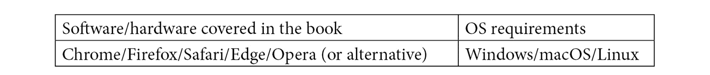

# 零、前言

**亚马逊 SageMaker** 是一个完全托管的**机器学习** ( **ML** )服务，旨在帮助数据科学家和 ML 从业者管理 ML 实验。在本书中，您将使用 Amazon SageMaker 的不同功能和特性来解决相关的数据科学和 ML 需求。

这一步一步的指南有 80 个经验证的食谱，旨在给你实践经验，需要有助于现实世界的 ML 实验和项目。这本书涵盖了训练和部署 NLP，时间序列预测和计算机视觉模型的不同算法和技术，以解决各种 ML 问题。你将在使用深度学习库和框架时探索各种解决方案，如亚马逊 SageMaker 中的 **TensorFlow** 、 **PyTorch** 和**拥抱脸变形金刚**。除此之外，您还将学习如何使用 **SageMaker Clarify** 、 **SageMaker Model Monitor** 、 **SageMaker Debugger** 和 **SageMaker Experiments** 来调试、管理和监控多个 ML 实验和部署。您还将更好地了解 **SageMaker 特征存储**、 **SageMaker 自动驾驶**和 **SageMaker 管道**如何解决数据科学团队的不同需求。

到本书结束时，你将能够结合你所学的不同解决方案，作为解决现实世界的 ML 需求的构建模块。

# 这本书是给谁的

这本书是为对使用 Amazon SageMaker 构建、分析和部署 ML 模型感兴趣的开发人员、数据科学家和 ML 实践者编写的，其中包含 80 个循序渐进的方法。我们需要的只是一个 AWS 帐户来让事情运转起来。AWS、ML 和 Python 编程语言的一些知识将帮助读者更有效地掌握本书中的概念。

# 这本书涵盖了什么

[*第 1 章*](B16850_01_Final_ASB_ePub.xhtml#_idTextAnchor020) ，*使用 Amazon SageMaker 开始机器学习*，重点介绍如何使用 Amazon SageMaker 进行训练和部署一个 ML 模型。您将使用 Amazon SageMaker 和线性学习器内置算法执行一个简化的端到端 ML 实验。

[*第 2 章*](B16850_02_Final_ASB_ePub.xhtml#_idTextAnchor061) ，*构建和使用你自己的算法容器映像*，致力于帮助我们理解模型训练和使用 Amazon SageMaker 部署的内部工作方式。您将创建并使用自己的算法容器映像和脚本，在 SageMaker 中训练和部署一个定制的 ML 模型。

[*第三章*](B16850_03_Final_ASB_ePub.xhtml#_idTextAnchor114) ，*使用机器学习和深度学习框架搭配亚马逊 SageMaker* ，教你如何使用几个 ML 和深度学习框架搭配亚马逊 SageMaker Python SDK 定义、训练和部署自己的模型。这将允许您使用您使用 TensorFlow、Keras、scikit-learn 和 PyTorch 等库和框架准备的任何定制模型，并将它们移植到 SageMaker。

[*第 4 章*](B16850_04_Final_ASB_ePub.xhtml#_idTextAnchor200) ，*准备、处理和分析数据*，探索您可以用来处理不同数据处理和分析需求的不同技术和解决方案。您将使用利用 SageMaker 处理、Amazon Athena 和几个无监督的内置 SageMaker 算法来执行各种数据准备和处理任务的食谱。

[*第五章*](B16850_05_Final_ASB_ePub.xhtml#_idTextAnchor267) ，*有效管理机器学习实验*，提供调试和管理 ML 实验的实用解决方案和实例。您将使用 SageMaker 调试器来检测训练工作中的问题。除此之外，您还将使用 SageMaker Experiments 同时管理和跟踪多个实验。

[*第 6 章*](B16850_06_Final_ASB_ePub.xhtml#_idTextAnchor435)*亚马逊 SageMaker* 中的自动化机器学习，揭示了 SageMaker 的能力和特性，帮助我们自动构建、训练和调整 ML 模型。您将使用 SageMaker Autopilot 详细了解如何在 SageMaker 中使用 AutoML。除此之外，您将使用和配置自动模型调整功能，为我们的模型搜索一组最佳的超参数值。

[*第 7 章*](B16850_07_Final_ASB_ePub.xhtml#_idTextAnchor602)*使用 SageMaker 特征存储、SageMaker Clarify 和 SageMaker 模型监视器*，展示了 SageMaker 与 SageMaker Studio 高度集成的更多功能——SageMaker 特征存储、SageMaker Clarify 和 sage maker 模型监视器。这些功能帮助数据科学家和 ML 实践者处理需求，包括使用在线和离线特征存储、检测数据中的偏差、实现 ML 可解释性以及监控部署的模型。

[*第 8 章*](B16850_08_Final_ASB_ePub.xhtml#_idTextAnchor814) ，*用内置算法解决 NLP、图像分类和时间序列预测问题*，致力于利用几个内置 SageMaker 算法解决**自然语言处理** ( **NLP** )、图像分类和时间序列预测问题的不同解决方案和配方。

[*第 9 章*](B16850_09_Final_ASB_ePub.xhtml#_idTextAnchor866) ，*管理机器学习工作流和部署*，探讨了实时端点部署和自动化工作流的几种中间解决方案。你将致力于专注于深度学习模型部署的食谱，用于拥抱人脸模型、多模型端点部署和 ML 工作流。

# 为了充分利用这本书

你需要一个 AWS 帐户和一个稳定的互联网连接来完成这本书里的食谱。如果您仍然没有 AWS 帐户，请随时查看 **AWS 自由层**页面，并点击**创建自由帐户**:[https://aws.amazon.com/free/](https://aws.amazon.com/free/)。



**如果你使用的是这本书的数字版，我们建议你自己输入代码或者通过 GitHub 库获取代码(下一节提供链接)。这样做将帮助您避免任何与复制和粘贴代码相关的潜在错误。**

# 下载示例代码文件

你可以从[https://GitHub . com/packt publishing/Machine-Learning-with-Amazon-sage maker-Cookbook](https://github.com/PacktPublishing/Machine-Learning-with-Amazon-SageMaker-Cookbook)的 **GitHub** 下载本书的示例代码文件。如果代码有更新，它将在现有的 GitHub 库中更新。

在 https://github.com/PacktPublishing/[网站](https://github.com/PacktPublishing/)上，我们也有丰富的书籍和视频目录中的其他代码包。看看他们！

# 代码在行动

这本书的动作视频代码可以在[https://bit.ly/3DYHjoB](https://bit.ly/3DYHjoB)查看。

# 下载彩色图片

我们还提供了一个 PDF 文件，其中有本书中使用的截图/图表的彩色图像。可以在这里下载:[https://static . packt-cdn . com/downloads/9781800567030 _ color images . pdf](_ColorImages.pdf)。

# 习惯用法

本书通篇使用了许多文本约定。

`Code in text`:表示文本中的码字、数据库表名、文件夹名、文件名、文件扩展名、路径名、伪 URL、用户输入和 Twitter 句柄。下面是一个例子:“初始化`HuggingFace`估计器对象。这里，我们指定`model_name`值为`distilbert-base-uncased`

代码块设置如下:

```py
predictor = Predictor(
    endpoint_name=endpoint_name
)
```

当我们希望将您的注意力吸引到代码块的特定部分时，相关的行或项目以粗体显示:

```py
pipeline = Pipeline(
    name=pipeline_name,
    parameters=[
        processing_instance_type,
        training_instance_type,
        input_data,
    ],
    steps=[step_process, step_train],
)
```

任何命令行输入或输出都按如下方式编写:

```py
cd /home/ubuntu/environment/opt
mkdir -p ml-python ml-r 
```

**粗体**:表示新术语、重要单词或您在屏幕上看到的单词。例如，菜单或对话框中的单词出现在文本中，如下所示。下面是一个例子:“在**网络和存储**下，选择现有的默认 VPC，并选择**仅公共互联网**。”

提示或重要注意事项

像这样出现。

# 章节

在这本书里，你会发现几个经常出现的标题(*做好准备*，*怎么做)...*，*工作原理...*，*还有更多...*和*参见*。

要给出如何完成配方的明确说明，请使用以下章节:

## 准备就绪

本节将告诉您制作方法的内容，并介绍如何设置制作方法所需的任何软件或任何初步设置。

## 怎么做……

本节包含遵循配方所需的步骤。

## 它是如何工作的……

这一部分通常包括对前一部分发生的事情的详细解释。

## 还有更多……

这一部分包含了关于配方的附加信息，以使你对配方有更多的了解。

## 亦见

这个部分提供了一些有用的链接，可以链接到食谱的其他有用信息。

# 取得联系

我们随时欢迎读者的反馈。

**总体反馈**:如果你对这本书的任何方面有疑问，请在邮件主题中提及书名，并通过[customercare@packtpub.com](mailto:customercare@packtpub.com)发邮件给我们。

**勘误表**:虽然我们已经尽力确保内容的准确性，但错误还是会发生。如果你在这本书里发现了一个错误，请告诉我们，我们将不胜感激。请访问[www.packtpub.com/support/errata](http://www.packtpub.com/support/errata)，选择您的图书，点击勘误表提交表单链接，并输入详细信息。

**盗版**:如果您在互联网上遇到我们作品的任何形式的非法拷贝，如果您能提供我们的地址或网站名称，我们将不胜感激。请通过[copyright@packt.com](mailto:copyright@packt.com)联系我们，并提供材料链接。

**如果你有兴趣成为一名作家**:如果有一个你擅长的主题，并且你有兴趣写一本书或者为一本书投稿，请访问[authors.packtpub.com](http://authors.packtpub.com)。

# 分享你的想法

一旦你阅读了亚马逊 SageMaker 食谱中的*机器学习，我们很想听听你的想法！请[点击此处直接进入亚马逊对这本书的评论页面](https://packt.link/r/1800567030)并分享您的反馈。*

您的评论对我们和技术社区非常重要，将有助于我们确保提供高质量的内容。