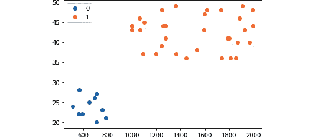
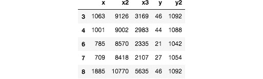

# 四、准备、处理和分析数据

在我们开始训练我们的机器学习模型之前，我们必须准备、处理并转换我们的数据为算法可以处理的结构和格式。我们可以使用不同的技术和服务来处理不同的数据处理和分析需求。本章中的配方集中在执行这些任务时的关键 SageMaker 功能、算法和特性。其中包括针对我们的托管数据处理和转换需求的 **SageMaker 处理**，支持使用 **Amazon Athena** 调用已部署的 SageMaker 机器学习模型以使用 SQL 语句分析我们的数据，内置的**主成分分析** ( **PCA** )算法用于执行维度缩减，内置的 **KMeans** 算法用于执行聚类分析。

我们将从对 Amazon Athena 的简单介绍开始，我们将使用它来帮助我们使用 SQL 语法处理和分析我们在 S3 的大型数据集和文件。我们还将调用一个已部署的**随机砍伐森林** ( **RCF** )模型，使用 SQL 语句来检测我们的合成数据集中的异常。如果这是你第一次听说 Amazon Athena，这是一个完全托管的服务，帮助我们使用 SQL 语法分析亚马逊 S3 中的数据。我们还将展示如何将 CSV 格式的数据转换为 protobuf recordIO 格式。大多数 SageMaker 算法使用这种格式效果最好，因为它允许我们利用**管道模式**。我们将用生成的 protobuf recordIO 文件训练一个 **K 近邻** ( **KNN** )模型。最后，我们将使用 SageMaker 处理来帮助我们从基础设施中自动化和抽象处理作业。SageMaker 处理可以用来帮助我们在我们的 **SageMaker 笔记本实例**之外的托管基础设施内运行脚本。这些脚本可能包含使用小型或大型数据集处理数据和评估模型的任务。

我们将在本章中介绍以下配方:

*   生成用于异常检测实验的合成数据集
*   训练和部署 RCF 模型
*   使用 SQL 查询调用 Amazon Athena 的机器学习模型
*   使用 Python 中的 Amazon Athena 分析数据
*   生成用于分析和转换的合成数据集
*   使用内置的 PCA 算法执行降维
*   使用内置的 KMeans 算法执行聚类分析
*   将 CSV 数据转换为 protobuf recordIO 格式
*   使用 protobuf recordIO 训练输入类型训练 KNN 模型
*   使用 AWS CLI 准备 SageMaker 处理先决条件
*   Python 中使用 SageMaker 处理的托管数据处理
*   R 中使用 SageMaker 处理的托管数据处理

这些配方将被证明对数据科学家和机器学习实践者有用，因为实验中完成的工作的主要部分涉及数据处理、转换和分析。如果您正在寻找使用 **SageMaker Clarify** 进行训练前和训练后偏差检测的方法，请随时查看 [*第 7 章*](B16850_07_Final_ASB_ePub.xhtml#_idTextAnchor602) 、*使用 SageMaker 特征库、SageMaker Clarify 和 SageMaker 模型监视器*。

# 技术要求

要执行本章中的配方，请确保您具备以下条件:

*   正在运行的 Amazon SageMaker 笔记本实例(例如 ml.t2.large)
*   一个亚马逊 S3 桶

如果您还没有准备好这些先决条件，请随时查看第一章 *中的*启动亚马逊 SageMaker 笔记本实例*和*准备亚马逊 S3 桶和线性回归实验的训练数据集*食谱，使用亚马逊 SageMaker* 开始机器学习。

由于本章中的食谱涉及到一些代码，我们在这个资源库中提供了脚本和笔记本:[https://github . com/packt publishing/Machine-Learning-with-Amazon-sage maker-Cookbook/tree/master/chapter 04](https://github.com/PacktPublishing/Machine-Learning-with-Amazon-SageMaker-Cookbook/tree/master/Chapter04)。


图 4.1-使用 Amazon-SageMaker-Cookbook 的机器学习 GitHub 知识库

如*图 4.1* 所示，我们在第 04 章目录中组织了本章食谱的脚本和笔记本的源代码。

请点击以下链接查看动作视频中的相关代码:

[https://bit.ly/3he32PO](https://bit.ly/3he32PO)

# 生成用于异常检测实验的合成数据集

在这个配方中，我们将生成一个包含异常值或异常值的合成数据集。这将使我们能够使用诸如**随机砍伐森林** (RCF)等算法来执行异常检测实验。如果这是您第一次听说异常检测，这是异常值或与数据集的其余记录显著不同的记录的识别。什么是 RCF 算法？RCF 算法是一种无监督算法，用于检测数据集中的这些异常。

在我们在该配方中生成合成数据集后，我们将使用生成的数据集来训练和部署 RCF 模型，并在*使用 SQL 查询调用 Amazon Athena 机器学习模型*配方中的 Amazon Athena 查询内触发该模型。这将使我们能够在数据准备和分析阶段标记数据集中的异常。

小费

由于我们将展示如何在该配方中生成合成数据集的步骤，您将有机会在以后调整该配方以满足您的需求。您可以决定生成更多记录来测试 Amazon Athena 的扩展能力，并查看您的查询在处理大型数据集时的表现。

## 做好准备

以下是该配方的先决条件:

*   在 SageMaker 笔记本实例中使用 conda_python3 内核的新 Jupyter 笔记本

## 怎么做……

该配方中的第一组步骤涉及在生成合成数据集之前设置和准备一些先决条件:

1.  导航到 SageMaker 笔记本实例中的 my-experiments/chapter04 目录。如果这个目录还不存在，请随意创建。
2.  在 my-experiments/chapter04 目录下使用 conda_python3 内核创建一个新的笔记本，并以这个配方的名称命名(即生成一个用于异常检测实验的合成数据集)。打开此笔记本进行编辑，因为我们将在接下来的几个步骤中使用代码更新此文件。
3.  通过导入一些先决条件来生成随机数和字符串值，启动笔记本:

    ```py
    import random from string import ascii_uppercase from random import randint, choice
    ```

4.  定义三个函数，分别叫做 generate_normal_point()，generate _ anomal _ point()，generate_random_string():

    ```py
    def generate_normal_point():     return randint(0, 10)       def generate_abnormal_point():     return randint(70, 80)       def generate_random_string():     letters = ascii_uppercase     return ''.join(         choice(letters) for i in range(10)     )
    ```

5.  Define the normal_or_abnormal() function:

    ```py
    def normal_or_abnormal():
        tmp = randint(0, 20)

        if tmp == 20:
            return "abnormal"
        else:
            return "normal"
    ```

    现在我们已经有了所有需要的先决条件和函数，我们将运行几个代码块来生成数据集。

6.  Generate 1,000 points with a small set of numbers tagged as abnormal:

    ```py
    list_of_points = []

    for _ in range (0,1000):
        point_type = normal_or_abnormal()

        point_value = 0
        string_value = generate_random_string()

        if point_type == "normal":
            point_value = generate_normal_point()
        else:
            point_value = generate_abnormal_point()

        point = {
            "label": string_value,
            "value": point_value
        }
        list_of_points.append(point)
    ```

    前面的代码块使用 for 循环简单地生成了 1，000 次记录。在这 1，000 个记录中，一定百分比(例如 5%)将是值明显大于正常点的异常点。

7.  Inspect the list_of_points list. All values between 70 and 80 are tagged as abnormal:

    ```py
    list_of_points
    ```

    这个应该产生一组类似于*图 4.2* 所示的结果:

    

    图 4.2–点列表中的标签和值对

    在图 4.2 中，我们可以看到 list_of_points 列表中的字符串标签和整数值对。0 到 10 分之间的正常分数应该比 70 到 80 分之间的异常分数多得多。

8.  Render a quick plot of the list of points generated:

    ```py
    import pandas as pd
    import matplotlib.pyplot as plt
    plt.rcParams['figure.figsize'] = [15, 5]
    pd.DataFrame(list_of_points).plot()
    ```

    这将呈现类似于图 4.3 中所示的图:

    

    图 4.3–包含异常值的合成数据集图

    在*图 4.3* 中，我们有一个显示正常数据点和异常值的合成数据集图。长垂直线表示异常值的存在，因为这些异常数据点的值在 70 和 80 之间。请注意，正常数据点的值在 0 到 10 之间。

    在最后一组步骤中，我们集中精力将这个数据集上传到亚马逊 S3 桶。

9.  准备名为 s3_files 的目录，我们将使用它以 JSON 格式存储生成的点:

    ```py
    !rm -rf s3_files !mkdir -p s3_files
    ```

10.  Define the save_json_file() function. This function accepts an element of list_of_points and creates a JSON file inside the directory:

    ```py
    import json

    def save_json_file(point):
        label = point['label']
        filename = "s3_files/" + label + '.json'
        with open(filename, 'w') as file:
            json.dump(point, file)
            print(f"Saved {label}!")
    ```

    注意

    当使用处理文件路径时，建议使用 os.path.join()连接路径。请注意，我们在这里采取了一种简化这个食谱的捷径。

11.  Use the save_json_file() function for each of the points generated inside list_of_points:

    ```py
    for point in list_of_points:
        save_json_file(point)
    ```

    此时，s3_files 目录中应该总共有 1，000 个文件。

12.  Create a new S3 bucket to store the Athena results. Note that this should be different from the S3 bucket we created in [*Chapter 1*](B16850_01_Final_ASB_ePub.xhtml#_idTextAnchor020)*,  Getting Started with Machine Learning Using Amazon SageMaker*:

    ```py
    bucket_name = "<insert S3 bucket name here>"
    !aws s3 mb s3://{bucket_name}
    ```

    这应该会产生类似于 make_bucket: <bucket name="">的日志消息。</bucket>

    重要说明

    请注意这里的 S3 存储桶名称，因为我们将在使用 SQL 查询的亚马逊 Athena 配方的*调用机器学习模型中使用该存储桶名称。*

13.  Copy and upload the files inside the s3_files directory to the S3 bucket we just created:

    ```py
    !aws s3 cp s3_files/ s3://{bucket_name}/ --recursive
    ```

    这应该产生一些类似于*图 4.4* 所示的日志消息:

    

    图 4.4–将文件上传到 S3 存储桶

    我们可以在*图 4.4* 中看到，存储在 s3_files 目录中的文件正在一次一个地上传到我们刚刚创建的 s3 存储桶中。

14.  Finally, use the %store magic to store the list_of_points variable for later use:

    ```py
    %store list_of_points
    ```

    这将产生一条类似于存储的“点列表”(list)的日志消息。

现在，让我们看看这是如何工作的！

## 工作原理……

在这个配方中，我们生成了一个包含简单标签-值对的合成数据集。这个合成数据集大约有 5%是异常值，我们有意使异常值比“正常”值高得多。


图 4.5–带有异常值的合成数据集

我们可以在*图 4.5* 中看到，异常值的值在 70 到 80 范围内，而“正常”点的值在 0 到 10 范围内。这是意料之中的，因为 generate_normal_point()和 generate _ anomal _ point()函数规定了这些随机生成的数字的最高和最低可能值。

我们为什么要这么做？我们将使用这个数据集来训练和部署一个 RCF 模型，并演示如何在 Amazon Athena 查询中触发一个已部署的模型。我们将在稍后的*使用 SQL 查询*方法调用 Amazon Athena 的机器学习模型中完成这项工作。这将使我们能够在数据准备和分析阶段标记数据集中的异常。

注意

Amazon Athena 的这一功能已经在预览模式下使用了一段时间，现在 AWS 最近宣布了这一功能的普遍可用性，我们决定在这里包含这些配方！请随意查看此页面了解更多信息:[https://AWS . Amazon . com/about-AWS/whats-new/2021/04/announding-general-avail-of-Amazon-Athena-ml-powered-by-Amazon-sage maker/](https://aws.amazon.com/about-aws/whats-new/2021/04/announcing-general-availability-of-amazon-athena-ml-powered-by-amazon-sagemaker/)。

# 训练和部署 RCF 模型

在这个菜谱中，我们将使用 **SageMaker Python SDK** 训练和部署一个 RCF 模型。RCF 算法是一种无监督算法，用于检测数据集中的异常。它将每个记录与异常分数值相关联，较高的异常分数值与可能被标记为异常值或异常的记录相关联。

在我们已经在这个配方中训练和部署了 RCF 模型之后，我们将在*使用 SQL 查询调用机器学习模型的 Amazon Athena 配方中的 Amazon Athena SQL 查询中触发这个模型。这将使我们能够在数据准备和分析阶段标记数据集中的异常。*

## 正在准备…

该配方延续了*生成异常检测实验的合成数据集*。

## 怎么做……

下一组步骤集中在使用我们在上一个配方中生成的数据集来准备 RCF 模型:

1.  导航到 SageMaker 笔记本实例中的 my-experiments/chapter04 目录。如果这个目录还不存在，请随意创建。
2.  在 my-experiments/chapter04 目录下使用 conda_python3 内核创建一个新的笔记本，用这个菜谱的名字命名(即训练和部署一个随机采伐森林模型)。打开此笔记本进行编辑，因为我们将在接下来的几个步骤中使用代码更新此文件。
3.  Start the notebook by using the %store magic command to load the stored list of values for list_of_points:

    ```py
    %store -r list_of_points
    list_of_points
    ```

    我们应该会得到一个类似于*图 4.6* 所示的字典列表:

    

    图 4.6–点列表

    正如我们在*图 4.6* 中可以看到的那样，它应该包含与*中的 list_of_points 列表完全相同的一组值，为异常检测实验*配方生成合成数据集。

4.  Extract the values using the map() function and store them in a list:

    ```py
    point_values = list(map(lambda x: x["value"], list_of_points))
    point_values
    ```

    我们应该得到类似于[10，1，0，2，3，8，3，… ]的结果列表。

5.  Use numpy to reshape the list:

    ```py
    import numpy as np
    np_array = np.array(point_values)
    np_array = np_array.reshape(-1,1)
    np_array
    ```

    我们应该得到一组结构类似 array([[10]，[1]，[0]，[2]，…])的结果。

6.  为 SageMaker 实验初始化并准备一些先决条件，如 role_arn 和 session:

    ```py
    import sagemaker  from sagemaker import get_execution_role  role_arn = get_execution_role() session = sagemaker.Session()
    ```

7.  初始化 RandomCutForest 估计器:

    ```py
    from sagemaker import RandomCutForest estimator = RandomCutForest(     role_arn,      instance_count=1,      instance_type='ml.m5.xlarge',     sagemaker_session=session)
    ```

8.  Run the fit() function to start preparing the model:

    ```py
    record_set_input = estimator.record_set(np_array)
    estimator.fit(record_set_input)
    ```

    这将产生一组类似于图 4.7 中所示的日志:

    

    图 4.7–使用 fit()准备 RCF 模型后的日志

    在我们做好模型之前，应该要花几分钟的时间(T4)。注意，由于 RCF 算法是无监督的，因此在此步骤中我们不使用标记数据。

9.  使用 deploy()函数将模型部署到推理端点。这里我们指定 endpoint_name 值，因为我们稍后将在触发该机器学习端点的 SQL 查询中使用该端点名称:

    ```py
    predictor = estimator.deploy(     initial_instance_count=1,      instance_type="ml.m5.xlarge",      endpoint_name="sagemaker-cookbook-rcf")
    ```

10.  Call the predict() function to get the anomaly scores of each of the points passed to the inference endpoint:

    ```py
    results = predictor.predict(np_array)
    results
    ```

    这将产生一组类似于图 4.8 中*所示的结果:*


图 4.8-异常得分结果

如*图 4.8* 所示，推理端点将相应的异常分数返回给作为有效载荷传递给 predict()函数的每个数据点。该值越高，数据点成为异常值或异常值的可能性就越大。

重要说明

在使用 Python 中的 Amazon Athena 完成*数据分析之前，不要删除推理端点*。

现在，让我们看看这是如何工作的！

## 工作原理……

在这个配方中，我们使用了来自*的合成数据集生成用于异常检测实验的合成数据集*来准备和部署 RCF 模型。当使用 RCF 算法时，数据点与异常分数相关联，异常与更高的分数相关联。

使用 RCF 算法非常简单。我们所需要做的就是将整形后的列表中的一组数值作为有效载荷传递给 fit()函数，以便为模型准备几分钟。在我们使用 deploy()函数将模型部署到推理端点之后，我们可以将不同的值作为有效负载传递给 predict()函数以获得相应的异常分值。

## 参见

如果您正在寻找使用 RCF 模型检测真实数据集异常的示例和更复杂的示例，请随意查看 aws/Amazon-sage maker-examples GitHub 存储库中的一些笔记本，以及 AWS 网络研讨会视频中共享的笔记本:

*   使用 RCF 模型检测 Numenta 异常基准 NYC Taxi 数据集中的异常:[https://github . com/AWS/Amazon-sage maker-examples/blob/35 e 2 faf 7 D1 cc 48 cced f 0 B2 ede 1 da 987 a 18727 a5/introduction _ to _ Amazon _ algorithms/random _ cut _ forest/random _ cut _ forest . ipynb](https://github.com/aws/amazon-sagemaker-examples/blob/35e2faf7d1cc48ccedf0b2ede1da9987a18727a5/introduction_to_amazon_algorithms/random_cut_forest/random_cut_forest.ipynb)
*   训练和部署 RCF 欺诈检测模型:[https://github . com/aw slabs/fraud-detection-using-machine-learning/blob/master/source/notebooks/sage maker _ fraud _ detection . ipynb](https://github.com/awslabs/fraud-detection-using-machine-learning/blob/master/source/notebooks/sagemaker_fraud_detection.ipynb)

现在，让我们仔细看看如何在下一个菜谱中用 SQL 语句调用我们在 Amazon Athena 的这个菜谱中部署的 RCF 模型！

# 使用 SQL 查询通过 Amazon Athena 调用机器学习模型

Amazon Athena 是一个**无服务器**交互式查询服务，帮助我们使用 SQL 语法分析亚马逊 S3 的数据。由于它是一种无服务器的服务，机器学习从业者不再需要管理任何基础设施，因此我们可以专注于需要完成的工作。如果您以前使用过或听说过 Amazon Athena，您一定知道该解决方案可以轻松扩展并支持**大数据**需求。Amazon Athena 还支持多种数据格式(如 CSV 和文本文件)、分栏格式(如 Parquet 和 ORC)和压缩数据格式(如 Snappy 和 GZIP)。

注意

当然，这只是对无服务器的简单描述。如需更多信息，请随时查看 https://aws.amazon.com/serverless/的。

在这个菜谱中，我们将使用 Amazon Athena 来分析我们使用 SQL 语句存储在 Amazon S3 中的数据集。我们将在查询中使用部署的机器学习模型来检测数据中的异常。

## 准备就绪

这个配方是从*训练和部署 RCF 模型*延续下来的。

## 怎么做……

第一组步骤主要是确保我们使用的是 Athena 引擎版本 2:

1.  Navigate to the Athena console. If you see a notification similar to what is shown in *Figure 4.9*, click the **Edit workgroup page** link.

    图 4.9–Athena 控制台显示了新的 Athena 查询引擎可用通知

    如果您没有看到*图 4.9* 中的通知消息，您应该可以通过点击导航栏中的**工作组:主**选项卡导航到工作组列表，如下图所示:

    

    图 4.10–导航菜单

    这应该会将我们重定向到显示现有工作组的工作组列表页面。接下来，点击**查看详情**按钮，如图*图 4.11* 所示:

    

    图 4.11–现有 Athena 工作组列表

    最后点击**编辑工作组**按钮，如图*图 4.12* 所示:

    

    图 4.12–编辑工作组按钮在工作组详细信息页面上的位置

    正如我们在*图 4.12* 中所看到的，我们在工作组详细信息页面上有特定工作组的详细信息。我们还可以选择编辑、禁用或删除工作组。

    

    图 4.13–编辑工作组页面

    一旦我们进入**编辑工作组**页面，我们就可以继续下一步。

2.  On the **Edit workgroup** page, specify the **Query result location** path where we will store the query results.

    图 4.14–选择查询结果位置

    参见*图 4.14* 至见该步骤更新哪个字段。点击**选择**按钮将打开一个弹出窗口，我们可以在其中选择目标 S3 桶和文件夹。

3.  Next, scroll down to the **Query engine version** section and make sure that the **Athena engine version 2 (recommended)** option is selected.

    图 4.15–使用 Athena 引擎版本 2

    如*图 4.15* 所示，确保已选择**的也手动选择一个发动机版本**。

4.  Scroll down to the end of the page, and then click the **Save** button.

    小费

    如果您在使用工作组时遇到问题，请随时查看该页面上共享的提示:[https://docs . AWS . Amazon . com/Athena/latest/ug/work groups-troubleshoot . html](https://docs.aws.amazon.com/athena/latest/ug/workgroups-troubleshooting.html)。

5.  After we have been redirected back to the workgroup details page, click **Query editor** in the navigation bar.

    图 4.16–工作组详细信息页面

    从*图 4.16* 中可以看到，**查询编辑器**标签页应该位于页面的左上角(在**保存的查询**旁边)。

6.  On the left-hand side of the **Query editor** page, look for the **Data source** pane and click the **Connect data source** link.

    图 4.17–连接数据源

    注意*图 4.17* 中的**数据源**窗格位于**查询编辑器**页面的左侧角落。我们应该在刷新图标下面看到**连接数据源**链接。

7.  Make sure that the **Query data in Amazon S3** and **AWS Glue Data Catalog** options are selected. Click the **Next** button.

    图 4.18–选择数据源

    在*图 4.18* 中，我们选择了**亚马逊 S3** 中的查询数据，因为我们的数据集位于 S3 存储桶内。

8.  Choose **AWS Glue Data Catalog in this account**. Next, choose **Create a table using the Athena table wizard**. Click the **Continue to add table** button.

    图 4.19–连接细节

    点击**继续添加表**按钮，如图*图 4.19* 所示，然后会让继续创建一个新的数据库，并在下一组步骤中在该数据库中添加一个表。

9.  Choose **Create a new database** for **Database**. Specify cookbook_athena_db for the database name. For the **Table Name** field, specify athena_table. Specify the S3 bucket name (that is, s3://<bucket name>) where the JSON files in the *Generating a synthetic dataset for anomaly detection experiments* recipe were uploaded in the **Location of Input Data Set** field. Click the **Next** button afterward.

    图 4.20–添加表格表单

    确保检查指定的字段值与*图 4.20* 中的值相同。

10.  Under **Step 2: Data Format**, select **JSON** and then click **Next**.

    图 4.21–选择数据格式

    在*图 4.21* 中，我们可以看到支持多种数据格式。这些包括阿帕奇网络日志，CSV 和 TSV。由于我们已经在 S3 桶中上传了 JSON 文件，我们将从这个选项组中选择 **JSON** 。

11.  Under **Step 3: Columns**, specify two columns—**Column Name**: label and **Column type**: string and **Column Name**: value, and **Column type**: int. Click **Next**.

    图 4.22–指定表格列

    确保至检查指定的字段值与我们在*图 4.22* 中的值相同。

12.  Under **Step 4: Partitions**, click the **Create table** button.

    图 4.23–添加分区

    注意我们在这一步不会添加任何分区，如图*图 4.23* 所示。我们只需点击**创建表格**按钮来完成表格创建过程。

    小费

    有关如何使用分区来提高查询性能和降低成本的更多信息，请随时查看[https://docs . AWS . Amazon . com/Athena/latest/ug/partitions . html](https://docs.aws.amazon.com/athena/latest/ug/partitions.html)。

13.  Beside the **New query 1** or **New query 2** tab, click the **+** icon to create a new tab where we can run a new query.

    图 4.24–创建新选项卡

    这个应该打开一个新的标签页，如图*图 4.25* 所示:

    

    图 4.25–新选项卡

    点击新选项卡内的文本区域，如*图 4.25* 所示。

14.  Type the following SQL statement in the query editor pane. Click the **Run query** button to execute the query:

    ```py
    SELECT label, value FROM cookbook_athena_db.athena_table LIMIT 10;
    ```

    如果一切都配置和设置正确，我们应该得到一组类似于图 4.26 所示的结果:

    

    图 4.26–查询结果

    在*图 4.26* 中，我们可以看到显示在查询编辑器窗格底部的查询结果。注意，查询结果中的每一项都对应于我们之前准备的 S3 存储桶中上传的一个 JSON 文件。

15.  Next, update the query in the text area with the following SQL query. Click the **Run query** button to execute the query. Note that the SageMaker inference endpoint with the name sagemaker-cookbook-rcf must be running for this query to execute:

    ```py
    USING EXTERNAL FUNCTION detect_anomaly(value INT)
        RETURNS DOUBLE
        SAGEMAKER 'sagemaker-cookbook-rcf'
    SELECT label, value, detect_anomaly(value) AS anomaly_score
        FROM cookbook_athena_db.athena_table
    ```

    我们应该得到类似于*图 4.27* 所示的结果:


图 4.27–返回异常分数值的查询结果

在*图 4.27* 中，我们可以看到我们能够在 SQL 语句中使用部署的 RCF 模型。请注意，我们不仅限于在 Athena SQL 查询中使用已部署的 RCF 模型，我们还可以在这里使用其他已部署的模型。如果遇到 ThrottlingException，可以在 SQL 语句的末尾添加“LIMIT 1000”。

让我们看看这是如何工作的！

## 工作原理……

在这个菜谱中，我们已经为我们的虚拟数据源在我们的 S3 存储桶中生成并存储了样本文件。然后，我们使用 SQL 语句通过 Amazon Athena 查询存储在 S3 存储桶中的数据。


图 4.28-使用 Amazon Athena 使用 SQL 语句分析存储在 S3 的数据

在*图 4.28* 中，我们可以看到 Amazon Athena 使用 SQL 语句帮助我们查询和分析存储在我们的 S3 存储桶中的文件内部的数据。请注意，使用 Amazon Athena 的优势之一是它是一种无服务器查询服务——不需要管理任何服务器。除此之外，定价也与其使用量成正比。这使得它成为最实用的解决方案之一，尤其是在处理大数据需求时。除了不必担心必须自己管理基础架构之外，您也不必担心未充分利用或闲置资源的成本。使用与本食谱类似的设置，Amazon Athena 可以轻松扩展和处理更大的数据集，并且仍然可以在几秒钟内做出响应。当然，我们可以执行一些调整、配置和最佳实践(例如，分区和压缩)来优化这个设置的性能。

我们还在 SQL 查询中使用了部署的 RCF 模型来检测数据集中的异常。请注意，我们不仅限于在这里执行异常检测，我们可以使用其他不同类型的部署模型，例如使用 **XGBoost** 或**因式分解机器**。

# 用 Python 中的 Amazon Athena 分析数据

Amazon Athena 是 AWS 的一个查询服务，使用 SQL 语法查询存储在亚马逊 S3 的数据。在前面的菜谱中，我们使用 Athena 控制台(UI)运行了几个 SQL 查询。当然，当处理机器学习和机器学习工程任务时，我们希望通过脚本来执行，以便我们有机会自动化该过程的某些步骤。

在这个菜谱中，我们将使用 **boto3 Python SDK** 以编程方式运行 Amazon Athena SQL 查询。一旦我们完成了这个食谱，我们将使用 Amazon Athena 和 Python 加载、查询和转换存储在我们的 S3 桶中的 JSON 数据为表格格式。我们将在这个菜谱中执行两个查询——一个简单的 SELECT 查询和一个调用 Amazon SageMaker 中已部署的机器学习模型的查询。

## 准备就绪

这种方法继续于*使用 SQL 查询调用 Amazon Athena 的机器学习模型*。

## 怎么做……

接下来的几个步骤集中在使用 Python SDK 以编程方式运行 Athena 查询，而不使用 UI。确保使用 conda_python3 内核的空笔记本运行下一组命令:

1.  导航到 SageMaker 笔记本实例中的 my-experiments/chapter04 目录。如果这个目录还不存在，请随意创建。
2.  在my-experiments/chapter 04 目录内使用 conda_python3 内核新建一个笔记本，用这个菜谱的名字命名(也就是用 python 中的 Amazon Athena 分析数据)。打开此笔记本进行编辑，因为我们将在接下来的几个步骤中使用代码更新此文件。
3.  通过导入 boto3 并初始化 Athena 客户端来启动笔记本:

    ```py
    import boto3 athena = boto3.client('athena', region_name='us-east-1')
    ```

4.  Specify the value for athena_results_bucket. Note that this is a different S3 bucket and we will use this bucket to store the results of the Athena queries:

    ```py
    athena_results_bucket = "<insert S3 bucket name here>"
    !aws s3 mb s3://{athena_results_bucket}
    ```

    这应该会产生类似于 make_bucket: <bucket name="">的日志消息。</bucket>

5.  Initialize the variable values for query, database, and results_bucket. Make sure to replace the database name, table name, and S3 target bucket in the following variables with the values used in the *Invoking machine learning models with Amazon Athena in SQL queries* recipe:

    ```py
    query = "SELECT label, value FROM cookbook_athena_db.athena_table;"
    database = "cookbook_athena_db"
    results_bucket = "s3://" + athena_results_bucket
    ```

    需要注意的是，前面的代码块仅由三行组成(以防由于语句长度的原因，代码块呈现为四行或更多行)。

6.  定义 execute_athena_query()函数，该函数使用 boto3 SDK 中的 start_query_execution()函数来运行参数:

    ```py
    def execute_athena_query(query, database, results_bucket):     response = athena.start_query_execution(         QueryString = query,         QueryExecutionContext = {             'Database' : database         },         ResultConfiguration = {             'OutputLocation': results_bucket         }     )     return response['QueryExecutionId']
    ```

    中指定的查询
7.  定义get _ output _ path()函数，该函数使用get _ query _ execution()函数使用指定的执行 ID 加载 Athena 查询的细节，并返回存储 Athena 查询结果的输出位置:

    ```py
    def get_output_path(execution_id):     query_details = athena.get_query_execution(         QueryExecutionId = execution_id     )     execution = query_details['QueryExecution']     configuration = execution['ResultConfiguration']     return configuration['OutputLocation']
    ```

8.  Call the execute_athena_query() and get_output_path() functions. Note that the Athena query may run for a few seconds so we may need to wait for 3-5 seconds before the output CSV file becomes available in the S3 output path:

    ```py
    execution_id = execute_athena_query(query, database, results_bucket)
    output_path = get_output_path(execution_id)
    output_path
    ```

    我们应该得到一个类似于‘S3://<桶名>/64957 FB b-b873-48ec-91aa-7377343 da 412 . CSV’的值。

9.  如果 tmp 目录尚不存在，则创建该目录:

    ```py
    !mkdir -p tmp
    ```

10.  Download the CSV file containing the results of the query to the tmp directory created in the previous step:

    ```py
    !aws s3 cp {output_path} tmp/output.csv
    ```

    这应该会生成一条类似于 download:S3://<bucket name="">/97d 9da 6 f-6426-46a 1-b775-c 96580 FD 29 f 4 . CSV to tmp/output . CSV 的日志消息。</bucket>

11.  Load and inspect the contents of tmp/output.csv using the read_csv() function:

    ```py
    import pandas as pd
    pd.read_csv("tmp/output.csv")
    ```

    我们应该得到一组类似于图 4.29 所示的结果:

    

    图 4.29–输出. csv 文件的内容

    在*图 4.29* 中，我们可以看到output . CSV 文件中的标签和值对。这里的每条记录都应该正确地映射到我们之前在*为异常检测实验生成合成数据集*配方中生成的记录。

12.  将查询字符串值设置为触发现有 SageMaker 推理端点的 Athena SQL 查询。这是我们在控制台中使用的相同查询，在 SQL 查询中使用亚马逊 Athena 调用机器学习模型方法:

    ```py
    query = """ USING EXTERNAL FUNCTION detect_anomaly(value INT)     RETURNS DOUBLE     SAGEMAKER 'sagemaker-cookbook-rcf' SELECT label, value, detect_anomaly(value) AS anomaly_score     FROM cookbook_athena_db.athena_table """
    ```

13.  Call the execute_athena_query() and get_output_path() functions again but this time using the query that triggers the machine learning endpoint. Note that the Athena query may run for a few seconds so we may need to wait for 3-5 seconds before the output CSV file becomes available in the S3 output path:

    ```py
    execution_id = execute_athena_query(query, 
        database, results_bucket)
    output_path = get_output_path(execution_id)
    output_path
    ```

    这将产生类似“S3://<bucket name="">/d 457328 e-b456-4d 11-a012-6 ea 26 a 22 CEB 9 . CSV”的输出。</bucket>

14.  Download the CSV file containing the results of the query to the tmp directory:

    ```py
    !aws s3 cp {output_path} tmp/output.csv
    ```

    这应该会生成一条类似于 download:S3://<bucket name="">/d 457328 e-b456-4d 11-a012-6 ea 26 a 22 CEB 9 . CSV to tmp/output . CSV 的日志消息。</bucket>

15.  Load and inspect the contents of tmp/output.csv:

    ```py
    df = pd.read_csv("tmp/output.csv")
    df
    ```

    这将为我们提供一个结构类似于图 4.30 所示的数据框架:

    

    图 4.30–包括异常分数的查询结果

    在*图 4.30* 中，我们可以看到现在每条记录都有一个对应的异常 _ 分值。

16.  Check the number of records with an anomaly_score value greater than 2:

    ```py
    len(df[df.anomaly_score > 2])
    ```

    我们应该得到一个等于或接近 47 的值。注意，我们只是选择了 2 作为一个任意的数字。鉴于较高的 anomaly_score 值表明数据点成为异常值的风险较高，选择 2 是一个好的开始。请注意，其他机器学习从业者和数据科学家可能会使用离群值的正式定义和公式，但我们将在本食谱中跳过这一点。

此时，我们现在可以删除在*训练和部署 RCF 模型*配方中部署的端点。现在，让我们看看这个食谱是如何工作的！

## 工作原理……

在这个菜谱中，我们使用 boto3 在 Python 笔记本中以编程方式运行 Amazon Athena SQL 查询。正如在前面的食谱中所讨论的，Amazon Athena 帮助我们分析存储在我们的 S3 存储桶中的文件内部的数据，而我们不必担心服务器和基础设施管理。

该配方中执行的步骤可由下图总结:


图 4.31–使用 boto3 和 pandas 通过 SQL 语句对存储在 S3 的数据执行查询

在*图 4.31* 中，我们可以看到当使用 boto3 和 Amazon Athena 执行 SQL 查询以获得 pandas 数据框架中的结果时，涉及到几个步骤。一旦我们在 pandas 数据框架中有了结果，接下来的步骤可能包括在执行模型训练步骤之前处理、转换和分析这些结果。

# 生成用于分析和转换的合成数据集

在这个配方中，我们将生成一个合成数据集，该数据集将用于接下来的四个配方，包括降维、聚类分析和转换为 protobuf recordIO 格式。我们将生成数据集的一个标记版本和数据集的一个未标记版本。该数据集将有两个易于识别的聚类，如图 4.32 中的*所示。它还将有六列用于数据集的已标记版本，五列用于数据集的未标记版本。*


图 4.32–合成数据集

在我们完成这个配方后，我们应该有一个类似于图 4.32 所示的合成数据集。在*使用内置 PCA 算法*进行降维中，我们将使用 PCA 算法对这个合成数据集进行降维。在使用内置 KMeans 算法配方执行聚类分析的*中，我们将处理该数据集的未标记版本，并使用 KMeans 无监督学习算法来自动检测两个聚类，并将点分配给最近的聚类。我们还将在*将 CSV 数据转换为 protobuf recordIO 格式*方法中使用该数据集的标签版本展示如何将 CSV 数据转换为 protobuf recordIO 格式。*

小费

由于我们将在这个配方中展示如何生成合成数据集的步骤，我们将有机会在以后调整这个配方以满足我们的需要。我们将在本菜谱的*工作原理……*部分讨论一些不同的方法来调整它，以测试不同算法的性能和行为。

## 准备就绪

以下是该配方的先决条件:

*   在 SageMaker 笔记本实例中使用 conda_python3 内核的新 Jupyter 笔记本

## 怎么做……

第一组步骤侧重于生成随机的 x 和 y 整数值:

1.  导航到 SageMaker 笔记本实例中的 my-experiments/chapter04 目录。如果这个目录还不存在，请随意创建。
2.  在 my-experiments/chapter04 目录中使用 conda_python3 内核创建一个新的笔记本，并用这个配方的名称命名(即生成一个用于分析和转换的合成数据集)。打开此笔记本进行编辑，因为我们将在接下来的几个步骤中使用代码更新此文件。
3.  使用 numpy 和 random 中的种子函数，这样我们可以生成相同的随机数集，使我们的实验具有可重复性:

    ```py
    import random from numpy.random import seed as np_seed from random import randint np_seed(42) random.seed(42)
    ```

4.  Define the generate_x_value() and generate_y_value() functions:

    ```py
    def generate_x_value():
        return randint(500,2000)

    def generate_y_value():
        return randint(20,50)
    ```

    有了这些函数，我们有望得到 500 到 2000 之间的 x 值，有望得到 20 到 50 之间的 y 值。

5.  Using the generate_x_value() function, we generate 100 random values and store them inside the x_values list:

    ```py
    x_values = []

    for _ in range(0, 100):
        x_values.append(generate_x_value())

    x_values[0:5]
    ```

    我们将得到类似于[1809，728，551，1063，1001]的值。

6.  Similarly, we generate 100 values using the generate_y_value() function and store these values inside the y_values list:

    ```py
    y_values = []

    for _ in range(0, 100):
        y_values.append(generate_y_value())

    y_values[0:5]
    ```

    我们将得到类似于[27，41，30，46，44]的值。

    下一组步骤集中于从我们在前一组步骤中准备的原始 x 和 y 值生成衍生值。我们将使用 list()、map()和 lambda 匿名函数来生成一个包含 x 和 y 的派生值的列表。

7.  We then generate a derived list of values from the x_values list and store them in x2_values:

    ```py
    x2_values = list(map(lambda x: x * 2 + 7000, x_values))
    x2_values[0:5]
    ```

    我们将得到类似于[10618，8456，8102，9126，9002]的值。

8.  In a similar fashion, we generate a derived list of values and store them in the x3_values list:

    ```py
    x3_values = list(map(lambda x: x * 3 - 20, x_values))
    x3_values[0:5]
    ```

    我们将得到类似于[5407，2164，1633，3169，2983]的值。

9.  We also generate a derived list of values from y_values and store them in the y2_values list:

    ```py
    y2_values = list(map(lambda y: y * 2 + 1000, y_values))
    y2_values[0:5]
    ```

    我们将得到类似于[1054，1082，1060，1092，1088]的值。

10.  现在我们已经有了列表中的所有列值，我们将它们组合到一个单一数据框架:

    ```py
    import pandas as pd       df = pd.DataFrame({     "x": x_values,     "x2": x2_values,     "x3": x3_values,     "y": y_values,     "y2": y2_values })
    ```

11.  Let's inspect what the DataFrame looks like:

    ```py
    df
    ```

    我们应该得到一个类似于图 4.33 所示的数据帧:

    

    图 4.33–包含 x 值、x2 值、x3 值、y 值和 y2 值的数据框

    在*图 4.33* 中，我们可以看到有五列的数据帧——x、x2、x3、y 和 y2。x2 和 x3 列源自 x，y2 列源自 y 值。

12.  Next, generate the values for the label column. If the x values are greater than 1000 and the y values are greater than 35, we specify a value of 1 for the label column. Otherwise, we specify a value of 0:

    ```py
    df["label"] = (df.x > 1000) & (df.y > 35)
    df['label'] = df['label'].apply(lambda x: 1 if x else 0)
    df
    ```

    我们应该得到一个类似于图 4.34 所示的数据帧:

    

    图 4.34–带有标签列值的数据框

    在*图 4.34* 中，我们可以看到根据 x 和 y 值包含值 1 和 0 的新标签列。

    现在，我们将集中精力删除数据集中的一些记录，这样我们将剩下两个不同的点聚类。

13.  We then generate the values for the keep column. As the name suggests, we will decide whether to keep the record or not based on the value in the keep column:

    ```py
    df["keep"] = ((df.x > 1000) & (df.y > 35)) | ((df.x < 800) & (df.y < 30))
    df
    ```

    我们应该得到一个类似于图 4.35 所示的数据帧:

    

    图 4.35–带有新保留列的数据框

    我们可以在图 4.35 中看到新的包含真值和假值的 keep 列。由于我们将对该数据集执行聚类分析，因此我们将有意删除“中间”的值，以便修整后的数据集将具有两个聚类，第一个聚类的 x 值大于 1000，y 值大于 35，第二个聚类的 x 值小于 800，y 值小于 30。

14.  Next, select and continue with the records with the keep column value equal to True:

    ```py
    df = df[df.keep]
    df.head()
    ```

    我们应该得到一个类似于图 4.36 所示的数据帧:

    

    图 4.36–修剪后的数据集

    虽然我们无法在*图 4.36* 中看到整个修剪后的数据集，但我们应该注意到，我们在使用 head()函数的初始记录列表中遗漏了 0、1、2 和 5 个索引。这是因为具有这些索引的记录已经被过滤掉了，因为它们在 keep 列中的值等于 False。

15.  现在我们已经修剪了数据集，让我们使用 del 关键字:

    ```py
    del df["keep"]
    ```

    删除 keep 列
16.  With everything ready, generate the scatterplot showing the labeled clusters using the following lines of code:

    ```py
    import matplotlib.pyplot as plt

    groups = df.groupby("label")
    for name, group in groups:
        plt.plot(group["x"], 
                 group["y"], 
                 marker="o", 
                 linestyle="", 
                 label=name)

    plt.legend()
    ```

    前面的代码块利用 groupby()函数，通过使用标签列的值对点进行分组。这将生成一个类似于*图 4.37* 所示的散点图:

    

    图 4.37–matplotlib 散点图显示了标记的集群

    在*图 4.37* 中，我们可以看到有两个集群对应于每个标记组。标签为 0 的第一个聚类位于图的左下部分，标签为 1 的第二个聚类位于图的右上部分。

17.  如果 tmp 目录不存在，则生成该目录:

    ```py
    !mkdir -p tmp
    ```

18.  Use the to_csv() function to store the labeled DataFrame in a CSV file:

    ```py
    df.to_csv("tmp/synthetic.all.labeled.csv")
    ```

    我们将在稍后的*将 CSV 数据转换成 protobuf recordIO 格式*配方中使用这个 CSV 文件。

19.  Store the labeled DataFrame using the %store magic command as well:

    ```py
    labeled_df = df
    %store labeled_df
    ```

    我们将得到一个与存储的“labelled _ df”(data frame)相同或相似的成功消息。

    在最后一组步骤中，我们将准备和存储合成数据集的未标记版本。

20.  Delete the label column using the del keyword:

    ```py
    del df["label"]
    df.head()
    ```

    我们应该得到一个类似于图 4.38 所示的数据帧:

    

    图 4.38–没有标签列的数据框

    我们可以在*图 4.38* 中看到没有标签列的数据帧。我们将在哪里使用这个？在我们执行了缩放步骤后，我们将在*使用内置 KMeans 算法*配方执行聚类分析中使用这个未标记的数据帧执行无监督聚类分析。

21.  Use MinMaxScaler from scikit-learn to scale the values in the unlabeled DataFrame:

    ```py
    from sklearn.preprocessing import MinMaxScaler

    scaler = MinMaxScaler()
    scaled_array = scaler.fit_transform(df.astype(float))
    normalized_df = pd.DataFrame(scaled_array)
    normalized_df.columns = df.columns
    normalized_df.index = df.index

    normalized_df.head()
    ```

    我们应该得到一个类似于*图 4.39* 所示的数据帧:

    

    图 4.39-缩放数据框

    如*图 4.39* 所示，我们的值已被缩减为一组介于 0 和 1 之间的值。请注意，我们可以选择为 MinMaxScaler 的 feature_range 参数指定值，但我们将坚持使用默认值(0，1)。

22.  使用 to_csv()函数将标准化无标签数据帧的值保存到一个 csv 文件:

    ```py
    normalized_df.to_csv("tmp/synthetic.all_normalized.unlabeled.csv")
    ```

23.  Finally, use the %store magic command to store the values of the unlabeled_normalized_df variable:

    ```py
    unlabeled_normalized_df = normalized_df
    %store unlabeled_normalized_df
    ```

    我们将得到一个等于或类似于存储的“unlabel _ normalized _ df”(data frame)的成功消息。

让我们看看这是如何工作的！

## 工作原理…

在这个配方中，我们已经生成了一个合成数据集，该数据集将用于涉及**降维**、**聚类分析**以及序列化为 protobuf recordIO 格式的配方中。作为一名机器学习从业者，熟悉这些关于数据准备和分析的方法很重要，因为在将数据作为输入传递给模型训练步骤之前，数据很可能会被转换几次。

这个数据集的属性是什么？这个数据集中的数据点被有意地分成两个聚类，以便我们更容易知道我们的聚类分析方法是否有效。我们还添加了几个派生列，帮助我们了解我们的降维方法是否也有效。

我们可以对这个食谱进行哪些调整来产生这个数据集的变体？

*   我们可以(显著地)生成更多的记录，并测试后续配方中使用的算法的性能。一些算法和解决方案适用于相对较小的数据集，但在处理较大的数据集时可能会有困难。
*   我们可以向生成的数据集中添加更多的列。例如，我们可以生成 100 列，而不是只有 5 列。我们可以测试和比较一个算法在只有 5 列的数据集上的性能，以及同一算法在有 100 列的数据集上的性能。
*   我们还可以将生成的集群数量从 2 个增加到 10 个，并看看集群算法在处理更多集群时的表现。

记住这一点，让我们继续利用这个合成数据集的食谱！

# 使用内置的 PCA 算法进行降维

在这个配方中，我们将演示如何使用内置的 PCA 算法对合成数据集进行降维。降维涉及将数据集的列数减少到更少的基本列数。如果你想知道为什么这很重要，那是因为一些算法在处理更少的维度时表现得更好更快！

我们将对来自*的未标记数据集使用 PCA 算法，生成用于分析和转换*配方的合成数据集，并将该数据集的列数从五列减少到两列。通过使用 PCA，我们还会注意到结果值不同于原始数据集中的任何行值。

## 准备就绪

该配方延续了*生成用于分析和转换的合成数据集*。

## 怎么做……

下一组步骤集中于使用我们在前面的配方中生成的未标记数据集来准备我们将用于降维的 PCA 模型:

1.  在 SageMaker 笔记本实例中，导航到my-experiments/chapter 04 目录。如果这个目录还不存在，请随意创建。
2.  在 my-experiments/chapter04 目录下用 conda_python3 内核新建一个笔记本，用这个菜谱的名字命名(也就是用内置的 PCA 算法进行降维)。打开此笔记本进行编辑，因为我们将在接下来的几个步骤中使用代码更新此文件。
3.  Start the notebook by using the %store magic command to load the values of unlabeled_normalized_df:

    ```py
    %store -r unlabeled_normalized_df
    ```

    如果您还记得，我们将该值存储在*生成用于分析和转换的合成数据集*配方中。我们将使用该数据帧中的值，并使用 PCA 模型对其进行降维。

4.  为我们的 SageMaker 实验导入并准备一些先决条件。这些包括会话和角色，我们将在后面的步骤中把它们作为参数值传递给 PCA 估计器:

    ```py
    import sagemaker from sagemaker import get_execution_role       session = sagemaker.Session() role = get_execution_role()
    ```

5.  We initialize a PCA estimator object using the parameter values prepared in the previous step as well as the values for the instance_count, instance_type, and num_components parameters:

    ```py
    from sagemaker import PCA

    estimator = PCA(
        role=role,
        instance_count=1,
        instance_type='ml.c5.xlarge',
        num_components=2,
        sagemaker_session=session)
    ```

    这个估计器中的 num_components 键映射到 PCA 算法的 num_components 超参数。该值对应于要计算的主成分的数量。这意味着，如果 num_components 的超参数值是 2，那么如果我们输入一个具有 5-6 个组件或列的记录，那么我们将计算 2 个值，这将代表这个记录。

6.  使用 record_set()函数创建一个记录集。record_set()函数接受一个 NumPy ndarray 对象，将其上传到 S3，并返回一个 record 对象:

    ```py
    data_np = unlabeled_normalized_df.values.astype('float32') record_set = estimator.record_set(data_np)
    ```

7.  We pass the record set to the estimator's fit() function:

    ```py
    estimator.fit(record_set)
    ```

    运行前面一行代码后，我们应该会得到一组类似的日志。

    

    图 4.40–调用 PCA 估计器的 fit()函数后的日志

    在*图 4.40* 中，我们可以看到调用 fit()函数后的日志。完成此步骤需要几分钟时间。

8.  使用 deploy()函数将模型部署到一个推理端点:

    ```py
    predictor = estimator.deploy(     initial_instance_count=1,     instance_type='ml.t2.medium')
    ```

9.  Call the predict() function to perform dimension reduction with the PCA model:

    ```py
    results = predictor.predict(data_np)
    results
    ```

    这将产生类似于*图 4.41* 所示的结果结构。我们应该在 data_np 数组和推理端点返回的列表中有相同数量的元素。

    

    ```py
    results[0].label['projection'].float32_tensor.values
    ```

    我们应该得到一组结构类似于[-0.48789161443710327，0.05951513672]的值。这意味着 data_np 中包含 x、x2、x3、y 和 y2 列值的第一条记录已经减少到只有两个值。输入数据的其他元素也是如此。

10.  定义 extract_values()函数。该函数接受结果列表中的一个元素，并返回该元素的两个组成部分:

    ```py
    def extract_values(item):     projection = item.label['projection']     pair = projection.float32_tensor.values     x = pair[0]     y = pair[1]          return {         "x": x,         "y": y     }
    ```

11.  接下来，运行下面的代码块，它使用我们在上一步中定义的 extract_values()函数从结果列表中提取组件值。运行这个之后，new_xs 和 new_ys 列表应该包含两个新组件的值:

    ```py
    new_xs = [] new_ys = [] for result in results:     x_and_y = extract_values(result)     new_xs.append(x_and_y["x"])     new_ys.append(x_and_y["y"])
    ```

12.  We check the first five values of new_xs:

    ```py
    new_xs[0:5]
    ```

    我们应该得到一组结构类似于[-0.48789161443710327，-0.4503028988838196，0.31829965114593506，0.028231695294380188，0.0683558001279831]的值。

13.  Then, we check the first five values of new_ys:

    ```py
    new_ys[0:5]
    ```

    我们应该得到一组结构类似于[0.011455059051513672，0.12702858448028564，0.9820671081542969，0.885252058506012，-0.72600531578064]的值。

14.  Create a pandas DataFrame using the following lines of code:

    ```py
    import pandas as pd

    new_df = pd.DataFrame({
        "new_x": new_xs,
        "new_y": new_ys
    })

    new_df
    ```

    我们应该得到一个有两列的数据帧，如图*图 4.42* 所示:

    

    图 4.42-包含减少的组件值的数据框

    如*图 4.42* 所示，我们从缩放数据集的最初五个组件中获得了两个组件。请注意，这里的 x 和 y 列不同于原始数据集中的 x 和 y 列。在使用 PCA 执行降维之后，原始组件集与新组件集之间可能没有直接映射。

15.  Let's see a scatterplot of the points by running the following code:

    ```py
    new_df.plot.scatter(x="new_x", y="new_y")
    ```

    我们应该得到一个类似于*图 4.43* 中的散点图:


图 4.43-降维后的散点图

在*图 4.43* 中，我们看到了从传递给 PCA 模型的原始点集生成的稍微倾斜的散点图。我们仍然可以看到有两个集群，其中一个集群明显大于另一个集群。

此时，我们可以删除在这个配方中部署的端点。现在，让我们看看这是如何工作的！

## 工作原理……

PCA 算法帮助我们在数据集中进行降维。为什么要进行降维？我们使用的功能越多，训练模型变得越复杂的可能性就越大，我们在训练过程中需要的样本就越多。随着更多的特征和更多的数据，训练时间将越长，并且训练的模型过度拟合的机会越高。也就是说，在将数据作为输入传递给另一个模型(例如 XGBoost)的训练步骤之前，我们可以利用 PCA 算法在我们的数据集中执行降维。

小费

有关 PCA 算法的更多信息，请随意查看以下链接:[https://docs.aws.amazon.com/sagemaker/latest/dg/pca.html](https://docs.aws.amazon.com/sagemaker/latest/dg/pca.html)。

## 参见

如果您正在寻找使用 PCA 模型对真实数据集和更复杂的示例执行降维的示例，请随意查看 AWS/Amazon-sage maker-examples GitHub 资源库中的一些笔记本:

*   用 PCA 算法分析MNIST 数据集:[https://github . com/AWS/Amazon-sage maker-examples/blob/master/introduction _ to _ Amazon _ algorithms/PCA _ mnist/PCA _ mnist . ipynb](https://github.com/aws/amazon-sagemaker-examples/blob/master/introduction_to_amazon_algorithms/pca_mnist/pca_mnist.ipynb)
*   使用 PCA 和 KMeans 聚类算法进行人口分割:[https://github . com/AWS/Amazon-sage maker-examples/blob/master/introduction _ to _ applying _ machine _ learning/US-census _ population _ segmentation _ PCA _ k means/sage maker-countysensusclustering . ipynb](https://github.com/aws/amazon-sagemaker-examples/blob/master/introduction_to_applying_machine_learning/US-census_population_segmentation_PCA_Kmeans/sagemaker-countycensusclustering.ipynb)

现在，让我们在下一个食谱中仔细看看 KMeans 算法！

# 使用内置的 KMeans 算法进行聚类分析

在这个配方中，我们将演示如何使用 KMeans 算法对合成数据集执行聚类分析。**聚类分析**涉及识别数据集中展示相似属性的记录子组。这有助于解决与市场细分、欺诈检测和文档分析相关的不同问题和需求。

## 做好准备

这个配方延续了*生成用于分析和转换的合成数据集*。

## 怎么做……

下一组步骤集中在使用我们在*生成用于分析和转换的合成数据集*配方中生成的未标记数据集，以准备我们将用于聚类分析的 KMeans 模型:

1.  导航到 SageMaker 笔记本实例中的 my-experiments/chapter04 目录。如果这个目录还不存在，请随意创建。
2.  在 my-experiments/chapter04 目录中使用 conda_python3 内核创建一个新的笔记本，并用这个菜谱的名称命名(即使用内置的 KMeans 算法执行聚类分析)。打开此笔记本进行编辑，因为我们将在接下来的几个步骤中使用代码更新此文件。
3.  Start the notebook by using the %store magic command to load the stored value for unlabeled_normalized_df:

    ```py
    %store -r unlabeled_normalized_df
    unlabeled_normalized_df.head()
    ```

    我们应该得到一个类似于图 4.44 所示的数据帧:

    

    图 4.44-未标记的标准化数据帧值

    我们应该获得与我们在*生成用于分析和转换的合成数据集*配方中生成该数据帧时相同的一组值。

4.  为我们的 SageMaker 实验导入并准备一些先决条件。这些包括会话和角色，我们将在后面的步骤中把它们作为参数值传递给 KMeans 估计器:

    ```py
    import sagemaker from sagemaker import get_execution_role       session = sagemaker.Session() role = get_execution_role()
    ```

5.  We initialize a KMeans estimator object using the parameter values prepared in the previous step, as well as the values for the instance_count, instance_type, and k parameters:

    ```py
    from sagemaker import KMeans

    estimator = KMeans(
        role=role,
        instance_count=1,
        instance_type='ml.c4.xlarge',
        k=2)
    ```

    此估计器中的 k 键映射到 KMeans 算法的聚类数。这意味着，如果 k 的超参数值是 2，那么我们将使用这种无监督的机器学习算法将数据集中的点分成两个聚类。

6.  Create a record set using the record_set() function on the unlabeled DataFrame values. The record_set() function accepts a NumPy ndarray object, uploads it to S3, and returns a Record object:

    ```py
    data_np = unlabeled_normalized_df.values.astype('float32')
    record_set = kmeans.record_set(data_np)
    estimator.fit(record_set)
    ```

    这将产生一组类似于图 4.45 中所示的日志:

    

    图 4.45–使用 fit()函数后的日志

    这需要几分钟的时间来完成，所以请随意喝杯咖啡或茶吧！

7.  使用 deploy()函数将 KMeans 模型部署到推理端点:

    ```py
    predictor = estimator.deploy(     initial_instance_count=1,     instance_type='ml.t2.medium')
    ```

8.  Call the predict() function to perform cluster analysis with the KMeans model:

    ```py
    results = predictor.predict(data_np)
    results
    ```

    这将产生一组类似于图 4.46 中所示的结果:

    

    图 4.46–在已部署的 KMeans 模型上使用 predict()函数后的结果

    在*图 4.46* 中，我们可以看到，对于我们在 predict()函数中传递的每个数据点，我们都会得到两个值——最近聚类和距离聚类。

9.  定义 extract_values()函数。该函数接受结果列表中的一个元素，并返回最近聚类和到聚类的距离值:

    ```py
    def extract_values(item):     closest_cluster = item.label['closest_cluster']     cc_value = int(closest_cluster.float32_tensor.values[0])     distance_to_cluster = item.label['distance_to_cluster']     dtc_value = distance_to_cluster.float32_tensor.values[0]          return {         "closest_cluster": cc_value,         "distance_to_cluster": dtc_value     }
    ```

10.  接下来，运行下面的代码块，它使用我们在上一步中定义的 extract_values()函数从响应数据中提取最近的 _cluster 和距离 _to_cluster 值。运行此命令后，最近聚类列表和距离聚类列表应该包含适当的值:

    ```py
    closest_cluster_list = [] distance_to_cluster_list = [] for result in results:     cv = extract_values(result)     closest_cluster_list.append(cv["closest_cluster"])     distance_to_cluster_list.append(cv["distance_to_cluster"])
    ```

11.  Inspect the first six elements of closest_cluster_list:

    ```py
    closest_cluster_list[0:6]
    ```

    我们应该得到一组类似于[0，0，1，1，0，1]的结果。

12.  Update the unlabeled_normalized_df DataFrame with the corresponding values for closest_cluster and distance_to_cluster of each record:

    ```py
    df = unlabeled_normalized_df
    df = df.assign(closest_cluster=closest_cluster_list)
    df = df.assign(distance_to_cluster=distance_to_cluster_list)
    df.head()
    ```

    我们应该看到类似于图 4.47 中所示的数据帧:

    

    图 4.47–具有最近聚类和距离聚类列的数据帧

    我们可以在图 4.47 中看到，我们的测向数据帧现在有了两个新列—最近聚类和到聚类的距离。

13.  Let's see a scatterplot of the cluster of points by running the following code:

    ```py
    import matplotlib.pyplot as plt
    groups = df.groupby("closest_cluster")
    for name, group in groups:
        plt.plot(group["x"], 
                 group["y"], 
                 marker="o", 
                 linestyle="", 
                 label=name)

    plt.legend()
    ```

    之前的代码块利用 groupby()函数根据 closest_cluster 值对点进行分组。这将呈现一个类似于*图 4.48* 所示的散点图:


图 4.48–显示两个集群的散点图

我们可以在*图 4.48* 中看到，**k 均值**模型已经将数据点恰当地分组到两个聚类中。我们可以尝试将最接近的聚类值与来自*的原始标签值进行比较，生成用于分析和转换*配方的合成数据集，但我们会将此作为练习留给您。

此时，我们可以删除在这个配方中部署的端点。现在，让我们看看这是如何工作的！

## 工作原理…

在这个菜谱中，我们使用 KMeans 算法来帮助我们对合成数据集执行聚类分析。这是如何工作的？KMeans 算法将数据集分成 k 个子组，k 等于所需聚类的数量。这些子组中的数据点通过这种无监督学习算法基于相似性自动分组在一起。

deployed KMeans 模型为作为有效负载传递给 predict()函数的每个数据点返回两个值:

*   closest_cluster:预测数据点所属的组或簇
*   distance_to_cluster:数据点到聚类中心的欧氏距离

通过这个聚类分析步骤，我们可以很容易地用类标签执行数据点的自动无监督标记，即使没有标记的训练数据。聚类分析的另一个应用是异常的检测，因为异常很容易被检测到，特别是如果它们离聚类中心太远的话。

## 亦见

如果您正在寻找使用真实数据集在 SageMaker 中训练和部署 KMeans 集群模型的示例，请随意查看 AWS/Amazon-sage maker-examples GitHub 存储库中的一些笔记本:

*   MNIST 数据集上的 KMeans 聚类:[https://github . com/AWS/Amazon-sage maker-examples/blob/master/sage maker-python-SDK/1P _ k means _ high level/k means _ mnist . ipynb](https://github.com/aws/amazon-sagemaker-examples/blob/master/sagemaker-python-sdk/1P_kmeans_highlevel/kmeans_mnist.ipynb)
*   人口分割使用 PCA 和 KMeans 聚类算法:[https://github . com/AWS/Amazon-sage maker-examples/blob/master/introduction _ to _ applying _ machine _ learning/US-census _ population _ segmentation _ PCA _ k means/sage maker-countysensusclustering . ipynb](https://github.com/aws/amazon-sagemaker-examples/blob/master/introduction_to_applying_machine_learning/US-census_population_segmentation_PCA_Kmeans/sagemaker-countycensusclustering.ipynb)
*   在 Amazon SageMaker 中部署一个预训练的 KMeans 集群模型:[https://github . com/AWS/Amazon-SageMaker-examples/blob/master/advanced _ functionality/k means _ bring _ your _ own _ model/k means _ bring _ your _ own _ model . ipynb](https://github.com/aws/amazon-sagemaker-examples/blob/master/advanced_functionality/kmeans_bring_your_own_model/kmeans_bring_your_own_model.ipynb)

现在，让我们在下一个菜谱中仔细看看 protobuf recordIO 格式！

# 将 CSV 数据转换为 protobuf recordIO 格式

在这个配方中，我们将以 CSV 格式存储的合成数据转换并序列化为 protobuf recordIO 格式。将数据序列化为 protobuf recordIO 格式后，我们可以利用管道模式，在这种模式下，训练开始时间会更快，因为训练作业直接从 S3 存储桶源传输数据。也就是说，SageMaker 算法使用这种训练文件格式可能会表现得更好。

## 做好准备

该配方延续了*生成用于分析和转换的合成数据集*。

## 怎么做……

在此方法的前几个步骤中，我们将使用 sklearn 的 MinMaxScaler 将合成标记数据集缩放和转换为一组介于 0 和 1 之间的值:

1.  导航到 SageMaker 笔记本实例中的 my-experiments/chapter04 目录。如果这个目录还不存在，请随意创建。
2.  在 my-experiments/chapter04 目录下使用 conda_python3 内核创建一个新的笔记本，用这个菜谱的名字命名(也就是把 CSV 数据转换成 protobuf recordIO 格式)。打开此笔记本进行编辑，因为我们将在接下来的几个步骤中使用代码更新此文件。
3.  Start the notebook by using the %store magic command to read the value of labeled_df. Remember that we stored this value in the *Generating a synthetic dataset for analysis and transformation* recipe:

    ```py
    %store -r labeled_df
    labeled_df.head()
    ```

    这应该显示了 labeled_df 的前五个元素。我们应该看到类似于图 4.49 中所示的数据帧:

    

    图 4.49–标记为 _df

    在*图 4.49* 中，我们有包含每条记录的标签值的标签数据帧。

4.  Use MinMaxScaler from scikit-learn to scale the values in the labeled DataFrame:

    ```py
    import pandas as pd
    from sklearn.preprocessing import MinMaxScaler

    scaler = MinMaxScaler()
    scaled_values = scaler.fit_transform(labeled_df.astype(float))
    normalized_df = pd.DataFrame(scaled_values)
    normalized_df.columns = labeled_df.columns
    normalized_df.index = labeled_df.index

    normalized_df.head()
    ```

    这应该显示 normalized_df 的前五个元素。这将显示一个类似于图 4.50 中所示的数据帧:

    

    图 4.50–标准化 _df

    在*图 4.50* 中，我们有标准化的带标签的数据帧，包含缩放和转换的值，以适应(0，1)范围。

5.  Check the shape of the normalized DataFrame:

    ```py
    normalized_df.shape
    ```

    这产生一个等于或类似于(42，6)的元组。

    在接下来的组步骤中，我们将使用 SageMaker Python SDK 中的 write_numpy_to_dense_tensor()函数执行到 protobuf recordIO 格式的实际转换和序列化。

6.  使用 train_test_split()函数对标准化数据帧执行训练测试分割:

    ```py
    from sklearn.model_selection import train_test_split       y = normalized_df["label"].values X = normalized_df[["x", "x2", "x3", "y", "y2"]].values       X_train, X_test, y_train, y_test = train_test_split(X, y, test_size=0.2, random_state=0)
    ```

7.  将 X_train 和 y_train 的值分别存储在 train_np 和 label_np 中:

    ```py
    train_np = X_train label_np = y_train
    ```

8.  使用 SageMaker Python SDK 中的 write_numpy_to_dense_tensor()函数将 numpy 数组转换为 protobuf recordIO 格式:

    ```py
    import io from sagemaker.amazon.common import \  write_numpy_to_dense_tensor       buf = io.BytesIO() write_numpy_to_dense_tensor(buf, train_np, label_np) buf.seek(0)
    ```

9.  如果 tmp 目录尚不存在，则创建该目录:

    ```py
    !mkdir -p tmp
    ```

10.  定义 save_bytesio()函数，该函数将 protobuf recordIO 数据保存到一个文件中:

    ```py
    def save_bytesio(filename, buf):     with open("tmp/" + filename, "wb") as file:         file.write(buf.getbuffer())         print(f"Successfully saved {filename}")
    ```

11.  Use the save_bytesio() function to save the data into the tmp/train.io file:

    ```py
    save_bytesio("train.io", buf)
    ```

    这应该会产生类似于成功保存的 train.io 的日志消息。

12.  Use the %store magic command to store the value of the buf variable:

    ```py
    %store buf
    ```

    这应该会产生类似于存储的“buf”(BytesIO)的日志消息。

13.  In a similar fashion, use the %store magic command to store the values for X_train, X_test, y_train, and y_test:

    ```py
    %store X_train
    %store X_test
    %store y_train
    %store y_test
    ```

    这应该产生类似于存储的‘X _ train’(ndarray)存储的‘X _ test’(ndarray)存储的‘y _ train’(ndarray)存储的‘y _ test’(ndarray)的日志消息。我们将在使用 protobuf recordIO 训练输入类型配方的*训练 KNN 模型中使用这些值。*

现在，让我们看看这是如何工作的！

## 工作原理……

在这个菜谱中，我们将表格 CSV 数据转换并序列化为 protobuf recordIO 格式。由于这种格式允许 SageMaker 以管道模式直接传输数据，因此训练开始时间会更快，因为我们不需要在训练步骤开始之前等待所有数据都下载完毕。这意味着当在训练期间使用这种数据格式时，大多数 SageMaker 算法通常工作得更好。

请注意，我们没有尝试创建自己的转换器或序列化程序，而是使用了来自 **SageMaker Python SDK** 的 write_numpy_to_dense_tensor()函数将 numpy 数组值转换为 protobuf recordIO 格式。可以在这里随意查看 write_numpy_to_dense_tensor()函数的实现:[https://github . com/AWS/sage maker-python-SDK/blob/master/src/sage maker/Amazon/common . py](https://github.com/aws/sagemaker-python-sdk/blob/master/src/sagemaker/amazon/common.py)。

# 使用 protobuf recordIO 训练输入类型训练 KNN 模型

在这个配方中，我们将使用 SageMaker Python SDK 训练两个 k 最近邻(KNN)模型——一个使用 record_set()训练输入数据，将 NumPy 数组值作为参数，另一个使用从*将 CSV 数据转换为 protobuf recordIO 格式*配方生成的 protobuf recordIO 训练输入文件。

一旦我们完成了这个食谱，我们将会对使用不同类型的估计器和使用不同的训练输入类型时的一些关键区别有更好的理解。

## 做好准备

该配方上接*将 CSV 数据转换为 protobuf recordIO 格式*。

## 如何去做…

该方法中的前几个步骤主要是加载并使用 X_train 和 y_train 的值来训练和部署 KNN 模型。在使用 fit()函数启动训练作业之前，我们将使用 KNN 估计器类和 record_set()函数来序列化和处理 X_train 和 y_train 值:

1.  导航到 SageMaker 笔记本实例中的 my-experiments/chapter04 目录。如果这个目录还不存在，请随意创建。
2.  在 my-experiments/chapter04 目录中使用 conda_python3 内核创建一个新的笔记本，并以这个食谱的名称命名它(也就是说，使用 protobuf recordIO 训练输入类型训练一个 KNN 模型)。打开此笔记本进行编辑，因为我们将在接下来的几个步骤中使用代码更新此文件。
3.  通过使用%store magic 命令检索 X_train、y_train、X_test 和 y_test 的值来启动笔记本。请记住，我们将这些值存储在*将 CSV 数据转换为 protobuf recordIO 格式*配方:

    ```py
    %store -r X_train %store -r y_train %store -r X_test %store -r y_test
    ```

4.  导入和为我们的 SageMaker 实验准备一些先决条件。这些包括会话和角色，我们将在后面的步骤中把它们作为参数值传递给 KNN 估计器:

    ```py
    import sagemaker from sagemaker import get_execution_role session = sagemaker.Session() role = get_execution_role()
    ```

5.  我们使用上一步准备的参数值以及实例计数、实例类型、样本大小、k、特征维数和预测值类型参数的值来初始化 KNN 估计器对象:

    ```py
    from sagemaker import KNN       estimator1 = KNN(     role=role,     instance_count=1,     instance_type='ml.c5.xlarge',     sample_size=50,     k=3,     feature_dim=5,     predictor_type="classifier",     sagemaker_session=session)
    ```

6.  Create a record set using the record_set() function on the unlabeled DataFrame values. The record_set() function accepts a NumPy ndarray object, uploads the data to S3, and returns a Record object:

    ```py
    record_set = estimator1.record_set(train=X_train, labels=y_train)
    estimator1.fit(record_set)
    ```

    这将产生一组类似于图 4.51 中所示的日志:

    

    图 4.51–运行 fit()函数后的日志

    训练工作应该在几分钟内完成。训练工作完成后，您可以随意继续部署步骤。

7.  使用 deploy()函数将 KNN 模型部署到一个推理端点:

    ```py
    predictor1 = estimator1.deploy(     initial_instance_count=1,     instance_type='ml.t2.medium')
    ```

8.  Inspect the x values in X_test before using the predict() function:

    ```py
    X_test
    ```

    我们应该得到一组类似 array 的值([0.86968265，0.86968265，0.86968265，0.72413793，0.72413793])。

9.  Use the predict() function to get the corresponding predicted labels for each of the values in X_test:

    ```py
    results1 = predictor1.predict(X_test)
    results1[0:3]
    ```

    这将返回一组结构类似于图 4.52 所示的结果:

    

    图 4.52–使用 predict()函数后的结果

    在*图 4.52* 中，我们可以看到 predict()函数返回了作为有效载荷传递的每个 x 值的预测标签。

    该方法的后半部分重点关注使用我们在*将 CSV 数据转换为 protobuf recordIO 格式*方法中生成的 protobuf recordIO 文件来训练和部署第二个 KNN 模型。在使用 fit()函数开始训练作业之前，我们将使用 Estimator 类和 TrainingInput()，其中 content_type 参数值设置为 application/x-recordio-proto buf。

10.  指定 S3 时段和前缀。确保用我们在《使用亚马逊 SageMaker 开始机器学习》的 [*第 1 章*](B16850_01_Final_ASB_ePub.xhtml#_idTextAnchor020) *中的*准备亚马逊 S3 桶和线性回归实验的训练数据集*中创建的桶的名称替换<insert s3="" bucket="" name="" here="">的值</insert>*
11.  Upload the generated train.io file to S3\. Remember that this file was generated in the *Converting CSV data into protobuf recordIO format* recipe:

    ```py
    !aws s3 cp tmp/train.io s3://{s3_bucket}/{prefix}/input/train.io
    ```

    这应该会产生一个类似于 upload:tmp/train . io to S3://<bucket name="">/chapter 04/KNN/input/train . io 的日志消息。</bucket>

12.  创建一个训练输入通道配置对象，将 content_type 参数设置为 application/x-recordio-proto buf:

    ```py
    from sagemaker.inputs import TrainingInput       train_path = f"s3://{s3_bucket}/{prefix}/input/train.io" train = TrainingInput(     train_path,      content_type="application/x-recordio-protobuf")
    ```

13.  We initialize a second estimator object using the Estimator class:

    ```py
    from sagemaker.estimator import Estimator

    estimator2 = Estimator(
        image_uri=estimator1.training_image_uri(),
        role=role,
        instance_count=1,
        instance_type='ml.c5.xlarge',
        sagemaker_session=session)
    ```

    注意，当使用 Estimator 类时，我们还将算法定型容器图像 URI 作为值传递给 image_uri 参数。

14.  使用 set_hyperparameters()函数设置超参数:

    ```py
    estimator2.set_hyperparameters(     sample_size=50,     k=3,     predictor_type="classifier")
    ```

15.  Use the fit() function to start the training job. Note that in this step, we pass the S3 path of the training dataset (wrapped with a TrainingInput object) with the protobuf recordIO training input format:

    ```py
    estimator2.fit({"train": train})
    ```

    这应该产生一组类似于图 4.53 中所示的日志:

    

    图 4.53–运行 fit()函数后的日志

    训练工作应该在几分钟内完成。训练工作完成后，您可以随意进行下一组步骤。

16.  使用 Deploy()函数部署训练好的 KNN 模型。由于此步骤将提供一个机器学习实例并将模型部署到该实例，因此此步骤可能需要 5-10 分钟才能完成:

    ```py
    predictor2 = estimator2.deploy(     initial_instance_count=1,     instance_type='ml.t2.medium')
    ```

17.  更新预测器 2 的序列化程序和反序列化程序:

    ```py
    import sagemaker from sagemaker.serializers import CSVSerializer from sagemaker.deserializers import JSONDeserializer predictor2.serializer = CSVSerializer() predictor2.deserializer = JSONDeserializer()
    ```

18.  Use the predict() function to predict the corresponding labels for each of the values in X_test:

    ```py
    results2 = predictor2.predict(X_test)
    results2["predictions"][0:3]
    ```

    我们应该得到一组结构类似于[{'predicted_label': 1.0}，{'predicted_label': 1.0}，{'predicted_label': 0.0}]的值。

19.  Delete the two inference endpoints using the delete_endpoint() function:

    ```py
    predictor1.delete_endpoint()
    predictor2.delete_endpoint()
    ```

    这将删除两个端点。

让我们看看这是如何工作的！

## 工作原理……

在这个配方中，我们演示了几种不同的方法来初始化一个估计器，并使用不同的训练输入格式来执行训练任务:

*   使用特定于算法的估计器类，使用 record_set()将训练输入数据与 NumPy 数组值作为参数
*   使用带有 protobuf recordIO 训练输入文件的估计器类作为训练输入数据，作为 fit()函数调用的参数

当运行训练作业时，请注意这个配方中的关键差异，因为这些差异也适用于其他内置算法。

正如在*将 CSV 数据转换为 protobuf recordIO 格式*中所讨论的，如果训练数据被序列化为 protobuf recordIO 格式，我们将从更快的训练开始时间中受益。当使用这种格式时，我们可以利用 SageMaker 中的管道模式，这种模式在训练作业运行时支持数据流。这意味着需要更少的磁盘空间，训练作业也将更快地开始(和完成)。

# 使用 AWS CLI 准备 SageMaker 处理先决条件

机器学习过程中最重要的步骤之一涉及实际训练步骤之前的数据准备、处理和转换。在训练步骤之后，需要分析数据，并且可能需要在评估步骤之前和期间进一步处理数据。Amazon SageMaker 处理是满足这些类型需求的最强大的选项之一。

如果您有一个自定义数据处理脚本(例如，数据转换脚本)，您的数据存储在亚马逊 S3 存储桶中，或者您计划在一个隔离的托管环境中运行该脚本，该环境可以轻松配置为在稍后阶段处理生产工作负载的更大数据集，那么接下来的三个方法适合您！

小费

从技术上讲，您可以使用 Amazon SageMaker 处理任何涉及使用托管服务来处理基础设施组件和执行特定操作的定制脚本的处理需求。

在这个配方中，我们将为以下 SageMaker 处理配方准备先决条件——包含我们将加载和处理的数据的 dataset.processing.csv、将存储文件的 S3 存储桶，以及可选的 **Amazon ECR** 存储库。一旦我们完成了这个配方，我们将能够使用 Python 和 R 来配置、启动和监控 SageMaker 处理作业。

## 准备就绪

以下是该配方的先决条件:

*   一个正在运行的 SageMaker 笔记本实例，我们将在其中运行我们的命令并创建目录文件

## 怎么做……

第一组步骤集中在设置目录结构和在 sage maker/my-experiments/chapter 04/tmp 目录中创建虚拟 dataset.processing.csv 文件:

1.  If you do not have an existing running terminal in your SageMaker notebook instance, create one by clicking the **New** button and selecting **Terminal** from the drop-down list of options.

    图 4.54–创建新的终端

    注意**终端**选项位于下拉菜单的底部附近，如图*图 4.54* 所示。

2.  使用 Bash 命令，导航到您将创建 Python 和 R 笔记本、CSV 文件和 docker 文件的目标目录:

    ```py
    cd SageMaker/my-experiments mkdir -p chapter04/tmp cd chapter04/tmp
    ```

3.  创建一个名为 dataset.processing.csv:

    ```py
    touch dataset.processing.csv
    ```

    的空文件
4.  运行以下代码块，在 dataset.processing.csv 文件中设置一些虚拟值。这个样本 dataset.processing.csv 文件是一个任意的 csv 文件，有三列，标签、a 和 b:

    ```py
    cat > dataset.processing.csv <<EOF label,a,b one,1,2 two,3,4 EOF
    ```

5.  Check the contents of the dataset.processing.csv file:

    ```py
    cat dataset.processing.csv
    ```

    这将产生类似的输出，如图*图 4.55* 所示:

    

    图 4.55–虚拟 dataset.processing.csv 文件的内容

    如果 dataset.processing.csv 文件是有效的 csv 文件，我们可以继续下一组步骤。

    下一组步骤集中在为自定义容器映像创建 Amazon ECR 存储库，我们将在 R recipe 中使用 SageMaker 处理在*托管数据处理中构建该存储库。*

6.  Authenticate with Amazon ECR using the following command:

    ```py
    ACCOUNT_ID=$(aws sts get-caller-identity | jq -r ".Account")
    aws ecr get-login-password --region us-east-1 | docker login --username AWS --password-stdin $ACCOUNT_ID.dkr.ecr.us-east-1.amazonaws.com
    ```

    这个应该会给我们登录成功的消息。

    重要说明

    请注意，我们假设您的存储库将创建在 us-east-1 地区。如果需要，可以随意修改命令中的区域。这适用于本章中的所有命令。

7.  Create an Amazon ECR repository using the following command. Make sure to specify your own ECR repository name (for example, sagemaker-processing-r):

    ```py
    ECR_REPO_NAME="<insert name here>"
    aws ecr create-repository --repository-name $ECR_REPO_NAME --region us-east-1 --image-tag-mutability IMMUTABLE
    ```

    这将产生一组类似于*图 4.56* 所示的值:


图 4.56–成功创建 Amazon ECR 存储库

在*图 4.56* 中，我们可以看到我们已经成功创建了亚马逊 ECR 仓库。记下 repositoryUri 和 repositoryName 值 es，因为我们稍后将在 R 配方中使用 SageMaker 处理的*管理数据处理中使用它们。*

现在，让我们看看这是如何工作的！

## 工作原理……

在本食谱中，我们为接下来的几个涉及 Python 和 r 中 SageMaker 处理的食谱准备了一些先决条件。对于使用**脚本模式**的 Python 食谱，先决条件包括:

*   S3 桶(输入和输出)
*   虚拟数据集/文件


图 4.57–准备好 SageMaker 处理作业的先决条件

在*图 4.57* 中，我们可以看到，在接下来的两个配方中运行 SageMaker 加工作业时，我们在该配方中准备的 S3 桶将用作输入和输出源。

另一方面，对于使用定制容器映像的 R recipe，先决条件包括:

*   S3 桶(输入和输出)
*   虚拟数据集/文件
*   ECR 储存库

根据您的需求和要求，您将选择这两种方法中的一种。我们将在接下来的两个食谱中看到这两种方法的实际应用。

# 使用 Python 中的 SageMaker 处理来管理数据处理

在之前的配方中，我们为我们将在该配方中运行的 SageMaker 处理作业准备了一些先决条件，包括在指定目录中准备虚拟数据集。现在，我们将创建一个 Python 脚本，并使用 SageMaker 处理在托管环境中运行定制的 Python 脚本。当启动和执行处理作业时，该托管环境被自动创建、配置和销毁。如果您正在处理一个类似于以下的需求，那么这个方法适合您:

*   使用 sklearn (scikit-learn)规范化数字特征
*   使用 nltk ( **自然语言工具包**)进行文本预处理
*   熊猫的自动化特征工程
*   执行训练后处理和评估步骤

一旦我们完成了这个配方，我们将在一个隔离和管理的 SageMaker 处理环境中执行定制的 Python 脚本，并将处理作业的输出存储在一个 S3 存储桶中。

重要说明

注意，在这个菜谱中，我们能够使用 Python 运行 SageMaker 处理作业，而不需要到构建和准备定制容器映像。在 R recipe 中的*Managed data Processing with Sage maker Processing 中，我们将使用 R 语言构建并使用一个自定义容器映像来运行 SageMaker 处理作业。*

## 做好准备

以下是该配方的先决条件:

*   该配方上接*使用 AWS CLI* 配方准备 SageMaker 加工先决条件。

## 怎么做……

这个配方由两部分组成:编写 processing.py 脚本和使用来自 **SageMaker Python SDK** 的 SKLearnProcessor 来运行 processing.py 脚本。第一组步骤主要是在 my-experiments/chapter04 目录中准备 processing.py 脚本:

1.  导航到 SageMaker 笔记本实例中的 my-experiments/chapter04 目录。如果这个目录还不存在，请随意创建。
2.  Create an empty text file inside the my-experiments/chapter04 directory and name it processing.py. Open this file for editing as we will update this file with the code in the next couple of steps.

    重要说明

    注意，这个方法假设 processing.py 文件和相应的 Jupyter 笔记本文件都在 my-experiments/chapter04 目录中。如果我们要改变这些文件的位置，我们也需要更新这个菜谱中的路径。现在，让我们坚持这个假设，这样我们就可以让 SageMaker 处理作业运行起来！

3.  通过导入 pandas、argparse、os、子进程、importlib 和 sys.executable:

    ```py
    import pandas as pd import argparse import os import subprocess import importlib from sys import executable
    ```

    来启动脚本
4.  准备使用 pip 和子进程安装和加载指定包的函数。调用:

    ```py
    def install_and_load(target):     sequence = [executable, "-m",                  "pip", "install", target]     subprocess.call(sequence)          print(f'[+] Successfully installed {target}')     return importlib.import_module(target)
    ```

5.  准备卸载指定软件包的函数。这将在使用 SageMaker Python SDK 在托管环境中运行脚本之前在本地测试脚本时使用:

    ```py
    def uninstall(target):     sequence = [         executable, "-m",          "pip", "uninstall", "-y", target]           subprocess.call(sequence)     print(f'[+] Successfully uninstalled {target}')
    ```

6.  定义process _ args()函数，当脚本运行时返回参数。如果没有指定参数，将使用默认值:

    ```py
    def process_args():     parser = argparse.ArgumentParser()     parser.add_argument(         '--sample-argument',          type=int, default=1)     arguments, _ = parser.parse_known_args()          return arguments
    ```

7.  定义 load_input()函数，该函数使用文件名

    ```py
    def load_input(input_target):     df = pd.read_csv(input_target)     return df
    ```

    读取并返回 CSV 文件的内容
8.  定义 save_output()函数，在指定位置生成一个样本文件:

    ```py
    def save_output(output_target):     with open(output_target, 'w') as writer:         writer.write("sample output\n")
    ```

9.  Generate the main() function, which makes use of the functions created in this recipe:

    ```py
    def main():
        args = process_args()
        print(args)

        plt = install_and_load('matplotlib')
        print(plt)
        uninstall('matplotlib')

        path = "/opt/ml/processing/input/dataset.processing.csv"
        sample_input = load_input(path)
        print(sample_input)

        save_output("/opt/ml/processing/output/output.csv")
        print('[+] DONE')
    ```

    我们在 main()函数中执行了以下操作:

    *   使用 process_args()函数读取参数
    *   使用 install_and_load()函数执行了库的测试安装
    *   使用 uninstall()函数卸载了库
    *   使用 load_input()函数加载了一个虚拟 CSV 文件
    *   Generated a dummy CSV file using the save_output() function

        注意

        使用文件路径时，建议使用 os.path.join()来连接路径。请注意，我们在这里采取了一种简化这个食谱的捷径。同时，我们已经硬编码了将要加载的文件的名称。在一个更现实的例子中，我们将使用几个语句来列出一个目录的内容，并加载该目录中的相关文件。

10.  Finally, wrap up the script file by adding the following two lines, which run the main function when the script is executed:

    ```py
    if __name__ == "__main__":
        main()
    ```

    在这个配方的基础上构建时，注意脚本不能使用硬编码的值。我们在这个菜谱中采用了一种快捷方式来使 processing.py 文件尽可能短。请随意使用我们在第 2 章 、*构建和使用您自己的算法容器映像*的*准备和测试 Python* 配方中的路径和文件的实用函数。

    小费

    您可以通过检查 Machine-Learning-with-Amazon-sage maker-Cookbook 存储库的工作副本来检查您刚刚编写的 processing.py 文件是否正确:[https://github . com/packt publishing/Machine-Learning-with-Amazon-sage maker-Cookbook/blob/master/chapter 04/processing . py](https://github.com/PacktPublishing/Machine-Learning-with-Amazon-SageMaker-Cookbook/blob/master/Chapter04/processing.py)。

    接下来的几个步骤集中在使用 SageMaker Python SDK 中的 SKLearnProcessor 运行 Python 脚本。确保您正在使用 conda_python3 内核的空笔记本运行下一组命令。

11.  准备并导入所需的库和先决条件:

    ```py
    import boto3 import sagemaker from sagemaker import get_execution_role from sagemaker.sklearn.processing import SKLearnProcessor role = get_execution_role()
    ```

12.  初始化 SKLearnProcessor:

    ```py
    sklearn_processor = SKLearnProcessor(     framework_version='0.20.0',     role=role,     instance_count=1,     instance_type='ml.m5.large')
    ```

13.  初始化 pinput1 和 poutput1，它们是将在下一步使用的 ProcessingInput 和 ProcessingOutput 对象:

    ```py
    from sagemaker.processing import ProcessingInput, ProcessingOutput source = 'tmp/dataset.processing.csv' pinput1 = ProcessingInput(     source=source, destination='/opt/ml/processing/input') poutput1 = ProcessingOutput(     source='/opt/ml/processing/output')
    ```

14.  Use the run() API with the specified parameters shown here:

    ```py
    sklearn_processor.run(
        code='processing.py',
        arguments = ['--sample-argument', '3'],
        inputs=[pinput1],
        outputs=[poutput1]
    )
    ```

    重要说明

    如前所述，这个方法假设运行这些 Python 代码行的笔记本与 processing.py 文件在同一个目录中。如果 processing.py 文件位于另一个目录中，请确保更新代码参数值中指定的路径。

15.  将 S3 输出路径存储在目标变量中:

    ```py
    latest_job = sklearn_processor.latest_job destination = latest_job.outputs[0].destination
    ```

16.  将脚本生成的 output.csv 文件从 S3 目标路径复制到 Python 笔记本所在的 SageMaker 笔记本实例目录。请注意，在下面的代码片段中有一个空格和一个点:

    ```py
    !aws s3 cp "{destination}/output.csv" tmp/output.csv
    ```

17.  Inspect the output.csv file:

    ```py
    !cat tmp/output.csv
    ```

    output.csv 文件应该包含输出字符串值。

现在，让我们看看这个是如何工作的！

## 工作原理……

在这个菜谱中，我们使用了带有 **SageMaker 处理**的**脚本模式**选项来运行我们的 Python 脚本。使用 Python 时，我们可能不再需要构建和使用自定义容器，因为我们可以使用 SageMaker Python SDK 的内置类(如 SKLearnProcessor)来使用脚本模式“直接”运行脚本。在幕后，脚本模式利用 AWS 团队准备的预构建容器映像。


图 4.58–使用脚本模式进行 SageMaker 处理

在*图 4.58* 中，我们可以看到 SageMaker Processing 在 SageMaker 提供的机器学习实例内的内置容器内自动运行我们的自定义脚本，自定义容器内脚本生成的日志被推送到 CloudWatch 日志中。在执行脚本之前，位于指定输入 S3 路径中的文件被加载、复制并挂载到容器中。脚本执行后，存储在/opt/ml/processing/output 目录中的自定义脚本生成的文件会自动复制到指定的输出 S3 路径中。

这个配方中的例子涉及到执行一些基本的打印和保存语句。在更现实的场景中，SageMaker 处理可用于(但不限于)以下用例之一:

*   大数据集的特征工程和数据准备
*   数据可视化
*   文件类型转换
*   模型评估

假设我们通过这种方法使用 SageMaker 处理的内置容器映像，我们可能会遇到需要使用未安装在内置容器中的 Python 库(例如 matplotlib)的情况。在这个方法中，我们已经演示了如何使用我们在脚本中定义的 install_and_load()函数来处理这个变通方法。此解决方法利用 subprocess.call()函数在单独的进程中运行 pip install Bash 命令。

## 还有更多……

为了管理和降低运行实验和处理作业的成本，运行包含实验代码的 Jupyter 笔记本的 SageMaker 笔记本实例最好使用较小的实例类型(例如 t2.medium ),因为它将在大多数时间运行。另一方面，在处理大型数据集时，应该使用较大的实例类型(例如，ml.m5.xlarge ),这些实例预计只运行有限的时间(例如，5-15 分钟)。

这是 SageMaker 处理的优势之一——我们只为资源运行的计费时间付费。SageMaker 处理会在处理作业启动时自动创建资源，并在处理作业完成后删除资源。

## 参见

如果您正在寻找如何使用真实数据集和更复杂的示例来使用 SageMaker 处理的示例，请随意查看 AWS/Amazon-sage maker-examples GitHub 资源库中的一些笔记本:

*   使用 SageMaker 处理和 SparkML 的特性转换【T17:[https://github . com/AWS/Amazon-SageMaker-examples/blob/master/SageMaker _ Processing/feature _ transformation _ with _ SageMaker _ Processing/feature _ transformation _ with _ SageMaker _ Processing . ipynb](https://github.com/aws/amazon-sagemaker-examples/blob/master/sagemaker_processing/feature_transformation_with_sagemaker_processing/feature_transformation_with_sagemaker_processing.ipynb)
*   分布式数据处理用 SageMaker 处理和 py spark:[https://github . com/AWS/Amazon-sage maker-examples/blob/master/sage maker _ Processing/spark _ distributed _ data _ Processing/sage maker-spark-Processing . ipynb](https://github.com/aws/amazon-sagemaker-examples/blob/master/sagemaker_processing/spark_distributed_data_processing/sagemaker-spark-processing.ipynb)

现在，让我们在下一个菜谱中仔细看看如何使用 SageMaker 处理来运行 R 脚本！

# R 中用 SageMaker 处理的托管数据处理

在使用 AWS CLI 方法准备 SageMaker 处理先决条件的*中，我们准备了一些先决条件，包括我们将在 SageMaker 处理作业中使用的虚拟数据集和 ECR 存储库，我们将在此存储库中存储我们将在此方法中准备的自定义容器映像。*

现在，我们将创建一个 R 脚本，构建一个定制的 R 容器映像，并使用 SageMaker 处理在一个托管环境中运行 R 脚本，该托管环境是在启动和执行处理作业时自动创建、配置和销毁的。如果您的工作需求与以下需求类似，那么这个方法适合您:

*   用 normalr 包规范化数字特征
*   用 tm(文本挖掘)包进行文本预处理
*   使用 dplyr 包进行自动化特征工程
*   执行训练后处理和评估步骤

一旦我们完成了这个配方，我们将在一个隔离和管理的 SageMaker 处理环境中执行定制的 R 脚本，并将处理作业的输出存储在一个 S3 桶中。

重要说明

请注意，在此配方中，我们使用 R 语言构建并使用自定义容器映像来运行 SageMaker 处理作业，而在使用 Python 配方中的 SageMaker 处理的*托管数据处理中，我们能够使用 Python 运行 SageMaker 处理作业，而无需构建和准备自定义容器映像。从技术上来说，我们也可以在使用 Python 时构建一个定制的容器映像，但是我们使用了 AWS 和 SageMaker 团队已经提供给我们的预构建的容器映像。*

## 阅读 y

以下是该配方的先决条件:

*   该配方上接*使用 AWS CLI* 配方准备 SageMaker 加工先决条件。

## 怎么做……

这个方法包括编写 processing.r 脚本、准备 Docker 文件、构建Docker 容器映像并将其推送到 ECR 存储库，以及使用 ScriptProcessor 在定制容器中运行 R 脚本。前几个步骤主要是让我们在 my-experiments/chapter04 目录中获得一个准系统 processing.r 脚本:

1.  导航到 SageMaker 笔记本实例中的 my-experiments/chapter04 目录。如果这个目录还不存在，请随意创建。
2.  Create an empty text file inside the my-experiments/chapter04 directory and name it processing.r. Open this file for editing as we will update this file with the code in the next couple of steps.

    重要说明

    注意，这个方法假设 processing.r 文件、docker 文件和相应的 Jupyter Notebook (ipynb)文件位于 my-experiments/chapter04 目录中。如果我们要改变这些文件的位置，我们也需要更新这个菜谱中的路径。现在，让我们坚持这个假设，这样我们就可以让 SageMaker 处理作业运行起来！

3.  通过加载 readr 和 argparse 库来启动 processing.r 脚本。请注意，argparse 包需要单独安装，可能不是 base R 安装的一部分。在这种情况下，假设这个脚本将在定制容器中运行，我们将必须确保依赖项安装在定制容器映像中，以便脚本运行时不会出现问题:

    ```py
    library(readr) library("argparse")
    ```

4.  添加以下代码行来加载从 SDK 传递给脚本的参数。如果没有传递参数，将使用指定的默认值:

    ```py
    parser <- ArgumentParser() parser$add_argument("--sample-argument", default=1L) args <- parser$parse_args() print(args)
    ```

5.  Load and print the contents the sample dataset.processing.csv file by adding the following lines of code. Let's also create an output.csv file containing the output string value:

    ```py
    filename <- "/opt/ml/processing/input/dataset.processing.csv"
    df <- read_csv(filename)
    print(df)
    cat("output",
        file="/opt/ml/processing/output/output.csv",
        sep="\n")
    ```

    在这个配方的基础上构建时，注意脚本不能使用硬编码的值。我们在这个食谱中采用了一个快捷方式，使 processing.r 文件尽可能短。请随意使用我们在第二章 *中使用的*准备和测试 R* 配方中的训练脚本中的路径和文件，构建和使用您自己的算法容器映像*。

    小费

    您可以通过检查来自*Machine-Learning-with-Amazon-sage maker-Cookbook*资源库的工作副本来检查您刚刚编写的 processing.r 文件是否正确:[https://github . com/packt publishing/Machine-Learning-with-Amazon-sage maker-Cookbook/blob/master/chapter 04/processing . r](https://github.com/PacktPublishing/Machine-Learning-with-Amazon-SageMaker-Cookbook/blob/master/Chapter04/processing.r)。

    既然我们已经准备好了 processing.r 脚本文件，我们现在将把精力集中在为自定义 R 容器映像生成 docker 文件上。

6.  确保您位于 SageMaker 笔记本实例中的 my-experiments/chapter04 目录下。在 my-experiments/chapter04 目录中创建一个空文本文件，并将其命名为 Dockerfile。打开该文件进行编辑，因为我们将在接下来的几个步骤中用代码更新该文件。
7.  通过添加下面一行来启动 Dockerfile 文本文件:

    ```py
    FROM rocker/tidyverse:latest
    ```

8.  在容器构建步骤中添加以下几行来安装 argparse 库:

    ```py
    RUN install2.r --error \     argparse
    ```

9.  Finally, specify the entry point using the ENTRYPOINT directive:

    ```py
    ENTRYPOINT ["Rscript"]
    ```

    在下一组步骤中构建容器映像时，我们将使用 rocker/tidyverse 容器映像作为基础映像。这个容器映像包含我们运行 SageMaker 处理作业所需的 base R 安装和包。

    小费

    通过检查来自*Machine-Learning-with-Amazon-sage maker-Cookbook*资源库的工作副本，您可以随意检查您刚刚编写的 docker 文件是否正确:[https://github . com/packt publishing/Machine-Learning-with-Amazon-sage maker-Cookbook/blob/master/chapter 04/docker file](https://github.com/PacktPublishing/Machine-Learning-with-Amazon-SageMaker-Cookbook/blob/master/Chapter04/Dockerfile)

    接下来的几个步骤集中在构建定制容器映像并将其推送到现有的 ECR 存储库中。

10.  Navigate back to the my-experiments/chapter04 directory in the Jupyter Notebook tab. Create a new terminal by clicking the **New** button and selecting **Terminal** from the list of drop-down options.

    图 4.59–创建新终端

    我们应该会在 Jupyter 笔记本页面右上角的**上传**按钮旁边找到**新**按钮。注意**端子**选项应该靠近下拉列表的底部，正如我们在*图 4.59* 中看到的。一旦**终端**选项卡可用，我们将在该终端的下一组步骤中运行命令。

11.  通过运行以下代码，导航到包含 Dockerfile 和 processing.r 脚本的目录:

    ```py
    cd SageMaker/my-experiments/chapter04
    ```

12.  Run the following lines of code to authenticate with Amazon ECR. Make sure to specify the correct value for the ECR URI of the repository by replacing <ECR URI> in the following code snippet. The Amazon ECR URI should have a format similar to 1234567890.dkr.ecr.us-east-1.amazonaws.com/sagemaker-processing-r. Remember that we created this ECR repository in the *Preparing the SageMaker Processing prerequisites using the AWS CLI* recipe:

    ```py
    ECR_URI="<insert ECR URI here>"
    aws ecr get-login-password --region us-east-1 | docker login --username AWS --password-stdin $ECR_URI
    ```

    这将产生类似于图 4.60 所示的信息:

    

    图 4.60–使用 Amazon ECR 进行认证

    在*图 4.60* 中，我们可以看到我们已经成功通过了亚马逊 ECR 的认证。如果您在运行前一组命令时遇到问题，请确保区域和 ECR URI 参数是正确的，然后重试。

13.  Build and push the Docker container image by running the following command. Note that there is a space and a dot after $TAG:

    ```py
    TAG=1
    docker build -t $ECR_URI:$TAG .
    ```

    这将启动构建过程，如图*图 4.61* 所示:

    

    图 4.61–运行 docker build 命令

    在*图 4.61* 中，我们可以看到运行 docker build 命令后，构建过程已经被触发。提取基本容器映像后，将安装 argparse 包。

    小费

    构建过程需要几分钟，所以请随意喝杯咖啡或茶吧！

14.  Once the Docker container image has successfully been built, let's run the docker push command:

    ```py
    docker push $ECR_URI:$TAG
    ```

    这产生了一组类似于图 4.62 中所示的日志:

    

    图 4.62–运行 docker push 命令后的日志

    接下来的几个步骤集中在使用 SDK 中的 ScriptProcessor 在自定义 R 容器中运行 R 脚本。

15.  再次导航到 SageMaker 笔记本实例中的 my-experiments/chapter04 目录。在 my-experiments/chapter04 中使用 R 内核创建一个新的笔记本。打开笔记本(ipynb)文件，因为我们将在接下来的几个步骤中用语句和代码行更新该文件。您可以随意用这个方法的标题来重命名笔记本——用 r 中的 SageMaker 处理来管理数据处理。
16.  加载网状库:

    ```py
    library('reticulate')
    ```

17.  为 SageMaker 处理作业执行所需的导入:

    ```py
    sagemaker <- import('sagemaker') boto3 <- import('boto3') role <- sagemaker$get_execution_role()
    ```

18.  为 ScriptProcessor 作业准备其他先决条件。确保将<ecr repo="" uri="">的值替换为在*使用 AWS CLI* 方法准备 SageMaker 处理先决条件中创建的 ECR 库的 Amazon ECR URI。它应该具有类似于 1234567890 . dkr . ECR . us-east-1 . amazonaws . com/sage maker-processing-r 的格式。除此之外，确保将<标记>的值替换为与构建和推送 Docker 容器映像时使用的最新标记值相等的值:

    ```py
    processing_repository_uri <- "<ECR Repo URI>:<TAG>"       session <- boto3$session$Session() sagemaker_session <- sagemaker$Session(boto_session=session)
    ```</ecr> 
19.  初始化 ScriptProcessor，指定参数如下:

    ```py
    ScriptProcessor <- sagemaker$processing$ScriptProcessor script_processor <- ScriptProcessor(     command=list('Rscript'),        image_uri=processing_repository_uri,     role=role,                                   sagemaker_session=sagemaker_session,     instance_count=1L,     instance_type='ml.c5.large')
    ```

20.  初始化 pinput1 和 poutput1，它们是将在下一步中使用的 ProcessingInput 和 ProcessingOutput 对象:

    ```py
    ProcessingInput <- sagemaker$processing$ProcessingInput ProcessingOutput <- sagemaker$processing$ProcessingOutput       source <- 'tmp/dataset.processing.csv' pinput1 <- ProcessingInput(     source=source, destination='/opt/ml/processing/input') poutput1 <- ProcessingOutput(     source='/opt/ml/processing/output')
    ```

21.  Use the run() function using the specified parameters, as shown in the following block of code. You may decide to set wait=FALSE to proceed with the next steps but take note that the SageMaker Processing job might take around 5-10 minutes to complete:

    ```py
    script_processor$run(code='processing.r',
                         inputs=list(pinput1),
                         outputs=list(poutput1),
                         arguments=list('--sample-argument','3'),
                         wait=TRUE)
    ```

    重要说明

    如前所述，这个方法假设运行这几行 R 代码的笔记本与 processing.r 文件在同一个目录中。如果 processing.r 文件位于另一个目录中，请确保更新代码参数值中指定的路径。

22.  准备 cmd 函数，该函数将用于在 R 笔记本内部运行 Bash 命令:

    ```py
    cmd <- function(bash_command) {     print(bash_command)     output <- system(bash_command, intern=TRUE)     last_line = ""          for (line in output) {          cat(line)         cat("\n")         last_line = line      }     return(last_line)  }
    ```

23.  使用 pip:

    ```py
    cmd('pip install awslogs')
    ```

    安装AWS logs 实用程序
24.  Use the awslogs utility to read the generated logs from CloudWatch Logs. Modify this as needed:

    ```py
    cmd("awslogs get /aws/sagemaker/ProcessingJobs -s1h --aws-region=us-east-1")
    ```

    重要说明

    确保附加到 notebook 实例的 SageMaker 执行角色附加了 CloudWatchLogsReadOnlyAccess 策略。

    运行 aws logs 命令会生成类似于图 4.63 中所示的日志:

    

    图 4.63–使用 awslogs 处理作业日志

    *图 4.63* 显示了我们在处理作业中自定义脚本生成的日志。正如我们从日志中看到的，R 脚本能够从使用 SDK 提供的参数列表中获得参数值 3；输入 CSV 文件被加载到数据帧中，然后打印到日志中

    这个配方中的最后一组步骤主要是检索 SageMaker 处理作业生成的输出文件。如果您还记得，我们在 processing.r 脚本文件中添加了一行代码，它将输出字符串值存储在/opt/ml/processing/output/output . CSV 文件中。SageMaker 将在运行的容器中拾取它，并将它上传到亚马逊 S3 目的地路径。

25.  接下来，检索最新处理作业的输出路径:

    ```py
    latest_job <- script_processor$latest_job destination <- latest_job$outputs[[1]]$destination
    ```

26.  下载输出 CSV 文件:

    ```py
    csv_path <- paste0(destination, "/output.csv") command <- paste("aws s3 cp", csv_path, "tmp/output.processing.r.csv") cmd(command)
    ```

27.  Finally, use read.csv() to read the output file contents:

    ```py
    read.csv("tmp/output.processing.r.csv", header=FALSE)[[1]]
    ```

    我们应该得到前面代码行的输出字符串。

现在，让我们看看这是如何工作的！

## 工作原理……

在这个菜谱中，我们已经构建并使用了一个带有 SageMaker 处理的定制容器映像来运行我们的 R 脚本。使用 Python 时，我们可能不再需要构建和使用自定义容器，因为我们可以使用 SageMaker Python SDK 中的内置类(如 SKLearnProcessor 类)直接在脚本模式下运行脚本。在幕后，脚本模式利用了预先构建的容器映像。当使用带有自定义容器映像选项的 ScriptProcessor 类时，由于自定义容器映像可以包含用户指定和配置的预安装库和工具，因此灵活性更高。


图 4.64–在脚本模式和使用自己的容器图像之间选择

我们可以在*图 4.64* 中看到，当我们需要在 SageMaker 处理中使用 R 或其他语言时，我们需要构建并使用自己的容器映像。如果您想使用 Python 并且想使用您自己的自定义容器映像，那么使用 ScriptProcessor 类也是可能的。

重要说明

注意SKLearnProcessor 的基类是 ScriptProcessor 类。它们的大部分参数是相同的(例如 sagemaker_session、role、base _ job _ name)；SKLearnProcessor 类的不同之处在于，它不接受 image_uri 参数值，因为它使用了 AWS 提供的预构建容器。

在我们在这个菜谱中准备的脚本中，我们只是让脚本打印了几个空值，只是为了显示在处理作业完成后我们可以在哪里看到脚本输出。


图 4.65–使用带有 SageMaker 处理的自定义容器图像

在*图 4.65* 中，我们可以看到自定义容器内部脚本生成的日志被推送到 CloudWatch 日志中。在这个菜谱的末尾，我们能够使用 awslogs 命令行工具来获取这些日志。

在一个更现实的例子中，我们将在脚本中使用不同的 R 包。请确保以下几点:

*   R 包通过 Docker 文件或使用已经包含这些 R 包的 Docker 容器映像被正确地安装在容器中。
*   使用 library()函数将包加载到脚本中。

最后，最好在容器映像和 SageMaker 处理之外开发和测试 R 脚本，以减少由于构建和运行容器所需的步骤数量而造成的任何障碍和延迟。