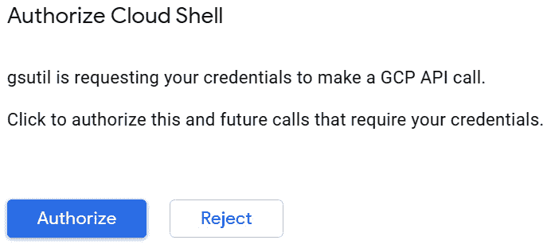
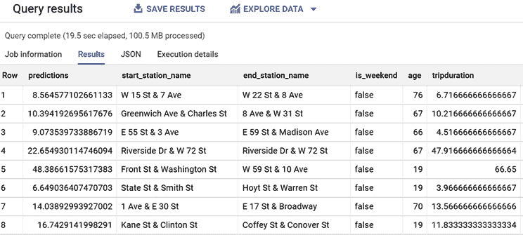

# 十三、使用 BigQuery ML 运行 TensorFlow 模型

TensorFlow 是可用的最常用和最相关的**机器学习** ( **ML** )框架之一。它允许数据科学家和 ML 工程师开发高级模型，它还提供了极大的灵活性和丰富的数学函数集。

TensorFlow 提供的高级功能为希望利用数据科学家和 ML 工程师开发的现有模型的数据分析师提供了巨大的机会。

此外，BigQuery ML 和 TensorFlow 之间的互操作性代表了一种填补公司内部业务和技术利益相关者之间鸿沟的方式。第一组通常更侧重于对数据的深入了解，而第二组是面向技术的，侧重于编程技能。

在这一章中，我们将学习什么是 TensorFlow，以及它如何与 BigQuery ML 一起使用。我们将了解如何将 BigQuery ML 模型导出为 TensorFlow 格式，以及如何使用 BigQuery ML SQL 语法运行 TensorFlow 模型。

为了理解如何用 TensorFlow 补充 BigQuery ML，我们将讨论以下主题:

*   张量流简介
*   发现 BigQuery ML 和 TensorFlow 之间的关系
*   将 BigQuery ML 模型转换为张量流
*   使用 BigQuery ML 运行张量流模型

# 技术要求

本章要求您能够访问 web 浏览器，并能够利用以下内容:

*   访问谷歌云控制台的 GCP 帐户
*   托管 BigQuery 数据集的 GCP 项目
*   一个托管谷歌云存储空间的 GCP 项目

现在我们已经讨论了技术需求，让我们开始探索 TensorFlow 模型的 BigQuery ML。

看看下面的视频，看看代码是如何运行的:[https://bit.ly/33ngmdf](https://bit.ly/33ngmdf)

# 张量流简介

在这一节中，我们将介绍 **TensorFlow** ，它的起源，以及这个框架在 ML 社区中取得的成就。

**TensorFlow** 是一个用于开发 ML 模型的开源库。它非常灵活，可用于解决各种各样的用例及业务场景。由于 TensorFlow 基于数学函数，其名称来自于张量的数学概念。

在数学中，**张量**是一个代数对象，它描述了其他代数对象集合之间的关系。张量的一些例子是向量和矩阵。

TensorFlow 库最初是由谷歌的工程师创建的，然后在 2015 年在 Apache 许可下发布。现在，由于它的潜力和灵活性，它被认为是最流行的 ML 框架之一。事实上，TensorFlow 模型可以在本地机器、本地服务器、云中或边缘(如手机和视频监控摄像机)上执行。

重要说明

**边缘计算**是一种计算范式，它使业务逻辑的计算更接近所需的位置。当 ML 模型在边缘运行时，它通常直接在为模型运行收集数据的传感器或摄像机上执行，而无需连接到其他系统。

TensorFlow 被 ML 社区广泛使用，用于解决人工智能领域的不同挑战，例如:

*   Airbnb 利用 TensorFlow 对客户的照片进行分类，从而改善了房屋租赁的虚拟旅行。更多详情可以访问以下链接:https://medium . com/Airbnb-工程/分类-列表-照片-at-airbnb-f9483f3ab7e3。
*   谷歌使用 TensorFlow 为其产品(如谷歌搜索、Gmail 和翻译)提供人工智能功能。更多详情，可以访问以下链接:[https://ai.googleblog.com/search/label/TensorFlow](https://ai.googleblog.com/search/label/TensorFlow)。
*   PayPal 使用 TensorFlow 来防止欺诈，并应用 ML 来提高其欺诈检测模型的准确性。更多详情，可以访问以下链接:[https://medium.com/paypal-engineering](https://medium.com/paypal-engineering)。
*   Twitter 利用 TensorFlow 来识别并向用户展示最相关的推文。更多详情可访问以下链接:https://blog . tensor flow . org/2019/03/ranking-tweets-with-tensor flow . html。
*   其他有趣的用例可以在 https://www.tensorflow.org/about/case-studies?hl=en 的 TensorFlow 案例研究网页上找到。

与 BigQuery ML 相比，使用 TensorFlow 开发 ML 模型需要高级编程技能。事实上，TensorFlow 库的高灵活性是通过需要在代码开发中投入一定的时间来创建模型来平衡的。现在，用 TensorFlow 开发 ML 模型的建议编程语言是 Python。

一旦 TensorFlow 模型的开发和训练阶段完成，就可以将其导出为 **SavedModel** 格式。

**SavedModel** 格式包含整个 TensorFlow 模型。这种格式允许我们部署模型，而不需要在所有兼容的环境中再次运行代码。SavedModel 由存储在同一父文件夹中的多个文件和文件夹组成:

*   SavedModel 文件存储张量流逻辑。这个文件叫做`saved_model.pb`。
*   `variables`目录包含训练模型的参数。
*   `assets`文件夹可以包含 ML 模型使用的外部和附加文件。

当 TensorFlow 模型是 SavedModel 格式时，它可以很容易地在我们想要使用该模型的平台上加载和使用。该平台可以是物理服务器、云实例、智能手机或物联网设备。

在本节中，我们介绍了张量流的基础知识。在下一节中，我们将发现 BigQuery ML 是如何链接到 TensorFlow 的。

# 发现 BigQuery ML 和 TensorFlow 之间的关系

在本节中，我们将了解 BigQuery ML 和 TensorFlow 之间的关系。在完成本节之后，我们将能够根据我们的用例理解何时使用 BigQuery ML 和 TensorFlow，以及当它们一起使用时，如何最好地利用这两种技术。

## 了解共性和差异

BigQuery ML 和 TensorFlow 有一些相似的方面，但是也有一些相关的区别需要强调。

在下表中，我们总结了这两个框架的主要相似之处和不同之处:


图 13.1-比较 BigQuery ML 和 TensorFlow

首先，强调 TensorFlow 在可以实现的 ML 模型方面提供了更大的灵活性是很重要的。虽然 BigQuery ML 的特征在于支持的模型类型的特定列表(https://cloud . Google . com/big query-ML/docs/introduction # supported _ models _ in)，但 TensorFlow 提供了更广泛的 ML 技术。

BigQuery ML 是作为 BigQuery 的扩展而设计的，因此它只关注结构化数据，这些数据可以用表格格式表示。所有的 BigQuery ML 技术都是基于对存储在 BigQuery 表中的行训练和应用模型的可能性。另一方面，TensorFlow 对不同的格式开放，包括自由文本、图像、音频和视频。

为了训练、评估和测试 BigQuery ML 模型，用户应该知道 SQL 语法并具有最少的 ML 经验。另一方面，实现 TensorFlow 模型需要良好的编程技能和 ML 主题知识，因为该框架在定制方面提供了更高的灵活性。

考虑到这两种技术的特点，很明显它们是针对公司中不同的利益相关者的。虽然熟悉数据分析任务和 SQL 查询的业务分析师和数据分析师可以轻松使用 BigQuery ML，但 TensorFlow 是为高级程序员设计的，如经验丰富的数据科学家和 ML 工程师。

既然我们已经了解了 BigQuery ML 和 TensorFlow 的共性和差异，在下一节中，我们将学习这两个框架如何互补。

## 与 BigQuery ML 和 TensorFlow 合作

在本节中，我们将发现如何结合使用 BigQuery ML 和 TensorFlow 来从这两种技术中获得最大价值。

下图显示了使用 BigQuery ML 和 TensorFlow 的业务分析师和数据科学家之间的交互:


图 13.2–big query ML 和 TensorFlow 之间的交互

正如我们在 [*第 1 章*](B16722_01_Final_ASB_ePub.xhtml#_idTextAnchor016) 、*Google Cloud 和 BigQuery 简介*中所描述的，ML 开发周期的第一步是探索数据并完全理解它。

在分析的第一阶段之后，需要清理数据，并为训练 ML 算法做好准备。这个阶段是创建一个有价值的 ML 模型并进入训练阶段的基础。

当到了实际开发 ML 模型的时候，根据我们的知识、背景和以前的经验，我们有两个选择:

*   如果您是业务分析师或数据分析师，您会更喜欢使用 BigQuery ML，因为它的简单性和即时性得益于 SQL 语法。
*   如果你是一名数据科学家或 ML 工程师，你会选择训练一个 TensorFlow 模型，因为它的灵活性，因为它提供了更多的定制机会。

如上图所示，上面的分支代表业务或数据分析师的典型工作流，他们利用 BigQuery ML SQL 语句来创建、评估和使用已经存储在 BigQuery 中的数据的 ML 模型。这个分支要求你对 SQL 语言、ML 基础和底层数据有很好的了解。

另一方面，图表的下分支代表了基于 TensorFlow 库的开发过程，tensor flow 库是由数据科学家或 ML 工程师开发的，他们在编程和 ML 算法方面经验丰富。

通常，数据分析师非常了解数据，但对最先进的编程技术知之甚少，而数据科学家和 ML 工程师具有深入的编码技能，但对业务数据的理解有限。由于员工具有不同的专业背景，这种情况通常发生在更成熟的公司。这可能会在那些非常了解行业的人和其他人更关注编程的业务流程之间造成摩擦。

为了减少这种差距并降低摩擦的风险，BigQuery ML 允许我们做以下事情:

*   将使用 BigQuery ML 开发的 ML 模型导出为 TensorFlow SavedModel 格式。
*   以 SavedModel 格式导入 TensorFlow ML 模型。

查看前面的图表，我们可以看到业务分析师可以导出 BigQuery ML 模型，并将它们部署到不同于 BigQuery 并与 TensorFlow 兼容的其他环境中。

另一方面，的数据科学家已经实现了先进的 TensorFlow 模型，可以将它们保存到谷歌云存储桶中，这意味着它们可以导入到 BigQuery ML 中。

BigQuery ML 和 TensorFlow 框架之间的这种双向交互允许我们做以下事情:

*   扩展 BigQuery ML 模型的适用性，不再局限于使用存储在 BigQuery 中的数据。
*   导入 BigQuery ML 语法最初不支持的 BigQuery ML 高级 TensorFlow 模型，并通过 SQL 查询对存储在 BigQuery 中的数据使用它们。

在本节中，我们学习了 BigQuery ML 和 TensorFlow 如何交互，以及为什么利用这种集成如此重要。在下一节中，我们将训练一个 BigQuery ML 模型，并将其导出为 TensorFlow 格式。

# 将 BigQuery ML 模型转换为 TensorFlow

在此部分，我们将训练我们在 [*第 11 章*](B16722_11_Final_ASB_ePub.xhtml#_idTextAnchor160) 、*实现深度神经网络*中训练的同一深度神经网络，然后将此模型导出为 TensorFlow SavedModel 格式。

## 训练 BigQuery ML 以将其导出

在我们开始训练模型之前，让我们访问 BigQuery 来创建将用于训练和预测的数据集和表:

1.  登录我们的谷歌云控制台，从导航菜单访问 **BigQuery** 用户界面。
2.  在我们在第 2 章 、*设置您的 GCP 和 BigQuery 环境*中创建的项目下创建一个新的数据集。对于这个用例，我们将使用默认选项创建一个名为`13_tensorflow_model`的数据集。
3.  Now, we're ready to create the table that will contain the training dataset. Let's execute the following SQL statement:

    ```
    CREATE OR REPLACE TABLE `13_tensorflow_model.training_table` AS
                  SELECT
                       tripduration/60 tripduration,
                       start_station_name,
                       end_station_name,
                       IF (EXTRACT(DAYOFWEEK FROM starttime)=1 OR EXTRACT(DAYOFWEEK FROM starttime)=7, true, false) is_weekend,
                       EXTRACT(YEAR FROM starttime)-birth_year as age
                  FROM
                        `bigquery-public-data.new_york_citibike.citibike_trips`
                  WHERE
                        (
                            (EXTRACT (YEAR FROM starttime)=2017 AND
                              (EXTRACT (MONTH FROM starttime)>=04 OR EXTRACT (MONTH FROM starttime)<=10))
                            OR (EXTRACT (YEAR FROM starttime)=2018 AND
                              (EXTRACT (MONTH FROM starttime)>=01 OR EXTRACT (MONTH FROM starttime)<=02))
                        )
                        AND (tripduration>=3*60 AND tripduration<=3*60*60)
                        AND  birth_year is not NULL
                        AND birth_year < 2007; 
    ```

    该查询的结果存储在新的``13_tensorflow_model.training_table``表中，我们创建该表是为了支持用例的后续步骤。

    该查询的业务逻辑与我们在第十一章[](B16722_11_Final_ASB_ePub.xhtml#_idTextAnchor160)**实现深度神经网络*的*准备数据集*部分中应用的相同。*

**   Now, we will create the table that will be used to test our ML model:

    ```
    CREATE OR REPLACE TABLE  `13_tensorflow_model.prediction_table` AS
                  SELECT
                       tripduration/60 tripduration,
                       start_station_name,
                       end_station_name,
                       IF (EXTRACT(DAYOFWEEK FROM starttime)=1 OR EXTRACT(DAYOFWEEK FROM starttime)=7, true, false) is_weekend,
                       EXTRACT(YEAR FROM starttime)-birth_year as age
                            FROM
                        `bigquery-public-data.new_york_citibike.citibike_trips`
                  WHERE
                        EXTRACT (YEAR FROM starttime)=2018
                        AND EXTRACT (MONTH FROM starttime)=05
                         AND (tripduration>=3*60 AND tripduration<=3*60*60)
                        AND  birth_year is not NULL
                        AND birth_year < 2007;
    ```

    该查询应用了用于创建训练表的相同逻辑，但只考虑了 2018 年 5 月。

    *   Now, let's train our ML model, which will be exported into TensorFlow format in the *Exporting the BigQuery ML model* section:

    ```
    CREATE OR REPLACE MODEL `13_tensorflow_model.bigquery_ml_model_to_export`
    OPTIONS
      (model_type='DNN_REGRESSOR',
            ACTIVATION_FN = 'CRELU') AS
    SELECT
      start_station_name,
      end_station_name,
      is_weekend,
      age,
      tripduration as label
    FROM
      `13_tensorflow_model.training_table`;
    ```

    用于创建``13_tensorflow_model.bigquery_ml_model_to_export`` ML 模型的业务逻辑与我们在 [*第 11 章*](B16722_11_Final_ASB_ePub.xhtml#_idTextAnchor160) 、*实现深度神经网络*的*训练深度神经网络模型*部分中用于训练`CRELU`深度神经网络的逻辑相同。* 

 *现在我们已经训练了一个 ML 模型，在下一节中，我们将学习如何将其导出为 TensorFlow SavedModel 格式。

## 导出大查询 ML 模型

在本节中，我们将以 TensorFlow SavedModel 格式将 BigQuery ML 模型导出到 Google 云存储桶中。让我们开始吧:

1.  First, we need to access to the Cloud Shell from the Google Cloud Console:

    图 13.3–谷歌云控制台中的激活云外壳按钮

    重要说明

    **云外壳**是一个基于 Linux 的在线环境，可以从谷歌云控制台的网络浏览器访问。有了云外壳，你可以通过利用预装的工具来管理谷歌云资源，比如 gcloud 命令行工具。

2.  After clicking on the **Cloud Shell** button, a Linux command line will be provisioned and presented at the bottom of the screen. If this is the first time you're using the Google Cloud Shell, the following banner will be presented:

    图 13.4–云壳信息框

    点击蓝色**继续**按钮上的后，将会提供 Linux 命令行，如下图所示:

    

    图 13.5–云壳环境

3.  We need to authenticate our account for the Google Cloud SDK by running the following command:

    ```
    gcloud auth login
    ```

    命令行中将显示一个 web URL。通过单击此 URL，我们将授权我们的帐户使用 Cloud SDK。在这个过程的最后，您将在网页上看到一个代码，您可以将它复制并粘贴到您的云 Shell 中，以完成授权过程。

4.  然后，我们可以运行以下命令，在新的`PROJECT`变量中设置当前项目名称:

    ```
    PROJECT=$(gcloud config get-value project)
    ```

5.  Using the `PROJECT` variable, we'll create a second variable, `BUCKET`, that will contain the name of the Google Cloud storage bucket to create, which is where the BigQuery ML model will be exported:

    ```
    BUCKET=${PROJECT}-us-bigqueryml-export-tf
    ```

    Google 云存储空间名称将由我们的项目名称和`-us-bigqueryml-export-tf`字符串连接而成。

6.  Now that we have the name of the bucket stored in a variable, we can create the new bucket by running the following command:

    ```
    gsutil mb -l us gs://${BUCKET}
    ```

    重要说明

    `gsutil mb`命令是用于创建一个新的 bucket，而`–l US`选项指定了我们想要创建 bucket 的地理位置。在这种情况下，这个桶将在美国创建。

    如果这是您第一次使用 Cloud Shell 创建 Google 云存储桶，那么在创建桶之前会出现以下横幅:

    

    图 13.6–云外壳授权框

    点击蓝色的**授权**按钮，将会创建一个存储桶。

7.  Now, let's execute the command that will export the BigQuery ML model into the Google Cloud storage bucket in the TensorFlow SavedModel format. Let's run the following command:

    ```
         bq extract -m 13_tensorflow_model.bigquery_ml_model_to_export gs://${BUCKET}/bqml_exported_model
    ```

    `bq extract`命令用于提取在`–m`选项之后指定的 BigQuery ML 模型。命令的最后一部分指出了我们想要提取模型和相关子文件夹的 Google 云存储桶的路径；也就是`bqml_exported_model`。或者，也可以使用以下 SQL 查询导出 BigQuery ML 模型:

    ```
    EXPORT MODEL 13_tensorflow_model.bigquery_ml_model_to_export
    OPTIONS (URI = "gs://${BUCKET}/bqml_exported_model" );
    ```

8.  为了验证导出模型的存在，我们可以浏览 Google Cloud 控制台菜单，访问**存储**下的**浏览器**功能，如下截图所示:

图 13.7–谷歌云存储–浏览器

在访问我们在*步骤 6* 中创建的 Google 云存储桶并进入`bqml_exported_model`子文件夹后，我们将看到 BigQuery ML 模型的导出版本，如以下截图所示:


图 13.8–导出为 TensorFlow SavedModel 格式的 BigQuery ML 模型

从这个文件列表中，我们可以很容易地识别出我们在本章的*介绍 TensorFlow* 一节中提到的 TensorFlow SavedModel 格式的主要组件。我们可以看到`saved_model.pb`文件，它包含 TensorFlow 程序、`assets`和`variables`文件夹，以及一些额外的元数据文件。

既然模型已经导出为 TensorFlow SavedModel 格式，就可以与其他人共享它，并在 BigQuery 之外的 TensorFlow 兼容环境中运行它。

在本节中，我们学习了如何使用 TensorFlow SavedModel 格式将 BigQuery ML 模型导出到 Google 云存储桶中。在下一节中，我们将学习如何将现有的 TensorFlow 模型导入 BigQuery ML。

# 使用 BigQuery ML 运行 TensorFlow 模型

在本节中，我们将导入在*将 BigQuery ML 模型转换为 TensorFlow* 部分中导出的 TensorFlow 模型。一旦模型被导入，我们将通过 BigQuery ML 语法使用它。

首先，我们需要记住，我们的 BigQuery ML 模型已经被导出到 Google 云存储桶的文件夹中。ML 模型以 TensorFlow SavedModel 格式存储，其格式与数据科学家使用 TensorFlow 开发的任何其他 ML 模型相同。

如果我们想在 BigQuery ML 中使用 TensorFlow 模型，我们需要执行以下步骤:

1.  First, let's run the `CREATE OR REPLACE MODEL` SQL statement. Keep in mind that the path of the bucket – `'gs://<PROJECT_NAME>-us-bigqueryml-export-tf/bqml_exported_model/*'` – is based on the name of your current project, so you need to replace the `<PROJECT_NAME>` placeholder with the name of the project you're working on:

    ```
    CREATE OR REPLACE MODEL `13_tensorflow_model.trip_duration_tf_imported_model`
    OPTIONS (model_type='tensorflow',
             model_path='gs://<PROJECT_NAME>-us-bigqueryml-export-tf/bqml_exported_model/*');
    ```

    查询的语法由`CREATE OR REPLACE MODEL`关键字组成，后跟新 ML 模型的标识符；也就是``13_tensorflow_model.trip_duration_tf_imported_model``。

    在`OPTIONS`子句中，我们在`model_type`选项中指定了`'tensorflow'`。使用`model_path`参数，我们已经指定了 TensorFlow SavedModel 将存储在 Google 云存储桶中的文件夹。

2.  To verify that BigQuery ML successfully loaded the TensorFlow model, we can browse the BigQuery navigation menu and check that the model is present in the `13_tensorflow_model` dataset.

    下面的截图显示 TensorFlow 模型已经导入到 BigQuery ML 中。它的名字叫`trip_duration_tf_imported_model`:

    

    图 13.9–导入 BigQuery 的 TensorFlow 模型

3.  If we click on `trip_duration_tf_imported_model`, we'll be able to access the ML model's details.

    下面的屏幕截图显示了导入的 ML 模型的详细信息:

    

    图 13.10–我们导入到 BigQuery 中的 ML 模型的细节

    在模型的**详情**页面，我们可以清楚的看到模型类型为 **TENSORFLOW** 。这个特性确认了 ML 模型最初是 TensorFlow SavedModel 格式的，并且已经被导入到 BigQuery ML 中。

4.  Now, we can use the imported TensorFlow model with the BigQuery ML `ML.PREDICT` function. Let's run the following SQL statement:

    ```
    SELECT
      *
    FROM
      ML.PREDICT(MODEL `13_tensorflow_model.trip_duration_tf_imported_model`,
        (
        SELECT
             start_station_name,
              end_station_name,
              is_weekend,
              age,
              tripduration
        FROM
               `13_tensorflow_model.prediction_table`));
    ```

    几秒钟后，查询结果将显示在 BigQuery UI 中。

    下面的截屏显示了执行查询的结果，以及由 ML 模型生成的预测:



图 13.11–tensor flow 模型生成的预测，导入到 BigQuery 中

正如我们所看到的，预测值存储在`predictions`列中，代表使用自行车共享服务从`start_station_name`到`end_station_name`的预测行程持续时间。

在本节中，我们学习了如何将 TensorFlow 模型导入 BigQuery ML，以及如何利用 BigQuery ML SQL 语法来使用它。

# 摘要

在本章中，我们学习了什么是张量流，以及它为什么对 ML 行业如此重要。

首先，我们分析了 BigQuery ML 和 TensorFlow 之间的主要共性和差异，我们知道它们针对 ML 社区中不同的目标人物角色。

然后，我们发现了如何通过组合这两个框架来补充 BigQuery ML 和 TensorFlow 以获得最大价值。

通过采取循序渐进的方法，我们学习了如何将 BigQuery ML 模型导出为 TensorFlow 格式，以便我们可以将它们部署到 BigQuery 以外的环境中。

之后，我们测试了如何在 BigQuery ML 中导入和使用 TensorFlow 模型。这种方法使数据分析师能够轻松访问和使用由数据科学家和 ML 工程师开发的高级 TensorFlow ML 模型。最后，在导入 ML 模型后，我们在 BigQuery 表上测试了导入的 ML 模型，以预测纽约市自行车共享服务的自行车骑行持续时间。

在下一章中，我们将关注一些大查询技巧和最佳实践，这样我们可以进一步提高我们的 ML 技能。

# 更多资源

*   **纽约市自行车共享公共数据集**:[https://console . cloud . Google . com/market place/product/city-of-new York/NYC-Citi-Bike](https://console.cloud.google.com/marketplace/product/city-of-new-york/nyc-citi-bike)
*   **BigQuery ML 为 TensorFlow 创建模型**:https://cloud . Google . com/big query-ML/docs/reference/standard-SQL/bigqueryml-syntax-Create-tensor flow
*   **BigQuery ML 评估模型**:[https://cloud . Google . com/big query-ML/docs/reference/standard-SQL/bigqueryml-syntax-Evaluate](https://cloud.google.com/bigquery-ml/docs/reference/standard-sql/bigqueryml-syntax-evaluate)
*   **big query ML Predict**:[https://cloud . Google . com/big query-ML/docs/reference/standard-SQL/bigqueryml-syntax-Predict](https://cloud.google.com/bigquery-ml/docs/reference/standard-sql/bigqueryml-syntax-predict)
*   **TensorFlow 官网**:https://www.tensorflow.org/*