# 五、使用机器学习的渗透测试

渗透测试，也称为 pen 测试，是对信息系统的授权模拟网络攻击，旨在引出安全漏洞。在这一章中，我们将涵盖一系列广泛的机器学习技术，用于渗透测试和安全对策。我们将从破解一个简单的验证码系统开始。我们将介绍使用深度学习、模糊化和代码小工具自动发现软件漏洞。我们将展示对 Metasploit 的增强，以及如何评估机器学习系统对恶意攻击的鲁棒性。最后，我们将讨论更专业的主题，比如去除 Tor 流量的匿名性，通过击键动力学识别未授权访问，以及检测恶意 URL。

本章包括以下配方:

*   验证码破解程序
*   神经网络辅助模糊化
*   深度利用
*   使用机器学习的 Web 服务器漏洞扫描器
*   使用机器学习对 Tor 去噪声化
*   **物联网** ( **物联网**)利用机器学习进行设备类型识别
*   击键动力学
*   恶意 URL 检测器
*   深冲
*   基于深度学习的软件漏洞自动检测系统(VulDeePecker)


# 技术要求

在本章中，我们将使用以下内容:

*   张量流
*   克拉斯
*   OpenCV
*   Google API 客户端
*   Censys
*   网络 x
*   右旋糖酐
*   dpkt
*   NumPy
*   SciPy
*   Xlib
*   根西姆

代码和数据集可以在 https://github . com/packt publishing/Machine-Learning-for-cyber security-Cookbook/tree/master/chapter 05 找到。


# 验证码破解程序

一个**验证码**是一个旨在防止自动访问或抓取的系统。它通过询问问题来识别用户何时是人，何时是程序。你大概见过下面截图的无数变种:


有时，请求是插入一个代码，有时是选择一些对象，例如，一系列图像中的店面或交通灯，有时验证码是一个数学问题。在这一章中，我们将打破一个简单的验证码系统，称为真正简单的验证码:


尽管简单，**真正简单的验证码**仍然被广泛使用。最重要的是，它将说明如何破解其他更复杂的验证码系统。
第一步将是处理验证码数据集，以便于机器学习。解决这个问题的最天真的方法很可能会失败。也就是说，构建一个采用四字符验证码并将其分类到 *(26+10)^4 = 1，679，616* 个可能的类别之一(26 个字母和 10 个数字，由于在这样的序列中可能的四个组合的数量，需要四次方))的监督分类器将需要大量的数据和计算。相反，我们在单个字符上训练一个分类器，将验证码切割成单个字符，然后执行四次分类。这里，又有一个问题，那就是精确地裁剪字符并不容易。使用 OpenCV 功能和额外的考虑，这个食谱将解决这个挑战。


# 处理验证码数据集

在这个食谱中，我们将执行创建验证码破解程序的第一部分，在这个过程中，我们处理验证码数据集，使其适合训练机器学习模型。


# 做好准备

该配方的准备工作包括在`pip`中安装多个软件包。说明如下:

```py
pip install opencv-python imutils
```

此外，为了方便您的使用，我们在`captcha_images.7z`中提供了一组验证码。要使用这些，只需将档案解压到一个`captcha_images`文件夹中。


# 怎么做...

在以下步骤中，我们将处理 CAPTCHA 数据集，使其适合训练机器学习模型:

1.  收集大量验证码。
2.  我们的下一个目标是处理验证码，指定验证码图像的存储位置，然后枚举指定文件夹中的所有验证码:

```py
import os

captcha_images_folder = "captcha_images"
captchas = [
    os.path.join(captcha_images_folder, f) for f in os.listdir(captcha_images_folder)
]
```

3.  定义一个函数，该函数将获取 CAPTCHA 的图像并生成灰度版本以及 CAPTCHA 图像的阈值(即黑白)版本:

```py
import cv2

def preprocess_CAPTCHA(img):
    """Takes a CAPTCHA image and thresholds it."""
    gray = cv2.cvtColor(img, cv2.COLOR_BGR2GRAY)
    gray_with_border = cv2.copyMakeBorder(gray, 8, 8, 8, 8, cv2.BORDER_REPLICATE)
    preprocessed = cv2.threshold(
        gray_with_border, 0, 255, cv2.THRESH_BINARY_INV | cv2.THRESH_OTSU
    )[1]
    return gray_with_border, preprocessed
```

4.  定义一个采用验证码路径的函数，并使用它来存储验证码的文本标签:

```py
def get_CAPTCHA_label(path_to_file):
    """Get the CAPTCHA text from the file name."""
    filename = os.path.basename(path_to_file)
    label = filename.split(".")[0]
    return label
```

5.  定义一个函数，该函数将获取我们将计算的验证码轮廓，然后确定它们的边界矩形，为将验证码裁剪为单个字符做准备:

```py
def find_bounding_rectangles_of_contours(contours):
    """Determines the bounding rectangles of the contours of the cropped letters."""
    letter_bounding_rectangles = []
    for contour in contours:
        (x, y, w, h) = cv2.boundingRect(contour)
        if w / h > 1.25:
            half_width = int(w / 2)
            letter_bounding_rectangles.append((x, y, half_width, h))
            letter_bounding_rectangles.append((x + half_width, y, half_width, h))
        else:
            letter_bounding_rectangles.append((x, y, w, h))
    return letter_bounding_rectangles
```

6.  定义一个采用验证码路径的函数，将其作为图像读入，然后使用我们定义的函数对其进行预处理:

```py
def CAPTCHA_to_gray_scale_and_bounding_rectangles(captcha_image_file):
    """Take a CAPTCHA and output a grayscale version as well as the bounding rectangles of its cropped letters."""
    image = cv2.imread(captcha_image_file)
    gray, preprocessed = preprocess_CAPTCHA(image)
    contours = cv2.findContours(
        preprocessed.copy(), cv2.RETR_EXTERNAL, cv2.CHAIN_APPROX_SIMPLE
    )
    contours = contours[0]
    letter_bounding_rectangles = find_bounding_rectangles_of_contours(contours)
    letter_bounding_rectangles = sorted(letter_bounding_rectangles, key=lambda x: x[0])
    return gray, letter_bounding_rectangles
```

7.  定义另一个辅助函数来获取字母轮廓的边界矩形，并根据这些矩形生成字符图像:

```py
def bounding_rectangle_to_letter_image(letter_bounding_box, grayscaled):
    """Obtains the letter defined by a bounding box."""
    x, y, w, h = letter_bounding_box
    letter_image = grayscaled[y - 2 : y + h + 2, x - 2 : x + w + 2]
    return letter_image
```

8.  定义最后一个辅助函数来执行 CAPTCHA 的裁剪，然后保存每个裁剪的字符:

```py
captcha_processing_output_folder = "extracted_letter_images"
character_counts = {}

def crop_bounding_rectangles_and_save_to_file(
    letter_bounding_rectangles, gray, captcha_label
):
    """Saves the individual letters of a CAPTCHA."""
    for letter_bounding_rectangle, current_letter in zip(
        letter_bounding_rectangles, captcha_label
    ):
        letter_image = bounding_rectangle_to_letter_image(
            letter_bounding_rectangle, gray
        )

        save_path = os.path.join(captcha_processing_output_folder, current_letter)
        if not os.path.exists(save_path):
            os.makedirs(save_path)

        character_count = character_counts.get(current_letter, 1)

        p = os.path.join(save_path, str(character_count) + ".png")
        cv2.imwrite(p, letter_image)

        character_counts[current_letter] = character_count + 1
```

9.  遍历所有验证码，对它们进行预处理，找到字符轮廓，然后保存相应的字符:

```py
import imutils
import numpy as np

for captcha_image_file in captchas:
    captcha_label = get_CAPTCHA_label(captcha_image_file)
    gray, letter_bounding_rectangles = CAPTCHA_to_gray_scale_and_bounding_rectangles(
        captcha_image_file
    )
    if len(letter_bounding_rectangles) != 4:
        continue
    crop_bounding_rectangles_and_save_to_file(
        letter_bounding_rectangles, gray, captcha_label
    )
```


# 它是如何工作的…

我们的起点是收集大量验证码(*步骤 1* )。这些你都可以在`captcha_images.7z`里找到。或者，由于真正简单的验证码代码可以在网上获得，你可以修改它来生成大量的验证码。其他想法包括利用机器人抓取验证码。接下来，在*步骤 2* 中，我们指定验证码图片存储的位置，然后枚举指定文件夹中的所有验证码。我们的目标是开始处理这些。在*步骤 3* 中，我们定义了一个函数来对验证码图像进行阈值化和灰度化。这使我们能够减少计算量，并且更容易确定一个字符从哪里开始，下一个字符从哪里结束。然后我们定义一个函数来获取验证码的标签(*步骤 4* )。接下来，为了准备处理，我们定义了一个效用函数，该函数获取 CAPTCHA 的轮廓，并使用它们来确定每个字符的边界矩形。一旦找到一个边界矩形，就很容易裁剪字符以将其隔离(*步骤 5* )。接下来，在*步骤 6* 中，我们将迄今为止定义的函数合并成一个方便的函数。我们还定义了一个额外的函数，来实际裁剪字符。综上所述，在*第 8 步*中，我们编写一个函数来执行前面的步骤，然后保存得到的孤立字符，并记录每个字符保存了多少。这有助于命名和记账。我们现在可以执行裁剪了，因此，在*步骤 9* 中，我们遍历所有的验证码，并使用我们的实用函数，裁剪单个字符。请注意，`if`语句是为了跳过任何不正确裁剪的验证码。

在菜谱结束时，您的输出文件夹`extracted_letter_images`应该有一个文件夹，用于存放大多数字母和数字，如下面的屏幕截图所示:

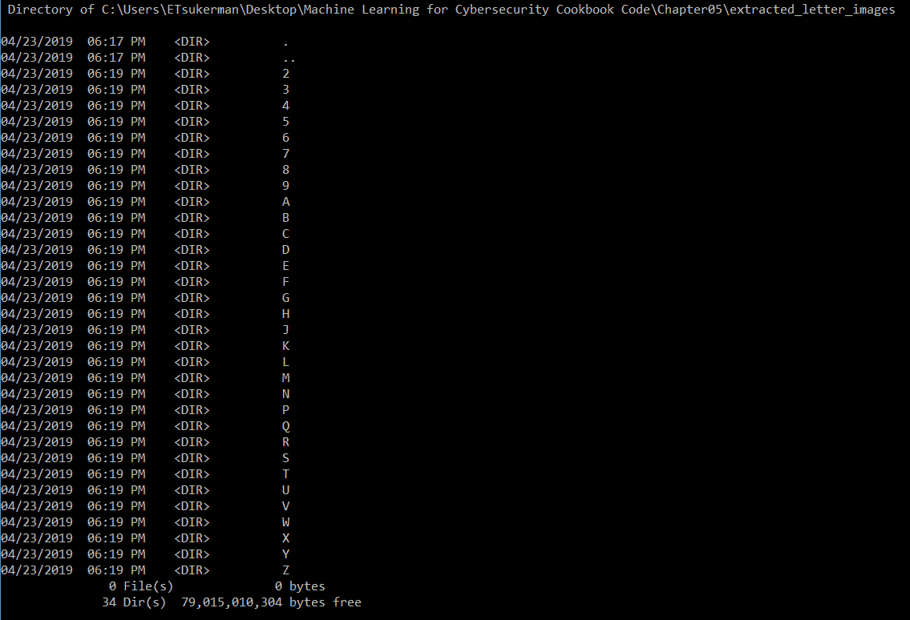

没有表示所有字符和数字的原因是验证码不包含数字 1 和字母 I，因为这两者很容易混淆。类似地，对于 0 和 O.
在每个文件夹中，您将拥有该字母或数字的大量实例，这些实例是从初始验证码中裁剪和处理的:


预处理步骤到此结束。


# 训练验证码求解器神经网络

既然我们的数据得到了很好的处理，我们可以训练一个神经网络来执行验证码预测。


# 做好准备

准备这个菜谱包括在 pip 中安装一些包。说明如下:

```py
pip install opencv-python imutils sklearn keras tensorflow
```


# 怎么做...

在下面的步骤中，我们将训练一个神经网络来求解非常简单的验证码:

1.  指定提取的信件图像所在的文件夹:

```py
captcha_processing_output_folder = "extracted_letter_images"
```

2.  导入 OpenCV 和 imutils 进行图像处理:

```py
import cv2
import imutils
```

3.  定义一个助手函数，将图像调整到给定的大小:

```py
def resize_image_to_dimensions(image, desired_width, desired_height):
    """Resizes an image to the desired dimensions."""
    (h, w) = image.shape[:2]
    if w > h:
        image = imutils.resize(image, width=desired_width)
    else:
        image = imutils.resize(image, height=desired_height)
    pad_width = int((desired_width - image.shape[1]) / 2.0)
    pad_height = int((desired_height - image.shape[0]) / 2.0)
    image_with_border = cv2.copyMakeBorder(
        image, pad_height, pad_height, pad_width, pad_width, cv2.BORDER_REPLICATE
    )
    image_with_border_resized = cv2.resize(
        image_with_border, (desired_width, desired_height)
    )
    return image_with_border_resized
```

4.  准备读入图像:

```py
def read_image(image_file_path):
    """Read in an image file."""
    img = cv2.imread(image_file_path)
    img = cv2.cvtColor(img, cv2.COLOR_BGR2GRAY)
    img = resize_image_to_dimensions(img, 20, 20)
    img = np.expand_dims(img, axis=2)
    return img
```

5.  读入每个字母图像并记录其标签:

```py
import numpy as np
import os
from imutils import paths

images = []
labels = []

for image_file_path in imutils.paths.list_images(captcha_processing_output_folder):
    image_file = read_image(image_file_path)
    label = image_file_path.split(os.path.sep)[-2]
    images.append(image_file)
    labels.append(label)
```

6.  归一化所有图像，即将像素值重新调整为 0-1，并将标签转换为 NumPy 数组:

```py
images = np.array(images, dtype="float") / 255.0
labels = np.array(labels)
```

7.  创建训练测试分割:

```py
from sklearn.model_selection import train_test_split

(X_train, X_test, y_train, y_test) = train_test_split(
    images, labels, test_size=0.3, random_state=11
)
```

8.  导入`LabelBinarizer`以便对标签进行编码:

```py
from sklearn.preprocessing import LabelBinarizer

label_binarizer = LabelBinarizer().fit(y_train)
y_train = label_binarizer.transform(y_train)
y_test = label_binarizer.transform(y_test)
```

9.  定义神经网络架构:

```py
from keras.models import Sequential
from keras.layers.convolutional import Conv2D, MaxPooling2D
from keras.layers.core import Flatten, Dense

num_classes = 32
NN_model = Sequential()
NN_model.add(
    Conv2D(20, (5, 5), padding="same", input_shape=(20, 20, 1), activation="relu")
)
NN_model.add(MaxPooling2D(pool_size=(2, 2), strides=(2, 2)))
NN_model.add(Conv2D(50, (5, 5), padding="same", activation="relu"))
NN_model.add(MaxPooling2D(pool_size=(2, 2), strides=(2, 2)))
NN_model.add(Flatten())
NN_model.add(Dense(512, activation="relu"))
NN_model.add(Dense(num_classes, activation="softmax"))
NN_model.compile(
    loss="categorical_crossentropy", optimizer="adam", metrics=["accuracy"]
)
NN_model.summary()
```

10.  将神经网络拟合到训练数据:

```py
NN_model.fit(
    X_train,
    y_train,
    validation_data=(X_test, y_test),
    batch_size=16,
    epochs=5,
    verbose=1,
)
```

11.  选择您想要破解的验证码实例:

```py
CAPTCHA = "captcha_images\\NZH2.png"
```

12.  我们将导入在之前的配方中用于处理图像的所有函数，即`find_bounding_rectangles_of_contours`、`preprocess_CAPTCHA`、`get_CAPTCHA_label`和`CAPTCHA_to_grayscale_and_bounding_rectangles`。
13.  像我们在之前的配方中所做的那样处理验证码图像:

```py
captcha_label = get_CAPTCHA_label(CAPTCHA)
gray, letter_bounding_rectangles = CAPTCHA_to_gray_scale_and_bounding_rectangles(
    CAPTCHA
)
predictions = []
```

14.  读入每个裁剪的字母，并使用神经网络来预测标签:

```py
for letter_bounding_rectangle in letter_bounding_rectangles:
    x, y, w, h = letter_bounding_rectangle
    letter_image = gray[y - 2 : y + h + 2, x - 2 : x + w + 2]
    letter_image = resize_image_to_dimensions(letter_image, 20, 20)
    letter_image = np.expand_dims(letter_image, axis=2)
    letter_image = np.expand_dims(letter_image, axis=0)
    prediction = NN_model.predict(letter_image)
    letter = label_binarizer.inverse_transform(prediction)[0]
    predictions.append(letter)
```

15.  打印出预测:

```py
predicted_captcha_text = "".join(predictions)
print("Predicted CAPTCHA text is: {}".format(predicted_captcha_text))
print("CAPTCHA text is: {}".format(CAPTCHA.split("\\")[-1].split(".")[0]))

Predicted CAPTCHA text is: NZH2
CAPTCHA text is: NZH2
```


# 它是如何工作的…

在前面的配方中，我们已经完成了验证码的预处理，现在我们准备利用这些来训练验证码破解者。我们首先为从验证码中提取的所有单个字符的路径设置一个变量。我们导入将要使用的图像操作库(*步骤 2* )，然后在*步骤 3* 中定义一个调整图像大小的函数。这是用于字符识别的相对标准的方法，它允许训练进行得更快，并且减少了存储器的使用。在*步骤 4* 中，我们定义了一个方便的函数，以 NumPy 数组的形式读入文件，用于训练目的，然后，在*步骤 5* 中，我们遍历所有的字母并记录它们的标签。接下来，我们归一化所有的图像(*步骤 6* )，这是另一个标准的计算机视觉技巧。我们现在创建一个训练测试分裂，准备装配我们的分类器(*步骤 7* )，然后利用标签二值化器对我们的标签进行编码(*步骤 8* )。这是必要的，因为标签是字符，可能不是数字。在*步骤 9* 中，我们定义了神经网络的架构。所述的架构相对普通，并且提供了精度和速度。我们将我们的神经网络与*步骤 10* 中的训练集相匹配。其他参数可以增强网络的性能。艰苦的工作现在完成了。我们现在开始演示验证码破解程序是如何工作的。在*步骤 11* 中，我们选择了一个单一实例来展示我们的验证码破解程序的功效。在步骤 12-14 中，我们通过管道传递该图像，并为该验证码生成预测文本。最后，我们验证预测是正确的(*步骤 15* )。


# 神经网络辅助模糊化

Fuzzing 是一种软件漏洞检测方法，其中大量随机输入被输入到程序中，以搜索会导致崩溃、不必要的信息泄漏或其他意外行为的输入。在自动模糊化中，程序产生这些输入。一般来说，自动模糊化器的缺点是在尝试冗余输入时容易卡住。由于这个原因，最近开发了基于人工智能的模糊器。在这个菜谱中，我们将使用 NEUZZ，She 等人开发的基于神经网络的 fuzzer(见[、](https://arxiv.org/abs/1807.05620))，来查找软件中未知的漏洞。


# 做好准备

以下配方需要 Ubuntu 16.04 或 18.04 虚拟机或物理机。在此设备上，运行以下命令:

```py
pip install keras
```

将`neuzz-modified.7z`解压到您选择的文件夹中。


# 怎么做...

在下面的步骤中，我们提供了一个使用 NEUZZ 来查找 readelf Unix 工具的导致崩溃的输入的方法:

1.  使用以下代码构建 neuzz:

```py
gcc -O3 -funroll-loops ./neuzz.c -o neuzz
```

如果你收到警告，没关系。

2.安装 32 位二进制文件所需的库:

```py
 sudo dpkg --add-architecture i386
 sudo apt-get update
 sudo apt-get install libc6:i386 libncurses5:i386 libstdc++6:i386 lib32z1
```

3.  以 root 用户身份设置 CPU 扩展算法和核心转储通知:

```py
 cd /sys/devices/system/cpu
 echo performance | tee cpu*/cpufreq/scaling_governor
 echo core >/proc/sys/kernel/core_pattern
```

4.  将`neuzz`、`nn.py`和`afl-showmap`复制到`programs/readelf`:

```py
 cp /path_to_neuzz/neuzz /path_to_neuzz/programs/readelf
 cp /path_to_neuzz/nn.py /path_to_neuzz/programs/readelf
 cp /path_to_neuzz/afl-showmap /path_to_neuzz/programs/readelf
```

5.  为所有文件提供可执行权限:

```py
chmod +x /path_to_neuzz/programs/readelf/neuzz
chmod +x /path_to_neuzz/programs/readelf/nn.py
chmod +x /path_to_neuzz/programs/readelf/afl-showmap
chmod +x /path_to_neuzz/programs/readelf/readelf
```

6.  打开终端启动神经网络模块:

```py
cd /path_to_neuzz/programs/readelf
python nn.py ./readelf -a
```

7.  打开另一个终端并启动 NEUZZ:

```py
 ./neuzz -i neuzz_in -o seeds -l 7507 ./readelf -a @@
```

以下是运行这些命令的片段:

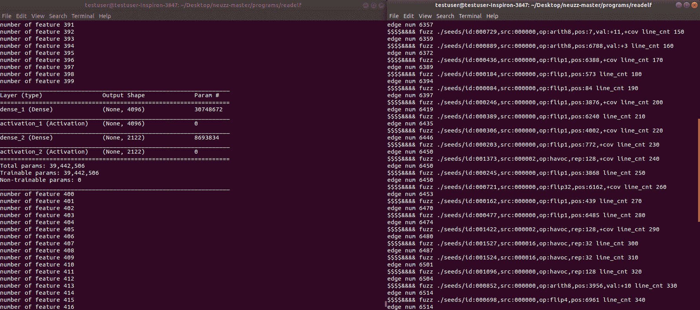

8.  通过运行以下命令测试 NEUZZ 收集的崩溃:

```py
 ./readelf -a crash/file_name
```


# 它是如何工作的…

大多数流行的模糊器，虽然在某些有限的情况下有效，但经常陷入循环。基于梯度的方法，比如这里讨论的方法，是有前途的，但并不明显适用于这个问题，因为真实世界的程序行为不一定是光滑函数(例如，它们可以是不连续的)。NEUZZ 背后的想法是使用神经网络将程序的行为近似为平滑函数。然后，可以应用梯度方法来提高模糊化效率。我们通过编译 NEUZZ ( *步骤 1)* 开始我们的食谱。`funroll-loops`标志使编译器展开循环，循环的迭代次数可以在编译时或进入循环时确定。因此，代码会更大，并且可能运行得更快，尽管这不是必须的。继续设置 NEUZZ，我们添加 32 位支持(*步骤 2* )。我们设置 CPU 扩展算法和核心转储通知(*步骤 3*)；CPU 频率调整是一项设置，它使操作系统能够通过调高或调低 CPU 频率来节能。在接下来的两步中，我们简单地将文件放在一个方便的位置，并允许权限来执行它们。我们已经设置好 NEUZZ 了。我们现在可以用它来寻找导致程序崩溃的输入。在*步骤 6* 和*步骤 7* 中，我们开始使用我们的神经网络搜索碰撞。在等待足够长的时间让*步骤 6* 和*步骤 7* 收集足够的输入导致 readelf 工具崩溃后，我们执行这些输入之一(*步骤 8* )来查看结果。事实上，我们看到输入导致 readelf 崩溃。


# 深度利用

**DeepExploit** 是一款渗透测试工具，通过利用人工智能将 Metasploit 提升到一个全新的水平。其主要特点如下:

*   **深度渗透**:如果 DeepExploit 成功利用目标，它也会自动对其他内部服务器执行利用。
*   **学习** : DeepExploit 是一个强化学习系统，类似于 AlphaGo。

使用 DeepExploit 来测试您的安全系统将会使您的系统更加安全。在本菜谱中，我们将设置并运行 DeepExploit。


# 做好准备

现在将引导您完成安装`DeepExploit`所需的步骤:

1.  下载并设置 Kali Linux。你可以在[https://www . offensive-security . com/kali-Linux-VM-VMware-virtualbox-image-download/](https://www.offensive-security.com/kali-linux-vm-vmware-virtualbox-image-download/)找到虚拟机镜像。以下步骤都发生在您的 Kali Linux 机器中。

2.  通过在终端中运行以下命令来安装 Git:

```py
sudo apt install git
```

3.  通过运行以下命令安装 Python:

```py
sudo apt install python3-pip
```

4.  克隆`git`库。在终端中，运行以下命令:

```py
git clone https://github.com/emmanueltsukerman/machine_learning_security.git
```

5.  打开`DeepExploit`目录:

在终端中，运行以下命令:

```py
cd machine_learning_security/DeepExploit
```

6.  安装`DeepExploit`的必备包。

在终端中，运行以下命令:

```py
pip3 install -r requirements.txt
```


# 怎么做...

在这个方法中，您将使用`DeepExploit`来危害一个受害虚拟机。

1.  下载一个`Metasploitable2`虚拟机镜像。

详情可在 https://metasploit.help.rapid7.com/docs/metasploitable-2 找到。

2.  在虚拟机上运行一个`Metasploitable2`实例。
3.  获取您的`Metasploitable2`的 IP 地址。
4.  下一步是设置 DeepExploit 的配置。
5.  在终端中，运行`ifconfig`来获得你的 Kali Linux 的 IP。通过将`[common]`下的`server_host`设置为您的 Kali Linux IP 来编辑`config.ini`(例如，使用`vim`)。
6.  将`config.ini`中`proxy_host`和`proxy_port`的值设置为`proxychains.conf`中的值。
7.  在终端中，运行`cat /etc/proxychains.conf`并找到`socks4`旁边的值:

```py
 ...snip...
 [ProxyList]
 ...snip...
 socks4  127.0.0.1 9050
```

8.  然后，将`config.ini`中的`proxy_host`和`proxy_port`的值设置为等于这些值:

```py
 vim config.ini
 ...snip...
 proxy_host      : 127.0.0.1
 proxy_port      : 9050
```

9.  通过运行`msfconsole`在终端中启动 Metasploit。
10.  在 Metasploit 上启动 RPC 服务器。在指示的地方，键入您的 Kali Linux 的 IP:

```py
msf> load msgrpc ServerHost="kali linux ip" ServerPort=55553 User=test Pass=test1234.
```

您应该看到以下内容:

```py
[*] MSGRPC Service: "kali linux ip":55553
[*] MSGRPC Username: test
[*] MSGRPC Password: test1234
[*] Successfully loaded plugin: msgrpc
```

11.  在您的 Kali Linux 机器的终端中，运行`python3 DeepExploit.py -t "Metasploitable2 ip" -m train`来训练`DeepExploit`。训练的开始应该如下所示:


每当`DeepExploit`发现一个漏洞，你就会看到一个`BINGO!!!`通知，如下图所示:

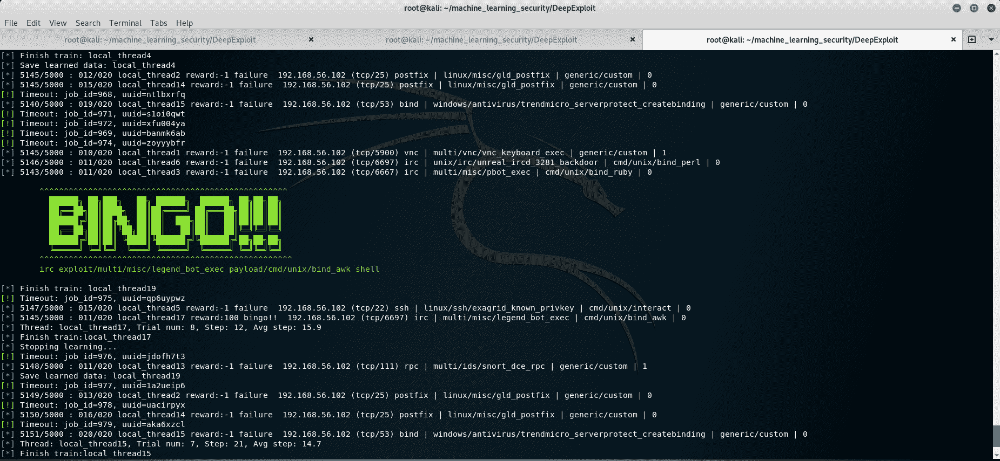

训练结束后，学习内容将被保存。您可以在这里看到完成屏幕:

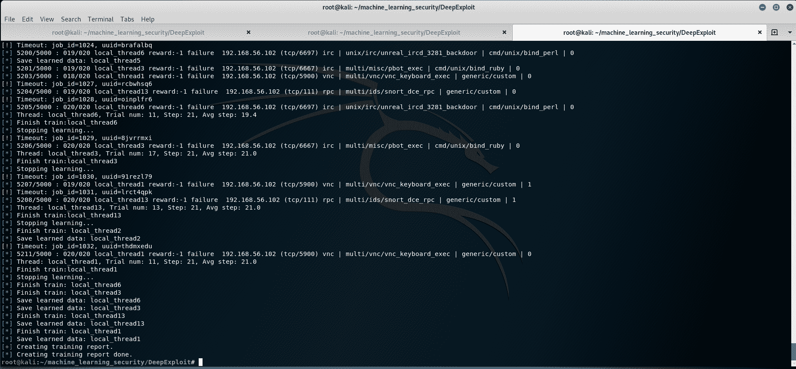

12.  使用`DeepExploit`测试`Metasploitable2`的漏洞。在终端中，运行`python DeepExploit.py -t "Metasploitable2 ip" -m test`。
13.  检查钢笔测试报告，如图所示:

```py
firefox report/DeepExploit_test_report.html
```

我们将得到以下输出:

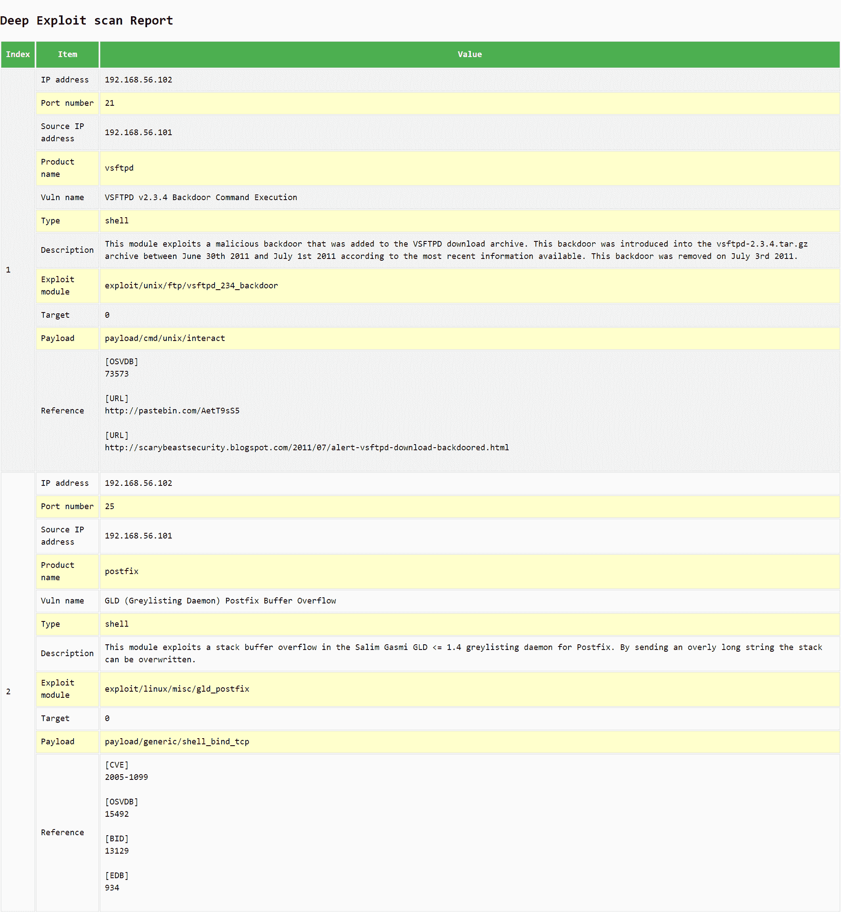


# 它是如何工作的…

这个食谱需要大量的准备和配置。初始步骤是建立一个受害者虚拟机(*步骤 1 和 2* )。在*步骤 3* 中，我们确定受害虚拟机的 IP 地址。注意`Metasploitable2`的凭证是`msfadmin/msfadmin`。您可以使用凭证登录，然后使用`ifconfig`获得您的`Metasploitable2` IP。如果您在同一台主机上使用 Kali Linux 虚拟机和`Metasploitable2`虚拟机，请确保这两个虚拟机可以通信。例如，将两个虚拟机都放在一个主机专用适配器上，并从 Kali Linux 机器 ping 到 Metasploitable2 机器。接下来，我们现在配置`DeepExploit`，以便我们可以将目标指向受害者虚拟机(*步骤 4* - *8* )。在*步骤 9* 和*步骤 10* 中，我们打开了 Metasploit，它被`DeepExploit`用作子模块。Metasploit 是一个主要的渗透测试框架。完成所有准备工作后，我们现在可以开始训练我们的模型了。在*步骤 11* 中，我们在`Metasploitable2`虚拟机上训练`DeepExploit`。该模型利用了**异步演员-评论家代理** ( `A3C`)算法，该算法由谷歌的 DeepMind group 在几年前发布，以胜过`deep Q-network` ( `DQN`)方法而闻名。接下来，我们测试我们的模型(*步骤 12* )，并在报告中打印出它的分析结果(*步骤 13* )。从长报告中可以看到，大量的漏洞被`DeepExploit`发现。从高层次上讲，强化学习在渗透测试中的应用表明，极其高效的自动化渗透测试即将到来。


# 使用机器学习的 Web 服务器漏洞扫描器

GyoiThon 是一个用于网络服务器的情报收集工具。它执行对目标网络服务器的远程访问，并识别在服务器上运行的产品，例如**内容管理系统** ( **CMS** )、网络服务器软件、框架和编程语言。此外，它还可以使用 Metasploit 为已识别的产品执行漏洞利用模块。

GyoiThon 的一些主要特征如下:

*   **远程访问/全自动** : GyoiThon 可以仅使用远程访问自动收集目标 web 服务器上的信息。你只对你的行动执行过一次死刑。
*   **无损检测**:**GyoiThon 只使用普通访问就可以收集目标 web 服务器上的信息。一个功能允许 GyoiThon 异常访问，例如通过发送漏洞利用模块。**
***   **收集各种信息** : GyoiThon 有许多情报收集引擎，如网络爬虫、谷歌自定义搜索 API、Censys、默认内容浏览器和云服务检查。通过使用字符串模式匹配和机器学习分析收集的信息，GyoiThon 可以识别目标 web 服务器上运行的产品/版本/CVE 号、HTML 注释/调试消息、登录页面和其他信息。*   **真实漏洞检查** : GyoiThon 可以使用 Metasploit 在已识别的产品上执行漏洞利用模块。因此，它可以确定目标 web 服务器的真正漏洞。**

**

# 做好准备

现在将引导您完成安装和运行 GyoiThon 的步骤:

1.  下载并设置 Kali Linux。你可以在[https://www . offensive-security . com/kali-Linux-VM-VMware-virtualbox-image-download/](https://www.offensive-security.com/kali-linux-vm-vmware-virtualbox-image-download/)找到虚拟机镜像。以下步骤都发生在您的 Kali Linux 机器中。

2.  通过运行以下程序在终端中安装`git`:

```py
sudo apt install git
```

3.  通过运行以下命令在终端中安装`python`:

```py
sudo apt install python3-pip
```

4.  通过运行以下命令，在终端中将 Git 存储库克隆到您的 Linux 机器中:

```py
git clone https://github.com/gyoisamurai/GyoiThon.git
```

5.  通过运行以下命令在终端中打开`GyoiThon`目录:

```py
cd GyoiThon
```

6.  通过运行以下命令，在终端中安装 DeepExploit 的必备组件:

```py
pip3 install -r requirements.txt
```

7.  (可选。)将模块中的`Gyoi_CveExplorerNVD`文件替换为本书存储库中可用的文件。在某些情况下，原始代码出现了故障，本书存储库中可用的修改后的代码可能会解决这个问题。


# 怎么做...

在本菜谱中，您将使用 DeepExploit 来危害受害者虚拟机:

1.  下载一个`Metasploitable2`虚拟机镜像。
2.  在虚拟机上运行一个`Metasploitable2`实例。
3.  获取您的`Metasploitable2`的 IP 地址。
4.  在您的 Kali Linux 机器中，您应该能够通过在 web 浏览器中键入`Metasploitable2's ip address:80`来看到您的`Metasploitable2's`网站实例:


5.  在终端中，运行`ifconfig`来获取您的 Kali Linux 的 IP。通过将`proxy`设置为`empty`，将`server host`设置为`Kali Linux IP`，将`LHOST`设置为`Metasploitable2 IP`，将`LPORT`设置为`80`来编辑`config.ini`(例如，使用`vim`)。
6.  打开主机文件，通过键入`http:Metasploitable2 ip:80/`添加`Metasploitable2`网络服务器地址。
7.  在 Kali Linux 机器的终端中，运行`python3 Gyoithon.py`开始攻击。
8.  攻击结束后，检查报告文件夹中的 pen 测试报告:


# 它是如何工作的…

*步骤 1-3* 与 DeepExploit 的方法没有什么不同，我们准备了一个受害者虚拟机。`Metasploitable2`的全权证书是`msfadmin/msfadmin`。您可以使用凭证登录，然后使用`ifconfig`获得您的`Metasploitable2` IP。如果您在同一台主机上使用 Kali Linux 虚拟机和`Metasploitable2`虚拟机，请确保两者可以通信。例如，将两个虚拟机都放在一个主机专用适配器上，并从 Kali Linux 机器 ping 到 Metasploitable2 机器。接下来，我们通过检查我们是否能够在*步骤 4* 中访问受害虚拟机的网页来验证环境是否已经正确设置。在*步骤 5* 和*步骤 6* 中，我们配置 GyoiThon，为我们的 pen 测试做准备。完成环境设置后，我们现在准备执行 pen 测试。在*步骤 7* 中，我们利用 GyoiThon 来搜索漏洞。然后，我们输出一份检测到的漏洞的完整报告(*步骤 8* )。查看报告，我们可以看到 GyoiThon 能够找到大量的漏洞。现在已经确定了受害者机器的漏洞，我们可以继续利用这些漏洞，例如使用 Metasploit 来攻击受害者机器。


# 使用机器学习对 Tor 去噪声化

Tor 是一个支持匿名通信的免费开源软件。此外，只有在使用 Tor 浏览器时才能访问的网站仍然存在，并且是**暗网**生态系统的一部分——对普通用户隐藏的互联网部分的名称。在这个方案中，我们将通过从单个会话中收集足够的功能和信息来识别匿名用户的活动，从而对 Tor 流量进行去匿名化。这个食谱利用了**con marap/网站指纹库**。


# 做好准备

现在将引导您完成设置 Tor 和 Lynx web 浏览器所需的步骤:

1.  设置一个 Ubuntu 虚拟机。
2.  通过运行以下命令在终端中安装`git`:

```py
sudo apt install git
```

3.  通过运行以下命令克隆终端中的代码库:

```py
git clone https://github.com/conmarap/website-fingerprinting
```

4.  通过运行以下命令在终端中安装`tor`和`lynx`:

```py
sudo apt install tor lynx
```


# 怎么做…

这个食谱由三部分组成。第一部分包括 Tor 流量的数据收集。第二步是根据这些数据训练一个分类器。最后一部分是使用分类器来预测正在观察的流量类型。


# 收集数据

数据收集需要遵循以下步骤:

1.  在`config.json`中列出您希望分类的流量类别:


2.  在终端中，通过运行以下命令，从网站指纹目录中为其中一个类(比如`duckduckgo.com`)收集额外的数据点:

```py
./pcaps/capture.sh duckduckgo.com
```

3.  打开另一个终端，并运行以下命令:

```py
torsocks lynx https://duckduckgo.com
```

此时，您的两个终端应该如下所示:

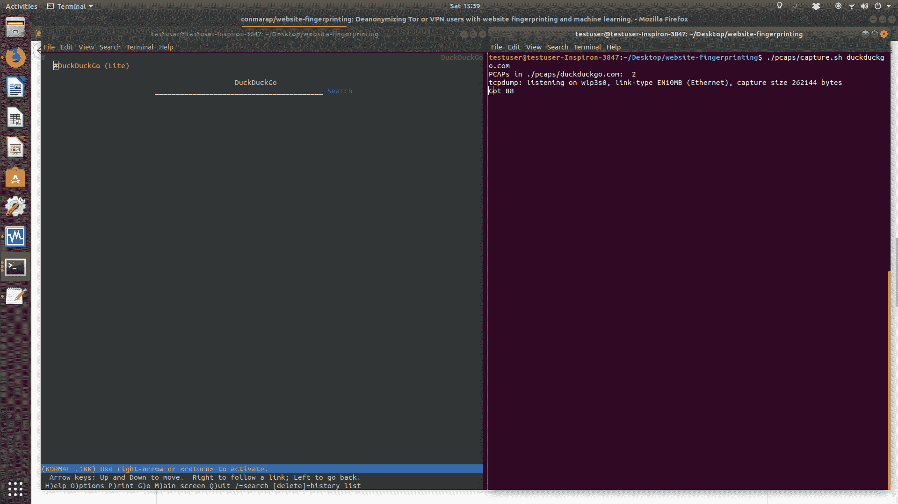

4.  完成浏览会话后，按两次 *Q* 结束捕获。

当收集了足够数量的训练数据时，我们就可以训练分类器了。


# 培养

要对数据训练分类器，请使用 Python 运行以下脚本:

```py
python gather_and_train.py
```

结果是一个文件分类器:`nb.dmp`。


# 预测

让我们使用分类器来预测正在观察的流量类型:

1.  为了预测新的流量实例，收集`pcap`文件。
2.  使用 Python，以`pcap`文件作为参数运行`predict.py`脚本:


作者的聚类如下所示:


上图显示，尽管流量是匿名的，但这些特征确实能够区分流量类型。


# 它是如何工作的…

我们开始构建我们的分类器，创建一个目录，列出所有我们希望分析的网站(*步骤 1* )。数量越多，目标就越有可能拜访其中一个。另一方面，数量越少，训练数据集就越小。在*步骤 2* - *4* 中，我们执行为分类器收集数据点所需的步骤。具体来说，我们通过访问*步骤 1* 中定义的网站之一，然后捕获该访问的数据包。通过对不同的浏览会话重复这些步骤，我们能够构建一个健壮的数据集。在*步骤 5* 中，我们根据目前收集的数据训练一个分类器。我们现在准备测试我们的分类器。在*步骤 6* 中，我们访问一个网站并收集其`pcap`，就像我们在收集我们的训练数据时所做的一样。然后，我们使用分类器对这次访问进行分类(*步骤 7* )。我们看到，尽管用户使用 Tor，它确实正确地确定了用户访问了哪个网页。

总之，在这个菜谱中，scikit-learn 被用来编写一个 k 近邻分类器，它将对 Tor `pcap`文件进行分类。实际上，流量永远不会像*一样干净*，所以在相同大小的真实数据集上，准确性可能会降低。然而，具有大量资源的实体可以创建非常准确的分类器。这意味着完全有可能使用这样的方法来准确地危害匿名用户。


# 使用机器学习的物联网设备类型识别

随着物联网的出现，任何给定目标的攻击面都呈指数级增长。新技术会带来新的风险，就物联网而言，组织面临的一个此类风险是连接到组织网络的恶意物联网设备的增加。能够判断这种设备何时被添加到网络并了解其性质是非常重要的。在这份食谱中，我们将建立一个机器学习模型，按类型对网络物联网设备进行分类。


# 做好准备

该配方的准备包括在`pip`中安装`sklearn`、`pandas`和`xgboost`包。说明如下:

```py
pip install pandas sklearn xgboost
```

在`iot_train.csv`和`iot_test.csv`文件中已经为您提供了一个数据集。


# 怎么做…

在以下步骤中，我们将训练和测试物联网网络信息分类器:

1.  导入`pandas`和`os`，读入训练和测试数据；

```py
import pandas as pd
import os

training_data = pd.read_csv("iot_devices_train.csv")
testing_data = pd.read_csv("iot_devices_test.csv")
```

该数据包含 298 个要素，如以下屏幕截图所示:


2.  创建训练和测试数据集，其中目标是设备类别:

```py
X_train, y_train = (
    training_data.loc[:, training_data.columns != "device_category"].values,
    training_data["device_category"],
)
X_test, y_test = (
    testing_data.loc[:, testing_data.columns != "device_category"].values,
    testing_data["device_category"],
)
```

设备类别包括安全摄像机、电视、烟雾探测器、恒温器、水传感器、手表、婴儿监视器、运动传感器、灯和插座。

3.  将类别编码成数字形式:

```py
from sklearn import preprocessing

le = preprocessing.LabelEncoder()
le.fit(training_data["device_category"].unique())
y_train_encoded = le.transform(y_train)
y_test_encoded = le.transform(y_test)
```

4.  实例化一个`xgboost`分类器:

```py
from xgboost import XGBClassifier

model = XGBClassifier()
```

5.  训练并测试`xgboost`分类器:

```py
model.fit(X_train, y_train_encoded)
model.score(X_test, y_test_encoded)
```

输出如下所示:

```py
0.6622222222222223
```


# 它是如何工作的...

这个方法的一个重要动机是，我们不能依赖 IP 地址作为设备的标识符，因为这个值可能是伪造的。因此，我们希望分析流量的高级数据，即元数据和流量统计数据，而不是内容，以确定设备是否属于网络。我们从阅读训练和测试数据集开始。我们继续对这些进行特征化，并通过观察分类标签来执行快速数据探索步骤(*步骤 2* )。为了将这些输入到我们的分类器中，我们将这些分类标签转换成数字标签，以用于训练我们的机器学习分类器(*步骤 3* )。特征化*步骤 4* 和*步骤 5* 中的数据后，我们实例化、训练和测试一个`xgboost`分类器，在测试集上获得一个`0.66`的分数。关联数据中有 10 类物联网设备。在 10 之间随机猜测的基线将产生 0.1 的准确度。这里训练的`XGBoost`分类器达到了 0.66 的准确率，这表明它确实是一种基于高级流量数据成功分类物联网设备的有前途的方法。


# 击键动力学

击键动力学，也称为打字生物统计学，是通过人们打字的方式来识别一个人的研究。一个重要的用例是识别哪个用户使用给定的凭证登录，例如，谁以 root 用户身份登录？另一个用例是识别不同用户何时输入了一系列击键。在这份食谱中，我们将展示如何使用基于机器学习的击键动力学算法。


# 做好准备

这个食谱需要一个 Linux 虚拟机或真实机器。在准备过程中，请执行以下操作:

1.  在您的设备上安装`git`。

在终端中，运行以下命令:

```py
sudo apt install git
```

2.  克隆包含击键动力学算法代码的`git`库:

```py
git clone https://github.com/emmanueltsukerman/keystroke_dynamics.git
```


# 怎么做...

在下面的步骤中，我们将根据两个用户的打字模式训练模型，然后使用该模型来识别其中一个用户的打字模式。该方法应该在 Linux 虚拟或真实机器上运行:

1.  跑`example.py`:

```py
python example.py
```

2.  通过选择选项 1 训练用户 1 的击键，然后键入文本:

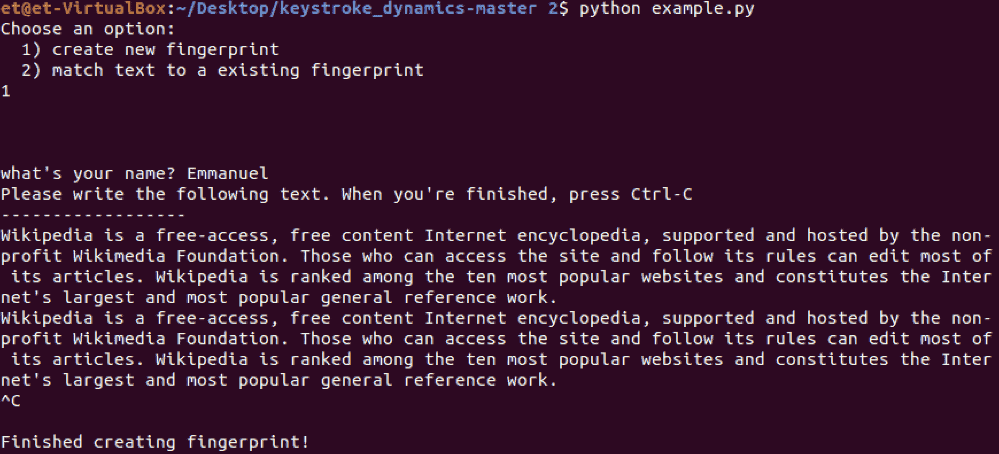

3.  运行`example.py`并通过选择选项 1 训练用户 2 的击键，然后让用户 2 键入文本:


4.  运行`example.py`，这一次，选择选项 2。
5.  让其中一个用户再次键入文本。该算法将键盘动态与训练数据中最相似的打字员进行匹配:


# 它是如何工作的...

分析击键动力学利用用户在键盘上打字的节奏和速度来验证个人的身份。我们从建立一些基线开始。在*步骤 1* 和*步骤 2* 中，我们设置了击键动力学系统来学习第一个用户的打字模式。然后我们对第二个用户做同样的事情(*步骤 3* )。这建立了我们的*普通*用户，以及他们的打字模式。在*步骤 4* 和*步骤 5* 中，我们利用我们训练过的模型(在*步骤 1* - *3* 中训练过)，来确定当前用户是谁。正如您所看到的，分类器输出一个相似性分数，并从保存的用户目录中预测当前用户是谁。这使我们能够检测未经授权的用户，并简单地跟踪系统的使用情况。


# 恶意 URL 检测器

恶意 URL 通过托管垃圾邮件、恶意软件和漏洞以及窃取信息，每年造成数十亿美元的损失。传统上，对这些攻击的防御依赖于黑名单和白名单——被认为是恶意的 URL 列表和被认为是安全的 URL 列表。然而，黑名单缺乏通用性，无法抵御以前未见过的恶意网址。为了补救这种情况，已经开发了机器学习技术。在这个菜谱中，我们将使用带有 Keras 的字符级循环神经网络运行一个恶意 URL 检测器。代码是基于[https://github.com/chen0040/keras-malicious-url-detector](https://github.com/chen0040/keras-malicious-url-detector)。


# 做好准备

该配方的准备工作包括在`pip`中安装多个软件包。说明如下:

```py
pip install keras tensorflow sklearn pandas matplotlib
```

另外，克隆下面的`git`存储库:

```py
git clone https://github.com/emmanueltsukerman/keras-malicious-url-detector.git
```


# 怎么做…

1.  训练双向 LSTM 模型:

```py
python bidirectional_lstm_train.py
```

训练屏幕看起来应该是这样的:

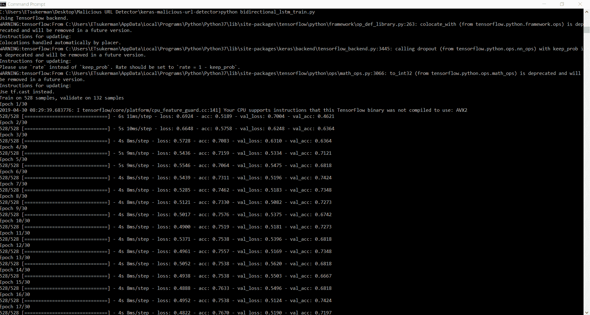

2.  测试分类器:

```py
python bidirectional_lstm_predict.py
```

测试屏幕应该如下所示:

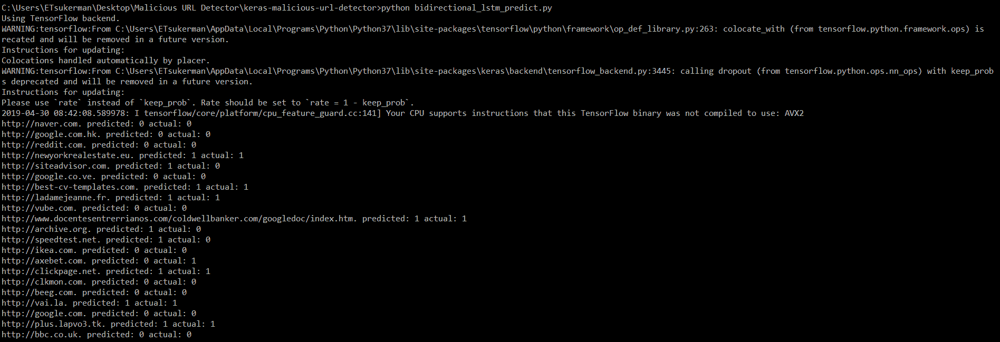

最后，你可以在`reports`文件夹下看到结果:

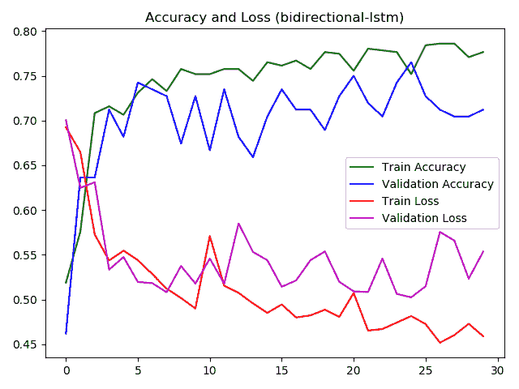


# 它是如何工作的…

这是一个相对简单的方法，但可以作为一个更强大的恶意 URL 检测器的良好起点。数据集由标签为 0 和 1 的 URL 组成，具体取决于它们是恶意的还是良性的:

```py
http://google.com,0
http://facebook.com,0
http://youtube.com,0
http://yahoo.com,0
http://baidu.com,0
http://wikipedia.org,0
http://qq.com,0
http://linkedin.com,0
http://live.com,0
http://twitter.com,0
http://amazon.com,0
http://taobao.com,0
http://blogspot.com,0

<snip>
http://360.cn,0 
http://go.com,0 
http://bbc.co.uk,0
http://xhamster.com,0
```

在*步骤 1* 中，我们训练一个双向 LSTM 模型。通过深入研究代码，您可以根据需要调整网络。训练完我们的模型后，评估它的性能并执行一些健全性检查是很重要的。我们在*步骤 2* 中这样做，测试步骤包括显示随机选择的 20 个 URL 的分类器结果。一般来说，双向 LSTM 是一种循环神经网络架构，由于其从头到尾记住信息和分析数据的能力，显示出很大的前景。


# 深冲

Deep-pwning 是一个用于评估机器学习工具对敌对攻击的鲁棒性的框架。在数据科学界已经广为人知的是，幼稚的机器学习模型，如以分类图像为唯一目标的深度神经网络，非常容易被愚弄。

下图显示了解释和利用对立的例子，I. J. Goodfellow 等人:

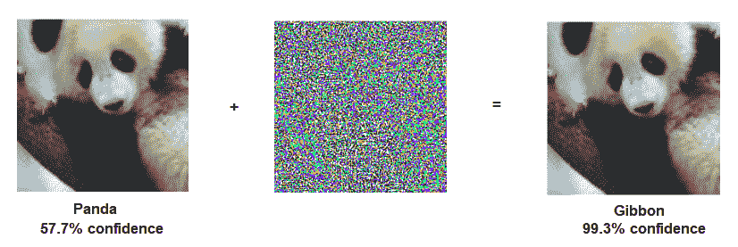

网络安全是一个对抗性的战场，用于防范攻击者的机器学习模型应该对对手具有鲁棒性。因此，重要的是不仅要报告通常的性能指标，如准确度、精确度和召回率，而且要对模型的对抗性鲁棒性有一定的度量。deep-pwning 框架是一个简单的工具包。


# 做好准备

在准备这个食谱时，请遵循以下步骤:

1.  在您的设备上安装`git`。

2.  通过使用以下命令，使用 Git 下载或克隆存储库:

```py
git clone https://github.com/emmanueltsukerman/deep-pwning.git
```

3.  安装回购的要求。

在终端中，转到存储库的根目录并运行以下命令:

```py
pip install -r requirements.txt
```


# 怎么做…

在以下步骤中，您将利用深度挖掘攻击 MNIST 数字数据集上的 LeNet5:

1.  从目录向下，使用以下命令运行 MNIST 驱动程序:

```py
python mnist_driver.py –restore_checkpoint
```

结果应该是这样的:

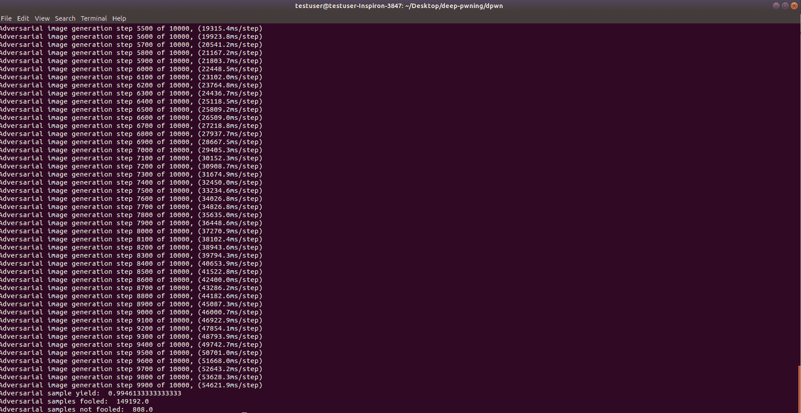


# 它是如何工作的…

在*步骤 1* 中，我们创建一个大型对立样本数据集；即，创建 150，000 个对立样本，几乎所有样本都能够在数字上欺骗 LeNet5。要检查这些对立的样本，请在输出目录中解开 pickle，如下所示:

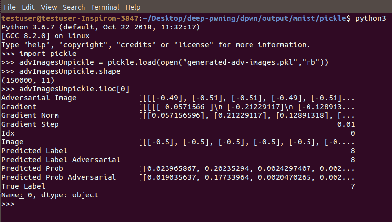

在`utils`下，一个名为`mnist_read_pickle.py`的文件将`pickle`文件作为参数。运行它会显示一个对立的示例。下图欺骗 LeNet5，使其认为看到的是数字 1:


deep-pwning 框架被设计成模块化的，因此用户可以插入并修改各个部分以满足他们的需求。例如，替换 MNIST 数据集和 LeNet5 架构。


# 基于深度学习的软件漏洞自动检测系统

信息安全专家通常能够识别潜在的可利用代码。然而，这项工作强度大，成本高，可能不足以保证程序的安全性。深度学习相对于传统机器学习的一大优势就是可以自动发现特征。这允许我们减少对脆弱性方面的人类专家的需求，以及产生更有效的系统。在这个菜谱中，我们将利用 *VulDeePecker :* *一个基于深度学习的漏洞检测系统*([https://arxiv.org/pdf/1801.01681.pdf](https://arxiv.org/pdf/1801.01681.pdf))，自动检测 C/C++软件中的缓冲区错误漏洞和资源管理错误。


# 做好准备

该配方的准备包括在`pip`中安装`pandas`、`gensim`、`keras`、`tensorflow`和`sklearn`包。说明如下:

```py
pip install pandas gensim keras tensorflow sklearn
```

此外，对于这个配方，克隆 VulDeePecker 的存储库:

1.  安装`git`，然后在终端中运行以下命令:

```py
git clone https://github.com/emmanueltsukerman/Deep-Learning-Based-System-for-Automatic-Detection-of-Software-Vulnerabilities.git
```

在`datasets`文件夹中有两个数据集，`cwe119_cgd.7z`和`cwe399_cgd.7z`。如果你想在这个食谱中使用它们，提取它们。


# 怎么做…

1.  收集小工具的训练数据集，并将其放在`datasets`下。在`datasets`文件夹中有两个数据集，它们的形式如下:


2.  在数据集上训练和测试深度学习模型。

这是通过运行以下命令来完成的:

```py
python vuldeepecker_train.py "path to dataset"
```

输出显示在以下截图中:

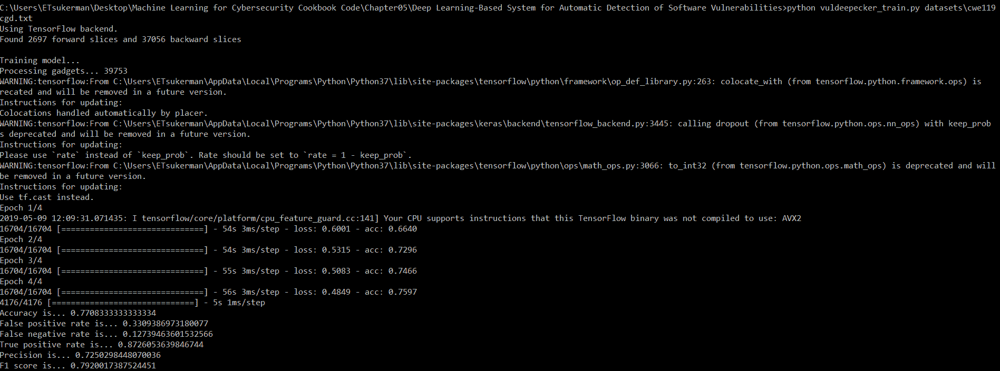

3.  收集您想要预测的数据集，并将其放在`datasets`下:

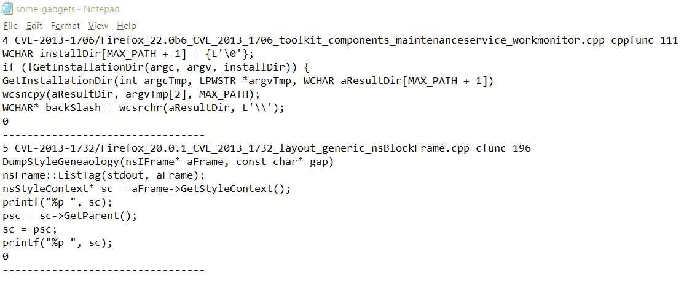

4.  通过运行以下命令，使用您训练的模型来预测这些是否是易受攻击的代码段:

```py
python vuldeepecker_predict.py "path to data" "path to model"
```


# 它是如何工作的…

为了让机器学习能够用于漏洞检测，您需要找到适合学习的软件程序的表示。为此，我们使用代码小工具，它们被转换成向量。代码小工具是语义上彼此相关的代码行的选择。在*步骤 1* 中，我们收集这样的代码小工具进行训练。您可以看到三个代码小工具以及标签的图像。这里，标签 1 表示有漏洞，而标签 0 表示没有漏洞。要从想要的程序中提取小工具，建议使用商业产品 Checkmarx 提取程序切片，然后组装成代码小工具。另一个数据集可用。该数据集`cwe-119`对应于缓冲区错误漏洞。接下来，我们在我们的漏洞数据集上训练深度学习模型(*步骤 2* )。使用的深度学习模型是一个**双向长短时记忆** ( **BLSTM** )，其架构给出如下:

```py
Bidirectional(LSTM(300), input_shape=(50, 50))
Dense(300)
LeakyReLU()
Dropout(0.5)
Dense(300)
LeakyReLU()
Dropout(0.5)
Dense(2, activation='softmax')
Adamax(lr=0.002)
'categorical_crossentropy'
```

注意，训练阶段会自动将模型保存为`[base-name-of-training-dataset]_model.h5`。我们现在准备寻找新的漏洞。因此，我们在`datasets` ( *步骤 3* )中放置一个测试集，然后通过预测这个新集中的漏洞来使用我们的神经网络(*步骤 4* )。**