# 七、利用机器学习保护和攻击数据

在本章中，我们将学习如何使用**机器学习** ( **ML** )来保护和攻击数据。我们将介绍如何使用 ML 评估密码的强度，以及反过来，如何使用深度学习破解密码。类似地，我们将介绍如何使用隐写术在众目睽睽之下隐藏消息，以及如何使用 ML 检测隐写术。此外，我们将应用具有硬件安全性的 ML，利用 AI 攻击**物理上不可克隆的函数**(**puf**)。

在本章中，我们将介绍以下配方:

*   使用 ML 评估口令安全性
*   密码破解的深度学习
*   深度隐写术
*   基于最大似然的隐写分析
*   对 puf 的 ML 攻击
*   使用深度学习的加密
*   HIPAA 数据泄露–数据探索和可视化


# 技术要求

在本章中，我们将使用以下技术:

*   PyTorch
*   TensorBoardX
*   XGBoost
*   sci kit-学习
*   熊猫
*   张量流
*   克拉斯
*   八度音阶

本章的代码和数据集可以在[https://github . com/packt publishing/Machine-Learning-for-cyber security-Cookbook/tree/master/chapter 07](https://github.com/PacktPublishing/Machine-Learning-for-Cybersecurity-Cookbook/tree/master/Chapter07)找到。


# 使用 ML 评估口令安全性

**密码破解**是发现安全系统密码的系统性努力。破解可能涉及使用普通密码、巧妙生成的候选密码(例如，用数字 0 替换字母 O 或倒写一个单词)，或者只是使用简单的暴力穷举搜索。为了增加破解密码的难度，必须选择一个强密码。


# 做好准备

为了准备这个菜谱，我们需要在`pip`中安装`pandas`、`sklearn`和`xgboost`。请使用以下代码来完成此操作:

```py
pip install pandas sklearn xgboost
```

另外，提取存档的数据集，即`PasswordDataset.7z`。


# 怎么做…

在接下来的步骤中，我们将读入密码数据集以及密码强度标签，并构建一个分类器来评估密码强度。让我们开始吧:

1.  导入`pandas`并将密码读入数据帧:

```py
import pandas as pd

df = pd.read_csv(
    "passwordDataset.csv", dtype={"password": "str", "strength": "int"}, index_col=None
)
```

2.  随机打乱数据:

```py
df = df.sample(frac=1)
```

3.  将数据帧分成两个独立的数据帧，一个用于训练，一个用于测试:

```py
l = len(df.index)
train_df = df.head(int(l * 0.8))
test_df = df.tail(int(l * 0.2))
```

4.  创建所需的标签和特征数据:

```py
y_train = train_df.pop("strength").values
y_test = test_df.pop("strength").values
X_train = train_df.values.flatten()
X_test = test_df.values.flatten()
```

5.  定义一个将字符串拆分成字符的函数:

```py
def character_tokens(input_string):
    """Break string into characters."""
    return [x for x in input_string]
```

6.  创建一个管道，对密码字符执行 TF-IDF，然后进行梯度增强:

```py
from sklearn.pipeline import Pipeline
from sklearn.feature_extraction.text import TfidfVectorizer
from xgboost import XGBClassifier

password_clf = Pipeline(
    [("vect", TfidfVectorizer(tokenizer=character_tokens)), ("clf", XGBClassifier()),]
)
```

7.  训练和测试管道:

```py
password_clf.fit(X_train, y_train)
password_clf.score(X_test, y_test)
```

以下是输出:

```py
0.9137365878426307
```

8.  将一个变量设置为常用密码，另一个变量设置为计算机生成的高熵密码:

```py
common_password = "qwerty"
strong_computer_generated_password = "c9lCwLBFmdLbG6iWla4H"
```

9.  检查分类器对两个密码强度的预测:

```py
password_clf.predict([common_password, strong_computer_generated_password])
```

以下是输出:

```py
array([0, 2])
```


# 它是如何工作的…

我们从导入`pandas`开始，然后将数据读入数据帧(*步骤 1* )。该数据中有两个字段:密码和密码强度。密码强度由三个难度级别组成。在*步骤 2* 中，我们对数据进行混排，以创建更强健的训练。在*步骤 3* 中，我们通过 80-20 分割来分割数据帧，然后将特征和标签分布到数组中(*步骤 4* )。在*步骤 5* 中，我们定义了一个将密码字符串分割成字符的函数，以便将密码标记成字符，而不是单词。这将允许分类器学习关于密码数据集的细粒度信息。在*步骤 6* 中，我们定义了一个管道来对密码字符执行 NLP，然后使用 XGBoost 分类器。接下来，我们训练并测试我们的分类器(*步骤 7* )。对于像这样有点主观的任务，分类器的性能不一定反映在高分或低分上。

完成训练后，我们执行分类器功效的健全性检查/演示。我们选择了一个最常用的密码和一个在*步骤 8* 中使用密码管理系统生成的密码。在*步骤 9* 中，我们可以看到分类器确实将普通密码归类为弱(强度 0)，将强密码归类为强(强度 2)。成功。


# 密码破解的深度学习

现代密码破解工具，如**开膛手约翰**，允许黑客在几秒钟内测试数十亿个潜在密码。这类工具不仅允许黑客尝试常用密码字典中的每个密码，还可以通过使用串联(例如，`password1234`)、leetspeak ( `p4s5w0rd`)和其他有前途的技术来自动转换这些密码。尽管这些技术很有前途，但找到其他有前途的转换是一项困难的任务。被称为 PassGAN 的 ML 系统使用一个**生成对抗网络** ( **GAN** )通过观察真实密码的大型数据集(从实际密码泄露的语料库中收集)来自动学习这些规则，并生成高概率的密码候选。在这个菜谱中，您将在一个泄露密码的语料库上训练 PassGAN，并使用它来生成密码猜测。

这个项目将需要一台带有 GPU 的机器。


# 做好准备

在准备此配方时，请执行以下步骤:

1.  使用以下命令克隆`PassGAN`存储库:

```py
git clone https://github.com/emmanueltsukerman/PassGAN.git
```

2.  在`data`文件夹下放置一个数据集。例如，您可以使用以下命令下载著名的`rockyou`密码数据集:

```py
curl -L -o data/train.txt https://github.com/brannondorsey/PassGAN/releases/download/data/rockyou-train.txt
```

运行密码数据集时，您应该会看到如下内容:

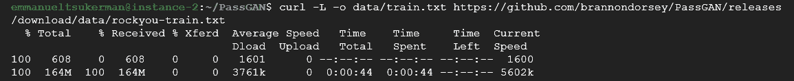

另外，这个菜谱需要预装 CUDA 8。可以通过运行以下命令来安装所需的`pip`包:

```py
pip install -r requirements.txt
```


# 怎么做…

在下面的步骤中，我们将在泄露密码的语料库上训练 PassGAN，然后使用它来生成新的密码猜测。让我们开始吧:

1.  通过运行以下命令，在数据集上训练您的神经网络:

```py
python train.py --output-dir output --training-data data/train.txt
```

2.  通过运行以下命令，生成一个(100，000)密码猜测列表:

```py
python sample.py \
--input-dir pretrained \
--checkpoint pretrained/checkpoints/195000.ckpt \
--output gen_passwords.txt \
--batch-size 1024 \
--num-samples 100000
```

您的终端应该如下所示:

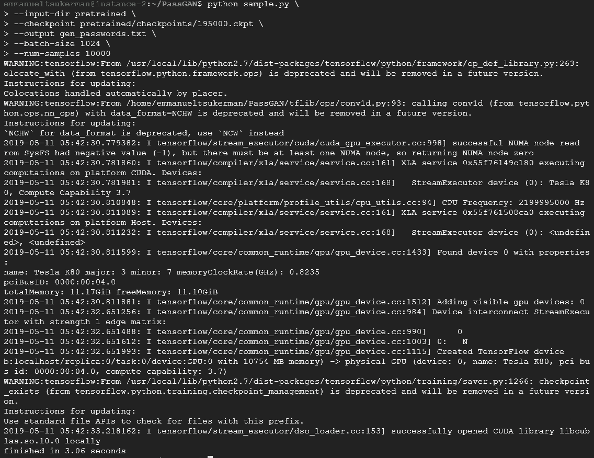


# 它是如何工作的…

通过在*步骤 1* 中直接训练我们的神经网络，我们在这个食谱中进入了正轨。根据我们的需要，可以使用几个附加标志来定制训练。现在我们已经训练了我们的模型，我们需要输出 100，000 个密码的列表，所有这些密码都是由模型生成的(*步骤 2* )。这些用作对可能密码的智能猜测。通过检查*步骤 2* 的输出，我们可以看到密码如下所示:


现在，我们可以用这些作为破解密码的候选者。


# 还有更多

描述帕斯根的原始论文可以在[https://arxiv.org/abs/1709.00440](https://arxiv.org/abs/1709.00440)找到。


# 深度隐写术

隐写术是将消息(即秘密)隐藏在另一种介质中的做法，如文件、文本、图像或视频(即封面)。当秘密被嵌入到封面中时，结果被称为**容器**。在这个食谱中，我们将使用深度神经网络来创建隐藏和揭示过程。与普通隐写方法不同，普通隐写方法将秘密编码在封面的 LSB 中，深度学习将秘密分布在所有位上。


# 做好准备

在这个食谱中，你需要访问一个图形处理器。


# 怎么做…

1.  使用以下命令克隆存储库:

```py
git clone https://github.com/emmanueltsukerman/PyTorch-Deep-Image-Steganography.git
```

2.  准备预训练模型:

```py
cat ./checkPoint/netH.tar.gz* | tar -xzv -C ./checkPoint/
```

3.  在`example_pics`文件夹中准备一张秘密图像和一张封面图像:

如您所见，我们使用以下图像作为封面图像:


我们使用以下图像作为秘密图像:


4.  执行预训练的模型以产生容器图像和重构的秘密:

```py
CUDA_VISIBLE_DEVICES=0 python main.py –test=./example_pics
```

输出的第一部分显示在下面的屏幕截图中:

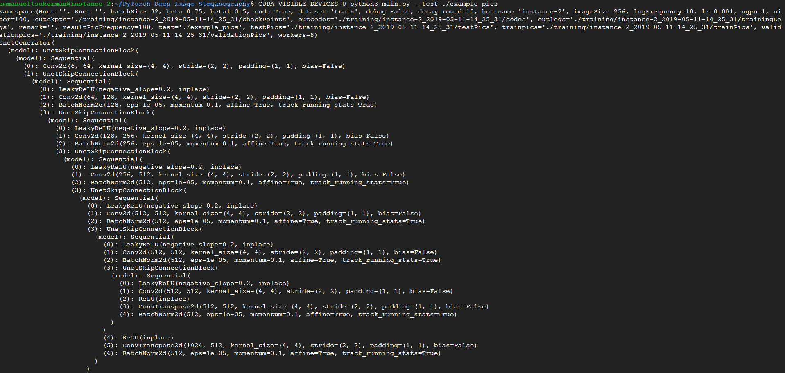

输出的第二部分显示在下面的屏幕截图中:

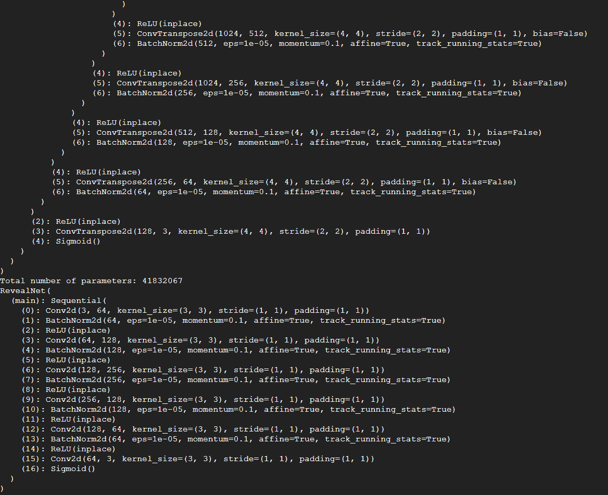

输出的最后部分显示在下面的屏幕截图中:


5.  在训练文件夹下检查您的结果。您应该会看到下图:


第一行:封面。第二行:集装箱。第三行:秘密。第 4 行:重建的秘密


# 它是如何工作的…

在*步骤 1* 中，我们简单地克隆深度隐写术项目的存储库。关于这个项目的理论和实现的一些背景可以在论文*隐藏图像在普通视野中:深度隐写术*([https://papers . nips . cc/paper/6802-隐藏图像在普通视野中-深度隐写术](https://papers.nips.cc/paper/6802-hiding-images-in-plain-sight-deep-steganography))中找到。

基本思路是有一个**隐藏网** ( **H-net** )和一个**揭露网** ( **R-net** )，两者都是对抗性训练。继续*步骤 2* ，我们准备我们的预训练模型。我们在这里使用的模型在 ImageNet 的 45，000 幅图像上进行训练，并在 5，000 幅图像上进行评估。所有的图像都被调整为 256 × 256，没有归一化，这项任务需要在一台英伟达 GTX 1080 Ti 上进行 24 小时的训练。接下来，我们选择两张图片作为封面和秘密(*步骤 3* )。请随意使用您自己的一对图像。在*步骤 4* 和 *5* 中，我们运行模型，创建一个容器图像(包含隐藏秘密的那个)，并生成一个显示我们结果的图像。如您所见，容器图像和封面图像对于人眼来说是无法区分的，这意味着没有人能够看出您在封面图像中隐藏了秘密。


# 基于最大似然的隐写分析

隐写术中的主要技术之一是通过用消息位的最低有效位改变像素的最低有效位来隐藏图像中的消息。结果是一个隐藏了信息的图像，人眼无法从原始图像中分辨出来。这是因为，在改变图像像素中的 LSB 时，像素值仅被少量改变，从而产生视觉上相似的图像。

LSB 有两种主要方法:

*   naïve 方法被称为 LSB 替换。在这种方法中，如果消息位与 LSB 相同，则 LSB 位保持不变；否则，该位被改变。因此，奇数像素的亮度减少 1，而偶数像素的亮度增加 1。然而，这会导致图像直方图的不平衡，这种不平衡很容易被用于隐写分析的统计方法检测到。
*   LSB 隐写术的第二种方法是 LSB 匹配，它通过在 LSB 位不匹配的情况下将像素值随机递增或递减 1 来解决这个问题。这避免了直方图不平衡的问题，并且使得难以通过单独使用简单的统计方法来执行隐写分析。

下图展示了 LSB 隐写术的一个实例。

以下图像将被表示为封面图像:

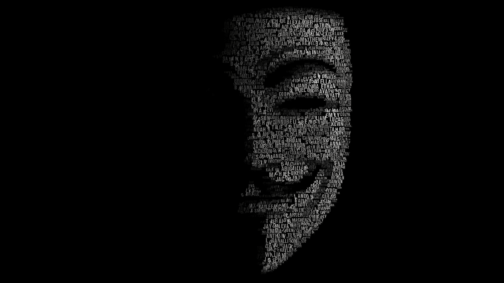

下面的图像将被表示为秘密图像:


下面的图像将被表示为容器图像:


以下图像将显示为恢复的秘密图像:


# 做好准备

建议您在 Linux 机器上完成这个食谱。按照以下步骤设置好一切:

1.  安装`octave`及其包`image`和`signal`:

```py
sudo apt-get install octave octave-image octave-signal
```

2.  克隆`aletheia`的存储库，如下面的代码所示:

```py
git clone https://github.com/emmanueltsukerman/aletheia.git
```

3.  下载一个`BOSS`数据集，可以通过以下链接下载:

```py
wget http://dde.binghamton.edu/download/ImageDB/BOSSbase_1.01.zip
```

这将检索一个灰度图像数据库。

4.  解压缩数据集并重命名`BOSSbase`文件夹:

```py
unzip BOSSbase_1.01.zip
```

为了方便起见，经过处理的数据集，即`bossbase.7z`和`bossbase_lsb.7z`，可以在本书的知识库中找到。


# 怎么做...

在这个食谱中，我们将策划一个 LSB 数据集，然后训练和测试一个 ML 模型，以检测图像中 LSB 隐写术的存在。让我们开始吧:

1.  使用以下命令创建 LSB 数据库:

```py
python aletheia.py lsbm-sim bossbase 0.40 bossbase_lsb
```

结果是一个名为`bossbase_lsb`的新文件夹，其中包含嵌入的 BOSS 图像。它使用 LSB 匹配仿真器来实现这一点。

2.  特征化`BOSS`数据集，如以下代码所示:

```py
./aletheia.py srm bossbase bossbase.fea
```

3.  特征化 LSB 数据集，如以下代码所示:

```py
./aletheia.py srm bossbase_lsb bossbase_lsb.fea
```

为了方便起见，剩下的步骤可以在 Python 环境中运行。

4.  创建一些指向提取要素路径的变量:

```py
bossbase_features_path = "bossbase.fea"
bossbase_lsb_features_path = "bossbase_lsb.fea"
features_with_labels = [(bossbase_features_path, 0), (bossbase_lsb_features_path, 1)]
```

5.  收集要素和标签并将其放入数组中:

```py
X = []
y = []
for feature_path, label in features_with_labels:
    with open(feature_path, "r") as f:
        for line in f:
            fv = line.split()
            X.append(fv)
            y.append(label)
```

6.  执行列车测试分割:

```py
from sklearn.model_selection import train_test_split

X_train, X_test, y_train, y_test = train_test_split(
    X, y, test_size=0.2, random_state=11
)
```

7.  实例化一个`RandomForestClassifier`并训练它:

```py
from sklearn.ensemble import RandomForestClassifier

clf = RandomForestClassifier()
clf = clf.fit(X_train, y_train)
```

8.  对测试集上的分类器进行评分:

```py
print(clf.score(X_test, y_test))
```

以下是输出:

```py
0.825
```


# 它是如何工作的…

我们通过使用称为 Aletheia 的软件创建 LSB 隐写术容器图像的大型数据集来开始这个配方(*步骤 1* )。Aletheia 提供了广泛的功能。运行以下不带参数的命令:

```py
$ ./aletheia.py
```

前面的命令打印出以下关于`aletheia`的信息:

```py
./aletheia.py <command>
COMMANDS:
Attacks to LSB replacement:
- spa: Sample Pairs Analysis.
- rs: RS attack.
ML-based detectors:
- esvm-predict: Predict using eSVM.
- e4s-predict: Predict using EC.
Feature extractors:
- srm: Full Spatial Rich Models.
- hill-maxsrm: Selection-Channel-Aware Spatial Rich Models for HILL.
- srmq1: Spatial Rich Models with fixed quantization q=1c.
- scrmq1: Spatial Color Rich Models with fixed quantization q=1c.
- gfr: JPEG steganalysis with 2D Gabor Filters.
Embedding simulators:
- lsbr-sim: Embedding using LSB replacement simulator.
- lsbm-sim: Embedding using LSB matching simulator.
- hugo-sim: Embedding using HUGO simulator.
- wow-sim: Embedding using WOW simulator.
- s-uniward-sim: Embedding using S-UNIWARD simulator.
- j-uniward-sim: Embedding using J-UNIWARD simulator.
- j-uniward-color-sim: Embedding using J-UNIWARD color simulator.
- hill-sim: Embedding using HILL simulator.
- ebs-sim: Embedding using EBS simulator.
- ebs-color-sim: Embedding using EBS color simulator.
- ued-sim: Embedding using UED simulator.
- ued-color-sim: Embedding using UED color simulator.
- nsf5-sim: Embedding using nsF5 simulator.
- nsf5-color-sim: Embedding using nsF5 color simulator.
Model training:
- esvm: Ensemble of Support Vector Machines.
- e4s: Ensemble Classifiers for Steganalysis.
- xu-net: Convolutional Neural Network for Steganalysis.
Unsupervised attacks:
- ats: Artificial Training Sets.
Naive attacks:
- brute-force: Brute force attack using a list of passwords.
- hpf: High-pass filter.
- imgdiff: Differences between two images.
- imgdiff-pixels: Differences between two images (show pixel values).
- rm-alpha: Opacity of the alpha channel to 255.
```

在*步骤 2* 和 *3* 中，我们使用 Aletheia 的`srm`命令提取平面图像和容器图像的特征。`srm`命令提取完整且空间丰富的特征集。也可以使用其他替代功能集。接下来，我们创建指向数据集路径的变量(*步骤 4* )，然后将我们的特征和标签收集到数组中(*步骤 5* )。在*步骤 6* - *8* 中，我们创建一个训练-测试分割，训练一个分类器，然后测试它。查看平衡数据集上 80%的性能，我们可以看到这些特征确实有助于我们区分普通图像和容器图像。换句话说，我们可以得出结论，ML 可以检测隐写术。


# 对 puf 的 ML 攻击

经典加密技术提供了几种保护电子设备的措施。这些主要依赖于密钥和昂贵的资源，因为设备永久存储了一条我们的对手不知道的数字信息。实际上，很难对这些信息保密。这个问题激发了 PUF 的发明——产生一种输出的物理设备，这种输出可以快速评估，但很难预测。

为了使用 PUF 进行认证，我们需要构建一个**挑战-响应对(CRP)**的数据库。质询是二进制字符串(例如，1100101...01)，长度为 *n* ，响应是长度为 *m* 的其他二进制字符串。为了查明未知设备是否是前述的 PUF，我们需要向它发出许多挑战，验证它产生正确的响应，直到我们达到它确实是同一个 PUF 的期望概率。请注意，puf 本身并不是 100%可靠的，由于不同的环境条件和噪声，相同的挑战可能会产生不同的响应:

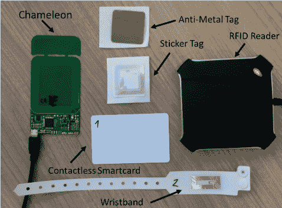

图 8: PUF 商用 RFID 标签

在这个食谱中，我们将使用 ML 攻击一个特定的 PUF。注意，该领域一直在发展，并且已经提出了其他更安全的 puf，以及使用 ML 增加 puf 的可靠性和安全性的方法。


# 做好准备

对于这个菜谱，我们需要在`pip`中安装`pandas`、`sklearn`和`xgboost`。请使用以下代码来完成此操作:

```py
pip install pandas sklearn xgboost
```

此外，还为此配方提供了`CRPDataset.csv`数据集。


# 怎么做...

让我们学习如何用 ML 破解 PUF:

1.  加载 CRP 数据集，在本例中为`CRPDataset.csv`:

```py
import pandas as pd

df = pd.read_csv("CRPdataset.csv")
```

数据由成对( *x* ， *y* )组成，其中 *x* 是长度为 64 的二进制字符串， *y* 是二进制数字。这里， *x* 是挑战， *y* 是响应。

2.  将`pandas`数据帧转换成特征和标签的 NumPy 数组:

```py
y = df.pop("Label").values
X = df.values
```

3.  执行列车测试分割:

```py
from sklearn.model_selection import train_test_split

X_train, X_test, y_train, y_test = train_test_split(
    X, y, test_size=0.25, random_state=11
)
```

4.  实例化并训练 XGBoost 分类器:

```py
from xgboost import XGBClassifier

clf = XGBClassifier()
clf.fit(X_train, y_train)
print(clf.score(X_train, y_train))
```

以下是输出:

```py
0.6405208333333333
```

5.  测试分类器，如下面的代码所示:

```py
clf.score(X_test, y_test)
```

以下是输出:

```py
0.6270833333333333
```


# 它是如何工作的…

我们从将 CRP 数据集读入数据帧开始(*步骤 1* )。在*步骤 2* 中，我们创建 x 和 y NumPy 数组来保存特性和标签。接下来，我们训练-测试分割我们的数据(*步骤 3* )，然后训练和测试一个用于 CRP 的分类器(*步骤 4* 和 *5* )。基于性能，我们可以看到 ML 可以准确地预测对 PUF 挑战的响应。这意味着，在使用我们训练过的模型时，我们可以构建 PUF 的软件克隆，并使用它来(错误地)认证。


# 还有更多

该配方的原始未处理数据集可在[https://archive . ics . UCI . edu/ml/datasets/Physical+Unclonable+Functions](https://archive.ics.uci.edu/ml/datasets/Physical+Unclonable+Functions)中找到。其他背景信息可以在论文中找到，*A Machine Learning-Based Security vuls Study**on XOR PUFs for Resource-Constraint Internet of Things*，作者 A. O .，Zhuang，y .，Alkatheiri，m . s .(2018 年 7 月)在 2018 年 IEEE 国际物联网大会(ICIOT)(第 49-56 页)。IEEE。


# 使用深度学习的加密

加密是将信息转换成代码以防止未授权访问的过程。在这个菜谱中，我们将利用卷积神经网络来加密和解密数据。


# 做好准备

对于这个食谱，你需要在`pip`中安装`click`、`keras`、`tensorflow`和`tqdm`软件包。请使用以下代码来完成此操作:

```py
pip install click keras tensorflow tqdm
```

此外，使用以下命令克隆存储库:

```py
git clone https://github.com/emmanueltsukerman/convcrypt.git
```


# 怎么做...

以下步骤将指导您如何使用 ConvCrypt 来加密图像。让我们开始吧:

1.  针对您想要加密的图像或文件运行`encrypt.py`脚本:

```py
python encrypt.py --input_file "input file path" --output_file "encrypted file path" --key_file "key file name"
```

上述代码的输出显示在下面的屏幕截图中:

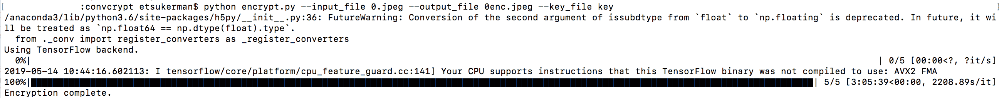

要查看文件是否被加密，请尝试打开它。我们将看到，由于加密，它无法打开:

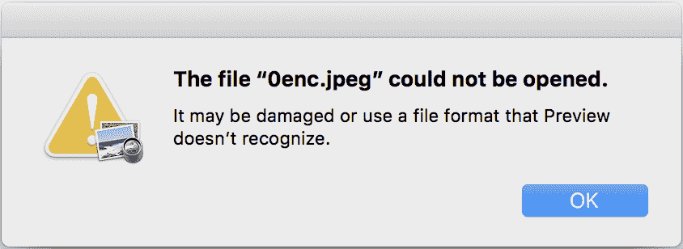

2.  要解密文件，对加密文件和密钥文件执行`decrypt.py`脚本:

```py
python decrypt.py --input_file "encrypted file path" --output_file "reconstructed file path" --key_file "key file name"
```

结果是原始文件。


# 它是如何工作的...

我们首先使用 ConvCrypt 加密我们的图像(*步骤 1* )。ConvCrypt 是一种概念验证的实验性加密算法，它使用了 n 维卷积神经网络。目前，它只支持三维卷积。然后，在*步骤 2* 中，我们反向加密并测试，确保结果是原始文件。成功！

对于感兴趣的人来说，ConvCrypt 算法做的第一件事就是将数据分成块。然后，为 3D 卷积生成密钥；这是一个随机生成的位立方体，大小与数据块相同。最后，训练卷积神经网络以将密钥卷积到每个数据块中，使得每个数据块获得其自己的训练网络。产生的加密数据是每个网络的权重(核张量的值)。


# HIPAA 数据泄露–数据探索和可视化

数据探索是数据分析的第一步，通过可视化探索来了解数据集和数据的特征。数据可视化通过将数据置于光学环境中来帮助我们理解数据，以便我们强大的视觉处理中心可以快速找到数据中的模式和相关性。

在本食谱中，您将探索并可视化一个关于违反 HIPAA 机密信息的公共域数据集。


# 做好准备

对于这个食谱，你需要在`pip`中安装`pandas`和`sklearn`。请使用以下代码来完成此操作:

```py
pip install pandas sklearn
```

此外，还提供了`HIPAA-breach-report-2009-to-2017.csv`数据集，这样您就可以在这个食谱中使用它。


# 怎么做…

在以下步骤中，您将在 pandas 中可视化 HIPAA 违规数据集，并使用 TF-IDF 从违规描述中提取重要的关键字。让我们开始吧:

1.  使用`pandas`加载并清理 HIPAA 违规数据集:

```py
import pandas as pd

 df = pd.read_csv("HIPAA-breach-report-2009-to-2017.csv")
 df = df.dropna()
```

前面代码的输出显示在下面的屏幕截图中:

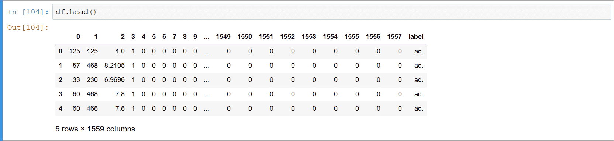

2.  使用以下代码绘制受违规影响的人数与此类违规频率的直方图:

```py
%matplotlib inline
 def_fig_size = (15, 6)
 df["Individuals Affected"].plot(
 kind="hist", figsize=def_fig_size, log=True, title="Breach Size Distribution"
 )
```

以下输出显示了**裂口大小分布**:

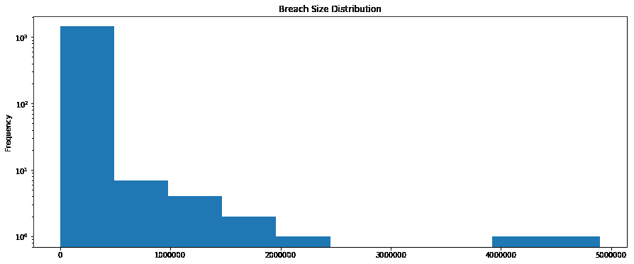

3.  根据实体类型绘制平均缺口尺寸:

```py
df.groupby("Covered Entity Type").mean().plot(
 kind="bar", figsize=def_fig_size, title="Average Breach Size by Entity Type"
 )
```

以下截图显示了按实体类型划分的**平均缺口大小的输出:**

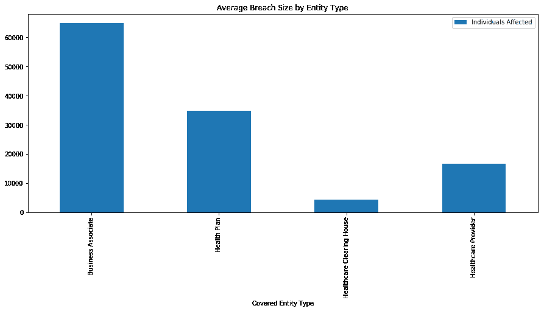

4.  绘制一个饼图，显示每个州受违规影响的人数，按前 20 个州进行筛选:

```py
df.groupby("State").sum().nlargest(20, "Individuals Affected").plot.pie(
 y="Individuals Affected", figsize=def_fig_size, legend=False
 )
```

下图显示了每个州受违规影响的个人:

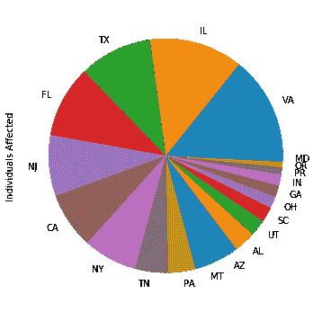

5.  根据违规类型(盗窃、丢失、黑客攻击等)绘制平均违规规模:

```py
df.groupby("Type of Breach").mean().plot(
 kind="bar", figsize=def_fig_size, title="Average Breach Size by Entity Type"
 )
```

下图显示了**违约类型**:

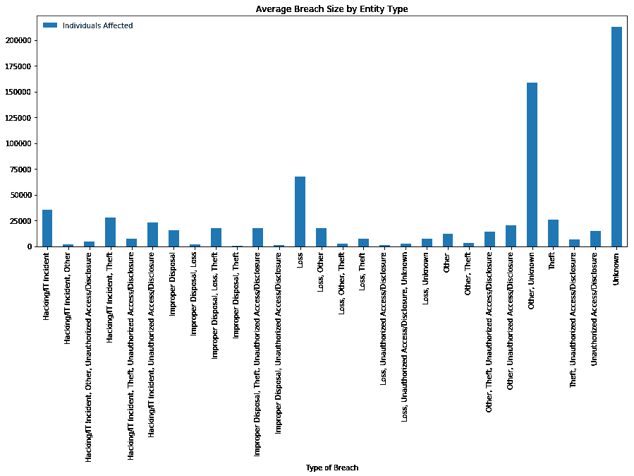

6.  实例化 TF-IDF 矢量器:

```py
from sklearn.feature_extraction.text import TfidfVectorizer

 vectorizer = TfidfVectorizer()
```

7.  将矢量器与违规描述相匹配，并对其进行矢量化:

```py
df["Web Description"] = df["Web Description"].str.replace("\r", " ")
 X = df["Web Description"].values
 X_transformed = vectorizer.fit_transform(X)
```

8.  根据 TF-IDF，在违规描述中选择 15 个最重要的特征:

```py
import numpy as np

 feature_array = np.array(vectorizer.get_feature_names())
 tfidf_sorting = np.argsort(X_transformed.toarray()).flatten()[::-1]
 n = 15
 top_n = feature_array[tfidf_sorting][:n]
 print(top_n)
```

输出如下所示:

```py
['this' 'review' '842' 'south' 'ransomware' 'memorial' 'specific' 'birthdates' 'consolidated' 'malware' 'license' 'driver' 'found' 'clinic' 'information']
```

9.  打印几个包含`review`关键字的违规描述:

```py
k = 2
 i = 0
 for x in df["Web Description"].values:
 if "review" in x:
 i += 1
 print(x)
 print()
 if i == k:
 break
```

以下是输出的一些片段:

```py
A laptop was lost by an employee... all employees received additional security training.
The covered entity's (CE) business associate (BA) incorrectly... BA to safeguard all PHI.
```


# 它是如何工作的…

我们首先将 HIPAA 数据集读入 dataframe，并删除任何包含 NAs 的行(*步骤 1* )。接下来，在*第 2 步*中，我们可以看到大多数入侵的规模相对较小，但也有少数入侵是大规模的。这与帕累托原理是一致的。在*步骤 3* 中，我们按部门划分违规事件，以确保最大的违规事件发生在业务合作伙伴中。然后，我们在*步骤 4* 中检查哪些州违反 HIPAA 的情况最多。在*步骤 5* 中，我们了解到最大的违规事件的原因通常是未知的！在*步骤 6* 和 *7* 中，我们对违规描述执行基本的 NLP。这将允许我们提取更多感兴趣的信息。在*步骤 8* 中，我们可以看到 TF-IDF 能够找到一些非常有信息的关键词，比如*勒索软件*和*驱动*。最后，在*步骤 9* 中，我们打印出包含关键字*审查*的违规描述。“审查”这个词被证明是一个非常重要的词，因为它是质量控制的一部分，也是一个事件响应工具。