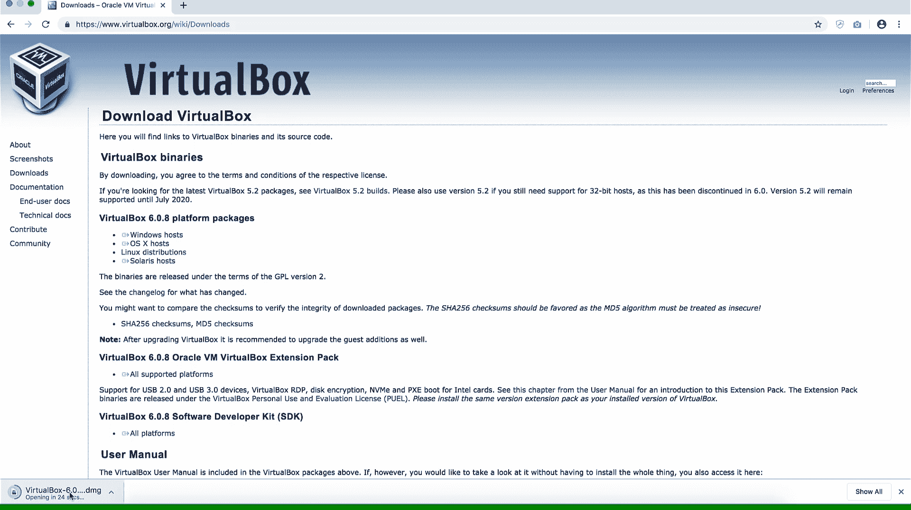
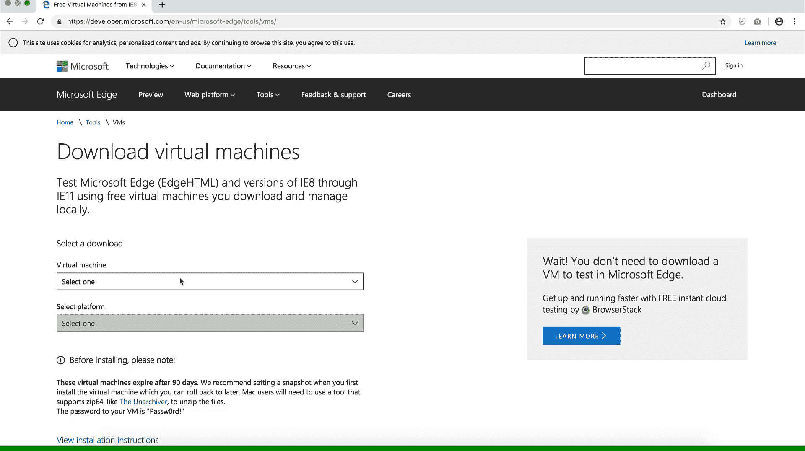
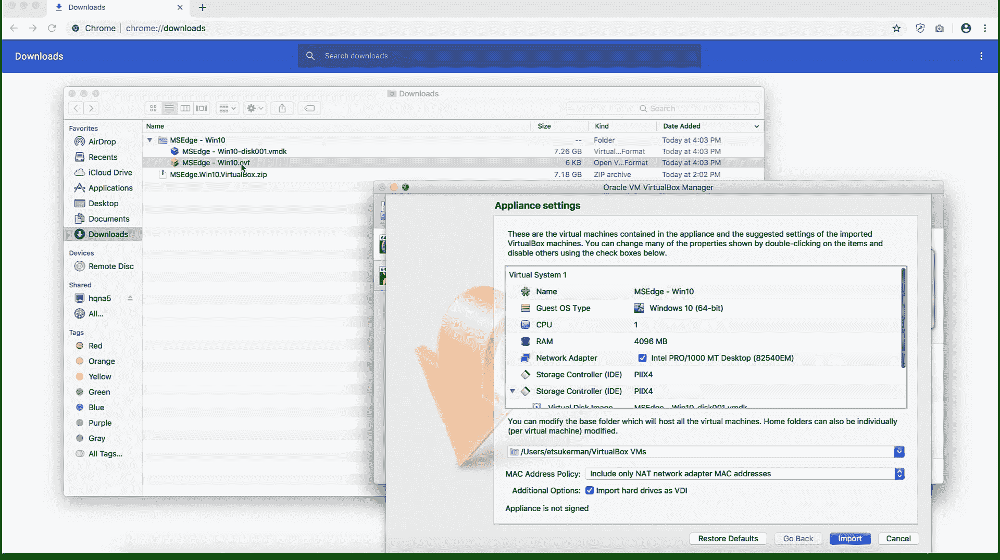
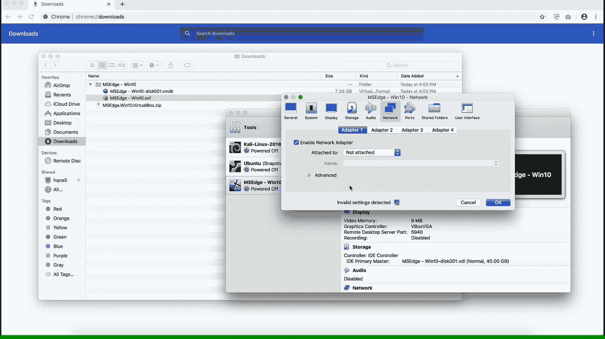
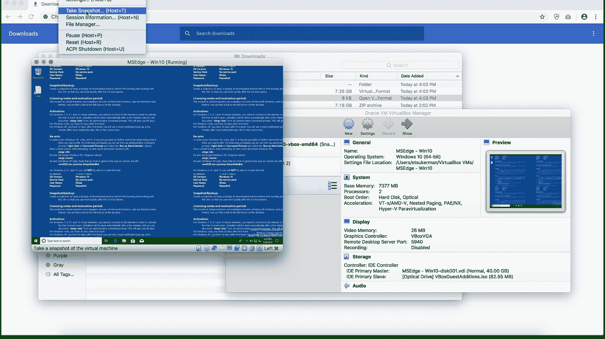
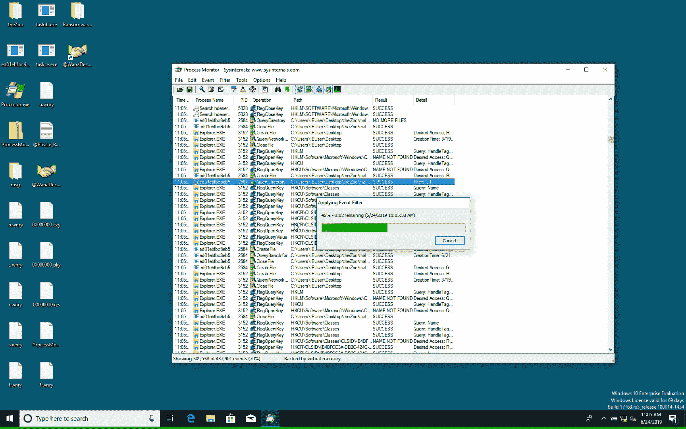
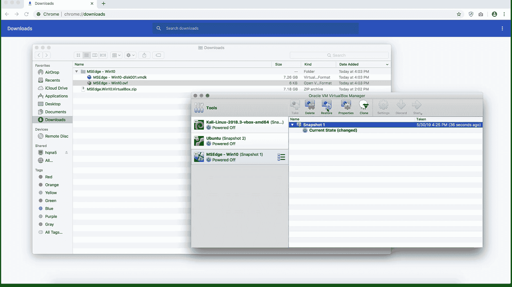

# 九、附录

在这一章中，我们为读者提供了一个创建基础设施的指南，以应对机器学习对网络安全数据的挑战。特别是，我们提供了建立虚拟实验室环境的方法，以便进行安全有效的恶意软件分析。我们还提供了使用虚拟 Python 环境的指南，它允许用户无缝地在不同的 Python 项目上工作，同时避免包冲突。

本章将介绍以下配方:

*   设置虚拟实验室环境
*   使用 Python 虚拟环境


# 设置虚拟实验室环境

为了保护您自己和您的网络，在处理和分析恶意软件时采取预防措施是非常必要的。最好的方法之一是建立一个隔离的虚拟实验室环境。虚拟实验室环境由隔离网络中的一个或多个**虚拟机** ( **虚拟机**)组成。隔离网络可以防止恶意软件在网络中传播，代价是恶意软件的行为不那么真实。


# 做好准备

在准备此食谱时，请执行以下操作:

1.  安装管理程序。

虚拟机管理程序是允许您控制虚拟机的软件。一个例子是 VirtualBox，可以在 https://www.virtualbox.org/[免费下载:](https://www.virtualbox.org/)



2.  下载一个虚拟映像。

虚拟映像是虚拟机的模板。可以在[https://developer . Microsoft . com/en-us/Microsoft-edge/tools/VMs/](https://developer.microsoft.com/en-us/microsoft-edge/tools/vms/)找到几个 Windows 虚拟映像:




# 怎么做...

以下步骤将指导您设置和使用一个简单的虚拟实验室环境:

1.  使用虚拟映像创建一个虚拟机。

打开虚拟机映像时，您的屏幕应该如下所示:



2.  针对性能和安全性配置虚拟机。例如，您可以将所有设备从网络上断开。

以下屏幕截图显示了如何断开虚拟机与网络的连接:



3.  创建快照。

您可以在这里查看允许您拍摄快照的菜单选项:



4.  (可选)引爆并分析虚拟机中的恶意软件。

例如，我在我的虚拟机上运行勒索软件:



5.  (可选)将虚拟机恢复到之前的快照。

按下恢复按钮，如下所示:




# 它是如何工作的...

我们从一个映像创建一个虚拟机开始这个方法(*步骤 1* )。虚拟机的创建取决于映像的格式。对于引用的虚拟映像，双击虚拟映像的`.ovf`文件将允许您设置一个虚拟机。其他时候，您可能需要创建一个全新的操作系统安装，然后挂载虚拟映像。接下来，在*步骤 2* 中，我们为恶意软件分析配置了我们的虚拟机。您可能需要对配置进行一些更改。这些包括设置基本内存、处理器数量、视频内存和虚拟光驱；选择合适的网络设置；和创建共享文件夹。

完成后，在*步骤 3* 中，我们保存了一个快照，这允许我们保存所有重要的状态信息。快照的优点在于，它允许用户轻松回滚对虚拟机所做的更改。因此，如果你犯了一个错误，没什么大不了的，只要恢复到以前的快照。接下来，在*步骤 4* 中，我们引爆了虚拟机中的恶意软件。我们建议在这一步谨慎行事，只有在你知道自己在做什么的情况下才这么做。在这种情况下，您将在这本书的存储库中找到一个恶意软件数据集。最后，在*步骤 5* 中，我们单击了 VirtualBox 中的 Restore 按钮，将我们的虚拟机回滚到您创建快照时的状态。

最后，我们注意到并相信亚西尔·阿里的以下建议:在 macOS 上安装 VirtualBox 时，用户应该为 Adobe 软件使用安全设置做出安全例外。


# 使用 Python 虚拟环境

假设您有两个项目——项目 A 和项目 B——它们的 Python 库需求冲突。例如，项目 A 需要 scikit-learn 版本 0.21，而项目 B 需要 scikit-learn 版本> 0.22。或者一个项目需要 Python 3.6，另一个项目需要 Python 3.7。当您从一个项目切换到另一个项目时，您可以卸载然后安装适当的库或 Python，但这可能会变得乏味且不切实际。为了解决需求冲突的问题，我们建议使用 Python 虚拟环境。在这个菜谱中，您将看到如何使用 Python 虚拟环境。


# 做好准备

用于虚拟环境的模块`venv`包含在 Python 3.3 和更高版本的 Python 标准库中。


# 怎么做...

要创建和激活虚拟 Python 环境，请执行以下步骤:

1.  在终端中，运行以下命令:

```py
python -m venv "name-of-your-environment"
```

2.  在 Linux 或 macOS 终端中，运行以下命令:

```py
source "name-of-your-environment"/bin/activate
```

在 Windows 上，运行以下命令:

```py
"name-of-your-environment"/Scripts/activate.bat
```

3.  安装您需要的软件包。


# 它是如何工作的...

我们从创建一个虚拟 Python 环境开始*步骤 1* 。`-m`标志表示要使用的模块，在本例中是`venv`。接下来，在*步骤 2* 中，我们激活了我们的 Python 环境，因此我们可以使用它并对其进行更改。请注意，Python 环境的文件夹结构在 Windows 上不同于在 Linux 或 Mac 上。环境当前处于活动状态的指示是在终端中看到环境的名称，如下所示:

```py
("name-of-your-environment")
```

在*步骤 3* 中，您可以照常安装软件包，如下例所示:

```py
pip install numpy
```

请放心，它不会影响您在这个环境之外的包。太棒了。