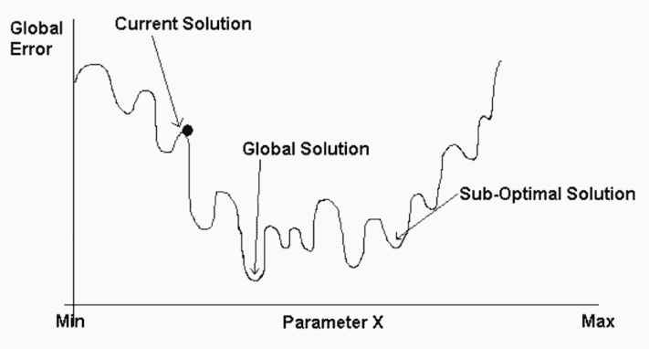
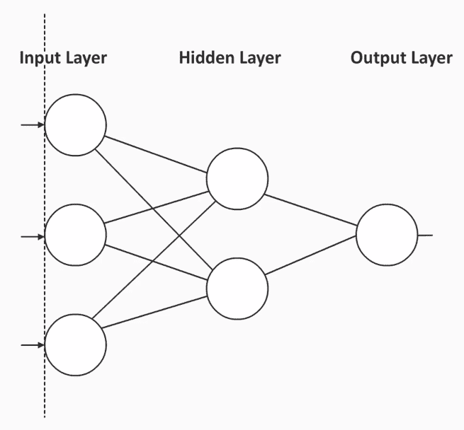
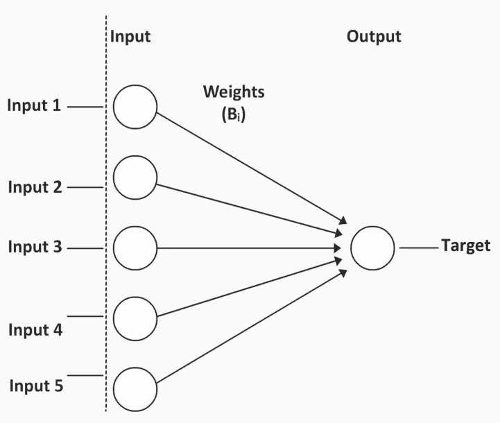
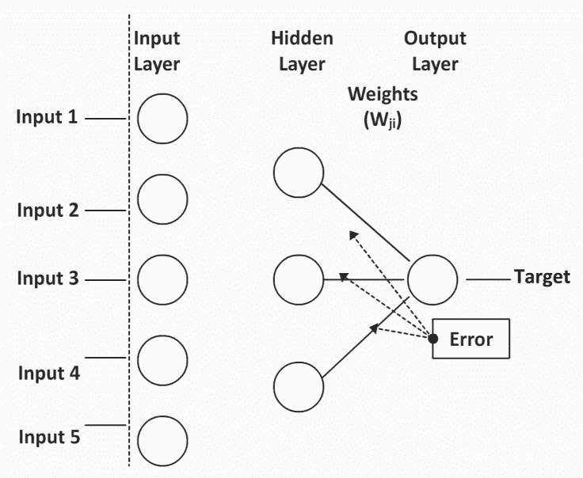

# 一、机器学习预测模型简介

很大比例的数据挖掘机会涉及机器学习，这些机会往往伴随着更大的经济回报。本章将为您提供将机器学习的力量引入数据挖掘工作所需的基础知识。在这一章中，我们将讨论机器学习模型的特征，并查看这些模型的一些示例。

以下是我们将在本章中涉及的主题:

*   机器学习预测模型的特征
*   机器学习预测模型的类型
*   使用神经网络
*   一个样本神经网络模型

# 机器学习预测模型的特征

了解机器学习预测模型的特征将有助于您了解与任何统计或决策树模型相比的优势和局限性。

让我们来了解一下机器学习中预测模型的一些特征:

*   **优化学习复杂模式**:机器学习模型被设计为优化学习复杂模式。与统计模型或决策树模型相比，当您的数据中有非常复杂的模式时，预测模型会非常出色。
*   **考虑交互和非线性关系**:机器学习预测模型可以比决策树模型更好地考虑数据中的交互和非线性关系。
*   **假设很少**:这些模型很强大，因为它们的假设很少。它们也可以用于不同类型的数据。
*   **黑盒模型的解释不简单**:预测模型是黑盒模型，这是预测机器学习模型的缺点之一，因为这意味着解释不简单。这意味着，如果我们最终建立了许多不同的方程并将它们组合起来，就很难准确地看到这些变量中的每一个是如何相互作用并影响输出变量的。因此，当谈到预测准确性时，预测机器学习模型是很好的，但对于理解预测背后的机制来说，它们不是那么好。

如果你想预测什么，这些模型做得相当好，并且有惊人的准确性。但是，如果你想知道为什么会预测某个东西，如果你希望在实现中做一些改变，这样你就不会得到一个特定的预测，那么就很难破译。

# 机器学习预测模型的类型

以下是一些不同类型的机器学习预测模型:

*   神经网络
*   支持向量机
*   随机森林
*   朴素贝叶斯算法
*   梯度推进算法
*   k-最近邻
*   自学习响应模型

我们不会涵盖所有这些，但我们将重点关注一个非常有趣的模型——神经网络。在下面的章节中，我们将深入了解什么是神经网络。

# 使用神经网络

神经网络最初是为了理解大脑如何运作而开发的。最初用于神经科学和语言学领域。

在这些领域中，研究人员注意到环境中发生了一些事情(输入)，个体对信息进行处理(在大脑中)，然后以某种方式做出反应(输出)。

所以，神经网络背后的想法是，它们将充当大脑，就像一个黑匣子。然后，我们必须努力弄清楚发生了什么，以便能够应用这些发现。

# 神经网络的优势

以下是使用神经网络的优点:

*   适用于多种类型的问题:它们可以很好地解决你可能遇到的大多数复杂问题。
*   **他们概括得很好**:准确的概括是一个很重要的特点。
*   **它们非常常见**:神经网络在当今世界已经变得非常普遍，它们很容易被接受并用于解决现实世界的问题。
*   **对它们的了解很多**:由于神经网络的普及，很多研究正在不同领域成功地进行和实施，因此有很多关于神经网络的信息。
*   **适用于非聚类数据**:当你有非聚类数据时，神经网络可以用在几种情况下，比如数据本身非常复杂的地方，你有很多交互的地方，或者你有非线性关系的地方；对于这种情况，神经网络无疑是非常强大和非常稳健的解决方案。

# 神经网络的缺点

好的模型是以一些缺点为代价的:

*   **它们需要时间来训练**:神经网络确实需要很长时间来训练；它们通常比线性回归模型或决策树模型慢，因为这些模型基本上只传递一次数据，而使用神经网络，您实际上会经历许多许多次迭代。
*   **不保证最佳解决方案**:不保证你能找到最佳解决方案。这也意味着，除了通过多次迭代运行单个神经网络之外，您还需要使用不同的起点运行它多次，以便您可以尝试接近最佳解决方案。
*   黑盒:正如我们之前讨论的，很难解释是什么给出了特定的输出以及如何给出的。

# 代表错误

在构建我们的神经网络时，我们的实际目标是构建可能的最佳解决方案，而不是陷入次优方案。我们需要多次运行神经网络。

以此误差图为例:

这是一个描述不同解决方案中误差量的图表。**全局解决方案**是可能的最佳解决方案，并且确实是最优的。一个**次优解决方案**是一个终止、停滞、不再改进的解决方案，但它不是真正的最佳解决方案。

# 神经网络模型的类型

有不同类型的神经网络可供我们使用；在本节中，我们将深入了解这些问题。

# 多层感知器

最常见的类型叫做**多层感知器模型**。这个神经网络模型由用圆圈表示的神经元组成，如下图所示。这些神经元被组织成层:

每个多层感知器模型至少有三层:

*   **输入层**:该层由我们数据中的所有预测器组成。
*   **输出层**:由结果变量组成，也称为**因变量**或**目标变量**。
*   隐藏层:这一层是你最大化神经网络能力的地方。在这一层还可以创建非线性关系，所有复杂的交互都在这里进行。你可以有许多这样的隐藏层。

您还会注意到，在上图中，一个层中的每个神经元都与下一层中的每个神经元相连。这就形成了连接，每条连接线都会有一个与之相关的权重。这些权重将在模型中形成不同的方程。

# 为什么重量很重要？

重量很重要，原因有几个。首先，因为一层中的所有神经元都与下一层中的每个神经元相连，这意味着这些层是相连的。这也意味着一个神经网络模型，不像许多其他模型，不会丢弃任何预测器。例如，你可能从 20 个预测值开始，这 20 个预测值将被保留。权重之所以重要的第二个原因是它们提供了关于每个预测因子对预测的影响或重要性的信息。如稍后将示出的，这些权重开始时是随机的，然而通过多次迭代，权重被修改以提供有意义的信息。

# 多层感知器模型的示例表示

这里，我们将看一个多层感知器模型的例子。我们将尝试根据个人的**年龄**、**收入**和**性别**来预测特定商品的潜在买家。

例如，考虑以下情况:

如您所见，我们形成**输入层**的输入预测因子是**年龄**、**收入**和**性别**。构成我们**输出层**的结果变量是**购买**，它将决定某人是否购买了一件产品。有一个隐藏层，输入预测值最终在这里组合。

为了更好地理解神经网络模型背后发生的事情，让我们来看看线性回归模型。

# 线性回归模型

让我们借助一个例子来理解线性回归模型。

请考虑以下情况:

在线性回归中，**输入层**中的每个输入预测值都通过单个连接权重连接到结果字段，也称为**系数**，这些系数通过数据的单次传递进行估计。系数的数量将等于预测值的数量。这意味着每个预测值都有一个相关的系数。

每个输入预测器都直接连接到目标**上，并以一个特定的系数作为其权重。因此，我们可以很容易地看到输入预测值的一个单位变化对结果变量或**目标**的影响。这些类型的连接使得确定每个预测值对目标变量以及方程的影响变得容易。**

# 一个样本神经网络模型

让我们用一个例子来更详细地理解神经网络:

注意**输入层**中的每个神经元都连接到**隐藏层**中的每个神经元，例如**输入 1** 连接到**隐藏层**中的第一个、第二个甚至第三个神经元。这意味着将有三个不同的权重，并且这些权重将是三个不同等式的一部分。

这是本例中发生的情况:

*   **隐藏层**介于**输入层**和**输出层**之间。
*   隐藏层允许具有非线性关系的更复杂的模型。
*   有许多方程，因此单个预测因子对结果变量的影响通过多种途径发生。
*   对权重的解释不会简单明了。
*   权重对应于变量重要性；它们最初将是随机的，然后它们将经历一系列不同的迭代，并将根据迭代的反馈而改变。然后，它们将具有与可变重要性相关联的真正意义。

那么，让我们继续下去，看看这些权重是如何确定的，以及我们如何才能形成一个功能性的神经网络。

# 前馈反向传播

**前馈反向传播**是一种方法，通过这种方法，我们可以预测权重等事物，并最终预测神经网络的结果。

根据这种方法，预测会出现以下迭代:

*   如果一个预测是正确的，与之相关的权重就会加强。想象一下神经网络说， *H* *ey，你知道吗，我们用这个方程第一部分的权重 0.75 作为第一个预测器，我们得到了正确的预测；这可能是一个很好的起点。*
*   假设预测不正确；误差被反馈或反向传播到模型中，以便修改权重或权重系数，如下所示:

这种反向传播不仅发生在**隐藏层**和**目标层**之间，还会发生在**输入层**:

当这些迭代发生时，我们实际上通过每次误差传播使我们的神经网络变得越来越好。现在，这种连接使得神经网络能够学习数据中的不同模式。

因此，与任何线性回归或决策树模型不同，神经网络试图学习数据中的模式。如果有足够的时间来学习这些模式，神经网络结合其经验，可以更好地理解和预测，在很大程度上提高准确率。

# 模范训练伦理

在训练神经网络模型时，不要用整个数据集来训练模型。出于测试目的，我们需要保留一些数据。这将允许我们测试神经网络是否能够将它从训练数据集学到的东西应用到新数据。

我们希望神经网络能够很好地归纳新数据，并捕捉不同类型数据的共性，而不仅仅是使其成为特定样本的细微差别。相反，我们希望结果也能转换成新数据。模型定型后，可以使用模型的经验预测新数据。

# 摘要

我希望你现在清楚机器学习预测模型，并理解基本概念。在本章中，我们已经看到了机器学习预测模型的特征，并了解了一些不同的类型。这些概念是后续章节的踏脚石。我们还看了一个基本神经网络模型的例子。在下一章，我们将在一个数据集上实现一个活的神经网络，你也将被介绍到支持向量机及其实现。