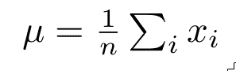

# 一、机器学习和统计科学简介

机器学习无疑是近年来谈论最多的领域之一，这是有充分理由的。每天都有新的应用和模型被发现，世界各地的研究人员每天都在宣布结果质量方面令人印象深刻的进步。

每天，许多新的从业者决定参加课程并搜索介绍性材料，以便他们可以使用这些新的可用技术来改进他们的应用。但在许多情况下，正如文献中通常解释的那样，整个机器学习语料库需要对数学概念的良好理解作为先决条件，因此对通常具有良好算法技能但不太熟悉更高级数学概念的程序员设置了很高的门槛。

这第一章将是该领域的一般介绍，涵盖机器学习的主要研究领域，并将提供基本统计、概率和微积分的概述，并附有源代码示例，允许您使用提供的公式和参数进行实验。

在第一章中，您将学习以下主题:

*   什么是机器学习？
*   机器学习领域
*   统计和概率基础
*   微积分基础

我们周围的世界提供了大量的数据。在基本层面上，我们不断地从文本、图像、声音和我们周围的其他类型的信息中获取和学习。因此，数据的可用性是获得执行任务的技能的第一步。

世界上无数的计算设备收集并存储大量基于图像、视频和文本的信息。因此，学习的原始材料显然是丰富的，而且是以计算机可以处理的格式提供的。

这是本书讨论的学科兴起的起点:研究允许计算机在没有明确编程的情况下从数据中学习的技术和方法。

来自*汤姆·米切尔*的机器学习的更正式定义如下:

如果一个计算机程序在某类任务 T 和性能测量 P 上的性能(由 P 测量)随着经验 E 而提高，则称它从经验 E 中学习。

这个定义是完整的，并且恢复了在每个机器学习项目中起作用的元素:要执行的任务、连续的实验以及清晰和适当的性能测量。简而言之，我们有一个程序，它基于经验并在一定标准的指导下，改进了执行任务的方式。


# 更大范围内的机器学习

机器学习作为一门学科并不是一个孤立的领域——它被框定在一个更广阔的领域内，**人工智能** ( **AI** )。但是你可以猜到，机器学习并不是凭空出现的。作为一门学科，它有自己的前身，并在以下四个明显不同的步骤中以越来越复杂的阶段发展:

1.  机器学习的第一个模型涉及基于规则的决策和简单的基于数据的算法，其本身包括所有可能的分支和决策规则，这意味着所有可能的选项都将由该领域的专家事先硬编码到模型中。自 1950 年第一批编程语言出现以来，这种结构在开发的大多数应用中都得到了实现。这种算法处理的主要数据类型和函数是布尔型，因为它专门处理是或否决策。

2.  在统计推理的第二个发展阶段，我们开始让数据的概率特征有发言权，除了之前预先设置的选择。这更好地反映了现实世界问题的模糊性，在这种情况下，离群值是常见的，考虑数据的不确定性趋势比固定问题的僵化方法更重要。这个学科增加了数学工具元素的混合**贝叶斯概率理论**。属于这一类别的方法包括曲线拟合(通常是线性的或多项式的)，它具有处理数字数据的共同特性。
3.  机器学习阶段是我们将在整本书中工作的领域，它涉及比前一阶段最简单的贝叶斯元素更复杂的任务。
    机器学习算法最突出的特点是，它们可以从数据中归纳出模型，但模型能够生成自己的特征选择器，这些选择器不受刚性目标函数的限制，因为它们是随着训练过程的发展而生成和定义的。这种模型的另一个不同之处是，它们可以接受多种数据类型作为输入，比如语音、图像、视频、文本和其他可以用向量表示的数据。
4.  人工智能是抽象能力规模的最后一步，在某种程度上，它包括了所有以前的算法类型，但有一个关键区别:人工智能算法能够应用学到的知识来解决训练期间从未考虑过的任务。该算法处理的数据类型甚至比机器学习支持的数据类型更通用，根据定义，它们应该能够将解决问题的能力从一种数据类型转移到另一种数据类型，而无需对模型进行完全的重新训练。以这种方式，我们可以开发用于黑白图像中的对象检测的算法，并且该模型可以提取知识以将该模型应用于彩色图像。

在下图中，我们代表了真正的人工智能应用的四个发展阶段:


# 机器学习的类型

让我们试着从实现者的角度，从先前知识的等级开始，剖析不同类型的机器学习项目。该项目可以是以下类型:

*   **监督学习**:在这种类型的学习中，我们被给予一组真实数据的样本，伴随着模型应用后应该给我们的结果。在统计方面，我们有所有训练集实验的结果。
*   **无监督学习:**这种类型的学习只提供来自问题域的样本数据，但是对相似数据进行分组并应用类别的任务没有可以从中进行推断的先前信息。
*   **强化学习:**这种类型的学习没有带标签的样本集，有不同数量的参与元素，包括代理、环境和学习最佳政策或一组步骤，通过使用奖励或惩罚(每次尝试的结果)最大化目标导向的方法。

请看下图:


机器学习的主要领域


# 监督等级

学习过程支持监督领域的渐进步骤:

*   无监督学习没有任何样本的类或值的先验知识，它应该自动推断它。
*   半监督学习需要已知样本的种子，并且模型从该种子推断剩余的样本类别或值。
*   监督学习:这种方法通常包括一组已知样本，称为训练集，另一组用于验证模型的泛化能力，第三组称为测试集，在训练过程之后使用，以获得训练集之外的独立数量的样本，并保证测试的独立性。

在下图中，描述了提到的方法:


无监督、半监督和监督学习的训练技术的图形描述


# 监督学习策略——回归与分类

这种类型的学习需要解决以下两类主要问题:

*   **回归问题**:这种类型的问题接受来自问题领域的样本，并在训练模型后，通过将输出与真实答案进行比较来最小化误差，这允许在给定新的未知样本时预测正确的答案
*   **分类问题**:这类问题使用领域中的样本给新的未知样本分配一个标签或组


# 无人监督的问题解决–聚类

绝大多数无监督的问题解决包括通过查看相似性或观察项目的共享特征的值来对项目进行分组，因为没有关于*a*先验类的确定信息。这种技术被称为聚类。

除了这些主要的问题类型，还有两者的混合，这被称为半监督问题解决，其中我们可以训练一组标记的元素，也可以在训练期间使用推理将信息分配给未标记的数据。为了将数据分配给未知实体，使用三个主要标准-平滑度(彼此接近的点属于同一类)、聚类(数据倾向于形成聚类，平滑度的特殊情况)和流形(数据属于比原始域低得多的维数的流形)。


# 行业工具——编程语言和库

由于这本书是面向开发者的，我们认为使用真实代码解释数学概念的方法是自然而然的。

在为代码示例选择编程语言时，第一种方法是使用多种技术，包括一些先进的库。咨询社区后，很明显，在解释这些概念时，简单的语言是更可取的。

在这些选项中，理想的候选语言应该是一种简单易懂的语言，采用真实世界的机器学习，并且也是相关的。

这项任务最明确的候选人是 Python，它满足了所有这些条件，特别是在最近几年，它已经成为机器学习的首选语言，无论是新手还是专业从业者。

在下图中，我们比较了机器学习编程语言领域的前一颗明星 R，我们可以清楚地得出使用 Python 的巨大有利趋势。这意味着你在本书中获得的技能在现在和可预见的未来都是相关的:


机器学习领域中 R 和 Python 的兴趣图。

除了 Python 代码，我们还将获得 Python 生态系统中许多最著名的数字、统计和图形库的帮助，即 pandas、NumPy 和 matplotlib。对于**深度神经网络**示例，我们将使用 Keras 库，以 TensorFlow 作为后端。


# Python 语言

Python 是一种通用脚本语言，由荷兰程序员 Guido Van Rossum 于 1989 年创建。它拥有非常简单的语法和很强的可扩展性，这要归功于它众多的扩展库，使它成为一种非常适合原型开发和一般编码的语言。由于其本机 C 绑定，它也可以成为生产部署的候选。

除了作为通用的脚本工具使用之外，这种语言实际上被用在各种领域，从 web 开发到科学计算。


# NumPy 图书馆

如果我们必须为这本书选择一个明确的必须使用的库，以及一个用 Python 编写的非平凡的数学应用，它必须是 NumPy。该库将帮助我们实现使用统计和线性代数例程的应用，包括以下组件:

*   一个通用的高性能 N 维数组对象
*   许多数学函数可以无缝地应用于这些阵列
*   线性代数原语
*   随机数分布和强大的统计软件包
*   兼容所有主要的机器学习包

NumPy 库将在本书中广泛使用，使用它的许多原语来简化代码的概念解释。


# matplotlib 库

数据绘图是数据科学不可或缺的一部分，通常是分析人员了解所提供的数据集的第一步。

出于这个原因，我们需要一个非常强大的库来绘制输入数据，并表示结果输出。在本书中，我们将使用 Python 的 matplotlib 库来描述概念和模型的结果。


# matplotlib 是什么？

Matplotlib 是一个广泛使用的绘图库，特别是为 2D 图形设计的。从这个库中，我们将重点使用`pyplot`模块，它是 matplotlib 的 API 的一部分，具有类似 MATLAB 的方法，直接支持 NumPy。对于那些不熟悉 MATLAB 的人来说，几十年来，它一直是科学和工程领域的默认数学笔记本环境。

所描述的方法将用于说明所涉及的大部分概念，事实上，读者将能够仅使用这两个库并使用所提供的代码来生成本书中的许多示例。


# 熊猫

**Pandas** 用一种特殊的结构补充了前面提到的库，称为`DataFrame`，还为许多不同的格式添加了许多统计和数据处理方法，如 I/O，如切片、子集化、处理缺失数据、合并和整形等。

`DataFrame`对象是整个库最有用的特性之一，它提供了一个特殊的 2D 数据结构，其中的列可以是不同的数据类型。它的结构非常类似于数据库表，但沉浸在灵活的编程运行时和生态系统中，如 SciPy。这些数据结构也与 NumPy 矩阵兼容，因此我们也可以用最少的努力对数据应用高性能的操作。


# SciPy

**SciPy** 是一堆非常有用的科学 Python 库，包括 NumPy、pandas、matplotlib 等，但它也是生态系统的核心库，利用它我们还可以执行许多附加的基本数学运算，如积分、优化、插值、信号处理、线性代数、统计和文件 I/O


# Jupyter 笔记本

**Jupyter** 是一个成功的基于 Python 项目的明显例子，也是我们将用来通过代码探索和理解数据的最强大的设备之一。

Jupyter 笔记本是由代码、图形或格式化文本的交织单元组成的文档，从而形成了一个非常通用和强大的研究环境。所有这些元素都封装在一个方便的 web 界面中，该界面与 **IPython** 交互式解释器进行交互。

加载 Jupyter 笔记本后，整个环境和所有变量都在内存中，可以更改和重新定义，允许进行研究和实验，如下面的屏幕截图所示:


Jupyter 笔记本

该工具将是本书教学过程的重要组成部分，因为大多数 Python 示例将以这种格式提供。在本书的最后一章，你会找到完整的安装说明。

安装后，你可以用 cd 进入笔记本所在的目录，然后通过输入`jupyter notebook`调用 Jupyter


# 基本数学概念

正如我们在前面几节中看到的，这本书的主要目标读者是希望了解机器学习算法的开发人员。但是，为了真正掌握背后的动机和原因，有必要回顾和建立所有的基本推理，包括统计，概率和微积分。

我们将首先从统计学的一些基础知识开始。


# 统计学——不确定性建模的基本支柱

统计学可以定义为使用数据样本来提取和支持关于更大数据样本的结论的学科。鉴于机器学习包含了数据属性研究和数据赋值的很大一部分，我们将使用许多统计概念来定义和证明不同的方法。


# 描述性统计-主要操作

在下面的章节中，我们将开始定义统计学科的基本操作和测量，以便能够从基本概念开始。


# 平均

这是统计学中最直观、最常用的概念之一。给定一组数，该组数的平均值是所有元素之和除以该组中元素的个数。

表示平均值的公式如下:



虽然这是一个非常简单的概念，但我们将编写一个 Python 代码示例，其中我们将创建一个样本集，将其表示为一个线图，并将整个集的平均值标记为一条线，该线应该位于样本的加权中心。它将作为 Python 语法的介绍，也是一种体验 Jupyter 笔记本的方式:

```py
    import matplotlib.pyplot as plt #Import the plot library 

    def mean(sampleset):  #Definition header for the mean function 
        total=0 
        for element in sampleset: 
            total=total+element 
        return total/len(sampleset) 

    myset=[2.,10.,3.,6.,4.,6.,10.]  #We create the data set 
    mymean=mean(myset) #Call the mean funcion 
    plt.plot(myset)  #Plot the dataset 
    plt.plot([mymean] * 7)  #Plot a line of 7 points located on the mean 
```

该程序将输出数据集元素的时间序列，然后在平均高度处画一条线。

如下图所示，平均值是描述样本集趋势的一种简洁(单值)方式:


在第一个例子中，我们使用了非常相似的样本集，因此平均值提供了非常丰富的信息。但是，让我们用一个非常分散的样本集来尝试相同的样本(我们鼓励您也使用这些值):


# 差异

正如我们在第一个例子中看到的，平均值不足以描述非均匀或非常分散的样本。

为了添加描述样本集值分散程度的唯一值，我们需要了解方差的概念，它需要样本集的平均值作为起点，然后对样本与所提供平均值的距离进行平均。方差越大，样本集越分散。

方差的规范定义如下:


让我们编写下面的示例代码片段来说明这个概念，采用以前使用的库。为了清楚起见，我们重复了`mean`函数的声明:

```py
    import math #This library is needed for the power operation 
    def mean(sampleset):  #Definition header for the mean function 
        total=0 
        for element in sampleset: 
            total=total+element 
        return total/len(sampleset) 

    def variance(sampleset):  #Definition header for the mean function 
        total=0 
        setmean=mean(sampleset) 
        for element in sampleset: 
            total=total+(math.pow(element-setmean,2)) 
        return total/len(sampleset) 

    myset1=[2.,10.,3.,6.,4.,6.,10.]  #We create the data set 
    myset2=[1.,-100.,15.,-100.,21.] 
    print "Variance of first set:" + str(variance(myset1)) 
    print "Variance of second set:" + str(variance(myset2)) 

```

上述代码将生成以下输出:

```py
    Variance of first set:8.69387755102
    Variance of second set:3070.64
```

如你所见，第二组的方差要高得多，给出了真正分散的值。我们计算平方距离的平均值的事实有助于真正概括差异，因为这是一个二次运算。


# 标准偏差

标准差只是一种调整方差中使用的均方差的平方性质的方法，有效地线性化了这一项。这种方法对于其他更复杂的操作也很有用。

这是标准差的正式形式:


# 概率和随机变量

我们现在要学习理解这本书所有概念所需的最重要的一门学科。

**概率**是一门数学学科，主要职业是研究随机事件。在一个更实际的定义中，概率通常试图从可能发生的事件中量化与事件相关的确定性(或者相反，不确定性)的水平。


# 事件

为了理解概率，我们首先需要定义事件。给定一个实验，在这个实验中，我们执行一个确定的动作，有不同的可能结果，事件是这个实验所有可能结果的子集。

事件的例子是特定的骰子数字出现，以及特定类型的产品缺陷出现在装配线上。


# 可能性

根据前面的定义，概率是事件发生的可能性。概率被量化为一个在 *0* 和 *1* 之间的实数，当事件发生的可能性增加时，分配的概率 *P* 向 *1* 增加。

事件发生概率的数学表达式是`P(E)`。


# 随机变量和分布

在分配事件概率时，我们也可以尝试覆盖整个样本，并为样本域的每个可能结果分配一个概率值。

这个过程确实具有一个函数的所有特征，因此我们将有一个随机变量，它对每一个可能的事件结果都有一个值。我们称这个函数为随机函数。

这些变量可以是以下两种类型:

*   **离散**:如果结果的数量是有限的，或者是可数的无限
*   **连续**:如果结果集属于连续区间

这个概率函数也被称为**概率分布**。


# 有用的概率分布

在多种可能的概率分布中，有许多函数因其特殊性质或它们所代表的普遍问题而被研究和分析。

我们将描述对机器学习的发展有特殊影响的最常见的方法。


# 伯努利分布

让我们从一个简单的分布开始:一个有二进制结果的分布，非常像投掷一枚(公平的)硬币。

这个分布代表一个单一事件，它取值为 *1* (姑且称之为*正面*)，概率为 *p* ，取 *0* (姑且称之为*反面*)，概率为 *1-p* 。

为了形象化这一点，让我们使用`np`生成大量伯努利分布的事件，并绘制该分布的趋势，只有以下两种可能的结果:

```py
    plt.figure() 
    distro = np.random.binomial(1, .6, 10000)/0.5 
    plt.hist(distro, 2 , normed=1) 
```

下图通过直方图显示了二项式分布，显示了结果概率的互补性质:


二项分布

所以，在这里我们看到了可能结果的互补概率的非常明显的趋势。现在让我们用更多可能的结果来补充这个模型。当它们的数目大于 2 时，我们讨论的是一个**多项式分布**:

```py
    plt.figure()
    distro = np.random.binomial(100, .6, 10000)/0.01 
    plt.hist(distro, 100 , normed=1) 
    plt.show() 
```

请看下图:


有 100 种可能结果的多项式分布


# 均匀分布

这个非常常见的分布是我们将看到的第一个连续分布。顾名思义，对于定义域的任何区间，它都有一个恒定的概率值。

为了积分到 1， *a* 和 *b* 为函数的极值，这个概率的值为 *1/(b-a)* 。

让我们使用非常规则的直方图生成一个样本均匀分布图，如以下代码所示:

```py
    plt.figure() 
    uniform_low=0.25 
    uniform_high=0.8 

    plt.hist(uniform, 50, normed=1) 
    plt.show() 
```

请看下图:


均匀分布


# 正态分布

这种非常常见的连续随机函数，也称为**高斯** **函数**，可以用均值和方差的简单度量来定义，尽管形式有些复杂。

这是函数的标准形式:


看看下面的代码片段:

```py
    import matplotlib.pyplot as plt #Import the plot library 
    import numpy as np 
    mu=0\. 
    sigma=2\. 
    distro = np.random.normal(mu, sigma, 10000) 
    plt.hist(distro, 100, normed=True) 
    plt.show() 
```

下图显示了生成的分布直方图:


正态分布


# 配送

这种分布与正态分布相似，但在形态上有所不同，尾部更长。这个分布的主要重要性在于它的**累积分布函数** ( **CDF** )，我们将在接下来的章节中使用它，而且看起来肯定很熟悉。

让我们首先使用下面的代码片段来表示基本分布:

```py
    import matplotlib.pyplot as plt #Import the plot library 
    import numpy as np 
    mu=0.5 
    sigma=0.5 
    distro2 = np.random.logistic(mu, sigma, 10000) 
    plt.hist(distro2, 50, normed=True) 
    distro = np.random.normal(mu, sigma, 10000) 
    plt.hist(distro, 50, normed=True) 
    plt.show() 
```

请看下图:


逻辑(红色)与正态(蓝色)分布

然后，如前所述，让我们计算逻辑分布的 CDF，这样您将看到一个非常熟悉的图形，即**s**igmoid 曲线，我们将在回顾神经网络激活函数时再次看到它:

```py
    plt.figure() 
    logistic_cumulative = np.random.logistic(mu, sigma, 10000)/0.02 
    plt.hist(logistic_cumulative, 50, normed=1, cumulative=True) 
    plt.show() 
```

请看下图:


逻辑分布的逆分布


# 概率函数的统计度量

在本节中，我们将看到可以应用于概率的最常见的统计方法。第一个度量是均值和方差，这与我们在统计学导论中看到的定义没有什么不同。


# 歪斜

该度量代表横向偏差，或一般来说，从中心的偏差，或概率分布的对称性(或缺乏对称性)。一般来说，如果偏斜度为负，则意味着向右偏移，如果偏斜度为正，则意味着向左偏移:


请看下图，它描绘了偏斜度统计分布:


描述分布形状如何影响偏斜度。


# 峭度

**峰度**让我们了解分布的中心集中度，定义中心区域的尖锐程度，或者相反——函数尾部的分布程度。

峰度的公式如下:


在下图中，我们可以清楚地看到如何直观地理解我们正在学习的新指标:


描述分布形状如何影响峰度


# 微分学元素

涵盖机器学习最起码的基础知识，尤其是梯度下降等学习算法，我们会给大家介绍微分学涉及的概念。


# 初步知识

涵盖梯度下降理论所必需的微积分术语将需要许多章节，因此我们将假设您已经理解了最著名的连续函数的性质的概念，例如**线性**、**二次**、**对数**和**指数**，以及**极限**的概念。

为了清楚起见，我们将发展一元函数的概念，然后简单地扩展到多元函数。


# 寻求变化——衍生品

在上一节中，我们建立了函数的概念。除了在整个定义域中定义的常数函数之外，所有函数都有某种值动态。这意味着 *f(x1)* 与 *f(x2)* 对于 *x* 的某些确定值是不同的。

微分学的目的是测量变化。为了这个特定的任务，17 世纪的许多数学家(莱布尼茨和牛顿是最杰出的倡导者)努力寻找一个简单的模型来测量和预测一个符号定义的函数如何随时间变化。

这项研究将该领域引向了一个奇妙的概念——一个符号化的结果，在一定条件下，它告诉你一个函数在某一点上变化了多少以及向哪个方向变化。这是导数的概念。


# 在斜坡上滑行

如果我们想测量一个函数如何随时间变化，第一个直观的步骤是获取一个函数的值，然后在下一个点测量它。从第一个值中减去第二个值，我们就可以知道函数随时间变化的程度:

```py
    import matplotlib.pyplot as plt 
    import numpy as np 
     %matplotlib inline 

    def quadratic(var): 
        return 2* pow(var,2) 
    x=np.arange(0,.5,.1) 
    plt.plot(x,quadratic(x)) 
    plt.plot([1,4], [quadratic(1), quadratic(4)],  linewidth=2.0) 
    plt.plot([1,4], [quadratic(1), quadratic(1)],  linewidth=3.0, 
    label="Change in x") 
    plt.plot([4,4], [quadratic(1), quadratic(4)],  linewidth=3.0, 
    label="Change in y") 
    plt.legend() 
    plt.plot (x, 10*x -8 ) 
    plt.plot() 
```

在前面的代码示例中，我们首先定义了一个示例二次方程(`2*x²` *)* ，然后定义了我们将使用`arange`函数的域部分(从`0`到`0.5`，在`0.1`步骤中)。

然后，我们定义一个测量 *y* 在 *x* 上的变化的间隔，并画出表示该测量的线，如下图所示:


实施差异化的初始设置的初步描述

在这种情况下，我们在 *x=1* 和 *x=4* 处测量函数，并将该区间的变化率定义如下:


应用该公式，样本的结果为 *(36-0)/3= 12* 。

这种初始方法可以作为一种近似测量这种动态的方式，但它太依赖于我们进行测量的点，并且必须在我们需要的每个间隔进行测量。

为了更好地理解函数的动态特性，我们需要能够定义和测量函数域中每一点的瞬时变化率。

这种瞬时变化的想法给我们带来了减少域的 *x* 值之间的距离的需要，这些值是在它们之间距离非常短的点上取得的。我们将用初始值 *x、*和后续值*x+δx*来制定这种方法:


在下面的代码中，我们对差异进行近似，逐渐减少*δx*:

```py
    initial_delta = .1 
    x1 = 1  
    for power in range (1,6): 
        delta = pow (initial_delta, power) 
        derivative_aprox= (quadratic(x1+delta) - quadratic (x1) )/ 
        ((x1+delta) - x1 ) 
        print "del    ta: " + str(delta) + ", estimated derivative: " + 
        str(derivative_aprox)  
```

在前面的代码中，我们首先定义了一个初始增量，这带来了一个初始近似值。然后，我们应用差值函数，delta 值递减，感谢我们用递增的功率给`0.1`供电。我们得到的结果如下:

```py
    delta: 0.1, estimated derivative: 4.2 
    delta: 0.01, estimated derivative: 4.02 
    delta: 0.001, estimated derivative: 4.002 
    delta: 0.0001, estimated derivative: 4.0002 
    delta: 1e-05, estimated derivative: 4.00002 
```

随着间隔的减小，很明显变化率将在`4`附近徘徊。但是这个过程什么时候停止呢？事实上，我们可以说这个过程可以无限延续下去，至少在数字意义上是如此。

这就是极限概念直观出现的时候。然后，我们将定义这个使δ无限变小的过程，并将它称为 *f(x)* 或*f’(x)*的导数:


这是导数的正式定义。

但是数学家们并没有止步于这些繁琐的计算，进行了大量的数值运算(这些运算大多是 17 世纪的手工完成的)，还想进一步简化这些运算。

如果我们执行另一个步骤，可以象征性地定义一个函数的导数，会怎么样？

这就需要建立一个函数，给出相应函数的导数，只需替换`x`变量值。17 世纪，不同的函数族也迈出了巨大的一步，首先是抛物线 *(y=x ² +b)* ，然后是更复杂的函数:


# 链式法则

函数导数的符号确定的一个非常重要的结果是链式法则。这个公式由莱布尼茨在 1676 年的一篇论文中首次提到，它使得以一种非常简单而优雅的方式求解复合函数的导数成为可能，简化了非常复杂函数的求解。

为了定义链式法则，如果我们假设一个函数 *f* ，它被定义为另一个函数 *g* ， *f(g(x))* 的函数 *F* ，导数可以定义如下:


链式法则的公式允许我们区分其输入值依赖于另一个函数的公式。这与搜索与前一个函数相关联的函数的变化率是一样的。链规则是在神经网络的训练阶段采用的主要理论概念之一，因为在那些分层结构中，第一神经元层的输出将是下一层的输入，结果，给出一个复合函数，该复合函数在大多数情况下具有不止一个嵌套层。


# 偏导数

到目前为止，我们一直在使用单变量函数，但从现在开始，我们将主要使用多变量函数，因为数据集将包含不止一列，每一列都代表一个不同的变量。

在许多情况下，我们需要知道函数在只有一个维度的关系中是如何变化的，这将涉及查看数据集的一列如何影响函数变化的总数。

偏导数的计算包括将已知的求导规则应用于多元函数，考虑到变量不是作为常数导出的。

看看下面的幂法则:

*f(x，y) = 2x ³ y*

当这个函数相对于 *x* 求导时，考虑到 *y* 为常数，我们可以将其改写为 *3。2 y x ²* ，对变量 *x* 求导，我们可以得到下面的导数:

*d/dx (f(x，y))= 6y * x²*

使用这些技术，我们可以继续进行更复杂的多元函数，这将是我们的特征集的一部分，通常由两个以上的变量组成。


# 摘要

在本章中，我们学习了许多不同的概念元素，包括一些基本数学概念的概述，这些概念是机器学习概念的基础。

当我们正式解释不同建模方法的机制时，这些概念将是有用的，我们鼓励你在阅读这些章节之前和阅读过程中尽可能地提高对它们的理解，以便更好地掌握算法是如何工作的。

在下一章中，我们将快速概述机器学习项目的完整工作流程，这将帮助我们理解所涉及的各种元素，从数据收集到结果评估。