# 二、学习流程

在第一章中，我们看到了机器学习领域的数学概念、历史和领域的概述。

由于本书旨在提供一种实用但形式上正确的学习方法，现在是时候探索任何机器学习过程的一般思维过程了。这些概念将贯穿整个章节，并将帮助我们定义该领域最佳实践的通用框架。

我们将在本章中讨论的主题如下:

*   理解问题和定义
*   数据集检索、预处理和特征工程
*   模型定义、训练和评估
*   了解结果和指标

每个机器学习问题都有其特殊性。然而，随着时间的推移，随着学科的发展，机器学习过程应该包括什么样的步骤，以及它们的最佳实践，都有了新的模式。以下部分将列出这些步骤，包括适用情况的代码示例。


# 理解问题

在解决机器学习问题时，提前花时间分析数据和可能的工作量很重要。这个初步的步骤是灵活的，比列表中所有后续的步骤都要简单。

从机器学习的定义中，我们知道我们的最终目标是让计算机从一组样本数据中学习或归纳出某种行为或模型。所以，我们要做的第一件事就是了解我们想要学习的新能力。

在企业领域，这是进行更多实际讨论和头脑风暴的时候。在此阶段，我们可以问自己的主要问题如下:

*   我们试图解决的真正问题是什么？
*   当前的信息管道是什么？
*   我如何简化数据采集？
*   传入的数据是完整的，还是有缺口？
*   为了掌握更多的变量，我们可以合并哪些额外的数据源？
*   数据发布是周期性的，还是可以实时获取？
*   这个特殊问题的最小代表时间单位应该是多少？
*   我试图描述的行为在本质上有变化吗，或者它的基本原理随着时间的推移或多或少是稳定的吗？

理解这个问题需要了解业务知识，并查看所有可能影响模型的有价值的信息源。一旦确定，下面的任务将生成一组有组织有结构的值，这些值将作为我们模型的输入。

让我们来看一个初始问题定义的例子，以及初始分析的思维过程。

假设公司 A 是一家零售连锁店，它希望能够预测特定日期特定产品的需求。这可能是一项具有挑战性的任务，因为它涉及人类行为，其中有一些不确定的成分。

建立这样一个模型需要什么样的数据输入？当然，我们需要这种商品的交易列表。但是如果物品是商品呢？如果项目取决于大豆或面粉的价格，当前和过去的收获量可以丰富模型。如果产品是一个中等级别的项目，当前的通货膨胀和工资变化也可能与当前的收入相关。

理解这个问题涉及到一些业务知识，并希望收集所有可能影响模型的有价值的信息源。从某种意义上来说，它更多的是一种艺术形式，这一点也没有改变它的重要性。

接下来，让我们假设问题的基础已经分析完毕，传入数据和期望输出的行为和特征更加清晰。以下任务将生成一组有组织有结构的值，这些值将作为我们模型的输入。这组数据，经过一个清理和适应的过程，将被称为我们的数据集。


# 数据集定义和检索

一旦我们确定了数据源，下一个任务就是收集所有的元组或记录作为同构集。这种格式可以是表格排列、一系列真实值(如音频或天气变量)和 N 维矩阵(一组图像或云点)以及其他类型。


# ETL 过程

大数据处理领域的前几个阶段在数据挖掘的名义下发展了几十年，然后采用了流行的名称**大数据**。

这些规程的最佳成果之一是对**提取**、**转换**、**加载** ( **ETL** )过程的规范。

这个过程从混合来自业务系统的许多数据源开始，然后转移到将数据转换成可读状态的系统，最后生成一个具有非常结构化和文档化的数据类型的数据集市。

为了应用这个概念，我们将把这个过程的元素与结构化数据集的最终结果混合在一起，该数据集在其最终形式中包括一个附加的标签列(在监督学习问题的情况下)。

下图描述了这一过程:

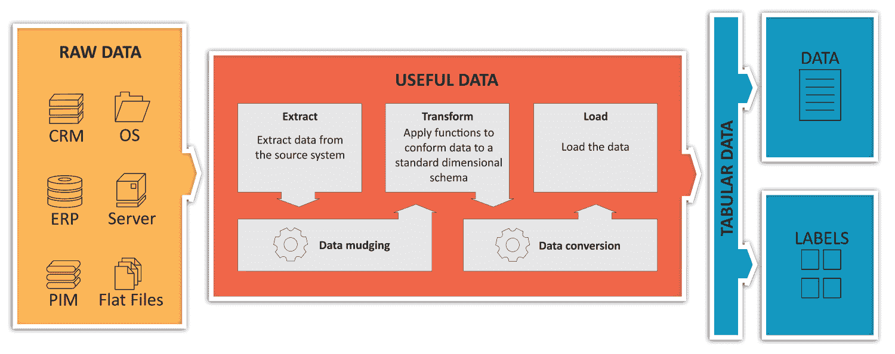

描述 ETL 过程，从原始数据到有用的数据集

该图说明了数据管道的第一阶段，从组织的所有数据开始，无论是商业交易、物联网设备原始值还是其他有价值的数据源信息元素，这些数据通常具有非常不同的类型和组成。ETL 过程负责使用不同的软件过滤器从它们那里收集原始信息，应用必要的转换以有用的方式排列数据，并最终以表格格式呈现数据(我们可以将此视为具有最后一个要素或结果列的单个数据库表，或者具有整合数据的大 CSV 文件)。最终结果可以方便地被后面的过程使用，而不用实际考虑数据格式的许多奇怪之处，因为它们已经被标准化为非常清晰的表结构。


# 使用 SciPy 和 pandas 加载数据集并进行探索性分析

为了对某些类型的数据集格式有一个实际的概述，我们将在这个例子中使用前面介绍的 Python 库(SciPy 和 pandas ),因为它们几乎是通用的。

让我们从导入和执行几种数据集输入格式的简单统计分析开始。

示例数据文件将位于每章代码目录内的数据目录中。


# 与 IPython 交互工作

在本节中，我们将介绍 **Python 交互控制台**，或 **IPython** ，这是一个命令行 shell，允许我们以交互方式探索概念和方法。

要运行 IPython，可以从命令行调用它:

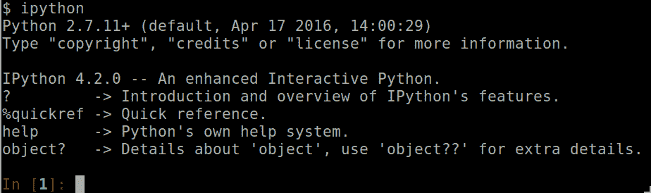

这里我们看到 IPython 正在执行，然后是初始的快速帮助。最有趣的部分是最后一行——它将允许您导入库和执行命令，并将显示结果对象。IPython 的另一个方便的特性是，您可以动态地重新定义变量，以查看不同输入的结果有何不同。

在当前的例子中，我们使用标准的 Python 版本作为编写时最受支持的 Linux 发行版(Ubuntu 16.04)。这些例子对于 Python 3 应该是等价的。

首先，让我们导入 pandas 并加载一个样本`.csv`文件(一种非常常见的格式，每行一行，并注册)。它包含一个非常著名的分类问题数据集，具有 150 个鸢尾属植物实例的属性维度，用一个数字列表示类别(1、2 或 3):

```py
In [1]: import pandas as pd #Import the pandas library with pd alias
```

在这一行中，我们以通常的方式导入 pandas，使它的方法可以与`import`语句一起使用。`as`修饰符允许我们对库中的所有对象和方法使用一个简洁的名称:

```py
In [2]: df = pd.read_csv ("data/iris.csv") #import iris data as dataframe
```

在这一行中，我们使用了`read_csv`方法，允许熊猫猜测`.csv`文件可能的项目分隔符，并将其存储在一个`dataframe`对象中。

让我们对数据集进行一些简单的探索:

```py
In [3]: df.columns
Out[3]:
Index([u'Sepal.Length', u'Sepal.Width', u'Petal.Length', u'Petal.Width',
u'Species'],
dtype='object')

In [4]: df.head(3)
Out[4]:
5.1 3.5 1.4 0.2 setosa
0 4.9 3.0 1.4 0.2 setosa
1 4.7 3.2 1.3 0.2 setosa
2 4.6 3.1 1.5 0.2 setosa
```

我们现在可以看到数据集的列名，并浏览它的前 *n* 个实例。查看第一批寄存器，您可以看到`setosa` iris 类的不同度量。

现在，让我们访问列的特定子集，并显示前三个元素:

```py
In [19]: df[u'Sepal.Length'].head(3)
Out[19]:
0 5.1
1 4.9
2 4.7
Name: Sepal.Length, dtype: float64
```

Pandas 包含许多用于导入表格数据格式的相关方法，比如 HDF5 ( `read_hdf`)、JSON ( `read_json`)和 Excel ( `read_excel`)。有关格式的完整列表，请访问[http://pandas.pydata.org/pandas-docs/stable/io.html](http://pandas.pydata.org/pandas-docs/stable/io.html)和[。](http://pandas.pydata.org/pandas-docs/stable/io.html)

除了这些简单的探索方法，我们现在将使用 pandas 来获得我们已经看到的所有描述性统计概念，以便描述`Sepal.Length`列的分布特征:

```py
#Describe the sepal length column
print "Mean: " + str (df[u'Sepal.Length'].mean())
print "Standard deviation: " + str(df[u'Sepal.Length'].std())
print "Kurtosis: " + str(df[u'Sepal.Length'].kurtosis())
print "Skewness: " + str(df[u'Sepal.Length'].skew())
```

以下是这一分布的主要指标:

```py
Mean: 5.84333333333
Standard deviation: 0.828066127978
Kurtosis: -0.552064041316
Skewness: 0.314910956637
```

现在，我们将通过查看该分布的直方图，以图形方式评估这些指标的准确性，这次使用内置的`plot.hist`方法:

```py
#Plot the data histogram to illustrate the measures
import matplotlib.pyplot as plt
%matplotlib inline
df[u'Sepal.Length'].plot.hist()
```

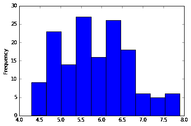

虹膜萼片长度直方图

如度量所示，分布是右偏的，因为偏度是正的，并且它是简单分布的类型(具有远大于 1 的分布)，如峰度度量所示。


# 处理 2D 数据

让我们在这里停下来看看表格数据，然后看看 2D 数据结构。由于图像是流行的机器学习问题中最常用的数据类型，我们将向您展示 SciPy 堆栈中包含的一些有用的方法。

以下代码经过优化，可在内置图形的 Jupyter 笔记本上运行。您将在源文件中找到源代码，`Dataset_IO.pynb`:

```py
import scipy.misc
from matplotlib import pyplot as plt
%matplotlib inline
testimg = scipy.misc.imread("data/blue_jay.jpg")
plt.imshow( testimg)
```

导入单个图像基本上包括导入相应的模块，使用`imread`方法将指示的图像读入一个矩阵，并使用 matplotlib 显示它。`%`起始行对应于一个参数修改，并指示以下`matplotlib`图形应在笔记本上显示，结果如下(轴对应于像素编号):

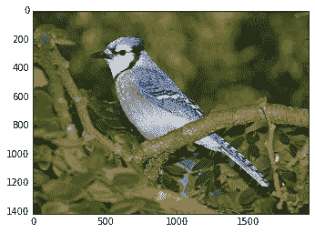

已加载初始 RGB 图像

测试变量将包含一个高度*宽度*通道号数组，其中包含每个图像像素的所有红色、绿色和蓝色值。让我们获取这些信息:

```py
testimg.shape
```

解释器将显示以下内容:

```py
(1416, 1920, 3)
```

我们也可以尝试将通道分开，分别用红色、绿色和蓝色表示，以了解图像中的颜色模式:

```py
plt.subplot(131)
plt.imshow( testimg[:,:,0], cmap="Reds")
plt.title("Red channel")
plt.subplot(132)
plt.imshow( testimg[:,:,1], cmap="Greens")
plt.title("Green channel")
plt.subplot(133)
plt.imshow( testimg[:,:,2], cmap="Blues")
plt.title("Blue channel")
```

在前面的例子中，我们创建了三个子情节，用三位数代码表示结构和位置。第一个指示行号，第二个指示列号，最后一个指示该结构上的绘图位置。`cmap`参数表示分配给每个图形的色彩映射表。

输出如下所示:

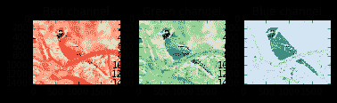

样本图像的分离通道的描述。

请注意，红色和绿色通道共享一个类似的模式，而蓝色调在这个鸟图中占主导地位。这种通道分离可能是在这种鸟的栖息地检测这种鸟的一种非常基本的初步方法。

本节简单介绍了加载数据集的不同方法。在接下来的章节中，我们将看到不同的获取数据集的高级方法，包括加载和训练不同批次的样本集。


# 特征工程

特征工程在某种程度上是机器学习过程中最被低估的部分之一，尽管它被社区中的许多杰出人物视为学习过程的基石。

这个过程的目的是什么？简而言之，它从数据库、传感器、档案等获取原始数据，并以一种使模型易于概括的方式对其进行转换。这个学科从许多来源获取标准，包括常识。这的确更像一门艺术，而不是一门严格的科学。这是一个手动过程，即使它的某些部分可以通过特征提取领域中的一组技术来自动化。

作为这一过程的一部分，我们还拥有许多强大的数学工具和降维技术，如**主成分分析** ( **PCA** )和**自动编码器**，这些工具允许数据科学家跳过那些不会以有用的方式丰富数据表示的功能。


# 缺失数据的插补

当处理不太完美或不完整的数据集时，缺失的寄存器本身可能不会为模型增加价值，但是该行的所有其他元素可能对模型有用。当模型中不完整值的百分比很高时尤其如此，因此不能丢弃任何行。

这个过程中的主要问题是*“你如何解释一个丢失的值？”*方法有很多种，通常取决于问题本身。

假设数据分布的平均值为 0，一个非常简单的方法是将该值设置为零。一个改进的步骤可能是将缺失的数据与周围的内容相关联，分配整个列的平均值，或者相同列的 *n* 个元素的间隔。另一种选择是使用列的中值或最常用值。

此外，还有一些更高级的技术，比如健壮的方法，甚至 k-最近邻，我们不会在本书中讨论。


# 一个热编码

数字或分类信息通常可以很容易地用整数来表示，每个选项或离散结果一个整数。但是存在指示当前选项的`bins`是优选的情况。这种形式的数据表示被称为**一热编码**。这种编码只是将某个输入转换成只包含零的二进制数组，除了由变量值指示的值，该值将是 1。

在整数的简单情况下，这将是列表[1，3，2，4]在一个热编码中的表示:

```py
[[0 1 0 0 0]
 [0 0 0 1 0]
 [0 0 1 0 0]
 [0 0 0 0 1]]
```

为了更好地理解这个概念，让我们对整数数组执行一个简单的 hot integer 编码器实现:

```py
import numpy as np
def get_one_hot(input_vector):
result=[]
for i in input_vector:
 newval=np.zeros(max(input_vector))
 newval.itemset(i-1,1)
 result.append(newval)
 return result
```

在这个例子中，我们首先定义了`get_one_hot`函数，它将一个数组作为输入并返回一个数组。

我们所做的是一个接一个地获取数组的元素，对于其中的每个元素，我们生成一个长度等于数组最大值的零数组，以便为所有可能的值留出空间。然后我们在当前值指示的索引位置插入`1`(我们减去`1`，因为我们从基于 1 的索引到基于 0 的索引)。

让我们试试我们刚刚写的函数:

```py
get_one_hot([1,5,2,4,3])

#Out:
[array([ 1., 0., 0., 0., 0.]),
array([ 0., 0., 0., 0., 1.]),
array([ 0., 1., 0., 0., 0.]),
array([ 0., 0., 0., 1., 0.]),
array([ 0., 0., 1., 0., 0.])]
```


# 数据集预处理

当我们第一次深入研究数据科学时，一个常见的错误是从一开始就期望所有的数据都是非常完美的，并且具有良好的特征。唉，很大一部分情况并非如此，原因有很多，例如空数据、导致异常值和 NAN 的传感器误差、有故障的寄存器、仪器引起的偏差，以及导致模型拟合不佳且必须根除的各种缺陷。

这一阶段的两个关键过程是数据标准化和特征缩放。这个过程包括应用称为**仿射**的简单变换，将当前不平衡的数据映射到更易于管理的形状，保持其完整性，但提供更好的随机属性，并改进未来应用的模型。标准化技术的共同目标是通过以下技术使数据分布更接近正态分布:


# 标准化和特征缩放

数据集预处理的一个非常重要的步骤是归一化和特征缩放。数据规范化允许我们的优化技术，特别是迭代技术，更好地收敛，并使数据更易于管理。


# 规范化或标准化

该技术旨在为数据集提供正态分布的属性，即平均值为 0，标准差为 1。

获取这些属性的方法是根据数据集样本，使用以下公式计算所谓的 *z* 得分:

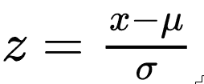

让我们在 scikit-learn 的帮助下想象并实践这一新概念，从`MPG`数据集读取一个文件，该数据集包含基于以下特征的以英里/加仑为单位的城市循环油耗:`mpg`、`cylinders`、`displacement`、`horsepower`、`weight`、`acceleration`、`model year`、`origin`和`car name`。

```py
from sklearn import preprocessing
import pandas as pd
import numpy as np
import matplotlib.pyplot as plt

df=pd.read_csv("data/mpg.csv")
plt.figure(figsize=(10,8))
print df.columns
partialcolumns = df[['acceleration', 'mpg']]
std_scale = preprocessing.StandardScaler().fit(partialcolumns)
df_std = std_scale.transform(partialcolumns)
plt.scatter(partialcolumns['acceleration'], partialcolumns['mpg'], color="grey", marker='^')
plt.scatter(df_std[:,0], df_std[:,1])
```

下图允许我们比较非标准化和标准化的数据表示:

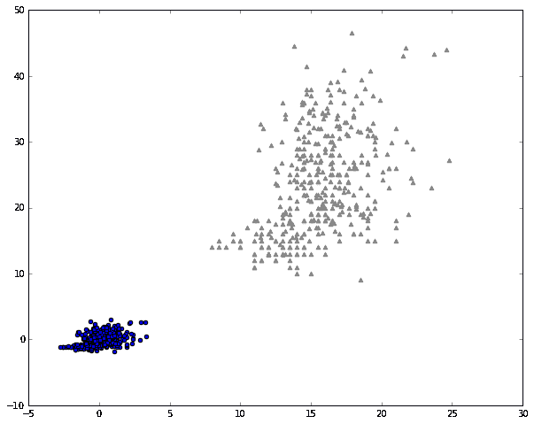

原始数据集及其规范化副本的描述。

在评估时考虑结果数据的反规范化非常重要，这样您就不会丢失数据的代表性，尤其是当模型应用于回归时，如果不进行缩放，回归的数据就没有用了。


# 模型定义

如果我们想用一个词来总结机器学习过程，那肯定是模型。这是因为我们用机器学习建立的是代表和简化现实的抽象或模型，允许我们根据我们训练过的模型来解决现实生活中的问题。

考虑到几乎每天都会出现越来越多的模型，选择使用哪种模型的任务变得越来越困难，但是您可以通过根据您要执行的任务类型以及输入数据的类型对方法进行分组来进行大致的近似，从而将问题简化为一个较小的选项集。


# 问我们自己正确的问题

冒着过于一般化的风险，让我们尝试总结一个模型的样本决策问题:

*   我们是否试图通过简单地根据信息的特征对信息进行分组来描述数据的特征，而没有任何或一些先前的提示？这是聚类技术的领域。
*   第一个也是最基本的问题:我们是在试图预测一个变量的即时结果，还是对数据进行标记或分组？如果是前者，我们正在处理一个回归问题。如果是后者，这就是分类问题的范畴。
*   解决了前面的问题，选择第二点的任何一个选项，我们应该问自己:数据是连续的吗，或者说，我们应该考虑顺序吗？循环神经网络应该是首选之一。
*   继续非聚类技术:要发现的数据或模式是空间定位的吗？卷积神经网络是这类问题的常见起点。
*   在最常见的情况下(没有特定排列的数据)，如果函数可以用单个单变量或多变量函数表示，我们可以应用线性、多项式或逻辑回归，如果我们想升级模型，多层神经网络将为更复杂的非线性解决方案提供支持。
*   我们在研究多少维度和变量？我们是否只想提取最有用的特征(以及数据维度)，排除那些不太有趣的特征？这是降维技术的领域。
*   我们想学习一套策略，通过有限的步骤来达到目标吗？这属于强化学习领域。如果这些经典方法都不适合我们的研究，那么就会出现大量的小生境技术，需要进行额外的分析。

在接下来的章节中，您将找到更多关于如何根据更强的标准做出决策，并最终将模型应用于数据的信息。此外，如果您发现您的答案与本节中解释的简单标准不相符，您可以查看*第 8 章*、*最近的模型和开发*，以获得更高级的模型。


# 损失函数定义

这个机器学习过程步骤也非常重要，因为它提供了对模型质量的独特衡量，如果选择错误，它可能会破坏模型的准确性或收敛速度的效率。

用一种简单的方式表达，损失函数是衡量模型的估计值与真实期望值之间距离的函数。

我们必须考虑的一个重要事实是，几乎所有模型的目标都是最小化误差函数，为此，我们需要它是可微分的，并且误差函数的导数应该尽可能简单。

另一个事实是，当模型变得越来越复杂时，误差的导数也将变得越来越复杂，因此我们需要使用迭代方法来近似求解导数，其中一种方法就是众所周知的梯度下降法。


# 模型拟合和评估

在机器学习过程的这一部分，我们已经准备好了模型和数据，然后我们继续训练和验证我们的模型。


# 数据集分区

在训练模型时，我们通常将所有提供的数据分成三组:训练组，它实际上将用于调整模型的参数；验证集，将用于比较应用于该数据的备选模型(如果我们头脑中只有一个模型和架构，可以忽略它)；和测试集，它们将用于度量所选模型的准确性。这些分区的比例通常为 70/20/10。


# 常见的训练术语——迭代、批处理和纪元

在训练模型时，有一些常用术语表示迭代优化的不同部分:

*   一个**迭代**定义了计算误差梯度和调整模型参数的一个实例。当数据被输入样本组时，这些组中的每一组被称为一个**批次**。
*   批处理可以包括整个数据集(传统批处理)，或者只包括一个很小的子集，直到整个数据集被前馈，称为小型批处理。每批样品的数量称为**批量**。
*   整个数据集的每一遍被称为一个**时期**。


# 训练类型–在线和批处理

训练过程提供了许多迭代数据集和根据输入数据和误差最小化结果调整模型参数的方法。

当然，数据集可以而且将会在训练阶段以多种方式进行多次评估。


# 参数初始化

为了确保良好的拟合开始，必须将模型权重初始化为最有效的值。通常具有 *tanh* 激活函数的神经网络主要对范围[-1，1]或[0，1]敏感；因此，将数据标准化很重要，参数也应该在这个范围内。

模型参数应该具有有用的初始值，以便模型收敛。训练开始时的一个重要决策是模型参数的初始化值(通常称为**权重**)。规范的初始规则不在 0 初始化变量，因为它阻止模型优化，因为它们没有合适的函数斜率乘数来调整。一个常见的合理标准是对所有值使用正态随机分布。

使用 NumPy，通常可以用以下代码初始化系数向量:

```py
mu, sigma = 0, 1 
dist = np.random.normal(mu, sigma, 1000)
>>> dist = np.random.normal(mu, sigma, 10)
>>> print dist
[ 0.32416595 1.48067723 0.23039378 -0.59140674 1.65827372 -0.8241832
 0.86016434 -0.05996878 2.2855467 -0.19759244]

```

在这个阶段，问题的一个特殊来源是将模型的所有参数都设置为零。由于许多优化技术通常将权重乘以确定的系数以达到近似最小值，因此乘以零将防止模型中的任何变化，除了偏差项。


# 模型实施和结果解释

如果不能在训练集和测试集之外使用，任何模型都是不实用的。这是模型被部署到生产中的时候。

在这一阶段，我们通常加载所有模型的操作和训练权重，等待新的未知数据，当数据到达时，我们通过模型的所有链接函数提供数据，通过 web 服务通知输出层或操作的结果，打印到标准输出，等等。

然后，我们将有一个最后的任务-在现实世界中解释模型的结果，以不断检查它在当前条件下是否有效。在生成模型的情况下，预测的适用性更容易理解，因为目标通常是表示先前已知的实体。


# 回归度量

对于回归度量，计算了许多指标，以给出回归模型适合性的简明概念。以下是主要指标的列表。


# 绝对平均误差

`mean_absolute_error`函数计算平均绝对误差，这是一个对应于绝对误差损失期望值的风险度量，或 *l1 范数*损失。
如果*ŷ[I]是第 *i* 个样本的预测值，并且*y[I]t13】是对应的真值，那么对 *n* 个样本估计的**平均绝对误差** ( **MAE** 定义如下:**

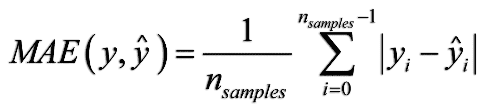

# 中位数绝对误差

中位数绝对误差特别有趣，因为它对异常值是稳健的。通过取目标值和预测值之间所有绝对差值的中间值来计算损失。
如果 *ŷ* 是第 *i* 个样本的预测值，并且*y[I]t28】是对应的真值，那么在 *n* 个样本上估计的中值绝对误差定义如下:*

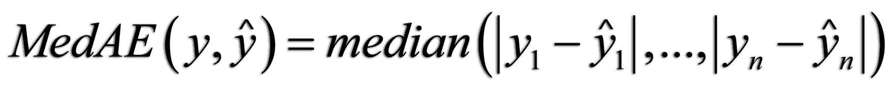

# 均方误差

**均方误差** ( **MSE** )是一个风险度量，等于平方(二次)误差损失的期望值。

如果*ŷ[I]t38】是第 *i* 个样本的预测值，并且*y[I]t44】是对应的真值，那么对 *n* 个样本估计的 MSE 定义如下:**

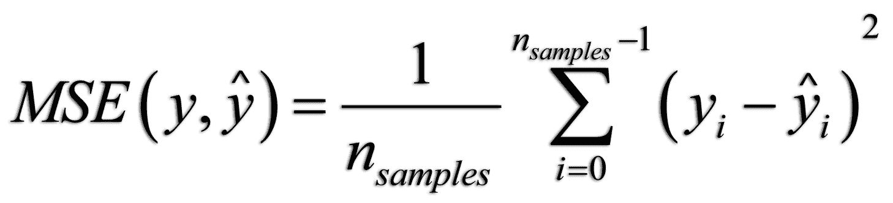

# 分类指标

分类的任务意味着不同的误差估计规则。我们的优势是输出的数量是离散的，因此可以用二进制的方式准确地确定预测是否失败。这就引出了主要指标。


# 准确(性)

准确性计算模型的正确预测的分数或计数。
在多标签分类中，该函数返回子集的准确度。

如果样本的整个预测标签集严格匹配真实标签集，则子集的准确度为*1.0*；否则就是 *0.0* 。
如果*ŷ[I]t56】是第 *i* 个样本的预测值，并且*y[I]t62】是相应的真值，那么对 *n* 个样本的正确预测的比例定义如下:**

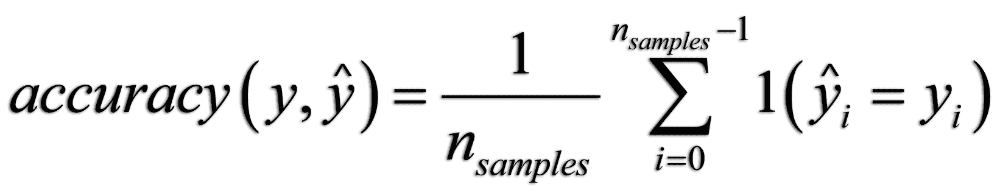

# 精确得分、召回率和 F 值

**精度**得分如下:

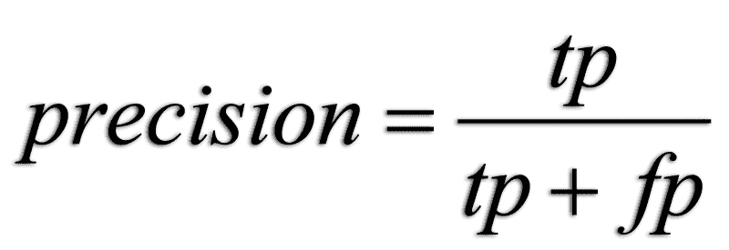

这里， *t [p]* 是真阳性的数量， *f [p]* 是假阳性的数量。精度是分类器不将阴性样品标记为阳性的能力。最佳值为 1，最差值为 *0* 。

**召回**如下:

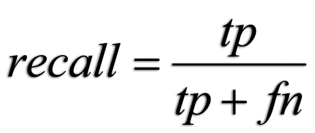

这里， *t [p]* 是真阳性的数量， *f [n]* 是假阴性的数量。召回率可以描述为分类器找到所有正样本的能力。其值范围从 1(最佳)到零。

**F 测度**(*F[β]和 F [1] 测度)可以解释为精度和召回的一种特殊的均值(加权调和均值)。A *F [β]* 度量的最佳值为 1，最差得分为 0。用 *β = 1* ， *F [β]* 和 *F [1]* 等价，召回率和精确度同等重要:*

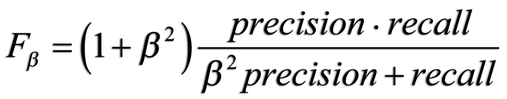

# 混淆矩阵

每个分类任务都旨在预测新的未知数据的标签或标记。显示分类准确性的一种非常有效的方式是通过混淆矩阵，在该矩阵中，我们显示[分类样本，基本事实]对以及预测如何进行的详细视图。

预期输出应该是矩阵的主对角线，得分为 1.0；也就是说，所有的期望值都应该与真实值相匹配。

在下面的代码示例中，我们将对预测值和真实值进行合成，并生成最终数据的混淆矩阵:

```py
from sklearn.metrics import confusion_matrix
import matplotlib.pyplot as plt
import numpy as np
y_true = [8,5,6,8,5,3,1,6,4,2,5,3,1,4]
y_pred = [8,5,6,8,5,2,3,4,4,5,5,7,2,6]
y = confusion_matrix(y_true, y_pred)
print y 
plt.imshow(confusion_matrix(y_true, y_pred), interpolation='nearest', cmap='plasma')
plt.xticks(np.arange(0,8), np.arange(1,9))
plt.yticks(np.arange(0,8), np.arange(1,9))
plt.show()
```

结果将如下所示:

```py
[[0 1 1 0 0 0 0 0]
 [0 0 0 0 1 0 0 0]
 [0 1 0 0 0 0 1 0]
 [0 0 0 1 0 1 0 0]
 [0 0 0 0 3 0 0 0]
 [0 0 0 1 0 1 0 0]
 [0 0 0 0 0 0 0 0]
 [0 0 0 0 0 0 0 2]]
```

这些值的最终混淆矩阵图形表示如下:

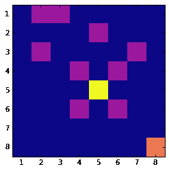

混淆矩阵

在图像中，我们看到具有三个正确预测的( *5，5* )对角线值中的高精度值，以及具有两个正确预测的( *8，8* )值。正如我们所看到的，通过分析图表可以直观地提取精度值的分布。


# 聚类质量测量

无监督学习技术，被理解为没有基础事实的数据标记，使得为模型实现重要的度量有点困难。尽管如此，对于这种技术还是有许多措施可以实施。在这一部分，我们列出了一些最著名的例子。


# 轮廓系数

**剪影** **系数**是一个不需要知道数据集标注的度量。它给出了群集之间分离的概念。

它由两种不同的元素组成:

*   样本与同一类别中所有其他点之间的平均距离( *a* )
*   样本与最近聚类中所有其他点之间的平均距离( *b* )

该系数 *s* 的公式定义如下:

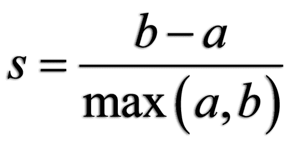

仅当类的数量至少为两个时，才定义轮廓系数，并且整个样本集的系数是所有样本的系数的平均值。


# 同质性、完备性和 V-测度

同质性、完整性和 V-measure 是聚类操作质量的三个关键相关指标。在下面的公式中，我们将使用 *K* 表示类的数量， *C* 表示类的数量， *N* 表示样本总数，*a[CK]表示类 *c* 在类 *k* 中的元素数量。*

**同质性**是属于单个聚类的单个类别的样本的比率的度量。一个集群中包含的不同类别越少越好。下限应为 0.0，上限应为 1.0(越高越好)，公式如下:

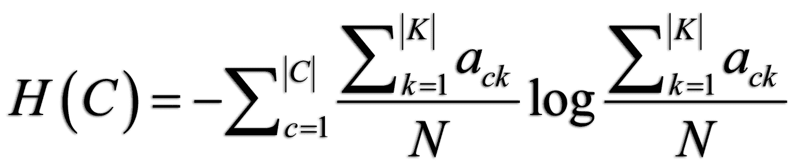

**完备性**衡量一个给定类的成员被分配到同一个集群的比率:


**V-measure** 是同质性和完备性的调和平均值，用以下公式表示:

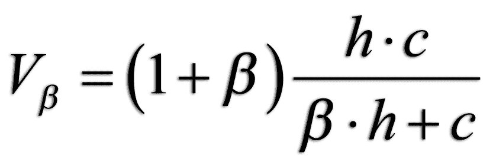

# 摘要

在本章中，我们回顾了机器学习过程中涉及的所有主要步骤。我们将在整本书中间接地使用它们，我们希望它们也能帮助你构建你未来的工作。

在下一章中，我们将回顾我们将用来解决所有机器学习问题的编程语言和框架，并在开始项目之前精通它们。


# 参考

*   利奇曼(2013 年)。http://archive.ics.uci.edu/ml 的 UCI 机器学习库()。加州欧文:加州大学信息与计算机科学学院。
*   昆兰，R. (1993 年)。结合基于实例和基于模型的学习。《第十届国际机器学习会议论文集，236-243 页，马萨诸塞大学，阿默斯特。摩根·考夫曼。
*   对字母混淆矩阵的理论分析。注意，知觉，&心理物理学 9.1 (1971): 40-50。
*   彼得·j·罗瑟夫(1987 年)。*轮廓图:用于解释和验证聚类分析的图形辅助工具*。计算与应用数学 20: 53-65。
*   肯特，艾伦等，机器文献检索。*设计信息检索系统的操作准则。*信息科学与技术协会杂志 6.2 (1955): 93-101。
*   Rosenberg，Andrew 和 Julia Hirschberg，V-Measure: *一种基于条件熵的外部聚类评估方法*。EMNLP-CoNLL。第 7 卷。2007.