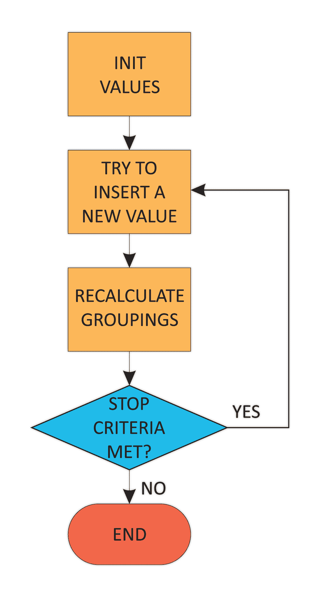
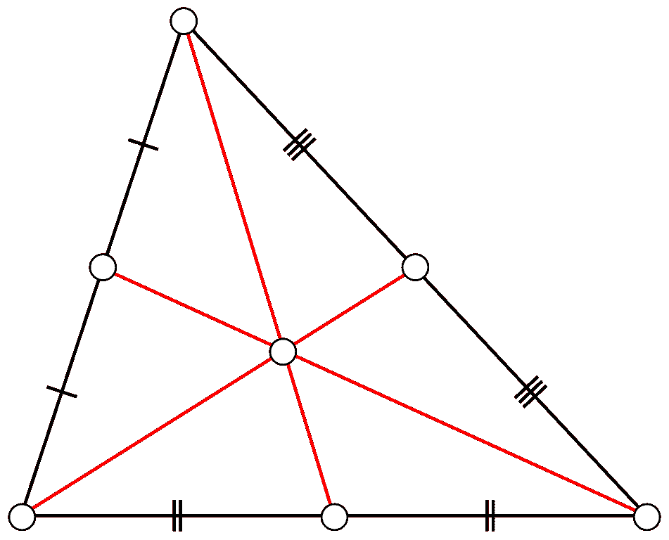
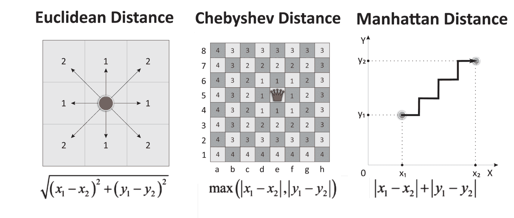
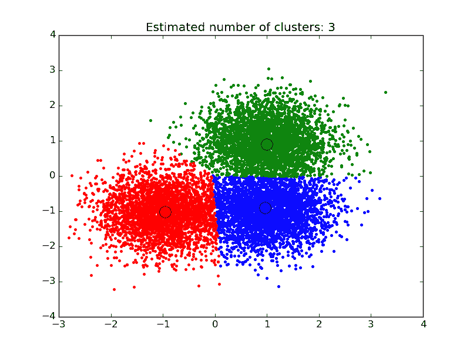
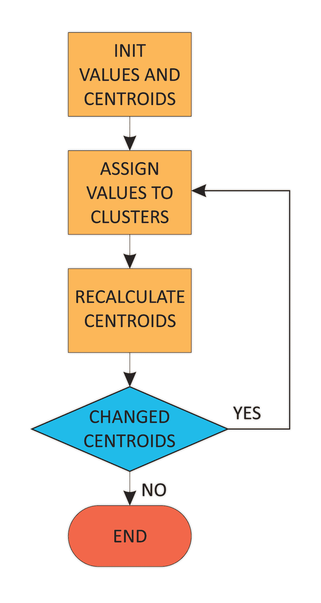
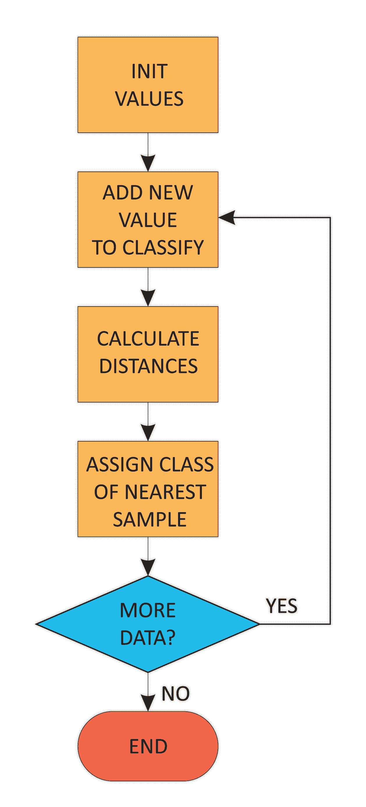
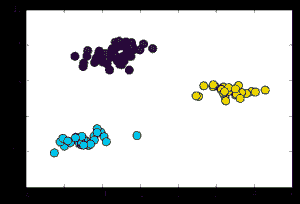
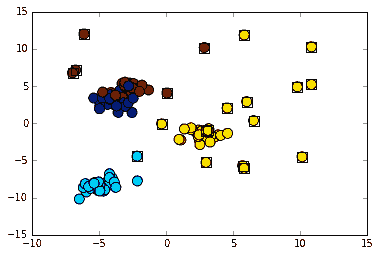

# 三、聚类

恭喜你！你已经完成了这本书的介绍部分，其中你已经探索了大量的主题，如果你能够跟上它，你就准备好开始了解许多机器学习模型的内部工作原理的旅程。

在这一章中，我们将探索一些有效而简单的方法来自动发现感兴趣的数据聚集，并开始研究数据中自然分组的原因。

本章将涵盖以下主题:

*   K-means 算法的一个例子的逐行实现，带有数据结构和例程的解释
*   详细讲解了**K-最近邻(K-NN)** 算法，用一个代码例子来解释整个过程
*   确定代表一组样本的最佳组数的其他方法


# 作为人类活动的分组

人类通常倾向于将日常元素聚集成具有相似特征的组。人类思维的这一特征也可以通过算法来复制。相反，最初可应用于任何未标记数据集的最简单操作之一是围绕公共特征对元素进行分组。

正如我们所描述的，在学科发展的这个阶段，聚类是作为应用于最简单的元素集类别的介绍性主题来讲授的。

但作为一名作者，我建议研究这个领域，因为社区暗示，在致力于人工智能任务的全面推广之前，当前模型的性能将达到一个平稳状态。下一阶段跨越人工智能边界的主要候选方法是什么？无监督的方法，在这里解释的方法的非常复杂的变化的形式。

但是现在我们不要跑题，让我们从最简单的分组标准开始，到公共中心的距离，它被称为 **K-means** 。


# 自动化集群过程

用于聚类的信息分组遵循所有技术的通用模式。基本上，我们有一个初始化阶段，随后是新元素的迭代插入，之后更新新的组关系。这一过程一直持续到满足停止标准，此时组表征完成。下面的流程图说明了这一过程:



聚类算法的一般方案

在我们对整个过程有了一个清晰的认识之后，让我们从应用这个方案的几个案例开始工作，从 **K-means** 开始。


# 寻找一个共同的中心- K-means

开始了。经过一些必要的备考复习，我们终于要开始学习资料了；在这种情况下，我们希望标记我们在现实生活中观察到的数据。

在这种情况下，我们有以下元素:

*   一组数值类型的 N 维元素
*   预定数量的组(这很棘手，因为我们必须做出有根据的猜测)
*   每组的一组公共代表点(称为**质心**

这种方法的主要目的是将数据集分成任意数量的聚类，每个聚类都可以用上述质心来表示。

形心一词来自数学界，已被翻译成微积分和物理学。在这里，我们找到了三角形质心解析计算的经典表示:



三角形质心查找方案的图形描述

有限集合的 *k* 个点、 *x [1、] x [2] 的质心，...，x [k] 中的*R*n 中的*，如下:


质心的解析定义

现在，我们已经定义了这个中心指标，让我们问一个问题，"*它与数据元素的分组有什么关系？*

要回答这个问题，我们必须先了解到质心的**距离的概念。**距离有多种定义，可以是线性、二次和其他形式。

因此，让我们回顾一些主要的距离类型，然后我们将提到通常使用的距离类型:

在本次审查中，我们将在定义测量类型时使用 2D 变量，作为一种简化手段。

让我们来看看以下距离类型:

*   **欧几里德距离:**这种距离度量以直线的形式计算两点之间的距离，或者有以下公式:


*   **切比雪夫距离**:该距离相当于沿任意轴的最大距离。它也被称为**棋**距离，因为它给出了一个国王从起点到终点需要走的最少步数。它由以下公式定义:


*   **曼哈顿距离**:这个距离相当于从一个城市的一点到另一点，单位平方。这种 L1 式的距离是水平单位数和垂直单位数的总和。其公式如下:


下图进一步解释了不同距离类型的公式:



一些最常见的距离类型的图形表示

为 K-means 选择的距离度量是欧几里德距离，它易于计算并且可以很好地扩展到多个维度。

现在我们已经有了所有的元素，是时候定义我们将用来定义我们将分配给任何给定样本的标签的标准了。让我们用下面的语句总结一下学习规则:

"一个样本将被分配到由最近的质心代表的组."

该方法的目标是最小化从聚类成员到包含样本的所有聚类的实际质心的平方距离之和。这也被称为**惯性最小化。**

在下图中，我们可以看到典型的 K-means 算法应用于 blob 类组样本群体的结果，其中预设的聚类数为 3:



使用 K 均值聚类过程的典型结果，种子为 3 个质心

K-means 是一种简单有效的算法，可用于快速了解数据集的组织方式。它的主要区别在于，属于同一类的对象将共享一个公共的距离中心，该距离中心将随着每个新样本的添加而递增。


# K 均值的利与弊

这种方法的优点如下:

*   它的伸缩性非常好(大多数计算可以并行运行)

*   它已被广泛应用

但是简单也有一些代价(没有银弹法则适用):

*   它需要先验知识(应该预先知道可能的聚类数)

*   异常值可能会扭曲质心的值，因为它们与任何其他样本具有相同的权重

*   因为我们假设该图形是凸的和各向同性的，所以它不能很好地处理不像斑点的集群


# k 均值算法故障

K-means 算法的机制可以用下面的流程图来总结:



K 均值流程的流程图

让我们更详细地描述一下这个过程:

我们从未分类的样本开始，并将 K 个元素作为起始质心。为了简洁起见，该算法还可以简化为元素列表中的第一个元素。

然后我们计算样本和第一个选择的样本之间的距离，因此我们得到第一个计算的质心(或其他代表值)。您可以在图中看到移动的质心向更直观(数学上正确)的中心位置移动。

在质心改变后，它们的位移将导致个体距离改变，因此集群成员可能改变。

这是我们重新计算质心并重复第一步的时候，以防停止条件不满足。

停止条件可以有多种类型:

*   n 次迭代后。可能是我们选择了一个非常大的数，我们会有不必要的计算，或者它会慢慢收敛，如果质心没有一个非常稳定的平均值，我们会有非常不可信的结果。
*   迭代收敛的一个可能的更好的标准是查看质心的变化，无论是在总位移还是总簇元素切换中。最后一个是正常使用的，所以一旦不再有元素从它们当前的集群改变到另一个集群，我们将停止这个过程。

N 次迭代条件也可以作为最后的手段，因为它可能导致非常长的过程，在大量迭代中没有观察到可观察到的变化。

让我们尝试直观地总结 K-NN 聚类的过程，经历几个步骤并查看聚类如何随时间演变:


集群重新配置循环的图形示例

在子图 1 中，我们开始在随机位置用可能的质心来播种聚类，我们将最接近的数据元素分配给这些聚类；然后在子图 2 中，我们将质心重新配置到新簇的中心，这又重新配置了簇(子图 3)，直到我们达到稳定状态。还可以逐个元素地进行元素聚合，这将触发更软的重新配置。这将是本章实践部分的实现策略。


# k 均值实现

在这一节中，我们将从最基本的概念出发，用一个实际的例子来回顾 K-means 的概念。

首先，我们将导入我们需要的库。为了提高对算法的理解，我们将使用`numpy`库。然后我们将使用众所周知的`matplotlib`库来图形化表示算法:

```py
import numpy as np

import matplotlib
import matplotlib.pyplot as plt

%matplotlib inline
```

这些将是一些 2D 元素，然后将产生候选中心，这将是四个 2D 元素。

为了生成数据集，通常使用随机数生成器，但在这种情况下，为了方便起见，我们希望将样本设置为预定的数字，同时也允许您手动重复这些步骤:

```py
samples=np.array([[1,2],[12,2],[0,1],[10,0],[9,1],[8,2],[0,10],[1,8],[2,9],[9,9],[10,8],[8,9] ], dtype=np.float)
centers=np.array([[3,2], [2,6], [9,3], [7,6]], dtype=np.float)
N=len(samples)
```

让我们代表样本的中心。首先，我们将用相应的轴初始化一个新的`matplotlib`图形。`fig`对象将允许我们改变所有图形的参数。

`plt`和`ax`变量名是一种标准化的方式，通常指绘图和绘图轴之一。

所以让我们试着了解一下样本的样子。这将通过`matplotlib`库的`scatter`绘图类型来完成。它将 *x* 坐标、 *y* 坐标、大小(以平方磅为单位)、标记类型和颜色作为参数。

有多种标记可供选择，如点(`.`)、圆(`o`)、方(`s`)。要查看完整列表，请访问[https://matplotlib.org/api/markers_api.html.](https://matplotlib.org/api/markers_api.html)

让我们来看看下面的代码片段:

```py
        fig, ax = plt.subplots()
        ax.scatter(samples.transpose()[0], samples.transpose()[1], marker = 
        'o', s = 100 )
        ax.scatter(centers.transpose()[0], centers.transpose()[1], marker = 
        's', s = 100, color='black')
        plt.plot()
```

现在让我们来看看下图:


初始群集状态，中心为黑色方块

让我们定义一个函数，给定一个新样本，该函数将返回一个列表，其中包含到所有当前质心的距离，以便将新样本分配给其中一个质心，然后重新计算质心:

```py
    def distance (sample, centroids):
        distances=np.zeros(len(centroids))
        for i in range(0,len(centroids)):
            dist=np.sqrt(sum(pow(np.subtract(sample,centroids[i]),2)))
            distances[i]=dist
        return distances
```

然后，我们需要一个函数来一个接一个地构建我们的应用的分步图形。

它预计最多有 12 个支线剧情，`plotnumber`参数将决定在 6 x 2 矩阵上的位置(`620`将是左上角的支线剧情，621 以下向右，以此类推写入顺序)。
之后，对于每张图片，我们将绘制聚类样本的散点图，然后绘制当前质心位置的散点图:

```py
    def showcurrentstatus (samples, centers, clusters, plotnumber):
        plt.subplot(620+plotnumber)
        plt.scatter(samples.transpose()[0], samples.transpose()[1], marker = 
        'o', s = 150 , c=clusters)
        plt.scatter(centers.transpose()[0], centers.transpose()[1], marker = 
        's', s = 100, color='black')
        plt.plot()
```

下面这个名为`kmeans`的函数将使用之前的距离函数来存储样本被分配到的质心(它将是一个从`1`到`K`的数字)。
主循环将从样本`0`到`N`，对于每个样本，它将寻找最近的质心，将质心编号分配给簇数组的索引`n`，并将样本的坐标与当前分配的质心相加。
然后，为了获得样本，我们使用`bincount`方法来计算每个质心的样本数，通过构建一个`divisor`数组，我们将一个类元素的总和除以先前的`divisor`数组，这样我们就有了新的质心:

```py
    def kmeans(centroids, samples, K, plotresults):
        plt.figure(figsize=(20,20))
        distances=np.zeros((N,K))
        new_centroids=np.zeros((K, 2))
        final_centroids=np.zeros((K, 2))
        clusters=np.zeros(len(samples), np.int)

        for i in range(0,len(samples)):
            distances[i] = distance(samples[i], centroids)
            clusters[i] = np.argmin(distances[i])
            new_centroids[clusters[i]] += samples[i]        
            divisor = np.bincount(clusters).astype(np.float)
            divisor.resize([K])
            for j in range(0,K):
            final_centroids[j] = np.nan_to_num(np.divide(new_centroids[j] , 
            divisor[j]))
            if (i>3 and plotresults==True):
                showcurrentstatus(samples[:i], final_centroids, 
                clusters[:i], i-3)
            return final_centroids
```

现在是时候启动 K-means 过程了，使用我们一开始设置的初始样本和中心。当前的算法将显示集群是如何从几个元素开始演化到最终状态的:

```py
    finalcenters=kmeans (centers, samples, 4, True)
```

我们来看看下面的截图:


聚类过程的描述，质心表示为黑色正方形


# 最近的邻居

K-NN 是另一种经典的聚类方法。它构建样本组，假设每个新样本与其邻居具有相同的类别，而不寻找全局代表性中心样本。相反，它查看环境，在每个新样本的环境中寻找最频繁的类。


# K-NN 的力学

K-NN 可以在许多配置中实现，但在本章中，我们将使用半监督方法，从一定数量的已分配样本开始，然后使用主要标准猜测聚类成员。

在下图中，我们对算法进行了分解。可以用以下步骤来概括:



K-NN 聚类过程的流程图

让我们以简化的形式回顾一下以下所有相关步骤:

1.  我们将先前已知的样本放在数据结构上。
2.  然后，我们读取下一个要分类的样本，并计算从新样本到训练集中每个样本的欧几里德距离。
3.  我们通过欧几里德距离选择最近样本的类别来决定新元素的类别。K-NN 方法需要 K 个最接近样本的投票。
4.  我们重复这个过程，直到没有剩余的样本。

这张图片将让我们了解新样品是如何添加的。在这种情况下，为了简单起见，我们使用`1`中的`K`:


K-NN 循环的示例应用

K-NN 可以在我们所学的多种配置中实现，但在本章中，我们将使用半监督方法；我们将从一定数量的已经分配的样本开始，稍后我们将根据训练集的特征来猜测聚类成员。


# K-NN 的优缺点

这种方法的优点如下:

*   **简单性**:不需要调整参数

*   **不需要正式训练**:我们只需要更多的训练实例来改进模型

缺点如下:

这在计算上是昂贵的——在一种简单的方法中，必须计算点和每个新样本之间的所有距离，除非实现了缓存。


# K-NN 示例实现

对于 K-NN 方法的这个简单实现，我们将使用 NumPy 和 Matplotlib 库。此外，由于我们将生成一个合成数据集以便更好地理解，我们将使用 scikit-learn 的`make_blobs`方法，该方法将生成定义良好的独立信息组，因此我们的实现有一个可靠的参考。

导入所需的库:

```py
    import numpy as np

    import matplotlib
    import matplotlib.pyplot as plt

    from sklearn.datasets.samples_generator import make_blobs
    %matplotlib inline
```

因此，是时候为这个例子生成数据样本了。`make_blobs`的参数是样本的数量、特征或维度的数量、中心或组的数量、样本是否必须被混洗以及聚类的标准偏差，以控制组样本的分散程度:

```py
    data, features = make_blobs(n_samples=100, n_features = 2, centers=4, 
    shuffle=True, cluster_std=0.8)
    fig, ax = plt.subplots()
    ax.scatter(data.transpose()[0], data.transpose()[1], c=features,marker = 
    'o', s = 100 )
    pl
```

下面是生成的样本斑点的表示:



首先，让我们定义我们的`distance`函数，这将是寻找所有新元素的邻居所必需的。我们基本上提供一个样本，并返回所提供的新元素与其所有对应元素之间的距离:

```py
    def distance (sample, data):
        distances=np.zeros(len(data))
        for i in range(0,len(data)):
            dist=np.sqrt(sum(pow(np.subtract(sample,data[i]),2)))
            distances[i]=dist
        return distances
```

`add_sample`函数将接收一个新的 2D 样本、当前数据集和一个标记相应样本组的数组(在本例中从`0`到`3`)。在这种情况下，我们使用`argpartition`来获得新样本的三个最近邻的索引，然后我们使用它们来提取`features`数组的子集。然后，`bincount`将返回该三元素子集上任何不同类的计数，然后使用`argmax`，我们将选择该两元素集中元素最多的组的索引(在本例中为类号):

```py
    def add_sample(newsample, data, features):
        distances=np.zeros((len(data),len(data[0])))
        #calculate the distance of the new sample and the current data
        distances = distance(newsample, data)
        closestneighbors = np.argpartition(distances, 3)[:3]
        closestgroups=features[closestneighbors]
        return np.argmax(np.bincount(closestgroups))
```

然后，我们定义我们的主`knn`函数，它获取要添加的新数据，并使用由`data`和`features`参数表示的原始分类数据来决定新元素的类别:

```py
    def knn (newdata, data, features):
        for i in newdata:
            test=add_sample (i, data, features);
            features=np.append(features, [test],axis=0)
            data=np.append(data, [i],axis=0)
        return data,features
```

最后，是时候启动这个过程了。为此，我们在尺寸`x`和`y`上定义了一组范围为-10，10 的新样本，我们将用它调用我们的`knn`例程:

```py
        newsamples=np.random.rand(20,2)*20-8.
    >    finaldata, finalfeatures=knn (newsamples, data, features)
```

现在是代表最终结果的时候了。首先，我们将表示初始样本，它们比我们的随机值格式更好，然后是我们的最终值，用一个空正方形(`c='none'`)表示，这样它们将作为这些样本的标记:

```py
    fig, ax = plt.subplots()
    ax.scatter(finaldata.transpose()[0], finaldata.transpose()[1], 
    c=finalfeatures,marker = 'o', s = 100 )
    ax.scatter(newsamples.transpose()[0], newsamples.transpose()
    [1],c='none',marker =  
    's', s = 100 )
    plt.plot()
```

让我们来看看下图:



最终聚类状态(新分类的项目用正方形标记)

在上图中，我们可以看到，随着流程的推进，我们的三个邻居的简单模型如何很好地对分组进行限定和重组。如图所示，新的分组不一定是圆形的；它们根据输入数据的前进方式而变化。


# 超越基础

现在，我们已经完成了对两种主要集群技术的示例性回顾，让我们探索一些更高级的指标和技术，这样我们就可以将它们放入我们的工具箱中。


# 肘法

在实现 K-means 时可能出现的一个问题是“我如何知道目标聚类数是数据集的最佳值或最具代表性的值？”

对于这个任务，我们有**肘**法。它由分组中总分组离差的唯一统计度量组成。它通过重复 K-means 过程，使用增加数量的初始聚类，并计算所有组的总的类内内部距离来工作。

通常，该方法将从一个非常高的值开始(除非我们从正确数量的质心开始)，然后我们将观察到总的簇内距离下降得非常快，直到我们到达一个点，在该点它没有显著变化。恭喜，我们找到了拐点，也就是下图中的拐点:


随着聚类数量的增加，误差演变的图形描述，以及拐点。

关于该指标的准确性，正如您所看到的，肘方法是一种启发式方法，并不是数学确定的，但如果您想要快速估计正确的聚类数，特别是当曲线在某个点突然变化时，它会很有用。


# 摘要

在这一章中，我们已经以一种非常实用的方式介绍了最简单但仍然非常实用的机器学习模型，让我们开始了解复杂性。

在下一章中，我们将介绍几种回归技术，是时候去解决一种我们没有处理过的新型问题了，即使有可能用聚类方法(回归)来解决问题，使用新的数学工具来逼近未知值。其中，我们将使用数学函数对过去的数据进行建模，并尝试基于这些建模函数对新的输出进行建模。


# 参考

*   罗伯特·L·桑代克*谁属于这个家庭？，*心理测量学 18.4 (1953): 267-276。
*   施泰因豪斯，H，*关于双方公司物资的分工。*公牛。阿卡德。波隆。sci 1(1956):801–804。
*   多变量观测值分类和分析的一些方法。第五届伯克利数理统计和概率研讨会会议录。第一卷。14 号。1967.
*   *盖·托马斯和彼得·哈特*，*最近邻模式分类。* IEEE 信息论汇刊 13.1 (1967): 21-27。