# 六、卷积神经网络

嗯，现在事情变得有趣了！我们的模型现在可以学习更复杂的函数，我们现在准备好围绕更现代和令人惊讶的有效模型进行一次精彩的旅行

在堆叠神经元层成为改进模型的最受欢迎的解决方案后，从基于人类视觉的模型开始，出现了更丰富节点的新思路。它们开始只是研究主题，在图像数据集和更多处理能力变得可用后，它们允许研究人员在分类挑战中达到几乎人类的准确性，我们现在准备在我们的项目中利用这种能力。

我们将在本章中讨论的主题如下:

*   卷积神经网络的起源
*   离散卷积的简单实现
*   其他操作类型:汇集、退出
*   迁移学习


# 卷积神经网络的起源

**卷积神经网络**(**CNN**)起源久远。他们是在**多层感知器**完善的同时发展起来的，第一个具体的例子就是**神经认知器**。

neocognitron 是一个分层的、多层的**人工神经网络** ( **ANN** )，由 Fukushima 教授在 1980 年的一篇论文中提出，具有以下主要特征:

*   自组织
*   容忍输入中的偏移和变形


这个最初的想法在 1986 年再次出现在最初的反向传播论文的书籍版本中，并且在 1988 年也被用于语音识别中的时间信号。

该设计在 1998 年得到了改进，Ian LeCun *、* *的一篇论文将基于梯度的学习应用于文档识别*，提出了 LeNet-5 网络，这是一种用于分类手写数字的架构。与其他现有模型相比，该模型表现出了更高的性能，特别是在 SVM 的几个变体上，这是本书出版当年性能最好的操作之一。

然后那篇论文的概括在 2003 年出现，用“*用于图像解释的分层神经网络*”。但是总的来说，几乎所有的内核都遵循最初的想法，直到现在。


# 卷积入门

为了理解卷积，我们将从研究卷积算子的起源开始，然后我们将解释这个概念如何应用于信息。

卷积基本上是两个连续或离散函数之间的运算，实际上，它具有用一个函数过滤另一个函数的效果。

它在不同的领域有许多用途，尤其是在数字信号处理领域，它是整形和过滤音频和图像的首选工具，它甚至用于概率理论，表示两个独立随机变量的和。

而这些过滤能力和机器学习有什么关系呢？答案是，通过过滤器，我们将能够构建能够强调或隐藏我们输入的某些特征的网络节点(通过过滤器的定义)，因此我们可以为所有特征构建自动定制检测器，这些检测器可用于检测确定的模式。我们将在接下来的章节中详细介绍这一点；现在，让我们回顾一下运算的正式定义，以及它是如何计算的摘要。


# 连续卷积

卷积作为一种运算是由达朗贝尔在 18 世纪微分学发展初期首先创造的。该操作的常见定义如下:


如果我们试图描述应用该运算所需的步骤，以及它是如何结合两个函数的，我们可以用下面的细节来表达该数学运算所涉及的内容:

*   翻转信号:这是变量的( *-τ* )部分
*   移动它:这是由 *g(τ)* 的 *t* 求和因子给出的
*   乘以:f 和 g 的乘积
*   对结果曲线进行积分:这是不太直观的部分，因为每个瞬时值都是积分的结果

为了理解所涉及的所有步骤，让我们直观地表示在确定点 *t* [*0*] 计算两个函数 *f* 和 *g* 之间的卷积所涉及的所有步骤:

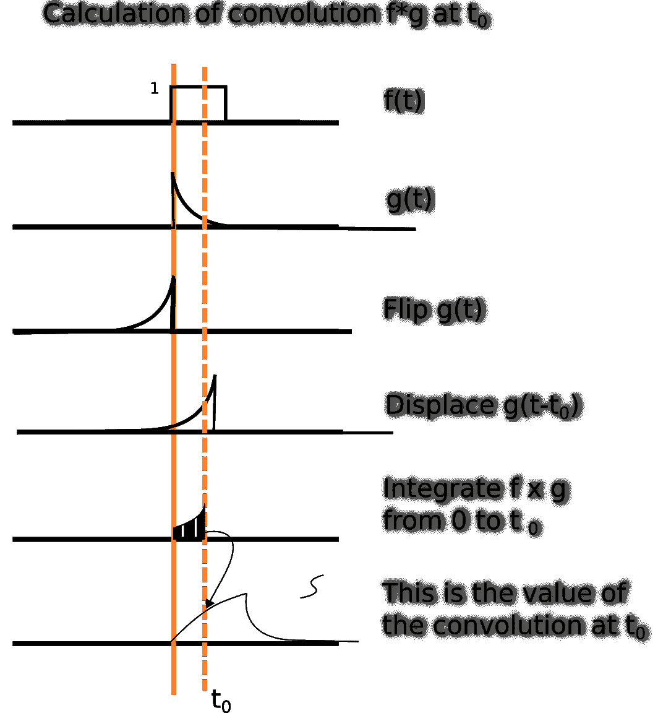

这种对卷积规则的直观近似也适用于函数的离散领域，这是我们将要工作的真实领域。所以，我们先来定义一下。


# 离散卷积

即使有用，我们工作的领域也是非常数字化的，所以我们需要将这种操作转换到离散的领域。两个离散函数 *f* 和 *g* 的卷积运算是将原始积分转换为以下形式的等价求和:


这个原始定义可以应用于任意维数的函数。特别是，我们将在 2D 图像上工作，因为这是大量应用的领域，我们将在本章中进一步描述。

现在是时候学习我们通常应用卷积算子的方式了，通过内核。


# 核和卷积

当在离散域中解决实际问题时，我们通常有有限维的 2D 函数(例如，它可以是一个图像)，我们希望通过另一个图像过滤它。滤波器开发学科研究不同类型的滤波器通过卷积应用于各种类时的效果。最常见的函数类型是每个维度有两到五个元素，其余元素的值为 0。这些代表过滤功能的小矩阵被称为**内核**。

卷积运算从一个 *n* 维矩阵(通常是一个代表图像的 2D 矩阵)的第一个元素与一个核的所有元素开始，将矩阵的中心元素应用于我们要相乘的特定值，并应用核的维度之后的剩余因子。在图像的情况下，最终结果是一个等效的图像，其中它的某些元素(例如，线条和边缘)被突出显示，而其他元素(例如，在模糊的情况下)被隐藏。

在下面的例子中，您将看到特定的 3 x 3 内核是如何应用于特定的图像元素的。这在扫描模式中对矩阵的所有元素重复:

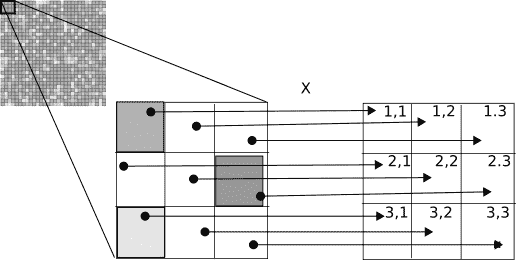

内核在应用时还有几个额外的元素需要考虑，特别是步幅和填充，它们完成了适应特殊应用情况的规范。我们来看看步幅和垫高。


# 步幅和衬垫

当应用卷积运算时，可以应用于该过程的变化之一是改变核的位移单位。该参数可按尺寸指定，称为**步距**。在下图中，我们展示了几个如何应用 stride 的示例。在第三种情况下，我们看到一个不兼容的步幅，因为内核不能应用到最后一步。根据库的不同，可以忽略这种类型的警告:


应用内核时的另一个重要事实是，内核越大，图像/矩阵的边界上就有越多的单元不会收到答案，因为我们需要覆盖整个内核。为了应对这种情况，**填充**参数将为图像添加指定宽度的边界，以允许内核能够均匀地应用于边缘像素/元素。这里，您有填充参数的图形描述:


在描述了卷积的基本概念之后，让我们用一个实际例子来实现卷积，看看它在真实图像中的应用，并对它的效果有一个直观的了解。


# 在一个例子中实现 2D 离散卷积运算

为了理解离散卷积运算的机制，让我们对这一概念进行简单直观的实现，并将其应用于具有不同类型内核的样本图像。让我们导入所需的库。因为我们将以尽可能清晰的方式实现算法，所以我们将只使用最少的必要算法，比如 NumPy:

```
import matplotlib.pyplot as plt
import imageio
import numpy as np
```

使用`imageio`包的`imread`方法，让我们读取图像(导入为三个相等的通道，因为它是灰度的)。然后，我们对第一个通道进行切片，将其转换为浮点，并使用 matplotlib 显示它:

```
arr = imageio.imread("b.bmp") [:,:,0].astype(np.float)
plt.imshow(arr, cmap=plt.get_cmap('binary_r'))
plt.show()
```


现在是时候定义内核卷积运算了。正如我们之前所做的，我们将简化 3 x 3 内核上的操作，以便更好地理解边界条件。`apply3x3kernel`将在图像的所有元素上应用内核，返回一个新的等效图像。请注意，为了简单起见，我们将内核限制为 3 x 3，因此图像的 1 像素边界不会有新值，因为我们没有考虑填充:

```
class ConvolutionalOperation:
    def apply3x3kernel(self, image, kernel):  # Simple 3x3 kernel operation
        newimage=np.array(image)
        for m in range(1,image.shape[0]-2):
            for n in range(1,image.shape[1]-2):
                newelement = 0
                for i in range(0, 3):
                    for j in range(0, 3):
                        newelement = newelement + image[m - 1 + i][n - 1+ 
                        j]*kernel[i][j]
                newimage[m][n] = newelement
        return (newimage)
```

正如我们在前面几节中看到的，不同的内核配置突出了原始图像的不同元素和属性，构建的过滤器在经过多次训练后可以专门处理非常高级的特征，如眼睛、耳朵和门。在这里，我们将生成一个以名称为关键字的内核字典，内核的系数排列在一个 3 x 3 的数组中。`Blur`滤镜相当于计算 3 x 3 点邻域的平均值，`Identity`只是按原样返回像素值，`Laplacian`是一个经典的导数滤镜，它突出显示边界，然后两个`Sobel`滤镜将在第一种情况下标记水平边缘，在第二种情况下标记垂直边缘:

```
kernels = {"Blur":[[1./16., 1./8., 1./16.], [1./8., 1./4., 1./8.], [1./16., 1./8., 1./16.]]
           ,"Identity":[[0, 0, 0], [0., 1., 0.], [0., 0., 0.]]
           ,"Laplacian":[[1., 2., 1.], [0., 0., 0.], [-1., -2., -1.]]
           ,"Left Sobel":[[1., 0., -1.], [2., 0., -2.], [1., 0., -1.]]
           ,"Upper Sobel":[[1., 2., 1.], [0., 0., 0.], [-1., -2., -1.]]}
```

让我们生成一个`ConvolutionalOperation`对象，并生成一个比较内核图表，看看它们是如何比较的:

```
conv = ConvolutionalOperation()
plt.figure(figsize=(30,30))
fig, axs = plt.subplots(figsize=(30,30))
j=1
for key,value in kernels.items():
    axs = fig.add_subplot(3,2,j)
    out = conv.apply3x3kernel(arr, value)
    plt.imshow(out, cmap=plt.get_cmap('binary_r'))
    j=j+1
plt.show()

<matplotlib.figure.Figure at 0x7fd6a710a208>
```

在最终的图像中，您可以清楚地看到我们的内核是如何检测到图像上的几个高细节特征的——在第一个图像中，您看到的是没有变化的图像，因为我们使用了单位内核，然后是拉普拉斯边缘检测器、左边界检测器、上边界检测器，然后是模糊操作符:

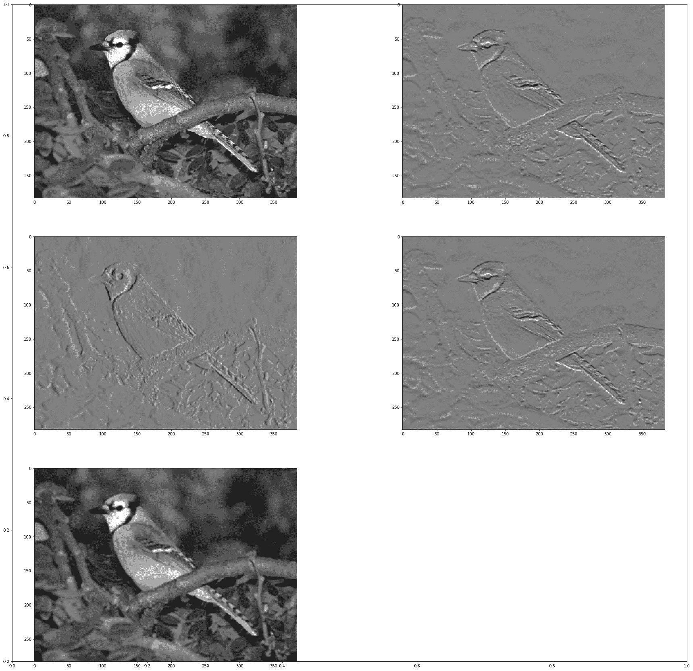

回顾了连续场和离散场的卷积运算的主要特征后，我们可以得出这样的结论:基本上，卷积核突出或隐藏了模式。根据训练的或(在我们的例子中)手动设置的参数，我们可以开始发现图像中的许多元素，例如不同维度的方向和边缘。例如，我们也可以通过模糊内核来掩盖一些不想要的细节或异常值。此外，通过堆叠卷积层，我们甚至可以突出更高阶的复合元素，如眼睛或耳朵。

卷积神经网络的这一特性是它们相对于以前的数据处理技术的主要优势:我们可以非常灵活地确定某个数据集的主要成分，并将更多的样本表示为这些基本构件的组合。

现在是时候看看通常与前者结合使用的另一种类型的层了——池层。


# 子采样操作(合并)

二次采样操作包括应用一个核(可变维度)并通过将图像分成 *mxn* 个块并取一个代表该块的元素来减小输入维度的范围，从而以某个确定的因子减小图像分辨率。在 2 x 2 内核的情况下，图像大小将减少一半。最广为人知的操作是最大值(最大池)、平均值(平均池)和最小值(最小池)。
下图向您展示了如何将 2 x 2 `maxpool`内核应用于单通道 16 x 16 矩阵。它只是保持它所覆盖的内部区域的最大值:

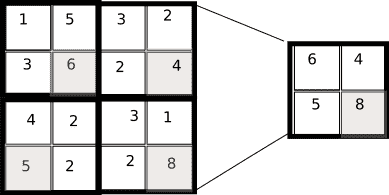

现在我们已经看到了这个简单的机制，让我们问问自己，它的主要目的是什么？二次抽样层的主要目的与卷积层有关:减少信息量和复杂性，同时保留最重要的信息元素。换句话说，他们构建了底层信息的 ***紧凑表示*** 。

现在是时候编写一个简单的池操作符了。它比卷积运算符更容易、更直接，在这种情况下，我们将只实现 max pooling，它选择 4 x 4 邻域中最亮的像素，并将其投影到最终图像:

```
class PoolingOperation:
    def apply2x2pooling(self, image, stride):  # Simple 2x2 kernel operation
        newimage=np.zeros((int(image.shape[0]/2),int(image.shape[1]/2)),np.float32)
        for m in range(1,image.shape[0]-2,2):
            for n in range(1,image.shape[1]-2,2):
                newimage[int(m/2),int(n/2)] = np.max(image[m:m+2,n:n+2])
        return (newimage)
```

让我们应用新创建的池化操作，正如您所看到的，最终的图像分辨率更加块状化，并且细节通常更加明亮:

```
plt.figure(figsize=(30,30))
pool=PoolingOperation()
fig, axs = plt.subplots(figsize=(20,10))
axs = fig.add_subplot(1,2,1)
plt.imshow(arr, cmap=plt.get_cmap('binary_r'))
out=pool.apply2x2pooling(arr,1)
axs = fig.add_subplot(1,2,2)
plt.imshow(out, cmap=plt.get_cmap('binary_r'))
plt.show()
```

在这里你可以看到不同之处，尽管它们很细微。最终图像的精度较低，选择的像素(环境的最大值)会产生更亮的图像:

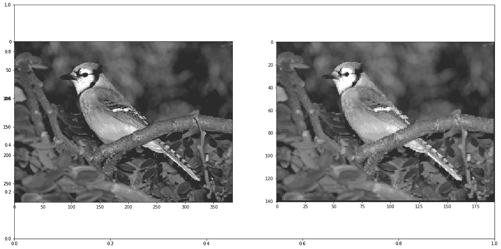

# 利用下降操作提高效率

正如我们在前面的章节中观察到的，过度拟合是每个模型的潜在问题。神经网络也是如此，数据在训练集上可以做得很好，但在测试集上却不行，这使得它对泛化毫无用处。

为此，2012 年，Geoffrey Hinton 领导的团队发表了一篇论文，描述了辍学操作。它的操作很简单:

*   选择随机数量的节点(从总数中选择的节点的比率是一个参数)
*   所选权重的值被审查为零，从而使它们在后续层的先前连接的对等体无效


# 脱落层的优点

这种方法的主要优点是防止一层中的所有神经元同步优化它们的权重。这种在随机组中进行的适应，防止所有神经元收敛到同一个目标，从而使权重去相关。

对于 dropout 的应用发现的第二个特性是隐藏单元的激活变得稀疏，这也是一个期望的特性。

在下图中，我们有一个原始的、完全连接的多层神经网络的表示，以及带有辍学的关联网络:

>


# 深度神经网络

现在我们已经有了丰富的层次，是时候开始参观神经架构是如何随时间演变的了。从 2012 年开始，一系列新的、越来越强大的层的组合开始迅速出现，而且势不可挡。这套新的架构采用了术语**深度学习**，我们可以近似地将它们定义为至少包含三层的复杂神经架构。它们也倾向于包括比单层感知机更高级的层，比如卷积层。


# 穿越时间的深度卷积网络架构

深度学习架构可以追溯到 20 年前，并在很大程度上受解决人类视觉问题的挑战的指导而发展。让我们看看主要的深度学习架构及其主要的构建模块，然后我们可以为自己的目的重用它们。


# Lenet 5

正如我们在卷积神经网络的历史介绍中看到的，卷积层是在 20 世纪 80 年代发现的。但直到 20 世纪 90 年代末，可用的技术还不足以构建复杂的层组合。

大约在 1998 年，在贝尔实验室，在围绕手写数字解码的研究期间，Ian LeCun 形成了一种新的方法——卷积、池化和完全连接层的混合——来解决识别手写数字的问题。

在这个时候，SVM 和其他更多的数学定义的问题或多或少地被成功使用，关于 CNN 的基础论文表明，神经网络可以与当时最先进的方法相比表现得相当好。

在下图中，显示了该体系结构的所有层，该体系结构接收 28 x 28 灰度图像作为输入，并返回一个 10 元素向量，输出为每个字符的概率:


# Alexnet

经过几年的中断(尽管 Lecun 正在将他的网络应用于其他任务，如人脸和物体识别)，可用的结构化数据和原始处理能力的指数增长使团队能够增长和调整模型，这在几年前被认为是不可能的。

促进该领域创新的因素之一是名为 **Imagenet** 的图像识别基准的可用性，该基准由数百万张按类别组织的对象图像组成。

从 2012 年开始，**大规模视觉识别挑战(LSVRC)** 每年都会举办，帮助研究人员创新网络配置，每年都取得越来越好的结果。

Alex Krizhevsky 开发的 Alexnet 是第一个赢得这项挑战的深度卷积网络，并为未来几年开创了先例。它由一个在结构上类似于 Lenet-5 的模型组成，但其卷积层的深度为数百个单位，参数总数为数千万。

接下来的挑战见证了一个强有力竞争者的出现，来自牛津大学的**视觉几何小组(VGG)** ，带着它的 VGG 模型。


# VGG 模式

VGG 网络架构的主要特点是，它将卷积滤波器的大小减少到一个简单的 3 x 3 矩阵，并按序列组合它们，这与以前的竞争者不同，以前的竞争者具有较大的核维数(高达 11 x 11)。
矛盾的是，这一系列小的卷积权重实际上包含了大量的参数(大约几百万个)，因此它必须受到许多措施的限制。


# GoogLenet 和初始模型

**GoogLenet** 是在 2014 年赢得 LSVRC 的神经网络架构，也是该系列中大型 IT 公司的第一次真正成功的尝试，自 2014 年以来，该系列主要由拥有巨额预算的公司赢得。

GoogLenet 基本上是九个连锁的初始模块的深度组合，很少或没有修改。下图显示了这些 Inception 模块中的每一个，它是微小卷积块的混合体，混合了一个 3 x 3 max 的池节点:

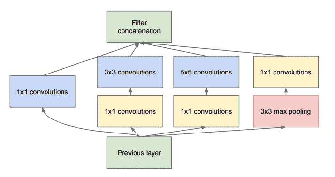

即使如此复杂，与两年前发布的 Alexnet 相比，GoogLenet 仍设法减少了所需的参数数量(1100 万比 6000 万)，并提高了准确性(6.7%的误差比 16.4%)。此外，先启模块的重用允许敏捷的实验。

但这不是这个架构的最后版本。很快，第二个版本的 Inception 模块就被创建了，它具有以下特征。


# 批量标准化的初始 V2 和 V3

2015 年 12 月，随着论文*重新思考计算机视觉的盗梦架构*，谷歌研究院发布了盗梦架构的新迭代。

**内部协方差移位问题**

最初 GoogLenet 的主要问题之一是训练不稳定。正如我们前面所看到的，输入归一化基本上包括将所有输入值集中在零上，并将其值除以标准偏差，以便为反向传播的梯度获得良好的基线。

在训练非常大的数据集期间发生的是，在大量训练示例之后，不同值的振荡开始放大平均参数值，就像在共振现象中一样。这种现象被称为**协方差偏移**。

为了缓解这一问题，解决方案是不仅对原始输入值进行归一化，而且对每一层的输出值进行归一化，从而避免在各层开始偏离平均值之前出现不稳定性。

除了批量标准化之外，还向 V2 提出了一些增量式的添加:

*   将卷积数减少到最大值 3 x 3
*   增加网络的总深度
*   在每个图层上使用宽度增加技术来改善要素组合
*   卷积的因子分解

Inception V3 基本上在同一架构上实现了所有提出的创新，并对网络的辅助分类器添加了批量归一化。

在下图中，我们展示了新的架构。请注意卷积单元的缩减大小:

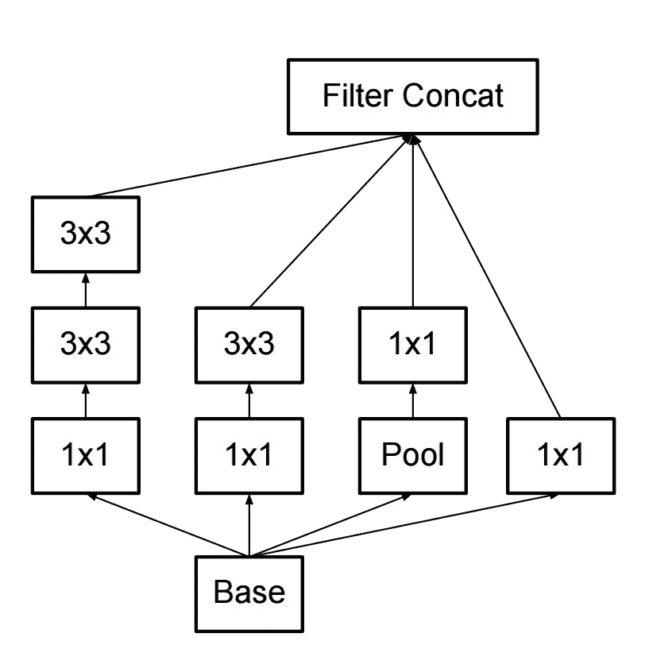

2015 年底，这一系列架构的最后一次根本性改进来自另一家公司微软，以 **ResNets** 的形式。


# 剩余网络

这种新的架构出现在 2015 年 12 月(或多或少与 Inception V3 同时)，它有一个简单但新颖的想法——不仅应该使用每个构成层的输出，而且该架构还应该将该层的输出与原始输入相结合。

在下图中，我们观察到一个 ResNet 模块的简化视图。它清楚地显示了卷积序列末尾的求和运算，以及最终的 ReLU 运算:


模块的卷积部分包括一个从 256 个值减少到 64 个值的特征，一个保持特征数的 3×3 滤波器层，以及一个从 64×256 个值扩充 1×1 层的特征。最初，它跨越了 100 多个层，但在最近的发展中，ResNet 也用于不到 30 层的深度，但分布更广。

既然我们已经看到了近年来主要发展的概况，让我们直接进入研究人员为 CNN 发现的主要应用类型。


# CNN 深层解决的问题类型

在过去，CNN 已经被用来解决各种各样的问题。以下是对主要问题类型的回顾，以及对该体系结构的简短参考:

*   分类
*   侦查
*   分割


# 分类

正如我们之前看到的，分类模型将图像或其他类型的输入作为参数，并返回一个数组，该数组包含与可能的类别数量一样多的元素，每个元素都有相应的概率。

这种解决方案的正常架构是卷积层和池层的复杂组合，最后是逻辑层，显示任何预训练类的概率。


# 侦查

检测增加了复杂性，因为它需要猜测与图像相关的一个或多个元素的位置，然后尝试对这些信息元素中的每一个进行分类。

对于这项任务，针对单个定位问题的常见策略是将分类和回归问题结合起来——一个问题(分类)用于对象的类别，另一个问题(回归)用于确定被检测对象的坐标——然后将这些损失结合成一个共同的问题。

对于多个元素，第一步是确定感兴趣区域的数量，搜索图像中在统计上显示属于同一对象的信息斑点的位置，然后仅将分类算法应用于检测到的区域，寻找具有高概率的阳性情况。


# 分割

分割增加了复杂性，因为模型必须定位图像中的元素，并标记所有已定位对象的确切形状，如下图所示:

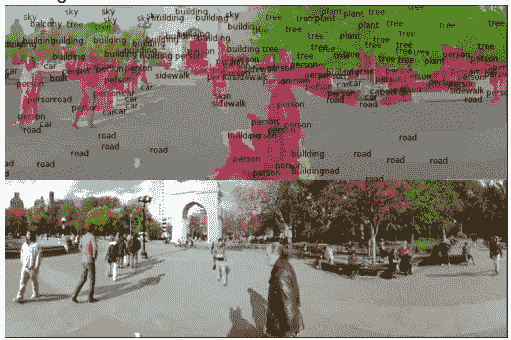

完成这项任务的最常见方法之一是实施连续的下采样和上采样操作，恢复高分辨率图像，每个像素只有一定数量的可能结果，这些结果标记了该元素的类别号。


# 使用 Keras 部署深度神经网络

在这个练习中，我们将生成先前描述的由 Keras 应用库提供的 Inception 模型的一个实例。首先，我们将导入所有需要的库，包括 Keras 模型处理，图像预处理库，用于优化变量的梯度下降，以及几个初始实用程序。此外，我们将使用 OpenCV 库来调整新的输入图像，以及常见的 NumPy 和 matplotlib 库:

```
from keras.models import Model
from keras.preprocessing import image
from keras.optimizers import SGD
from keras.applications.inception_v3 import InceptionV3, decode_predictions, preprocess_input

import matplotlib.pyplot as plt
import numpy as np
import cv2

Using TensorFlow backend.
```

Keras 使加载模型变得非常简单。您只需调用一个新的`InceptionV3`类实例，然后我们将分配一个基于**随机梯度下降**和损失分类交叉熵的优化器，这非常适合图像分类问题:

```
model=InceptionV3()
model.compile(optimizer=SGD(), loss='categorical_crossentropy')
```

既然模型已经加载到内存中，现在是时候使用`cv`库加载和调整照片了，然后我们调用 Keras 应用的预处理输入，这将使值正常化:

```
# resize into VGG16 trained images' format
im = cv2.resize(cv2.imread('blue_jay.jpg'), (299, 299))
im = np.expand_dims(im, axis=0)
im = im /255.
im = im - 0.5
im =  im * 2
plt.figure (figsize=(10,10))
plt.imshow(im[0], cmap=plt.get_cmap('binary_r'))
plt.show()
```

这是图像归一化后的样子，请注意我们对图像的结构理解是如何变化的，但从模型的角度来看，这是允许模型收敛的最佳方式:


现在我们将调用模型的`predict`方法，这将显示神经网络最后一层的结果，即每个类别的概率数组。`decode_predictions`方法读取一个字典，其中所有的类别编号作为索引，类别名称作为值，因此它提供检测到的项目分类的名称，而不是编号:

```
out = model.predict(im)
print('Predicted:', decode_predictions(out, top=3)[0])
print (np.argmax(out))

Predicted: [('n01530575', 'brambling', 0.18225007), ('n01824575', 'coucal', 0.13728797), ('n01560419', 'bulbul', 0.048493069)]
10
```

正如你所看到的，通过这个简单的方法，我们从一系列相似的鸟类中得到了一个非常近似的预测。对输入图像和模型本身的额外调整可以导致更精确的答案，因为蓝鸟是包含在 1000 个可能类别中的一个类别。


# 用颤动探索卷积模型

在这个实际的例子中，我们将在 Keras 库和箭筒的帮助下加载一个我们之前研究过的模型(在这个例子中是`Vgg19`)。然后，我们将观察架构的不同阶段，以及不同层如何工作，并输入一定的信息。


# 用箭图探索卷积网络

**颤**([https://github.com/keplr-io/quiver](https://github.com/keplr-io/quiver))是一个最近非常方便的工具，用来在 Keras 的帮助下探索模型。它创建了一个可由现代网络浏览器访问的服务器，并允许模型结构的可视化和来自输入层的输入图像的评估，直到最终预测。

使用下面的代码片段，我们将创建一个`VGG16`模型的实例，然后我们将允许颤读当前目录中的所有图像，并启动一个 web 应用，该应用将允许我们与我们的模型及其参数进行交互:

```
from keras.models import Model
from keras.preprocessing import image
from keras.optimizers import SGD
from keras.applications.vgg16 import VGG16
import keras.applications as apps

model=apps.vgg16.VGG16()

from quiver_engine.server import launch
launch(model,input_folder=".") 
```

该脚本将下载`VGG16`模型权重(您需要一个良好的连接，因为它的重量高达数百兆字节)。然后，它将模型加载到内存中，并创建一个监听端口 5000 的服务器。

Keras 库下载的模型权重之前已经使用 Imagenet 进行了彻底的训练，因此它可以在我们的数据集中的 1，000 个类别上获得非常好的准确性。

在下面的屏幕截图中，我们看到了加载 web 应用的索引页面后的第一个屏幕。左侧显示了网络架构的交互式图形表示。在中间右侧，您可以选择当前目录中的一张图片，应用会自动将其作为输入，打印出输入的五个最可能的结果。

该屏幕截图还显示了第一个网络层，它基本上由代表原始图像的红色、绿色和蓝色成分的三个矩阵组成:

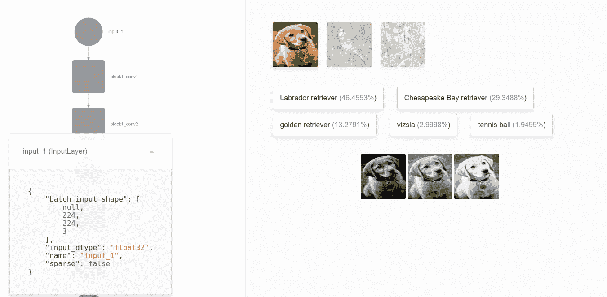

然后，随着我们进入模型层，我们有了第一个卷积层。在这里，我们可以看到这个阶段主要突出了高级功能，如我们用 3 x 3 滤镜设置的功能，如不同类型的边框、亮度和对比度:

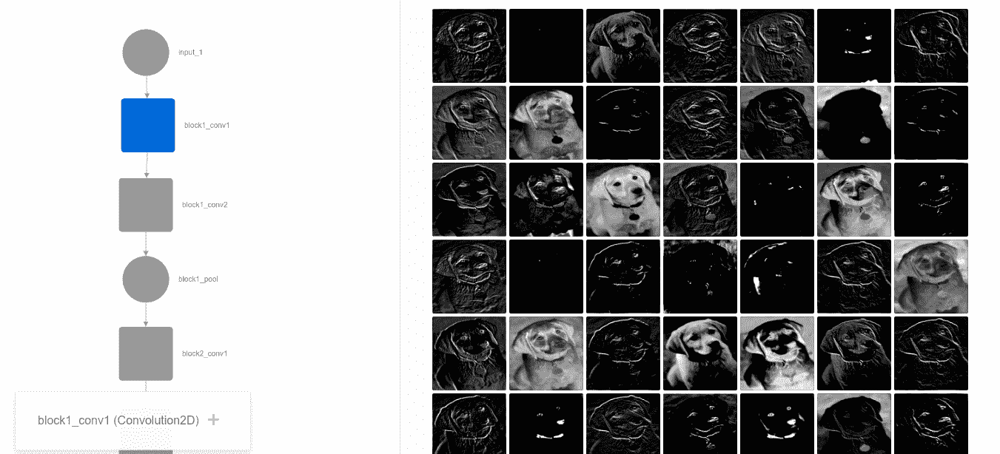

让我们再前进一点。我们现在可以看到一个不关注全局特性的中间层。相反，我们看到它已经为中间特征进行了训练，例如不同组的纹理、角度或特征组，例如眼睛和鼻子:

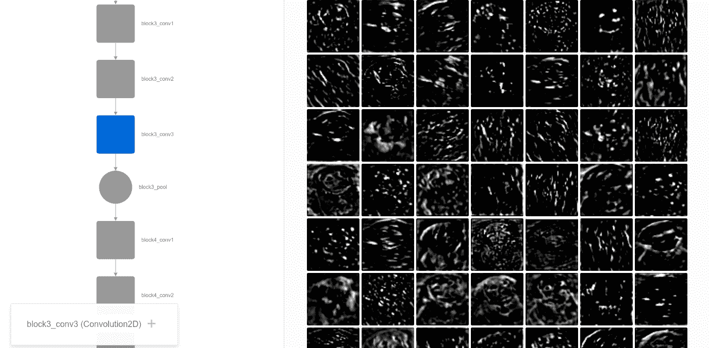

当到达最后的卷积层时，真正抽象的概念出现了。这个阶段显示了我们现在正在训练的模型是多么不可思议的强大，因为现在我们看到的是突出显示的元素，而没有任何有用的(对我们来说)意义。在一些完全连接的层之后，这些新的抽象类别将导致最终的解决方案，这是一个具有浮点概率值的 1000 元素的数组，该概率值是 ImageNet 中每个类别的概率值:

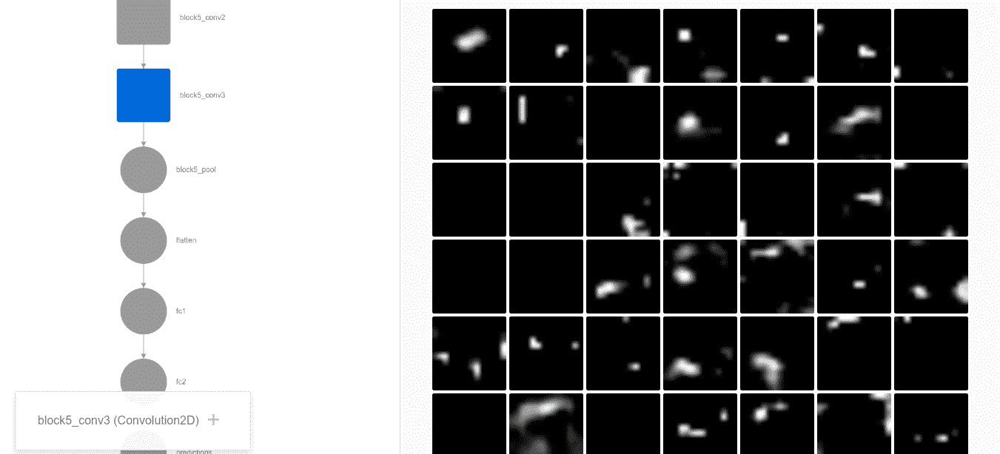

我们希望你可以探索不同的例子和层的输出，并尝试发现它们如何突出不同类别图像的不同特征。

现在是时候研究一种新型的机器学习了，它包括应用以前训练过的网络来解决新型问题。这叫做**迁移学习**。


# 实施迁移学习

在本例中，我们将实现之前看到的示例之一，替换预训练卷积神经网络的最后阶段，并为一组新元素训练最后阶段，将其应用于分类。它具有以下优点:

*   它建立在对图像分类任务证明有效的模型上
*   它减少了训练时间，因为我们可以重复使用系数，其精确度可能需要数周的计算能力才能达到

数据集类将是 flower17 数据集的两种不同的花类型。这是一个 17 类花卉数据集，每类有 80 幅图像。选的花是英国一些常见的花。图像具有较大的比例、姿态和光照变化，并且还存在类内图像变化较大且与其他类非常相似的类。在这种情况下，我们将收集前两个类(水仙花和款冬)，并在预训练的 VGG16 网络上构建一个分类器。

首先，我们将进行图像数据扩充，因为图像的数量可能不足以提取每个物种的所有元素。让我们从导入所有需要的库开始，包括应用、预处理、检查点模型和相关对象，以允许我们保存中间步骤，以及用于图像处理和数字基础操作的`cv2`和`NumPy`库:

```
from keras import applications
from keras.preprocessing.image import ImageDataGenerator
from keras import optimizers
from keras.models import Sequential, Model 
from keras.layers import Dropout, Flatten, Dense, GlobalAveragePooling2D
from keras import backend as k 
from keras.callbacks import ModelCheckpoint, LearningRateScheduler, TensorBoard, EarlyStopping
from keras.models import load_model
from keras.applications.vgg16 import VGG16, decode_predictions,preprocess_input
import cv2
import numpy as np

Using TensorFlow backend.
```

在本节中，我们将定义影响输入、数据源和训练参数的所有变量:

```
img_width, img_height = 224, 224
train_data_dir = "train"
validation_data_dir = "validation"
nb_train_samples = 300
nb_validation_samples = 100 
batch_size = 16
epochs = 50
```

现在我们将调用 VGG16 预训练模型，不包括顶部展平层:

```
model = applications.VGG16(weights = "imagenet", include_top=False, input_shape = (img_width, img_height, 3))

# Freeze the layers which you don't want to train. Here I am freezing the first 5 layers.
for layer in model.layers[:5]:
    layer.trainable = False

#Adding custom Layers 
x = model.output
x = Flatten()(x)
x = Dense(1024, activation="relu")(x)
x = Dropout(0.5)(x)
x = Dense(1024, activation="relu")(x)
predictions = Dense(2, activation="softmax")(x)

# creating the final model 
model_final = Model(input = model.input, output = predictions)
```

现在是时候编译模型并为训练和测试数据集创建图像数据扩充对象了:

```
# compile the model 
model_final.compile(loss = "categorical_crossentropy", optimizer = optimizers.SGD(lr=0.0001, momentum=0.9), metrics=["accuracy"])

# Initiate the train and test generators with data Augumentation 
train_datagen = ImageDataGenerator(
rescale = 1./255,
horizontal_flip = True,
fill_mode = "nearest",
zoom_range = 0.3,
width_shift_range = 0.3,
height_shift_range=0.3,
rotation_range=30)

test_datagen = ImageDataGenerator(
rescale = 1./255,
horizontal_flip = True,
fill_mode = "nearest",
zoom_range = 0.3,
width_shift_range = 0.3,
height_shift_range=0.3,
rotation_range=30)
```

现在，我们将生成新的扩充数据:

```
train_generator = train_datagen.flow_from_directory(
train_data_dir,
target_size = (img_height, img_width),
batch_size = batch_size, 
class_mode = "categorical")

validation_generator = test_datagen.flow_from_directory(
validation_data_dir,
target_size = (img_height, img_width),
class_mode = "categorical")

# Save the model according to the conditions  
checkpoint = ModelCheckpoint("vgg16_1.h5", monitor='val_acc', verbose=1, save_best_only=True, save_weights_only=False, mode='auto', period=1)
early = EarlyStopping(monitor='val_acc', min_delta=0, patience=10, verbose=1, mode='auto')

Found 120 images belonging to 2 classes.
Found 40 images belonging to 2 classes.
```

是时候为模型添加新的最终图层了:

```
model_final.fit_generator(
train_generator,
samples_per_epoch = nb_train_samples,
nb_epoch = epochs,
validation_data = validation_generator,
nb_val_samples = nb_validation_samples,
callbacks = [checkpoint, early])

Epoch 1/50
288/300 [===========================>..] - ETA: 2s - loss: 0.7809 - acc: 0.5000

/usr/local/lib/python3.5/dist-packages/Keras-1.2.2-py3.5.egg/keras/engine/training.py:1573: UserWarning: Epoch comprised more than `samples_per_epoch` samples, which might affect learning results. Set `samples_per_epoch` correctly to avoid this warning.
  warnings.warn('Epoch comprised more than '

Epoch 00000: val_acc improved from -inf to 0.63393, saving model to vgg16_1.h5
304/300 [==============================] - 59s - loss: 0.7802 - acc: 0.4934 - val_loss: 0.6314 - val_acc: 0.6339
Epoch 2/50
296/300 [============================>.] - ETA: 0s - loss: 0.6133 - acc: 0.6385Epoch 00001: val_acc improved from 0.63393 to 0.80833, saving model to vgg16_1.h5
312/300 [===============================] - 45s - loss: 0.6114 - acc: 0.6378 - val_loss: 0.5351 - val_acc: 0.8083
Epoch 3/50
288/300 [===========================>..] - ETA: 0s - loss: 0.4862 - acc: 0.7986Epoch 00002: val_acc improved from 0.80833 to 0.85833, saving model to vgg16_1.h5
304/300 [==============================] - 50s - loss: 0.4825 - acc: 0.8059 - val_loss: 0.4359 - val_acc: 0.8583
Epoch 4/50
296/300 [============================>.] - ETA: 0s - loss: 0.3524 - acc: 0.8581Epoch 00003: val_acc improved from 0.85833 to 0.86667, saving model to vgg16_1.h5
312/300 [===============================] - 48s - loss: 0.3523 - acc: 0.8590 - val_loss: 0.3194 - val_acc: 0.8667
Epoch 5/50
288/300 [===========================>..] - ETA: 0s - loss: 0.2056 - acc: 0.9549Epoch 00004: val_acc improved from 0.86667 to 0.89167, saving model to vgg16_1.h5
304/300 [==============================] - 45s - loss: 0.2014 - acc: 0.9539 - val_loss: 0.2488 - val_acc: 0.8917
Epoch 6/50
296/300 [============================>.] - ETA: 0s - loss: 0.1832 - acc: 0.9561Epoch 00005: val_acc did not improve
312/300 [===============================] - 17s - loss: 0.1821 - acc: 0.9551 - val_loss: 0.2537 - val_acc: 0.8917
Epoch 7/50
288/300 [===========================>..] - ETA: 0s - loss: 0.0853 - acc: 0.9792Epoch 00006: val_acc improved from 0.89167 to 0.94167, saving model to vgg16_1.h5
304/300 [==============================] - 48s - loss: 0.0840 - acc: 0.9803 - val_loss: 0.1537 - val_acc: 0.9417
Epoch 8/50
296/300 [============================>.] - ETA: 0s - loss: 0.0776 - acc: 0.9764Epoch 00007: val_acc did not improve
312/300 [===============================] - 17s - loss: 0.0770 - acc: 0.9776 - val_loss: 0.1354 - val_acc: 0.9417
Epoch 9/50
296/300 [============================>.] - ETA: 0s - loss: 0.0751 - acc: 0.9865Epoch 00008: val_acc did not improve
312/300 [===============================] - 17s - loss: 0.0719 - acc: 0.9872 - val_loss: 0.1565 - val_acc: 0.9250
Epoch 10/50
288/300 [===========================>..] - ETA: 0s - loss: 0.0465 - acc: 0.9931Epoch 00009: val_acc did not improve
304/300 [==============================] - 16s - loss: 0.0484 - acc: 0.9901 - val_loss: 0.2148 - val_acc: 0.9167
Epoch 11/50
296/300 [============================>.] - ETA: 0s - loss: 0.0602 - acc: 0.9764Epoch 00010: val_acc did not improve
312/300 [===============================] - 17s - loss: 0.0634 - acc: 0.9744 - val_loss: 0.1759 - val_acc: 0.9333
Epoch 12/50
288/300 [===========================>..] - ETA: 0s - loss: 0.0305 - acc: 0.9931
```

现在让我们用水仙花的图像来尝试一下。让我们测试分类器的输出，它应该输出一个接近`[1.,0.]`的数组，表明第一个选项的概率非常高:

```
im = cv2.resize(cv2.imread('test/gaff2.jpg'), (img_width, img_height))
im = np.expand_dims(im, axis=0).astype(np.float32)
im=preprocess_input(im)

out = model_final.predict(im)

print (out)
print (np.argmax(out))

[[  1.00000000e+00   1.35796010e-13]]
0
```

所以，对于这种花，我们有了一个非常确定的答案。您可以使用新的图像，并使用剪切或扭曲的图像(甚至是相关的类)来测试模型，以测试精确度。


# 参考

*   Fukushima，Kunihiko 和 Sei Miyake， *Neocognitron:视觉模式识别机制的自组织神经网络模型。*神经网络中的竞争与合作。施普林格，柏林，海德堡，1982。267-285.
*   *基于梯度的学习在文档识别中的应用。IEEE 86.11 会议录(1998): 2278-2324。*
*   Krizhevsky、Alex、Ilya Sutskever 和 Geoffrey E. Hinton，*使用深度卷积神经网络的 ImageNet 分类。*神经信息处理系统的进展。2012.
*   Hinton，Geoffrey E .等人*通过防止特征检测器的共同适应来改进神经网络。arXiv 预印本 arXiv:1207.0580 (2012)。*
*   Simonyan，Karen 和 Andrew Zisserman，*用于大规模图像识别的极深度卷积网络*。arXiv 预印本 arXiv:1409.1556 (2014)。
*   Srivastava，Nitish 等人*辍学:防止神经网络过拟合的简单方法。*机器学习研究杂志 15.1 (2014): 1929-1958。
*   重新思考计算机视觉的盗梦空间架构。IEEE 计算机视觉和模式识别会议论文集。2016.
*   何，，等，*深度残差学习用于图像识别。*IEEE 计算机视觉和模式识别会议论文集。2016.
*   Chollet，Franç ois，*例外:具有深度方向可分离卷积的深度学习。* arXiv 预印本 arXiv:1610.02357 (2016)。


# 摘要

这一章提供了对你每天在媒体上看到的令人惊奇的新应用的技术之一的重要见解。此外，通过提供的实际示例，您甚至能够创建新的定制解决方案。

由于我们的模型不足以解决非常复杂的问题，在下一章中，我们的范围将进一步扩大，将重要的时间维度添加到我们的概括中。