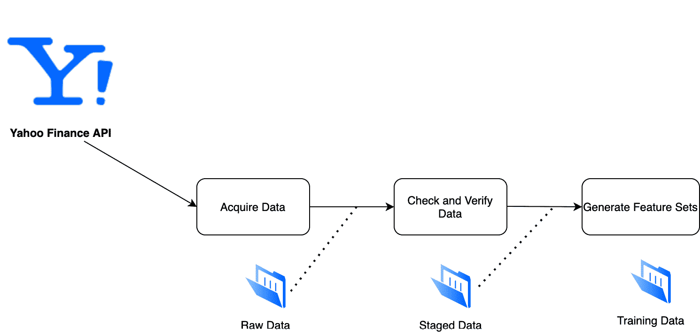

# 七、数据和特征管理

在本章中，我们将在正在构建的机器学习平台中添加一个特征管理数据层。我们将利用 MLflow 项目模块的功能来构建我们的数据管道。

具体来说，我们将了解本章的以下部分:

*   构建您的数据管道项目
*   获取股票数据
*   检查数据质量
*   管理功能

在本章中，我们将获取相关数据，为训练提供数据集。我们的主要资源将是雅虎财经 BTC 数据集的数据。除了这些数据，我们还将获得以下额外的数据集。

利用我们在 [*第 6 章*](B16783_06_Final_SB_epub.xhtml#_idTextAnchor106) 、*介绍 ML 系统架构*中介绍的生产化架构，如图*图 7.1* 所示，特性和数据组件负责从来源获取数据，并使数据以平台不同组件可消费的格式可用:


图 7.1–带有数据层参考的高级架构

让我们深入研究这一章，看看我们将如何用相关数据构建和填充数据层，以用于训练模型和生成特征。

# 技术要求

对于本章，您将需要以下先决条件:

*   最新版本的 Docker 安装在您的机器上。如果您尚未安装，请按照[https://docs.docker.com/get-docker/](https://docs.docker.com/get-docker/)中的说明进行操作。
*   安装了 docker-compose 的最新版本。请按照[https://docs.docker.com/compose/install/](https://docs.docker.com/compose/install/)的指示。
*   在命令行上访问 Git，并按照[https://Git-SCM . com/book/en/v2/Getting-Started-Installing-Git](https://git-scm.com/book/en/v2/Getting-Started-Installing-Git)中的描述进行安装。
*   访问 Bash 终端(Linux 或 Windows)。
*   访问浏览器。
*   Python 3.5 以上版本已安装。
*   本地安装您的机器学习的最新版本，如第三章 、*您的数据科学工作台*中所述。

在下一节中，我们将描述数据管道的结构、数据源，以及我们将执行的不同步骤，以实现利用 MLflow 项目特性打包项目的实际示例。

注意

直接从代码片段中复制和粘贴可能会导致编辑器出现问题。请参考位于 https://GitHub . com/packt publishing/Machine-Learning-Engineering-with-ml flow/tree/master/chapter 07 的章节的 GitHub 知识库

# 构建您的数据管道项目

在高层次上，我们的数据管道将每周运行，收集前 7 天的数据，并以机器学习作业可以运行的方式存储这些数据,以生成上游模型。我们将把数据文件夹分为三种类型的数据:

*   **原始数据**:从 Yahoo Finance API 中检索过去 90 天的数据生成的数据集。我们将以 CSV 格式存储数据——与从 API 接收的格式相同。我们将在 MLflow 中记录运行，并提取收集的行数。
*   **阶段数据**:在原始数据上，我们将运行质量检查、模式验证，并确认数据可以用于生产。有关数据质量的信息将记录在 MLflow Tracking 中。
*   **训练数据**:训练数据是数据管道的最终产品。必须对被认为干净且适合执行模型的数据执行。该数据包含被处理成可直接用于训练过程的特征的数据。

这个文件夹结构最初将在文件系统上实现，并在部署期间转移到相关的环境(例如:AWS S3、Kubernetes PersistentVolume 等等)。

为了执行我们的数据管道项目，我们将使用 **MLflow 项目**模块将数据管道打包成独立于执行环境的格式。我们将使用 Docker 格式来封装 **MLflow 项目**。Docker 格式为我们提供了不同的选项，根据部署我们项目的可用基础设施，在云中或内部部署我们的项目:



图 7.2–带有数据层参考的高级架构

我们的工作流程将执行以下步骤，如图*图 7.2* 所示:

1.  `data/raw/data.csv folder`。
2.  `data/staged/data.csv file`。
3.  `data/training/data.csv location`。

通过这三个不同的阶段，我们确保了训练数据生成过程的可再现性、可见性以及该过程的不同步骤的清晰分离。

我们将从将 MLflow 项目组织成步骤并为管道的每个组件创建占位符开始:

1.  在本地机器上创建一个名为`psytock-data-features`的新文件夹。
2.  添加`MLProject file` :

    ```py
    name: pystock_data_features conda:   file: conda.yaml entry_points:   data_acquisition:     command: "python data_acquisition.py"   clean_validate_data:     command: "python clean_validate_data.py "   feature_set_generation:     command: "python feature_set_generation.py"   main:     command: "python main.py"
    ```

3.  添加以下`conda.yaml`文件:

    ```py
        name: pystock-data-features channels:   - defaults dependencies:   - python=3.8   - numpy   - scipy   - pandas   - cloudpickle   - pip:     - git+git://github.com/mlflow/mlflow     - pandas_datareader     - great-expectations==0.13.15     
    ```

4.  您现在可以添加一个示例`main.py`文件到文件夹中，以确保项目的基本结构是工作的:

    ```py
    import mlflow import click def _run(entrypoint, parameters={}, source_version=None, use_cache=True):     #existing_run = _already_ran(entrypoint, parameters, source_version)     #if use_cache and existing_run:     #    print("Found existing run for entrypoint=%s and parameters=%s" % (entrypoint, parameters))      #   return existing_run     print("Launching new run for entrypoint=%s and parameters=%s" % (entrypoint, parameters))     submitted_run = mlflow.run(".", entrypoint, parameters=parameters)     return submitted_run @click.command() def workflow():     with mlflow.start_run(run_name ="pystock-data-pipeline") as active_run:         mlflow.set_tag("mlflow.runName", "pystock-data-pipeline")         _run("load_raw_data")         _run("clean_validate_data")         _run("feature_set_generation")                   if __name__=="__main__":     workflow()
    ```

5.  Test the basic structure by running the following command:

    ```py
    mlflow run .
    ```

    这个命令将基于您的`conda.yaml`文件创建的环境构建您的项目，并运行您刚刚创建的基本项目。它应该会出错，因为我们需要添加丢失的文件。未找到*文件*错误将如下所示:

    ```py
    python: can't open file 'check_verify_data.py': [Errno 2] No such file or directory
    ```

在这个阶段，我们有了我们将在本章中构建的数据管道的 MLflow 项目的基本模块。接下来，我们将填写 Python 脚本来获取下一节中的数据。

# 采集股票数据

我们获取数据的脚本将基于`pandas-datareader Python package`。它为远程财务 API 提供了一个简单的抽象，我们可以在未来的管道中加以利用。抽象非常简单。给定一个数据源，比如 Yahoo Finance，您提供股票代码/对和日期范围，数据在 DataFrame 中提供。

我们现在将创建`load_raw_data.py file`，它将负责加载数据并将其保存在`raw`文件夹中。您可以在位于 https://github . com/packt publishing/Machine-Learning-Engineering-with-ml flow/blob/master/chapter 07/psy stock-data-features-main/load _ raw _ data . py 的存储库中查看该文件的内容。

1.  我们将从导入相关的包开始:

    ```py
    import mlflow from datetime import date from dateutil.relativedelta import relativedelta import pprint import pandas import pandas_datareader.data as web
    ```

2.  接下来，您应该添加一个函数来检索数据:

    ```py
    if __name__ == "__main__":          with mlflow.start_run(run_name="load_raw_data") as  run:         mlflow.set_tag("mlflow.runName", "load_raw_data")         end = date.today()         start = end + relativedelta(months=-3)                  df = web.DataReader("BTC-USD", 'yahoo', start, end)         df.to_csv("./data/raw/data.csv")     
    ```

现在我们已经获得了数据，我们需要应用我们将在下一节中介绍的最佳实践——一种检查所获得数据的数据质量的方法。

# 检查数据质量

作为机器学习系统的一部分，检查数据质量对于确保模型训练和推理的完整性和正确性极其重要。应该借鉴软件测试和质量的原则，用在机器学习平台的数据层。

从数据质量的角度来看，在数据集中有几个关键的维度用于评估和描述我们的数据，即:

*   **模式一致性**:确保数据来自预期的类型；确保数值不包含任何其他类型的数据
*   **有效数据**:从数据角度评估数据从业务角度是否有效
*   **缺失数据**:评估运行分析和算法所需的所有数据是否可用

对于数据验证，我们将使用*远大前程* Python 包(可在[https://github.com/great-expectations/great_expectations](https://github.com/great-expectations/great_expectations)获得)。它允许使用许多数据兼容包对数据进行断言，比如 pandas、Spark 和云环境。它在 JSON 中提供了一个 DSL，用它来声明我们希望我们的数据符合的规则。

对于我们当前的项目，我们希望以下规则/约束是可验证的:

*   日期值应为有效日期，不能缺失。
*   检查数值和长值是否正确键入。
*   所有列都出现在数据集中。

我们现在将创建`check_verify_data.py file`，它将负责加载数据并将其保存在`staging`文件夹中，其中所有数据都是有效的，并准备好用于 ML 训练。您可以在 https://github . com/packt publishing/Machine-Learning-Engineering-with-ml flow/blob/master/chapter 07/psy stock-data-features-main/check _ verify _ data . py 的存储库中查看文件的内容。

1.  为了转换前面的规则，以便我们的系统可以依赖它们，我们需要导入以下依赖项:

    ```py
    import mlflow from datetime import date from dateutil.relativedelta import relativedelta import pprint import pandas_datareader import pandas from pandas_profiling import ProfileReport import great_expectations as ge from great_expectations.profile.basic_dataset_profiler import BasicDatasetProfiler
    ```

2.  接下来，我们将实现脚本:

    ```py
    if __name__ == "__main__":     with mlflow.start_run(run_name="check_verify_data") as run:         mlflow.set_tag("mlflow.runName", "check_verify_data")         df = pandas.read_csv("./data/raw/data.csv")         describe_to_dict=df.describe().to_dict()         mlflow.log_dict(describe_to_dict,"describe_data.json")         pd_df_ge = ge.from_pandas(df)         assert pd_df_ge.expect_column_values_to_match_ strftime_format("Date", "%Y-%m-%d").success == True         assert pd_df_ge.expect_column_values_to_be_of_ type("High", "float").success == True         assert pd_df_ge.expect_column_values_to_be_of_type("Low", "float").success == True         assert pd_df_ge.expect_column_values_to_be_of_type("Open", "float").success == True         assert pd_df_ge.expect_column_values_to_be_of_type("Close", "float").success == True         assert pd_df_ge.expect_column_values_to_be_of_type("Volume", "long").success == True         assert pd_df_ge.expect_column_values_to_be_of_type("Adj Close", "float").success == True
    ```

3.  现在我们可以进展到做一点清洁:

    ```py
            #we can do some basic cleaning by dropping the null values         df.dropna(inplace=True)         #if data_passes_quality_can_go_to_features:         df.to_csv("data/staging/data.csv")
    ```

验证了要使用的数据和阶段的质量后，现在可以很有把握地将其用于特征生成。

# 生成特征集和训练数据

我们将重构之前在本地环境中开发的一些代码，以生成用于训练的功能，从而将我们的 MLflow 项目的数据管道添加到我们的 MLflow 项目中。

我们现在将创建`feature_set_generation.py file`，它将负责生成我们的特征并将它们保存在`training`文件夹中，其中所有的数据都是有效的，并准备好用于 ML 训练。可以在资源库 https://github . com/packt publishing/Machine-Learning-Engineering-with-ml flow/blob/master/chapter 07/psy stock-data-features-main/feature _ set _ generation . py 中查看文件中的内容:

1.  我们需要导入以下依赖项:

    ```py
    import mlflow from datetime import date from dateutil.relativedelta import relativedelta import pprint import pandas as pd import pandas_datareader import pandas_datareader.data as web import numpy as np
    ```

2.  在深入研究代码的主要组成部分之前，我们现在将继续实现一个关键函数，通过将前一天与每一天的 *n* 的差异转换成一个我们将用来预测第二天的特性来生成特性，非常类似于我们在本书前面的章节中为我们的运行用例使用的方法

    ```py
    def rolling_window(a, window):     """         Takes np.array 'a' and size 'window' as parameters         Outputs an np.array with all the ordered sequences of values of 'a' of size 'window'         e.g. Input: ( np.array([1, 2, 3, 4, 5, 6]), 4 )              Output:                       array([[1, 2, 3, 4],                            [2, 3, 4, 5],                            [3, 4, 5, 6]])     """     shape = a.shape[:-1] + (a.shape[-1] - window + 1, window)     strides = a.strides + (a.strides[-1],)     return np.lib.stride_tricks.as_strided(a, shape=shape, strides=strides)
    ```

3.  接下来，我们将继续读取被视为干净并准备好供上游进程使用的暂存文件:

    ```py
        with mlflow.start_run() as run:         mlflow.set_tag("mlflow.runName", "feature_set_ generation")         btc_df = pd.read_csv("data/staging/data.csv")         btc_df['delta_pct'] = (btc_df['Close'] - btc_df['Open'])/btc_df['Open']         btc_df['going_up'] = btc_df['delta_pct'].apply(lambda d: 1 if d>0.00001 else 0).to_numpy()         element=btc_df['going_up'].to_numpy()         WINDOW_SIZE=15         training_data = rolling_window(element, WINDOW_SIZE)         pd.DataFrame(training_data).to_csv("data/training/data.csv", index=False)
    ```

我们生成特征集和特征。我们现在能够运行从数据采集到特征生成的所有端到端管道。

## 运行您的端到端管道

在这一节中，我们将运行完整的示例，您可以从以下地址检索到该书在`/Chapter07/psytock-data-features-main`文件夹中的 GitHub 资源库。*图 7.3* 展示了项目的完整文件夹结构，您可以在 GitHub 中查看并与您的本地版本进行比较:


图 7.3–文件夹结构

要端到端地运行管道，您应该在目录中执行以下命令，代码如下:

```py
mlflow run . --experiment-name=psystock_data_pipelines
```

它将基本上执行端到端管道，您可以直接在 MLflow UI 中检查它，按顺序运行管道的每个步骤:

```py
mlflow ui
```

您可以在 [http://localhost:5000](http://localhost:5000) 运行并浏览 MLflow 中的跟踪信息。

在*图 7.4* 中，您可以在嵌套的工作流格式中看到主项目和管道阶段的子项目的不同运行，您可以浏览以检查细节:


图 7.4–带有数据层参考的高级架构

在*图 7.5* 中，您可以看到对数据管道`load_raw_data`阶段的引用，并检查其开始和停止的时间以及使用的参数:


图 7.5–带有数据层参考的高级架构

在*图 7.6* 中，您可以看到对数据管道`check_verify_data`阶段的引用，在此阶段，我们记录了获得的数据集的一些基本统计信息:


图 7.6–带有数据层参考的高级架构

如果检测到任何数据质量问题，工作流将失败，并清楚地指示哪个部分失败，如图*图 7.7* 所示:


图 7.7–检查错误

在本节中，我们总结了使用 MLflow 中的`MLProjects`模块实现的数据管道中的数据管理和特征生成过程的描述。我们现在来看看如何管理特征存储中的数据。

# 使用功能商店

特征库是数据之上的一个软件层，通过为推理系统提供一个接口来检索可用于推理或训练的特征集，从而抽象出数据的所有生产和管理过程。

在本节中，我们将通过使用 Feast(特征存储)来说明特征存储的概念，Feast 是一种用于管理机器学习特征并将其提供给生产模型的操作数据系统:


图 7.8–盛宴建筑(取自 https://docs.feast.dev/)

为了理解 Feast 如何工作以及它如何适合您的数据层组件(代码可从 https://github . com/packt publishing/Machine-Learning-Engineering-with-ml flow/tree/master/chapter 07/psy stock _ feature _ store 获得),请执行以下步骤:

1.  安装`feast` :

    ```py
    pip install feast==0.10
    ```

2.  初始化特征库:

    ```py
    feast init
    ```

3.  通过替换自动生成的`yaml`文件来创建您的特征定义:

    ```py
    project: psystock_feature_store registry: data/registry.db provider: local online_store:     path: data/online_store.db
    ```

4.  我们现在将导入特征定义的依赖关系:

    ```py
    from google.protobuf.duration_pb2 import Duration from feast import Entity, Feature, FeatureView, ValueType from feast.data_source import FileSource
    ```

5.  我们现在可以加载特征文件:

    ```py
    token_features = FileSource(     path="/data/features.csv",     event_timestamp_column="create_date",     created_timestamp_column="event_date", ) token= Entity(name="token", value_type=ValueType.STRING, description="token id",)
    ```

6.  我们现在可以添加一个特征视图:

    ```py
    hourly_view_features_token = FeatureView(     name="token_hourly_features",     entities=["token"],     ttl=Duration(seconds=3600 * 1),     features=[         Feature(name="prev_10days", dtype=ValueType.INT64),         Feature(name="prev_11days", dtype=ValueType.INT64),         Feature(name="prev_12days", dtype=ValueType.INT64),         Feature(name="prev_13days", dtype=ValueType.INT64)     ],     online=True,     input=token_features,     tags={}, )
    ```

7.  To deploy the feature store with the configurations added so far, we need to run the following command:

    ```py
    feast apply
    ```

    在此阶段，要素存储部署在您的环境中(在本例中为本地),并且要素存储可用于您的 MLflow 作业。

8.  我们现在可以进行特征检索，因为所有的特征都存储在特征库中:

    ```py
    import pandas as pd from datetime import datetime from feast import FeatureStore # entity_df generally comes from upstream systems event_data_point = pd.DataFrame.from_dict({     "token": ["btc","btc"],     "event_date": [         datetime(2021, 4, 12, 10, 59, 42),         datetime(2021, 4, 12, 8,  12, 10),     ] }) store = FeatureStore(repo_path=".") feature_loading_df = store.get_historical_features(     entity_df=entity_df,      feature_refs = [         'token_hourly_features:prev_3days',         'token_hourly_features:prev_4days',         'token_hourly_features:prev_5days'             ], ).to_df()
    ```

您现在可以将您的特性存储库集成到您的 MLflow 工作负载中。

在本节中，我们总结了使用 MLflow 中的`MLProjects module`实现的数据管道中的数据管理和特征生成过程的描述。我们现在准备在后续章节中处理生产环境部署。

# 总结

在本章中，我们介绍了 MLflow 及其与参考架构的功能管理数据层的集成。我们利用 MLflow 项目模块的功能来构建我们的数据管道。

介绍了重要的数据和要素管理层，明确了要素生成的需求，以及数据质量、验证和数据准备的概念。

我们将生产数据管道的不同阶段应用到我们自己的项目中。然后，我们将数据采集和质量检查正式化。在上一节中，我们介绍了特性库的概念以及如何创建和使用特性库。

在本书的下一章和下一节中，我们将重点关注将数据管道和功能应用于在生产中训练和部署数据管道的过程。

# 延伸阅读

为了加深您的知识，您可以参考以下链接中的文档:

[https://github . com/ml flow/ml flow/blob/master/examples/multi step _ workflow/ml project](https://github.com/mlflow/mlflow/blob/master/examples/multistep_workflow/MLproject)