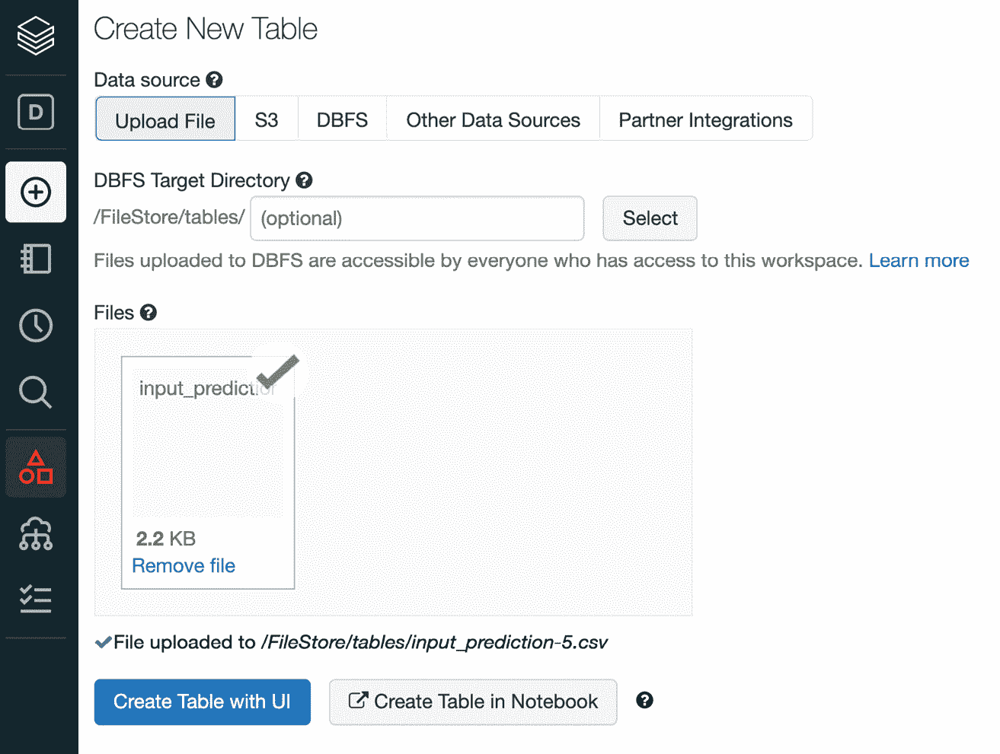
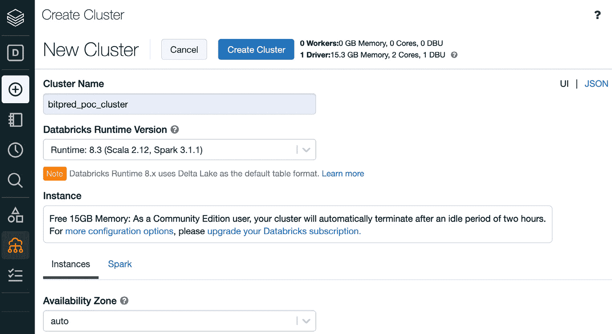
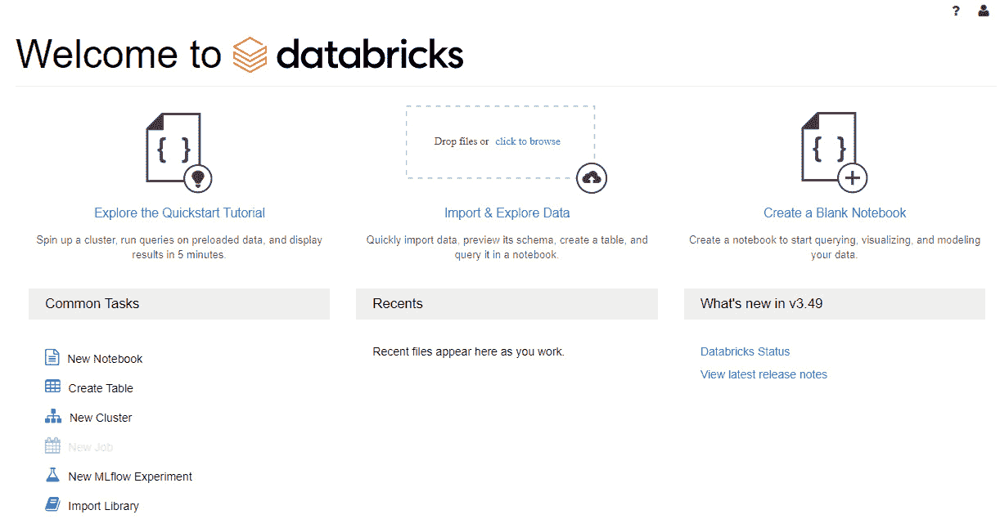
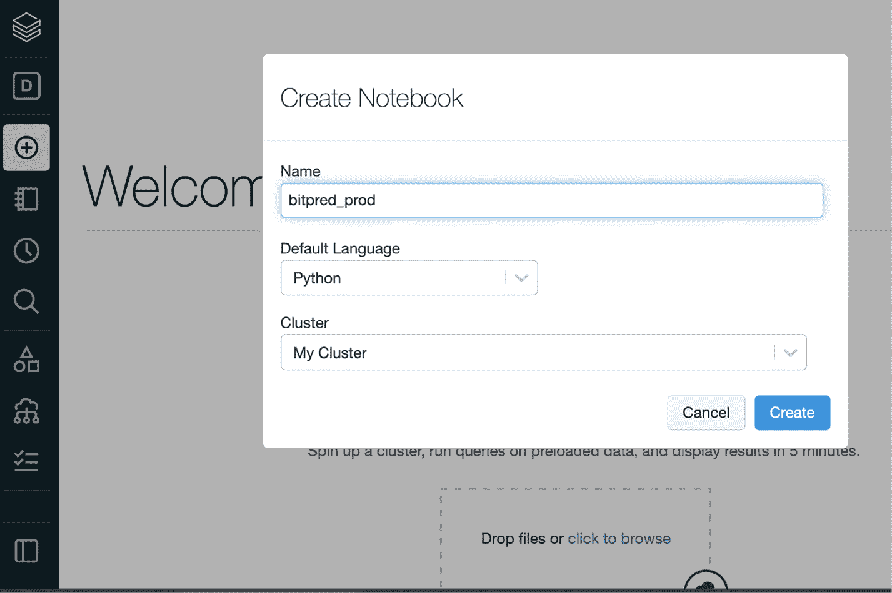
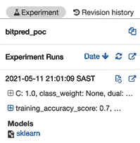

# 十、扩展你的机器学习工作流程

在这一章中，你将学习不同的技术和模式来在不同的可伸缩性维度上扩展你的**机器学习** ( **ML** )工作流。我们将研究如何使用 Databricks 托管环境来扩展您的 MLflow 开发能力，为您拥有更大数据集的情况添加 Apache Spark。我们将探索 NVIDIA RAPIDS 和**图形处理单元** ( **GPU** )支持，以及 Ray 分布式框架来加速您的 ML 工作负载。本章的格式是一个小型的**概念验证**，带有一个定义好的规范数据集来演示一种技术和工具链。

具体来说，我们将了解本章的以下部分:

*   使用 Databricks 社区版环境开发模型
*   将 MLflow 与 Apache Spark 集成
*   将 MLflow 与 NVIDIA RAPIDS (GPU)集成
*   将 MLflow 与 Ray 平台集成

本章将要求根据每个案例的标准官方文档，为每个引入的框架研究适当的设置。

# 技术要求

对于本章，您将需要以下先决条件:

*   最新版本的 Docker 安装在您的机器上。如果你还没有安装，请按照[https://docs.docker.com/get-docker/](https://docs.docker.com/get-docker/)的指示进行操作。
*   安装了最新版本的 Docker Compose 请按照[https://docs.docker.com/compose/install/](https://docs.docker.com/compose/install/)上的说明操作。
*   在命令行访问 Git，按照[https://Git-SCM . com/book/en/v2/Getting-Started-Installing-Git](https://git-scm.com/book/en/v2/Getting-Started-Installing-Git)中的描述安装。
*   访问 Bash 终端(Linux 或 Windows)。
*   访问浏览器。
*   Python 3.5 以上版本已安装。
*   如第 3 章 、*您的数据科学工作台*中所述，在本地安装您的 ML 库的最新版本。
*   一个被配置为运行 MLflow 模型的**Amazon Web Services**(**AWS**)账户。

# 使用 Databricks 社区版环境开发模型

在许多小型团队和公司的场景中，启动一个集中的 ML 环境可能是一项昂贵的、资源密集型的前期投资。一个团队能够快速扩展，并让团队跟上速度，这对于在组织中释放 ML 的价值是至关重要的。在这些情况下，使用托管服务对于开始原型系统和开始理解以较低成本使用 ML 的可行性是非常相关的。

一个非常流行的托管 ML 和数据平台是 Databricks 平台，由开发 MLflow 的同一家公司开发。在本节中，我们将使用 Databricks Community Edition 版本和许可证，供学生和个人使用。

为了探索 Databricks 平台以开发和共享模型，您需要执行以下步骤:

1.  在[https://community.cloud.databricks.com/](https://community.cloud.databricks.com/)注册 Databricks 社区版并创建一个帐户。
2.  使用您刚刚创建的凭据登录您的帐户。
3.  Upload training data into Databricks. You can start by uploading the training data available in the `Chapter10/databricks_notebooks/training_data.csv` folder. In the following screenshot, you can see represented the **Data** tab on the left, and you should see your file uploaded to the platform:

    图 10.1–将训练数据上传至数据块

4.  将训练数据上传到数据块。您可以从上传`Chapter10/databricks_notebooks/input_prediction.csv`文件夹中的训练数据开始。
5.  Create a cluster to use for your workloads. You are allowed to have clusters for your workloads with a limit of 15 **gigabytes** (**GB**) of **random-access memory** (**RAM**) and with usage for a defined period of time.

    在下面的屏幕截图中，您可以看到集群创建过程的概述:

    

    图 10.2–在 Databricks Community Edition 中创建集群

6.  Create a new notebook in your Databricks platform on your landing workspace page by clicking on the **Create a Blank Notebook** button at the top right of the page, as illustrated in the following screenshot:

    图 10.3–在 Databricks Community Edition 中创建新笔记本

7.  We are now ready to start a notebook to execute a basic training job in this managed environment. You can start by clicking on **Create Notebook**, as illustrated in the following screenshot:

    图 10.4–创建新笔记本

8.  将训练数据上传至数据块。您可以从上传`Chapter10/databricks_notebooks/input_prediction.csv`文件夹中的训练数据开始。
9.  导入所需的库。我们将采用一个`LogicRegression`模型来对我们正在运行的`btc-usd`股票价格的业务案例进行分类，如下:

    ```
    import pandas import numpy as np import mlflow from sklearn.linear_model import LogisticRegression from sklearn.metrics import f1_score, confusion_matrix from sklearn.model_selection import train_test_split
    ```

10.  为了读取数据，由于使用了平台中的 Databricks 文件系统，在 Spark 中读取数据并在此后将数据帧转换为`pandas`更加方便。像往常一样，我们还将数据分为训练集和测试集。这里的是你需要的代码:

    ```
    df = (spark.read.option("header","true").csv("/FileStore/tables/training_data.csv")) pandas_df = df.toPandas() X=pandas_df.iloc[:,:-1] Y=pandas_df.iloc[:,-1] X_train, X_test, y_train, y_test = train_test_split(X, Y, test_size=0.33, random_state=4284, stratify=Y)
    ```

11.  我们的下一步将是快速训练我们的分类器，如下:

    ```
    mlflow.sklearn.autolog() model = LogisticRegression() with mlflow.start_run(run_name='logistic_regression_model_baseline') as run:     model.fit(X_train, y_train)     preds = model.predict(X_test)
    ```

12.  In the top corner of the page, you can click on the **Experiment** button to view more details about your run, and you can click further to look at your model experiment, in the familiar interface of experiments, as illustrated in the following screenshot:

    图 10.5–实验按钮

13.  一个有趣的功能可以扩展并加速您与其他人的协作能力，这就是发布模型笔记本的能力，与您共享链接的每个人都可以公开访问该模型笔记本，如下图所示:


图 10.6–发布笔记本

您还可以将笔记本导出为一个`dbc`文件，这样您就可以在 Databricks 环境中快速启动它，并且您还可以在存储库中共享它，正如您在`/databricks-notebooks/bitpred_poc.dbc`下的章节文件夹中所看到的。

已经讨论了使用 Databricks 环境扩展您运行、开发和分发模型的能力的方法，我们接下来将着眼于将 Apache Spark 流集成到我们的推理工作流中，以处理我们可以访问大型数据集的场景。

# 集成 MLflow 和 Apache Spark

Apache Spark 是一个非常可扩展和流行的大数据框架，允许大规模的数据处理。有关更多详情和文档，请前往[https://spark.apache.org/](https://spark.apache.org/)。作为一个大数据工具，它可以用来加速你的部分 ML 推理，因为它可以在训练或推理级别设置。

在这种特殊情况下，我们将说明如何实现它，以使用上一节中在 Databricks 环境上开发的模型来将批处理推理作业扩展到更大的数据量。

为了探索 Spark 与 MLflow 的集成，我们将执行以下步骤:

1.  用 Python 创建一个名为`inference_job_spark`的新笔记本，链接到刚刚创建了`bitpred_poc.ipynb`笔记本的运行集群。
2.  将您的数据上传到`dbfs`环境中的文件/上传数据链接。
3.  在笔记本的单元格中执行以下脚本，将`logged_model`和`df`文件名更改为您环境中的文件名:

    ```
    import mlflow logged_model = 'runs:/6815b44128e14df2b356c9db23b7f936/model' df = spark.read.format("csv").load("dbfs:/FileStore/shared_uploads/ input.csv") # Load model as a Spark UDF. loaded_model = mlflow.pyfunc.spark_udf(spark, model_uri=logged_model) # Predict on a Spark DataFrame. df.withColumn('predictions', loaded_model()).collect()
    ```

这个在数据块或你自己的 Spark 集群上运行的说明性摘录可以扩展到大型数据集，在 Spark 中使用分布式计算的能力。

根据 Apache Spark 的扩展推理，我们现在将看看如何在 MLflow 的支持下使用 GPU 来扩展超参数优化作业。

# 将 MLflow 与 NVIDIA RAPIDS (GPU)集成

训练和调整 ML 模型是一项耗时且计算量大的操作，也是能够从并行处理中获益最多的操作之一。我们将在这一部分探讨如何将您的 MLflow 训练工作(包括超参数优化)与 NVIDIA RAPIDS 框架相集成。

要集成 NVIDIA RAPIDS 库，请执行以下步骤:

1.  Install RAPIDS in the most convenient way for your environment, outlined as follows:

    a.[https://rapids.ai/start.html](https://rapids.ai/start.html)包含部署选项的详细信息。

    b.[https://developer . NVIDIA . com/blog/run-RAPIDS-on-Google-Colab/](https://developer.nvidia.com/blog/run-rapids-on-google-colab/)详细介绍了如何在**Google co laboratory**(**Google Colab**)上运行 RAPIDS。

2.  在您的环境中安装 MLflow。
3.  导入需要的库，如下:

    ```
    import argparse from functools import partial import mlflow import mlflow.sklearn from cuml.metrics.accuracy import accuracy_score from cuml.preprocessing.model_selection import train_test_split from cuml.ensemble import RandomForestClassifier from hyperopt import fmin, tpe, hp, Trials, STATUS_OK
    ```

4.  实现`load_data`函数，这是一个帮助函数，用于加载`cudf`要使用的数据。DataFrame 是一个数据帧库，用于在不知道**计算统一设备架构** ( **CUDA** 编程细节的情况下进行加载、连接、聚合和过滤。这是你需要的代码:

    ```
    def load_data(fpath):     import cudf     df = cudf.read_parquet(fpath)     X = df.drop(["ArrDelayBinary"], axis=1)     y = df["ArrDelayBinary"].astype("int32")     return train_test_split(X, y, test_size=0.2)Start the ray server  ray.init() client = serve.start()
    ```

5.  定义一个训练循环，如下:

    ```
    def _train(params, fpath):     max_depth, max_features, n_estimators = params     max_depth, max_features, n_estimators = (int(max_ depth), float(max_features), int(n_estimators))     X_train, X_test, y_train, y_test = load_data(fpath)     mod = RandomForestClassifier(         max_depth=max_depth, max_features=max_features, n_estimators=n_estimators     )     mod.fit(X_train, y_train)     preds = mod.predict(X_test)     acc = accuracy_score(y_test, preds)     mlparams = {         "max_depth": str(max_depth),         "max_features": str(max_features),         "n_estimators": str(n_estimators),     }     mlflow.log_params(mlparams)     mlflow.log_metric("accuracy", acc)     mlflow.sklearn.log_model(mod, "saved_models")     return {"loss": acc, "status": STATUS_OK}
    ```

6.  调用的内训练循环，像这样:

    ```
    def train(params, fpath, hyperopt=False):          with mlflow.start_run(nested=True):         return _train(params, fpath, hyperopt)
    ```

7.  如果您使用的是 Docker 中部署的版本，那么通过读取一个参数来设置您的主流程。完成这项工作的代码如下面的代码片段所示:

    ```
    if __name__ == "__main__":     parser = argparse.ArgumentParser()     parser.add_argument("--algo", default="tpe",  choices=["tpe"], type=str)     parser.add_argument("--conda-env", required=True, type=str)     parser.add_argument("--fpath", required=True, type=str)     args = parser.parse_args()
    ```

8.  定义要优化的试验和参数，如下:

    ```
        search_space = [         hp.uniform("max_depth", 5, 20),         hp.uniform("max_features", 0.1, 1.0),         hp.uniform("n_estimators", 150, 1000),     ]     trials = Trials()     algorithm = tpe.suggest if args.algo == "tpe" else None     fn = partial(train, fpath=args.fpath, hyperopt=True)     experid = 0
    ```

9.  运行你的主循环，如下:

    ```
        artifact_path = "Airline-Demo"     artifact_uri = None     with mlflow.start_run(run_name="RAPIDS-Hyperopt"):         argmin = fmin(fn=fn, space=search_space, algo=algorithm, max_evals=2, trials=trials)         print("===========")         fn = partial(train, fpath=args.fpath, hyperopt=False)         final_model = fn(tuple(argmin.values()))         mlflow.sklearn.log_model(             final_model,             artifact_path=artifact_path,             registered_model_name="rapids_mlflow_cli",             conda_env="envs/conda.yaml",         )
    ```

在处理了使用高度可扩展的计算环境来为基于 Ray 平台的模型提供服务之后，我们现在将考虑一个不同的问题，在这里我们将查看在一个集中的云位置跟踪来自本地机器的多次运行的选项。

# 将 MLflow 与 Ray 平台集成

Ray 框架([https://docs.ray.io/en/master/](https://docs.ray.io/en/master/))是一个分布式平台，允许你快速扩展部署基础设施。

使用 Ray，您可以在运行需要以与模型服务相同的方式扩展的 ML 平台时添加任意逻辑。它基本上是一个 web 框架。

我们将使用的模型和内容预加载到存储库的以下文件夹中:https://github . com/packt publishing/Machine-Learning-Engineering-with-ml flow/tree/master/chapter 10/ml flow-ray-serve-integration。

为了将您的模型服务执行到 Ray 中，请执行以下步骤:

1.  通过运行以下命令安装 Ray 包:

    ```
    pip install -U ray
    ```

2.  在您的环境中安装 MLflow。
3.  导入需要的库，如下:

    ```
    import ray from ray import serve import mlflow.pyfunc
    ```

4.  实现模型后端，这基本上意味着将模型服务功能包装到你的 Ray 服务环境中。以下是您需要的代码:

    ```
    class MLflowBackend:     def __init__(self, model_uri):         self.model = mlflow.pyfunc.load_model(model_ uri=model_uri)     async def __call__(self, request):         return self.model.predict(request.data)
    ```

5.  启动射线服务器，如下:

    ```
    ray.init() client = serve.start()
    ```

6.  加载模型并创建一个后端，就像这样:

    ```
    model_uri = "./tmp/0/31fc9974587243d181fdbebfd4d2b6ad/artifacts/model" client.create_backend("mlflow_backend", MLflowBackend, model_uri)
    ```

7.  通过运行以下命令测试服务平台:

    ```
    ray start --head # Start local Ray cluster. serve start # Start Serve on the local Ray cluster.
    ```

在处理了使用高度可扩展的计算环境在 Ray 平台上服务模型之后，我们将在下一章中查看性能和监控 g 组件。

# 总结

在这一章中，我们关注于使用 Databricks 环境来扩展您运行、开发和分发模型的能力。我们还考虑将 Apache Spark 流集成到我们的批处理推理工作流中，以处理我们可以访问大型数据集的场景。

我们总结了两种扩展超参数优化和**应用编程接口** ( **API** )的方法，使用 NVIDIA RAPIDS 框架和 Ray 分布式框架提供可扩展性。

在下一章和本书的后续章节中，我们将关注 ML 模型的可观察性和性能监控。

# 延伸阅读

为了加深您的知识，您可以参考以下链接中的文档:

*   [https://www . ml flow . org/docs/latest/python _ API/ml flow . sage maker . html](https://www.mlflow.org/docs/latest/python_api/mlflow.sagemaker.html)
*   [https://AWS . Amazon . com/blogs/machine-learning/managing-your-machine-learning-life cycle-with-ml flow-and-Amazon-sage maker/](https://aws.amazon.com/blogs/machine-learning/managing-your-machine-learning-lifecycle-with-mlflow-and-amazon-sagemaker/)
*   [https://docs.databricks.com/applications/mlflow/index.html](https://docs.databricks.com/applications/mlflow/index.html)