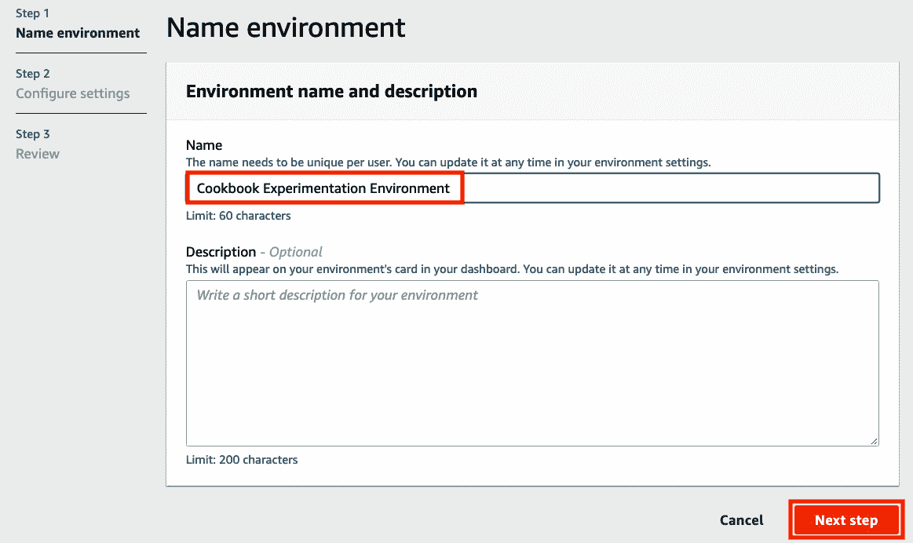

# 二、构建和使用自己的算法容器映像

在前一章中，我们使用名为**线性学习器**的**亚马逊 SageMaker** 内置算法进行了一个简化的端到端机器学习实验。在写的时候有 17 个内置算法可以选择！根据我们的要求，我们可能会简单地从这 17 个内置算法中选择一个或多个算法来解决我们的机器学习问题。在现实生活中，我们将处理预训练模型和其他算法，这些算法不在 SageMaker 的内置算法列表中。Amazon SageMaker 的优势之一是它的灵活性，并通过使用自定义容器映像支持自定义模型和算法。比方说，你想使用 SageMaker 内置算法列表中没有的算法，比如**支持向量机** ( **SVM** )，来解决你的机器学习问题。如果是这样的话，那么这一章就是给你看的！


图 2.1–第 2 章配方

在这一章中，我们将在亚马逊 SageMaker**中创建和使用我们自己的算法容器映像。通过这种方法，我们可以使用任何定制的脚本、库、框架或算法。本章将告诉我们如何通过定制的容器映像来充分利用亚马逊 SageMaker。如上图所示，我们将首先使用 **AWS Cloud9** 建立一个基于云的集成开发环境，在构建容器映像之前，我们将在其中准备、配置和测试脚本。一旦我们准备好了环境，我们将在这个环境中编码火车和服务脚本。训练脚本将在训练期间使用，而服务脚本将用于部署模型的推理端点。然后，我们将准备一个 docker 文件，它利用了我们在前面的步骤中生成的 train 和 serve 脚本。一旦这个 docker 文件准备就绪，我们将构建定制的容器映像，并使用容器映像通过 **SageMaker Python SDK** 进行训练和推理。我们将在 Python 和 r 中研究这些步骤。**

我们将在本章中介绍以下配方:

*   启动和准备**云 9** 环境
*   设置 Python 和 R 实验环境
*   用 Python 编写和测试训练脚本
*   在 Python 中准备和测试 serve 脚本
*   构建和测试自定义 Python 算法容器映像
*   将定制 Python 算法容器映像推送到一个 **Amazon ECR** 存储库中
*   使用自定义 Python 算法容器映像，通过 **Amazon SageMaker 本地模式**进行训练和推理
*   在 R 中准备和测试训练脚本
*   在 R 中准备和测试 serve 脚本
*   构建和测试自定义 R 算法容器映像
*   将自定义 R 算法容器映像推送到一个 **Amazon ECR** 存储库中
*   使用自定义的 R 算法容器图像进行训练和推理，使用 **Amazon SageMaker 本地模式**

在我们完成本章的食谱后，我们将准备在 **SageMaker** 中使用我们自己的算法和自定义容器映像。这将大大扩展我们在内置算法和由 **SageMaker** 提供的容器映像之外所能做的事情。与此同时，本章中使用的技术和概念将为您提供处理类似需求所需的经验，您将在接下来的章节中看到这一点。

# 技术要求

要完成本章中的食谱，您需要以下内容:

*   一个正在运行的**亚马逊 SageMaker** 笔记本实例(例如 ml.t2.large)。请随意使用我们在第一章 、*的*启动亚马逊 SageMaker 笔记本实例*配方[、*中启动的 SageMaker 笔记本实例。*](B16850_01_Final_ASB_ePub.xhtml#_idTextAnchor020)*
*   管理**亚马逊 SageMaker** 、**亚马逊 S3** 和 **AWS Cloud9** 资源的权限，如果你正在使用一个带有自定义 URL 的 **AWS IAM** 用户。在大多数情况下，建议以 AWS IAM 用户身份登录，而不是使用 root 帐户。有关更多信息，请随意查看[https://docs . AWS . Amazon . com/IAM/latest/user guide/best-practices . html](https://docs.aws.amazon.com/IAM/latest/UserGuide/best-practices.html)。

本书的 GitHub 资源库中提供了 Jupyter 笔记本、源代码和每章使用的 CSV 文件:[https://GitHub . com/packt publishing/Machine-Learning-with-Amazon-sage maker-Cookbook/tree/master/chapter 02](https://github.com/PacktPublishing/Machine-Learning-with-Amazon-SageMaker-Cookbook/tree/master/Chapter02)。

请点击以下链接查看动作视频中的相关代码:

https://bit.ly/38Uvemc

# 启动和准备 Cloud9 环境

在这个菜谱中，我们将启动并配置一个运行 **Ubuntu** 服务器的 **AWS Cloud9** 实例。这将作为本章中其他配方的实验和模拟环境。之后，我们将调整附加到实例的卷的大小，以便我们可以在以后构建容器映像。这将确保我们在使用 Docker 容器和容器映像时不必担心磁盘空间问题。在接下来的菜谱中，我们将准备我们的 train 和 serve 脚本在自定义容器中时所期望的文件和目录结构。

重要说明

为什么要花这么大力气准备一个实验环境呢？一旦我们完成了实验环境的准备，我们将能够快速准备、测试和更新定制脚本，而不必在编写脚本的初始阶段使用来自 **SageMaker Python SDK** 的 fit()和 deploy()函数。使用这种方法，反馈循环要快得多，我们甚至可以在培训和部署过程中尝试使用 **SageMaker Python SDK** 之前，检测到脚本和容器映像中的问题。

## 准备就绪

如果你使用一个有自定义 URL 的 **AWS IAM** 用户，确保你有权限管理 **AWS Cloud9** 和 **EC2** 资源。建议以 AWS IAM 用户的身份登录，而不是在大多数情况下使用 root 帐户。

## 怎么做……

该配方中的步骤可分为三个部分:

*   启动**云 9** 环境
*   增加环境的磁盘空间
*   确保通过重新启动与 **Cloud9** 环境相关的实例来反映卷配置的变化

我们将借助以下步骤启动 Cloud9 环境:

1.  Click **Services** on the navigation bar. A list of services will be shown in the menu. Under **Developer Tools**, look for **Cloud9** and then click the link to navigate to the Cloud9 console:

    图 2.2–在开发者工具下寻找 AWS Cloud9 服务

    在前面的截图中，我们可以看到在导航栏上点击的**服务**链接后的服务。

2.  In the Cloud9 console, navigate to **Your environments** using the sidebar and click **Create environment**:

    图 2.3–创建环境按钮

    在这里，我们可以看到**创建环境**按钮位于页面右上角附近。

3.  Specify the environment's name (for example, Cookbook Experimentation Environment) and, optionally, a description for your environment. Click **Next step** afterward:

    图 2.4–名称环境表单

    这里，我们有**Name environment**表单，在这里我们可以指定我们的 Cloud9 环境的名称和描述。

4.  Select the **Create a new EC2 instance for environment (direct access)** option under **Environment type**, **t3.small** under **Instance type**, and **Ubuntu Server 18.04 LTS** under **Platform**:

    图 2.5–环境设置

    我们可以在这里看到不同的配置设置。根据需要随意选择不同的实例类型。

5.  Under **Cost-saving setting**, select **After one hour**. Leave the other settings as-is and click **Next step**:

    图 2.6–其他配置设置

    这里我们可以看到在一个小时后我们选择了**的一个**节约成本设置**。这意味着在一个小时的不活动后，链接到cloud 9 环境的 EC2 实例将自动关闭以节省成本。**

6.  Review the configuration you selected in the previous steps and then click **Create environment**:

    图 2.7–创建环境按钮

    点击**创建环境**按钮后，可能需要一分钟左右的时间让环境准备就绪。环境准备就绪后，检查 IDE 的不同部分:

    

    图 2.8–AWS cloud 9 开发环境

    如你所见，我们在左侧有**文件树**。在屏幕的底部，我们有**终端**，在这里我们可以运行 Bash 命令。屏幕中央最大的部分是**编辑器**，我们可以在这里编辑文件。

    现在，我们需要增加磁盘空间。

7.  Using the Terminal at the bottom section of the IDE, run the following command:

    ```
    lsblk
    ```

    使用 lsblk 命令，我们将获得有关可用块设备的信息，如下面的屏幕截图所示:

    

    图 2.9–ls blk 命令的结果

    在这里，我们可以看到 lsblk 命令的结果。此时，根卷只有 10G 的磁盘空间(减去卷中已有的空间)。

8.  At the top left section of the screen, click **AWS Cloud9**. From the dropdown list, click **Go To Your Dashboard**:

    图 2.10–如何返回 AWS Cloud9 仪表板

    这将打开一个新标签，显示 Cloud9 仪表盘。

9.  Navigate to the EC2 console using the search bar. Type ec2 in the search bar and click the **EC2** service from the list of results:

    图 2.11–使用搜索栏导航到 EC2 控制台

    在这里，我们可以看到，在我们输入 ec2 之后，搜索栏很快给了我们一个搜索结果列表。

10.  In the EC2 console, click **Instances (running)** under **Resources**:

    图 2.12–资源下的实例(运行中)链接

    我们应该在**资源**窗格下看到我们需要点击的链接，如前面截图中的所示。

11.  选择与我们在前面一组步骤中启动的 Cloud9 环境相对应的 EC2 实例。它应该包含 aws-cloud9 和我们在创建环境时指定的名称。在显示详细信息的底部窗格中，单击**存储**选项卡以显示**根设备详细信息**和**块设备**。
12.  Inside the **Storage** tab, scroll down to the bottom of the page to locate the volumes under **Block devices**:

    图 2.13–存储选项卡

    在这里，我们可以看到**存储**选项卡显示**根设备细节**和**块设备**。

13.  您应该看到一个附加的卷，卷大小为 10 GiB。点击`10 GiB`下的链接。
14.  Click **Actions** and then **Modify Volume**:

    图 2.16–修改体积

    这就是我们可以找到**修改卷**选项的地方。

15.  Set **Size** to 100 and click **Modify**:

    图 2.17–修改卷

    如您所见，我们指定了 100 GiB 的新卷大小。这应该足以帮助我们完成本章并构建我们的自定义算法容器映像。

16.  Click **Yes** to confirm the volume modification action:

    图 2.18–修改卷确认对话框

    在前面的步骤中点击**修改**后，我们应该会看到一个确认界面。

17.  Click **Close** upon seeing the confirmation dialog:

    图 2.19–修改卷请求成功消息

    在这里，我们可以看到一条消息，说明**修改卷请求成功**。此时，卷修改仍处于挂起状态，我们需要等待大约 10-15 分钟才能完成。在等待的时候，请随意查看这个食谱的*工作原理……*部分。

18.  Click the refresh button (the two rotating arrows) so that the volume state will change to the correct state accordingly:

    图 2.20-刷新按钮

    点击刷新按钮会将**状态**从**使用中**(绿色)更新为**使用中——优化**(黄色):

    

    图 2.21-使用状态-优化(黄色)

    在这里，我们可以看到卷修改步骤尚未完成。

19.  After a few minutes, **State** of the volume will go back to **in-use** (green):

    图 2.22–使用中状态(绿色)

    当我们看到前面截图中显示的内容时，我们应该庆祝一下，因为这意味着卷修改步骤已经完成！

    现在，卷修改步骤已经完成，我们的下一个目标是确保这种变化反映在我们的环境中。

20.  Navigate back to the browser tab of the AWS Cloud9 IDE. In the Terminal, run lsblk:

    ```
    lsblk
    ```

    运行 lsblk 应该会产生以下输出:

    

    图 2.23–分区尚未反映根卷的大小

    如您所见，根卷/dev/nvme0n1 的大小反映了新的大小 100G，而/dev/nvme0n1p1 分区的大小反映了原始大小 10G。

    有多种方法可以增加分区，但是我们将通过简单地重新启动 EC2 实例来继续，这样/dev/nvme0n1p1 分区的大小将反映根卷的大小，即 100G。

21.  Navigate back to the **EC2 Volumes** page and select the EC2 volume attached to the Cloud9 instance. At the bottom portion of the screen showing the volume's details, locate the **Attachment information** value under the **Description** tab. Click the **Attachment information** link:

    图 2.24–附件信息

    点击这个链接会将我们重定向到 **EC2 实例**页面。它将自动选择我们的 Cloud9 环境的 EC2 实例:

    

    图 2.25–cloud 9 环境的 EC2 实例

    前面的截图显示了链接到我们的 Cloud9 环境的 EC2 实例。

22.  Click **Instance state** at the top right of the screen and click **Reboot instance**:

    图 2.26–重新启动实例

    在这里我们可以找到**重启实例**选项。

23.  Navigate back to the browser tab showing the AWS Cloud9 environment IDE. It should take a minute or two to complete the reboot step:

    图 2.27–实例仍在重新启动

    我们应该会看到一个类似于前面的屏幕。

24.  Once connected, run lsblk in the Terminal:

    ```
    lsblk
    ```

    我们应该会得到一组类似于下面截图所示的结果:


图 2.28–分区现在反映了根实例的大小

如我们所见,/dev/nvme0n1p1 分区现在反映了根卷的大小，为 100G。

这是一个很大的设置工作，但这绝对是值得的，正如你将在本章接下来的几个食谱中看到的。现在，让我们看看这是如何工作的！

## 工作原理……

在这个菜谱中，我们启动了一个 **Cloud9** 环境，我们将在其中准备定制的容器映像。在构建 Docker 容器映像时，需要注意的是每个容器映像都会消耗一点磁盘空间。这就是为什么我们必须通过几个步骤来增加我们的 Cloud9 环境的 EC2 实例的容量。这个方法由三部分组成:启动一个新的 Cloud9 环境、修改挂载的卷，以及重启实例。

启动一个新的 Cloud9 环境需要在幕后使用一个**云形成**模板。这个 **CloudFormation** 模板被用作创建 EC2 实例时的蓝图:


图 2.29–云形成堆栈

这里，我们有一个成功创建的 **CloudFormation** 堆栈。什么是云形成？ **AWS CloudFormation** 是一项服务，帮助开发人员和 DevOps 专业人员使用 JSON 或 YAML 编写的模板管理资源。使用 **CloudFormation** 服务将这些模板转换成 AWS 资源。

此时，EC2 实例应该已经在运行，我们也可以使用 Cloud9 环境了:


图 2.30–AWS cloud 9 环境

一旦 Cloud9 环境准备就绪，我们应该能够看到前面的输出。如果我们马上使用这个环境，我们会遇到磁盘空间问题，因为我们将使用 Docker 映像，它会占用一些空间。为了防止以后出现这些问题，我们修改了这个配方中的卷，并重新启动了 EC2 实例，以便卷的修改能够立即得到反映。

重要说明

在这个菜谱中，我们采取了一个快捷方式，简单地重启了 EC2 实例。如果我们运行的是生产环境，我们应该避免重新启动，而是遵循本指南:[https://docs . AWS . Amazon . com/AWS C2/latest/user guide/recognize-expanded-volume-Linux . html](https://docs.aws.amazon.com/AWSEC2/latest/UserGuide/recognize-expanded-volume-linux.html)。

注意，在 SageMaker 中使用自定义脚本和容器映像之前，我们还可以使用一个配置了 root 访问权限的 SageMaker Notebook 实例作为潜在的实验环境。这里的问题是，当使用 SageMaker Notebook 实例时，每次我们关闭并重新启动实例时，它都会恢复到最初的配置。这使得我们丢失了某些目录和已安装的包，这是不理想的。

# 建立 Python 和 R 实验环境

在之前的菜谱中，我们推出了一个 **Cloud9** 环境。在这个方法中，我们将在这个环境中准备预期的文件和目录结构。这将帮助我们准备和测试我们的 train 和 serve 脚本，然后在容器中运行它们，并在将它们与 **SageMaker Python SDK** 一起使用之前:


图 2.31–在/opt/ml 中预期的文件和目录结构

我们可以在上图中看到预期的目录结构。我们将在/opt/ml 中准备预期的目录结构。之后，我们将准备 hyperparameters.json、inputdataconfig.json 和 training_data.csv 文件。在接下来的菜谱中，我们将在准备和测试 train 和 serve 脚本时使用这些文件。

## 做好准备

以下是这个食谱的先决条件:

*   这个方法延续了*启动和准备 Cloud9 环境*的做法。
*   我们将需要来自*的 S3 桶准备亚马逊 S3 桶和用于第 1 章* 的 [*配方的线性回归实验*的训练数据集。我们还需要这个 S3 桶中的 training_data.csv 文件。在执行了训练-测试分割之后，我们将 CSV 文件上传到了第一章](B16850_01_Final_ASB_ePub.xhtml#_idTextAnchor020) 的*用 Python[*的*方法训练你的第一个模型中的 S3 桶。如果你跳过了这个食谱，你可以从这本书的 GitHub 资源库(](B16850_01_Final_ASB_ePub.xhtml#_idTextAnchor020)[https://GitHub . com/packt publishing/Machine-Learning-with-Amazon-sage maker-Cookbook](https://github.com/PacktPublishing/Machine-Learning-with-Amazon-SageMaker-Cookbook))上传 training_data.csv 文件到 S3 桶。*

## 怎么做……

在这个菜谱的第一组步骤中，我们将使用终端运行命令。我们将继续上一次*发布和准备 Cloud9 环境*的工作:

1.  使用 pwd 命令查看当前工作目录:

    ```
    pwd
    ```

2.  导航到/opt 目录:

    ```
    cd /opt
    ```

3.  使用 mkdir 命令创建/opt/ml 目录。在运行 sudo mkdir ml 命令之前，请确保您位于/opt 目录中。使用 chown 命令修改/opt/ml 目录的所有权配置。这将允许我们管理这个目录的内容，而不需要在后续步骤中反复使用 sudo:

    ```
    sudo mkdir -p ml sudo chown ubuntu:ubuntu ml
    ```

4.  Navigate to the ml directory using the cd Bash command. Run the following commands to prepare the expected directory structure inside the /opt/ml directory. Make sure that you are inside the ml directory before running these commands. The -p flag will automatically create the required parent directories first, especially if some of the directories in the specified path do not exist yet. In this case, if the input directory does not exist, the mkdir -p input/config command will create it first before creating the config directory inside it:

    ```
    cd ml
    mkdir -p input/config
    mkdir -p input/data/train
    mkdir -p output/failure
    mkdir -p model
    ```

    正如我们将在后面看到的，这些目录将包含文件和配置数据，当我们初始化评估器时，我们将把它们作为参数值传递。

    重要说明

    同样，如果你想知道我们为什么创建这些目录，答案是我们正在准备一个环境，在使用 **SageMaker Python SDK** 和 **API** 之前，我们可以先在那里测试和迭代构建我们的定制脚本。很难知道一个脚本是否在工作，除非我们在一个有相似目录和文件的环境中运行它。如果我们跳过这一步，直接在 **SageMaker Python SDK** 中使用定制的训练脚本，我们将花费大量时间调试潜在的问题，因为我们必须等待整个训练过程完成(至少 5-10 分钟)，然后才能修复脚本错误，并再次尝试查看修复是否有效。有了这个模拟环境，我们将能够测试我们的定制脚本，并在几秒钟内得到结果。如你所见，如果我们有一个模拟环境，我们可以快速迭代。

    以下是预期的目录结构:

    

    图 2.32-运行 mkdir 命令后预期的文件和文件夹结构

    在这里，我们可以看到/input 目录中有/config 和/data 目录。/config 目录将包含 hyperparameters.json 文件和 inputdataconfig.json 文件，我们将在后面看到。在本章的菜谱中，我们将不使用/output 目录，但在这里我们可以创建一个名为 failure 的文件，以防训练作业失败。失败文件应描述为什么培训工作失败，以帮助我们在失败场景发生时进行调试和调整。

5.  Install and use the tree command:

    ```
    sudo apt install tree
    tree
    ```

    我们应该得到一个类似如下的树形结构:

    

    图 2.33-树命令的结果

    在这里，我们可以看到预期的目录结构。

6.  使用 mkdir 创建/home/ubuntu/environment/opt 目录，并在其中创建两个名为 ml-python 和 ml-r:

    ```
    mkdir -p /home/ubuntu/environment/opt cd /home/ubuntu/environment/opt mkdir -p ml-python ml-r
    ```

    的目录
7.  Create a soft symbolic link to make it easier to manage the files and directories using the **AWS Cloud9** interface:

    ```
    sudo ln -s /opt/ml  /home/ubuntu/environment/opt/ml
    ```

    假设我们在一个 **Cloud9** 环境中执行这个步骤，我们将能够使用可视化编辑器轻松地创建和修改文件，而不是在命令行中使用 vim 或 nano。这意味着在/home/Ubuntu/environment/opt/ml 目录中所做的更改也将反映在/opt/ml 目录中。这将允许我们使用可视化编辑器轻松创建和修改文件:

    

    图 2.34–显示符号链接/opt/ml 目录的文件树

    我们应该在文件树中的/opt/ml 目录中看到目录，如前面的截图所示。

    下一组步骤集中在将虚拟文件添加到实验环境中。

8.  Using the file tree, navigate to the /opt/ml/input/config directory. Right-click on the **config** directory and select **New File**:

    图 2.35–在配置目录中创建新文件

9.  Name the new file hyperparameters.json. Double-click the new file to open it in the **Editor** pane:

    图 2.36–空的 hyperparameters.json 文件

    这里，/opt/ml/input/config 目录中有一个空的 hyperparameters.json 文件。

10.  Set the content of the hyperparameters.json file to the following line of code:

    ```
    {"a": 1, "b": 2}
    ```

    您的 Cloud9 环境 IDE 的文件树和**编辑器**窗格应该如下所示:

    

    图 2.37–为 hyperparameters.json 文件指定一个样本 JSON 值

    确保通过点击**文件**菜单，然后点击**保存**来保存。您也可以使用 *Cmd* + *S* 或 *Ctrl* + *S* 来保存文件，这取决于您正在使用的操作系统。

11.  In a similar fashion, create a new file called inputdataconfig.json inside /opt/ml/input/config. Open the inputdataconfig.json file in the **Editor** pane and set its content to the following line of code:

    ```
    {"train": {"ContentType": "text/csv", "RecordWrapperType": "None", "S3DistributionType": "FullyReplicated", "TrainingInputMode": "File"}}
    ```

    你的 Cloud9 环境 IDE 的文件树和**编辑器**面板应该如下所示:

    

    图 2.38–输入数据配置文件

    在下一组步骤中，我们将从 [*第 1 章*](B16850_01_Final_ASB_ePub.xhtml#_idTextAnchor020) 、*使用亚马逊 SageMaker* 开始机器学习下载 training_data.csv 文件到实验环境。在第一章[](B16850_01_Final_ASB_ePub.xhtml#_idTextAnchor020)*，*使用亚马逊 SageMaker* ，的*用 Python 训练你的第一个模型*配方中，我们上传了一个 training_data.csv 文件到亚马逊 S3 桶:*

    **

    *图 2.39–S3 存储桶中的 training_data.csv 文件*

    *如果你跳过了 [*第一章*](B16850_01_Final_ASB_ePub.xhtml#_idTextAnchor020) 中的这些食谱，确保你查看了这本书的 GitHub 资源库([https://GitHub . com/packt publishing/Machine-Learning-with-Amazon-sage maker-Cookbook](https://github.com/PacktPublishing/Machine-Learning-with-Amazon-SageMaker-Cookbook))，并将 training_data.csv 文件上传到 S3 木桶。请注意，本章中的配方假设 training_data.csv 文件位于 s3://s3_BUCKET/PREFIX/input 中，其中 S3_BUCKET 是 S3 存储桶的名称，PREFIX 是文件夹的名称。如果您尚未创建 S3 存储桶，请按照第 1 章 的*准备亚马逊 S3 存储桶和线性回归实验的训练数据集*中的步骤进行操作，因为我们将需要本书所有章节的 S3 存储桶。*

**   In the Terminal of the Cloud9 IDE, run the following commands to download the training_data.csv file from S3 to the /opt/ml/input/data/train directory:

    ```
    cd /opt/ml/input/data/train
    S3_BUCKET="<insert bucket name here>"
    PREFIX="chapter01"
    aws s3 cp s3://$S3_BUCKET/$PREFIX/input/training_data.csv training_data.csv
    ```

    确保将 S3 _ 桶值设置为您在第 1 章 的*准备亚马逊 S3 桶和线性回归实验*配方的 [*中创建的 S3 桶的名称。*](B16850_01_Final_ASB_ePub.xhtml#_idTextAnchor020)

    *   In the file tree, double-click the training_data.csv file inside the /opt/ml/input/data/train directory to open it in the **Editor** pane:

    图 2.40–实验环境中的 training_data.csv 文件

    如前面的屏幕截图所示，training_data.csv 文件在第一列中包含 y 值，在第二列中包含 x 值。

    在接下来的几个步骤中，我们将在终端中安装一些先决条件。

    *   在终端中，运行以下脚本，使 R 食谱在本章的后半部分发挥作用:

    ```
    sudo apt-get -y update sudo apt-get install -y --no-install-recommends wget sudo apt-get install -y --no-install-recommends r-base sudo apt-get install -y --no-install-recommends r-base-dev sudo apt-get install -y --no-install-recommends ca-certificates
    ```

    *   Install the command-line JSON processor; that is, jq:

    ```
    sudo apt install -y jq
    ```

    在这个菜谱的最后一组步骤中，我们将在ml-python 和 ml-r 目录中创建文件。在*构建和测试自定义 Python 算法容器映像*和*构建和测试自定义 R 算法容器映像*的方法中，我们将在使用 docker build 命令构建容器映像的同时在容器内部复制这些文件。

    *   Right-click on the ml-python directory and then click **New File** from the menu to create a new file, as shown here. Name the new file train:

    图 2.41–在 ml-python 目录中创建新文件

    再执行两次这个步骤，这样 ml-python 目录中就有三个文件，分别叫做 train、serve 和 Dockerfile。请注意，这些文件现在是空的:

    

    图 2.42–ml-python 目录中的文件

    前面的截图显示了这三个空文件。我们将在本章稍后的 Python 食谱中使用这些。

    *   类似地，在 ml-r 目录中创建四个新文件，分别名为 train、serve、api.r 和 Dockerfile:*

*

图 2.43–ml-r 目录中的文件

前面的屏幕截图显示了这四个空文件。我们将在本章后面的 R 食谱中用到这些。

让我们看看这是如何工作的！

## 工作原理……

在这个菜谱中，我们准备了实验环境，在这里我们将迭代地构建训练和服务脚本。准备培训和服务脚本是一个迭代过程。我们需要一个实验环境来确保脚本在运行容器中使用之前能够工作。如果没有预期的目录结构和虚拟文件，就很难测试和开发训练和服务脚本，从而无缝地转换到 SageMaker 上使用。

让我们讨论并快速描述训练脚本应该如何工作。训练脚本可以加载以下一项或多项:

*   hyperparameters.json:包含 Estimator 中的超参数配置数据集
*   json:包含存储训练数据集的信息
*   <directory>/ <data file="">:包含训练数据集的输入(例如，train/training.csv)</data></directory>

我们将在本章的*准备和测试 Python 中的训练脚本*和*准备和测试 R* 配方中的训练脚本中详细了解准备和测试训练脚本。

现在，我们来谈谈发球脚本。服务脚本需要/opt/ml/model 目录中的模型文件。请注意，这些文件中的一个或多个可能不存在，这取决于我们使用 **SageMaker Python SDK** 设置的配置参数和自变量。这也取决于我们写剧本需要什么。我们将在本章后面的*在 Python 中准备和测试 serve 脚本*和*在 R* recipes 中准备和测试 serve 脚本中详细了解准备和测试 serve 脚本。

## 还有更多……

由于我们将要研究 Python 和 R 的特定配方，我们需要对这些如何组合在一起有一个高层次的概念。在接下来的菜谱中，我们将构建一个包含 train 和 serve 脚本的定制容器映像。在使用 **SageMaker Python SDK** 进行培训和部署的过程中，将会用到这个容器映像。在这一节中，我们将简要讨论在使用自定义容器映像的同时运行 fit()函数时会发生什么。我相信在这里重申一下会很有启发性，我们构建这些目录和虚拟文件是为了创建 fit()和 deploy()命令将运行的 train 和 serve 脚本。

如果你想知道训练和服务脚本文件的用途，当使用来自 **SageMaker Python SDK** 的 fit()和 deploy()函数时，这些脚本文件由 **SageMaker** 在后台的容器内执行。我们将在本章的后面编写并测试这些脚本。当我们使用fit()功能时， **SageMaker** 开始训练工作。在幕后， **SageMaker** 执行以下步骤:

**准备和配置**

1.  启动一个或多个 ML 实例。训练作业的 ML 实例的数量和类型取决于初始化估计器类时指定的 instance_count 和 instance_type 参数:

    ```
    container="<insert image uri of the custom container image>" estimator = sagemaker.estimator.Estimator(     container,     instance_count=1,      instance_type='local',     ... ) estimator.fit({'train': train})
    ```

2.  使用 set_hyperparameters()函数指定的超参数被复制并存储为/opt/ml/input/config 目录中名为 hyperparameters.json 的 JSON 文件。请注意，我们的定制容器在开始时没有这个文件，当培训作业开始时， **SageMaker** 会自动为我们创建这个文件。

**培训**

1.  我们在 fit()函数中指定的输入数据将由 **SageMaker** 加载(例如，从指定的 S3 桶)并复制到/opt/ml/input/data/。对于每个输入数据通道，将在/opt/ml/input/data 目录中创建一个包含相关文件的目录。例如，如果我们使用下面的代码行，并使用了 **SageMaker Python SDK** ，那么当 train 脚本开始运行时，我们将会看到/opt/ml/input/data/apple 和/opt/ml/data/banana 目录:

    ```
    estimator.fit({'apple': TrainingInput(...),'banana': TrainingInput(...)})
    ```

2.  Next, your custom train script runs. It loads the configuration files, hyperparameters, and the data files from the directories inside /opt/ml. It then trains a model using the training dataset and, optionally, a validation dataset. The model is then serialized and stored inside the /opt/ml/modeldirectory.

    注意

    如果您不知道火车脚本是什么样子，请不要担心，因为我们将在后面的食谱中详细讨论火车脚本。

3.  **SageMaker** 需要/opt/ml/model 目录中的模型输出文件。训练脚本执行完成后， **SageMaker** 自动复制/opt/ml/model 目录的内容，并将其存储在目标 S3 桶和路径中(model.tar.gz 内)。请注意，在使用 **SageMaker Python SDK** 初始化估计器时，我们可以通过设置 output_path 参数来指定目标 S3 桶和路径。
4.  如果运行脚本时出现错误， **SageMaker** 将在/opt/ml/output 目录中查找失败文件。如果存在，当使用 DescribeTrainingJob API 时，将加载存储在该文件中的文本输出。
5.  创建的 ML 实例被删除。将可计费时间返回给用户。

**部署**

当我们使用 deploy()函数时， **SageMaker** 开始模型部署步骤。运行 deploy()函数时的假设是 model.tar.gz 文件存储在目标 S3 存储桶路径中。

1.  启动一个或多个 ML 实例。部署步骤的 ML 实例的数量和类型取决于使用 deploy()函数时指定的 instance_count 和 instance_type 参数:

    ```
    predictor = estimator.deploy(     initial_instance_count=1,      instance_type='local',      endpoint_name="custom-local-py-endpoint")
    ```

2.  model.tar.gz 文件是从 S3 存储桶中复制的，文件被提取到/opt/ml/model 目录中。
3.  接下来，您的定制服务脚本运行。它使用/opt/ml/model 目录中的模型文件来反序列化和加载模型。然后，serve 脚本使用所需的/ping 和/invocations 端点运行 API web 服务器。

**推论**

1.  在部署之后，predict()函数调用/invocations 端点来使用加载的模型进行推理。

这应该会让我们更好地理解我们在这个菜谱中准备的文件和目录的用途。如果你对这一部分的细节感到有点不知所措，不要担心，因为随着我们在本章接下来的几个食谱中的工作，事情会变得更清楚！

# 用 Python 编写和测试训练脚本

在这个菜谱中，我们将用 Python 编写一个训练脚本，允许我们用 scikit-learn 训练一个线性模型。在这里，我们可以看到一个正在运行的定制容器中的 train 脚本利用了超参数、输入数据和使用 **SageMaker Python SDK** 在 Estimator 实例中指定的配置:


图 2.44–如何使用训练脚本生成模型

运行训练作业时有多种选择——使用内置算法、使用自定义训练脚本和自定义 Docker 容器映像，或者使用自定义训练脚本和预构建的 Docker 映像。在本食谱中，我们将重点关注第二个选项，我们将准备并测试 Python 中的一个最基本的训练脚本，该脚本为一个特定的回归问题构建一个线性模型。

一旦我们完成了这个食谱，我们将会对 SageMaker 的幕后工作有更好的理解。我们将看到在哪里以及如何加载和使用我们在**SageMaker Python SDK**Estimator 中指定的配置和参数。

## 做好准备

确保你已经完成了*设置 Python 和 R 实验环境*的菜谱。

## 怎么做……

该配方中的第一组步骤主要是准备培训脚本。让我们开始吧:

1.  Inside the ml-python directory, double-click the train file to open the file inside the **Editor** pane:

    图 2.45–空的 ml-python/train 文件

    这里，我们有一个空的火车文件。在**编辑器**窗格的右下角，您可以将语法高亮设置更改为 Python。

2.  Add the following lines of code to start the train script to import the required packages and libraries:

    ```
    #!/usr/bin/env python3
    import json
    import pprint
    import pandas as pd
    from sklearn.linear_model import LinearRegression
    from joblib import dump, load
    from os import listdir
    ```

    在前面的代码块中，我们导入了以下内容:

    *   使用 json 数据时用于实用函数的 JSON
    *   pprint 帮助我们“漂亮地打印”嵌套结构，如字典
    *   熊猫帮助我们阅读 CSV 文件和处理数据帧
    *   来自 sklearn 库的 LinearRegression，用于在运行训练脚本时训练线性模型
    *   用于保存和加载模型的 joblib
    *   操作系统模块中的 listdir 来帮助我们列出目录中的文件
3.  Define the PATHS constant and the get_path() function. The get_path() function will be handy in helping us manage the paths and locations of the primary files and directories used in the script:

    ```
    PATHS = {
        'hyperparameters': 'input/config/hyperparameters.json',
        'input': 'input/config/inputdataconfig.json',
        'data': 'input/data/',
        'model': 'model/'
    }

    def get_path(key):
        return '/opt/ml/' + PATHS[key]
    ```

    如果我们想要获得 hyperparameters.json 文件的路径，我们可以使用 get _ path(“hyperparameters”)而不是在我们的代码中使用绝对路径。

    重要说明

    在本章中，我们将有意地使用 get_path 作为函数名。如果您使用 Python 已经有一段时间了，您可能会注意到这绝对不是 Python 代码！我们的目标是让我们很容易地找到 Python 和 R 脚本之间的相似之处和不同之处，所以我们在很大程度上让函数名相同。

4.  接下来，在上一步的 get_path()函数定义之后添加下面的行。一旦我们需要加载和打印将要使用的 JSON 文件的内容(例如，hyperparameters.json)，这些额外的函数将会对我们有所帮助
5.  Include the following functions as well in the train script (after the print_json() function definition):

    ```
    def inspect_hyperparameters():
        print('[inspect_hyperparameters]')
        hyperparameters_json_path = get_path(
            'hyperparameters'
        )
        print(hyperparameters_json_path)

        hyperparameters = load_json(
            hyperparameters_json_path
        )
        print_json(hyperparameters)

    def list_dir_contents(target_path):
        print('[list_dir_contents]')
        output = listdir(target_path)
        print(output)

        return output
    ```

    inspect_hyperparameters()函数允许我们检查/opt/ml/input/config 目录中 hyperparameters.json 文件的内容。另一方面，list_dir_contents()函数允许我们显示目标目录的内容。我们稍后将使用它来检查培训输入目录的内容。

6.  之后，定义 inspect_input()函数。这允许我们检查/opt/ml/input/config 目录中 inputdataconfig.json 的内容:

    ```
    def inspect_input():     print('[inspect_input]')     input_config_json_path = get_path('input')     print(input_config_json_path)     input_config = load_json(input_config_json_path)     print_json(input_config)
    ```

7.  Define the load_training_data() function. This function accepts a string value pointing to the input data directory and returns the contents of a CSV file inside that directory:

    ```
    def load_training_data(input_data_dir):
        print('[load_training_data]')    
        files = list_dir_contents(input_data_dir)
        training_data_path = input_data_dir + files[0]
        print(training_data_path)

        df = pd.read_csv(
            training_data_path, header=None
        )
        print(df)

        y_train = df[0].values
        X_train = df[1].values
        return (X_train, y_train)
    ```

    load_training_data()函数内部的流程可以分为两个部分——获取包含训练数据的 CSV 文件的特定路径，然后使用 pd.read_csv()函数读取 CSV 文件的内容，并在一组列表中返回结果。

    注意

    当然，我们在这里实现的 load_training_data()函数假设该目录中只有一个 CSV 文件，所以当您在所提供的目录中处理多个 CSV 文件时，可以随意修改下面的实现。同时，这个函数实现只支持 CSV 文件，如果需要支持多种输入文件类型，一定要调整代码块。

8.  定义get _ input _ data _ dir()函数:

    ```
    def get_input_data_dir():     print('[get_input_data_dir]')     key = 'train'     input_data_dir = get_path('data') + key + '/'     return input_data_dir
    ```

9.  定义train _ model()函数:

    ```
    def train_model(X_train, y_train):     print('[train_model]')     model = LinearRegression()     model.fit(X_train.reshape(-1, 1), y_train)     return model
    ```

10.  定义 save_model()函数:

    ```
    def save_model(model):     print('[save_model]')     filename = get_path('model') + 'model'     print(filename)     dump(model, filename)     print('Model Saved!')
    ```

11.  Create the main() function, which executes the functions we created in the previous steps:

    ```
    def main():
        inspect_hyperparameters()
        inspect_input()
        input_data_dir = get_input_data_dir()
        X_train, y_train = load_training_data(
            input_data_dir
        )
        model = train_model(X_train, y_train)
        save_model(model)
    ```

    该函数只是检查超参数和输入配置，使用从输入数据目录加载的数据训练线性模型，并使用 save_model()函数保存模型。

12.  Finally, run the main() function:

    ```
    if __name__ == "__main__":
        main()
    ```

    当脚本作为主程序执行时，__name__ 变量被设置为“__main__”。如果我们将脚本作为主程序使用，这个 if 条件只是告诉脚本运行。如果这个脚本被另一个脚本导入，那么 main()函数将不会运行。

    小费

    您可以在*Machine Learning with Amazon sage maker Cookbook*GitHub 存储库中访问训练脚本文件的工作副本:[https://GitHub . com/packt publishing/Machine-Learning-with-Amazon-sage maker-Cookbook/blob/master/chapter 02/ml-python/train](https://github.com/PacktPublishing/Machine-Learning-with-Amazon-SageMaker-Cookbook/blob/master/Chapter02/ml-python/train)。

    现在我们已经完成了训练脚本，我们将使用终端来执行这个菜谱中的最后一组步骤。

    最后一组步骤集中在安装一些脚本先决条件:

13.  Open a new Terminal:

    图 2.46–新终端

    在这里，我们可以看到如何创建一个新的终端标签。我们只需点击加号( **+** )按钮，然后选择**新建终端**。

14.  In the Terminal at the bottom pane, run python3 --version:

    ```
    python3 --version
    ```

    运行这行代码应该会返回与下面的屏幕截图类似的结果:

    

    图 2.47–在终端中运行 python3 - version 的结果

    在这里，我们可以看到我们的环境使用的是 Python 版本 3.6.9。

15.  使用 pip 安装 pandas。 **pandas** 库是在处理数据帧(表格)时使用的:

    ```
    pip3 install pandas
    ```

16.  使用 pip 安装 sklearn。 **scikit-learn** 库是一个机器学习库，它的特色是几个用于分类、回归和聚类问题的算法:

    ```
    pip3 install sklearn
    ```

17.  导航到 ml-python 目录:

    ```
    cd /home/ubuntu/environment/opt/ml-python
    ```

18.  要使训练脚本可执行，在终端中运行以下命令:

    ```
    chmod +x train
    ```

19.  Test the train script in your **AWS Cloud9** environment by running the following command in the Terminal:

    ```
    ./train
    ```

    运行前面的行代码将产生类似如下的结果:


图 2.48–运行训练脚本的结果

在这里，我们可以看到由训练脚本生成的日志。在成功执行训练脚本之后，我们希望模型文件存储在/opt/ml/model 目录中。

现在，让我们看看这是如何工作的！

## 工作原理……

在这个菜谱中，我们使用 Python 准备了一个定制的训练脚本。该脚本首先识别输入路径并加载重要文件，以帮助设置执行的上下文。这个训练脚本演示了输入和输出值如何在 **SageMaker Python SDK** (或 API)和定制容器之间传递。它还演示了如何加载定型数据、定型模型和保存模型。

在初始化和配置 Estimator 对象时，在调用 fit()函数时，一些指定的值(包括超参数)会在 API 调用中从 Python 字典转换为 JSON 格式。然后，SageMaker 平台上的 API 调用在运行 train 脚本的环境中创建和挂载 JSON 文件。它的工作方式与训练脚本文件加载的其他文件相同，比如 inputdataconfig.json 文件。

如果您想知道 inputdataconfig.json 文件中有什么，请参考下面的代码块，查看它的示例:

```
{"<channel name>": {"ContentType": "text/csv", 
       "RecordWrapperType": "None",
       "S3DistributionType": "FullyReplicated",
       "TrainingInputMode": "File"}} 
```

对于每个输入通道，在该文件中指定了一组相应的属性。以下是该文件中使用的一些常见属性和值。当然，这里的值取决于数据类型和实验中使用的算法:

*   content type-**有效值** : text/csv、image/jpeg、application/x-recordio-proto buf 等等。
*   RecordWrapperType-**有效值**:无或 RecordIO。仅当 TrainingInputMode 值设置为 Pipe 时，才设置 RecordIO 值。定型算法要求输入数据采用 RecordIO 格式，但输入数据尚未采用 RecordIO 格式。
*   S3 distribution type-**有效值** : FullyReplicated 或 ShardedByS3Key。如果该值被设置为 FullyReplicated，则整个数据集被复制到在模型训练期间启动的每个 ML 实例上。另一方面，当值设置为 ShardedByS3Key 时，在模型训练期间启动和使用的每台机器都使用所提供的训练数据的子集。
*   TrainingInputMode-**有效值**:文件或管道。当使用文件输入模式时，在训练作业开始之前，首先下载整个数据集。另一方面，管道输入模式用于加速训练作业，启动速度更快，需要的磁盘空间更少。这在处理大型数据集时非常有用。如果您计划在自定义容器中支持管道输入模式，那么/opt/ml/input/data 目录中的目录会有所不同，并且将采用<通道名称> _ <纪元编号>的格式。如果我们在我们的实验环境中使用这个例子，我们将拥有名为 D1、D2…的目录，而不是在/opt/ml/input/data 目录中。确保您处理的场景处理的是尚不存在的数据文件，因为您需要在 train 脚本中添加一些重试逻辑。

除了存储在几个特定目录中的文件之外，注意还有几个环境变量也可以被火车脚本加载和使用。其中包括培训工作名称和培训工作 ARN。

这些环境变量的值可以通过使用以下几行 Python 代码来加载:

```
import os
training_job_name = os.environ['TRAINING_JOB_NAME']
```

我们可以通过在终端中运行以下代码来测试我们的脚本:

```
TRAINING_JOB_NAME=abcdef ./train
```

可以随意查看以下关于sage maker 如何提供训练信息的参考:[https://docs . AWS . Amazon . com/sage maker/latest/DG/your-algorithms-training-algo-running-container . html](https://docs.aws.amazon.com/sagemaker/latest/dg/your-algorithms-training-algo-running-container.html)。

## 还有更多…

如果您正在处理分布式训练，其中数据集被自动拆分到不同的实例以实现数据并行和模型并行，则训练脚本可以加载的另一个配置文件是 resourceconfig.json 文件。这个文件可以在/opt/ml/input/config 目录中找到。该文件包含有关训练作业运行时所有正在运行的容器的详细信息，并提供有关当前主机、主机和网络接口名称的信息。

重要说明

请注意，resourceconfig.json 文件仅在使用分布式培训时存在，因此在执行加载操作之前，请检查该文件(以及其他文件)是否存在。

如果您想要更新您的 train 脚本，使其正确支持分布式训练，只需使用*中的实验环境设置 Python 和 R 实验环境*方法，并在/opt/ml/input/config 目录下创建一个名为 resourceconfig.json 的虚拟文件:

```
{
    "current_host": "host-1",
    "hosts": ["host-1","host-2"],
    "network_interface_name":"eth1"
}
```

前面的代码将帮助您创建这个虚拟文件。

# 用 Python 编写和测试 serve 脚本

在这个菜谱中，我们将使用 Python 创建一个样本服务脚本，该脚本加载模型并设置一个 Flask 服务器来返回预测。这将为我们提供一个模板来处理和测试端到端的培训和部署流程，然后再增加 serve 脚本的复杂性。下图显示了我们将在本菜谱中准备的 Python serve 脚本的预期行为。Python serve 脚本从/opt/ml/model 目录加载模型文件，并在端口 8080 上运行一个 **Flask** web 服务器:


图 2.49–Python serve 脚本加载并反序列化模型，并运行一个充当推理端点的 Flask API 服务器

web 服务器应该有/ping 和/invocations 端点。这个独立的 Python 脚本将在一个定制的容器中运行，该容器允许 Python train 和 serve 脚本运行。

## 准备就绪

确保您已经完成了*准备和测试 Python* 配方中的训练脚本。

## 怎么做……

我们将从准备发球脚本开始:

1.  Inside the ml-python directory, double-click the serve file to open it inside the **Editor** pane:

    图 2.50–在 ml-python 目录中定位空的服务器脚本

    在这里，我们可以看到 ml-python 目录下的三个文件。记得在*设置 Python 和 R 实验环境*的方法中，我们准备了一个空的 serve 脚本:

    

    图 2.51–空的服务文件

    在接下来的几个步骤中，我们将添加 serve 脚本的代码行。

2.  将下面的代码添加到 serve 脚本中，以导入并初始化先决条件:

    ```
    #!/usr/bin/env python3 import numpy as np from flask import Flask from flask import Response from flask import request      from joblib import dump, load
    ```

3.  初始化 Flask 应用程序。之后，定义 get_path()函数:

    ```
    app = Flask(__name__)           PATHS = {     'hyperparameters': 'input/config/hyperparameters.json',     'input': 'input/config/inputdataconfig.json',     'data': 'input/data/',     'model': 'model/' }      def get_path(key):     return '/opt/ml/' + PATHS[key]
    ```

4.  Define the load_model() function by adding the following lines of code to the serve script:

    ```
    def load_model():
        model = None

        filename = get_path('model') + 'model'
        print(filename)

        model = load(filename)
        return model
    ```

    请注意，这里的模型文件名是 model，因为我们在使用 Python 方法中的*准备和测试训练脚本中的 dump()函数保存模型时指定了这个模型工件文件名。*

    重要说明

    请注意，在保存和加载机器学习模型时，选择正确的方法非常重要。在某些情况下，来自不可信来源的机器学习模型可能包含导致安全问题的恶意指令，例如**任意代码执行**！关于这个话题的更多信息，请随时查看 https://joblib.readthedocs.io/en/latest/persistence.html。

5.  Define a function that accepts the POST requests for the /invocations route:

    ```
    @app.route("/invocations", methods=["POST"])
    def predict():
        model = load_model()
        post_body = request.get_data().decode("utf-8")
        payload_value = float(post_body)

        X_test = np.array(
            [payload_value]
        ).reshape(-1, 1)
        y_test = model.predict(X_test)

        return Response(
            response=str(y_test[0]), 
            status=200
        )
    ```

    这个函数有五个部分:使用 load_model()函数加载训练好的模型，使用 request.get_data()函数读取 POST 请求数据并将其存储在 post_body 变量中，使用 float()、np.array()和 shape()函数将预测负载转换为适当的结构和类型，使用 predict()函数进行预测，并在响应对象中返回预测值。

    重要说明

    请注意，前面代码块中的 predict()函数的实现只能处理涉及单个有效负载值的预测。同时，它不能像内置算法处理 CSV、JSON 和其他类型的请求格式那样处理不同类型的输入。如果您需要为此提供支持，需要向 predict()函数的实现中添加额外的代码行。

6.  通过将下面几行代码添加到 serve 脚本来准备/ping 路由和处理程序:

    ```
    @app.route("/ping") def ping():     return Response(response="OK", status=200)
    ```

7.  Finally, use the app.run() method and bind the web server to port 8080:

    ```
    app.run(host="0.0.0.0", port=8080)
    ```

    小费

    您可以在本书的 GitHub 存储库中访问 serve 脚本文件的工作副本:[https://GitHub . com/packt publishing/Machine-Learning-with-Amazon-sage maker-Cookbook/blob/master/chapter 02/ml-python/serve](https://github.com/PacktPublishing/Machine-Learning-with-Amazon-SageMaker-Cookbook/blob/master/Chapter02/ml-python/serve)。

8.  Create a new Terminal in the bottom pane, below the **Editor** pane:

    图 2.52–新终端

    在这里，我们可以看到一个已经打开的端子标签。如果需要创建一个新端子，只需点击加号( **+** )，然后点击**新端子**。我们将在这个终端选项卡中运行下面几个命令。

9.  使用 pip 安装烧瓶框架。我们将使用 Flask 作为我们的推理 API 端点:

    ```
    pip3 install flask
    ```

10.  导航到 ml-python 目录:

    ```
    cd /home/ubuntu/environment/opt/ml-python
    ```

11.  使用 chmod:

    ```
    chmod +x serve
    ```

    使服务器脚本可执行
12.  Test the serve script using the following command:

    ```
    ./serve
    ```

    这将启动 Flask 应用程序，如下所示:

    

    图 2.53–运行服务脚本

    在这里，我们可以看到我们的 serve 脚本已经成功地在端口 8080 上运行了一个 flask API web 服务器。

    最后，我们将触发这个正在运行的 web 服务器。

13.  Open a new Terminal window:

    图 2.54–新终端

    如我们所见，我们正在创建一个新的终端选项卡，因为第一个选项卡已经在运行 serve 脚本。

14.  In a separate Terminal window, test the ping endpoint URL using the curl command:

    ```
    SERVE_IP=localhost
    curl http://$SERVE_IP:8080/ping
    ```

    运行前一行代码应该会从/ping 端点产生一条 OK 消息。

15.  Test the invocations endpoint URL using the curl command:

    ```
    curl -d "1" -X POST http://$SERVE_IP:8080/invocations
    ```

    在调用调用端点之后，我们应该得到一个类似于或接近于 881.3428400857507 的值。

现在，让我们看看这是如何工作的！

## 工作原理……

在这个菜谱中，我们用 Python 编写了 serve 脚本。serve 脚本让使用 **Flask** 框架来生成一个 API，该 API 允许对/ping 路由的 GET 请求和对/invocations 路由的 POST 请求。

serve 脚本应该从/opt/ml/model 目录中加载模型文件，并在定制容器中运行后端 API 服务器。它应该提供一个/ping 路由和一个/调用路由。考虑到这些，我们的最小 Flask 应用程序模板可能如下所示:

```
from flask import Flask
app = Flask(__name__)

@app.route("/ping")
def ping():
    return <RETURN VALUE>

@app.route("/invocations", methods=["POST"])
def predict():
    return <RETURN VALUE>
```

app.route()装饰器将指定的 URL 映射到一个函数。在此模板代码中，每当访问/ping URL 时，都会执行 ping()函数。类似地，每当 POST 请求访问/invocations URL 时，就会执行 predict()函数。

注意

请注意，我们可以自由使用任何其他的网络框架(例如，**金字塔网络框架**)来实现这个菜谱。只要定制容器映像拥有已安装脚本所需的库，那么我们就可以在脚本文件中导入和使用这些库。

# 构建和测试定制 Python 算法容器映像

在这个菜谱中，我们将为定制 Python 容器映像准备一个 docker 文件。我们将利用我们在前面的食谱中准备的 train 和 serve 脚本。之后，我们将运行 docker build 命令来准备图像，然后将它推送到一个 **Amazon ECR** 存储库。

小费

等等！什么是 Dockerfile？它是一个文本文档，包含用于准备和构建容器映像的指令(命令)。这个容器映像在运行容器时充当蓝图。想了解更多关于 Dockerfiles 的信息，请随意查看 https://docs.docker.com/engine/reference/builder/。

## 准备就绪

确保您已经完成了 Python 配方中的*准备和测试 serve 脚本。*

## 怎么做……

该配方的初始步骤主要是准备 docker 文件。让我们开始吧:

1.  Double-click the Dockerfile file in the file tree to open it in the **Editor** pane. Make sure that this is the same Dockerfile that's inside the ml-python directory:

    图 2.55–打开 ml-python 目录中的 Dockerfile 文件

    在这里，我们可以看到 ml-python 目录中的 Dockerfile。记得我们在*中创建了一个空的 Dockerfile 文件来设置 Python 和 R 实验环境*的配方。在文件树中点击它应该会在**编辑器**窗格中打开一个空文件:

    

    图 2.56–编辑器窗格中的空 Dockerfile

    这里，我们有一个空的 Dockerfile 文件。在下一步中，我们将通过添加三行代码来更新它。

2.  Update Dockerfile with the following block of configuration code:

    ```
    FROM arvslat/amazon-sagemaker-cookbook-python-base:1
    COPY train /usr/local/bin/train
    COPY serve /usr/local/bin/serve
    ```

    在这里，我们计划在一个名为 Amazon-sage maker-cookbook-python-base 的现有映像的基础上进行构建。这个映像已经安装了一些先决条件。这些库包括 Flask、pandas 和 Scikit-learn 库，因此您不必担心如何让安装步骤在这个菜谱中正常工作。关于这张图片的更多细节，请查看[https://hub . docker . com/r/ARV slat/Amazon-sage maker-cookbook-python-base](https://hub.docker.com/r/arvslat/amazon-sagemaker-cookbook-python-base):

    

    图 2.57–基本映像的 Docker Hub 页面

    在这里，我们可以看到**Amazon-sagemaker-cookbook-python-base**图像的 **Docker Hub** 页面。

    小费

    您可以在*Machine Learning with Amazon sage maker Cookbook*GitHub 存储库中访问此 docker 文件的工作副本:[https://GitHub . com/packt publishing/Machine-Learning-with-Amazon-sage maker-Cookbook/blob/master/chapter 02/ml-python/serve](https://github.com/PacktPublishing/Machine-Learning-with-Amazon-SageMaker-Cookbook/blob/master/Chapter02/ml-python/serve)。

    准备好 docker 文件后，我们将继续使用终端，直到本配方结束:

3.  You can use a new Terminal tab or an existing one to run the next set of commands:

    图 2.58–新终端

    在这里，我们可以看到如何创建新的终端。请注意，在 AWS Cloud9 IDE 中，**终端**窗格位于**编辑器**窗格之下。

4.  导航到包含 Dockerfile:

    ```
    cd /home/ubuntu/environment/opt/ml-python
    ```

    的 ml-python 目录
5.  指定图像名称和标签号:

    ```
    IMAGE_NAME=chap02_python TAG=1
    ```

6.  Build the **Docker** container using the docker build command:

    ```
    docker build --no-cache -t $IMAGE_NAME:$TAG .
    ```

    docker build 命令利用了我们 docker 文件中的内容。我们从 FROM 指令中指定的映像开始，然后将文件复制到容器映像中。

7.  Use the docker run command to test if the train script works:

    ```
    docker run --name pytrain --rm -v /opt/ml:/opt/ml $IMAGE_NAME:$TAG train
    ```

    让我们快速讨论一下该命令中使用的一些不同选项。rm 标志使 Docker 在容器退出后清理容器。-v 标志允许我们将/opt/ml 目录从主机系统挂载到容器的/opt/ml 目录:

    

    图 2.59-docker run 命令的结果(训练)

    在这里，我们可以看到运行 docker run 命令后的结果。它应该显示类似于我们在*准备和测试 Python* 脚本中的日志。

8.  Use the docker run command to test if the serve script works:

    ```
    docker run --name pyserve --rm -v /opt/ml:/opt/ml $IMAGE_NAME:$TAG serve
    ```

    运行该命令后，Flask API 服务器成功启动。我们应该会看到类似于我们在*准备和测试 Python 中的 serve 脚本*的日志:

    

    图 2.60–docker 运行命令(serve)的结果

    在这里，我们可以看到 API 正在端口 8080 上运行。在我们使用的基本映像中，我们添加了 EXPOSE 8080，以允许我们访问正在运行的容器中的这个端口。

9.  Open a new Terminal tab:

    图 2.61–新终端

    由于 API 已经在第一个终端中运行，我们创建了一个新的终端。

10.  In the new Terminal tab, run the following command to get the IP address of the running Flask app:

    ```
    SERVE_IP=$(docker network inspect bridge | jq -r ".[0].Containers[].IPv4Address" | awk -F/ '{print $1}')
    echo $SERVE_IP
    ```

    我们应该得到一个等于或类似于 172.17.0.2 的 IP 地址。当然，我们可能会得到不同的 IP 地址值。

11.  Next, test the ping endpoint URL using the curl command:

    ```
    curl http://$SERVE_IP:8080/ping
    ```

    运行这个命令后，我们应该会得到一个 OK。

12.  Finally, test the invocations endpoint URL using the curl command:

    ```
    curl -d "1" -X POST http://$SERVE_IP:8080/invocations
    ```

    在调用调用端点之后，我们应该得到一个类似于或接近于 881.3428400857507 的值。

现在，可以肯定地说，我们在这个菜谱中准备的定制容器图像已经准备好了。现在，让我们看看这是如何工作的！

## 它是如何工作的…

在这个菜谱中，我们使用我们指定的 Dockerfile 配置构建了一个定制的容器映像。当您有一个 docker 文件时，标准的步骤是使用 docker build 命令构建 docker 映像，使用 ECR 进行身份验证以获得必要的权限，使用 docker tag 命令适当地标记映像，并使用 docker push 命令将 Docker 映像推送到 ECR 存储库。

让我们讨论一下 docker 文件中的内容。如果这是您第一次听说 Dockerfiles，它们只是包含构建映像命令的文本文件。在我们的 docker 文件中，我们执行了以下操作:

*   我们使用 ARV slat/Amazon-sage maker-cookbook-python-base 作为基础映像。查看[https://hub . docker . com/repository/docker/ARV slat/Amazon-sage maker-cookbook-python-base](https://hub.docker.com/repository/docker/arvslat/amazon-sagemaker-cookbook-python-base)以了解关于该图像的更多详细信息。
*   我们将 train 和 serve 脚本复制到容器映像中的/usr/local/bin 目录。这些脚本是在我们使用 docker run 时执行的。

使用 ARV slat/Amazon-sage maker-cookbook-python-base 映像作为基本映像允许我们编写一个较短的 Dockerfile，它只关注将 train 和 serve 文件复制到容器映像内的目录。在幕后，我们已经在这个容器映像中预装了 flask、pandas、scikit-learn 和 joblib 包，以及它们的先决条件,这样我们在构建定制容器映像时就不会遇到问题。下面是我们在这个食谱中用作基础图像的 Dockerfile 文件的快速浏览:

```
FROM ubuntu:18.04

RUN apt-get -y update
RUN apt-get install -y python3.6
RUN apt-get install -y --no-install-recommends python3-pip
RUN apt-get install -y python3-setuptools

RUN ln -s /usr/bin/python3 /usr/bin/python & \
    ln -s /usr/bin/pip3 /usr/bin/pip

RUN pip install flask
RUN pip install pandas
RUN pip install scikit-learn
RUN pip install joblib

WORKDIR /usr/local/bin
EXPOSE 8080
```

在这个 Dockerfile 文件中，我们可以看到我们正在使用 Ubuntu:18.04 作为基础映像。注意，我们也可以使用其他基本映像，这取决于我们希望安装在容器映像中的库和框架。

一旦我们构建了容器映像，下一步将是测试一旦我们使用 docker run，train 和 serve 脚本是否能在容器内工作。获取正在运行的容器的 IP 地址可能是最棘手的部分，如下面的代码块所示:

```
SERVE_IP=$(docker network inspect bridge | jq -r ".[0].Containers[].IPv4Address" | awk -F/ '{print $1}')
```

我们可以将其分为以下几个部分:

*   docker network inspect bridge:它以 JSON 格式提供了关于网桥网络的详细信息。它应该返回一个结构类似于以下 JSON 值的输出:

    ```
    [     {         ...         "Containers": {             "1b6cf4a4b8fc5ea5...": {                 "Name": "pyserve",                 "EndpointID": "ecc78fb63c1ad32f0...",                 "MacAddress": "02:42:ac:11:00:02",                 "IPv4Address": "172.17.0.2/16",                 "IPv6Address": ""             }         },         ...     } ]
    ```

*   jq -r”。[0].containers[][IP v4 address]:解析来自 docker network inspect bridge 的 JSON 响应值。在第一个命令之后通过管道传输这个命令将产生类似于 172.17.0.2/16 的输出。
*   awk -F/ '{print $1} ':这使用/分隔符分割 jq 命令的结果，并返回/之前的值。从前面的命令中获得 AA.BB.CC.DD/16 值后，我们得到 AA。BB.CC.DD 在使用 awk 命令之后。

一旦我们有了正在运行的容器的 IP 地址，我们就可以 ping/ping 和/invocations 端点，类似于我们在*中使用 Python* 方法准备和测试 serve 脚本时所做的。

在本章的下一个菜谱中，当我们使用 **SageMaker Python SDK** 进行培训和部署时，我们将使用这个定制容器映像。

# 将定制 Python 算法容器映像推送到 Amazon ECR 存储库

在前面的菜谱中，我们已经使用 docker build 命令准备并构建了定制容器映像。在这个菜谱中，我们将把定制容器映像推送到一个 **Amazon ECR** 存储库中。如果这是你第一次听说**亚马逊 ECR** ，它只是一个完全管理的容器注册表，帮助我们管理我们的容器图像。

在将容器映像推送到 Amazon ECR 存储库之后，我们可以使用该映像在*中进行训练和部署，使用定制 Python 算法容器映像通过 Amazon SageMaker 本地模式*配方进行训练和推理。

## 准备就绪

以下是这个食谱的先决条件:

*   该方法延续了*构建和测试定制 Python 算法容器映像*的方法。
*   如果你使用一个有自定义 URL 的 AWS IAM 用户，你将需要必要的权限来管理亚马逊 ECR T21 资源。

## 怎么做……

该方法的最初步骤集中在创建 ECR 存储库。让我们开始吧:

1.  Use the search bar in the **AWS Console** to navigate to the **Elastic Container Registry** console. Click **Elastic Container Registry** when it appears in the search results:

    图 2.62–导航至 ECR 控制台

    如您所见，我们可以使用搜索栏快速导航到**弹性容器注册中心**服务。如果我们输入 ecr，搜索结果中的**弹性容器注册**服务可能会出现在第三或第四位。

2.  Click the **Create repository** button:

    图 2.63–创建存储库按钮

    这里，**创建存储库**按钮位于屏幕的右上角。

3.  In the **Create repository** form, specify a **Repository name**. Use the value of $IMAGE_NAME from the *Building and testing the custom Python algorithm container image* recipe. In this case, we will use chap02_python:

    图 2.64–创建存储库表单

    这里，我们有**创建存储库**表单。对于**可见性设置**，我们将选择**私有**并将**标签不变性**配置设置为**禁用**。

4.  Scroll down until you see the **Create repository** button. Leave the other configuration settings as-is and click **Create repository**:

    图 2.65–创建存储库按钮

    正如我们所见，**创建存储库**按钮位于页面底部。

5.  Click **chap02_python**:

    图 2.66–ECR 存储库页面的链接

    这里，我们在**存储库名称**列下有一个链接。单击此链接应该会将我们重定向到存储库的详细信息页面。

6.  Click **View push commands**:

    图 2.67–查看按钮命令按钮(右上)

    正如我们可以看到的,视图按钮**命令按钮**在页面的右上角，在编辑按钮旁边。

7.  You may optionally copy the first command, aws ecr get-login-password …, from the dialog box.

    图 2.68–推送命令对话框

    在这里，我们可以看到我们可以使用的多个命令。我们将只需要第一个(aws ecr get-login-password …)。单击代码框右侧带有两个重叠框的图标，将整行复制到剪贴板。

8.  Navigate back to the AWS Cloud9 environment IDE and create a new Terminal. You may also reuse an existing one:

    图 2.69–新终端

    前面的截图向我们展示了如何创建一个新的终端。点击绿色加号按钮，然后从选项列表中选择**新端子**。请注意，绿色加号按钮位于**编辑器**窗格的正下方。

9.  导航到 ml-python 目录:

    ```
    cd /home/ubuntu/environment/opt/ml-python
    ```

10.  使用以下命令获取帐户 ID:

    ```
    ACCOUNT_ID=$(aws sts get-caller-identity | jq -r ".Account") echo $ACCOUNT_ID
    ```

11.  指定 IMAGE_URI 值，并使用我们在此配方中创建存储库时指定的 ECR 存储库名称。在这种情况下，我们将运行 IMAGE_URI="chap02_python":

    ```
    IMAGE_URI="<insert ECR Repository URI>" TAG="1"
    ```

12.  Authenticate with **Amazon ECR** so that we can push our **Docker** container image to an **Amazon ECR** repository in our account later:

    ```
    aws ecr get-login-password --region us-east-1 | docker login --username AWS --password-stdin $ACCOUNT_ID.dkr.ecr.us-east-1.amazonaws.com
    ```

    重要说明

    请注意，我们已经假设我们的存储库位于 us-east-1 地区。如果需要，可以随意修改命令中的区域。这适用于本章中的所有命令。

13.  使用docker 标签命令:

    ```
    docker tag $IMAGE_URI:$TAG $ACCOUNT_ID.dkr.ecr.us-east-1.amazonaws.com/$IMAGE_URI:$TAG
    ```

14.  Push the image to the **Amazon ECR** repository using the docker push command:

    ```
    docker push $ACCOUNT_ID.dkr.ecr.us-east-1.amazonaws.com/$IMAGE_URI:$TAG
    ```

    此时，我们的定制容器映像应该已经被成功地推送到 ECR 存储库中了。

现在我们已经完成了这个菜谱，在下一个菜谱中，我们可以继续使用这个定制的容器映像进行训练和推断。但在此之前，让我们看看这是如何工作的！

## 工作原理……

在前面的菜谱中，我们使用了 docker build 命令来准备定制容器映像。在这个菜谱中，我们创建了一个 **Amazon ECR** 存储库，并将我们的定制容器映像推送到该存储库。有了 Amazon ECR，我们可以在任何地方存储、管理、共享和运行定制的容器映像。这包括在培训和部署期间在 SageMaker 中使用这些容器映像。

当将自定义容器映像推送到 Amazon ECR 存储库时，我们需要帐户 ID、区域、存储库名称和标签。一旦我们有了这些，docker push 命令将看起来像这样:

```
docker push <ACCOUNT_ID>.dkr.ecr.<REGION>.amazonaws.com/<REPOSITORY NAME>:<TAG>
```

当使用容器映像版本时，确保每次修改 docker 文件时更改版本号，并将新版本推送到 **ECR** 存储库。当您需要使用以前版本的容器映像时，这将很有帮助。

# 使用定制 Python 算法容器映像，通过 Amazon SageMaker 本地模式进行训练和推理

在这个配方中，我们将使用自定义容器映像执行 **Amazon Sagemaker** 中的培训和部署步骤，我们在*中将自定义 Python 算法容器映像推送到 Amazon ECR 仓库*配方中将其推送到 ECR 仓库。在 [*第一章*](B16850_01_Final_ASB_ePub.xhtml#_idTextAnchor020) ，*使用亚马逊 SageMaker* 进行机器学习入门中，我们使用了内置**线性学习器**的容器图像的图像 URI。在本章中，我们将使用自定义容器图像的图像 URI。

下图显示了当我们将 fit()和 predict()函数与 **SageMaker Python SDK** 一起使用时， **SageMaker** 如何将数据、文件和配置传入和传出每个自定义容器:


图 2.70–定制容器中的训练和服务脚本利用了超参数、输入数据和使用 SageMaker Python SDK 指定的配置

我们也将看看如何在这个食谱中使用**本地模式**。SageMaker 的这一功能允许我们在本地环境中测试和模拟 CPU 和 GPU 培训工作。当我们开发、增强和测试我们的定制算法容器图像和脚本时，使用**本地模式**是很有用的。一旦我们准备好推出容器映像的稳定版本，我们就可以很容易地切换到使用支持训练和部署步骤的 ML 实例。

一旦我们完成了这个配方，我们将能够运行训练作业，并使用 Python 和定制容器中的定制训练和服务脚本部署推理端点。

## 准备就绪

以下是这个食谱的先决条件:

*   这个方法从*将定制 Python 算法容器映像推送到 Amazon ECR 存储库*开始。
*   我们将使用来自*的 SageMaker 笔记本实例启动一个 Amazon SageMaker 笔记本实例，并准备 [*第 1 章*](B16850_01_Final_ASB_ePub.xhtml#_idTextAnchor020) 、*使用 Amazon SageMaker* 开始机器学习的先决条件*配方。

## 怎么做……

这个菜谱的前几个步骤主要是使用 conda_python3 内核准备 Jupyter 笔记本:

1.  Inside your SageMaker Notebook instance, create a new directory called chapter02 inside the my-experiments directory. As shown in the following screenshot, we can perform this step by clicking the **New** button and then choosing **Folder** (under **Other**):

    图 2.71–新建>文件夹

    这将创建一个名为无标题文件夹的目录。

2.  Click the checkbox and then click **Rename**. Change the name to chapter02:

    图 2.72–将“无标题文件夹”重命名为“第 2 章”

    之后，我们应该会得到想要的目录结构，如前面的截图所示。现在，让我们看看下面的目录结构:

    

    图 2.73–目录结构

    此屏幕截图显示了我们希望如何组织我们的文件和笔记本。在我们阅读每一章时，我们将使用相同的命名约定添加更多的目录，以保持组织有序。

3.  点击**第 02 章**目录，导航至**/我的-实验/第 02 章**。
4.  Create a new notebook by clicking **New** and then clicking **conda_python3**:

    图 2.74–使用 conda_python3 内核创建新笔记本

    现在我们有了一个使用 conda_python3 内核的全新 Jupyter 笔记本，我们将继续准备培训和部署步骤的先决条件。

5.  In the first cell of the Jupyter Notebook, use pip install to upgrade sagemaker[local]:

    ```
    !pip install 'sagemaker[local]' --upgrade
    ```

    这将允许我们使用**本地模式**。在处理框架映像(如 **TensorFlow** 、 **PyTorch** 、 **scikit-learn** 和 **MXNet** )以及我们自己构建的自定义映像时，我们可以使用本地模式。

    重要说明

    注意我们不能在 **SageMaker Studio** 中使用**本地模式**。我们也不能使用内置算法的本地模式。

6.  Specify the bucket name where the training_data.csv file is stored. Use the bucket name we created in the *Preparing the Amazon S3 bucket and the training dataset for the linear regression experiment* recipe of [*Chapter 1*](B16850_01_Final_ASB_ePub.xhtml#_idTextAnchor020)*, Getting Started with Machine Learning Using Amazon SageMaker*:

    ```
    s3_bucket = "<insert bucket name here>"
    prefix = "chapter01"
    ```

    请注意，我们的 training_data.csv 文件应该已经存在于 S3 存储桶中，并且应该具有以下路径:

    ```
    s3://<S3 BUCKET NAME>/<PREFIX>/input/training_data.csv
    ```

7.  设置训练 _ S3 _ 输入 _ 位置和训练 _ S3 _ 输出 _ 位置的变量值:

    ```
    training_s3_input_location = \ f"s3://{s3_bucket}/{prefix}/input/training_data.csv" training_s3_output_location = \ f"s3://{s3_bucket}/{prefix}/output/custom/"
    ```

8.  Import the **SageMaker Python SDK** and check its version:

    ```
    import sagemaker
    sagemaker.__version__
    ```

    在运行前面的代码块后，我们应该得到一个等于或接近 2.31.0 的值。

9.  Set the value of the container image. Use the value from the *Pushing the custom Python algorithm container image to an Amazon ECR repository* recipe. The container variable should be set to a value similar to <ACCOUNT_ID>.dkr.ecr.us-east-1.amazonaws.com/chap02_python:1\. Make sure to replace <ACCOUNT_ID> with your AWS account ID:

    ```
    container="<insert image uri and tag here>"
    ```

    要获得<account_id>的值，运行 ACCOUNT _ ID = $(AWS STS get-caller-identity | jq-r "。Account”)，然后在终端中回显 ACCOUNT _ ID。请记住，我们在*中将定制 Python 算法容器映像推送到 Amazon ECR 存储库*配方中执行了这一步骤，因此您应该为 ACCOUNT_ID 获得相同的值。</account_id>

10.  导入一些先决条件，如角色和会话。你可能会注意到这个食谱和第一章 *《使用亚马逊 SageMaker* 开始机器学习》中的食谱的一个主要区别 LocalSession 的用法。LocalSession 类允许我们在训练和部署步骤

    ```
    import boto3 from sagemaker import get_execution_role  role = get_execution_role() from sagemaker.local import LocalSession session = LocalSession() session.config = {'local': {'local_code': True}}
    ```

    中使用**本地模式**
11.  Initialize the TrainingInput object for the train data channel:

    ```
    from sagemaker.inputs import TrainingInput
    train = TrainingInput(training_s3_input_location, content_type="text/csv")
    ```

    既然我们有了先决条件，我们将继续初始化 Estimator 并使用 fit()和 predict()函数。

12.  Initialize Estimator and use container, role, session, and training_s3_output_location as the parameter values when initializing the Estimator object:

    ```
    estimator = sagemaker.estimator.Estimator(
        container,
        role, 
        instance_count=1, 
        instance_type='local',
        output_path=training_s3_output_location,
        sagemaker_session=session)
    ```

    这里，我们将 instance_type 值设置为 local，将 sagemaker_session 值设置为 session(这是一个 LocalSession 对象)。这意味着当我们稍后运行 fit()函数时，训练作业将在本地执行，并且不会为训练作业提供任何 ML 实例。

    重要说明

    如果我们想在一个专用的 ml 实例中执行训练任务，只需用 ml.m5.xlarge(或一个替代的 ML 实例类型)替换 instance_type 值，用 session 对象替换 sagemaker_session 值。为了确保我们不会遇到培训作业名称验证问题(因为我们在 ECR 存储库名称中使用了下划线)，请在初始化 Estimator 时使用适当的值指定 base_job_name 参数值。

13.  使用 set_hyperparameters()函数设置几个虚拟超参数。在后台，这些值将被传递到/opt/ml/input/config 目录中的 hyperparameters.json 文件，当我们稍后运行 fit()函数时，train 脚本将加载并使用这些值:

    ```
    estimator.set_hyperparameters(a=1, b=2, c=3)
    ```

14.  Start the training job using fit():

    ```
    estimator.fit({'train': train})
    ```

    这将生成一组日志，如下所示:

    

    图 2.75–在本地模式下使用 fit()

    在这里，我们可以看到，当我们在实验环境中运行 train 脚本时，生成了一组类似的日志。正如第一章 *中的*在 Python 中训练你的第一个模型一样，使用 Amazon SageMaker* 开始机器学习，fit()命令将在训练作业期间准备一个实例来训练模型。在这个配方中，我们使用**本地模式**，所以没有创建实例。*

    重要说明

    为了与我们在第 1 章 *【亚马逊 SageMaker* 机器学习入门】的 [*中所做的进行比较，我们在第 1 章*](B16850_01_Final_ASB_ePub.xhtml#_idTextAnchor020) 的 [*模型类中使用了 fit()函数，而在本章中我们在估计器类中使用了 fit()函数。从技术上讲，我们可以使用这两种方法中的任何一种，但是在这个方法中，我们直接在估计器对象初始化之后使用 fit()函数，而没有初始化单独的模型对象。*](B16850_01_Final_ASB_ePub.xhtml#_idTextAnchor020)

15.  Use the deploy() function to deploy the inference endpoint:

    ```
    predictor = estimator.deploy(
        initial_instance_count=1, 
        instance_type='local', 
        endpoint_name="custom-local-py-endpoint")
    ```

    由于我们是使用**本地模式**的，所以没有创建实例，容器在 SageMaker Notebook 实例中运行:

    

    图 2.76–在本地模式下使用 deploy()

    正如我们所看到的，我们以类似于在*构建和测试定制 Python 算法容器映像*的方法中获取日志消息的方式获取日志消息。这意味着如果我们不能让容器在那个配方中运行，那么我们也不能让容器在这个配方中运行。

16.  Once the endpoint is ready, we can use the predict() function to test if the inference endpoint is working as expected. This will trigger the /invocations endpoint behind the scenes and pass a value of "1" in the POST body:

    ```
    predictor.predict("1")
    ```

    这应该会生成一组类似于以下内容的日志:

    

    ```
    @app.route("/invocations", methods=["POST"])
    def predict():
        model = load_model()
        ...
        return Response(..., status=200)
    ```

    如果我们回过头来查看本章中的*在 Python 中准备和测试 serve 脚本*方法，我们将会看到，通过修改 serve 脚本中 predict()函数内的代码，我们可以完全控制调用端点的工作方式。为了方便起见，我们复制了前面代码块中函数的某一部分。

17.  Use delete_endpoint() to delete the local prediction endpoint:

    ```
    predictor.delete_endpoint()
    ```

    我们应该会得到类似如下的消息:


图 2.78–在本地模式下使用 delete_endpoint()

正如我们所看到的，使用 delete_endpoint()将导致**优雅地停止…** 消息。假设我们在这个配方中使用了**本地模式**，delete_endpoint()函数将停止 SageMaker Notebook 实例中正在运行的 API 服务器。如果不使用**本地模式**，SageMaker 推理端点和支持它的 ML 计算实例将被删除。

现在，让我们来看看这是如何工作的！

## 工作原理…

在这个菜谱中，我们使用了我们在前面的部分中在训练和部署 Python 时准备的定制容器映像，而不是 **SageMaker** 的内置算法。所有的步骤都类似于我们为内置算法所遵循的步骤；您需要注意的唯一变化是容器图像、输入参数和超参数。

请注意，我们完全控制可以在 Estimator 中指定的超参数，因为这取决于我们的自定义脚本所期望的超参数。如果你需要这些超参数的更真实的例子，这里有来自 [*第一章*](B16850_01_Final_ASB_ePub.xhtml#_idTextAnchor020) *的超参数，使用亚马逊 SageMaker* 开始机器学习:

```
estimator.set_hyperparameters(
    predictor_type='regressor',
    mini_batch_size=4)
```

在此示例中，hyperparameters.json 文件包含以下内容，是在调用 fit()函数时创建的:

```
{"predictor_type": "regressor", "mini_batch_size": 4}
```

我们在这个配方中可以使用和配置的参数与我们在 SageMaker 的内置算法中使用的参数大致相同。唯一的主要区别是，我们使用 ECR 存储库的容器映像 URI，而不是内置算法的容器映像 URI。

当我们使用自定义容器映像时，我们可以选择在执行培训和部署时使用**本地模式**。在本地模式下，除了 SageMaker Notebook 实例之外，不会创建其他实例。这使我们能够测试定制容器映像是否工作，与使用真实实例(例如 ml.m5.xlarge)相比，无需等待几分钟。一旦使用本地模式一切正常，我们可以通过替换 Estimator 中的 session 和 instance_type 来轻松地切换到使用真实的实例。

# 在 R 准备和测试列车脚本

在这个菜谱中，我们将用 R 编写一个定制训练脚本，允许我们在训练过程中检查输入和由 **Amazon SageMaker** 设置的配置参数。下图显示了自定义容器中的训练脚本，该脚本利用了超参数、输入数据和使用 **SageMaker Python SDK** 和 reticulate 包的 Estimator 实例中指定的配置:


图 2.79–自定义容器中的 R train 脚本利用输入参数、配置和数据来训练和输出模型

运行训练作业时有几个选项–使用内置算法、使用自定义训练脚本和自定义 Docker 映像，或者使用自定义训练脚本和预构建的 Docker 映像。在这个菜谱中，我们将关注第二个选项，在这里我们将准备并测试一个最简单的 R 训练脚本，它为一个特定的回归问题建立一个线性模型。

一旦我们完成了这个食谱，我们将会对 SageMaker 的幕后工作有更好的理解。我们将看到在哪里以及如何加载和使用我们在**SageMaker Python SDK**Estimator 实例中指定的配置和参数。

重要说明

稍后，你会注意到本章中 Python 和 R 食谱之间的一些相似之处。这里最关键的是注意和识别 Python 和 R 食谱中某些部分的主要和细微差别。例如，在本章中使用 serve 脚本时，我们将在 R 中处理两个文件(api.r 和 serve ),而不是在 Python 中处理一个文件(serve)。正如我们将在本书的其他配方中看到的，研究 R 配方将有助于我们更好地理解 SageMaker 功能的内部，因为我们很有可能必须准备定制解决方案来解决某些需求。随着我们接触到更多的机器学习需求，我们会发现 R 中有一些用于机器学习的包，而 Python 中没有直接对应的包。也就是说，我们必须熟悉如何让定制的 R 算法代码在 SageMaker 中工作。敬请关注更多内容！

## 准备就绪

确保您已经完成了*设置 Python 和 R 实验环境*的步骤。

## 怎么做...

该配方中的第一组步骤主要是准备培训脚本。让我们开始吧:

1.  Inside the ml-r directory, double-click the train file to open it inside the **Editor** pane:

    图 2.80–空的 ml-r/train 文件

    这里，我们有一个空的火车文件。在**编辑器**窗格的右下角，您可以将语法高亮设置更改为 r

2.  添加以下代码行来启动 train 脚本，以便导入所需的包和库:

    ```
    #!/usr/bin/Rscript library("rjson")
    ```

3.  Define the prepare_paths() function, which we will use to initialize the PATHS variable. This will help us manage the paths of the primary files and directories used in the script:

    ```
    prepare_paths <- function() {
        keys <- c('hyperparameters', 
                  'input', 
                  'data',
                  'model')

        values <- c('input/config/hyperparameters.json', 
                    'input/config/inputdataconfig.json', 
                    'input/data/',
                    'model/')

        paths <- as.list(values)
        names(paths) <- keys

        return(paths);
    } 

    PATHS <- prepare_paths()
    ```

    这个函数允许我们用一个类似字典的数据结构初始化 PATHS 变量，在这个数据结构中我们可以获得所需文件的绝对路径。

4.  Next, define the get_path() function, which makes use of the PATHS variable from the previous step:

    ```
    get_path <- function(key) {
        output <- paste('/opt/ml/', PATHS[[key]],
                        sep="")

        return(output);
    }
    ```

    当引用特定文件的位置时，比如 hyperparameters.json，我们将使用 get_path('hyperparameters ')而不是绝对路径。

5.  接下来，将以下代码行添加到上一步中的 get_path()函数定义之后。这些函数将用于加载和打印我们稍后将使用的 JSON 文件的内容:

    ```
    load_json <- function(target_file) {     result <- fromJSON(file = target_file) } print_json <- function(target_json) {     print(target_json) }
    ```

6.  After that, define the inspect_hyperparameters() and list_dir_contents() functions after the print_json() function definition:

    ```
    inspect_hyperparameters <- function() {
        hyperparameters_json_path <- get_path(
            'hyperparameters'
        )
        print(hyperparameters_json_path)
        hyperparameters <- load_json(
            hyperparameters_json_path
        )
        print(hyperparameters)
    }
    list_dir_contents <- function(target_path) {
        print(list.files(target_path))
    }
    ```

    inspect_hyperparameters()函数检查/opt/ml/input/config 目录中 hyperparameters.json 文件的内容。另一方面，list_dir_contents()函数显示目标目录的内容。

7.  Define the inspect_input() function. It will help us inspect the contents of inputdataconfig.json inside the /opt/ml/input/config directory:

    ```
    inspect_input <- function() {
        input_config_json_path <- get_path('input')
        print(input_config_json_path)
        input_config <- load_json(
            input_config_json_path
        )
        print_json(input_config)

        for (key in names(input_config)) {
            print(key)

            input_data_dir <- paste(get_path('data'), 
                                    key, '/', sep="")
            print(input_data_dir)
            list_dir_contents(input_data_dir)
        }
    }
    ```

    这将用于在 main()函数中列出训练输入目录的内容。

8.  Define the load_training_data() function:

    ```
    load_training_data <- function(input_data_dir) {
        print('[load_training_data]')
        files <- list_dir_contents(input_data_dir)
        training_data_path <- paste0(
            input_data_dir, files[[1]])
        print(training_data_path)

        df <- read.csv(training_data_path, header=FALSE)
        colnames(df) <- c("y","X")
        print(df)
        return(df)
    }
    ```

    该功能可被分为两部分——准备指向包含训练数据的 CSV 文件的特定路径，并使用 read.csv()函数读取 CSV 文件的内容。这个函数的返回值是一个 R DataFrame(一个二维的类似表格的结构)。

9.  接下来，定义 get_input_data_dir()函数:

    ```
    get_input_data_dir <- function() {     print('[get_input_data_dir]')     key <- 'train'     input_data_dir <- paste0(         get_path('data'), key, '/')          return(input_data_dir) }
    ```

10.  After that, define the train_model() function:

    ```
    train_model <- function(data) {
        model <- lm(y ~ X, data=data)    
        print(summary(model))
        return(model)
    }
    ```

    该函数利用 lm()函数来拟合和准备线性模型，然后可用于回归任务。它接受一个公式，比如 y ~ X 作为第一个参数值，训练数据集作为第二个参数值。

    注意

    R 中的公式包含一个波浪号(~)和一个或多个位于波浪号(~)右侧的独立变量，例如 X1 + X2 + X3。在这个配方的例子中，我们只有一个变量位于波形符(~)的右侧，这意味着这个模型只有一个预测变量。波浪号(~)的左侧是我们试图使用预测变量进行预测的因变量。也就是说，y ~ X 公式简单地表达了预测变量 X 和我们试图预测的 y 变量之间的关系。由于我们处理的数据集与我们在第一章 *【使用亚马逊 SageMaker* 开始机器学习】中处理的食谱相同，这里的 y 变量映射到 monthly_salary，而 X 映射到 management_experience_months。

11.  Define the save_model() function:

    ```
    save_model <- function(model) {
        print('[save_model]')
        filename <- paste0(get_path('model'), 'model')
        print(filename)
        saveRDS(model, file=filename)
        print('Model Saved!')
    }
    ```

    这里，我们使用 saveRDS()函数，它接受一个 R 对象并将其写入一个文件。在这种情况下，我们将接受一个经过训练的模型对象，并将其保存在/opt/ml/model 目录中。

12.  Define the main() function, as shown here. This function triggers the functions defined in the previous steps:

    ```
    main <- function() {
        inspect_hyperparameters()
        inspect_input()
        input_data_dir = get_input_data_dir()
        print(input_data_dir)
        data <- load_training_data(input_data_dir)
        model <- train_model(data)
        save_model(model)
    }
    ```

    该 main()函数可分为四个部分——检查超参数和输入，加载训练数据，使用 train_model()函数训练模型，以及使用 save_model()函数保存模型。

13.  Finally, call the main() function at the end of the script:

    ```
    main()
    ```

    小费

    您可以在*Machine Learning with Amazon sage maker Cookbook*GitHub 存储库中访问 train 文件的工作副本:[https://GitHub . com/packt publishing/Machine-Learning-with-Amazon-sage maker-Cookbook/blob/master/chapter 02/ml-r/train](https://github.com/PacktPublishing/Machine-Learning-with-Amazon-SageMaker-Cookbook/blob/master/Chapter02/ml-r/train)。

    现在我们已经完成了训练脚本，我们将使用终端来执行这个菜谱中的最后一组步骤。最后一组步骤集中在安装一些脚本先决条件。

14.  Open a new Terminal:

    图 2.81–新终端

    在这里，我们可以看到如何创建一个新的终端标签。我们只需点击加号( **+** )按钮，然后选择**新建终端**。

15.  Check the version of R in the Terminal:

    ```
    R --version
    ```

    运行这行代码应该会返回一组与此处所示类似的结果:

    

    图 2.82–终端中 R - version 命令的结果

    在这里，我们可以看到我们的环境使用的是 R 版本 3.4.4。

16.  Install the rjson package:

    ```
    sudo R -e "install.packages('rjson',repos='https://cloud.r-project.org')"
    ```

    rjson 包提供了在 r 中处理 json 数据的工具。

17.  Use the following commands to make the train script executable and then run the train script:

    ```
    cd /home/ubuntu/environment/opt/ml-r
    chmod +x train
    ./train
    ```

    运行前面几行代码将产生类似于下面所示的结果:


图 2.83–R 列车脚本输出

在这里，我们可以看到由训练脚本生成的日志。一旦成功执行了训练脚本，我们希望模型文件存储在/opt/ml/model 目录中。

至此，我们已经完成了火车脚本的准备和测试。现在，让我们看看这是如何工作的！

## 它是如何工作的…

这个配方中的训练脚本演示了输入和输出值如何在 SageMaker API 和定制容器之间传递。它还执行一组相当简单的步骤，使用提供的训练数据来训练线性模型。

当您需要处理更真实的示例时，训练脚本将执行以下操作:

*   使用 r 中的 Sys.getenv()函数加载和使用一些环境变量，我们可以自动加载由 **SageMaker** 设置的环境变量，比如 TRAINING_JOB_NAME 和 TRAINING_JOB_ARN。
*   使用 fromJSON()函数加载 hyperparameters.json 文件的内容。
*   使用 fromJSON()函数加载 inputdataconfig.json 文件的内容。该文件包含每个输入数据通道的属性，例如文件类型以及文件或管道模式的用法。
*   将数据文件加载到/opt/ml/input/data 目录中。请注意，在实际文件本身之前的路径中，有一个以输入数据通道命名的父目录。例如/opt/ml/input/data/ <channel name="">/ <filename>。</filename></channel>
*   使用在之前步骤中加载的超参数和训练数据执行模型训练。
*   将模型保存在/opt/ml/model 目录下:

    ```
    saveRDS(model, file="/opt/ml/model/model.RDS")
    ```

*   我们可以选择使用验证数据评估模型，并记录结果。

现在我们已经完成了 R 语言中的训练脚本的准备工作，让我们快速地讨论一下我们可以利用在这个菜谱中学到的知识准备的一些可能的解决方案。

## 还有更多…

值得注意的是，我们可以自由地使用训练脚本中的任何算法来训练我们的模型。当我们需要处理更复杂的例子时，这种灵活性给了我们优势。如果在 train 脚本中使用了 neuralnet R 包，下面是 train 函数的一个简单示例:

```
train <- function(df.training_data, hidden_layers=4) {
    model <- neuralnet(
        label ~ ., 
        df.training_data, 
        hidden=c(hidden_layers,1),
        linear.output = FALSE, 
        threshold=0.02,
        stepmax=1000000,
        act.fct = "logistic")
    return(model)
}
```

在本例中，我们允许在使用 set_hyperparameters()函数配置 Estimator 对象时设置隐藏层数。以下示例显示了如何实现 train 函数来准备 R 中的时间序列预测模型:

```
train <- function(data) {
    model <- snaive(data) 
    print(summary(model))
    return(model)
}
```

这里，我们简单地使用了预测包中的 snaive()函数来准备模型。当然，我们也可以自由使用其他函数，比如预测包中的 ets()和 auto.arima()。

# 在 R 中准备和测试 serve 脚本

在这个菜谱中，我们将使用 R 创建一个 serve 脚本，它使用 plumber 包运行推理 API 。该 API 在初始化期间加载模型，并在端点调用期间使用该模型执行预测。

下图显示了我们将在这个菜谱中准备的 R serve 脚本的预期行为。R serve 脚本从/opt/ml/model 目录中加载模型文件，并在端口 8080 上运行 plumber web 服务器:


图 2.84–R serve 脚本加载并反序列化模型，并运行一个充当推理端点的管道工 API 服务器

web 服务器应该有/ping 和/invocations 端点。这个独立的 R 后端 API 服务器稍后将在一个定制的容器中运行。

## 准备就绪

确保您已经完成了 R 配方中的*准备和测试训练脚本。*

## 怎么做...

我们将从准备 api.r 文件开始:

1.  Double-click the api.r file inside the ml-r directory in the file tree:

    图 2.85–ml-r 目录中的一个空 api.r 文件

    在这里，我们可以看到 ml-r 目录下的四个文件。请记住，我们在*中创建了一个空的 api.r 文件，用于设置 Python 和 R 实验环境*配方:

    

    图 2.86–空的 api.r 文件

    在接下来的几个步骤中，我们将在这个 api.r 文件中添加几行代码。稍后，我们将学习如何使用**水管工**包从这个 api.r 文件生成一个 API。

2.  定义 prepare_paths()函数，我们将使用它来初始化 paths 变量。这将帮助我们管理脚本中使用的主要文件和目录的路径。这个函数允许我们用一个类似字典的数据结构初始化 PATHS 变量，我们可以用它来获得所需文件的绝对路径:

    ```
    prepare_paths <- function() {     keys <- c('hyperparameters',                'input',                'data',               'model')     values <- c('input/config/hyperparameters.json',                  'input/config/inputdataconfig.json',                  'input/data/',                 'model/')     paths <- as.list(values)     names(paths) <- keys     return(paths); }      PATHS <- prepare_paths()
    ```

3.  接下来，定义get _ path()函数，它利用了上一步中的路径变量:

    ```
    get_path <- function(key) {     output <- paste(         '/opt/ml/', PATHS[[key]], sep="")     return(output); }
    ```

4.  Create the following function (including the comments), which responds with "OK" when triggered from the /ping endpoint:

    ```
    #* @get /ping
    function(res) {
      res$body <- "OK"
      return(res)
    }
    ```

    包含#* @get /ping 的行告诉 plumber 我们将使用这个函数来处理带有/ping 路由的 get 请求。

5.  定义 load_model()函数:

    ```
    load_model <- function() {   model <- NULL   filename <- paste0(get_path('model'), 'model')   print(filename)   model <- readRDS(filename)   return(model) }
    ```

6.  Define the following /invocations function, which loads the model and uses it to perform a prediction on the input value from the request body:

    ```
    #* @post /invocations
    function(req, res) {
      print(req$postBody)
      model <- load_model()
      payload_value <- as.double(req$postBody)
      X_test <- data.frame(payload_value)
      colnames(X_test) <- "X"

      print(summary(model))
      y_test <- predict(model, X_test)
      output <- y_test[[1]]
      print(output)

      res$body <- toString(output)
      return(res)
    }
    ```

    这里，我们使用 load_model()函数加载模型，在将输入有效负载传递给 predict()函数之前对其进行转换和准备，在给定 X 输入值时使用predict()函数执行实际预测，并在请求体中返回预测值。

    小费

    你可以在*Machine Learning with Amazon sage maker Cookbook*GitHub 资源库中访问 api.r 文件的工作副本:[https://GitHub . com/packt publishing/Machine-Learning-with-Amazon-sage maker-Cookbook/blob/master/chapter 02/ml-r/API . r](https://github.com/PacktPublishing/Machine-Learning-with-Amazon-SageMaker-Cookbook/blob/master/Chapter02/ml-r/api.r)。

    现在 api.r 文件已经准备好了，让我们准备 serve 脚本:

7.  Double-click the serve file inside the ml-r directory in the file tree:

    图 2.87–ml-r 目录中的 serve 文件

    它应该会打开一个空的 serve 文件，类似于下面的屏幕截图所示:

    

    图 2.88–ml-r 目录中的 serve 文件

    在下一组步骤中，我们将向这个空的 serve 文件添加必要的代码。

8.  Start the serve script with the following lines of code. Here, we are loading the plumber and here packages:

    ```
    #!/usr/bin/Rscript
    suppressWarnings(library(plumber))
    library('here')
    ```

    here 包提供了实用函数来帮助我们轻松地构建文件路径(例如，api.r)。

9.  Add the following lines of code to start the plumber API server:

    ```
    path <- paste0(here(), "/api.r")
    pr <- plumb(path)
    pr$run(host="0.0.0.0", port=8080)
    ```

    这里，我们使用了 plumb()和 run()函数来启动 web 服务器。需要注意的是，web 服务器端点需要在端口 8080 上运行，这样才能正常工作。

    小费

    您可以在*Machine Learning with Amazon sage maker Cookbook*GitHub 存储库中访问 serve 脚本的工作副本:[https://GitHub . com/packt publishing/Machine-Learning-with-Amazon-sage maker-Cookbook/blob/master/chapter 02/ml-r/serve](https://github.com/PacktPublishing/Machine-Learning-with-Amazon-SageMaker-Cookbook/blob/master/Chapter02/ml-r/serve)。

10.  Open a new Terminal tab:

    图 2.89–定位终端

    这里，我们看到一个终端标签已经打开。如果您需要创建一个新的，只需点击加号( **+** )，然后点击**新建终端**。

11.  使用 apt-get install 安装 libcurl4-openssl-dev 和 libna-dev。以下是安装水管工软件包的一些先决条件:

    ```
    sudo apt-get install -y --no-install-recommends libcurl4-openssl-dev sudo apt-get install -y --no-install-recommends libsodium-dev
    ```

12.  Install the here package:

    ```
    sudo R -e "install.packages('here',repos='https://cloud.r-project.org')"
    ```

    here 包帮助我们获得定位特定文件(例如，api.r)所需的字符串路径值。如需更多信息，请随时查看 https://cran.r-project.org/web/packages/here/index.html 的[。](https://cran.r-project.org/web/packages/here/index.html)

13.  Install the plumber package:

    ```
    sudo R -e "install.packages('plumber',repos='https://cloud.r-project.org')"
    ```

    **水管工**包允许我们在 r 中生成 HTTP API。要了解更多信息，请随时查看[https://cran.r-project.org/web/packages/plumber/index.html](https://cran.r-project.org/web/packages/plumber/index.html)。

14.  导航到 ml-r 目录:

    ```
    cd /home/ubuntu/environment/opt/ml-r
    ```

15.  使用 chmod:

    ```
    chmod +x serve
    ```

    使服务器脚本可执行
16.  Run the serve script:

    ```
    ./serve
    ```

    这将生成类似于以下内容的日志消息:

    

    图 2.90–服务器脚本运行

    在这里，我们可以看到我们的 serve 脚本已经成功地在端口 8080 上运行了一个 plumber API web 服务器。

    最后，我们必须触发这个正在运行的 web 服务器。

17.  Open a new Terminal tab:

    图 2.91–新终端

    这里，我们创建一个新的终端选项卡，因为第一个选项卡已经在运行 serve 脚本。

18.  将 SERVE_IP 变量的值设置为 localhost:

    ```
    SERVE_IP=localhost
    ```

19.  Check if the ping endpoint is available with curl:

    ```
    curl http://$SERVE_IP:8080/ping
    ```

    运行前一行代码应该会从/ping 端点产生一个 OK。

20.  Test the invocations endpoint with curl:

    ```
    curl -d "1" -X POST http://$SERVE_IP:8080/invocations
    ```

    我们应该得到一个接近于 881 的值。58881 . 68888888881

现在，让我们看看这是如何工作的！

## 工作原理……

在这个菜谱中，我们在 r 中准备了 serve 脚本。serve 脚本利用 plumber 包来提供一个 API，该 API 允许对/ping 路由的 GET 请求和对/invocations 路由的 POST 请求。serve 脚本应该从指定的模型目录中加载模型文件，并在定制容器中运行后端 API 服务器。这应该提供一个/ping 路由和一个/invocations 路由。

与 Python 配方相比，我们处理两个文件而不是一个，因为这就是我们在这个配方中使用**水管工**的方式:

*   api.r 文件定义了 api 的外观和行为方式。
*   serve 脚本使用 api.r 文件初始化 web 服务器，并使用 plumber 包中的 plumb()函数启动 web 服务器。注意，使用**烧瓶**，不需要创建单独的文件来定义 API 路径。

当使用 plumber 包时，我们从描述 API 行为的 R 文件开始(例如，api.r)。这个 R 文件遵循以下格式:

```
#* @get /ping
function(res) {
  res$body <- "OK"
  return(<RETURN VALUE>)
}

#* @post /invocations
function(req, res) {
  return(<RETURN VALUE>)
}
```

一旦这个 R 文件准备好了，我们只需创建一个 R 脚本，它利用了 plumber 包中的 plumb()函数。这将使用 api.r 文件中编码的配置和行为启动 web 服务器:

```
pr <- plumb(<PATH TO API.R>)
pr$run(host="0.0.0.0", port=8080)
```

这样，每当访问/ping URL 时，就会执行 api.r 文件中定义的映射函数。类似地，每当 POST 请求访问/invocations URL 时，就会执行相应的映射函数。如需了解更多关于水管工套餐的信息，请随时查看[https://www.rplumber.io/](https://www.rplumber.io/)。

# 构建和测试自定义 R 算法容器映像

在前两个菜谱中，我们准备并测试了 train、serve 和 api.r 文件。准备好这些之后，我们现在可以继续制作 docker 文件和构建定制算法容器映像了。

小费

等等！什么是 Dockerfile？它是一个文本文档，包含用于准备和构建容器映像的指令(命令)。这个容器映像在运行容器时充当蓝图。请随意查看 https://docs.docker.com/engine/reference/builder/[了解更多信息。](https://docs.docker.com/engine/reference/builder/)

在这个菜谱中，我们将为定制的 R 容器映像准备一个 docker 文件。我们将使用 api.r 文件，以及我们在*准备和测试 R* 中的训练脚本和*准备和测试 R* 配方中的服务脚本中准备的训练和服务脚本。之后，我们将使用 docker build 命令来准备图像，然后将它推送到一个 **Amazon ECR** 存储库。

## 做好准备

确保您已经完成了 R 食谱中的*准备和测试发球脚本。*

## 怎么做...

该配方的初始步骤集中于准备 docker 文件。让我们开始吧:

1.  Double-click the Dockerfile file in the file tree to open it in the **Editor** pane. Make sure that this is the same Dockerfile that's inside the ml-r directory:

    图 2.92–打开 ml-r 目录中的 Dockerfile 文件

    在这里，我们可以看到 ml-r 目录中有一个 Dockerfile。请记住，我们在*中创建了一个空 Dockerfile 文件来设置 Python 和 R 实验环境*的方法。在文件树中点击它应该会在**编辑器**窗格中打开一个空文件:

    

    图 2.93–空 Dockerfile 文件

    这里，我们有一个空的 Dockerfile 文件。在下一步中，我们将通过添加四行代码来更新它。

2.  Update the Dockerfile with the following block of configuration code:

    ```
    FROM arvslat/amazon-sagemaker-cookbook-r-base:1
    COPY train /usr/local/bin/train
    COPY serve /usr/local/bin/serve
    COPY api.r /usr/local/bin/api.r
    ```

    在这里，我们计划在一个名为 Amazon-sage maker-cookbook-r-base 的现有图像的基础上进行构建。这个映像已经安装了一些先决条件。这些包括 rjson、here 和 plumber 包，这样你就不必担心如何让安装步骤在这个菜谱中正常工作。关于这张图片的更多细节，请查看[https://hub . docker . com/r/ARV slat/Amazon-sage maker-cookbook-r-base](https://hub.docker.com/r/arvslat/amazon-sagemaker-cookbook-r-base):

    

    图 2.94-亚马逊-sagemaker-cookbook-r-base 图片的 Docker Hub 页面

    在这里，我们可以看到亚马逊-sagemaker-cookbook-r-base 图像的 **Docker Hub** 页面。

    小费

    您可以在*Amazon sage maker Cookbook*GitHub 存储库中访问此 Dockerfile 的工作副本:[https://GitHub . com/packt publishing/Machine-learning-with-Amazon-sage maker-Cookbook/blob/master/chapter 02/ml-r/docker file](https://github.com/PacktPublishing/Machine-Learining-with-Amazon-SageMaker-Cookbook/blob/master/Chapter02/ml-r/Dockerfile)。

    准备好 docker 文件后，我们将继续使用终端，直到本食谱结束。

3.  You may use a new Terminal tab or an existing one to run the next set of commands:

    图 2.95–新终端

    前面的屏幕截图显示了如何创建新的终端。请注意，在 AWS Cloud9 IDE 中,**终端**窗格位于**编辑器**窗格的正下方。

4.  导航到包含 Dockerfile:

    ```
    cd /home/ubuntu/environment/opt/ml-r
    ```

    的 ml-python 目录
5.  指定图像名称和标签号:

    ```
    IMAGE_NAME=chap02_r TAG=1
    ```

6.  Build the Docker container using the docker build command:

    ```
    docker build --no-cache -t $IMAGE_NAME:$TAG .
    ```

    docker build 命令利用了我们 docker 文件中的内容。我们从 FROM 指令中指定的映像开始，然后将文件复制到容器映像中。

7.  Use the docker run command to test if the train script works:

    ```
    docker run --name rtrain --rm -v /opt/ml:/opt/ml $IMAGE_NAME:$TAG train
    ```

    让我们快速地讨论一下这个命令中使用的不同选项。- rm 标志使 Docker 在容器退出后清理容器，而-v 标志允许我们将/opt/ml 目录从主机系统挂载到容器的/opt/ml 目录:

    

    图 2.96–docker run 命令(训练)的结果

    在这里，我们可以看到运行 docker run 命令后的日志和结果。

8.  Use the docker run command to test if the serve script works:

    ```
    docker run --name rserve --rm -v /opt/ml:/opt/ml $IMAGE_NAME:$TAG serve
    ```

    运行该命令后，plumber API 服务器将成功启动，如下面的屏幕截图所示:

    

    图 2.97–docker 运行命令(serve)的结果

    在这里，我们可以看到 API 正在端口 8080 上运行。在我们使用的基本映像中，我们添加了 EXPOSE 8080，以允许我们访问正在运行的容器中的这个端口。

9.  Open a new Terminal tab:

    图 2.98–新终端

    由于 API已经在第一个终端中运行，我们在这里创建了一个新的终端。

10.  In the new Terminal tab, run the following command to get the IP address of the running Plumber API:

    ```
    SERVE_IP=$(docker network inspect bridge | jq -r ".[0].Containers[].IPv4Address" | awk -F/ '{print $1}')
    echo $SERVE_IP
    ```

    这里发生了什么？查看这个菜谱的*如何工作……*部分，获得对前面代码块中发生的事情的详细解释！同时，让我们把这一行想象成使用多个命令来获取正在运行的 API 服务器的 IP 地址。我们应该得到一个等于或类似于 172.17.0.2 的 IP 地址。当然，我们可能会得到完全不同的 IP 地址值。

11.  Next, test the ping endpoint URL using the curl command:

    ```
    curl http://$SERVE_IP:8080/ping
    ```

    在运行这个命令之后，我们应该会得到一个 OK。

12.  Finally, test the invocations endpoint URL using the curl command:

    ```
    curl -d "1" -X POST http://$SERVE_IP:8080/invocations
    ```

    在调用调用端点之后，我们应该得到一个类似于或接近于 881.342840085751 的值。

现在，让我们看看这是如何工作的！

## 工作原理…

在这个菜谱中，我们用 docker 文件构建了一个定制的容器图像。在我们的 docker 文件中，我们执行了以下操作:

*   我们使用 ARV slat/Amazon-sage maker-cookbook-r-base 图像作为基本图像。查看[https://hub . docker . com/repository/docker/ARV slat/Amazon-sage maker-cookbook-r-base](https://hub.docker.com/repository/docker/arvslat/amazon-sagemaker-cookbook-r-base)了解更多关于这张图片的详细信息。
*   我们将 train、serve 和 api.r 文件复制到容器映像中的/usr/local/bin 目录。这些脚本是在我们使用 docker run 时执行的。

使用 ARV slat/Amazon-sage maker-cookbook-r-base 映像作为基本映像允许我们编写一个较短的 Dockerfile，它只关注于将 train、serve 和 api.r 文件复制到容器映像内的目录。在幕后，我们已经在这个容器映像中预安装了 rjson、plumber 和 here 包及其先决条件，这样我们在构建定制容器映像时就不会遇到问题。这里快速浏览一下我们在这个食谱中使用的基础图像的 Dockerfile 文件:

```
FROM r-base:4.0.2
RUN apt-get -y update 
RUN apt-get install -y --no-install-recommends wget
RUN apt-get install -y --no-install-recommends libcurl4-openssl-dev
RUN apt-get install -y --no-install-recommends libsodium-dev

RUN R -e "install.packages('rjson',repos='https://cloud.r-project.org')"
RUN R -e "install.packages('plumber',repos='https://cloud.r-project.org')"
RUN R -e "install.packages('here',repos='https://cloud.r-project.org')"

ENV PATH "/opt/ml:$PATH"
WORKDIR /usr/local/bin
EXPOSE 8080
```

在这个 Dockerfile 文件中，我们可以看到我们使用 r-base:4.0.2 作为基础映像。如果我们要使用更高的版本，有可能水管工软件包将无法正确安装，这就是为什么我们必须坚持使用这个基础映像的较低版本。

排除了这些潜在的障碍后，我们能够在很短的时间内构建一个定制的容器映像。在本章的*使用定制 R 算法容器映像通过 Amazon SageMaker 本地模式*进行训练和推理中，我们将在使用 reticulate 进行训练和部署时使用这个定制容器映像，这样我们就可以将 **SageMaker Python SDK** 用于我们的 R 代码。

# 将自定义 R 算法容器映像推送到 Amazon ECR 存储库中

在前面的配方中，我们使用 docker build 命令准备并构建了自定义容器映像。在这个菜谱中，我们将把定制容器映像推送到一个 **Amazon ECR** 存储库中。如果这是你第一次听说 **Amazon ECR** ，它只是一个完全托管的容器注册表，帮助我们管理我们的容器映像。在将容器映像推送到 Amazon ECR 存储库之后，我们将使用该映像在*中进行训练和部署，使用自定义 R 算法容器映像对 Amazon SageMaker 本地模式*配方进行训练和推理。

## 做好准备

以下是这个食谱的先决条件:

*   该配方上接*构建和测试自定义 R 算法容器映像*配方。
*   如果你使用的是一个拥有自定义 URL 的 AWS IAM 用户，那么你拥有管理亚马逊 ECR 资源的权限。

## 如何去做...

该方法的最初步骤集中在创建 ECR 存储库。让我们开始吧:

1.  Use the search bar in the **AWS Console** to navigate to the **Elastic Container Registry** console. Click **Elastic Container Registry** when you see it in the search results:

    图 2.99–导航至 ECR 控制台

    正如我们所看到的，我们可以使用搜索栏快速导航到**弹性容器注册表**服务。

2.  Click the **Create repository** button:

    图 2.100–创建存储库按钮

    这里，**创建存储库**按钮位于屏幕的右上角。

3.  In the **Create repository** form, specify a **Repository name**. Use the value of $IMAGE_NAME from the *Building and testing the custom R algorithm container image* recipe. In this case, we will use chap02_r:

    图 2.101–创建存储库表单

    这里，我们有**创建存储库**表单。对于**可见性设置**，我们选择**私有**并将**标签不变性**配置设置为**禁用**。

4.  Scroll down until you see the **Create repository** button. Leave the other configuration settings as-is and click **Create repository**:

    图 2.102–创建存储库按钮

    最后，要完成存储库创建过程，请单击页面底部的**创建存储库**按钮。

5.  Click **chap02_r**:

    图 2.103–ECR 存储库页面的链接

    这里，我们在**存储库名称**列下有一个链接。点击这个链接应该会将我们重定向到一个包含关于存储库的详细信息的页面。

6.  Click **View push commands**:

    图 2.104–查看按钮命令按钮(右上)

    页面右上角有**查看按钮**按钮。

7.  You can optionally copy the first command, aws ecr get-login-password …, from the dialog box:

    图 2.105–推送命令对话框

    在这里，我们可以看到我们可以使用的多个命令。我们将只需要第一个(aws ecr get-login-password …)。单击代码框右侧带有两个重叠框的图标，将整行复制到剪贴板。

8.  Navigate back to the AWS Cloud9 environment IDE and create a new Terminal. You can also reuse an existing one:

    图 2.106–新终端

    前面的截图向我们展示了如何创建一个新的终端。我们点击绿色加号按钮，然后从选项列表中选择**新端子**。注意绿色加号按钮就在**编辑器**窗格的正下方。

9.  导航到 ml-r 目录:

    ```
    cd /home/ubuntu/environment/opt/ml-r
    ```

10.  使用以下命令获取帐户 ID:

    ```
    ACCOUNT_ID=$(aws sts get-caller-identity | jq -r ".Account") echo $ACCOUNT_ID
    ```

11.  指定图像 _URI 值，并使用我们在此配方中创建储存库时指定的 ECR 储存库名称。在这种情况下，我们将运行 IMAGE_URI="chap02_r":

    ```
    IMAGE_URI="<insert ECR Repository URI>" TAG="1"
    ```

12.  Authenticate with **Amazon ECR** so that we can push our **Docker** container image to an **Amazon ECR** repository in our account later:

    ```
    aws ecr get-login-password --region us-east-1 | docker login --username AWS --password-stdin $ACCOUNT_ID.dkr.ecr.us-east-1.amazonaws.com
    ```

    重要说明

    请注意，我们已经假设我们的存储库位于 us-east-1 地区。如果需要，可以在命令中随意修改这个区域。这适用于本章中的所有命令。

13.  使用 docker 标签命令:

    ```
    docker tag $IMAGE_URI:$TAG $ACCOUNT_ID.dkr.ecr.us-east-1.amazonaws.com/$IMAGE_URI:$TAG
    ```

14.  使用 docker push 命令将图像推送到 **Amazon ECR** 存储库:

    ```
    docker push $ACCOUNT_ID.dkr.ecr.us-east-1.amazonaws.com/$IMAGE_URI:$TAG
    ```

现在我们已经完成了这个配方，我们可以在下一个配方中继续使用这个带有 SageMaker 的定制算法容器图像。但在此之前，让我们看看这是如何工作的！

## 工作原理…

在*构建和测试自定义 R 算法容器映像*配方中，我们使用 docker build 来准备自定义容器映像。在这个菜谱中，我们创建了一个 **Amazon ECR** 存储库，并将我们的定制容器映像推送到其中。我们还使用 docker push 命令将我们构建的定制容器映像推送到 ECR 存储库。

重要说明

在编写这个 docker 文件和运行构建步骤时，不要忘记在容器中包含 api.r 文件。Python 对应的方法将 train 和 serve 脚本复制到容器内的/opt/ml 目录，而 R 方法将 train、serve 和 api.r 文件复制到/opt/ml 目录。如果不包含 api.r 文件，serve 脚本文件中的以下行将触发错误并导致脚本失败:pr

# 使用自定义 R 算法容器映像通过 Amazon SageMaker 本地模式进行训练和推理

在前面的配方中，我们将定制的 R 容器映像推送到 Amazon ECR 存储库中。在这个菜谱中，我们将使用这个定制容器映像在 **Amazon SageMaker** 中执行培训和部署步骤。在第一章中，我们使用了内置**线性学习器**算法的容器图像的图像 URI。在本章中，我们将使用自定义容器图像的图像 URI:


图 2.107–定制容器中的训练和服务脚本利用了超参数、输入数据和使用 SageMaker Python SDK 指定的配置

上图显示了当我们在 R 代码中使用 fit()和 predict()函数时，SageMaker 如何在每个定制容器之间传递数据、文件和配置，这是我们用 **reticulate** 包和 **SageMaker Python SDK** 完成的。

我们还将看看如何在这个食谱中使用**本地模式**。SageMaker 的这一功能允许我们在本地环境中测试和模拟 CPU 和 GPU 培训工作。当我们开发、增强和测试我们的定制算法容器图像和脚本时，使用**本地模式**是很有用的。一旦我们准备好推出容器映像的稳定版本，我们就可以很容易地切换到使用支持训练和部署步骤的 ML 实例。

一旦我们完成了这个配方，我们将能够运行训练作业，并使用 R 在定制容器内使用定制的训练和服务脚本部署推理端点。

## 准备就绪

以下是这个食谱的先决条件:

*   这个配方从*将自定义 R 算法容器映像推送到 Amazon ECR 存储库*配方继续。
*   我们将使用第一章 *中的*SageMaker Notebook 实例启动亚马逊 sage maker Notebook 实例并准备先决条件*配方 [*【使用亚马逊 SageMaker* 开始机器学习。](B16850_01_Final_ASB_ePub.xhtml#_idTextAnchor020)*

## 怎么做...

这个方法的前几个步骤集中在使用内核准备 Jupyter 笔记本上。让我们开始吧:

1.  Inside your SageMaker Notebook instance, create a new directory called chapter02 inside the my-experiments directory if it does not exist yet:

    图 2.108–首选目录结构

    前面的屏幕截图显示了我们希望如何组织我们的文件和笔记本。在我们阅读每一章时，我们将使用相同的命名约定添加更多的目录，以保持组织有序。

2.  单击 chapter02 目录导航到/my-experiments/chapter02。
3.  Create a new notebook by clicking **New** and then clicking **R**:

    图 2.109–使用 R 内核创建新笔记本

    前面的截图展示了如何使用 **R** 内核创建一个新的 Jupyter 笔记本。

    既然我们已经有了一个使用 **R** 内核的全新 Jupyter 笔记本，我们将继续准备培训和部署步骤的先决条件。

4.  Prepare the cmd function, which will help us run the Bash commands in the subsequent steps:

    ```
    cmd <- function(bash_command) {
        output <- system(bash_command, intern=TRUE)
        last_line = ""
        for (line in output) { 
            cat(line)
            cat("\n")
            last_line = line 
        }
        return(last_line) 
    }
    ```

    鉴于我们使用的是 R 内核，我们将无法使用！运行 Bash 命令的前缀。相反，我们创建了一个 cmd()函数来帮助我们执行类似的操作。这个 cmd()函数利用 system()函数来调用系统命令。

5.  Next, let's use the cmd function to run the pip install command to install and upgrade sagemaker[local]:

    ```
    cmd("pip install 'sagemaker[local]' --upgrade")
    ```

    这将允许我们使用**本地模式**。当处理框架映像，如 **TensorFlow** 、 **PyTorch** 和 **MXNet** 以及我们自己构建的自定义容器映像时，我们可以使用本地模式。

    重要说明

    在撰写本文时，我们无法在 **SageMaker 工作室**中使用**本地模式**。我们也不能使用内置算法的**本地模式**。

6.  Specify the values for s3.bucket and s3.prefix. Make sure that you set the s3.bucket value to the name of the S3 bucket we created in the *Preparing the Amazon S3 bucket and the training dataset for the linear regression experiment* recipe of [*Chapter 1*](B16850_01_Final_ASB_ePub.xhtml#_idTextAnchor020)*, Getting Started with Machine Learning Using Amazon SageMaker*:

    ```
    s3.bucket <- "<insert S3 bucket name here>"
    s3.prefix <- "chapter01"
    ```

    请记住，我们的 training_data.csv 文件应该已经存在于 S3 存储桶中，它应该具有以下路径:

    ```
    s3://<S3 BUCKET NAME>/<PREFIX>/input/training_data.csv
    ```

7.  现在，让我们分别在 training.s3_input_location 和 training.s3_output_location 中指定输入和输出位置:

    ```
    training.s3_input_location <- paste0('s3://', s3.bucket, '/', s3.prefix, '/input/training_data.csv') training.s3_output_location <- paste0('s3://', s3.bucket, '/', s3.prefix, '/output/custom/')
    ```

8.  Load the reticulate package using the library() function. The reticulate package allows us to use the **SageMaker Python SDK** and other libraries in Python inside R. This gives us a more powerful arsenal of libraries in R. We can use these with other R packages such as ggplot2, dplyr, and caret:

    ```
    library('reticulate')
    sagemaker <- import('sagemaker')
    ```

    小费

    关于网状包装的更多信息，请随意查看本食谱末尾的*它是如何工作的……*部分。

9.  Check the **SageMaker Python SDK** version:

    ```
    sagemaker[['__version__']]
    ```

    我们应该得到一个等于或大于 2.31.0 的值。

10.  Set the value of the container image. Use the value from the *Pushing the custom R algorithm container image to an Amazon ECR repository* recipe. The container variable should be set to a value similar to <ACCOUNT_ID>.dkr.ecr.us-east-1.amazonaws.com/chap02_r:1\. Make sure that you replace <ACCOUNT_ID> with your AWS account ID:

    ```
    container <- "<insert container image URI here>"
    ```

    小费

    要获得<account_id>的值，运行 ACCOUNT _ ID = $(AWS STS get-caller-identity | jq-r "。Account”)，然后在终端中回显 ACCOUNT _ ID。记住，我们在*中将自定义 R 算法容器映像推送到 Amazon ECR 存储库* recipe 中执行了这个步骤，所以您应该为 ACCOUNT_ID 获得相同的值。</account_id>

11.  导入一些先决条件，例如角色和会话。对于会话，我们将使用 LocalSession 类，这将允许我们在训练和部署步骤中使用**本地模式**:

    ```
    role <- sagemaker$get_execution_role() LocalSession <- sagemaker$local$LocalSession session <- LocalSession() session$config <- list(local=list(local_code=TRUE))
    ```

12.  Prepare the train input so that it points to the **Amazon S3** path with content_type="text/csv":

    ```
    TrainingInput <- sagemaker$inputs$TrainingInput
    sagemaker.train_input <- TrainingInput(training.s3_input_location, content_type="text/csv")
    ```

    现在我们已经准备好了先决条件，我们将继续初始化 Estimator 并使用 fit()和 predict()函数。

13.  用相关参数初始化 Estimator，如下面的代码块所示。注意，容器变量包含定制 R 容器图像:

    ```
    Estimator <- sagemaker$estimator$Estimator estimator <- Estimator(     container,     role,      instance_count=1L,      instance_type="local",     output_path=training.s3_output_location,     sagemaker_session=session)
    ```

    的 **Amazon ECR** 图像 URI
14.  Set a few dummy hyperparameters using the set_hyperparameters() function:

    ```
    estimator$set_hyperparameters(a=1L, b=2L, c=3L)
    ```

    在后台，这些值将被传递到/opt/ml/input/config 目录中的 hyperparameters.json 文件，当我们稍后运行 fit()函数时，train 脚本将加载并使用这个文件。

15.  Perform the training step by calling the fit() function with the train argument set to the sagemaker.train_input variable value from the previous step:

    ```
    estimator$fit(list(train = sagemaker.train_input))
    ```

    与我们在 [*第 1 章*](B16850_01_Final_ASB_ePub.xhtml#_idTextAnchor020) *中的实验相比，使用 Amazon SageMaker* 开始机器学习，这个配方中的 fit()函数将在 SageMaker 笔记本实例中运行训练作业，因为**是本地模式**。假设我们没有使用本地模式，我们将启动支持训练作业的 ML 实例。正如我们在第 1 章 的 [*中所讨论的，这些 ML 实例通常会在训练任务完成后自动删除。*](B16850_01_Final_ASB_ePub.xhtml#_idTextAnchor020)

    重要说明

    即使我们使用的是**本地模式**，训练脚本生成的模型文件也不会存储在 SageMaker notebook 实例中。包含模型文件的 model.tar.gz 文件仍然上传到亚马逊 S3 中指定的 output_path。您可以检查 estimator$model_data 的值来验证这一点！

16.  Deploy the model using the deploy() function. We set instance_type to 'local' and initial_instance_count to 1L. Note that the L makes the number an explicit integer:

    ```
    predictor <- estimator$deploy(
        initial_instance_count=1L,
        instance_type="local",
        endpoint_name="custom-local-r-endpoint"
    )
    ```

    鉴于我们使用的是**本地模式**，deploy()函数将在 SageMaker Notebook 实例中运行容器和服务器脚本。

    重要说明

    请注意，如果我们将 instance_type 更改为诸如“ml.m5.xlarge”之类的值(除了不使用 LocalSession 对象之外)，我们将在 SageMaker Notebook 实例之外为推理端点启动一个专用的 ml 实例。当然，最佳实践是首先使用**本地模式**让事情正常工作。一旦我们解决了细节并修复了错误，我们就可以将模型部署到由专用 ML 实例支持的推理端点。

17.  Finally, test the predict() function. This triggers the invocations API endpoint you prepared in the previous step and passes "1" as the parameter value:

    ```
    predictor$predict("1")
    ```

    在使用 **predict()** 函数调用调用端点之后，我们应该得到一个类似于或接近于 881.342840085751 的值。预计这里的预测值类似于我们在*构建和测试自定义 R 算法容器映像*配方中得到的值。

    现在我们有了一个模型和一个推理端点，我们可以使用 R 和包(如 ggplot2、dplyr 和 Metrics)执行一些后处理、可视化和评估步骤。

18.  Delete the endpoint:

    ```
    predictor$delete_endpoint()
    ```

    假设我们在这个配方中使用了**本地模式**，delete_endpoint()函数将停止 SageMaker Notebook 实例中正在运行的 API 服务器。如果**本地模式**没有被使用，SageMaker 推理端点和支持它的 ML 计算实例将被删除。

现在，让我们看看这是如何工作的！

## 工作原理……

在这个菜谱中，我们使用 reticulate R 包来在我们的 R 代码中使用 **SageMaker Python SDK** 。这将帮助我们训练和部署我们的机器学习模型。我们没有使用 **Amazon SageMaker** 的内置算法，而是使用了我们在之前的菜谱中准备的自定义容器映像。

注意

如果您需要使用定制容器映像的训练作业如何工作的快速解释，请随意查看*的*如何工作……*部分，使用定制 Python 算法容器映像进行训练和推理，使用 Amazon SageMaker 本地模式*方法。

为了帮助我们更好地理解这个方法，这里有一些使用 reticulate 时需要熟悉的从 Python 到 R 的常见转换:

*   点(。)到美元符号($): estimator.fit()到 estimator$fit()
*   Python 字典到 R 列表:{'train': train}到列表(train=train)
*   整数值:1 到 1L
*   内置常量:无到空，真到真，假到假

当您可以使用 Python 代替时，为什么要花费精力尝试在 R 中执行机器学习实验呢？这可能有几个原因:

*   数据科学家使用 R 编写的论文和例子可能会使用某些在 Python 中没有适当对应库的包。
*   已经熟悉 R 语言并使用多年的专业人员和团队应该能够从头到尾完成整个 ML 实验，而不必学习另一种语言，尤其是在时间有限的情况下。这在现实生活中经常发生，由于时间限制和语言熟悉程度，团队不容易从一种语言转换到另一种语言。
*   由于时间限制，以及 R 和 Python 中现有库的实现差异，将现有代码从 R 迁移到 Python 可能不切实际或不可能。

其他数据科学家和 ML 工程师只是更喜欢使用 R 而不是 Python。也就是说，重要的是准备好允许我们在执行端到端机器学习和机器学习工程任务时使用 R 的解决方案。请参考下图，快速比较在 Python 和 R 中执行端到端实验时使用的工具和库:


图 2.110–在机器学习实验中使用 Python 和 R 时技术堆栈选择的示例指南

正如我们所看到的，我们可以使用 reticulate 包在我们的 R 代码中使用 **Boto3 AWS SDK** 和 **SageMaker Python SDK** 。“请注意，该图并不意味着在 Python 和 R 中呈现的示例库和包是一对一的映射。”正如我们所看到的，我们可以使用 reticulate 包在 R 代码中使用 Boto3 AWS SDK 和 SageMaker Python SDK 我们在这个例子中使用了 Amazon Athena，因为它是我们可以用来帮助我们在训练阶段之前准备和查询数据的服务之一。有了 reticulate 包，我们可以在 R 代码中无缝地使用 boto3 来执行 Athena 查询。

注意

我们将在第四章 、*准备、处理和分析数据*的*使用 SQL 查询调用 Amazon Athena 的机器学习模型*中，了解如何使用 Amazon Athena 和已部署的模型进行数据准备和处理。

使用 R 时，dplyr、tidyr 和 ggplot2 等包可以很容易地与 reticulate 和**AWS SDK**一起使用，以从头到尾解决机器学习需求。也就是说，已经在工作场所使用 R 的机器学习从业者和团队可能不再需要学习另一种语言(例如，Python)并将现有代码从 R 迁移到 Python。*  *使用自定义 Python 算法容器图像

用 Amazon SageMaker 本地模式进行训练和推理

使用自定义 Python 算法容器图像

用 Amazon SageMaker 本地模式进行训练和推理

使用自定义 Python 算法容器图像

用 Amazon SageMaker 本地模式进行训练和推理

使用自定义 Python 算法容器图像

用 Amazon SageMaker 本地模式进行训练和推理

使用自定义 Python 算法容器图像

用 Amazon SageMaker 本地模式进行训练和推理

使用自定义的 R 算法容器图像进行训练和推理

使用亚马逊 SageMaker 本地模式

使用自定义的 R 算法容器图像进行训练和推理

使用亚马逊 SageMaker 本地模式

使用自定义的 R 算法容器图像进行训练和推理

使用亚马逊 SageMaker 本地模式

使用自定义的 R 算法容器图像进行训练和推理

使用亚马逊 SageMaker 本地模式

使用自定义的 R 算法容器图像进行训练和推理

使用亚马逊 SageMaker 本地模式*