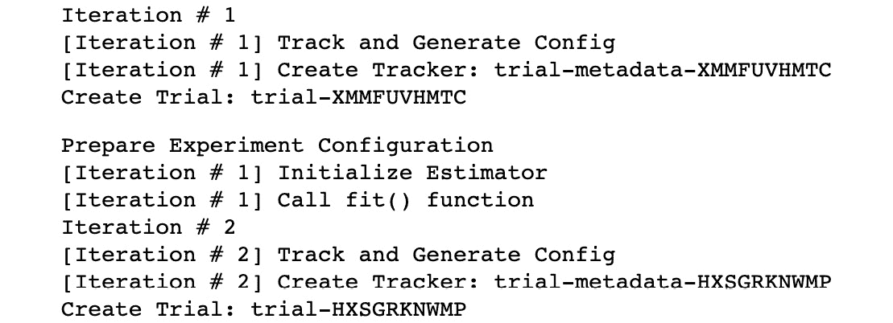

# 五、有效管理机器学习实验

在前一章中，我们研究了几个方法，重点是在将数据作为输入传递给培训作业之前准备和处理数据。在这一章中，我们将重点关注不同的解决方案和功能，以帮助我们管理**机器学习** ( **ML** )在**亚马逊 SageMaker** 中的实验。

一旦我们进行了一定数量的 ML 实验，我们就会意识到，并不是所有的实验都成功，建立高质量的 ML 模型需要一点试错。这有点类似于软件开发，在软件开发中，需要尽可能早地检测代码中的错误，以防止这些错误意外地部署到生产环境中。与调试软件代码中的问题相比，调试 ML 实验通常要困难得多，因为我们需要一个专门的工具来检查和监控实验中参数、度量和其他变量的值的变化，并在满足特定规则或条件时执行指定的动作。在运行分布式培训作业时，这个工具在处理 ML 实例集群时也非常有用。好消息是 **SageMaker 调试器**是我们正在寻找的专用工具！

除了使用正确的工具调试 ML 实验之外，数据科学和 ML 工程团队积极跟踪数据集、超参数以及多个 ML 实验的其他输入和输出值也至关重要。这将允许数据科学家和 ML 实践者轻松访问以前的 ML 实验，而不必花费大量时间试图大海捞针。也就是说，我们还有更多好消息要告诉你— **SageMaker Experiments** 可以帮助我们跟踪和管理越来越多的实体。

在本章中，我们将演示如何使用 **SageMaker 调试器**来检测我们培训工作中的问题。之后，我们将使用 SageMaker 实验来同时管理和跟踪多个实验。我们还将在示例 ML 实验中检查使用这些功能时生成的日志和实体。一旦我们非常熟悉本章中讨论的服务、工具和技术，我们将能够轻松地管理和调试多个 ML 实验。

我们将在本章中介绍以下配方:

*   分类问题的合成数据生成
*   识别 SageMaker 调试器的问题
*   检查 SageMaker 调试器日志和结果
*   使用 SageMaker 实验运行和管理多个实验
*   SageMaker 实验的实验分析
*   使用 SageMaker 实验检查实验、试验和试验组件

随着您开始使用 SageMaker 进行更多的 ML 实验，您会发现本章中的配方非常有用，因为它们将帮助您管理和审核正在进行或已完成的 ML 实验。

# 技术要求

要执行本章中的配方，请确保您具备以下条件:

*   正在运行的 Amazon SageMaker 笔记本实例(例如 ml.t2.large)
*   一个亚马逊 S3 桶

如果您还没有准备好这些先决条件，请随时查看第 1 章 *中的*启动亚马逊 SageMaker 笔记本实例*和*准备亚马逊 S3 桶和线性回归实验的训练数据集*食谱，使用亚马逊 SageMaker* 开始机器学习。

由于本章中的食谱涉及到一些代码，我们已经在这个资源库中提供了这些脚本和笔记本:[https://github . com/packt publishing/Machine-Learning-with-Amazon-sage maker-Cookbook/tree/master/chapter 05](https://github.com/PacktPublishing/Machine-Learning-with-Amazon-SageMaker-Cookbook/tree/master/Chapter05)。


图 5.1-机器学习与亚马逊-SageMaker-Cookbook GitHub 知识库

如*图 5.1* 所示，我们在第 05 章目录中组织了本章食谱的脚本和笔记本的源代码。在开始本章的每一个食谱之前，确保 my-experiments/chapter05 目录已经准备好。如果它还没有被创建，请现在就创建，因为这样可以在我们浏览本书中的每一个食谱时保持事物的有序性。


图 5.2-机器学习-亚马逊-SageMaker-Cookbook GitHub 知识库

在*图 5.2* 中，我们可以看到页面左上角**上传**按钮旁边的**新增**按钮。要在 my-experiments 目录下创建一个新目录，点击 **New** 按钮，在下拉选项列表中选择**文件夹**创建一个新目录。我们将在本章的这个目录中使用 conda_python3 内核创建多个 Jupyter 笔记本。

注意

由于我们在本章的食谱中没有使用*本地模式*，我们可以在 SageMaker Studio 笔记本中对食谱进行技术处理。如果你想知道我们将在本书中何时开始使用 **SageMaker Studio** ，请不要担心，因为我们将在亚马逊 SageMaker 的 [*第 6 章*](B16850_06_Final_ASB_ePub.xhtml#_idTextAnchor435) 、*自动机器学习中正确介绍和设置它。*

也就是说，让我们开始学习本章的食谱吧！

请点击以下链接查看动作视频中的相关代码:

【https://bit.ly/2YAwHMl】

# 分类问题的综合数据生成

在这个配方中，我们将使用 scikit-learn 生成一个合成的数据集。该数据集将作为本章分类问题的虚拟数据集。该数据集只有三列——标签、a 和 b。在*图 5.3* 中，我们有一个数据集的散点图，显示了按标签值分组的两组点:


图 5.3–二元分类问题的合成数据集

我们将把这个数据集分成训练、验证和测试数据集，并把它们上传到亚马逊 S3 桶。一旦我们准备好了它们，我们就可以在使用 SageMaker 调试器和 SageMaker 实验的同时运行 ML 实验。

小费

由于我们将在这个配方中展示如何生成合成数据集的步骤，我们将有机会在以后调整这个配方以满足我们的需要。我们可以决定让这个数据集为 label = 0 生成更多的记录，并使用 SageMaker 调试器来检测生成的数据集是否存在类不平衡问题。我们将在 [*第 7 章*](B16850_07_Final_ASB_ePub.xhtml#_idTextAnchor602) 、*使用 SageMaker 特征库、SageMaker Clarify 和 SageMaker 模型监视器*中的*使用 SageMaker Clarify 检测预训练偏差*方法中讨论类别不平衡以及其他 ML 偏差问题。在本章的以下配方中，我们将使用 SageMaker 调试器 LossNotDecreasing 规则来监控和检测正在运行的训练作业的目标指标的减少量(使用在该配方中生成的数据集)是否小于我们指定的阈值。

## 准备就绪

以下是这个配方的先决条件:

*   正在运行的 Amazon SageMaker 笔记本实例(例如 ml.t2.large)

## 我该怎么做…

此配方中的第一组步骤主要是设置包含生成的合成数据集的 x 和 y 值的数据框:

1.  导航到 SageMaker 笔记本实例中的 my-experiments/chapter05 目录。如果这个目录还不存在，请随意创建。
2.  在 my-experiments/chapter05 目录下使用 conda_python3 内核创建一个新的笔记本，用这个菜谱的名字命名(也就是分类问题的合成数据生成)。打开此笔记本进行编辑，因为我们将在接下来的几个步骤中使用代码更新此文件。
3.  使用 scikit-learn 中的 make_blobs()函数生成一个可用于分类问题的数据集:

    ```
    from sklearn.datasets import make_blobs X, y = make_blobs(n_samples=5000, centers=2,                    cluster_std=[6, 4], n_features=2,                    random_state=40)
    ```

4.  Using the X and y variables from the previous step, create a pandas DataFrame with three columns: label, a, and b:

    ```
    import pandas as pd
    all_dataset = pd.DataFrame(
        dict(label=y, a=X[:,0], b=X[:,1]))

    print(all_dataset)
    ```

    *图 5.4* 向我们展示了运行前面的代码块后的输出:

    

    图 5.4–使用 make_blobs()函数后包含所有记录的数据集

    在*图 5.4* 中，我们可以看到在 all_dataset 数据帧中，我们有三列——label，包含 1 和 0，a 和 b，包含浮点值。

5.  Generate a scatterplot of all_dataset with the following lines of code:

    ```
    from matplotlib import pyplot

    colors = {0:'red', 1:'blue'}
    fig, ax = pyplot.subplots()
    grouped = all_dataset.groupby('label')

    for key, group in grouped:
        group.plot(ax=ax, kind='scatter', 
                   x='a', y='b', 
                   label=key, 
                   color=colors[key])

    pyplot.show()
    ```

    这将生成一个类似于*图 5.5* 所示的散点图:

    

    图 5.5–分类问题的合成数据集

    在*图 5.5* 中，我们使用 matplotlib 生成了 all_dataset 的散点图。

    既然我们已经生成了合成的数据集，我们将在将生成的训练、验证和测试数据集上传到亚马逊 S3 buc ket 之前执行训练-测试分割。

6.  Perform the train-test split step and get the training, validation, and test datasets:

    ```
    from sklearn.model_selection import train_test_split

    train_val, test = train_test_split(all_dataset, 
                                       test_size=0.2, 
                                       random_state=0)
    training, validation = train_test_split(
        train_val, 
        test_size=0.25, 
        random_state=0)
    ```

    这将为训练数据集提供 3，000 条记录，为验证数据集提供 1，000 条记录，为测试数据集提供 1，000 条记录。

7.  Inspect the training dataset by running the next line of code:

    ```
    training
    ```

    这将显示类似于图 5.6 中*所示的数据帧:*

    

    图 5.6–包含 3，000 条记录的训练数据集

    *图 5.6* 向用户展示了训练数据集的快速视图。注意，这个数据集有 3000 条记录，是 all_dat aset 中记录总数的 60%。

8.  Inspect the validation dataset by running the next line of code:

    ```
    validation
    ```

    这将为我们提供一个类似于图 5.7 所示的数据框架:

    

    图 5.7–包含 1，000 条记录的验证数据集

    *图 5.7* 向用户展示了验证数据集的快速视图。请注意，该数据集有 1，000 条记录，占 re 记录总数的 20%。

9.  Inspect the test dataset by running the next line of code:

    ```
    test
    ```

    这将给我们一个类似于图 5.8 所示的数据框架:

    

    图 5.8–包含 1000 条记录的测试数据集

    *图 5.8* 向我们展示了测试数据集的快速视图。注意，这个数据集有 1000 条记录，占 all_d 数据集中记录总数的 20%。

10.  使用 mkdir Bash 命令:

    ```
    !mkdir -p tmp
    ```

    生成一个名为 tmp 的临时目录
11.  接下来，使用 to_csv()函数从训练、验证和测试数据帧中生成一个 csv 文件:

    ```
    training.to_csv('tmp/training_data.csv', header=False, index=False) validation.to_csv('tmp/validation_data.csv', header=False, index=False) test.to_csv('tmp/test_data.csv', header=False, index=False)
    ```

12.  Use the **AWS CLI** Bash commands to copy the CSV files to our target S3 path. Make sure to replace the value of "<insert S3 bucket name here>" with the name of the bucket we have created in the *Preparing the Amazon S3 bucket and the training dataset for the linear regression experiment* recipe from [*Chapter 1*](B16850_01_Final_ASB_ePub.xhtml#_idTextAnchor020)*, Getting Started with Machine Learning Using Amazon SageMaker*:

    ```
    s3_bucket = "<insert S3 bucket name here>"
    prefix = "chapter05"
    path = f"s3://{s3_bucket}/{prefix}/input"
    !aws s3 cp tmp/training_data.csv {path}/training_data.csv
    !aws s3 cp tmp/validation_data.csv {path}/validation_data.csv
    !aws s3 cp tmp/test_data.csv {path}/test_data.csv
    ```

    这将把训练、验证和测试数据集的 CSV 文件上传到 S3 存储桶中。

让我们看看这是如何工作的！

## 它是如何工作的…

在这个配方中，我们已经使用 make_blobs()函数为分类问题生成了一个合成数据集。让我们描述一下调用这个函数时可以使用的几个选项:

*   n_samples:样本数
*   cluster_std:分类的标准偏差
*   n_features:特征数量
*   random_state:使操作可重现的随机状态值

我们生成的数据集有三列——标签、a 和 b。我们在构建二元分类器时的目标是使用记录的 a 和 b 值来预测标签值。

注意

在现实生活的数据集和例子中，a 和 b 可以很容易地映射到一个或多个预测变量。这方面的一个例子是使用乳房肿块图像的属性(例如周长均值、面积均值、凹度最差)来检测肿瘤是良性还是恶性。

在生成包含 5000 条记录的数据集之后，我们已经使用了两次 train_test_split()函数来获得训练、验证和测试集。我们对这些数据集进行了 60-20-20 的分割。然后，我们将这些数据集上传到目标 S3 桶中。稍后，当我们使用*识别 SageMaker 调试器*和*运行和管理 SageMaker 实验*配方的多个实验时，将会用到这些。

如果您想知道我们可以使用哪些算法来使用该数据集训练分类器，这里有一些算法:

*   **XGBoost**with objective = ' binary:logistic '
*   **线性学习器**，带有预测器类型=‘二元分类器’
*   **因子分解机**带有预测器类型=‘二元分类器’
*   使用自定义容器图像的自定义算法(例如，**支持向量机**

在这些选项中，我们将在后续的菜谱中使用 XGBoost 来解决我们的二进制分类问题。

## 还有更多……

我们可以对这个食谱进行哪些调整来产生这个数据集的变体？

*   我们可以(显著地)生成更多的记录，并测试后续配方中使用的算法的性能。根据数据集的大小，训练期间的问题可能会出现，也可能不会出现，所以这是我们完成本章后您可以尝试的事情。
*   我们可以向生成的数据集中添加更多的列。例如，通过修改 make_blobs()函数中传递的参数值，我们可以生成 40 个预测列，而不是只有 2 个预测列。同样，由于这一变化，训练期间可能会出现一些问题，我们希望检查某些 SageMaker 调试器规则是否可以用于检测这些问题。

记住这些，让我们继续利用这个合成数据集的食谱吧！

# 识别 SageMaker 调试器的问题

Amazon SageMaker 调试器是 Amazon SageMaker 更强大的功能之一，可以帮助我们管理我们的 ML 实验。借助 SageMaker 调试器，我们可以使用**调试器规则**自动检测问题并分析培训工作。然后我们能够消除这些问题和瓶颈，这将有助于缩短培训时间并显著降低成本。SageMaker 调试器还可以用来监控培训作业的硬件资源使用情况。此功能有助于显著降低成本，因为我们能够分析培训工作，及早检测硬件资源使用导致的问题，并优化培训时间和资源使用。 **SageMaker 调试器**支持 **XGBoost** 、 **PyTorch** 、 **TensorFlow** 、 **MXNet** 等 ML 框架和算法。

有几个内置的调试器规则可供选择。这些规则包括(但不限于)VanishingGradient、PoorWeightInitialization、ExplodingTensor、DeadRelu 和 LossNotDecreasing 规则。在大多数情况下，我们可以用这些规则配置 SageMaker Debugger，而不需要对我们的定制培训脚本进行任何更改。

在这个方法中，我们将使用 SageMaker 调试器 LossNotDecreasing 规则来监视和检测使用 XGBoost 内置算法的训练作业的目标度量的减少是否小于我们指定的阈值。

小费

使用 SageMaker 调试器是免费的！通常，我们只根据计算和存储资源的使用情况为其付费。这意味着我们将为使用 SageMaker 调试器时启动的 **SageMaker 处理**作业(几分钟)付费。更多信息，请参考这里的定价页面:[https://aws.amazon.com/sagemaker/pricing/](https://aws.amazon.com/sagemaker/pricing/)。

## 做好准备

下面的是该配方的先决条件:

*   该配方上接*分类问题合成数据生成*。

## 如何去做…

以下说明向我们展示了如何使用 SageMaker 调试器来检测我们的训练作业中的问题，包括几行代码:

1.  导航到 SageMaker 笔记本实例中的 my-experiments/chapter05 目录。如果这个目录还不存在，请随意创建。
2.  在 my-experiments/chapter05 目录中使用 conda_python3 内核创建一个新的笔记本，并用这个配方的名称命名它(也就是用 SageMaker 调试器识别问题)。打开此笔记本进行编辑，因为我们将在接下来的几个步骤中使用代码更新该文件。
3.  使用下面几行代码导入并准备一些先决条件，如 session、role_arn、boto3 和 get_execution_role()函数:

    ```
    import sagemaker  import boto3 from sagemaker import get_execution_role  role_arn = get_execution_role() session = sagemaker.Session()
    ```

4.  Specify the S3 location of the training, validation, and test CSV files. Make sure to replace the value of "<insert S3 bucket name here>" with the name of the bucket we created in the *Preparing the Amazon S3 bucket and the training dataset for the linear regression experiment* recipe from [*Chapter 1*](B16850_01_Final_ASB_ePub.xhtml#_idTextAnchor020), *Getting Started with Machine Learning Using Amazon SageMaker*:

    ```
    s3_bucket = '<insert S3 bucket name here>'
    prefix = "chapter05"
    path = f"s3://{s3_bucket}/{prefix}/input"

    training_path = f"{path}/training_data.csv" 
    validation_path = f"{path}/validation_data.csv" 
    ```

    请注意，s3_bucket 值应与本章中用于分类问题的*合成数据集生成* reci pe 的值相同。

5.  使用 retrieve()函数获取 XGBoost 容器映像的 ECR 存储库 URI:

    ```
    from sagemaker.image_uris import retrieve container = retrieve('xgboost',                       boto3.Session().region_name,                       version="0.90-2")
    ```

6.  在我们的实验中，导入并初始化使用 SageMaker 调试器的先决条件:

    ```
    from sagemaker.debugger import rule_configs from sagemaker.debugger import Rule  from sagemaker.debugger import DebuggerHookConfig from sagemaker.debugger import CollectionConfig       save_interval = 2 prefix = "debugger" bucket_path = 's3://{}/{}'.format(s3_bucket, prefix)
    ```

7.  Initialize and configure the CollectionConfig and DebuggerHookConfig objects:

    ```
    metrics_collection_config = CollectionConfig(
        name="metrics",
        parameters={
            "save_interval": str(save_interval)
        })

    debugger_hook_config = DebuggerHookConfig(
        s3_output_path=bucket_path,  
        collection_configs=[metrics_collection_config]
    )
    ```

    这里，我们指定要收集的数据以及其他配置参数。

    注意

    有关 SageMaker 调试器可用的内置集合的完整列表，请随意查看[https://github . com/aw slabs/sage maker-Debugger/blob/master/docs/API . MD #内置集合](https://github.com/awslabs/sagemaker-debugger/blob/master/docs/api.md#built-in-collections)。

8.  使用下面几行代码准备SageMaker 调试器规则:

    ```
    loss_not_decreasing_rule = Rule.sagemaker(     rule_configs.loss_not_decreasing(),     rule_parameters={         "collection_names": "metrics",         "diff_percent": "5",         "num_steps": "2",     }, ) rules = [loss_not_decreasing_rule]
    ```

9.  Next, initialize the Estimator function:

    ```
    estimator = sagemaker.estimator.Estimator( 
        role=role_arn,
        instance_count=1,
        instance_type='ml.m5.xlarge',
        image_uri=container,
        debugger_hook_config=debugger_hook_config,
        rules=rules,
        sagemaker_session=session)
    ```

    注意，我们在这个菜谱中使用 XGBoost 作为内置算法。当使用 XGBoost 作为内置算法时，我们不会使用 SageMaker Python SDK 中的 XGBoost 类，因为它是在使用开源 XGBoost 算法时使用的。

    注意

    我们可以使用 XGBoost 作为内置算法，或者使用开源的 XGBoost 算法，这涉及到编写自定义的训练脚本。有关 XGBoost 内置算法的更多信息，请随意查看以下链接获取更多信息:[https://sagemaker . readthe docs . io/en/stable/frameworks/XGBoost/using _ XGBoost . html](https://sagemaker.readthedocs.io/en/stable/frameworks/xgboost/using_xgboost.html)。

10.  使用 set_hyperparameters()函数:

    ```
    estimator.set_hyperparameters(max_depth=16,                              objective='binary:logistic',                              num_round=10000)
    ```

    指定超参数
11.  使用 TrainingInput:

    ```
    from sagemaker.inputs import TrainingInput s3_input_training = TrainingInput(     training_path, content_type="text/csv") s3_input_validation = TrainingInput(     validation_path, content_type="text/csv")
    ```

    为培训工作准备输入
12.  使用 fit()函数开始训练步骤。请注意，wait 参数被设置为 False，这允许我们在训练作业运行时运行下面的步骤:

    ```
    estimator.fit({'train': s3_input_training,                'validation': s3_input_validation},                wait=False)
    ```

13.  导入、初始化和加载打印规则作业摘要的一些先决条件:

    ```
    import time job_name = estimator.latest_training_job.name client = \ estimator.sagemaker_session.sagemaker_client print("Job Name:", job_name) EVALUATION_STOP_STATES = [     "Stopped", "IssuesFound",      "NoIssuesFound", "Error" ]
    ```

14.  Define the display_rule_job_summary() function. This function will help display the details of the SageMaker Processing job running the SageMaker Debugger rule logic:

    ```
    def display_rule_job_summary(rule_job_summary):
        break_after_this = False 

        for rule_job in rule_job_summary:
            rj = rule_job
            rule_name = rj["RuleConfigurationName"]
            es = rj["RuleEvaluationStatus"]
            evaluation_status = es
            print("Rule [{}]: {}".format(
                rule_name, evaluation_status))

            if evaluation_status == 'IssuesFound':
                summary = rule_job_summary[0]
                sd = summary['StatusDetails']        
                status_details = sd
                print("{}".format(status_details))

            stopped = es in EVALUATION_STOP_STATES
            np = 'ProfilerReport' not in rule_name
            not_profiler = np

            if stopped and not_profiler:
                break_after_this = True

        return break_after_this
    ```

    我们将在下一步中使用该函数来帮助我们查看 SageMaker 调试器作业是否检测到了违反 LossNotDecreasing 规则的情况。

15.  Run the following lines of code to display the status of the training and processing jobs. The describe_training_job() function accepts the training job name and returns the details and metadata associated with the training job. Inside this loop, we also make use of the display_rule_job_summary() function to help us extract and print a quick summary of the rule job and the current status of the training job:

    ```
    for _ in range(200):
        description = client.describe_training_job(
            TrainingJobName=job_name
        )
        ts = description["TrainingJobStatus"]
        training_job_status = ts
        print("\nTraining job Status: {}".format(
              training_job_status))
        latest_job = estimator.latest_training_job
        rule_job_summary = latest_job.rule_job_summary()
        break_after_this = display_rule_job_summary(
            rule_job_summary
        )
        if break_after_this:
            break

        time.sleep(10)
    ```

    *图 5.9* 显示了运行前一个代码块后打印日志的某一部分:

    

    图 5.9–显示培训和处理作业状态的日志

    我们可以在*图 5.9* 中看到前面代码块中的循环生成的日志。此日志摘要包括培训作业状态和 LossNotDecreasing 规则作业状态。

    重要说明

    这个步骤可能需要 30 多分钟才能完成，所以在等待的时候，请随意阅读*它是如何工作的……*和*这个食谱还有更多……*部分。你也可以继续学习本章的后续食谱！

    大约在 30 分钟后，我们应该看到在作业摘要日志的末尾检测到违反了 LossNotDecreasing 规则。

16.  使用%store magic 存储调试器工件的 S3 路径。我们将在上半年使用这个*检查 SageMaker 调试器日志和结果*配方:

    ```
    e = estimator ap = e.latest_job_debugger_artifacts_path() artifacts_path = ap %store artifacts_path
    ```

17.  Similarly, store the rule job summary dictionary value using %store magic as well. We will use this in the second half of the *Inspecting SageMaker Debugger logs and results* recipe:

    ```
    rjs = e.latest_training_job.rule_job_summary()
    rule_job_summary = rjs
    %store rule_job_summary
    ```

    我们将在*检查 SageMaker 调试器日志和结果*配方中使用稍后的 rule_job_summary 的值。

    注意

    SageMaker 培训和 SageMaker 处理作业在后台提供的 ML 实例在这些作业完成时会自动删除。这意味着我们不必像在其他章节中那样手动关闭正在运行的资源。就成本而言，我们将只支付作业运行的时间。有关这方面的更多信息，请随时查看定价计算器以及这里提供的定价示例:[https://aws.amazon.com/sagemaker/pricing/](https://aws.amazon.com/sagemaker/pricing/)。

现在，让我们看看这是如何工作的！

## 工作原理……

在这个菜谱中，我们使用了 SageMaker 调试器来帮助我们检测培训工作中的问题。它的工作方式是在训练步骤中收集调试数据，并在处理和分析调试数据时检查是否满足某些规则条件。

让我们定义一些东西，以便我们能够理解 SageMaker 调试器是如何工作的:

*   **调试器挂钩**:在训练步骤中捕获调试数据(例如，train-error、validation-error)。在初始化 Estimator 时，我们可以用一个或多个 CollectionConfig 对象指定 DebuggerHookConfig。
*   **调试器规则**:代码检测是否满足某些条件。当执行训练步骤时，规则处理容器将自动处理调试数据并识别是否发现问题。请注意，在初始化估计器时，我们可以指定任意多的规则。

一旦调试器钩子和调试器规则配置已经准备好并在初始化评估器对象时作为参数值传递，我们需要做的就是调用 fit()函数来启动训练作业。


图 5.10–使用 SageMaker 调试器时，幕后发生了什么

参考*图 5.10* 快速查看使用 SageMaker 调试器时幕后发生的情况。让我们详细讨论每个步骤，看看它是如何工作的:

1.  当估计器的 fit()函数被调用时，一个或多个 ML 训练实例被启动以开始训练作业。
2.  SageMaker 将使用调试器规则容器来检查和监控训练作业，从而启动 SageMaker 处理作业。有关 SageMaker 处理作业的更多信息，请随意查看第 4 章 、*准备、处理和分析数据*中的*使用 Python* 中的 SageMaker 处理管理的数据处理 [*。*](B16850_04_Final_ASB_ePub.xhtml#_idTextAnchor200)
3.  基于DebuggerHookConfig 的配置方式，在每个间隔的指定数量的步骤后，某些值，如损耗、重量和梯度被提取并存储在 S3 中。
4.  一旦上一步的数据在 S3 可用，来自*步骤 2* 的 SageMaker 处理任务将运行配置的规则逻辑并检查是否违反了规则。
5.  触发**云监控事件**。

请注意，我们可以使用 AWS Lambda 进行快速集成，以帮助我们对 SageMaker 调试器触发的 CloudWatch 事件做出反应，并停止正在运行的培训作业。有关如何实现这一点的更多信息，请随时查看[https://github . com/AWS/Amazon-sage maker-examples/blob/master/sage maker-debugger/tensor flow _ action _ on _ rule/TF-Mn ist-stop-training-job . ipynb](https://github.com/aws/amazon-sagemaker-examples/blob/master/sagemaker-debugger/tensorflow_action_on_rule/tf-mnist-stop-training-job.ipynb)。

## 还有更多…

您可能想知道为什么有第二个规则作业使用 ProfilerReport 前缀运行，即使我们在初始化 Estimator 对象时只指定了 LossNotDecreasing 规则。这是因为 SageMaker 调试器默认运行 ProfilerReport 规则来生成分析报告。生成的分析报告从每个工作节点的训练作业摘要和系统使用统计开始。


图 5.11–探查器报告规则摘要

它还会提供调试器内置规则的概要，类似于图 5.11 中的*所示。请随意查看[https://docs . AWS . Amazon . com/sage maker/latest/DG/debugger-profiling-report . html](https://docs.aws.amazon.com/sagemaker/latest/dg/debugger-profiling-report.html)了解更多信息。*

## 亦见

如果我们想要创建和使用一个定制规则，我们可以使用 SageMaker Python SDK 中的 Rule.custom()函数。创建自定义规则超出了本书的范围，因此我们将在此提供一些参考和示例:

*   使用 SageMaker 调试器自定义规则训练 TensorFlow Keras 模型:[https://sage maker-examples . readthe docs . io/en/latest/sage maker-Debugger/tensor flow _ Keras _ custom _ rule/TF-Keras-custom-rule . html](https://sagemaker-examples.readthedocs.io/en/latest/sagemaker-debugger/tensorflow_keras_custom_rule/tf-keras-custom-rule.html)
*   使用 SageMaker 调试器自定义规则运行迭代模型修剪:[https://github . com/AWS/Amazon-sage maker-examples/blob/master/sage maker-Debugger/py torch _ iterative _ model _ pruning/iterative _ model _ pruning _ Alex net . ipynb](https://github.com/aws/amazon-sagemaker-examples/blob/master/sagemaker-debugger/pytorch_iterative_model_pruning/iterative_model_pruning_alexnet.ipynb)

有关为培训工作分析创建定制调试器规则的更多信息，请随时查看[https://docs . AWS . Amazon . com/sage maker/latest/DG/debugger-custom-rules . html](https://docs.aws.amazon.com/sagemaker/latest/dg/debugger-custom-rules.html)。

# 检查 SageMaker 调试器日志和结果

在前面的配方中，我们使用 SageMaker 调试器来帮助我们检测训练作业运行时的违规情况。在这个菜谱中，我们将使用 smdebug 库、AWS CLI 工具和 awslogs 命令行工具来检查 SageMaker 调试器生成的文件和日志。当调试 SageMaker 调试器本身的结果时，这将非常有用。

有时，如果我们有一个错误配置的 SageMaker 调试器，我们可能最终会得到 NoIssuesFound 结果，即使已经满足了某些 DebuggerRule 条件。也就是说，重要的是我们知道如何调试我们的设置，以及在哪里查找由 SageMaker 调试器生成的文件。

## 做好准备

以下是该配方的先决条件:

*   本配方延续了*中的确定 SageMaker 调试器*的问题。

## 怎么做……

以下说明向我们展示了检查由 SageMaker 调试器处理作业生成的文件和日志的步骤:

1.  导航到 SageMaker 笔记本实例中的 my-experiments/chapter05 目录。如果这个目录还不存在，请随意创建。
2.  在 my-experiments/chapter05 目录中使用 conda_python3 内核创建一个新的笔记本，并用这个配方的名称命名它(即检查 SageMaker 调试器日志和结果)。打开此笔记本进行编辑，因为我们将在接下来的几个步骤中使用代码更新此文件。
3.  使用%store magic 命令加载 artifacts_path 的值。请注意，我们将该值存储在 IPython 的数据库中的 *Insp 检查 SageMaker 调试器日志和结果*配方:

    ```
    %store -r artifacts_path
    ```

4.  使用 pip install 安装 smdebug:

    ```
    !pip install smdebug
    ```

5.  Import create_trial and run the create_trial() function with the path of the artifacts generated by SageMaker Debugger:

    ```
    from smdebug.trials import create_trial
    trial = create_trial(artifacts_path)
    ```

    这个试验对象让我们查询培训作业的张量，我们将在下一组步骤中看到。

6.  Use the tensor_names() function to list the available tensors of the trial:

    ```
    trial.tensor_names()
    ```

    运行前一行代码将返回一个包含训练错误和验证错误字符串值的列表。

7.  使用试验对象的 bucket_name 和 prefix_name 属性准备 target_path 变量。target_path 变量指向包含调试输出文件的 S3 路径:

    ```
    target_path = f"s3://{trial.bucket_name}/{trial.prefix_name}"
    ```

8.  Use the AWS CLI to show all the files inside the target S3 path:

    ```
    s3_contents = !aws s3 ls {target_path} --recursive
    s3_contents
    ```

    这将产生一组结果，类似于图 5*中的。 12* :

    

    图 5.12–sage maker 调试器输出文件

    *图 5.12* 向我们展示了使用 aws s3 ls 命令后 t h e 目标 S3 路径中的一些文件。

9.  Copy the path of one of the files in the previous step and store it inside the chosen_fullpath variable:

    ```
    chosen_path = s3_contents[-1].split(" ")[-1]
    chosen_fullpath = f"s3://{trial.bucket_name}/{chosen_path}"
    ```

    chosen _ fullpath 变量应该包含指向 JSON 文件的 S3 路径。

10.  如果 tm p 目录尚不存在，则创建该目录:

    ```
    !mkdir -p tmp
    ```

11.  使用 AWS CLI 将文件从 S3 直接复制到 tmpory:

    ```
    !aws s3 cp {chosen_fullpath} tmp/worker_0.json
    ```

12.  Inspect the contents of the file we just downloaded from S3:

    ```
    !cat tmp/worker_0.json
    ```

    我们应该得到一个类似于图 5.13 所示的 JSON 值:

    

    图 5.13–worker _ 0 . JSON 中的 JSON 值

    我们在*图 5.13* 中有我们从 S3 桶 下载的 JSON 文件的值，包含 SageMaker 调试器生成的日志。

13.  Run the following lines of code to print the train-error and validation-error tensor values:

    ```
    for i in [2, 4, 6, 8, 10, 12, 14, 16]:
        traint = trial.tensor("train-error")
        train_error = traint.value(i)[0]
        train_error = "{0:.4f}".format(train_error)
        valt = trial.tensor("validation-error")
        validation_error = valt.value(i)[0]
        validation_error = "{0:.4f}".format(validation_error)
        print(f"STEP {i}: [TRAIN ERROR]={train_error} " +
              f"[VALIDATION ERROR]={validation_error}")
    ```

    在前面的代码块中，我们已经迭代了[2，4，6，8，10，12，14，16]列表，因为我们配置了调试器挂钩来每两步收集一次指标值。*图 5.14* 向我们展示了运行前面的代码块后的输出:

    

    图 5.14–训练和验证错误值

    在*图 5.14* 中，我们有由 SageMaker 调试器收集的训练误差和验证误差值。如果您想知道我们是如何每两步收集度量值的，请记住在*识别 SageMaker 调试器的问题*方法中，我们在初始化 CollectionConfig 对象时在参数字典 nary 中为 save_interval 指定了值 2。

14.  Use the %store magic command to load the value of rule_job_summary:

    ```
    %store -r rule_job_summary
    ```

    请记住，我们使用%store magic 在 IPython 数据库中的 *I 检查 SageMaker 调试器日志和结果*方法中存储了这个值。

15.  Get the specific rule job summary for the LossNotDecreasing rule:

    ```
    def lfx(r):
        return r["RuleConfigurationName"] == "LossNotDecreasing"

    loss_not_decreasing_summary = list(filter(
        lfx, 
        rule_job_summary))[0]

    loss_not_decreasing_summary
    ```

    前面的代码块帮助我们提取 LossNotDecreasing 规则的规则作业摘要，因为有两个规则作业是在我们调用 fit()函数之后执行的，如前面的配方中所述。这将产生一个类似于图 5.15 所示的字典:

    

    图 5.15–loss not reducing 规则的规则作业摘要

    在图 5.15 中，我们可以看到字典中的 RuleEvaluationStatus 键映射到 IssuesFound 值。我们可以在映射到 StatusDetails 键的值中看到更多的细节。

16.  Get and inspect the rule evaluation job ARN:

    ```
    summary = loss_not_decreasing_summary
    rule_evaluation_job_arn = summary['RuleEvaluationJobArn']
    rule_evaluation_job_arn
    ```

    这应该会给出一个类似于' arn:AWS:sage maker:us-east-1:1234567890:processing-job/sage maker-xgboost-2021-04-lossnotdecoding-ee 3d F9 a 4 '的字符串值。

17.  使用 processing job . from _ processing _ arn()函数加载处理作业，该函数带有上一步获得的评估作业 ARN:

    ```
    import sagemaker  from sagemaker.processing import ProcessingJob       session = sagemaker.Session() processing_job = ProcessingJob.from_processing_arn(     sagemaker_session=session,      processing_job_arn=rule_evaluation_job_arn)       processing_job
    ```

18.  接下来，设置并准备区域、组和前缀变量的值:

    ```
    region = "us-east-1" group = "/aws/sagemaker/ProcessingJobs" prefix = processing_job.job_name
    ```

19.  使用 pip:

    ```
    !pip install awslogs
    ```

    安装 a wslogs 命令行工具
20.  Run the following Bash command to load the logs generated by the processing job:

    ```
    !awslogs get {group} --log-stream-name-prefix {prefix} -s3h --aws-region {region}
    ```

    这将产生一组类似于图 5.16 中所示的日志:


图 5.16–运行 awslogs CLI 工具后生成的日志

*图 5.16* 向我们展示了在运行 awslogs 命令行工具后生成的一部分日志。正如我们在*图 5.16* 所示日志的第二行中所看到的，在运行培训作业之前，我们在估算器中指定的 LossNotDecreasing 规则的条件得到了满足。

现在，让我们看看这是如何工作的！

## 工作原理……

在这个方法中，我们使用了 smdebug 来检查用 SageMaker 调试器创建的实体的属性。让我们快速仔细地看一下使用 smdebug 库时的一些相关术语和概念:

*   **步骤**:一批培训作业所完成的工作的单位
*   **集合**:一个集合或一组张量(类似矩阵的容器或结构)
*   **钩子**:保持对集合的跟踪，并根据指定的配置在每一步之后生成相关的输出文件
*   **试用**:实现对培训作业张量的查询和分析

现在，让我们检查*中的一个步骤的代码行，确定 SageMaker 调试器*的问题:

```
metrics_collection_config = CollectionConfig(
    name="metrics",
    parameters={
        "save_interval": str(save_interval)
    })

debugger_hook_config = DebuggerHookConfig(
    s3_output_path=bucket_path,  
    collection_configs=[metrics_collection_config]
)
```

这里，初始化了 DebuggerHookConfig，而在初始化 Estimator 时用作参数。使用 DebuggerHookConfig，我们可以指定和配置如何发出和收集调试信息。此 DebuggerHookConfig 配置 SageMaker 调试器以执行以下操作:

*   每两个间隔(save_interval = 2)保存一次调试数据(例如，train-error)。
*   将调试数据存储在我们指定的亚马逊 S3 bucket_path 中。

运行训练作业时，调试数据存储在目标 S3 路径中。如果我们想从这些日志中提取调试数据，我们使用 smdebug 库中的 trial.tensor()函数，然后使用 value()函数获取指定索引处的值。最后，如果满足一个或多个规则条件，rule_job_summary()函数应该反映问题的适当状态和描述。

## 还有更多…

请注意，在*如何做……*一节中，我们只是触及了 smdebug 库的皮毛。一旦我们将度量数据收集到 S3 存储桶中，我们就可以使用 smdebug 库通过以下代码行创建一个系统读取器对象。请随意用我们在*识别 SageMaker 调试器问题*配方中执行的 XGBoost 培训作业的名称替换“<在此插入培训作业名称>”字符串:

```
# set up the TrainingJob object from the job name
from smdebug.profiler.analysis.notebook_utils.training_job import TrainingJob
training_job_name = "<insert training job name here>"
training_job = TrainingJob(training_job_name, "us-east-1")

# prepare a system reader object
training_job.wait_for_sys_profiling_data_to_be_available()
reader = training_job.get_systems_metrics_reader()
```

一旦我们有了系统阅读器对象，我们就可以使用来自 smdebug 库的 MetricsHistogram 类来计算和绘制直方图:

```
from smdebug.profiler.analysis.notebook_utils.metrics_histogram import MetricsHistogram

endtime = reader.get_timestamp_of_latest_available_file()

metrics_histogram = MetricsHistogram(reader)
metrics_histogram.plot(
    starttime=0, 
    endtime=endtime
)
```

这将为我们提供一组类似于图 5.17 所示的图表:


图 5.17–生成的指标直方图

请注意，如果您自己执行这些代码块，您将获得超过 28 个图表，因为我们在使用 plot()函数时没有指定一组特定的维度和事件。

## 参见

也可以随意查看这里的一些参考资料和链接:

*   使用 smdebug 库分析系统和框架指标:[https://docs . AWS . Amazon . com/sagemaker/latest/DG/debugger-analyze-data . html](https://docs.aws.amazon.com/sagemaker/latest/dg/debugger-analyze-data.html)
*   SageMaker Studio 上的 SageMaker 调试器:[https://docs . AWS . Amazon . com/sage maker/latest/DG/Debugger-on-Studio . html](https://docs.aws.amazon.com/sagemaker/latest/dg/debugger-on-studio.html)
*   SageMaker 用于分析的调试器编程模型:[https://github . com/aw slabs/sage maker-Debugger/blob/master/docs/analysis . MD](https://github.com/awslabs/sagemaker-debugger/blob/master/docs/analysis.md)

现在，让我们继续下一个食谱吧！

# 使用 SageMaker 实验运行和管理多个实验

管理单个机器学习(ML)实验很容易。当我们处理单个 ML 实验时，很容易定位和审计输入和输出工件、配置参数、超参数值以及所有其他相关元数据和与该单个 ML 实验相关的细节。当我们必须处理多个 ML 实验以及检索过去执行的实验和培训工作的信息时，事情变得有点棘手。

在本食谱中，我们将使用 **SageMaker Experiments** 运行并跟踪多个实验。每个实验都对应于我们将用于训练工作的超参数的特定组合。我们将使用 XGBoost 内置算法来帮助我们使用我们在*分类问题综合数据生成*配方中生成的综合数据集来训练和构建分类器。在设置实验时，我们将利用 smexperiments 库中的类和函数来帮助我们在配置和运行每个实验时记录相关信息。

小费

使用 SageMaker 实验是免费的！通常，我们只根据计算和存储资源的使用情况为其付费。这意味着我们只需支付运行培训作业、运行 SageMaker 笔记本实例的成本，以及与在 S3 存储桶中存储文件相关的成本。关于这个话题的更多信息，请参考这里的定价页面:[https://aws.amazon.com/sagemaker/pricing/](https://aws.amazon.com/sagemaker/pricing/)。

## 正在准备中

以下是该配方的先决条件:

*   这个 rec ipe 从*分类问题综合数据生成*继续 s。

## 怎么做……

该配方中的第一步集中在为实验设置先决条件:

1.  导航到 SageMaker 笔记本实例中的 my-experiments/chapter05 目录。如果这个目录还不存在，请随意创建。
2.  在 my-experiments/chapter05 目录下使用 conda_python3 内核创建一个新的笔记本，用这个配方的名字命名(也就是用 SageMaker Experiments 运行和管理多个实验)。打开此笔记本进行编辑，因为我们将在接下来的几个步骤中使用代码更新此文件。
3.  通过运行下面几行代码，导入培训作业的一些先决条件(如会话、角色、sagemaker_session 和 sage maker _ client):

    ```
    import sagemaker, boto3 session = boto3.Session() sagemaker_session = sagemaker.Session(boto_session=session) sagemaker_client = session.client('sagemaker') role = sagemaker.get_execution_role()
    ```

4.  接下来，再导入一些必备的库和实用程序，比如 time、numpy、pandas、itertools 和 pprint:

    ```
    import time, os, sys import numpy as np import pandas as pd import itertools from pprint import pprint
    ```

5.  安装sagemaker-experiments 包:

    ```
    !pip install sagemaker-experiments
    ```

6.  从 smexperiments 导入实验、试验组件、试验和跟踪器:

    ```
    from smexperiments.experiment import Experiment from smexperiments.trial import Trial from smexperiments.trial_component import TrialComponent from smexperiments.tracker import Tracker
    ```

7.  定义生成随机字符串()函数:

    ```
    import random import string       def generate_random_string():     list_of_chars = random.choices(         string.ascii_uppercase,          k=10)     return ''.join(list_of_chars)
    ```

8.  使用create()函数

    ```
    label = generate_random_string()  training_experiment = Experiment.create(     experiment_name = f"experiment-{label}",     description     = "Experiment Description",     sagemaker_boto_client=sagemaker_client)
    ```

    创建一个实验实例
9.  Prepare the hyperparam_options dictionary:

    ```
    hyperparam_options = {
        'max_depth': [2, 8],
        'eta': [0.2],
        'gamma': [3, 4],
        'min_child_weight': [6],
        'subsample': [0.4],
        'num_round': [10, 20],
        'objective': ['binary:logistic']
    }
    ```

    重要说明

    注意增加超参数选项字典中指定的选项的数量会增加实验用来配置训练任务的超参数的组合的总数。也就是说，这将增加执行的训练任务的数量以及整个实验的总持续时间。由于我们为 ML 培训实例的运行时间付费，成本也可能相应增加。在这个配方中，我们总共有 2 x 1 x 2 x 1 x 2 x 1 的超参数组合。如果每个实验需要大约 5 分钟完成，我们将支付 8 x 5 分钟的培训时间。

10.  定义 prepare_hyperparam_variations()函数。该函数接受一个超参数选项列表，生成并返回一个包含所有超参数配置值变化的字典列表:

    ```
    def prepare_hyperparam_variations(options):     names, values = zip(*options.items())     return [dict(zip(names, value))              for value in itertools.product(*values)]
    ```

11.  Use the function from the previous step to generate a list of hyperparameter configurations:

    ```
    hyperparam_variations = prepare_hyperparam_variations(
        hyperparam_options
    )
    hyperparam_variations
    ```

    这将产生一个类似于图 5.18 所示的字典数组:

    

    图 5.18–超参数变化(显示了 8 个变化中的 3 个)

    在*图 5.18* 中，我们可以看到使用 prepare_hyperparam_variations()函数后不同 hyperpara 仪表配置变化的列表。

12.  Specify the S3 bucket and the location of the training, validation, and test datasets. Make sure to replace the value of "<insert S3 bucket name here>" with the name of the bucket we created in the *Preparing the Amazon S3 bucket and the training dataset for the linear regression experiment* recipe in [*Chapter 1*](B16850_01_Final_ASB_ePub.xhtml#_idTextAnchor020)*, Getting Started with Machine Learning Using Amazon SageMaker*:

    ```
    s3_bucket = '<insert S3 bucket name here>'
    prefix = "chapter05"
    path = f"s3://{s3_bucket}/{prefix}/input"
    training_path = f"{path}/training_data.csv" 
    validation_path = f"{path}/validation_data.csv" 
    output_path = f"s3://{s3_bucket}/{prefix}/output/"
    ```

    请注意，s3_bucket 值应与本章中分类问题配方的*合成数据集生成中使用的值相同。*

13.  Use the retrieve() function to get the ECR container image URI for XGBoost:

    ```
    from sagemaker.image_uris import retrieve
    container = retrieve('xgboost', 
                         boto3.Session().region_name, 
                         version="0.90-2")
    container
    ```

    这应该会给我们一个类似于 683313688378 . dkr . ECR . us-east-1 . amazonaws . com/sage maker-xgboost:0.90-2-CPU-py3 的字符串值。

    注意

    我们可以使用 XGBoost 作为内置算法，或者使用开源的 XGBoost 算法，这涉及到编写自定义的训练脚本。请随意查看以下链接，了解更多关于使用 XGBoost 和 SageMaker 的信息:[https://SageMaker . readthe docs . io/en/stable/frameworks/XGBoost/using _ XGBoost . html](https://sagemaker.readthedocs.io/en/stable/frameworks/xgboost/using_xgboost.html)。

14.  Use TrainingInput to specify the training channel configuration for the training and validation inputs:

    ```
    from sagemaker.inputs import TrainingInput
    s3_input_training = TrainingInput(
        training_path, content_type="text/csv")
    s3_input_validation = TrainingInput(
        validation_path, content_type="text/csv")
    ```

    现在我们已经准备好了先决条件，我们将继续让我们的实验运行在下一组步骤中。

15.  创建一个名为 experiment_tracker 的跟踪器，并使用 log_input():

    ```
    ex_name = training_experiment.experiment_name with Tracker.create(     display_name="xgboost-experiment-display-name",      artifact_bucket=s3_bucket,     artifact_prefix=ex_name,     sagemaker_boto_client=sagemaker_client ) as experiment_tracker:         experiment_tracker.log_input(         name="training-input",                                    media_type="s3/uri",          value=training_path)          experiment_tracker.log_input(         name="validation-input",          media_type="s3/uri",          value=validation_path)          experiment_tracker.log_parameters(         hyperparam_options)
    ```

    在跟踪器中记录 training_path、validation_path 和 hyperparam_options 的值
16.  定义track _ and _ generate _ config()函数。该功能有三个部分:
    *   为特定的培训作业创建试验跟踪器，并使用 log_parameters()记录培训作业的超参数
    *   创建一个试验对象，并使用 add_trial_component()函数添加试验组件
    *   返回包含 ExperimentName、TrialName 和 TrialComponentDisplayName 键的实验配置字典:

        ```
        def track_and_generate_config(     experiment_tracker,      experiment_name,      job_name,      random_string,      hyperparameters):          tdn = f"trial-metadata-{random_string}"     tracker_display_name = tdn     print(f"{label} Create Tracker: {tdn}")          # Step # 1: Creating a Trial Tracker     prefix = f"{experiment_name}/{job_name}"     with Tracker.create(         display_name=tracker_display_name,         artifact_bucket=s3_bucket,         artifact_prefix=prefix,         sagemaker_boto_client=sagemaker_client     ) as trial_tracker:         trial_tracker.log_parameters(             hyperparameters         )           trial_name = f'trial-{random_string}'     print(f"Create Trial: {trial_name}")          # Step # 2A: Creating a Trial object      trial = Trial.create(         trial_name=trial_name,          experiment_name=experiment_name,         sagemaker_boto_client=sagemaker_client)          # Step # 2B: Adding the trial components     trial.add_trial_component(         experiment_tracker.trial_component)     time.sleep(1)      trial.add_trial_component(         trial_tracker.trial_component)          # Step # 3: Returning the config dictionary     return {         "ExperimentName": experiment_name,          "TrialName": trial.trial_name,         "TrialComponentDisplayName": job_name     }
        ```

17.  Run the following block of code to loop through each of the hyperparameter configuration variations and trigger a training job for each one. This block of code has three parts—setting up the variable values for iteration, label, random_string, and job_name, tracking the experiment and generating the experiment configuration dictionary using the track_and_generate_config() function we have prepared in the previous step, and running the training job with the experiment configuration specified as a parameter to the fit() function call:

    ```
    import time
    experiment_name = training_experiment.experiment_name

    for index, hyperparameters in enumerate(
        hyperparam_variations
    ):
        # Step # 1: Setting up the variable values
        iteration = index + 1
        print(f"Iteration # {iteration}")
        label = f"[Iteration # {iteration}]"
        random_string = generate_random_string()
        job_name = f"job-{random_string}"

        # Step # 2: Tracking trials and trial 
        # components and generating the
        # experiment configuration 
        print(f"{label} Track and Generate Config")
        experiment_config = track_and_generate_config(
            experiment_tracker=experiment_tracker,
            experiment_name=experiment_name,
            job_name=job_name,
            random_string=random_string,
            hyperparameters=hyperparameters)

        time.sleep(1)
        # Step # 3: Running the training job
        print(f"{label} Initialize Estimator")
        estimator = sagemaker.estimator.Estimator( 
            container,
            role,
            instance_count=1, 
            instance_type='ml.m5.large', 
            output_path=output_path, 
            hyperparameters=hyperparameters,
            enable_sagemaker_metrics = True,
            sagemaker_session=sagemaker_session
        )

        print(f"{label} Call fit() function")
        data = {'train': s3_input_training, 
                'validation': s3_input_validation}
        exc = experiment_config
        estimator.fit(data,
                      job_name = job_name, 
                      wait=False,
                      experiment_config=exc)
    ```

    正如您将在的最后部分注意到的那样，在调用 fit()函数时，我们已经将使用 track_and_generate_config()生成的字典作为值传递给了 experiment_config 参数。正如在前面的步骤中所看到的，实验 _ 配置参数期望实验管理配置以具有三个可选关键字的字典的形式出现:“实验名称”、“实验名称”和“实验组件显示名称”。

    注意

    如果您使用的是全新的 AWS 帐户，在使用 fit()和 deploy()函数启动 ML 实例时，您可能会遇到 ResourceLimitExceeded 错误(或类似的错误)。要解决此问题，请打开 AWS 支持中心并创建一个案例。如需了解更多信息，请随时访问此链接:[https://AWS . Amazon . com/premium support/knowledge-center/resourcelimitexceed-sage maker/](https://aws.amazon.com/premiumsupport/knowledge-center/resourcelimitexceeded-sagemaker/)。

    *图 5.19* 向展示了运行前一个代码块后的日志输出示例:

    

    图 5.19–运行使用 XGBoost 内置算法运行和跟踪多个实验的循环时，日志输出的特定部分

    在*图 5.19* 中，我们有前面代码块中的循环生成的日志。请注意，我们正在使用超参数值的不同配置运行几个训练任务，并为每个训练任务附加一个试用。

    重要说明

    这一步可能需要 30 多分钟才能完成，所以在等待的时候，请随意阅读*它是如何工作的…* 和*这份食谱还有更多…* 章节。你也可以继续学习本章中的以下食谱！

18.  Finally, we use %store magic to save the value of experiment_name:

    ```
    %store experiment_name
    ```

    我们将在稍后使用 SageMaker 实验配方的*实验分析中使用实验名称 v 变量值。*

现在，让我们看看这是如何工作的！

## 工作原理……

在这个配方中，我们使用了 sagemaker-experiments 库来帮助我们跟踪和组织 ML 实验中的不同变量、值和工件。

让我们定义几个重要术语:

*   **实验**:对应到 ML 实验，目的是达到某个目标
*   **试验**:对应一个训练迭代或训练作业
*   **试验组件**:将对应到参数、元数据或工件

使用 smexperiments 库相当简单。我们创建一个实验资源，并在运行培训作业时链接试用和试用组件对象。您可能认为这就像一棵树，实验资源作为根，试验对象作为实验资源下的第一级子对象。这同样适用于每个试验下的 TrialComponent 对象。


图 5.20-试验、试用、试用组件和跟踪器资源是如何连接的

在*图 5.20* 中，我们可以看到每个实验可以有一个或多个试验，每个试验可以有一个或多个试验组件。我们还可以看到度量、参数以及输入和输出工件信息和细节都链接到了 TrialComponent 对象。

在下一个菜谱中，我们将看到如何用几行代码来分析和处理多个实验的训练结果。

## 还有更多…

当处理多个实验、模型谱系、搜索和跟踪需求时，我想到了另外两个相关的功能— **SageMaker ML 谱系跟踪**和 **SageMaker 搜索**。

SageMaker ML 沿袭跟踪有助于保存 ML 模型的历史。这包括配置参数、超参数集以及用于训练模型的数据和算法。这可能还包括工作流元数据，以帮助我们定位、复制和比较模型。在大多数情况下，会自动跟踪和记录沿袭关联，我们可以使用以下代码行生成包含 SageMaker 资源(例如，培训作业、处理作业或模型包)沿袭关联的快速数据帧:

```
from sagemaker.session import Session
from sagemaker.lineage.visualizer import LineageTableVisualizer
session = Session()
viz = LineageTableVisualizer(session)
viz.show(training_job_name="<insert job name here>")
```

这将给我们一个类似于图 5.21 中所示的数据框架:


图 5.21–包含培训工作沿袭关联的数据框架

在*图 5.21* 中，我们可以看到连接到指定训练作业的资源——训练和验证 CSV 文件的位置，XGBoost 算法容器图像，以及训练作业产生的输出工件的位置。我们不会在本书中讨论 SageMaker ML 沿袭跟踪的细节，因此可以随意查看此链接以了解有关此主题的更多信息:[https://docs . AWS . Amazon . com/sage maker/latest/DG/Lineage-Tracking . html](https://docs.aws.amazon.com/sagemaker/latest/dg/lineage-tracking.html)。

另一方面，SageMaker 搜索帮助我们定位 SageMaker 资源，如培训工作、实验、端点和模型包。使用 SageMaker 搜索的一个实际例子是搜索和停止一个实验的所有运行中的训练作业。这意味着我们不需要等到培训作业完成后再重试。我们可以使用以下脚本来搜索和停止所有正在运行的培训作业:

```
sagemaker = boto3.client(service_name='sagemaker')

def stop_all_running_training_jobs():
    search_params={
       "MaxResults": 50,
       "Resource": "TrainingJob",
       "SearchExpression": {
          "Filters": [
             {
                "Name": "TrainingJobStatus",
                "Operator": "Equals",
                "Value": "InProgress"
             }
          ]
       }
    }

    results = sagemaker.search(**search_params)
    count = len(results['Results'])

    for result in results['Results']:
        job_name = result['TrainingJob']['TrainingJobName']
        stop_training_job(job_name)
```

该函数首先搜索 TrainingJobStatus 等于 InProgress 的所有训练任务，然后使用 stop_training_job()函数停止这些训练任务。stop_training_job()函数(未在前面的代码块中显示)简单地使用 sagemaker.stop_training_job()函数来停止给定 TrainingJobName 的训练作业。这样，我们将能够立即停止运行培训作业，这样我们就不必等到它们完成后再重试。

注意

注意，为了简洁起见，这里省略了一些代码行。你可以在这里查看更完整的代码版本:[https://gist . github . com/Joshua lat/c 420 ff 645730034387 c 39 b 62 f 5d 3296 a](https://gist.github.com/joshualat/c420ff645730034387c39b62f5d3296a)。

想了解更多关于 SageMaker 搜索的信息，请随时查看以下链接:[https://docs.aws.amazon.com/sagemaker/latest/dg/search.html](https://docs.aws.amazon.com/sagemaker/latest/dg/search.html)。

现在，让我们继续下一个食谱吧！

# 使用 SageMaker 实验进行实验分析

在之前的配方中，我们运行了多个训练作业，并使用 SageMaker 实验来跟踪参数、输入和输出工件、度量值和其他元数据，以及使用 smexperiments 库的实验、试验、试验组件和跟踪器资源。

在本食谱中，我们将使用 sagemaker.analytics 的 ExperimentAnalytics 加载和分析数据帧，该数据帧包含我们使用 SageMaker Experiments 执行和跟踪的先前实验的详细信息。这使得我们只需要几行代码就可以检查和分析培训工作的结果。

## 准备就绪

以下是该配方的先决条件网站:

*   该配方上接*使用 SageMaker 实验*运行和管理多个实验。

## 怎么做……

该配方中的第一组步骤主要是准备和加载先决条件:

1.  导航到 SageMaker 笔记本实例中的 my-experiments/chapter05 目录。如果这个目录还不存在，请随意创建。
2.  在 my-experiments/chapter05 目录下使用 conda_python3 内核创建一个新的笔记本，并以这个配方的名称命名(即带有 SageMaker 实验的实验分析)。打开此笔记本进行编辑，因为我们将在接下来的几个步骤中使用代码更新此文件。
3.  使用%store magic 命令加载 experiment_name 的值。请记住，我们使用%store magic 命令将该值保存在使用 SageMaker Experiments 配方运行和管理多个实验的*中:

    ```
    %store -r experiment_name
    ``` 
4.  初始化实验分析对象:

    ```
    from sagemaker.analytics import ExperimentAnalytics import sagemaker, boto3       session = boto3.Session() sagemaker_session = sagemaker.Session(boto_session=session)       experiment_analytics = ExperimentAnalytics(     sagemaker_session=sagemaker_session,      experiment_name=experiment_name, )
    ```

5.  使用 dataframe()函数加载数据帧，并将其存储在实验 _ 细节 _df 变量:

    ```
    experiment_details_df = experiment_analytics.dataframe()
    ```

    中
6.  Use the following lines of code to display the contents of the DataFrame:

    ```
    import pandas as pd
    from IPython.display import display
    pd.options.display.max_columns = None
    display(experiment_details_df)
    ```

    在*图 5.22* 中，我们可以看到使用 display()函数后，一个包含所有 experiment_details_df 数据帧值的表格:

    

    图 5.22-包含数据帧所有值的表格

    在*图 5.22* 中，我们有包含我们在实验中执行的不同训练任务的参数、超参数和度量值的数据帧。请注意，如果我们在训练作业完成之前使用g experiment _ analytics . data frame()加载此数据帧，我们可能还没有一些列和列值。

7.  To make sure that the columns are ready before proceeding with the next step, we run the following block of code:

    ```
    from time import sleep

    metric = "validation:error - Avg"
    while metric not in experiment_details_df:
        eddf = experiment_analytics.dataframe()
        experiment_details_df = eddf
        print("Not yet ready. Sleeping for 10 seconds")
        sleep(10)

    print("Ready")
    ```

    这段代码将无限循环，直到在使用 DataFrame()函数返回的 dataframe 中检测到指定的度量列。在这种情况下，我们在继续下一步之前，等待“验证:错误平均值”出现。

8.  用一组选定的列准备一个新的数据框架:

    ```
    target_fields = [     "TrialComponentName",     "DisplayName",     "eta",     "gamma",     "max_depth",     "min_child_weight",     "num_round",     "objective",     "subsample",     "validation:error - Avg",     "train:error - Avg",     "Trials",     "Experiments", ]       eddf = experiment_details_df experiment_summary_df = eddf[target_fields]
    ```

9.  Use the display() function to show the contents of the new DataFrame:

    ```
    display(experiment_summary_df)
    ```

    *图 5.23* 向我们展示了运行上一行代码后的输出:

    

    图 5.23-更新后的数据框

    在*图 5.23* 中，我们有一个只包含所选列的数据帧。

10.  当一些实验仍在运行时，我们可能会看到一些带有 NaN 值的行。在这一步中，我们删除具有 NaN 值的行:

    ```
    import math       def is_not_nan(num):     return not math.isnan(num)       def remove_nan_rows(df):     return df[df['train:error - Avg'].map(         is_not_nan     )]       experiment_summary_df = remove_nan_rows(     experiment_summary_df )
    ```

11.  根据训练错误的值对行进行排序:

    ```
    sorted_df = experiment_summary_df.sort_values(     'train:error - Avg', ascending=True )
    ```

12.  Finally, prepare the DataFrame containing only the display name of the training job and the corresponding training error:

    ```
    final_df = sorted_df[["DisplayName", "train:error - Avg"]]
    final_df
    ```

    这将产生一个类似于图 5.24 中所示的数据帧:

    

    图 5.24–包含显示名称和平均训练误差的最终测向数据帧

    在*图 5.24* 中，我们可以看到平均训练误差值按升序排列的训练作业。

13.  Use the plot() function to generate the horizontal bar chart:

    ```
    final_df.plot(kind='barh', x="DisplayName", fontsize=8)
    ```

    这应该产生一个类似于图 5.25 所示的图:


图 5.25-显示每项工作的平均训练误差值的水平条形图

*图 5.25* 向我们展示了使用 plot()函数后生成的水平条形图。请注意，这只是我们可以生成的一个示例图表，因此可以随意使用 ExperimentAnalytics 返回的数据框架。

现在，让我们看看这是如何工作的！

## 它是如何工作的…

在这个配方中，我们使用从 experiment_analytics.dataframe()加载的数据执行了一个简单的端到端流程，生成了一个快速报告。

我们执行了以下数据操作步骤:

*   删除了 NaN 值
*   将列限制为我们要关注的几个列
*   根据列值对行进行排序

请注意，这只是一个例子，说明一旦我们有了包含我们用 SageMaker 实验跟踪的实验结果和细节的数据框架，我们可以做些什么。

AnalyticsMetricsBase 是 ExperimentAnalytics 的基类。除了 dataframe()函数，我们还可以使用 export_csv()函数将分析数据帧值导出并保存到一个文件中。

实际上有几个从 AnalyticsMetricsBase 类继承了的类——hyperparameterningjobanalytics、TrainingJobAnalytics 和 ExperimentAnalytics。这些类分别侧重于提供对超参数调整作业、培训作业和实验数据的即时访问。如需了解更多信息，您可以在此处查看 SageMaker Python SDK GitHub 资源库中的 analytics.py 文件:[https://GitHub . com/AWS/SageMaker-Python-SDK/blob/master/src/SageMaker/analytics . py](https://github.com/aws/sagemaker-python-sdk/blob/master/src/sagemaker/analytics.py)。

# 用 SageMaker 实验检查实验、试验和试验部件

在该配方中，我们将使用 sagemaker-experiments 库检查不同的实验、试验和试验组件，这些实验组件是由创建并与 SageMaker 实验链接的。能够理解我们可以用 sagemaker-experiments 库做什么，将允许我们更好地管理我们的实验，并检查过程中创建的实体的属性。

## 获得 rea dy

这道菜的先决条件是:

*   该配方上接*使用 SageMaker 实验*运行和管理多个实验。

## 怎么做……

该方法的第一步主要是准备先决条件，并确保安装和加载 sagemaker-experiments 库:

1.  导航到 SageMaker 笔记本实例中的 my-experiments/chapter05 目录。如果这个目录还不存在，请随意创建。
2.  使用 my-experiments/chapter05 目录中的conda _ python 3 内核创建一个新的笔记本，并用这个配方的名称为其命名(即使用 SageMaker 实验检查实验、试验和试验组件)。打开此笔记本进行编辑，因为我们将在接下来的几个步骤中使用代码更新此文件。
3.  安装 sagemaker-使用 pip 安装实验:

    ```
    !pip install sagemaker-experiments
    ```

4.  Import a few prerequisites from the smexperiments library:

    ```
    from smexperiments.experiment import Experiment
    from smexperiments.trial import Trial
    from smexperiments.trial_component import TrialComponent
    from smexperiments.tracker import Tracker
    ```

    既然已经加载了先决条件，我们将在下一组步骤中加载实验、试用和试用组件对象。

5.  Use Experiment.list() to load all the experiments stored as ExperimentSummary objects:

    ```
    for experiment_summary in Experiment.list():
        print(experiment_summary)
    ```

    *图 5.26* 向我们展示了运行前面的代码块后的输出:

    

    图 5.26–使用 Experiment.list()后的示例输出

    我们在*图 5.26* 中有实验总结对象列表。注意实验总结对象不同于实验对象，因为实验总结对象 cts 包含更少的信息。ExperimentSummary 对象具有 experiment_name 值，该值可用于通过 Experiment.load()加载实验对象。

6.  Load the experiment using Experiment.load(). The load() function accepts the experiment name as the argument and returns an Experiment object instead of an ExperimentSummary object:

    ```
    experiment = Experiment.load(
        experiment_summary.experiment_name
    )
    experiment
    ```

    重要说明

    请注意实验对象和实验摘要对象之间的差异，因为实验对象比实验摘要对象包含更多的属性。

    图 5.27 向我们展示了运行前面的代码块后的输出:

    ![Figure 5.27 – Sample output [Experiment object] after using the Experiment.load() function
    ](img/B16850_05_27.jpg)

    图 5.27–使用experience . load()函数后的样本输出[实验对象]

    正如您在*图 5.27* 中看到的，加载的实验对象包含更多的属性，如描述和响应 _ 元数据。

7.  Inspect the functions by using dir():

    ```
    dir(experiment)
    ```

    这个 sho 会给我们一个实验对象的有效属性和函数的列表，比如 create_trial、delete_all、display_name、experiment_name 和 experiment_arn。

8.  List the Trials of the Experiment using the list_trials() function:

    ```
    experiment_trials = list(
        experiment.list_trials()
    )
    experiment_trials
    ```

    这将产生一组类似于图 5.28 中所示的结果:

    

    图 5.28–使用 list_trials()函数后的 TrialSummary 对象列表

    在*图 5.28* 中，我们可以看到对应于链接到实验对象的每个试验的试验汇总对象列表。与实验摘要对象相似，试验摘要对象包含的信息比它们对应的试验对象少。

9.  Load the corresponding Trial object using Trial.load():

    ```
    trial = Trial.load(experiment_trials[0].trial_name)
    ```

    重要说明

    请注意 Trial 和 TrialSummary 对象之间的差异，因为 Trial 对象包含的属性比 TrialSummary 对象多。

10.  Check the properties and functions of the Trial object using the dir() function:

    ```
    dir(trial)
    ```

    这个 shou ld 给我们一个试验对象的有效属性和函数(方法)的列表，比如 add_trial_component、delete_all、list_trial_components、trial_name 和 trial_arn。

11.  Load the trial components linked to the trial as a list of TrialComponentSummary objects using the list_trial_components() function:

    ```
    trial_component_summary_list = list(
        trial.list_trial_components()
    )
    trial_component_summary_list
    ```

    这将产生一组类似于图 5.29 中所示的结果:

    

    图 5.29–使用 list_trial_components()函数后的 TrialComponentSummary 对象列表

    在*图 5.29* 中，我们可以看到一个列表中的 TrialComponentSummary 对象对应于每个试验组件所链接的试验。与实验摘要对象类似的，TrialComponentSumary 对象包含的信息比其对应的【TrialComponent 对象少。

12.  使用 TrialComponent.load():

    ```
    tcs = trial_component_summary_list[0] trial_component_summary = tcs tc_name = tcs.trial_component_name       trial_component = TrialComponent.load(     trial_component_name=tc_name)
    ```

    加载相应的试验对象
13.  List the properties and functions using the dir() function:

    ```
    dir(trial_component)
    ```

    这将为我们提供一个 trial_component 对象的有效属性列表，比如 input_artifacts、output_artifacts、parameters、trial_component_name 和 trial_component_arn。

14.  Inspect the input_artifacts value of trial_component:

    ```
    trial_component.input_artifacts
    ```

    这应该给我们一个类似于的值字典，如图*图 5.30* 所示:

    

    图 5.30–试验组件输入工件

    在*图 5.30* 中，我们有一个字典，其中包含分别指向 training_data.csv 和 validation_csv 数据集的 S3 路径。

15.  Inspect the output_artifacts value of trial_component:

    ```
    trial_component.output_artifacts
    ```

    以下是输出:

    

    图 5.31–试验 _ 组件.输出 _ 工件

    在*图 5.31* 中，我们有一本带有 SageMaker 的字典。ModelArtifact 键和设置为 TrialComponentArtifact 对象的值，S3 路径指向 model.tar.gz 文件。

16.  Inspect the parameters value of trial_component:

    ```
    trial_component.parameters
    ```

    这应该会给我们一个类似于图 5.32 中所示的值的字典:

    

    图 5.32–试验组件参数

    我们在*图 5.32* 中有一个字典，带有用于培训作业配置的键值对，包括 SageMaker。ImageURI 和 SageMaker。InstanceCount 和超参数，如 eta、gamma 和 max_depth。

17.  Inspect the metrics value of trial_component:

    ```
    trial_component.metrics
    ```

    这应该给我们一个类似于*图 5.33* 所示的对象列表:


图 5.33–试用组件.度量

在图 5.33 中，我们有两个 TrialComponentMetricSummary 对象，一个用于训练:误差度量，另一个用于验证:误差度量。

现在，让我们看看这是如何工作的！

## 它是如何工作的…

当使用 smexperiments 库时，必须注意实验、试验和试验组件类和对象有它们自己相应的摘要副本，具有最少数量的属性和特性。

正如在这个食谱的*如何做…* 部分中所看到的，在使用 Experiment.list()函数之后，我们将获得一个实验摘要对象的列表。然后，我们必须使用 Experiment.load()函数来获取完整的实验对象，该对象包含更多的属性，包括描述和 response_metadata。以类似的方式，在使用Experiment . list _ trials()函数后，我们将获得一个链接到实验对象的 TrialSummary 对象列表。为了获得完整的试验对象，我们需要通过传递Trial summary 对象的 trial_name 值来使用 Trial.load()函数。最后，一旦有了试用对象，我们只需使用 trial.list_trial_components()函数和 TrialComponent.load()函数来获取 TrialComponent 对象。这些 TrialComponent 对象包含度量值、位置、输入和输出工件的详细信息、训练作业开始时指定的超参数以及实验运行时跟踪的其他属性。

## 还有更多…

我们实际上可以在 SageMaker Studio 中搜索、检查和比较实验、试验和试验组件实体的不同属性和特性。


图 5.34-在 SageMaker Studio 中检查试验组件

在*图 5.34* 中，我们可以看到所选试验组件内部跟踪的不同参数。这些参数包括训练配置参数以及训练作业开始前指定的超参数值。

## 参见

我们将无法讨论 SageMaker 实验的其他功能和解决方案，因此我们将提供相关参考和示例的链接:

*   清理 SageMaker 实验资源:[https://docs . AWS . Amazon . com/sage maker/latest/DG/experiments-clean up . html](https://docs.aws.amazon.com/sagemaker/latest/dg/experiments-cleanup.html)
*   使用 SageMaker Studio 和 SageMaker Experiments 简化建模:[https://github . com/AWS-samples/modeling-with-Amazon-sage maker-Experiments/blob/dad 91 AFB 3 ed 4 a 0 f 0 c 0 dff 00 cc 978825972 EB 2936/modeling-with-Amazon-sage maker-Experiments . ipynb](https://github.com/aws-samples/modeling-with-amazon-sagemaker-experiments/blob/dad91afb3ed4a0f0c0dff00cc978825972eb2936/modeling-with-amazon-sagemaker-experiments.ipynb)

注意，在这一点上我们还没有正式介绍 **SageMaker Studio** 。不要担心，我们将在下一章讨论这个问题！