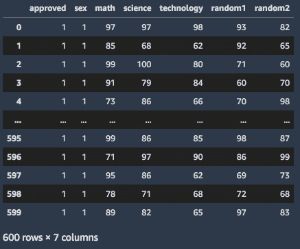

# *第七章*:使用 SageMaker 功能商店、SageMaker Clarify 和 SageMaker 模型监视器

在前一章中，我们通过使用 **SageMaker 自动驾驶仪**和**自动模型调整**来准备高质量的模型，第一次看到了 **SageMaker 工作室**，以及它的自动机器学习能力。在这一章中，我们将重点介绍 SageMaker 的另外几个功能，这些功能与**sage maker Studio**–**sage maker 特征存储**、 **SageMaker Clarify** 和 **SageMaker 模型监视器**有很好的集成。这些功能可以帮助数据科学家和机器学习实践者在进行生产级机器学习实验和部署时处理特定但相关的需求。

这些包括使用在线和离线特征存储，检测数据中的偏差，实现机器学习的可解释性，以及监控部署的模型。下图显示了如何在机器学习过程的不同阶段使用这些功能:


图 7.1–使用 SageMaker 功能存储、澄清和模型监视器

我们将首先使用 **SageMaker 特征库**来存储和管理我们数据集中的 ML 特征。我们还将进一步了解如何使用 **SageMaker Clarify** 来检测我们数据中的训练前和训练后偏差。除此之外，我们还将学习如何使用 **SageMaker Clarify** 生成 ML 可解释性报告。然后我们将学习如何使用 **SageMaker 模型监视器**来捕获和分析我们的推理端点中的数据。最后，我们将了解如何使用 **SageMaker 模型监视器**来自动检测数据质量漂移。

我们将在本章中介绍以下配方:

*   生成合成数据集并使用 **SageMaker 特征库**进行存储和管理
*   从 **SageMaker 特色店**的线下店查询数据并上传到亚马逊 S3
*   用 **SageMaker Clarify** 检测训练前偏差
*   用 **SageMaker Clarify** 检测训练后偏差
*   使用 **SageMaker Clarify** 启用 ML 可解释性
*   从模型中部署一个端点，并使用 **SageMaker 模型监视器**启用数据捕获
*   使用 **SageMaker 型号监控器**进行基线和预定监控

一旦我们完成了本章的配方，我们将会更好地理解这些能力和特性是如何帮助 ML 实验和部署成功的。

现在，让我们继续本章的食谱吧！

# 技术要求

要执行本章中的食谱，确保你有一个亚马逊 S3 桶，以及管理**亚马逊 SageMaker** 和**亚马逊 S3** 资源的权限，如果你使用的是一个带有自定义 URL 的 **AWS IAM** 用户。如果您使用的是 root 帐户，那么您应该能够继续本章中的食谱。但是，建议您以 AWS IAM 用户的身份登录，而不是在大多数情况下使用 root 帐户。有关更多信息，请随意查看[https://docs . AWS . Amazon . com/IAM/latest/user guide/best-practices . html](https://docs.aws.amazon.com/IAM/latest/UserGuide/best-practices.html)。

由于本章中的食谱涉及到一些代码，我们在本书的 GitHub 资源库中提供了必要的脚本和笔记本:[https://GitHub . com/packt publishing/Machine-Learning-with-Amazon-sage maker-Cookbook/tree/master/chapter 07](https://github.com/PacktPublishing/Machine-Learning-with-Amazon-SageMaker-Cookbook/tree/master/Chapter07)。在开始本章的每个食谱之前，确保 my-experiments/chapter07 目录已经准备好。如果它还没有创建，请现在就创建，因为这将有助于我们在学习本书中的每一个食谱时保持事物的有序。

请点击以下链接查看动作视频中的相关代码:

[https://bit.ly/3nfR8Zg](https://bit.ly/3nfR8Zg)

# 生成合成数据集并使用 SageMaker 特征库进行存储和管理

在这个菜谱中，我们将生成一个类似于下面截图所示的合成数据集。在这里，我们将模拟一个示例场景，其中一所学校计划构建一个二元分类器模型，该模型根据某些属性自动批准或拒绝申请奖学金的候选人，例如他们在数学、科学和技术考试中的分数:


图 7.2–合成数据集

该数据集将有四个主要预测值列，分别称为性别、数学、科学和技术，以及，还有两个包含随机值的列，分别称为 random1 和 random2。这些栏目将帮助我们验证 **SageMaker Clarify** 在*中使用 SageMaker Clarify* 配方启用 ML 可解释性所生成的特性重要性报告是否有效。除此之外，生成的数据集将有两个额外的列，称为 event_time 和 index，因为我们将使用 **SageMaker Feature Store** 来接收和管理我们的要素组和已处理的数据集。

**SageMaker 特征库**将作为存储已处理特征的集中存储库。这些存储的记录将在本章的后续配方中加载用于训练和推理。正如我们将在*使用 SageMaker Clarify* 方法检测训练前偏差中看到的，我们将在此方法中生成的合成数据集被认为是不平衡的，因为它在每个类中的实例数量不相等—“女性”(性别=0)类的记录明显少于“男性”(性别=1)类。在*使用 SageMaker Clarify* 方法检测训练后偏差中，我们还将看到，使用我们将在该方法中生成的数据集，我们将使用该数据集训练的模型将生成训练后偏差报告。这将表明该模型批准男性申请人的几率高于女性申请人。

## 准备就绪

以下是这个食谱的先决条件:

*   在你制作这个食谱之前，SageMaker Studio 需要设置好并准备好。如果你还没有在亚马逊 SageMaker 中设置 [*第六章*](B16850_06_Final_ASB_ePub.xhtml#_idTextAnchor435)*自动机器学习的*到 SageMaker 工作室*的方法，你可以随意查看。*
*   确保与 **SageMaker Studio** 关联的执行角色拥有将文件上传到**亚马逊 S3** 的必要权限。您可以将 AmazonS3FullAccess 策略附加到上述执行角色。

## 如何做它…

我们将在 **SageMaker Studio** 中运行以下步骤:

1.  Create a new notebook using the Python 3 (Data Science) kernel inside the *my-experiments/chapter07* directory and rename it so that it's the name of this recipe (Generating a synthetic dataset and using SageMaker Feature Store for storage and management):

    图 7.3–创建新笔记本

    前面的截图显示了如何从**文件**菜单创建一个新的**笔记本**。当提示使用内核时，选择 Python 3(数据科学)。

2.  Use the %load magic command to load the data_generator.py script file from the *Machine-Learning-with-Amazon-SageMaker-Cookbook* GitHub repository:

    ```
    %load \ 
    https://raw.githubusercontent.com/PacktPublishing/Machine-Learning-with-Amazon-SageMaker-Cookbook/master/Chapter07/scripts/generator.py
    ```

    这应该会神奇地用指定脚本文件中的代码替换原始单元格内容，类似于下面的屏幕截图所示:

    

    图 7.4–使用%load 从本书的 GitHub 存储库中加载 data_generator.py 脚本

    正如我们所看到的，generator.py 脚本文件利用 generate_list_of_random_scores()为数学、科学、技术、random1 和 random2 列生成分数。除此之外，该脚本还利用 generate_event_time_records()函数来生成 event_time 列的值。

3.  Run the cell containing the code from the previous step to start generating the synthetic dataset. This should generate a set of logs and a DataFrame of values, similar to what is shown in the following screenshot:

    图 7.5–包含生成的合成数据集的数据帧

    在这里，我们可以看到我们已经为合成数据集生成了 1000 条记录。这个数据集中的每个记录都有以下字段的值:批准(目标变量)、性别、数学、科学、技术、随机 1、随机 2、索引和事件_ 时间。

4.  在下一个单元格中，导入并准备一些先决条件，包括 boto3、sagemaker 和 session:

    ```
    import boto3 import sagemaker from sagemaker.session import Session region = boto3.Session().region_name session = boto3.Session(region_name=region)
    ```

5.  初始化名为 feature_store_session 的会话对象:

    ```
    client = session.client(     service_name='sagemaker',      region_name=region ) runtime = session.client(     service_name='sagemaker-featurestore-runtime',      region_name=region ) feature_store_session = Session(     boto_session=session,     sagemaker_client=client,     sagemaker_featurestore_runtime_client=runtime )
    ```

6.  指定存储数据的 S3 桶名和前缀。确保将“< insert s3 bucket name here >的值替换为我们在*准备亚马逊 s3 bucket 和线性回归实验的训练数据集*第 1 章 、*使用亚马逊 SageMaker 开始机器学习* :

    ```
    s3_bucket_name = "<insert s3 bucket name here>" prefix = "chapter07"
    ```

    中创建的 bucket 的名称
7.  初始化执行角色和 boto3 S3 客户端:

    ```
    from sagemaker import get_execution_role role = get_execution_role() s3_client = boto3.client('s3', region_name=region)
    ```

8.  在特征组名变量中指定特征组名:

    ```
    feature_group_name = 'cookbook-feature-group'
    ```

9.  接下来，初始化 FeatureGroup 对象，并将 feature_group_name 和 feature_store_session 变量作为参数值传递:

    ```
    from sagemaker.feature_store.feature_group import FeatureGroup feature_group = FeatureGroup(     name=feature_group_name,      sagemaker_session=feature_store_session )
    ```

10.  Use the load_feature_definitions() function to have SageMaker automatically detect the data types for the features in the feature group from a specified DataFrame:

    ```
    feature_group.load_feature_definitions(
        data_frame=all_df
    )
    sleep(1)
    ```

    重要说明

    在继续下一步之前，确保与 **SageMaker Studio** 关联的执行角色拥有将文件上传到**亚马逊 S3** 的必要权限。您可以将 AmazonS3FullAccess 策略附加到上述执行角色。

11.  Use the create() function to create the feature group. Make sure to set the enable_online_store parameter value to True:

    ```
    feature_group.create(
        s3_uri=f"s3://{s3_bucket_name}/{prefix}/input",
        record_identifier_name="index",
        event_time_feature_name="event_time",
        role_arn=role,
        enable_online_store=True
    )
    sleep(60)
    ```

    请注意，在这一步中，我们已经指定索引列将作为记录的唯一标识符。稍后，我们将看到我们可以通过指定索引列，使用 get_record()函数从特性组中获取特定的记录。除此之外，我们还指定 event_time 列作为与记录的 created_at 或 updated_at 值相对应的字段，这将允许我们在使用离线存储时获得记录的特定版本。最后，我们使用 sleep()函数阻塞并等待一分钟，让这些变化对产生效果。

    注意

    在线商店和线下商店的一个主要区别是，在线商店只存储最新版本的记录，而线下商店包含所有记录，包括 p 以前的记录。离线存储一般用于存储几个月或几年的特征数据，这意味着在对某些记录执行查询时可能会有重复的信息。我们将在*的*还有更多…* 部分更详细地讨论这个问题，从 SageMaker Feature Store 的线下商店查询数据，并将其上传到亚马逊 S3* recipe。

12.  Inspect the feature group's status using the following code:

    ```
    feature_group.describe()
    ```

    这应该给我们一个值的字典，类似于下面的截图所示:

    

    图 7.6–feature _ group . describe()的结果

    在前面的截图中，我们可以看到调用 feature_group.describe()函数后特性组的属性。其中包括 FeatureDefinitions、OnlineStoreConfig 和 FeatureGroupStatus 的值，以及其他属性。

13.  Inspect the feature group's status using the following code:

    ```
    feature_group.describe().get("FeatureGroupStatus")
    ```

    这将返回一个“Created”状态。

14.  Now that we have prepared everything, we will use the ingest() function with the all_df DataFrame as the value of the data_frame parameter:

    ```
    %%time
    feature_group.ingest(
        data_frame=all_df, max_workers=3, wait=True
    )
    ```

    该函数只是将 all_df 数据帧中的记录加载到特征存储中。等待大约分钟左右，让这个第 ep 完成。请注意，运行此代码块时，当特性组定义与数据帧内的值的数据类型不匹配时，您可能会遇到问题或错误。通过确保将 **SageMaker Python SDK** 和其他相关库的版本更新到最新版本，或者通过将 **pandas** DataFrame 的列值转换为适当的类型(例如，使用 asty pe()函数)，您也许能够解决这个问题。

15.  To test if the records have been ingested properly in the online store, use the get_record() function and load the last value in the DataFrame that was ingested by specifying 300 as the record identifier value:

    ```
    runtime.get_record(
        FeatureGroupName=feature_group.name, 
        RecordIdentifierValueAsString="300"
    )
    ```

    这将返回一个嵌套的值字典，类似于下面的屏幕截图所示:

    

    图 7.7–使用 get_record()函数后的结果

    在这里，我们可以看到我们能够检索索引等于 300 的记录的特征值。

16.  Use the %store magic to store the variable values for feature_group_name, s3_bucket_name, and prefix:

    ```
    %store feature_group_name
    %store s3_bucket_name
    %store prefix
    ```

    我们将在本章后面的食谱中使用这些变量。

让我们看看这是如何运作的！

## 工作原理……

在这个配方中，我们生成了一个可用于分类问题的合成数据集。它包含以下几列:

*   包含目标变量的批准列。
*   性别、数学、科学和技术列，由 generate_list_of_random_scores()函数生成。
*   random1 和 random2 列，包含一组随机数字，用于在使用*使用 SageMaker Clarify* 配方启用 ML 解释能力中的 **SHAP** 值时，帮助识别每个特征对预测目标标签的贡献。
*   event_time 和 index 列，这是我们在使用 **SageMaker 特性库**时需要的。在 generator.py 脚本的末尾，我们更新了 DataFrame 中的几行，以在我们的数据集中引入偏差，这使得“男性”(性别=1)候选人比“女性”(性别=0)候选人更有可能获得批准。

一旦我们生成并准备好包含目标和预测变量值的数据帧，我们就使用 **SageMaker 特征库**来摄取它。有两种类型的店铺——**线上**和**线下**。在线商店通常用于实时加载记录，并且在涉及加载记录以测试推断端点的用例中运行良好。另一方面，离线存储在涉及加载一批在训练阶段使用的记录的场景中很有用。

注意

正如我们在*中提到的如何去做...*节，在线商店和线下商店的一个主要区别是，在线商店只存储最新版本的记录，而线下商店可能包含所有记录，包括以前的记录。例如，离线商店会有客户每月购买数据的以前快照的副本，而在线商店只有最新版本。这些属性，以及帮助机器学习实践者节省组织功能时间的其他好处，使在线和离线商店成为比单纯使用亚马逊 S3 进行存储更好的选择。

处理功能存储时，该过程通常包括以下步骤:

1.  将加载特征组属性和特征定义配置。
2.  将创建特征组。
3.  数据被吸收到特征组中。
4.  为训练数据从脱机存储区加载了多条记录。
5.  从在线商店为推断测试数据加载记录。

在这个方法中，我们执行了前三个步骤来获取特性组的数据帧值。在*从 SageMaker 功能商店的线下商店查询数据并将其上传到亚马逊 S3* 食谱中，我们将执行第四步并在训练阶段之前准备训练、验证和测试数据集时加载多条记录。最后，我们将执行*中的第五个步骤，从一个模型中部署一个端点，并使用 SageMaker Model Monitor* 方法启用数据捕获，当加载一个测试记录以验证推断端点是否正确地配置了 。

# 从 SageMaker 特色店的线下店查询数据，上传到亚马逊 S3

在之前的配方中，我们生成了一个合成数据集，并使用摄取()函数将其存储在 **SageMaker 特征库**中。在本配方中，我们将演示如何从离线商店的功能组中加载数据，数据存储在之前的配方中。正如我们在*生成合成数据集和使用 SageMaker 特性存储进行存储和管理*配方中所讨论的，离线存储对于涉及加载一批在训练阶段使用的记录的用例非常有用。也就是说，训练、验证和测试数据集将从离线商店加载，以 CSV 格式导出，然后上传到 S3。

重要说明

请注意，如果您刚刚将数据输入到*生成合成数据集的要素组中，并使用 SageMaker 要素存储来存储年龄和管理*配方，您可能需要等待几分钟才能查询离线存储数据。

## 准备就绪

该配方延续了*生成合成数据集并使用 SageMaker 特征库存储和管理配方。*

## 怎么做……

下一组步骤集中在从 **SageMaker 功能商店**离线商店加载训练、验证和测试数据集，并将它们存储在 S3。让我们开始吧:

1.  在 my-experiments/chapter07 目录中使用 Python 3(数据科学)内核创建一个新的笔记本，并将其重命名为该食谱的名称(从 SageMaker Feature Store 的离线商店中查询数据并上传到亚马逊 S3)。当提示使用内核时，选择 Python 3(数据科学)。
2.  从**SageMaker Python SDK**和 boto3 Session 对象:

    ```
    import boto3 import sagemaker from sagemaker.session import Session from sagemaker.feature_store.feature_group import FeatureGroup region = boto3.Session().region_name session = boto3.Session(region_name=region)
    ```

    导入和准备一些先决条件，如 Session 和 FeatureGroup 类
3.  接下来，初始化 feature_store_session 会话:

    ```
    client = session.client(     service_name='sagemaker',      region_name=region ) runtime = session.client(     service_name='sagemaker-featurestore-runtime',      region_name=region ) feature_store_session = Session(     boto_session=session,     sagemaker_client=client,     sagemaker_featurestore_runtime_client=runtime )
    ```

4.  使用%store magic 加载 feature_group_name 的变量值，并使用它加载我们在*中创建的特征组，生成合成数据集并使用 SageMaker 特征库进行存储和管理*方法:

    ```
    %store -r feature_group_name feature_group = FeatureGroup(     name=feature_group_name,      sagemaker_session=feature_store_session )
    ```

5.  Run the following block of code to store the Athena table name in the table variable:

    ```
    table = feature_group.athena_query().table_name
    ```

    注意

    注意，离线商店利用 Amazon Athena 通过 SQL 查询获取数据。

6.  Get the S3 URI from the response nested dictionary value after using the describe() function of the feature_group object:

    ```
    describe_response = feature_group.describe()
    offline_config = describe_response['OfflineStoreConfig']
    s3_uri = offline_config['S3StorageConfig']['S3Uri']
    !aws s3 ls {s3_uri} --recursive
    ```

    这应该会给我们一个拼花文件列表，这些文件对应于我们已经存储在离线特征存储中的数据。分栏拼花格式与亚马逊 Athena 合作得很好，因为对以这种格式存储的数据的查询通常比 CSV 或 TSV 文件有更好的性能。

7.  Use the %store magic to load the variable values for s3_bucket_name and prefix. Using these values, prepare the S3 output path stored in the output_location variable:

    ```
    %store -r s3_bucket_name
    %store -r prefix
    base = f's3://{s3_bucket_name}/{prefix}'
    output_location = f'{base}/query_results/'
    ```

    在随后的步骤中，我们将看到 Athena 查询的结果被存储在这个输出位置中。

8.  Define the query_data() function, which we will use to load the DataFrame containing the results of the Athena query:

    ```
    def query_data(query_string):
        print(f"QUERY: {query_string}\n")
        query = feature_group.athena_query()
        query.run(query_string=query_string, 
                  output_location=output_location)

        query.wait()

        return query.as_dataframe()
    ```

    接下来的几个步骤涉及通过使用我们在上一步中定义的 query_data() 函数查询数据来加载训练、验证和测试数据集:

9.  Use the query_data() function to load the first 600 records for the training dataset using Amazon Athena:

    ```
    query = f"""SELECT approved, sex, math, science, technology, random1, random2 FROM "{table}" ORDER BY index ASC LIMIT 600"""
    training_df = query_data(query)
    training_df
    ```

    这将为我们提供一个类似于下面截图所示的数据框架:

    

    图 7.8–训练数据集

    这里，我们有一个包含训练数据的数据帧。

    重要说明

    如果在运行之前的查询后没有得到任何结果，请等待几分钟，然后重试。

10.  使用query _ data()函数为验证数据集加载接下来的 200 条记录:

    ```
    query = f"""SELECT approved, sex, math, science, technology, random1, random2 FROM "{table}" WHERE index > 600 ORDER BY index ASC LIMIT 200""" validation_df = query_data(query)
    ```

11.  以类似的方式，使用 query_data()函数为测试数据集

    ```
    query = f"""SELECT approved, sex, math, science, technology, random1, random2 FROM "{table}" WHERE index > 800 ORDER BY index ASC LIMIT 200""" test_df = query_data(query)
    ```

    加载最后 200 条记录
12.  创建tmp 目录工厂如果它还不存在:

    ```
    !mkdir -p tmp
    ```

13.  使用 to_csv()函数从数据帧:

    ```
    training_df.to_csv('tmp/training_data.csv',                     header=True,                     index=False) validation_df.to_csv('tmp/validation_data.csv',                       header=True,                       index=False) test_df.to_csv('tmp/test_data.csv',                 header=True,                 index=False)
    ```

    生成 csv 文件
14.  使用 aws s3 cp 命令将我们在上一步中生成的 CSV 文件上传到 S3:

    ```
    path = f"s3://{s3_bucket_name}/{prefix}" training_data_path = f"{path}/input/training_data.csv" validation_data_path = f"{path}/input/validation_data.csv" test_data_path = f"{path}/input/test_data.csv" !aws s3 cp tmp/training_data.csv {training_data_path} !aws s3 cp tmp/validation_data.csv {validation_data_path} !aws s3 cp tmp/test_data.csv {test_data_path}
    ```

15.  使用 to_csv()函数生成不带头文件的 csv 文件:

    ```
    target = 'tmp/training_data_no_header.csv' training_df.to_csv(target,                     header=False,                     index=False) target = 'tmp/validation_data_no_header.csv' validation_df.to_csv(target,                       header=False,                       index=False) test_df.to_csv('tmp/test_data_no_header.csv',                 header=False,                 index=False)
    ```

16.  使用 aws s3 cp 命令

    ```
    training_data_path_nh = f"{path}/input/training_data_no_header.csv" validation_data_path_nh = f"{path}/input/validation_data_no_header.csv" test_data_path_nh = f"{path}/input/test_data_no_header.csv" !aws s3 cp tmp/training_data_no_header.csv {training_data_path_nh} !aws s3 cp tmp/validation_data_no_header.csv {validation_data_path_nh} !aws s3 cp tmp/test_data_no_header.csv {test_data_path_nh}
    ```

    将我们在前面的步骤中生成的 CSV 文件上传到 S3
17.  Finally, use the %store magic to store the variable values for training_data_path, validation_data_path, test_data_path, training_data_path_nh, validation_data_path_nh, and test_data_path_nh:

    ```
    %store training_data_path
    %store validation_data_path
    %store test_data_path
    %store training_data_path_nh
    %store validation_data_path_nh
    %store test_data_path_nh
    ```

    我们将在 su 成功配方中使用一个或多个这些存储的变量值。

让我们看看这是如何工作的！

## 它是如何工作的…

在这个菜谱中，我们使用 **Amazon Athena** 和 SQL 查询来查询和加载数据，从 SageMaker 功能商店的离线商店加载记录。在*生成合成数据集并使用 SageMaker 功能商店进行存储和管理的*方法中，我们将数据摄取到离线和在线商店中。离线商店数据存储在**亚马逊 S3** 中，这个食谱中的步骤只是加载存储在离线商店中的数据。当特征组被定义和创建时，相应的**粘合数据目录**被创建。这充当了数据的模式，因此我们可以使用 Amazon Athena 执行查询。

这个配方中使用的 SQL 查询包括确保训练、验证和测试数据集是互斥的。为训练数据集加载前 600 条(60%)记录，为验证数据集加载后 200 条(20%)记录，为测试数据集加载后 200 条(20%)记录。注意，**亚马逊雅典娜**不支持偏移关键字，这就是为什么我们使用替代方法从线下商店提取记录。

## 还有更多……

该配方中的示例包含了如何使用 **SageMaker 特征库**的简化示例。我们可以利用功能商店做更多的事情，包括:

*   从两个要素组连接和提取数据
*   使用 Athena 查询加载以前版本的数据集并移除重复和已删除的记录，这涉及到在 WHERE 子句中使用 event_time 和 is_deleted 列

这个方法只涉及具有相同 event_time 值的单层记录。在实际示例中，一个要素组可能包含索引相同但 event_time 值不同的单个记录的副本。分析和处理数据时，会提取指定时间的数据集版本，并且仅从要素存储中加载指定时间戳之前的记录的最新版本。

如果需要在某个时间戳之前加载记录的最新版本，请使用以下 SQL 语句:

```
SELECT * FROM
    (SELECT *, row_number() OVER (PARTITION BY index
        ORDER BY event_time desc) AS row_num
        FROM <table name>
        where event_time <= timestamp '<timestamp>')
WHERE row_num = 1 and
NOT is_deleted
```

注意，index 和 event_time 列名只是这组配方中使用的名称/键。这些可以在摄取步骤之前初始化功能组时设置。

# 使用 SageMaker Clarify 检测训练前偏差

随着我们处理更多真实世界的例子，我们将开始遇到涉及检测和管理 ML 偏差的需求。例如，部署的机器学习模型可能会拒绝来自不受欢迎或代表性不足的群体的申请，因为用于训练这些模型的训练数据已经从一开始就对不受欢迎的群体有偏见。这减少了这些不受欢迎的群体的机会，从而使他们长期不适合某个应用程序。也就是说，一旦我们开始意识到确保机器学习公平的重要性，我们就会开始寻找能够帮助我们处理法律、道德和技术问题的解决方案。好消息是 **SageMaker Clarify** 可以帮助我们检测数据和模型中的 ML 偏差！

AI 和 ML 偏差可能存在于机器学习管道的特定阶段——训练之前、期间和之后。在本食谱中，我们将使用 **SageMaker Clarify** 来帮助检测给定数据集的训练前偏差，特别是**类别不平衡**。在 **SageMaker Clarify** 处理作业执行完毕后，我们将能够分析处理作业已经计算并作为输出返回的度量值。

注意

如果数据集的每个类没有相同数量的实例，则认为该数据集是不平衡的。当处理不平衡类问题时，我们需要小心，因为一些分类算法假设每个类的样本数量相等。除此之外，即使算法没有为每个类假设相同数量的样本，极端的类不平衡也会导致模型不起作用-如果数据集有 90%的数据属于类 A，剩余的 10%属于类 B，则模型每次只预测类 A 就可以获得表面上可接受的 90%的准确性。也就是说，未能正确检测和管理这一点可能会导致不正确和错误的结论，特别是在对代表性不足的群体进行预测时。

## 做好准备

这个菜谱上接*查询 SageMaker 特色店的线下店铺的数据，上传到亚马逊 S3* 菜谱。

## 怎么做……

该配方中的第一组步骤主要是为 **SageMaker Clarify** 加工作业准备先决条件位点。让我们开始吧:

1.  在 my-experiments/chapter07 目录中使用 Python 3(数据科学)内核创建一个新笔记本，并将其重命名为该食谱的名称(使用 SageMaker Clarify 检测训练前偏差)。当提示使用内核时，选择 Python 3(数据科学)。
2.  指定 s3_bucket_name 和前缀值:

    ```
    %store -r s3_bucket_name %store -r prefix %store -r training_data_path
    ```

3.  导入、准备和加载一些先决条件，例如会话、区域和角色:

    ```
    import sagemaker session = sagemaker.Session() region = session.boto_region_name role = sagemaker.get_execution_role()
    ```

4.  进口熊猫和熊猫宝贝:

    ```
    import pandas as pd import numpy as np
    ```

5.  如果 tmp 目录尚不存在，则创建该目录:

    ```
    !mkdir -p tmp
    ```

6.  指定 s3_training_data_path 和 s3_output_path 值:

    ```
    s3_training_data_path = training_data_path s3_output_path = f"s3://{s3_bucket_name}/{prefix}/output"
    ```

7.  使用 AWS CLI 将文件复制到 tmp 目录:

    ```
    !aws s3 cp {s3_training_data_path} tmp/training_data.csv
    ```

8.  Load the training data using the read_csv() function:

    ```
    training_data = pd.read_csv("tmp/training_data.csv")
    ```

    既然我们已经准备好了先决条件，我们可以专注于让 **SageMaker Clarify** 处理作业在下一组步骤中运行:

9.  初始化 SageMakerClarifyProcessor 类。这个类只是一个专门构建的包装类，它利用了 **SageMaker 处理**功能:

    ```
    from sagemaker import clarify processor = clarify.SageMakerClarifyProcessor(     role=role,     instance_count=1,     instance_type='ml.m5.large',     sagemaker_session=session )
    ```

10.  初始化数据配置对象:

    ```
    data_config = clarify.DataConfig(     s3_data_input_path=s3_training_data_path,     s3_output_path=s3_output_path,     label='approved',     headers=training_data.columns.to_list(),     dataset_type='text/csv' )
    ```

11.  Initialize the BiasConfig object:

    ```
    bias_config = clarify.BiasConfig(
        label_values_or_threshold=[1],
        facet_name='sex',
    )
    ```

    如果你想知道这些配置值的含义，不要担心——我们将在*如何工作…* 部分解释这个配置如何工作。

12.  Use the run_pre_training_bias() function and wait a few minutes for the job to complete. In the following code block, we are specifying the data_config and the bias_config objects we initialized in the previous steps as arguments when calling the run_pre_training_bias() function:

    ```
    %%time
    processor.run_pre_training_bias(
        data_config=data_config, 
        data_bias_config=bias_config,
        methods=['CI']
    )
    ```

    注意该步骤可能需要大约 5 到 10 分钟才能完成。调用 run_pre_training_bias()将触发一个 **SageMaker Clarify** 处理作业。这将使用一个预构建的 **SageMaker Clarify** 容器映像运行一个 容器。

13.  一旦处理任务完成，我们就获得了输出目的地，并可以将 URI 字符串值存储在 output_uri 变量中:

    ```
    output = processor.latest_job.outputs[0] output_destination = output.destination
    ```

14.  使用 AWS CLI 将生成的文件复制到 tmp di 目录:

    ```
    !aws s3 cp {output_destination}/ tmp/ --recursive !ls -lahF tmp/
    ```

15.  Inspect the content of the analysis.json file:

    ```
    !cat tmp/analysis.json
    ```

    这将为我们提供一个嵌套的值结构，类似于下面的屏幕截图所示:


图 7.9–tmp/analysis . JSON 文件的内容

在这里，我们可以看到预训练偏差作业的结果。仅仅通过查看 th e tmp/analysis.json 文件中 CI 的指标值，我们就可以推断出 w e 有一个不平衡的数据集。

现在，让我们看看这是如何工作的！

## 工作原理…

**SageMaker Clarify** 利用 **SageMaker Processing** 运行一个评估数据的作业。在这种情况下，我们指定我们只想从一个更大的预训练偏差度量列表中获取**类不平衡** ( **CI** )度量。除了类别不平衡指标，我们还可以使用 **SageMaker Clarify** 计算其他偏差指标。其中包括**标签中的正比例差异**(**DPL**)**库尔贝克-利布勒散度**(**KL**)**詹森-香农散度**(**JS**)**LP 范数**(**LP**)**总变异距离** ( **TVD** )，

**科莫戈罗夫-斯米尔诺夫** ( **KS** )，以及**标签中的条件人口差异** ( **CDDL** )。这些预训练偏差指标是模型不可知的，这意味着我们可以在训练步骤之前对原始数据集进行计算。

那么，我们如何解释下图所示的内容呢？对于类不平衡度量，接近 1 或-1 的正分数(如 0.5933333334)意味着性别方面在数据集中对于给定值(如 1)有更多的训练样本。这意味着在所提供的数据集中，男性和女性的数量不平衡:


图 7.10–解释班级失衡分数

正如我们所看到的，类不平衡度量的可能得分范围在-1 和 1 之间。接近 1 或-1 的分数意味着数据集不平衡。另一方面，接近 0 的分数意味着数据集中男性和女性的分布接近相等。用不平衡的数据集训练的模型对代表性不足的群体的预测可能不太准确。

重要说明

我们如何处理这个**阶级不平衡**的问题？有不同的方法来处理数据集中的类不平衡。一种可能的方法是对优势组执行下采样，然后对调整后的数据集使用**sage maker Clarify**run _ pre _ training _ bias()函数，以查看修改(例如，下采样)如何影响 CI 指标得分。如果我们获得的 CI 指标分数非常接近零，这意味着我们已经解决了数据集中存在的类别不平衡问题。关于这个话题的更多信息，请随意查看这里的白皮书:[https://pages.awscloud.com/rs/112-TZM-766/images/Amazon.AI.Fairness.and.Explainability.Whitepaper.pdf](https://pages.awscloud.com/rs/112-TZM-766/images/Amazon.AI.Fairness.and.Explainability.Whitepaper.pdf)。

## 还有更多……

我们实际上可以使用 run_bias()函数在处理作业中同时运行训练前和训练后分析:

```
clarify_processor.run_bias(
    data_config=bias_data_config, 
    data_bias_config=bias_config,
    ...
    pre_training_methods=['CI'],
    post_training_methods=['DPPL', 'RD']
)
```

当然，这种方法可能涉及更多的配置参数值和先决条件。但是，它也有自己的优势，例如运行单个处理作业来进行训练前和训练后的偏差检测和分析。

现在，让我们仔细看看如何检测训练后偏差！

# 用 SageMaker Clarify 检测训练后偏差

在之前的配方中，我们使用 **SageMaker Clarify** 来帮助我们检测数据中的训练前偏差。在本配方中，我们将使用 **SageMaker Clarify** 来检测我们在之前配方中使用的同一数据集中的训练后偏差。除此之外，我们将使用该数据集训练一个模型，并使用它来计算训练后偏差指标。具体来说，我们将计算预测标签 ( **DPPL** )和**召回差异** ( **RD** )度量值中的正比例**差异，并在加工作业完成运行后检查结果。**

注意

为什么这很重要？如果 **DPPL** 的度量值表明对弱势群体有偏见，这意味着机器学习模型有更高的机会预测优势群体的积极结果。例如，如果优势群体涉及男性申请人，而弱势群体涉及女性申请人，则机器学习模型可能会接受优势群体比弱势群体更多的奖学金申请。同样，如果 **RD** 的度量值表明对弱势群体有偏见，这意味着机器学习模型有更高的机会*正确预测优势群体相对于弱势群体的*可能结果。使用相同的应用示例，机器学习模型有更高的机会正确接受 30 岁以上申请人的奖学金申请。最后，请注意 **DPPL** 和 **RD** 测量的是不同的东西。RD 测量两组之间的**真 P 阳性率**的差异，这可能意味着另一组的假阴性率更高。

## 做好准备

该配方延续了*用 SageMaker Clarify* 配方检测训练前偏差。

## 怎么做……

该配方中的第一组步骤主要是使用 **SageMaker Python SDK** 准备模型。请注意，在运行训练后偏差作业之前，我们需要准备好模型。让我们开始吧:

1.  在 my-experiments/chapter07 目录中使用 Python 3(数据科学)内核创建一个新的笔记本，并将其重命名为该食谱的名称(使用 SageMaker Clarify 检测训练后偏差)。当提示使用内核时，选择 Python 3(数据科学)。
2.  使用%store magic 加载 s3_bucket_name、prefix 和 training_data_path:

    ```
    %store -r s3_bucket_name %store -r prefix %store -r training_data_path
    ```

    的变量值
3.  使用**SageMaker Python SDK**:

    ```
    import sagemaker session = sagemaker.Session() region = session.boto_region_name role = sagemaker.get_execution_role()
    ```

    导入、准备和加载一些先决条件，比如会话、区域和角色
4.  初始化S3 _ training _ data _ path 和 s3_output_path 的变量值:

    ```
    s3_training_data_path = training_data_path s3_output_path = f"s3://{s3_bucket_name}/{prefix}/output"
    ```

5.  使用 AWS CLI 将测试数据集 CSV 文件从S3 存储桶下载到 tmp 目录:

    ```
    !aws s3 cp {s3_training_data_path} tmp/training_data.csv
    ```

6.  使用函数

    ```
    import pandas as pd training_data = pd.read_csv("tmp/training_data.csv")
    ```

    加载训练数据集
7.  使用 retrieve()函数获取容器 URI:

    ```
    from sagemaker.image_uris import retrieve container = retrieve('xgboost', region, version='1.2-1')
    ```

8.  初始化评估器对象:

    ```
    from sagemaker.estimator import Estimator estimator = Estimator(     container,     role,     instance_count=1,     instance_type='ml.m5.large',     sagemaker_session=session )
    ```

9.  使用 set_hyperparameters()函数指定超参数:

    ```
    estimator.set_hyperparameters(     objective='binary:logistic',     max_depth=8,     eta=0.1,     min_child_weight=4,     num_round=500 )
    ```

10.  使用训练输入:

    ```
    from sagemaker.inputs import TrainingInput train_input = TrainingInput(     s3_training_data_path,      content_type='csv' )
    ```

11.  Call the fit() function to start the training job:

    ```
    %%time
    estimator.fit({'train': train_input}, wait='True')
    ```

    这应该需要大约 4 到 7 分钟来完成。

12.  定义 generate_model_name()函数:

    ```
    import random from string import ascii_uppercase def generate_model_name():     chars = random.choices(ascii_uppercase, k=5)     output = 'model-' + ''.join(chars)     return output
    ```

13.  Use the generate_model() function to generate the model name:

    ```
    model_name = generate_model_name()
    ```

    这应该给我们一个类似于‘model-RV jml’的值。

    注意

    为什么我们要为模型名称生成一个随机字符串？在下一步中，我们将使用 create_model()函数，它接受 name 参数值。您可能已经猜到了，这个 name 参数值应该是惟一的。

14.  Use the create_model() function from the Estimator object to create the model entity:

    ```
    model = estimator.create_model(name=model_name)
    ```

    此时，模型已经完成了训练，并为后续步骤做好了准备。

    下一组步骤集中在上，使用该配方前半部分的先决条件来运行训练后偏差检测作业:

15.  使用 prepare_container_def()函数，将带有 Image、environent 和 ModelDataUrl 值的字典存储在 container_def 变量:

    ```
    container_def = model.prepare_container_def()
    ```

    中
16.  使用会话

    ```
    session.create_model(     model_name,     role,     container_def )
    ```

    中的 create_mode l()函数
17.  初始化 SageMakerClarifyProcessor 对象:

    ```
    from sagemaker.clarify import SageMakerClarifyProcessor processor = SageMakerClarifyProcessor(     role=role,            instance_count=1,           instance_type='ml.m5.large',     sagemaker_session=session )
    ```

18.  用我们在前面步骤中准备的先决条件初始化data config 对象:

    ```
    from sagemaker.clarify import DataConfig data_config = DataConfig(     s3_data_input_path=s3_training_data_path,     s3_output_path=s3_output_path,     label='approved',     headers=training_data.columns.to_list(),     dataset_type='text/csv' )
    ```

19.  初始化模型配置和模型预测标签配置对象:

    ```
    from sagemaker.clarify import ModelConfig model_config = ModelConfig(     model_name=model_name,     instance_type='ml.c5.xlarge',     instance_count=1,     accept_type='text/csv' )
    ```

20.  Initialize the ModelPredictedLabelConfig object with a probability threshold of 0.5:

    ```
    from sagemaker.clarify import ModelPredictedLabelConfig
    predictions_config = ModelPredictedLabelConfig(
        probability_threshold=0.5
    )
    ```

    根据预测值，为 probability_threshold 参数指定的值用于选择二进制标签。例如，如果预测值为 0.4，那么由于 0.4 小于 0.5，预测值将被设置为 0。

21.  Initialize the BiasConfig object:

    ```
    from sagemaker.clarify import BiasConfig
    bias_config = BiasConfig(
        label_values_or_threshold=[1],              
        facet_name='sex'                             
    )
    ```

    请注意，这种配置目前可能没有意义！不过不要担心，我们将在*工作原理……*部分详细讨论这些值。

22.  Call the run_post_training_bias() function and use the configuration objects we initialized in the previous steps as the parameter values:

    ```
    %%time
    processor.run_post_training_bias(
        data_config=data_config, 
        data_bias_config=bias_config,
        methods=['DPPL', 'RD'],
        model_config=model_config,
        model_predicted_label_config=predictions_config
    )
    ```

    这里，我们已经配置了培训后偏差检测作业，将重点放在 DPPL 和研发上。如果您想知道这些是什么，不要担心-我们将在*它如何工作……*部分详细解释这些。

    注意

    完成此步骤大约需要 10 到 15 分钟。在等待的时候，请随意喝杯咖啡或茶！

23.  将加工作业输出文件的 S3 位置存储在输出_ 目的变量:

    ```
    output = processor.latest_job.outputs[0] output_destination = output.destination
    ```

24.  Download and inspect the analysis.json file that was generated by the **SageMaker Clarify** processing job:

    ```
    !aws s3 cp {output_destination}/ tmp/ --recursive
    !cat tmp/analysis.json
    ```

    这将为我们提供一个嵌套结构，类似于下面的屏幕截图所示:

    

    图 7.11-DDPL 和研发的训练后偏差度量值

    这里我们可以看到**预测标签正比例差异** ( **DDPL** )度量值为-0.33541395157418197，而**召回差异** ( **RD** )度量值为 0.0。如果您想知道这些值是什么意思，不要担心——我们将在*它是如何工作的……*部分讨论这个问题！

25.  Finally, use the %store magic to store the variable value for model_name:

    ```
    %store model_name
    ```

    我们将在使用 SageMaker Clarify 配方的*中使用该值。*

让我们看看这是如何工作的！

## 工作原理……

**SageMaker Clarify** 让使用 **SageMaker Processing** 来运行一个评估数据的任务。在这种情况下，我们指定了，我们希望只从一个更大的训练后偏差指标列表中获取 **DPPL** 和 **RD** 指标。 除了这些指标，我们还可以使用 **SageMaker Clarify** 计算其他偏差指标。其中包括**全异影响** ( **迪**)**有条件接受差异**(**DCA**)**有条件拒绝差异**(**DCR**)**接受率差异**(**DAR**)**拒绝率差异**(**DRR**)**准确度差异这些度量值有助于量化并检测模型和数据偏差:**


图 7.12-如何解释 DPPL 指标得分

那么，我们如何解释上图中显示的内容呢？正的 **DPPL** 值，例如 0.335414，意味着对于给定的数值(例如 1)，性别方面具有相对较高的预测可能结果比例。这意味着在奖学金申请方面，男性的批准率高于女性。

另一方面， **RD** 的值为 0.0 意味着在进行正确预测时，没有检测到对不受欢迎的群体的偏见。由于 **RD** 的公式涉及两个相关组的真实阳性率的差异(例如，TPR(a) - TPR(b))，值 0.0 表示模型对两个组具有相等的真实阳性率。这意味着该模型对于男性和女性都有同样的机会做出正确的预测。

重要说明

有关训练数据的后处理偏差度量的更多信息，请随意查看这里的白皮书:[https://pages.awscloud.com/rs/112-TZM-766/images/Amazon.AI.Fairness.and.Explainability.Whitepaper.pdf](https://pages.awscloud.com/rs/112-TZM-766/images/Amazon.AI.Fairness.and.Explainability.Whitepaper.pdf)。

# 使用 SageMaker Clarify 启用 ML 可解释性

在前两个食谱中，我们使用 **SageMaker Clarify** 来检测训练前和训练后的偏差。在这个食谱中，我们将仔细研究 ML 可解释性，以及如何使用 **SageMaker Clarify** 生成 ML 可解释性报告。

当我们处理伦理和法律问题时，我们会看到 ML 可解释性的重要性。例如，客户将希望更好地了解他们的信息如何被机器学习系统用来执行推荐或预测。除此之外，ML explainability 使数据科学家和机器学习从业者能够做出更准确和公平的模型。

注意

区分**模型可解释性**和**模型可解释性**是很重要的。**模型可解释性**专注于理解机器学习模型内部在做什么。另一方面，**模型可解释性**涉及理解机器学习模型如何使用人类术语中的某些特征值来执行预测。

有了 **SageMaker Clarify** ，我们将能够自动计算 SHAP 值，这有助于我们确定与模型做出的预测相关的每个特征的重要性。

## 做好准备

该配方延续了*中的使用 SageMaker Clarify* 配方检测训练后偏差。

## 怎么做……

该配方的步骤如下:

1.  在 my-experiments/chapter07 目录中使用 Python 3(数据科学)内核创建一个新的笔记本，并将其重命名为该食谱的名称(使用 SageMaker Clarify 启用 ML explainability)。当提示使用内核时，选择 Python 3(数据科学)。
2.  使用%store magic 加载 s3_bucket_name、prefix、training_data_path、test_data_path 和 model _name:

    ```
    %store -r s3_bucket_name %store -r prefix %store -r training_data_path %store -r test_data_path %store -r model_name
    ```

    的变量值
3.  从**SageMaker PythonSDK**:

    ```
    import sagemaker session = sagemaker.Session() region = session.boto_region_name role = sagemaker.get_execution_role()
    ```

    中导入、准备和加载一些先决条件，比如会话、区域和角色
4.  准备S3 目标路径:

    ```
    s3_training_data_path = training_data_path s3_test_data_path = test_data_path s3_output_path = f"s3://{s3_bucket_name}/{prefix}/output"
    ```

5.  使用 **AWS CLI** 复制包含训练 ing 和测试集:

    ```
    !aws s3 cp {s3_training_data_path} tmp/training_data.csv !aws s3 cp {s3_test_data_path} tmp/test_data.csv
    ```

    的 CSV 文件
6.  Load the training and test datasets and then generate the features CSV file:

    ```
    import pandas as pd
    training_data = pd.read_csv("tmp/training_data.csv")
    test_data = pd.read_csv("tmp/test_data.csv")
    target = test_data['approved']
    features = test_data.drop(columns=['approved'])
    features.to_csv('tmp/test_features.csv', 
                    index=False, 
                    header=False)
    ```

    请注意，我们使用测试数据集减去批准的列作为 test_features.csv 文件的数据源。

7.  将 test_features.csv 文件复制到亚马逊 S3 存储桶:

    ```
    base = f"s3://{s3_bucket_name}/{prefix}/input" s3_feature_path = f"{base}/test_features.csv" !aws s3 cp tmp/test_features.csv {s3_feature_path}
    ```

8.  初始化 ModelConfig 对象并指定 model_name 参数值。注意在运行下面几行代码之前，必须已经存在一个同名的模型。如果您已经使用了*使用 SageMaker Clarify* 方法检测训练后偏差中的 create_model()函数，那么我们运行下一组指令将不会有任何问题。否则，确保你从一个已完成的培训工作中找到并得到一个符合这个食谱的模特的名字:

    ```
    from sagemaker.clarify import ModelConfig model_config = ModelConfig(     model_name=model_name,     instance_type='ml.c5.xlarge',     instance_count=1,     accept_type='text/csv' )
    ```

9.  初始化 SageMakerClarifyProcessor 对象:

    ```
    from sagemaker.clarify import SageMakerClarifyProcessor processor = SageMakerClarifyProcessor(     role=role,     instance_count=1,     instance_type='ml.m5.large',     sagemaker_session=session )
    ```

10.  Prepare the baseline variable:

    ```
    baseline = features.iloc[0:200].values.tolist()
    ```

    这里，我们使用特征数据帧中的 200 条记录作为基线。

11.  Initialize the SHAPConfig object and pass the baseline as one of the parameter values. Specify the number of samples and the aggregation method for the global SHAP values:

    ```
    from sagemaker.clarify import SHAPConfig
    shap_config = SHAPConfig(
        baseline=baseline,
        num_samples=50,
        agg_method='median'
    )
    ```

    agg_method 参数有三个可能的值–mean _ abs、median 和 mean_sq。该配置参数简单地告诉训练作业它如何聚集和累加 SHAP 值。

12.  准备 s3 _ 输出 _ 路径。一旦处理工作完成，输出文件将存储在 S3 输出路径:

    ```
    headers = training_data.columns.to_list()
    ```

13.  初始化 DataConfig 对象。使用我们在上一步中准备和初始化的变量和对象作为这个初始化步骤的参数:

    ```
    from sagemaker.clarify import DataConfig data_config = DataConfig(     s3_data_input_path=s3_training_data_path,     s3_output_path=s3_output_path,     label='approved',     headers=headers,     dataset_type='text/csv' )
    ```

14.  Call the run_explainability() function and pass the data_config, model_config, and shap_config variable values when calling the function. This step should about 12 to 18 minutes to complete:

    ```
    %%time
    processor.run_explainability(
        data_config=data_config,       
        model_config=model_config,             
        explainability_config=shap_config
    )
    ```

    这应该会产生一组日志，类似于下面的截图所示:


图 7.13–调用 run _ explainability()函数后的日志

在这里，我们可以从我们的预测列表中看到，性、科学和技术具有最高的 SHAP 值。鉴于 SHAP 值量化了每个预测者 r 获得批准与否的贡献，我们可以说，基于它们的 SHAP 值，性、科学和技术是最重要的特征。

让我们看看这是如何工作的！

## 工作原理…

有时，模型具有良好的预测性能是不够的。在这个菜谱中，我们使用 **SageMaker Clarify** 来生成一个有助于解释模型的报告。 **SageMaker Clarify** 使用 **Shapley 值**来解释机器学习模型，并提供关于数据集中每个特征重要性的细节。进行预测时，每个特性的重要性映射到特性对目标值的相对贡献。

这个食谱可以分为六个主要部分:

1.  正在初始化 SageMakerClarifyProcessor 对象
2.  初始化配置对象
3.  创建基线
4.  正在初始化 SHAPConfig 对象
5.  调用 run _ explainability()函数
6.  检查结果

一旦加工工作接近尾声*该怎么做...*部分，我们得到了全局 SHAP 值，如前面的截图所示。鉴于 SHAP 值量化了每个预测器对预测目标标签的边际贡献，这意味着预测器的 SHAP 值越高，其对预测目标标签的贡献就越大。也就是说，我们可以看到数学、随机 1 和随机 2 的特征没有性别、科学和技术特征重要，正如它们的分数所表明的那样。

注意

如果您还记得我们如何在*生成合成数据集并使用 SageMaker 功能存储进行存储和管理*的方法中生成合成数据集，random1 和 random2 列实际上对预测目标标签没有帮助。这意味着，如果我们更改 random1 和 random2 的值，与更改性别、科学和技术的值相比，这一组更改很可能不会显著影响批准的目标标签的值。

# 从模型部署端点，并使用 SageMaker 模型监视器实现数据捕获

在这个配方中，我们将把我们在使用 SageMaker Clarify 配方的*检测训练后偏差中训练的模型部署到一个推理端点。我们必须意识到，机器的学习过程并没有在一个模型被部署到生产之后结束。只有当部署的模型接触到更多以前没有见过的数据时，我们才能知道它的真实性能。也就是说，我们必须在调用推理端点时捕获请求和响应对。这使我们能够分析在部署的模型中是否有问题，或者在作为有效负载传递给推理端点的数据中是否有问题。*

使用 **Amazon SageMaker** 的好处在于我们不必自己构建，因为这些挑战和潜在问题已经可以使用 **SageMaker 模型监视器**解决和处理。最后，我们将演示如何使用**的 ageMaker 特性商店**在线商店，在模型已经被部署并且数据捕获已经被启用之后，提取测试记录进行推断。

## 正在准备中

该配方延续了*用 SageMaker Clarify* 配方实现 ML 解释。

## 怎么做……

在第一个步骤中，我们将重点部署我们在*中创建的模型，使用 SageMaker Clarify* 方法检测训练后偏差。让我们开始吧:

1.  在 my-experiments/chapter07 目录中使用 Python 3(数据科学)内核创建一个新的笔记本，并将其重命名为这个配方的名称(从一个模型部署一个端点，并使用 SageMaker Model Monitor 启用数据捕获)。当提示使用内核时，选择 Python 3(数据科学)。
2.  从的**SageMaker Python SDK**:

    ```
    import sagemaker session = sagemaker.Session() region = session.boto_region_name role = sagemaker.get_execution_role()
    ```

    中导入、准备和加载一些先决条件，比如会话、区域和角色
3.  使用%store magic 来 load model _ name:

    ```
    %store -r model_name
    ```

    的变量值
4.  初始化Sagemaker boto 3 客户端:

    ```
    import boto3 client = boto3.client('sagemaker')
    ```

5.  使用describe _ model()函数加载模型的细节:

    ```
    response = client.describe_model(     ModelName=model_name )
    ```

6.  从得到的嵌套响应字典值中提取容器图像 URI:

    ```
    container = response['PrimaryContainer']['Image']
    ```

7.  从得到的嵌套响应字典值中提取模型数据 URL:

    ```
    container = response['PrimaryContainer'] model_data = container['ModelDataUrl']
    ```

8.  Initialize the Model object and use the model_name, container, model_data, role, and session variables as the arguments when initializing the Model object:

    ```
    model = sagemaker.model.Model(
        name=model_name,
        image_uri=container,
        model_data=model_data,
        role=role,
        sagemaker_session=session
    )
    ```

    注意

    我们还可以加上 predictor_cls=sagemaker。初始化 sagemaker.model.Model 时的 Predictor .这将使下一步中的 model.deploy()函数调用返回一个 Predictor 对象。这将允许我们跳过使用 model.endpoint_name 值单独初始化预测器对象的步骤。

9.  Deploy the model using the deploy() function. Wait a few minutes for the model to be deployed into an inference endpoint:

    ```
    %%time
    model.deploy(
        initial_instance_count = 1, 
        instance_type = 'ml.m5.large'
    )
    ```

    如果您想知道我们在这里部署的是什么型号，我们将部署我们在*检测培训后 bi 中培训的 **XGBoost** 型号与 SageMaker Clarify* 配方一样。

    注意

    完成此步骤大约需要 7 到 15 分钟。在等待的时候，请随意喝杯咖啡或茶！

10.  Initialize the Predictor object by specifying the endpoint name from the previous step as the parameter value for endpoint_name:

    ```
    from sagemaker import Predictor
    predictor = Predictor(
        endpoint_name=model.endpoint_name
    )
    ```

    下一组步骤集中在从在线特征存储中加载记录，然后使用加载的数据作为有效负载来测试已经部署的推理端点:

11.  确保一些变量值，比如 s3_bucket_name、prefix 和 s3_capture_upload_path 已经准备好:

    ```
    %store -r s3_bucket_name %store -r prefix base = f"s3://{s3_bucket_name}/{prefix}" s3_capture_upload_path = f"{base}/model-monitor"
    ```

12.  初始化 DataCaptureConfig 对象并对其进行配置，以便它在端点调用期间捕获 100%的请求和响应对:

    ```
    from sagemaker.model_monitor import DataCaptureConfig data_capture_config = DataCaptureConfig(     enable_capture = True,     sampling_percentage=100,     destination_s3_uri=s3_capture_upload_path,     kms_key_id=None,     capture_options=["REQUEST", "RESPONSE"],     csv_content_types=["text/csv"],     json_content_types=["application/json"] )
    ```

13.  Use the update_data_capture_config() function to enable data capture in our inference endpoint:

    ```
    %%time
    predictor.update_data_capture_config(
        data_capture_config=data_capture_config
    )
    ```

    这应该需要大约 7 到 10 分钟才能完成。

    现在我们已经部署了模型并启用了数据捕获，我们将从在线商店获取一条记录，并使用它作为有效负载来测试推断端点:

14.  初始化 boto_session 和运行时变量
15.  Get one of the records inside the online feature store using the get_record() function:

    ```
    feature_group_name = 'cookbook-feature-group'
    record_response = runtime.get_record(
        FeatureGroupName=feature_group_name, 
        RecordIdentifierValueAsString="950"
    )
    ```

    这里，我们利用了我们在本章开始的*中创建的特征库生成合成数据集，并使用 SageMaker 特征库进行存储和管理*。

    注意

    当使用 **SageMaker 特征库**时，我们需要为写入、读取和存储特征库中的数据付费。作为免费层的一部分，当使用 **SageMaker 功能库**时，我们可以免费使用 1000 万个写单元、1000 万个读单元和 25 GB 的 st 存储空间。更多信息，请随时查看定价页面:[https://aws.amazon.com/sagemaker/pricing/](https://aws.amazon.com/sagemaker/pricing/)。

16.  Inspect the record_response structure and internal values:

    ```
    record_response['Record']
    ```

    这应该给我们一个类似于的结构，下面截图中的是什么:

    ![Figure 7.14 – Value of record_response['Record']
    ](img/B16850_07_14.jpg)

    图 7.14-记录响应['记录']的值

    在这里，我们可以看到存储在功能组中的记录。

17.  Extract the values from the record_response nested dictionary and store the feature values inside the test_record_list list. Note that we will not include the value of the approved variable as we will only be needing the values of the predictor columns – sex, math, science, technology, random1, and random2 – when testing the inference endpoint:

    ```
    test_record_list = [
        record_response['Record'][1]['ValueAsString'],
        record_response['Record'][2]['ValueAsString'],
        record_response['Record'][3]['ValueAsString'],
        record_response['Record'][4]['ValueAsString'],
        record_response['Record'][5]['ValueAsString'],
        record_response['Record'][6]['ValueAsString'],
    ]
    test_record_list
    ```

    我们应该得到一个类似于['1 '，' 92 '，' 83 '，' 86 '，' 96 '，' 67']的输出值。

18.  Once we have the test_record_list list ready, we must prepare the csv_input string value by joining the elements of test_record_list:

    ```
    csv_input = ','.join(test_record_list)
    csv_input
    ```

    我们应该得到类似于“1，92，83，86，96，67”的输出值。

19.  更新预测器对象的序列化程序和反序列化程序属性:

    ```
    from sagemaker.deserializers import JSONDeserializer from sagemaker.serializers import CSVSerializer predictor.serializer = CSVSerializer() predictor.deserializer = JSONDeserializer()
    ```

20.  使用 predict()函数并检查推理端点是否按预期工作:

    ```
    predictor.predict(csv_input)
    ```

21.  Use the %store magic to store the variable values for endpoint_name and csv_input:

    ```
    endpoint_name = predictor.endpoint_name
    %store endpoint_name
    %store csv_input
    ```

    此时，请求和响应对数据应该被记录并存储在 S3 桶中。这是因为在执行测试预测之前，我们用**模型监视器** be 启用了数据捕捉。

    重要说明

    暂时不要删除这个端点，因为我们将在下一个配方中使用它。

现在，让我们看看这是如何工作的！

## 工作原理……

在这个配方中，我们利用SageMaker 的几个功能，比如 **SageMaker 模型监视器**和**ageMaker 特征库**，来完成我们需要做的事情。这样，我们可以将这个食谱分成三个主要部分:

1.  使用模型对象的 deploy()函数将现有模型部署到推理端点
2.  使用 **SageMaker 型号监视器**启用数据采集
3.  使用 predict()函数时，使用在线要素存储中的记录作为有效负载

在*使用 SageMaker Clarify* 方法检测训练后偏差中，我们使用 create_model()函数创建了模型实体。在这个菜谱中，我们用名称、容器图像和使用 describe_model()函数获得的模型数据初始化了一个模型对象。接下来，我们使用 deploy()函数将模型部署到推理端点中。

在部署步骤之后，我们配置了一个 DataCaptureConfig 对象来在端点调用期间捕获 100%的请求-响应对。然后，我们使用 update_data_capture_config()函数将这个配置应用到现有的推理端点。走向后面的部分*怎么做...*部分，我们将 **SageMaker FeatureStore 运行时客户端**与 boto3 一起使用，从在线功能商店加载单个记录。最后，在使用 predict()函数时，我们将该记录用作有效负载。

注意

为什么不用线下商店呢？离线存储旨在加载用于模型定型和批量预测的数据。使用在线商店更适合这个用例，因为它被设计为支持低毫秒延迟读取。

由于我们已经在这个配方中启用了数据捕获，我们希望在初始化 DataCaptureConfig 对象时，我们在 destination_s3_uri 参数中指定的 S3 上传路径将包含捕获的请求和响应对，类似于下面的屏幕截图中显示的:


图 7.15–从 S3 上传路径下载的捕获数据

在这里，我们可以看到在调用 predict()函数时用作有效负载的记录在 S3 上传路径中存储了它的对应 jsonl 文件。也就是说，随着我们更多地尝试调用端点，S3 上传路径将包含更多的 jsonl 文件。当然，收集请求和响应对只是第一步，因为这些可以用来自动使用 **SageMaker 模型监视器**检测不同的问题和违规。也就是说，让我们继续下一个食谱吧！

# 使用 SageMaker 模型监控器进行基线和计划监控

在之前的配方中，我们使用 **SageMaker 模型监视器**将模型部署到推理端点和启用数据捕获。这允许我们在推断过程中调用端点时收集请求和响应对。请注意，就我们可以用 **SageMaker 模型监视器**做什么而言，我们只是触及了表面。使用 **SageMaker 型号监视器**，我们还可以自动监视和检测以下问题:

*   数据质量的漂移
*   模型质量度量值的漂移
*   预测期间的偏差漂移
*   特征归因漂移

这很重要,因为在我们的模型被部署到生产中之后会发生很多事情。

在这个方案中，我们将集中精力检测**数据质量漂移**。我们将首先准备一个基线，然后创建一个调度的监控作业，该作业处理由**模型监控器**捕获的数据，并输出汇总统计数据和违规报告。这将帮助我们在生产环境中使用数据和模型时调试数据和模型中的问题。

## 准备就绪

该方法上接*从模型部署端点，并使用 SageMaker 模型监视器*方法实现数据捕获。

## 怎么做……

该方法中的第一组步骤集中于运行**模型监视器**基线作业，以生成建议的约束配置，以及基线统计报告。让我们开始吧:

1.  使用 my-experiments/chapter07 目录中的 Python 3(数据科学)内核创建一个新的笔记本，并将其重命名为该配方的名称(使用 SageMaker Model Monitor 进行基线和预定监控)。
2.  使用%store 魔术加载 s3_bucket_name 和 prefix 的变量值。之后，准备存储在 baseline_data_uri 和 baseline_results_uri 变量中的 S3 路径:

    ```
    %store -r s3_bucket_name %store -r prefix base = f's3://{s3_bucket_name}/{prefix}' baseline_data_uri = f'{base}/input/training_data.csv' baseline_results_uri = f"{base}/model-monitor/baseline-results"
    ```

3.  加载包含基线数据:

    ```
    local_file = "tmp/baseline.csv" !aws s3 cp {baseline_data_uri} {local_file} import pandas as pd baseline_df = pd.read_csv(local_file)
    ```

    的 CSV 文件的 c 内容
4.  初始化DefaultModelMonitor 对象:

    ```
    import sagemaker role = sagemaker.get_execution_role() from sagemaker.model_monitor import DefaultModelMonitor default_monitor = DefaultModelMonitor(     role=role,     instance_count=1,     instance_type='ml.m5.large',     volume_size_in_gb=20,     max_runtime_in_seconds=3600, )
    ```

5.  Run the **Model Monitor** baselining job using the suggest_baseline() function. We are using the baseline_data_uri and baseline_results_uri variables we prepared in the previous steps as the parameter values for baseline_dataset and output_s3_uri, respectively, when calling the suggest_baseline() function:

    ```
    %%time
    from sagemaker.model_monitor import dataset_format
    dsf = dataset_format.DatasetFormat.csv(header=True)
    default_monitor.suggest_baseline(
        baseline_dataset=baseline_data_uri,
        dataset_format=dsf,
        output_s3_uri=baseline_results_uri,
        wait=True
    )
    ```

    当调用 suggest_baseline()函数时， **SageMaker 处理**作业使用 sage maker-model-monitor-分析器容器，该容器创建基线并建议约束。

    注意

    完成此步骤大约需要 5 到 7 分钟。在等待的时候，请随意喝杯咖啡或茶！

6.  Use the baseline_statistics() function of the DefaultModelMonitor object and the json_normalize() function from pandas to inspect the baseline statistics generated by the baselining job:

    ```
    baseline_job = default_monitor.latest_baselining_job
    stats = baseline_job.baseline_statistics()
    schema_dict = stats.body_dict["features"]

    import pandas as pd
    schema_df = pd.json_normalize(schema_dict)
    schema_df.head(5)
    ```

    这应该给我们一个值的数据框架，类似于下面的截图所示:

    

    图 7.16–值模式 _df

    这里，我们有模式字典和基线统计。我们能够使用 json_normalize()函数将包含基线统计信息的字典结果转换成数据帧。

7.  Use the suggested_constraints() function to get the suggested constraints. Then, use the json_normalize() function from pandas to convert the dictionary results into a DataFrame as well:

    ```
    constraints = baseline_job.suggested_constraints()
    constraints_dict = constraints.body_dict["features"]
    constraints_df = pd.json_normalize(constraints_dict)
    constraints_df.head(7)
    ```

    这将为我们提供一个值的数据框架，类似于下面的屏幕截图所示:

    

    图 7.17–约束值 _df

    这里，我们有一个包含建议约束的数据框架。我们可以看到，approved、sex、math、science、technology、random1 和 random2 特性的 Integral 是它们的 extruded _ type 值。这意味着基准作业检测到使用的值来自 中包含的基准 CSV 文件，是这些特性的整数值。稍后，我们将看到我们基线中的这些建议约束值将如何用于检测**模型监视器**捕获的未来值是否有问题。

    下一组步骤集中在调度一个监视作业，该作业检查约束冲突并生成统计报告:

8.  Define the generate_schedule_name() function, as shown in the following block of code. This function simply generates a random string for the name of the monitoring schedule. After that, use this function to generate the schedule name:

    ```
    import random
    from string import ascii_uppercase
    def generate_schedule_name():
        chars = random.choices(ascii_uppercase, k=5)
        output = 'schedule-' + ''.join(chars)
        return output

    schedule_name = generate_schedule_name()
    ```

    这应该生成一个格式类似于‘schedule-KYTXY’的字符串。

9.  指定 S3 目标报表路径，存储在 s3_report_path 变量:

    ```
    s3_report_path = f'{base}/report-path'
    ```

10.  使用 baseline_st atistics()函数加载基线统计数据，并将其存储在 baseline_stati stics 变量中。将建议的约束值加载到约束变量中:

    ```
    baseline_statistics = default_monitor.baseline_statistics() constraints = default_monitor.suggested_constraints()
    ```

11.  Prepare the cron_expression variable value:

    ```
    from sagemaker.model_monitor import CronExpressionGenerator
    cron_expression = CronExpressionGenerator.hourly()
    cron_expression
    ```

    我们应该得到一个输出 equa l 或者类似于' cron(0 *？* * *)'.在这里，我们计划使用这个值来配置我们稍后将调度的监视作业，以便我们可以每小时执行一次它的调度监视作业。

12.  Load the Predictor object by specifying the endpoint name from the *Deploying an endpoint from a model and enabling data capture with SageMaker Model Monitor* recipe:

    ```
    %store -r endpoint_name
    from sagemaker import Predictor
    predictor = Predictor(endpoint_name=endpoint_name)
    ```

    注意，这个端点已经存在。我们在这里所做的全部是使用端点名称将预测器对象附加到端点。

13.  Use the %store magic to load the variable value for csv_input:

    ```
    %store -r csv_input
    csv_input
    ```

    这应该给我们一个类似于“1，92，83，86，96，67”的值。

14.  使用上一步中的 csv_input 变量和预测器对象的 predict()函数执行测试预测:

    ```
    from sagemaker.deserializers import JSONDeserializer from sagemaker.serializers import CSVSerializer predictor.serializer = CSVSerializer() predictor.deserializer = JSONDeserializer() predictor.predict(csv_input)
    ```

15.  Inspect the constraints variable using the __dict__ attribute:

    ```
    constraints.__dict__
    ```

    这将为我们提供一个嵌套的值字典，类似于下面的屏幕截图所示:

    

    图 7.18–存储在约束变量中的建议约束

    这里，我们有由基线作业生成的建议约束。我们可以看到，要更改某个特性或字段的推断类型值，我们必须遍历值的嵌套结构，我们将在下一步中看到。

16.  Next, we will override the inferred_type value from the suggested constraints using the following lines of code. Note that we need to use the save() function, similar to what is shown in the following block of code, to make sure this constraints configuration change is applied:

    ```
    constraints.body_dict['features'][0]['inferred_type'] = 'Fractional'
    constraints.save()
    ```

    这应该返回一个类似于‘S3://<S3 bucket name>/chapter 07/model-monitor/baseline-results/constraints . JSON’的值。

17.  Use the create_monitoring_schedule() function:

    ```
    default_monitor.create_monitoring_schedule(
        monitor_schedule_name=schedule_name,
        endpoint_input=predictor.endpoint,
        output_s3_uri=s3_report_path,
        statistics=baseline_statistics,
        constraints=constraints,
        schedule_cron_expression=cron_expression,
        enable_cloudwatch_metrics=True,
    )
    ```

    这里，当调用 create_monitoring_schedule()函数时，我们将在前面的步骤中准备的变量值(例如，baseline_statistics、constraints 和 cron_expression)作为参数值传递给。

18.  使用 sleep()函数等待几分钟，此时正在创建监控计划:

    ```
    from time import sleep sleep(300)
    ```

19.  Define the perform_good_input() and perform_bad_input() functions:

    ```
    def perform_good_input():
        predictor.predict(csv_input)
        print("good input")

    def perform_bad_input():
        csv_bad_input = '1,92,-83.3,86,-96,67'
        predictor.predict(csv_bad_input)
        print("bad input")
    ```

    在前面的代码块中，我们可以看到 perform_bad_input()函数中使用的有效负载包含一个针对科学特性的负的浮点值。我们预计稍后会看到该特性的违规报告，因为在我们的约束配置中，我们已经指定端点接受的科学特性值应该是非负整数值。

    注意

    逗号分隔值(“1，92，-83.3，86，-96，67”)映射到性别、数学、科学、技术、随机 1 和随机 2 要素。

20.  Next, get the latest constraint violations and monitoring statistics that were collected by **Model Monitor** using the latest_monitoring_constraint_violations() and latest_monitoring_statistics() functions, respectively:

    ```
    dm = default_monitor
    gcv = dm.latest_monitoring_constraint_violations
    lms = dm.latest_monitoring_statistics
    monitoring_violations = gcv()
    monitoring_statistics = lms()
    ```

    请注意，此时，monitoring_violations 和 monitoring_statistics 的值将为 None。这是因为它们只有在用于收集监控违规和统计数据的预定处理任务已经执行并完成后才会有值，这将在大约一个小时后发生。

21.  Wait until we have data from **Model Monitor** using the following block of code:

    ```
    %%time
    from time import sleep
    violations = monitoring_violations
    while not violations:
        print("No executions yet. [Sleep - 5-min]")
        sleep(300)
        perform_good_input()
        perform_bad_input()
        try:
            violations = gcv()
        except:
            pass

    print("Executions found!")
    ```

    这里，我们一直循环，直到使用 latest _ monitoring _ constraint _ violations()函数得到一个违规报告。我们还在循环中调用 perform_good_input()和 perform_bad_input()函数，以便在执行计划的监视作业时有数据可以分析。

    重要说明

    完成这一步大约需要一个小时。请随意阅读本食谱的*工作原理……*部分，甚至在等待的时候开始下一章！

22.  此时，代码的前一个块已经运行完毕，违例变量的值不再是 None:

    ```
    violations = gcv()
    ```

23.  使用 **AWS CLI** :

    ```
    !aws s3 cp {violations.file_s3_uri} tmp/violations.json
    ```

    将生成的关于约束违反的报告从 S3 桶复制到 tmp 目录
24.  Inspect the constraint violations report:

    ```
    !cat tmp/violations.json
    ```

    这应该会在字典中生成一个摘要报告，类似于下面的屏幕截图所示:

    

    图 7.19–违规报告

    在这里，我们可以看到由**模型监视器**生成的违规报告。它检测到作为有效负载传递给端点的科学字段值中的一个问题。在这种情况下，预期的数据类型应该是整数。我们使用 perform_bad_input()函数传递了一个浮点值。

25.  Inspect the statistics report using the latest_monitoring_statistics() function. Note that the lms() function points to the latest_monitoring_statistics() function of the DefaultModelMonitor object:

    ```
    monitoring_statistics = lms()
    monitoring_statistics.__dict__
    ```

    这将产生一个嵌套的值结构，类似于下面的屏幕截图所示:

    

    图 7.20–最新监控统计数据

    在这里，我们可以看到由**模型监视器**捕获的数据的监控统计的一个修剪版本。使用这些汇总统计数据中的值，我们将对已经捕获的请求-响应对中的值有一个更好的了解。

26.  Finally, let's delete the monitoring schedule and the endpoint:

    ```
    default_monitor.delete_monitoring_schedule()
    predictor.delete_endpoint()
    ```

    不要忘记这一步，因为您将为终端运行的时间付费。

现在，让我们看看这是如何工作的！

## 工作原理……

在一个模型被部署到产品中之后，会发生很多事情。发送到我们的推理端点的数据有可能包含数据质量问题，类似于我们在这个配方中使用 perform_bad_input()函数模拟的情况。在*如何做…* 部分，我们使用 **SageMaker 模型监控器**对模型和数据进行连续监控，以检测这些类型的数据质量问题。以下是我们为实现这一目标而执行的步骤:

1.  我们在*中启用了数据捕获，从模型部署一个端点，并使用 SageMaker Model Monitor* 方法启用数据捕获，以便在调用机器学习模型时收集请求和响应对。
2.  在这个配方中，我们使用一个基线作业生成了一个建议的基线，作为指标和建议约束的参考点。当未来未发现的数据中存在数据质量问题时，这些约束是用于检测违规的规则。我们可以把约束看作边界，让我们知道用于调用我们的模型的数据是否仍然在边界内。
3.  我们修改了建议的约束配置，以便 **SageMaker 模型监视器**不会报告误报。
4.  我们配置了一个监控计划，每小时运行一次处理作业。这个处理作业利用捕获的数据、基线统计数据和约束配置来生成统计数据和违规报告。注意，我们通过在调用 create_monitoring_schedule()函数时指定 enable_cloudwatch_metrics=True，将这个监控计划配置为在每个处理作业执行后自动向 **Amazon CloudWatch** 发出指标。

可选地，我们可以创建一个警报来检测在 **Amazon CloudWatch** 中收集的特定指标是否低于特定的阈值。然后，该警报可被配置为触发**AWSλ**功能，该功能将执行 n 自动操作，例如更新或重新训练生产中使用的模型。我们还可以使用这些警报来通知团队的特定成员检查和调试生产系统中任何检测到的问题。

## 还有更多…

规则违反是如何运作的？规则违规从一组规则和约束开始，这些规则和约束是在使用 create_monitoring_schedule()调度监视作业时配置的。我们可以指定不同类型的约束，其中一种涉及数据类型约束，如下图所示:


图 7.21–数据类型检查违规

这里，我们有该配方中涉及的不同特征的预期数据类型。这意味着，如果特征值的数据类型与约束配置中指定的数据类型不匹配，**模型监视器**将在调度作业执行完毕后，在违规报告中进行标记。

重要说明

我们可以使用 **SageMaker 模型监控器**监控其他类型的违规行为。其中包括完整性检查、基线漂移检查、缺失列检查、额外列检查和分类值检查违规检查类型。有关这个主题的更多信息，请随时查看[https://docs . AWS . Amazon . com/sage maker/latest/DG/model-monitor-interpreting-violations . html](https://docs.aws.amazon.com/sagemaker/latest/dg/model-monitor-interpreting-violations.html)。

## 参见

如果您正在寻找在真实数据集上使用 **SageMaker Model Monitor** 的示例和更复杂的示例，请随意查看 AWS/Amazon-sage maker-examples GitHub 资源库中的一些笔记本:

*   使用 **SageMaker 模型监视器检测模型质量漂移**:[https://github . com/AWS/Amazon-SageMaker-examples/blob/master/SageMaker _ Model _ Monitor/Model _ quality/Model _ quality _ churn _ SDK . ipynb](https://github.com/aws/amazon-sagemaker-examples/blob/master/sagemaker_model_monitor/model_quality/model_quality_churn_sdk.ipynb)
*   使用偏差监视器和可解释性监视器检测偏差漂移和特征属性漂移:[https://github . com/AWS/Amazon-sage maker-examples/blob/master/sage maker _ Model _ Monitor/Fairness _ and _ explability/sage maker-Model-Monitor-Fairness-and-explability . ipynb](https://github.com/aws/amazon-sagemaker-examples/blob/master/sagemaker_model_monitor/fairness_and_explainability/SageMaker-Model-Monitor-Fairness-and-Explainability.ipynb)

此时，我们应该对使用 **SageMaker Model Monitor** 可以做什么有一个很好的想法。有关这个主题的更多信息，请随时查看此链接:[https://docs . AWS . Amazon . com/sage maker/latest/DG/model-monitor . html](https://docs.aws.amazon.com/sagemaker/latest/dg/model-monitor.html)。