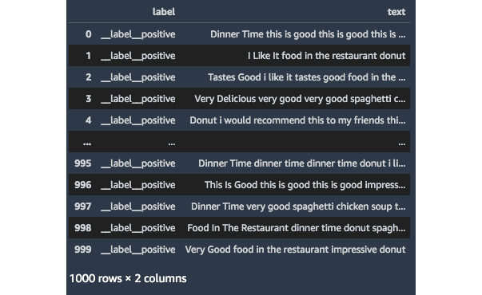

# 八、使用内置算法解决自然语言处理、图像分类和时间序列预测问题

在前一章中，我们详细了解了 SageMaker 的几项功能，例如 **SageMaker 特征存储**、 **SageMaker Clarify** 和 **SageMaker 模型监视器**。这些能力帮助机器学习实践者在进行生产级机器学习实验和部署时处理相关需求。在本章中，我们将看看如何使用 SageMaker 内置算法来解决**自然语言处理** ( **NLP** )、**图像分类**和**时间序列预测**问题。


图 8.1–使用内置算法处理文本分类、图像分类和时间序列预测问题

如*图 8.1* 所示，我们将看看如何使用 **BlazingText** 来解决最常见的自然语言处理问题之一——文本分类。除此之外，我们还将进一步了解如何使用内置的**图像分类算法**来解决 MNIST 手写数字数据集的图像分类问题。我们也将有机会使用内置的 **DeepAR 预测算法**来解决时间序列预测问题。

也就是说，我们将在本章中介绍以下食谱:

*   为文本分类问题生成合成数据集
*   为批量转换推理作业准备测试数据集
*   训练和部署一个 **BlazingText** 模型
*   使用**批量转换**进行推理
*   使用 **Apache MXNet** 视觉数据集类为图像分类准备数据集
*   使用 SageMaker 中内置的**图像分类算法**训练和部署图像分类器
*   生成合成时间序列数据集
*   对时间序列数据集执行训练测试分割
*   训练和部署一个 **DeepAR** 模型
*   使用部署的 **DeepAR** 模型执行概率预测

在我们完成本章中的食谱之后，我们将能够利用 SageMaker 中的内置算法更加自信地解决 NLP、图像分类和时间序列预测问题和需求。

# 技术要求

要执行本章中的配方，请确保您具备以下条件:

*   一个亚马逊 S3 桶
*   管理**亚马逊 SageMaker** 和**亚马逊 S3** 资源的权限，如果使用带有自定义 URL 的 **AWS IAM** 用户。如果你使用的是根帐户，那么你应该能够继续本章的食谱。但是，在大多数情况下，建议以 AWS IAM 用户身份登录，而不是使用 root 帐户。要了解更多信息，请随意查看以下指南:[https://docs . AWS . Amazon . com/IAM/latest/user guide/best-practices . html](https://docs.aws.amazon.com/IAM/latest/UserGuide/best-practices.html)。

由于本章中的食谱涉及到一些代码，我们在这个资源库中提供了笔记本:[https://github . com/packt publishing/Machine-Learning-with-Amazon-sage maker-Cookbook/tree/master/chapter 08](https://github.com/PacktPublishing/Machine-Learning-with-Amazon-SageMaker-Cookbook/tree/master/Chapter08)。在开始本章的每一个食谱之前，确保 my-experiments/chapter08 目录已经准备好。如果它还没有被创建，请现在就创建，因为这样可以在我们浏览本书中的每一个食谱时保持事物的有序性。

请点击以下链接查看动作视频中的相关代码:

[https://bit.ly/3tFF70t](https://bit.ly/3tFF70t)

# 为文本分类问题生成合成数据集

在这个配方中，我们将为一个**二进制文本分类**问题生成一个合成数据集。这个配方中要生成的数据集有两个主要字段:包含字符串格式语句的文本字段和指定文本是正数还是负数的目标标签。


图 8.2-文本分类问题的合成数据集

在*图 8.2* 中，我们可以看到带正标签的句子有 _ _ label _ _ 正标签，而带负标签的句子有 _ _ label _ _ 负标签。我们将在接下来的菜谱中使用这个数据集来训练和部署一个 **BlazingText** 模型，以解决一个情感分析需求。

## 做好准备

运行 **Python 3(数据科学)**内核的 **SageMaker Studio** 笔记本是这个食谱的唯一先决条件。

## 怎么做…

该配方中的第一步主要是生成一系列肯定和否定语句，并将它们存储在数据帧中:

1.  Create a new notebook using the Python 3 (Data Science) kernel inside the my-experiments/chapter08 directory and rename it with the name of this recipe.

    图 8.3–创建新笔记本

    在*图 8.3* 中，我们可以看到如何从**文件**菜单新建一个**笔记本**。当提示使用哪个内核时，选择 **Python 3(数据科学)**。

2.  Install faker using the pip install command:

    ```
    !pip install faker 
    ```

    **Faker** 是一个 Python 包，帮助提供生成假数据的实用函数。稍后，我们将使用 sentence()函数根据单词列表生成一个假句子。

3.  使用下面几行代码初始化 faker】
4.  Define a list of strings that will be used in a later step to generate the sentences classified as POSITIVE:

    ```
    positive_custom_list = [
        'this is good', 
        'i like it', 
        'very delicious', 
        'i would recommend this to my friends',
        'food in the restaurant',
        'spaghetti chicken soup',
        'dinner time',
        'tastes good',
        'donut',
        'very good',
        'impressive']
    ```

    这里我们可以看到这个字符串列表包含了通常被认为是正的记号。

5.  定义 generate_positive_sentences()函数。在内部，该函数使用 faker.sentence()函数，该函数利用了我们在上一步中定义的 positive_custom_list 变量:

    ```
    def generate_positive_sentences():     return faker.sentence(         ext_word_list=positive_custom_list     )
    ```

6.  Next, define a list of strings that will be used in a later step to generate the sentences classified as NEGATIVE:

    ```
    negative_custom_list = [
        'this is bad', 
        'i hate it', 
        'there are better restaurants out there', 
        'i will not recommend this to my friends',
        'food in the restaurant',
        'spaghetti chicken soup',
        'dinner time',
        'tastes bad',
        'donut',
        'very bad',
        'not impressive']
    ```

    在这里，我们可以看到这个字符串列表包含了通常被认为是负数的标记。

7.  定义 generate_negative_sentences()函数。在内部，该函数使用 faker.sentence()函数，该函数使用我们在上一步中定义的 negative_custom_list 列表:

    ```
    def generate_negative_sentences():     return faker.sentence(         ext_word_list=negative_custom_list     )
    ```

8.  使用下面的代码块生成 1000 个肯定句，并将它们存储在肯定句列表中:

    ```
    positive_sentences = [] for i in range(0, 1000):     item = generate_positive_sentences()     item = item.replace(".", "")     positive_sentences.append(item)
    ```

9.  Inspect the positive_sentences variable:

    ```
    positive_sentences
    ```

    这应该会给我们一个类似于图 8.4 中所示的字符串列表。

    

    图 8.4-生成的肯定句列表

    在*图 8.4* 中，我们有 generate_positive_sentences()函数生成的字符串列表。

10.  Similarly, generate 1000 NEGATIVE sentences using the following block of code and store them in the negative_sentences list variable:

    ```
    negative_sentences = []
    for i in range(0, 1000):
        item = generate_negative_sentences()
        item = item.replace(".", "")
        negative_sentences.append(item)
    ```

    这应该会给我们一个类似于图 8.5 中所示的字符串列表。

    

    图 8.5-生成的否定句列表

    在*图 8.5* 中，我们可以看到使用 generate_negative_sentences()函数生成的句子列表。

11.  Prepare the DataFrame containing the POSITIVE sentences using the following block of code:

    ```
    import pandas as pd 
    positive_df = pd.DataFrame(
        positive_sentences, 
        columns=['text']
    )
    positive_df.insert(
        0, 
        "label", 
        "__label__positive"
    )
    ```

    这应该给我们一个数据帧，类似于*图 8.6* 中所示。

    

    图 8.6-包含肯定句的数据框架

    这里，我们有包含 _ _ label _ _ 正字符串的标签列。

12.  Next, prepare the DataFrame containing the NEGATIVE sentences using the following lines of code:

    ```
    negative_df = pd.DataFrame(
        negative_sentences, 
        columns=['text']
    )
    negative_df.insert(
        0, 
        "label", 
        "__label__negative"
    )
    ```

    这应该给我们一个数值数据框架，类似于*图 8.7* 所示。

    

    图 8.7-包含否定句的数据框架

    这里，我们有包含 _ _ label _ _ 负字符串的标签列。

13.  Merge the two DataFrames using the concat() function:

    ```
    all_df = pd.concat(
        [positive_df, negative_df], 
        ignore_index=True
    )
    ```

    该配方中的最后一组步骤集中于训练-测试分割，并将生成的训练、验证和测试集上传到 S3:

14.  Perform the train-validation-test split on all_df:

    ```
    from sklearn.model_selection import train_test_split
    train_val_df, test_df = train_test_split(
        all_df, 
        test_size=0.2
    ) 
    train_df, val_df = train_test_split(
        train_val_df, 
        test_size=0.25
    )
    ```

    这将为我们提供 600 条训练集记录(train_df)，200 条验证集记录(val_df)，以及 200 条测试集记录(test_df)。

15.  Export the DataFrames into their corresponding CSV files using the to_csv() function:

    ```
    !mkdir tmp 
    train_df.to_csv(
        "tmp/synthetic.train.txt", 
        header=False, 
        index=False, 
        sep=" ", 
        quotechar=" "
    )
    val_df.to_csv(
        "tmp/synthetic.validation.txt", 
        header=False, 
        index=False, 
        sep=" ", 
        quotechar=" "
    ) 
    test_df.to_csv(
        "tmp/synthetic.test.txt", 
        header=False, 
        index=False, 
        sep=" ", 
        quotechar=" "
    )
    ```

    请注意，我们让将标题和索引的参数值设置为假。

16.  Inspect the contents of the synthetic.train.txt file inside the tmp directory:

    ```
    !head tmp/synthetic.train.txt
    ```

    这将给我们类似于图 8.8 中所示的文本行。

    

    ```
    s3_bucket = "<insert bucket name here>"
    prefix = "chapter08"
    !aws s3 cp tmp/synthetic.train.txt s3://{s3_bucket}/{prefix}/input/synthetic.train.txt 
    !aws s3 cp tmp/synthetic.validation.txt s3://{s3_bucket}/{prefix}/input/synthetic.validation.txt
    ```

17.  Finally, use the %store magic to store the variable values for test_df, s3_bucket, and prefix:

    ```
    %store test_df
    %store s3_bucket
    %store prefix
    ```

    我们将在后面的菜谱中使用这些变量值。

现在，让我们看看这是如何工作的！

## 工作原理……

在这个配方中，我们已经生成了将在本章接下来的三个配方中使用的合成数据集。与本书中生成的其他合成数据集相比，我们生成了一个合成数据集，其中包含该配方中的文本数据，而不是表格和数字数据。

我们生成的数据集有两个主要字段:(1)包含字符串格式语句的文本字段，以及(2)目标标签，可以是 __label__positive 或 __label__negative。标签有 __label__ 前缀很重要，因为我们计划在配方*中以文件模式训练一个 **BlazingText** 模型训练和部署一个 BlazingText 模型*。注意，我们并不局限于在这个数据集中只有两个类。如果我们希望在这个配方的基础上构建，一个例子是有三个类而不是两个——_ _ label _ _ positive、__label__neutral 和 _ _ label _ _ neutral。当然，在使用特定算法运行训练作业之前，我们需要确保相应地更新配置和超参数值。

## 还有更多……

我们还可以选择使用**增强清单文本格式**作为来存储和导出合成数据集。这在训练blazing text 模型时也应该有效。这涉及到使用 JSON Lines 格式，其中文件中的每一行都包含一个有效的 JSON 值，类似于下面的代码块所示:

```
{"source":"i will not recommend this", "label":0}
{"source":"i would recommend this", "label":1}
```

使用增强清单文本格式的一个优点是，我们可以在管道输入模式下训练模型，其中数据集直接流向训练实例。在 [*第 4 章*](B16850_04_Final_ASB_ePub.xhtml#_idTextAnchor200) 、*准备、处理和分析数据*中的*将 CSV 数据转换为 protobuf recordIO 格式*中，我们提到当我们的数据被序列化为 protobuf recordIO 格式时，我们可以在训练期间使用**管道模式**。在这种情况下，只要我们的数据使用增强的清单文本格式，我们将能够使用**管道模式**，即使不必将我们的数据序列化为 protobuf recordIO 格式。

# 为批量转换推理作业准备测试数据集

在这个配方中，我们将使用批处理转换进行推理来准备将在配方*中使用的测试数据集，这利用了 SageMaker 的**批处理转换**功能。使用**批量转换**，我们可以同时对多条记录执行推理，而无需运行持久端点。*


图 8.9-包含 JSON 行格式的测试数据的文本文件

请注意，当使用**批量转换**和 **BlazingText** 模型时，输入测试数据集采用 jsonlines 格式是很重要的。正如我们在*图 8.9* 中看到的，文件中的每一行都是一个有效的 JSON 值。

## 做好准备

以下是这个食谱的先决条件:

*   这种方法上接*为文本分类问题生成合成数据集*。
*   运行 **Python 3(数据科学)**内核的 **SageMaker Studio** 笔记本。

## 怎么做……

该配方中的步骤主要是将数据从之前的配方转换成 jsonlines 格式，并将结果文件上传到 S3:

1.  在 my-experiments/chapter08 目录中使用 Python 3(数据科学)内核创建一个新的笔记本，并将其重命名为这个食谱的名称。当提示使用内核时，选择 **Python 3(数据科学)**。
2.  使用%store magic 加载 test_df、s3_bucket 和 prefix 的变量值:

    ```
    %store -r test_df %store -r s3_bucket %store -r prefix
    ```

3.  使用 drop()函数删除标签列:

    ```
    test_df_without_label = test_df.drop(     columns="label" )
    ```

4.  Define the to_jsonlines() function:

    ```
    def to_jsonlines(text):
        return '{"source": "' + text +'"}'
    ```

    注意

    请注意，在这个菜谱中，我们展示了一种将我们所拥有的内容转换成 JSON 行格式的方法。还可以使用 to_json()函数将 lines 设置为 True，将 DataFrame 转换为 jsonlines 格式。

5.  Use the apply() function to convert each cell in the text column to jsonlines format. Next, check how the test_df_without_label DataFrame looks after using the apply() function as well:

    ```
    tmp = test_df_without_label['text'].apply(
        to_jsonlines
    )
    test_df_without_label['text'] = tmp
    test_df_without_label
    ```

    运行前面的代码块后，DataFrame 中文本列中的字符串值将被转换为字典。这应该给我们一个行索引和 jsonline 字典对的数据框架，类似于*图 8.10* 中所示。

    

    图 8.10-包含无标签测试数据的数据框

    我们可以在*图 8.10* 中看到，DataFrame 的文本列现在包含一个字典，其 source 为键，值设置为文本列中单元格的原始文本值。

6.  We then run the following code to store the content of the DataFrame in a file:

    ```
    test_df_without_label.to_csv(
        "tmp/synthetic.test_without_labels.txt", 
        header=False, 
        index=False, 
        sep=" ", 
        quotechar=" "
    )

    !head tmp/synthetic.test_without_labels.txt
    ```

    这应该会给出文本文件的前几行，类似于图 8.11 中的*所示。*

    

    图 8.11-包含 jsonlines 格式的测试数据的文本文件

    在*图 8.11* 中，我们可以看到我们成功地用 jsonlines 格式的数据生成了一个文本文件。

7.  Now that we have our TXT file ready, we use the **AWS CLI** to upload the generated file to the target S3 location:

    ```
    !aws s3 cp tmp/synthetic.test_without_labels.txt s3://{s3_bucket}/{prefix}/input/synthetic.test_without_labels.txt
    ```

    请注意，我们在此配方中准备的 jsonlines 格式的文件将在配方*中使用，使用批处理转换进行推理*。

现在我们已经完成了最后两个配方中所需的准备工作，我们可以继续下一个配方，在这里我们将使用这些数据集来训练和部署一个 **BlazingText** 模型。同时，让我们看看这是如何工作的！

## 工作原理……

在这个配方中，我们已经准备了将在配方*中使用的测试数据集，使用批处理转换进行推理*，这涉及到 SageMaker 的批处理转换功能，用于在没有持久实时端点的情况下执行推理。

为什么要将数据集转换成 jsonlines 格式？这是因为数据集需要在中为 jsonlines 格式，以便使用**批量转换**和 **BlazingText** 模型。如前所述，文件中的每一行都是一个有效的 JSON 值。 **Batch Transform** 将每一行视为一个输入有效载荷，这意味着如果我们的 jsonlines 文件中有 1000 行，那么在作业完成后，我们将得到 1000 个推理结果。注意，在准备 jsonlines 文件时，我们需要确保我们将为**批量转换**作业准备的数据集不包含标签字段值。也就是说，我们只需要提供源字段的值。

# 训练和部署 BlazingText 模型

在为文本分类问题生成合成数据集的方法*中，我们准备了将用于训练 **BlazingText** 模型的数据集。在这个菜谱中，我们将使用 **SageMaker Python SDK** 来训练和部署一个 **BlazingText** 模型，该模型可用于情感分析应用。*

在完成这个食谱之后，我们将能够把一个句子比如我会把这个推荐给我的朋友作为有效载荷传递给一个推理端点，并得到正确的分类，这是肯定的。

## 做好准备

以下是这个食谱的先决条件:

*   这个配方延续了*为文本分类问题生成合成数据集*。
*   运行 **Python 3(数据科学)**内核的 **SageMaker Studio** 笔记本。

## 怎么做……

该方法的第一步主要是准备使用 **SageMaker Python SDK** 训练和部署 **BlazingText** 模型的先决条件:

1.  在 my-experiments/chapter08 目录中使用 Python 3(数据科学)内核创建一个新的笔记本，并将其重命名为该食谱的名称。当提示使用内核时，选择 **Python 3(数据科学)**。
2.  导入并初始化使用 **SageMaker Python SDK** 进行训练和部署所需的一些先决条件:

    ```
    import sagemaker from sagemaker import get_execution_role import json import boto3 session = sagemaker.Session() role = get_execution_role() region_name = boto3.Session().region_name
    ```

3.  使用%store magic 为 s3_bucket 和 prefix 加载变量值:

    ```
    %store -r s3_bucket %store -r prefix s3_train_data = 's3://{}/{}/input/{}'.format(     s3_bucket,      prefix,      "synthetic.train.txt" ) s3_validation_data = 's3://{}/{}/input/{}'.format(     s3_bucket,      prefix,      "synthetic.validation.txt" ) s3_output_location = 's3://{}/{}/output'.format(     s3_bucket,      prefix )
    ```

4.  Use the retrieve() function to get the ECR Image URI of the built-in algorithm **BlazingText**:

    ```
    from sagemaker.image_uris import retrieve 
    container = retrieve(
        "blazingtext", 
        region_name, 
        "1"
    )
    ```

    该方法中的最后一组步骤重点关注在训练和部署 **BlazingText** 模型的前一组步骤中准备的先决条件:

5.  初始化 Estimator 对象，并在初始化期间使用上一步中的容器变量作为第一个参数:

    ```
    estimator = sagemaker.estimator.Estimator(     container,     role,      instance_count=1,      instance_type='ml.c4.xlarge',     input_mode= 'File',     output_path=s3_output_location,     sagemaker_session=session )
    ```

6.  使用 set_hyperparameters()函数:

    ```
    estimator.set_hyperparameters(     mode="supervised",      min_count=2 )
    ```

    指定几个超参数
7.  接下来，我们使用下面的代码块准备输入数据通道:

    ```
    from sagemaker.inputs import TrainingInput       train_data = TrainingInput(     s3_train_data,      distribution='FullyReplicated',        content_type='text/plain',      s3_data_type='S3Prefix' )       validation_data = TrainingInput(     s3_validation_data,      distribution='FullyReplicated',      content_type='text/plain',      s3_data_type='S3Prefix' ) data_channels = {     'train': train_data,      'validation': validation_data }
    ```

8.  With everything ready, we use the fit() function to start the training job. Wait for about 5-10 minutes for the training job to complete:

    ```
    %%time
    estimator.fit(
        inputs=data_channels, 
        logs=True
    )
    ```

    这将产生一组类似于图 8.12 中所示的日志。

    

    图 8.12–训练工作日志

    在*图 8.12* 中，我们可以看到我们的 validation_accuracy 值是 99.25%！当然，我们使用的是带有合成数据集的简化示例，但这对我们来说是一个良好的开端。

9.  Use the deploy() function to deploy our BlazingText model:

    ```
    endpoint = estimator.deploy(
        initial_instance_count = 1, 
        instance_type = 'ml.r5.large'
    )
    ```

    完成此步骤可能需要 5 到 10 分钟。

    重要说明

    运行 deploy()函数将启动一个实例，该实例将继续运行，直到执行删除资源操作。当实例运行时，您将为它运行的时间付费。确保在完成这个配方后删除推理端点。

10.  接下来，准备我们将包含在有效载荷中的句子，以测试我们部署的模型:

    ```
    sentences = [     "that is bad",      "the apple tastes good",      "i would recommend it to my friends" ] payload = {"instances" : sentences}
    ```

11.  After that, we use the predict() function to test our deployed model:

    ```
    from sagemaker.serializers import JSONSerializer

    endpoint.serializer = JSONSerializer()
    response = endpoint.predict(payload)
    predictions = json.loads(response)
    print(json.dumps(predictions, indent=2))
    ```

    运行前面的代码块将产生一组类似于下图所示的结果。

    

    图 8.13–预测结果

    在*图 8.13* 中，我们为包含在有效载荷中的的每个句子获得了一个标签。我们的第一句话，那是坏的，被标记为负面的，有 81%的概率得分。我们的第二句和第三句，苹果味道不错，我会推荐给我的朋友，分别以 79%和 65%的概率得分被标记为肯定。我认为我们部署的模型工作得很好！

12.  使用%store magic 来存储 training_job_name 变量值:

    ```
    tn = estimator.latest_training_job.name training_job_name = tn %store training_job_name
    ```

现在，我们已经完成了这个菜谱中的步骤，可以随意使用部署的模型了。一旦您测试完不同的句子，不要忘记使用 endpoint.delete_endpoint()删除端点。

现在让我们看看这是如何工作的！

## 它是如何工作的…

在讨论使用 **BlazingText** 时的细节和超参数之前，需要注意的是，使用该算法时我们有两种模式:

*   使用 **Word2vec** 算法的无监督学习
*   文本分类问题的监督学习

在这个配方中，我们使用 set_hyperparameters()函数将模式设置为监督模式，因为我们正在解决一个**文本分类**问题。如果我们要使用 Word2vec 算法将单词映射到分布式向量，并从文本数据(如 EAT-SPAGHETTI 和 DRINK - JUICE)中学习单词关联，我们可以将 mode 的值设置为 batch_skipgram、skipgram 或 cbow。如果我们将使用单个 GPU 实例，我们可以将 mode 的值设置为 cbow 或 skipgram。如果我们希望通过跨多个 CPU 实例的分布式处理获得更快的训练时间，可以为模式值指定 batch_skipgram。

注意

我们还可以指定和配置其他超参数，例如 early_stopping、learning_rate、epochs 和 word_ngrams。我们不会在本书中详细讨论这些，所以可以随意查看以下链接:[https://docs . AWS . Amazon . com/sagemaker/latest/DG/blazingtext _ hyperparameters . html](https://docs.aws.amazon.com/sagemaker/latest/dg/blazingtext_hyperparameters.html)。

## 查看更多

如果您正在寻找在真实数据集上使用内置 **BlazingText 算法**的示例和更复杂的示例，请随意查看 AWS/Amazon-sage maker-examples GitHub 资源库中的一些笔记本:

*   使用**blazing text**—[https://github . com/AWS/Amazon-sage maker-examples/tree/master/introduction _ to _ Amazon _ algorithms/blazing text _ word 2 vec _ text 8](https://github.com/aws/amazon-sagemaker-examples/tree/master/introduction_to_amazon_algorithms/blazingtext_word2vec_text8%20)生成 Word2Vec 嵌入
*   使用 **SparkML** 和**blazing text**—[https://github . com/AWS/Amazon-sagemaker-examples/tree/master/advanced _ functionality/inference _ pipeline _ spark ml _ blazing text _ dbpedia](https://github.com/aws/amazon-sagemaker-examples/tree/master/advanced_functionality/inference_pipeline_sparkml_blazingtext_dbpedia%20)创建推理管道

由于我们无法在本书中深入探究 **BlazingText 算法**的不同特性，请随意查看此链接获取更多信息:[https://docs . AWS . Amazon . com/sage maker/latest/DG/blazing text . html](https://docs.aws.amazon.com/sagemaker/latest/dg/blazingtext.html)。

# 使用批量转换进行推理

在前面的配方中，我们训练并部署了一个 **BlazingText** 模型，它接受一个字符串语句并返回该语句是正还是负。在这个配方中，我们将使用这个模型和 **SageMaker** 的**批处理转换**功能，在没有持久推理端点的情况下，同时对整个测试数据集执行文本分类。

## 准备就绪

以下是这个食谱的先决条件:

*   这个方法延续了*训练和部署 BlazingText 模型*的做法。
*   运行 **Python 3(数据科学)**内核的 **SageMaker Studio** 笔记本。

## 怎么做……

本方法中的步骤集中于使用我们在前面的方法中准备的先决条件，使用 **SageMaker Python SDK** 运行批处理转换作业:

1.  在 my-experiments/chapter08 目录中使用 Python 3(数据科学)内核创建一个新的笔记本，并将其重命名为这个食谱的名称。当提示使用内核时，选择 **Python 3(数据科学)**。
2.  Use the %store magic to load the variable values for s3_bucket, prefix, and training_job_name. At the same time, initialize and set the values of a few prerequisites of the batch transform job. We set the value of the batch_output variable as well. This variable will point to the location where the batch transform job output artifacts will be stored:

    ```
    %store -r s3_bucket
    %store -r prefix
    %store -r training_job_name
    path = 's3://{}/{}/input/{}'.format(
        s3_bucket, 
        prefix, 
        "synthetic.test_without_labels.txt"
    )
    s3_test_without_labels_data = path

    path = 's3://{}/{}/batch-prediction'.format(
        s3_bucket, 
        prefix
    )
    batch_output = path
    ```

    请注意，我们已经从配方*中加载了 s3_bucket 和 prefix 的变量值，为文本分类问题*生成了一个合成数据集。也就是说，在我们使用%store 魔术加载变量前缀的值之后，它的值应该是 chapter08。

3.  We use the transformer() function of the Estimator object to get the transformer object, which we will use in the next step:

    ```
    from sagemaker.estimator import Estimator
    estimator = Estimator.attach(training_job_name)
    transformer = estimator.transformer(
        instance_count=1, 
        instance_type='ml.m4.xlarge', 
        output_path=batch_output
    )
    ```

    这里，我们还使用 Estimator.attach()函数从我们在配方*训练和部署 BlazingText 模型*中运行的训练作业的名称中加载 Estimator 对象。

4.  Use the transform() function to start the batch transform job. We then use the wait() function to wait for the job to complete before proceeding to the next step:

    ```
    transformer.transform(
        data=s3_test_without_labels_data, 
        data_type='S3Prefix',
        content_type='application/jsonlines', 
        split_type='Line'
    )
    transformer.wait()
    ```

    这将产生一组类似于图 8.14 中所示的日志。

    

    图 8.14–批量转换作业日志

    还记得在之前的配方中，我们删除了实时预测的终点吗？在这里，我们可以看到批处理转换作业涉及到在没有持久端点的情况下运行推理。

    注意

    完成此步骤可能需要大约 4 到 8 分钟。在等待的时候，请随意喝杯咖啡或茶！

5.  使用 **AWS S3 CLI** 将批量转换作业的输出复制到与 Jupyter 笔记本相同的目录中的 tmp 目录，该目录中包含该配方中的代码块和脚本:

    ```
    !aws s3 cp {batch_output} ./tmp --recursive
    ```

6.  Use the head bash command to check a few values:

    ```
    !head tmp/synthetic.test_without_labels.txt.out
    ```

    这将给我们类似于图 8.15 中所示的文本行。

    

    图 8.15–批量转换结果

    在*图 8.15* 中，我们可以看到我们有多个结果，每一行都包含一个标签，概率得分在 0.0 到 1.0 之间。prob 的值越接近 1.0，某个预测的概率得分越高。

7.  We check their corresponding input *jsonline* values as well:

    ```
    !head tmp/synthetic.test_without_labels.txt
    ```

    这将给我们类似于图 8.16 中所示的文本行。


图 8.16-jsonlines 格式的无标签测试数据

在*图 8.16* 中，我们可以看到前八个句子应该被标记为否定类，而接下来的两个句子应该被标记为肯定类。将它与*图 8.15* 中的批量转换作业的结果进行比较，我们可以看到我们的模型 10 个预测中有 9 个是正确的。

现在让我们看看这是如何工作的！

## 工作原理…

在这个菜谱中，我们使用 SageMaker 的**批处理转换**功能来执行预测，并使用大量测试记录作为输入来获得推论。

我们什么时候用**批量转换**？当我们不需要实时推理端点，或者需要批量获取推理时，我们会使用这个功能。这意味着我们可以传递 1000 条测试记录作为“有效负载”，并获得 1000 个推断值作为批量转换作业的返回输出。使用**批量转换**，我们将不必担心资源管理，因为与拥有全天候运行的实时端点相比，我们不必在执行推理后手动删除端点。

请注意，我们可以通过批量转换作业显著增加要分类的句子数量。鉴于**批处理转换**使我们能够轻松处理这些类型的场景和需求，我们可以将 instance_type 参数值从 ml.m4.xlarge 更改为具有更多内存或计算能力的 **ML** ( **机器学习**)实例。同样，没有什么可担心的，因为用于处理这个批量分类工作的实例会在工作完成后自动删除。

## 亦见

如果您正在寻找在真实数据集上使用**批量转换**的示例和更复杂的示例，请随意查看 GitHub 资源库中关注此主题的一些笔记本:[https://GitHub . com/AWS/Amazon-sage maker-examples/tree/master/sage maker _ Batch _ Transform](https://github.com/aws/amazon-sagemaker-examples/tree/master/sagemaker_batch_transform)。

# 使用 Apache MXNet 视觉数据集类准备用于图像分类的数据集

在这个菜谱中，我们将建立本章中图像分类实验所需的文件和目录结构。我们将在 tmp 目录中创建五个目录——train、validation、train_lst、validation_lst 和 test。之后，我们将使用 **Apache MXNet 视觉数据集类**来加载本章中训练和测试图像分类模型所需的数据集。我们将执行训练测试分割，将加载的数据存储为图像文件，并生成。将用于训练作业的 lst 文件。


图 8.17-MNIST 数据集

在*图 8.17* 中，我们有一些将在该配方中准备的样本图像文件。在配方*中使用 SageMaker* 中内置的图像分类算法训练和部署图像分类器，我们将使用这些图像文件训练一个图像分类器模型，它可以识别所提供图像的标签(数字)。

## 准备就绪

运行**Python 3(MXNet 1.8 Python 3.7 CPU 优化)**内核的 **SageMaker Studio** 笔记本是这个食谱的唯一先决条件。

重要说明

确保选择 **CPU 优化**选项，而不是 **GPU 优化**选项，因为 **GPU 优化**选项将启动默认类型为 ml.g4dn.xlarge 的实例。另一方面， **CPU 优化**选项将启动默认类型为 ml.t3.medium 的实例。有关更多信息，请随时查看[https://docs . AWS . Amazon . com/sagemaker/latest/DG](https://docs.aws.amazon.com/sagemaker/latest/dg/notebooks-usage-metering.html)

## 怎么做……

该方法的第一步主要是准备文件和目录结构，我们将在其中存储生成的图像和文件:

1.  Create a new notebook using the Python 3 (MXNet 1.8 Python 3.7 CPU Optimized) kernel inside the my-experiments/chapter08 directory and rename it to the name of this recipe. When prompted for the kernel to use, choose **Python 3 (Data Science)**.

    注意

    在运行下一组步骤之前，请随意清理 tmp 目录(如果存在)。

2.  使用 mkdir 命令，创建我们将存储训练和验证数据集图像的目录:

    ```
    %%bash mkdir -p tmp/train/0 tmp/train/1 tmp/train/2 tmp/train/3 tmp/train/4 mkdir -p tmp/train/5 tmp/train/6 tmp/train/7 tmp/train/8 tmp/train/9 mkdir -p tmp/validation/0 tmp/validation/1 tmp/validation/2 tmp/validation/3 tmp/validation/4 mkdir -p tmp/validation/5 tmp/validation/6 tmp/validation/7 tmp/validation/8 tmp/validation/9
    ```

3.  Create the directory that will contain the training data .lst file:

    ```
    %%bash
    mkdir -p tmp/train_lst
    mkdir -p tmp/validation_lst
    mkdir -p tmp/test
    ```

    该方法中的下一组步骤侧重于为影像分类准备数据集:

4.  导入 mxnet 并使用 mx.random.seed()函数将种子值设置为任意数字:

    ```
    import mxnet as mx mx.random.seed(21)
    ```

5.  定义transform _ fxn()函数，并在使用 **Apache MXNet 视觉数据集** MNIST 类:

    ```
    def transform_fxn(data, label):     data = data.astype('float32')     data = data / 255     return data, label       ds = mx.gluon.data.vision.datasets.MNIST(     train=True,      transform=transform_fxn ) training_and_validation_dataset = ds       ds = mx.gluon.data.vision.datasets.MNIST(     train=False,      transform=transform_fxn ) test_dataset = ds
    ```

    时使用该函数作为转换参数的值
6.  Define the get_training_row_indexes() function:

    ```
    def get_training_row_indexes(row_count, 
                                 percent=0.5, 
                                 ratio=0.8):
        training_index_start = 0
        end = int(row_count * ratio * percent)
        training_index_end = end

        print("Range Index Start:", 
              training_index_start)
        print("Range Index End:", 
              training_index_end)

        output = list(range(training_index_start, 
                            training_index_end))

        print("Output Length:", len(output))
        print("Last Index:", output[-1])

        return output
    ```

    顾名思义，该函数返回一个索引列表，这些索引将映射到相应的图像，这些图像将成为训练数据集的一部分。对于这个函数，我们期望开始和结束索引值根据 row_count、percent 和 ratio 的参数值而改变。

7.  Define the get_validation_row_indexes() function:

    ```
    def get_validation_row_indexes(row_count, 
                                   percent=0.5, 
                                   ratio=0.8):
        start = int(row_count * ratio)
        validation_index_start = start

        count = int((1 - ratio)*row_count*percent) + 1
        element_count = count
        validation_index_end = validation_index_start + element_count

        print("Range Index Start:", 
              validation_index_start)
        print("Element Count:", 
              element_count)
        print("Range Index End:", 
              validation_index_end)

        output = list(range(validation_index_start, 
                            validation_index_end))

        print("Output Length:", len(output))
        print("Last Index:", output[-1])

        return output
    ```

    类似于 get_training_row_indexes()，该函数返回一个索引列表，该列表将映射到相应的图像，这些图像将是验证数据集的一部分。使用这个函数，我们希望开始和结束索引值也会根据 row_count、percent 和 ratio 的参数值而改变。如您所料，get_training_row_indexes()和 get_validation_row_indexes()生成的索引值不会重叠。

8.  定义 get_test_row_indexes()函数:

    ```
    def get_test_row_indexes(row_count,                           percent=0.5):     test_index_start = 0     test_index_end = int(row_count * percent)          print("Range Index Start:",            test_index_start)     print("Range Index End:",            test_index_end)          output = list(range(test_index_start,                          test_index_end))          print("Output Length:", len(output))     print("Last Index:", output[-1])          return output
    ```

9.  Define the generate_random_string() function, which will be used to generate the filenames of the image files in a later step:

    ```
    import string 
    import random

    def generate_random_string():
        return ''.join(
            random.sample(
            string.ascii_uppercase,12)
        )
    ```

    使用时，该函数应该生成一个类似于“FCTASXQNPOVY”的随机字符串。当然，我们每次使用这个函数都会得到一组不同的值。稍后我们将使用它为数据集中的每个图像分配一个随机的字符串文件名。

10.  Define the save_image() function:

    ```
    import matplotlib
    import matplotlib.pyplot
    def save_image(image_data, filename):
        matplotlib.pyplot.imsave(
            f"tmp/{filename}", 
            image_data[:,:,0].asnumpy())    
    ```

    该函数接受图像数据和文件名作为参数，并使用 matplotlib.pyplot.imsave()函数以指定的文件名保存图像。

11.  Define the generate_image_files_and_lst_dict() function:

    ```
    def generate_image_files_and_lst_dict(
        dataset, 
        indexes, 
        tag
    ):
        list_of_lst_dicts = []

        for index in indexes:
            image_label_pair = dataset[index]
            image_data = image_label_pair[0]
            label = image_label_pair[1]
            random_string = generate_random_string()

            if tag == "test":
                rp = f"{random_string}.png"
                relative_path = rp
                filename = f"{tag}/{relative_path}"
            else:
                rp = f"{label}/{random_string}.png"
                relative_path = rp
                filename = f"{tag}/{relative_path}"

            save_image(
                image_data, 
                filename=filename
            )

            lst_dict = {
                'relative_path': relative_path, 
                'class': label
            }
            list_of_lst_dicts.append(lst_dict)

        return list_of_lst_dicts
    ```

    此功能执行以下操作:

    *   接受数据集、索引和测试标记
    *   遍历指定索引列表中的每个索引值
    *   根据索引值保存数据集中的相应图像

在中的最后一组步骤集中于使用在前面步骤中准备的先决条件和定义的函数来生成图像文件:

1.  使用前面步骤中准备的函数生成训练图像数据和包含 train.lst 文件数据的字典:

    ```
    train_dataset_length = len(     training_and_validation_dataset ) train_indexes = get_training_row_indexes(     row_count=train_dataset_length,      percent=0.01)       t = generate_image_files_and_lst_dict(     dataset=training_and_validation_dataset,     indexes=train_indexes,     tag = "train" ) train_lst_dict = t
    ```

2.  Inspect the train_lst_dict variable:

    ```
    train_lst_dict
    ```

    这应该给我们一个类似于图 8.18 所示的嵌套结构。

    

    图 8.18–图像和标签对

    在*图 8.18* 中，我们有一个包含图像路径和类别对的字典列表。如果你熟悉 **MNIST** 数据集，你可能知道这个数据集包含了带有相应数字标签的数字图像。

3.  以类似的方式，生成验证图像数据和包含验证的字典。第一个文件数据:

    ```
    train_dataset_length = len(     training_and_validation_dataset ) validation_indexes = get_validation_row_indexes(      row_count=train_dataset_length,       percent=0.01)       v = generate_image_files_and_lst_dict(     dataset=training_and_validation_dataset,     indexes=validation_indexes,     tag = "validation" ) validation_lst_dict = v
    ```

4.  最后，生成测试图像数据和包含验证的字典。lst 文件数据:

    ```
    test_dataset_length = len(test_dataset) test_indexes = get_test_row_indexes(     row_count=test_dataset_length,      percent=0.01)       test_lst_dict = generate_image_files_and_lst_dict(     dataset=test_dataset,     indexes=test_indexes,     tag = "test" )
    ```

5.  定义 save_lsts_to_file()函数:

    ```
    def save_lsts_to_file(values, filename):     with open(filename, 'w') as output:         for index, row in enumerate(             values,              start=1         ):             relative_path = row['relative_path']             cls = row['class']             t = f"{index}\t{cls}\t{relative_path}\n"             output.write(t)
    ```

6.  使用【the save _ lsts _ to _ file()函数生成 train.lst 和 validation.lst 文件:

    ```
    save_lsts_to_file(     train_lst_dict,      filename="tmp/train_lst/train.lst" ) save_lsts_to_file(     validation_lst_dict,      filename="tmp/validation_lst/validation.lst" )
    ```

7.  Inspect the structure and content of the train.lst file:

    ```
    %%bash
    head tmp/train_lst/train.lst
    ```

    这应该给我们一个类似于图 8.19 所示的标签和文件名对列表。

    

    图 8.19–测试图像文件列表

    这个文件应该包含大约 480 个标签和文件名对。

8.  指定将存储数据的 S3 时段名称和前缀。确保将“< insert s3 bucket name here >”的值替换为我们在菜谱*中创建的 bucket 的名称准备亚马逊 s3 bucket 和线性回归实验的训练数据集*来自 [*第 1 章*](B16850_01_Final_ASB_ePub.xhtml#_idTextAnchor020) 、*使用亚马逊 SageMaker 开始机器学习* :

    ```
    s3_bucket = "<insert s3 bucket name here>" prefix = "image-experiments" !aws s3 cp tmp/.  s3://{s3_bucket}/{prefix}/ --recursive
    ```

9.  Finally, use the %store magic to store the variable values for s3_bucket and prefix:

    ```
    %store s3_bucket
    %store prefix
    ```

    我们将在后面的菜谱中使用这些变量值。

让我们看看这是如何工作的！

## 工作原理…

在这个方法中，我们执行了所需的步骤，以在我们继续训练步骤之前准备训练、验证和测试数据集。在这个菜谱中，我们使用 **Apache MXNet Vision 数据集类**将图像文件保存并生成到它们各自的目录中。我们特别使用 MX . gluon . data . vision . datasets . Mn ist 类来生成图像数据集，类似于图 8.20 中所示。


图 8.20-MNIST 数据集

这里，我们为从 0 到 9 的每一个数字设置了 1 个类。这给了我们总共 10 个类似于图 8.20 所示的类。我们将用该数据集训练的图像分类器模型的目标将是正确地识别哪个数字被映射到来自测试数据集的给定输入图像。

## 参见

在 **Apache MXNet 视觉数据集**中还有其他预定义数据集。这些包括**时尚 MNIST** 、 **CIFAR10** 和 **CIFAR100** 数据集。随意查看我们可以在这里加载和生成的其他预定义数据集:[https://mxnet . Apache . org/versions/1 . 7 . 0/API/python/docs/API/gluon/data/vision/datasets/index . html](https://mxnet.apache.org/versions/1.7.0/api/python/docs/api/gluon/data/vision/datasets/index.html)。

# 使用 SageMaker 中内置的图像分类算法训练和部署图像分类器

在之前的配方中，我们使用 **Apache MXNet 视觉数据集**类准备了图像文件和一些其他先决条件。在这个食谱中，我们将使用 **SageMaker Python SDK** 和内置的**图像分类算法**来训练一个使用这些图像文件和先决条件的模型。在该配方中训练和部署的图像分类器将用于对测试数据集中的图像进行分类。

## 做好准备

以下是这个食谱的先决条件:

*   该方法上接*使用 Apache MXNet 视觉数据集类*为图像分类准备数据集。
*   运行 **Python 3(数据科学)**内核的 **SageMaker Studio** 笔记本。

## 怎么做……

该配方中的第一组步骤着重于准备训练和部署步骤的先决条件；

1.  在 my-experiments/chapter08 目录中使用 Python 3(数据科学)内核创建一个新的笔记本，并将其重命名为这个食谱的名称。当提示使用内核时，选择 **Python 3(数据科学)**。
2.  导入并初始化训练工作的一些先决条件:

    ```
    import sagemaker from sagemaker import get_execution_role import json import boto3 session = sagemaker.Session() role = get_execution_role() region_name = boto3.Session().region_name
    ```

3.  使用%store magic 为 s3_bucket 和 prefix 加载变量值:

    ```
    %store -r s3_bucket %store -r prefix
    ```

4.  初始化 S3 训练和验证数据的位置以及。为每个数据集生成的 lst 文件。设置 s3_output_location 值:

    ```
    s3_train_data = 's3://{}/{}/{}'.format(     s3_bucket,      prefix,      "train" ) s3_validation_data = 's3://{}/{}/{}'.format(     s3_bucket,      prefix,      "validation" ) s3_train_lst_path = 's3://{}/{}/{}'.format(     s3_bucket,      prefix,      "train_lst" ) s3_validation_lst_path = 's3://{}/{}/{}'.format(     s3_bucket,      prefix,      "validation_lst" ) s3_output_location = 's3://{}/{}/output'.format(     s3_bucket,      prefix )
    ```

5.  Use the retrieve() function to get the container image URI of the **Image Classification Algorithm**:

    ```
    from sagemaker.image_uris import retrieve 
    container = retrieve(
        "image-classification", 
        region_name, 
        "1"
    )
    container
    ```

    这将为容器变量提供一个类似于“811284229777 . dkr . ECR . us-east-1 . Amazon AWS . com/image-class ification:1”的字符串值。

    下一组步骤集中于使用来自前一组步骤的先决条件来训练和部署图像分类模型:

6.  Initialize the Estimator object:

    ```
    estimator = sagemaker.estimator.Estimator(
        container,
        role, 
        instance_count=1, 
        instance_type='ml.p2.xlarge',
        output_path=s3_output_location,
        sagemaker_session=session
    )
    ```

    在这里，我们利用 P2 实例提供基于 GPU 的并行计算能力。

7.  Use the set_hyperparameters() function to specify the hyperparameters of the training job:

    ```
    estimator.set_hyperparameters(
        num_layers=18,
        image_shape = "1,28,28",
        num_classes=10,
        num_training_samples=600,
        mini_batch_size=20,
        epochs=5,
        learning_rate=0.01,
        top_k=2,
        precision_dtype='float32'
    )
    ```

    注意

    如果您不知道这些超参数值的含义，请不要担心，因为我们将在*其工作原理*一节中详细了解这些值！

8.  为实际图像文件

    ```
    from sagemaker.inputs import TrainingInput train = TrainingInput(     s3_train_data,      distribution='FullyReplicated',      content_type='application/x-image',      s3_data_type='S3Prefix' ) validation = TrainingInput(     s3_validation_data,      distribution='FullyReplicated',      content_type='application/x-image',      s3_data_type='S3Prefix' )
    ```

    准备的训练输入通道
9.  为准备训练输入通道。lst 文件:

    ```
    content_type = 'application/x-image' train_lst = TrainingInput(     s3_train_lst_path,      distribution='FullyReplicated',      content_type=content_type,      s3_data_type='S3Prefix' ) validation_lst = TrainingInput(     s3_validation_lst_path,      distribution='FullyReplicated',      content_type=content_type,      s3_data_type='S3Prefix' )
    ```

10.  Use the fit() function to start the training job with the data channels from the previous steps as the input values:

    ```
    %%time
    data_channels = {
        'train': train, 
        'validation': validation,
        'train_lst': train_lst,
        'validation_lst': validation_lst
    }
    estimator.fit(inputs=data_channels, logs=True)
    ```

    这应该产生一组类似于图 8.21 中所示的日志。

    

    图 8.21–训练工作日志

    在这里，我们可以看到验证准确率为 90.83%。由于我们正在处理这个食谱中的一个简化的例子，这对我们来说应该是一个好的开始。

    注意

    完成此步骤可能需要大约 5 到 10 分钟。在等待的时候，可以休息一下，喝杯咖啡或茶！

11.  Use the deploy() function to deploy the model to an inference endpoint:

    ```
    endpoint = estimator.deploy(
        initial_instance_count = 1,
        instance_type = 'ml.m4.xlarge'
    )
    ```

    这个步骤应该需要大约 5 到 10 分钟才能完成。

    重要说明

    运行 deploy()函数将启动一个实例，该实例将继续运行，直到执行删除资源操作。当实例运行时，您将为它运行的时间付费。确保在完成这个配方后删除推理端点。

    既然我们在前面的步骤中已经部署了端点，那么中的最后一组步骤将集中于使用来自测试集的数据测试这个端点:

12.  使用**SageMaker Python SDK**:

    ```
    from sagemaker.serializers import IdentitySerializer endpoint.serializer = IdentitySerializer(     content_type="application/x-image" )
    ```

    中的 IdentitySerializer 更新端点的 serializer 属性
13.  定义 get_class_from_results()函数:

    ```
    import json       def get_class_from_results(results):     results_prob_list = json.loads(results)     best_index = results_prob_list.index(         max(results_prob_list)     )          return {         0: "ZERO",         1: "ONE",         2: "TWO",         3: "THREE",         4: "FOUR",         5: "FIVE",         6: "SIX",         7: "SEVEN",         8: "EIGHT",         9: "NINE"     }[best_index]
    ```

14.  定义预测()函数，用预测标签

    ```
    from IPython.display import Image, display       def predict(filename, endpoint=endpoint):     byte_array_input = None          with open(filename, 'rb') as image:         f = image.read()         byte_array_input = bytearray(f)              display(Image(filename))              results = endpoint.predict(byte_array_input)     return get_class_from_results(results)
    ```

    显示指定为有效载荷的图像
15.  Use the predict() function on each of the files inside the tmp/test directory:

    ```
    results = !ls -1 tmp/test
    for filename in results:
        print(predict(f"tmp/test/{filename}"))
    ```

    这应该给我们一个图像列表，带有它们对应的预测标签，类似于图*8.22*中显示的内容。

    

    图 8.22–带有相应预测标签的图像列表

    在*图 8.22* 中，我们可以看到，我们的模型能够根据测试数据集使用的图像获得正确的预测。重要的是要注意，它会不时地从出错，因为我们可以看到第四幅图像的预测标签是 7，而不是预测标签 5。

16.  Delete the endpoint using the delete_endpoint() function:

    ```
    endpoint.delete_endpoint()
    ```

    此时，我们应该可以轻松使用 SageMaker 内置的**图像分类算法**。

现在，让我们看看这是如何工作的！

## 它是如何工作的…

在这个菜谱中，我们使用了 **SageMaker Python SDK** 来训练和部署我们的图像分类器模型。由于我们已经使用其他内置算法执行了几个训练任务和部署，可以肯定地说，这个方法与其他类似的训练和部署方法具有相同的模式。也就是说，让我们将讨论集中在训练模型时使用的超参数上。

让我们从简单的开始。num_classes 超参数定义了多标签分类问题中输出类的数量。在这个配方中，我们将值设置为 10，因为我们有 10 个类来分组我们的 MNIST 数据集(例如，数字 0 到 9)。num_training_samples 超参数值应该等于数据集中训练样本或记录的数量(例如，600)。

内置的**图像分类算法**利用**卷积神经网络** ( **CNN** )进行多标签分类。这意味着它的可配置超参数将围绕我们可以用神经网络结构配置什么。这些包括 num_layers 超参数，它决定了网络的层数。这些超参数还包括 image_shape，它应该等于图像的尺寸(例如，28 x 28)。这将定义网络的输入层的大小。还有其他的超参数我们就不在本节讨论了，所以可以随意查看[https://docs . AWS . Amazon . com/sage maker/latest/DG/IC-hyperparameter . html](https://docs.aws.amazon.com/sagemaker/latest/dg/IC-Hyperparameter.html)。

## 还有更多…

值得注意的是，我们还可以选择使用**转移学习**来微调预训练模型，而不是从头开始训练图像分类器。**转移学习**涉及在生产新模型时，使用预先训练的模型作为起点。这使得我们在生成高质量模型时可以使用更少的图像。步骤基本相似，我们只需要将 use_pretrained_model 的超参数值指定为 1。

我们还可以使用**增量训练**来开始另一个训练任务，使用从先前训练任务生成的模型，并产生更精确的模型。这将节省机器学习实践者在处理类似数据集时的时间:

```
input_data = {
    "train": train_data, 
    "validation": validation_data, 
    "model": model_data
}
estimator.fit(inputs=input_data)
```

这里，当使用 fit()函数时，我们简单地传递 S3 路径，在该路径中，前一个训练作业的模型数据被存储为输入通道之一。

## 参见

如果您正在寻找在真实数据集上使用内置的**图像分类算法**的例子和更复杂的例子，请随意查看 AWS/Amazon-sage maker-examples GitHub 资源库中的一些笔记本:

*   用的**图像分类算法**—[https://github . com/AWS/Amazon-sage maker-examples/blob/master/introduction _ to _ Amazon _ algorithms/Image Classification _ Caltech/Image-Classification-transfer-learning-high level . ipynb](https://github.com/aws/amazon-sagemaker-examples/blob/master/introduction_to_amazon_algorithms/imageclassification_caltech/Image-classification-transfer-learning-highlevel.ipynb%20)
*   使用**图像分类算法进行增量训练**—[https://github . com/AWS/Amazon-sage maker-examples/blob/master/introduction _ to _ Amazon _ algorithms/Image Classification _ Caltech/Image-Classification-incremental-training-high level . ipynb](https://github.com/aws/amazon-sagemaker-examples/blob/master/introduction_to_amazon_algorithms/imageclassification_caltech/Image-classification-incremental-training-highlevel.ipynb%20)

由于我们无法在本书中深入探讨内置的**图像分类算法**的不同功能，请随意查看此链接了解更多信息:[https://docs . AWS . Amazon . com/sage maker/latest/DG/Image-Classification . html](https://docs.aws.amazon.com/sagemaker/latest/dg/image-classification.html)。

# 生成合成时间序列数据集

在本章前面的配方中，我们训练和部署了处理文本分类和图像分类需求的模型。在这个配方中，我们将生成一个类似于*图 8.23* 所示的合成时间序列数据集。该数据集随后将用于训练配方*中的 **DeepAR** 模型并部署 DeepAR 模型*。


图 8.23–时间序列图

我们可以看到季节性变化或**季节性**出现在这个时间序列数据集中。同时，我们可以看到，添加了一点噪声，以使数据集更加真实，并增强经过训练的机器学习模型的鲁棒性。

## 准备就绪

运行 **Python 3(数据科学)**内核的 **SageMaker Studio** 笔记本是这个食谱的唯一先决条件。

## 怎么做……

该配方中的步骤侧重于生成和绘制合成时间序列数据集:

1.  在 my-experiments/chapter08 目录中使用 Python 3(数据科学)内核创建一个新的笔记本，并将其重命名为这个食谱的名称。当提示使用内核时，选择 **Python 3(数据科学)**。
2.  导入几个先决条件如下:

    ```
    import numpy as np import matplotlib.pyplot as plt import pandas as pd %matplotlib inline
    ```

3.  Define the generate_time_series() function:

    ```
    def generate_time_series(
        t0="2020-01-01 00:00:00"
    ):
        time = np.arange(50)
        values = np.where(time < 20, time**2, 
                          (time-5)**2)

        base = []
        for iteration in range(10):
            for y in range(50):
                base.append(values[y])

        base += np.random.randn(500)*100

        freq = "H"
        data_length = len(base)
        index = pd.date_range(start=t0, 
                              freq=freq, 
                              periods=data_length)
        ts = pd.Series(data=base, index=index)

        return {
            "freq": freq,
            "t0": t0,
            "length": len(ts),
            "data": ts
        }
    ```

    该函数接受一个可选的 t0 参数值，让我们配置时间序列数据集的开始日期和时间值。

4.  Use the generate_time_series() function to generate the synthetic time series dataset:

    ```
    time_series_data = generate_time_series()
    time_series_data
    ```

    这应该会给我们一个类似于*图 8.24* 所示的数值字典。

    

    图 8.24–时间序列数据和属性

    在这里，我们可以看到我们已经生成了一个包含 freq、t0、length 和 data 键的值的字典。

5.  Visualize how the time series dataset looks using matplotlib:

    ```
    data = time_series_data["data"]
    time = data.index
    values = data
    plt.figure(figsize=(14,6))
    plt.plot(time, values)
    plt.grid(True)
    plt.xlabel("DATE")
    plt.ylabel("VALUE")
    ```

    这将呈现一个类似于图 8.25 中所示的图表。

    

    图 8.25–时间序列图

    在*图 8.25* 中，我们可以看到在生成值的数据集时添加了一点噪声的时间序列。

6.  使用 mkdir 命令:

    ```
    !mkdir -p tmp
    ```

    创建一个临时目录
7.  定义 save_data_to_json()函数，它通过将数据点以及频率、开始时间和长度存储在一个文件中来序列化我们的时间序列数据:

    ```
    import json       def save_data_to_json(time_series_data,                        filename):     tmp = {}     tmp["freq"] = time_series_data["freq"]     tmp["t0"] = time_series_data["t0"]     tmp["length"] = time_series_data["length"]     tmp["data"] = list(time_series_data["data"])          with open(filename, 'w') as file:         json.dump(tmp, file)
    ```

8.  使用 save_data_to_json()函数将时间序列数据集存储在 tmp 目录下的 json 文件中:

    ```
    save_data_to_json(time_series_data,                    "tmp/all.json")
    ```

9.  Use the head command to check the content of the tmp/all.json file:

    ```
    !head tmp/all.json
    ```

    这应该给我们一个类似于图 8.26 所示的值结构。


图 8.26–all . JSON 文件的内容

此时，我们的合成数据集已经准备好了。在下一个配方中，我们将对这个合成数据集执行训练测试分割。

现在，让我们看看这是如何工作的！

## 工作原理…

在这个配方中，我们借助在这个配方中定义的 generate_time_series()函数生成了一个合成时间序列数据集。时间序列数据包括用时间戳索引的一系列值。时序数据集由以下部分组成:值以及日期和时间索引。如果您曾经处理过以时间序列格式表示的销售和股票价格数据，那么这就是时间序列数据的一个例子。

在准备合成数据集时，我们在 generate_time_series()函数中为添加了**季节性**和**噪声**，使其更加真实。数据集中噪声的存在增强了经过训练的机器学习模型的鲁棒性。同时，很难看到没有噪声的实时序列数据。

在接下来的几个食谱中，我们将处理这个合成数据集，并用它来训练我们的 **DeepAR** 模型。由于我们将在本书中使用一个使用 **DeepAR 预测算法**的简化示例，因此我们的训练数据集不会有多个时间序列数据集。

重要说明

请注意，当使用多个时间序列数据进行训练时， **DeepAR** 模型的表现开始优于其他模型。也就是说，您可能希望以后扩展这个方法来生成多个时间序列数据，这些数据将用于训练一个 **DeepAR** 模型。

# 对时间序列数据集执行训练测试分割

在前一个配方中，我们生成了一个合成时间序列数据集，我们将在接下来的两个配方中使用该数据集训练一个 **DeepAR** 模型。在我们进行模型的实际训练之前，在我们进行模型的实际训练之前，我们需要首先将数据适当地分成训练集和测试集。这就是我们在这个食谱中要做的！

当对时间序列数据集执行训练测试分割时，需要注意的是，我们不执行数据的随机分割，因为这不会保持观察的时间顺序。

## 做好准备

以下是这个食谱的先决条件:

*   该配方延续了*生成合成时间序列数据集*的过程。
*   运行 **Python 3(数据科学)**内核的 **SageMaker Studio** 笔记本。

## 怎么做……

1.  在 my-experiments/chapter08 目录中使用 Python 3(数据科学)内核创建一个新的笔记本，并将其重命名为这个食谱的名称。当提示使用内核时，选择 **Python 3(数据科学)**。
2.  导入几个先决条件如下:

    ```
    import json import numpy as np import matplotlib.pyplot as plt import pandas as pd %matplotlib inline
    ```

3.  定义 load_data_from_json()函数。这将加载先前使用 save_data_to_json()存储的时间序列数据集，该数据集在*生成合成时间序列数据集* :

    ```
    def load_data_from_json(filename):     tmp = {}     with open(filename) as file:         tmp = json.load(file)              index = pd.date_range(         start=tmp["t0"],          freq=tmp["freq"],          periods=tmp["length"])     tmp["data"] = pd.Series(         data=tmp["data"],          index=index)              return tmp
    ```

    的配方中定义
4.  使用 load_data_from_json()函数加载在生成合成时间序列数据集 :

    ```
    time_series_data = load_data_from_json(     "tmp/all.json" )
    ```

    的方法*中生成的时间序列数据集*
5.  定义 train_test_split()函数:

    ```
    def train_test_split(data, ratio=0.9):     train_length = int(len(data) * ratio)     pl = int(len(data)) - train_length     prediction_length = pl     training_dataset = data[:-prediction_length]     target_dataset = data[train_length-1:]     test_dataset = data          return {         "prediction_length": prediction_length,         "training_dataset": training_dataset,         "target_dataset": target_dataset,         "test_dataset": test_dataset     }
    ```

6.  Use the train_test_split() function:

    ```
    results = train_test_split(
        time_series_data["data"]
    )
    print(results["prediction_length"])
    ```

    这应该给我们 50 作为预测长度值。

7.  Use matplotlib to prepare a plot:

    ```
    training_dataset = results["training_dataset"]
    target_dataset = results["target_dataset"]

    plt.figure(figsize=(14,6))
    plt.plot(training_dataset.index, 
             training_dataset, label="training")
    plt.plot(target_dataset.index, 
             target_dataset, 
             label="target")
    plt.grid(True)
    plt.xlabel("DATE")
    plt.ylabel("VALUE")    
    plt.legend()
    plt.show()
    ```

    这将呈现一个类似于图 8.27 所示的图表。

    

    图 8.27–时间序列图

    在*图 8.27* 中，我们有训练和目标数据集。

8.  定义series _ to _ object()函数:

    ```
    def series_to_object(data):     return {"start": str(data.index[0]),              "target": list(data)}
    ```

9.  定义 series_to_jsonline()函数:

    ```
    def series_to_jsonline(data):     return json.dumps(series_to_object(data))
    ```

10.  定义 save_data_to_jsonlines()函数:

    ```
    def save_data_to_jsonlines(data, filename):      with open(filename, 'wb') as file:         t = series_to_jsonline(data)         t = t.encode("utf-8")         file.write(t)         file.write("\n".encode("utf-8"))
    ```

11.  Use the save_data_to_jsonlines() function for the training and test datasets:

    ```
    save_data_to_jsonlines(
        results["training_dataset"], 
        "tmp/training.jsonl"
    )
    save_data_to_jsonlines(
        results["test_dataset"], 
        "tmp/test.jsonl"
    )
    ```

    这将在 tmp 目录中生成 jsonl 文件。

12.  指定将存储数据的 S3 存储桶名称和前缀。确保将“< insert s3 bucket name here >的值替换为我们在菜谱*中创建的 bucket 的名称准备亚马逊 s3 bucket 和线性回归实验的训练数据集*来自 [*第 1 章*](B16850_01_Final_ASB_ePub.xhtml#_idTextAnchor020) ，*使用亚马逊 SageMaker 开始机器学习* :

    ```
    s3_bucket = '<insert s3 bucket name here>' prefix = 'chapter08'
    ```

13.  使用下面的命令将 training.jsonl 和 test.jsonl 文件上传到亚马逊 S3 bucket:

    ```
    !aws s3 cp tmp/training.jsonl s3://{s3_bucket}/{prefix}/input/training.jsonl !aws s3 cp tmp/test.jsonl s3://{s3_bucket}/{prefix}/input/test.jsonl
    ```

14.  使用%存储魔法存储预测长度:

    ```
    prediction_length = results["prediction_length"] %store prediction_length
    ```

15.  使用%store magic 存储频率:

    ```
    freq = time_series_data["freq"] %store freq
    ```

16.  In a similar fashion, use the %store magic to save the training dataset time series:

    ```
    training_dataset = results["training_dataset"]
    %store training_dataset
    training_dataset
    ```

    这将为我们提供一组类似于图 8.27 中所示的值。

    

    图 8.27–训练数据集

    在*图 8.27* 中，我们在训练数据集中有时间戳和值对。

17.  Finally, store the target dataset time series values as well:

    ```
    target_dataset = results["target_dataset"]
    %store target_dataset
    target_dataset
    ```

    这将为我们提供一组类似于图 8.28 所示的值。

    

    图 8.28–目标数据集

    在*图 8.28* 中，我们有目标数据集中的时间戳和值对。

18.  Finally, use the %store magic to store the variable values for s3_bucket and prefix:

    ```
    %store s3_bucket
    %store prefix
    ```

    此时，我们应该准备好训练和部署我们的 **DeepAR** 模型。

与此同时，我们先来看看这是如何工作的！

## 工作原理……

为了使用以前没有见过的数据来测试和评估机器学习模型的性能，我们分割给定的数据集，并仅使用某一部分(例如，训练数据集)来训练模型，而使用另一部分来评估产生的模型。

分割数据有不同的方法,但两种最常见的方法涉及数据集的**随机分割**和**顺序分割**。顾名思义，**随机拆分**涉及随机选择一定比例的数据集，并将那些选择的记录用于测试数据集。当我们不需要保持输入数据的顺序时，随机分裂应该可以做到。另一方面，**顺序拆分**涉及将数据集划分为训练集和测试集，同时保持记录的顺序。这适用于时间序列数据，在这种情况下，随机分割将不起作用，因为这将使随机选择的记录失去它们的上下文和意义。也就是说，划分时间序列数据集的最合适的方式是通过顺序分割，这就是我们在本食谱中所做的。

# 训练和部署 DeepAR 模型

预测模型的目标是根据以前的记录预测未来的数据点。有不同的预测算法，包括 ARIMA 和 ETS。一种利用**循环神经网络** ( **RNNs** )预测时间序列数据的算法是 **DeepAR** 。在这个菜谱中，我们将使用 **SageMaker Python SDK** 来训练和部署一个 **DeepAR** 模型。为了帮助我们开始使用内置的 **DeepAR** 预测算法，我们在训练模型时将只使用单个时间序列数据集。

## 准备就绪

以下是这个食谱的先决条件:

*   该配方从*开始，在时序数据集*上执行训练测试分割。
*   运行 **Python 3(数据科学)**内核的 **SageMaker Studio** 笔记本。

## 怎么做……

这个食谱的前几个步骤集中在为训练 **DeepAR** 模型准备先决条件:

1.  在 my-experiments/chapter08 目录中使用 Python 3(数据科学)内核创建一个新的笔记本，并用这个食谱的名称对其进行重命名。当提示使用内核时，选择 **Python 3(数据科学)**。
2.  导入以下先决条件:

    ```
    import sagemaker  import boto3 from sagemaker import get_execution_role  role = get_execution_role() session = sagemaker.Session() region_name = boto3.Session().region_name
    ```

3.  指定 s3_bucket 和前缀的值:

    ```
    %store -r s3_bucket %store -r prefix
    ```

4.  为训练 _ S3 _ 输入 _ 位置、测试 _ S3 _ 输入 _ 位置和训练 _ S3 _ 输出 _ 位置准备变量值:

    ```
    training_s3_input_location = f"s3://{s3_bucket}/{prefix}/input/training.jsonl" test_s3_input_location = f"s3://{s3_bucket}/{prefix}/input/test.jsonl" training_s3_output_location = f"s3://{s3_bucket}/{prefix}/output/"
    ```

5.  使用 TrainingInput 并将 content_type 指定为 json:

    ```
    from sagemaker.inputs import TrainingInput train = TrainingInput(     training_s3_input_location,      content_type="json" ) test = TrainingInput(     test_s3_input_location,      content_type="json" )
    ```

6.  使用%store 魔术读取 prediction_length 值。请注意，当我们在训练步骤中将其指定为超参数值之一时，我们将使用 prediction_length 值来控制我们将使用训练好的模型对未来多远进行预测:

    ```
    %store -r prediction_length
    ```

7.  Read the freq value using the %store magic:

    ```
    %store -r freq
    ```

    请注意，我们将在训练步骤期间将其作为 time_freq 的超参数值传递，这对应于时间序列数据的粒度。

8.  将 context_length 值设置为等于 prediction_length:

    ```
    context_length = prediction_length
    ```

9.  Use the retrieve() function to get the ECR image URI for the built-in **DeepAR** algorithm:

    ```
    from sagemaker.image_uris import retrieve 
    container = retrieve(
        "forecasting-deepar", 
        region_name, 
        "1"
    )
    container
    ```

    我们应该得到一个类似于' 522234722520 . dkr . ECR . us-east-1 . Amazon AWS . com/forecasting-deepar:1 '的值。

    下一组步骤集中于使用前面步骤中准备的先决条件来训练和部署我们的 **DeepAR** 模型:

10.  使用下面的代码块初始化估算器对象:

    ```
    estimator = sagemaker.estimator.Estimator(     container,     role,      instance_count=1,      instance_type='ml.c4.2xlarge',     output_path=training_s3_output_location,     sagemaker_session=session )
    ```

11.  使用 set_hyperparameters()函数:

    ```
    estimator.set_hyperparameters(     time_freq=freq,     context_length=str(context_length),     prediction_length=str(prediction_length),     num_cells=40,     num_layers=3,     likelihood="gaussian",     epochs=20,     mini_batch_size=32,     learning_rate=0.001,     dropout_rate=0.05,     early_stopping_patience=10 )
    ```

12.  Use the fit() function to start the training job:

    ```
    %%time
    data_channels = {"train": train, "test": test}
    estimator.fit(inputs=data_channels)
    ```

    这应该产生一组日志，类似于图 8.29 中的*所示。*

    

    图 8.29–训练工作日志

    请注意，此步骤可能需要大约 4 到 8 分钟才能完成。

13.  Use the deploy() function to deploy the DeepAR model:

    ```
    predictor = estimator.deploy(
        initial_instance_count=1,
        instance_type="ml.m4.xlarge"
    )
    ```

    完成此步骤大约需要 5 到 10 分钟。

    重要说明

    运行 deploy()函数将启动一个实例，该实例将继续运行，直到执行删除资源操作。当实例运行时，您将为它运行的时间付费。确保在完成配方*使用部署的 DeepAR 模型*执行概率预测后删除推理端点。

14.  Use the %store magic to save the value of the endpoint name:

    ```
    endpoint_name = predictor.endpoint_name
    %store endpoint_name
    ```

    我们将在下一个配方中使用变量的值。

现在，让我们看看这是如何工作的！

## 工作原理……

在这个菜谱中，我们使用了 **SageMaker Python SDK** 来训练和部署我们的 **DeepAR** 模型。因为我们已经使用其他内置算法执行了一些训练工作和部署，可以肯定地说，这个配方的大约 80%与其他类似配方的工作方式非常相似。也就是说，让我们把讨论的重点放在所使用的超参数上，这样我们就可以更好地理解这个内置算法是如何工作的。

我们已经指定了几个超参数，比如 context_length 和 prediction_length。超参数 context_length 一般接近 prediction_length 的值。context_length 超参数指的是模型在进行预测之前可以看到的记录数。另一方面，超参数 prediction_length 指的是我们想要预测的记录数。这意味着 prediction_length 值越高，预测输出数据就越长。

**DeepAR** 预测算法使用 **RNNs** 来预测时间序列值，这意味着可配置的超参数将围绕我们可以用神经网络结构配置的内容。例如，num_layers 超参数确定了 RNN 中隐藏图层的数量。一般来说，我们使用的隐藏层越多，模型就越能检测到复杂的特征。

小费

当然，如果我们在神经网络中使用过多的层，这可能会导致过度拟合。

接下来是 dropout_rate 超参数。该值影响模型对过度拟合的敏感性。也就是说，我们可以通过试验 dropout_rate 的不同值来防止过度拟合。还有其他超参数值，我们不会在本节中讨论，所以请随意查看[https://docs . AWS . Amazon . com/sage maker/latest/DG/deepar _ hyperparameters . html](https://docs.aws.amazon.com/sagemaker/latest/dg/deepar_hyperparameters.html)以了解更多信息。

# 使用部署的 DeepAR 模型执行概率预测

在之前的配方中，我们使用生成的合成时序数据集训练了一个 **DeepAR** 模型。在训练步骤之后，我们还将这个模型部署到一个实时推理端点。在这个配方中，我们将使用我们在前一个配方中部署的部署的 **DeepAR** 模型进行推理。我们还将了解如何利用使用 **DeepAR** 模型的优势之一——估计时间序列数据集未来状态的概率分布的能力。

## 正在准备中

以下是这个食谱的先决条件:

*   这个配方延续了*训练和部署 DeepAR 模型*的做法。
*   运行 **Python 3(数据科学)**内核的 **SageMaker Studio** 笔记本。

## 怎么做...

该配方中的步骤集中于使用前一配方中的终点来执行概率预测:

1.  在 my-experiments/chapter08 目录中使用 Python 3(数据科学)内核创建一个新笔记本，并将其重命名为这个配方的名称。当提示使用内核时，选择 **Python 3(数据科学)**。
2.  使用%store 魔术读取端点名称、训练数据集、目标数据集、频率和预测长度的值:

    ```
    %store -r endpoint_name %store -r training_dataset %store -r target_dataset %store -r freq %store -r prediction_length
    ```

3.  导入并准备一些先决条件，如角色和会话:

    ```
    import sagemaker  import boto3 from sagemaker import get_execution_role  role = get_execution_role() session = sagemaker.Session()
    ```

4.  用端点名和 SageMaker 会话初始化预测器对象:

    ```
    Predictor = sagemaker.predictor.Predictor predictor = Predictor(     endpoint_name=endpoint_name,      sagemaker_session=session )
    ```

5.  用 JSONSerializer 指定预测器的序列化器:

    ```
    predictor.serializer = sagemaker.serializers.JSONSerializer()
    ```

6.  Prepare the quantiles and configuration parameters:

    ```
    quantiles=["0.1", "0.5", "0.9"]
    configuration = {
        "num_samples": 100,
        "output_types": ["quantiles"],
        "quantiles": quantiles,
    }
    ```

    在后面的步骤中，我们将使用由的 predict()函数返回的 0.5 分位数值进行**确定性点预测**。对于 0.1 和 0.9 分位数值，我们将使用这些值分别作为**概率预测**的可能值的下限和上限。

7.  定义 series_to_object()函数:

    ```
    def series_to_object(data):     return {         "start": str(data.index[0]),          "target": list(data)     }
    ```

8.  Use the series_to_object() function to prepare the http_request_data payload to the predict() function:

    ```
    instances = [series_to_object(training_dataset)]
    http_request_data = {
        "instances": instances, 
        "configuration": configuration
    }
    http_request_data
    ```

    这应该给我们一个类似于*图 8.30* 中所示的数值字典。

    

    图 8.30-predict()函数的有效负载

    我们将在下一步中使用这个值字典。

9.  使用 predict()函数执行预测:

    ```
    response = predictor.predict(http_request_data)
    ```

10.  Use the loads() function from the json library to convert the string response to a dictionary:

    ```
    import json
    response_data = json.loads(response)
    response_data
    ```

    这应该给我们一个类似于图 8.31 所示的嵌套结构的值。

    

    图 8.31–预测结果

    这里，我们有由推理端点返回的预测值。由于我们只将一个时间序列数据集作为有效负载传递给了 predict()函数，因此我们还希望获得一组值。

11.  将结果存储在 single_result 变量中:

    ```
    single_result = response_data['predictions'][0]
    ```

12.  准备 prediction_time 变量，该变量包含预测时间序列值的开始时间:

    ```
    import pandas as pd prediction_time = training_dataset.index[-1] + pd.Timedelta(1, unit=freq)
    ```

13.  设置包含日期和时间值列表的 prediction_index 变量:

    ```
    prediction_index = pd.date_range(     start=prediction_time,      freq=freq,      periods=prediction_length )
    ```

14.  Next, prepare the output variable containing the prediction results:

    ```
    output = pd.DataFrame(
        data=single_result['quantiles'], 
        index=prediction_index
    )
    output
    ```

    这应该会给我们一个类似于图 8.32 中所示的数据帧。

    

    图 8.32–包含分位数预测结果的数据框架

    这里，我们可以看到带有分位数值的预测结果。由于 **DeepAR** 使用分位数值返回概率预测，分位数值决定了观察低于和高于所述分位数值的某个百分比值的机会。例如，我们有 50%的机会观察到低于 0.5 分位数的值，有 50%的机会观察到高于 0.5 分位数的值。这个使得它成为**确定性点预测**的一个很好的选择。另一方面，我们有 10%的机会观察到低于 0.1 分位数的值，有 90%的机会观察到低于 0.9 分位数的值。也就是说我们将使用 0.9 和 0.1 分位数值作为**概率预测**的上限值和下限值。

    注意

    我们将在*如何工作……*部分讨论**概率预测**的含义。

15.  Visualize the predicted values with the training dataset:

    ```
    import matplotlib.pyplot as plt
    %matplotlib inline

    plt.figure(figsize=(14,6))
    plt.plot(target_dataset.index, 
             target_dataset, 
             label="target")
    plt.plot(training_dataset.index, 
             training_dataset, 
             label="training")
    plt.grid(True)
    plt.xlabel("DATE")
    plt.ylabel("VALUE")    

    p10 = output["0.1"]
    p90 = output["0.9"]
    plt.fill_between(
        p10.index, 
        p10, 
        p90, 
        color="y", 
        alpha=0.5, 
        label="80% confidence interval"
    )

    plt.plot(output["0.5"].index, 
             output["0.5"], 
             label="prediction median")
    plt.legend()
    plt.show()
    ```

    这应该呈现出一个类似于图 8.33 所示的图表。

    

    图 8.33–带有预测值的时间序列图

    我们可以在*图 8.33* 中看到预测值以及图表右侧的置信区间。在这里，我们可以看到来自我们的合成数据集的已知目标值或多或少落在由 **DeepAR** 模型预测的 80%置信区间内。请注意，这个 80%的置信区间是使用分别具有预测的 0.9 和 0.1 分位数值的上限值和下限值获得的。

16.  Finally, let's not forget to delete the endpoint using the delete_endpoint() function:

    ```
    predictor.delete_endpoint()
    ```

    此时，我们应该可以轻松使用 SageMaker 内置的 **DeepAR 预测算法**。

现在，让我们看看这是如何工作的！

## 工作原理……

在这个配方中，我们成功地使用部署的 **DeepAR** 模型来执行推理，如图所示。使用 **DeepAR** 的一个好处是，我们能够在执行预测时执行概率预测。概率预测包括利用一系列可能的结果，而不是简单地提供平均值或中值。由于额外信息的可用性——特定事件或值发生的预测概率，这允许更好的决策。

这是如何工作的？如*图 8.34* 所示，我们简单地使用 predict()函数返回的 0.5 分位数值进行的**确定性点预测**。我们预计有 50%的机会观察到低于 0.5 分位数值的值，我们还预计有 50%的机会观察到高于 0.5 分位数值的值，这使其成为确定性点预测值的良好选择。


图 8.34–确定性和概率性预测

另一方面，对于**概率预测**，我们首先获得 0.1 和 0.9 分位数的值，然后将这些值分别作为可能值的下限和上限。当然，如果我们使用更小的范围，分位数值的差异将更小，窗口也将更小。当我们希望概率预测值更接近确定性点预测值时，这很有用。

## 亦见

如果您正在寻找在真实数据集上使用 **DeepAR 预测算法**的示例和更复杂的示例，请随意查看**AWS/Amazon-sage maker-examples**GitHub 资源库中的一些笔记本:

*   使用 **DeepAR** 模型预测驾驶速度违规—[https://github . com/AWS/Amazon-sage maker-examples/blob/master/introduction _ to _ applying _ machine _ learning/DeepAR _ Chicago _ traffic _ violations/DeepAR _ Chicago _ traffic _ violations . ipynb](https://github.com/aws/amazon-sagemaker-examples/blob/master/introduction_to_applying_machine_learning/deepar_chicago_traffic_violations/deepar_chicago_traffic_violations.ipynb%20)
*   在电力数据集上使用 **DeepAR 预测算法**——[https://github . com/AWS/Amazon-sage maker-examples/blob/master/introduction _ to _ Amazon _ algorithms/DeepAR _ electricity/DeepAR-electricity . ipynb](https://github.com/aws/amazon-sagemaker-examples/blob/master/introduction_to_amazon_algorithms/deepar_electricity/DeepAR-Electricity.ipynb%20)

由于我们无法在本书中深入探究 **DeepAR 预测算法**的不同特性，请随意查看此链接了解更多信息:[https://docs.aws.amazon.com/sagemaker/latest/dg/deepar.html](https://docs.aws.amazon.com/sagemaker/latest/dg/deepar.html)。

使用内置算法解决 NLP、图像分类和时间序列预测问题

使用内置算法解决 NLP、图像分类和时间序列预测问题

使用内置算法解决 NLP、图像分类和时间序列预测问题

使用内置算法解决 NLP、图像分类和时间序列预测问题

使用内置算法解决 NLP、图像分类和时间序列预测问题

使用内置算法解决 NLP、图像分类和时间序列预测问题

使用内置算法解决 NLP、图像分类和时间序列预测问题

使用内置算法解决 NLP、图像分类和时间序列预测问题

使用内置算法解决 NLP、图像分类和时间序列预测问题

使用内置算法解决 NLP、图像分类和时间序列预测问题

使用内置算法解决 NLP、图像分类和时间序列预测问题

使用内置算法解决 NLP、图像分类和时间序列预测问题

使用内置算法解决 NLP、图像分类和时间序列预测问题

使用内置算法解决 NLP、图像分类和时间序列预测问题

使用内置算法解决 NLP、图像分类和时间序列预测问题

使用内置算法解决 NLP、图像分类和时间序列预测问题

使用内置算法解决 NLP、图像分类和时间序列预测问题

使用内置算法解决 NLP、图像分类和时间序列预测问题

使用内置算法解决 NLP、图像分类和时间序列预测问题

使用内置算法解决 NLP、图像分类和时间序列预测问题

训练和部署图像分类器

使用 SageMaker 中内置的图像分类算法

使用内置算法解决 NLP、图像分类和时间序列预测问题

训练和部署图像分类器

使用 SageMaker 中内置的图像分类算法

使用内置算法解决 NLP、图像分类和时间序列预测问题

训练和部署图像分类器

使用 SageMaker 中内置的图像分类算法

使用内置算法解决 NLP、图像分类和时间序列预测问题

训练和部署图像分类器

使用 SageMaker 中内置的图像分类算法

使用内置算法解决 NLP、图像分类和时间序列预测问题

训练和部署图像分类器

使用 SageMaker 中内置的图像分类算法

使用内置算法解决 NLP、图像分类和时间序列预测问题

使用内置算法解决 NLP、图像分类和时间序列预测问题

使用内置算法解决 NLP、图像分类和时间序列预测问题

使用内置算法解决 NLP、图像分类和时间序列预测问题

使用内置算法解决 NLP、图像分类和时间序列预测问题

使用内置算法解决 NLP、图像分类和时间序列预测问题

使用内置算法解决 NLP、图像分类和时间序列预测问题

使用内置算法解决 NLP、图像分类和时间序列预测问题

使用内置算法解决 NLP、图像分类和时间序列预测问题

使用内置算法解决 NLP、图像分类和时间序列预测问题

使用内置算法解决 NLP、图像分类和时间序列预测问题

使用内置算法解决 NLP、图像分类和时间序列预测问题

使用内置算法解决 NLP、图像分类和时间序列预测问题

使用内置算法解决 NLP、图像分类和时间序列预测问题