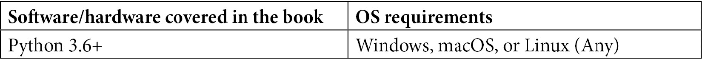

# 零、前言

机器学习任务的自动化允许开发人员有更多时间关注由机器学习模型支持的软件的可用性和反应性。TPOT 是一个 Python 自动机器学习工具，用于使用遗传编程优化机器学习管道。与传统方法相比，通过 TPOT 实现机器学习自动化可以让个人和公司以更低的成本和更快的速度开发出生产就绪的机器学习模型。

有了这本 AutoML 实用指南，使用 Python 进行机器学习任务的开发人员将能够将他们的知识运用到工作中，并快速提高工作效率。您将采用实践的方法来学习 AutoML 及其相关方法的实现。完成基本概念的一步一步的解释，实际的例子，和自我评估的问题，这本书将向你展示如何建立自动化的分类和回归模型，并比较他们的性能与定制的模型。随着您的进步，您还将使用几行代码开发最先进的模型，并了解这些模型如何在相同的数据集上优于您以前的所有模型。

到本书结束时，你将有信心在你的组织中的生产层面上实现 AutoML 技术。

# 这本书是给谁的

刚接触机器学习并希望在应用中使用它的数据科学家、数据分析师和软件开发人员会发现这本书很有用。这本书也适用于希望通过机器学习来自动化商业任务的商业用户。Python 编程语言的工作知识和对机器学习的初级理解是入门的必要条件。

# 这本书涵盖了什么

[*第 1 章*](B16954_01_Final_SK_ePub.xhtml#_idTextAnchor014) ，*机器学习和自动化的思想，*涵盖了机器学习的简要介绍，分类和回归任务的区别，自动化的概述和为什么需要自动化，以及 Python 生态系统中的机器学习选项。

[*第 2 章*](B16954_02_Final_SK_ePub.xhtml#_idTextAnchor036) ，*深入探讨 TPOT，*深入概述了 TPOT 是什么和不是什么，它如何用于处理机器学习中的自动化，以及它可以自动化哪些类型的任务。本章还将介绍如何设置编程环境。

[*第 3 章*](B16954_03_Final_SK_ePub.xhtml#_idTextAnchor051) ，*用 TPOT 探索回归，*涵盖了使用 TPOT 进行回归任务。您将学习如何将自动算法应用于数据，以及如何探索您的数据集。

[*第四章*](B16954_04_Final_SK_ePub.xhtml#_idTextAnchor058) ，*与 TPOT 一起探索分类，*涵盖了利用 TPOT 进行分类的任务。您将学习如何执行基本的探索性数据分析、准备、训练自动化模型，并将这些自动化模型与 scikit-learn 中的默认模型进行比较。

[*第 5 章*](B16954_05_Final_SK_ePub.xhtml#_idTextAnchor065) ，*TPOT 和 Dask 并行训练，*涵盖了 Python 和 Dask 库并行编程的基础知识。您将学习如何使用 Dask 以并行方式训练自动化模型。

[*第六章*](B16954_06_Final_SK_ePub.xhtml#_idTextAnchor073) ，*深度学习入门:神经网络速成课，*涵盖了深度学习背后的基本思想，如神经元、层、激活函数、人工神经网络等。

[*第 7 章*](B16954_07_Final_SK_ePub.xhtml#_idTextAnchor086) ，*TPOT 神经网络分类器，*提供了实现全自动神经网络分类器、数据集探索、模型训练和评估的分步指南。

[*第八章*](B16954_08_Final_SK_ePub.xhtml#_idTextAnchor093) ， *TPOT 模型部署，*带你一步步的了解模型部署。您将学习如何使用 Flask 和 Flask-RESTful 构建 REST API，然后部署到本地和 AWS。

[*第 9 章*](B16954_09_Final_SK_ePub.xhtml#_idTextAnchor102) ，*在生产中使用已部署的 TPOT 模型，*涵盖了已部署模型在笔记本环境和简单 web 应用程序中的用法。

# 为了充分利用这本书

您需要在计算机上安装 Python 3.6 或更高版本。这本书的代码在 Python 3.8.x 上进行了测试，但 3.6 以上的任何版本都应该可以正常工作。这本书不是特定于操作系统的，因为所有的代码都将独立于操作系统工作。尽管如此，请记住大部分代码最初是在 macOS 上运行的。



你不需要任何高级或授权软件来跟随这本书。每个库都是完全开源的。

**如果你正在使用这本书的数字版本，我们建议你自己键入代码或者通过 GitHub 库访问代码(下一节提供链接)。这样做将帮助您避免任何与复制和粘贴代码相关的潜在错误。**

# 下载示例代码文件

你可以从 GitHub 的 https://GitHub . com/packt publishing/Machine-Learning-Automation-with-TPOT 下载本书的示例代码文件。如果代码有更新，它将在现有的 GitHub 库中更新。

我们在[https://github.com/PacktPublishing/](https://github.com/PacktPublishing/)也有丰富的书籍和视频目录中的其他代码包。看看他们！

# 下载彩色图像

我们还提供了一个 PDF 文件，其中有本书中使用的截图/图表的彩色图像。可以在这里下载:[https://static . packt-cdn . com/downloads/9781800567887 _ color images . pdf](_ColorImages.pdf)

# 使用惯例

本书通篇使用了许多文本约定。

`Code in text`:表示文本中的码字、数据库表名、文件夹名、文件名、文件扩展名、路径名、伪 URL、用户输入和 Twitter 句柄。下面是一个例子:“将下载的`WebStorm-10*.dmg`磁盘镜像文件挂载为系统中的另一个磁盘。”

代码块设置如下:

```
output = (inputs[0] * weights[0] + 
          inputs[1] * weights[1] + 
          inputs[2] * weights[2] +
          inputs[3] * weights[3] +
          inputs[4] * weights[4] + 
          bias)
output
```

当我们希望将您的注意力吸引到代码块的特定部分时，相关的行或项目以粗体显示:

```
CPU times: user 26.5 s, sys: 9.7 s, total: 36.2 s
Wall time: 42 s
```

任何命令行输入或输出都按如下方式编写:

```
pipenv install "dask[complete]"
```

提示或重要注意事项

像这样出现。

# 取得联系

我们随时欢迎读者的反馈。

**总体反馈**:如果你对这本书的任何方面有疑问，请在邮件主题中提及书名，并给我们发邮件至 customercare@packtpub.com。

**勘误表**:虽然我们已经尽力确保内容的准确性，但错误还是会发生。如果你在这本书里发现了一个错误，请告诉我们，我们将不胜感激。请访问[www.packtpub.com/support/errata](http://www.packtpub.com/support/errata)，选择您的图书，点击勘误表提交表格链接，并输入详细信息。

**盗版**:如果你在互联网上发现任何形式的非法拷贝，如果你能提供地址或网站名称，我们将不胜感激。请联系我们在 copyright@packt.com 与材料的链接。

如果你对成为一名作家感兴趣:如果有一个你擅长的主题，并且你对写书或投稿感兴趣，请访问 authors.packtpub.com。

# 评论

请留下评论。一旦你阅读并使用了这本书，为什么不在你购买它的网站上留下评论呢？潜在的读者可以看到并使用您不带偏见的意见来做出购买决定，我们 Packt 可以了解您对我们产品的看法，我们的作者可以看到您对他们的书的反馈。谢谢大家！

更多关于 Packt 的信息，请访问 packt.com。