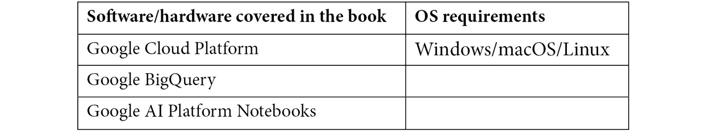

# 前言

**机器学习** ( **ML** )民主化是人工智能行业发展最快的趋势之一。在这个领域中，BigQuery ML 代表了一个基本工具，用于弥合数据分析和创新 ML 模型实现之间的差距。通过这本书，您将有机会学习如何使用 BigQuery 和 BigQuery ML，以及结合技术解释和动手练习的增量方法。简单介绍之后，您将立即能够使用 BigQuery ML 在具体用例上构建 ML 模型。到本书结束时，你将能够选择正确的 ML 算法来训练、评估和使用高级 ML 模型。

# 这本书是给谁的

这本书是为数据科学家、数据分析师、数据工程师和任何希望开始使用 Google 的 BigQuery ML 的人准备的。如果你想加速 ML 模型的开发，或者如果你是一个想使用 SQL 以简单的方式应用 ML 的商业用户，你也会发现这本书很有用。需要具备 BigQuery 和 SQL 的基础知识。

# 这本书涵盖了什么

[*第 1 章*](B16722_01_Final_ASB_ePub.xhtml#_idTextAnchor016) ，*Google 云和 BigQuery 的介绍*，概述了 Google 云平台和 BigQuery 分析数据库。

[*第 2 章*](B16722_02_Final_ASB_ePub.xhtml#_idTextAnchor039) ，*设置您的 GCP 和 BigQuery 环境*，介绍您的第一个 Google Cloud 帐户、项目和 BigQuery 环境的配置。

[*第 3 章*](B16722_03_Final_ASB_ePub.xhtml#_idTextAnchor052) ，*介绍 BigQuery 语法*，涵盖了处理 BigQuery 的主要 SQL 操作。

[*第 4 章*](B16722_04_Final_ASB_ePub.xhtml#_idTextAnchor061) ，*用线性回归预测数值*，解释了线性回归 ML 模型的开发，以预测自行车租赁服务的出行持续时间。

[*第 5 章*](B16722_05_Final_ASB_ePub.xhtml#_idTextAnchor075) ，*使用二元逻辑斯蒂预测布尔值*，解释了一个二元逻辑斯蒂回归 ML 模型的实现，以预测一家出租车公司的客户的行为。

[*第 7 章*](B16722_07_Final_ASB_ePub.xhtml#_idTextAnchor103) ，*使用 K-Means 算法进行聚类*，涵盖了一个聚类系统的实现，用于识别出租车公司中表现最佳的司机。

[*第 8 章*](B16722_08_Final_ASB_ePub.xhtml#_idTextAnchor119) ，*使用时间序列进行预测*，概述了预测工具的设计和实现，以预测和呈现特定产品的销售情况。

[*第 9 章*](B16722_09_Final_ASB_ePub.xhtml#_idTextAnchor133) ，*使用矩阵分解推荐合适的产品*，解释了如何使用矩阵分解算法构建推荐引擎，向每个客户推荐最佳产品。

[*第十章*](B16722_10_Final_ASB_ePub.xhtml#_idTextAnchor147) ，*使用 XGBoost* 预测布尔值，涵盖了一个 boosted tree ML 模型的实现，用来预测出租车公司客户的行为。

[*第 11 章*](B16722_11_Final_ASB_ePub.xhtml#_idTextAnchor160) ，*实现深度神经网络*，涵盖了一个**深度神经网络** ( **DNN** )的设计和实现，用于预测自行车租赁服务的出行时长。

[*第十二章*](B16722_12_Final_ASB_ePub.xhtml#_idTextAnchor174) ，*将 BigQuery ML 与 AI 笔记本结合使用*，讲解 AI 平台笔记本如何与 BigQuery ML 结合开发和共享 ML 模型。

[*第 13 章*](B16722_13_Final_ASB_ePub.xhtml#_idTextAnchor184) ，*用 BigQuery ML 运行 TensorFlow 模型*，解释 BigQuery ML 和 TensorFlow 如何协同工作。

[*第 14 章*](B16722_14_Final_ASB_ePub.xhtml#_idTextAnchor196) ， *BigQuery ML 技巧和最佳实践*，涵盖了在 BigQuery ML 模型开发过程中可以应用的 ML 最佳实践和技巧。

# 为了充分利用这本书

你需要有 SQL 语法的基础知识和一些使用数据库的经验。

不强制要求了解 ML 的基础知识，但建议了解。



如果您使用的是这本书的数字版本，我们建议您自己键入代码，或者通过 GitHub 资源库访问代码(下一节提供了链接)。这样做将帮助您避免任何与复制和粘贴代码相关的潜在错误。

# 下载示例代码文件

你可以从 GitHub 的 https://GitHub . com/packt publishing/Machine-Learning-with-big query-ML 下载本书的示例代码文件。如果代码有更新，它将在现有的 GitHub 库中更新。

我们在 https://github.com/PacktPublishing/也有丰富的书籍和视频目录中的其他代码包。看看他们！

# 代码在行动

这本书的动作视频代码可以在 https://bit.ly/3f11XbU[查看。](https://bit.ly/3f11XbU)

# 下载彩色图像

我们还提供了一个 PDF 文件，其中有本书中使用的截图/图表的彩色图像。可以在这里下载:[https://static . packt-cdn . com/downloads/9781800560307 _ color images . pdf](https://static.packt-cdn.com/downloads/9781800560307_ColorImages.pdf)。

# 习惯用法

本书通篇使用了许多文本约定。

`Code in text`:表示文本中的码字、数据库表名、文件夹名、文件名、文件扩展名、路径名、伪 URL、用户输入和 Twitter 句柄。下面是一个例子:“使用`ORDER BY`子句根据特定的字段列表对查询结果进行排序。”

代码块设置如下:

```
UPDATE
    `bigqueryml-packt.03_bigquery_syntax.first_table`
SET
    description= 'This is my updated description'
WHERE
    id_key=1;
```

**粗体**:表示一个新术语、一个重要单词或您在屏幕上看到的单词。例如，菜单或对话框中的单词出现在文本中，如下所示。下面是一个例子:“BigQuery 支持两种不同的 SQL 方言:**标准 SQL** 和**遗留 SQL** 。”

提示或重要注意事项

像这样出现。

# 取得联系

我们随时欢迎读者的反馈。

`customercare@packtpub.com`。

**勘误表**:虽然我们已经尽力确保内容的准确性，但错误还是会发生。如果你在这本书里发现了一个错误，请告诉我们，我们将不胜感激。请访问[www.packtpub.com/support/errata](http://www.packtpub.com/support/errata)，选择您的图书，点击勘误表提交表格链接，并输入详细信息。

`copyright@packt.com`带有链接的素材。

**如果你有兴趣成为一名作家**:如果有一个你擅长的主题，并且你有兴趣写作或投稿，请访问[authors.packtpub.com](http://authors.packtpub.com)。

# 点评

请留下评论。一旦你阅读并使用了这本书，为什么不在你购买它的网站上留下评论呢？潜在的读者可以看到并使用您不带偏见的意见来做出购买决定，我们 Packt 可以了解您对我们产品的看法，我们的作者可以看到您对他们的书的反馈。谢谢大家！

更多关于 Packt 的信息，请访问[packt.com](http://packt.com)。