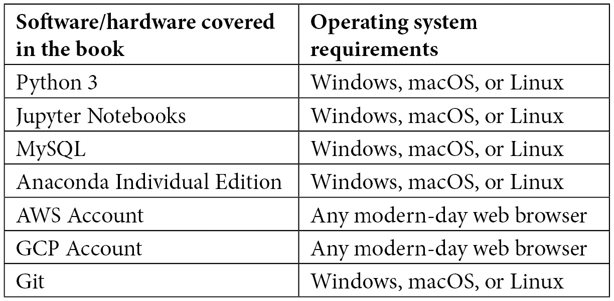

<title>B17761_Preface_Final_JM_ePub</title> 

# 前言

在过去的几年里，我们已经看到了机器学习领域的重大变化，这些变化影响了我们的日常生活和商业决策的方式。如果说生物技术和生命科学行业有什么丰富的东西，那就是它们永无止境的数据来源。随着我们转向更多数据驱动的模型，生命科学和机器学习的交叉出现了前所未有的增长，揭示了大量的信息和隐藏的模式，为公司带来了重大的竞争优势。

在本书的过程中，我们将从监督和非监督的角度触及机器学习的一些最重要的元素。我们不仅将学习开发和训练健壮的模型，还将使用 AWS 和 GCP 在云中部署它们，使我们能够立即为最终用户提供它们。

# 这本书是给谁的

这本书专门迎合学术界和工业界的科学专业人士，希望超越到数据科学领域。已经在制药、生命科学和生物技术部门建立的个人贡献者和管理者将发现这本书不仅有用，而且非常适用于当今的项目。虽然提供了 Python 和机器学习的介绍，但建议您对 Python 编程有一个基本的了解，并具备数据科学结合的初级背景，以便从本书中获得最大收益。

# 这本书涵盖了什么

[*第 1 章*](B17761_01_Final_JM_ePub.xhtml#_idTextAnchor015) ，*介绍生物技术的机器学习*，提供了生物技术领域的简要介绍，以及机器学习可以应用的一些领域，此外还有本书将使用的一些技术。

[*第 2 章*](B17761_02_Final_JM_ePub.xhtml#_idTextAnchor023) ，*介绍 Python 和命令行*，除了一些最常见的 Python 库之外，还包括 Bash 和 Python 编程语言中一些必须知道的技术和命令的摘要。

[*第 3 章*](B17761_03_Final_JM_ePub.xhtml#_idTextAnchor050) ，*SQL 和关系数据库入门*，您将从中获得 SQL 查询语言的知识，并学习如何使用 MySQL 和 AWS RDS 创建远程数据库。

[*第 4 章*](B17761_04_Final_JM_ePub.xhtml#_idTextAnchor066) ，*用 Python 可视化数据*，向您介绍了一些使用 Python 编程语言可视化和表示数据的最常用方法。

[*第 5 章*](B17761_05_Final_JM_ePub.xhtml#_idTextAnchor082) ，*理解机器学习*，包含标准机器学习管道的一些最重要的元素，向您介绍监督和非监督方法，以及保存模型以供将来使用。

[*第 6 章*](B17761_06_Final_JM_ePub.xhtml#_idTextAnchor092) ，*无监督机器学习*，在这里您将学习无监督模型，并通过与乳腺癌相关的教程深入研究聚类和降维方法。

[*第 7 章*](B17761_07_Final_JM_ePub.xhtml#_idTextAnchor101) ，*监督机器学习*，在这里你将学习监督学习模型，并深入分类和回归方法。

[*第 8 章*](B17761_08_Final_JM_ePub.xhtml#_idTextAnchor113) ，*了解深度学习*，提供了深度学习领域的概述，其中我们将探索深度学习模型的元素，以及与使用 Keras 的蛋白质分类和使用 AWS 的异常检测相关的两个教程。

[*第 9 章*](B17761_09_Final_JM_ePub.xhtml#_idTextAnchor132) ，*自然语言处理*，在我们探索流行的库和工具时，教你一些最常见的 NLP 选项，此外还有两个关于聚类以及使用 transformers 进行语义搜索的教程。

[*第 10 章*](B17761_10_Final_JM_ePub.xhtml#_idTextAnchor144) ，*探索时间序列分析*，使用基于时间的方法探索数据，其中我们分解时间序列数据集的组件，并使用 Prophet 和 LSTMs 开发两个预测模型。

[*第 11 章*](B17761_11_Final_JM_ePub.xhtml#_idTextAnchor154)*用 Flask 应用程序部署模型*，介绍了一个最流行的框架，用于向最终用户部署模型和应用程序。

[*第 12 章*](B17761_12_Final_JM_ePub.xhtml#_idTextAnchor160) ，*向云部署应用*，介绍了两个最流行的云计算平台，此外还有三个教程，允许用户将其工作部署到 AWS LightSail、GCP AppEngine 和 GitHub。

# 为了充分利用这本书

为了最大限度地利用您的时间，建议您学习 Python 编程语言和 Bash 命令行的基础知识。此外，为了更好地理解教程和用例，推荐一些生物技术和生命科学领域的背景知识。



**如果你使用的是这本书的数字版，我们建议你自己输入代码或者从这本书的 GitHub 库中获取代码(下一节有链接)。这样做将帮助您避免任何与复制和粘贴代码相关的潜在错误。**

# 下载示例代码文件

你可以从 GitHub 的 https://GitHub . com/packt publishing/Machine-Learning-in-Biotechnology-and-Life-Sciences 下载本书的示例代码文件。如果代码有更新，它会在 GitHub 库中更新。

我们在 https://github.com/PacktPublishing/也有丰富的书籍和视频目录中的其他代码包。看看他们！

# 下载彩色图像

我们还提供了一个 PDF 文件，其中有本书中使用的截图和图表的彩色图像。可以在这里下载:[https://static . packt-cdn . com/downloads/9781801811910 _ color images . pdf](https://static.packt-cdn.com/downloads/9781801811910_ColorImages.pdf)。

# 习惯用法

本书通篇使用了许多文本约定。

`Code in text`:表示文本中的码字、数据库表名、文件夹名、文件名、文件扩展名、路径名、伪 URL、用户输入和 Twitter 句柄。下面是一个例子:“将下载的`WebStorm-10*.dmg`磁盘镜像文件挂载为系统中的另一个磁盘。”

代码块设置如下:

```
from sklearn.preprocessing import StandardScaler
scaler = StandardScaler()
X_scaled = scaler.fit_transform(dfx.drop(columns = ["annotation"]))
```

当我们希望将您的注意力吸引到代码块的特定部分时，相关的行或项目以粗体显示:

```
>>> heterogenousList[0]
dichloromethane
>>> heterogenousList[1]
3.14 
```

任何命令行输入或输出都按如下方式编写:

```
$ mkdir machine-learning-biotech
```

**粗体**:表示一个新术语、一个重要单词或您在屏幕上看到的单词。例如，菜单或对话框中的单词以**粗体**显示。下面是一个例子:“从**管理**面板中选择**系统信息**”

提示或重要注意事项

像这样出现。

# 联系

我们随时欢迎读者的反馈。

`customercare@packtpub.com`并在邮件主题中提及书名。

**勘误表**:虽然我们已经尽力确保内容的准确性，但错误还是会发生。如果你在这本书里发现了一个错误，请告诉我们，我们将不胜感激。请访问 www.packtpub.com/support/errata 并填写表格。

`copyright@packt.com`带有链接的素材。

**如果你有兴趣成为一名作家**:如果有一个你擅长的话题，并且你有兴趣写一本书或者为一本书投稿，请访问[authors.packtpub.com](http://authors.packtpub.com)。

# 分享你的想法

一旦你阅读了*生物技术和生命科学中的机器学习*，我们很想听听你的想法！请点击这里直接进入亚马逊对这本书的评论页面并分享你的反馈。

您的评论对我们和技术社区非常重要，将有助于我们确保提供高质量的内容。