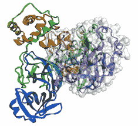

<title>B17761_04_Final_JM_ePub</title> 

# 第 4 章:用 Python 可视化数据

不管你从事的工作领域，你选择的职业道路，或者你正在从事的具体项目，与他人有效沟通的能力总是有用的。事实上，整整一百年前，在 1921 年，弗雷德里克·r·巴纳德第一次说了一句话，这句话你可能已经听过无数次了:*一幅画胜过千言万语*。

随着近年来机器学习领域出现的许多新技术，结构化、处理和分析的数据量呈指数级增长。获取原始形式的数据并将其转换为有意义的交流图的能力是当今行业中最受欢迎的技能之一。大公司和企业做出的大多数决策通常都是数据驱动的，就你关心的领域展开对话的最佳方式是创建一个有意义的可视化。请考虑以下情况:

*   人脑处理可视化的速度比处理文本快 6 万倍。
*   人脑处理的所有信息中，近 90%是通过视觉完成的。
*   可视化比简单的文本更容易被阅读 30 倍。

可视化并不总是推动对话或说服对方同意某事，它们通常被用作调查和探索数据的手段，以揭示隐藏的见解。在你承担的几乎每个机器学习项目中，都会有大量的努力投入到探索数据中，通过一个被称为**探索性数据分析** ( **EDA** )的过程来揭示其隐藏的**特征**。EDA 通常在任何类型的机器学习项目之前完成，以便更好地理解数据、其特征和限制。以这种方式探索数据的最佳方式之一是以可视化的形式，让您发现的不仅仅是数字值。

在下一章的课程中，我们将会看到一些有用的步骤来为一个给定的数据集开发一个健壮的可视化。我们还将探索今天在 **Python** 社区中使用的一些最常见的可视化库。最后，我们将探索几个数据集，并学习如何为它们开发一些最常见的可视化。

在本章中，我们将讨论以下主题:

*   探索数据可视化的六个步骤
*   常用的可视化库
*   教程-用 Python 可视化数据

# 技术要求

在本章中，我们将应用我们对 Python 和`pip`安装程序的理解，在 [*第 2 章*](B17761_02_Final_JM_ePub.xhtml#_idTextAnchor023) 、*介绍 Python 和命令行*中演示。回想一下，安装库的过程是通过命令行完成的:

```
$ pip install library-name
```

那么，现在我们已经设置好了，让我们开始吧！

# 探索数据可视化的六个步骤

当开始有效地传达你的数据中的关键趋势时，呈现的方法总是很重要的。当向观众展示任何类型的数据时，有两个主要的考虑因素:首先，为论点选择正确的数据段；第二，为论点选择最有效的视觉化。在处理新的可视化时，有六个步骤可以帮助指导您:

1.  **获取**:从数据源获取数据。
2.  **了解**:了解数据，了解其类别和特征。
3.  `NaN`值，以及损坏的条目。
4.  挖掘:识别模式或设计新功能。
5.  **浓缩**:分离出最有用的特征。
6.  **代表**:选择这些特征的代表。

让我们详细看看每一步。

第一步是*从数据源获取*您的数据。这个源可能是一个简单的 CSV 文件，一个关系数据库，或者甚至是一个 NoSQL 数据库。

第二，重要的是*理解*数据的上下文以及它的内容。作为一名数据科学家，你的目标是站在利益相关者的角度，尽你所能理解他们的数据。通常，与主题专家 ( **SME** )进行一次简单的对话可以节省你的时间，因为它强调了你原本不会知道的数据事实。

第三，*过滤*你的数据永远是至关重要的。数据科学的大多数现实应用很少涉及现成的数据集。通常，原始形式的数据将是主要的数据源，由数据科学家和开发人员来确保任何丢失的值和损坏的条目都得到处理。数据科学家通常将这一步称为**预处理**，而我们将在 [*第 5 章*](B17761_05_Final_JM_ePub.xhtml#_idTextAnchor082) 、*理解机器学习*中对此进行更详细的探讨。

对数据进行预处理后，我们的下一个目标是*挖掘*数据，以尝试识别模式或设计新功能。在简单的数据集中，值通常可以快速显示为增加或减少，使我们能够轻松理解趋势。在多维数据集中，这些趋势通常更难发现。例如，时间序列图可能会向您显示一个增加的*趋势*，但是，该图的一阶导数可能会揭示与*季节性*相关的*趋势*。

一旦确定了感兴趣的趋势，代表该趋势的数据通常会从其他数据中分离出来*。最后，这种趋势用一种视觉化的方式*表现出来*。*

 *重要的是要理解这些步骤绝不是硬性规定，但它们应该被认为是帮助您生成有效可视化的有用指南。不是每一个可视化都需要每一个步骤！事实上，一些可视化可能需要其他步骤，也许有时以不同的顺序。我们将在本章的*教程——用 Python 可视化数据*一节中经历这些步骤来生成一些可视化。当我们这样做时，试着回忆这些步骤，看看你是否能识别它们。

在我们开始生成一些有趣的视觉效果之前，让我们先谈谈我们需要的一些库。

# 常用可视化库

Python 中有数不清的**可视化库**可用，而且每天都有更多的在发布。可视化库可以分为和两个主类:**静态可视化**库和**交互可视化**库。静态可视化是由用户不能点击的绘制值组成的图像。另一方面，交互式可视化不仅仅是图像，而是可以被点击、改变形状、四处移动和在特定方向缩放的表示。静态可视化通常用于电子邮件通信、印刷出版物或幻灯片，因为它们是您不希望其他人更改的可视化。然而，交互式可视化通常是为仪表板和网站(如 **AWS** 或 **Heroku** )设计的，预期用户会与它们交互并在允许的情况下探索数据。

以下开源库是目前业界最流行的一些库。每种方法都有自己的优点和缺点，详见下表:


图 4.1–Python 中最常见的可视化库列表

现在我们已经了解了可视化库，让我们继续下一部分吧！

# 教程–用 Python 可视化数据

在本教程的课程中，我们将从一系列来源中检索一些不同的数据集，并通过各种可视化来探索它们。为了创建这些视觉效果，我们将结合一些开源可视化库来实现许多可视化步骤。我们开始吧！

## 获取数据

回想一下在 [*第 3 章*](B17761_03_Final_JM_ePub.xhtml#_idTextAnchor050) 、*SQL 和关系数据库入门*中，我们使用 AWS 创建了一个数据库并将其部署到云中，允许我们使用`sqlalchemy`查询数据:

1.  让我们用直接从上一章生成的`endpoint`、`username`和`password`值中查询数据集。继续用 Python 列出这些变量:

    ```
    ENDPOINT=" yourEndPointHere>" PORT="3306" USR="admin" DBNAME="toxicity_db_tutorial" PASSWORD = "<YourPasswordHere>"
    ```

2.  With the variables populated with your respective parameters, we can now query this data using `sqlalchemy`. Since we are interested in the dataset as a whole, we can simply run a `SELECT * FROM dataset_toxicity_sd` command:

    ```
    from sqlalchemy import create_engine
    import pandas as pd
    db_connection_str =
    'mysql+pymysql://{USR}:{PASSWORD}@{ENDPOINT}:{PORT}/{DBNAME}'.format(USR=USR, PASSWORD=PASSWORD, ENDPOINT=ENDPOINT, PORT=PORT, DBNAME=DBNAME)
    db_connection = create_engine(db_connection_str)
    df = pd.read_sql('SELECT * FROM dataset_toxicity_sd',
    con=db_connection)
    ```

    或者，您可以使用`read_csv()`功能将相同的数据集作为 CSV 文件导入:

    ```
    df = pd.read_csv("../../datasets/dataset_toxicity_sd.csv")
    ```

3.  We can take a quick look at the dataset to understand its content using the `head()` function. Recall that we can choose to reduce the columns by specifying the names of the ones we are interested in by using double square brackets (`[[]]`):

    ```
    df[["ID", "smiles", "toxic"]].head() 
    ```

    这为我们提供了以下输出:

    

    图 4.2–毒性数据集中所选列的数据帧表示

    如果您还记得，这个数据集中有很多列，从主键(`ID`)到结构(`smiles`)和毒性(`toxic`)等一般数据。此外，还有许多描述和表示数据集的特征，从总极表面积(`TPSA`)一直到亲油性(`LogP`)。

4.  We can also get a sense of some of the general statistics behind this dataset – such as the maximum, minimum, and averages relating to each column – by using the `describe()` function in `pandas`:

    ```
    df[["toxic", "TPSA", "MolWt", "LogP"]].describe()
    ```

    这导致了下表:

    

    图 4.3–毒性数据集中选定列的一些一般统计数据

    立刻，我们注意到`FormalCharge`和`LogP`有负值。所以，这个真实世界的数据集是非常多样的，而且是分散的。

5.  Before we can explore the dataset further, we will need to ensure that there are no missing values. To do this, we can run a quick check using the `isna()` function provided by the `pandas` library. We can chain this with the `sum()` function to get a sum of all of the missing values for each column:

    ```
    df.isna().sum()
    ```

    结果如图*图 4.4* 所示:


图 4.4-数据框中缺失值的列表

幸运的是，这个特定的数据集中没有丢失值，所以我们可以自由地继续创建一些图表和视觉效果。

重要说明

`dropna()`功能。另一个选项是使用`fillna()`或`replace()`功能用公共值替换任何缺失值。最后，您还可以使用`mean()`函数将缺失值替换为所有其他值的平均值。您选择的方法在很大程度上取决于列的标识和含义。

## 用条形图汇总数据

**条形图**或**条形图**是常用于描述*分类数据*，其中条形的长度或高度与其代表的类别值成比例。条形图提供了数据集集中趋势的直观估计，估计的不确定性由误差条表示。

那么，让我们创建我们的第一个条形图。我们将使用`seaborn`库来完成这个特殊的任务。有许多不同的方式来设计你的图表。出于本教程的目的，我们将使用来自`seaborn`的`darkgrid`样式。

让我们画出相对于`FormalCharge`特征的`TPSA`特征，以了解它们之间的关系:

```
import pandas as pd
import seaborn as sns
plt.figure(figsize=(10,5))
sns.barplot(x="FormalCharge", y="TPSA", data=df);
```

我们最初的结果如*图 4.5* 所示:


图 4.5–TPSA 和正式收费特征的柱状图

很快，我们可以看到两者之间有趣的关系，当`FormalCharge`的绝对值远离零时，`TPSA`特性趋于增加。如果你跟随提供的`HDonors`而不是`TPSA`:

```
sns.barplot(x="FormalCharge", y="HDonors", data=df)
```

我们可以在*图 4.6* 中看到后续输出:


图 4.6–h donor 和形式电荷特性的条形图

看一下图表，我们看不出这两个变量之间的关系有多强。事实上，最高和最低的形式电荷显示出较高的氢供体。让我们将其与`HAcceptors`进行比较，后者是该数据集中的一个类似特征。我们既可以像对氢供体那样，单独绘制这一特征，也可以将两者结合成一张图。我们可以通过*隔离*感兴趣的特征来做到这一点(你还记得这个步骤的名字吗？)然后*重塑*数据集。Python 中的数据帧通常使用四个常用函数进行**整形**:


图 4.7–四种最常见的数据帧整形函数

这些函数中的每一个都以特定的方式重塑数据。`pivot()`函数通常用于对按索引组织的数据帧进行整形。`stack()`函数通常用于多索引数据帧——这允许你*堆叠*你的数据，使表格*长而窄*而不是*宽而短*。`melt()`函数类似于`stack()`函数，因为它也是*堆叠*你的数据，但是它们之间的区别在于`stack()`将把压缩的列插入到内部索引中，而`melt()`将创建一个名为`Variable`的新列。最后，`unstack()`与`stack()`正好相反，数据从*长*转换为*宽*。

为了比较氢供体和受体，我们将使用`melt()`函数，您可以在*图 4.8* 中看到。请注意，在和流程中创建了两个新列:`Variable`和`Value`:


图 4.8–melt()函数的图示

首先，我们创建一个名为`df_iso`的变量来表示隔离的数据帧，然后我们使用`melt()`函数来*融化*它的数据，并将其赋给一个名为`df_melt`的新变量。我们还可以打印出数据的形状，以向自己证明如果列*的长度正好是*的两倍*，那么这些列*会正确地堆叠*。回想一下，您也可以使用`head()`功能检查数据:*

```
df_iso = df[["FormalCharge", "HDonors", "HAcceptors"]]
print(df_iso.shape)
    (1460, 3)
df_melted = pd.melt(df_iso, id_vars=["FormalCharge"],
                    value_vars=["HDonors", "HAcceptors"])
print(df_melted.shape)
    (2920, 3)
```

最后，数据排序正确后，我们可以继续绘制这些数据，将 x 轴指定为`FormalCharge`，y 轴指定为`value`:

```
sns.barplot(data=df_melted, x='FormalCharge', y='value', 
            hue='variable')
```

执行这行代码后，我们将得到下图:


图 4.9–两个特征相对于正式电荷的条形图

当您开始探索`seaborn`库中的许多函数和类时，在编写代码时参考文档可以帮助您调试错误，还可以发现您可能不知道的新功能。你可以在 https://seaborn.pydata.org/api.html[查看 Seaborn 文档。](https://seaborn.pydata.org/api.html)

## 使用分布和直方图

`40`:

```
plt.figure(figsize=(10,5))
plt.title("Histogram of Molecular Weight (g/mol)", fontsize=20)
plt.xlabel("Molecular Weight (g/mol)", fontsize=15)
plt.ylabel("Frequency", fontsize=15)
df["MolWt"].hist(figsize=(10, 5), 
                          bins=40, 
                          xlabelsize=10, 
                          ylabelsize=10, 
                          color = "royalblue")
```

我们可以在*图 4.10* 中看到该代码的输出:


图 4.10–仓尺寸为 40 的分子量直方图

随着您在 Python 中探索更多的可视化方法，您会注意到大多数库都提供了许多快捷函数，这些函数已经被开发和优化来执行特定的任务。我们可以对每个特征进行相同的数据整形过程，并对它们进行迭代，以绘制每个特征的直方图，或者我们可以简单地对它们一起使用`hist()`函数:

```
dftmp = df[["MolWt", "NHOH", "HAcceptors", "Heteroatoms", 
                     "LogP", "TPSA"]]
dftmp.hist(figsize=(30, 10), bins=40, xlabelsize=10,
                    ylabelsize=10, color = "royalblue")
```

后续输出可以在*图 4.11* 中看到:


图 4.11–使用 hist()函数自动生成的各种特征的一系列直方图

直方图也可以重叠，以便在同一个图上显示两个特征。当这样做的时候，我们需要通过使用`alpha`参数给这些图一定程度的透明度:

```
dftmp = df[["MolWt","TPSA"]]
x1 = dftmp.MolWt.values
x2 = dftmp.TPSA.values
kwargs = dict(histtype='stepfilled', alpha=0.3, 
              density=True, bins=100, ec="k")
plt.figure(figsize=(10,5))
plt.title("Histogram of Molecular Weight (g/mol)", 
           fontsize=20)
plt.xlabel("Molecular Weight (g/mol)", fontsize=15)
plt.ylabel("Frequency", fontsize=15)
plt.xlim([-100, 1000])
plt.ylim([0, 0.01])
plt.hist(x1, **kwargs)
plt.hist(x2, **kwargs)
plt.legend(dftmp.columns)
plt.show()
```

我们可以在*图 4.12* 中看到前面命令的输出:


图 4.12–两个不透明度降低的直方图的叠加

直方图是总结和可视化大量数据的极好方法，尤其是当功能像使用`hist()`功能一样简单时。你会发现大多数的库——比如`pandas`和`numpy`——都有许多类似功能的函数。

## 用散点图可视化特征

**散点图**是基于*笛卡尔坐标*的表示，允许在二维和三维空间中创建可视化。散点图由一个 x 轴和一个 y 轴组成，通常还带有一个附加特征，允许在数据中进行分离。散点图最适合与第三种特征一起使用，根据可用的数据类型，第三种特征可以用颜色或形状来表示。让我们看一个简单的例子:

1.  We'll take a look at an example of a simple scatter plot showing `TPSA` relative to the `HeavyAtoms` feature:

    ```
    plt.figure(figsize=(10,5))
    plt.title("Scatterplot of Heavy Atoms and TPSA", fontsize=20)
    plt.ylabel("Heavy Atoms", fontsize=15)
    plt.xlabel("TPSA", fontsize=15)
    sns.scatterplot(x="TPSA", y="HeavyAtoms", data=df)
    ```

    前面代码的输出可以在*图 4.13* 中看到:

    

    图 4.13–TPSA 和 HeavyAtoms 特征的散点图

    很快，我们注意到这两个特性之间有一些相关性，如轻微的正相关所示。

2.  We can take a look at a third feature, such as `MolWt`, by changing the color and size using the `hue` and `size` arguments, respectively. This gives us the ability to plot three or four features on the same graph, giving us an excellent interpretation of the dataset. We can see some trending among `TPSA` relative to `HeavyAtoms`, and increasing `MolWt`:

    ```
    plt.figure(figsize=(10,5))
    plt.title("Scatterplot of Heavy Atoms and TPSA", fontsize=20)
    plt.ylabel("Heavy Atoms", fontsize=15)
    plt.xlabel("Molecular Weight (g/mol)", fontsize=15)
    sns.scatterplot(x="TPSA",y="HeavyAtoms", 
    size="MolWt", hue="MolWt", data=df)
    ```

    前面代码的输出如图*图 4.14* 所示:

    

    图 4.14–两个特征的散点图，第三个特征用大小和颜色表示

3.  As an alternative to 2D scatter plots, we can use 3D scatter plots to introduce another feature in the form of a new dimension. We can take advantage of the `Plotly` library to implement some 3D functionality. To do this, we can define a `fig` object using the `scatter_3d` function, and subsequently, we define the source of our data and the axes of interest:

    ```
    import plotly.express as px
    fig = px.scatter_3d(df, x='TPSA', y='LogP', z='HeavyAtoms',
                         color='toxic', opacity=0.7)
    fig.update_traces(marker=dict(size=4))
    fig.show()
    ```

    此代码的输出将导致*图 4.15* :

    

    图 4.15–三个特征的 3D 散点图，按毒性着色

4.  Instead of adding more features, we can add some more elements to the scatter plot to help interpret the two features on the x and y coordinates. We noticed earlier that there was a slight correlation within the dataset that seems ripe for exploration. It would be interesting to see if this correlation holds true for both toxic and non-toxic compounds. We can get a sense of the correlation using the `lmplot()` function, which allows us to graphically represent the correlation as a *linear regression* within the scatter plot:

    ```
    sns.lmplot(x="HAcceptors", y="TPSA", hue="toxic", 
             data=df, markers=["o", "x"], height = 5, 
             aspect = 1.7, palette="muted");
    plt.xlim([0, 16])
    plt.ylim([0, 400])
    ```

    后续输出如图*图 4.16* 所示:


图 4.16–两个特征及其相关关系的散点图

散点图是描绘数据关系并开始理解它们可能具有的任何依赖性或相关性的好方法。绘制回归曲线或最佳拟合线可以让你对任何可能的关系有所了解。我们将在下一节更详细地探讨这一点。

## 识别与热图的相关性

现在我们已经在数据集内建立了两个分子特征之间的关联，让我们研究一下是否还有其他的关联。我们可以轻松地浏览每组特征，绘制它们，并查看它们各自的回归曲线，以确定是否存在相关性。在 Python 中，建议尽可能自动化，幸运的是，这个任务已经自动化了！那么，让我们来看看:

1.  Using the `pairplot()` function will take your dataset as input and return a figure of all the scatter plots for all of the features within your dataset. To fit the figure within the confines of this page, only the most interesting features were selected. However, I challenge you to run the code in the provided Jupyter notebook to see if there are any other interesting trends:

    ```
    featOfInterest = ["TPSA", "MolWt", "HAcceptors",
           "HDonors", "toxic", "LogP"]
    sns.pairplot(df[featOfInterest], hue = "toxic", markers="o")
    ```

    结果以众多小图的形式呈现在中，如图*图 4.17* 所示:

    

    图 4.17–所选特征的毒性数据集的 pairplot()图

2.  Alternatively, we can capture the *Pearson correlation* for each of the feature pairs using the `corr()` function in conjunction with the DataFrame itself:

    ```
    df[["TPSA", "MolWt", "HeavyAtoms", "NHOH", "HAcceptors", 
              "HDonors", "AromaticRings", "LogP", "AromaticN"]].corr()
    ```

    我们可以在*图 4.18* 中以数据帧的形式回顾这些相关性:

    

    图 4.18-显示所选特征之间相关性的数据框架

3.  For a more visually appealing result, we can *wrap* our data within a `heatmap()` function and apply a color map to show dark colors for strong correlations and light colors for weaker ones:

    ```
    sns.heatmap(df[["TPSA", "MolWt", "HeavyAtoms", "NHOH", 
                  "HAcceptors", "HDonors", "AromaticRings", 
                  "LogP", "AromaticN"]].corr(), 
                  annot = True,  cmap="YlGnBu")
    ```

    到目前为止，我们编写的一些代码已经变得有点复杂，因为我们开始将多个功能链接在一起。为了使语法和结构更加清晰，让我们仔细看看下面的函数。我们从调用`seaborn`库中的主`heatmap`类开始(记得我们给它起了别名`sns`)。然后，我们添加数据集，其中包含感兴趣的要素的切片集。然后，我们应用相关函数来获得各自的相关性，最后添加一些额外的参数来给绘图添加样式和颜色:


图 4.19–显示所选特征之间相关性的热图

无论您是在分析数据还是准备预测模型，识别数据集中的相关性总是有用的。你会发现`corr()`和它的很多衍生物都是机器学习领域常用的。

## 显示顺序和时间序列图

到目前为止，我们探索的数据集和特性都是以*结构化*和*表格*形式提供的，在数据帧中以行和列的形式存在。这些行彼此完全独立。并非所有数据集都是如此，而且*依赖性*(尤其是*基于时间的依赖性*)有时候也是我们需要考虑的一个因素。以为例，以**Fast All**(**FASTA**)序列为例——这是一种基于文本的格式，常用于生物信息学领域，通过字母代码来表示核苷酸或氨基酸序列。在分子生物学和遗传学中，一个称为**鸟嘌呤-胞嘧啶** ( **GC** ) **含量**的参数是一个度量，用于确定 DNA 或 RNA 分子中含氮碱基的百分比。让我们探索使用 FASTA 文件绘制新冠肺炎数据的顺序数据:

1.  我们将通过使用`wget`库:

    ```
    import wget url_covid = "https://ftp.expasy.org/databases/uniprot/pre_release/covid-19.fasta" filename = wget.download(url_covid, out="../../datasets")
    ```

    导入数据集来开始这个过程
2.  接下来，我们可以使用`Biopython`(也称为`Bio`)库计算 GC 含量，这是计算分子生物学领域最常用的 Python 库之一。在 http://biopython.org/DIST/docs/tutorial/Tutorial.html[可以找到`Biopython`库的文档和教程。](http://biopython.org/DIST/docs/tutorial/Tutorial.html)
3.  We will then parse the file using the `SeqIO` and `GC` classes and write the results to the `gc_values_covid` variable:

    ```
    from Bio import SeqIO
    from Bio.SeqUtils import GC
    gc_values_covid = sorted(GC(rec.seq) for rec in 
        SeqIO.parse("../../datasets/covid-19.fasta", "fasta"))
    ```

    请注意，根据文件保存的目录，前面代码中文件的路径可能会改变。

4.  Finally, we can go ahead and plot the results using either `pylab` or `matplotlib`:

    ```
    import pylab
    plt.figure(figsize=(10,5))
    plt.title("COVID-19 FASTA Sequence GC%", fontsize=20)
    plt.ylabel("GC Content %", fontsize=15)
    plt.xlabel("Genes", fontsize=15)
    pylab.plot(gc_values_covid)
    pylab.show()
    ```

    后续输出如图*图 4.20* 所示:


图 4.20-显示新冠肺炎序列 GC 含量的图

虽然有许多非基于时间的顺序数据集，如`text`、`images`和`audio`，但也有基于时间的数据集，如`stock prices`和`manufacturing processes`。在实验室空间内，有许多设备也利用基于时间序列的方法，例如那些与色谱相关的方法。对于示例，随着时间的推移，将`time-series`数据集和`Temperature`和`Pressure`叠加在一起:

```
dfts = pd.read_csv("../../datasets/dataset_pressure_ts.csv")
plt.title("Timeseries of an LCMS Chromatogram (Pressure & 
     Temperature)", fontsize=20)
plt.ylabel("Pressure (Bar)", fontsize=15)
plt.xlabel("Run Time (min)", fontsize=15)
ax1 = sns.lineplot(x="Run Time", y="Pressure",
                      data=dfts, color = "royalblue", 
                      label = "Pressure (Bar)");
ax2 = sns.lineplot(x="Run Time", y="Temperature",
                      data=dfts, color = "orange", 
                      label = "Pressure (Bar)");
```

该代码的输出可以在*图 4.21* 中看到:


图 4.21-显示 LCMS 失败运行的温度和压力的时间序列图

我们注意到在该图的前 5 分钟内，温度和压力参数上升相当快。在 6.5 分钟的范围内出现了某种程度的下降，系统持续增加了一会儿，然后两个参数开始直线下降，并在各自的范围内保持水平。这是一个仪器故障的例子，这是一个经过微调的机器学习模型相对于其成功的对应物能够检测到的情况。我们将在 [*第 7 章*](B17761_07_Final_JM_ePub.xhtml#_idTextAnchor101) 、*监督机器学习*中更详细地探讨这种异常检测模型的开发。

## 用桑基图强调流程

数据科学中一种流行的可视化形式是**桑基图**——因米纳德对入侵俄罗斯期间拿破仑军队的经典描述而闻名。桑基图的主要目的是在流程图上以比例宽度的形式显示数值:


图 4.22-查尔斯·约瑟夫·密纳德绘制的描绘拿破仑向俄罗斯进军的桑基图

桑基图通常用于描述不同领域的许多应用。桑基图在生物技术和卫生领域的应用包括:

*   临床试验期间候选药物的描述
*   合成分子的工艺流程图
*   微生物发酵工艺流程图
*   项目流程图和成功率
*   描述组织内成本的财务图表

让我们想象一个公司候选药物管道的简单例子。我们将得到候选分子的总数，它们的相分类，最后，它们的形态被指定为小分子或大分子。我们可以利用`Plotly`库来帮助我们:

```
import plotly.graph_objects as go
fig = go.Figure(data=[go.Sankey(node = dict(pad = 50, 
      thickness = 10,
                 line = dict(color = "black", width = 0.5),
                 label = ["Drug Candidates", "Phase 1", "Phase 2",
                 "Phase 3", "Small Molecules", "Large Molecules"],
                 color = "blue"),
                 link = dict(
                 source = [0,  0, 0, 1,  2, 3, 1, 2, 3],
                 target = [1,  2, 3, 4,  4, 4, 5, 5, 5],
                 value = [15, 4, 2, 13, 3, 1, 2, 1, 1]
  ))]) 
```

这段代码很长也很复杂——让我们试着把它分解一下。`figure`对象包含几个我们需要考虑的参数。第一个是`pad`，它描述了可视化的*节点*之间的间距。第二个描述了节点条的`thickness`值。第三个设置线的`color`和`width`值。第四个包含节点的`label`名称。最后，我们得到数据，它的结构与我们习惯的方式略有不同。在这种情况下，数据集被分为一个`source`数组(或原点】、`target`数组和与之关联的`value`数组。从左侧开始，我们看到`source`的第一个值是节点`0`，它转到节点`1`的`target`，带有一个`15`的`value`。以这种方式阅读流程可以让用户或开发人员对数据流更加清楚。最后，我们可以继续使用`show()`绘制图像:

```
fig.update_layout(title_text="Drug Candidates within a Company Pipeline", font_size=10)
fig.show()
```

下图显示了上述代码的输出:


图 4.23-代表公司管道的桑基图

桑基图是显示信息随时间或按类别流动或转移的好方法。在前面的例子中，我们从管道中的大小分子的角度看了它的应用。现在让我们来看看如何将这些分子可视化。

## 可视化小分子

当涉及到小分子时，我们可以使用各种软件平台和在线服务，通过多种方式将它们可视化。幸运的是，有一个很好的常用库，可以使用`pip`安装`rdkit`库:

```
import pandas as pd
import rdkit
from rdkit import Chem
```

我们可以解析我们在本教程前面导入的数据帧，并通过索引提取一个示例`smiles`字符串。然后我们可以使用`rdkit`的`Chem`类中的`MolFromSmiles()`函数创建一个分子对象，使用`smiles`字符串作为单个参数:

```
df = pd.read_csv("../../datasets/dataset_toxicity_sd.csv")
m = Chem.MolFromSmiles(df["smiles"][5])
m
```

该变量的输出见*图 4.24* :


图 4.24-一个小分子的示意图

我们可以通过查看不同的指数值来检查另一个分子的结构:

```
m = Chem.MolFromSmiles(df["smiles"][20])
m
```

这一次，我们的输出如下:


图 4.25-一个小分子的示意图

除了呈现打印就绪的小分子描述，`rdkit`库还支持与小分子特性的分析、预测和计算相关的各种功能。此外，该库还支持使用电荷计算以及相似性映射:

```
from rdkit.Chem import AllChem
from rdkit.Chem.Draw import SimilarityMaps
AllChem.ComputeGasteigerCharges(m)
contribs = [m.GetAtomWithIdx(i).GetDoubleProp('_GasteigerCharge') for i in range(m.GetNumAtoms())]
fig = SimilarityMaps.GetSimilarityMapFromWeights(m, 
             contribs, contourLines=10, )
```

前面代码的输出见*图 4.26* :


图 4.26-小分子电荷的示意图

既然我们已经了解了如何使用 RDKit 来表示小分子，让我们来看看它在大分子中的应用。

## 可视化大分子

有许多 Python 库被设计用来可视化、模拟和分析用于研究和开发的大分子。目前，最常见的库之一是`py3Dmol`。该库专门用于 Jupyter 笔记本环境中的 3D 可视化目的，允许创建可供出版的 3D 蛋白质视觉效果。使用`pip`框架可以很容易地下载这个库。

在撰写本文时，世界仍在应对源自中国武汉并蔓延至全球的新冠肺炎病毒。2020 年 7 月 8 日，*新型冠状病毒 3CL* 蛋白酶的 1.7 吋分辨率结构在`pdb = 6XMK`发布。让我们继续使用这种蛋白质作为例子，在下面的可视化:

1.  我们可以使用`py3dmol`库并直接在下面的函数

    ```
    import py3Dmol largeMol = py3Dmol.view(query='pdb:6xmk',                             width=600,                            height=600)
    ```

    中查询蛋白质结构来开始这个可视化的开发
2.  With the library imported, a new variable object called `lm` can be specified using the `view` class in `py3Dmol`. This function takes three main arguments. The first is the identity of the protein of interest, namely `6xmk`. The second and third arguments are the width and height of the display window, respectively. For more information about PDB files, visit the `stick` argument:

    ```
     largeMol.setStyle({'stick':{'color':'spectrum'}})
     largeMol
    ```

    执行这一行代码后，我们得到了分子的如下图像:

    

    图 4.27-一个大分子或蛋白质的球棍图

3.  Notice that we added a `stick` argument that displayed the last structure. We can change this argument to `cartoon` to see a cartoon representation of this protein based on its *secondary structure*:

    ```
    largeMol.setStyle({'cartoon':{'color':'spectrum'}})
    largeMol
    ```

    当执行这一行代码时，我们得到了分子的如下图像:

    

    图 4.28-大分子或蛋白质二级结构的示意图

4.  There are a number of other changes and arguments that can be added to custom fit this visualization to a user's particular aims. One of these changes is the addition of a **Van der Waals surface**, which allows for the illustration of the area through which a molecular interaction might occur. We will add this surface to only one of the two chains on this protein:

    ```
    lm = py3Dmol.view(query='pdb:6xmk')
    chA = {'chain':'A'}
    chB = {'chain':'B'}
    lm.setStyle(chA,{'cartoon': {'color':'spectrum'}}) 
    lm.addSurface(py3Dmol.VDW, {'opacity':0.7, 'color':'white'}, chA)
    lm.setStyle(chB,{'cartoon': {'color':'spectrum'}})
    lm.show()
    ```

    我们可以在*图 4.29* 中看到这段代码的输出:



图 4.29–一个大分子或蛋白质的二级结构示意图，其中一个链上有范德华表面

近年来，对大分子或生物制剂的研究在生物技术领域显示出巨大的增长。在这一章中，我们简要介绍了用于可视化这些复杂分子的众多方法中的一种，这是任何生物信息学项目的重要的第一步。

# 总结

可视化可以是有用的、强大的、令人信服的工具，有助于阐明观点并推动特定方向的对话。为了创建适当的可视化，需要采取某些步骤和技术来确保您的图表是正确和有效的。

在这一章中，我们探讨了创建合适的可视化时要遵循的六个主要步骤。我们还探索了 Python 范围内的许多不同的方法和库，以帮助您为您的特定目标创建和设计视觉效果。我们探索了一些更基本的视觉效果，比如条形图、直方图和散点图，以便一次分析几个特征。我们还探索了更复杂的可视化，如配对图、热图、桑基图和分子表示，通过它们我们可以探索更多的特性。

我们还提到了*相关性*的概念，以及某些功能如何与其他功能相关联——在下一章我们将注意力转向**机器学习**时，我们将更详细地讨论这个概念。*