# 第六章:无监督的机器学习

很多时候，你在课程和训练中会遇到的许多数据科学教程都围绕着**监督机器学习** ( **SML** )领域，其中数据及其相应的标签被用来开发预测模型以自动化任务。然而，在现实世界的数据中，很少有预先标记或分类的数据，您将遇到的大多数数据集都是原始的和未标记的形式。对于像这样的情况，或者其主要目标更具探索性或者不一定是自动化的方式，无监督的 ML 领域将具有巨大的价值。

在本章的课程中，我们将探索与聚类和**维度缩减** ( **DR** )领域相关的许多方法。我们将探讨的主要话题如下:

*   **无监督学习**简介( **UL** )
*   了解聚类算法
*   教程–通过聚类进行乳腺癌预测
*   了解 DR
*   教程–探索灾难恢复模型

记住这些主题，让我们现在就开始吧！

# UL 简介

我们将将 UL 定义为 ML 的子集，其中模型在没有类别或标签存在的情况下被训练。与受监管的同行不同，UL 依赖于模型的开发来捕捉特征形式的模式，以从数据中提取洞察力。现在让我们仔细看看 UL 的两个主要类别。

有许多不同的方法和技术都属于 UL 的范畴。我们可以将这些方法分为两大类:那些具有**离散**数据的(**聚类**)和那些具有**连续**数据的 **DR** )。我们可以在这里看到它的图示:


图 6.1–两种类型的 UL

在每种技术中，数据被分组或转换，以便在事先不知道数据的标签或类别的情况下确定标签或提取见解和表示。以我们在 [*第五章*](B17761_05_Final_JM_ePub.xhtml#_idTextAnchor082) 、*理解机器学习*中使用的乳腺癌数据集为例，我们在其中开发了一个分类模型。我们通过明确告诉模型数据中的哪些观察结果是恶性的，哪些是良性的来训练模型，从而允许它通过特征来学习差异。与我们的监督模型类似，我们可以训练一个无监督的**聚类**模型，通过将我们的数据聚类成组(恶性和良性)来做出类似的预测，而无需事先知道标签或类别。有许多不同类型的聚类模型可供我们使用，我们将在下一节探讨其中的一些，其他的将在本章中进一步探讨。

除了对我们的数据进行聚类，我们还可以通过一种称为 **DR** 的方法来探索和转换我们的数据，我们将这种方法定义为将高维度数据转换到一个低维度空间，在该空间中保留特征的有意义的属性。数据转换可用于将特征数量减少到几个，或者为给定数据集设计新的有用特征。属于这一类别的最流行的方法之一是一个被称为**主成分分析** ( **PCA** )的过程——我们将在本章中进一步详细探讨这一特定模型。

在这两个类别的范围内有一个利基领域，鉴于其广泛的应用，它还不完全是第三个类别，这被称为**异常检测**。顾名思义，UL 范围内的异常检测是一种在未标记的数据集中检测异常的方法。请注意，与通常在数据集的不同标签中存在平衡(例如，50:50)的聚类方法不同，异常往往是罕见的，因为观察值的数量通常不是平衡的。从无监督的角度来看，当今最流行的异常检测方法往往不仅包括**聚类**和 **DR** ，还包括**神经网络**和**隔离森林**。

现在，我们已经了解了一些与 UL 相关的高级概念，并知道了我们的目标，现在让我们开始了解每个概念的一些细节和示例。

# 了解聚类算法

属于 UL范畴的最常见的方法之一是**聚类分析**。聚类分析背后的主要思想是将数据分组到两个或更多具有相似性质的类别中，以形成组或集群。在本节中，我们将探索这些不同的聚类模型，并随后将我们的知识应用于现实世界中关于乳腺癌检测预测模型开发的场景。让我们继续探索一些最常见的聚类算法。

## 探索不同的聚类算法

存在一系列的聚类算法，每种算法都有自己的方法来根据手头的数据集对数据进行最佳聚类。我们可以将这些聚类算法分为两大类:**分层**和**分区**聚类。我们可以在这里看到它的图示:


图 6.2–两种类型的聚类算法

了解了这些不同的集群领域后，现在让我们继续深入探讨这些领域，从层次集群开始。

### 分层聚类

**层次聚类**，顾名思义，是一种方法，它试图使用两种方法基于给定的层次结构对数据进行聚类:**聚集**或**分裂**。凝聚式聚类被称为*自下而上*的方法，在这种方法中，数据集中的每个观察值被分配给自己的聚类，随后与其他聚类合并以形成层次结构。或者，**分裂聚类**是一种*自上而下*的方法，其中给定数据集的所有观察值从单个聚类开始，然后被分裂。我们可以在这里看到它的图示:


图 6.3–聚集聚类和分裂聚类的区别

记住层次聚类的概念，我们可以想象一些有用的应用程序，当涉及到系统进化树和生物学的其他领域时，这可以帮助我们。另一方面，也存在不考虑等级的其他聚类方法，例如当使用**欧几里德**距离时。

### 欧几里得距离

除了分层集群的之外，我们还有一组模型，它们属于基于分区集群的思想。这里的主要思想是使用给定的方法分离或划分数据集以形成聚类。两种最常见的基于分区的聚类是**基于距离的聚类**和**基于概率的聚类**。当谈到基于距离的聚类时，这里的主要思想是确定给定的数据点是否属于仅基于距离的聚类，例如**欧几里德距离**。这方面的一个例子是 **K-Means** 聚类算法，这是最常见的聚类算法之一，因为它很简单。

注意**欧几里得**距离，有时被称为**毕达哥拉斯**距离，从数学的角度来看，被定义为笛卡尔坐标系上两点之间的距离。例如，对于两个点， *p* ( *p1* 、 *p2* )和 *q* ( *q1* 、 *q2* )，欧氏距离可以计算如下:

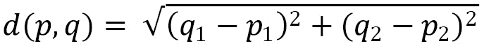

在二维的背景下，这个模型相当简单且易于计算。然而，当给出更多维度时，该模型的复杂性会增加，简单表示如下:

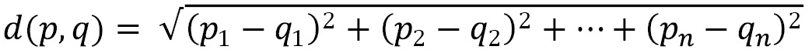

既然我们已经对欧几里德距离的概念有了更好的理解，现在让我们来看看一个叫做 K-Means 的实际应用。

### k 均值聚类

记住欧几里德距离的概念，现在让我们仔细看看如何在 K-Means 的上下文中应用它。K-Means 算法试图通过将样本分成由相等方差组成的 *k* 组并最小化一个**标准**(惯性)来对数据进行聚类。该算法的目标是选择使惯性最小的 *k* 和**质心**。

K-Means 模型非常简单，只需三个简单的步骤，如下图中的星形所示:


图 6.4–K 均值聚类步骤

首先，随机初始化指定数量的 *k* **质心**。第二，由圆圈表示的每个观察值然后基于距离被聚类。然后计算给定聚类中所有观察值的平均值，并将质心移动到该平均值。该过程反复重复，直到基于预定阈值达到收敛。

K-Means 是最常用的聚类算法之一，因为它简单且计算相对容易接受。它适用于高维数据，并且相对容易实现。然而，它确实有其局限性，因为它确实假设聚类是球形的，这经常导致对非球形聚类的数据的错误分组。以另一个数据集为例，其中的聚类不是球形的，而是更像卵形的。应用基于**距离**概念的 **K 均值**模型不会产生最准确的结果，如下图所示:


图 6.5–非球形聚类的 K 均值聚类

当使用非球形集群操作时，基于**距离**的模型的一个好的替代方案是基于统计的方法，例如**高斯混合模型** ( **GMM** )。

### GMMs

在聚类环境中，GMM 是由特定数量的**高斯分布**组成的算法。这些分布中的每一个都代表一个特定的集群。到目前为止，在本书的范围内，我们还没有讨论高斯分布，这是一个在您作为数据科学家的职业生涯中经常听到和遇到的概念。让我们继续定义它。

**高斯分布**可以被认为是一个统计方程，表示围绕平均值对称分布的数据点。你会经常听到这种被称为钟形曲线的分布。我们可以将高斯分布的**概率密度函数**表示如下:

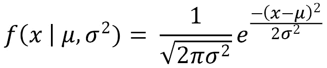

这里，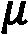表示平均值，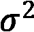表示方差。注意，这个函数代表一个变量。在添加其他变量后，我们将开始进入多元高斯模型的空间，其中 *x* 和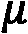代表长度为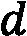的向量。在由 *k* 个聚类组成的数据集中，我们需要混合 *k* 个高斯分布，其中每个分布都有一个均值和方差。这两个值通过一种叫做**期望最大化** ( **EM** )的技术来确定。

我们将把 **EM** 定义为一种算法，当某些数据被认为缺失或不完整时，该算法为给定的模型确定适当的参数。这些缺失或不完整的项目被称为**潜在变量**，在UL 的范围内，我们可以认为实际的集群是未知的。注意，如果聚类是已知的，我们将能够确定均值和方差；然而，我们需要知道均值和方差来确定集群(想想经典的先有鸡还是先有蛋的情况)。我们可以在数据范围内使用 EM 来确定这两个变量的适当值，以最好地拟合模型参数。考虑到这些，我们现在可以更明智地讨论 GMM 了。

我们之前将 GMM 定义为由多个高斯分布组成的模型。我们现在将通过包括以下事实来详细说明该定义:它是由多个高斯分布组成的概率模型，并且通过基于概率而不是距离来确定数据点对给定聚类的成员关系，来利用**软聚类**方法。请注意，这与 K-Means 形成对比，K-Means 利用了一种**硬聚类**方法。使用前面章节中的*图 6.5* 所示的示例数据集，应用 GMM 可能会改善结果，如下所示:


图 6.6–K 均值聚类与 GMM

在这一节中，我们讨论了生物技术领域许多应用中常用的一些最常见的聚类算法。我们看到聚类被应用于生物分子数据、科学文献、制造业甚至肿瘤学等领域，我们将在下面的教程中体验到这一点。

## 教程–通过聚类进行乳腺癌预测

在本教程的课程中，我们将使用我们在 [*第 5 章*](B17761_05_Final_JM_ePub.xhtml#_idTextAnchor082) 、*理解机器学习*中应用的`Wisconsin Breast Cancer`数据集，探索常用聚类算法在癌症分析和预测中的应用。当我们最后一次访问这个数据集时，我们从监督分类器的角度来处理模型的开发，在监督分类器中，我们提前知道我们观察的标签。然而，在大多数真实世界的场景中，提前知道标签的情况很少。**聚类分析**，正如我们将很快看到的，在这些情况下非常有价值，甚至可以用来标记数据，以便稍后在分类器的上下文中使用。在本教程的过程中，我们将使用数据开发我们的模型，但假装我们事先不知道标签。我们将只使用已知的标签来比较我们的模型的结果。考虑到这一点，让我们开始吧！

我们将像之前一样导入数据集并检查形状，如下所示:

```
df = pd.read_csv("../../datasets/dataset_wisc_sd.csv")
print(df.shape)
```

我们注意到这个数据集中有 569 行数据。在我们之前的应用程序中，我们已经清理了数据，以解决丢失和损坏的值。让我们继续清理它们，如下所示:

```
df = df.replace(r'\\n','', regex=True) 
df = df.dropna()
print(df.shape)
```

数据的当前形状由 569 行 32 列组成，这与我们之前的数据集相匹配，现在我们可以继续了。

尽管我们不会使用这些标签来开发任何模型，但让我们快速浏览一下，如下所示:

```
import seaborn as sns
sns.countplot(df['diagnosis']);
```

我们可以在下面的截图中看到，有两类— `M`为恶性，`B`为良性。这两个类并不是完全平衡的，但对于我们的聚类模型来说是可以的:


图 6.7-两个等级的分布

为了使在下面的聚类分析步骤中更容易与这些标签进行比较，让我们将这些标签编码为数值，我们将把`M`转换为`1`，把`B`转换为`0`，如下所示:

```
df['diagnosis'] = df['diagnosis'].map({'M':1,'B':0}) 
```

我们可以使用`df.head()`函数来查看数据集的前几行，并确认`diagnosis`列确实得到了正确的编码。接下来，我们将准备一些选定特征的快速配对图，如下所示:

```
select_feats = ["diagnosis", "radius_mean", "texture_mean", "smoothness_mean"]
sns.pairplot(df[select_feats], hue = 'diagnosis', markers=["s", "o"])
```

我们可以使用`markers`参数来指定两个不同的形状来绘制这两个类，生成以下 pairplot，显示我们的特征的散点图:


图 6.8–选择特征的配对图

我们的第一个目标是查看众多特征，并了解哪两个特征重叠最少或分离程度最好。我们可以看到`smoothness_mean`和`texture_mean`列有很高的重叠度；然而，`radius_mean`和`texture_mean`似乎不太一样。我们可以通过使用`seaborn`库绘制一个散点图来仔细观察这些，如下所示:

```
sns.scatterplot(x="radius_mean", y="texture_mean", hue="diagnosis", style='diagnosis', data=df, markers=["s", "o"])
```

请再次注意，我们可以使用`style`和`markers`参数来调整数据点的形状，从而生成下图作为输出:


图 6.9–显示良好分离的两个特征的散点图

接下来，我们将标准化我们的数据。在统计学中，规范化或标准化可以有多种含义，有时可以互换使用。我们将规范化定义为将值重新调整到[ *0* ， *1* ]的范围内。另一方面，我们将标准化定义为重新调整数据，使平均值为 0，标准偏差值为 1。出于我们当前目标的目的，我们将希望标准化我们的数据，就像我们之前使用`StandardScaler`类所做的那样。回想一下，该类通过移除平均值并缩放至方差来标准化数据集中的要素，可表示如下:

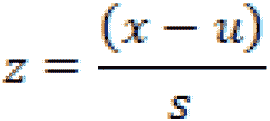

这里，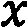是样本的标准分，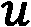是均值，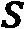是标准差。我们可以通过以下代码在 Python 中应用这一点:

```
from sklearn.preprocessing import StandardScaler
scaler = StandardScaler()
X = df.drop(columns = ["id", "diagnosis"])
y = df.diagnosis.values
X_scaled = pd.DataFrame(scaler.fit_transform(X), columns = X.columns)
```

随着数据集的缩放，我们现在准备开始应用一些模型。我们将从`sklearn`库中的凝聚聚类模型开始。

### 凝聚聚类

回想一下**凝聚**聚类是一种通过递归将聚类合并在一起来形成聚类的方法。让我们继续用我们的数据集实现凝聚聚类算法，如下所示:

1.  首先，我们将从`sklearn`库中导入感兴趣的特定类，然后通过指定我们想要的类的数量并将链接设置为`ward`来创建我们的模型的实例，这是最常用的聚集聚类方法之一。代码如下面的代码片段所示:

    ```
    from sklearn.cluster import AgglomerativeClustering agc = AgglomerativeClustering(n_clusters=2, linkage="ward")
    ```

2.  接下来，我们将使我们的模型适合我们的数据集，并预测它们所属的分类。请注意，在下面的代码片段中，我们使用了`fit_predict()`函数，使用了前两个特性`radius_mean`和`texture_mean`，而不是整个数据集:

    ```
    agc_featAll_pred = agc.fit_predict(X_scaled.iloc[:, :2])
    ```

3.  We can then use `matplotlib` and `seaborn` to generate a diagram showing the actual (`true`) results on the left and predicted agglomerative clustering results on the right, as follows:

    ```
    import matplotlib.pyplot as plt
    import seaborn as sns
    plt.figure(figsize=(20, 5))
    plt.subplot(121)
    plt.title("Actual Results")
    ax = sns.scatterplot(x="radius_mean", y="texture_mean", hue=y, style=y, data=X_scaled, markers=["s", "o"])
    ax.legend(loc="upper right")
    plt.subplot(122)
    plt.title("Agglomerative Clustering")
    ax = sns.scatterplot(x="radius_mean", y="texture_mean", hue=agc_featAll_pred, style=agc_featAll_pred, data=X_scaled, markers=["s", "o"])
    ax.legend(loc="upper right")
    ```

    注意在前面的代码片段中使用了`subplot()`功能，其中值`122`用于将`1`表示为总行数，`2`表示为总列数，`2`表示为绘图的特定索引位置。您可以在这里查看输出:

    

    图 6.10–相对于实际结果的凝聚聚类模型的结果

4.  从最初的估计中，我们看到该模型在区分两个集群方面做了相当合理的工作，对实际的真实结果知之甚少。我们可以使用`sklearn`中的`accuracy_score`方法快速测量它的性能。虽然获得回忆和 f-1 分数的感觉也很重要，但为了简单起见，我们现在将坚持准确性。代码如下面的代码片段所示:

    ```
    from sklearn.metrics import accuracy_score print(accuracy_score(y, agc_featAll_pred)) 0.832740
    ```

总之，仅使用数据集的前两个特征的凝聚聚类模型产生了大约 83%的准确性——这是一个不错的首次尝试！如果您正在使用提供的代码，我会鼓励您尝试添加另一个特性，并用三个、四个或五个特性来装配模型，而不是仅仅两个，看看您是否能够提高性能。更好的是，探索该数据集中提供的其他功能，看看是否可以找到其他提供更好分离并超过我们 83%指标的功能。现在让我们来研究 K-Means 的性能。

### k 均值聚类

现在让我们使用数据集来研究 **K-Means** 聚类的应用。回想一下，K-Means 算法试图通过基于质心的位置将数据划分为 *k 个*簇来对数据进行聚类。我们可以使用以下步骤应用 K-Means 算法:

1.  我们将从从`sklearn`库导入`KMeans`类开始，如下:

    ```
    from sklearn.cluster import KMeans
    ```

2.  接下来，我们可以初始化 K 均值模型的一个实例，并指定聚类数为`2`，迭代次数为`10`，初始化方法为`k-means++`。该初始化设置简单地使用算法选择初始聚类中心，目的是加速收敛。我们可以在称为调整的过程中调整参数，以最大限度地提高模型的性能。代码如下面的代码片段所示:

    ```
    kmc = KuMeans(n_clusters=2, n_init=10, init="k-means++")
    ```

3.  然后，我们可以使用`fit_predict()`方法来拟合我们的数据，并预测每个观察值的聚类。请注意，在下面的代码片段中，模型仅基于前两个特征来拟合和预测结果:

    ```
    kmc_feat2_pred = kmc.fit_predict(X_scaled.iloc[:, :2])
    ```

4.  Finally, we can go ahead and plot the results of our predictions in comparison to the true values of the known classes using the `seaborn` library, as follows:

    ```
    plt.figure(figsize=(20, 5))
    plt.subplot(131)
    plt.title("Actual Results")
    ax = sns.scatterplot(x="radius_mean", y="texture_mean", hue=y, style=y, data=X_scaled, markers=["s", "o"])
    ax.legend(loc="upper right")
    plt.subplot(132)
    plt.title("KMeans Results (Features=2)")
    ax = sns.scatterplot(x="radius_mean", y="texture_mean", hue= kmc_feat2_pred , style= kmc_feat2_pred, data=X_scaled, markers=["s", "o"])
    ax.legend(loc="upper right")
    ```

    执行这段代码后，我们会得到一个散点图，显示我们的结果，如下所示:

    

    ```
    kmc_feat2_pred = kmc.fit_predict(X_scaled.iloc[:, :2])
    kmc_feat3_pred = kmc.fit_predict(X_scaled.iloc[:, :3])
    kmc_feat4_pred = kmc.fit_predict(X_scaled.iloc[:, :4])
    kmc_featall_pred = kmc.fit_predict(X_scaled.iloc[:, :])
    ```

5.  Next, using the `subplot()` methodology, we can generate four plots to illustrate the changes in which each individual subplot represents one of the plots depicted. Here's the code we'll need:

    ```
    plt.figure(figsize=(20, 5))
    plt.subplot(141)
    plt.title("KMeans Results (Features=2)")
    ax = sns.scatterplot(x="radius_mean", y="texture_mean", hue=kmc_feat2_pred, style=kmc_feat2_pred, data=X_scaled, markers=["s", "o"])
    ax.legend(loc="upper right")
    # Apply the same for the other plots
    ```

    执行代码后，我们会生成下图，显示结果:


图 6.12–具有递增特征的 K 均值聚类模型的结果

我们可以计算出仅使用两个特征的准确率约为 86%,而使用三个特征的准确率为 89%。然而，我们会注意到，随着更多特性的加入，这些数字不仅开始趋于平稳，而且当所有特性都被加入时，这些数字还会下降，从而产生 82%的较低准确率。请注意，当我们开始向模型添加更多功能时，我们正在添加更多维度。例如，对于三个特征，我们现在使用一个**三维** ( **3D** )模型，如两个数据集之间的混合边界所示。在某些情况下，我们拥有的功能越多，给定模型带来的压力就越大。这与被称为**维度诅咒** ( **COD** )的概念相接近，因为给定更多维度，空间的体积开始以令人难以置信的速度增加，这会影响模型的性能。我们将会谈到一些我们将来可以补救的方法，特别是在下面的教程中，当我们开始讨论 **DR** 的时候。

总之，我们能够在我们的数据集上应用 K-Means 模型，并且能够使用前三个特征产生 89%的相当高的准确度。现在让我们继续探索统计方法的应用，如 GMM。

### GMMs

现在让我们探索一下 GMM **s** 在我们数据集上的应用。回想一下，这些模型代表了概率分布的混合，并且观察值对聚类的隶属度是基于该概率而不是欧几里德距离来计算的。记住这一点，让我们开始吧，如下所示:

1.  我们可以从从`sklearn`库导入`GaussianMixture`类开始，就像这样:

    ```
    from sklearn.mixture import GaussianMixture
    ```

2.  接下来，我们将创建模型的一个实例，并将组件的数量指定为`2`，并将协方差类型设置为`full`，这样每个组件都有自己的协方差矩阵，如下:

    ```
    gmm = GaussianMixture(n_components=2, covariance_type="full")
    ```

3.  然后，我们将使用我们的数据来拟合数据模型，再次仅使用前两个特征，并预测每个观察值的聚类，如下所示:

    ```
    gmm_featAll_pred = 1-gmm.fit_predict(X_scaled.iloc[:, :2])
    ```

4.  Finally, we can go ahead and plot the results using the `seaborn` library, as follows:

    ```
    plt.figure(figsize=(20, 5))
    plt.subplot(131)
    plt.title("Actual Results")
    ax = sns.scatterplot(x="radius_mean", y="texture_mean", hue=y, style=y, data=X_scaled, markers=["s", "o"])
    ax.legend(loc="upper right")
    plt.subplot(132)
    plt.title("Gaussian Mixture Results (Features=All)")
    ax = sns.scatterplot(x="radius_mean", y="texture_mean", hue=gmm_featAll_pred, style=gmm_featAll_pred, data=X_scaled, markers=["s", "o"])
    ax.legend(loc="upper right")
    ```

    在执行我们的代码时，我们产生了以下输出，显示了数据集相对于我们预测的结果的实际结果:


图 6.13–相对于实际结果的 GMM 结果

我们可以再次看到，在高斯模型中，这两个类别之间的边界非常明确，实际结果显示，在高斯模型中几乎没有混合，因此精确度约为 85%。然而，请注意，相对于 K-Means 模型，GMM 预测了蓝色的密集圆形分布，橙色类的一些成员以非常非圆形的方式围绕它。

与之前的模型类似，我们可以再次向该模型添加一些更多的功能，以进一步提高性能。然而，我们在下面的屏幕截图中看到，尽管从左到右添加了更多的功能，但模型并没有改善，预测能力开始受到影响:


图 6.14–功能不断增加的 GMM 的结果

总之，在本教程的课程中，我们研究了在假设没有标签的情况下，使用聚类分析来开发数据集的各种预测模型。在整个教程中，我们研究了三种最常见的聚类模型的使用:`Wisconsin Breast Cancer`数据集。我们确定，使用三个特征的 K-Means 模型相对于其他模型表现出最佳性能，其中一些将数据集作为一个整体使用。我们可以推测，当谈到预测能力时，所有的特征都有一定程度的重要性；然而，模型中包含的所有特性都显示出性能下降。在下一节中，我们将研究一些与 **DR** 相关的缓解方法。

# 了解博士

我们将要讨论的第二类 **UL** 被称为**博士**。顾名思义，这些只是用来减少给定数据集中维数的简单方法。例如，一个具有 100 列左右的高功能数据集，可以使用灾难恢复算法来帮助将列数减少到大约 5 列，同时保留最初 100 列中每一列包含的值。您可以将灾难恢复视为以水平方式压缩数据集的过程。生成的列通常可分为两种类型:新特征，即在称为**特征工程** ( **FE** )的过程中生成具有新数值的新列；或者旧特征，即在称为**特征选择**的过程中仅保留最有用的列。在下一节的课程中，在 UL 的范围内，我们将更多地关注 FE 的方面，因为我们创建了代表许多其他特性的简化版本的新特性。我们可以在这里看到这个概念的图示:


图 6.15–灾难恢复的图形表示

我们可以使用许多不同的方法来实现灾难恢复，每种方法都有自己的过程和基本理论；然而，在我们开始实施这些之前，有一个非常重要的概念我们需要解决。你现在可能想知道为什么 DR 很重要。为什么一个数据科学家会在另一个数据科学家或数据工程师费尽周折构建了一个全面而丰富的数据集之后删除功能？这个问题有三个答案，如下所示:

*   我们不一定要从给定的数据集中消除任何数据，而是从不同的窗口探索我们的数据，这可能会提供一些新的见解，而这些见解是我们使用原始数据集所看不到的。
*   开发具有许多特征的模型是一个计算量很大的过程，因此使用较少的特征来训练我们的模型的能力总是更快、计算量更小并且更有利。
*   The use of DR can help reduce noise within the dataset to further improve clustering models and data visualizations.

    有了这些答案，现在让我们继续讨论一个你会在很多会议、讨论和采访中听到的概念 COD。

## 避开鳕鱼

COD 被认为是处理高维数据集时出现的一种普遍现象——这个术语最初是由理查德·e·贝尔曼提出的。本质上，COD 指的是高维数据集出现的问题，这些问题在相似大小的低维数据集中不会出现。随着给定数据集中要素数量的增加，样本总数也会相应增加。例如，一些数据集包含一个维度。在这个数据集中，我们假设需要检查总共 10 个区域。如果我们增加第二维度，我们现在需要检查总共 100 个区域。最后，如果我们增加第三个维度，我们现在需要检查总共 1000 个区域。回想一下我们到目前为止处理的一些数据集，它们远远超过 1000 行，至少有 10 列，这样的数据集的复杂性可能会增长得非常快。这里的要点是，特性增长对模型的开发有很大的影响。我们可以在这里看到一个图解:


图 6.16–COD 的图示

随着**特征**的数量开始增加，ML 模型的整体**复杂性**也开始增加，这可能会产生许多负面影响，如过度拟合，从而导致较差的**性能**。减少数据集维度的主要动机之一是确保避免过度拟合，从而产生更健壮的模型。我们可以在这里看到一个图解:


图 6.17–更高维度对模型性能的影响

在生命科学和生物技术领域，将数据集从高维数据缩减到低维数据的必要性尤为突出。纵观科学家和工程师在该领域面临的许多过程，通常有数百个与任何给定过程相关的特征。无论我们是在寻找与蛋白质结构、单克隆抗体效价、小分子停靠位点选择、**双特异性 T 细胞接合子** ( **咬合**)药物设计相关的数据集，还是与**自然语言处理** ( **NLP** )相关的数据集，特征约简总是有用的，并且在许多情况下是开发良好的 ML 模型所必需的。

现在我们已经对灾难恢复有了更好的理解，因为它与 COD 的概念以及这些方法可以带来的许多好处有关，现在让我们继续看一看在这个领域我们应该知道的几个最常见的模型。

## 教程–探索灾难恢复模型

我们可以根据类型、功能或结果等，以多种不同的方式对众多维度算法进行分类。但是，为了在本章的几页中更好地了解灾难恢复，我们将把我们的模型分为线性或非线性两种。线性和非线性模型是两种不同类型的数据转换。我们可以将数据转换视为以某种方式改变或重塑数据的方法。我们可以粗略地将线性方法定义为模型的输出与其输入成比例的转换。举个例子， *p* 和 *q* 是两个数学向量。

当满足以下条件时，我们可以认为变换是线性的:

*   将 *p* 的变换乘以一个标量，其结果与将 *p* 乘以该标量然后应用该变换相同。
*   *p* + *q* 的变换与*p*+q 的变换相同。

如果一个模型不满足这两个属性，它被认为是一个非线性模型。许多不同的模型都属于这两个类别的范围；然而，出于本章的目的，我们将看一看近年来在数据科学社区中颇为流行的四个主要模型。我们可以在这里看到一个图解:


图 6.18–灾难恢复每个领域的两个模型示例

在线性方法的范围内，我们将仔细看看 **PCA** 和**奇异值分解** ( **SVD** )。此外，在非线性方法的范围内，我们将仔细研究**t-分布随机邻居嵌入** ( **t-SNE** )和**一致流形逼近和投影** ( **UMAP** )。记住这四个模型以及它们如何融入灾难恢复的宏伟计划，让我们开始吧。

### 主成分分析

最常见和最广泛讨论的 UL 形式之一是 **PCA** 。PCA 是 DR 的线性形式，允许用户将大量相关特征的数据集转换为少量不相关的特征，称为主成分。这些**主成分**，虽然在数量上少于它们的原始特征，但仍然可以保留与原始数据集一样多的变化或丰富度*。我们可以在这里看到一个图解:*


图 6.19-PCA 及其主要成分的图示

为了在任何给定的数据集上有效地实现 PCA，需要做一些事情。让我们概括一下这些步骤是什么，以及它们如何影响最终结果。我们必须首先将我们的数据标准化或规范化，以确保平均值为 0，标准差为 1。接下来，我们计算所谓的**协方差矩阵**，它是一个包含每对元素之间的协方差的方阵。在**二维** ( **2D** )数据集中，我们可以这样表示协方差矩阵:

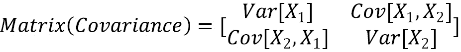

接下来，我们可以计算协方差矩阵的**特征值**和**特征向量**，如下所示:

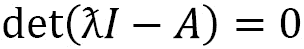

这里， *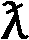* 是给定矩阵 *A* 的特征值， *I* 是单位矩阵。使用特征向量，我们可以使用以下等式确定特征值 *v* :

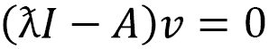

接下来，特征值从最大到最小排序，按重要性顺序表示分量。具有 *n* 个变量或特征的数据集将具有 *n* 个特征值和特征向量。然后，我们可以将特征值或向量的数量限制在预定的数量，从而减少数据集的维度。然后，我们可以利用感兴趣的特征向量，形成我们所说的特征向量。

最后，我们可以使用特征向量的**转置**以及原始数据集的缩放数据的转置，并将两者相乘来形成**主分量**，如下所示:

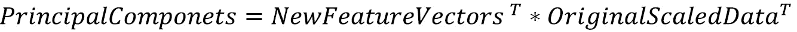

这里， *PrincipalComponents* 作为一个矩阵返回。很简单，对吧？

现在让我们继续使用 Python 实现 PCA，如下所示:

1.  First, we import PCA from the `sklearn` library and instantiate a new PCA model. We can set the number of components as `2`, representing the fact that we only want two components returned to us, and use `full` for `svd_solver`. We can then fit the data on our scaled dataset, as follows:

    ```
    from sklearn.decomposition import PCA
    ```

    ```
    pca_2d = PCA(n_components=2, svd_solver='full') pca_2d.fit(X_scaled)
    ```

2.  Next, we can transform our data and assign our output matrix to the `data_pca_2d` variable, as follows:

    ```
    data_pca_2d = pca_2d.fit_transform(X_scaled)
    ```

3.  Finally, we can go ahead and plot the results using `seaborn`, as follows:

    ```
    plt.xlabel("Principal Component 1") plt.ylabel("Principal Component 2") sns.scatterplot(x=data_pca_2d[:,0], y=data_pca_2d[:,1], hue=y, style=y, markers=["s", "o"])
    ```

    Upon executing this code, this will yield a scatter plot showing our principal components with our points colored using `y`, as shown here:


Figure 6.20 – Scatter plot of the PCA results

PCA is a fast and efficient method best used as a precursor to the development of ML models when the number of dimensions has become too complex. Think back for a moment to the dataset we used in our clustering analysis relating to breast cancer predictions. Instead of running our models on the raw or scaled data, we could implement a DR algorithm such as PCA to reduce our dimensions down only two principal components before applying the subsequent clustering model. Remember that PCA is only one of many linear models. Let's now go ahead and explore another popular linear model known as SVD.

### SVD

**SVD** is a popular **matrix decomposition** method commonly used to reduce a dataset to a simpler form. In this section, we will focus specifically on the application of truncated SVD. This model is quite similar to that of PCA; however, the main difference is that the estimator does not center prior to its computation. Essentially, this difference allows the model to be used with sparse matrices quite efficiently.

Let's now introduce and take a look at a new dataset that we can use to apply SVD: *single-cell RNA* (where **RNA** stands for **ribonucleic acid**). The dataset can be found at [http://blood.stemcells.cam.ac.uk/data/nestorowa_corrected_log2_transformed_counts.txt](http://blood.stemcells.cam.ac.uk/data/nestorowa_corrected_log2_transformed_counts.txt). This dataset pertains to the topic of single-cell sequencing—a process that examines sequences of individual cells to better understand their properties and functions. Datasets such as these tend to have many columns of data, making them prime candidates for DR models. Let's go ahead and import this dataset, as follows:

```
dfx = pd.read_csv("../../datasets/single_cell_rna/nestorowa_corrected_log2_transformed_counts.txt", sep=' ',  ) dfx.shape
```

Taking a look at the shape, we can see that there are 3,991 rows of data and 1,645 columns. Relative to the many other datasets we have used, this number is quite large. Within the field of biotechnology, DR is very commonly used to help reduce such datasets into more manageable entities. Notice that the index contains some information about the type of cell we are looking at. To make our visuals more interesting, let's capture this annotation data by executing the following code:

```
dfy = pd.DataFrame() dfy['annotation'] = dfx.index.str[:4] dfy['annotation'].value_counts()
```

With the data all set, let's go ahead and implement truncated SVD on this dataset. We can once again begin by instantiating a truncated SVD model and setting the components to `2` with `7` iterations, as follows:

```
from sklearn.decomposition import TruncatedSVD svd_2d = TruncatedSVD(n_components=2, n_iter=7)
```

Next, we can go ahead and use the `fit_transform()` method to both fit our data and transform the DataFrame to a two-column dataset, as follows:

```
data_svd_2d = svd_2d.fit_transform(dfx)
```

Finally, we can finish things up by plotting our dataset using a scatter plot, and color by annotation. The code is illustrated in the following snippet:

```
sns.scatterplot(x=data_svd_2d[:,0], y=data_svd_2d[:,1], hue=dfy.annotation, style=dfy.annotation, markers = ["o", "s", "v"])
```

We can see the results of executing this code in the following screenshot:


Figure 6.21 – Scatter plot of the results of the SVD model

In the preceding screenshot, we can see the almost 1,400 columns worth of data being reduced to a simple 2D representation—quite fascinating, isn't it? One of the biggest advantages of being able to reduce data in this fashion is that it assists with model development. Let's assume, for the sake of example, that we wish to implement any of our previous clustering algorithms on this extensive dataset. It would take considerably longer to train any given model on a dataset of nearly 1,400 columns compared to a dataset with 2 columns. In fact, if we implemented a GMM on this dataset, the total training time would be **12.4 s ± 158 ms** using the original dataset, relative to **4.06 ms ± 26.6 ms** using the reduced dataset. Although linear models can be very useful when it comes to DR, non-linear models can also be similarly impressive. Next, let's take a look at a popular model known as t-SNE.

### t-SNE

On the side of non-linear DR, one of the most popular models commonly seen in action is **t-SNE**. One of the unique features of the t-SNE model relative to the other dimensionality models we have talked about is the fact that it uses probability distribution to represent similarities between neighbors. Simply stated, t-SNE is a statistical method allowing for the DR and visualization of high-dimensional data in which similar points are close together and dissimilar ones are further apart.

t-SNE is a type of **manifold** model, which from a mathematical perspective is a topological space resembling **Euclidean** space. The concept of a manifold is complex, extensive, and well beyond the scope of this book. For the purposes of simplicity, we will state that manifolds describe a large number of geometric surfaces such as a sphere, torus, or cross surface. Within the confines of the t-SNE model, the main objective is to use geometric shapes to give users a feel or intuition of how the high-dimensional data is arranged or organized.

Let's now take a close look at the application of t-SNE using Python. Once again, we can apply this model on our single-cell RNA dataset and get a sense of what the high-dimensional organization of this data looks like from a geometric perspective. Many parameters within t-SNE can be changed and tuned to fit given purposes; however, there is one in particular worth mentioning briefly—perplexity. `scikit-learn` library recommends considering values between 5 and 50\. Let's go ahead and take a look at a few examples.

Implementing this model is quite simple, thanks to the high-level `scikit-learn`. We can begin by importing the `TSNE` class from `scikit-learn` and setting the number of components to `2` and the perplexity to `10`. We can then chain the `fit_transform()` method using our dataset, as illustrated in the following code snippet:

```
from sklearn.manifold import TSNE data_tsne_2d_p10 = TSNE(n_components=2, perplexity=10.0).fit_transform(dfx)
```

We can then go ahead and plot our data to visualize the results using `seaborn`, as follows:

```
sns.scatterplot(x=data_tsne_2d_p10[:,0], y=data_tsne_2d_p10[:,1], hue=dfy.annotation, style=dfy.annotation, markers = ["o", "s", "v"])
```

We can see the output of this in the following screenshot:


Figure 6.22 – Scatter plot of the results of the t-SNE model

Quite the result! We can see in the preceding screenshot that the model, without any knowledge of the labels, made a 2D projection of the relationship between the data points using the huge dataset it was given. The geometric shape produced gives us a sense of the *look* and *feel* of the data. We can see based on this depiction that a few points seem to be considered outliers as they are depicted much further away, like islands relative to the main continent. Recall that we used a perplexity value of `10` for this particular diagram. Let's go ahead and explore this parameter using a few different values, as follows:

```
data_tsne_2d_p1 = TSNE(n_components=2, perplexity=1.0).fit_transform(dfx) data_tsne_2d_p10 = TSNE(n_components=2, perplexity=10.0).fit_transform(dfx) data_tsne_2d_p30 = TSNE(n_components=2, perplexity=30.0).fit_transform(dfx)
```

Using these calculated values, we can visualize them next to each other using the `seaborn` library, as follows:


Figure 6.23 – Scatter plots of the t-SNE model with increasing perplexities

When it comes to high-dimensional data, t-SNE is one of the most commonly used models to not only reduce your dimensions but also explore your data by getting a unique feel for its features and their relationships. Although t-SNE can be useful and effective, it does have a few negative aspects. First, it does not scale well for large sample sizes such as those you would see in some cases of RNA sequencing data. Second, it also does not preserve global data structures in the sense that similarities across different clusters are not well maintained. Another popular model that attempts to address some of these concerns and utilizes a similar approach to t-SNE is known as UMAP. Let's explore this model in the following section.

### UMAP

The **UMAP** model is a popular algorithm used for the reduction of dimensions and visualizing of data based on manifold learning techniques, similar to that of t-SNE. There are three main assumptions that the algorithm is founded on, as described on their main website ([https://umap-learn.readthedocs.io/en/latest](https://umap-learn.readthedocs.io/en/latest)) and outlined here:

*   The dataset is uniformly distributed on a Riemannian manifold.
*   The Riemannian metric is locally constant.
*   The manifold is locally connected.

Although UMAP and t-SNE are quite similar, there are a few key differences between them. One of the most important differences relates to the idea of similarity preservation. The UMAP model claims to preserve both local and global data in the sense that both local and global—or inter-cluster and intra-cluster—information is maintained. We can see a graphical representation of this concept here:


Figure 6.24 – Graphical representation of local and global similarities

Let's now go ahead and apply UMAP on our single-cell RNA dataset. We can begin by importing the `umap` library and instantiating a new instance of the UMAP model in which we specify the number of components as `2` and the number of neighbors as `5`. This second parameter represents the size of a local **neighborhood** used for manifold approximation. The code is illustrated in the following snippet:

```
import umap data_umap_2d_n5 = umap.UMAP(n_components=2, n_neighbors=5).fit_transform(dfx)
```

We can then go ahead and plot the data using `seaborn`, as follows:

```
sns.scatterplot(x=data_umap_2d_n5[:,0], y=data_umap_2d_n5[:,1], hue=dfy.annotation, style=dfy.annotation, markers = ["o", "s", "v"])
```

Upon executing the code, we yield the following output:


Figure 6.25 – Scatter plot of the UMAP results

Once again, quite the visual! We can see in this depiction relative to t-SNE that some clusters have moved around. If you recall in t-SNE, the majority of the data was pulled together with no regard as to how similar clusters were to one another. Using UMAP, this information is preserved, and we are able to get a better sense of how these clusters relate to one another. Notice the spread of the data relative to its depiction in t-SNE. Similar to t-SNE, we can see that some *groups* of points are clustered together in different neighborhoods.

In summary, UMAP is a powerful model similar to t-SNE in which both local and global information is preserved when it comes to neighborhoods or clusters. Most commonly used for visualizations, this model is an excellent way to gain a sense of the *look* and *feel* of any high-dimensional dataset in just a few lines of code.

# Summary

Over the course of this chapter, we gained a strong and high-level understanding of the field of UL, its uses, and its applications. We then explored a few of the most popular ML methods as they relate to clustering and DR. Within the field of clustering, we looked over some of the most commonly used models such as hierarchical clustering, K-Means clustering, and GMMs. We learned about the differences between Euclidean distances and probabilities and how they relate to model predictions. In addition, we also applied these models to the `Wisconsin Breast Cancer` dataset and managed to achieve relatively high accuracy in a few of them. Within the field of DR, we gained a strong understanding of the significance of the field as it relates to the COD. We then implemented a number of models such as PCA, SVD, t-SNE, and UMAP using the *single-cell RNA* dataset in which we managed to reduce more than 1,400 columns down to 2\. We then visualized our results using `seaborn` and examined the differences between the models. Over the course of this chapter, we managed to develop our models without the use of labels, which we used only for comparison after the development process.

Over the course of the next chapter, we will explore the field of SML, in which we use data in addition to its labels to develop powerful predictive models.