<title>B17761_07_Final_JM_ePub</title> 

# 第七章:监督机器学习

随着您开始在数据科学领域发展您的职业生涯和技能，您将会遇到许多不同类型的模型，这些模型属于有监督或无监督学习这两个类别之一。回想一下，在无监督学习的应用中，模型通常被训练成聚类或转换数据，以便在给定数据集的标签不可用时对数据进行分组或整形，从而提取洞察力。在本章中，我们现在将讨论**监督学习**的应用，因为它们应用于分类和回归领域，以开发强大的预测模型来对数据集的标签进行有根据的猜测。

在本章中，我们将讨论以下主题:

*   了解监督学习
*   衡量监督机器学习的成功
*   理解监督机器学习中的分类
*   理解监督机器学习中的回归

考虑到我们的目标，现在让我们开始吧。

# 了解监督学习

当你开始独自或在组织内探索数据科学时，你会经常被问到这个问题，*有监督的机器学习到底是什么意思？让我们来想出一个定义。我们可以将监督学习定义为机器学习的一般子集，其中数据(如其相关标签)用于训练模型，这些模型可以从数据中学习或归纳，以做出预测，最好具有高度的确定性。回想一下 [*第 5 章*](B17761_05_Final_JM_ePub.xhtml#_idTextAnchor082) ，*机器学习简介*，我们可以回忆起我们完成的关于乳腺癌数据集的例子，其中我们将肿瘤分类为恶性或良性。这个例子，以及我们创建的定义，是学习和理解监督学习背后的意义的一个很好的方式。*

现在我们脑海中有了监督机器学习的定义，让我们继续讨论它的不同子类型，即分类和回归。如果你还记得，机器学习范围内的**分类**是预测给定数据集的**类别**的行为，例如将肿瘤分类为恶性或良性，将电子邮件分类为垃圾邮件或非垃圾邮件，甚至将蛋白质分类为α或β。在每一种情况下，模型都将输出一个**离散**值。另一方面，**是使用一组给定的数据对**精确值**的预测，例如小分子的亲脂性，单克隆抗体**的等电点** ( **mAb** )，或者 LCMS 峰的 LCAP。在这些情况的每一个中，模型将输出一个**连续的**值。**

 **在这两类监督学习中存在许多不同的模型。在本书的范围内，我们将分别关注这两个类别的四个主要型号。当谈到分类时，我们将讨论**K-最近邻**(**KNN**)**支持向量机** ( **支持向量机**)**d****决策树**，**随机森林**，以及 XGBoost 分类。当到了回归时，我们将讨论**线性回归**、**逻辑回归**、**随机森林回归**、甚至**梯度推进回归**。我们可以在图 7.1 中看到这些描述:


图 7.1–监督机器学习的两个领域

我们在每个模型中的主要目标是为特定数据集训练该模型的新实例。我们将**用数据来拟合**我们的模型，然后**调整**或调整参数来给我们最好的结果。为了确定什么是最好的结果，我们需要知道如何在我们的模型中衡量成功。我们将在下一节中了解这一点。

# 衡量监督机器学习的成功

当我们开始训练我们的监督分类器和回归器时，我们将需要实施一些方法来确定哪些模型表现更好，从而使我们能够有效地调整模型的参数并最大限度地提高其性能。实现这一点的最好方法是在投入模型开发过程之前，提前了解成功是什么样子的。根据不同的情况，衡量成功有许多不同的方法。例如，准确度可能是分类器的一个很好的度量，但不是回归器。类似地，一个分类器的商业案例可能不一定要求准确性是感兴趣的主要度量。这完全取决于手头的情况。让我们来看看用于分类**和回归**的每个领域的一些最常见的度量。****

****

图 7.2–回归和分类的常见成功指标

虽然对于给定的场景，您可以使用许多其他指标，但是*图 7.2* 中列出的八个指标是您可能会遇到的最常见的一些指标。选择给定的指标可能很困难，因为它应该始终与给定的用例保持一致。当谈到分类时，让我们继续探讨这个问题。

## 用分类器衡量成功

举个例子，我们到目前为止处理的肿瘤数据集。我们将我们的成功指标定义为准确性，因此最大化准确性是我们模型的主要训练目标。然而，情况并非总是如此，您选择使用的成功度量标准几乎总是取决于模型和手头的业务问题。让我们继续深入了解数据科学领域常用的一些指标，并对它们进行定义:

*   **精度**:与接受值非常接近的测量值
*   **精度**:与其他测量值一致的测量值，因为它们彼此相似

考虑准确性和精确性的一个更简单的方法是用牛眼图描绘显示的结果。精度和准确度之间的区别在于结果彼此之间有多接近，以及结果分别与它们的真实值或实际值有多接近。我们可以在*图 7.3* 中看到对此的直观描述:


图 7.3-准确度和精密度之间差异的图示

除了可视化描述，我们还可以将精度视为一种计算，将结果表示为相对于总体的子集。在这种情况下，我们还需要定义一个叫做**召回**的新指标。我们可以通过所谓的**混淆矩阵**在正面和负面结果的上下文中数学地思考召回率和精确度。当将预测结果与实际结果进行比较时，我们可以通过比较这些值来很好地了解模型的性能。我们可以在*图 7.4* 中看到对此的直观描述:


图 7.4-混淆矩阵的图解

记住这个表，我们可以将**召回**定义为给定模型识别的欺诈案例的比例，或者从数学角度来看，我们可以定义如下:


而我们可以在相同的上下文中定义**精度**如下:

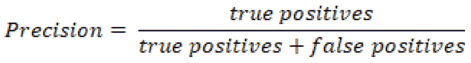

我们可以在下图中以类似的方式直观显示准确度、精确度和召回率，其中每个指标代表总体结果的特定计算:


图 7.5–解释准确度、精密度和召回率的图解

最后，还有最后一个常用的指标，通常被认为是精确度和召回率的松散组合*被称为 **F1 分数**。我们可以将 *F1 分数*定义如下:*

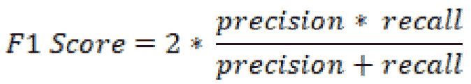

那么你如何决定使用哪个指标呢？没有你应该一直使用的最佳指标，因为它高度依赖于每种情况。在确定最佳指标时，你应该经常问自己，*这个模型以及业务的主要目标是什么？在模型的眼中，准确性可能是最好的度量。另一方面，在企业看来，召回可能是最好的衡量标准。*

最终，当被忽略的病例(上面定义为假阴性)更重要时，回忆可能被认为更有用。例如，考虑一个预测病人诊断的模型——我们可能更关心假阴性而不是假阳性。另一方面，当误报对我们来说代价更高时，精确度可能更重要。这完全取决于给定的业务案例和需求。到目前为止，我们已经研究了与分类相关的成功，所以现在让我们研究与回归相关的这些想法。

## 用回归变量衡量成功

虽然我们还没有深入到回归领域，但是我们已经将的主要思想定义为开发一个输出为连续数值的模型。例如，分子毒性数据集包含许多列数据，它们的值都是连续的浮点数。假设，你可以使用这个数据集来预测**的极地总表面积** ( **TPSA** )。在这种情况下，准确度、精确度和召回率对于我们最好地理解我们的模型的性能不是最有用的。或者，我们将需要一些更好地迎合连续值的度量。

在许多模型(不一定是机器学习)中，定义成功的最常见指标之一是**皮尔逊相关系数**，也称为 **R2** 。该计算是用于测量数据线性的常用方法，因为它代表因变量中方差的比例。我们可以将 **R2** 定义如下:

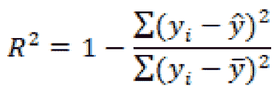

在这个等式中，是预测值，是平均值。

以一个数据集为例，其中的实验(实际)值是已知的，而预测值是计算出来的。我们可以绘制这些值相对于彼此的图表，并测量相关性。理论上，完美的模型应该具有理想的相关性(尽可能接近 1.00 的值)。我们可以在*图 7.6* 中看到高低相关性的描述:


图 7.6–散点图中高低相关性之间的差异

尽管这一指标可以很好地评估模型的性能，但还有一些其他指标可以让您更好地了解模型的误差:**平均绝对误差** ( **梅伊**)、**均方误差** ( **MSE** )和**均方根误差** ( **RMSE** )。让我们继续定义这些:

*   **MAE**: The average of the absolute differences between the actual and predicted values in a given dataset. This measure tends to be more robust when handling datasets with outliers: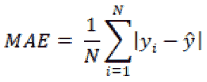

    其中为预测值，为平均值。

*   **MSE** :给定数据集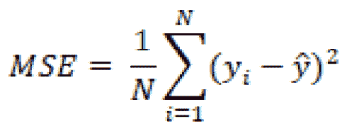中实际值与预测值的均方差
*   **RMSE** :测量值的标准差的 MSE 的平方根。这个指标通常用于比较回归模型: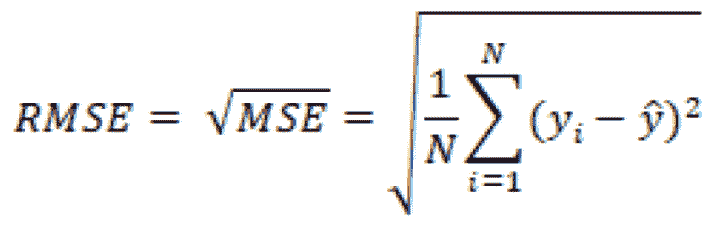

说到回归，根据给定的情况，您可以使用许多不同的度量标准。在大多数回归模型中，RMSE 通常用于比较多个模型的性能，因为它计算简单且可微分。另一方面，带有异常值的数据集通常使用 MSE 和 MAE 进行相互比较。现在，我们已经对通过各种度量来衡量成功有了更好的认识，让我们继续探索分类领域。

# 理解监督机器学习中的分类

机器学习的环境中的分类模型是受监督的模型，其目标是基于先前学习的示例对项目进行分类或归类。您会遇到多种形式的分类模型，因为它们往往是数据科学领域中最常用的一些模型。基于模型的输出，我们可以开发三种主要类型的分类器。


图 7.7–监督分类的三种类型

第一种类型被称为**二元分类器**。顾名思义，这是一个分类器，它以二元方式进行预测，即输出是两个选项中的一个，如电子邮件是垃圾邮件还是非垃圾邮件，分子是有毒还是无毒。在这两种情况下都没有第三种选择，从而使模型成为二元分类器。

第二种类型的分类器称为**多类分类器**。这种类型的分类器在多于两个不同的输出上被训练。例如许多类型的蛋白质可以根据结构和功能进行分类。这些例子包括结构蛋白、酶、激素、储存蛋白和毒素。开发一个基于蛋白质的一些特征来预测蛋白质类型的模型将被视为多类分类器，因为每行数据可能只有一个可能的类或输出。

最后，我们还有**多标签分类器**。这些分类器与它们的多类不同，能够预测给定数据行的多个输出。例如，在为临床试验筛选患者时，您可能希望使用许多不同类型的标签来构建患者档案，如性别、年龄、糖尿病状态和吸烟状态。当试图预测某一组患者的长相时，我们需要能够预测所有这些标签。

现在我们已经将分类分解成一些不同的类型，您可能会想到您正在处理的项目中的许多不同领域，其中分类器可能有很大的价值。这里的好消息是，我们将要探索的许多标准或流行的分类模型可以很容易地被回收并适合新数据。当我们在下一节开始探索许多不同的模型时，请思考您正在处理的项目和您可用的数据集，以及它们可能最适合的模型。

## 探索不同的分类模式

当我们探索许多机器学习模型时，我们将在关于*单细胞 RNA 序列*的新数据集上测试它们的性能，该数据集由 *Nestorowa 等人*于 2016 年发表。我们将专注于使用这个结构化数据集来开发许多不同的分类器。让我们继续导入数据，并为分类模型做准备。首先，我们将使用`pandas`中的`read_csv()`函数导入我们感兴趣的数据集:

```
dfx = pd.read_csv("../../datasets/single_cell_rna/nestorowa_corrected_log2_transformed_counts.txt", sep=' ',  )
```

接下来，我们将使用索引来隔离每行的标签(类)，使用每行的前四个字符:

```
dfx['annotation'] = dfx.index.str[:4]
y = dfx["annotation"].values.ravel()
```

我们可以使用`head()`功能来查看数据。我们将注意到有超过 3992 列的数据。正如任何优秀的数据科学家都知道的那样，开发具有太多列的模型将导致许多低效，因此最好使用无人监管的学习技术来减少这些低效，例如`sklearn`中的`StandardScaler`类:

```
from sklearn.preprocessing import StandardScaler
scaler = StandardScaler()
X_scaled = scaler.fit_transform(dfx.drop(columns = ["annotation"]))
```

接下来，我们可以应用 PCA 将数据集从 3，992 列减少到 15 列:

```
from sklearn.decomposition import PCA
pca = PCA(n_components=15, svd_solver='full')
pca.fit(X_scaled)
data_pca = pca.fit_transform(X_scaled)
```

现在数据处于更加简化的状态，我们可以检查**解释的方差比**以查看它与原始数据集相比如何。我们会看到所有列的总和为 0.17，相对较低。我们希望目标值在 0.8 左右，因此让我们继续增加总列数，以增加方差百分比:

```
pca = PCA(n_components=900, svd_solver='full')
pca.fit(X_scaled)
data_pca = pca.fit_transform(X_scaled)
```

通过应用 PCA 模型，我们成功地将总列数减少了大约 77%。

完成后，我们现在准备使用`train_test_split()`类分割数据集:

```
from sklearn.model_selection import train_test_split
X_train, X_test, y_train, y_test = train_test_split(data_pca, y, test_size=0.33)
```

随着数据集现在被分成训练集和测试集，我们现在准备开始分类模型开发过程！

### k-最近邻

经典的、易于开发的、也是最常讨论的分类模型之一被称为 KNN 模型，由伊夫林·菲克斯和约瑟夫·霍奇斯于 1951 年首次开发。该模型背后的主要思想是基于与最近邻居的接近程度来确定类成员。以为例，一个 2D **二进制**数据集，其中的项目被分类为 A 或 b。随着新数据集的添加，模型将根据其与同一数据集中其他项目的接近程度(通常为**欧几里德**)来确定其成员资格或类别。


图 7.8-KNN 模型的图示

鉴于其简单的性质和巧妙的设计，KNN 被视为最容易开发和实现的机器学习模型之一。该模型虽然应用简单，但确实需要一些调整才能完全有效。让我们继续探索这个模型在单细胞 RNA 分类数据集上的应用:

1.  我们可以从从`sklearn` :

    ```
    from sklearn.neighbors import KNeighborsClassifier
    ```

    进口`KNeighborsClassifier`型号开始
2.  接下来，我们可以用 Python 实例化这个模型的一个新实例，邻居的数量为值`5`，并使模型适合我们的训练数据:

    ```
    knn = KNeighborsClassifier(n_neighbours=5) knn.fit(X_train, y_train)
    ```

3.  With the model fit, we can now go ahead and predict the outcomes of the model and set those to a variable we will call `y_pred`, and finally use the `classification_report` function to see the results:

    ```
    y_pred = knn.predict(X_test)
    print(classification_report(y_test, y_pred))
    ```

    使用分类报告功能，我们可以了解三个类的精确度、召回率和`F1`分数。我们可以看到,`LT.H`类的精度相对较高，但其他两个稍低。或者，`recall`对于`LT.H`类来说非常低，但是对于`Prog`类来说非常高。总的来说，该模型的平均精度为`0.63`:

    

    图 7.9-KNN 模型的结果

    记住这些结果，让我们继续调整其中一个参数，即在`1` - `10`范围内的`n_neighbours`参数。

4.  We can use a simple `for` loop to accomplish this:

    ```
    for i in range(1,10):
        knn = KNeighborsClassifier(n_neighbors=i)
        knn.fit(X_train, y_train)
        y_pred = knn.predict(X_test)
        print("n =", i, "acc =", accuracy_score(y_test, y_pred))
    ```

    如果我们看一下结果，我们可以看到`neighbors`和的数量以及总的模型精度。很快，我们注意到仅基于这个指标的选项值是`n=2`，给出了大约 60%的准确度。


图 7.10-不同邻居的 KNN 模型结果

KNN 是量词发展最简单、最快的模型之一；但是，对于像这样的复杂数据集，它并不总是最佳模型。你会注意到，不同类别的结果差异很大，这表明模型无法仅根据它们与其他成员的接近度来有效地区分它们。让我们继续探索另一个称为 SVM 的模型，它试图以稍微不同的方式对项目进行分类。

### 支持向量机

**支持向量机**是一类监督机器学习模型，通常用于分类和回归，由 AT & T 贝尔实验室于 1992 年首次开发。支持向量机背后的主要思想是使用**超平面**来分离类的能力。在数据科学领域，您可能会在讨论中听到或遇到三种主要类型的支持向量机:线性支持向量机、多项式支持向量机和 RBF 支持向量机。


图 7.11-不同支持向量机的直观解释

三种模型背后的主要思想在于类是如何分离的。例如，在**线性**模型中，超平面是将两个类彼此分开的线性线。或者，超平面可以由一个**多项式**组成，允许模型考虑非线性特征。最后，也是最常见的，该模型可以使用一个**径向基函数** ( **RBF** )来确定一个数据点的隶属度，该隶属度基于两个参数**伽马**和 **C** ，这两个参数说明了决策区域、它是如何展开的以及对错误分类的惩罚。考虑到这一点，现在让我们更仔细地看看超平面的概念。

**超平面**是一个试图以线性或非线性方式明确定义并允许类之间的区别的函数。超平面可以用数学方法描述如下:

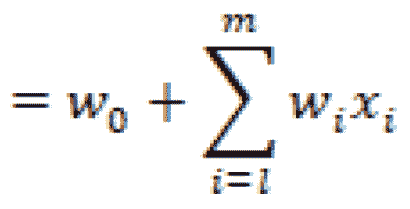

其中为矢量，为偏差项，为变量。

暂时离开 RNA 数据集，让我们继续使用 Python 中的登记数据集演示线性支持向量的使用——这是一个关于患者登记的数据集，其中通过`Likely`、`Very Likely`或`Unlikely`汇总应答者数据以进行登记。**线性 SVM** 的主要目的是*画一条线*清楚地根据类别分隔数据。

在我们开始使用 SVM 之前，让我们继续导入数据集:

```
df = pd.read_csv("../datasets/dataset_enrollment_sd.csv")
```

为了简单起见，让我们去掉`Likely`类，保留`Very Likely`和`Unlikely`类:

```
dftmp = df[(df["enrollment_cat"] != "Likely")]
```

让我们画一条线来分隔散点图中显示的数据:

```
     plt.figure(figsize=(15, 6))
     xfit = np.linspace(-90, 130)
         sns.scatterplot(dftmp["Feature1"], 
                         dftmp["Feature2"], 
                         hue=dftmp["enrollment_cat"].values, 
                         s=50)
         for m, b in [(1, -45),]:
             plt.plot(xfit, m * xfit + b, '-k')
         plt.xlim(-120, 150);
         plt.ylim(-100, 60);
```

执行此代码后，将生成下图:


图 7.12–被初始 SVM 超平面分开的两个集群

请注意，在图中，这条线性线可以用不同的斜率以多种方式绘制，但仍然可以成功地将数据集内的两个类分开。然而，随着新的数据点开始侵入两个集群之间的中间地带，超平面的斜率和位置将开始变得越来越重要。解决这个问题的一种方法是根据最近的数据点定义平面的斜率和位置。如果该行包含与最近数据点相关的宽度为 *x* 的裕量，则需要一个更加改进的`fill_between`函数，如以下代码所示:

```
         plt.figure(figsize=(15, 6))
         xfit = np.linspace(-110, 180)
         sns.scatterplot(dftmp["Feature1"], 
                         dftmp["Feature2"], 
                         hue=dftmp["enrollment_cat"].values, 
                         s=50)
         for m, b, d in [(1, -45, 60),]:
      yfit = m * xfit + b
      plt.plot(xfit, yfit, '-k')
         plt.fill_between(xfit, yfit - d, 
                     yfit + d, edgecolor='none',
                              color='#AAAAAA', alpha=0.4)
         plt.xlim(-120, 150);
         plt.ylim(-100, 60);
```

在执行此代码时，会产生下图:


图 7.13–由具有指定边界的初始 SVM 超平面分隔的两个簇

在超平面的边缘宽度内的来自两个类的数据点被称为**支持向量**。主要的直觉是，支持向量离超平面越远，为新的数据点识别正确类别的概率越高。

我们可以使用`scikit-learn`库中的 SVC 类训练一个新的 SVM 分类器。我们首先导入类，拆分数据，然后使用数据集训练模型:

```
from sklearn.model_selection import train_test_split
X_train, X_test, y_train, y_test =  
                train_test_split(dftmp[["Feature1","Feature2"]], 
                                  dftmp["enrollment_cat"].values,
                                  test_size = 0.25)
from sklearn.svm import SVC
model = SVC (kernel='linear', C=1E10, random_state = 42)
model.fit(X_train, y_train)
```

这样，我们现在已经使我们的模型适合数据集。最后一步，我们可以显示散点图，确定超平面，并指定哪些数据点是这个特定示例的支持向量:

```
     plt.figure(figsize=(15, 6))
     sns.scatterplot(dftmp["Feature1"], 
                     dftmp["Feature2"], 
                     hue=dftmp["enrollment_cat"].values, s=50)
     plot_svc_decision_function(model);
     for j, k in model.support_vectors_:
         plt.plot([j], [k], lw=0, ='o', color='red', 
                  markeredgewidth=2, markersize=20, 
                  fillstyle='none')
```

执行此代码后，会产生下图:


图 7.14–由初始 SVM 超平面和选择的支持向量分开的两个聚类

既然我们已经使用这个基本示例对支持向量机如何与其超平面相关地运行有了更好的理解，那么让我们继续使用我们一直在处理的单细胞 RNA 分类数据集来测试这个模型。

遵循与 KNN 模型大致相同的步骤，我们现在将实现 SVM 模型，首先导入库，用线性内核实例化模型，拟合我们的训练数据，然后对测试数据进行预测:

```
from sklearn.svm import SVC
svc = SVC(kernel="linear")
svc.fit(X_train, y_train)
y_pred = svc.predict(X_test)
print(classification_report(y_test, y_pred))
```

打印报告时，会产生以下结果:


图 7.15-SVM 模型的结果

我们可以看到，该模型实际上相当健壮，我们的数据集产生了一些高指标，给了我们 88%的总平均精度。支持向量机是用于复杂数据集的出色模型，因为它们的主要目标是通过超平面分离数据。现在让我们探索一个模型，它采用一种非常不同的方法，通过使用决策树来得出最终结果。

### 决策树和随机森林

**决策树**是最流行的和最常用的机器学习模型之一，当涉及到分类和回归的结构化数据集时。决策树由三个元素组成:**节点**、**边**和**叶节点**。

节点通常由一个问题组成，允许流程分成任意数量的子节点，如下图中橙色所示。根节点是整个树被引用的第一个节点。边是以蓝色显示的节点之间的连接。当节点没有子节点时，这个最终目的地称为叶子，以绿色显示。在某些情况下，决策树会有包含相同父节点的节点——这些节点被称为兄弟节点。树中的节点越多，树就越深。决策树的深度是对*复杂性的度量。*

不够复杂的树不会得到准确的结果，而太复杂的树会被过度训练。确定良好的平衡是培训过程中的主要目标之一。使用这些元素，您可以构建一个决策树，允许流程从上到下流动，从而到达特定的目的地或*决策*:


图 7.16–涉及节点、叶子和边的决策树图解

决策树以相当天才的方式运作。我们从最初的数据集开始，其中所有的数据点都被标记并准备就绪。第一个目标是使用信息最丰富的决策边界分割数据集——在本例中，决策边界位于 *y=m 处。*这成功地将一个类与其他两个类隔离开来；然而，另外两个仍然没有相互隔离。然后，该算法在 *x = n* 处再次分割数据集，从而完全分离三个聚类。如果存在更多的聚类，这个过程将迭代地和递归地继续，直到所有的类被最佳地分离。我们可以在*图 7.17* 中看到它的直观表示:


图 7.17-决策树所采取的过程的图形表示

决策树使用各种分割标准确定在哪里以及如何分割数据，这些标准被称为属性选择度量。这些突出的属性选择措施包括:

*   信息增益
*   增益比
*   基尼指数

现在让我们仔细看看这三个项目。

**信息增益**是关于进一步描述树所需的信息量的属性。这个属性最小化了数据分类所需的信息，同时利用了分区中最少的随机性。将从随机变量 *A* 的观察中确定的随机变量的信息增益视为如下函数:


广义地说，信息增益是熵(信息熵)的变化，使得:


其中表示给定属性的的条件熵。总之，信息增益回答了这个问题，*给定另一个变量，我们能从这个变量获得多少信息？*

另一方面，增益比**是相对于固有信息的信息增益。换句话说，这种方法偏向于产生许多结果的测试，从而迫使人们偏向于这种性质的特征。增益比可以表示为:**

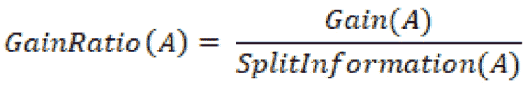

其中表示为:

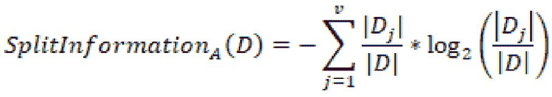

总之，增益比率用更多不同的值惩罚变量，这将有助于决定下一个级别的下一次拆分。

最后，我们得出**基尼指数**，这是一个属性选择度量，表示随机选择的元素被错误标记的频率。基尼系数可以通过减去每类概率的平方和来计算:

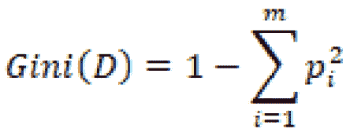

这种确定分割的方法自然有利于较大的分区，而信息增益则有利于较小的分区。任何数据科学家的目标都是探索数据集的不同方法，并确定前进的最佳路径。

既然我们对决策树和模型如何操作有了更详细的解释，现在让我们继续使用前面的单细胞 RNA 分类数据集来实现这个模型:

```
from sklearn.tree import DecisionTreeClassifier
dtc = DecisionTreeClassifier(max_depth=4)
dtc.fit(X_train, y_train)
y_pred = dtc.predict(X_test)
print(classification_report(y_test, y_pred))
```

在打印报告时，会产生以下结果:


图 7.18–决策树分类器的结果

我们可以看到，该模型在没有任何调整的情况下，能够使用`4`的`max_depth`值提供 77%的总精度分数。使用与 *KNN* 模型相同的方法，我们可以迭代一系列`max_depth`值来确定最优值。这样做的结果是理想的`max_depth`值为 3，总精度为 82%。

当我们开始训练我们的许多模型时，我们将面临的最常见的问题之一是以这样或那样的方式过度拟合我们的数据。以决策树模型为例，该模型针对特定的数据选择进行了非常精细的调整，因为决策树是使用感兴趣的特征和变量在整个数据集上构建的。在这种情况下，模型可能容易过度拟合。另一方面，另一个被称为**随机森林**的模型使用许多不同的决策树来帮助减轻任何潜在的过度拟合。

随机森林是基于决策树的健壮集成模型。决策树通常设计为将数据集作为一个整体来开发模型，而随机森林随机选择要素和行，然后构建多个决策树，然后对这些决策树的权重进行平均。随机森林是强大的模型，因为它们能够限制过度拟合，同时避免由于**偏差**导致的误差大幅增加。我们可以在*图 7.19* 中看到它的直观表示:


图 7.19-随机森林模型的图形解释

随机森林有两种主要方式可以帮助减少**方差**。第一种方法是通过对不同的数据样本进行训练。考虑前面使用患者登记数据的例子。如果模型是在不包含聚类之间的那些*的样本上训练的，那么确定测试集上的分数将导致显著较低的准确性。*

第二种方法涉及使用特征的随机子集进行训练，允许确定模型中特征重要性的概念。让我们使用单细胞 RNA 分类数据集来看看这个模型:

```
from sklearn.ensemble import RandomForestClassifier
clf = RandomForestClassifier(n_estimators=1000)
clf.fit(X_train, y_train)
y_pred = clf.predict(X_test)
print(classification_report(y_test, y_pred))
```

打印报告时，会产生以下结果:


图 7.20–随机森林模型的结果

我们可以立即观察到，该模型的精度大约为 74%，略低于上面的决策树，这表明该树可能稍微过度拟合了数据。

**随机森林**模型非常常用于生物技术和生命科学行业，因为它们具有避免过度拟合的卓越方法，以及利用较小数据集开发预测模型的能力。生物技术领域中的许多机器学习应用通常会遇到一个被称为“low-N”问题的概念，即存在用例，但很少或没有收集或组织数据来开发模型。鉴于随机森林的整体性质，它们通常用于这一领域的应用。现在让我们来看一个非常不同的模型，它不是基于决策，而是基于统计概率来拆分数据。

### 极端梯度增强(XGBoost)

在过去的几年里，许多强大的机器学习模型已经开始进入数据科学领域，从而非常有效地改变了机器学习的格局，其中一个模型是**极端梯度提升** ( **XGBoost** )模型。这个模型背后的主要思想是，它是**梯度增强模型** ( **GBMs** )，特别是*决策树*的实现，其中速度和性能都得到了高度优化。由于该模型的高效性和高效性，它开始主导数据科学的许多领域，并最终成为 Kaggle.com 上许多数据科学竞赛的首选算法。

GBM 对结构化/表格化数据集如此有效的原因有很多。让我们继续探讨其中的三个原因:

*   **并行化**:XGBoost 模型实现了一种称为并行化的方法。这里的主要思想是，它可以在每个树的构造中并行处理过程。本质上，单个树的每个分支都是单独训练的。
*   `max_depth`参数，然后开始向后修剪过程，并最终移除分裂，之后不再有正增益。
*   **正则化**:在整个基于树的方法中，正则化是一种算法方法，用于定义最小增益，以促使树中的另一个分裂。本质上，正则化缩小了分数，从而促使最终预测更加保守，这反过来有助于防止模型内的过度拟合。

现在，我们已经对 XGBoost 及其强大性能背后的一些原因有了更好的理解，让我们继续在我们的 RNA 数据集上实现这个模型。我们将从使用`pip`安装模型库开始:

```
pip install xgboost
```

安装了模型之后，我们现在继续导入模型，然后创建模型的新实例，在该实例中，我们指定`n_estimators`参数的值为`10000`:

```
from xgboost import XGBClassifier
xgb = XGBClassifier(n_estimators=10000)
```

与前面的模型类似，我们现在可以继续用训练数据集拟合我们的模型，并打印我们的预测结果:

```
xgb.fit(X_train, y_train)
y_pred = xgb.predict(X_test)
print(classification_report(y_test, y_pred))
```

打印报告时，会产生以下结果:


图 7.21–XG boost 模型的结果

这样，我们可以看到我们设法达到了`0.86`的精度，比我们测试的其他一些模型要高得多。该模型的高度优化特性使其相对于大多数其他模型来说非常快速和健壮。

在本节的过程中，我们设法涵盖了相当广泛的**分类**模型。我们从简单的 **KNN** 模型开始，该模型试图预测一个新值相对于其最近邻居的类别。接下来，我们介绍了 **SVM** 模型，该模型试图根据支持向量绘制的特定边界来分配标签。然后，我们讨论了基于节点、树叶和分割的**决策树**和**随机**森林，最后，我们看到了一个 **XGBoost** 的工作示例，这是一个高度优化的模型，实现了我们在其他模型中看到的许多特性。

当您开始深入新数据集的许多不同模型时，您可能会研究自动化模型选择过程的想法。如果你想一想，我们上面采取的每一个步骤都可以以某种方式自动化，以确定在一组特定的指标要求下哪个模型运行得最好。幸运的是，已经有一个图书馆可以在这个领域帮助我们。在接下来的教程中，我们将研究这些模型的使用，以及在**谷歌云平台** ( **GCP** )上的一些自动机器学习功能。

## 教程:使用 GCP 对蛋白质进行分类

在本教程中，我们将研究一些分类模型，然后实现一些自动机器学习功能。我们的主要目标将是使用来自**结构生物信息学研究合作实验室** ( **RCSB** ) **蛋白质数据库** ( **PDB** )的数据集，自动开发蛋白质分类模型。如果你还记得的话，我们在前一章使用了 RCSB·PDB 的数据绘制了一个 3D 蛋白质结构。我们将在本章中使用的数据集由两部分组成——一个带有行和列的**结构化数据集**,其中一列是每种蛋白质的指定分类，以及每种蛋白质的一系列 RNA 序列。我们将保存这第二组基于序列的数据，以便在后面的章节中进行分析，现在重点关注结构化数据集。

在本章中，我们将使用这个包含许多不同类型的蛋白质的结构化数据集来尝试开发一个分类器。鉴于该数据集的庞大性质，我们将借此机会将我们的开发环境从本地安装的 **Jupyter Notebook** 迁移到位于 **GCP** 的在线笔记本。在此之前，我们需要创建一个新的 GCP 帐户。让我们开始吧。

### 在 GCP 开始

在 GCP 入门非常简单，只需几个简单的步骤:

1.  我们可以从导航到 https://cloud.google.com/注册一个新账户开始。您需要提供一些详细信息，如您的姓名、电子邮件和一些其他项目。
2.  Once registered, you will be able to navigate to the console by clicking the **Console** button on the upper right-hand side of the page:

    图 7.22–控制台按钮的屏幕截图

3.  Within the console page, you will be able to see all items relating to your current project, such as general information, resources used, API usage, and even billing:

    图 7.23–控制台页面示例

4.  你可能还没有建立任何项目。为了创建一个新项目，导航到左上方的下拉菜单并选择**新项目**选项。给你的项目起个名字，然后点击**创建**。您可以使用同一个下拉菜单在不同的项目之间导航:


图 7.24–GCP 项目名称和位置窗格的屏幕截图

完成最后一步后，您就可以充分利用 GCP 平台了。我们将在本教程中介绍一些 GCP 功能，让我们开始了解数据科学领域；然而，我强烈鼓励新用户探索和学习这里提供的许多工具和资源。

### 上传数据到 GCP 大查询

在 GCP 有许多不同的方式可以上传数据；然而，我们将关注 GCP 独有的一个特殊功能，称为 **BigQuery** 。BigQuery 背后的主要思想是，它是一个无服务器的数据仓库，具有内置的机器学习功能，支持使用 **SQL** 语言进行查询。如果您还记得，我们以前开发和部署了一个 **AWS RDS** 来管理我们的数据，使用一个 **EC2** 实例作为服务器，而 BigQuery 则使用一个无服务器架构。我们可以设置 BigQuery，并通过几个简单的步骤开始上传数据:

1.  Using the navigation menu on the left-hand side of the page, scroll down to the **Products** section, hover over the **BigQuery** option, and select **SQL workspace**. Given that this is the first time you are using this tool, you may need to activate the API. This will be true for all tools that you have never used before:

    图 7.25–GCP big query 菜单的屏幕截图

2.  在这个列表中，您将找到您在上一节中创建的项目。点击右侧的选项按钮并选择`protein_structure_sequence`，将所有其他选项保留为默认值。然后你可以点击**创建数据集**。
3.  On the left-hand menu, you will see the newly created dataset listed under the project name. If you click **Options** followed by **Open**, you will be directed to the dataset's main page. Within this page, you will find information relating to that particular dataset. Let's now go ahead and create a new table here by clicking the **Create Table** option at the top. Change the source to reflect the upload option and navigate to the CSV file pertaining to the protein classifications from RCSB PDB. Give the table a new name, and while leaving all other options as their default values, click **Create Table**:

    图 7.26–GCP 的创建表格窗格的屏幕截图

4.  如果导航回资源管理器，您将看到新创建的表列在数据集下，该数据集列在您的项目下:


图 7.27–在数据集中创建的表格示例

如果您成功地正确遵循了所有这些步骤，那么现在您应该有数据可以在 BigQuery 中使用了。在下一节中，我们将准备一个新笔记本，并开始解析这个数据集中的一些数据。

### 在 GCP 创作笔记本

在此部分，我们将创建一个笔记本，相当于我们一直用来开展数据科学工作的 Jupyter 笔记本。我们可以通过几个简单的步骤来安装新笔记本电脑:

1.  In the navigation pane on the left-hand side of the screen, scroll down to the **ARTIFICIAL INTELLIGENCE** section, hover over **AI Platform**, and select the **Notebooks** option. Remember that you may need to activate this API once again if you have not done so already:

    图 7.28–人工智能平台菜单的视觉效果

2.  Next, navigate to the top of the screen and select the **New Instance** option. There are many different options available for you depending on your needs. For the purposes of this tutorial, we can select the first option for **Python 3**:

    图 7.29–实例选项的屏幕截图

    如果您熟悉笔记本实例并且习惯于自定义它们，我建议您创建一个自定义实例来满足您的确切需求。

3.  Once the notebook is created and the instance is online, you will be able to see it in the main **Notebook Instances** section. Go ahead and click on the **OPEN JUPYTERLAB** button. A new window will open up containing Jupyter Lab:

    图 7.30–实例菜单的屏幕截图

4.  在`home`目录中，创建一个名为`biotech-machine-learning`的新目录，以便我们保存笔记本。打开目录，点击右边的 **Python 3** 笔记本选项，创建一个新的笔记本:


图 7.31-GCP Jupyter 实验室的截图

现在，配置好实例并创建好笔记本后，您就可以在 GCP 上运行所有数据科学模型了。现在让我们仔细看看这些数据，并开始训练一些机器学习模型。

### 在 GCP 笔记本电脑中使用 auto-sklearn

如果你打开你新创建的笔记本，你会看到我们一直合作的非常熟悉的 Jupyter 实验室的环境。这里的两个主要好处是，我们现在有能力在相同的环境中管理我们的数据集，并且相对于我们在本地机器上拥有的少量**CPU**和**GPU**，我们可以提供更多的资源来处理我们的数据。

回想一下，我们达到这种状态的主要目标是能够开发一个分类模型，根据一些输入特征对蛋白质进行正确分类。我们正在处理的数据集被称为`real-world`数据集，因为它组织得不好，缺少值，可能包含太多数据，并且在开发任何模型之前需要一些预处理。

让我们从导入几个必要的库开始:

```
import pandas as pd
import numpy as np
from google.cloud import bigquery
import missingno as msno
from sklearn.metrics import classification_report
import ast
import autosklearn.classification
```

接下来，让我们从 BigQuery 导入数据集。我们可以在笔记本中通过使用 Google Cloud library 的 BigQuery 类实例化一个客户端来直接完成这项工作:

```
client = bigquery.Client(location="US")
print("Client creating using default project: {}".format(client.project))
```

接下来，我们可以使用 **SQL** 语言中的`SELECT`命令来查询我们的数据。我们可以简单地从查询数据集中的所有数据开始。在下面的代码片段中，我们将使用 SQL 查询数据，并将结果转换为 dataframe:

```
query = """
    SELECT *
    FROM `biotech-project-321515.protein_structure_sequence.dataset_pdb_no_dups`
"""
query_job = client.query(
    query,
    location="US",
)
df = query_job.to_dataframe()
print(df.shape)
```

一旦转换成更易于管理的数据框架，我们可以看到我们正在处理的数据集非常庞大，有近 140，000 行和 14 列数据。很快，我们注意到其中一列叫做`classification`。让我们使用`n_unique()`函数来看看这个数据集中类的唯一数量:

```
df.classification.nunique()
```

我们注意到有 5050 个不同的类！对于这种规模的数据集来说，这是一个很大的数字，这表明在进行任何分析之前，我们可能需要大大减少这个数字。在继续下一步之前，我们先删除所有潜在的重复项:

```
dfx = df.drop_duplicates(["structureId"])
```

现在，让我们仔细看看数据集中排名前 10 的类:

```
dfx.classification.value_counts()[:10].sort_values().plot(kind = 'barh')
```

下图是从代码中生成的，显示了该数据集中的前 10 个类:


图 7.32-数据集中前 10 个最常用的标签

很快，我们注意到有两三类蛋白质解释了这些数据的绝大部分:水解酶、转移酶和氧化还原酶。这将是有问题的，原因有二:

*   数据应该总是**平衡的**，也就是说每个类应该有大致相等的行数。
*   作为一般的经验法则，类与观察的比率应该是大约 50:1，这意味着对于 5，050 个类，我们将需要大约 252，500 个观察，这是我们目前没有的。

给定这两个约束，我们可以通过简单地关注使用前三个类开发一个模型来解决这两个问题。现在，我们注意到有相当多的特性可供我们使用，不管手边的类是什么。我们可以使用`msno`库来进一步了解我们感兴趣的特性的完整性:

```
dfx = dfx[["classification", "residueCount", "resolution", "resolution", "crystallizationTempK", "densityMatthews", "densityPercentSol", "phValue"]]
msno.matrix(dfx)
```

然后生成下面的屏幕截图，代表数据集的完整性。请注意，`crystallizationTempK`特性的许多行都丢失了:


图 7.33-显示数据集完整性的图形表示

到目前为止，在这个数据集中，我们已经注意到这样一个事实，即我们需要将类的数量减少到前两个类，以避免不平衡的数据集，并且我们还需要解决我们丢失的许多数据行。让我们继续准备我们的数据集，以便根据我们的观察开发一些分类模型。首先，我们可以使用一个简单的`groupby`函数来简化数据集:

```
df2 = dfx.groupby("classification").filter(lambda x: len(x) > 14000)
df2.classification.value_counts()
```

如果我们使用`value_counts()`函数对数据帧进行快速检查，我们会注意到我们能够将其减少到顶部的两个标签。

或者，我们可以在`SELECT`分类和`COUNT`特征和`GROUP BY`分类中运行相同的命令。接下来，我们用原来的表设置`INNER JOIN`那个查询，分类对分类，但是使用我们的`WHERE`子句过滤:

```
query = """
    SELECT DISTINCT
        dups.*
    FROM (
        SELECT classification, count(residueCount) AS classCount
        FROM `biotech-project-321515.protein_structure_sequence.dataset_pdb_no_dups`
        GROUP BY classification
    ) AS sub
    INNER JOIN `biotech-project-321515.protein_structure_sequence.dataset_pdb_no_dups` AS dups
        ON sub.classification = dups.classification
    WHERE sub.classCount > 14000
"""
query_job = client.query(
    query,
    location="US",
)
df2 = query_job.to_dataframe()
```

接下来，我们可以使用`dropna()`函数删除缺失值的数据行:

```
df2 = df2.dropna()
df2.shape
```

我们立即观察到数据集的大小已经减少到 24，179 个观察值。在开发我们的模型时，这将是一个足够的数据集。为了避免再次处理它，我们可以将 dataframe 的内容写入同一个 BigQuery 数据集中的新表:

```
import pandas_gbq
pandas_gbq.to_gbq(df2, 'protein_structure_sequence.dataset_pdb_no_dups_cleaned', project_id ='biotech-project-321515', if_exists='replace')
```

有了现在准备好的数据，让我们继续并开发一个模型。我们可以继续分割输入和输出数据，使用`StandardScaler`类缩放数据，并将数据分割成测试集和训练集:

```
X = df2.drop(columns=["classification"])
y = df2.classification.values.ravel()
from sklearn.preprocessing import StandardScaler
scaler = StandardScaler()
X_scaled = scaler.fit_transform(X)
from sklearn.model_selection import train_test_split
X_train, X_test, y_train, y_test = train_test_split(X_scaled, y, test_size=0.25)
```

对于自动化部分，我们将使用一个名为`autosklearn`的库，它可以通过`pip`使用命令行安装:

```
pip install autosklearn
```

安装了库之后，我们可以导入库并实例化该模型的一个新实例。然后，我们将设置几个与我们希望用于此过程的时间相关的参数，并为模型提供一个临时目录来进行操作:

```
import autosklearn.classification
automl = autosklearn.classification.AutoSklearnClassifier(
    time_left_for_this_task=120,
    per_run_time_limit=30,
    tmp_folder='/tmp/autosklearn_protein_tmp5',
)
```

最后，我们可以继续在我们的数据上拟合模型。此过程需要几分钟时间来运行:

```
automl.fit(X_train, y_train, dataset_name='dataset_pdb_no_dups')
```

模型完成后，我们可以通过打印引导板来查看结果:

```
print(automl.leaderboard())
```

在打印排行榜时，我们检索到以下结果:


图 7.34–自动 sklearn 模型的结果

我们还可以使用`get_models_with_weights()`功能来看看性能最佳的`random_forest`车型:

```
automl.get_models_with_weights()[0]
```

我们还可以通过使用模型和`classification_report()`函数进行一些预测来获得更多的指标:

```
predictions = automl.predict(X_test)
print("classification_report:", classification_report(y_test, predictions))
```

打印报告时，会产生以下结果:


图 7。35–性能最佳的 auto-sklearn 模型的结果

这样，我们成功地为我们的数据集自动开发了一个机器学习模型。但是，这个模型还没有针对这个任务进行优化。我建议您完成的一项挑战是调整该模型中的各种参数，以增加我们的指标。此外，另一个挑战将是尝试和探索我们了解的其他一些模型，看看它们中是否有任何一个能够击败`autosklearn`。提示: **XGBoost** 一直是结构化数据集的优秀模型。

### 在 GCP 使用 AutoML 应用程序

在前面的部分中，我们使用了一个名为`auto-sklearn`的开源库，该库自动化了使用`sklearn`库选择模型的过程。然而，正如我们在`XGBoost`库中看到的，在`sklearn` API 之外还有许多其他模型。GCP 提供了一个健壮的工具，类似于`auto-sklearn`的工具，它迭代大量选择的模型和方法以找到给定数据集的最佳模型。让我们试一试:

1.  In the navigation menu in GCP, scroll down to the **ARTIFICIAL INTELLIGENCE** section, hover over **Tables**, and select **Datasets**:

    图 7.36–从人工智能菜单中选择数据集

2.  At the top of the page, select the **New Dataset** option. At the time this book was written, the beta implementation of the model was available. Some of the steps will likely have changed in future implementations:

    图 7.37–创建新数据集按钮的屏幕截图

3.  继续给数据集一个名称和区域，并点击**创建数据集**。
4.  我们可以选择将感兴趣的数据集作为原始 CSV 文件或使用 BigQuery 导入。继续，通过指定`projectID`、`datasetID`和表名来导入我们的蛋白质数据集的清理版本，然后单击**导入**。
5.  In the **TRAIN** section, you will have the ability to see the tables within this dataset. Go ahead and specify the **Classification** column as the target column and then click **TRAIN MODEL**:

    图 7.38–培训菜单示例

6.  型号选择过程需要一些时间来完成。完成后，您将能够在**评估**选项卡下看到模型的结果。在这里，您将对我们一直在使用的分类指标以及其他一些指标有所了解。


图 7.39–显示指标的训练模型的结果

**GCP** **AutoML** 是一个强大的工具，在处理复杂的数据集时，你可以利用它。您会发现，相对于我们作为数据科学家可以探索的许多选项，该模型的实现非常健壮，而且总体上很全面。 **AutoML** 的一个缺点是最终模型不与用户共享；然而，用户确实有能力测试新数据并在以后使用该模型。在下面的章节中，我们将探索另一个类似于 **AutoML** 的选项，称为 **AWS** 中的**自动驾驶**。既然我们已经探索了相当多的与分类相关的不同模型和方法，那么让我们来探讨一下它们在回归时各自的对应部分。

# 理解监督机器学习中的回归

**回归**是模型，通常用于确定因变量和自变量之间的关系或**相关性**。在机器学习的上下文中，我们将回归定义为受监督的机器学习模型，该模型允许识别两个或更多变量之间的相关性，以便**推广**或从历史数据中学习，从而对新的观察结果进行预测。

在生物技术空间的范围内，我们使用回归模型来预测许多不同领域的价值。

*   提前预测化合物的 LCAP
*   预测更上游的滴度结果
*   预测单克隆抗体的等电点
*   预测化合物的分解百分比

相关性通常是在两列之间建立的。当观察到相关性时，数据集内的两列被称为具有强**相关性**。使用线性回归模型可以更好地理解具体关系，例如:


其中为第一特征，为第二特征，为小误差项，和为常数。使用这个简单的等式，我们可以更有效地理解我们的数据，并计算任何相关性。例如，回想一下之前我们在毒性数据集中观察到的相关性，特别是在`MolWt`和`HeavyAtoms`特征之间。

与分类模型不同，任何给定回归模型背后的主要思想是输出一个连续值，而不是一个类或类别。例如，我们可以使用毒性数据集中的许多列来尝试预测同一数据集中的其他列。

在数据科学领域有许多不同类型的回归模型。有侧重于优化一组变量之间的线性关系的线性回归、更多地充当二元分类器而不是回归器的逻辑回归，以及结合几个基本估计量的预测能力的集成模型，等等。我们可以在*图 7.40* 中看到一些例子:


图 7.40-不同类型的回归模型

在本节的课程中，我们将探讨其中的一些模型，并使用毒性数据集研究一些回归模型的应用。让我们继续准备我们的数据。

我们可以从导入我们感兴趣的库开始:

```
import pandas as pd
import numpy as np
from sklearn.metrics import r2_score
from sklearn.metrics import mean_squared_error
import matplotlib.pyplot as plt
import seaborn as sns
sns.set_theme(color_codes=True)
```

接下来，我们可以继续导入我们的数据集并删除缺失的行。为了练习，我建议你把这个数据集上传到`SELECT`声明:

```
df = pd.read_csv("../../datasets/dataset_toxicity_sd.csv")
df = df.dropna()
```

接下来，我们可以将我们的数据分成输入和输出值，并使用来自`sklearn`的`MinMaxScaler()`类来缩放我们的数据:

```
X = df[["Heteroatoms", "MolWt", "HeavyAtoms", "NHOH", "HAcceptors", "HDonors"]]
y = df.TPSA.values.ravel()
from sklearn.preprocessing import MinMaxScaler
scaler = MinMaxScaler()
X_scaled = scaler.fit_transform(X)
```

最后，我们可以将数据集分为训练数据和测试数据:

```
from sklearn.model_selection import train_test_split
X_train, X_test, y_train, y_test = train_test_split(X_scaled, y, test_size=0.25)
```

有了准备好的数据集，我们现在就可以开始探索一些回归模型了。

## 探索不同的回归模型

有许多类型的回归方法可用于给定的数据集。我们可以把回归分成四大类:线性回归、逻辑回归、整体回归，最后是增强回归。在下一节中，我们将从线性回归开始，探索每一类中的例子。

### 一元和多元线性回归

在你职业生涯中可能会遇到的许多数据集中，你经常会发现的一些特征相对于一个的另一个表现出某种类型的相关性。在本章的前面，我们讨论了两个特征之间的相关性，即一个特征对另一个特征的依赖性，这可以使用被称为 **R2** 的皮尔森相关性度量来计算。在过去的几章中，我们已经用几种不同的方式研究了相关性的概念，包括热图和配对图。

使用我们刚刚准备的数据集，我们可以使用`seaborn`来查看一些相关性:

```
import seaborn as sns
fig = sns.pairplot(data=df[["Heteroatoms", "MolWt", "HeavyAtoms"]])
```

这产生了下图:


图 7.41–使用毒性数据集的 pairplot 函数的结果

我们可以看到在我们的数据集中已经有一些相关性。使用**简单线性回归**，我们可以利用这种相关性，因为我们可以使用一个变量来预测另一个变量最有可能是什么。例如，如果 X 是自变量，Y 是因变量，我们可以将两者之间的线性关系定义为:


其中 *m* 为斜率 *c* 为 *y* 截距。根据本书中早期的一些内容，以及你在高中的数学课，这个方程对你来说应该很熟悉。使用这种关系，我们的目标将是相对于我们的数据优化这条线，以便使用被称为最小平方方法的方法来确定 *m* 和 *c* 的值。

在我们能够讨论**最小二乘法**之前，让我们首先讨论一个**损失函数**的想法。机器学习环境中的损失函数是我们计算的和预期值之间差异的度量。例如，让我们检查一下**二次损失函数**，它通常用于计算回归模型中的损失，我们可以将其定义为:

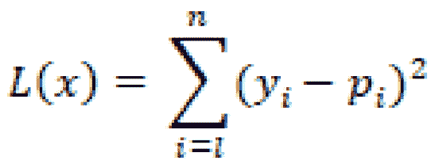

现在，我希望你能从我们在*衡量成功*部分的讨论中认识到这个功能。你能告诉我我们最后一次用这个是在哪里吗？

既然我们已经讨论了损失函数的概念，让我们更仔细地看看**最小二乘法**。这种数学方法背后的主要思想是，通过最小化损失，确定一组给定数据的最佳拟合线，正如我们刚才看到的相关性所证明的那样。为了充分解释这个方程背后的概念，我们需要讨论偏导数等等。为简单起见，我们将简单地将最小二乘法定义为**最小化**损失的过程，以确定给定数据集的最佳拟合线。

我们可以将线性回归分为两大类:**简单线性回归**和**多元线性回归**。这里的主要思想是关于我们将用来训练模型的特征的数量。如果我们只是基于一个特征训练模型，我们将开发一个简单的线性回归。另一方面，如果我们使用多个特征来训练模型，我们将训练一个多重回归模型。

无论是训练简单回归模型还是多元回归模型，过程和期望的结果通常是相同的。理想情况下，当相对于实际值绘制时，我们模型的输出应产生一条线性线，显示我们数据中的强相关性，如图*图 7.42* 所示:


图 7.42-显示理想相关性的简单线性线

让我们继续探索多元线性回归模型的开发。使用上一节中导入的数据，我们可以为`sklearn`导入`LinearRegression`类，用我们的训练数据拟合它，并使用测试数据集进行预测:

```
from sklearn.linear_model import LinearRegression
reg = LinearRegression().fit(X_train, y_train)
y_pred = reg.predict(X_test)
```

接下来，我们可以继续使用实际值和预测值来计算 **R2** 值，并在图表上显示出来。此外，我们还将获取 **MSE** 指标:

```
p = sns.jointplot(x=y_test, y=y_pred, kind="reg")
p.fig.suptitle(f"Linear Regression, R2 = {round(r2_score(y_test, y_pred), 3)}, MSE = {round(mean_squared_error(y_test, y_pred), 2)}")
p.fig.subplots_adjust(top=0.90)
```

该代码将生成下图:


图 7.43–线性回归模型的结果

很快，我们注意到这个简单线性回归模型在我们的数据集上做出预测时非常有效。请注意，这个模型不仅使用了一个特征，而且使用了所有的特征来进行预测。我们从图表中注意到，我们的大部分数据都位于左下方。这对于回归模型来说并不理想，因为我们希望这些值平均分布在所有界限上；然而，重要的是要记住，在生物技术领域，你几乎总是会遇到真实世界的数据，在这些数据中你会观察到这样的项目。

如果你在 **Jupyter 笔记本**中跟随，继续将数据集减少到只有一个输入特征，缩放并分割数据，训练一个简单的线性回归，并将结果与多元线性回归进行比较。我们的预测和实际值的相关性是增加了还是减少了？

### 逻辑回归

回想一下，在线性回归部分，我们讨论了方法学，其中一条线性线可用于预测基于相关特征作为输入的值。我们将线性方程概述如下:


在某些情况下，数据和期望输出之间的关系可能不是由线性模型来最好地表示，而是由非线性模型来表示:


图 7.44-一条简单的 s 形曲线

虽然被称为**逻辑回归**，但这种回归大多被用作**二元分类**算法。然而，这里的主要焦点是单词*逻辑*指的是逻辑功能，也称为 **Sigmoid** 功能，表示为:


考虑到这一点，我们将希望使用这个函数在我们的数据集中进行预测。如果我们想在给定特定输入值的情况下确定化合物是否有毒，我们可以计算输入值的加权和，如下所示:


这将允许我们计算毒性的概率:

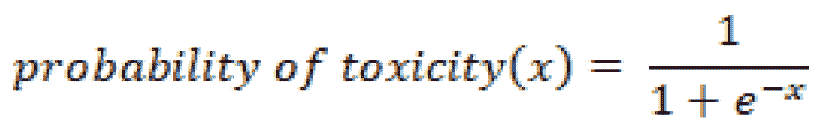

使用这个概率，可以进行最终预测，并分配输出值。继续使用上一节中的蛋白质分类数据集实现这个模型，并将您找到的结果与其他分类器的结果进行比较。

### 决策树和随机森林回归

与分类对应的相似，**决策树回归** ( **DTRs** )是常用的机器学习模型，实现了与决策树分类器几乎相同的内部机制。模型之间的唯一区别是回归器输出连续数值，而分类器输出离散类。

类似地，另一个被称为**随机森林回归器** ( **RFRs** )的模型也存在，其操作类似于其分类对应物。该模型也是一种集成方法，其中每棵树都被训练为一个单独的模型，然后进行平均。

让我们继续使用该数据集实现一个 RFR。正如我们之前所做的那样，我们将首先创建模型的一个实例，使其符合我们的数据，进行预测，并可视化结果:

```
from sklearn.ensemble import RandomForestRegressor
reg = RandomForestRegressor().fit(X_train, y_train)
y_pred = reg.predict(X_test)
p = sns.jointplot(x=y_test, y=y_pred, kind="reg")
p.fig.suptitle(f"RandomForestRegressor Regression, R2 = {round(r2_score(y_test, y_pred), 3)}, MSE = {round(mean_squared_error(y_test, y_pred), 2)}")
# p.ax_joint.collections[0].set_alpha(0)
# p.fig.tight_layout()
p.fig.subplots_adjust(top=0.90)
```

随着模型的开发，我们可以使用下面的图来可视化结果:


图 7.45–随机森林回归模型的结果

注意当`max_depth`参数:

```
for i in range(1,10):
    reg = RandomForestRegressor(max_depth=i)
                       .fit(X_train, y_train)
    y_pred = reg.predict(X_test)
    print("depth =", i, 
          "score=", r2_score(y_test, y_pred), 
          "mse = ", mean_squared_error(y_test, y_pred))
```

这段代码的输出如下所示，表明`8`的`max_depth`可能是最佳的，因为它会产生`0.967`和`248.133`:


图 7.46–不同 max_depth 的随机森林回归模型的结果

与分类类似，回归的决策树往往是优秀的方法,允许你开发模型，同时尽量避免过度拟合数据。当使用 sklearn API 时， **DTR** 模型的另一大好处是直接从模型中获得对特性重要性的洞察。让我们来演示一下:

```
features = X.columns
importances = reg.feature_importances_
indices = np.argsort(importances)[-9:]
plt.title('Feature Importances')
plt.barh(range(len(indices)), importances[indices],  
                           color='royalblue', 
                           align='center')
plt.yticks(range(len(indices)),[features[i] for i in indices])
plt.xlabel('Relative Importance')
plt.show()
```

完成后，将生成下图:


图 7.47-随机森林回归模型的特征重要性

查看该图，我们可以看到对该型号发展影响最大的前三个特性分别是`HDonors`、`Heteroatoms`和`HAcceptors`。虽然这个特征重要性的例子是使用 RFR 模型开发的，但是理论上我们可以将它用于许多其他模型。一个特别的库是`SHAP`库，它在关于特性重要性的领域中获得了很大的重要性。强烈建议您浏览一下这个库以及它提供的许多精彩特性(没有双关语)。

### XGBoost 回归

类似于 **XGBoost** 分类模型，我们也有回归实现，它允许我们预测一个值而不是一个类别。我们可以继续并轻松地实现它，就像我们在上一节中所做的那样:

```
import xgboost as xg
reg = xg.XGBRegressor(objective ='reg:linear',n_estimators = 1000).fit(X_train, y_train)
y_pred = reg.predict(X_test)
p = sns.jointplot(x=y_test, y=y_pred, kind="reg")
p.fig.suptitle(f"xgboost Regression, R2 = {round(r2_score(y_test, y_pred), 3)}, MSE = {round(mean_squared_error(y_test, y_pred), 2)}")
p.fig.subplots_adjust(top=0.90)
```

随着代码完成，这产生了下图:


图 7.48-XG boost 回归模型的结果

你会注意到，这个模型的实现在我们的实际和预测值的上下文中给了我们一个非常值得尊敬的 **R2** 值，并设法产生了 282.79 的 **MSE** ，这比我们在本章中尝试的一些其他模型稍小。模型完成后，让我们在接下来的教程中继续看看如何使用 AWS 中提供的一些自动化机器学习功能。

## 教程:用于属性预测的回归

在本章中，我们回顾了一些最常见(也是最流行)的回归模型，因为它们与使用`toxicity`数据集预测`TPSA`特征有关。在前面关于分类的部分中，我们创建了一个 GCP 实例，并使用`auto-sklearn`库来自动识别给定数据集的顶级机器学习模型之一。在本教程中，我们将以类似的方式创建一个`auto-sklearn`库。此外，我们还将探索一种更加强大的自动化机器学习方法，使用 **AWS 自动驾驶仪**。在前面的一章中，我们使用 **AWS RDS** 来启动一个关系数据库来托管我们的毒性数据集。使用同一个 **AWS** 帐户，我们现在就开始吧。

### 在 AWS 中创建 SageMaker 笔记本

类似于在 **GCP** 中创建笔记本，我们可以通过几个简单的步骤在 **AWS** 中创建一个 **SageMaker** 笔记本:

1.  Navigate to the AWS Management Console on the front page. Click on the **Services** drop-down menu and select **Amazon SageMaker** under the **Machine Learning** section:

    图 7.49–AWS 提供的服务列表

2.  On the left-hand side of the page, click the **Notebook** drop-down menu and then select the **Notebook instances** button:

    图 7.50–笔记本菜单的屏幕截图

3.  Within the notebook instances menu, click on the orange button called **Create notebook instance**:

    图 7.51–创建笔记本实例按钮的屏幕截图

4.  Let's now go ahead and give the notebook instance a name, such as `biotech-machine-learning`. We can leave the instance type as the default selection of `ml.t2.medium`. This is a medium-tier instance and is more than enough for the purposes of our demo today:

    图 7.52–笔记本实例设置的屏幕截图

5.  Under the **Permissions and encryption** section, select the **Create a new role** option for the IAM role section. The main idea behind IAM roles is the concept of granting certain users or roles the ability to interact with specific AWS resources. For example, we could allow this role to also have access to some but not all S3 buckets. For the purposes of this tutorial, let's go ahead and grant this role access to any S3 bucket. Go ahead and click on **Create role**:

    图 7.53–在 AWS 中创建 IAM 角色

6.  Leaving all the other options as they are, go ahead and click on **Create notebook instance**. You will be redirected back to the **Notebook instance** menu where you will see your newly created instance in a **Pending** state. Within a few moments, you will notice that status change to **InService**. Click on the **Open JupyterLab** button to the right of the status:

    图 7.54–在 AWS 中打开 Jupyter 笔记本或 Jupyer 实验室的选项

7.  Once again, you will find yourself in the familiar Jupyter environment you have been working in.

    AWS SageMaker 是一个很好的资源，您可以用很低的成本使用。在这个空间中，您将能够运行您在本书中学到的所有 Python 命令和库。您可以创建目录来组织您的文件和脚本，并在世界任何地方访问它们，而不必随身携带您的笔记本电脑。此外，您还将获得近 100 个 SageMaker 示例笔记本和入门代码供您使用。


图 7.55–sage maker 入门笔记本列表示例

完成最后一步后，我们现在有了一个完全正常工作的笔记本实例。在下一节中，我们将使用 SageMaker 导入数据并开始运行我们的模型。

### 在 AWS 中创建笔记本和导入数据

假设我们再次在我们熟悉的 Jupyter 空间中工作，我们可以通过选择右侧众多选项中的一个来轻松创建一个笔记本，并开始运行我们的代码。让我们开始吧:

1.  We can begin by selecting the **conda_python3** option on the right-hand side, creating a new notebook for us in our current directory:

    图 7.56–conda _ python 3 的屏幕截图

2.  准备好笔记本后，我们需要安装几个库来开始。继续使用`pip` :

    ```
    pip install mysql-connector pymysql
    ```

    安装`mysql-connector`和`pymysql`
3.  接下来，我们需要导入一些东西:

    ```
    import pandas as pd import mysql.connector from sqlalchemy import create_engine import sys import seaborn as sns
    ```

4.  现在，我们可以定义查询数据所需的一些项目，正如我们之前在第 3 章 、*SQL 和关系数据库入门* :

    ```
    ENDPOINT="toxicitydataset.xxxxxx.us-east-2.rds.amazonaws.com" PORT="3306" USR="admin" DBNAME="toxicity_db_tutorial" PASSWORD = "xxxxxxxxxxxxxxxxxx"
    ```

    中所做的那样
5.  接下来，我们可以创建一个到我们的 **RDS** 实例的连接:

    ```
    db_connection_str = 'mysql+pymysql://{USR}:{PASSWORD}@{ENDPOINT}:{PORT}/{DBNAME}'.format(USR=USR, PASSWORD=PASSWORD, ENDPOINT=ENDPOINT, PORT=PORT, DBNAME=DBNAME) db_connection = create_engine(db_connection_str)
    ```

6.  最后，我们可以使用一个基本的`SELECT`语句:

    ```
    df = pd.read_sql('SELECT * FROM dataset_toxicity_sd', con=db_connection)
    ```

    来查询我们的数据

完成后，我们现在能够直接从 **AWS RDS** 查询我们的数据。当您开始探索数据科学领域的新模型时，您将需要一个存储和组织数据的地方。选择一个平台，如 **AWS RDS** 、 **AWS S3** ，甚至 **GCP** **BigQuery** 将帮助你组织你的数据和研究。

### 使用毒性数据集运行 auto-sklearn

现在我们已经将数据保存在工作笔记本中，让我们继续使用`auto-sklean`库来确定最适合给定数据集的模型:

1.  我们可以从在我们的 **SageMaker** 实例:

    ```
    pip install auto-sklearn
    ```

    中安装`auto-sklearn`库开始
2.  接下来，我们可以隔离我们的输入特征和输出值，并相应地缩放它们:

    ```
    X = df[["Heteroatoms", "MolWt", "HeavyAtoms", "NHOH", "HAcceptors", "HDonors"]] y = df.TPSA.values.ravel() from sklearn.preprocessing import MinMaxScaler scaler = MinMaxScaler() X_scaled = scaler.fit_transform(X)
    ```

3.  随着数据的缩放，我们现在可以继续分离我们的训练和测试数据集:

    ```
    from sklearn.model_selection import train_test_split X_train, X_test, y_train, y_test = train_test_split(X_scaled, y, test_size=0.25)
    ```

4.  最后，我们可以导入`sklearn`的回归实现，调整参数，并使模型适合我们的数据集:

    ```
    import autosklearn.regression automl = autosklearn.regression.AutoSklearnRegressor(     time_left_for_this_task=120,     per_run_time_limit=30,     tmp_folder='/tmp/autosklearn_regression_example_tmp2') automl.fit(X_train, y_train, dataset_name='dataset_toxicity')
    ```

5.  一旦模型完成，我们可以使用`get_models_with_weights()`函数:

    ```
    automl.get_models_with_weights()[0]
    ```

    来看看表现最好的候选模型
6.  Lastly, we can go ahead and get a sense of the model's performance using the **R2** and **MSE** metrics, as we have done previously:

    ```
    from sklearn.metrics import r2_score, mean_squared_error
    predictions = automl.predict(X_test)
    p = sns.jointplot(x=y_test, y=predictions, kind="reg")
    p.fig.suptitle(f"automl, R2 = {round(r2_score(y_test, predictions), 3)}, MSE = {round(mean_squared_error(y_test, predictions), 2)}")
    # p.ax_joint.collections[0].set_alpha(0)
    # p.fig.tight_layout()
    p.fig.subplots_adjust(top=0.90)
    ```

    在绘制输出时，会产生以下结果:


图 7.57–显示相关性为 0.97 的 AutoML 模型的结果

从上图中我们可以看到，实际结果和预测结果非常吻合，我们得到的 R2 值约为 0.97，显示了很强的相关性。在下一节中，我们将探索使用 AWS Autopilot 自动化模型开发过程的过程。

### 使用 AWS 自动驾驶仪的自动回归

在 **AWS 管理控制台**中可以找到许多不同的工具和应用，为任何开发人员都可能遇到的许多数据科学和计算机科学问题提供解决方案。有一个特别的工具脱颖而出，并开始在数据科学社区中变得越来越受欢迎，这就是 **AWS Autopilot** 。AWS Autopilot 的目的是帮助自动化任何给定数据科学项目中通常承担的一些任务。我们可以在*图 7.58* 中看到它的直观表示:


图 7.58-自动驾驶管道

用户能够加载他们的数据集，确定一些参数，并让模型从那里识别性能最佳的模型，优化一些参数，甚至为用户生成样本代码以进行进一步优化。让我们继续使用相同的数据集演示此模型的用法:

1.  We can begin by creating a SageMaker Studio instance by navigating to the SageMaker console and selecting the **Open SageMaker Studio** button on the right. Using the quick start option, the default settings, and a new **IAM role**, click the **Submit** button. After a few moments, the instance will provision. Click on the **Open Studio** button:

    图 7.59–AWS 中的 Open Studio 选项

2.  While the instance is provisioning, let's upload our dataset to `biotech-machine-learning` while keeping all the other options at their default values.

    图 7.60–在 AWS 中创建存储桶

3.  Once created, open the bucket and click on the **Upload** button. Then, upload the CSV file of the reduced and cleaned proteins dataset.

    图 7.61–在 AWS 中上传文件

4.  With the dataset uploaded, let's now head back to SageMaker. Using the navigation pane on the left, select the **SageMaker Components and Registries** tab. Using the drop-down menu, select **Experiments and trials**, and then click the **Create Autopilot Experiment** button:

    图 7.62–在 AWS SageMaker Studio 中创建 SageMaker 资源

5.  让我们继续讨论，给这个实验起个名字，比如`dataset-pdb-nodups-cleaned`。
6.  In the **CONNECT YOUR DATA** section, select the S3 bucket name you created earlier, as well as the dataset filename:

    图 7.63–将数据与实验联系起来

7.  Next, select the target column, which in our case, is the classification column:

    图 7.64–为模型训练过程选择目标列

8.  Finally, you can now go ahead and disable the **Auto deploy** option and click **Create Experiment**. Similar to GCP's **AutoML**, the application will identify a set of models deemed to be the best fit for your given dataset. You have the option to select between **Pilot** or **Complete**.

    一个完整的实验将训练和调整模型，同时允许用户实时查看细节和统计数据。它将经历不同的阶段，如预处理、候选定义生成、特征工程、模型调整和报告生成。

9.  完成该过程后，将显示一个包含所有已训练模型及其相关指标的仪表板，如图*图 7.65* 所示。用户只需点击几下鼠标，就可以探索和部署这些模型。


图 7.65-自动驾驶模型的结果

AWS Autopilot 是一个强大而有用的工具，每个数据科学家在面对困难的数据集时都可以利用它。它不仅有助于确定给定数据集的最佳模型，还可以帮助预处理数据、调整模型，并提供示例代码供用户使用。

# 总结

恭喜你！我们终于读完了一个非常密集，但内容非常丰富的章节。在这一章中，我们学到了很多不同的东西。在本章的前半部分，我们探索了分类领域，并使用单细胞 RNA 数据集演示了许多模型的应用，这是生物技术和生命科学领域的经典应用。我们学习了许多不同的模型，包括 KNNs、SVM、决策树、随机森林和 XGBoost。然后，我们将数据和代码转移到 GCP，将数据存储在 BigQuery 中，并提供一个笔记本实例来运行代码。此外，我们还学习了如何使用 auto-sklearn 将模型开发过程中的一些手动和劳动密集型部分自动化，因为它与蛋白质分类数据集相关。最后，我们利用 GCP 的 AutoML 应用程序为我们的数据集开发了一个分类模型。

在本章的后半部分，我们探讨了与毒性数据集相关的回归领域。我们探索了数据内相关性的概念，也学习了一些重要的回归模型。我们研究的一些模型包括简单和多元线性回归、逻辑回归、决策树回归以及 XGBoost 回归。然后，我们将代码转移到 AWS 的 SageMaker 平台，并使用之前提供的 RDS 来查询我们的数据，并运行 auto-sklearn 进行回归。最后，我们为毒性数据集实现了 AWS Autopilot 的自动机器学习模型。

到目前为止，我们已经花了很多时间使用`sklearn`库开发机器学习模型。然而，并不是每个数据集都可以使用机器学习进行分类或回归——有时，需要一组更强大的模型。对于这样的数据集，我们可以转向深度学习领域，这将是我们下一章的重点。******