<title>B17761_08_Final_JM_ePub</title> 

# 第八章:理解深度学习

在本书中，我们研究了监督和非监督机器学习领域中的许多工具和方法。在非监督学习领域，我们探索了**聚类**和**降维**，而在监督学习领域，我们探索了**分类**和**回归**。在所有这些领域中，我们探索了许多最流行的算法来为我们的数据集开发强大的预测模型。然而，正如我们从处理过的一些数据中看到的，这些模型的性能存在许多限制，无法通过额外的调优和超参数优化来克服。在这种情况下，数据科学家通常会转向深度学习领域。

如果你记得我们在*第 5 章*、*机器学习介绍*中看到的人工智能空间的总体图，我们注意到整体空间被称为**人工智能** ( **AI** )。在人工智能领域，我们将机器学习定义为开发模型以从数据中学习或归纳并做出预测的能力。我们现在将探索机器学习的一个子集，称为**深度学习**，它专注于使用深度神经网络开发模型和提取数据中的模式。

在本章中，我们将探索神经网络和深度学习的思想，因为它们与生物技术领域相关。特别是，我们将涵盖以下主题:

*   了解深度学习领域
*   探索深度学习模型的类型
*   选择激活功能
*   用损失衡量进展
*   使用 Keras 库开发模型
*   教程–使用 Keras 和 MLflow 通过 LSTMs 进行蛋白质序列分类
*   教程–使用 AWS Lookout for Vision 进行异常检测

记住这些部分，让我们开始吧！

# 了解深度学习领域

正如我们在简介中提到的，深度学习是机器学习空间的子集或分支，专注于使用神经网络开发模型。使用神经网络进行深度学习的想法源于人脑中的神经网络。下面我们来详细了解一下。

## 神经网络

与机器学习类似，开发深度学习模型背后的想法不是明确地定义做出决策或预测的步骤。这里的主要思想是从数据中归纳。深度学习通过在人脑的树突、细胞体和突触之间画一条平行线来实现这一点，在深度学习的上下文中，这些树突、细胞体和突触充当给定模型的输入、节点和输出，如下图所示:


图 8.1-人脑和神经网络的比较

这种实现背后的一些最大的好处围绕着特性工程的思想。在本书的前面，我们看到了如何使用各种方法(如基本数学运算(x2))或通过复杂的算法(如**主成分分析** ( **PCA** )来创建或总结特征。手动设计特征可能非常耗时，并且在实践中不可行，这就是深度学习领域可以介入的地方，它能够直接从数据中学习给定数据集中的许多底层特征。

在**生物技术**领域，大多数应用，从治疗发现的早期阶段一直到下游制造，通常都是数据丰富的过程。然而，许多已经收集的数据本身几乎没有用处，或者可能已经收集的数据是针对特定分子的不同批次的。也许对某些分子来说，数据是广泛的，而对另一些分子来说，数据不那么广泛。在许多这种情况下，当涉及到与我们迄今为止讨论的传统机器学习模型相关的特征时，使用深度学习模型可以帮助你。

我们可以从三个不同的层面来考虑功能:

*   **低级特征**，如单个氨基酸、蛋白质或小分子的元素。
*   **中级特征**，如蛋白质的氨基酸序列，小分子的功能团。
*   **高级特征**，如蛋白质的整体结构或分类或小分子的几何形状。

下图显示了这些功能的图形表示:


图 8.2-三种类型的特征和一些相关的例子

在许多情况下，构建一个强大的深度学习模型可以解锁相对于其机器学习对应物更强大的预测模型。在我们探索的许多机器学习模型中，我们不仅通过调优和调整超参数，而且通过有意识地决定使用具有足够数据量的数据集，试图提高模型的性能。增加数据集的大小可能不会给我们的机器学习模型带来任何重大改进。然而，深度学习模型并不总是如此，当更多数据可用时，它往往会提高性能。我们可以在下图中看到对此的直观描述:


图 8.3–机器学习与深度学习的图示

在机器学习的背景下使用神经网络近年来出现了大幅增长，这可以归因于大多数行业对大数据的使用增加，CPU 和 GPU 等计算硬件的费用降低，以及支持当今可用的许多开源软件和软件包的社区不断增长。用于开发深度学习模型的两个最常见的包是 TensorFlow 和 Keras——我们将在本章的稍后部分探讨这两个包。在此之前，我们先来谈谈深度学习模型背后的架构。

## 感知器

任何深度学习模型最重要的组成部分之一是感知器。感知机是用于开发监督二进制分类器的算法，由弗兰克·罗森布拉特于 1958 年首次发明，弗兰克·罗森布拉特有时被称为深度学习之父。感知器通常由四个主要部分组成:

*   **输入**值，这些值通常取自给定的数据集中。
*   **权重**，其中是输入值乘以的值。
*   **净总和**，即来自每个输入的所有值的总和。
*   **激活功能**，其将结果值映射到输出。

下图显示了感知器的这四个部分的图形表示:


图 8.4-感知器的图形表示

感知器通过三个主要步骤从一组给定的输入值中获得预测输出:

1.  **输入值** (x1、x2 等)乘以各自的权重(w1、w2 等)。这些权重是在该模型的训练过程中确定的，以便为每个输入值分配不同的权重。
2.  每次计算的所有值相加在一起得到一个值，称为**加权和**。
3.  然后，加权和被应用于**激活函数**，以将该值映射到给定的输出。所使用的特定激活函数取决于给定的情况。例如，在单位阶跃激活函数的上下文中，值将被映射到 0 或 1。

从数学角度来看，我们可以将输出值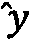定义如下:


在这个等式中， *g* 是激活函数， *w* o 是偏差，最终分量是输入值的**线性组合**的和:

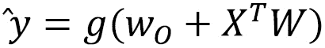

所以，在这个等式中，和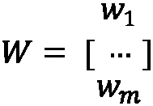占最终输出值。

感知器是最简单的深度学习构建模块之一，可以通过增加**隐藏层**的数量来大幅扩展。隐藏层是位于输入和输出层之间的层。具有很少隐藏层的模型通常被称为**神经网络**或多层感知器，而具有许多隐藏层的模型被称为深度神经网络。

这些层中的每一层都由几个**节点**组成，数据的流动类似于我们之前看到的感知器。输入节点的数量( *x* 1 *，x* 2 *，x* 3)通常与给定数据集中的**特征**的数量相对应，而输出节点的数量通常与输出的数量相对应。

下面的图是神经网络和深度学习之间的差异的图形表示:


图 8.5–神经网络和深度学习之间的区别

在上图中，我们可以看到神经网络或多层感知器(在左侧)由一个输入层、一个具有四个节点的隐藏层和一个具有四个节点的输出层组成。类似于我们之前看到的单个感知机，这里的想法是，隐藏层中的每个节点将接收输入节点，乘以某个值，然后将它们通过一个**激活函数**来产生输出。在右边，我们可以看到一个类似的模型，但是在确定最终输出值之前，这些值要经过几个隐藏层。

## 探索不同类型的深度学习模型

有许多不同类型的神经网络和深度学习架构，它们在功能、形状、数据流等方面都有所不同。近年来，有三种类型的神经网络获得了很大的普及，因为它们对各种类型的数据都有很好的前景和鲁棒性。首先，我们将探索这些架构中最简单的一种，称为多层感知器。

### 多层感知器

一个**多层感知器** ( **MLP** )是**人工神经网络** ( **ANNs** )最基本的类型之一。这种类型的网络只是由数据以向前方式流动的层构成的，如上图所示。数据从输入层流向一个或多个隐藏层，然后最终流向产生预测的输出层。本质上，每一层都试图学习和计算某些权重。ann 和 MLP 有许多不同的形状和大小:它们在每一层中可以有不同数量的节点，不同数量的输入，甚至不同数量的输出。我们可以在下图中看到对此的直观描述:


图 8.6–MLP 的两个示例

MLP 模型通常非常通用，但最常用于结构化表格数据，例如我们一直在处理的结构化蛋白质分类数据集。此外，它们可以用于图像数据甚至文本数据。然而，当涉及到诸如蛋白质序列和时间序列数据集之类的序列数据时，MLP 通常会受到影响。

### 卷积神经网络

**卷积神经网络**(**CNN**)是深度学习算法，常用于处理和分析图像数据。CNN 可以将图像作为输入数据并对其进行重组，以通过权重和偏差来确定重要性，从而使其能够区分一幅图像相对于另一幅图像的特征。类似于我们之前讨论的深度学习如何类似于大脑中的神经元，当涉及到区域的敏感性时，CNN 也类似于人脑和视觉皮层中神经元的连接性，类似于感受野的概念。CNN 模型最大的成功领域之一是它们通过使用过滤器捕捉图像中的空间依赖性以及时间依赖性的能力。我们可以在下图中看到这种情况的直观表示:


图 8.7–CNN 的示意图

让我们以创建图像分类模型的想法为例。我们可以使用人工神经网络，通过展平来转换像素的 2D 图像。一个 4x4 像素矩阵的图像现在会变成 1x16 的矢量。这种改变会导致两个主要缺点:

*   图像的空间特征将会丢失，从而降低任何训练模型的鲁棒性。
*   随着图像大小的增长，输入要素的数量会急剧增加。

CNN可以通过从图像中提取高级特征来克服这一点，使它们在基于图像的数据集上非常有效。

### 递归神经网络

**递归神经网络** ( **RNNs** )是常用算法，一般应用于基于序列的数据集。它们在架构上与我们之前讨论的 ann 非常相似，但是 RNNs 可以使用内部存储器记住它们的输入，这使得它们对于先前数据非常重要的顺序数据集非常有效。

例如，由各种氨基酸组成的蛋白质序列。为了预测蛋白质的类别或其一般结构，该模型不仅需要知道使用了哪些氨基酸，还需要知道它们的使用顺序。rnn 及其许多衍生物已经成为生物学和生物技术领域中深度学习的许多进步的核心。我们可以在下图中看到这种情况的直观表示:


图 8.8-人工神经网络节点与 RNN 节点的示意图

使用 rnn 作为预测模型有几个优点，主要好处如下:

*   他们捕捉数据点(如句子中的单词)之间相关性的能力
*   跨时间步长共享参数的能力，从而降低整体计算成本

正因为如此，rnn 已经成为越来越受欢迎的架构，用于开发解决与科学序列数据(如蛋白质和 DNA，以及文本和时间序列数据)相关的问题的模型。

### 长短期记忆

**长短期记忆** ( **LSTM** )模型是一种 RNN，设计用于在处理基于序列的问题时学习长期依赖性的能力。LSTMs 通常与基于文本的数据一起用于分类、翻译和识别，近年来获得了前所未有的普及。我们可以像以前一样描绘标准 RNN 的结构，但结构稍有不同:


图 8.9-RNN 和 LSTM 的内部工作原理

在上图中， *X* t 是输入向量，*h*t*是隐藏层向量， *o* t 是输出向量。另一方面，使用一些相同的元素，LSTM 可以非常相似地构造。无需深入研究太多细节，LSTM 背后的核心思想是细胞状态(顶部水平线)。这种状态的操作类似于传送带的操作，其中数据线性流过传送带。单元内的门是可选地允许信息被添加到状态的方法。一个 LSTM 有三个门，都通向细胞状态。*

尽管 LSTM 模型和它们相关的图表一开始可能相当吓人，但是它们已经在各个领域一次又一次地证明了它们的价值。最近，LSTM 模型已被用作抗体设计的生成模型，以及蛋白质序列结构分类的分类模型。现在我们已经探索了几种常见的深度学习架构，让我们继续探索它们的主要组件:激活功能。

# 选择激活功能

回想一下，在上一节中，我们使用了一个激活函数将一个值映射到一个特定的输出，这取决于该值。我们将激活函数定义为数学函数，它使用输入值定义单个节点的输出。使用人脑的类比，这些功能只是充当看门人，决定什么将被*发送给*下一个神经元。激活函数应该具有几个特征，以允许模型最有效地从中学习:

*   消失梯度的避免
*   低计算费用

人工神经网络使用一种称为梯度下降的过程进行训练。对于此示例，我们假设有一个两层神经网络:

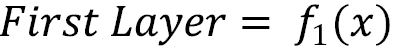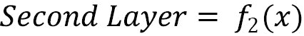

整个网络可以表示如下:

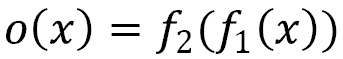

当权重在被称为反向传递的步骤中计算时，结果如下:

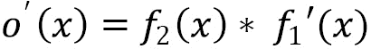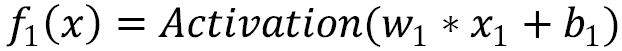

确定导数后，函数变为如下:

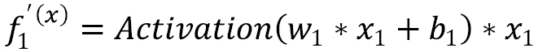

如果该过程在反向传播步骤中通过许多层继续进行，初始层的梯度值将显著降低，因此中止了模型的学习能力。这就是**消失渐变**的概念。

另一方面，计算开销**也是在设计和部署任何给定模型之前必须考虑的一个特性。从一层应用到另一层的激活函数必须被计算许多次，因此计算的费用应该保持最小以避免更长的训练周期。从输入层到输出层的信息流被称为**正向传播**。**

有许多不同类型的激活功能，通常用于各种目的。虽然这不是硬性规定，但有些激活函数一般是用特定的深度学习层来使用的。例如，`sigmoid`和 **Tanh** 激活功能通常与 **RNNs** 一起使用。让我们花点时间来看看您在旅途中可能会遇到的三个最常见的激活功能:


图 8.10–按型号分类的各种激活功能

现在记住了其中的一些类型，让我们继续更详细地探索它们。`sigmoid`函数可能是深度学习领域中最常用的一些函数。它是一个非线性的激活函数，有时也被称为逻辑函数(还记得逻辑回归吗？提示提示)。`sigmoid`函数的独特之处在于它们可以将值映射到 0 或 1。使用`numpy`库，我们可以很容易地组合一个`Python`函数来计算它:

```
import numpy as np
def sigmoid_function(x):
    return 1 / (1 + np.exp(-x))
```

使用这个函数和`numpy`库，我们可以生成一些数据，并相应地绘制出我们的`sigmoid`函数:

```
x1 = np.linspace(-10, 10, 100)
y1 = [sigmoid_function(i) for i in x1]
plt.plot(x1,y1)
```

作为回报，我们给出了下面的图表，展示了一个函数的曲线性质。请注意上限和下限分别是 1 和 0:


图 8.11–一个简单的 sigmoid 函数

`sigmoid`激活功能的最大问题之一是输出会使**饱和**，也就是说大于 1.0 的值被映射为 1，小于 0 的值被映射为 0。这可能导致一些模型无法从数据中归纳或学习，这与我们在本章前面讨论的渐变消失问题有关。

另一方面，另一个常见的激活功能是`sigmoid`功能。双曲正切函数是对称的，因为它通过点(0，0 ),其取值范围为 1 和-1，不像它的对应函数`sigmoid`,这使它成为一个稍微好一点的函数。我们可以利用`numpy`库中的优化函数，而不是像以前那样用 Python 定义函数:

```
x2 = np.linspace(-5, 5, 100)
y2 = np.tanh(x2)
plt.plot(x2, y2)
```

执行这段代码后，我们检索下图。请注意，图表的中心是点(0，0)，而上限值和下限值分别是 1.00 和-1.00:


图 8.12-一个简单的双曲正切函数

类似于它的`sigmoid`对应物`sigmoid`，使它成为一个使用起来稍微好一点的功能。

最后，另一个常用的激活功能是**整流线性单元** ( **ReLU** )。 **ReLU** 激活功能是专门为避免处理大量数据时出现饱和而开发的。该函数的非线性性质允许它学习数据中的模式，而该函数的线性性质允许它相对于我们到目前为止看到的其他函数更容易解释。让我们继续用 Python 来探索这一点:

```
def relu_function(x):
    return np.array([0, x]).max()
x3 = np.linspace(-5, 5, 100)
y3 = [relu_function(i) for i in x3]
plt.plot(x3, y3)
```

执行这段代码会生成下图。请注意 **ReLU** 函数是如何利用激活函数的线性和非线性特性的，从而让它两全其美:


图 8.13–一个简单的 ReLU 函数

**ReLU** 激活函数已经成为数据科学家中最受欢迎的激活函数之一，如果不是**最受欢迎的话，因为它易于实现，并且在模型开发和训练过程中速度非常快。然而，激活功能也有其缺点。例如，当 x = 0(在点 0，0)时，函数不可微，因此不能为该值计算**梯度下降**。**

另一个值得一提的激活功能被称为 **Softmax** 。Softmax 与我们到目前为止看到的其他激活函数非常不同，因为它为一系列值计算概率分布，这些值与向量中每个值的相对比例成比例，总和总是等于 1。

一般用于`numpy`库:

```
def softmax_function(x):
    ex = np.exp(x - np.max(x))
    return ex / ex.sum()
x4 = [1, 2, 3, 4, 5]
y4 = softmax_function(x4)
print(y4)
```

在打印值时，我们检索以下结果:


图 8.14–soft max 函数的结果

使用 **Softmax** 作为激活函数的两个主要优点是输出值的范围在 0 和 1 之间，并且它们的总和总是 1.0。反过来，当涉及到散度的概念时，这允许该函数用于理解交叉熵。我们将在本章后面更详细地探讨这个主题。

到目前为止，我们已经访问过的各种激活函数在各种应用程序中使用时都有各自的优缺点。例如，`sigmoid`函数通常用于二值和多值分类应用，而 **Softmax** 函数通常用于多值分类。这并不是一个硬性规定，只是一个帮助您将最有可能成功的功能与其各自的应用相匹配的指南:


图 8.15–按问题类型划分的激活功能

激活功能是任何深度学习模型的重要组成部分，通常被视为*游戏规则改变者*，因为简单地将一个功能改变为另一个功能可以大幅提升模型的性能。我们将在下一节中详细了解如何在深度学习的范围内量化模型性能。

# 用损失衡量进度

当我们讨论分类和回归的领域时，我们概述了一些度量标准来度量和量化我们的模型相对于彼此的性能。在分类时，我们使用**精度**和**准确度**，而在回归中，我们使用 **MAE** 和 **MSE** 。在深度学习的范围内，我们将使用一个被称为**损失**的指标。一个神经网络的**损失**仅仅是对做出错误预测所产生的成本的一种衡量。以一个简单的神经网络为例，它有三个输入值和一个输出值:


图 8.16-显示输入和输出值的神经网络

在这种情况下，我们将值*【2.3，3.3，1.2】*用作模型的输入值，相对于实际值 1.0，预测值为 0.2。我们可以证明损失如下:

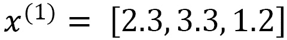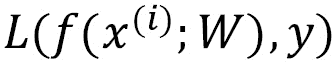

在该功能中，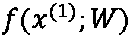是预测值，而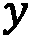是实际值。

**另一方面，经验损失**是对整个数据集的总损失的度量。我们可以将经验损失表示如下:

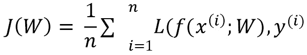

在此函数中，我们对所有计算的总损失进行求和。

在整个模型训练过程中，我们的主要目标将是在称为**损失优化**的过程中最小化这种损失。损耗优化背后的主要思想是确定一组权重，帮助实现尽可能最低的损耗。我们可以将梯度下降的概念想象为从高损耗的初始值移动到低损耗的最终值的过程。我们的目标是确保收敛于全局最小值而不是局部最小值，如下图所示:


图 8.17–损失优化过程

我们为接近最小值而采取的每一步被称为**学习步骤**，其**学习速率**通常由用户决定。这个参数只是我们可以使用 Keras 指定的众多参数之一，我们将在下一节中了解这些参数。

## 使用 Keras 进行深度学习

在数据科学领域，各种**框架**的可用性和使用对于我们用来开发和部署模型的方法的标准化来说总是至关重要的。到目前为止，我们已经将我们的机器学习工作集中在使用 scikit-learn 框架上。在本节中，我们将了解三个专门关注深度学习的新框架: **Keras** 、 **TensorFlow** 和 **PyTorch** 。当谈到开发各种深度学习模型时，这两个框架是数据科学家中最受欢迎的两个，因为它们为众多问题和用例提供了全面的 API 列表。

## 了解 Keras 和 TensorFlow 之间的差异

虽然这两个平台允许用户开发深度学习模型，但有一些差异需要了解。TensorFlow 被认为是一个端到端的机器学习平台，提供了一个全面的库、工具和众多资源的列表。用户可以管理数据、开发模型和部署解决方案。与大多数其他库不同， **TensorFlow** 通过它们的 API 提供了低级和高级的抽象，在开发模型时给了用户很大的灵活性。另一方面， **Keras** 提供了开发神经网络的高级 API，使用 **TensorFlow** 运行。该库的高级性质允许用户仅用几行 Python 代码就开始开发和训练复杂的神经网络。Keras 通常被认为是用户友好的、模块化的和可扩展的。第三个库存在，通常用于深度学习领域，称为 PyTorch。 **PyTorch** 是一个低级 API，以其在模型训练过程中显著的速度和优化而闻名。该库中的体系结构通常很复杂，不适合作为入门材料，因此它们不在本书的讨论范围之内。然而，值得一提的是，它是你可能会遇到的机器学习领域中最常见的库之一。让我们仔细看看这三个方面:


图 8.18–三种最常见的深度学习框架之间的比较

这些库各有利弊，你应该根据你要完成的任务选择其中一个。鉴于我们是第一次探索深度学习模型的开发，我们将专注于使用 Keras 库。

## 【Keras 和 ann 入门

在我们进入完整教程之前，让我们看一个使用`Keras`库的例子，因为我们还没有探究它的功能和代码:

1.  首先，我们需要一些样本数据来使用。让我们利用`sklearn`中的`make_blobs`类来创建一个`classification`数据集。
2.  我们将指定需要两个类(二元分类)和一个分类标准偏差`5`，以确保两个分类重叠，使其成为一个更难处理的数据集:

    ```
    from sklearn.datasets import make_blobs X, y = make_blobs(n_samples=2000, centers=2, n_features=4, random_state=1, cluster_std=5)
    ```

3.  接下来，我们可以使用`MinMaxScaler()`类:

    ```
    from sklearn.preprocessing import MinMaxScaler scalar = MinMaxScaler() scalar.fit(X) X_scaled = scalar.transform(X)
    ```

    缩放数据
4.  在这个转换之后，我们可以将数据分成训练集和测试集，类似于我们之前所做的:

    ```
    from sklearn.model_selection import train_test_split X_train, X_test, y_train, y_test = train_test_split(X_scaled, y, test_size=0.25)
    ```

5.  Let's go ahead and convert the array into a DataFrame to check the first few rows of data beforehand:

    ```
    dfx_train = pd.DataFrame(X_train, columns=["Feature1", "Feature2", "Feature3", "Feature4"])
    dfx_train.head()
    ```

    这将呈现下表:

    

    图 8.19–特征数据框中的数据示例

6.  We can check the overlap of the two clusters by using the `seaborn` library to plot the first two of the four features of the training dataset:

    ```
    sns.scatterplot(x=dfx_train.Feature1, y=dfx_train.Feature2, hue=y_train)
    ```

    下图显示了上述代码的输出:

    

    图 8.20-数据集的散点图，显示了两个类别的重叠性质

    在这里，我们可以看到数据混合得非常好，这使得我们探索的一些机器学习模型很难以高度的**准确性**来区分这两个类别。

7.  准备好数据后，我们可以继续使用 Keras 库。建立模型最流行的方法之一是使用来自`Keras`的`Sequential()`类。让我们继续导入该类并实例化一个新模型:

    ```
    from keras.models import Sequential model = Sequential()
    ```

8.  现在模型已经实例化了，我们可以使用`Dense`类向模型添加一个新层。我们还可以指定`nodes` ( `4`)、`input_shape`(四个特征的`4`)、`activation` ( `relu`)的数量，以及一个唯一的`name`用于层:

    ```
    from keras.layers import Dense model.add(Dense(4, input_shape=(4,), activation='relu', name="DenseLayer1")) 
    ```

9.  To review the model we have built so far, we can use the `summary()` function:

    ```
    model.summary()
    ```

    这将给我们一些到目前为止关于该模型的信息和细节:

    

    图 8.21–模型摘要的样本输出

10.  我们可以通过简单地在事后再次使用`model.add()`函数向我们的模型添加更多的层，甚至可能使用不同数量的节点:

    ```
    model.add(Dense(8, activation='relu', name="DenseLayer2"))
    ```

11.  由于我们正在开发一个`0`和`1`，我们只能有一个来自模型的输出值。因此，我们需要再添加一层，将节点数量从 8 个减少到 1 个。此外，我们将激活更改为`sigmoid` :

    ```
    model.add(Dense(1, activation='sigmoid', name="DenseLayer3"))
    ```

12.  Now that our model's general architecture has been set up, we will need to use the compile function and specify our loss. Since we are creating a binary classifier, we can use the `binary_crossentropy` loss and specify accuracy as our main metric of interest:

    ```
    model.compile(loss='binary_crossentropy', optimizer='adam', metrics=["accuracy"])
    ```

    准备好模型后，让我们使用 summary 函数再次检查它:

    

    图 8.22–模型摘要的样本输出

    到目前为止，模型相当简单。它将在第一层获取一个具有四个特征的数据集，在第二层将其扩展到八个节点，然后在第三层将其缩减为一个输出。模型设置好了，我们就可以开始训练它了。

    我们可以通过使用`model.fit()`函数和指定`X_train`和`y_train`集合来训练一个模型。此外，我们将指定 50 辆`epochs`进行训练。**时期**就是简单的通过或迭代的次数。我们还可以控制模型的详细程度，从而允许我们控制我们希望在训练过程中看到的输出数据量。

13.  Recall that, in our earlier machine learning models, we only used the training data to train the model and kept the testing data to test the model after the training was completed. We will use the same methodology here as well; however, we will take advantage of the high-level nature of `validation split` to be used in the training process. Deep learning models will almost always overfit your data. Using a validation split in the training process can help mitigate this:

    ```
    history = model.fit(X_train, y_train, epochs=50, verbose=1, validation_split=0.2)
    ```

    随着模型开始训练过程，它将开始产生以下输出。您可以通过查看左边的**时期**的数量和右边的**指标**来监控这里的性能。在训练模型时，我们的目标是确保**损失**指标不断降低，而准确性不断提高。我们可以在下面的截图中看到这样的例子:

    

    图 8.23-一个模型输出的例子

14.  With the model trained, let's quickly examine the classification metrics, as we did previously, to get a sense of the performance. We can begin by making predictions using the testing data and using the `classification_report` to calculate our metric. Note that the `predict()` method does not return a class but a probability that needs to be rounded to either `0` or `1`, given that this is a **binary classification** problem:

    ```
    y_pred = (model.predict(X_test) > 0.5).astype("int32").ravel()
    from sklearn.metrics import classification_report
    print(classification_report(y_pred, y_test))
    ```

    在打印报告时，我们将得到以下结果:

    

    图 8.24–模型的结果

15.  We can see that the `history` variable, which contains the model's training history:

    ```
    fig = plt.figure(figsize=(10,10))
    # total_rows, total_columns, subplot_index(1st, 2nd, etc..)
    plt.subplot(2, 2, 1)
    plt.title("Accuracy", fontsize=15)
    plt.xlabel("Epochs", fontsize=15)
    plt.ylabel("Accuracy (%)", fontsize=15)
    plt.plot(history.history["val_accuracy"], label='Validation Accuracy', linestyle='dashed')
    plt.plot(history.history["accuracy"], label='Training Accuracy')
    plt.legend(["Validation", "Training"], loc="lower right")
    plt.subplot(2, 2, 2)
    plt.title("Loss", fontsize=15)
    plt.xlabel("Epochs", fontsize=15)
    plt.ylabel("Loss", fontsize=15)
    plt.plot(history.history["val_loss"], label='Validation loss', linestyle='dashed')
    plt.plot(history.history["loss"], label='Training loss')
    plt.legend(["Validation", "Training"], loc="lower left")
    ```

    执行该代码后，我们将收到下图，其中显示了模型训练过程中精度和损失的变化:


图 8.25-模型的准确性和损失

在训练模型时，记住主要目标是确保损失减少，而不是随着时间增加。此外，我们的次要目标是确保我们的模型的准确性缓慢而稳定地增加。当试图诊断一个表现不佳的模型时，第一步是生成这样的图，以便在改变模型以试图改进度量标准之前了解任何潜在的问题。

当我们使用前几章中的大多数机器学习模型时，我们了解到我们可以通过执行以下操作来改变这些指标:

*   改进我们的数据预处理。
*   调整我们的超参数或改变模型。在深度学习的范围内，除了前面提到的选项，我们还需要改变一些工具来满足我们的需求。例如，我们可以通过添加或删除层和节点来改变整体架构。此外，我们可以将每一层中的激活函数更改为最能补充我们的问题陈述的函数。我们还可以改变优化器或优化器的学习率(在这个模型中是 Adam)。

有这么多的变化可能会对任何给定的模型产生重大影响，我们需要组织我们的工作。我们可以创建许多模型，并在电子表格中手工记录我们的度量，或者我们可以利用专门设计的库来处理用例，例如: **MLflow** 。在下一节中，我们将进一步了解 **MLflow** 。

# 教程–使用 Keras 和 MLflow 通过 LSTMs 进行蛋白质序列分类

近年来，深度学习越来越受欢迎，促使许多科学家转向该领域，将其作为解决和优化科学问题的新手段。生物技术领域深度学习最受欢迎的应用之一涉及**蛋白质序列**数据。到目前为止，在本书中，当涉及到**结构化**数据时，我们已经将精力集中在开发预测模型上。我们现在将注意力转向数据的**顺序**，在这个意义上，一个序列中的元素与它们之前的元素有某种关系。在本教程中，我们将尝试开发一个蛋白质**序列分类**模型，在该模型中，我们将使用**Pfam**([https://pfam.xfam.org/](https://pfam.xfam.org/))数据集，根据已知的家族成员对蛋白质序列进行分类。

重要说明

`Pfam`数据集:Pfam:2021 年的蛋白质家族数据库 J. Mistry，S. Chuguransky，L. Williams，M. Qureshi，G.A. Salazar，E.L.L. Sonnhammer，S.C.E. Tosatto，L. Paladin，S. Raj，L.J. Richardson，R.D. Finn，a . Bateman nucleic Acids Research(2020)doi:10.1093/NAR/gkaa 913(。

`Pfam`数据集由几列组成，如下所示:

*   `Family_id`:序列所属家族的名称(例如 filamin)
*   `Family Accession`:我们的模型要预测的类或输出
*   `Sequence`:我们将用作模型输入的氨基酸序列

在整个教程中，我们将使用序列数据来开发几个预测模型以确定每个序列的相关家族遗传。序列处于原始状态，具有不同的长度和大小。我们需要对数据进行预处理，并对其进行结构化，以便为序列分类做准备。当谈到标签时，我们将使用不同标签的**平衡**集来开发一个模型，以确保模型不会学习任何特定的偏差。

当我们开始开发我们的理想分类模型时，我们将需要改变许多可能的参数来最大化性能。为了跟踪这些变化，我们将使用ml flow([https://mlflow.org](https://mlflow.org))库。在 **MLflow** 中有四个主要的组件:

*   **MLflow Tracking** :允许用户记录和查询实验
*   **MLflow 项目**:封装数据科学代码
*   **MLflow 模型**:部署经过训练的机器学习模型
*   **MLflow Registry** :存储和管理你的模型

在本教程中，我们将探讨如何使用 MLflow 跟踪来跟踪和管理蛋白质序列分类模型的开发。记住这些项目，让我们开始吧。

## 导入必要的库和数据集

我们将从标准的库导入集开始，然后是 CSV 文档格式的数据集:

```
import pandas as pd
import numpy as np
from tensorflow.keras.utils import to_categorical
import matplotlib.pyplot as plt
import seaborn as sns
sns.set_style("darkgrid")
```

现在导入了库，我们也可以导入数据集了。我们将从指定路径开始，然后使用一个`for`循环连接数据集:

```
PATH = "../../../datasets/dataset_pfam/"
files = []
for i in range(8):
    df = pd.read_csv(PATH+f"dataset_pfam_seq_sd{i+1}.csv", index_col=None, header=0)
    files.append(df)

df = pd.concat(files, axis=0, ignore_index=True)
df.shape
```

在导入数据集时，我们立即注意到它包含了 5 列和大约 130 万行数据——比我们到目前为止所处理的略大。我们可以使用`.head()`函数快速浏览一下数据集:


图 8.26–蛋白质序列数据集中的数据样本

成功导入数据集后，让我们继续更详细地研究数据集。

## 检查数据集

我们可以使用`isna()`函数确认该数据帧中数据的完整性，然后使用`sum()`函数按列汇总:

```
df.isna().sum()
```

现在，让我们仔细看看这个数据集的`family_accession`列(我们模型的输出)。我们可以通过对列进行分组并使用`value_counts()`函数，然后使用`n_largest()`函数来检查实例的总数，以获得该列中前 10 个最常见的条目:

```
df["family_accession"].groupby(df["family_accession"]).value_counts().nlargest(10)
```

将数据分组将产生以下结果:


图 8.27-数据集中值计数高于 1，200 的类的汇总

在这里，我们可以看到 1500 个条目似乎是前 10 个值的分界点。我们还可以通过了解序列的平均长度来仔细查看序列列(我们模型的输入)。我们可以使用`seaborn`库中的`displot()`函数绘制每个序列长度的计数:

```
sns.displot(df["sequence"].apply(lambda x: len(x)), bins=75, height=4, aspect=2) 
```

执行这段代码将产生以下结果:


图 8.28–数据集中序列长度计数的直方图

从这个图中，以及通过使用`mean()`和`median()`函数，我们可以看到平均和最常见的长度大约是 155 和 100 个氨基酸。我们将在以后确定输入序列的截止值时使用这些数字。

现在，我们已经对数据有了更好的理解，是时候为我们的分类模型准备数据集了。理论上，我们可以将数据集作为一个整体无限制地训练模型，但是，训练模型需要更长的时间。此外，通过在不考虑平衡的情况下对所有数据进行训练，我们可能会在模型中引入偏差。为了缓解这两种情况，让我们通过过滤至少具有 1200 个**观察值**的分类来减少该数据集:

```
df_filt = df.groupby("family_accession").filter(lambda x: len(x) > 1200)
```

考虑到一些类有超过 1200 个观察值，我们可以使用`sample()`函数随机选择 1200 个观察值:

```
df_bal = df_filt.groupby('family_accession').apply(lambda x: x.sample(1200))
```

我们现在可以使用`head()`功能检查过滤和平衡的数据集:

```
df_red = df_bal[["family_accession", "sequence"]].reset_index(drop=True)
df_red.head()
```

`head()`功能将产生以下结果:


图 8.29-数据框形式的数据示例

我们可以通过检查`value_counts()`函数的长度来检查我们将在这个数据集中拥有的类的数量:

```
num_classes = len(df_red.family_accession.value_counts())
```

如果我们检查`num_classes`变量，我们将看到总共有 28 个可能的类。

## 分割数据集

准备好数据后，我们的下一步将是把数据集分成训练集、测试集和验证集。我们将再次利用`sklearn`中的`train_test_split`函数来实现这一点:

```
from sklearn.model_selection import train_test_split
X_train, X_test = train_test_split(df_red, test_size=0.25)
X_val, X_test = train_test_split(X_test, test_size=0.50)
```

现在数据已经分割，让我们继续预处理它。

## 数据预处理

随着数据的分离，我们需要预处理数据集以用于我们的神经网络模型。首先，我们需要将序列减少到 20 个最常见的氨基酸，并将序列转换成整数。这将加快培训过程。首先，我们将创建一个包含相应值的氨基酸字典:

```
aa_seq_dict = {'A': 1,'C': 2,'D': 3,'E': 4,'F': 5,'G': 6,'H': 7,'I': 8,'K': 9,'L': 10,'M': 11,'N': 12,'P': 13,'Q': 14,'R': 15,'S': 16,'T': 17,'V': 18,'W': 19,'Y': 20}
```

接下来，我们可以对序列进行迭代，并将字符串值转换为相应的整数。请注意，我们将为训练集、测试集和验证集完成此操作:

```
def aa_seq_encoder(data):
    full_sequence_list = []
    for i in data['sequence'].values:
        row_sequence_list = []
        for j in i:
            row_sequence_list.append(aa_seq_dict.get(j, 0))
        full_sequence_list.append(np.array(row_sequence_list))
    return full_sequence_list

X_train_encode = aa_seq_encoder(X_train) 
X_val_encode = aa_seq_encoder(X_val) 
X_test_encode = aa_seq_encoder(X_test)
```

接下来，我们将需要填充序列，以确保它们的长度相等。为此，我们可以使用`keras`中的`pad_sequences`函数。我们将指定每个序列的`max_length`为 100，因为它接近我们之前看到的中值。此外，我们将使用`'post'`填充序列，以确保我们将它们填充在末端而不是前端:

```
from keras.preprocessing.sequence import pad_sequences
max_length = 100
X_train_padded = pad_sequences(X_train_encode, maxlen=max_length, padding='post', truncating='post')
X_val_padded = pad_sequences(X_val_encode, maxlen=max_length, padding='post', truncating='post')
X_test_padded = pad_sequences(X_test_encode, maxlen=max_length, padding='post', truncating='post')
```

我们可以快速浏览一下使用其中一个序列所做的更改。首先，我们将原始序列作为`string`:

```
X_train.sequence[1][:30]
'LRDLRHFLAVAEEGHIGRAAARLHLSQPPL'
```

接下来，我们可以对序列进行编码，删除不常见的氨基酸，并将字符串转换为整数列表:

```
X_train_encode[1][:30]
array([ 7, 10, 15, 18, 10,  3, 18, 16, 14, 17, 15,  5, 12, 10,  7, 16, 15, 12, 12,  8, 18,  4, 14,  5, 17,  4,  2])
```

最后，我们可以限制序列的长度，要么在 100 个元素处将其截断，要么**用零填充**以达到 100 个元素:

```
X_train_padded[1][:30]
array([ 7, 10, 15, 18, 10,  3, 18, 16, 14, 17, 15,  5, 12, 10,  7, 16, 15, 12, 12,  8, 18,  4, 14,  5, 17,  4,  2,  0,  0,  0])
```

既然我们已经预处理了输入数据，我们还需要预处理输出值。我们可以使用`sklearn`中的`LabelEncoder`类来实现。我们的主要目标是将 dataframe 列中的标签列表中的值转换为编码列表:

```
from sklearn.preprocessing import LabelEncoder
le = LabelEncoder()
y_train_enc = le.fit_transform(X_train['family_accession'])
y_val_enc = le.transform(X_val['family_accession'])
y_test_enc = le.transform(X_test['family_accession'])
```

最后，我们可以使用`sklearn`中的`to_categorical`函数将一个类向量转换成一个二进制类矩阵:

```
from tensorflow.keras.utils import to_categorical
y_train = to_categorical(y_train_enc)
y_val = to_categorical(y_val_enc)
y_test = to_categorical(y_test_enc)
```

为了回顾我们在这里所做的更改，我们可以在`DataFrame`中使用一个单独的列:

```
X_train['family_accession']
```

我们可以在下图中看到结果:


图 8.30–类别列表

接下来，我们必须将类编码成一个数值列表，每个值代表一个特定的类:

```
y_train_enc
array([ 4,  3, 21, ..., 10, 15, 12], dtype=int64)
```

最后，我们必须将该结构转换成一个**二进制类矩阵**，这样每一行由 27 个 0 值和一个 1 值组成，代表它所属的类:

```
y_train[5]
array([0., 0., 0., 0., 0., 0., 0., 0., 0., 0., 0., 0., 0., 0., 0., 0., 0., 0., 1., 0., 0., 0., 0., 0., 0., 0., 0., 0.], dtype=float32)
```

至此，我们的数据集已经过充分的预处理，可以在本教程的模型开发阶段使用了。

## 用 Keras 和 MLflow 开发模型

类似于我们之前用`Keras`库开发模型的示例，我们将再次使用`Sequential`类:

1.  我们将开始从 Keras 导入我们需要的图层和其他项目:

    ```
    import tensorflow as tf from keras.models import Sequential from keras.layers import Dense, Conv1D, MaxPooling1D, Flatten, Input, Bidirectional, LSTM, Dropout from keras.layers.embeddings import Embedding from keras.regularizers import l2 from keras.models import Model import mlflow import mlflow.keras
    ```

2.  现在，我们可以使用 sequential 类创建一个新的模型实例，并开始通过添加一些感兴趣的层来填充它。我们将从添加一个嵌入层开始，将正整数转换为稠密向量。我们将指定一个`21`的`input_dim`来表示氨基酸指数+ 1 的大小，以及一个`output_dim`32。此外，我们将指定一个与`max_length`相等的`input_length`——序列的长度:

    ```
    model = Sequential() model.add(Embedding(21, 8, input_length=max_length, name="EmbeddingLayer"))
    ```

3.  接下来，我们将添加一个 LSTM 层，包裹在一个`Bidirectional`层中，在两个方向上运行输入——从过去到未来和从未来到过去:

    ```
    model.add(Bidirectional(LSTM(8), name="BidirectionalLayer"))
    ```

4.  接下来，我们将添加一个`Dropout`层来帮助防止模型过度拟合:

    ```
    model.add(Dropout(0.2, name="DropoutLayer"))
    ```

5.  最后，我们将以一个`Dense`层结束，并将节点数设置为`28`，这样与输出的形状相对应。请注意，我们在这里使用了 Softmax 激活:

    ```
    model.add(Dense(28, activation='softmax', name="DenseLayer"))
    ```

6.  准备好模型的架构后，我们可以分配一个优化器(Adam)，编译模型，并检查概要:

    ```
    opt = tf.keras.optimizers.Adam(learning_rate=0.1) model.compile(optimizer=opt, loss='categorical_crossentropy', metrics=['accuracy'])
    ```

7.  现在，让我们继续使用`fit()`函数训练我们的模型，并分配 30 个时期。从我们之前的教程中注意到，训练深度学习模型可能非常耗时且昂贵，因此训练一个不学习的模型可能是对时间的重大浪费。为了缓解这种情况，我们可以实现所谓的回调，当模型不再学习(即损失不再减少)时，Keras 可以结束训练期:

    ```
    from keras.callbacks import EarlyStopping es = EarlyStopping(monitor='val_loss', patience=5, verbose=1)
    ```

8.  Finally, we can go ahead and log our new run in MLflow by calling the `autolog()` function and fitting the model, as we did previously. MLflow offers many different methods to log both parameters and metrics, and you are not limited to using just `autolog()`:

    ```
    mlflow.keras.autolog()
    history = model.fit(
        X_train_padded, y_train,
        epochs=30, batch_size=256,
        validation_data=(X_val_padded, y_val),
        callbacks=[es]
        )
    ```

    假设你正确地遵循了这些步骤，模型将会打印一个说明 MLflow 正在被使用，你应该会看到一个新的目录出现在你当前的笔记本旁边。完成培训过程后，您可以像我们之前所做的那样绘制结果，以得到下图:


图 8.31-该模型第一次迭代的准确性和结果

在这里，我们可以看到精确度似乎停留在 80-85%左右，而损失停留在 0.6 到 0.8。我们可以看到模型没有在学习。也许需要改变参数？让我们继续将节点数从`8`更改为`12`，将学习速率从`0.1`更改为`0.01`。在编译新模型、调用`autolog()`函数和训练新数据集之后，我们将得到一个新的图表:


图 8.32-该模型下一次迭代的准确性和结果

在这里，我们可以看到模型的损失，无论是训练还是验证，都很好地减少了，直到回调在大约 30 个时期停止了训练。或者，精度显示在开始时急剧增加，随后在接近结束时稳定增加，也在过程中的 30 个时期停止。我们可以不断地进行我们的更改，并一遍又一遍地调用`autolog()`函数，允许系统代表我们记录更改和结果指标。在几次迭代之后，我们可以使用`mlflow ui`来检查我们的模型的性能。在笔记本本身中，输入以下命令:

```
!mlflow ui
```

接下来，导航到`http://localhost:5000/`。在那里，您将能够看到`MLflow` UI，在那里您将能够查看模型、它们的参数以及它们的相关指标:


图 8.33–ml flow 用户界面示例

有了这个，你就可以选择最佳模式并推进你的项目。

## 评估模型的性能

现在已经选出了表现最好的模型，让我们更好地了解它的相关`classification_report`，就像我们之前所做的那样，精确度和召回率都接近 99%。或者，我们可以使用混淆矩阵来更好地理解数据，假设我们总共有 28 个类:

```
from sklearn.metrics import confusion_matrix
y_pred = model.predict(X_test_padded)
cf_matrix = confusion_matrix(np.argmax(y_test, axis=1), np.argmax(y_pred, axis=1))
```

计算出混淆矩阵后，我们可以使用热图来可视化结果:

```
import seaborn as sns
plt.figure(figsize=(15,10))
sns.heatmap(cf_matrix, annot=True, fmt='', cmap='Blues')
```

执行此操作后，我们将得到下图:


图 8.34-模型结果的混乱矩阵

在这里，我们可以看到模型的性能相当稳定，因为它给我们带来了很好的结果！Keras、TensorFlow 和 PyTorch 是很好的软件包，可以帮助我们开发健壮的、高影响力的模型来解决特定的解决方案。通常，我们会发现可能有一个模型(或一组模型)已经通过 AWS 存在，它可以用很少甚至不用代码来解决我们的复杂问题。我们将在下一节中探讨一个这样的例子。

# 教程——使用 AWS Lookout for Vision 进行制造业中的异常检测

在前面的部分中，我们准备并训练了一个深度学习模型，以将蛋白质分类到给定的类别中。我们经历了预处理数据、开发模型、测试参数、编辑架构以及选择一个组合来最大化我们感兴趣的指标的过程。虽然这个过程通常会产生好的结果，但我们有时可以利用平台架构，比如 AWS 的平台架构，代表我们的自动开发模型。在本教程中，我们将利用一个名为**AWS Lookout for Vision**([https://aws.amazon.com/lookout-for-vision/](https://aws.amazon.com/lookout-for-vision/))的工具来帮助我们准备一个能够检测数据集内异常的模型。

在本教程中，我们将使用一个数据集，该数据集包含与**药品** ( **DP** )的生产相关的图像。每个图像由一个小瓶组成，该小瓶的图像是在制造周期结束时捕获的。大部分药瓶都是干净的，没有任何杂质。但是，一些样品瓶中含有少量杂质，如下图所示:


图 8.35–合格药瓶与损坏药瓶的对比示例

剔除损坏或不纯样品瓶的过程通常由人工完成，非常耗时。我们的任务是实现这个问题的自动化解决方案，我们只有几天的时间来做这件事。我们可以利用 **Amazon Lookout for Vision** ，而不是开发我们自己的定制深度学习模型来检测图像中的异常。在本教程中，我们将开始上传我们的图像数据集到 S3，导入图像到框架中，并开始训练我们的模型。记住这一点，让我们开始吧！

在本书的 GitHub 资源库中，您可以找到一个名为`vials_input_dataset_s3`的目录，其中包含了一系列正常和损坏的药瓶。如果我们仔细看看我们的数据集，我们会注意到它是使用目录层次结构构建的，如下图所示:


图 8.36–合格药瓶与损坏药瓶的对比示例

我们首先将图像导入到本书中一直使用的同一个 S3 桶中:

1.  首先，从 AWS 控制台导航到 S3，并选择感兴趣的时段。在这种情况下，我会选择**生物技术机器学习**。
2.  接下来，点击橙色的**上传**按钮，选择 **vials_input_dataset_s3** 文件夹，点击**上传**。此过程可能需要一些时间，具体取决于您的互联网连接。
3.  现在，点击页面右上角的**复制 S3·URI**按钮。我们一会儿就需要这个 URI。

现在，我们的数据可供在我们的 S3 桶中使用。接下来，我们可以专注于获取与模型一起导入的数据，并开始模型训练过程:

1.  To begin, navigate to Amazon Lookout for Vision, which is located in the AWS console. Then, click the **Get started** button:

    图 8.37–亚马逊视觉了望台的首页

2.  点击页面右侧的**创建项目**按钮，并为您的项目命名。
3.  创建项目后，点击页面左侧的**创建数据集**按钮。
4.  Select the second option to **Create a training dataset and test dataset**:

    图 8.38–在 AWS Lookout for Vision 中创建数据集

5.  Next, within the `training` to the path, as shown in the following screenshot:

    图 8.39–在 AWS Lookout for Vision 中创建数据集

6.  此外，确保选择**自动贴标**选项，以确保我们的标签被 AWS 接收。
7.  对测试数据集重复同样的过程，但是一定要添加单词`validation`来代替 sure 路径中的 training。然后，点击**创建数据集**。
8.  一旦数据集被创建，您将被带到一个新页面，在这里您可以直观地检查数据集的准备情况。然后，您可以点击页面右上角的**训练模型**按钮，开始模型训练过程。此过程可能很耗时，可能需要几个小时:


图 8.40–训练模型前的数据集

通过这样做，您将看到模型的最终结果，其中将显示精确度、召回率和 F1 分数，如下面的屏幕截图所示:


图 8.41–模型性能指标页面

随着最后一步的完成，我们已经成功开发了一个能够检测制造过程中异常情况的健壮模型！我们不仅能够在短短几个小时内创建模型，而且能够在没有任何代码的情况下做到这一点！

# 总结

在这一章中，我们迈出了一大步，涵盖了深度学习和神经网络的*必须知道的*元素的相当一部分。首先，我们研究了神经网络的根源以及它们是如何产生的，然后深入到感知器的概念及其功能的基本形式。然后我们开始了探索四个最常见的神经网络的旅程:MLP、CNN、RNN 和 LSTM。我们更好地理解了如何选择激活函数，测量损耗，以及使用 Keras 库实现我们的理解。

接下来，当我们处理第一个具有序列性质的数据集时，我们采取了一种更少理论性、更多实践性的方法。我们花了大量的时间预处理我们的数据，开发我们的模型，用 MLflow 组织我们的模型开发，并审查它的性能。按照这些步骤，我们可以为手头的问题创建一个定制的、非常适合的模型。最后，我们采用了一种无代码方法，通过使用 AWS Lookout for Vision 来训练一个能够检测小瓶图像中异常的模型。

深度学习和神经网络的应用肯定在过去几年中出现了大幅增长，在下一章中，我们将看到深度学习的应用，因为它与自然语言处理有关。