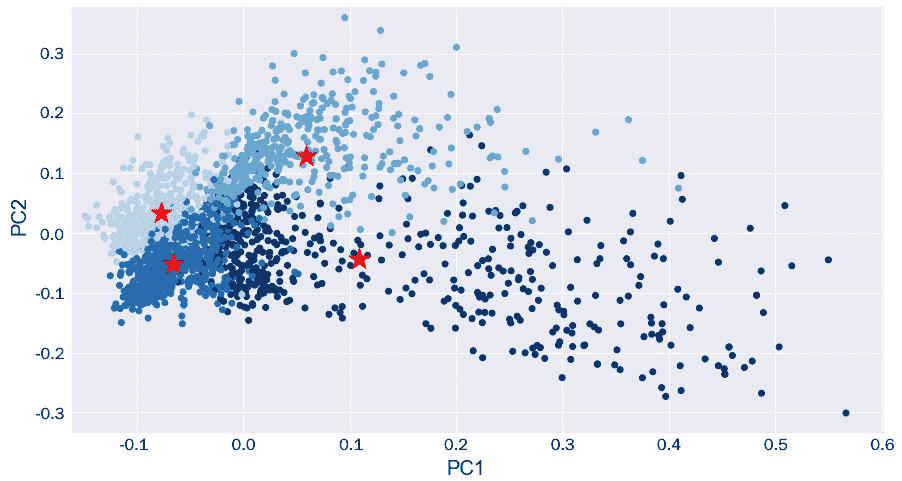

# 九、自然语言处理

在前一章中，我们讨论了使用深度学习不仅可以处理表格形式的结构化数据，还可以处理元素顺序很重要的基于序列的数据。在这一章中，我们将讨论另一种形式的基于序列的数据——文本，这个领域被称为**自然语言处理** ( **NLP** )。我们可以将 NLP 定义为人工智能的一个子集，它与机器学习和深度学习领域重叠，特别是在语言学和计算机科学领域之间的交互方面。

使用 NLP 完成各种任务，有许多广为人知且记录良好的应用和成功案例。从垃圾邮件检测器到文档分析器，各种产品都在一定程度上涉及到 NLP。在这一章中，我们将探讨几个不同的领域和涉及自然语言处理的应用。

正如我们在迄今为止探索的数据科学的许多其他领域中所观察到的那样，NLP 领域同样广阔而稀疏，有着无数的工具和应用，这是一本书永远无法完全涵盖的。在本章中，我们将尽可能多地强调您可能会遇到的最常见和最有用的应用。

在这一章中，我们将从结构化和非结构化数据的角度探索许多与 NLP 相关的热门领域。我们将探讨几个主题，如实体识别、句子分析、主题建模、情感分析和自然语言搜索引擎。

在本章中，我们将讨论以下主题:

*   自然语言处理简介
*   使用 NLTK 和 SciPy 开始使用 NLP
*   使用结构化数据
*   教程–抽象聚类和主题建模
*   使用非结构化数据
*   教程-使用变压器开发科学数据搜索引擎

带着这些目标，让我们开始吧。

# 自然语言处理简介

在**生物技术**的范围内，我们经常因为许多原因求助于 **NLP** ，这些原因通常涉及组织数据和开发模型以找到科学问题答案的需要。与我们到目前为止研究的许多其他领域相反，NLP 的独特之处在于我们关注手头的一种数据类型:文本数据。当我们考虑 NLP 领域中的文本数据时，我们可以将事物分为两大类:**结构化数据**和**非结构化数据**。我们可以将结构化数据看作是表和数据库中的文本字段，其中的条目被组织、标记并链接在一起以便于检索，例如 SQL 或 DynamoDB 数据库。另一方面，我们有所谓的非结构化数据，如文档、pdf 和图像，其中可能包含不可搜索也不容易访问的静态内容。下图中可以看到这样一个例子:


图 9.1–NLP 中的结构化和非结构化数据

通常，我们希望将文档或基于文本的数据用于各种目的，例如:

*   **产生洞察力**:寻找趋势、关键词或关键短语
*   **分类**:自动标注各种用途的文件
*   **聚类**:根据特征和特性将文档分组在一起
*   **搜索**:在历史文献中快速找到重要知识

在每一个例子中，我们都需要从非结构化数据中提取数据，并将其转移到结构化的状态，以实现这些任务。在这一章中，我们将看看一些你应该知道的关于 NLP 领域的最重要和最有用的概念和工具。

# 使用 NLTK 和 SciPy 开始使用 NLP

Python 语言中有许多不同的 NLP 库，允许用户完成各种不同的任务，用于分析 da ta、生成洞察或准备预测模型。为了开始我们在 NLP 领域的旅程，我们将利用两个流行的库，称为 **NLTK** 和 **SciPy** 。我们将从导入这两个库开始:

```
import nltk
import scipy
```

通常，我们会想要解析和分析用于特定目的的原始文本。例如，关于生物技术领域的以下段落:

```
paragraph = """Biotechnology is a broad area of biology, involving the use of living systems and organisms to develop or make products. Depending on the tools and applications, it often overlaps with related scientific fields. In the late 20th and early 21st centuries, biotechnology has expanded to include new and diverse sciences, such as genomics, recombinant gene techniques, applied immunology, and development of pharmaceutical therapies and diagnostic tests. The term biotechnology was first used by Karl Ereky in 1919, meaning the production of products from raw materials with the aid of living organisms."""
```

这里，有一个单独的字符串被赋给了`paragraph`变量。使用`sent_tokenize()`功能可以将段落分成句子，如下所示:

```
from nltk.tokenize import sent_tokenize
nltk.download('popular')
sentences = sent_tokenize(paragraph)
print(sentences)
```

打印这些句子后，我们将得到以下输出:


图 9.2-从初始段落中分离出来的句子列表示例

同样，我们可以使用`word_tokenize()`功能将段落分割成单独的单词:

```
from nltk.tokenize import word_tokenize
words = word_tokenize(sentences[0])
print(words)
```

在打印结果时，您将得到一个类似于以下屏幕截图所示的列表:


图 9.3-从第一句话中分离出来的单词列表示例

通常，我们想知道给定单词在句子中的词性。我们可以在一个给定的字符串上使用`pos_tag()`函数来做到这一点——在本例中，是段落的第一句话:

```
tokens = word_tokenize(sentences[0])
tags = nltk.pos_tag(tokens)
print(tags)
```

在打印标签时，我们得到一个集合列表，其中单词或标记列在左边，相关的词性列在右边。例如，`Biotechnology`和`biology`被标记为专有名词，而`involving`和`develop`被标记为动词。我们可以在下面的屏幕截图中看到这些结果的示例:


图 9.4-词性标注方法的结果

除了理解词类，我们经常想知道给定单词在特定的文本串中的出现频率。为此，我们可以将段落标记为单词，按单词对段落进行分组，对实例进行计数并绘制它们，或者使用 NLTK 的内置功能:

```
freqdist = nltk.FreqDist(word_tokenize(paragraph))
import matplotlib.pyplot as plt
import seaborn as sns
plt.figure(figsize=(10,3))
plt.xlabel("Samples", fontsize=20)
plt.xticks(fontsize=14)
plt.ylabel("Counts", fontsize=20)
plt.yticks(fontsize=14)
sns.set_style("darkgrid")
freqdist.plot(30,cumulative=False) 
```

通过这样做，您将收到以下输出:


图 9.5–计算频率的结果(含停用词)

在这里，我们可以看到最常见的元素是逗号，句号，以及其他不相关的单词。与任何给定分析都不相关的单词被称为“T8”。让我们继续并准备一个函数来清理我们的文本:

```
from nltk.corpus import stopwords
from nltk.tokenize import word_tokenize
nltk.download('punkt')
nltk.download('stopwords')
import re
STOP_WORDS = stopwords.words()
def cleaner(text):
    text = text.lower() #Convert to lower case
    text = re.sub("[^a-zA-Z]+", ' ', text) # Only keep text, remove punctuation and numbers
    text_tokens = word_tokenize(text) #Tokenize the words
    tokens_without_sw = [word for word in text_tokens if not word in STOP_WORDS] #Remove the stop words
    filtered_sentence = (" ").join(tokens_without_sw) # Join all the words or tokens back to a single string
    return filtered_sentence
```

该功能有四个主要步骤。首先，为了一致性，我们将文本转换成小写形式；然后，我们使用 regex 删除所有标点和数字。之后，我们将字符串分割成单独的标记，并删除停用词列表中的词，最后将这些词重新组合成一个字符串。

重要说明

请注意，文本清理脚本通常特定于用例，因为并非所有用例都需要相同的步骤。

现在，我们可以将`cleaner`函数应用于我们的段落:

```
clean_paragraph = cleaner(paragraph)
clean_paragraph
```

我们可以在下面的截图中看到这个函数的输出:


图 9.6–文本清理功能的输出

在使用干净的文本重新计算频率后，我们可以重新绘制数据并查看结果:

```
import matplotlib.pyplot as plt
import seaborn as sns
plt.figure(figsize=(10,3))
plt.xlabel("Samples", fontsize=20)
plt.xticks(fontsize=14)

plt.ylabel("Counts", fontsize=20)
plt.yticks(fontsize=14)

sns.set_style("darkgrid")
freqdist.plot(30,cumulative=False)
```

这段代码的输出可以在下面的屏幕截图中看到:


图 9.7–计算频率的结果(无停用词)

当我们开始更深入地我们的文本时，我们将经常想要不仅通过它们的词性而且通过它们的实体来标记项目，允许我们在被称为`spacy`库的过程中解析日期、名称和许多其他的:

```
import spacy
spacy_paragraph = nlp(paragraph)
spacy_paragraph = nlp(paragraph)
print([(X.text, X.label_) for X in spacy_paragraph.ents])
```

在打印结果时，我们获得了一个项目及其相关实体标签的列表。请注意，该模型不仅选择了年份`1919`作为`DATE`实体，还选择了诸如`21st centuries`之类的描述作为`DATE`实体:


图 9.8–显示文本及其后续标签的 NER 模型的结果

我们还可以使用`render`功能在 Jupyter Notebook 中从视觉角度显示标签:

```
from spacy import displacy
displacy.render(nlp(str(sentences)), jupyter=True, style='ent')
```

执行该代码后，我们将收到原始段落，该段落已经根据识别的实体标签进行了颜色编码，允许我们直观地查看结果:


图 9.9–NER 模型在 Jupyter 笔记本中渲染的结果

当涉及到使用相同的`render()`函数的词性时，我们也可以使用 SciPy 实现对文本的可视化理解:

```
displacy.render(nlp(str(sentences[0])), style='dep', jupyter = True, options = {'distance': 120})
```

我们可以在下图中看到该命令的输出:


图 9.10–在 Jupyter 笔记本中渲染时 POS 模型的结果

这给了我们一个很好的方法，在实现任何 NLP 模型之前理解和可视化一个句子的结构。有了一些基本的分析，让我们继续探索使用结构化数据的 NLP 的一些应用。

# 使用结构化数据

既然我们已经探索了 NLP 的一些基础知识，让我们深入一些在生物技术和生命科学领域经常观察到的更复杂和常见的用例。在处理基于文本的数据时，更常见的是处理较大的数据集，而不是单个字符串。通常，我们希望这些数据集包含与特定研究主题相关的特定领域的科学数据。让我们继续学习如何使用 Python 检索科学数据。

## 搜索科学文章

为了使用 Python 以编程方式检索科学出版物数据，我们可以使用来自*PubMed*([https://pubmed.ncbi.nlm.nih.gov/](https://pubmed.ncbi.nlm.nih.gov/))的`pymed`库。让我们继续构建一个样本数据集:

1.  首先，让我们导入我们的库并实例化一个新的`PubMed`对象:

    ```
    from pymed import PubMed pubmed = PubMed()
    ```

2.  接下来，我们需要定义并运行我们的查询。让我们继续搜索与单克隆抗体相关的所有项目，并检索`100`结果:

    ```
    query = "monoclonal antibody" results = pubmed.query(query, max_results=100)
    ```

3.  有了找到的结果，我们可以迭代我们的结果来检索每个给定文章的所有可用字段:

    ```
    articleList = [] for article in results:     articleDict = article.toDict()     articleList.append(articleDict)
    ```

4.  Finally, we can go ahead and convert our list into a DataFrame for ease of use:

    ```
    df = pd.DataFrame(articleList)
    df.head()
    ```

    以下是输出:


图 9.11-显示 PubMed 搜索结果的数据框架

随着最后一步的完成，我们有了一个充满科学摘要及其相关元数据的数据集。在下一节中，我们将更深入地研究这些数据，并开发一些可视化工具来表示它们。

## 探索我们的数据集

现在我们有了一些数据，让我们继续探索它。如果你还记得以前的许多章节，我们经常以各种方式探索我们的数字数据集。我们可以对列进行分组，探索趋势，并找到相关性——这些任务是我们在处理文本时不一定能做到的。让我们实现一些 NLP 方法，以稍微不同的方式探索数据。

### 检查字符串长度

由于我们的数据集是在 pandas 数据框架内构建的，所以我们首先要研究的一个项目是基于文本的数据的字符串长度分布。在当前数据集中，包含文本的两个主要列是`title`和`abstract`，让我们继续绘制长度分布图:

```
sns.displot(df.abstract.str.len(), bins=25)
sns.displot(df.title.str.len(), bins=25)
```

以下是输出:


图 9.12-摘要(左)和标题(右)平均长度的频率分布

在这里，我们可以看到大多数摘要的平均长度大约是 1500 个字符，而标题大约是 100 个字符。由于标题可能包含给定文章的重要关键字或标识符，类似于摘要的关键字或标识符，因此明智的做法是将这两者合并到一个单独的列中一起分析。我们可以使用`+`操作符简单地将它们组合起来:

```
df["text"] = df["title"] + " " + df["abstract"]
df[["title", "abstract", "text"]]
```

我们可以在下面的屏幕截图中看到这个新列:


图 9.13-显示标题、摘要和文本列的样本数据框架

对每一列使用`mean()`函数，我们可以看到标题平均有 108 个字符，摘要有 1277 个字符，合并的文本列有 1388 个字符。

与其他数据集类似，我们可以使用`value_counts()`函数快速了解最常见的单词:

```
df.text.str.split(expand=True).stack().value_counts()
```

很快，我们注意到我们的数据集充斥着停用词:


图 9.14-数据集中最常见单词的示例

我们可以像以前一样实现同样的`cleaner`函数来删除这些停用词和任何其他不需要的值。请注意，数据框中的某些单元格可能是空的，这取决于所做的查询和返回的结果。我们将在下一节中对此进行更深入的研究。

### 清理文本数据

我们可以在函数的顶部添加一个快速检查，通过检查值的类型来确保没有遇到错误:

```
from nltk.corpus import stopwords
STOP_WORDS = stopwords.words()
def cleaner(text):
    if type(text) == str:
        text = text.lower()
        text = re.sub("[^a-zA-Z]+", ' ', text)
        text_tokens = word_tokenize(text)
        tokens_without_sw = [word for word in text_tokens if not word in STOP_WORDS]
        filtered_sentence = (" ").join(tokens_without_sw)
        return filtered_sentence
```

我们可以在样本字符串上快速测试这一点，以测试其功能:

```
cleaner("Biotech in 2021 is a wonderful field to work and study in!")
```

这个函数的输出可以在下面的截图中看到:


图 9.15–清洁功能的结果

随着函数的工作，我们可以继续将它应用到数据帧中的`text`列，并使用`apply()`函数创建一个由清除的文本组成的新列，这允许我们通过数据帧的所有行迭代地应用给定的函数:

```
df["clean_text"] = df["text"].apply(lambda x: cleaner(x))
```

我们可以通过检查感兴趣的列来检查函数的性能:

```
df[["text", "clean_text"]].head()
```

我们可以在下面的截图中看到这两个列:


图 9.16-显示原始文本和干净文本的数据帧

如果我们继续检查`clean_text`列的`value_counts()`，就像我们之前做的那样，您会注意到停用词被移除，更多有用的关键字现在被填充在顶部。

### 创建单词云

另一个流行且有用的方法是使用单词云来快速了解基于文本的数据集的内容。`wordclouds`库:

1.  首先，我们需要导入函数，然后创建一个`wordcloud`对象，我们将在其中指定一些参数。我们可以调整图像的尺寸、颜色和数据，如下所示:

    ```
    from wordcloud import WordCloud, STOPWORDS plt.figure(figsize=(20,10)) # Drop nans df2 = df[["clean_text"]].dropna() # Create word cloud wordcloud = WordCloud(width = 5000,                        height = 3000,                        random_state=1,                        background_color='white',                        colormap='Blues',                        collocations=False,                        stopwords = STOPWORDS).generate(' '.join(df2['clean_text']))
    ```

2.  Now, we can use the `imshow()` function from `matplotlib` to render the image:

    ```
    plt.figure( figsize=(15,10) )
    plt.imshow(wordcloud)
    ```

    以下是输出:


图 9.17-代表数据集中单词频率的单词云

在本节中，我们研究了一些最流行的快速分析基于文本的数据的方法，作为执行任何类型的严格分析或模型开发过程之前的初步步骤。在下一节中，我们将使用此数据集训练一个模型来调查主题。

# 教程–聚类和主题建模

与我们之前看到的一些例子类似，我们的许多数据既可以在有监督的环境中分类,也可以在无监督的环境中聚类。在大多数情况下，基于文本的数据通常以真实世界数据的形式提供给我们，因为它是原始的和未标记的形式。

让我们看一个例子，在这个例子中，我们可以理解我们的数据，并从无监督的角度对其进行标记。我们在这里的主要目标是预处理我们的原始文本，将数据分成五个集群，然后确定每个集群的主要主题。如果您使用提供的代码和文档进行操作，请注意您的结果可能会有所不同，因为数据集是动态的，并且它的内容会随着新数据被填充到 PubMed 数据库中而改变。我强烈建议您根据自己感兴趣的主题定制查询。记住这一点，让我们开始吧。

我们将首先使用`pymed`库查询一些数据，并检索几百个摘要和标题来处理:

```
def dataset_generator(query, num_results, ):
    results = pubmed.query(query, max_results=num_results)
    articleList = []
    for article in results:
        articleDict = article.toDict()
        articleList.append(articleDict)
    print(f"Found {len(articleList)} results for the query '{query}'.")
    return pd.DataFrame(articleList)
```

我们不做单个查询，而是做几个并将结果合并到单个数据帧中:

```
df1 = dataset_generator("monoclonal antibodies", 600)
df2 = dataset_generator("machine learning", 600)
df3 = dataset_generator("covid-19", 600)
df4 = dataset_generator("particle physics", 600)
df = pd.concat([df1, df2, df3, df4])
```

看一下数据，我们可以看到一些单元格缺少(`nan`)值。鉴于我们的目标只关注基于文本的字段(标题和摘要)，让我们将任何清理方法的范围仅限于那些列:

```
df = df[["title", "abstract"]]
```

考虑到我们关注的是每篇文章的整体内容，我们可以将标题和摘要合并成一个新的专栏，名为`text`:

```
df["text"] = df["title"] + " " + df["abstract"]
df = df.dropna()
print(df.shape)
```

看一下数据集，我们可以看到有 560 行和 3 列。科学文章可以是非常描述性的，包含许多停用词。假设我们的目标是检测由关键字表示的主题，让我们从文本中删除所有标点符号、数值和停用词:

```
def cleaner(text):
    if type(text) == str:
        text = text.lower()
        text = re.sub("[^a-zA-Z]+", ' ', text)
        text_tokens = word_tokenize(text)
        tokens_without_sw = [word for word in text_tokens if not word in STOP_WORDS]
        filtered_sentence = (" ").join(tokens_without_sw)
        return filtered_sentence
df["text"] = df["text"].apply(lambda x: cleaner(x))
```

我们可以在实现脚本之前和之后检查每篇文章的平均字数，以确保数据是干净的。在我们的例子中，我们可以看到，我们开始时平均有 190 个单词，结束时平均有 123 个。

现在数据干净了，我们可以继续提取我们的特征。我们将使用一种相对简单和常见的方法，称为 **TFIDF** ，这是一种衡量单词原创性的方法，其中每个单词与它在一篇文章中出现的次数进行比较，相对与同一单词在文章中出现的次数进行比较。我们可以将 TFIDF 的看作两个独立的项目——**词频** ( **TF** )和**逆文档频率**(**IDF**)——我们可以表示如下:


在前面的等式中， *t* 是术语或关键词，而 *d* 是文档或——在我们的例子中——文章。这里主要的想法是捕捉重要的关键字，这些关键字将作为主要主题进行描述，但忽略那些出现在几乎每篇文章中的关键字。我们将从从`sklearn`导入`TfidfVectorizer`开始:

```
from sklearn.feature_extraction.text import TfidfVectorizer
```

接下来，我们将通过拟合数据集和转换值，将基于文本的数据转换为数字要素:

```
vectors = TfidfVectorizer(stop_words="english", max_features=5500)
vectors.fit(df.text.values)
features = vectors.transform(df.text.values)
```

我们可以检查`features`变量的形状，以确认我们有 560 行，就像我们在应用 TFIDF 之前所做的那样，以及 5500 列的特性。接下来，我们可以使用迄今为止我们探索过的许多聚类方法中的一种来对我们的文档进行聚类。

让我们实现`MiniBatchKMeans`并将`4`指定为我们想要检索的集群数量:

```
from sklearn.cluster import MiniBatchKMeans
cls = MiniBatchKMeans(n_clusters=4)
cls.fit(features)
```

当处理较大的数据集时，尤其是在生产中，通常建议避免使用 pandas 数据框架，因为根据您需要实现的过程，有更有效的方法可用。假设我们只处理 560 行数据，我们的目标是对我们的数据进行聚类和检索主题，我们将再次利用数据帧来管理我们的数据。让我们继续将预测的集群添加到我们的数据框架中:

```
df["cluster"] = cls.predict(features)
df[["text", "cluster"]].head()
```

我们可以在下面的屏幕截图中看到该命令的输出:


图 9.18-显示已清理文本及其相关聚类的数据帧

将数据聚类后，让我们将这些数据绘制成 2D 散点图。假定我们有几千个特征，我们可以利用 **PCA** 算法将这些特征减少到只有两个特征用于我们的可视化:

```
from sklearn.decomposition import PCA
pca = PCA(n_components=2)
pca_features_2d = pca.fit_transform(features.toarray())
pca_features_2d_centers = pca.transform(cls.cluster_centers_)
```

让我们继续将这两个主要组件添加到我们的数据框架中:

```
df["pc1"], df["pc2"] = pca_features_2d[:,0], pca_features_2d[:,1]
df[["text", "cluster", "pc1", "pc2"]].head()
```

我们可以在下面的屏幕截图中看到该命令的输出:


图 9.19-显示文本、聚类和主要成分的数据框架

在这里，我们可以看到的每一行文本现在都有一个簇，以及一组主成分形式的坐标。接下来，我们将按聚类绘制数据和颜色:

```
plt.figure(figsize=(15,8))
new_cmap = matplotlib.colors.LinearSegmentedColormap.from_list("mycmap", colors)
plt.scatter(df["pc1"], df["pc2"], c=df["cluster"], cmap=new_cmap)
plt.scatter(pca_features_2d_centers[:, 0], pca_features_2d_centers[:,1], marker='*', s=500, c='r')
plt.xlabel("PC1", fontsize=20)
plt.ylabel("PC2", fontsize=20)
```

执行这段代码后，我们将得到以下输出:



图 9.20–按聚类着色的主要成分散点图，用星星代表聚类中心

在这里，我们可以看到集群之间似乎有一些足够的分离！最左边的两个星团在它们的分布中似乎有较小的方差，而另外两个则分散得多。鉴于我们将相当多的特征缩减为两个主要组成部分，它们之间有一定程度的重叠是有道理的，尤其是考虑到所有文章都是科学的这一事实。

现在，让我们继续计算在我们的数据集中发现的一些最突出的主题:

1.  首先，我们将从实现 TFIDF 开始:

    ```
    from sklearn.feature_extraction.text import CountVectorizer, TfidfVectorizer vectors = TfidfVectorizer(max_features=5500, stop_words="english") nmf_features = vectors.fit_transform(df.text)
    ```

2.  接下来，我们将降低维度。但是，这一次，我们将使用**非负矩阵分解** ( **NMF** )来减少我们的数据，而不是 PCA。我们需要指定我们感兴趣的主题数量:

    ```
    from sklearn.decomposition import NMF n_topics = 10 cls = NMF(n_components=n_topics) cls.fit(features)
    ```

3.  Now, we can specify the number of keywords to retrieve per topic. After that, we will iterate over the components and retrieve the keywords of interest:

    ```
    num_topic_words = 3
    feature_names = vectors.get_feature_names()
    for i, j in enumerate(cls.components_):
        print(i, end=' ')
        for k in j.argsort()[-1:-num_topic_words-1:-1]:
            print(feature_names[k], end=' ')
    ```

    在执行这个循环时，我们检索以下内容作为输出:


图 9.21–数据集的前 10 个主题，每个主题由三个关键词表示

我们可以使用这些主题建模方法从数据集中提取见解和趋势，允许用户进行高层次的解释，而无需将数据集作为一个整体来研究。在整个教程中，我们研究了聚类和主题建模的经典方法之一:使用 **TFIDF** 和 **NMF** 。然而，许多其他的方法使用语言模型，例如 **BERT** 和 **BioBERT** 以及库，例如 **Gensim** 和 **LDA** 。如果这是你感兴趣的领域，我强烈建议你去这些图书馆寻找更多的信息。

通常，你不会你的数据已经以一种可用的格式存在。在本教程中，我们将数据集构建在一个数据帧中，准备好用于切片和切块。然而，在许多情况下，我们感兴趣的数据将是非结构化的，例如在 pdf 中。我们将在下一节探讨如何处理这样的情况。

# 处理非结构化数据

在上一节中，我们探讨了在处理基于文本的数据时执行的一些最常见的任务和过程。通常，您会发现您处理的数据通常不是结构化的，或者可能不是数字化的。以一家公司为例，该公司决定将所有印刷文档转变为数字文档。或者可能是一家维护大量文档存储库的公司，这些文档都没有经过结构化或组织。对于这样的任务，我们可以依靠几个 AWS 产品来帮助我们。在接下来的几节中，我们将探讨两个最有用的 NLP 工具。

## 使用 AWS Textract 的 OCR

在我看来， **AWS** 中最有用的工具之一是一个叫做 **AWS Textract** 的**光学字符识别** ( **OCR** )工具。该工具背后的主要思想是使用户能够使用 Textract 中实现的预建机器学习模型从图像或静态 PDF 文档中提取文本、表格和其他有用的项目。

例如，用户可以将无法搜索的图像或扫描的 PDF 文档上传到 Textract，并从中提取所有基于文本的内容，如下图所示:


图 9.22–显示将原始 pdf 组织成有组织的数字文本的示意图

除了提取文本之外，用户还可以提取键-值对，例如在印刷和手写表单中发现的键-值对:


图 9.23-显示将手写数据组织成有序表格的示意图

要使用`boto3`。我们可以用`pip`安装 Boto3。在 SageMaker 中使用 Boto3 时，您不需要使用任何访问密钥来使用该服务。但是，如果您使用 Jupyter Notebook 的本地实现，您将需要能够使用访问密钥进行身份验证。**访问键**可以通过几个简单的步骤轻松创建:

1.  导航到 AWS 控制台并从**服务**菜单中选择 **IAM** 。
2.  在左侧**访问管理**选项卡下，点击**用户**，然后**添加用户**。
3.  Go ahead and give your user a name, such as `ml-biotech-user`, and enable the **Programmatic access** option:

    图 9.24–为 AWS IAM 角色设置用户名

4.  Next, select the **Attach existing policies directly** option at the top and add the policies of interest. Go ahead and add Textract, Comprehend, and S3 as we will require all three for the role:

    图 9.25–为 AWS IAM 角色设置策略

5.  在为您的新用户添加一些描述性标签后，您将获得对两个项目的访问权:您的**访问密钥 ID** 和 **AWS 秘密访问 k** 。请务必将这两个项目复制到安全的空间。出于安全考虑，离开此页面后，您将无法从 AWS 检索到它们。

现在我们有了访问键，让我们开始在感兴趣的文档上实现 Textract。我们可以通过几个步骤来完成。

1.  首先，我们需要将我们的数据上传到我们的 **S3 桶**。我们可以回收我们在本书前面使用过的同一个 S3 桶。我们需要指定我们的密钥，然后使用 Boto3 客户端连接到 AWS:

    ```
    AWS_ACCESS_KEY_ID = "add-access-key-here" AWS_SECRET_ACCESS_KEY = "add-secret-access-key-here" AWS_REGION = "us-east-2" s3_client = boto3.client('s3', aws_access_key_id=AWS_ACCESS_KEY_ID, aws_secret_access_key=AWS_SECRET_ACCESS_KEY, region_name=AWS_REGION)
    ```

2.  设置好连接后，我们可以上传一个示例 PDF 文件。请注意，您可以提交 pdf 以及图像文件(PNG)。让我们使用`upload_fileobj()`功能:

    ```
    with open("Monoclonal Production Article.pdf", "rb") as f:     s3_client.upload_fileobj(f, "biotech-machine-learning", "pdfs/Monoclonal Production Article.pdf")
    ```

    上传我们的 PDF 文件
3.  现在上传了我们的 PDF，我们可以使用 Textract。首先，我们需要使用 Boto3 客户端进行连接。请注意，我们将所需资源从`'s3'`更改为`'textract'`，因为我们现在使用的是不同的服务:

    ```
    textract_client = boto3.client('textract', aws_access_key_id=AWS_ACCESS_KEY_ID, aws_secret_access_key=AWS_SECRET_ACCESS_KEY, region_name=AWS_REGION)
    ```

4.  接下来，我们可以使用`start_document_text_detection()`方法将文件发送给 Textract，在这里我们指定 bucket 的名称和文档的名称:

    ```
    response = textract_client.start_document_text_detection(                    DocumentLocation={'S3Object': {'Bucket': "biotech-machine-learning", 'Name': "pdfs/Monoclonal Production Article.pdf"} })
    ```

5.  We can confirm that the task was started successfully by checking the status code in the response variable. After a few moments (depending on the duration of the job), we retrieve the results by specifying `JobId`:

    ```
    results = textract_client.get_document_text_detection(JobId=response["JobId"])
    ```

    很快，我们会注意到`results`变量只是一个我们可以解析和迭代的大型 JSON。注意，JSON 的结构非常复杂和详细。

6.  最后，我们可以通过迭代`Blocks`并收集`LINE`类型的块的所有文本来收集所有文本:

    ```
    documentText = "" for item in results["Blocks"]:     if item["BlockType"] == "LINE":         documentText = documentText + item["Text"]
    ```

如果您打印`documentText`变量，您将看到从该文档中成功收集的所有文本！Textract 是一个非常有用的工具，可以将文档从非结构化和不可搜索的状态转移到更结构化和可搜索的状态。通常，大多数基于文本的数据将以非结构化格式存在，您会发现 Textract 是这类应用最有用的资源之一。Textract 通常与其他 AWS 资源结合使用，以最大限度地发挥该工具的效用，例如用于存储的 **DynamoDB** 或用于分析的**intensive**。我们将在下一节探索理解。

## 使用 AWS 理解的实体识别

在本章的前面，我们使用 SciPy 库实现了一个 NER 模型来检测给定文本部分中的实体。现在，让我们探索一个更强大的 NER 实现，称为 **AWS 领悟**。understand 是一项 NLP 服务，旨在发现非结构化文本数据中的见解，允许用户提取关键短语、计算情感、识别实体等等。让我们继续探索这个工具。

类似于其他`boto3`客户端:

```
comprehend_client = boto3.client('comprehend', aws_access_key_id=AWS_ACCESS_KEY_ID, aws_secret_access_key=AWS_SECRET_ACCESS_KEY, region_name=AWS_REGION)
```

接下来，我们可以使用`detect_entities()`函数来识别文本中的实体。我们可以使用前面使用 Textract 生成的`documentText`字符串:

```
response = comprehend_client.detect_entities(
    Text=documentText[:5000],
    LanguageCode='en',
)
print(response["Entities"])
```

在打印响应时，我们将看到在文本块中检测到的每个实体的结果。此外，我们可以将结果组织在一个数据框架中:

```
pd.DataFrame(response["Entities"]).sort_values(by='Score', ascending=False).head()
```

根据分数对值排序后，我们可以看到以结构化方式列出的结果:


图 9.26-显示 AWS 理解实体 API 结果的样本数据框架

除了实体，understand 还可以检测文本中的关键短语:

```
response = comprehend_client.detect_key_phrases(
    Text=documentText[:5000],
    LanguageCode='en',
)
response["KeyPhrases"][0]
```

在打印列表中的第一项时，我们可以看到分数、短语和字符串中的位置:


图 9.27-AWS 理解关键短语 API 的结果

此外，我们还可以使用`detect_sentiment()`功能来检测情绪:

```
response = comprehend_client.detect_sentiment(
    Text=documentText[:5000],
    LanguageCode='en',
)
print(response)
```

我们可以打印响应变量来获得字符串的结果。我们可以看到，这种情绪被标注为中性，这对于一般不以肯定或否定语气撰写的关于科学数据的陈述来说是有意义的:


图 9.28–AWS 理解情绪 API 的结果

最后，understand 还可以使用`detect_dominant_language()`功能检测文本中的主要语言:

```
response = comprehend_client.detect_dominant_language(
    Text=documentText[:5000],
)
response
```

在这里，我们可以看到，在打印响应时，我们获得了对语言的理解，以及来自模型的相关分数或概率:


图 9.29–AWS 理解语言检测 API 的结果

AWS Textract 和 AWS intensive 是目前可用的两个顶级 NLP 工具，在结构化和分析大量非结构化文本文档方面发挥了重要作用。今天，大多数基于 NLP 的应用通常至少使用这些类型的技术中的一种，如果不是两种的话。想了解更多关于 Textract 和 understand 的信息，我强烈建议您访问 AWS 网站(【https://aws.amazon.com/】T4)。

到目前为止，我们已经了解了如何分析和转换基于文本的数据，尤其是在将数据从非结构化状态转移到结构化程度更高的状态时。既然文档已经更有条理了，下一步就是能够以某种方式使用它们，比如通过搜索引擎。我们将在下一节学习如何使用**转换器**创建一个**语义搜索**引擎。

# 教程–使用变压器开发科学数据搜索引擎

到目前为止，我们已经从一个字一个字的角度看了文本，我们保持文本不变，不需要以任何方式转换或嵌入。在某些情况下，将单词转换为数值或**嵌入**可以打开许多新的大门，解锁许多新的可能性，尤其是在深度学习方面。本教程的主要目标是开发一个搜索引擎来查找和检索科学数据。我们将通过实现一种重要而有用的深度学习 NLP 架构来实现这一点，这种架构被称为 transformer。这里的主要好处是，我们将设计一个强大的语义搜索引擎，我们现在可以搜索想法或语义，而不仅仅是关键字。

我们可以将变形金刚视为深度学习模型，旨在使用一种称为**自我关注**的机制来解决基于序列的任务。我们可以把自我关注看作是一种方法，帮助把一个句子中不同的文本部分联系起来，或者试图创造一种表征。简而言之，该模型试图将句子视为想法，而不是单个单词的集合。

在我们开始使用变形金刚之前，让我们再多谈谈**嵌入**的想法。我们可以把嵌入看作代表一个项目的连续数字的低维数值或向量，在我们的例子中是一个单词或句子。我们通常将单词和句子转换为嵌入，以允许模型在处理更大的数据集时更容易地执行机器学习任务。在 NLP 和神经网络的环境中，使用嵌入有三个主要原因:

*   减少大段文本数据的**维度**
*   计算两个不同文本之间的相似度
*   使文本各部分之间的关系可视化

现在，我们已经对嵌入及其在 NLP 中的作用有了更好的了解，让我们继续从一个科学搜索引擎的真实例子开始。我们将从导入我们需要的几个库开始:

```
import scipy
import torch
import pandas as pd
from sentence_transformers import SentenceTransformer, util
```

为了创建我们的嵌入，我们需要一个模型。我们可以选择创建一个关于数据集的定制模型。这里的好处是，我们的结果可能会改善，因为模型是在关于我们领域的文本上训练的。或者，我们可以使用从`SentenceTransformer`网站([https://www.sbert.net/](https://www.sbert.net/))获得的其他预训练模型。让我们下载一个预先训练好的模型:

```
model = SentenceTransformer('msmarco-distilbert-base-v4')
```

接下来，我们可以创建一个测试数据库，并用几个句子填充它:

```
database = df["abstract"].values 
```

接下来，我们可以调用`encode()`函数将字符串列表转换成嵌入列表:

```
database_embeddings = model.encode(database)
```

如果我们使用`len()`函数检查数据库的长度和`database_embeddings`的长度，我们会发现它们都包含相同数量的元素，因为每一段文本都应该有一个嵌入。如果我们打印嵌入数据库的第一个元素的内容，我们会发现内容现在只是一个向量列表:


图 9.30-嵌入文本的视图

现在嵌入了我们的每一个文档，这个想法就是用户想要搜索或查询一个特定的短语。我们可以像对待其他用户一样，对用户的查询进行编码，但是将该值赋给一个新变量，我们称之为`query_embedding`:

```
query = "One of the best discoveries were monoclonal antibodies"
query_embedding = model.encode(query)
```

通过嵌入查询和句子，我们可以计算项目之间的距离。这里的想法是，与用户查询更相似的文档将具有较短的距离，而不太相似的文档将具有较长的距离。请注意，我们在这里使用余弦作为距离的度量，因此，相似性。我们也可以使用其他方法，例如`euclidean`距离:

```
import scipy
cos_scores = util.pytorch_cos_sim(query_embedding, 
                             database_embeddings)[0]
```

让我们继续准备一个单独的`runSearch`函数，它包含查询、编码器以及显示结果的方法。这个过程从几个打印语句开始，然后将新的查询编码到一个名为`query_embedding`的变量中。然后计算距离，并根据距离对结果进行排序。最后，对结果进行迭代，并打印出每个结果的分数、标题和摘要:

```
def askQuestion(query, top_k):
    print(f"#########################################")
    print(f"#### {query} ####")
    print(f"#########################################")
    query_embedding = model.encode(query, convert_to_tensor=True)
    cos_scores = util.pytorch_cos_sim(query_embedding, 
                 database_embeddings)[0]
    top_results = torch.topk(cos_scores, k=top_k)

    for score, idx in zip(top_results[0], top_results[1]):
        print("#### Score: {:.4f}".format(score))
        print("#### Title: ", df.loc[float(idx)].title)
        print("#### Abstract: ", df.loc[float(idx)].abstract)
        print("#################################")

```

既然我们已经准备好了函数，我们可以用我们感兴趣的查询来调用它:

```
query = ' What is known about the removal of harmful cyanobacteria?
askQuestion(query, 5)        
```

在调用函数时，我们检索几个类似打印的结果。我们可以在下面的截图中看到其中一个结果，显示了文章的`score`、`title`和`abstract`属性:


图 9.31-科学文本语义搜索模型的结果

这样，我们成功地开发了一个语义搜索模型，能够搜索科学文献。请注意，查询本身并不是模型返回的顶部结果的直接字符串匹配。同样，这里的想法不是匹配关键字，而是计算嵌入之间的距离，这是相似性的代表。

# 摘要

在这一章中，我们进行了一次大胆的尝试，涵盖了广泛的自然语言处理主题。我们使用 NLTK 和 spaCy 库探索了一系列介绍性主题，如 NER、标记化和词类。然后，我们通过结构化数据集的视角来探索 NLP，其中我们利用`pymed`库作为科学文献的来源，并在预处理步骤中继续分析和清理数据。接下来，我们开发了一个词云来可视化给定数据集中的词的频率。最后，我们开发了一个聚类模型来对我们的摘要进行分组，并开发了一个主题建模模型来识别突出的主题。

然后，我们从非结构化数据的角度研究了 NLP，其中我们研究了两种常见的 AWS NLP 产品。我们使用 Textract 将 pdf 和图像转换为可搜索的结构化文本，并使用 integrate 进行分析和提供见解。最后，我们学习了如何使用深度学习转换器开发语义搜索引擎来查找相关信息。

这一章的特别之处在于，我们了解到文本是一种基于序列的数据类型，这使得它的用途和应用与我们以前处理过的许多其他数据集截然不同。随着世界各地的公司开始将传统文档迁移到数字空间，搜索文档和识别见解的能力将具有巨大的价值。在下一章，我们将研究另一种基于序列的数据，即时间序列。