<title>Machine Learning for Cybersecurity</title> 

# 用于网络安全的机器学习

在这一章中，我们将讨论机器学习的基本技术。我们将在整本书中使用这些来解决有趣的网络安全问题。我们将涵盖基本算法，如聚类和梯度提升树，以及常见数据挑战的解决方案，如不平衡数据和假阳性约束。网络安全领域的机器学习从业者处于一个独特而令人兴奋的位置，可以在不断发展的环境中利用海量数据并创建解决方案。

本章包括以下配方:

*   训练-测试-拆分您的数据
*   标准化您的数据
*   使用**主成分分析** ( **PCA** 对大量数据进行汇总
*   使用马尔可夫链生成文本
*   使用 scikit-learn 执行聚类
*   训练 XGBoost 分类器
*   使用统计模型分析时间序列
*   使用隔离林的异常检测
*   **自然语言处理** ( **NLP** )使用哈希矢量器和 tf-idf 与 scikit-learn
*   使用 scikit-optimize 进行超参数调谐

<title>Technical requirements</title> 

# 技术要求

在本章中，我们将使用以下内容:

*   sci kit-学习
*   马尔科维奇
*   XGBoost
*   统计模型

安装说明和代码可以在[https://github . com/packt publishing/Machine-Learning-for-cyber security-Cookbook/tree/master/chapter 01](https://github.com/PacktPublishing/Machine-Learning-for-Cybersecurity-Cookbook/tree/master/Chapter01)找到。 [](https://github.com/emmanueltsukerman/MLforCSCookbook) 

<title>Train-test-splitting your data</title> 

# 训练-测试-拆分您的数据

在机器学习中，我们的目标是创建一个程序，它能够执行从未被明确教会执行的任务。我们这样做的方法是使用我们收集的数据来训练数学或统计模型。用于拟合模型的数据被称为*训练数据*。然后，生成的训练模型用于预测未来的、以前未见过的数据。通过这种方式，程序能够在没有人工干预的情况下管理新的情况。

机器学习实践者面临的主要挑战之一是*过度拟合*的危险——创建一个在训练数据上表现良好的模型，但不能推广到新的、以前从未见过的数据。为了解决过度拟合的问题，机器学习实践者留出了一部分数据，称为*测试数据*，仅用于评估训练模型的性能，而不是将其作为训练数据集的一部分。这种对测试集的谨慎搁置是在网络安全中训练分类器的关键，在网络安全中，过度拟合是无处不在的危险。一个小的疏忽，比如只使用来自一个地区的良性数据，可能会导致一个糟糕的分类器。

还有各种其他方法来验证模型性能，例如交叉验证。为简单起见，我们将主要关注列车测试拆分。

<title>Getting ready</title> 

# 做好准备

该菜谱的准备工作包括在`pip`中安装 scikit-learn 和`pandas`包。执行此操作的命令如下:

```
pip install sklearn pandas
```

此外，我们还包括了在这个食谱中使用的`north_korea_missile_test_database.csv`数据集。

<title>How to do it...</title> 

# 怎么做...

以下步骤演示了如何获取一个由特征`X`和标签`y`组成的数据集，并将它们分成一个训练和测试子集:

1.  首先导入`train_test_split`模块和`pandas`库，将您的特征读入`X`并将标签读入`y`:

```
from sklearn.model_selection import train_test_split
import pandas as pd

df = pd.read_csv("north_korea_missile_test_database.csv")
y = df["Missile Name"]
X = df.drop("Missile Name", axis=1)
```

2.  接下来，将数据集及其标签随机分为一个由原始数据集大小的 80%组成的训练集和一个由原始数据集大小的 20%组成的测试集:

```
X_train, X_test, y_train, y_test = train_test_split(
    X, y, test_size=0.2, random_state=31
)
```

3.  我们再次应用`train_test_split`方法，以获得验证集`X_val`和`y_val`:

```
X_train, X_val, y_train, y_val = train_test_split(
    X_train, y_train, test_size=0.25, random_state=31
)
```

4.  我们最终得到的训练集是原始数据大小的 60%，验证集是 20%，测试集是 20%。

以下屏幕截图显示了输出:

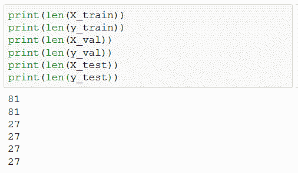

<title>How it works...</title> 

# 它是如何工作的...

我们从读取数据集开始，数据集包括朝鲜历史上和正在进行的导弹实验。我们的目标是根据剩余的特征来预测导弹的类型，例如设施和发射时间。步骤 1 到此结束。在步骤 2 中，我们应用 scikit-learn 的`train_test_split`方法将`X`和`y`细分为一个训练集`X_train`和`y_train`，以及一个测试集`X_test`和`y_test`。`test_size = 0.2`参数意味着测试集由 20%的原始数据组成，而剩余部分放在训练集中。`random_state`参数允许我们重现相同的*随机生成的*分割。接下来，关于步骤 3，重要的是要注意，在应用中，我们经常想要比较几个不同的模型。使用测试集来选择最佳模型的危险在于，我们可能会过度适应测试集。这类似于数据钓鱼的统计学罪过。为了应对这种危险，我们创建了一个额外的数据集，称为验证集。我们在训练集上训练我们的模型，使用验证集来比较它们，最后使用测试集来获得我们选择的模型的性能的准确指标。因此，在步骤 3 中，我们选择我们的参数，以便从数学上讲，最终结果由原始数据集的 60%的训练集、20%的验证集和 20%的测试集组成。最后，我们通过使用`len`函数来计算数组的长度，从而再次检查我们的假设(步骤 4)。

<title>Standardizing your data</title> 

# 标准化您的数据

对于许多机器学习算法来说，性能对特征的相对规模高度敏感。出于这个原因，标准化你的特征通常是很重要的。标准化一个特征意味着移动它的所有值，使它们的平均值= 0，并缩放它们，使它们的方差= 1。

规格化有用的一个例子是在文件的 PE 头中。PE 头包含非常大的值(例如，`SizeOfInitializedData`字段)和非常小的值(例如，段的数量)。对于某些最大似然模型，如神经网络，特征之间的巨大差异会降低性能。

<title>Getting ready</title> 

# 做好准备

该配方的准备工作包括在`pip`中安装`scikit-learn`和`pandas`包。执行以下步骤:

```
pip install sklearn pandas
```

此外，您将在这个食谱的存储库中找到一个名为`file_pe_headers.csv`的数据集。

<title>How to do it...</title> 

# 怎么做...

在以下步骤中，我们利用 scikit-learn 的`StandardScaler`方法来标准化我们的数据:

1.  首先导入所需的库并收集数据集，`X`:

```
import pandas as pd

data = pd.read_csv("file_pe_headers.csv", sep=",")
X = data.drop(["Name", "Malware"], axis=1).to_numpy()
```

数据集`X`如下所示:

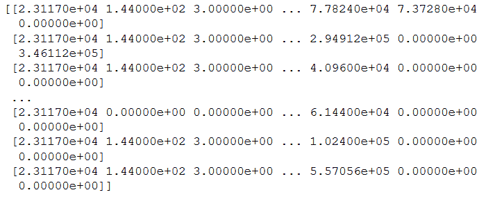

2.  接下来，使用一个`StandardScaler`实例标准化`X`:

```
from sklearn.preprocessing import StandardScaler

X_standardized = StandardScaler().fit_transform(X)
```

标准化数据集如下所示:

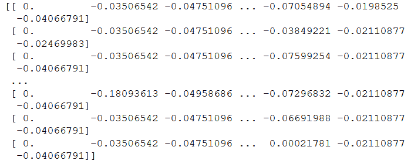

<title>How it works...</title> 

# 它是如何工作的...

我们从读入数据集开始(步骤 1)，数据集由 PE 文件集合的 PE 头信息组成。这些差异很大，一些列达到几十万个文件，而其他列停留在个位数。因此，某些模型(如神经网络)在这种非标准化数据上表现不佳。在第 2 步中，我们实例化`StandardScaler()`，然后使用`.fit_transform(X)`应用它来重新缩放`X`。因此，我们获得了一个重新调整的数据集，其列(对应于要素)的平均值为 0，方差为 1。

<title>Summarizing large data using principal component analysis</title> 

# 使用主成分分析汇总大量数据

假设你想为一个人在 45 岁时的预期财政净值建立一个预测器。有大量的变量需要考虑:智商、当前的财政价值、婚姻状况、身高、地理位置、健康、教育、职业状态、年龄以及你可能想到的许多其他变量，如 LinkedIn 连接数或 SAT 分数。

拥有这么多特性的麻烦是多方面的。首先是数据量，这将为你的算法带来很高的存储成本和计算时间。第二，对于大的特征空间，具有大量数据对于模型的准确性是至关重要的。也就是说，区分信号和噪音变得更加困难。由于这些原因，当处理这样的高维数据时，我们经常使用降维技术，如 PCA。关于这个话题的更多信息可以在[https://en.wikipedia.org/wiki/Principal_component_analysis](https://en.wikipedia.org/wiki/Principal_component_analysis)找到。

主成分分析允许我们利用我们的特征并返回少量的新特征，这些新特征由我们的原始特征形成，具有最大的解释能力。此外，由于新功能是旧功能的线性组合，这允许我们匿名化我们的数据，例如，这在处理金融信息时非常方便。

做好准备

该菜谱的准备工作包括在`pip`中安装 scikit-learn 和`pandas`包。执行此操作的命令如下:

<title>Getting ready</title> 

# 此外，我们将使用与上一个配方相同的数据集`malware_pe_headers.csv`。

怎么做...

```
pip install sklearn pandas
```

在本节中，我们将介绍如何对数据使用 PCA:

<title>How to do it...</title> 

# 首先导入必要的库并读入数据集:

标准化数据集，这在应用 PCA 之前是必要的:

1.  实例化一个`PCA`实例，并使用它来降低数据的维度:

```
from sklearn.decomposition import PCA
import pandas as pd

data = pd.read_csv("file_pe_headers.csv", sep=",")
X = data.drop(["Name", "Malware"], axis=1).to_numpy()
```

2.  评估降维的有效性:

```
from sklearn.preprocessing import StandardScaler

X_standardized = StandardScaler().fit_transform(X)
```

3.  以下屏幕截图显示了输出:

```
pca = PCA()
pca.fit_transform(X_standardized)
```

4.  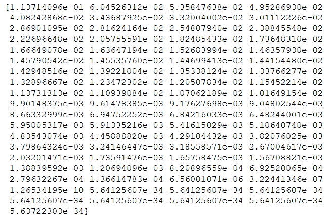

```
print(pca.explained_variance_ratio_)
```

The following screenshot shows the output:


它是如何工作的...

我们首先读入数据集，然后将其标准化，就像标准化数据的方法一样(步骤 1 和 2)。(在应用 PCA 之前，有必要使用标准化数据)。我们现在实例化一个新的 PCA transformer 实例，并使用它来学习转换(fit)和应用转换到数据集，使用`fit_transform`(步骤 3)。在第 4 步中，我们分析我们的转换。特别要注意的是，`pca.explained_variance_ratio_`的元素表示在每个方向上有多少差异。总和为 1，表明如果我们考虑数据所在的完整空间，所有的差异都被考虑在内。然而，仅仅通过采取前几个方向，我们就可以解释方差的大部分，同时限制我们的维度。在我们的例子中，前 40 个方向占方差的 90%:

<title>How it works...</title> 

# 这会产生以下输出:

这意味着我们可以将特征的数量从 78 个减少到 40 个，同时保留 90%的方差。这意味着 PE 头的许多特性是紧密相关的，这是可以理解的，因为它们不是独立设计的。

```
sum(pca.explained_variance_ratio_[0:40])
```

使用马尔可夫链生成文本

```
0.9068522354673663
```

马氏链是简单的随机模型，其中系统可以以多种状态存在。要知道系统下一步的概率分布，只需要知道它当前的位置就足够了。这与后续状态的概率分布可能依赖于系统的过去历史的系统形成对比。这种简化的假设使得马尔可夫链可以很容易地应用于许多领域，而且效果惊人。

<title>Generating text using Markov chains</title> 

# 在这个菜谱中，我们将利用马尔可夫链来生成虚假评论，这对用笔测试评论系统的垃圾邮件检测器很有用。在后面的食谱中，您将把技术从马尔可夫链升级到 RNNs。

做好准备

该配方的准备工作包括在`pip`安装`markovify`和`pandas`包。执行此操作的命令如下:

<title>Getting ready</title> 

# 此外，本章存储库中的目录包括一个 CSV 数据集`airport_reviews.csv`，它应该放在本章代码的旁边。

怎么做...

```
pip install markovify pandas
```

让我们通过执行以下步骤来看看如何使用马尔可夫链生成文本:

<title>How to do it...</title> 

# 首先导入`markovify`库和一个我们想要模仿其风格的文本文件:

举例来说，我选择了一组机场评论作为我的文本:

1.  接下来，将各个评论合并成一个大的文本字符串，并使用机场评论文本构建一个马尔可夫链模型:

```
import markovify
import pandas as pd

df = pd.read_csv("airport_reviews.csv")
```

在后台，库从文本中计算过渡词概率。

```
"The airport is certainly tiny! ..."
```

2.  使用马尔可夫链模型生成五个句子:

```
from itertools import chain

N = 100
review_subset = df["content"][0:N]
text = "".join(chain.from_iterable(review_subset))
markov_chain_model = markovify.Text(text)
```

Behind the scenes, the library computes the transition word probabilities from the text.

3.  Generate five sentences using the Markov chain model:

```
for i in range(5):
    print(markov_chain_model.make_sentence())
```

由于我们使用的是 airport reviews，因此在执行前面的代码后，我们将得到以下输出:

出奇的逼真！尽管评论必须筛选出最好的。

4.  生成长度不超过`140`个字符的`3`个句子:

```
On the positive side it's a clean airport transfer from A to C gates and outgoing gates is truly enormous - but why when we arrived at about 7.30 am for our connecting flight to Venice on TAROM.
The only really bother: you may have to wait in a polite manner.
Why not have bus after a short wait to check-in there were a lots of shops and less seating.
Very inefficient and hostile airport. This is one of the time easy to access at low price from city center by train.
The distance between the incoming gates and ending with dirty and always blocked by never ending roadworks.
```

对于我们的运行示例，我们将看到以下输出:

5.  它是如何工作的...

```
for i in range(3):
    print(markov_chain_model.make_short_sentence(140))
```

我们从导入 Markovify 库开始，这是一个用于 Markov 链计算的库，并阅读文本，这将通知我们的 Markov 模型(步骤 1)。在第二步中，我们使用文本创建一个马尔可夫链模型。以下是文本对象初始化代码的相关片段:

```
However airport staff member told us that we were put on a connecting code share flight.
Confusing in the check-in agent was friendly.
I am definitely not keen on coming to the lack of staff . Lack of staff . Lack of staff at boarding pass at check-in.
```

<title>How it works...</title> 

# 需要理解的最重要的参数是`state_size = 2`，这意味着马尔可夫链将计算连续单词对之间的转换。对于更真实的句子，可以增加该参数，代价是使句子看起来不那么新颖。接下来，我们应用我们训练过的马尔可夫链来生成几个例句(步骤 3 和 4)。我们可以清楚地看到，马尔可夫链捕捉到了文本的基调和风格。最后，在步骤 5 中，我们使用马尔可夫链在机场评论的风格中创建了几个`tweets`。

使用 scikit-learn 执行聚类

```
class Text(object):

    reject_pat = re.compile(r"(^')|('$)|\s'|'\s|[\"(\(\)\[\])]")

    def __init__(self, input_text, state_size=2, chain=None, parsed_sentences=None, retain_original=True, well_formed=True, reject_reg=''):
        """
        input_text: A string.
        state_size: An integer, indicating the number of words in the model's state.
        chain: A trained markovify.Chain instance for this text, if pre-processed.
        parsed_sentences: A list of lists, where each outer list is a "run"
              of the process (e.g. a single sentence), and each inner list
              contains the steps (e.g. words) in the run. If you want to simulate
              an infinite process, you can come very close by passing just one, very
              long run.
        retain_original: Indicates whether to keep the original corpus.
        well_formed: Indicates whether sentences should be well-formed, preventing
              unmatched quotes, parenthesis by default, or a custom regular expression
              can be provided.
        reject_reg: If well_formed is True, this can be provided to override the
              standard rejection pattern.
        """
```

**聚类**是一组无监督的机器学习算法，其中部分数据根据相似性进行分组。例如，分类可能由 n 维欧几里得空间中靠得很近的数据组成。聚类在网络安全中非常有用，可以区分正常和异常的网络活动，并有助于将恶意软件分类。

<title>Performing clustering using scikit-learn</title> 

# Performing clustering using scikit-learn

**Clustering** is a collection of unsupervised machine learning algorithms in which parts of the data are grouped based on similarity. For example, clusters might consist of data that is close together in n-dimensional Euclidean space. Clustering is useful in cybersecurity for distinguishing between normal and anomalous network activity, and for helping to classify malware into families.

做好准备

该配方的准备工作包括在`pip`中安装`scikit-learn`、`pandas`和`plotly`包。执行此操作的命令如下:

<title>Getting ready</title> 

# 此外，存储库中为这个食谱提供了一个名为`file_pe_header.csv`的数据集。

怎么做...

```
pip install sklearn plotly pandas
```

在以下步骤中，我们将看到 scikit-learn 的 K-means 聚类算法如何在玩具 PE 恶意软件分类上执行的演示:

<title>How to do it...</title> 

# 从导入和绘制数据集开始:

In the following steps, we will see a demonstration of how scikit-learn's K-means clustering algorithm performs on a toy PE malware classification:

1.  Start by importing and plotting the dataset:

```
import pandas as pd
import plotly.express as px

df = pd.read_csv("file_pe_headers.csv", sep=",")
fig = px.scatter_3d(
    df,
    x="SuspiciousImportFunctions",
    y="SectionsLength",
    z="SuspiciousNameSection",
    color="Malware",
)
fig.show()
```

以下屏幕截图显示了输出:

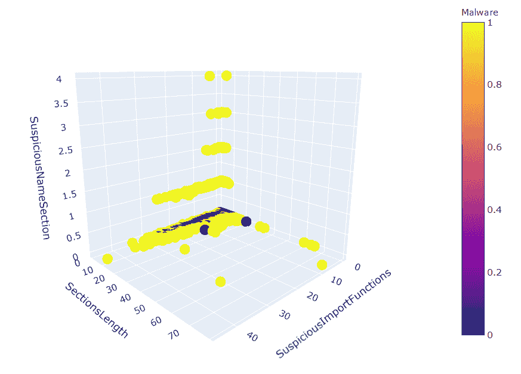

提取要素和目标标签:

接下来，导入 scikit-learn 的聚类模块，并用两个聚类拟合数据的 K-means 模型:

2.  使用我们训练好的算法预测聚类:

```
y = df["Malware"]
X = df.drop(["Name", "Malware"], axis=1).to_numpy()
```

3.  要查看算法的表现，请绘制算法的聚类图:

```
from sklearn.cluster import KMeans

estimator = KMeans(n_clusters=len(set(y)))
estimator.fit(X)
```

4.  以下屏幕截图显示了输出:

```
y_pred = estimator.predict(X)
df["pred"] = y_pred
df["pred"] = df["pred"].astype("category")
```

5.  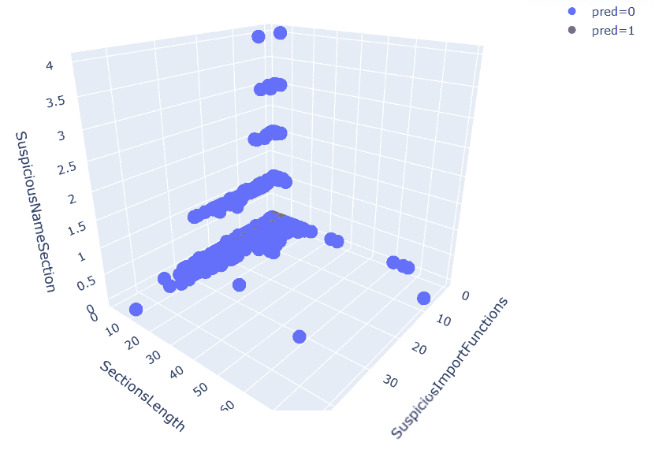

```
fig = px.scatter_3d(
    df,
    x="SuspiciousImportFunctions",
    y="SectionsLength",
    z="SuspiciousNameSection",
    color="pred",
)
fig.show()
```

结果并不完美，但是我们可以看到聚类算法捕获了数据集中的大部分结构。


它是如何工作的...

我们首先从一组样本中导入 PE 头信息的数据集(步骤 1)。该数据集由两类 PE 文件组成:恶意软件和良性文件。然后，我们使用 plotly 创建一个好看的交互式 3D 图形(步骤 1)。我们继续为机器学习准备数据集。具体来说，在步骤 2 中，我们将`X`设置为数据集的特征，将 y 设置为数据集的类。基于存在两个类别的事实，我们的目标是将数据聚类成两个与样本分类相匹配的组。我们利用 K-means 算法(第 3 步)，你可以在[https://en.wikipedia.org/wiki/K-means_clustering](https://en.wikipedia.org/wiki/K-means_clustering)找到更多信息。有了经过彻底训练的聚类算法，我们就可以在测试集上进行预测了。我们应用我们的聚类算法来预测每个样本应该属于哪个聚类(步骤 4)。观察我们在步骤 5 中的结果，我们看到聚类已经捕获了许多底层信息，因为它能够很好地拟合数据。

<title>How it works...</title> 

# 训练 XGBoost 分类器

梯度推进被广泛认为是通用机器学习问题的最可靠和最准确的算法。我们将利用 XGBoost 在未来的食谱中创建恶意软件检测器。

<title>Training an XGBoost classifier</title> 

# 做好准备

该菜谱的准备工作包括在`pip`中安装 scikit-learn、`pandas`和`xgboost`包。执行此操作的命令如下:

<title>Getting ready</title> 

# 此外，存储库中为这个食谱提供了一个名为`file_pe_header.csv`的数据集。

怎么做...

```
pip install sklearn xgboost pandas
```

在以下步骤中，我们将演示如何实例化、训练和测试 XGBoost 分类器:

<title>How to do it...</title> 

# 从读入数据开始:

接下来，训练-测试-分割数据集:

1.  创建 XGBoost 模型的一个实例，并在定型集上对其进行定型:

```
import pandas as pd

df = pd.read_csv("file_pe_headers.csv", sep=",")
y = df["Malware"]
X = df.drop(["Name", "Malware"], axis=1).to_numpy()
```

2.  最后，在测试集上评估它的性能:

```
from sklearn.model_selection import train_test_split

X_train, X_test, y_train, y_test = train_test_split(X, y, test_size=0.3)
```

3.  以下屏幕截图显示了输出:

```
from xgboost import XGBClassifier

XGB_model_instance = XGBClassifier()
XGB_model_instance.fit(X_train, y_train)
```

4.  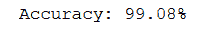

```
from sklearn.metrics import accuracy_score

y_test_pred = XGB_model_instance.predict(X_test)
accuracy = accuracy_score(y_test, y_test_pred)
print("Accuracy: %.2f%%" % (accuracy * 100))
```

The following screenshot shows the output:


它是如何工作的...

我们从读入数据开始(步骤 1)。然后，我们创建一个训练测试分割(步骤 2)。我们继续用默认参数实例化 XGBoost 分类器，并使其适合我们的训练集(步骤 3)。最后，在步骤 4 中，我们使用 XGBoost 分类器对测试集进行预测。然后，我们产生 XGBoost 模型预测的测量精度。

<title>How it works...</title> 

# 使用统计模型分析时间序列

时间序列是在连续时间获得的一系列值。比如每分钟采样的股市价格，就形成了一个时间序列。在网络安全领域，时间序列分析可以非常方便地预测网络攻击，例如内部员工泄露数据，或者一群黑客串通起来准备下一次攻击。

<title>Analyzing time series using statsmodels</title> 

# 让我们看看使用时间序列进行预测的几种技术。

做好准备

该配方的准备工作包括在`pip`中安装`matplotlib`、`statsmodels`和`scipy`包。执行此操作的命令如下:

<title>Getting ready</title> 

# 怎么做...

在以下步骤中，我们将演示几种使用时间序列数据进行预测的方法:

```
pip install matplotlib statsmodels scipy
```

<title>How to do it...</title> 

# 首先生成一个时间序列:

绘制您的数据:

1.  以下屏幕截图显示了输出:

```
from random import random

time_series = [2 * x + random() for x in range(1, 100)]
```

2.  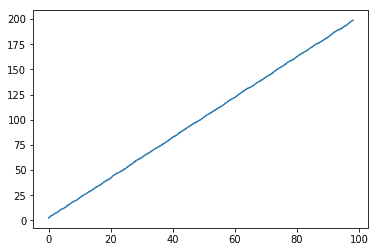

```
%matplotlib inline
import matplotlib.pyplot as plt

plt.plot(time_series)
plt.show()
```

我们可以使用多种技术来预测时间序列的后续值:

**自回归** ( **AR** ):

3.  There is a large variety of techniques we can use to predict the consequent value of a time series:

```
from statsmodels.tsa.ar_model import AR

model = AR(time_series)
model_fit = model.fit()
y = model_fit.predict(len(time_series), len(time_series))
```

```
from statsmodels.tsa.arima_model import ARMA

model = ARMA(time_series, order=(0, 1))
model_fit = model.fit(disp=False)
y = model_fit.predict(len(time_series), len(time_series))
```

3.  产生的预测如下:
    *   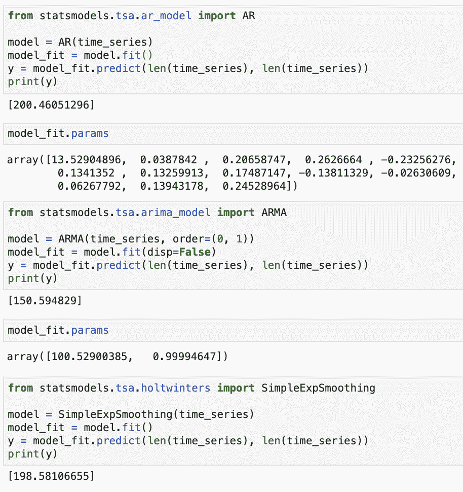

```
from statsmodels.tsa.holtwinters import SimpleExpSmoothing

model = SimpleExpSmoothing(time_series)
model_fit = model.fit()
y = model_fit.predict(len(time_series), len(time_series))
```

它是如何工作的...

第一步，我们生成一个简单的玩具时间序列。该系列由一条线上的值组成，并点缀了一些附加噪声。接下来，我们在步骤 2 中绘制时间序列。您可以看到它非常接近于一条直线，对于时间的时间序列值的合理预测是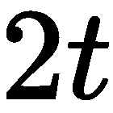。为了创建时间序列值的预测，我们考虑三种不同的方案(步骤 3)来预测时间序列的未来值。在自回归模型中，基本思想是时间 *t* 的时间序列值是之前时间的时间序列值的线性函数。更准确地说，有一些常数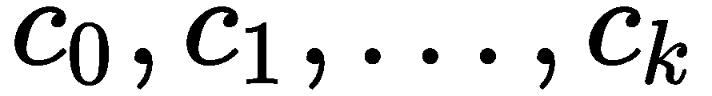和一个数字，例如:

<title>How it works...</title> 

# 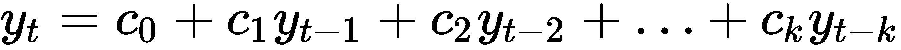

作为一个假设的例子，可能是 *3* ，这意味着时间序列的值可以通过知道其最后的 *3* 值而容易地计算出来。

在移动平均模型中，时间序列被建模为围绕平均值波动。更准确地说，让是一个独立同分布正态变量序列，让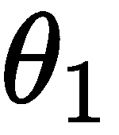是一个常数。然后，通过以下公式对时间序列进行建模:

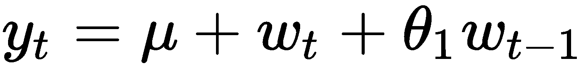

由于这个原因，它在预测我们产生的噪声线性时间序列时表现不佳。

最后，在简单指数平滑中，我们提出一个平滑参数，。然后，我们模型的估计值由以下等式计算得出:

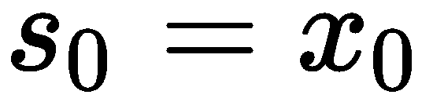

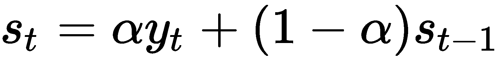

换句话说，我们跟踪一个估计值，并使用当前的时间序列值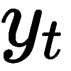对其稍作调整。调整的力度由参数控制。

隔离森林异常检测

异常检测是对数据集中不符合预期模式的事件的识别。在应用程序中，这些事件可能至关重要。例如，它们可能是网络入侵或欺诈事件。我们将利用隔离林来检测这种异常情况。隔离森林依赖于这样的观察，即隔离异常值是容易的，而描述正常数据点是比较困难的。

<title>Anomaly detection with Isolation Forest</title> 

# 做好准备

该配方的准备包括在`pip`中安装`matplotlib`、`pandas`和`scipy`包。执行此操作的命令如下:

<title>Getting ready</title> 

# 怎么做...

在接下来的步骤中，我们将演示如何应用隔离森林算法来检测异常:

```
pip install matplotlib pandas scipy
```

<title>How to do it...</title> 

# 导入所需的库并设置随机种子:

生成一组正常观察值，用作训练数据:

1.  生成一个测试集，也包含正常观察值:

```
import numpy as np
import pandas as pd

random_seed = np.random.RandomState(12)
```

2.  生成一组异常值观察值。这些是从不同于正常观察的分布中产生的:

```
X_train = 0.5 * random_seed.randn(500, 2)
X_train = np.r_[X_train + 3, X_train]
X_train = pd.DataFrame(X_train, columns=["x", "y"])
```

3.  让我们来看看我们生成的数据:

```
X_test = 0.5 * random_seed.randn(500, 2)
X_test = np.r_[X_test + 3, X_test]
X_test = pd.DataFrame(X_test, columns=["x", "y"])
```

以下屏幕截图显示了输出:

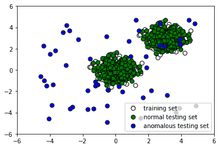

4.  Generate a set of outlier observations. These are generated from a different distribution than the normal observations:

```
X_outliers = random_seed.uniform(low=-5, high=5, size=(50, 2))
X_outliers = pd.DataFrame(X_outliers, columns=["x", "y"])
```

5.  现在根据我们的训练数据训练一个隔离林模型:

```
%matplotlib inline
import matplotlib.pyplot as plt

p1 = plt.scatter(X_train.x, X_train.y, c="white", s=50, edgecolor="black")
p2 = plt.scatter(X_test.x, X_test.y, c="green", s=50, edgecolor="black")
p3 = plt.scatter(X_outliers.x, X_outliers.y, c="blue", s=50, edgecolor="black")
plt.xlim((-6, 6))
plt.ylim((-6, 6))
plt.legend(
    [p1, p2, p3],
    ["training set", "normal testing set", "anomalous testing set"],
    loc="lower right",
)

plt.show()
```

我们来看看算法表现如何。将标签附加到`X_outliers`:

以下是输出:

6.  x

```
from sklearn.ensemble import IsolationForest

clf = IsolationForest()
clf.fit(X_train)
y_pred_train = clf.predict(X_train)
y_pred_test = clf.predict(X_test)
y_pred_outliers = clf.predict(X_outliers)
```

7.  y

```
X_outliers = X_outliers.assign(pred=y_pred_outliers)
X_outliers.head()
```

强的松

| 0 | 3.947504 | 2.891003 | 一 |
| --- | --- | --- | --- |
| 一 | 0.413976 | -2.025841 | -1 |
| 2 | -2.644476 | -3.480783 | -1 |
| 3 | -0.518212 | -3.386443 | -1 |
| 四 | 2.977669 | 2.215355 | 一 |
| 让我们根据异常值绘制隔离林预测，看看它捕捉到了多少异常值: | 以下屏幕截图显示了输出: | 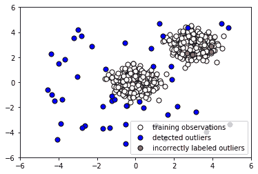 | 现在让我们看看它在正常测试数据上的表现。将预测标签附加到`X_test`: |

8.  以下是输出:

```
p1 = plt.scatter(X_train.x, X_train.y, c="white", s=50, edgecolor="black")
p2 = plt.scatter(
    X_outliers.loc[X_outliers.pred == -1, ["x"]],
    X_outliers.loc[X_outliers.pred == -1, ["y"]],
    c="blue",
    s=50,
    edgecolor="black",
)
p3 = plt.scatter(
    X_outliers.loc[X_outliers.pred == 1, ["x"]],
    X_outliers.loc[X_outliers.pred == 1, ["y"]],
    c="red",
    s=50,
    edgecolor="black",
)

plt.xlim((-6, 6))
plt.ylim((-6, 6))
plt.legend(
    [p1, p2, p3],
    ["training observations", "detected outliers", "incorrectly labeled outliers"],
    loc="lower right",
)

plt.show()
```

The following screenshot shows the output:

x

9.  y

```
X_test = X_test.assign(pred=y_pred_test)
X_test.head()
```

强的松

| 0 | 3.944575 | 3.866919 | -1 |
| --- | --- | --- | --- |
| 一 | 2.984853 | 3.142150 | 一 |
| 2 | 3.501735 | 2.168262 | 一 |
| 3 | 2.906300 | 3.233826 | 一 |
| 四 | 3.273225 | 3.261790 | 一 |
| 现在，让我们绘制结果图，看看我们的分类器是否正确标记了正常测试数据: | 以下屏幕截图显示了输出: | 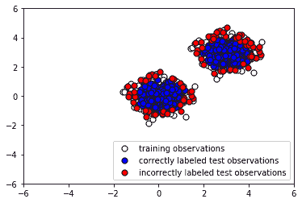 | 1 |

10.  显然，我们的隔离森林模型在捕捉异常点方面表现得相当好。有相当多的假阴性(正常点被归类为异常值的情况)，但通过调整我们的模型参数，我们可能能够减少这些。

```
p1 = plt.scatter(X_train.x, X_train.y, c="white", s=50, edgecolor="black")
p2 = plt.scatter(
    X_test.loc[X_test.pred == 1, ["x"]],
    X_test.loc[X_test.pred == 1, ["y"]],
    c="blue",
    s=50,
    edgecolor="black",
)
p3 = plt.scatter(
    X_test.loc[X_test.pred == -1, ["x"]],
    X_test.loc[X_test.pred == -1, ["y"]],
    c="red",
    s=50,
    edgecolor="black",
)

plt.xlim((-6, 6))
plt.ylim((-6, 6))
plt.legend(
    [p1, p2, p3],
    [
        "training observations",
        "correctly labeled test observations",
        "incorrectly labeled test observations",
    ],
    loc="lower right",
)

plt.show()
```

它是如何工作的...

第一步包括简单地加载必要的库，这将允许我们快速而容易地操作数据。在步骤 2 和 3 中，我们生成一个由正常观察值组成的训练和测试集。这些有相同的分布。另一方面，在步骤 4 中，我们通过创建离群值来生成测试集的剩余部分。这个异常数据集的分布不同于训练数据和其余的测试数据。绘制我们的数据，我们看到一些离群点看起来无法与正常点区分开来(步骤 5)。由于数据的性质，这保证了我们的分类器将有很大比例的错误分类，并且我们在评估其性能时必须记住这一点。在步骤 6 中，我们用默认参数将隔离林的实例拟合到训练数据中。

注意，该算法没有被馈送关于异常数据的信息。我们使用经过训练的隔离林实例来预测测试数据是正常还是异常，并类似地预测异常数据是正常还是异常。为了检查算法如何执行，我们将预测的标签附加到`X_outliers`(步骤 7)，然后在离群值上绘制隔离林实例的预测(步骤 8)。我们看到它能够捕捉到大部分异常。那些被错误标记的无法从正常观察中分辨出来。接下来，在步骤 9 中，我们将预测的标签附加到`X_test`以准备分析，然后在正常测试数据上绘制隔离林实例的预测(步骤 10)。我们看到它正确地标记了大多数正常的观察值。与此同时，有大量不正确分类的正常观察值(以红色显示)。

根据我们愿意容忍多少假警报，我们可能需要微调我们的分类器以减少假阳性的数量。

<title>How it works...</title> 

# 使用哈希矢量器和 tf-idf 与 scikit-learn 进行自然语言处理

我们经常在数据科学中发现，我们希望分析的对象是文本的。例如，它们可能是推文、文章或网络日志。由于我们的算法需要数字输入，我们必须找到一种方法将这样的文本转换成数字特征。为此，我们采用了一系列技术。

一个*令牌*是一个文本单位。例如，我们可以指定我们的标记是单词、句子或字符。计数矢量器接受文本输入，然后输出由文本记号的计数组成的矢量。**哈希矢量器**是计数矢量器的一个变种，旨在以可解释性和哈希冲突为代价，提高速度和可伸缩性。虽然这很有用，但是仅仅统计文档语料库中出现的单词数可能会产生误导。原因是，通常不重要的词，如 *the* 和 *a* (称为*停用词*)出现的频率很高，因此信息内容很少。由于诸如此类的原因，我们经常给单词不同的权重来抵消这一点。这样做的主要技术是 **tf-idf** ，它代表**词频，逆文档频**。主要思想是我们考虑一个术语出现的次数，但是用它出现在文档中的次数来贴现它。

在网络安全中，文本数据无处不在；事件日志、对话记录和函数名列表只是几个例子。因此，能够处理这样的数据是很重要的，你将在这个食谱中学到一些东西。

<title>Natural language processing using a hashing vectorizer and tf-idf with scikit-learn</title> 

# 做好准备

这个菜谱的准备工作包括在`pip`安装 scikit-learn 包。执行此操作的命令如下:

此外，本章的存储库中还包含一个日志文件`anonops_short.log`，其中包含 IRC 频道`#Anonops`上发生的对话摘录。

怎么做…

<title>Getting ready</title> 

# 在接下来的步骤中，我们将把文本数据的语料库转换成数字形式，服从机器学习算法:

首先，导入一个文本数据集:

```
pip install sklearn
```

接下来，使用哈希矢量器计算文本中的单词数，然后使用 tf-idf 进行加权:

<title>How to do it…</title> 

# 最终结果是一个稀疏矩阵，每一行是一个向量，代表一个文本:

以下是输出:

1.  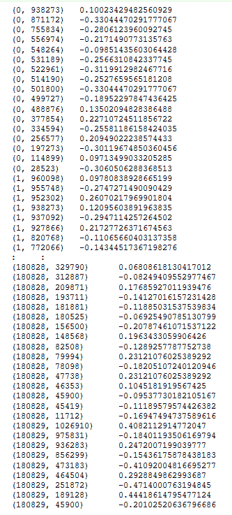

```
with open("anonops_short.txt", encoding="utf8") as f:
    anonops_chat_logs = f.readlines()
```

2.  它是如何工作的...

```
from sklearn.feature_extraction.text import HashingVectorizer
from sklearn.feature_extraction.text import TfidfTransformer

my_vector = HashingVectorizer(input="content", ngram_range=(1, 2))
X_train_counts = my_vector.fit_transform(anonops_chat_logs,)
tf_transformer = TfidfTransformer(use_idf=True,).fit(X_train_counts)
X_train_tf = tf_transformer.transform(X_train_counts)
```

3.  我们从加载#Anonops 文本数据集开始(步骤 1)。Anonops IRC 频道隶属于匿名黑客组织。特别是，聊天参与者过去曾在 Anonops 上计划并宣布他们的未来目标。因此，一个设计良好的 ML 系统将能够通过对这些数据进行训练来预测网络攻击。在步骤 2 中，我们实例化了一个哈希矢量器。哈希矢量器为我们提供了文本中 1 元和 2 元单词的计数，换句话说，就是文章中的单个和连续单词对(标记)。然后，我们应用 tf-idf 转换器，为哈希矢量器给出的计数赋予适当的权重。我们的最终结果是一个大的稀疏矩阵，代表文本中 1-和 2-gram 的出现，按重要性加权。最后，我们检查了 Scipy 中我们的特色数据的稀疏矩阵表示的前端。

```
X_train_tf

<180830 x 1048576 sparse matrix of type <class 'numpy.float64'>' with 3158166 stored elements in Compressed Sparse Row format>

print(X_train_tf)
```

使用 scikit-optimize 进行超参数调谐

在机器学习中，**超参数**是一个参数，其值是在训练过程开始之前设置的。例如，梯度增强模型的学习速率的选择和多层感知器的隐藏层的大小都是超参数的例子。相比之下，其他参数的值是通过训练获得的。超参数选择非常重要，因为它会对模型的性能产生巨大影响。

<title>How it works...</title> 

# 最基本的超参数调整方法叫做**网格搜索**。在这种方法中，您为每个超参数指定一个潜在值范围，然后全部尝试，直到找到最佳组合。这种强力方法很全面，但是计算量很大。还有更复杂的方法。在这个食谱中，你将学习如何使用`scikit-optimize`对超参数使用*贝叶斯优化*。与基本网格搜索相比，在贝叶斯优化中，不是所有的参数值都被尝试，而是从指定的分布中采样固定数量的参数设置。更多细节可以在[https://sci kit-optimize . github . io/notebooks/Bayesian-optimization . html](https://scikit-optimize.github.io/notebooks/bayesian-optimization.html)找到。

做好准备

<title>Hyperparameter tuning with scikit-optimize</title> 

# 该配方的准备工作包括安装特定版本的`scikit-learn`，安装`xgboost`，以及在`pip`中安装`scikit-optimize`。执行此操作的命令如下:

怎么做...

在下面的步骤中，您将加载标准的`wine`数据集，并使用贝叶斯优化来调整 XGBoost 模型的超参数:

<title>Getting ready</title> 

# 从 scikit-learn 加载`wine`数据集:

导入 XGBoost 和分层 K 倍:

```
pip install scikit-learn==0.20.3 xgboost scikit-optimize pandas
```

<title>How to do it...</title> 

# 从`scikit-optimize`导入`BayesSearchCV`，并指定要测试的参数设置数量:

指定您的评估者。在这种情况下，我们选择 XGBoost 并将其设置为能够执行多类分类:

1.  Load the `wine` dataset from scikit-learn:

```
from sklearn import datasets

wine_dataset = datasets.load_wine()
X = wine_dataset.data
y = wine_dataset.target
```

2.  Import XGBoost and stratified K-fold:

```
import xgboost as xgb
from sklearn.model_selection import StratifiedKFold
```

3.  指定参数搜索空间:

```
from skopt import BayesSearchCV

n_iterations = 50
```

4.  指定要执行的交叉验证的类型:

```
estimator = xgb.XGBClassifier(
    n_jobs=-1,
    objective="multi:softmax",
    eval_metric="merror",
    verbosity=0,
    num_class=len(set(y)),
)
```

使用您定义的设置定义`BayesSearchCV`:

5.  定义一个`callback`函数来打印参数搜索的进度:

```
search_space = {
    "learning_rate": (0.01, 1.0, "log-uniform"),
    "min_child_weight": (0, 10),
    "max_depth": (1, 50),
    "max_delta_step": (0, 10),
    "subsample": (0.01, 1.0, "uniform"),
    "colsample_bytree": (0.01, 1.0, "log-uniform"),
    "colsample_bylevel": (0.01, 1.0, "log-uniform"),
    "reg_lambda": (1e-9, 1000, "log-uniform"),
    "reg_alpha": (1e-9, 1.0, "log-uniform"),
    "gamma": (1e-9, 0.5, "log-uniform"),
    "min_child_weight": (0, 5),
    "n_estimators": (5, 5000),
    "scale_pos_weight": (1e-6, 500, "log-uniform"),
}
```

6.  Specify the type of cross-validation to perform:

```
cv = StratifiedKFold(n_splits=3, shuffle=True)
```

7.  执行参数搜索:

```
bayes_cv_tuner = BayesSearchCV(
    estimator=estimator,
    search_spaces=search_space,
    scoring="accuracy",
    cv=cv,
    n_jobs=-1,
    n_iter=n_iterations,
    verbose=0,
    refit=True,
)
```

8.  如您所见，下面显示了输出:

```
import pandas as pd
import numpy as np

def print_status(optimal_result):
    """Shows the best parameters found and accuracy attained of the search so far."""
    models_tested = pd.DataFrame(bayes_cv_tuner.cv_results_)
    best_parameters_so_far = pd.Series(bayes_cv_tuner.best_params_)
    print(
        "Model #{}\nBest accuracy so far: {}\nBest parameters so far: {}\n".format(
            len(models_tested),
            np.round(bayes_cv_tuner.best_score_, 3),
            bayes_cv_tuner.best_params_,
        )
    )

    clf_type = bayes_cv_tuner.estimator.__class__.__name__
    models_tested.to_csv(clf_type + "_cv_results_summary.csv")
```

它是如何工作的...

9.  在步骤 1 和 2 中，我们导入一个标准数据集，即`wine`数据集，以及分类所需的库。接下来是一个更有趣的步骤，在这个步骤中，我们根据要尝试的参数组合数量，指定我们希望超参数搜索持续多长时间。搜索时间越长，结果越好，但有过度拟合和延长计算时间的风险。在第 4 步中，我们选择 XGBoost 作为模型，然后指定类的数量、问题的类型和评估度量。这部分将取决于问题的类型。例如，对于一个回归问题，我们可以一起设置`eval_metric = 'rmse'`和删除`num_class`。

```
result = bayes_cv_tuner.fit(X, y, callback=print_status)
```

除 XGBoost 之外的其他型号也可以通过超参数优化器进行选择。在下一步(步骤 5)中，我们指定我们将探索的每个参数的概率分布。这是使用`BayesSearchCV`优于简单网格搜索的优势之一，因为它允许您更智能地探索参数空间。接下来，我们指定我们的交叉验证方案(步骤 6)。因为我们正在执行一个分类问题，所以指定一个分层折叠是有意义的。但是对于一个回归问题，`StratifiedKFold`应该换成`KFold`。

还要注意，为了测量结果，更大的分裂数是优选的，尽管这将会带来计算上的代价。在步骤 7 中，您可以看到可以更改的附加设置。特别是，`n_jobs`允许您并行化任务。评分的详细程度和方法也可以改变。为了监控搜索过程和超参数调优的性能，我们定义了一个回调函数来打印步骤 8 中的进度。网格搜索的结果也保存在 CSV 文件中。最后，我们运行超参数搜索(步骤 9)。输出允许我们观察超参数搜索的每次迭代的参数和性能。

```
Model #1
 Best accuracy so far: 0.972
 Best parameters so far: {'colsample_bylevel': 0.019767840658391753, 'colsample_bytree': 0.5812505808116454, 'gamma': 1.7784704701058755e-05, 'learning_rate': 0.9050859661329937, 'max_delta_step': 3, 'max_depth': 42, 'min_child_weight': 1, 'n_estimators': 2334, 'reg_alpha': 0.02886003776717955, 'reg_lambda': 0.0008507166793122457, 'scale_pos_weight': 4.801764874750116e-05, 'subsample': 0.7188797743009225}

 Model #2
 Best accuracy so far: 0.972
 Best parameters so far: {'colsample_bylevel': 0.019767840658391753, 'colsample_bytree': 0.5812505808116454, 'gamma': 1.7784704701058755e-05, 'learning_rate': 0.9050859661329937, 'max_delta_step': 3, 'max_depth': 42, 'min_child_weight': 1, 'n_estimators': 2334, 'reg_alpha': 0.02886003776717955, 'reg_lambda': 0.0008507166793122457, 'scale_pos_weight': 4.801764874750116e-05, 'subsample': 0.7188797743009225}

<snip>

Model #50
 Best accuracy so far: 0.989
 Best parameters so far: {'colsample_bylevel': 0.013417868502558758, 'colsample_bytree': 0.463490250419848, 'gamma': 2.2823050161337873e-06, 'learning_rate': 0.34006478878384533, 'max_delta_step': 9, 'max_depth': 41, 'min_child_weight': 0, 'n_estimators': 1951, 'reg_alpha': 1.8321791726476395e-08, 'reg_lambda': 13.098734837402576, 'scale_pos_weight': 0.6188077759379964, 'subsample': 0.7970035272497132}
```

<title>How it works...</title> 

# 在本书中，我们将避免调整分类器的超参数。部分原因是简洁，部分原因是这里的超参数调整是*过早优化*，因为终端用户对算法的性能没有特定的要求或目标。在这里已经看到了如何执行它，您可以很容易地将这个方法应用到手边的应用程序中。

另一个需要记住的超参数调优的著名库是`hyperopt`。

Other models than XGBoost can be selected with the hyperparameter optimizer as well. In the next step, (step 5), we specify a probability distribution over each parameter that we will be exploring. This is one of the advantages of using `BayesSearchCV` over a simple grid search, as it allows you to explore the parameter space more intelligently. Next, we specify our cross-validation scheme (step 6). Since we are performing a classification problem, it makes sense to specify a stratified fold. However, for a regression problem, `StratifiedKFold` should be replaced with `KFold`.

Also note that a larger splitting number is preferred for the purpose of measuring results, though it will come at a computational price. In step 7, you can see additional settings that can be changed. In particular, `n_jobs` allows you to parallelize the task. The verbosity and the method used for scoring can be altered as well. To monitor the search process and the performance of our hyperparameter tuning, we define a callback function to print out the progress in step 8\. The results of the grid search are also saved in a CSV file. Finally, we run the hyperparameter search (step 9). The output allows us to observe the parameters and the performance of each iteration of the hyperparameter search.

In this book, we will refrain from tuning the hyperparameters of classifiers. The reason is in part brevity, and in part because hyperparameter tuning here would be *premature optimization*, as there is no specified requirement or goal for the performance of the algorithm from the end user. Having seen how to perform it here, you can easily adapt this recipe to the application at hand.

Another prominent library for hyperparameter tuning to keep in mind is `hyperopt`.