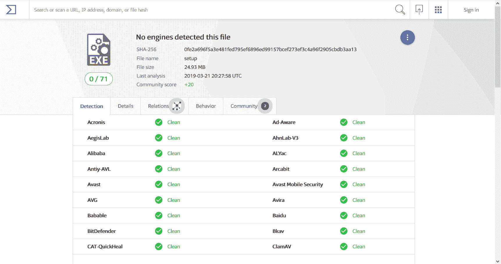
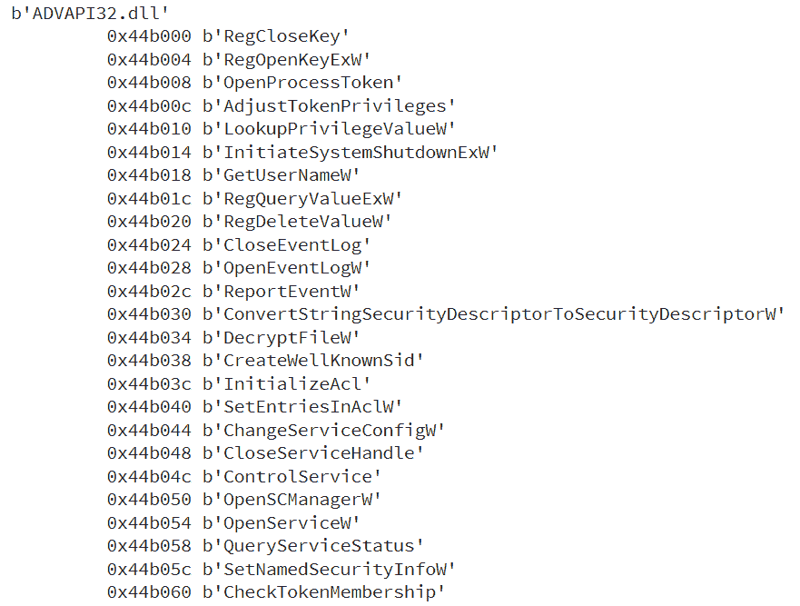
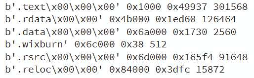
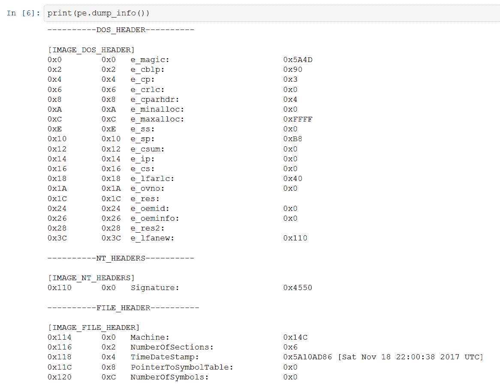
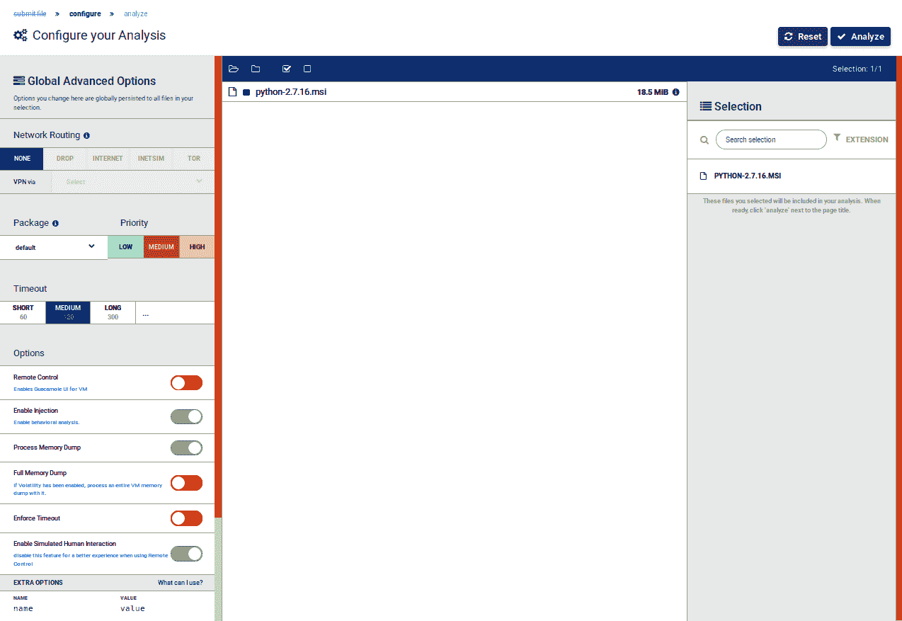
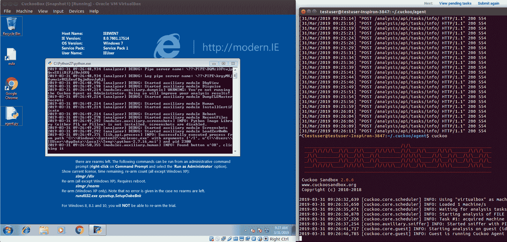
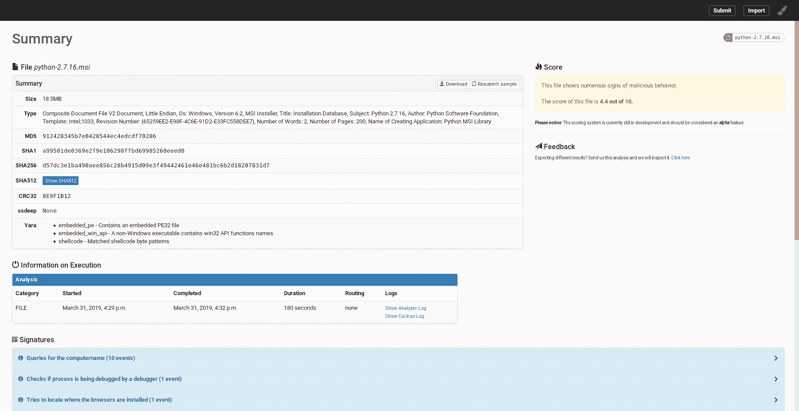
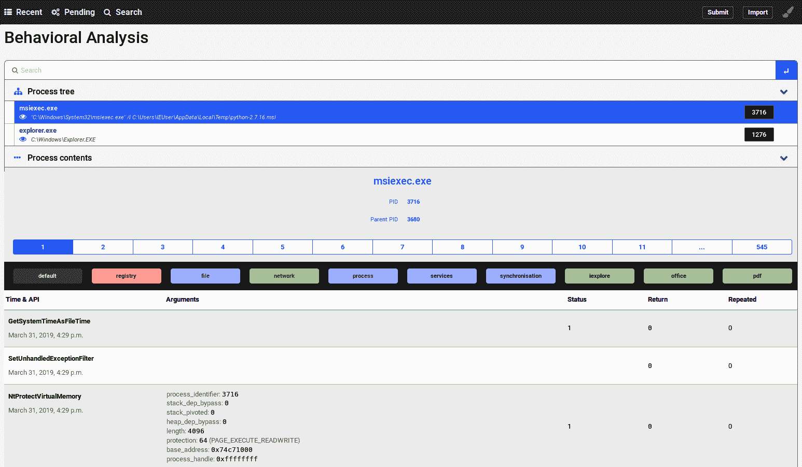
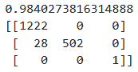

<title>Machine Learning-Based Malware Detection</title> 

# 基于机器学习的恶意软件检测

在这一章中，我们开始认真对待将数据科学应用于网络安全。我们将从学习如何对样品进行静态和动态分析开始。基于这一知识，我们将学习如何特征化样本，以构建一个具有丰富特征的数据集。本章的重点是学习如何使用我们所学的特征化技巧来构建一个静态恶意软件检测器。最后，您将学习如何应对网络安全领域出现的重要机器学习挑战，如类别不平衡和**误报率** ( **FPR** )约束。

本章包括以下配方:

*   恶意软件静态分析
*   恶意软件动态分析
*   使用机器学习来检测文件类型
*   测量两个字符串之间的相似性
*   测量两个文件之间的相似性
*   提取 N 元语法
*   选择最佳 N 元文法
*   构建静态恶意软件检测器
*   解决阶级失衡
*   处理第一类和第二类错误

<title>Technical requirements</title> 

# 技术要求

在本章中，我们将使用以下内容:

*   YARA
*   `pefile`
*   `PyGitHub`
*   布谷鸟沙盒
*   **自然语言工具包** ( **NLTK** )
*   `imbalanced-learn`

代码和数据集可以在[https://github . com/packt publishing/Machine-Learning-for-cyber security-Cookbook/tree/master/chapter 02](https://github.com/PacktPublishing/Machine-Learning-for-Cybersecurity-Cookbook/tree/master/Chapter02)找到。

<title>Malware static analysis</title> 

# 恶意软件静态分析

在静态分析中，我们检查样本而不执行它。通过这种方式可以获得的信息量很大，从简单的文件名到更复杂的内容，如专门的 YARA 签名。我们将介绍通过静态分析样品可以获得的大量特征。尽管静态分析功能强大且方便，但它并不是灵丹妙药，主要是因为软件可能会被混淆。出于这个原因，我们将在后面的章节中使用动态分析和其他技术。

<title>Computing the hash of a sample</title> 

# 计算样本的散列值

不去深究散列的复杂性，散列本质上是一个简短且唯一的字符串签名。例如，我们可以散列一个文件的字节序列，以获得该文件的一个本质上唯一的代码。这使我们能够快速比较两个文件，看它们是否相同。

存在许多散列过程，所以我们将集中讨论最重要的，即 SHA256 和 MD5。请注意，众所周知，MD5 因哈希冲突而存在漏洞，即两个不同的对象具有相同的哈希，因此应谨慎使用。在这个方法中，我们取一个可执行文件并计算它的 MD5 和 SHA256 散列。

<title>Getting ready</title> 

# 做好准备

该方法的准备工作包括下载一个测试文件，该文件是来自[https://www . Python . org/FTP/Python/3 . 7 . 2/Python-3 . 7 . 2-amd64 . exe](https://www.python.org/ftp/python/3.7.2/python-3.7.2-amd64.exe)的 Python 可执行文件。

<title>How to do it...</title> 

# 怎么做...

在以下步骤中，我们将了解如何获取文件的哈希:

1.  首先导入库并选择您想要散列的文件:

```
import sys
import hashlib

filename = "python-3.7.2-amd64.exe"
```

2.  实例化 MD5 和 SHA256 对象，并指定我们将读取的块的大小:

```
BUF_SIZE = 65536
md5 = hashlib.md5()
sha256 = hashlib.sha256()
```

3.  然后，我们读入 64 KB 的文件块，并逐步构建我们的哈希:

```
with open(filename, "rb") as f:
    while True:
        data = f.read(BUF_SIZE)
        if not data:
            break
        md5.update(data)
        sha256.update(data)
```

4.  最后，打印出结果散列:

```
print("MD5: {0}".format(md5.hexdigest()))
print("SHA256: {0}".format(sha256.hexdigest()))
```

这会产生以下输出:

```
MD5: ff258093f0b3953c886192dec9f52763
SHA256: 0fe2a696f5a3e481fed795ef6896ed99157bcef273ef3c4a96f2905cbdb3aa13
```

<title>How it works...</title> 

# 它是如何工作的...

本节将解释上一节中提供的步骤:

*   在步骤 1 中，我们导入了`hashlib`，这是一个用于哈希计算的标准 Python 库。我们还指定了将要散列的文件——在本例中，文件是`python-3.7.2-amd64.exe`。
*   在第 2 步中，我们实例化一个`md5`对象和一个`sha256`对象，并指定我们将要读取的块的大小。
*   在第三步，我们利用`.update(data)`方法。这个方法允许我们递增地计算散列，因为它计算连接的散列。换句话说，`hash.update(a)`后跟`hash.update(b)`相当于`hash.update(a+b)`。
*   在第 4 步中，我们打印出十六进制数字的哈希值。

我们还可以验证我们的计算与其他来源(如 VirusTotal 和官方 Python 网站)给出的哈希计算一致。MD5 散列显示在 Python 网页上([https://www.python.org/downloads/release/python-372/](https://www.python.org/downloads/release/python-372/)):


SHA256 哈希通过将文件上传到 virus total([https://www.virustotal.com/gui/home](https://www.virustotal.com/gui/home))来计算:



<title>YARA</title> 

# YARA

YARA 是一种计算机语言，它允许安全专家方便地指定一个规则，然后用于对所有匹配该规则的样本进行分类。最小规则由名称和条件组成，例如:

```
 rule my_rule_name { condition: false }
```

此规则将不匹配任何文件。相反，以下规则将匹配每个样本:

```
 Rule my_rule_name { condition: true }
```

一个更有用的例子将匹配任何超过 100 KB 的文件:

```
 Rule over_100kb { condition: filesize > 100KB }
```

另一个例子是检查一个特定的文件是否是 PDF。为此，我们检查文件的幻数是否对应于 PDF。幻数是出现在文件开头的几个字节的序列，表示文件的类型。对于 PDF，顺序是`25 50 44 46`:

```
 rule is_a_pdf {

 strings:
   $pdf_magic = {25 50 44 46}

 condition:
   $pdf_magic at 0
 }
```

现在，让我们看看如何对文件运行我们的规则。

<title>Getting ready</title> 

# 做好准备

这个食谱的准备工作包括在你的设备上安装 YARA。可以在[https://yara.readthedocs.io/en/stable/](https://yara.readthedocs.io/en/stable/)找到说明。对于 Windows，您需要下载一个 YARA 的可执行文件。

<title>How to do it…</title> 

# 怎么做…

在以下步骤中，我们将向您展示如何创建 YARA 规则并根据文件测试它们:

1.  将您的规则复制到一个文本文件中，并将其命名为`rules.yara`:

```
 rule is_a_pdf
 {
        strings:
               $pdf_magic = {25 50 44 46}
        condition:
               $pdf_magic at 0
 }

 rule dummy_rule1
 {
        condition:
               false
 }

 rule dummy_rule2
 {
        condition:
               true
 }
```

2.  接下来，选择您想要检查规则的文件。称之为`target_file`。在终端中，如下执行`Yara rules.yara target_file`:

```
Yara rule.yara PythonBrochure
```

结果应该如下所示:

```
is_a_pdf target_file
dummy_rule2 target_rule
```

<title>How it works…</title> 

# 它是如何工作的…

正如你所观察到的，在*步骤 1* 中，我们复制了几条 YARA 规则。第一个规则检查文件的幻数，看它们是否与 PDF 的幻数匹配。另外两个规则是普通规则—一个匹配所有文件，另一个不匹配任何文件。然后，在*步骤 2* 中，我们使用 YARA 程序对目标文件运行规则。我们从打印输出中看到，该文件符合一些规则，但不符合其他规则，这与有效的 YARA 规则集的预期相符。

<title>Examining the PE header</title> 

# 检查 PE 头

**可移植可执行文件** ( **PE** )是一种常见的 Windows 文件类型。PE 文件包括`.exe`、`.dll`和`.sys`文件。所有 PE 文件都有一个 PE 头，这是代码的头部分，指示 Windows 如何解析后续代码。PE 报头中的字段通常用作恶意软件检测中的特征。为了方便地提取 PE 头的多个值，我们将利用`pefile` Python 模块。在这个菜谱中，我们将解析一个文件的 pe 文件头，然后打印出其中值得注意的部分。

<title>Getting ready</title> 

# 做好准备

该配方的准备工作包括在`pip`中安装`pefile`包。在 Python 环境的终端中，运行以下命令:

```
pip install pefile
```

另外，从[https://www . Python . org/FTP/Python/3 . 7 . 2/Python-3 . 7 . 2-amd64 . exe](https://www.python.org/ftp/python/3.7.2/python-3.7.2-amd64.exe)下载测试文件 Python 可执行文件。

<title>How to do it...</title> 

# 怎么做...

在下面的步骤中，我们将解析文件的 PE 头，然后打印出它的重要部分:

1.  导入 PE 文件，并使用它来解析所需文件的 PE 头:

```
import pefile

desired_file = "python-3.7.2-amd64.exe"
pe = pefile.PE(desired_file)
```

2.  列出 PE 文件的导入:

```
for entry in pe.DIRECTORY_ENTRY_IMPORT:
    print(entry.dll)
    for imp in entry.imports:
        print("\t", hex(imp.address), imp.name)
```

这里显示了一小部分输出:



3.  列出 PE 文件的各个部分:

```
for section in pe.sections:
    print(
        section.Name,
        hex(section.VirtualAddress),
        hex(section.Misc_VirtualSize),
        section.SizeOfRawData,
    )
```

前面代码的输出如下:



4.  打印解析信息的完整转储:

```
print(pe.dump_info())
```

这里显示了一小部分输出:



<title>How it works...</title> 

# 它是如何工作的...

我们从*步骤 1* 开始，导入`pefile`库并指定我们将要分析的文件。在这种情况下，文件是`python-3.7.2-amd64.exe`，尽管分析任何其他 PE 文件也很容易。然后，我们继续检查文件导入的 dll，以便理解文件可能在*步骤 2* 中使用了哪些方法。DLL 回答了这个问题，因为 DLL 是其他应用程序可能调用的代码库。例如，`USER32.dll`是一个包含 Windows USER 的库，Windows USER 是微软 Windows 操作系统的一个组件，为构建用户界面提供核心功能。该组件允许其他应用程序利用窗口管理、消息传递、输入处理和标准控件的功能。从逻辑上讲，如果我们看到一个文件正在导入一个方法，比如`GetCursorPos`，那么它很可能正在寻找确定光标的位置。继续第三步，我们打印出 PE 文件的各个部分。这些为程序的不同部分提供了逻辑和物理上的分离，因此为分析员提供了有关程序的有价值的信息。最后，我们从文件中打印出所有解析过的 PE 头信息，为以后在特性工程中使用它做准备(*步骤 4* )。

<title>Featurizing the PE header</title> 

# PE 头的特征

在这一节中，我们将从 PE 头中提取特征，用于构建一个`malware/benign`样本分类器。我们将继续利用`pefile` Python 模块。

<title>Getting ready</title> 

# 做好准备

该食谱的准备工作包括在`pip`中安装`pefile`包。该命令如下所示:

```
pip install pefile
```

此外，在存储库根目录下的`PE Samples Dataset`文件夹中已经为您提供了良性和恶意文件。将所有名为`Benign PE Samples*.7z`的档案解压到名为`Benign PE Samples`的文件夹中。将所有名为`Malicious PE Samples*.7z`的档案解压到名为`Malicious PE Samples`的文件夹中。

<title>How to do it...</title> 

# 怎么做...

在下面的步骤中，我们将收集 PE 头中值得注意的部分:

1.  导入`pefile`和用于枚举样本的模块:

```
import pefile
from os import listdir
from os.path import isfile, join

directories = ["Benign PE Samples", "Malicious PE Samples"]
```

2.  我们定义了一个函数来收集文件各部分的名称，并对它们进行预处理以提高可读性和规范化:

```
def get_section_names(pe):
    """Gets a list of section names from a PE file."""
    list_of_section_names = []
    for sec in pe.sections:
        normalized_name = sec.Name.decode().replace("\x00", "").lower()
        list_of_section_names.append(normalized_name)
    return list_of_section_names
```

3.  我们定义了一个便利函数来预处理和标准化我们的导入:

```
def preprocess_imports(list_of_DLLs):
    """Normalize the naming of the imports of a PE file."""
    return [x.decode().split(".")[0].lower() for x in list_of_DLLs]
```

4.  然后我们定义一个函数，使用`pefile`从文件中收集导入:

```
def get_imports(pe):
    """Get a list of the imports of a PE file."""
    list_of_imports = []
    for entry in pe.DIRECTORY_ENTRY_IMPORT:
        list_of_imports.append(entry.dll)
    return preprocess_imports(list_of_imports)
```

5.  最后，我们准备遍历所有文件并创建列表来存储我们的特性:

```
imports_corpus = []
num_sections = []
section_names = []
for dataset_path in directories:
    samples = [f for f in listdir(dataset_path) if isfile(join(dataset_path, f))]
    for file in samples:
        file_path = dataset_path + "/" + file
        try:
```

6.  除了收集上述特性，我们还收集文件的节数:

```
            pe = pefile.PE(file_path)
            imports = get_imports(pe)
            n_sections = len(pe.sections)
            sec_names = get_section_names(pe)
            imports_corpus.append(imports)
            num_sections.append(n_sections)
            section_names.append(sec_names)
```

7.  如果不能解析文件的 PE 头，我们定义一个 try-catch 子句:

```
        except Exception as e:
            print(e)
            print("Unable to obtain imports from " + file_path)
```

<title>How it works...</title> 

# 它是如何工作的...

可以看到，在*步骤 1* 中，我们导入了`pefile`模块来枚举样本。一旦完成，我们定义便利函数，正如你在*步骤 2* 中看到的。原因是它经常使用不同的大小写(大写/小写)来导入。这导致相同的导入显示为不同的导入。

在对导入进行预处理之后，我们定义另一个函数来将一个文件的所有导入收集到一个列表中。我们还将定义一个函数来收集文件各部分的名称，以便标准化这些名称，例如`.text`、`.rsrc`和`.reloc`，同时包含文件的不同部分(*步骤 3* )。然后在我们的文件夹中枚举这些文件，并创建空列表来保存我们将要提取的特征。然后，预定义函数将收集导入(*步骤 4* )、节名以及每个文件的节数(*步骤 5* 和 *6* )。最后，将定义一个 try-catch 子句，以防无法解析文件的 PE 头( *Step 7* )。发生这种情况的原因有很多。一个原因是该文件实际上不是 PE 文件。另一个原因是它的 PE 报头有意或无意地格式错误。

<title>Malware dynamic analysis</title> 

# 恶意软件动态分析

与静态分析不同，动态分析是一种恶意软件分析技术，其中专家执行样本，然后在样本运行时研究样本的行为。动态分析相对于静态分析的主要优势在于，它允许您通过简单地观察样本的行为来绕过模糊处理，而不是试图破译样本的内容和行为。由于恶意软件本质上是不安全的，研究人员求助于在**虚拟机** ( **VM** )中执行样本。这叫做**沙盒**。

<title>Getting ready</title> 

# 做好准备

在 VM 中自动分析样本的最著名的工具之一是 Cuckoo 沙箱。布谷鸟沙盒的初始安装很简单；只需运行以下命令:

```
pip install -U cuckoo
```

您必须确保您还有一个您的机器可以控制的虚拟机。配置沙盒可能是一个挑战，但是在 https://cuckoo.sh/docs/可以得到指导。

我们现在展示如何利用 Cuckoo 沙箱来获得样本的动态分析。

<title>How to do it...</title> 

# 怎么做...

一旦您的 Cuckoo 沙箱设置好了，并且运行了一个 web 界面，请按照以下步骤收集关于示例的运行时信息:

1.  打开您的 web 界面(默认位置为`127.0.0.1:8000`，点击**提交分析文件**，选择您想要分析的样品:


2.  将自动出现以下屏幕。在其中，选择您希望对样品执行的分析类型:



3.  点击**分析**在您的沙盒中分析样本。结果应该如下所示:



4.  接下来，打开已分析样本的报告:



5.  选择**行为分析**选项卡:



API 调用、注册表项更改和其他事件的显示序列都可以用作分类器的输入。

<title>How it works...</title> 

# 它是如何工作的...

在概念层面上，获取动态分析结果包括在允许分析师收集运行时信息的环境中运行样本。Cuckoo Sandbox 是一个灵活的框架，带有预构建的模块来完成这一任务。我们通过打开门户网站开始了使用 Cuckoo Sandbox 的方法(*步骤 1* )。还有一个**命令行接口** ( **CLI** )。我们继续提交样品并选择我们希望进行的分析类型(*步骤 2* 和 *3* )。这些步骤也可以通过 Cuckoo CLI 执行。我们继续检查分析报告(*步骤 4* )。你可以在这个阶段看到布谷鸟沙盒的众多模块是如何体现在最终的分析输出中的。例如，如果安装并使用了用于捕获流量的模块，则报告将包含在网络选项卡中捕获的数据。我们继续将我们的分析视角集中到行为分析上(*步骤 5* ，特别是观察 API 调用的顺序。API 调用基本上是由操作系统执行的操作。这个序列构成了一个奇妙的特征集，我们将在未来的食谱中利用它来检测恶意软件。最后，请注意，在生产环境中，创建一个带有自定义数据收集模块的自定义沙箱，并为其配备反虚拟机检测软件以促进成功的分析可能是有意义的。

<title>Using machine learning to detect the file type</title> 

# 使用机器学习来检测文件类型

黑客用来将他们的恶意文件偷偷放入安全系统的技术之一是混淆他们的文件类型。例如，(恶意)PowerShell 脚本应该有一个扩展名，`.ps1`。系统管理员可以通过阻止执行所有扩展名为`.ps1`的文件来阻止所有 PowerShell 脚本在系统上的执行。然而，恶作剧的黑客可以删除或更改扩展名，使文件的身份成为一个谜。只有通过检查文件的内容，才能将其与普通的文本文件区分开来。出于实际原因，人类不可能检查系统上的所有文本文件。因此，求助于自动化方法是有利的。在本章中，我们将演示如何使用机器学习来检测未知文件的文件类型。我们的第一步是管理数据集。

<title>Scraping GitHub for files of a specific type</title> 

# 抓取特定类型文件的 GitHub

为了管理数据集，我们将从 GitHub 中抓取我们感兴趣的特定文件类型。

<title>Getting ready</title> 

# 做好准备

该菜谱的准备工作包括通过运行以下命令在`pip`中安装`PyGitHub`包:

```
pip install PyGitHub
```

此外，您还需要 GitHub 帐户凭证。

<title>How to do it...</title> 

# 怎么做...

在下面的步骤中，我们整理一个数据集，然后用它创建一个分类器来确定文件类型。出于演示目的，我们展示了如何通过抓取 GitHub 来获取 PowerShell 脚本、Python 脚本和 JavaScript 文件的集合。以这种方式获得的样本集合可以在附带的库中找到，分别为`PowerShellSamples.7z`、`PythonSamples.7z`和`JavascriptSamples.7z`。首先，我们将为 JavaScript scraper 编写代码:

1.  首先导入`PyGitHub`库，以便能够调用 GitHub API。我们还导入了用于解码`base64`编码文件的`base64`模块:

```
import os
from github import Github
import base64
```

2.  我们必须提供我们的凭证，然后指定一个查询——在本例中是 JavaScript——来选择我们的存储库:

```
username = "your_github_username"
password = "your_password"
target_dir = "/path/to/JavascriptSamples/"
g = Github(username, password)
repositories = g.search_repositories(query='language:javascript')
n = 5
i = 0
```

3.  我们遍历符合我们标准的存储库:

```
for repo in repositories:
    repo_name = repo.name
    target_dir_of_repo = target_dir+"\\"+repo_name
    print(repo_name)
    try:
```

4.  我们为每个符合搜索条件的存储库创建一个目录，然后读入其内容:

```
        os.mkdir(target_dir_of_repo)
        i += 1
        contents = repo.get_contents("")
```

5.  我们将存储库的所有目录添加到一个队列中，以便列出目录中包含的所有文件:

```
        while len(contents) > 1:
            file_content = contents.pop(0)
            if file_content.type == "dir":
                contents.extend(repo.get_contents(file_content.path))
            else:
```

6.  如果我们发现一个非目录文件，我们检查它的扩展名是否是`.js`:

```
                st = str(file_content)
                filename = st.split("\"")[1].split("\"")[0]
                extension = filename.split(".")[-1]
                if extension == "js":
```

7.  如果扩展名是`.js`，我们写出文件的副本:

```
                    file_contents = repo.get_contents(file_content.path)
                    file_data = base64.b64decode(file_contents.content)
                    filename = filename.split("/")[-1]
                    file_out = open(target_dir_of_repo+"/"+filename, "wb")
                    file_out.write(file_data)
      except:
        pass
    if i==n:
        break
```

8.  完成后，将所有 JavaScript 文件移动到一个文件夹中会很方便。

    要获取 PowerShell 示例，运行相同的代码，更改以下内容:

```
target_dir = "/path/to/JavascriptSamples/"
repositories = g.search_repositories(query='language:javascript')
```

致以下内容:

```
target_dir = "/path/to/PowerShellSamples/"
repositories = g.search_repositories(query='language:powershell').
```

类似地，对于 Python 文件，我们执行以下操作:

```
target_dir = "/path/to/PythonSamples/"
repositories = g.search_repositories(query='language:python').
```

<title>How it works...</title> 

# 它是如何工作的...

我们首先在*步骤 1* 中导入`PyGitHub`库，以便能够方便地调用 GitHub APIs。这些将允许我们刮和探索仓库的宇宙。我们还导入了`base64`模块，用于解码我们将从 GitHub 下载的`base64`编码文件。请注意，普通用户可以对 GitHub 进行的 API 调用的数量有一个速率限制。因此，您会发现，如果您试图在短时间内下载太多文件，您的脚本将无法获得所有文件。我们的下一步是向 GitHub 提供我们的凭证(*步骤 2* )，并使用`query='language:javascript'`命令指定我们正在寻找带有 JavaScript 的存储库。我们列举符合与 JavaScript 相关联的标准的存储库，如果符合，我们在这些存储库中搜索以`.js`结尾的文件，并创建本地副本(步骤 3 到 6)。由于这些文件是在`base64`中编码的，我们确保在第 7 步中将其解码为明文。最后，我们向您展示如何调整脚本以抓取其他文件类型，如 Python 和 PowerShell(步骤 8)。

<title>Classifying files by type</title> 

# 按类型对文件进行分类

现在我们有了一个数据集，我们想训练一个分类器。由于所讨论的文件是脚本，我们把这个问题当作一个 NLP 问题来处理。

<title>Getting ready</title> 

# 做好准备

该食谱的准备工作包括在`pip`中安装`scikit-learn`包。说明如下:

```
pip install sklearn
```

此外，我们为您提供了`JavascriptSamples.7z`、`PythonSamples.7z`和`PowerShellSamples.7z`档案中每种文件类型的样本，以防您想要补充自己的数据集。将这些内容提取到单独的文件夹中，用于下面的食谱。

<title>How to do it...</title> 

# 怎么做...

下面的代码可以在 https://github . com/packt publishing/Machine-Learning-for-cyber security-Cookbook/blob/master/chapter 02/classified % 20 files % 20 by % 20 type/File % 20 type % 20 classifier . ipynb 上找到。我们使用这些数据构建一个分类器来预测 JavaScript、Python 或 PowerShell 文件:

1.  首先导入必要的库，并指定我们将用于训练和测试的样本的路径:

```
import os
from sklearn.feature_extraction.text import HashingVectorizer, TfidfTransformer
from sklearn.ensemble import RandomForestClassifier
from sklearn.model_selection import train_test_split
from sklearn.metrics import accuracy_score, confusion_matrix
from sklearn.pipeline import Pipeline

javascript_path = "/path/to/JavascriptSamples/"
python_path = "/path/to/PythonSamples/"
powershell_path = "/path/to/PowerShellSamples/"
```

2.  接下来，我们读入所有文件类型。我们还创建了一个标签数组，其中-1、0 和 1 分别代表 JavaScript、Python 和 PowerShell 脚本:

```
corpus = []
labels = []
file_types_and_labels = [(javascript_path, -1), (python_path, 0), (powershell_path, 1)]
for files_path, label in file_types_and_labels:
    files = os.listdir(files_path)
    for file in files:
        file_path = files_path + "/" + file
        try:
            with open(file_path, "r") as myfile:
                data = myfile.read().replace("\n", "")
        except:
            pass
        data = str(data)
        corpus.append(data)
        labels.append(label)
```

3.  我们继续创建一个训练测试分割和一个将对文件执行基本 NLP 的管道，然后是一个随机森林分类器:

```
X_train, X_test, y_train, y_test = train_test_split(
    corpus, labels, test_size=0.33, random_state=11
)
text_clf = Pipeline(
    [
        ("vect", HashingVectorizer(input="content", ngram_range=(1, 3))),
        ("tfidf", TfidfTransformer(use_idf=True,)),
        ("rf", RandomForestClassifier(class_weight="balanced")),
    ]
)
```

4.  我们用管道来拟合训练数据，然后用它来预测测试数据。最后，我们打印出准确度和混淆矩阵:

```
text_clf.fit(X_train, y_train)
y_test_pred = text_clf.predict(X_test)
print(accuracy_score(y_test, y_test_pred))
print(confusion_matrix(y_test, y_test_pred))
```

这会产生以下输出:



<title>How it works...</title> 

# 它是如何工作的...

利用我们在 *Scraping GitHub 中为特定类型的文件构建的数据集* recipe，我们根据文件类型将文件放在不同的目录中，然后指定路径以准备构建我们的分类器(步骤 1)。这个配方的代码假设`"JavascriptSamples"`目录和其他目录包含示例，并且没有子目录。我们将所有文件读入一个语料库，并记录它们的标签(步骤 2)。我们对数据进行训练测试分割，并准备一个管道对文件执行基本的 NLP，然后是一个随机森林分类器(步骤 3)。这里的分类器的选择是为了说明的目的，而不是暗示对于这种类型的数据的分类器的最佳选择。最后，我们在创建机器学习分类器的过程中执行基本但重要的步骤，包括将管道拟合到训练数据，然后通过测量其准确性和混淆矩阵来评估其在测试集上的性能(步骤 4)。

<title>Measuring the similarity between two strings</title> 

# 测量两个字符串之间的相似性

为了检查两个文件是否相同，我们使用标准的加密散列函数，如 SHA256 和 MD5。然而，有时我们也想知道两个文件相似的程度。为此，我们利用相似性散列算法。我们将在这里演示的是`ssdeep`。

首先，让我们看看如何使用`ssdeep`来比较两个字符串。这有助于检测文本或脚本中的篡改以及剽窃。

<title>Getting ready</title> 

# 做好准备

该食谱的准备工作包括在`pip`安装`ssdeep`包。安装有点棘手，并不总是在 Windows 上工作。相关说明可在[https://python-ss deep . readthedocs . io/en/latest/installation . html 找到](https://python-ssdeep.readthedocs.io/en/latest/installation.html)

如果您只有一台 Windows 机器并且安装`ssdeep`不起作用，那么一个可能的解决方案是在 Ubuntu VM 上运行`ssdeep`，然后使用以下命令将其安装在`pip`中:

```
pip install ssdeep
```

<title>How to do it...</title> 

# 怎么做...

1.  首先导入`ssdeep`库并创建三个字符串:

```
import ssdeep

str1 = "Lorem ipsum dolor sit amet, consectetur adipiscing elit, sed do eiusmod tempor incididunt ut labore et dolore magna aliqua."
str2 = "Lorem ipsum dolor sit amet, consectetur adipiscing elit, sed do eiusmod tempor incididunt ut labore et dolore Magna aliqua."
str3 = "Lorem ipsum dolor sit amet, consectetur adipiscing elit, sed do eiusmod tempor incididunt ut labore et dolore aliqua."
str4 = "Something completely different from the other strings."
```

2.  散列字符串:

```
hash1 = ssdeep.hash(str1)
hash2 = ssdeep.hash(str2)
hash3 = ssdeep.hash(str3)
hash4 = ssdeep.hash(str4)
```

作为参考，
hash1 是`u'3:f4oo8MRwRJFGW1gC6uWv6MQ2MFSl+JuBF8BSnJi:f4kPvtHMCMubyFtQ'`，
hash2 是`u'3:f4oo8MRwRJFGW1gC6uWv6MQ2MFSl+JuBF8BS+EFECJi:f4kPvtHMCMubyFIsJQ'`，
hash3 是`u'3:f4oo8MRwRJFGW1gC6uWv6MQ2MFSl+JuBF8BS6:f4kPvtHMCMubyF0'`，
hash4 是`u'3:60QKZ+4CDTfDaRFKYLVL:ywKDC2mVL'`。

3.  接下来，我们看看字符串的相似性得分:

```
ssdeep.compare(hash1, hash1)
ssdeep.compare(hash1, hash2)
ssdeep.compare(hash1, hash3)
ssdeep.compare(hash1, hash4)

```

数值结果如下:

```
100
39
37
0
```

<title>How it works...</title> 

# 它是如何工作的...

`ssdeep`背后的基本思想是组合一些传统的散列，它们的边界由输入的上下文决定。该散列集合然后可以用于识别已知文件的修改版本，即使它们已经通过插入、修改或删除而被修改。

对于我们的配方，我们首先创建一组四个测试字符串，作为一个玩具示例来说明字符串的变化将如何影响其相似性度量(步骤 1)。第一个，`str1`，简直就是 Lorem Ipsum 的第一句话。第二个字符串`str2`，在 magna 中`m`的大写不同。第三个字符串，`str3`，完全没有 magna 这个词。最后，第四根弦是完全不同的弦。我们的下一步，步骤 2，是使用相似性散列库`ssdeep`散列字符串。观察相似的字符串有明显相似的相似性散列。这应该与传统的散列形成对比，在传统的散列中，即使很小的改变也会产生完全不同的散列。接下来，我们使用`ssdeep`获得不同字符串之间的相似性得分(步骤 3)。特别要注意的是，两个字符串之间的`ssdeep`相似性得分是一个介于 0 和 100 之间的整数，100 表示相同，0 表示不同。两个相同的字符串的相似性得分为 100。改变字符串中一个字母的大小写将相似性得分显著降低到 39，因为字符串相对较短。删除一个单词会降低到 37。两个完全不同的字符串相似度为 0。

虽然其他的，在某些情况下更好的，模糊散列是可用的，`ssdeep`仍然是一个主要的选择，因为它的速度和事实上的标准。

<title>Measuring the similarity between two files</title> 

# 测量两个文件之间的相似性

现在，我们将看到如何应用`ssdeep`来测量两个二进制文件之间的相似性。这个概念的应用有很多，但一个特别的应用是在聚类中使用相似性度量作为距离。

<title>Getting ready</title> 

# 做好准备

该配方的准备工作包括在`pip`中安装`ssdeep`包。安装有点棘手，并不总是在 Windows 上工作。说明可以在[https://python-ss deep . readthe docs . io/en/latest/installation . html](https://python-ssdeep.readthedocs.io/en/latest/installation.html)找到。

如果你只有一台 Windows 机器并且它不能工作，那么一个可能的解决方案是在 Ubuntu 虚拟机上运行`ssdeep`,安装`pip`,命令如下:

```
pip install ssdeep
```

另外，从[https://www . Python . org/FTP/Python/3 . 7 . 2/Python-3 . 7 . 2-amd64 . exe](https://www.python.org/ftp/python/3.7.2/python-3.7.2-amd64.exe)下载一个测试文件，比如 Python 可执行文件。

<title>How to do it...</title> 

# 怎么做...

在下面的食谱中，我们篡改了一个二进制文件。然后，我们将其与原始文件进行比较，发现`ssdeep`确定这两个文件非常相似，但不完全相同:

1.  首先，我们下载最新版本的 Python，`python-3.7.2-amd64.exe`。我将创建一个副本，将其重命名为`python-3.7.2-amd64-fake.exe`，并在末尾添加一个空字节:

```
truncate -s +1 python-3.7.2-amd64-fake.exe
```

2.  使用`hexdump`，我可以通过查看之前和之后的文件来验证操作是否成功:

```
hexdump -C python-3.7.2-amd64.exe |tail -5
```

这会产生以下输出:

```

018ee0f0  e3 af d6 e9 05 3f b7 15  a1 c7 2a 5f b6 ae 71 1f  |.....?....*_..q.|
018ee100  6f 46 62 1c 4f 74 f5 f5  a1 e6 91 b7 fe 90 06 3e  |oFb.Ot.........>|
018ee110  de 57 a6 e1 83 4c 13 0d  b1 4a 3d e5 04 82 5e 35  |.W...L...J=...^5|
018ee120  ff b2 e8 60 2d e0 db 24  c1 3d 8b 47 b3 00 00 00  |...`-..$.=.G....|

```

可以使用以下命令用第二个文件验证这一点:

```
hexdump -C python-3.7.2-amd64-fake.exe |tail -5
```

这会产生以下输出:

```
018ee100  6f 46 62 1c 4f 74 f5 f5  a1 e6 91 b7 fe 90 06 3e  |oFb.Ot.........>|
018ee110  de 57 a6 e1 83 4c 13 0d  b1 4a 3d e5 04 82 5e 35  |.W...L...J=...^5|
018ee120  ff b2 e8 60 2d e0 db 24  c1 3d 8b 47 b3 00 00 00  |...`-..$.=.G....|
018ee130  00                                                |.|
018ee131
```

3.  现在，我将使用`ssdeep`散列这两个文件并比较结果:

```
import ssdeep

hash1 = ssdeep.hash_from_file("python-3.7.2-amd64.exe")
hash2 = ssdeep.hash_from_file("python-3.7.2-amd64-fake.exe")
ssdeep.compare(hash1, hash2)

```

前一代码的输出为`99`。

<title>How it works...</title> 

# 它是如何工作的...

这个场景模拟篡改文件，然后利用相似性散列来检测篡改的存在，以及测量增量的大小。我们从一个普通的 Python 可执行文件开始，然后通过在末尾添加一个空字节来篡改它(步骤 1)。在现实生活中，黑客可能会获取一个合法的程序，并在样本中插入恶意代码。我们再次检查回火是否成功，并在步骤 2 中使用`hexdump`检查其性质。然后，我们使用相似性散列对原始和调整后的文件运行相似性计算，以观察发生的微小变化(步骤 3)。仅利用标准散列，我们将不知道这两个文件是如何相关的，除了断定它们不是同一个文件。知道如何比较文件使我们能够在机器学习算法中聚类恶意软件和良性文件，以及将它们分组为家族。

<title>Extracting N-grams</title> 

# 提取 N 元语法

在标准的文本定量分析中，N 元语法是 N 个标记的序列(例如，单词或字符)。例如，给定文本*快速的棕色狐狸跳过了懒惰的狗，*如果我们的令牌是单词，那么 1-grams 是*快速的*、*快速的*、*棕色的*、*狐狸*、*跳过了*、*跳过了*、*懒惰的*、*懒惰的*和*狗*。2 克是*快速*、*快速棕色*、*棕色狐狸*等等。3 克分别是*快褐*、*快褐狐*、*褐狐跳*等等。就像文本的局部统计允许我们构建马尔可夫链来执行统计预测和从语料库生成文本一样，N 元语法允许我们对我们的语料库的局部统计属性进行建模。我们的最终目标是利用 N-gram 的计数来帮助我们预测样本是恶意的还是良性的。在本食谱中，我们演示了如何从样本中提取 N-gram 计数。

<title>Getting ready</title> 

# 做好准备

该配方的准备工作包括在`pip`中安装`nltk`包。说明如下:

```
pip install nltk
```

另外，下载一个测试文件，比如来自[https://www . Python . org/FTP/Python/3 . 7 . 2/Python-3 . 7 . 2-amd64 . exe](https://www.python.org/ftp/python/3.7.2/python-3.7.2-amd64.exe)的 Python 可执行文件。

<title>How to do it...</title> 

# 怎么做...

在以下步骤中，我们将列举样本文件的所有 4 个字母，并选择 50 个最常用的字母:

1.  我们首先从导入`collections`库来简化计数，从`nltk`导入`ngrams`库来简化 N-gram 的提取:

```
import collections
from nltk import ngrams
```

2.  我们指定要分析的文件:

```
file_to_analyze = "python-3.7.2-amd64.exe"
```

3.  我们定义了一个方便的函数来读入文件的字节:

```
def read_file(file_path):
    """Reads in the binary sequence of a binary file."""
    with open(file_path, "rb") as binary_file:
        data = binary_file.read()
    return data
```

4.  我们编写一个方便的函数来获取一个字节序列并获得 N 元语法:

```
def byte_sequence_to_Ngrams(byte_sequence, N):
    """Creates a list of N-grams from a byte sequence."""
    Ngrams = ngrams(byte_sequence, N)
    return list(Ngrams)
```

5.  我们编写一个函数来获取一个文件，并获得它的 N 元文法计数:

```
def binary_file_to_Ngram_counts(file, N):
    """Takes a binary file and outputs the N-grams counts of its binary sequence."""
    filebyte_sequence = read_file(file)
    file_Ngrams = byte_sequence_to_Ngrams(filebyte_sequence, N)
    return collections.Counter(file_Ngrams)
```

6.  我们指定我们想要的值是 N=4，并获得文件中所有 4-gram 的计数:

```
extracted_Ngrams = binary_file_to_Ngram_counts(file_to_analyze, 4)
```

7.  我们列出了文件中最常见的 10 个 4-gram:

```
print(extracted_Ngrams.most_common(10))
```

结果如下:

```
[((0, 0, 0, 0), 24201), ((139, 240, 133, 246), 1920), ((32, 116, 111, 32), 1791), ((255, 255, 255, 255), 1663), ((108, 101, 100, 32), 1522), ((100, 32, 116, 111), 1519), ((97, 105, 108, 101), 1513), ((105, 108, 101, 100), 1513), ((70, 97, 105, 108), 1505), ((101, 100, 32, 116), 1503)]
```

<title>How it works...</title> 

# 它是如何工作的...

在文献和行业中，已经确定最频繁的 N 元文法也是恶意软件分类算法的最有信息量的 N 元文法。出于这个原因，在这个菜谱中，我们将编写一些函数来提取它们并保存到一个文件中。我们首先导入一些对提取 N 元语法有用的库(步骤 1)。特别是，我们从`nltk`引入了收藏库和`ngrams`库。collections 库允许我们将 N-gram 的列表转换为 N-gram 的频率计数，而`ngrams`库允许我们获取有序的字节列表并获得 N-gram 的列表。我们指定想要分析的文件，并编写一个函数来读取给定文件的所有字节(步骤 2 和 3)。在开始提取之前，我们定义了几个更方便的函数。具体来说，我们编写一个函数来获取文件的字节序列并输出其 N 元语法的列表(步骤 4)，以及一个函数来获取文件并输出其 N 元语法的计数(步骤 5)。我们现在准备传入一个文件并提取它的 N-gram。我们这样做是为了提取我们的文件的 4-grams 的计数(步骤 6)，然后显示它们中最常见的 10 个，以及它们的计数(步骤 7)。我们看到一些 N-gram 序列，如(0，0，0，0)和(255，255，255，255)可能不太能提供信息。出于这个原因，我们将在下一个食谱中利用特征选择方法来删除信息量较少的 N-gram。

<title>Selecting the best N-grams</title> 

# 选择最佳 N 元文法

不同 N-gram 的数量在 N 中呈指数增长，即使对于一个固定的微小 N，比如 N=3，也有 *256x256x256=16，777，216* 个可能的 N-gram。这意味着 N-gram 特征的数量大得不切实际。因此，我们必须选择对我们的分类器最有价值的 N 元文法的较小子集。在这一节中，我们展示了三种不同的方法来选择最顶端的信息 N 元文法。

<title>Getting ready</title> 

# 做好准备

该配方的准备工作包括在`pip`安装`scikit-learn`和`nltk`包。说明如下:

```
pip install sklearn nltk
```

此外，在存储库根目录下的`PE Samples Dataset`文件夹中已经为您提供了良性和恶意文件。将所有名为`Benign PE Samples*.7z`的档案解压到名为`Benign PE Samples`的文件夹中。将所有名为`Malicious PE Samples*.7z`的档案解压到名为`Malicious PE Samples`的文件夹中。

<title>How to do it...</title> 

# 怎么做...

在下面的步骤中，我们展示了三种不同的方法来选择最具信息量的 N 元文法。该配方假定`binaryFileToNgramCounts(file, N)`和前一配方的所有其他辅助功能都已包括在内:

1.  首先指定包含我们的示例的文件夹，指定我们的`N`，并导入模块来枚举文件:

```
from os import listdir
from os.path import isfile, join

directories = ["Benign PE Samples", "Malicious PE Samples"]
N = 2
```

2.  接下来，我们计算所有文件中的所有 N 元语法:

```
Ngram_counts_all_files = collections.Counter([])
for dataset_path in directories:
    all_samples = [f for f in listdir(dataset_path) if isfile(join(dataset_path, f))]
    for sample in all_samples:
        file_path = join(dataset_path, sample)
        Ngram_counts_all_files += binary_file_to_Ngram_counts(file_path, N)
```

3.  我们将`K1=1000`最常见的 N 元文法收集到一个列表中:

```
K1 = 1000
K1_most_frequent_Ngrams = Ngram_counts_all_files.most_common(K1)
K1_most_frequent_Ngrams_list = [x[0] for x in K1_most_frequent_Ngrams]
```

4.  助手方法`featurize_sample`将用于获取样本，并输出最常见的 N 元语法在其字节序列中出现的次数:

```
def featurize_sample(sample, K1_most_frequent_Ngrams_list):
    """Takes a sample and produces a feature vector.
    The features are the counts of the K1 N-grams we've selected.
    """
    K1 = len(K1_most_frequent_Ngrams_list)
    feature_vector = K1 * [0]
    file_Ngrams = binary_file_to_Ngram_counts(sample, N)
    for i in range(K1):
        feature_vector[i] = file_Ngrams[K1_most_frequent_Ngrams_list[i]]
    return feature_vector
```

5.  我们遍历我们的目录，并使用前面的`featurize_sample`函数来描述我们的样本。我们还创建了一组标签:

```
directories_with_labels = [("Benign PE Samples", 0), ("Malicious PE Samples", 1)]
X = []
y = []
for dataset_path, label in directories_with_labels:
    all_samples = [f for f in listdir(dataset_path) if isfile(join(dataset_path, f))]
    for sample in all_samples:
        file_path = join(dataset_path, sample)
        X.append(featurize_sample(file_path, K1_most_frequent_Ngrams_list))
        y.append(label)
```

6.  我们导入将用于功能选择的库，并指定我们希望缩小到的功能数量:

```
from sklearn.feature_selection import SelectKBest, mutual_info_classif, chi2

K2 = 10
```

7.  我们对 N 元语法执行三种类型的特征选择:

*   **频率**—选择最频繁的 N 元语法:

```
X = np.asarray(X)
X_top_K2_freq = X[:,:K2]
```

*   **互** **信息**—选择互信息算法排名最高的 N 元文法:

```
mi_selector = SelectKBest(mutual_info_classif, k=K2)
X_top_K2_mi = mi_selector.fit_transform(X, y)
```

*   **卡方**—选择卡方算法排名最高的 N 个字母:

```
chi2_selector = SelectKBest(chi2, k=K2)
X_top_K2_ch2 = chi2_selector.fit_transform(X, y)
```

<title>How it works…</title> 

# 它是如何工作的…

与前面的方法不同，在前面的方法中，我们分析了单个文件的 N 元语法，在这个方法中，我们查看了大量的文件集合，以了解哪些 N 元语法是最具信息性的特征。我们首先指定包含样本的文件夹、N 值，并导入一些模块来枚举文件(步骤 1)。我们继续从数据集中的*所有*文件中计数*所有* N 元文法(步骤 2)。这允许我们找到全局最频繁的 N 元文法。其中，我们筛选出最常见的`K1=1000`(步骤 3)。接下来，我们引入一个助手方法`featurizeSample`，用于获取一个样本并输出 K1 个最常见的 N 元语法在其字节序列中的出现次数(步骤 4)。然后，我们遍历我们的文件目录，并使用前面的`featurizeSample`函数来描述我们的样本，并记录它们的标签，是恶意的还是良性的(步骤 5)。标签的重要性在于，对 N-gram 是否有信息性的评估取决于是否能够基于它来区分恶意和良性类别。

我们导入`SelectKBest`库，通过一个得分函数和两个得分函数——互信息和卡方——来选择最佳特征(步骤 6)。最后，我们应用三种不同的特征选择方案来选择最佳 N 元文法，并应用该知识来转换我们的特征(步骤 7)。在第一种方法中，我们简单地选择 K2 个最频繁的 N 元文法。注意，这种方法的选择在文献中经常被推荐，并且因为不需要标签或大量计算而更容易。在第二种方法中，我们使用互信息来缩小 K2 特征的范围，而在第三种方法中，我们使用卡方来缩小范围。

构建静态恶意软件检测器

在这一节中，我们将看到如何把我们在前面几节中讨论的方法组合在一起，以构建一个恶意软件检测器。我们的恶意软件检测器将接受从 PE 头中提取的特征以及从 N-gram 中导出的特征。

<title>Building a static malware detector</title> 

# 做好准备

该菜谱的准备工作包括在`pip`中安装`scikit-learn`、`nltk`和`pefile`包。说明如下:

<title>Getting ready</title> 

# 此外，在存储库根目录下的`"PE Samples Dataset"`文件夹中已经为您提供了良性和恶意文件。将所有名为`"Benign PE Samples*.7z"`的档案解压到名为`"Benign PE Samples".`的文件夹中。

怎么做...

```
pip install sklearn nltk pefile
```

在以下步骤中，我们将演示一个完整的工作流程，其中我们从原始样本开始，对它们进行特征分析，对它们的结果进行矢量化，将它们放在一起，最后训练和测试一个分类器:

<title>How to do it...</title> 

# 首先列举我们的样品并给它们贴上标签:

我们执行分层训练测试分割:

1.  我们引入前面章节中的便利函数，以获得以下特性:

```
import os
from os import listdir

directories_with_labels = [("Benign PE Samples", 0), ("Malicious PE Samples", 1)]
list_of_samples = []
labels = []
for dataset_path, label in directories_with_labels:
    samples = [f for f in listdir(dataset_path)]
    for sample in samples:
        file_path = os.path.join(dataset_path, sample)
        list_of_samples.append(file_path)
        labels.append(label)
```

2.  我们选择 100 个最常见的 2-gram 作为我们的特征:

```
from sklearn.model_selection import train_test_split

samples_train, samples_test, labels_train, labels_test = train_test_split(
    list_of_samples, labels, test_size=0.3, stratify=labels, random_state=11
)
```

3.  We introduce convenience functions from prior sections in order to obtain features:

```
import collection
from nltk import ngrams
import numpy as np
import pefile

def read_file(file_path):
    """Reads in the binary sequence of a binary file."""
    with open(file_path, "rb") as binary_file:
        data = binary_file.read()
    return data

def byte_sequence_to_Ngrams(byte_sequence, N):
    """Creates a list of N-grams from a byte sequence."""
    Ngrams = ngrams(byte_sequence, N)
    return list(Ngrams)

def binary_file_to_Ngram_counts(file, N):
    """Takes a binary file and outputs the N-grams counts of its binary sequence."""
    filebyte_sequence = read_file(file)
    file_Ngrams = byte_sequence_to_Ngrams(filebyte_sequence, N)
    return collections.Counter(file_Ngrams)

def get_NGram_features_from_sample(sample, K1_most_frequent_Ngrams_list):
    """Takes a sample and produces a feature vector.
    The features are the counts of the K1 N-grams we've selected.
    """
    K1 = len(K1_most_frequent_Ngrams_list)
    feature_vector = K1 * [0]
    file_Ngrams = binary_file_to_Ngram_counts(sample, N)
    for i in range(K1):
        feature_vector[i] = file_Ngrams[K1_most_frequent_Ngrams_list[i]]
    return feature_vector

def preprocess_imports(list_of_DLLs):
    """Normalize the naming of the imports of a PE file."""
    temp = [x.decode().split(".")[0].lower() for x in list_of_DLLs]
    return " ".join(temp)

def get_imports(pe):
    """Get a list of the imports of a PE file."""
    list_of_imports = []
    for entry in pe.DIRECTORY_ENTRY_IMPORT:
        list_of_imports.append(entry.dll)
    return preprocess_imports(list_of_imports)

def get_section_names(pe):
    """Gets a list of section names from a PE file."""
    list_of_section_names = []
    for sec in pe.sections:
        normalized_name = sec.Name.decode().replace("\x00", "").lower()
        list_of_section_names.append(normalized_name)
    return "".join(list_of_section_names)
```

4.  We select the 100 most frequent 2-grams as our features:

```
N = 2
Ngram_counts_all = collections.Counter([])
for sample in samples_train:
    Ngram_counts_all += binary_file_to_Ngram_counts(sample, N)
K1 = 100
K1_most_frequent_Ngrams = Ngram_counts_all.most_common(K1)
K1_most_frequent_Ngrams_list = [x[0] for x in K1_most_frequent_Ngrams]
```

我们提取训练测试中每个样本的 N-gram 计数、节名、导入和节数，并跳过 PE 头无法解析的样本:

我们使用一个哈希矢量器，后跟`tfidf`来将导入和节名(都是文本特征)转换成数字形式:

5.  我们将矢量化的特征组合成一个数组:

```
imports_corpus_train = []
num_sections_train = []
section_names_train = []
Ngram_features_list_train = []
y_train = []
for i in range(len(samples_train)):
    sample = samples_train[i]
    try:
        NGram_features = get_NGram_features_from_sample(
            sample, K1_most_frequent_Ngrams_list
        )
        pe = pefile.PE(sample)
        imports = get_imports(pe)
        n_sections = len(pe.sections)
        sec_names = get_section_names(pe)
        imports_corpus_train.append(imports)
        num_sections_train.append(n_sections)
        section_names_train.append(sec_names)
        Ngram_features_list_train.append(NGram_features)
        y_train.append(labels_train[i])
    except Exception as e:
        print(sample + ":")
        print(e)
```

6.  我们在训练集上训练一个随机森林分类器，并打印出它的分数:

```
from sklearn.feature_extraction.text import HashingVectorizer, TfidfTransformer
from sklearn.pipeline import Pipeline

imports_featurizer = Pipeline(
    [
       ("vect", HashingVectorizer(input="content", ngram_range=(1, 2))),
        ("tfidf", TfidfTransformer(use_idf=True,)),
    ]
)
section_names_featurizer = Pipeline(
    [
        ("vect", HashingVectorizer(input="content", ngram_range=(1, 2))),
        ("tfidf", TfidfTransformer(use_idf=True,)),
    ]
)
imports_corpus_train_transformed = imports_featurizer.fit_transform(
    imports_corpus_train
)
section_names_train_transformed = section_names_featurizer.fit_transform(
    section_names_train
)
```

7.  我们收集测试集的特征，就像我们收集训练集的特征一样:

```
from scipy.sparse import hstack, csr_matrix

X_train = hstack(
    [
        Ngram_features_list_train,
        imports_corpus_train_transformed,
        section_names_train_transformed,
        csr_matrix(num_sections_train).transpose(),
    ]
)
```

8.  我们应用先前训练的转换器来矢量化文本特征，然后在结果测试集上测试我们的分类器:

```
from sklearn.ensemble import RandomForestClassifier

clf = RandomForestClassifier(n_estimators=100)
clf = clf.fit(X_train, y_train)
```

9.  我们的分类器的分数如下:

```
imports_corpus_test = []
num_sections_test = []
section_names_test = []
Ngram_features_list_test = []
y_test = []
for i in range(len(samples_test)):
    file = samples_test[i]
    try:
        NGram_features = get_NGram_features_from_sample(
            sample, K1_most_frequent_Ngrams_list
        )
        pe = pefile.PE(file)
        imports = get_imports(pe)
        n_sections = len(pe.sections)
        sec_names = get_section_names(pe)
        imports_corpus_test.append(imports)
        num_sections_test.append(n_sections)
        section_names_test.append(sec_names)
        Ngram_features_list_test.append(NGram_features)
        y_test.append(labels_test[i])
    except Exception as e:
        print(sample + ":")
        print(e)
```

10.  它是如何工作的…

```
imports_corpus_test_transformed = imports_featurizer.transform(imports_corpus_test)
section_names_test_transformed = section_names_featurizer.transform(section_names_test)
X_test = hstack(
    [
        Ngram_features_list_test,
        imports_corpus_test_transformed,
        section_names_test_transformed,
        csr_matrix(num_sections_test).transpose(),
    ]
)
print(clf.score(X_test, y_test))
```

这一部分有几个值得注意的新观点。我们首先列举我们的样本，并给它们分配各自的标签(步骤 1)。因为我们的数据集是不平衡的，所以使用分层训练测试分割(步骤 2)是有意义的。在分层训练测试拆分中，创建训练测试拆分，其中每个类在训练集、测试集和原始集中的比例相同。这确保了我们的训练集不会因为偶然事件而只包含一个类。接下来，我们加载将用于表征样本的函数。我们使用我们的特征提取技术，就像在前面的食谱中一样，来计算最佳的 N-gram 特征(步骤 4)，然后遍历所有的文件来提取所有的特征(步骤 5)。然后，我们获取之前获得的 PE 头特征，比如节名和导入，并使用基本的 NLP 方法对它们进行矢量化(步骤 6)。

```
0.8859649122807017
```

<title>How it works…</title> 

# 获得所有这些不同的特征后，我们现在准备组合它们，我们使用`scipy` hstack 将不同的特征合并成一个大的稀疏`scipy`数组(步骤 7)。我们继续用默认参数训练一个随机森林分类器(步骤 8)，然后为我们的测试集重复提取过程(步骤 9)。在步骤 10 中，我们最终测试了我们训练过的分类器，获得了一个有希望的起始分数。总的来说，这种方法为恶意软件分类器提供了基础，可以扩展为高性能的解决方案。

解决阶级失衡

在将机器学习应用于网络安全时，我们经常会面临高度不平衡的数据集。例如，访问大量良性样本可能比收集恶意样本更容易。相反，您可能在一家企业工作，出于法律原因，该企业禁止保存良性样本。无论哪种情况，您的数据集都将高度偏向一个类。因此，旨在最大化准确性的朴素机器学习将导致分类器预测几乎所有样本都来自过度代表的类别。有几种技术可以用来解决阶级不平衡的挑战。

<title>Tackling class imbalance</title> 

# 做好准备

该配方的准备工作包括安装`scikit-learn`和`imbalanced-learn` pip 包。说明如下:

<title>Getting ready</title> 

# 怎么做...

在以下步骤中，我们将演示几种处理不平衡数据的方法:

```
pip install sklearn imbalanced-learn
```

<title>How to do it...</title> 

# 首先加载训练和测试数据，导入一个决策树，以及一些我们将用来评估性能的库:

训练和测试一个简单的决策树分类器:

1.  这会产生以下输出:

```
from sklearn import tree
from sklearn.metrics import balanced_accuracy_score
import numpy as np
import scipy.sparse
import collections

X_train = scipy.sparse.load_npz("training_data.npz")
y_train = np.load("training_labels.npy")
X_test = scipy.sparse.load_npz("test_data.npz")
y_test = np.load("test_labels.npy")
```

2.  接下来，我们测试几种提高性能的技术。

```
dt = tree.DecisionTreeClassifier()
dt.fit(X_train, y_train)
dt_pred = dt.predict(X_test)
print(collections.Counter(dt_pred))
print(balanced_accuracy_score(y_test, dt_pred))
```

**加权:**我们将分类器的类权重设置为`"balanced"`，并训练和测试这个新的分类器:

```
Counter({0: 121, 1: 10})
0.8333333333333333
```

这会产生以下输出:

3.  **对次要类别进行上采样:**我们从类别 0 和类别 1 中提取所有测试样本:

```
dt_weighted = tree.DecisionTreeClassifier(class_weight="balanced")
dt_weighted.fit(X_train, y_train)
dt_weighted_pred = dt_weighted.predict(X_test)
print(collections.Counter(dt_weighted_pred))
print(balanced_accuracy_score(y_test, dt_weighted_pred))
```

This results in the following output:

```
Counter({0: 114, 1: 17})
0.9913793103448276
```

4.  **Upsampling the minor class:** We extract all test samples from class 0 and class 1:

```
from sklearn.utils import resample

X_train_np = X_train.toarray()
class_0_indices = [i for i, x in enumerate(y_train == 0) if x]
class_1_indices = [i for i, x in enumerate(y_train == 1) if x]
size_class_0 = sum(y_train == 0)
X_train_class_0 = X_train_np[class_0_indices, :]
y_train_class_0 = [0] * size_class_0
X_train_class_1 = X_train_np[class_1_indices, :]
```

我们用替换对类 1 的元素进行上采样，直到类 1 和类 0 的样本数量相等:

我们将新的上采样样本合并到单个训练集中:

5.  我们在向上采样的训练集上训练和测试随机森林分类器:

```
X_train_class_1_resampled = resample(
    X_train_class_1, replace=True, n_samples=size_class_0
)
y_train_class_1_resampled = [1] * size_class_0
```

6.  这会产生以下输出:

```
X_train_resampled = np.concatenate([X_train_class_0, X_train_class_1_resampled])
y_train_resampled = y_train_class_0 + y_train_class_1_resampled
```

7.  **对主要类进行下采样:**我们执行与前面的上采样类似的步骤，除了这次我们对主要类进行下采样，直到它的大小与次要类相同:

```
from scipy import sparse

X_train_resampled = sparse.csr_matrix(X_train_resampled)
dt_resampled = tree.DecisionTreeClassifier()
dt_resampled.fit(X_train_resampled, y_train_resampled)
dt_resampled_pred = dt_resampled.predict(X_test)
print(collections.Counter(dt_resampled_pred))
print(balanced_accuracy_score(y_test, dt_resampled_pred))
```

我们从下采样数据中创建新的训练集:

```
Counter({0: 114, 1: 17})
0.9913793103448276
```

8.  我们在这个数据集上训练一个随机森林分类器:

```
X_train_np = X_train.toarray()
class_0_indices = [i for i, x in enumerate(y_train == 0) if x]
class_1_indices = [i for i, x in enumerate(y_train == 1) if x]
size_class_1 = sum(y_train == 1)
X_train_class_1 = X_train_np[class_1_indices, :]
y_train_class_1 = [1] * size_class_1
X_train_class_0 = X_train_np[class_0_indices, :]
X_train_class_0_downsampled = resample(
    X_train_class_0, replace=False, n_samples=size_class_1
)
y_train_class_0_downsampled = [0] * size_class_1
```

9.  这会产生以下输出:

```
X_train_downsampled = np.concatenate([X_train_class_1, X_train_class_0_downsampled])
y_train_downsampled = y_train_class_1 + y_train_class_0_downsampled
```

10.  **包括内部平衡采样器的分类器:**我们利用不平衡学习包分类器，该分类器在训练估计器之前对数据子集进行重新采样:

```
X_train_downsampled = sparse.csr_matrix(X_train_downsampled)
dt_downsampled = tree.DecisionTreeClassifier()
dt_downsampled.fit(X_train_downsampled, y_train_downsampled)
dt_downsampled_pred = dt_downsampled.predict(X_test)
print(collections.Counter(dt_downsampled_pred))
print(balanced_accuracy_score(y_test, dt_downsampled_pred))
```

这会产生以下输出:

```
Counter({0: 100, 1: 31})
0.9310344827586207
```

11.  **Classifier including inner balancing samplers:** We utilize the imbalanced-learn package classifiers that resample subsets of data before the training estimators:

```
from imblearn.ensemble import BalancedBaggingClassifier

balanced_clf = BalancedBaggingClassifier(
    base_estimator=tree.DecisionTreeClassifier(),
    sampling_strategy="auto",
    replacement=True,
)
balanced_clf.fit(X_train, y_train)
balanced_clf_pred = balanced_clf.predict(X_test)
print(collections.Counter(balanced_clf_pred))
print(balanced_accuracy_score(y_test, balanced_clf_pred))
```

This results in the following output:

```
Counter({0: 113, 1: 18})
0.9494252873563218
```

它是如何工作的…

我们首先使用`scipy.sparse.load_npz`加载函数加载预先定义的数据集(步骤 1 ),以加载之前保存的稀疏矩阵。我们的下一步是根据我们的数据训练一个基本的决策树模型(步骤 2)。为了测量性能，我们使用了平衡准确度分数，这是一种在不平衡数据集的分类问题中经常使用的度量。根据定义，平衡准确度是每个类别的平均回忆率。最佳值是 1，而最差值是 0。

<title>How it works…</title> 

# 在接下来的步骤中，我们采用不同的技术来解决班级不平衡的问题。我们的第一种方法是利用类权重来调整我们的决策树以适应不平衡的数据集(步骤 3)。平衡模式使用 *y* 的值自动调整与输入数据中的类别频率成反比的权重，如*n _ samples/(n _ classes * NP . bin count(y))*。在步骤 4 到 7 中，我们利用上采样来解决类不平衡问题。这是一个随机复制少数类观察结果的过程，目的是加强少数类的信号。

有几种方法可以做到这一点，但最常用的方法是像我们所做的那样简单地用替换重新采样。上采样的两个主要问题是，它增加了数据集的大小，并且由于对同一样本进行多次训练，它可能导致过拟合。在步骤 8 到 10 中，我们对主类进行下采样。这仅仅意味着我们没有使用我们所有的样本，而是足够平衡我们的类。

这种技术的主要问题是我们被迫使用较小的训练集。我们最后的方法，也是最复杂的方法，是利用一个包括内部平衡采样器的分类器，即来自`imbalanced-learn`的`BalancedBaggingClassifier`(步骤 11)。总的来说，我们看到每一个解决班级不平衡的方法都增加了平衡准确度分数。

处理第一类和第二类错误

在机器学习的许多情况下，一种类型的错误可能比另一种更重要。例如，在一个多层防御系统中，以牺牲一些检测率为代价，要求一个层具有较低的误报警(低误报)率可能是有意义的。在这一部分中，我们提供了一个通过使用阈值来确保 FPR 不会超过期望极限的方法。

<title>Handling type I and type II errors</title> 

# 做好准备

该配方的准备工作包括在`pip`中安装`scikit-learn`和`xgboost`。说明如下:

<title>Getting ready</title> 

# 怎么做...

在以下步骤中，我们将加载数据集，训练分类器，然后调整阈值以满足误报率约束:

```
pip install sklearn xgboost
```

<title>How to do it...</title> 

# 我们加载一个数据集，并指定所需的 FPR 等于或低于 1%:

我们编写计算`FPR`和`TPR`的方法:

1.  We load a dataset and specify that the desired FPR is at or below 1%:

```
import numpy as np
from scipy import sparse
import scipy

X_train = scipy.sparse.load_npz("training_data.npz")
y_train = np.load("training_labels.npy")
X_test = scipy.sparse.load_npz("test_data.npz")
y_test = np.load("test_labels.npy")
desired_FPR = 0.01
```

2.  We write methods to calculate `FPR` and `TPR`:

```
from sklearn.metrics import confusion_matrix

def FPR(y_true, y_pred):
    """Calculate the False Positive Rate."""
    CM = confusion_matrix(y_true, y_pred)
    TN = CM[0][0]
    FP = CM[0][1]
    return FP / (FP + TN)

def TPR(y_true, y_pred):
    """Calculate the True Positive Rate."""
    CM = confusion_matrix(y_true, y_pred)
    TP = CM[1][1]
    FN = CM[1][0]
    return TP / (TP + FN)
```

我们编写了一个使用阈值将概率向量转换为布尔向量的方法:

我们训练一个 XGBoost 模型，并根据训练数据计算概率预测:

3.  让我们检查一下我们的预测概率向量:

```
def perform_thresholding(vector, threshold):
    """Threshold a vector."""
    return [0 if x >= threshold else 1 for x in vector]
```

4.  这会产生以下输出:

```
from xgboost import XGBClassifier

clf = XGBClassifier()
clf.fit(X_train, y_train)
clf_pred_prob = clf.predict_proba(X_train)
```

5.  我们循环 1000 个不同的阈值，计算每个阈值的 FPR，当我们满足`FPR<=desiredFPR`时，我们选择该阈值:

```
print("Probabilities look like so:")
print(clf_pred_prob[0:5])
print()
```

这会产生以下输出:

```
Probabilities look like so:
[[0.9972162 0.0027838 ]
[0.9985584 0.0014416 ]
[0.9979202 0.00207978]
[0.96858877 0.03141126]
[0.91427565 0.08572436]]
```

6.  它是如何工作的…

```
M = 1000
print("Fitting threshold:")
for t in reversed(range(M)):
    scaled_threshold = float(t) / M
    thresholded_prediction = perform_thresholding(clf_pred_prob[:, 0], scaled_threshold)
    print(t, FPR(y_train, thresholded_prediction), TPR(y_train, thresholded_prediction))
    if FPR(y_train, thresholded_prediction) <= desired_FPR:
        print()
        print("Selected threshold: ")
        print(scaled_threshold)
        break
```

我们从加载一个先前特征化的数据集并指定 1%的期望 FPR 约束开始这个配方(步骤 1)。实际使用的值在很大程度上取决于所考虑的情况和文件类型。有一些需要考虑的事项:如果文件非常常见，但很少是恶意的，例如 PDF，则所需的 FPR 必须设置得非常低，例如 0.01%。

```
Fitting threshold:
999 1.0 1.0
998 0.6727272727272727 1.0
997 0.4590909090909091 1.0
996 0.33181818181818185 1.0
 <snip>
 649 0.05454545454545454 1.0
648 0.004545454545454545 0.7857142857142857
Selected threshold: 0.648
```

<title>How it works…</title> 

# 如果该系统得到其他系统的支持，这些系统将在没有人工干预的情况下对其判断进行双重检查，那么高的 FPR 可能不会造成损害。最后，客户可能有偏好，这将建议一个推荐值。在步骤 2 中，我们为 FPR 和 TPR 定义了一对便利函数——这些函数非常方便且可重用。我们定义的另一个便利函数是一个函数，它将获取我们的阈值，并使用它来阈值化一个数字向量(步骤 3)。

在步骤 4 中，我们根据训练数据训练一个模型，并确定训练集的预测概率。您可以在步骤 5 中看到这些内容。当大型数据集可用时，使用验证集来确定适当的阈值将减少过度拟合的可能性。最后，我们计算用于未来分类的阈值，以确保满足 FPR 约束(步骤 6)。

If the system is supported by additional systems that will double-check its verdict without human effort, then a high FPR might not be detrimental. Finally, a customer may have a preference, which will suggest a recommended value. We define a pair of convenience functions for FPR and TPR in step 2—these functions are very handy and reusable. Another convenience function we define is a function that will take our threshold value and use it to threshold a numerical vector (step 3).

In step 4, we train a model on the training data, and determine prediction probabilities on the training set as well. You can see what these look like in step 5\. When a large dataset is available, using a validation set for determining the proper threshold will reduce the likelihood of overfitting. Finally, we compute the threshold to be used in future classification in order to ensure that the FPR constraint will be satisfied (step 6).