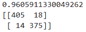
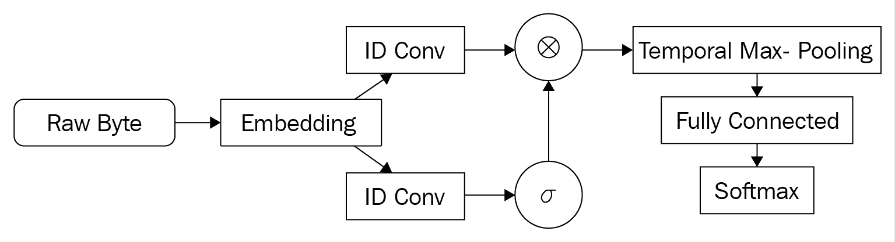
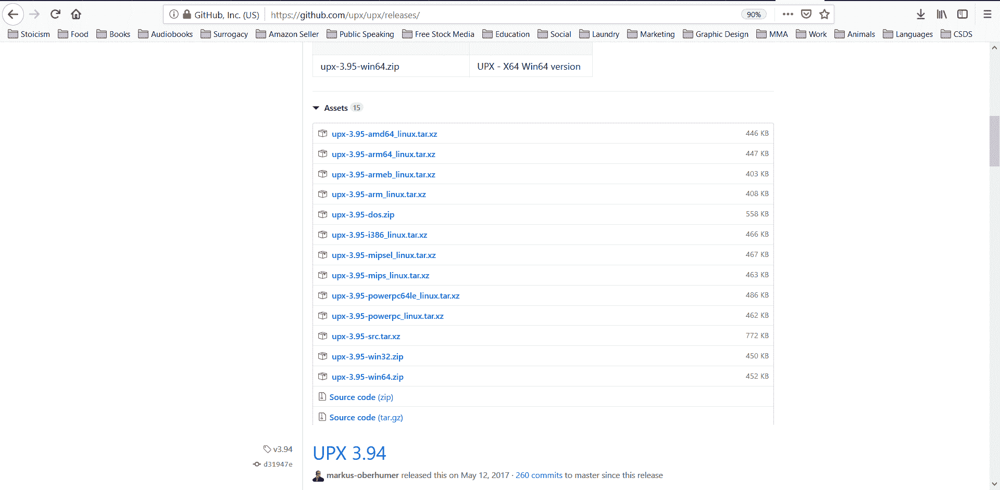
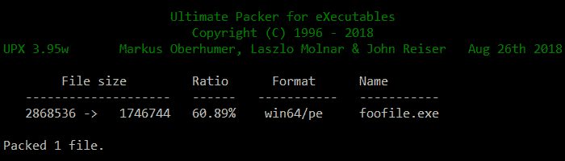
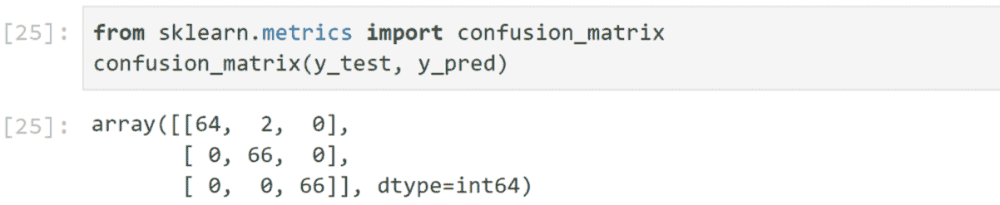
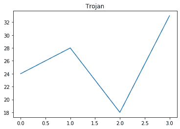
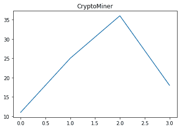
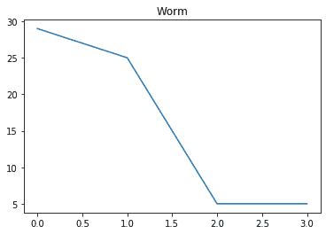
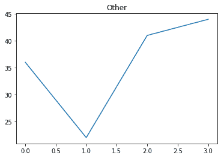

<title>Advanced Malware Detection</title> 

# 高级恶意软件检测

在本章中，我们将讨论恶意软件分析的更高级的概念。在前一章中，我们介绍了攻击恶意软件分类的一般方法。在这里，我们将讨论更具体的方法和前沿技术。特别是，我们将涵盖如何处理混淆和打包的恶意软件，如何扩大 N 元语法特征的集合，以及如何使用深度学习来检测甚至创建恶意软件。

本章包括以下配方:

*   检测混淆的 JavaScript
*   特色化 PDF 文件
*   利用 hash-gram 算法快速提取 N 元文法
*   构建动态恶意软件分类器
*   MalConv–用于恶意 PE 检测的端到端深度学习
*   使用封隔器
*   组装打包的样本数据集
*   为封隔器构建分类器
*   MalGAN–创建逃避性恶意软件
*   跟踪恶意软件漂移

<title>Technical requirements</title> 

# 技术要求

以下是本章的技术先决条件:

*   克拉斯
*   张量流
*   XGBoost
*   UPX
*   统计模型

代码和数据集可以在 https://github . com/packt publishing/Machine-Learning-for-cyber security-Cookbook/tree/master/chapter 03 找到。

<title>Detecting obfuscated JavaScript</title> 

# 检测混淆的 JavaScript

在这一节中，我们将看到如何使用机器学习来检测 JavaScript 文件何时被混淆。这样做可以用来创建一个二进制特征，无论是否混淆，用于良性/恶意分类，也可以作为去除脚本模糊的先决步骤。

<title>Getting ready</title> 

# 做好准备

该食谱的准备包括在`pip`中安装`scikit-learn`包。该命令如下所示:

```
pip install sklearn
```

此外，资源库中还为您提供了混淆和非混淆的 JavaScript 文件。将`JavascriptSamplesNotObfuscated.7z`解压到一个名为`JavaScript Samples`的文件夹中。将`JavascriptSamplesObfuscated.7z`解压到一个名为`JavaScript Samples Obfuscated`的文件夹中。

<title>How to do it...</title> 

# 怎么做...

在以下步骤中，我们将演示二进制分类器如何检测混淆的 JavaScript 文件:

1.  首先导入处理 JavaScript 内容所需的库，准备数据集，对其进行分类，并测量分类器的性能:

```
import os
from sklearn.feature_extraction.text import HashingVectorizer, TfidfTransformer
from sklearn.ensemble import RandomForestClassifier
from sklearn.model_selection import train_test_split
from sklearn.metrics import accuracy_score, confusion_matrix
from sklearn.pipeline import Pipeline
```

2.  我们指定混淆和非混淆 JavaScript 文件的路径，并为这两种类型的文件分配不同的标签:

```
js_path = "path\\to\\JavascriptSamples"
obfuscated_js_path = "path\\to\\ObfuscatedJavascriptSamples"

corpus = []
labels = []
file_types_and_labels = [(js_path, 0), (obfuscated_js_path, 1)]
```

3.  然后，我们将文件读入语料库并准备标签:

```
for files_path, label in file_types_and_labels:
    files = os.listdir(files_path)
    for file in files:
        file_path = files_path + "/" + file
        try:
            with open(file_path, "r") as myfile:
                data = myfile.read().replace("\n", "")
                data = str(data)
                corpus.append(data)
                labels.append(label)
        except:
            pass
```

4.  我们将数据集分成训练集和测试集，并准备一个管道来执行基本的 NLP，然后是一个随机森林分类器:

```
X_train, X_test, y_train, y_test = train_test_split(
    corpus, labels, test_size=0.33, random_state=42
)
text_clf = Pipeline(
    [
        ("vect", HashingVectorizer(input="content", ngram_range=(1, 3))),
        ("tfidf", TfidfTransformer(use_idf=True,)),
        ("rf", RandomForestClassifier(class_weight="balanced")),
    ]
)
```

5.  最后，我们将管道拟合到训练数据，预测测试数据，然后打印出我们的结果:

```
text_clf.fit(X_train, y_train)
y_test_pred = text_clf.predict(X_test)

print(accuracy_score(y_test, y_test_pred))
print(confusion_matrix(y_test, y_test_pred))
```

准确度和混淆矩阵如下所示:

<title>How it works…</title> 

# 它是如何工作的…

我们首先导入标准的 Python 库来分析文件并建立机器学习管道(*步骤 1* )。在*步骤 2* 和 *3* 中，我们将未混淆和混淆的 JavaScript 文件收集到数组中，并为它们分配各自的标签。这是为我们的二元分类问题做准备。请注意，生成此分类器的主要挑战是生成一个大而有用的数据集。解决这个障碍的想法包括收集大量的 JavaScript 样本，然后使用不同的工具来混淆这些样本。因此，您的分类器将可能能够避免过度适应一种类型的模糊。收集完数据后，我们将其分成训练和测试子集(*步骤 4* )。此外，我们建立一个管道，将 NLP 方法应用到 JavaScript 代码本身，然后训练一个分类器(*步骤 4* )。最后，我们在*步骤 5* 中测量分类器的性能。您会注意到，除了构建适当的数据集的挑战之外，这个方法与我们用来检测文件类型的方法类似。

<title>Featurizing PDF files</title> 

# 特色化 PDF 文件

在本节中，我们将了解如何特征化 PDF 文件，以便将它们用于机器学习。我们将使用的工具是由*迪迪尔·斯蒂文斯*([https://blog.didierstevens.com/](https://blog.didierstevens.com/))设计的`PDFiD` Python 脚本。Stevens 选择了恶意文件中常见的 20 个特征，包括 PDF 文件是否包含 JavaScript 或启动自动操作。在文件中发现这些特征是可疑的，因此，这些特征的出现可能表示恶意行为。

实际上，该工具扫描一个 PDF 文件，并计算~20 个特征中每一个的出现次数。该工具的运行如下所示:

```
 PDFiD 0.2.5 PythonBrochure.pdf

 PDF Header: %PDF-1.6
 obj                 1096
 endobj              1095
 stream              1061
 endstream           1061
 xref                   0
 trailer                0
 startxref              2
 /Page                 32
 /Encrypt               0
 /ObjStm               43
 /JS                    0
 /JavaScript            0
 /AA                    1
 /OpenAction            0
 /AcroForm              1
 /JBIG2Decode           0
 /RichMedia             0
 /Launch                0
 /EmbeddedFile          0
 /XFA                   0
 /URI                   0
 /Colors > 2^24         0
```

<title>Getting ready</title> 

# 做好准备

这个配方的必备文件在资源库中的`pdfid`和`PDFSamples`文件夹中。

<title>How to do it...</title> 

# 怎么做...

在下面的步骤中，您将使用`PDFiD`脚本来特征化一组 PDF 文件:

1.  下载该工具，并将所有附带代码放在与特征化 PDF `Files.ipynb`相同的目录下。
2.  导入 IPython 的`io`模块以捕获外部脚本的输出:

```
from IPython.utils import io
```

3.  定义一个函数来特征化 PDF:

```
def PDF_to_FV(file_path):
    """Featurize a PDF file using pdfid."""
```

4.  对一个文件运行`pdfid`并捕获操作的输出:

```
     with io.capture_output() as captured:
         %run -i pdfid $file_path
     out = captured.stdout
```

5.  接下来，解析输出，使其成为一个数字向量:

```
    out1 = out.split("\n")[2:-2]
    return [int(x.split()[-1]) for x in out1]
```

6.  导入`listdir`以枚举文件夹中的文件并指定您放置 pdf 收藏的位置:

```
from os import listdir

PDFs_path = "PDFSamples\\"
```

7.  遍历目录中的每个文件，对其进行特征化，然后将所有的特征向量收集到`X`中:

```
X = []
files = listdir(PDFs_path)
for file in files:
    file_path = PDFs_path + file
    X.append(PDF_to_FV(file_path))
```

<title>How it works…</title> 

# 它是如何工作的…

我们通过下载`PDFiD`工具并把我们的 PDF 文件放在一个方便分析的位置来开始我们的准备工作(*步骤 1* )。请注意，该工具是免费的，使用简单。接下来，我们导入非常有用的 IPython 的`io`模块，以便捕获外部程序的结果，即`PDFiD` ( *步骤 2* )。在下面的步骤中，*步骤 3* 和*步骤 5* ，我们定义了一个函数 PDF to FV，它获取一个 PDF 文件并特征化它。特别是，它利用了`PDFiD`工具，然后将其输出解析成一种方便的形式。当我们运行`PDFSamples` \ `PythonBrochure.pdf`文件时，我们的函数输出如下向量:

```
 [1096, 1095, 1061, 1061, 0, 0, 2, 32, 0, 43, 0, 0, 1, 0, 1, 0, 0, 0, 0, 0, 0, 0]
```

既然我们能够特征化一个单独的 PDF 文件，为什么不特征化我们所有的 PDF 文件，使它们服从机器学习(*步骤 6* 和 *7* )。特别是，在*步骤 6* 中，我们提供了包含我们想要特征化的 PDF 文件的路径，并且，在*步骤 7* 中，我们执行文件的实际特征化。

<title>Extracting N-grams quickly using the hash-gram algorithm</title> 

# 利用 hash-gram 算法快速提取 N 元文法

在这一节中，我们演示了一种快速高效地提取最频繁的 N 元文法的技术。这使得我们能够更容易地应对大量 N 元文法带来的挑战。这项技术被称为**哈希表**，它依赖于在提取 N 元语法时对它们进行哈希运算。N 元语法的一个特性是它们遵循幂定律，该定律确保散列冲突对由此获得的特征的质量没有显著影响。

<title>Getting ready</title> 

# 做好准备

该配方的准备包括在`pip`中安装`nltk`。该命令如下所示:

```
pip install nltk
```

此外，在存储库根目录下的`PE Samples Dataset`文件夹中已经为您提供了良性和恶意文件。将所有名为`Benign PE Samples*.7z`的档案解压到名为`Benign PE Samples`的文件夹中，将所有名为`Malicious PE Samples*.7z`的档案解压到名为`Malicious PE Samples`的文件夹中。

<title>How to do it...</title> 

# 怎么做...

在下面的步骤中，我们将演示哈希算法是如何工作的:

1.  首先指定包含样本的文件夹、参数 N，并导入一个哈希库和一个从字符串中提取 N 元语法的库:

```
from os import listdir
from nltk import ngrams
import hashlib

directories = ["Benign PE Samples", "Malicious PE Samples"]
N = 2
```

2.  我们创建一个函数来读入文件的字节，并将它们转换成 N 元语法:

```
def read_file(file_path):
    """Reads in the binary sequence of a binary file."""
    with open(file_path, "rb") as binary_file:
        data = binary_file.read()
    return data

def byte_sequence_to_Ngrams(byte_sequence, N):
    """Creates a list of N-grams from a byte sequence."""
    return ngrams(byte_sequence, N)
```

3.  现在，我们将想要散列 N 元文法:

```
def hash_input(inp):
    """Compute the MD5 hash of an input."""
    return int(hashlib.md5(inp).hexdigest(), 16)

def make_ngram_hashable(Ngram):
    """Convert N-gram into bytes to be hashable."""
    return bytes(Ngram)
```

4.  `hash_file_Ngrams_into_dictionary`函数获取一个 N-gram，对其进行哈希运算，然后在字典中为该哈希递增计数。归约模块 B (%B)确保字典中的关键字不超过`B`:

```
def hash_file_Ngrams_into_dictionary(file_Ngrams, T):
    """Hashes N-grams in a list and then keeps track of the counts in a dictionary."""
    for Ngram in file_Ngrams:
        hashable_Ngram = make_ngram_hashable(Ngram)
        hashed_and_reduced = hash_input(hashable_Ngram) % B
        T[hashed_and_reduced] = T.get(hashed_and_reduced, 0) + 1
```

5.  我们为小于 2^16 的最大素数 b 指定一个值，并创建一个空字典:

```
B = 65521
T = {}
```

6.  我们迭代我们的文件，并计算它们的散列 N-gram:

```
for dataset_path in directories:
    samples = [f for f in listdir(dataset_path)]
    for file in samples:
        file_path = dataset_path + "/" + file
        file_byte_sequence = read_file(file_path)
        file_Ngrams = byte_sequence_to_Ngrams(file_byte_sequence, N)
        hash_file_Ngrams_into_dictionary(file_Ngrams, T)
```

7.  我们使用`heapq`选择最频繁的`K1=1000`:

```
K1 = 1000
import heapq

K1_most_common_Ngrams_Using_Hash_Grams = heapq.nlargest(K1, T)
```

8.  一旦选择了顶部散列的 N 元文法，它们就构成了特征集。为了特征化样本，对其 N 元文法进行迭代、散列和归约，并且如果结果是所选择的顶部散列 N 元文法之一，则递增该索引处的特征向量:

```
def featurize_sample(file, K1_most_common_Ngrams_Using_Hash_Grams):
    """Takes a sample and produces a feature vector.
    The features are the counts of the K1 N-grams we've selected.
    """
    K1 = len(K1_most_common_Ngrams_Using_Hash_Grams)
    fv = K1 * [0]
    file_byte_sequence = read_file(file_path)
    file_Ngrams = byte_sequence_to_Ngrams(file_byte_sequence, N)
    for Ngram in file_Ngrams:
        hashable_Ngram = make_ngram_hashable(Ngram)
        hashed_and_reduced = hash_input(hashable_Ngram) % B
        if hashed_and_reduced in K1_most_common_Ngrams_Using_Hash_Grams:
            index = K1_most_common_Ngrams_Using_Hash_Grams.index(hashed_and_reduced)
            fv[index] += 1
    return fv
```

9.  最后，我们特征化我们的数据集:

```
X = []
for dataset_path in directories:
    samples = [f for f in listdir(dataset_path)]
    for file in samples:
        file_path = dataset_path + "/" + file
        X.append(featurize_sample(file_path, K1_most_common_Ngrams_Using_Hash_Grams))
```

<title>How it works…</title> 

# 它是如何工作的…

hash-gram 方法中的初始步骤类似于 N-gram 的普通提取。首先，我们指定包含样本的文件夹，我们的 N 值(如 N-grams)。另外，我们导入一个哈希库，这是一个不同于普通提取 N 元文法的动作( *Step 1* )。继续我们的准备工作，我们定义一个函数来读入文件的所有字节(相对于读入其内容)，并将这些字节转换成 N 元语法(*步骤 2* )。我们定义一个函数来计算 N-gram 的 MD5 散列，并将结果作为十六进制数返回。此外，我们定义了一个函数来将 N 元语法转换成它的字节成分，以便能够散列它(*步骤 3* )。

接下来，我们定义一个函数来遍历文件的散列 N 元文法，将它们简化为模 B，然后为简化的散列增加字典中的计数(*步骤 4* )。参数 B 控制字典中不同键的数量限制。通过散列，我们能够随机化计算 N 元文法的桶。现在，当我们将要运行我们的函数时，是时候指定 b 的值了。我们选择 b 的值为小于 2^16 的最大质数(*步骤 5* )。

标准做法是选择一个素数，以确保哈希冲突的数量最少。我们现在遍历我们的文件目录，并对每个文件应用我们之前定义的函数(*步骤 6* )。结果是一个大字典， *T* ，它包含散列 N 元文法的计数。这个字典不算太大，我们很容易从中选出 N 元文法最常见的前 K1 个约简哈希( *Step 7* )。通过这样做，我们选择顶部最频繁的 N 元文法的概率很高，尽管由于散列冲突可能有多于 K1 个。在这一点上，我们有了我们的特征集，它是通过散列映射到我们选择的 K1 散列 N 元文法的 N 元文法。我们现在特征化我们的数据集(*步骤 8* 和 *9* )。特别是，我们遍历我们的文件，计算它们的 N-gram。如果一个 N-gram 有一个简化的 hash，是 K1 个选择的 hash 之一，我们认为它是一个频繁的 N-gram，并把它作为我们的特征集的一部分。

需要注意的是，hash-grams 算法并不总是更快，但只要考虑的数据集很大，它就会更快。在许多情况下，在提取 N-gram 的简单方法导致内存错误的情况下，hash-gram 能够成功终止。

<title>See also</title> 

# 请参见

有关 hash-gram 算法的更多详细信息，请参见[https://www . edwardraff . com/publications/hash-grams-faster . pdf](https://www.edwardraff.com/publications/hash-grams-faster.pdf)[。](https://www.edwardraff.com/publications/hash-grams-faster.pdf)

<title>Building a dynamic malware classifier</title> 

# 构建动态恶意软件分类器

在某些情况下，根据恶意软件的行为来检测恶意软件具有相当大的优势。特别是，当恶意软件在动态情况下被分析时，隐藏其意图要困难得多。因此，对动态信息进行操作的分类器比静态分类器更准确。在本节中，我们提供了一个动态恶意软件分类器的配方。我们使用的数据集是 android 应用程序的病毒共享库的一部分。动态分析是由 Johannes Thon 在几款采用 Android API 23 的 LG Nexus 5 设备上执行的，(在 LG Nexus 5 设备场(API 23)上动态分析了超过 4，000 个恶意应用，在 LG Nexus 5 设备场(API 23)上由 goorax 动态分析了超过 4，300 个良性应用，由原始设备在 CC 下使用/未经修改)。

我们的方法是在 API 调用序列中使用 N 元语法。

<title>Getting ready</title> 

# 做好准备

该配方的准备包括在`pip`中安装`scikit-learn`、`nltk`和`xgboost`。该命令如下所示:

```
pip install sklearn nltk xgboost
```

此外，在存储库中已经为您提供了良性和恶意的动态分析文件。将所有名为`DA Logs Benign*.7z`的档案解压到名为`DA Logs Benign`的文件夹中，将所有名为`DA Logs Malware*.7z`的档案解压到名为`DA Logs Malicious`的文件夹中。

<title>How to do it...</title> 

# 怎么做...

在下面的步骤中，我们演示了分类器如何根据观察到的 API 调用序列来检测恶意软件。

1.  我们的日志是 JSON 格式的，所以我们从导入 JSON 库开始。

```
import numpy as np
import os
import json

directories_with_labels = [("DA Logs Benign", 0), ("DA Logs Malware", 1)]
```

2.  编写一个函数来解析 JSON 日志:

```
def get_API_class_method_type_from_log(log):
    """Parses out API calls from behavioral logs."""
    API_data_sequence = []
    with open(log) as log_file:
        json_log = json.load(log_file)
        api_calls_array = "[" + json_log["api_calls"] + "]"
```

3.  我们选择提取 API 调用的类、方法和类型:

```
        api_calls = json.loads(api_calls_array)
        for api_call in api_calls:
            data = api_call["class"] + ":" + api_call["method"] + ":" + api_call["type"]
            API_data_sequence.append(data)
    return API_data_sequence
```

4.  我们将日志读入语料库，并收集它们的标签:

```
data_corpus = []
labels = []
for directory, label in directories_with_labels:
    logs = os.listdir(directory)
    for log_path in logs:
        file_path = directory + "/" + log_path
        try:
            data_corpus.append(get_API_class_method_type_from_log(file_path))
            labels.append(label)
        except:
            pass
```

5.  现在，让我们看看语料库中的数据是什么样的:

```
print(data_corpus[0])

['android.os.SystemProperties:get:content', 'android.os.SystemProperties:get:content', 'android.os.SystemProperties:get:content', 'android.os.SystemProperties:get:content', 'android.os.SystemProperties:get:content', 'android.os.SystemProperties:get:content', 'android.os.SystemProperties:get:content', 'android.os.SystemProperties:get:content', 'android.os.SystemProperties:get:content', 'android.os.SystemProperties:get:content', 'android.os.SystemProperties:get:content', 'android.os.SystemProperties:get:content', 'android.app.ContextImpl:registerReceiver:binder', 'android.app.ContextImpl:registerReceiver:binder', 'android.os.SystemProperties:get:content', 'android.os.SystemProperties:get:content']
```

6.  我们继续执行列车测试分割:

```
from sklearn.model_selection import train_test_split

corpus_train, corpus_test, y_train, y_test = train_test_split(
    data_corpus, labels, test_size=0.2, random_state=11
)
```

7.  我们的方法是使用 N-gram，因此我们加载我们的 N-gram 提取函数，对当前数据格式稍作修改:

```
import collections
from nltk import ngrams
import numpy as np

def read_file(file_path):
    """Reads in the binary sequence of a binary file."""
    with open(file_path, "rb") as binary_file:
        data = binary_file.read()
    return data

def text_to_Ngrams(text, n):
    """Produces a list of N-grams from a text."""
    Ngrams = ngrams(text, n)
    return list(Ngrams)

def get_Ngram_counts(text, N):
    """Get a frequency count of N-grams in a text."""
    Ngrams = text_to_Ngrams(text, N)
    return collections.Counter(Ngrams)
```

8.  我们指定 N=4 并收集所有 N 元文法:

```
N = 4
total_Ngram_count = collections.Counter([])
for file in corpus_train:
    total_Ngram_count += get_Ngram_counts(file, N)
```

9.  接下来，我们缩小到`K1 = 3000`最常见的 N-gram:

```
K1 = 3000
K1_most_frequent_Ngrams = total_Ngram_count.most_common(K1)
K1_most_frequent_Ngrams_list = [x[0] for x in K1_most_frequent_Ngrams]

[('java.lang.reflect.Method:invoke:reflection', 'java.lang.reflect.Method:invoke:reflection', 'java.lang.reflect.Method:invoke:reflection', 'java.lang.reflect.Method:invoke:reflection'),

('java.io.FileInputStream:read:runtime', 'java.io.FileInputStream:read:runtime', 'java.io.FileInputStream:read:runtime', 'java.io.FileInputStream:read:runtime'),

 <snip>

 ('android.os.SystemProperties:get:content',   'android.os.SystemProperties:get:content',   'android.os.SystemProperties:get:content',   'javax.crypto.spec.SecretKeySpec:javax.crypto.spec.SecretKeySpec:crypto')
```

10.  然后，我们编写一个方法，将一个样本特征化为一个 N-gram 计数的向量:

```
def featurize_sample(file, Ngrams_list):
    """Takes a sample and produces a feature vector.
    The features are the counts of the K1 N-grams we've selected.
    """
    K1 = len(Ngrams_list)
    feature_vector = K1 * [0]
    fileNgrams = get_Ngram_counts(file, N)
    for i in range(K1):
        feature_vector[i] = fileNgrams[Ngrams_list[i]]
    return feature_vector
```

11.  我们应用这个函数来特征化我们的训练和测试样本:

```
X_train = []
for sample in corpus_train:
    X_train.append(featurize_sample(sample, K1_most_frequent_Ngrams_list))
X_train = np.asarray(X_train)
X_test = []
for sample in corpus_test:
    X_test.append(featurize_sample(sample, K1_most_frequent_Ngrams_list))
X_test = np.asarray(X_test)
```

12.  我们使用互信息将 K1=3000 个最频繁的 N 元文法进一步缩小到 K2=500 个最具信息量的 N 元文法。然后，我们设置一个管道来运行 XGBoost 分类器:

```
from sklearn.feature_selection import SelectKBest, mutual_info_classif
from sklearn.pipeline import Pipeline
from xgboost import XGBClassifier

K2 = 500
mi_pipeline = Pipeline(
    [
        ("mutual_information", SelectKBest(mutual_info_classif, k=K2)),
        ("xgb", XGBClassifier()),
    ]
)
```

13.  我们训练我们的管道，并在训练和测试集上评估其准确性:

```
mi_pipeline.fit(X_train, y_train)
print("Training accuracy:")
print(mi_pipeline.score(X_train, y_train))
print("Testing accuracy:")
print(mi_pipeline.score(X_test, y_test))
```

以下输出为我们提供了训练和测试的准确性:

```
Training accuracy:
0.8149428743235118
Testing accuracy:
0.8033674082982561
```

<title>How it works…</title> 

# 它是如何工作的…

在这个方法中，我们执行了一些令人兴奋的事情，即根据恶意软件和良性样本的运行时行为对它们进行分类。我们的前三个步骤是定义一个函数来读入和解析 JSON 日志，这些日志包含关于示例运行时行为的信息。顺便说一句，每当您的数据可能具有可变数量的属性时，JSON 都是一种有用的文件格式。我们做出战略选择，提取 API 调用类、方法和内容。其他特性也是可用的，比如进行 API 调用的时间以及调用了什么参数。代价是数据集将变得更大，这些特征可能会导致速度变慢或过度拟合。关于为分类器选择附加特征，建议进行调查。

定义好函数后，我们继续执行解析，并在一个地方收集所有解析的数据(*步骤 4* )。在第五步中，我们看了一眼我们的语料库。我们看到了组成数据的四个 API 调用的示例。接下来是执行训练测试分割的标准步骤。在*步骤 7* 和 *8* 中，我们加载我们的 N-gram 提取函数，并使用这些函数从我们的数据集中提取 N-gram。这些提取方法类似于用于二进制文件的方法，但是针对手边的文本格式进行了调整。最初，我们收集 K1=3000 个最频繁的 N 元文法，以便减少计算量。通过增加数字 K1 和随后的 K2，我们可以预期我们的分类器的精度会提高，但是内存和计算需求会增加(*步骤 9* )。在*步骤 10* 中，我们定义了一个函数来将样本特征化为它们的 N 元特征向量，然后，在*步骤 11* 中，我们应用这个函数来特征化我们的训练和测试样本。我们希望进一步缩小我们的功能集。我们选择使用互信息从`K1=3000`个最频繁的 N 元语法中选择 K2=500 个最具信息量的 N 元语法(*步骤 12*)—有许多选项，如选择最佳 N 元语法的方法中所讨论的。

例如，另一种选择是使用卡方检验。此外，可以选择除 XGBoost 之外的其他分类器。最后，我们看到获得的准确性表明在 API 调用序列上使用 N 元语法的方法是有前途的。

<title>MalConv – end-to-end deep learning for malicious PE detection</title> 

# MalConv–用于恶意 PE 检测的端到端深度学习

静态恶意软件检测的新发展之一是将深度学习用于恶意软件检测的端到端机器学习。在这个设置中，我们完全跳过所有的特征工程；我们不需要知道 PE 报头或可能指示 PE 恶意软件的其他特征。我们只需将一串原始字节输入我们的神经网络，然后进行训练。这个想法最早是在 https://arxiv.org/pdf/1710.09435.pdf 提出的。这种架构被称为 **MalConv** ，如下图所示:



<title>Getting ready</title> 

# 做好准备

该配方的准备包括在`pip`中安装多个软件包，即`keras`、`tensorflow`和`tqdm`。该命令如下所示:

```
pip install keras tensorflow tqdm
```

此外，在资源库根目录下的`PE Samples Dataset`文件夹中，已经为您提供了良性和恶意文件。将所有名为`Benign PE Samples*.7z`的档案解压到名为`Benign PE Samples`的文件夹中，将所有名为`Malicious PE Samples*.7z`的档案解压到名为`Malicious PE Samples`的文件夹中。

<title>How to do it...</title> 

# 怎么做...

在本食谱中，我们详细介绍了如何在原始 pe 文件上训练 MalConv:

1.  我们导入`numpy`用于向量运算，导入`tqdm`用于跟踪循环的进度:

```
import numpy as np
from tqdm import tqdm
```

2.  定义一个函数，将一个字节作为向量嵌入:

```
def embed_bytes(byte):
    binary_string = "{0:08b}".format(byte)
    vec = np.zeros(8)
    for i in range(8):
        if binary_string[i] == "1":
            vec[i] = float(1) / 16
        else:
            vec[i] = -float(1) / 16
    return vec
```

3.  读取原始 PE 样品的位置，并创建其标签列表:

```
import os
from os import listdir

directories_with_labels = [("Benign PE Samples", 0), ("Malicious PE Samples", 1)]
list_of_samples = []
labels = []
for dataset_path, label in directories_with_labels:
    samples = [f for f in listdir(dataset_path)]
    for file in samples:
        file_path = os.path.join(dataset_path, file)
        list_of_samples.append(file_path)
        labels.append(label)
```

4.  定义一个方便的函数来读入文件的字节序列:

```
def read_file(file_path):
    """Read the binary sequence of a file."""
    with open(file_path, "rb") as binary_file:
        return binary_file.read()
```

5.  设置每个样本要读入的最大字节长度`maxSize`，嵌入样本的所有字节，并将结果收集在 X:

```
max_size = 15000
num_samples = len(list_of_samples)
X = np.zeros((num_samples, 8, max_size))
Y = np.asarray(labels)
file_num = 0
for file in tqdm(list_of_samples):
    sample_byte_sequence = read_file(file)
    for i in range(min(max_size, len(sample_byte_sequence))):
        X[file_num, :, i] = embed_bytes(sample_byte_sequence[i])
    file_num += 1
```

6.  准备优化程序:

```
from keras import optimizers

my_opt = optimizers.SGD(lr=0.01, decay=1e-5, nesterov=True)
```

7.  利用 Keras 功能 API 建立深度神经网络架构:

```
 from keras import Input
 from keras.layers import Conv1D, Activation, multiply, GlobalMaxPool1D, Dense
 from keras import Model

 inputs = Input(shape=(8, maxSize))
 conv1 = Conv1D(kernel_size=(128), filters=32, strides=(128), padding='same')(inputs)
 conv2 = Conv1D(kernel_size=(128), filters=32, strides=(128), padding='same')(inputs)
 a = Activation('sigmoid', name='sigmoid')(conv2)
 mul = multiply([conv1, a])
 b = Activation('relu', name='relu')(mul)
 p = GlobalMaxPool1D()(b)
 d = Dense(16)(p)
 predictions = Dense(1, activation='sigmoid')(d)
 model = Model(inputs=inputs, outputs=predictions)

```

8.  编译模型并选择批量大小:

```
model.compile(optimizer=my_opt, loss="binary_crossentropy", metrics=["acc"])
batch_size = 16
num_batches = int(num_samples / batch_size)
```

9.  批量训练模型:

```
for batch_num in tqdm(range(num_batches)):
    batch = X[batch_num * batch_size : (batch_num + 1) * batch_size]
    model.train_on_batch(
        batch, Y[batch_num * batch_size : (batch_num + 1) * batch_size]
    )
```

<title>How it works…</title> 

# 它是如何工作的…

我们从导入`numpy`和`tqdm` ( *步骤 1* )开始，这是一个允许您通过显示百分比进度条来跟踪循环进度的包。作为将文件的原始字节输入到我们的深度神经网络的一部分，我们使用一个简单的 8 维空间中的字节嵌入，其中字节的每一位对应于向量的一个坐标(*步骤 2* )。位等于 1 意味着相应的坐标被设置为 1/16，而位值 0 对应于等于-1/16 的坐标。例如，嵌入 10010001 作为向量(1/16，-1/16，-1/16，1/16，-1/16，-1/16，-1/16，1/16)。执行嵌入的其他方式也是可能的，例如与神经网络一起训练的方式。

MalConv 架构是一个简单但计算快速的选择。在*步骤 3* 中，我们列出了样本及其标签，在*步骤 4* 中，我们定义了一个函数来读取文件的字节。注意代替`r`的`rb`设置，以便将文件作为字节序列读取。在*步骤 5* 中，我们使用`tqdm`来跟踪循环的进程。对于每个文件，我们读入字节序列并将每个字节嵌入到一个 8 维空间中。然后我们将所有这些收集到 *X* 中。如果字节数超过`maxSize=15000`，那么我们停止。如果字节数小于 maxSize，则字节数被假定为 0。控制每个文件读取多少字节的`maxSize`参数可以根据内存容量、可用计算量和样本大小进行调整。在接下来的步骤(*步骤 6* 和 *7* )中，我们定义了一个标准优化器，即一个带有参数选择的随机梯度下降，并定义了我们的神经网络的架构，以与 MalConv 的架构紧密匹配。注意，我们在这里使用了 Keras functional API，它允许我们在模型中创建重要的输入输出关系。

最后，请注意，更好的架构和参数选择是一个开放的研究领域。接下来，我们现在可以自由选择批量并开始训练(*步骤 8* 和 *9* )。批量大小是一个重要的参数，可以影响学习过程的速度和稳定性。出于我们的目的，我们做了一个简单的选择。我们一次喂一批，训练我们的神经网络。

<title>Tackling packed malware</title> 

# 应对打包的恶意软件

打包是对可执行文件的压缩或加密，与普通压缩不同，它通常在运行时在内存中解压缩，而不是在执行前解压缩到磁盘。包装商给分析师带来了困惑的挑战。

例如，一个名为 VMProtect 的打包程序通过在具有独特架构的虚拟环境中执行来保护其内容不被分析师发现，这使得任何人分析该软件都是一个巨大的挑战。

琥珀色是一种反射型 PE 封隔器，用于绕过安全产品和缓解措施。它可以将定期编译的 PE 文件打包到反射有效载荷中，这些有效载荷可以像外壳代码一样加载和执行它们自己。它支持秘密的内存有效负载部署，可用于绕过防病毒、防火墙、IDS、IPS 产品和应用程序白名单缓解措施。最常用的封隔器是 UPX。

由于打包会混淆代码，因此它通常会导致机器学习分类器的性能下降。通过确定使用哪个打包程序来打包可执行文件，我们可以使用同一个打包程序来解包代码，也就是说，将代码还原到其原始的、未混淆的版本。然后，反病毒和机器学习检测文件是否是恶意的变得更简单。

<title>Using packers</title> 

# 使用封隔器

在这个食谱中，我们将展示如何获得一个打包器，即 UPX，以及如何使用它。拥有一组封隔器的目的首先是执行数据扩充，这将在配方的剩余部分中详细描述，其次是一旦确定了用于对样品进行封隔的封隔器，就能够对样品进行解包。

<title>Getting ready</title> 

# 做好准备

以下配方不需要包装。你可以在这本书的资源库的`Packers`文件夹中找到`upx.exe`。

<title>How to do it...</title> 

# 怎么做...

在本菜谱中，您将利用 UPX 打包程序来打包一个文件:

1.  从 https://github.com/upx/upx/releases/[下载并解压缩最新版本的 UPX](https://github.com/upx/upx/releases/)



2.  通过运行`upx.exe`和`foofile.exe`，对您想要打包的文件执行`upx.exe`。成功打包的结果如下所示:



该文件仍然是一个可执行文件，不像归档文件，它会被压缩。

<title>How it works…</title> 

# 它是如何工作的…

如您所见，使用封隔器非常简单。大多数打包程序的一个好处是，除了混淆文件内容之外，它们还可以减小文件的大小。许多黑客利用定制的打包程序。这些东西的优点是很难拆开包装。从检测恶意文件的角度来看，使用自定义打包程序打包的文件非常可疑。

<title>Assembling a packed sample dataset</title> 

# 组装打包的样本数据集

为打包分类器组装数据集的一个明显方法是收集已打包且其包装已贴标签的样本。组装打包样本的另一个有效方法是收集大量文件，然后自己打包。

<title>Getting ready</title> 

# 做好准备

以下配方不需要包装。你可以在这本书的资源库的`Packers`文件夹中找到`upx.exe`。

<title>How to do it...</title> 

# 怎么做...

在这个菜谱中，您将使用 UPX 来打包一个文件目录。

1.  在目录`A`中放置`upx.exe`，在目录`B`中放置样本集合`A`。对于这个例子，`B`是良性 PE 样本 UPX。
2.  列出目录`B`中的文件:

```
import os

files_path = "Benign PE Samples UPX/"
files = os.listdir(files_path)
file_paths = [files_path+x for x in files]
```

3.  对`B`中的每个文件运行`upx`:

```
from subprocess import Popen, PIPE

cmd = "upx.exe"
for path in file_paths:
    cmd2 = cmd+" \""+path+"\""
    res = Popen(cmd2, stdout=PIPE).communicate()
    print(res)
```

4.  每当包装出现错误时，取出原始样品:

```
    if "error" in str(res[0]):
        print(path)
        os.remove(path)
```

<title>How it works…</title> 

# 它是如何工作的…

前两步是运行 UPX 封隔器的准备工作。在*步骤 3* 中，我们使用一个子流程来调用外部命令，也就是 Python 中的 UPX。当我们包装样品时(*步骤 4* )，无论何时出现错误，我们都会移除样品，因为它无法成功包装。这确保了我们的目录只包含打包的样本，这样我们就可以将干净和有组织的数据输入到我们的分类器中。

<title>Building a classifier for packers</title> 

# 为封隔器构建分类器

收集了标记数据(由根据包装商标记的目录中的包装样本组成)后，我们准备训练分类器来确定样本是否被包装，如果是，由哪个包装商包装。

<title>Getting ready</title> 

# 做好准备

该配方的准备包括将`scikit-learn`和`nltk`安装在`pip`中。该命令如下所示:

```
pip install sklearn nltk
```

此外，存储库中还为您提供了打包和非打包文件。在这个配方中，使用了三种类型的样品:未包装的、UPX 包装的和琥珀包装的。将资源库根目录下`PE Samples Dataset`中名为`Benign PE Samples*.7z`的所有档案解压到名为`Benign PE Samples`的文件夹中，将`Benign PE Samples UPX.7z`解压到名为`Benign PE Samples UPX`的文件夹中，将`Benign PE Samples Amber.7z`解压到名为`Benign PE Samples Amber`的文件夹中。

<title>How to do it...</title> 

# 怎么做...

在本菜谱中，您将构建一个分类器来确定哪个打包程序用于打包文件:

1.  读入待分析文件的名称及其标签，对应于所用的封隔器:

```
import os
from os import listdir

directories_with_labels = [
    ("Benign PE Samples", 0),
    ("Benign PE Samples UPX", 1),
    ("Benign PE Samples Amber", 2),
]
list_of_samples = []
labels = []
for dataset_path, label in directories_with_labels:
    samples = [f for f in listdir(dataset_path)]
    for file in samples:
        file_path = os.path.join(dataset_path, file)
        list_of_samples.append(file_path)
        labels.append(label)
```

2.  创建训练测试分割:

```
from sklearn.model_selection import train_test_split

samples_train, samples_test, labels_train, labels_test = train_test_split(
    list_of_samples, labels, test_size=0.3, stratify=labels, random_state=11
)
```

3.  定义提取 N 元语法所需的导入:

```
import collections
from nltk import ngrams
import numpy as np
```

4.  定义用于提取 N 元语法的函数:

```
def read_file(file_path):
    """Reads in the binary sequence of a binary file."""
    with open(file_path, "rb") as binary_file:
        data = binary_file.read()
    return data

def byte_sequence_to_Ngrams(byte_sequence, N):
    """Creates a list of N-grams from a byte sequence."""
    Ngrams = ngrams(byte_sequence, N)
    return list(Ngrams)

def extract_Ngram_counts(file, N):
    """Takes a binary file and outputs the N-grams counts of its binary sequence."""
    filebyte_sequence = read_file(file)
    file_Ngrams = byte_sequence_to_Ngrams(filebyte_sequence, N)
    return collections.Counter(file_Ngrams)

def featurize_sample(sample, K1_most_frequent_Ngrams_list):
    """Takes a sample and produces a feature vector.
    The features are the counts of the K1 N-grams we've selected.
    """
    K1 = len(K1_most_frequent_Ngrams_list)
    feature_vector = K1 * [0]
    file_Ngrams = extract_Ngram_counts(sample, N)
    for i in range(K1):
        feature_vector[i] = file_Ngrams[K1_most_frequent_Ngrams_list[i]]
    return feature_vector
```

5.  浏览数据，并选择您希望用作您的特征的 N 元语法:

```
N = 2
total_Ngram_count = collections.Counter([])
for file in samples_train:
    total_Ngram_count += extract_Ngram_counts(file, N)
K1 = 100
K1_most_common_Ngrams = total_Ngram_count.most_common(K1)
K1_most_common_Ngrams_list = [x[0] for x in K1_most_common_Ngrams]
```

6.  特征化训练集:

```
Ngram_features_list_train = []
y_train = []
for i in range(len(samples_train)):
    file = samples_train[i]
    NGram_features = featurize_sample(file, K1_most_common_Ngrams_list)
    Ngram_features_list_train.append(NGram_features)
    y_train.append(labels_train[i])
X_train = Ngram_features_list_train
```

7.  根据训练数据训练随机森林模型:

```
from sklearn.ensemble import RandomForestClassifier

clf = RandomForestClassifier(n_estimators=100)
clf = clf.fit(X_train, y_train)
```

8.  特征化测试集:

```
Ngram_features_list_test = []
y_test = []
for i in range(len(samples_test)):
    file = samples_test[i]
    NGram_features = featurize_sample(file, K1_most_common_Ngrams_list)
    Ngram_features_list_test.append(NGram_features)
    y_test.append(labels_test[i])
X_test = Ngram_features_list_test
```

9.  利用训练好的分类器对测试集进行预测，并使用混淆矩阵评估性能:

```
y_pred = clf.predict(X_test)
from sklearn.metrics import confusion_matrix

confusion_matrix(y_test, y_pred)
```

输出如下所示:

<title>How it works…</title> 

# 它是如何工作的…

我们首先简单地将数据和标签组织成数组(*步骤 1* )。特别是，我们读入我们的样品，并根据包装它们的包装商给它们贴上相应的标签。在*步骤 2* 中，我们对数据进行训练测试分割。我们现在已经准备好特征化我们的数据，因此我们导入了提取 N-gram 所必需的库，并定义了我们的 N-gram 函数(*步骤 3* 和 *4* )，这将在其他菜谱中讨论，并且，通过简化选择 *N=2* 和 *K1=100* 最频繁的 N-gram 作为我们的特征，特征化了我们的数据(*步骤 5* 和*6*不同的 N 值和选择最有信息量的 N 元文法的其他方法可以产生更好的结果，同时增加了对计算资源的需求。特征化数据后，我们对其进行训练测试分割(*步骤 7* ，然后对数据训练一个随机森林分类器(简单的首选)(*步骤 8* )。通过*步骤 9* 中的混淆矩阵判断，我们看到机器学习分类器在这类问题上表现得非常准确。**

<title>MalGAN – creating evasive malware</title> 

# MalGAN–创建逃避性恶意软件

使用**生成式敌对网络** ( **GANs** )，我们可以创建敌对的恶意软件样本来训练和改进我们的检测方法，并在对手之前发现漏洞。这里的代码基于**j 40903272/MalConv-keras**。敌对恶意软件样本是已经通过用小的但仔细计算的字节序列填充它们而被修改的恶意软件样本，选择该字节序列是为了欺骗用于对样本进行分类的神经网络(在这种情况下是 MalConv)。

<title>Getting ready</title> 

# 做好准备

该配方的准备包括在`pip`安装`pandas`、`keras`、`tensorflow`和`scikit-learn`包。该命令如下所示:

```
pip install pandas keras tensorflow sklearn
```

`MalGan`的相关代码和资源文件已经包含在本书的资源库中，在`MalGan`目录下。此外，汇编一组 PE 示例，然后将它们的路径放在文件的第一列:

```
"MalGAN_input/samplesIn.csv" 
```

在第二列中，输入这些样本的判断(1 表示良性，0 表示恶意)。

<title>How to do it...</title> 

# 怎么做...

在本食谱中，您将学习如何创建恶意软件:

1.  首先导入 MalGAN 的代码，以及一些实用程序库。

```
import os
import pandas as pd
from keras.models import load_model
import MalGAN_utils
import MalGAN_gen_adv_examples
```

2.  指定输入和输出路径:

```
save_path = "MalGAN_output"
model_path = "MalGAN_input/malconv.h5"
log_path = "MalGAN_output/adversarial_log.csv"
pad_percent = 0.1
threshold = 0.6
step_size = 0.01
limit = 0.
input_samples = "MalGAN_input/samplesIn.csv"
```

3.  设置您是否希望使用 GPU 进行对立样本生成:

```
MalGAN_utils.limit_gpu_memory(limit)
```

4.  将包含样品名称和标签的 csv 文件读入数据框:

```
df = pd.read_csv(input_samples, header=None)
fn_list = df[0].values
```

5.  加载预先计算的 MalConv 模型:

```
model = load_model(model_path)
```

6.  使用**快速梯度步进法** ( **FGSM** )生成对抗性恶意软件:

```
adv_samples, log = MalGAN_gen_adv_examples.gen_adv_samples(model, fn_list, pad_percent, step_size, threshold)
```

7.  保存结果日志并将样本写入磁盘:

```
log.save(log_path)
for fn, adv in zip(fn_list, adv_samples):
    _fn = fn.split('/')[-1]
    dst = os.path.join(save_path, _fn)
    print(dst)
    with open(dst, 'wb') as f:
        f.write(adv)
```

<title>How it works…</title> 

# 它是如何工作的…

我们首先导入我们将要使用的所有 MalGAN 代码(*步骤 1* )。我们必须指定几个参数(*步骤 2* )，现在解释一下。`savePath`参数是保存对立范例的位置。`modelPath`变量是 MalConv 预计算权重的路径。`logPath`参数是记录与将**快速梯度标记方法** ( **FGSM** )应用于样品相关的数据。例如，日志文件可能如下所示:

| **文件名** | **原始分数** | **文件长度** | **衬垫长度** | **损失** | **预测分数** |
| 0778...b916 | 0.001140 | 235 | 23 | 一 | 0.912 |

观察原始评分接近`0`，说明原始样本被 MalConv 认为是恶意的。在选择使用哪些字节进行填充后，最终的预测得分接近于`1`，这表明修改后的样本现在被认为是良性的。`padPercent`参数决定有多少字节被附加到样本的末尾。`threshold`参数确定神经网络在对立示例中应该有多确定是良性的，以便将其写入磁盘。`stepSize`是 FGSM 中使用的参数。现阶段参数到此为止。我们还有另外一个选择，就是用 CPU 还是 GPU ( *Step 3* )。为了简单起见，我们在这个食谱中选择使用 CPU。显然，GPU 会使计算更快。这里的`limit`参数表示在计算中使用多少 GPU，并被设置为`0`。在下一步*步骤 4* 中，我们读入由`inputSamples`参数指向的`.csv`文件。该输入日志采用如下格式:

2b5137a1658c...8

| 一 | 0778a070b28...6 |
| 0 | 这里，在第一列中，给出了样本的路径，在第二列中，提供了标签(`1`表示良性，`0`表示恶意)。我们现在加载预先计算的 MalGAN 模型(*步骤 5* )，生成敌对的恶意软件样本(*步骤 6* )，然后将它们保存到磁盘上(*步骤 7* )。 |

跟踪恶意软件漂移

<title>Tracking malware drift</title> 

# 恶意软件的传播千变万化。不仅有新的样本发布，还有新类型的病毒。例如，密码黑客是一种相对较新的恶意软件，直到加密货币出现才为人所知。有趣的是，从机器学习的角度来看，不仅是恶意软件的类型和分布在进化，而且它们的定义也在进化，这被称为**概念漂移**。更具体地说，15 年前的病毒可能在当前使用的系统中不再可执行。因此，它不会伤害用户，因此不再是恶意软件的实例。

通过跟踪恶意软件的动向，甚至预测它，组织能够更好地将其资源引导到正确的防御类型，为自己接种疫苗以抵御未来的威胁。

做好准备

<title>Getting ready</title> 

# 该配方的准备包括在`pip`中安装`matplotlib`、`statsmodels`和`scipy`包。该命令如下所示:

怎么做...

```
pip install matplotlib statsmodels scipy
```

<title>How to do it...</title> 

# 在本食谱中，您将使用时间序列回归来根据历史数据预测恶意软件的分布:

收集您感兴趣的领域中恶意软件分布的历史数据:

1.  将数据转换为每个恶意软件类别的单独时间序列:

```
month0 = {"Trojan": 24, "CryptoMiner": 11, "Other": 36, "Worm": 29}
month1 = {"Trojan": 28, "CryptoMiner": 25, "Other": 22, "Worm": 25}
month2 = {"Trojan": 18, "CryptoMiner": 36, "Other": 41, "Worm": 5}
month3 = {"CryptoMiner": 18, "Trojan": 33, "Other": 44, "Worm": 5}
months = [month0, month1, month2, month3]
```

2.  下图显示了特洛伊木马的时间序列:

```
trojan_time_series = []
crypto_miner_time_series = []
worm_time_series = []
other_time_series = []
for month in months:
    trojan_time_series.append(month["Trojan"])
    crypto_miner_time_series.append(month["CryptoMiner"])
    worm_time_series.append(month["Worm"])
    other_time_series.append(month["Other"])
```



下图显示了密码矿工的时间序列:



下图显示了蠕虫的时间序列:



下图显示了其他类型恶意软件的时间序列:



从`statsmodels`导入移动平均线:

3.  使用移动平均线根据时间序列预测下个月的分布。

```
from statsmodels.tsa.arima_model import ARMA
```

4.  特洛伊木马的结果如下:

```
ts_model = ARMA(trojan_time_series, order=(0, 1))
model_fit_to_data = ts_model.fit(disp=True)
y_Trojan = model_fit_to_data.predict(len(trojan_time_series), len(trojan_time_series))
print("Trojan prediction for following month: " + str(y_Trojan[0]) + "%")
```

我们对密码矿工使用相同的方法:

```
Trojan prediction for following month: 21.699999876315772%
```

我们得到以下预测:

```
ts_model = ARMA(crypto_miner_time_series, order=(0, 1))
model_fit_to_data = ts_model.fit(disp=True)
y_CryptoMiner = model_fit_to_data.predict(
    len(crypto_miner_time_series), len(crypto_miner_time_series)
)
print("CryptoMiner prediction for following month: " + str(y_CryptoMiner[0]) + "%")
```

对于蠕虫，请使用以下代码:

```
CryptoMiner prediction for following month: 24.09999979660618%
```

我们得到以下预测:

```
ts_model = ARMA(worm_time_series, order=(0, 1))
model_fit_to_data = ts_model.fit(disp=True)
y_Worm = model_fit_to_data.predict(len(worm_time_series), len(worm_time_series))
print("Worm prediction for following month: " + str(y_Worm[0]) + "%")
```

对于其他类型的恶意软件，我们使用以下代码:

```
Worm prediction for following month: 14.666665384131406%
```

我们得到以下预测:

```
ts_model = ARMA(other_time_series, order=(0, 1))
model_fit_to_data = ts_model.fit(disp=True)
y_Other = model_fit_to_data.predict(len(other_time_series), len(other_time_series))
print("Other prediction for following month: " + str(y_Other[0]) + "%")
```

它是如何工作的…

```
Other prediction for following month: 27.400000645620793%
```

<title>How it works…</title> 

# 出于指导目的，我们生成一个玩具数据集，表示每种恶意软件在时间上的百分比(*步骤 1* )。有了大量的历史数据，这样的数据集可以指示在安全领域中向何处输送资源。我们在一个地方收集数据并生成可视化图(*步骤 2* )。我们希望执行简单的预测，因此我们引入 ARMA，它代表*自回归移动平均模型*，是移动平均模型的推广。为简单起见，我们将 ARMA 专门化为**移动平均线** ( **MA** )。在*步骤 4* 中，我们使用 MA 来预测恶意软件的百分比将如何发展到下一个时间段。对于较大的数据集，谨慎的做法是尝试不同的模型，并创建考虑时间的训练测试分割。这将允许您找到最具解释性的模型，换句话说，就是产生最准确的时间预测的模型。

For instructive purposes, we produce a toy dataset representing the percentage of each type of malware in time (*Step 1*). With a larger amount of historical data, such a dataset can indicate where to channel your resources in the domain of security. We collect the data in one place and produce visualization plots (*Step 2*). We would like to perform simple forecasting, so we import ARMA, which stands for *autoregressive–moving-average model*, and is a generalization of the moving-average model. For simplicity, we specialize ARMA to **moving average** (**MA**). In *Step 4*, we employ MA to make a prediction on how the percentages of malware will evolve to the next time period. With a larger dataset, it is prudent to attempt different models, as well as create a train-test split that accounts for time. This will allow you to find the most explanatory model, in other words, the model that produces the most accurate time forecasts.