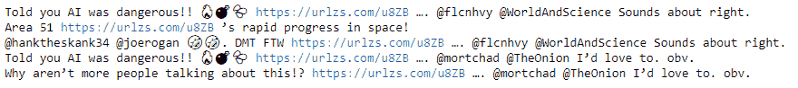
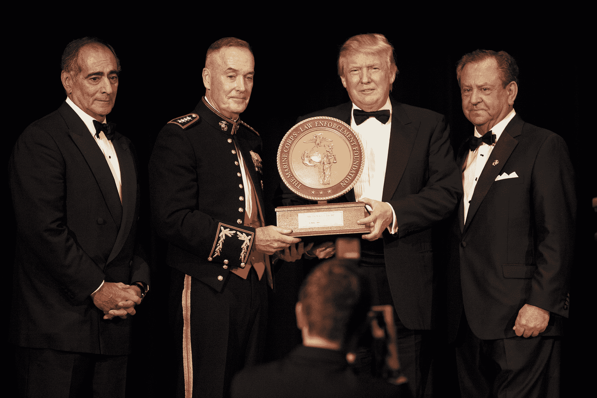
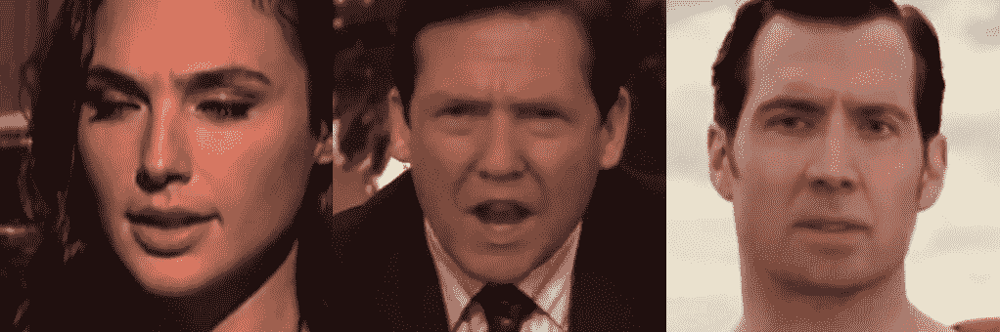
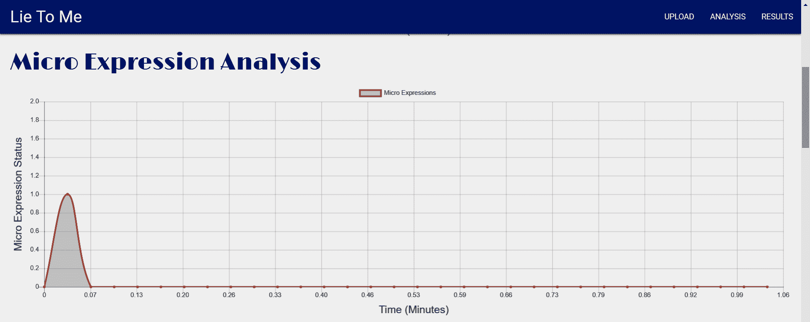
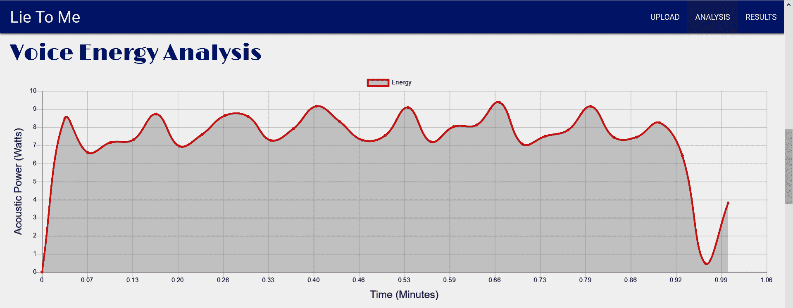
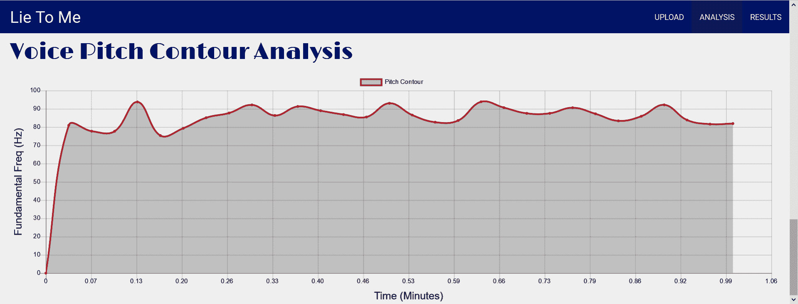
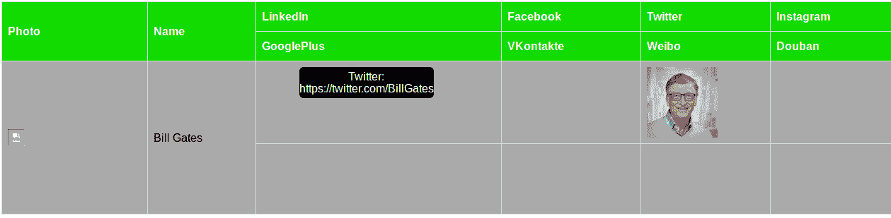

# 四、面向社会工程的机器学习

有很多很酷的**机器学习** ( **ML** )的新应用，这些应用在任何地方都不如它们在社会工程中那样大放异彩。ML 已经实现了非常成功的自动鱼叉式网络钓鱼，我们将通过 Twitter 鱼叉式网络钓鱼机器人食谱了解这一点。它还被用来生成假的，但真实的视频，同时，发现这些是假的。它提供了语音传输，检测谎言的能力，以及你将在本章的食谱中看到的许多其他方便的工具，旨在加强你的社会工程游戏。

本章包括以下配方:

*   Twitter 鱼叉钓鱼机器人
*   声音模仿
*   **开源智能**的语音识别
*   面部识别
*   Deepfake
*   深度伪造识别
*   使用最大似然法的测谎
*   人格分析
*   社交地图
*   训练一个假评论生成器
*   产生虚假评论
*   假新闻


# 技术要求

在本章中，我们将使用以下内容:

*   马尔科维奇
*   Twitter 开发者账户
*   十二岁
*   PyTorch
*   OpenCV
*   克拉斯
*   张量流
*   IBM 的沃森

代码和数据集可以在[https://github . com/packt publishing/Machine-Learning-for-cyber security-Cookbook/tree/master/chapter 04](https://github.com/PacktPublishing/Machine-Learning-for-Cybersecurity-Cookbook/tree/master/Chapter04)找到。


# Twitter 鱼叉钓鱼机器人

在这个食谱中，我们将使用机器学习来构建一个 Twitter 鱼叉钓鱼机器人。该机器人将利用人工智能来模仿其目标的推文，从而为自己的推文创造有趣和诱人的内容。此外，推文将包含嵌入式链接，导致目标点击这些钓鱼链接。当然，我们不会利用这个机器人的恶意目的，我们的链接将是虚拟链接。链接本身会被混淆，所以目标只有在点击后才能知道隐藏在它们后面的是什么。

实验表明，这种形式的攻击有很高的成功率，通过模拟这种形式的攻击，您可以测试和改进您的客户或组织的安全状况。


# 做好准备

该配方的准备工作包括在`pip`安装`tweepy`和`markovify`包。说明如下:

```
pip install tweepy markovify
```

此外，你需要在 Twitter 上设置一个开发者账户。这个过程相对简单，账户创建是免费的。


# 怎么做...

在以下步骤中，我们演示了如何使用机器学习来创建鱼叉式钓鱼 Twitter bot:

1.  在 Twitter 上建立一个开发者账户。
2.  创建一个新的应用，并获取您的消费者 API 密钥、访问令牌和访问令牌密码。
3.  导入`tweepy`库并填写您的凭证以访问 Twitter API:

```
import json
import tweepy

CONSUMER_API_KEY = "fill me in"
CONSUMER_API_SECRET_KEY = "fill me in"
ACCESS_TOKEN = "fill me in"
ACCESS_TOKEN_SECRET = "fill me in"

auth = tweepy.OAuthHandler(CONSUMER_API_KEY, CONSUMER_API_SECRET_KEY)
auth.set_access_token(ACCESS_TOKEN, ACCESS_TOKEN_SECRET)

api = tweepy.API(
    auth, wait_on_rate_limit=True, wait_on_rate_limit_notify=True, compression=True
)
```

4.  我们选择一个我们想要瞄准或模仿的用户。在这种情况下，我选择了一位活跃在 Twitter 上的杰出技术人士:

```
user_id = "elonmusk"
```

5.  收集用户最新的`count = 200`推文:

```
count = 200
user_tweets = api.user_timeline(screen_name=user_id, count=count, tweet_mode="extended")
```

6.  将用户的所有推文收集到一个大文本中:

```
tweet_corpus = []
for tweet in user_tweets:
    tweet_corpus.append(tweet.full_text)
tweets_text = ". ".join(tweet_corpus)
```

7.  我们现在开始处理文本。我们定义了一个函数，它将用新的 URL 替换任何找到的 URL 实例:

```
import re

def replace_URLs(string, new_URL):
    """Replaces all URLs in a string with a custom URL."""
    modified_string = re.sub(
        "http[s]?://(?:[a-zA-Z]|[0-9]|[$-_@.&+]|[!*\(\), ]|(?:%[0-9a-fA-F][0-9a-fA-F]))+",
        " " + new_URL + " ",
        string,
    )
    return modified_string
```

8.  创建一个钓鱼链接，并将其插入推文中。在我们的例子中，我们使用了一个网址缩写来混淆链接将用户带到 google.com[的事实:](http://google.com)

```
phishing_link = "https://urlzs.com/u8ZB"
processed_tweets_text = replace_URLs(tweets_text, phishing_link)
```

9.  在处理后的文本上训练马尔可夫模型并生成推文:

```
import markovify

markov_model = markovify.Text(processed_tweets_text)
```

10.  生成所需数量的包含网络钓鱼链接的推文:

```
num_phishing_tweets_desired = 5
num_phishing_tweets_so_far = 0
generated_tweets = []
while num_phishing_tweets_so_far < num_phishing_tweets_desired:
    tweet = markov_model.make_short_sentence(140)
    if phishing_link in tweet and tweet not in generated_tweets:
        generated_tweets.append(tweet)
        num_phishing_tweets_so_far += 1
```

我们将看到以下输出:



11.  发布你的推文，并以用户、用户的追随者或用户的朋友为目标。例如，这段代码获取用户的朋友:

```
user = api.get_user(user_id)
for friend in user.friends():
    print(friend.screen_name)
```

我们将看到的输出如下:

```
wonderofscience
SpaceComCC
AFSpace
Liv_Boeree
shivon
Teslarati
neiltyson
SciGuySpace
wlopwangling
Berger_SN
pewdiepie
CathieDWood
lexfridman
ccsakuras
4thFromOurStar
TheOnion
BBCScienceNews
sciencemagazine
NatureNews
TheStoicEmperor
```


# 它是如何工作的…

在第 1 步和第 2 步中，您将需要进入 Twitter 开发者网页来创建您的 API 帐户，这将是免费的。为了通过 Python 访问 Twitter API，我们使用了`tweepy`库(步骤 3)。我们的目标是从目标 Twitter 用户的推文中学习，以便我们的推文具有与该用户相同的风格和主题。这样的推文可能会吸引对相同话题和风格感兴趣的人。我们选择模仿埃隆·马斯克的风格来发布推文(第四步)。我们继续收集 Elon 发布的最后 200 条推文(步骤 5 和 6)。一般来说，从用户那里获得的 tweets 越多，模型就越有说服力。然而，考虑时间和相关性可能很重要——也就是说，用户更有可能点击及时和相关的推文，而不是那些处理陈旧话题的推文。

我们定义一个函数来处理文本，以便所有的 URL 都被替换为所需的 URL(步骤 7)，然后将其应用于我们的文本(步骤 8)。我们使用了一个网址缩写来隐藏钓鱼链接的目的地，就是谷歌。在处理推文的这个阶段，有很大的创造力空间。例如，我们可以定制`@`屏幕名称，使它们与我们的目标更加相关。在第 9 步和第 10 步中，我们在已经处理过的推文中训练一个马尔可夫模型，然后生成几条嵌入了钓鱼链接的推文。最后，关于步骤 11，请记住，使机器人更有效的其他修改包括选择一天、一周、一月或其他时间(例如，与事件相关的时间)发送推文，或者在推文中添加带有链接的照片。


# 声音模仿

使用通过神经网络传输声音风格的新技术，令人信服地模仿目标的声音变得越来越容易。在这一节中，我们将向您展示如何使用深度学习来录制目标说任何您希望他们说的话，例如，将目标的声音用于社会工程目的，或者更有趣的例子，使用奥巴马的声音来唱碧昂斯的歌曲。我们在`mazzzystar/randomCNN-voice-transfer`中选择了能够快速获得高质量结果的架构。特别地，不需要在记录的音频的大数据集上预先训练模型。

在本书的随附代码中，您会发现两个版本的语音传输神经网络代码，一个用于 GPU，一个用于 CPU。我们这里描述的是 CPU 的，虽然 GPU 的非常相似。


# 做好准备

该配方的准备工作包括在`pip`中安装`pytorch`和`librosa`。说明如下:

```
pip install torch librosa
```

另外，将两个文件放在`voice_impersonation_input`文件夹中。一个文件是你想表达的信息的录音，另一个文件是你想表达的信息的声音。


# 怎么做...

在下面的步骤中，我们提供了一个将一个说话者的声音转换成另一个说话者的录音的方法。代码由三部分组成:CPU 的声音模拟(主)、模型和实用程序。我们将讨论如何运行 main 并解释它正在做什么。每当出现对代码其他部分的引用时，我们将提供对被引用方法的高级解释，但为了简洁起见，省略了细节。

以下代码可以在`Voice Impersonation.ipynb`中找到:

1.  导入 PyTorch 实用程序、神经网络模型和用于一些基本计算的`math`:

```
import math
from torch.autograd import Variable
from voice_impersonation_utils import *
from voice_impersonation_model import *
```

2.  在`style_file`中指定我们希望使用的声音，在`content_file`中指定我们希望以该声音发出的音频:

```
input_files = "voice_impersonation_input/"
content_file = input_files + "male_voice.wav"
style_file = input_files + "Eleanor_Roosevelt.wav"
```

3.  我们提取内容和样式文件的频谱，并将其转换为 PyTorch 张量:

```
audio_content, sampling_rate = wav2spectrum(content_file)
audio_style, sampling_rate = wav2spectrum(style_file)
audio_content_torch = torch.from_numpy(audio_content)[None, None, :, :]
audio_style_torch = torch.from_numpy(audio_style)[None, None, :, :]
```

4.  我们实例化一个随机 CNN 模型，并将其设置为`eval`模式:

```
voice_impersonation_model = RandomCNN()
voice_impersonation_model.eval()
```

5.  我们为即将到来的神经网络训练准备张量，并选择 Adam 优化器和学习速率:

```
audio_content_variable = Variable(audio_content_torch, requires_grad=False).float()
audio_style_variable = Variable(audio_style_torch, requires_grad=False).float()
audio_content = voice_impersonation_model(audio_content_variable)
audio_style = voice_impersonation_model(audio_style_variable)

learning_rate = 0.003
audio_G_var = Variable(
    torch.randn(audio_content_torch.shape) * 1e-3, requires_grad=True
)
opt = torch.optim.Adam([audio_G_var])
```

6.  我们指定`style`和`content`参数以及我们希望训练模型的时间:

```
style_param = 1
content_param = 5e2

num_epochs = 500
print_frequency = 50
```

7.  我们训练我们的模型:

```
for epoch in range(1, num_epochs + 1):
    opt.zero_grad()
    audio_G = voice_impersonation_model(audio_G_var)

    content_loss = content_param * compute_content_loss(audio_content, audio_G)
    style_loss = style_param * compute_layer_style_loss(audio_style, audio_G)
    loss = content_loss + style_loss
    loss.backward()
    opt.step()
```

8.  我们打印正在进行的训练进度，指定输出文件的名称，最后，将神经网络的输出频谱转换为音频文件:

```
    if epoch % print_frequency == 0:
        print("epoch: "+str(epoch))
        print("content loss: "+str(content_loss.item()))
        print("style loss: "+str(style_loss.item()))
        print("loss: "+str(loss.item()))

gen_spectrum = audio_G_var.cpu().data.numpy().squeeze()
output_audio_name = "Eleanor_saying_there_was_a_change_now.wav"
spectrum2wav(gen_spectrum, sampling_rate, output_audio_name)
```

我们计算的最终结果可以在名为`Eleanor_saying_there_was_a_change_now.wav`的音频文件中看到。


# 它是如何工作的…

我们首先导入 PyTorch，神经网络模型，以及用于一些基本计算的`math`(步骤 1)。更有趣的是，在步骤 2 中，我们指定音频的内容和样式。在内容文件中，你可以说出任何你想说的短语，例如*没有机器学习就做不了网络安全*。然后，在样式文件中，选择某人的录音，例如，某个名人(如 Elon Musk)的录音。语音模仿的最终结果是，埃隆·马斯克说*没有机器学习*就做不了网络安全。第 3、4 和 5 步涉及一些跑腿工作，准备将我们的数据输入到我们的模型中，然后实例化一个随机 CNN 模型及其优化器。该模型的主要特点是，它对音频频谱图使用 2D 卷积层而不是 1D 层，并在时间轴上计算`grams`。将模型设置为评估模式(与训练模式相对照)会影响某些图层的行为，例如在训练和测试中使用不同的 dropout 和 batch norm。在下一步(步骤 6)，我们定义`style`和`content`参数，它们为样式和内容分配相对权重。具体来说，它们决定了最终音频对各自文件的风格和内容的继承程度。我们现在准备好训练我们的模型，这是我们在步骤 7 中通过执行前向和后向传播来完成的。我们监控训练的进度(步骤 8)，然后最终输出一个音频文件到磁盘，使用样式文件的样式来发音内容文件。你可以在这本书的知识库中找到这个文件。


# 面向 OSINT 的语音识别

故事是这样的，一个钢笔测试员正在对当时的联邦调查局局长詹姆斯·科米进行情报收集。通过听科米的录像，钢笔测试员注意到科米提到有几个社交媒体账户，包括一个 Twitter 账户。然而，在当时，没有他的账户是已知的。

通过彻底的调查，钢笔测试员最终发现了科米的秘密推特账户，网名雷茵霍尔德·尼布尔。这个方法的目标是帮助笔测试人员在搜索关键字时，自动并加速筛选大量关于目标的音频/视频镜头。具体来说，我们用机器学习把语音转换成文本，收集这个文本，然后搜索感兴趣的关键词。


# 做好准备

该食谱的准备工作包括在`pip`安装`speechrecognition`包。说明如下:

```
pip install speechrecognition
```

此外，收集一些您想识别其语音的音频文件。


# 怎么做...

在以下步骤中，我们将展示如何使用语音识别库将语音录音转换为文本，然后在这些文本中搜索所需的关键字:

1.  导入语音识别库，并选择我们希望将其语音转换为文本的音频文件列表。此外，创建您想要在这些音频文件中自动检测的关键词列表:

```
import speech_recognition

list_of_audio_files = ["Eleanor_Roosevelt.wav", "Comey.wav"]
keywords = ["Twitter", "Linkedin", "Facebook", "Instagram", "password", "FBI"]
```

2.  定义一个使用 Google 语音识别 API 将音频文件转换为文本的函数:

```
def transcribe_audio_file_to_text(audio_file):
    """Takes an audio file and produces a text transcription."""
    recognizer = speech_recognition.Recognizer()
    with speech_recognition.AudioFile(audio_file) as audio_source:
        audio = recognizer.record(audio_source)
        return recognizer.recognize_google(audio)
```

3.  将音频文件转换为文本，并创建一个字典来记住文本来自哪个音频文件:

```
audio_corpus = {}
for audio_file in list_of_audio_files:
    audio_corpus[transcribe_audio_file_to_text(audio_file)] = audio_file

print(audio_corpus)
```

语料库输出如下:

```
{"I'm very glad to be able to take part in this celebration dim sum Direct on human rights day": 'Eleanor_Roosevelt.wav', "have you met read recently that I'm on Twitter I am not a tweeter I am there to listen to read especially what's being said about the FBI and its mission": 'Comey.wav'}
```

4.  在文本语料库中搜索关键词，并打印出包含这些关键词的音频文件:

```
for keyword in keywords:
    for transcription in audio_corpus:
        if keyword in transcription:
            print(
                "keyword "
                + keyword
                + " found in audio "
                + '"'
                + audio_corpus[transcription]
                + '"'
            )
```

我们的运行检测到关键字`Twitter`:

```
keyword Twitter found in audio "Comey.wav"
keyword FBI found in audio "Comey.wav"
```


# 它是如何工作的…

我们首先导入语音识别库，并选择我们希望将其语音转换为文本的音频文件列表。此外，我们创建一个我们希望在这些音频文件中自动检测的关键字列表(步骤 1)。通过词干化或词元化，可以使检测这些关键词的发声的方法更加健壮，这有效地说明了具有相同含义的关键词的变体。例如，如果这种方法实施得当，Twitter、Twitted 和 Tweet 都可以被检测到。在步骤 2 中，我们指定将使用 Google 的语音识别 API 来转录音频。其他语音识别服务，如 pocketsphinx，也是可用的。我们现在准备转录我们的音频文件，这是我们在步骤 3。现在我们有了文本格式的音频，一切都很顺利。只需搜索感兴趣的关键词(步骤 4)。当语料库和文本变得更大时，另一个可能卓有成效的优化是打印找到关键字的句子，以便更容易理解上下文。


# 面部识别

面部识别系统是一种用于识别或验证图像或视频中的人的技术。当对目标或潜在目标执行 OSINT 时，面部识别系统可以是无价的。在这个菜谱中，你将学习如何使用开发良好的`face_recognition` Python 库。


# 做好准备

这个菜谱的准备工作包括在`pip`中安装`face_recognition`和 OpenCV 包。说明如下:

```
pip install face_recognition opencv-python
```

此外，您还需要一张个人的肖像和一组图像，您可以通过这些图像来搜索该个人。


# 怎么做…

在接下来的步骤中，你将训练`face_recognition`在一系列图像中找到并标记给定的个人:

1.  首先导入`face_recognition`库:

```
import face_recognition
```

2.  首先加载一个有标签的个人肖像，您将对其执行 OSINT:

```
known_image = face_recognition.load_image_file("trump_official_portrait.jpg")
```

个人的脸必须清晰可见:


3.  接下来，加载一张`unknown`图像，在该图像中，您想要自动检测个人的面部:

```
unknown_image = face_recognition.load_image_file("trump_and_others.jpg")
```

正在搜索其面部的个人出现在此截图中:



4.  给个人的脸编码:

```
trump_encoding = face_recognition.face_encodings(known_image)[0]
```

5.  对未知图像中所有人的面部进行编码:

```
unknown_faces = face_recognition.face_encodings(unknown_image)
```

6.  搜索个人的面部:

```
matches = face_recognition.compare_faces(unknown_faces, trump_encoding)
print(matches)
```

输出如下所示:

```
[False, False, False, True]
```

7.  加载未知图像中所有人脸的位置，并将匹配位置保存到一个变量中:

```
face_locations = face_recognition.face_locations(unknown_image)
trump_face_location = face_locations[3]
```

8.  将未知图像读入`cv2`:

```
import cv2
unknown_image_cv2 = cv2.imread("trump_and_others.jpg")
```

9.  在未知图像上画一个矩形，表示匹配面所在的位置:

```
(top, right, bottom, left) = trump_face_location
cv2.rectangle(unknown_image_cv2, (left, top), (right, bottom), (0, 0, 255), 2)
```

10.  标记矩形:

```
cv2.rectangle(unknown_image_cv2, (left, bottom - 35), (right, bottom), (0, 0, 255), cv2.FILLED)
font = cv2.FONT_HERSHEY_DUPLEX
cv2.putText(unknown_image_cv2, "Trump", (left + 6, bottom - 6), font, 1.0, (255, 255, 255), 1)
```

11.  显示带有标记矩形的图像:

```
cv2.namedWindow('image', cv2.WINDOW_NORMAL)
cv2.imshow('image',unknown_image_cv2)
cv2.waitKey(0)
cv2.destroyAllWindows()
```

下面的屏幕截图显示输出已经成功:


自动执行这一搜索和标记过程非常简单。


# 它是如何工作的…

首先简单地导入面部识别库(步骤 1)。在下一步中，我们在笔测试中加载我们希望在图像集合中定位的目标的图像。接下来，准备一个示例图像，我们希望对其进行扫描以确定目标面部的存在(步骤 3)。对图像中所有找到的人脸进行编码(步骤 4 和 5)，然后搜索目标的人脸(步骤 6)。为了方便起见，我们打印出与目标人脸匹配的结果。在步骤 7-10 中，我们希望证明我们已经找到了匹配。为此，我们加载已扫描的图像。然后，我们在分类器检测到目标面部的地方绘制一个矩形和一个标签。看看第 11 步的结果，我们看到了巨大的成功。我们成功地探测到了。

顺便说一句，注意到`face_recognition`工具背后的技术是深度学习，作为一个推论，可以使用 GPU 加速人脸的搜索过程。


# Deepfake

**Deepfake** 是使用神经网络拍摄视频或图像，在其上叠加一些内容，使结果看起来逼真的技术。例如，该技术可以拍摄爱丽丝说她支持一项运动的视频，然后用鲍勃代替爱丽丝，创建鲍勃说他支持这项运动的逼真视频。显然，这种技术对我们对视频和图像的信任有着深刻的影响，同时也为社会工程师提供了一个有用的工具。

在这个配方中，我们使用一个 Deepfake 变体来拍摄一个目标的面部图像，并逼真地将其叠加到另一个目标的面部图像上。菜谱是 GitHub 库`wuhuikai/FaceSwap`中代码的重构和简化版本。


# 做好准备

该配方的准备包括在`pip`中安装`opencv`、`dlib`和`scipy`。说明如下:

```
pip install opencv-python dlib scipy
```

此外，你会想要两个图像；一个是个人的肖像，一个是包含人脸的图像。前一个面将转移到后一个面上。在`deepfake_input`文件夹中为您提供了一个样本。


# 怎么做...

在下面的步骤中，我们提供了一个用另一个人的脸替换图像中一个人的脸的方法。代码由五部分组成:`Deepfake.ipynb`(主代码)、`deepfake_config`配置文件、`deepfake_face_detection`、`deepfake_face_points_detection`和`deepfake_face_swap`。此外，还包括一个模型文件夹。

以下代码可以在`Deepfake.ipynb`中找到:

1.  从相关代码中导入`opencv`图像操作和交换人脸所需的方法:

```
import os
import cv2
import numpy as np
from deepfake_face_detection import select_face
from deepfake_face_swap import (
    warp_image_2d,
    warp_image_3d,
    mask_from_points,
    apply_mask,
    correct_colours,
    transformation_from_points,
    ProcessFace,
)
```

2.  指定包含我们希望在`content_image`中使用的面部的图像，以及我们希望在`target_image`中将面部转移到的图像。最后，指定您希望在哪里创建结果:

```
content_image = "deepfake_input/author.jpg"
target_image = "deepfake_input/gymnast.jpg"
result_image_path = "deepfake_results/author_gymnast.jpg"
```

在运行的示例中，源图像是作者脸部的图片:


目标图像是一张正在表演的体操运动员的照片:


3.  将图像读入`opencv`，然后提取源面和目的面:

```
content_img = cv2.imread(content_image)
destination_img = cv2.imread(target_image)
content_img_points, content_img_shape, content_img_face = select_face(content_img)
destination_img_points, destination_img_shape, destination_img_face = select_face(
    destination_img
)
```

4.  计算源面的变换版本:

```
result_image = ProcessFace(
    content_img_points, content_img_face, destination_img_points, destination_img_face
)
```

5.  将变换后的面部绘制到目标图像中，并将文件写入磁盘:

```
x, y, w, h = destination_img_shape
destination_img_copy = destination_img.copy()
destination_img_copy[y : y + h, x : x + w] = result_image
result_image = destination_img_copy
cv2.imwrite(result_image_path, result_image)
```

本例中的`deepfake`操作的最终结果是一个带有体操运动员的身体和作者的脸的图像:


通过逐帧应用该方法，可以将其扩展到视频。


# 它是如何工作的…

像往常一样，首先导入适当的库(步骤 1)。在步骤 2 中，指定样式和内容图像。这里，内容是目标图像，而样式是要绘制的面。在第 3 步中，请注意，如果图像中有几个人脸，将会出现一个屏幕，询问您想要使用哪个人脸。下一步是确定如何绘制叠加面的计算(步骤 4)。完成该步骤后，我们现在可以在步骤 5 中绘制并显示`deepfake`叠加面。显然，这个实现还有改进的空间，但是做得还不错。


# 深度伪造识别

随着 deepfake 和类似图像伪造技术的出现，越来越难区分伪造和真实媒体。幸运的是，就像神经网络可以合成假媒体一样，它们也可以检测到它。在这个食谱中，我们将利用深度神经网络来检测假图像。该配方利用了 GitHub 资源库中的 MesoNet 架构。


# 做好准备

该配方的准备工作包括在`pip`中安装`keras`、`tensorflow`和`pillow`。说明如下:

```
pip install keras tensorflow pillow
```

此外，在`mesonet_test_images`文件夹中还为您提供了一组假图像和真图像，您可以向其中添加其他图像。


# 怎么做...

在下面的步骤中，我们提供了一个检测 deepfake 何时生成图像的方法。代码由四部分组成:Deepfake `Recognition.ipynb` (main)、定义 MesoNet 分类器的`mesonet_classifiers.py`文件、保存训练好的权重的`mesonet_weights`文件夹以及包含我们的测试图像的`mesonet_test_images`文件夹。

下面的代码可以在 Deepfake `Recognition.ipynb`中找到:

1.  从`keras`导入 MesoNet 神经网络和图像数据生成器:

```
from mesonet_classifiers import *
from keras.preprocessing.image import ImageDataGenerator
```

2.  实例化 MesoNet 并加载其权重:

```
MesoNet_classifier = Meso4()
MesoNet_classifier.load("mesonet_weights/Meso4_DF")
```

3.  创建图像数据生成器以从目录中读入图像，并指定存储未知图像的路径:

```
image_data_generator = ImageDataGenerator(rescale=1.0 / 255)
data_generator = image_data_generator.flow_from_directory(
    "", classes=["mesonet_test_images"]
)
```

以下是输出:

```
Found 3 images belonging to 1 classes.
```

4.  定义一个字典，将数字标签转换为文本标签，`"real"`和`"fake"`:

```
num_to_label = {1: "real", 0: "fake"}
```

在我们的例子中，我们在文件夹中放了三张图片，一张真的，两张假的:



你能分辨出哪些是哪些吗？

5.  运行 MesoNet 会显示以下输出:

```
X, y = data_generator.next()
probabilistic_predictions = MesoNet_classifier.predict(X)
predictions = [num_to_label[round(x[0])] for x in probabilistic_predictions]
print(predictions)
```

以下是输出:

```
['real', 'fake', 'fake']
```


# 它是如何工作的…

对于大多数食谱，我们从导入必要的库开始。然后，我们在步骤 2 中加载 MesoNet 模型，即加载其结构和预训练的权重。为清楚起见，架构可在`MesoNet_classifiers`文件中找到，如下所示:

```
         x = Input(shape = (IMGWIDTH, IMGWIDTH, 3))
         x1 = Conv2D(8, (3, 3), padding='same', activation = 'relu')(x)
         x1 = BatchNormalization()(x1)
         x1 = MaxPooling2D(pool_size=(2, 2), padding='same')(x1)

         x2 = Conv2D(8, (5, 5), padding='same', activation = 'relu')(x1)
         x2 = BatchNormalization()(x2)
         x2 = MaxPooling2D(pool_size=(2, 2), padding='same')(x2)

         x3 = Conv2D(16, (5, 5), padding='same', activation = 'relu')(x2)
         x3 = BatchNormalization()(x3)
         x3 = MaxPooling2D(pool_size=(2, 2), padding='same')(x3)

         x4 = Conv2D(16, (5, 5), padding='same', activation = 'relu')(x3)
         x4 = BatchNormalization()(x4)
         x4 = MaxPooling2D(pool_size=(4, 4), padding='same')(x4)

         y = Flatten()(x4)
         y = Dropout(0.5)(y)
         y = Dense(16)(y)
         y = LeakyReLU(alpha=0.1)(y)
         y = Dropout(0.5)(y)
         y = Dense(1, activation = 'sigmoid')(y)
```

在第 3 步中，我们定义并使用一个`ImageDataGenerator`，一个方便的`keras`对象，它允许我们在一个地方执行图像处理——在手头的例子中，重新缩放和归一化像素的数值。很难说标签`0`和`1`代表什么。出于这个原因，出于可读性的目的，我们定义了一个字典来将 0 和 1 翻译成单词`real`和`fake`(步骤 4)。最后，在步骤 5 中，我们看到 MesoNet 模型能够正确预测测试图像的标签。


# 使用机器学习的测谎

当出于社会工程的目的收集情报时，能够辨别一个人什么时候在说真话，什么时候在撒谎是至关重要的。为此，机器学习可以帮助我们。通过分析视频的微表情和声音质量，机器学习系统可以帮助识别不诚实的演员。在这份食谱中，我们将使用稍微修改过的“对我撒谎”进行测谎循环，这是一种使用面部和声音识别的测谎系统。


# 做好准备

该食谱的准备工作包括在`pip`中安装几个软件包。包的列表可以在`requirements.txt`文件中找到。要一次安装所有这些程序，请运行以下命令:

```
pip install -r requirements.txt
```

你需要一个带音频的视频文件来分析。


# 怎么做...

在下面的步骤中，我们提供了一个分析视频说谎行为的方法:

1.  运行“对我撒谎”应用:

```
Python application.py 
```

2.  通过转到指定的 IP 地址，例如`127.0.0.1:5000`，打开 web 浏览器并键入此地址，打开“对我撒谎”的门户。

3.  点击**上传**并选择您想要分析的视频:


4.  一旦分析完成，您将注意到以下内容。

以下截图显示了**眨眼分析**图中发生的变化:


以下截图显示了**微表情分析**图中发生的变化:



以下截图显示了**声音能量分析**图中发生的变化:



以下截图显示了**语音音高分析**图中发生的变化:


以下截图显示了**语音音高轮廓分析**图中发生的变化:



以下截图显示了**元音时长分析**图中发生的变化:


5.  最后，点击结果会显示对视频中发现的谎言的分析:


# 它是如何工作的…

在步骤 1 中，我们使用 Python 运行了“对我撒谎”应用。我们进入应用的门户并上传候选人视频(步骤 2 和 3)。在完成视频分析后,“对我撒谎”应用会显示几个探索性屏幕(步骤 4)。这些代表了可能表明说谎的特征。最后，在步骤 5 中，我们看到一个屏幕，显示该视频是否包含任何说谎的个人，如果是，何时以及说谎了多少次。


# 人格分析

了解目标的性格类型和沟通方式会极大地增加潜在的影响力。因此，性格分析是社会工程师工具箱中的一个很好的工具。在这个菜谱中，我们将利用 IBM Watson 的 Personality Insights API 来分析目标的 Tweets，以获得一个个性档案。


# 做好准备

这个菜谱的准备工作包括在`pip`中安装 IBM Watson 包。说明如下:

```
pip install ibm-watson
```

此外，你还需要注册一个沃森个性洞察账户。


# 怎么做...

在下面的步骤中，我们设置了一个 API 调用来分析 tweets 作者的个性:

1.  注册一个沃森个性洞察账户。它又快又免费。
2.  为 Watson 导入 Python 库并记录今天的日期:

```
from ibm_watson import PersonalityInsightsV3
from datetime import date

v = str(date.today())
api_key = "fill me in"
```

3.  指定您在步骤 1 中获得的 API 键，并声明 Personality Insights 实例:

```
personality_insights_service = PersonalityInsightsV3(version=v, iam_apikey=api_key)
```

4.  管理一个文本文件，例如一组推文:

```
tweets_file = "ElonMuskTweets.txt"
```

5.  在文本文件中调用个性洞察 API:

```
with open(tweets_file) as input_file:
    profile = personality_insights_service.profile(
        input_file.read(),
        "application/json",
        raw_scores=False,
        consumption_preferences=True,
    ).get_result()
```

6.  最后，打印出个性简介:

```
import json

print(json.dumps(profile, indent=2))

{ "word_count": 2463, "processed_language": "en", "personality": [ { "trait_id": "big5_openness", "name": "Openness", "category": "personality", "percentile": 0.7417085532819794, "significant": true, "children": [ { "trait_id": "facet_adventurousness", "name": "Adventurousness", "category": "personality", "percentile": 0.9589655282562557, "significant": true }, { "trait_id": "facet_artistic_interests", "name": "Artistic interests", "category": "personality", "percentile": 0.44854779978198406, "significant": true }, { "trait_id": "facet_emotionality", "name": "Emotionality", "category": "personality", "percentile": 0.0533351337262023, "significant": true },
 <snip>
 "consumption_preference_id": "consumption_preferences_books_financial_investing", "name": "Likely to read financial investment books", "score": 0.0 }, { "consumption_preference_id": "consumption_preferences_books_autobiographies", "name": "Likely to read autobiographical books", "score": 1.0 } ] }, { "consumption_preference_category_id": "consumption_preferences_volunteering", "name": "Volunteering Preferences", "consumption_preferences": [ { "consumption_preference_id": "consumption_preferences_volunteer", "name": "Likely to volunteer for social causes", "score": 0.0 } ] } ], "warnings": [] }
```


# 它是如何工作的…

首先注册一个沃森个性洞察账户。该服务有不同的层次，对 API 调用率有不同的限制，价格也不同，但最低的层次很容易设置，免费，而且对这个方法来说足够了。我们将今天的日期保存到一个变量中，并导入 IBM Watson 库(步骤 2)。通过指定最晚日期，我们可以确保使用最新版本的 Watson。下一步，我们使用 API 键实例化 IBM Watson personality insights。

对于步骤 4，我们必须整理由目标生成的文本数据集。利用 Twitter 鱼叉钓鱼机器人的配方来收集用户的推文可能会有所帮助。在第 5 步中，我们在我们的文本集上运行 personality insights 应用，该文本集由 Elon Musk 最近的推文组成。我们选择将个性资料显示为 JSON。它也可以以其他格式显示，如 CSV，详细信息可以在 personality insights 的 API 文档中找到。最后，在第 6 步中，我们打印了一个来自个性简介的小片段。如你所见，它甚至提供了可操作的见解，例如目标同意志愿服务的可能性有多大。


# 社交地图

**Social Mapper** 是一款 OSINT 工具，可以让你通过面部识别将目标的大量社交媒体资料关联起来。它会自动在流行的社交媒体网站上搜索目标的名字和图片，毫不费力地找到用户的社交媒体资料，然后将结果输出到一份报告中，您可以用它来进一步调查。

Social Mapper 的最大好处是，通过将姓名搜索与图像识别相结合，而不仅仅是姓名搜索，它可以消除误报，从而节省社会工程师的宝贵时间。

社交地图目前支持 LinkedIn、脸书、Twitter、Google Plus、Instagram、VKontakte、微博和豆瓣。


# 做好准备

对于这个菜谱，建议您准备一个 Python 2.7 环境。社交映射器设计用于 Python 2.7，可能不适用于其他 Python 环境。安装的先决条件在[https://github.com/Greenwolf/social_mapper](https://github.com/Greenwolf/social_mapper)中描述。此外，你会想要使用 Mac 或 Linux 机器来制作这个食谱。


# 怎么做...

在以下步骤中，我们提供了使用社交映射器关联个人社交媒体账户的方法:

1.  按照位于 https://github.com/Greenwolf/social_mapper[的 GitHub 页面上的说明，安装 Social Mapper 及其先决条件。](https://github.com/Greenwolf/social_mapper)
2.  将目标的脸部图像放入`Input, Examples/imagefolder/`中，并附上文件名和目标的全名:


3.  为你希望搜索目标的社交媒体网站创建一次性账户。例如，创建一次性的脸书、LinkedIn 和 Twitter 账户。
4.  打开`social_mapper.py`文件并填写您的一次性帐户凭证。例如，你可能只对 Twitter 感兴趣:

```
 global linkedin_username
 global linkedin_password
 linkedin_username = ""
 linkedin_password = ""
 global facebook_username
 global facebook_password
 facebook_username = ""
 facebook_password = ""
 global twitter_username
 global twitter_password
 twitter_username = "FILL ME IN"
 twitter_password = "FILL ME IN"
 global instagram_username
 global instagram_password
 instagram_username = ""
 instagram_password = ""
 global google_username
 global google_password
 google_username = ""
 google_password = ""
 global vk_username
 global vk_password
```

5.  在终端中，运行命令搜索目标的社交媒体配置文件:

```
 Python social_mapper.py -f imagefolder -I ./Input-Examples/imagefolder -m fast -tw 
```

6.  检查`social_mapper/results-social-mapper.html`文件中的输出:



对于每个目标个人，添加具有该个人的社交网络数据的附加行。


# 它是如何工作的…

首先在您的环境中准备社交映射器(步骤 1)。将目标的图像放入输入目录中(步骤 2)。图像必须以目标的全名命名；否则，应用将无法找到目标的帐户。接下来，在步骤 3 中，为您希望搜索目标的社交媒体网站创建一次性账户，并将其填入`social_mapper.py`中的适当位置(步骤 4)。请注意，您拥有的不同帐户越多，您可以通过社交地图收集的目标数据就越多。现在，您可以对目标执行搜索了。在终端中，运行命令搜索目标的社交媒体配置文件(步骤 5)。您可能希望使用的参数和选项有很多种。例如，我们已经使用`-tw`参数指定了 Twitter。然而，你可能希望添加额外的社交媒体网站，如 LinkedIn ( `-li`)或 Instagram ( `-ig`)。最后，在步骤 6 中，观察到社交映射器能够找到比尔·盖茨的 Twitter 账户。


# 假评论生成器

社会工程的一个重要部分是模仿。一个社会工程师可能想要假装代表一个目前并不存在的公司或企业。通过创建一个档案，并填充令人信服的评论，社会工程师可以增加虚假业务的可信度。在这个食谱中，我们展示了如何训练 RNN，使其能够生成新的评论，类似于训练数据集中的评论。


# 训练一个假评论生成器

我们的第一步是训练模型。稍后，我们将利用它来生成新的评论。


# 做好准备

该配方的准备工作包括在`pip`中安装`keras`和`tensorflow`。说明如下:

```
pip install keras tensorflow
```


# 怎么做...

在下面的步骤中，我们提供了使用评论集训练循环神经网络(RNN)的方法:

1.  收集你想要模仿的评论类型。有关这方面的更多信息，请参见*中关于其工作原理的讨论...*章节:

```
with open("airport_reviews_short.csv", encoding="utf-8") as fp:
    reviews_text = fp.read()
```

2.  创建一个字典来矢量化文本的字符:

```
chars_list = sorted(list(set(reviews_text)))
char_to_index_dict = {
    character: chars_list.index(character) for character in chars_list
}
```

词典可能是这样的，这取决于您的语料库包含哪些字符:

```
{' ': 0, '!': 1, "'": 2, '(': 3, ')': 4, ',': 5, '-': 6, '.': 7, '/': 8, '2': 9, '5': 10, '<': 11, '>': 12, 'A': 13, 'B': 14, 'C': 15, 'D': 16, 'E': 17, 'F': 18, 'G': 19, 'H': 20, 'I': 21, 'J': 22, 'L': 23, 'M': 24, 'O': 25, 'R': 26, 'S': 27, 'T': 28, 'U': 29, 'W': 30, 'a': 31, 'b': 32, 'c': 33, 'd': 34, 'e': 35, 'f': 36, 'g': 37, 'h': 38, 'i': 39, 'j': 40, 'k': 41, 'l': 42, 'm': 43, 'n': 44, 'o': 45, 'p': 46, 'r': 47, 's': 48, 't': 49, 'u': 50, 'v': 51, 'w': 52, 'x': 53, 'y': 54}
```

3.  构建一个 RNN 来学习和预测字符序列:

```
import keras
from keras import layers

max_length = 40
rnn = keras.models.Sequential()
rnn.add(
    layers.LSTM(1024, input_shape=(max_length, len(chars_list)), return_sequences=True)
)
rnn.add(layers.LSTM(1024, input_shape=(max_length, len(chars_list))))
rnn.add(layers.Dense(len(chars_list), activation="softmax"))
```

4.  选择优化器并编译模型:

```
optimizer = keras.optimizers.SGD(lr=0.01, decay=1e-6, nesterov=True)
rnn.compile(loss="categorical_crossentropy", optimizer=optimizer)
```

5.  定义一个便利函数来矢量化文本:

```
import numpy as np

def text_to_vector(input_txt, max_length):
    """Reads in the text and vectorizes it.
    X will consist of consecutive sequences of characters. 
    Y will consist of the next character.
    """
    sentences = []
    next_characters = []
    for i in range(0, len(input_txt) - max_length):
        sentences.append(input_txt[i : i + max_length])
        next_characters.append(input_txt[i + max_length])
    X = np.zeros((len(sentences), max_length, len(chars_list)))
    y = np.zeros((len(sentences), len(chars_list)))
    for i, sentence in enumerate(sentences):
        for t, char in enumerate(sentence):
            X[i, t, char_to_index_dict[char]] = 1
            y[i, char_to_index_dict[next_characters[i]]] = 1
    return [X, y]
```

6.  对我们的样本输入文本进行矢量化，并批量训练模型:

```
X, y = text_to_vector(reviews_text, max_length)
rnn.fit(X, y, batch_size=256, epochs=1)
```

7.  最后，保存模型的权重以备将来使用。

```
rnn.save_weights("weights.hdf5")
```


# 它是如何工作的…

从收集你想要模仿的评论数据集开始(第一步)。一个实际的例子需要大量的评论。有许多这样的数据集可用，如 Yelp 评论数据集。继续第 2 步，我们创建字符和数字之间的映射。这将允许我们向量化文本。根据您的应用，您可能希望使用标准的 ASCII 代码。然而，如果你只使用少量的字符，那么这将会不必要地降低你的模型的速度。我们继续声明 RNN 的体系结构，以学习和预测字符序列(步骤 3)。我们使用了相对简单的架构。正如下一节将要展示的，它仍然提供了令人信服的结果。有兴趣的读者可以自由尝试其他架构。接下来，我们声明一个(标准的)优化器(步骤 4)，定义一个接收文本的函数，然后对其进行矢量化，以便我们可以将其输入到我们的神经网络中(步骤 5)。在步骤 5 中，注意向量的形状如下:

*   **X** :(评论数，`maxlen`，字符数)
*   **Y** :(评论数，字符数)

特别是，我们设置`max_length=40`来简化计算，表明我们将只考虑评论的前`40`个字符。做好所有必要的准备后，我们现在传递要矢量化的文本，然后在其上训练我们的模型(步骤 6)。具体来说，我们的`text_to_vector`函数获取文本并将其转换为矢量化的句子，以及一个矢量化的标签，即下面的字符。最后，我们保存模型的权重，这样我们就不必在将来重新训练它(步骤 7)。


# 产生虚假评论

训练了一个网络后，我们的下一步是利用它来产生新的虚假评论。


# 做好准备

该配方的准备工作包括在`pip`中安装`keras`和`tensorflow`。说明如下:

```
pip install keras tensorflow
```


# 怎么做...

在下面的步骤中，我们提供了一个使用先前训练过的 RNN 来生成评论的方法:

1.  我们将从导入`keras`开始:

```
import keras
from keras import layers
```

2.  为角色创建一个索引字典，或者从上一个配方中加载一个:

```
char_indices = dict((char, chars.index(char)) for char in chars) 
```

3.  读入种子文本并声明由神经网络接受的句子的`max_length`:

```
text = open("seed_text.txt").read()
max_length = 40
```

4.  构建一个 RNN 模型，并加载您预先训练好的重量:

```
rnn = keras.models.Sequential()
rnn.add(
    layers.LSTM(1024, input_shape=(max_length, len(chars_list)), return_sequences=True)
)
rnn.add(layers.LSTM(1024, input_shape=(max_length, len(chars_list))))
rnn.add(layers.Dense(len(chars_list), activation="softmax"))
rnn.load_weights("weights.hdf5")
optimizer = keras.optimizers.SGD(lr=0.01, decay=1e-6, nesterov=True)
rnn.compile(loss="categorical_crossentropy", optimizer=optimizer)
```

5.  定义从概率向量采样的函数:

```
import numpy as np

def sample_next_char(preds):
    """Samples the subsequent character based on a probability distribution."""
    return np.random.choice(chars_list, p=preds)
```

6.  根据初始种子文本生成随机评论:

```
import sys

start_index = np.random.randint(0, len(text) - max_length - 1)
generated_text = text[start_index : start_index + max_length]
sys.stdout.write(generated_text)
sentence_length = 1000
for i in range(sentence_length):
    vec_so_far = np.zeros((1, max_length, len(chars_list)))
for t, char in enumerate(generated_text):
    vec_so_far[0, t, char_to_index_dict[char]] = 1.0
preds = rnn.predict(vec_so_far)[0]
next_char = sample_next_char(preds)
generated_text += next_char
generated_text = generated_text[1:]
sys.stdout.write(next_char)
sys.stdout.flush()
print(generated_text)
```

下面是代码运行的检查输出:


# 它是如何工作的...

我们的初始步骤(步骤 1、2 和 4)是我们在训练阶段执行的操作，我们在这里重复这些操作，以使配方是独立的。在步骤 3 中，我们读入一个种子文本来初始化我们的 RNN。种子文本可以是由所列字符组成的任何文本，只要它比`max_length`长。现在，我们必须能够使用我们预先训练、预先加载并基于种子文本初始化的神经网络来创建有趣的文本。为此，我们定义一个便利函数来采样神经网络将生成的结果字符(步骤 5)。从概率向量采样确保 RNN 不会简单地选择最可能的后续字符，从而导致重复生成文本。还有更聪明的采样方法，采用温度参数和指数称重，但这种方法解决了基本问题。最后，在第 6 步，我们继续使用我们的神经网络生成文本。我们指定 1000 作为要生成的字符数。改变这个参数将会改变输出中的评论数量。


# 假新闻

假新闻是一种通过传统新闻媒体或在线社交媒体传播的虚假信息或宣传。像任何虚假信息运动一样，它的影响可能是毁灭性的。在这个菜谱中，您将加载一个真实和虚假新闻的数据集，并利用 ML 来确定新闻故事何时是虚假的。


# 做好准备

该配方的准备工作包括在`pip`安装`pandas`和 scikit-learn。说明如下:

```
pip install pandas sklearn
```

还有，提取`fake_news_dataset.7z`。


# 怎么做…

在以下步骤中，您将读入假新闻数据集，对其进行预处理，然后训练一个随机森林分类器来检测假新闻:

1.  导入`pandas`并读入 CSV 文件，`fake_news_dataset.csv`:

```
import pandas as pd

columns = [
    "text",
    "language",
    "thread_title",
    "spam_score",
    "replies_count",
    "participants_count",
    "likes",
    "comments",
    "shares",
    "type",
]
df = pd.read_csv("fake_news_dataset.csv", usecols=columns)
```

2.  通过关注英文文章并删除缺少值的行来预处理数据集:

```
df = df[df["language"] == "english"]
df = df.dropna()
df = df.drop("language", axis=1
```

3.  定义一个便利函数，将分类特征转换为数字特征:

```
features = 0
feature_map = {}

def add_feature(name):
    """Adds a feature to the dictionary of features."""
    if name not in feature_map:
        global features
        feature_map[name] = features
        features += 1
```

4.  将`"fake"`和`"real"`特征转换成数字:

```
add_feature("fake")
add_feature("real")
```

5.  定义一个将所有标签转换成`real`或`fake`的函数:

```
def article_type(row):
    """Binarizes target into fake or real."""
    if row["type"] == "fake":
        return feature_map["fake"]
    else:
        return feature_map["real"]
```

6.  将函数应用于数据帧，将标签转换为 0 和 1:

```
df["type"] = df.apply(article_type, axis=1)
```

7.  在数据帧上创建列车测试分割:

```
from sklearn.model_selection import train_test_split

df_train, df_test = train_test_split(df)
```

8.  实例化两个 Tf-Idf 矢量器，一个用于文章的文本，一个用于标题:

```
from sklearn.feature_extraction.text import TfidfVectorizer

vectorizer_text = TfidfVectorizer()
vectorizer_title = TfidfVectorizer()
```

9.  使用 Tf-Idf 矢量器拟合和转换文本和标题数据:

```
vectorized_text = vectorizer_text.fit_transform(df_train.pop("text").values)
vectorized_title = vectorizer_title.fit_transform(df_train.pop("thread_title").values
```

10.  将数据帧的剩余数值字段转换成矩阵:

```
from scipy import sparse

spam_score_train = sparse.csr_matrix(df_train["spam_score"].values).transpose()
replies_count_train = sparse.csr_matrix(df_train["replies_count"].values).transpose()
participants_count_train = sparse.csr_matrix(
    df_train["participants_count"].values
).transpose()
likes_train = sparse.csr_matrix(df_train["likes"].values).transpose()
comments_train = sparse.csr_matrix(df_train["comments"].values).transpose()
shares_train = sparse.csr_matrix(df_train["shares"].values).transpose()
```

11.  将所有矩阵合并为一个特征矩阵，并创建一组标签:

```
from scipy.sparse import hstack

X_train = hstack(
    [
        vectorized_text,
        vectorized_title,
        spam_score_train,
        replies_count_train,
        participants_count_train,
        likes_train,
        comments_train,
        shares_train,
    ]
)
y_train = df_train.pop("type").values
```

12.  实例化一个随机森林分类器，并根据训练数据对其进行训练:

```
from sklearn.ensemble import RandomForestClassifier

clf = RandomForestClassifier()
clf.fit(X_train, y_train)
```

13.  使用之前训练的 Tf-Idf 矢量器将测试数据的文本和标题转换成数字形式:

```
vectorized_text_test = vectorizer_text.transform(df_test.pop("text").values)
vectorized_title_test = vectorizer_title.transform(df_test.pop("thread_title").values)
```

14.  如前所述，将所有数字特征组合成一个特征矩阵:

```
spam_score_test = sparse.csr_matrix(df_test["spam_score"].values).transpose()
replies_count_test = sparse.csr_matrix(df_test["replies_count"].values).transpose()
participants_count_test = sparse.csr_matrix(
    df_test["participants_count"].values
).transpose()
likes_test = sparse.csr_matrix(df_test["likes"].values).transpose()
comments_test = sparse.csr_matrix(df_test["comments"].values).transpose()
shares_test = sparse.csr_matrix(df_test["shares"].values).transpose()
X_test = hstack(
    [
        vectorized_text_test,
        vectorized_title_test,
        spam_score_test,
        replies_count_test,
        participants_count_test,
        likes_test,
        comments_test,
        shares_test,
    ]
)
y_test = df_test.pop("type").values
```

15.  测试随机森林分类器:

```
clf.score(X_test, y_test)
```

以下是输出:

```
0.9977324263038548
```


# 它是如何工作的…

我们最初的步骤是导入假新闻数据集，并执行基本的数据管理(步骤 1-6)，比如将目标转换成数字类型。接下来，在步骤 7 中，我们对数据集进行训练测试分割，为构建分类器做准备。因为我们在处理文本数据，所以我们必须特征化它们。为此，在步骤 8 和 9 中，我们在文本上实例化了用于 NLP 的 Tf-Idf 矢量器，并对它们进行拟合。其他的自然语言处理方法在这里可能是卓有成效的。继续特征化，我们提取数据帧的数字特征(步骤 10 和 11)。完成数据集的特征化后，我们现在可以实例化一个基本分类器，并将其安装到数据集上(步骤 12)。在步骤 13-15 中，我们在测试集上重复该过程，并测量我们的性能。观察卓越的性能。即使是现在，提高分类器性能的可能步骤包括说明文章的来源，包括图像，以及执行与其他事件的更复杂的关联。