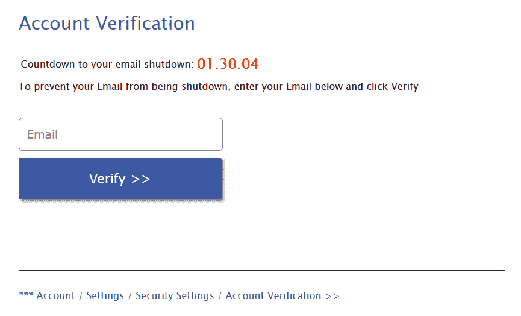
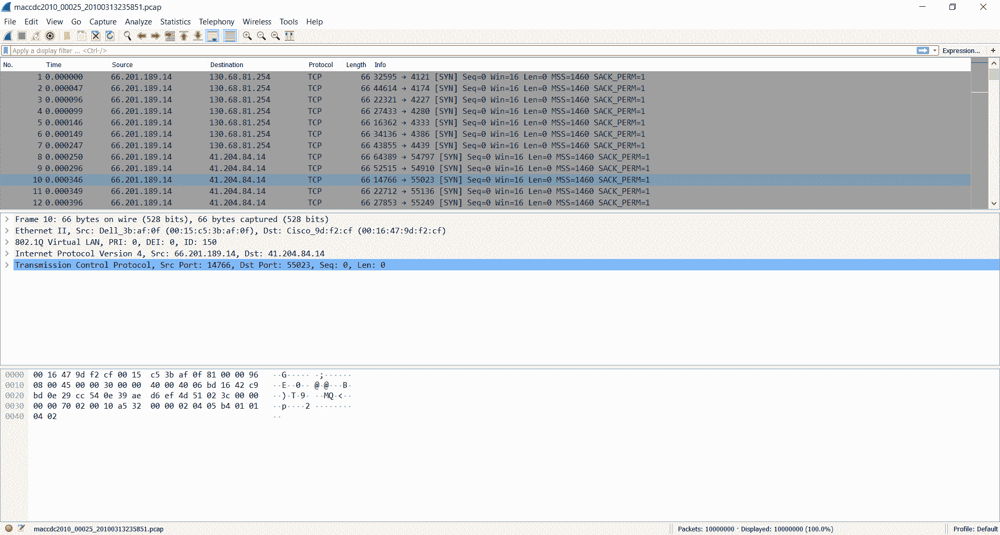
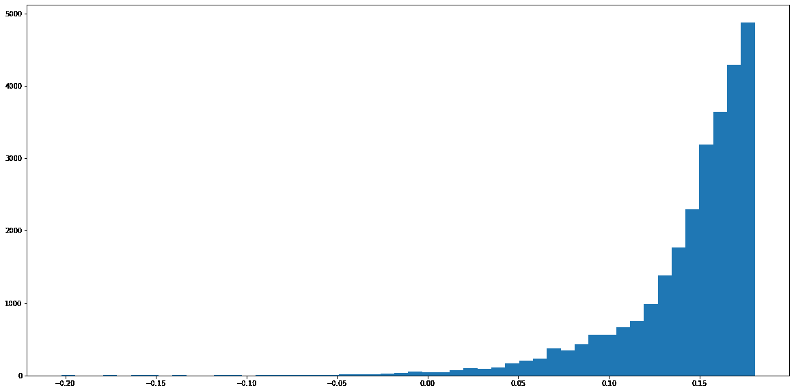
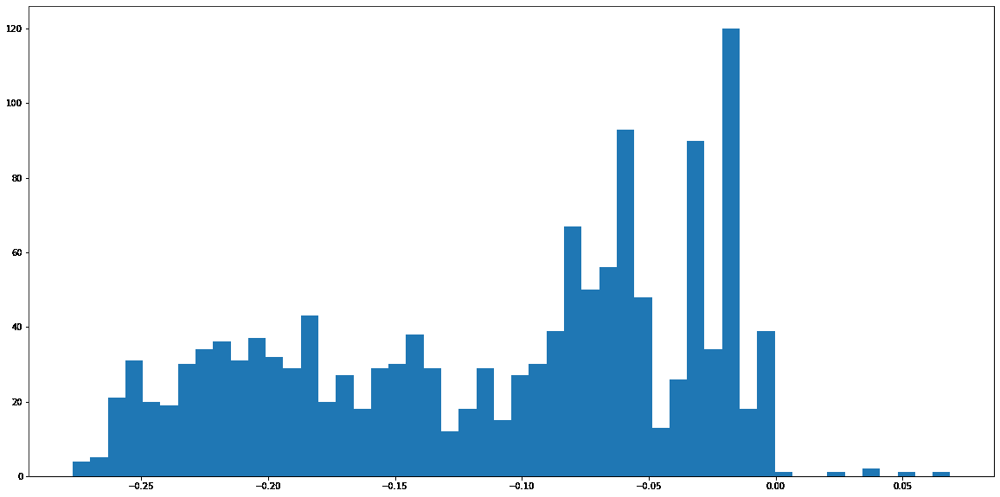
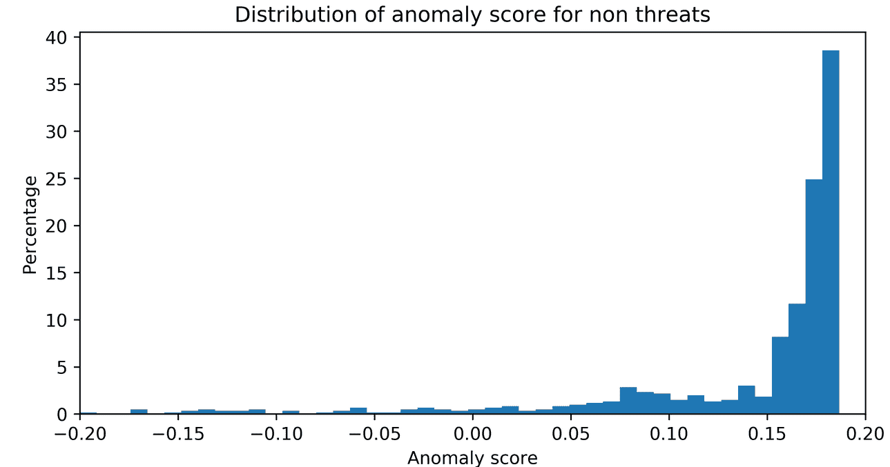
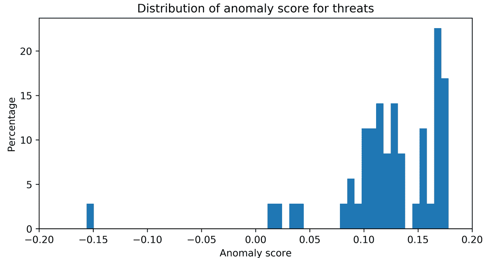
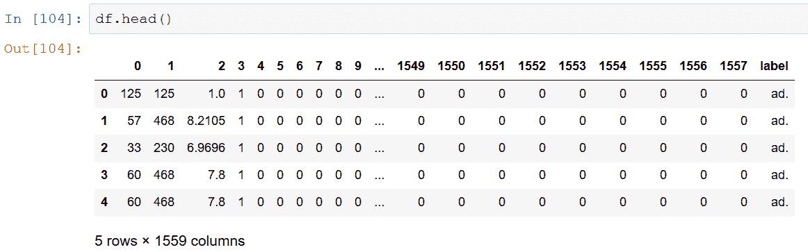

# 自动入侵检测

入侵检测系统监视网络或一组系统的恶意活动或违反策略的情况。任何被发现的恶意活动或违规行为都会被阻止或报告。在这一章中，我们将使用机器学习来设计和实现几个入侵检测系统。我们将从检测垃圾邮件的经典问题开始。然后我们将继续对恶意网址进行分类。我们将简短地解释如何捕获网络流量，以便我们可以解决更具挑战性的网络问题，如僵尸网络和 DDoS 检测。我们将为内部威胁构建一个分类器。最后，我们将解决依赖于实例的、成本敏感的、完全不平衡的、具有挑战性的信用卡欺诈问题。

本章包含以下配方:

*   使用机器学习的垃圾邮件过滤
*   网络钓鱼 URL 检测
*   捕获网络流量
*   网络行为异常检测
*   僵尸网络流量检测
*   用于内部威胁检测的特征工程
*   针对内部威胁采用异常检测
*   检测 DDoS
*   信用卡欺诈检测
*   伪钞检测
*   使用机器学习的广告拦截
*   无线室内定位


# 技术要求

以下是本章的技术先决条件:

*   Wireshark
*   PyShark
*   costcla
*   sci kit-学习
*   熊猫
*   NumPy

代码和数据集可以在[https://github . com/packt publishing/Machine-Learning-for-cyber security-Cookbook/tree/master/chapter 06](https://github.com/PacktPublishing/Machine-Learning-for-Cybersecurity-Cookbook/tree/master/Chapter06)找到。


# 使用机器学习的垃圾邮件过滤

垃圾邮件(不受欢迎的邮件)约占全球电子邮件流量的 60%。除了垃圾邮件检测软件自 1978 年第一封垃圾邮件以来取得了进步这一事实之外，任何拥有电子邮件帐户的人都知道，垃圾邮件仍然是一个耗时且昂贵的问题。这里，我们提供了一个使用机器学习进行垃圾邮件-垃圾邮件(非垃圾邮件)分类的方法。


# 做好准备

该食谱的准备包括在`pip`中安装`scikit-learn`包。该命令如下所示:

```
pip install sklearn
```

另外，将`spamassassin-public-corpus.7z`解压到一个名为`spamassassin-public-corpus`的文件夹中。


# 怎么做...

在下面的步骤中，我们为想要的和不想要的电子邮件构建了一个分类器:

1.  解压缩`spamassassin-public-corpus.7z`数据集。

2.  指定您的`spam`和`ham`目录的路径:

```
import os

spam_emails_path = os.path.join("spamassassin-public-corpus", "spam")
ham_emails_path = os.path.join("spamassassin-public-corpus", "ham")
labeled_file_directories = [(spam_emails_path, 0), (ham_emails_path, 1)]
```

3.  为两个班级创建标签，并将电子邮件读入语料库:

```
email_corpus = []
labels = []

for class_files, label in labeled_file_directories:
    files = os.listdir(class_files)
    for file in files:
        file_path = os.path.join(class_files, file)
        try:
            with open(file_path, "r") as currentFile:
                email_content = currentFile.read().replace("\n", "")
                email_content = str(email_content)
                email_corpus.append(email_content)
                labels.append(label)
        except:
            pass
```

4.  训练测试分割数据集:

```
from sklearn.model_selection import train_test_split

X_train, X_test, y_train, y_test = train_test_split(
    email_corpus, labels, test_size=0.2, random_state=11
)
```

5.  根据训练数据训练 NLP 管道:

```
from sklearn.pipeline import Pipeline
from sklearn.feature_extraction.text import HashingVectorizer, TfidfTransformer
from sklearn import tree

nlp_followed_by_dt = Pipeline(
    [
        ("vect", HashingVectorizer(input="content", ngram_range=(1, 3))),
        ("tfidf", TfidfTransformer(use_idf=True,)),
        ("dt", tree.DecisionTreeClassifier(class_weight="balanced")),
    ]
)
nlp_followed_by_dt.fit(X_train, y_train)
```

6.  根据测试数据评估分类器:

```
from sklearn.metrics import accuracy_score, confusion_matrix

y_test_pred = nlp_followed_by_dt.predict(X_test)
print(accuracy_score(y_test, y_test_pred))
print(confusion_matrix(y_test, y_test_pred))
```

以下是输出:

```
0.9761620977353993
[[291 7]
[ 13 528]]
```


# 它是如何工作的…

我们首先准备一个由原始电子邮件组成的数据集(*步骤 1* )，读者可以通过查看数据集来检查它。在*步骤 2* 中，我们指定垃圾邮件和恶意邮件的路径，并为它们的目录分配标签。我们继续将所有的电子邮件读入一个数组，并在*步骤 3* 中创建一个标签数组。接下来，我们训练测试分割我们的数据集(*步骤 4* ，然后在*步骤 5* 中在其上安装一个 NLP 管道。最后，在*步骤 6* 中，我们测试我们的管道。我们看到精确度相当高。由于数据集相对平衡，因此不需要使用特殊的指标来评估成功与否。


# 网络钓鱼 URL 检测

钓鱼网站是一种网站，它试图通过让您认为自己在合法网站上来获取您的帐户密码或其他个人信息。一些网络钓鱼 URL 与预期 URL 的不同之处在于专门选择的单个字符，以增加打字错误的几率，而另一些则利用其他渠道来产生流量。

以下是一个钓鱼网站的示例，该网站试图通过迫使用户相信他们的电子邮件将被关闭来获取用户的电子邮件地址:



由于网络钓鱼是最成功的攻击方式之一，因此能够识别 URL 何时非法至关重要。在这个食谱中，我们将建立一个机器学习模型来检测钓鱼网址。


# 做好准备

该配方的准备包括将`scikit-learn`和`pandas`安装在`pip`中。该命令如下所示:

```
pip install sklearn pandas
```

另外，提取名为`phishing-dataset.7z`的档案。


# 怎么做…

在下面的步骤中，我们将读入一个特征化的 URL 数据集，并在其上训练一个分类器。

1.  从本章的目录下载网络钓鱼数据集。
2.  使用`pandas`读入训练和测试数据:

```
import pandas as pd
import os

train_CSV = os.path.join("phishing-dataset", "train.csv")
test_CSV = os.path.join("phishing-dataset", "test.csv")
train_df = pd.read_csv(train_CSV)
test_df = pd.read_csv(test_CSV)
```

3.  准备网络钓鱼网页的标签:

```
y_train = train_df.pop("target").values
y_test = test_df.pop("target").values
```

4.  准备功能:

```
X_train = train_df.values
X_test = test_df.values
```

5.  训练、测试和评估分类器:

```
from sklearn.ensemble import RandomForestClassifier
from sklearn.metrics import accuracy_score, confusion_matrix

clf = RandomForestClassifier()
clf.fit(X_train, y_train)
y_test_pred = clf.predict(X_test)
print(accuracy_score(y_test, y_test_pred))
print(confusion_matrix(y_test, y_test_pred))
```

以下是输出:

```
0.9820846905537459
[[343 4]
[ 7 260]]
```


# 它是如何工作的…

我们首先下载数据集，然后将其读入数据帧(*步骤 1* 和 *2* )以便于检查和操作。接下来，我们将数据集放入数组中，为机器学习做准备(*步骤 3* 和 *4* )。该数据集由数千个钓鱼 URL 的特征向量组成。共有 30 种功能，其名称和值如下表所示:

| 属性 | 价值观念 | 列名 |
| 有 IP 地址 | { 1,0 } | `has_ip` |
| 有一个很长的 URL | { 1,0,-1 } | `long_url` |
| 使用起酥油服务 | { 0,1 } | `short_service` |
| 有“@”符号的 | { 0,1 } | `has_at` |
| 双斜线重定向 | { 0,1 } | `double_slash_redirect` |
| 有前缀和后缀的 | { -1,0,1 } | `pref_suf` |
| 有子域的 | { -1,0,1 } | `has_sub_domain` |
| 最终状态 | { -1,1,0 } | `ssl_state` |
| 域名注册长度 | { 0,1,-1 } | `long_domain` |
| Favicon | { 0,1 } | `favicon` |
| 是一个标准端口 | { 0,1 } | `port` |
| 使用 HTTPS 代币 | { 0,1 } | `https_token` |
| 请求 _URL | { 1,-1 } | `req_url` |
| 异常 URL 锚 | { -1,0,1 } | `url_of_anchor` |
| 标签中的链接 | { 1,-1,0 } | `tag_links` |
| SFH | { -1,1 } | `SFH` |
| 提交到电子邮件 | { 1,0 } | `submit_to_email` |
| 异常 URL | { 1,0 } | `abnormal_url` |
| 再直接的 | { 0,1 } | `redirect` |
| 鼠标悬停时 | { 0,1 } | `mouseover` |
| 右键单击 | { 0,1 } | `right_click` |
| 弹出窗口 | { 0,1 } | `popup` |
| 内联框架 | { 0,1 } | `iframe` |
| 域名年龄 | { -1,0,1 } | `domain_age` |
| DNS 记录 | { 1,0 } | `dns_record` |
| 网络流量 | { -1,0,1 } | `traffic` |
| 页面等级 | { -1,0,1 } | `page_rank` |
| 谷歌索引 | { 0,1 } | `google_index` |
| 指向页面的链接 | { 1,0,-1 } | `links_to_page` |
| 统计报告 | { 1,0 } | `stats_report` |
| 结果 | { 1,-1 } | `target` |

在*步骤 5* 中，我们训练并测试一个随机森林分类器。精确度相当高，但是根据数据集的平衡程度，可能有必要考虑 FP 约束。有许多方法可以扩展这种检测器，例如添加其他功能和增加数据集。鉴于大多数网站都包含一些图像，图像分类器只是模型改善其结果的一种方式。


# 捕获网络流量

捕获网络流量对于故障排除、分析以及软件和通信协议开发非常重要。对于注重安全的个人而言，监控网络流量对于检测恶意活动或违反策略的行为至关重要。在本菜谱中，我们将演示如何捕获和检查网络流量。


# 做好准备

在准备此配方时，请遵循以下步骤:

1.  安装`pyshark`:

```
pip install pyshark
```

2.  安装`wireshark`。最新版本可以在[https://www.wireshark.org/download.html](https://www.wireshark.org/download.html)找到。


# 怎么做…

在下面的步骤中，我们将利用名为 PyShark 的 Python 库和 Wireshark 来捕获和检查网络流量。

1.  您必须将`tshark`添加到 PyShark 的配置路径中。Tshark 是 Wireshark 的命令行变体。为此，请运行以下命令:

```
pip show pyshark
```

记下包裹的位置。在这个位置的`pyshark`目录中，找到文件`config.ini`。将`tshark_path`编辑到`wireshark`安装文件夹中`tshark`的位置。类似地，将`dumpcap_path`编辑到`wireshark`安装文件夹中`dumpcap`的位置。

*步骤 2* 和 *4* 应该在 Python 环境下执行。请注意，从当前版本开始，`pyshark`在 Jupyter 笔记本上运行时可能会有一些错误。

2.  导入`pyshark`并指定捕获的持续时间:

```
import pyshark

capture_time = 20
```

3.  指定输出捕获的文件名，`to`:

```
import datetime
start = datetime.datetime.now()
end = start+datetime.timedelta(seconds=capture_time)
file_name = "networkTrafficCatpureFrom"+str(start).replace(" ", "T")+"to"+str(end).replace(" ","T")+".pcap"
```

4.  捕获网络流量:

```
cap = pyshark.LiveCapture(output_file=file_name)
cap.sniff(timeout=capture_time)
```

5.  要检查捕获，请在 Wireshark 中打开`pcap`文件:




# 它是如何工作的…

我们通过配置 Wireshark 的命令行变体`tshark`来开始这个方法。一旦我们完成了`tshark`的配置，现在就可以通过`pyshark`访问它了。我们导入`pyshark`并指定网络捕获的持续时间(*步骤 2* )。捕获的网络流量数据可能非常庞大，因此控制持续时间非常重要。接下来，我们以一种独特且易于理解的方式指定输出捕获的名称(*步骤 3* )，然后，在*步骤 4* 中，我们继续捕获流量。最后，在*步骤 6* 中，我们使用 Wireshark 的 GUI 来检查捕获的网络流量。在有能力的人看来，这种网络流量有助于检测不安全的物联网设备、错误配置、异常事件、黑客攻击企图，甚至数据泄露。


# 网络行为异常检测

**网络行为异常检测** ( **NBAD** )是对网络异常事件或趋势的持续监控。理想情况下，NBAD 程序实时跟踪关键网络特征，如果检测到指示威胁的奇怪事件或趋势，就会发出警报。在这个菜谱中，我们将使用机器学习来构建一个 NBAD。

使用的数据集是著名数据集 KDD 数据集的修改子集，是测试和构建 IDS 系统的标准集。该数据集包含在军事网络环境中模拟的各种入侵。


# 做好准备

该配方的准备包括安装`scikit-learn`、`pandas`和`matplotlib`。该命令如下所示:

```
pip install sklearn pandas matplotlib
```

另外，解压存档，`kddcup_dataset.7z`。


# 怎么做…

在以下步骤中，我们将利用隔离林来检测 KDD 数据集中的异常:

1.  导入`pandas`并将数据集读入数据框:

```
import pandas as pd

kdd_df = pd.read_csv("kddcup_dataset.csv", index_col=None)
```

2.  检查交通类型的比例:

```
y = kdd_df["label"].values
from collections import Counter

Counter(y).most_common()
```

将会看到以下输出:

```
[('normal', 39247),
('back', 1098),
('apache2', 794),
('neptune', 93),
('phf', 2),
('portsweep', 2),
('saint', 1)]
```

3.  将所有非正态观测值转换为一个类:

```
def label_anomalous(text):
    """Binarize target labels into normal or anomalous."""
    if text == "normal":
        return 0
    else:
        return 1

kdd_df["label"] = kdd_df["label"].apply(label_anomalous)
```

4.  获得异常与正常观测值的比率。这是将在我们的隔离林中使用的污染参数:

```
y = kdd_df["label"].values
counts = Counter(y).most_common()
contamination_parameter = counts[1][1] / (counts[0][1] + counts[1][1])
```

5.  将所有分类特征转换成数字形式:

```
from sklearn.preprocessing import LabelEncoder

encodings_dictionary = dict()
for c in kdd_df.columns:
    if kdd_df[c].dtype == "object":
        encodings_dictionary[c] = LabelEncoder()
        kdd_df[c] = encodings_dictionary[c].fit_transform(kdd_df[c])
```

6.  将数据集分为正常和异常观察值:

```
kdd_df_normal = kdd_df[kdd_df["label"] == 0]
kdd_df_abnormal = kdd_df[kdd_df["label"] == 1]
y_normal = kdd_df_normal.pop("label").values
X_normal = kdd_df_normal.values
y_anomaly = kdd_df_abnormal.pop("label").values
X_anomaly = kdd_df_abnormal.values
```

7.  训练测试分割数据集:

```
from sklearn.model_selection import train_test_split

X_normal_train, X_normal_test, y_normal_train, y_normal_test = train_test_split(
    X_normal, y_normal, test_size=0.3, random_state=11
)
X_anomaly_train, X_anomaly_test, y_anomaly_train, y_anomaly_test = train_test_split(
    X_anomaly, y_anomaly, test_size=0.3, random_state=11
)

import numpy as np

X_train = np.concatenate((X_normal_train, X_anomaly_train))
y_train = np.concatenate((y_normal_train, y_anomaly_train))
X_test = np.concatenate((X_normal_test, X_anomaly_test))
y_test = np.concatenate((y_normal_test, y_anomaly_test))
```

8.  实例化并训练隔离林分类器:

```
from sklearn.ensemble import IsolationForest

IF = IsolationForest(contamination=contamination_parameter)
IF.fit(X_train
```

9.  根据正常和异常观察值对分类器进行评分:

```
decisionScores_train_normal = IF.decision_function(X_normal_train)
decisionScores_train_anomaly = IF.decision_function(X_anomaly_train)
```

10.  绘制正常组的分数:

```
import matplotlib.pyplot as plt

%matplotlib inline
plt.figure(figsize=(20, 10))
_ = plt.hist(decisionScores_train_normal, bins=50)
```

下图提供了输出:



11.  类似地，绘制目视检查异常观察的分数:

```
plt.figure(figsize=(20, 10))
_ = plt.hist(decisionScores_train_anomaly, bins=50)
```

下图提供了输出:



选择一个截止点，以便从正常观察中分离出异常:

在测试装置上检查此临界值:

12.  以下是输出:

```
cutoff = 0
```

13.  Examine this cut-off on the test set:

```
print(Counter(y_test))
print(Counter(y_test[cutoff > IF.decision_function(X_test)]))
```

The following is the output:

```
Counter({0: 11775, 1: 597})
Counter({1: 595, 0: 85})
```

它是如何工作的…

我们从将`KDD cup`数据集读入数据框开始。接下来，在*步骤 2* 中，我们检查我们的数据，看到大部分流量是正常的，正如预期的那样，但是有一小部分流量是异常的。显然，这个问题非常不平衡。因此，这个问题是异常检测方法的一个有希望的候选者。在*步骤 3* 和*步骤 5* 中，我们将所有非正常流量转换为单一类别，即**异常**。


# 我们还确保计算异常与正常观察值的比率(*步骤 4* )，称为污染参数。这是便于设置隔离林敏感度的参数之一。这是可选的，但可能会提高性能。在*步骤 6* 中，我们将数据集分为正常和异常观察值，并将数据集分为正常和异常数据的训练和测试版本(*步骤 7* )。我们实例化一个隔离森林分类器，并设置其污染参数(*步骤 8* )。缺省参数`n_estimators`和`max_samples`是刘等人在论文*隔离林*中推荐的，在*步骤 9* 和*步骤 10* 中，我们使用隔离林的决策函数给正常训练集提供一个分数，然后在一个地块中检验结果。在*步骤 11* 中，我们类似地向异常训练集提供分数。

知道了决策函数是描述一个点有多简单的一个度量，我们想要通过选择一个给出清晰分离的数值截止点来从复杂点中分离出简单点。目测显示在*步骤 12* 中选择的值。

最后，我们可以使用我们的模型进行预测，并对其性能进行评估。在*步骤 13* 中，我们看到该模型能够在不触发太多误报(正常流量的实例)的情况下发现大量异常，按比例来说。

僵尸网络流量检测

僵尸网络是一个由连接互联网的受损设备组成的网络。僵尸网络可以用来执行分布式**拒绝服务攻击** ( **DDoS 攻击**)，窃取数据，发送垃圾邮件，以及许多其他创造性的恶意使用。僵尸网络会造成巨大的损失。例如，在谷歌上快速搜索僵尸网络一词显示，在撰写本文的 3 天前，Electrum 僵尸网络窃取了 460 万美元的加密货币。在这个食谱中，我们建立了一个分类器来检测僵尸网络流量。


# 使用的数据集是一个名为 **CTU-13** 的数据集的处理子集，由 2011 年在捷克 CTU 大学捕获的僵尸网络流量组成。该数据集是真实僵尸网络流量与正常流量和后台流量的大规模捕获。

做好准备

该配方的准备包括在`pip`中安装`scikit-learn`。该命令如下所示:


# 另外，摘录`CTU13Scenario1flowData.7z`。要解压`CTU13Scenario1flowData.pickle`文件，您需要使用 Python 2:

怎么做…

```
pip install sklearn
```

首先读入经过酸洗的数据:


# 数据已经被分割成训练测试集，您只需要将它们分配给各自的变量:

1.  用默认参数实例化决策树分类器:

```
import pickle

file = open('CTU13Scenario1flowData.pickle', 'rb')
botnet_dataset = pickle.load(file)
```

2.  使分类器适合训练数据:

```
X_train, y_train, X_test, y_test = (
    botnet_dataset[0],
    botnet_dataset[1],
    botnet_dataset[2],
    botnet_dataset[3],
)
```

3.  在测试集上测试它:

```
from sklearn.tree import *

clf = DecisionTreeClassifier()
```

4.  Fit the classifier to the training data:

```
clf.fit(X_train, y_train)
```

5.  Test it on the test set:

```
clf.score(X_test, y_test)
```

以下是输出:

它是如何工作的…

我们开始*步骤 1* ，通过解包加载数据。数据集已经预先设计为平衡的，因此我们不需要担心不平衡的数据挑战。在实践中，僵尸网络的检测可能需要满足对误报的限制。继续，我们利用已经预先定义的训练测试分割来分割我们的数据(*步骤 2* )。我们现在可以实例化一个分类器，使其适合数据，然后测试它(*步骤 3* 和 *5* )。看精度，我们看到是挺高的。由于数据集已经是平衡的，我们不必担心我们的指标会误导人。总的来说，检测僵尸网络具有挑战性。GameOver Zeus 僵尸网络恶意软件包说明了检测僵尸网络的难度。最初发现于 2007 年，它运作了三年多，最终导致估计 7000 万美元的被盗资金，并导致 FBI 在 2010 年逮捕了 100 多名个人。直到 2012 年 3 月，微软才宣布能够关闭僵尸网络的大部分命令和控制(C & C)服务器。

```
0.9991001799640072
```


# 内部威胁检测

内部威胁对雇主来说是一个复杂且日益增长的挑战。它通常被定义为员工采取的对组织有潜在危害的任何行动。这些行为包括未经批准的数据传输或破坏资源。内部威胁可能以各种各样的新形式出现，由不同的目标驱动，从心怀不满的员工颠覆雇主的威信，到**高级持续威胁** ( **APT** )。


# 卡内基梅隆大学软件工程研究所 CERT 计划的内部风险数据库包含最大的红队场景公共档案。该模拟是通过将真实世界的内幕风险案例研究与从一家国防公司秘密获得的实际中立客户相结合而构建的。该数据集代表一家工程公司几个月的互联网、电话、登录、文件夹和系统访问(dtaa.com)流量。这个模拟公司雇佣了几千人，每个人平均每天执行 1，000 个记录的活动。这里描述了几种威胁场景，例如泄密者、窃贼和破坏者。该问题的一个显著特征是信噪比非常低，无论是用恶意用户总数、频繁计数还是总体使用量来表示。

我们对 CERT insider 威胁场景(v.4.2)进行分析，特别是因为它代表了一个密集的针头数据集，这意味着它具有很高的攻击发生率。

攻击的基本计划是，首先，手工设计新功能，例如是否向外部人员发送了电子邮件，或者是否在工作时间之外进行了登录。接下来，想法是提取每个用户的多元时间序列。这个时间序列将由一系列向量组成——每个向量构成我们手工设计的特征在一天中出现的次数的计数。因此，我们的输入数据集的形状如下:

(用户数，每天检查的功能总数，时间序列中的天数)。

然后，我们将展平每个用户的时间序列，并利用隔离林来检测异常。

用于内部威胁检测的特征工程

一般来说，每当机器学习解决方案不依赖于端到端深度学习时，可以通过创建有洞察力和信息丰富的功能来提高性能。在这个菜谱中，我们将为内部威胁检测构建几个有前途的新功能。


# 做好准备

该配方的准备包括在`pip`中安装`pandas`。该命令如下所示:


# 此外，从以下链接下载 CERT 内部威胁数据集:[ftp://ftp.sei.cmu.edu/pub/cert-data/r4.2.tar.bz2](ftp://ftp.sei.cmu.edu/pub/cert-data/r4.2.tar.bz2)。更多关于这个数据集的信息以及答案可以在 https://resources.sei.cmu.edu/library/asset-view.cfm?找到 assetid=508099 。

怎么做…

```
pip install pandas
```

在以下步骤中，您将为 CERT insider 威胁数据集构建新要素:


# 导入`numpy`和`pandas`，指向下载数据所在的位置:

指定`.csv`文件及其要读取的列:

1.  我们将手工设计一些特征并对它们进行编码，从而创建一个字典来跟踪这些特征。

```
import numpy as np
import pandas as pd
path_to_dataset = "./r42short/"
```

2.  将我们将要使用的功能添加到词典中:

```
log_types = ["device", "email", "file", "logon", "http"]
log_fields_list = [
    ["date", "user", "activity"],
    ["date", "user", "to", "cc", "bcc"],
    ["date", "user", "filename"],
    ["date", "user", "activity"],
    ["date", "user", "url"],
]
```

3.  定义一个函数来记录复制到可移动媒体的文件类型:

```
features = 0
feature_map = {}

def add_feature(name):
    """Add a feature to a dictionary to be encoded."""
    if name not in feature_map:
        global features
        feature_map[name] = features
        features += 1
```

4.  定义一个功能来识别员工是否向非公司电子邮件发送了电子邮件:

```
add_feature("Weekday_Logon_Normal")
add_feature("Weekday_Logon_After")
add_feature("Weekend_Logon")
add_feature("Logoff")

add_feature("Connect_Normal")
add_feature("Connect_After")
add_feature("Connect_Weekend")
add_feature("Disconnect")

add_feature("Email_In")
add_feature("Email_Out")

add_feature("File_exe")
add_feature("File_jpg")
add_feature("File_zip")
add_feature("File_txt")
add_feature("File_doc")
add_feature("File_pdf")
add_feature("File_other")

add_feature("url")
```

5.  定义一个功能来记录员工是否在工作时间之外使用可移动介质:

```
def file_features(row):
    """Creates a feature recording the file extension of the file used."""
    if row["filename"].endswith(".exe"):
        return feature_map["File_exe"]
    if row["filename"].endswith(".jpg"):
        return feature_map["File_jpg"]
    if row["filename"].endswith(".zip"):
        return feature_map["File_zip"]
    if row["filename"].endswith(".txt"):
        return feature_map["File_txt"]
    if row["filename"].endswith(".doc"):
        return feature_map["File_doc"]
    if row["filename"].endswith(".pdf"):
        return feature_map["File_pdf"]
    else:
        return feature_map["File_other"]
```

6.  定义一个函数来记录员工是否在工作时间之外登录了机器:

```
def email_features(row):
    """Creates a feature recording whether an email has been sent externally."""
    outsider = False
    if not pd.isnull(row["to"]):
        for address in row["to"].split(";"):
            if not address.endswith("dtaa.com"):
                outsider = True

    if not pd.isnull(row["cc"]):
        for address in row["cc"].split(";"):
            if not address.endswith("dtaa.com"):
                outsider = True

    if not pd.isnull(row["bcc"]):
        for address in row["bcc"].split(";"):
            if not address.endswith("dtaa.com"):
                outsider = True
    if outsider:
        return feature_map["Email_Out"]
    else:
        return feature_map["Email_In"]
```

7.  Define a function to note whether the employee used removable media outside of business hours:

```
def device_features(row):
    """Creates a feature for whether the user has connected during normal hours or otherwise."""
    if row["activity"] == "Connect":
        if row["date"].weekday() < 5:
            if row["date"].hour >= 8 and row["date"].hour < 17:
                return feature_map["Connect_Normal"]
            else:
                return feature_map["Connect_After"]
        else:
            return feature_map["Connect_Weekend"]
    else:
        return feature_map["Disconnect"]
```

8.  Define a function to note whether an employee has logged onto a machine outside of business hours:

```
def logon_features(row):
    """Creates a feature for whether the user logged in during normal hours or otherwise."""
    if row["activity"] == "Logon":
        if row["date"].weekday() < 5:
            if row["date"].hour >= 8 and row["date"].hour < 17:
                return feature_map["Weekday_Logon_Normal"]
            else:
                return feature_map["Weekday_Logon_After"]
        else:
            return feature_map["Weekend_Logon"]
    else:
        return feature_map["Logoff"]
```

我们不会利用员工访问的 URL 中包含的信息:

我们只保存事件发生的日期，而不是完整的时间戳:

9.  我们循环遍历包含日志的`.csv`文件，并将它们读入 pandas 数据帧:

```
def http_features(row):
    """Encodes the URL visited."""
    return feature_map["url"]
```

10.  将`date`数据转换为`pandas`时间戳:

```
def date_to_day(row):
    """Converts a full datetime to date only."""
    day_only = row["date"].date()
    return day_only
```

11.  创建上面定义的新特性，然后删除除日期、用户和我们的新特性之外的所有特性:

```
log_feature_functions = [
    device_features,
    email_features,
    file_features,
    logon_features,
    http_features,
]
dfs = []
for i in range(len(log_types)):
    log_type = log_types[i]
    log_fields = log_fields_list[i]
    log_feature_function = log_feature_functions[i]
    df = pd.read_csv(
        path_to_dataset + log_type + ".csv", usecols=log_fields, index_col=None
    )
```

12.  将日期转换为一天:

```
    date_format = "%m/%d/%Y %H:%M:%S"
    df["date"] = pd.to_datetime(df["date"], format=date_format)
```

13.  将所有数据帧连接成一帧，并按`date`排序:

```
    new_feature = df.apply(log_feature_function, axis=1)
    df["feature"] = new_feature

    cols_to_keep = ["date", "user", "feature"]
    df = df[cols_to_keep]
```

14.  它是如何工作的...

```
    df["date"] = df.apply(date_to_day, axis=1)

    dfs.append(df)
```

15.  首先导入`pandas`和`numpy`，并创建一个指向数据集的变量(*步骤 1* )。CERT 提供了几个数据集。4.2 版的突出之处在于它是一个密集的针头数据集，这意味着它比其他数据集具有更高的内部威胁发生率。由于数据集如此庞大，至少在实验阶段，对其进行过滤和下采样是很方便的，所以我们在*步骤 2* 中这样做。在接下来的步骤中，我们将手工设计我们认为有助于我们的分类器捕捉内部威胁的特征。在*步骤 3* 中，我们创建了一个方便的函数来对特征进行编码，以便字典可以跟踪这些特征。我们提供了将在*步骤 4* 中添加的特性的名称。在*步骤 5* 中，我们创建了一个功能，该功能将跟踪复制到可移动介质的文件的文件类型。据推测，这表明犯罪数据泄露。在*步骤 6* 中，我们创建了一个功能来跟踪员工是否向外部实体发送了电子邮件。我们创建另一个功能来跟踪员工是否在工作时间之外使用了可移动介质设备(*步骤 7* )。

```
joint = pd.concat(dfs)
joint = joint.sort_values(by="date")
```


# 一个额外的功能是跟踪员工是否在工作时间之外登录了设备(*步骤 8* )。为简单起见，我们不利用员工访问的 URL(*步骤 9* )，尽管这些可能表示恶意行为。

接下来，我们通过仅使用日期(*步骤 10* )来简化我们的数据，而不是在我们的特征化数据中使用完整的时间戳。在*步骤 11* 中，我们将数据读入 pandas 数据帧。然后我们编辑当前的日期格式以适应熊猫(*步骤 12* )，然后收集所有新的特性，同时删除旧的特性(*步骤 13* )。在*步骤 14* 中，我们将数据转换为一个时间序列，其 delta 为单日。最后，在*步骤 15* 中，我们将所有数据聚集到一个大的排序数据帧中。我们现在已经完成了特征工程阶段的第一次迭代。为了提高性能和增加功能，有许多方向可以追求。这些方法包括观察电子邮件文本中的负面情绪，以及使用心理测量学分析个性。

An additional feature tracks whether an employee has logged into a device outside of business hours (*Step 8*). For simplicity, we do not utilize the URLs visited by employees (*Step 9*), though these may be indicative of malicious behavior.

Next, we simplify our data by using only the date (*Step 10*), rather than the full timestamp in our featurized data. In *Step 11*, we read our data into a pandas data frame. We then edit the current date format to fit pandas (*Step 12*), and then gather up all of the new features, while dropping the old ones (*Step 13*). In *Step 14*, we transform the data into a time series whose delta are single days. Finally, in *Step 15*, we aggregate all of the data into one large sorted data frame. We have now completed the first iteration of the feature-engineering phase. There are many directions you can pursue in order to improve performance and add features. These include observing email text for negative sentiment and analyzing personality using psychometrics.

针对内部威胁采用异常检测

在设计了有前景的新功能后，我们接下来的步骤是训练-测试 split，将数据处理成方便的时间序列形式，然后进行分类。我们的训练集和测试集将是数据集的两个时态部分。这样，我们可以很容易地确保用于训练的输入的形状与用于测试的输入的形状相同，而不会在我们的评估中作弊。


# 做好准备

该配方的准备包括在`pip`中安装`scikit-learn`、`pandas`和`matplotlib`。该命令如下所示:


# 在准备该配方时，您可能希望加载上一个配方的数据框(或者从上一个配方结束的地方继续)。

怎么做...

```
pip install sklearn pandas matplotlib
```

在以下步骤中，您将把特征数据转换为时间序列的集合，并使用隔离林检测犯罪:


# 列出所有威胁因素，为创建标签做准备:

然后我们将日期编入索引:

1.  定义一个函数来提取给定用户的时间序列信息:

```
threat_actors = [
    "AAM0658",
    "AJR0932",
    "BDV0168",
    <snip>
    "MSO0222",
]
```

2.  定义一个函数对用户的时间序列信息进行矢量化:

```
start_date = joint["date"].iloc[0]
end_date = joint["date"].iloc[-1]
time_horizon = (end_date - start_date).days + 1

def date_to_index(date):
    """Indexes dates by counting the number of days since the starting date of the dataset."""
    return (date - start_date).days
```

3.  定义一个函数对所有用户特征的时间序列进行矢量化:

```
def extract_time_series_by_user(user_name, df):
    """Filters the dataframe down to a specific user."""
    return df[df["user"] == user_name]
```

4.  向量化数据集:

```
def vectorize_user_time_series(user_name, df):
    """Convert the sequence of features of a user to a vector-valued time series."""
    user_time_series = extract_time_series_by_user(user_name, df)
    x = np.zeros((len(feature_map), time_horizon))
    event_date_indices = user_time_series["date"].apply(date_to_index).to_numpy()
    event_features = user_time_series["feature"].to_numpy()
    for i in range(len(event_date_indices)):
        x[event_features[i], event_date_indices[i]] += 1
    return x
```

5.  对矢量化数据进行训练测试分割:

```
def vectorize_dataset(df):
    """Takes the dataset and featurizes it."""
    users = set(df["user"].values)
    X = np.zeros((len(users), len(feature_map), time_horizon))
    y = np.zeros((len(users)))
    for index, user in enumerate(users):
        x = vectorize_user_time_series(user, df)
        X[index, :, :] = x
        y[index] = int(user in threat_actors)
    return X, y
```

6.  Vectorize the dataset:

```
X, y = vectorize_dataset(joint)
```

7.  Train-test split the vectorized data:

```
from sklearn.model_selection import train_test_split

X_train, X_test, y_train, y_test = train_test_split(X, y, stratify=y)
```

重塑矢量化数据:

将训练和测试数据集分为威胁和非威胁子集:

8.  定义并实例化隔离林分类器:

```
X_train_reshaped = X_train.reshape(
    [X_train.shape[0], X_train.shape[1] * X_train.shape[2]]
)
X_test_reshaped = X_test.reshape([X_test.shape[0], X_test.shape[1] * X_test.shape[2]])
```

9.  将隔离林分类器拟合到训练数据:

```
X_train_normal = X_train_reshaped[y_train == 0, :]
X_train_threat = X_train_reshaped[y_train == 1, :]
X_test_normal = X_test_reshaped[y_test == 0, :]
X_test_threat = X_test_reshaped[y_test == 1, :]
```

10.  绘制训练数据的正常子集的决策分数:

```
from sklearn.ensemble import IsolationForest

contamination_parameter = 0.035
IF = IsolationForest(
    n_estimators=100, max_samples=256, contamination=contamination_parameter
)
```

11.  看一下下面的截图:

```
IF.fit(X_train_reshaped)
```

12.  

```
normal_scores = IF.decision_function(X_train_normal)
import matplotlib.mlab as mlab
import matplotlib.pyplot as plt

fig = plt.figure(figsize=(8, 4), dpi=600, facecolor="w", edgecolor="k")

normal = plt.hist(normal_scores, 50, density=True)

plt.xlim((-0.2, 0.2))
plt.xlabel("Anomaly score")
plt.ylabel("Percentage")
plt.title("Distribution of anomaly score for non threats")
```

对训练数据中的威胁角色做同样的操作:

看一下下面的截图:

13.  

```
anomaly_scores = IF.decision_function(X_train_threat)
fig = plt.figure(figsize=(8, 4), dpi=600, facecolor="w", edgecolor="k")

anomaly = plt.hist(anomaly_scores, 50, density=True)

plt.xlim((-0.2, 0.2))
plt.xlabel("Anomaly score")
plt.ylabel("Percentage")
plt.title("Distribution of anomaly score for threats")

```

Take a look at the following screenshot:

选择一个截止分数:

观察训练数据的截止结果:

14.  以下是输出:

```
cutoff = 0.12
```

15.  在测试集上测量截止选择的结果:

```
from collections import Counter

s = IF.decision_function(X_train_reshaped)
print(Counter(y_train[cutoff > s]))
```

以下是输出:

```
Counter({0.0: 155, 1.0: 23})
```

16.  它是如何工作的…

```
s = IF.decision_function(X_test_reshaped)
print(Counter(y_test[cutoff > s]))
```

在上一个配方中完成了特征工程阶段之后，我们继续创建一个模型。在*步骤 1* 中，我们列出了所有威胁因素，为接下来的步骤做准备。在*步骤 2* 中，我们为日期创建了一个索引，因此`0`对应于开始日期，`1`对应于第二天，依此类推。在随后的*步骤 3* 和 *5* 中，我们定义了读取整个数据集时间序列的函数，将其过滤到单个用户，然后对每个用户的时间序列进行矢量化。我们继续对数据集进行矢量化处理(*步骤 6* )，然后对其进行训练测试分割(*步骤 7* )。我们在*步骤 8* 中对数据进行了整形，以便能够将其输入隔离林分类器。我们将数据进一步分为良性和威胁子集(*步骤 9* )，以便调整我们的参数。我们在*步骤 10* 中实例化了一个隔离森林分类器，然后在*步骤 11* 中对数据进行拟合。对于我们的污染参数，我们使用了一个与威胁对良性行为者的比例相对应的值。

```
Counter({0.0: 46, 1.0: 8})
```


# 在接下来的三个步骤(*步骤 12* - *14* )中，我们检查了隔离林对良性和威胁行为者的决策得分，并通过检查得出结论，0.12 的截止值检测到了大部分的威胁行为者，而没有标记太多的良性行为者。最后，评估我们在*步骤* 15 和 *16* 中的表现，我们发现有一些误报，但也检测到大量内部威胁。由于比率并不太高，分类器在通知分析师可能的威胁方面有很大的帮助。

Having completed the feature-engineering phase in the previous recipe, we went ahead and created a model. In *Step 1*, we listed all threat actors in preparation for the next steps. In *Step 2*, we created an indexing for the dates, so that `0` corresponded to the starting date, `1` to the next day, and so on. In the subsequent *Steps 3* and *5*, we defined functions to read in the whole dataset time series, filter it down to individual users, and then vectorize the time series for each user. We went ahead and vectorized the dataset (*Step 6*) and then train-test split it (*Step 7*). We reshaped the data in *Step 8* in order to be able to feed it into the isolation forest classifier. We split the data further into benign and threat subsets (*Step 9*) to allow us to tune our parameters. We instantiated an isolation forest classifier in *Step 10* and then fit it on the data in *Step 11*. For our contamination parameter, we used a value corresponding to the proportion of threats-to-benign actors.

检测 DDoS

**DDoS** ，或**分布式拒绝服务**，是一种攻击，来自不同来源的流量淹没受害者，导致服务中断。DDoS 攻击有很多种，分为三大类:应用层攻击、协议攻击和容量攻击。如今，许多 DDoS 防御都是手动的。某些 IP 地址或域被识别，然后被阻止。随着 DDoS 机器人变得越来越复杂，这种方法正在变得过时。机器学习提供了一个有前途的自动化解决方案。


# 我们将使用的数据集是 CSE-CIC-IDS2018、CICIDS2017 和 CIC DoS 数据集(2017)的子采样。它由 80%良性流量和 20% DDoS 流量组成，以代表正常流量与 DDoS 流量的更真实比例。

做好准备

准备这个菜谱需要在`pip`安装几个包，即`scikit-learn`和`pandas`。该命令如下所示:


# 在准备这个食谱时，提取档案，`ddos_dataset.7z`。

怎么做…

```
pip install sklearn pandas
```

在以下步骤中，我们将训练一个随机森林分类器来检测 DDoS 流量:


# 导入`pandas`并为您将在代码中读取的列指定数据类型:

读入包含数据集的`.csv`文件:

1.  按日期对数据进行排序:

```
import pandas as pd

features = [
    "Fwd Seg Size Min",
    "Init Bwd Win Byts",
    "Init Fwd Win Byts",
    "Fwd Seg Size Min",
    "Fwd Pkt Len Mean",
    "Fwd Seg Size Avg",
    "Label",
    "Timestamp",
]
dtypes = {
    "Fwd Pkt Len Mean": "float",
    "Fwd Seg Size Avg": "float",
    "Init Fwd Win Byts": "int",
    "Init Bwd Win Byts": "int",
    "Fwd Seg Size Min": "int",
    "Label": "str",
}
date_columns = ["Timestamp"]
```

2.  删除日期列，因为不再需要它:

```
df = pd.read_csv("ddos_dataset.csv", usecols=features, dtype=dtypes,parse_dates=date_columns,index_col=None)
```

3.  将数据分成训练和测试子集，由前 80%和后 20%的数据组成:

```
df2 = df.sort_values("Timestamp")
```

4.  准备标签:

```
df3 = df2.drop(columns=["Timestamp"])
```

5.  准备特征向量:

```
l = len(df3.index)
train_df = df3.head(int(l * 0.8))
test_df = df3.tail(int(l * 0.2))
```

6.  导入并实例化随机林分类器:

```
y_train = train_df.pop("Label").values
y_test = test_df.pop("Label").values
```

7.  Prepare the feature vectors:

```
X_train = train_df.values
X_test = test_df.values
```

8.  Import and instantiate a random forest classifier:

```
from sklearn.ensemble import RandomForestClassifier

clf = RandomForestClassifier(n_estimators=50)
```

将随机森林与训练数据相匹配，并根据测试数据对其进行评分:

以下是输出:

9.  它是如何工作的…

```
clf.fit(X_train, y_train)
clf.score(X_test, y_test)
```

由于数据集很大，即使导入所有数据也是计算密集型的。出于这个原因，我们从*步骤 1* 开始，从我们的数据集中指定一个我们认为最有希望的特征子集，并记录它们的数据类型，以便我们不必在以后转换它们。然后，我们在*步骤 2* 中将数据读入数据帧。在*步骤 3* 和 *4* 中，我们按日期对数据进行排序，因为问题需要能够预测未来的事件，然后删除日期列，因为我们将不再使用它。在接下来的两个步骤中，我们执行一个训练测试分割，记住时间进度。然后，我们在*步骤 8* 和*步骤 9* 中实例化、拟合和测试一个随机森林分类器。根据应用的不同，所达到的精度是一个很好的起点。提高性能的一个有希望的方向是考虑源 IP 和目标 IP。原因是，直觉上，连接来自哪里对它是否是 DDoS 的一部分有很大影响。

```
0.83262
```


# 信用卡欺诈检测

信用卡公司必须监控欺诈交易，以防止他们的客户因未购买的商品而被收费。这种数据在极度不平衡方面是独一无二的，我们将在本章中处理的特定数据集的欺诈占总交易的 0.172%。它只包含数字输入变量，这是 PCA 变换的结果，以及特征*时间*和*数量*。*时间*特性包含数据集中每个事务和第一个事务之间经过的秒数。 *Amount* 特性是交易量，例如，我们将在成本敏感学习中使用该特性。*类*特征是响应参数，在欺诈的情况下，它取值`1`，否则取值`0`。


# 那么什么是范例依赖、成本敏感的学习呢？考虑与每种分类相关的成本。如果该程序没有识别出欺诈交易，这笔钱将被浪费，持卡人必须偿还交易的全部金额。如果付款被程序认为是欺诈性的，交易将被停止。在这种情况下，由于需要联系持卡人，并且需要更换(如果交易被正确地标记为欺诈)或重新激活(如果交易实际上是合法的)，因此会产生管理成本。为了简单起见，让我们假设管理成本总是相同的。如果系统发现交易有效，则交易将被自动接受，并且不收取任何费用。这导致了与每个预测场景相关的以下成本:

Credit card companies must monitor for fraudulent transactions in order to keep their customers from being charged for items they have not purchased. Such data is unique in being extremely imbalanced, with the particular dataset we will be working on in this chapter having fraud constituting 0.172% of the total transactions. It contains only numeric input variables, which are the result of a PCA transformation, and the features *Time* and *Amount*. The *Time* feature contains the seconds elapsed between each transaction and the first transaction in the dataset. The *Amount* feature is the amount transaction, a feature that we will use, for instance, in cost-sensitive learning. The *Class* feature is the response parameter and, in case of fraud, it takes the value `1`, and `0` otherwise.

欺骗

y = 1

| 温和的 | y = 0预期欺诈 | y_pred = 1东帝汶的网络域名代号 |
| 成本=行政费用冰点 | 成本=行政费用预测良性 | y_pred = 0【数学】函数 |
| 成本=交易金额长吨 | 成本= 0 美元cost = transaction amount | 与大多数场景不同，我们感兴趣的是最小化来自上述考虑的总成本，而不是准确度、精确度或召回率。做好准备 |

这个菜谱的准备工作包括在`pip`中安装`scikit-learn`、`pandas`和`matplotlib`，以及一个名为`costcla`的新软件包。该命令如下所示:

在准备这个食谱时，从[https://www . ka ggle . com/mlg-ulb/credit card fraud/downloads/credit card fraud . zip/3](https://www.kaggle.com/mlg-ulb/creditcardfraud/downloads/creditcardfraud.zip/3)(开放数据库许可)下载信用卡交易数据集。


# 怎么做…

在下面的步骤中，我们将使用信用卡交易数据上的`costcla`库构建一个依赖于示例的、成本敏感的分类器:

```
pip install sklearn pandas matplotlib costcla
```

导入`pandas`并将与交易相关的数据读入数据帧:


# 将成本设置为`false`正值和`false`负值:

定义与图相对应的成本矩阵:

1.  创建标签和要素矩阵:

```
import pandas as pd

fraud_df = pd.read_csv("FinancialFraudDB.csv", index_col=None)
```

2.  创建训练测试分割:

```
card_replacement_cost = 5
customer_freeze_cost = 3
```

3.  导入决策树，使其适合定型数据，然后在测试集上进行预测:

```
import numpy as np

cost_matrix = np.zeros((len(fraud_df.index), 4))
cost_matrix[:, 0] = customer_freeze_cost * np.ones(len(fraud_df.index))
cost_matrix[:, 1] = fraud_df["Amount"].values
cost_matrix[:, 2] = card_replacement_cost * np.ones(len(fraud_df.index))
```

4.  导入成本敏感决策树，使其适合定型数据，然后在测试集上进行预测:

```
y = fraud_df.pop("Class").values
X = fraud_df.values
```

5.  Create a train-test split:

```
from sklearn.model_selection import train_test_split

sets = train_test_split(X, y, cost_matrix, test_size=0.25, random_state=11)
X_train, X_test, y_train, y_test, cost_matrix_train, cost_matrix_test = sets
```

6.  Import the decision tree, fit it to the training data, and then predict on the testing set:

```
from sklearn import tree

y_pred_test_dt = tree.DecisionTreeClassifier().fit(X_train, y_train).predict(X_test)
```

7.  计算两个模型的节省分数:

```
from costcla.models import CostSensitiveDecisionTreeClassifier

y_pred_test_csdt = CostSensitiveDecisionTreeClassifier().fit(X_train, y_train, cost_matrix_train).predict(X_test)
```

以下是输出:

它是如何工作的…

8.  第一步只是加载数据。在*步骤 2* 中，我们根据更换信用卡的预期成本设置了管理成本。此外，我们还估算了冻结客户银行业务直到所有交易得到验证的业务成本。在实践中，您应该获得与信用卡公司或相关业务用例相适应的准确数字。使用我们定义的参数，我们在*步骤 3* 中定义了一个成本矩阵，该矩阵考虑了更换信用卡的管理成本、冻结客户造成的业务中断等等。在*步骤 4* 和*步骤 5* 中，我们对数据进行训练测试分割。接下来，我们想看看与普通分类器相比，依赖于示例的成本敏感分类器的性能如何。为此，我们实例化一个简单的分类器，训练它，然后使用它在*步骤 6* 中的测试集上进行预测，然后在*步骤 7* 中利用`costcla`库中的成本敏感随机森林模型来做同样的事情。最后，在*步骤 8* 中，我们利用来自`costcla`的`savings_score`函数，通过成本矩阵计算在`y_true`上使用`y_pred`的节约成本。数字越高，节省的成本越大。因此，我们看到成本敏感的随机森林模型优于香草模型。

```
from costcla.metrics import savings_score

print(savings_score(y_test, y_pred_test_dt, cost_matrix_test))
print(savings_score(y_test, y_pred_test_csdt, cost_matrix_test))
```

伪钞检测

```
0.5231523713991505
0.5994028394464614
```


# 假币是一种未经国家或政府法律许可而制造的货币，通常是为了故意模仿这种货币并欺骗其使用者。在这个食谱中，你将训练一个机器学习分类器来区分真假钞票。

The first step is simply to load the data. In *Step 2*, we set an administrative cost based on the expected cost of replacing a credit card. In addition, we estimate the business cost of freezing a customer's banking operations until all transactions are verified. In practice, you should obtain an accurate figure that is appropriate to the credit card company or business use case in question. Using the parameters we have defined, we define a cost matrix in *Step 3* that takes into account the administrative cost of replacing a credit card, business interruption from freezing a customer, and so on. In *Steps 4* and *5*, we train-test split our data. Next, we would like to see how the example-dependent, cost-sensitive classifier performs as compared with a vanilla classifier. To that end, we instantiate a simple classifier, train it, and then use it to predict on the testing set in *Step 6*, and then utilize the cost-sensitive random forest model from the `costcla` library in *Step 7* to do the same. Finally, in *Step 8*, we utilize the `savings_score` function from `costcla` to calculate the savings cost of using `y_pred` on `y_true` with a cost matrix. The higher the number, the larger the cost savings. Consequently, we see that the cost-sensitive random forest model outperformed the vanilla model.


# 做好准备

该配方的准备包括在`pip`中安装`scikit-learn`和`pandas`。该命令如下所示:

为了准备这个食谱，从 UCI 的机器学习库下载钞票认证数据集:[https://archive . ics . UCI . edu/ml/datasets/banknote+authentic ation](https://archive.ics.uci.edu/ml/datasets/banknote+authentication)。


# 怎么做...

在以下步骤中，您将下载带有标签的伪钞和合法钞票数据集，并构建一个分类器来检测伪钞:

```
pip install sklearn pandas
```

获得真实和伪造钞票的标记数据集。


# 使用`pandas`读入钞票数据集:

以下是输出:

1.  创建训练测试分割:
2.  将要素和标注收集到数组中:

```
import pandas as pd

df = pd.read_csv("data_banknote_authentication.txt", header=None)
df.columns = ["0", "1", "2", "3", "label"]
```

实例化随机森林分类器:

```
feature 1 feature 2 feature 3 feature 4 label
0 3.62160 8.6661 -2.8073 -0.44699 0
1 4.54590 8.1674 -2.4586 -1.46210 0
2 3.86600 -2.6383 1.9242 0.10645 0
3 3.45660 9.5228 -4.0112 -3.59440 0
4 0.32924 -4.4552 4.5718 -0.98880 0
```

3.  训练和测试分类器:

```
from sklearn.model_selection import train_test_split

df_train, df_test = train_test_split(df)
```

4.  以下是输出:

```
y_train = df_train.pop("label").values
X_train = df_train.values
y_test = df_test.pop("label").values
X_test = df_test.values
```

5.  它是如何工作的...

```
from sklearn.ensemble import RandomForestClassifier

clf = RandomForestClassifier()
```

6.  伪造解决方案的最大潜力在于获得大量图像数据集并使用深度学习技术。然而，在数据集相对较小的情况下，如这里的情况，特征工程是强制性的。我们开始通过将数据集加载并读入 pandas 来解决我们的问题(*步骤 1* 和 *2* )。在该数据集的情况下，小波变换工具用于从图像中提取特征。接下来，在*步骤 3* 和*步骤 4* 中，我们训练测试分割数据并将其收集到数组中。最后，我们在*步骤 5* 和*步骤 6* 中在数据集上拟合并测试一个基本分类器。高分(98%)表明为该数据集提取的特征确实能够区分真钞和假钞。

```
clf.fit(X_train, y_train)
print(clf.score(X_test, y_test))
```

使用机器学习的广告拦截

```
0.9825072886297376
```


# 广告拦截是在 web 浏览器或应用中删除或更改在线广告的操作。在这个食谱中，你将利用机器学习来检测广告，以便可以阻止它们，你可以轻松浏览！

做好准备


# 该配方的准备包括将`scikit-learn`和`pandas`安装在`pip`中。该命令如下所示:

为了准备这个食谱，请从 UCI 的机器学习库下载互联网广告数据集:[https://archive . ics . UCI . edu/ml/datasets/internet+advertisements](https://archive.ics.uci.edu/ml/datasets/internet+advertisements)。


# 怎么做...

以下步骤显示了如何使用机器学习来实施广告拦截:

```
pip install sklearn pandas
```

收集互联网广告数据集。


# 使用`pandas`将数据导入数据框:

从缺少值的意义上来说，数据是脏的。让我们找出所有缺少值的行:

1.  在这种情况下，删除缺少值的行是有意义的，如下面的代码所示:
2.  将标签转换成数字形式:

```
import pandas as pd

df = pd.read_csv("ad.data", header=None)
df.rename(columns={1558: "label"}, inplace=True)
```

3.  将数据分为训练和测试数据:

```
improper_rows = []
for index, row in df.iterrows():
    for col in df.columns:
        val = str(row[col]).strip()
        if val == "?":
            improper_rows.append(index)
```

4.  将数据分布到要素阵列和标签阵列中:

```
df = df.drop(df.index[list(set(improper_rows))])
```

5.  实例化一个随机森林分类器并训练它:

```
def label_to_numeric(row):
    """Binarize the label."""
    if row["label"] == "ad.":
        return 1
    else:
        return 0

df["label"] = df.apply(label_to_numeric, axis=1)
```

6.  根据测试数据对分类器进行评分:

```
from sklearn.model_selection import train_test_split

df_train, df_test = train_test_split(df)
```

7.  以下是输出:

```
y_train = df_train.pop("label").values
y_test = df_test.pop("label").values
X_train = df_train.values
X_test = df_test.values
```

8.  它是如何工作的...

```
from sklearn.ensemble import RandomForestClassifier

clf = RandomForestClassifier()
clf.fit(X_train, y_train)
```

9.  我们首先通过导入数据集来阻止不想要的广告。我们在这个食谱中使用的数据已经为我们进行了特征设计。在*步骤 2* 中，我们将数据导入到数据帧中。查看数据，我们看到它由 1，558 个数字特征和一个广告或非广告标签组成:

```
clf.score(X_test, y_test)
```



```
0.9847457627118644
```


# 这些特征对图像的几何形状、URL 中的句子、图像的 URL、替代文本、锚文本以及锚文本附近的单词进行编码。我们的目标是预测一个图像是广告还是非广告。我们通过在*步骤* 3 和 *4* 中删除缺失值的行来继续清理我们的数据。通常，使用其他技术来估算缺失值可能是有意义的，例如使用平均值或最常见的值。进行到*步骤 5* ，我们将目标转换成数字形式。然后，我们训练测试分割我们的数据，为在*步骤 6* 和 *7* 中学习做准备。最后，在*步骤 8* 和*步骤 9* 中，我们对数据拟合并测试一个基本分类器。结果表明，这些特征确实提供了很高的辨别能力。

最近的方法利用屏幕图像上的深度学习来处理广告。这种方法非常有前途，但由于深度学习的对抗性敏感性，迄今为止一直不成功。随着该领域对对抗性攻击的鲁棒性提高，基于深度学习的广告拦截器可能会变得很常见。

无线室内定位

一个黑客停在房子外面，恶意入侵他们的网络的故事是传奇。虽然这些故事可能夸大了这种场景的容易程度和动机，但是在许多情况下，最好只允许用户在家中，或者在企业环境中，在指定的区域中，拥有指定的网络特权。在这个菜谱中，您将利用机器学习来基于 Wi-Fi 信号定位实体。我们将使用的数据集是通过观察智能手机上可见的七个 Wi-Fi 信号的信号强度在室内空间收集的。四个房间中的一个是决定因素。

做好准备


# 该配方的准备包括安装`scikit-learn`和`pandas`。在 Python 环境中，运行以下命令:

为了准备这个食谱，从 UCI 的机器学习库下载无线室内定位数据集:[https://archive . ics . UCI . edu/ml/datasets/Wireless+室内+定位。](https://archive.ics.uci.edu/ml/datasets/Wireless+Indoor+Localization)


怎么做…

```
pip install sklearn pandas
```

要使用机器学习基于 Wi-Fi 信号定位实体，请遵循以下步骤:

从感兴趣区域的不同位置收集 Wi-Fi 信号强度数据集。


# 使用`pandas`将数据加载到数据框中:

训练测试分割数据帧:

1.  将要素和标签分布到数组中:
2.  实例化随机森林分类器:

```
import pandas as pd

df = pd.read_csv("wifi_localization.txt", sep="\t", header=None)
df = df.rename(columns={7: "room"})
```

3.  使分类器适合训练数据:

```
from sklearn.model_selection import train_test_split

df_train, df_test = train_test_split(df)
```

4.  对测试数据集进行预测，并打印出混淆矩阵:

```
y_train = df_train.pop("room").values
y_test = df_test.pop("room").values
X_train = df_train.values
X_test = df_test.values
```

5.  Instantiate a random forest classifier:

```
from sklearn.ensemble import RandomForestClassifier

clf = RandomForestClassifier()
```

6.  Fit the classifier to the training data:

```
clf.fit(X_train, y_train)
```

7.  以下输出向我们展示了混淆矩阵:

```
y_pred = clf.predict(X_test)
from sklearn.metrics import confusion_matrix

print(confusion_matrix(y_test, y_pred))
```

它是如何工作的…

*第一步*包括收集感兴趣区域不同位置的 Wi-Fi 信号强度数据集。这是一件相对容易做到的事情，只需拿着一部支持 GPS 的手机在房间里走一走，然后运行一个脚本来记录 Wi-Fi 的强度。在*步骤 2* 中，我们将数据读入数据帧，然后将目标列重命名为`room`，这样我们就知道它指的是什么。继续，在*步骤* 3 中，我们训练测试分割我们的数据，为学习做准备。我们将特征和标签分成数组(*步骤* 4)。最后，在*步骤* 5 和 6 中，我们训练并测试一个基本分类器。观察到模型的性能非常高。这表明，如果事先已经学习了该区域，那么根据设备能够接收到的 Wi-Fi 信号的强度来定位该设备并不是一项困难的任务。

The following output shows us the confusion matrix:

```
[[124   0   0   0]
 [  0 124   4   0]
 [  0   2 134   0]
 [  1   0   0 111]]
```


# How it works…

*Step 1* consists of assembling a dataset of Wi-Fi signal strengths from different locations in the area of interest. This is something that can be done relatively easily, simply by walking through a room with a GPS-enabled phone, and running a script to record the strength of the Wi-Fi. In *Step 2*, we read the data into a data frame, and then rename the target column to `room` so we know what it refers to. Moving on, in *Step*3, we train-test split our data in preparation for learning. We divide up the features and labels into arrays (*Step*4). Finally, in *Steps*5 and 6, we train and test a basic classifier. Observe that the performance of the model is very high. This suggests that it is not a difficult task to localize a device based on the strength of the Wi-Fi signals that it is able to pick up, provided the region has been learned previously.