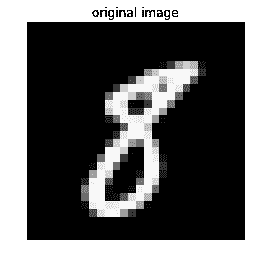

<title>Secure and Private AI</title> 

# 安全和私有人工智能

机器学习可以帮助我们诊断和抗击癌症，决定哪所学校最适合我们的孩子，并进行最明智的房地产投资。但你只能通过访问私人和个人数据来回答这些问题，这需要一种新颖的机器学习方法。这种方法被称为*安全和私有人工智能*，在最近几年，已经取得了长足的进步，正如你将在下面的食谱中看到的。

本章包含以下配方:

*   联合学习
*   加密计算
*   私人深度学习预测
*   测试神经网络的对抗性鲁棒性
*   使用张量流隐私的差分隐私

<title>Technical requirements</title> 

# 技术要求

以下是本章的技术先决条件:

*   张量流联邦
*   傻瓜盒子
*   PyTorch
*   火炬视觉
*   TensorFlow 隐私

安装说明、代码和数据集可以在[https://github . com/packt publishing/Machine-Learning-for-cyber security-Cookbook/tree/master/chapter 08](https://github.com/PacktPublishing/Machine-Learning-for-Cybersecurity-Cookbook/tree/master/Chapter08)找到。

<title>Federated learning</title> 

# 联合学习

在这个菜谱中，我们将使用 TensorFlow 联邦框架训练一个联邦学习模型。

为了理解为什么联合学习是有价值的，当你写短信时，考虑一下你手机上的*下一个单词预测*模型。出于隐私原因，您不会希望将数据(即您的文本消息)发送到中央服务器来用于训练下一个单词预测器。但是有一个准确的下一个单词预测算法还是不错的。怎么办？这就是联合学习的用武之地，它是一种为解决这种隐私问题而开发的机器学习技术。

联合学习的核心思想是，训练数据集仍在其生产者手中，保留隐私和所有权，同时仍用于训练集中式模型。该特征在网络安全中特别有吸引力，例如，在网络安全中，从许多不同的来源收集良性和恶意样本对于创建强模型是至关重要的，但是由于隐私问题而很困难(例如，良性样本可以是个人或机密文档)。

顺便提一下，由于数据隐私越来越重要(例如，GDPR 法案的颁布)，联合学习已经获得了越来越多的关注。苹果和谷歌等大公司已经开始在这项技术上投入巨资。

<title>Getting ready</title> 

# 做好准备

该配方的准备包括在`pip`中安装`tensorflow_federated`、`tensorflow_datasets`和`tensorflow`包。该命令如下所示:

```
pip install tensorflow_federated==0.2.0 tensorflow-datasets tensorflow==1.13.1
```

我们将安装这些包的特定版本，以防止代码中的任何中断。

<title>How to do it…</title> 

# 怎么做…

在以下步骤中，您将创建两个虚拟数据集环境，一个属于 Alice，另一个属于 Bob，并使用联合平均来保护数据机密性。

1.  导入 TensorFlow 并启用急切执行:

```
import tensorflow as tf

tf.compat.v1.enable_v2_behavior()
```

2.  通过导入“时尚 MNIST”并将其分成两个独立的环境(Alice 和 Bob)来准备数据集:

```
import tensorflow_datasets as tfds

first_50_percent = tfds.Split.TRAIN.subsplit(tfds.percent[:50])
last_50_percent = tfds.Split.TRAIN.subsplit(tfds.percent[-50:])

alice_dataset = tfds.load("fashion_mnist", split=first_50_percent)
bob_dataset = tfds.load("fashion_mnist", split=last_50_percent)
```

3.  现在，定义一个`helper`函数将数据类型从 integer 转换为 float:

```
def cast(element):
    """Casts an image's pixels into float32."""
    out = {}
    out["image"] = tf.image.convert_image_dtype(element["image"], dtype=tf.float32)
    out["label"] = element["label"]
    return out
```

4.  然后，定义一个`helper`函数来展平要输入神经网络的数据:

```
def flatten(element):
    """Flattens an image in preparation for the neural network."""
    return collections.OrderedDict(
        [
            ("x", tf.reshape(element["image"], [-1])),
            ("y", tf.reshape(element["label"], [1])),
        ]
    )
```

5.  现在，定义一个`helper`函数来预处理数据:

```
import collections

BATCH_SIZE = 32

def preprocess(dataset):
    """Preprocesses images to be fed into neural network."""
    return dataset.map(cast).map(flatten).batch(BATCH_SIZE)
```

6.  预处理数据:

```
preprocessed_alice_dataset = preprocess(alice_dataset)
preprocessed_bob_dataset = preprocess(bob_dataset)
federated_data = [preprocessed_alice_dataset, preprocessed_bob_dataset]
```

7.  现在，为我们的神经网络定义一个`loss`函数:

```
def custom_loss_function(y_true, y_pred):
    """Custom loss function."""
    return tf.reduce_mean(
        tf.keras.losses.sparse_categorical_crossentropy(y_true, y_pred)
    )
```

8.  定义一个函数来实例化一个简单的 Keras 神经网络:

```
from tensorflow.python.keras.optimizer_v2 import gradient_descent

LEARNING_RATE = 0.02
def create_compiled_keras_model():
    """Compiles the keras model."""
    model = tf.keras.models.Sequential(
        [
            tf.keras.layers.Dense(
                10,
                activation=tf.nn.softmax,
                kernel_initializer="zeros",
                input_shape=(784,),
            )
        ]
    )
    model.compile(
        loss=custom_loss_function,
        optimizer=gradient_descent.SGD(learning_rate=LEARNING_RATE),
        metrics=[tf.keras.metrics.SparseCategoricalAccuracy()],
    )
    return model
```

9.  然后，创建一批虚拟样本，并定义一个函数从 Keras 模型返回一个联邦学习模型:

```
batch_of_samples = tf.contrib.framework.nest.map_structure(
    lambda x: x.numpy(), iter(preprocessed_alice_dataset).next()
)

def model_instance():
    """Instantiates the keras model."""
    keras_model = create_compiled_keras_model()
    return tff.learning.from_compiled_keras_model(keras_model, batch_of_samples)
```

10.  声明联邦平均的迭代过程，并运行计算的一个阶段:

```
from tensorflow_federated import python as tff

federated_learning_iterative_process = tff.learning.build_federated_averaging_process(
    model_instance
)
state = federated_learning_iterative_process.initialize()
state, performance = federated_learning_iterative_process.next(state, federated_data)
```

11.  然后，通过运行以下命令显示计算的指标:

```
performance
```

输出如下所示:

```
AnonymousTuple([(sparse_categorical_accuracy, 0.74365), (loss, 0.82071316)])
```

<title>How it works...</title> 

# 它是如何工作的...

我们从导入 TensorFlow 并启用急切执行开始(*步骤 1* )。通常，在 TensorFlow 中，操作不会立即执行。相反，会构建一个计算图，最后，所有操作会一起运行。在急切执行中，计算会尽快执行。接下来，在*步骤 2* 中，我们导入时尚 MNIST 数据集。这个数据集已经成为 MNIST 的事实上的替代品，提供了一些改进(比如增加了挑战)。然后，我们在 Alice 和 Bob 之间对半细分数据集。然后，我们定义一个函数，将时尚 MNIST 的像素值从整数转换为浮点数，用于训练我们的神经网络(*步骤 3* )，另一个函数将图像展平为单个向量(*步骤 4* )。这使我们能够将数据输入一个完全连接的神经网络。在*步骤 5* 和*步骤 6* 中，我们使用之前定义的便利函数对 Alice 和 Bob 的数据集进行预处理。

接下来，我们定义对我们的 10 类分类任务有意义的损失函数(*步骤 7* )，然后定义我们的 Keras 神经网络以准备训练(*步骤 8* )。在*步骤 9* 中，我们创建一批虚拟样本，并定义一个函数从 Keras 模型返回一个联合学习模型。虚拟样本批次指定了模型预期的输入形状。在*步骤 10* 中，我们运行联合平均过程的一个阶段。关于该算法的细节可以在题为*从分散数据进行深度网络的通信高效学习*的论文中找到。

在基本层面上，该算法在每个客户端的数据上结合局部**随机梯度下降** ( **SGD** )，然后使用执行模型平均的服务器。结果是为客户保密(在我们的例子中，是 Alice 和 Bob)。最后，在*步骤 11* 中，我们观察我们的性能，看到算法确实如预期的那样训练和提高了准确性。

<title>Encrypted computation</title> 

# 加密计算

在本菜谱中，我们将介绍加密计算的基础知识。特别是，我们将关注一种流行的方法，称为安全多方计算。您将学习如何构建一个简单的加密计算器，可以对加密数字执行加法。这个食谱中的想法在*私人深度学习预测*食谱中会派上用场。

<title>Getting ready</title> 

# 做好准备

下面的食谱除了 Python 之外没有任何安装要求。

<title>How to do it…</title> 

# 怎么做…

1.  导入随机库并选择一个大质数，`P`:

```
import random

P = 67280421310721
```

2.  为三方定义加密功能:

```
def encrypt(x):
    """Encrypts an integer between 3 partires."""
    share_a = random.randint(0, P)
    share_b = random.randint(0, P)
    share_c = (x - share_a - share_b) % P
    return (share_a, share_b, share_c)
```

3.  加密数字变量:

```
x = 17
share_a, share_b, share_c = encrypt(x)
print(share_a, share_b, share_c)

16821756678516 13110264723730 37348399908492
```

4.  给定三个份额，定义一个要解密的函数:

```
def decrypt(share_a, share_b, share_c):
    """Decrypts the integer from 3 shares."""
    return (share_a + share_b + share_c) % P
```

5.  解密加密的变量`x`:

```
decrypt(share_a, share_b, share_c)
```

输出如下所示:

```
17
```

6.  定义一个将两个加密数字相加的函数:

```
def add(x, y):
    """Addition of encrypted integers."""
    z = list()
    z.append((x[0] + y[0]) % P)
    z.append((x[1] + y[1]) % P)
    z.append((x[2] + y[2]) % P)
    return z
```

7.  添加两个加密变量并解密它们的总和:

```
x = encrypt(5)
y = encrypt(9)
decrypt(*add(x, y))

14
```

<title>How it works…</title> 

# 它是如何工作的…

我们从*步骤 1* 开始，导入随机库，以便在*步骤 2* 中生成随机整数。我们还定义了一个大素数 P，因为我们需要一个随机分布模 P。在*步骤 2* 中，我们定义了一个函数如何通过在三方之间分割来加密一个整数。这里 x 的值在三方之间随机地相加分割。所有运算都在整数模 p 域中进行。接下来，在*步骤 3* 中，我们演示使用我们的方法加密整数的结果。进行到*步骤 4* 和 *5* ，我们定义一个反向加密的函数，即解密，然后证明该操作是可逆的。在*第 6 步*中，我们定义了一个函数将两个加密数字(！).请注意，加密加法只是单个组件的加法，以 p 为模。在*加密深度学习预测*配方中，使用了 PySyft 的`.share(client, server,...)`命令。这个命令基本上是我们在这个食谱中使用的相同的加密过程，所以请记住，这些加密方案使用我们在这里讨论的技术。最后，在*步骤 7* 中，我们展示了我们可以在加密的实体上执行计算。

<title>Private deep learning prediction</title> 

# 私人深度学习预测

在许多情况下，公司 A 可能有一个训练有素的模型，它希望作为服务提供。同时，A 公司可能不愿意分享这种模式，以避免其知识产权被盗。这个问题的简单解决方案是让客户将他们的数据发送给公司 A，然后从它那里接收预测。然而，当客户希望保护他们数据的隐私时，这就成了一个问题。为了解决这种棘手的情况，该公司及其客户可以利用加密计算。

在这个食谱中，您将学习如何与客户共享加密的预训练深度学习模型，并允许客户使用加密的模型对他们自己的私人数据进行预测。

<title>Getting ready</title> 

# 做好准备

这个配方的准备包括在`pip`中安装 PyTorch、Torchvision 和 PySyft。该命令如下所示:

```
pip install torch torchvision syft
```

此外，一个名为`server_trained_model.pt`的预先训练好的模型已经包含在此配方中。

<title>How to do it…</title> 

# 怎么做…

以下步骤利用 PySyft 来模拟客户端-服务器交互，其中服务器具有作为黑盒保存的预训练深度学习模型，并且客户端希望使用该模型来预测保密的数据。

1.  导入`torch`并访问其数据集:

```
import torch
import torch.nn as nn
import torch.nn.functional as F
from torchvision import datasets, transforms
```

2.  导入 PySyft 并将其挂在`torch`上:

```
import syft as sy

hook = sy.TorchHook(torch)
client = sy.VirtualWorker(hook, id="client")
server = sy.VirtualWorker(hook, id="server")
crypto_provider = sy.VirtualWorker(hook, id="crypto_provider")
```

3.  定义一个简单的神经网络:

```
class Net(nn.Module):
    def __init__(self):
        super(Net, self).__init__()
        self.fc1 = nn.Linear(784, 500)
        self.fc2 = nn.Linear(500, 10)

    def forward(self, x):
        x = x.view(-1, 784)
        x = self.fc1(x)
        x = F.relu(x)
        x = self.fc2(x)
        return x
```

4.  实例化模型并加载其预训练的权重，这些权重是在 MNIST 上训练的:

```
model = Net()
model.load_state_dict(torch.load("server_trained_model.pt"))
model.eval()
```

5.  加密`client`和`server`之间的网络:

```
model.fix_precision().share(client, server, crypto_provider=crypto_provider)
```

6.  为 MNIST 数据定义加载程序:

```
test_loader = torch.utils.data.DataLoader(
    datasets.MNIST(
        "data",
        train=False,
        download=True,
        transform=transforms.Compose(
            [transforms.ToTensor(), transforms.Normalize((0.1307,), (0.3081,))]
        ),
    ),
    batch_size=64,
    shuffle=True,
)
```

7.  利用 MNIST 数据加载器定义专用加载器:

```
private_test_loader = []
for data, target in test_loader:
    private_test_loader.append(
        (
            data.fix_precision().share(client, server, crypto_provider=crypto_provider),
            target.fix_precision().share(
                client, server, crypto_provider=crypto_provider
            ),
        )
    )
```

8.  定义一个函数来评估私有测试集:

```
def test(model, test_loader):
    """Test the model."""
    model.eval()
    n_correct_priv = 0
    n_total = 0
```

9.  迭代私有数据，使用模型进行预测，解密结果，然后打印出来:

```
    with torch.no_grad():
        for data, target in test_loader:
            output = model(data)
            pred = output.argmax(dim=1)
            n_correct_priv += pred.eq(target.view_as(pred)).sum()
            n_total += 64
            n_correct = 
            n_correct_priv.copy().get().float_precision().long().item()
            print(
                "Test set: Accuracy: {}/{} ({:.0f}%)".format(
                    n_correct, n_total, 100.0 * n_correct / n_total
                )
            )
```

10.  运行测试程序:

```
test(model, private_test_loader)
```

结果如下:

```
Test set: Accuracy: 63/64 (98%)
Test set: Accuracy: 123/128 (96%)
Test set: Accuracy: 185/192 (96%)
Test set: Accuracy: 248/256 (97%)
Test set: Accuracy: 310/320 (97%)
Test set: Accuracy: 373/384 (97%)
Test set: Accuracy: 433/448 (97%)
<snip>
Test set: Accuracy: 9668/9920 (97%)
Test set: Accuracy: 9727/9984 (97%)
Test set: Accuracy: 9742/10048 (97%)
```

<title>How it works…</title> 

# 它是如何工作的…

我们首先导入`torch`及其数据集，以及一些相关的库(*步骤 1* )。然后我们导入`pysyft`并将其挂钩到`torch` ( *步骤 2* )。我们还为客户机和服务器创建虚拟环境，以模拟真实的数据分离。在这一步中，`crypto_provider`作为可信的第三方，用于加密和解密。在*步骤 3* 中，我们定义了一个简单的神经网络，在*步骤 4* 中，我们加载了它的预训练权重。请注意，在*步骤 5* 中，更一般地说，每当使用`.share(...)`命令时，您应该认为共享对象是加密的，并且只有在所有相关方的协助下才可能解密。具体来说，在*步骤 9* 中，测试函数执行加密评估；模型的权重、数据输入、预测和用于评分的目标都被加密。但是，为了验证模型是否正常工作，我们解密并显示其准确性。在*步骤 5* 中，我们对网络进行加密，这样只有当服务器和客户端合作时，它们才能解密网络。

在接下来的两步中，我们为 MNIST 数据定义常规和私有加载器。常规加载器只是加载 MNIST 数据，而私有加载器对常规加载器的输出进行加密。在*步骤 8* 和 *9* 中，我们定义了一个`helper`函数来评估私有测试集。在这个函数中，我们迭代私有数据，使用模型进行预测，解密结果，然后打印出来。最后，我们应用*步骤 8* 和 *9* 中定义的函数来确定模型运行良好，同时保护隐私。

<title>Testing the adversarial robustness of neural networks</title> 

# 测试神经网络的对抗性鲁棒性

对神经网络的对抗性攻击的研究揭示了对对抗性扰动的惊人的敏感性。即使是最精确的神经网络，在不设防的情况下，也容易受到单像素攻击和人眼不可见噪声的干扰。幸运的是，该领域的最新进展提供了如何强化神经网络以应对各种敌对攻击的解决方案。一个这样的解决方案是被称为综合分析的 T2 的神经网络设计。该模型背后的主要思想是，它是一个贝叶斯模型。该模型不是直接预测给定输入的标签，而是使用**变分自动编码器** ( **VAEs** )学习类条件样本分布。更多信息可在[https://arxiv.org/abs/1805.09190](https://arxiv.org/abs/1805.09190)找到。

在本食谱中，您将为 MNIST 加载一个预训练的 ABS 网络，并学习如何测试神经网络的对抗性鲁棒性。

<title>Getting ready</title> 

# 做好准备

以下配方已经在 Python 3.6 中测试过。准备这个菜谱需要在`pip`中安装 Pytorch、Torchvision、SciPy、Foolbox 和 Matplotlib 包。该命令如下所示:

```
pip install torch torchvision scipy foolbox==1.8 matplotlib
```

<title>How to do it...</title> 

# 怎么做...

在下面的步骤中，我们将为 MNIST 加载一个预训练的 ABS 模型和一个传统的 CNN 模型。我们将使用 Foolbox 攻击这两种模型，看看它们能在多大程度上抵御对抗性攻击:

1.  首先导入预训练的 ABS 模型:

```
from abs_models import models
from abs_models import utils

ABS_model = models.get_VAE(n_iter=50)
```

2.  使用模型定义一个`convenience`函数来预测一批 MNIST 图像:

```
import numpy as np

def predict_on_batch(model, batch, batch_size):
    """Predicts the digits of an MNIST batch."""
    preds = []
    labels = []
    for i in range(batch_size):
        point, label = utils.get_batch()
        labels.append(label[0])
        tensor_point = utils.n2t(point)
        logits = model(tensor_point)[0]
        logits = [x for x in logits]
        pred = np.argmax(logits)
        preds.append(int(pred))
    return preds, labels
```

3.  对一批进行预测:

```
batch = utils.get_batch()
preds, labels = predict_on_batch(ABS_model, batch, 5)
print(preds)
print(labels)
```

结果如下:

```
[4, 4, 9, 1, 8]
[4, 4, 9, 1, 8]
```

4.  使用 Foolbox 包装模型，以便进行对抗性测试:

```
import foolbox

if ABS_model.code_base == "tensorflow":
    fmodel = foolbox.models.TensorFlowModel(
        ABS_model.x_input, ABS_model.pre_softmax, (0.0, 1.0), channel_axis=3
    )
elif ABS_model.code_base == "pytorch":
    ABS_model.eval()
    fmodel = foolbox.models.PyTorchModel(
        ABS_model, bounds=(0.0, 1.0), num_classes=10, device=utils.dev()
    )
```

5.  从 Foolbox 导入攻击库，并选择一个 MNIST 图像:

```
from foolbox import attacks

images, labels = utils.get_batch(bs=1)
```

6.  选择攻击类型，在本例中为边界攻击:

```
attack = attacks.DeepFoolL2Attack(fmodel)
metric = foolbox.distances.MSE
criterion = foolbox.criteria.Misclassification()
```

7.  使用 Matplotlib 显示原始图像及其标签:

```
from matplotlib import pyplot as plt
%matplotlib inline

plt.imshow(images[0, 0], cmap="gray")
plt.title("original image")
plt.axis("off")
plt.show()
```

生成的图像如下:



8.  使用 Foolbox 搜索对抗性实例:

```
gradient_estimator = foolbox.gradient_estimators.CoordinateWiseGradientEstimator(0.1)
fmodel = foolbox.models.ModelWithEstimatedGradients(fmodel, gradient_estimator)

adversary = foolbox.adversarial.Adversarial(
    fmodel, criterion, images[0], labels[0], distance=metric
)
attack(adversary)
```

9.  展示发现的对立例子:

```
plt.imshow(a.image[0], cmap="gray")
plt.title("adversarial image")
plt.axis("off")
plt.show()
print("Model prediction:", np.argmax(fmodel.predictions(adversary.image)))
```

产生的对立图像如下:


10.  举例说明在 MNIST 训练的传统 CNN 模型:

```
from abs_models import models

traditional_model = models.get_CNN()
```

模型架构如下:

```
CNN(
  (net): NN(
    (conv_0): Conv2d(1, 20, kernel_size=(5, 5), stride=(1, 1))
    (bn_0): BatchNorm2d(20, eps=1e-05, momentum=0.1, affine=True, track_running_stats=True)
    (nl_0): ELU(alpha=1.0)
    (conv_1): Conv2d(20, 70, kernel_size=(4, 4), stride=(2, 2))
    (bn_1): BatchNorm2d(70, eps=1e-05, momentum=0.1, affine=True, track_running_stats=True)
    (nl_1): ELU(alpha=1.0)
    (conv_2): Conv2d(70, 256, kernel_size=(3, 3), stride=(2, 2))
    (bn_2): BatchNorm2d(256, eps=1e-05, momentum=0.1, affine=True, track_running_stats=True)
    (nl_2): ELU(alpha=1.0)
    (conv_3): Conv2d(256, 10, kernel_size=(5, 5), stride=(1, 1))
  )
  (model): NN(
    (conv_0): Conv2d(1, 20, kernel_size=(5, 5), stride=(1, 1))
    (bn_0): BatchNorm2d(20, eps=1e-05, momentum=0.1, affine=True, track_running_stats=True)
    (nl_0): ELU(alpha=1.0)
    (conv_1): Conv2d(20, 70, kernel_size=(4, 4), stride=(2, 2))
    (bn_1): BatchNorm2d(70, eps=1e-05, momentum=0.1, affine=True, track_running_stats=True)
    (nl_1): ELU(alpha=1.0)
    (conv_2): Conv2d(70, 256, kernel_size=(3, 3), stride=(2, 2))
    (bn_2): BatchNorm2d(256, eps=1e-05, momentum=0.1, affine=True, track_running_stats=True)
    (nl_2): ELU(alpha=1.0)
    (conv_3): Conv2d(256, 10, kernel_size=(5, 5), stride=(1, 1))
  )
)
```

11.  执行健全性检查，以确保模型按预期执行:

```
preds, labels = predict_on_batch(traditional_model, batch, 5)
print(preds)
print(labels)
```

打印输出如下:

```
[7, 9, 5, 3, 3]
[7, 9, 5, 3, 3]
```

12.  使用 Foolbox 包装传统模型:

```
if traditional_model.code_base == "tensorflow":
    fmodel_traditional = foolbox.models.TensorFlowModel(
        traditional_model.x_input,
        traditional_model.pre_softmax,
        (0.0, 1.0),
        channel_axis=3,
    )
elif traditional_model.code_base == "pytorch":
    traditional_model.eval()
    fmodel_traditional = foolbox.models.PyTorchModel(
        traditional_model, bounds=(0.0, 1.0), num_classes=10, device=u.dev()
    )
```

13.  攻击传统的 CNN 模式:

```
fmodel_traditional = foolbox.models.ModelWithEstimatedGradients(fmodel_traditional, GE)

adversarial_traditional = foolbox.adversarial.Adversarial(
    fmodel_traditional, criterion, images[0], labels[0], distance=metric
)
attack(adversarial_traditional)
```

14.  展示发现的对立例子:

```
plt.imshow(adversarial_traditional.image[0], cmap="gray")
plt.title("adversarial image")
plt.axis("off")
plt.show()
print(
    "Model prediction:",
    np.argmax(fmodel_traditional.predictions(adversarial_traditional.image)),
)
```

产生的对立图像如下:


<title>How it works...</title> 

# 它是如何工作的...

我们首先导入一个预训练的 ABS 模型(*步骤 1* )。在*步骤 2* 和*步骤 3* 中，我们定义了一个`convenience`函数来预测一批 MNIST 图像，并验证模型是否正常工作。接下来，我们使用 Foolbox 包装该模型，为测试其对抗性健壮性做准备(*步骤 4* )。请注意，Foolbox 在包装后使用相同的 API 方便了对 TensorFlow 或 PyTorch 模型的攻击。不错！在*步骤 5* 中，我们选择一个 MNIST 图像作为我们攻击的媒介。为了澄清，这个图像被调整和变异，直到结果欺骗了模型。在*步骤 6* 中，我们选择想要实施的攻击类型。我们选择边界攻击，这是一种基于决策的攻击，从大的敌对扰动开始，然后在保持敌对的同时逐渐减少扰动。该攻击几乎不需要超参数调整，因此没有替代模型和梯度计算。有关基于决策的攻击的更多信息，请参考[https://arxiv.org/abs/1712.04248](https://arxiv.org/abs/1712.04248)。

此外，请注意，这里使用的度量是**均方误差** ( **MSE** )，它决定了如何评估对立示例是接近还是远离原始图像。使用的标准是错误分类，这意味着一旦目标模型错误分类图像，搜索就终止。替代标准可以包括置信水平或特定类型的错误分类。在*步骤 7-9* 中，我们显示原始图像，以及从其生成的对抗示例。在接下来的两步中，我们实例化一个标准的 CNN 并验证它是否正常工作。在*步骤 12-14* 中，我们在标准 CNN 上重复了之前步骤中的攻击。观察结果，我们看到该实验是一个强有力的视觉指示器，表明 ABS 模型比普通的 CNN 对对抗性扰动更鲁棒。

<title>Differential privacy using TensorFlow Privacy</title> 

# 使用张量流隐私的差分隐私

TensorFlow Privacy([https://github.com/tensorflow/privacy](https://github.com/tensorflow/privacy))是 tensor flow 家族相对较新的成员。这个 Python 库包括 TensorFlow 优化器的实现，用于训练具有*差分隐私*的机器学习模型。已被训练为差分私有的模型不会因为从其数据集中移除任何单个训练实例而发生重大变化。使用*ε*和*δ*来量化(近似)差分隐私，这给出了模型对单个训练示例中的变化的敏感程度的度量。使用隐私库很简单，只需包装熟悉的优化器(例如，RMSprop、Adam 和 SGD ),将它们转换成不同的私有版本。该库还提供了测量隐私保证、ε和δ的便利工具。

在这个食谱中，我们向您展示了如何使用 Keras 和 TensorFlow Privacy 为 MNIST 实现和训练一个差分私有深度神经网络。

<title>Getting ready</title> 

# 做好准备

这个食谱的准备工作包括安装 Keras 和 TensorFlow。该命令如下所示:

```
pip install keras tensorflow
```

TensorFlow Privacy 的安装说明可在[https://github.com/tensorflow/privacy](https://github.com/tensorflow/privacy)找到。

<title>How to do it...</title> 

# 怎么做...

1.  首先定义几个方便的函数来预处理 MNIST 数据集:

```
import tensorflow as tf

def preprocess_observations(data):
    """Preprocesses MNIST images."""
    data = np.array(data, dtype=np.float32) / 255
    data = data.reshape(data.shape[0], 28, 28, 1)
    return data

def preprocess_labels(labels):
    """Preprocess MNIST labels."""
    labels = np.array(labels, dtype=np.int32)
    labels = tf.keras.utils.to_categorical(labels, num_classes=10)
```

2.  编写一个方便的函数来加载 MNIST:

```
def load_mnist():
    """Loads the MNIST dataset."""
    (X_train, y_train), (X_test, y_test) = tf.keras.datasets.mnist.load_data()
    X_train = preprocess_observations(X_train)
    X_test = preprocess_observations(X_test)
    y_train = preprocess_labels(y_train)
    y_test = preprocess_labels(y_test)
    return X_train, y_train, X_test, y_test
```

3.  加载 MNIST 数据集:

```
import numpy as np

X_train, y_train, X_test, y_test = load_mnist()
```

训练集的大小是 60 k，测试集的大小是 10 k。

4.导入差异专用优化器，并定义几个参数来控制学习率和差异专用程度:

```
from privacy.optimizers.dp_optimizer import DPGradientDescentGaussianOptimizer

optimizer = DPGradientDescentGaussianOptimizer(
    l2_norm_clip=1.0, noise_multiplier=1.1, num_microbatches=250, learning_rate=0.15
)
loss = tf.keras.losses.CategoricalCrossentropy(
    from_logits=True, reduction=tf.losses.Reduction.NONE
)
```

5.  为了测量隐私，定义一个函数来计算ε:

```
from privacy.analysis.rdp_accountant import compute_rdp
from privacy.analysis.rdp_accountant import get_privacy_spent

def compute_epsilon(steps):
    """Compute the privacy epsilon."""
    orders = [1 + x / 10.0 for x in range(1, 100)] + list(range(12, 64))
    sampling_probability = 250 / 60000
    rdp = compute_rdp(
        q=sampling_probability, noise_multiplier=1.1, steps=steps, orders=orders
    )
    return get_privacy_spent(orders, rdp, target_delta=1e-5)[0]
```

6.  为 MNIST 定义标准的 Keras CNN:

```
NN_model = tf.keras.Sequential(
    [
        tf.keras.layers.Conv2D(
            16, 8, strides=2, padding="same", activation="relu", input_shape=(28, 28, 1)
        ),
        tf.keras.layers.MaxPool2D(2, 1),
        tf.keras.layers.Conv2D(32, 4, strides=2, padding="valid", activation="relu"),
        tf.keras.layers.MaxPool2D(2, 1),
        tf.keras.layers.Flatten(),
        tf.keras.layers.Dense(32, activation="relu"),
        tf.keras.layers.Dense(10),
    ]
)
```

7.  编译`model`:

```
NN_model.compile(optimizer=optimizer, loss=loss, metrics=["accuracy"])
```

8.  装配和测试`model`:

```
NN_model.fit(
    X_train, y_train, epochs=1, validation_data=(X_test, y_test), batch_size=250
)
```

9.  计算`epsilon`的价值，隐私的衡量标准:

```
eps = compute_epsilon(1 * 60000 // 250)
```

<title>How it works...</title> 

# 它是如何工作的...

我们从准备和加载 MNIST 数据集开始*步骤 1-3* 。接下来，在*步骤 4* 中，我们导入`DPGradientDescentGaussianOptimizer`，这是一个优化器，它允许模型变成差分私有的。在这一阶段使用了许多参数，这些参数有待澄清。`l2_norm_clip`参数指的是在微型批次的单个训练数据点上计算的每个梯度的最大范数。此参数限制了优化器对单个训练点的敏感度，从而将模型推向差异隐私。`noise_multiplier`参数控制添加到渐变中的随机噪声量。一般噪音越大，私密性越大。完成这一步后，在*步骤 5* 中，我们定义一个函数来计算差分隐私的ε-δ定义的ε。我们实例化一个标准的 Keras 神经网络(*步骤 6* ，编译它(*步骤 7* ，然后使用差分私有优化器在 MNIST 上训练它(*步骤 8* )。最后，在*步骤 9* 中，我们计算 epsilon 的值，它测量模型的不同私有程度。该配方的典型值是大约 1 的ε值。