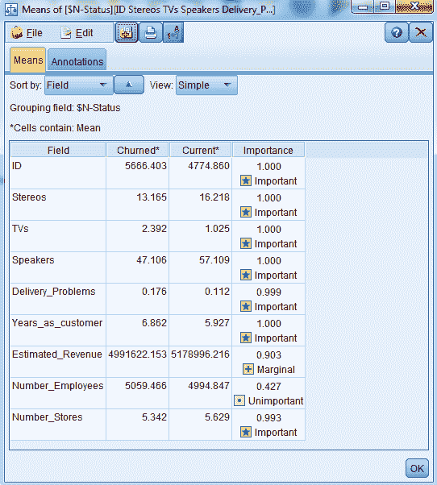

# 理解模型

在这一章中，我们将研究一般的模型解释。我们将看看不同类型的预测模型。然后我们会用各种技术解读一些机器学习模型。

我们将在本章中讨论以下主题:

*   模型的类型
*   使用图表解释机器学习模型
*   使用统计学解释机器学习模型
*   使用决策树解释机器学习模型

# 模型

有三种不同类型的预测模型:

*   统计模型
*   决策树模型
*   机器学习模型

# 统计模型

统计模型识别的第一件事是哪个预测器在模型中是最重要的。统计模型还创建了一个等式，允许您进行预测。例如，正如我们在下面的屏幕截图中所看到的，预测方程中的系数已被突出显示:

下面的屏幕截图突出显示了预测当前工资的等式:

在下面的屏幕截图中，我们可以看到，我们采用了可变起始工资的系数，并将其乘以实际起始工资:

现在，我们用教育水平系数乘以一个人受教育的年数:

我们还需要这个人的**年龄**，在下面的截图中突出显示:

我们将所有的值乘以它们各自的系数，最后，我们将所有的常数相加，这就预测了这个人的工资会是多少。这太好了。但是除此之外，统计模型允许我们确定每个预测因子增加一个单位的影响，你可以看到这个预测因子对不同结果变量的影响。

所以，比如用教育程度，我们看到它的系数是 **298** 。这告诉我们，一个人每多受一年教育，他目前的工资就会增加 298 美元:

因此，你可以真正看到每个独立变量的影响，以及它最终如何影响整体预测。

# 决策树模型

就像统计模型一样，决策树模型可以帮助您确定模型中最重要的预测因素。没有方程式，我们无法确定一个单位的影响以及它对结果变量的影响。相反，我们将创建规则，通过将数据分成两个互斥的类别来进行预测。

例如，正如您在下面的截图中看到的，我们有任何人的变量 **Premier** 值为 **No** :

我们有成为客户三年或更短时间的人，如下面的屏幕截图所示:

我们有一些人的估计收入少于或等于大约 4，000，000，如下面的屏幕截图所示:

他们碰巧位于另一个国家，我们预测他们会流失，如下面的截图所示:

这个规则应用于 25 个人，那个规则的准确率是 100%，如下图截图所示。因此，对于所有符合这些标准的客户，我们最终 100%地失去了他们。

接下来，还有第二条规则，和第一条完全一样。唯一的区别是，该地点是一个全国客户，你会注意到我们仍然预测将被搅动的人群。这条规则适用于 47 个个体，但是这条规则的准确性只有 66%:

现在，乍一看，这些似乎是相当相似的规则，但这是你必须回去，并试图确定到底发生了什么。

请注意，当所有标准都满足时，我们碰巧有一个国际客户，我们总是会失去他们，但当我们有一个国内客户时，我们仍然最有可能失去他们，但我们没有失去所有客户。你可能会问自己为什么？嗯，也许你可以回到销售代表那里。他们可能会告诉你，他们每个季度都会给**的全国**客户打一次电话，看看他们做得怎么样，这一次电话会设法留住一些客户，这样你就不会最终失去他们。因此，决策树允许你创建这些不同的规则，允许你做出预测，然后你可以很好地看到模型的内部工作。

# 机器学习模型

像统计模型和决策树模型一样，机器学习模型识别模型中哪些预测器是最重要的。

在下面的神经网络模型示例中，我们看到**扬声器**变量是最重要的，其次是 **Premier** ，然后是 **TVs** :

所以，这些是最重要的预测，这就是我们所得到的。我们得不到任何方程式或规则。我们甚至不知道关系的方向，例如，我们是否更有可能留住或失去购买更多扬声器的客户？我们真的不知道；我们不会从任何机器学习模型中获得那种信息，因为它们都是黑盒。

因此，在下一节中，我们将会看到你如何准确地解释机器学习模型的结果。此外，我们将看到如何使用图表来解释机器学习模型。

# 使用图表解释机器学习模型

在这一部分，我们将看到如何使用图表来解释机器学习模型的结果。具体来说，知道您拥有哪种数据很重要，因为数据类型将决定您可以创建的图表类型。这个图表将帮助您理解机器学习模型的预测内容。我们还将了解机器学习模型如何使用这些不同的变量进行预测，并最终将这些预测用于我们的最终解释。

例如，当我们有一个结果变量是一个分类变量，我们的预测也是一个分类变量，我们可以使用条形图或网络图。我们可以使用任何一种图表来帮助我们理解机器学习模型是如何进行预测的。下表显示了数据和图形的组合:

|  | 绝对的 | 连续的 |
| 绝对的 | 条形图/网络图 | 柱状图 |
| 连续的 | 柱状图 | 散点图 |

正如我们从上表中看到的，当我们有一个分类结果变量，但我们有一个连续的预测值时，我们可能需要使用直方图。直方图可以帮助我们直观地理解这些预测背后的情况。

现在让我们看看其他一些可能性。假设我们的结果变量实际上是一个连续变量，但我们有一个分类预测，所以这里我们可以使用直方图。最后，当我们有一个连续变量的结果变量和一个连续变量的预测变量时，我们可以使用散点图。我们将在接下来的章节中看到与此相关的例子。

在上一节中，我们建立了一个神经网络模型。让我们来看看我们构建的模型:

1.  让我们使用我们在前一章中创建的模型:

2.  将**随机种子**设为`5000`，然后运行模型

3.  单击新生成的模型，在观察结果中，我们可以看到 **Premier** 变量是最重要的预测变量，其次是 **Years_as_customer** ，然后是 **Stereos** 、 **TVs** 等等:

现在我们知道了这个模型中最重要的预测因子，但是我们不知道这些预测因子是如何被模型使用的。因此，我们将调查他们的关系。

有几种方法可以让我们知道模型组件之间的关系。我们可以用图表。让我们看几个例子:

4.  选择**记录操作**调色板。
5.  将生成的模型连接到一个**选择**节点。
6.  让我们看看训练数据集的数据。我们将保持测试数据集独立，因为我们稍后将使用该数据来确认结果。
7.  点击**选择**节点进行编辑。

8.  点击**表达式生成器**:

9.  选择任意变量。例如，**分区**变量，选择`=`，训练数据集:

10.  这也是表达式的外观，点击**确定**:

我们只选择了训练数据集中的人。现在，让我们来看看实际预测和该模型中的重要变量之间的关系，以弄清楚模型是如何使用这些变量的:

11.  转到**图形**面板，将**选择**节点连接到**分配**节点。**分布**节点基本上是一个条形图，如下截图所示:

12.  编辑**分布**节点。选择 **Premier** 字段:

注意，这里只有分类字段可用:

我们选择**首要**变量，因为它是模型中最重要的预测因素，我们将看到该变量如何用于预测:

13.  点击覆盖按钮:

14.  选择变量 **$N-Status** ，这是我们的实际预测:

15.  为了使比较更容易，点击按**颜色**归一化:

16.  点击**运行**，您可以看到这里做了什么:

请注意，蓝色与被预测会流失的人相关联，红色与被预测为当前客户的人相关联。您还可以看到，那些是**卓越客户**的人，我们会将他们与当前客户联系起来。那些不是**卓越客户**的人，我们将他们与蓝色联系在一起，这意味着我们预测他们将会流失。

这就是你如何研究分类预测因子和分类结果变量之间的关系。我们可以使用类似于条形图的东西，在本例中，它被称为 Modeler 中的**分布**节点；在其他软件包中，它会被称为**条形图**，但是您正在查看这两个分类变量之间的关系，现在您可以看到这些关系发生了什么。让我们用一个 **Web** 节点来看看这两个分类变量之间的关系:

1.  进入**图形**面板，将**选择**节点连接到**网页**节点:

2.  编辑 **Web** 节点，您可以将其构建为一个 **Web** ，这基本上允许我们将许多分类变量放在一起，或者我们可以创建一个**定向 web** ，以便这些类别中的所有分类变量都指向一个特定变量，这就是我们在这里要做的。选择**定向网页**。

3.  单击字段框
4.  添加您的预测，即 **$N-Status** 变量，添加所有其他分类变量:

5.  以下屏幕截图显示了所有选定的标志字段:

6.  添加其他分类字段。选择**付款方式**:

7.  按住 *Ctrl* 键向下滚动 a **n** d 选择 **TV_Categories** 和**T23 点击 **OK** :**

8.  将**线值** 设置为**绝对值**，如下截图所示:

9.  设置**行值是**到**字段/值**的百分比。从这些**预测值**字段中，我们将看到这些值如何与**结果**字段相关联，并点击运行:

请注意，有两条线比其他线略粗:

可以看到其中一行值说**是。**另一个线路值表示**否**，它们都与励磁电流有关，并被搅动，正如我们在下面的输出中看到的

我们来看看最粗的**是**线:

我们可以看到这条线向我们展示了这些人在 **Premier** 变量上的值为 **Yes** 并且预测与成为当前客户相关联，然后我们可以看到 **87%** 被预测为当前客户的人在变量 **Premier** 上的值为 **Yes** 。

同样，下一条最粗的线是我们在 **Premier** 变量上的线。我们的值为 no，这与搅动有关，该值最终为 **80%** :

1.  这是我们可以观察分类**预测**和分类**结果**变量之间关系的另一种方式。最强的关系是在**首要**变量和**结果**变量之间:

2.  让我们看看连续**预测值**和分类**结果**变量之间的关系。为此，我们将转到**图形**面板，并将**选择**节点连接到直方图:

3.  编辑**直方图，在**字段框中，选择 **TVs** 字段。选择 **TVs** 字段，因为这是模式中最重要的预测值之一:

4.  在叠加颜色框中，输入预测，这是变量 **$N-Status** :

5.  转到**选项**选项卡，点击**按颜色归一化**以使您的比较更加容易，然后点击**运行**:

6.  我们将看到以下结果:

我们可以看到，蓝色与那些我们预测会失去的客户联系在一起。红色与我们预测会保留的客户联系在一起。请注意，购买较少**电视**的人，我们预测约为 50%；基本上，我们最终会留住这些客户。随着顾客购买更多的**电视**，我们预测我们将失去这些顾客。这就是该模型如何使用这个变量，该模型描述了如果你没有购买很多**电视**，我们保持或失去你作为客户的可能性大致相等，但是如果你购买了很多**电视**，那么我们认为我们更有可能失去你作为客户。

在本例中，我们将研究两个连续变量之间的关系:

让我们使用不同的数据集。引入 **Var。文件**节点:

1.  编辑此节点并将其链接到数据集。导航到我们的数据集`Bank_Data`所在的位置，选择文件:
2.  打开数据集。这是一个逗号分隔的文件，如下面的屏幕截图所示:

3.  转到**类型**选项卡，点击**读取值**，然后选择**确定。您将看到您的变量**:

`salnow`是我们的因变量。因此，请确保它是一个目标变量。如果不是，那么将其角色更改为目标。将 **id** 的角色设置为**无**。所有其他变量都是当前工资变量的预测值。点击**确定**

4.  让我们看看结果变量和另一个连续变量之间的关系，前者是一个连续变量，后者是一个预测变量。转到**图形**调色板，将源节点连接到**绘图**节点:

**图**节点将允许我们创建一个散点图。所以，我们来编辑一下**剧情的**节点。

5.  在 **X 字段**框中，我们将输入我们的预测值，在这里我们将添加教育水平，即一个人受教育的年数，在 **Y 字段**框中，我们将添加我们的结果变量，即 **salnow** ，即当前工资:

6.  点击**运行**，我们得到如下结果图:

你可以看到，随着受教育年限的增加，目前的工资也在增加。我们有一个正的线性关系，这意味着当一个变量增加时，另一个变量也会增加，所以更多的教育最终会导致更高的当前工资，而更少的教育与更低的当前工资相关联。

这是一种我们可以表示两个连续变量之间关系的方法。在下一节中，我们将看到如何使用统计测试来解释机器学习模型的结果。

# 使用统计学解释机器学习模型

在本节中，我们将使用统计学来解释机器学习模型的结果。我们谈到了图表，以及它们如何让我们看到和解释机器学习模型的预测，但我们也可以使用这些图表进行统计测试。请看下表:

|  | 绝对的 | 连续的 |
| 绝对的 | 卡方检验 | 方差分析 |
| 连续的 | 方差分析 | 相互关系 |

假设我们有一个分类结果变量和一个分类预测值，我们可以使用卡方检验。独立性的卡方检验将允许我们查看两个分类变量之间的关系。

此外，如果我们有一个分类结果变量和一个连续的预测因子，我们可以使用方差分析来分析方差。如果我们有两个要比较的类别，我们可以用 t 检验来代替，这将允许我们解释正在发生的事情。另一方面，如果我们的结果变量是一个连续变量，我们有一个分类预测，我们可以使用方差分析。如果需要，我们也可以使用逻辑回归或判别分析。最后，当我们的两个变量都是连续变量时，我们可以使用相关或线性回归。让我们来看几个例子。我们将概述其中的一些技术，以便我们能够理解机器学习模型的内部工作原理。

让我们看看一些表格如何帮助阐明变量之间的关系，并看看这些不同的预测器是如何被模型使用的。
转到**输出**调色板，将选择节点连接到矩阵节点:

**矩阵**节点将允许我们进行卡方检验，这将帮助我们查看两个分类变量之间的关系。在这种情况下，我们要看看分类预测和分类结果变量之间的关系。让我们编辑**矩阵**节点。在**行**字段中，我们将输入我们的预测，即**$ N-状态**变量，在**列**字段中，我们将选择模型中的重要预测值，即**首要**变量:

转到**外观**选项卡并选择列百分比，这意味着我们将获得列百分比并点击运行:

我们将得到以下结果:

我们实际上有一个具有统计显著性的**卡方**检验，所以 Premier 是模型中的一个重要预测因子。

我们还得到了一些数字信息，支持我们之前在图表中看到的内容。我们可以看到，在这些人中，约有 **80%** 的非卓越客户与**产生了关联**，约有 **87%** 的**卓越客户**与**当前**客户产生了关联。

这就是模型一直在做的事情。现在，我们了解了如何在模型中使用至少一个变量。

# 理解连续预测值和分类结果变量之间的关系

在本节中，我们将探讨连续预测值和分类结果变量之间的关系。为此，我们可以运行 t-test 或 ANOVA，这在 Modeler 中也称为**表示**节点:

1.  从输出面板将**选择**节点连接到**手段**节点；

2.  编辑**我**ans 节点。在**分组字段**框中，输入预测，即 **$N-Status** 变量:

在**测试字段**框中，选择所有连续变量。此外，取消选择实际置信度:

3.  点击**确定**，然后点击**运行**。您将获得以下输出:

我们可以看到，大多数变量最终区分了对客户流失的预测和对成为当前客户的预测。有一些不重要的预测。例如，估计收入在统计上并不重要，员工数量也不重要，但其余的预测因素非常重要。

现在，我们看到的是**的意思是**。但是，让我们试着找到更多的信息。我们将把**视图**从**简单视图**更改为高级视图，我们将得到以下结果:

如你所见，对于这些变量，我们有相同数量的案例。最重要的预测结果是 **TVs** 变量，正如我们在下面的截图中看到的，这是最能区分这些组的变量。

例如，看看电视领域，我们可以看到当前的客户是我们预测会流失的人，我们认为我们会失去这些客户，他们平均购买了 2.4 台**电视**。我们可以看到，这一预测明显超过了预计会留下来的现有客户，他们平均购买了一台电视，这是一个具有统计意义的结果。当谈到**立体声系统**时，情况正好相反。你可以看到我们有一个统计上显著的结果，但是你可以看到我们预测会失去的顾客平均购买了 **13.2** 立体声音响，而我们预测会留下来的顾客平均购买了 **16.2** 立体声音响

我们要做的最后一件事是，看看两个连续变量之间的关系。之前，我们使用散点图来显示两个连续变量之间的关系。这里，我们将通过计算相关性来量化这一点:

1.  使用银行数据集，转到 Modeler 中的**输出**调色板，并将**统计**节点连接到源节点:

2.  编辑**统计数据**节点，这允许我们在检查框中获得汇总统计数据。点击字段选项并选择当前薪金:

3.  点击**确定**，将当前工资与其他连续变量相关联。单击关联框旁边的箭头并选择标尺图标，这将选择我们所有的连续变量:

4.  按住 *Ctrl* 键，取消选择 **id** :

5.  点击**确定**，然后点击**运行。**您将看到以下结果:

正如我们所看到的，当前工资与起始工资高度相关:

请记住，相关值的范围可以从-1 到+1。值离零越远，关系越强。如果相关系数为正，这意味着随着一个变量的值增加，另一个变量的值也增加。如果相关系数为负，这意味着随着一个变量的值增加，另一个变量的值减少。

注意，起始工资和当前工资的相关性非常高，几乎是 0.9。你也可以看到教育法和现在工资的相关性也很高，在 0.66。

另一方面，你可以看到一个人在这份工作上工作的时间和他在这份工作之前被雇佣的月数之间的相关性，这些变量实际上与当前的薪水没有关联。请注意，相关值实际上非常接近于零。

这给了我们一个你拥有的关系类型的指示，并且它允许我们量化那些关系。在下一部分，我们将看到如何使用决策树来解释机器学习模型的结果。

# 使用决策树解释机器学习模型

在本节中，我们将从机器学习模型中获取预测，并将这些预测用作我们的结果变量。然后我们会用原来的预测器来理解是怎么回事，也就是机器学习模型背后的逻辑。

之前，我们看到我们可以使用不同的图表来了解如何查看一个变量、一个预测因素之间的关系，以及它如何与结果变量相关，这是有用且重要的信息。但是一般来说，一个模型同时使用许多变量。因此，观察一个预测因子是有用的，但它并不能给我们一个完整的画面。

另一种技术是使用决策树模型来帮助我们理解神经网络模型或任何类型的机器学习模型背后的逻辑。

这里，我们将从模型中提取我们的预测，并使用该预测作为我们的结果变量。然后，我们将根据模型使用的预测值开始我们的预测:

1.  转到 **Field Ops** 面板，将生成的模型连接到**类型**节点:

2.  编辑**类型**节点，改变**状态**变量的原始结果角色。它将不再是**目标**，因为我们要将其角色更改为**无**。因此，它不会包含在我们将要构建的模型中:

3.  向下滚动一点。这里， **$N-Status** 预测不再仅仅是一个预测或输入；其实会是**目标**本身。这就是我们将要预测的:

在这里，我们试图进入神经网络模型(或任何类型的机器学习模型)的内部。看一看模型的预测，并使用它用来试图找出逻辑的变量。

4.  从该预测中删除置信度值，因为不需要它。将其角色更改为**无**并点击**确定**:

在这一点上，我们必须使用另一个模型来理解在机器学习模型的预测过程中发生了什么。我们可以使用统计模型。但是统计模型对数据有很多要求和假设。此外，他们不能很好地处理复杂的相互作用和非线性关系。

在尝试复制神经网络模型所做的事情方面，决策树模型可能会做得最好:

1.  进入**建模**面板，选择一个决策树模型，了解**神经网络**模型背后发生的事情。将**型**节点连接到 **C & R** 采油树模型上；

我们将预测来自**神经网络**模型的预测。

2.  当您编辑该模型时，您将使用**神经网络**模型最初使用的所有预测器来了解这些预测背后发生的事情:

3.  点击**运行**，查看生成的模型:

4.  我们将得到以下结果:

注意， **C & R** 模型也认为**总理**变量是模型中最重要的预测器。 **C & R** 模型有许多与神经网络模型相同的预测器，它们是最重要的预测器。这很重要，因为我们希望确保理解神经网络模型(或任何机器学习模型)的逻辑。

5.  点击**全部**按钮。
6.  点击 **%** 按钮，我们可以看到这些预测背后的一些数字:

我们对预测我们的结果变量不感兴趣，这里是**状态**。相反，我们试图理解神经网络模型预测背后的推理。

在这里，你可以看到我们使用了多个变量。看看前面的截图。第一条规则是，如果变量是 **Premier** ，您的值为 **NO** ，并且您成为我们的客户不到四年半，您购买的电视不到一年半，您购买的扬声器不到十点五个，我们预测我们将失去您这个客户。该规则适用于 41 人，对该规则的信心约为 81%。另一方面，如果应用所有相同的标准，那么你仍然是一个非顶级客户，你作为客户与我们在一起的时间不长，你购买了很少的电视，但你购买了超过 10.5 个扬声器，我们预测你将成为一个当前客户。该规则适用于 127 人，对该规则的置信度为 88%。

现在我们试图理解神经网络模型潜在的工作逻辑。这与神经网络模型所做的并不完全相同，因为神经网络模型和决策树模型的算法非常不同。我们只是试图理解神经网络模型背后的逻辑。在这种情况下，我们有一整套标准，它最终允许我们同时使用或查看多个变量之间的关系，以及它们最终如何影响预测。这只是你可以用来试图理解机器学习模型预测背后发生了什么的另一个工具。

# 摘要

在这一章中，我们从查看不同类型的预测模型开始。然后我们用这些模型来解读机器学习模型。

在下一章中，我们将探索改进单个模型的不同方法。