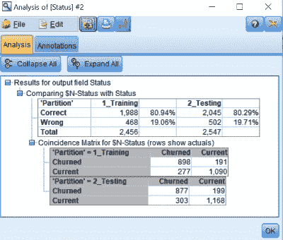

<title>Improving Individual Models</title>  

# 改进单个模型

在本章中，我们将看到如何改进不同的模型，以及如何修改模型选项。我们还将学习如何使用不同的模型，并了解如何通过删除预测中不需要的预测因子来消除噪声。您还将了解如何为模型准备额外的数据，我们将了解如何添加额外的字段。最后，您将看到如何对不同类别的结果变量进行过采样和欠采样，从而使您最终使用的模型更好地理解数据。

以下是本章将涉及的主题，这些是可以改进模型的方法:

*   修改模型选项
*   使用不同的模型
*   消除噪音
*   做额外的数据准备
*   平衡数据(过采样/欠采样)

<title>Modifying model options</title>  

# 修改模型选项

修改模型选项来改进模型是改进模型的直接方法之一。我们将借助一个示例来了解如何做到这一点:

1.  我们将创建一个 SVM 模型，就像我们在第二章中所做的那样:

2.  单击状态，转到专家选项卡，并在模式下选择专家。正如我们在[第二章](f4f20b86-4417-4c0c-a8b2-d0be16f28e20.xhtml)、*机器学习入门*中看到的，每当我们使用 SVM 模型时，我们都需要修改它们的设置。将正则化参数更改为 5。在内核类型中，选择多项式。然后，点击运行。

3.  您将看到一个模型被创建。现在，让我们进行下一步的模型分析。从输出面板中将您生成的模型连接到一个分析节点。打开分析节点，选择符合矩阵(对于符号目标选项)并点击运行。这将是将要获得的结果:

结果清楚地表明，该模型是不一致的，因为在训练和测试数据集的准确率之间存在巨大的差异。但是，我们可以看到，测试百分比比我们在第 2 章*机器学习入门*中获得的线性模型的测试百分比要好，大约为 73%。因此，也许多项式模型可以做得更好，但不是当前的模型，因为它是利用机会。

现在我们有了一个潜在的更好的模型，我们可以继续修改这个模型的设置。您可以转到 SVM 模型状态，在“专家”选项卡中，您可以看到度数被设置为 3。对于我们现有的数据来说，这个三次函数有可能被证明有点复杂。让我们用一个二次函数来代替。将度数更改为 2，然后单击运行。

再次，像我们一直做的那样运行分析，您会发现这些结果:

如你所见，两个数据集的准确率都在 5%以内。因此，我们可以说这个模型是一致的。此外，我们还可以看到测试数据集的整体准确性有所提高。

这就是我们如何通过修改现有模型的选项来改进现有模型，以提供具有更高整体准确性和一致性的更好结果。

<title>Using a different model to improve results</title>  

# 使用不同的模型来改善结果

在上一节中，我们看到了如何通过修改选项来改进从模型中获得的结果。现在，我们将看到如何通过改变模型本身来改善结果。

每个模型看待数据的方式不同。他们有自己的算法。这些算法为我们提供了不同的视角来看待数据。有时候，仅仅改变看待数据的看法就能给我们带来更好的结果。不同的算法利用数据的独特方面。让我们借助一个示例来看看如何做到这一点:

1.  带上您的数据，并将其划分为训练和测试数据集。
2.  从建模组件面板将分区节点连接到神经网络节点:

3.  单击神经网络节点，并转到构建选项选项卡。在这种情况下，进入高级选项，只需将随机种子更改为`5000`:

4.  我们将种子保留为`5000`的原因是因为我们使用`5000`作为种子获得了更好的结果，您可能还记得[第 2 章](f4f20b86-4417-4c0c-a8b2-d0be16f28e20.xhtml)、*机器学习入门*，在那里我们演示了一个神经网络。

5.  点击运行。
6.  同样，您将不得不分析所构建的模型。为此，回忆一下我们到目前为止所遵循的步骤。转到输出面板，并将生成的模型节点连接到分析节点。使用检查的符合矩阵运行分析节点。以下是获得的结果:

7.  你可以看到我们的总体准确率约为 80%,以及每个预测的表现。总的准确度与我们使用 SVM 模型时所达到的相似。因此，我们可以说 SVM 和神经网络模型在这个数据集上表现得一样好。让我们来看看如何进一步改善这些结果。
8.  在这个例子中，我们将使用决策树。要添加决策树节点，请选择分区节点，并从建模面板将其连接到 C5.0 节点:

C5.0 模型是一个决策树模型，它从一个非常不同的角度来看待数据。

9.  点击 C5.0 模型节点，构建一个 **C5.0** 模型并运行:

10.  现在，将 C5.0 模型节点连接到神经网络生成的模型节点。

11.  将 C5.0 生成的模型连接到分析节点:

这将使我们能够非常容易地比较结果。

12.  运行分析节点。以下是获得的结果:

如您所见，使用 C5.0 模型的测试数据集的总体准确率为 85%。这比我们仅用神经网络模型获得的要好得多。我们当然可以通过对 C5.0 模型进行一些修改来改进这一点，我将把这作为家庭作业留给你们。

因此，我们看到了 C5.0 模型如何略微改善了结果，并且在总体准确性以及训练和测试数据集的每个预测方面都做得很好。这只是提高模型性能的另一种方法的一个例子。现在，我们将了解如何从数据中去除噪声，从而获得更好的结果。

<title>Removing noise to improve models</title>  

# 去除噪声以改进模型

让我们来关注一下噪声是如何影响结果的。噪音只不过是丢失的数据、异常值或太多试图用不必要的预测混淆模型的预测器。

决策树模型没有噪音，因为有太多的预测器，因为默认情况下，与其他统计和机器学习模型相反，它们会消除不用于预测的预测器。

模型中有太多预测器会导致以下问题:

*   数据中影响模型整体准确性的附加噪声
*   模型变得比它应有的要复杂得多
*   如果要为新的预测添加新的数据，我们需要收集数据，即使是那些不重要的、预测并不真正需要的变量，因为我们的模型在一定程度上使用了它们。

如果从模型中清除和排除这些类型的预测因素，这可以简化对模型的理解，并且可能会给出更好的结果。

<title>How to remove noise</title>  

# 如何去除噪声

我们借助一个例子来了解一下。请遵循以下步骤:

1.  将您的数据划分到定型和测试数据集中。
2.  从建模面板中将分区节点连接到神经网络模型。
3.  选择模型，就像我们一直做的那样，转到 Build Options 选项卡，然后转到 Advanced 选项，并将 Random seed 更改为`5000`(因为这给了我们迄今为止最好的结果)。点击运行。
4.  我们之前已经看到了这个模型的准确性。参考我们在[第 2 章](f4f20b86-4417-4c0c-a8b2-d0be16f28e20.xhtml)、*机器学习入门*中演示神经网络时获取并存储在表格中的不同随机种子的前 10 个预测值列表:

我们现在将移除变量，这些变量没有出现在任何模型中，或者只出现在少数几个模型中。

5.  为了去除变量，我们将创建这种神经网络模型的另一个版本。从建模面板将分区节点连接到另一个神经网络模型:

6.  编辑新的神经网络模型:在这里，在字段选项卡中，我们将删除没有出现在任何模型的前 10 个列表中的预测值:

您只需从输入列表中单击预测值，然后单击指向左侧框的箭头。如果需要，您也可以使用相同的方法还原它们。这些变量没有出现在任何模型的前 10 名列表中。

7.  我们还将删除列表中只出现过一次或两次的变量:

8.  转到构建选项选项卡中的高级选项，将随机种子更改为`5000.`，然后单击运行。
9.  将第一神经网络模型连接到第二神经网络模型:

10.  从输出面板将第二个神经网络模型连接到分析节点:

11.  运行分析节点，就像我们一直做的那样。下面将对这两种模式进行对比分析:

正如您所看到的，第二个模型的测试和训练数据集的整体准确性略好于第一个模型。因此，通过去除一些不必要的预测因素，我们获得了 2%的可预测性改善。如果我们看到模型在预测每一个单独类别方面的工作，去除噪声的模型在这方面也做得很好。

因此，我们探索了另一种方法来改善从模型中获得的结果。我们看到了如何消除噪声，通过消除不必要的变量或预测因子来减少变量或预测因子的数量，从而给我们带来更好的结果。让我们继续看看另一种提高精度的方法。我们将看到在某种程度上准备数据如何能给我们带来更好的结果。

<title>Doing additional data preparation</title>  

# 做额外的数据准备

在本节中，我们将看到对数据所做的额外准备如何让我们提取额外的信息。

到目前为止，我们已经通过修改其选项、使用不同的模型、改变查看数据的角度以及去除噪声来改进我们的模型。虽然有时候，这些技术只会稍微改进模型；但是，如果您能够回到数据准备阶段，从数据中寻找可以提供更好结果的额外比特，这确实可以大大提高精度。

<title>Preparing the data</title>  

# 准备数据

按照以下步骤在数据准备阶段准备数据:

1.  获取您的数据并对其进行分区。
2.  再次运行一个神经网络模型，随机种子为`5000`。我们将获得 80%左右的准确率。
3.  我们现在将创建一个新模型并添加一个额外的预测器。如果你回到十大预测因素列表，我们会发现一些预测因素，如客户购买的扬声器和电视数量。因此，拥有一个显示购买商品总数的预测器是有意义的。

4.  转到 Field Ops 选项板，将分区节点连接到派生节点:

派生节点允许我们创建额外的变量。

5.  编辑派生节点。将“衍生”字段设置为`Total Items`,并单击公式字段右侧的“表达式构建器”按钮，我们将通过选择感兴趣的预测值并单击加号按钮来创建一个表达式:

这意味着`Total Items`包括音响、电视和扬声器。您将在公式字段中得到一个表达式，如下所示:

这是将用于`Total Items`的表达式。点击确定。

6.  我们刚刚创建的变量需要被实例化，以便模型能够使用它；为此，从“现场操作”选项板将“总项目”节点连接到“类型”节点:

7.  编辑类型节点。点击读取值按钮读取新变量:

如您所见，现在已读取了总项目预测值，并且它将作为此模型中的输入预测值。点击确定。

8.  从建模组件面板将类型节点连接到神经网络模型:

9.  运行随机种子设置为`5000`的神经网络模型。

10.  通过点击新生成的模型来查看模型结果。您可以看到，总项目在预测器重要性方面已经占据了前十名预测器的位置:

关上窗户。

11.  我们现在将第一个生成的模型连接到第二个模型:

12.  向第一个神经网络模型添加分析节点:

13.  像往常一样运行分析节点。您应该会得到以下结果:

请注意，我们的精确度略有提高。我们只是在现有模型中添加了一个变量。因此，当我们在运行模型之前对数据做额外的准备时，我们知道我们的结果会受到怎样的影响。

说到 Total Items 如何帮助该模型，您可以看到它在预测当前客户方面所做的工作。我们实际上在预测当前客户领域方面做得更好。因此，这表明我们选择添加的新变量不一定会提高整个模型的准确性，但肯定会提高一个或多个预测类别的准确性。您可以决定哪个类别对您的需求更重要，并相应地选择一个新变量。我们现在将继续了解采样如何帮助我们提供更好的结果。

<title>Balancing data</title>  

# 平衡数据

在本节中，我们将了解如何对结果变量的不同方面进行过采样或欠采样，以提高精确度。我们将改变我们的数据集来看到这一点。参考本书 GitHub 链接提供的`Loan`数据集。

<title>The need for balancing data</title>  

# 平衡数据的需要

为了演示这一点，我们将使用不同的数据集。选择 Var。画布上的文件节点。通过点按文件栏旁边的三点，导航到文件所在的位置。然后选择`Loan`数据集:

转到“类型”选项卡，将贷款预测者的角色更改为“目标”。这是我们将要预测的变量:

点击读取数值。然后，单击确定。在这个例子中，我们预测人们是否有贷款。

让我们看看贷款变量的分布。转到图形面板，将我们的源节点 Loan 连接到一个分布节点:

单击分发节点。然后单击字段框旁边的箭头，选择我们的预测值，我们需要查看它的分布，在我们的例子中是贷款:

然后，点击运行。您将看到以下分布:

注意这个数据集中 86%的人有贷款，13%的人没有贷款。在这种情况下，预测没有贷款的人群可能有点困难，因为分布非常不均匀。因此，在这种情况下，我们需要平衡数据。这意味着在每一组的类别大小上要更加相似。这种数据平衡也称为过采样或欠采样。

让我们举一个更极端的例子。假设我们试图预测欺诈，数据集的分布是 99%的情况完全合法，只有 1%的情况是欺诈。现在，如果我们建立一个具有这种分布类型的模型，通常会发生的情况是，该模型会预测所有案例都不是欺诈性的。这种模型的总体准确性将是 99%，因为 99%的时间都是正确的，但我们真正关心的是预测那几个欺诈案件。如果我们总是预测我们有一个好的案例，那么你知道模型本身并不真的那么有用，即使它的总体准确率是 99%。因此，有时模型的整体准确性并不那么有用。我们真正更关心的是预测每个单独类别的准确性。

像欺诈检测示例这样的情况会发生什么，因为一个组被过度代表，或者从技术上讲，另一个组或较小的组被代表，模型并没有真正了解较小的组的模式或特征，这就是为什么我们有时需要过采样或欠采样。

让我们回到我们的例子，试着看看我们能做些什么。

<title>Implementing balance in data</title>  

# 实现数据平衡

让我们首先建立一个模型来预测贷款，看看我们发现了什么:

1.  转到 Field Ops 面板，将 Loan 节点连接到 Partition 节点。
2.  从建模组件面板将神经网络模型连接到分区节点，并使用默认值运行神经网络模型:

3.  转到输出面板，将新生成的节点连接到分析节点。在检查了符合矩阵的情况下运行分析节点，您将获得以下结果:

可以看到，模型的整体准确率在 93%左右，模型相当一致。让我们看看模型对每一个类别的预测有多好。我们当然很好地预测了“是”组。然而，我们在“不”组的表现并不理想。我们可以尝试改进我们预测 No 组的方法。

获得的结果将我们带到了必须对**号**组进行过采样的阶段。或者欠采样**是**组。

对于过采样，我们首先需要将数据集划分为训练和测试数据集。这里需要记住的一点是，当我们对数据集进行过采样时，我们不需要对训练数据集和测试数据集进行相同的过采样。事实上，我们需要的是评估原始分布上的测试数据集，因为使用过采样，我们冒着在训练数据集上表现良好但在测试数据集上表现不佳的风险。为了避免这种情况，我们首先必须分离我们的数据。因此，我们将首先对训练数据集数据进行过采样，然后在其上构建模型，然后将其应用于测试数据集:

1.  转到 Record Ops 选项板，将分区节点连接到选择节点:

2.  选择选择节点。这里，我们将只选择训练数据集中的人员。我们将执行数据操作，然后对数据进行过采样或欠采样，并获得结果。为此，请单击表达式生成器。然后，选择分区变量:

点击 **=** 符号，然后点击字段值按钮:

然后，选择训练数据集并单击确定:

将会打开一个对话框。也单击确定。

3.  将另一个选择节点连接到现有的选择节点:

在这个选择节点中，我们将保留值为 No 的人员；为此，转到表达式生成器并选择贷款变量，单击=号，然后单击字段值按钮并选择否:

4.  我们将添加另一个连接到第一个选择节点的选择节点:

单击表达式生成器。选择贷款变量，并单击=号。单击“字段值”按钮，并选择“是”值。点击确定。所以，现在我们已经选择了所有有贷款的人。这是一个更大的人群，被过度代表了。这就把我们带到了只选择三分之一数据集的阶段。

5.  转到 Record Ops 选项板，将 Sample 节点连接到 Yes 组的 Select 节点:

6.  编辑样本节点。选择“随机%”以随机选择值，并将值设置为 33%。另外，检查可重复的分区分配。这将允许我们在每次为该选择创建模型时选择相同的人。点击确定:

7.  我们将不得不把这些独立的数据结合起来，再把它们组合起来。为此，将所有人的值都设置为 No 的 Select 节点连接到 Append 节点。然后右键单击 Sample 节点并选择 connect 将其连接到 Append 节点:

8.  单击追加节点并选择所有数据集，然后单击确定:

9.  让我们检查一下抽样后 Loan 字段的分布情况。为此，转到图形面板，将追加节点连接到分布节点:

10.  单击 Distribution 节点，转到 Field 框，并像我们之前所做的那样选择 loan。然后点击运行。以下是我们采样后获得的分布:

你可以看到 No 组约占样本的三分之一。

因此，通过对 Yes 节点进行欠采样，我们能够看到 13%的差异。

让我们看看过采样:

1.  现在让我们从 Field Ops 选项板将 Append 节点连接到 Type 节点。这里，我们不会使用分区字段。因此，转到 Types 节点，将分区的角色更改为 None。
2.  我们将再次通过建模面板来构建我们的模型。并将类型节点连接到神经网络模型。并在默认值上运行此设置。
3.  现在，将您的第一个生成的模型连接到新生成的模型，并将它们都连接到分析节点。让我们看看我们的结果:

你可以看到我们现在对 No 组的预测有多好！我们的模型在预测单个模型的准确性方面表现得相当好。因此，我们最终平衡了数据，显然这是以 yes 组的错误为代价的。但是“不”组是我们关心的问题，因为它的代表人数不足。

<title>Summary </title>  

# 摘要

这一章告诉我们如何修改可用于增强模型的各种选项。我们还学习了如何添加额外的字段并从这些模型中移除噪声。最后，我们对可用数据进行了采样，这有助于我们更好地理解模型。

在下一章，我们将学习如何组合模型并进一步改进它们。