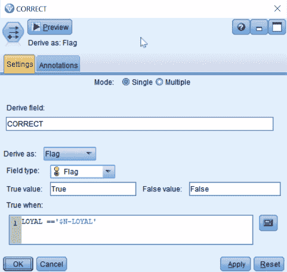
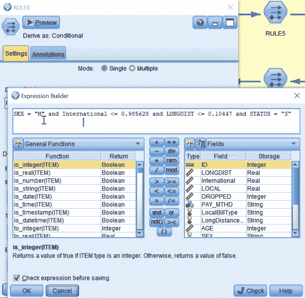
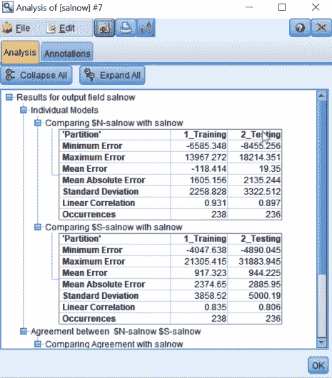

<title>Advanced Ways of Improving Models</title>  

# 改进模型的高级方法

首先，我们学习建立一个模型，然后我们对它进行诊断分析。然后，我们确定了模型的准确性，在这一章中，我们将扩展我们的建模技能。我们将学习如何不将模型视为终点，而是作为改进模型的起点。基本上，我们将学习如何通过构建多个模型来改进单个模型。我们有几种方法可以做到这一点，我们将详细讨论它们。

本章将涉及的主题如下。这些也是我们改进单个模型的方法:

*   组合模型
*   倾向得分
*   元级建模
*   误差建模
*   增压和装袋
*   连续结果

<title>Combining models</title>  

# 组合模型

有几种方法可以组合模型。在这一节中，我们将研究每一种方法。

<title>Combining by voting</title>  

# 投票合并

我们用一个例子来理解这种模型组合的方法。

假设我们运行了三个模型，并创建了一个如下所示的表:

我们对每个模型及其预测都有信心。让我们看看如何将这些模型结合起来。

如果我们看一下第一行，我们可以看到每个模型都在预测一个人将要离开。因此，如果我们结合预测，我们仍然预测这个人将要离开。置信度值或最终置信度是通过将所有模型的置信度值相加并除以总模型数(在我们的例子中是三个)而获得的。

如果我们看第二行，我们可以看到其中两个模型预测这个人将要离开；一个模型预测这个人会留下来。我们可以推断，综合预测将是这个人会离开。这里，我们通过将预测组合预测 Leave 的模型的置信度相加，除以模型总数(三)来计算置信度值。因此，第二行中的最终置信度值较低。

这是通过投票来组合模型，其中只有出现多次的预测才会被考虑进行组合。

<title>Combining by highest confidence</title>  

# 通过最高置信度合并

这是组合模型的另一种方法。例如，考虑下表:

在这个例子中，我们不会考虑模型预测的是什么；相反，我们将只关注高置信度值。如果我们看第一行，每个模型都预测离开。但是模型 1 具有最高置信度，因此组合预测被视为离开，并且最终置信度是所获得的最高置信度。

如果我们看第二行，具有最高置信度的模型是模型 3，并且它已经预测该人将留下，因此，组合预测变成留下，并且最终置信度变成最高置信度。

<title>Implementing combining models</title>  

# 实现组合模型

遵循以下步骤，看看我们如何将不同的模型结合起来:

1.  在画布上获得电子数据。
2.  从 Field Ops 选项板将数据集连接到分区节点。
3.  将数据分割成训练和测试数据集，我们之前已经这样做了。
4.  将分区节点连接到神经网络模型，并使用设置为`5000`的随机种子运行该模型。
5.  我们现在将建立一个**支持向量机** ( **SVM** )模型。当我们走向组合模型时，我们将转到分区节点，并从建模面板中将其与 SVM 模型连接起来。
6.  通过调用我们在第 2 章、*机器学习入门*的[专家选项卡中所做的编辑，运行 SVM 模型。转到专家选项卡，选择模式为专家。更改正则化参数 C，并将其设置为中间值`5`，并将内核类型更改为多项式，因为这是在使用相同数据之前为我们提供的准确一致的模型。此外，将度数值更改为`2`。我们将参数更改为这些值，因为当我们在第 2 章](f4f20b86-4417-4c0c-a8b2-d0be16f28e20.xhtml)*机器学习入门*中第一次看到该模型的演示时，我们已经获得了正确的结果。点击运行。
7.  连接生成的 SVM 和神经网络模型。
8.  转到输出面板，将生成的 SVM 模型连接到一个表。

9.  使用顶部的运行图标运行表格。您将看到以下内容:

在这里，您可以看到来自分区节点的结果、来自神经网络模型的预测及其置信度，甚至来自 SVM 模型的预测及其置信度。你可以关闭这个窗口。

10.  我们现在将通过从输出面板连接 SVM 生成的模型到一个分析节点来分析这个模型。
11.  编辑分析节点，检查符合矩阵，并点击运行。您将看到以下结果:

我们可以看到每个模型的表现有多好。如果向下滚动，您可以看到模型在训练数据集中 88%的时间内与预测一致，在测试数据集中大约 87%的时间与预测一致。当这些模型一致时，它们实际上在很大程度上是正确的。这使我们评估将这两种模式结合起来的可能性。

我们现在继续合并模型。我们将首先使用 modeler 进行组合，但是我们也将看到如何在 Modeler 之外组合模型。

<title>Combining models in Modeler</title>  

# 在 Modeler 中组合模型

要在建模器中组合模型，请遵循以下步骤:

1.  转到 SVM 模型，并从现场操作面板将其连接到系综节点。
2.  让我们编辑系综节点。集合节点知道它正在组合两个模型的结果，因为它在集合中显示了两个模型。从右侧的下拉按钮中选择集合的目标字段作为状态。如果选择了过滤掉集合模型生成的字段，它将过滤掉先前模型中已经生成的字段，因此，我们将取消选择它。接下来，选择整体方法。这是我们可以组合模型的一系列方法。这里，我们将选择投票，因为我们已经看到了这一点。我们将在本章的后面讨论倾向分数。然后我们必须选择当出现平局时会发生什么；在这里，我们将选择“最高可信度”,因为我们也看到了这一点，然后单击“确定”,如下面的屏幕截图所示:

3.  让我们看看我们结合的结果。为此，将集合节点连接到分析节点，并单击顶部的运行按钮。以下是结果:

首先，我们有神经网络模型的结果，然后是 SVM 模型的结果，最后，我们可以看到组合模型的结果。

我们可以看到，测试数据集中的整体准确率为 82%，这意味着有轻微的提高。我们能够通过合并两个模型来提高 2%的精确度，这是一个很好的起点。让我们看看如何从 Modeler 外部组合模型。

<title>Combining models outside Modeler</title>  

# 在 Modeler 外部组合模型

当您使用除 SPSS Modeler 之外的任何数据挖掘软件时，都可以使用此方法。

让我们看看如何做到这一点:

1.  转到 Field Ops 选项板，将 SVM 生成的模型连接到一个派生节点。
2.  我们将使用派生节点来创建一个新的字段。我们将编辑这个节点，并将其命名为`Combined_Prediction`。
3.  将此字段派生为条件字段。您将看到一个`if-else`条件。
4.  让我们告诉 Modeler，如果所有模型的预测都相等，那么组合的预测就是预测本身。为此，让我们在第一个`if`条件中添加一个表达式作为，来自神经网络模型的预测，$ N-Status select = SVM 模型的预测，$ S-Status；转到`Then`条件，点击表达式生成器并选择神经网络模型的预测，$N-Status，或者，您甚至可以从 SVM 模型中选择一个预测。
5.  在`Else`条件中写入如下语句:您可以从列表中选择变量名:

这意味着，如果两个模型的预测不匹配，我们将从任何模型中选择可信度最高的模型。如果神经网络模型预测的可信度高于 SVM 模型，那么我们将采用神经网络模型的预测。否则，如果 SVM 模型的预测可信度高于神经网络模型，那么我们将采用 SVM 模型。但是，如果两个条件都不满足，那么我们将放置一个`0`，然后我们必须以一个`endif`语句结束。点击确定。

6.  将 Combined_prediction 节点连接到表模式，让我们看看结果看看结果，如下面的截图所示:

在这里，在第 12 行中，我们可以看到神经网络预测客户被搅动，而 SVM 预测它是当前的，但是由于神经网络预测的置信度较高，组合预测被选为搅动。

7.  你可以分析这个模型，自己看，将获得的数字，将类似于我们使用系综节点得到的数字。

这就是我们如何结合两个模型来提高准确性，我们看到了如何从两个模型中获得结合的结果。你可以用三个或更多的模型来尝试。你会惊奇地发现组合模型是多么有效。我们现在将看到另一种改进模型的先进方法。

<title>Using propensity scores</title>  

# 使用倾向得分

倾向得分非常有用，因为它告诉你某件事情发生的可能性。模型的置信度值反映了我们对预测的信心，因此高置信度并不能帮助我们确定客户是会留下还是离开公司，相反，它表明了我们对预测的信心。有时，修改置信度值会很有帮助，因为高置信度值表示预测某人将离开，而低置信度值表示某人将留下。基本上，我们最终会创建一个离职倾向分数，这将有助于我们进行干预，不同的营销工作，等等。

例如，考虑这个表:

我们有两个离开的值和两个留下的值，每个值都有我们在这些预测中的置信值。在这个例子中，让我们假设我们正在试图计算失去一个客户的倾向。我们将创建一个倾向得分；这意味着，当一个人被预测要离开时，倾向得分与信心值是一回事。所以你可以看到，对于第一个人，我们预测他们会离开，由于我们对这一预测有很高的信心，因此倾向得分相当高。对于第二个人，我们预测他们也将离开，但对这一预测的信心没有那么高，因此，我们可以看到倾向得分也没有那么高。

在预测相反的情况时，如果我们预测第三个人会留下来，但对这个预测的信心不是很大，实际上我们要做的是用 1 减去我们真正想要的相反的信心值，这就是倾向得分。最后，在最后一个例子中，我们预测有一个人会留下来。该预测的可信度非常高，因此，该人离开的可能性非常低。

下图总结了倾向公式:

本质上，倾向分数所做的是修改信心值，以便您可以看到某事发生的可能性。因此，如果你能把他们都放在某种光谱上，就有可能看到，例如，有一些人很有可能会离开，所以也许我们对此无能为力。我们有另一群人，我们有很高的信心他们会留下来，所以他们离开的倾向很低。再说一次，我们可能不需要太担心他们，但是我们需要关注的人可能是中间的人，因为他们的预测不太极端，所以我们对这些预测不太有信心。潜在的，我们可以做一些事情。我们也许可以改变他们的想法，或者类似的事情，这就是倾向分数的用途。

<title>Implementations of propensity scores</title>  

# 倾向得分的实现

要了解我们如何利用倾向得分，请遵循以下步骤:

1.  将数据集放到画布上，并将其连接到一个分区节点，将数据集分成两部分。
2.  从 Modeling 选项卡将分区节点连接到 Chaid 模型。您可以在这里使用任何模型，但是让我们使用它，因为它也将在我们的下一个示例中使用。

3.  Chaid 将建立一个决策树模型。要编辑，请转到“模型选项”选项卡，其中有一个部分要求提供倾向得分。有两种类型；原始倾向得分用于训练数据集，而调整后的倾向得分用于测试或验证数据集。我们现在将选择原始倾向得分:

4.  点击运行。从输出面板将生成的模型连接到一个表节点，并运行该表。观察该表，可以看到我们添加了另一个变量，称为倾向得分，当预测客户会被搅动时，如果他们的信心得分较低，则倾向得分为*1-我们真正想要的信心*。但是对于当前客户，我们有一个类似于置信度值的倾向得分。

5.  如果您希望看到它的图形化表示，请将生成的模型从 Graphs 面板连接到 Histogram 节点。在字段框中编辑直方图，并选择倾向得分变量:

6.  单击运行查看以下内容:

请注意，倾向得分的范围从 0.0 到 1.0。但是置信值只有两个值，并且它们的范围从 0.5 到 1.0。要再次看到这一点，请转到直方图并从字段选项中选择置信度变量，然后单击运行。您将看到以下内容:

因此，我们将信心值转换为倾向得分，现在倾向得分为我们提供了关于可能性的信息，在这种情况下，有人会继续成为客户。我们可以用另一种方式来做，我们找到失去客户可能性的倾向得分，但我们可以颠倒这些得分，它最终会为我们创造这一点。在任何情况下，我们现在都可以使用这些倾向得分来做一些事情，例如，看看哪些客户是我们最有可能失去的，或者哪些是我们要保留的。无论你想怎么看，你都知道哪些人很有可能会失去，所以不可能对他们做任何事情。那些处于中间的人可能不会失去，所以也许可以为他们做更多的事情，试图留住他们作为客户，并试图更好地了解他们。

<title>Meta-level modeling</title>  

# 元级建模

元级建模是根据另一个模型的预测或结果建立一个模型。在前面的例子中，我们看到了如何为我们的 **Chaid** 模型创建倾向得分。在本节中，我们将看到如何从 **Chaid** 模型中提取结果，并将它们输入神经网络模型，这将使我们能够改进神经网络模型的结果。

为此，请按照下列步骤操作:

1.  从建模面板中将分区节点连接到神经网络节点。
2.  通过从构建选项卡下的高级选项中将随机种子更改为`5000`来运行神经网络模型，并单击运行。现在将生成的 Chaid 模型连接到生成的神经网络模型。
3.  现在，使用分析节点来查看这些模型的精确度。
4.  您将获得以下结果:

我们可以看到这两个模型的准确性有些相似，因此现在我们将继续构建一个不同类型的神经网络模型。

我们将从 Chaid 模型中获取结果，并将它们提供给神经网络模型。然后，神经网络模型将使用这些结果以及所有其他单个预测值，尝试获取更多信息:

1.  右键单击生成的神经网络模型并删除它。
2.  从 Field Ops 面板将生成的 Chaid 模型连接到一个类型节点。
3.  将类型节点编辑框滚动到底部，并将 Chaid 模型的置信度值变量设置为 None:

点击确定。

4.  将类型节点连接到我们已经在画布上的神经网络模型，并使用`5000`的随机种子运行它。
5.  如果你看一下新模型的结果，你会发现最重要的预测因素是 Chaid 模型的倾向得分:

6.  将生成的 Chaid 模型连接到分析节点，并运行分析以获得以下结果:

在本例中，我们可以看到，在神经网络模型中，如果我们输入来自 Chaid 模型的结果，我们的准确性会提高 1%。

<title>Error modeling</title>  

# 误差建模

误差建模是元级建模的另一种形式，但在这种情况下，我们将对预测中存在误差的情况进行建模。这样，我们可以提高预测的准确性。通过一个例子，我们将了解如何进行错误建模。

例如，考虑以下场景:

这里，我们有一个名为`LoyalTrain`的数据集。这只是一个训练数据集；我们在不同的地方有我们的测试和验证数据集，并且将只在训练数据集上构建模型。这也是一个类型节点和神经网络模型，我们在其中预测变量忠诚度。运行分析节点以查看结果，如以下屏幕截图所示:

你可以看到在结果变量中有两个类别:人们要么被预测留下，要么离开。你还可以看到，在 79%的情况下做出了正确的预测。在 21%的情况下犯了错误。总共有 236 个错误。

从这个例子中，您还可以看到神经网络模型被复制并放置在流的另一部分中。一个新的变量`CORRECT`也是使用一个派生节点生成的。让我们看看这里发生了什么，如下图所示:

这里，我们创建了一个名为`CORRECT`的新字段，并将它的值保持为`True`和`False`。我们在这里告诉 Modeler，如果它找到一个变量，忠诚，如果它等于忠诚的预测，那么值为真；否则就是假的。

如果您运行放置在它上面的分发节点，您将看到以下结果:

接下来，我们将使用 Type 节点实例化数据，之后我们可以使用一个 C5.0 决策树模型，该模型以一种非常不同的方式查看数据。这里，我们构建了一个 C5.0 模型，试图预测我们得到的预测是正确的还是不正确的。单击生成的 C5.0 模型以查看其结果，如下面的屏幕截图所示:

在此示例中，我们可以看到，我们有 14 行，其中 4 条规则用于错误预测，即当我们预测不正确时，10 条规则用于正确预测时的真值。

您可以展开规则并点击规则上方的 **%** 符号，以获得以下结果:

在这个例子中，第一个规则基本上表明，如果你是男性，并且你使用的国际电话少于 1 分钟，长途电话少于 1 分钟，并且你的状态是单身，我们预测我们将有一个 False 值。如果您想查看数字，请单击%号，您将看到以下结果:

如前面的屏幕截图所示，第一个规则有 22 个人，与他们相关的预测准确率约为 82%。

由此我们可以看出，在我们做预测时，会出现某些类型的错误。因此，我们可能需要使用另一种模型，而不是神经网络模型。为此，单击 Generate 选项并选择 Rule Trace 节点，如下面的屏幕截图所示:

这一步创建了 FALSE_TRUE 节点，您可以在示例场景中看到它作为开始图标。这创造了我们所有的规则。如果您希望查看它的内部，请单击 Tools 选项卡上的 Start +图标，您应该会看到以下结果:

现在让我们看看第一条规则。单击该规则中的表达式生成器，如下面的屏幕截图所示:

在这里，规则似乎表明，如果你是男性，并且你使用的国际电话少于 1 分钟，长途电话少于 1 分钟，并且你的状态也是单身，我们预测你的值将为 False。你可以看到这个预测的准确性。

使用开始图标返回。这里，我们有分类节点`Split`。让我们看看到目前为止我们做了什么，如下:

我们采用了变量规则，并单击 Get，它给出了所有这些不同的原始值 False，我们将其重命名为不正确的，以及所有的 True 值，我们将其重命名为正确的，然后我们就有了正确的预测:

我们现在已经建立了神经网络模型。如果运行根据正确预测生成的神经网络模型的分析节点，您应该会看到以下结果:

请记住，早期模型的整体准确率在 79%左右，现在已经提高到 84%左右。

我们还在类型节点的单独字段中对不正确的预测做了同样的事情。让我们来看看，如下:

我们为不正确的预测建立了一个 C5.0 模型，所以让我们看看它的分析，如下所示:

C5.0 模型在预测神经网络模型不能很好工作的错误值方面做得很好；我们现在有 89%的总体准确率。

让我们总结一下我们在这里所做的事情。我们有一个数据集，我们将它分成正确和错误的结果，并分别对每一个结果进行建模，以使我们比使用一个模型时产生更少的错误。

现在我们需要结合两个模型的预测。为此，从右侧的 Streams 选项卡转到 Error 2 流，如下面的屏幕截图所示:

在这里，我们组合了两种模型的预测，并使用了“派生节点”预测，如下面的屏幕截图所示:

这里，我们已经指定，如果预测是正确的，则应该选择神经网络模型的预测。如果预测不正确，我们应该选择 C5.0 模型的预测。

然后，添加矩阵节点后，运行以下命令:

我们在前面的截图中可以看到，我们正确地预测了 437 人将带着 118 个错误离开，498 人将带着 55 个错误留下。这意味着总共有 173 个错误。我们最初的模型犯了 236 个错误，所以我们已经大大减少了错误的数量。通过对不同的人群使用两种不同的模型，并将它们结合起来，我们产生了一个少了 63 个错误的输出。

这是错误建模。在误差建模中，你可以建立一个模型，看看结果是什么样的，然后决定是否为不同类型的人建立两个或三个模型，因为不能假设一个尺寸适合所有人。因此，我们可以建立不同类型的模型，向这些模型提供不同类型的数据，然后最终组合每个模型的结果以产生最终预测，最终在所进行的预测建模方面具有更少的错误。

<title>Boosting and bagging</title>  

# 增压和装袋

boosting 背后的想法是，通过建立连续的模型来预测早期模型的错误分类，你正在执行一种错误建模的形式。装袋，另一方面，是抽样更换。使用这种方法，可以生成与原始数据集大小相同的新训练数据集。对于本节中的示例，将使用引导示例。

在本例中，我们将了解如何进行增强和打包，这是改进模型的两种方法。

<title>Boosting</title>  

# 助推

让我们来看看如何通过以下步骤进行升压:

1.  将您的数据放在画布上并进行分区。
2.  为数据创建神经网络模型。
3.  使用设置为`5000`的随机种子运行神经网络模型。
4.  连接一个分析节点，并在检查符合矩阵的情况下运行它——您将看到测试准确度为 81%,总体准确度为 80%。
5.  现在，增强神经网络模型。为此，转到神经网络模型并编辑它。转到构建选项下的目标，并单击增强模型准确性(助推)。增强可用于任何大小的数据集。这里的想法是，我们正在建立连续的模型来预测早期模型的错误分类。所以，基本上，我们最终建立了一个模型。会有一些误差，所以应该建立第二个模型，其中第一个模型的误差给予更多的权重，这样我们就能更好地理解它们。然后，当我们建立第二个模型时，会有错误，所以我们最终建立了第三个模型，在第三个模型中，第二个模型的错误会被赋予更大的权重，这样我们就可以更好地理解它们，等等。无论何时进行增强和打包，您都必须确保您有一个训练和测试数据集，因为您很有可能会利用这个机会，并且您可能会找到特定于样本的信息，因为我们专注于在特定样本中发现的错误。我们现在将单击“Run”。

6.  让我们来看看我们生成的模型:

我们生成的模型中的第一个选项卡向我们展示了集合模型的样子:它组合了我们已经创建的 10 个模型。你可以看到它的总体准确率约为 98%:这是被选为最佳模型的模型。您还可以看到什么是参考模型——这将是构建的第一个模型——然后您可以看到简单模型，实际上，这不是模型，这只是我们预测的模式或最常见的反应。

7.  让我们来看看第二个图标:

在这里，您可以看到预测器的重要性。在我们最终建立的 10 个模型中，我们可以看到首要变量是最重要的预测因素，然后你可以看到其他预测因素的重要性顺序。这是我们通常会在一般神经网络模型中看到的同类信息，但这些信息来自我们构建的所有不同模型。

8.  如果我们转到下一个图标，我们可以看到预测频率:

这向我们展示了每个不同的预测因子在模型中的使用频率。对于神经网络模型来说，这并不有趣，因为神经网络模型通常不会丢弃预测器，但是如果我们有一个决策树模型，这可能会更有趣一些，因为你确实会丢弃预测器。

9.  让我们看下一个标签:

前面的截图向我们展示了模型的准确性水平。你可以看到它变平了，在某一点上，不再有很大的改善。在这种情况下，精确度是逐渐增加的。有时候，在一些模型中，你可能会看到五个模型的精确度有一个巨大的跳跃，然后就稳定下来了。也许你不一定需要建立更多的模型。在我们的例子中，我们最终构建了 10 个模型。我们的整体准确度非常高。例如，如果我们看到的准确度低得多，也许是因为我们看到了逐渐增加，也许我们会希望使用 15 个模型而不是 10 个。这就是你会看到这类信息的地方。

10.  让我们再向下滚动一点，看看最后一张表:

在这里，我们可以看到预测值的数量，也可以看到模型中的病例数。最后，我们看到了突触的数量，这基本上是我们在这个模型中拥有的权重或连接的数量。所以，你可以看到每一个单独的模型做得有多好。一个模型的每一个新版本都给了我们在数据中有更多错误的地方更多的权重，这就是这里的基本思想。

11.  最后，运行分析节点，您可以看到，对于训练数据集，总体准确率约为 98%。但在测试数据集中，总体准确率约为 80%，这是我们真正关心的，测试数据集。在这种情况下，我们看到培训和测试之间有很大的差异，这通常是在谈论增强模型时的情况。

确保你得到的任何结果都是值得的，并且它确实比单独运行模型有所改进。在这种情况下，当我们只运行一个模型时，请记住测试数据集上的总体准确性大约为 80%；这就是我们这里的情况。所以真的，在这种特殊的情况下，增压对我们没什么用。在其他情况下，它当然可以，但同样你真的希望能够权衡这一点，在这种情况下，在这种情况下，对我们来说，升压似乎真的不值得。

<title>Bagging</title>  

# 制袋材料

让我们回到神经网络模型，这一次，我们要做的是装袋而不是增压:

1.  转到“目标”选项卡，选择“增强模型稳定性”——替换取样。当您有小数据集或离群值时，不要进行打包。bagging 背后的主要思想是生成与原始训练数据集大小相同的新训练数据集，这是通过使用替换采样来完成的。在这种情况下，我们实际上是在自举。
2.  单击模型的运行。
3.  让我们看看我们生成的模型。这是我们最终建立的模型:

请注意，组合规则是通过投票实现的，但是还有其他方式可以组合模型，事实上，我们可以选择显示所有组合规则的选项。我们不会看到所有模型的细节，因为截图与 boosting 相同。

4.  运行分析节点以获得以下结果:

我们可以看到，通过装袋，我们的准确率提高了 4%。

我们现在将看到如何预测连续的结果。

<title>Predicting continuous outcomes</title>  

# 预测连续结果

到目前为止，我们一直在讨论分类结果，这些例子大多适用于连续结果，但在这一节中，我们将专门关注连续结果变量。

正如我之前提到的，当我们谈论连续的结果预测或变量时，我们在本书中谈论的一切仍然适用:但是，主要的区别将是我们最终如何组合预测。

在本例中，我们可以看到我们构建了三个模型，并且从每个模型中都获得了预测:

当我们想要合并预测时，我们所做的就是取一个数学平均值。这些先前模型的平均值最终成为组合预测，因为我们不再像有分类结果变量时那样预测单个类别。相反，我们预测的是实际的数值，如果我们想结合这些不同模型的预测，我们所做的只是简单地取这些模型的平均值。例如，在第一行中，第一个模型预测值为 7，下一个模型预测值为 9，第三个模型预测值为 8。我们将这些值相加，然后除以模型的数量，最终组合预测值为 8。这就是你组合模型的方式。

但是当我们有连续的结果变量时，我们没有置信值，所以我们不需要担心这类模型的实际置信值。

在本例中，我们将使用银行数据集。把它放到画布上。

让我们来看看这些数据是什么样的:

如您所见，有几个字段。我们将预测一个变量，salnow，这是我们的目标变量，基于起薪，性别，某人在该组织工作的时间，他们的年龄，他们的教育水平，他们在加入该组织之前的工作年限，他们所在的工作类别，他们是否来自少数民族，以及种族和性别的相互作用。

对数据集进行分区，然后创建神经网络模型。使用默认设置运行神经网络模型。看一看新生成的模型。

让我们也像以前一样建立 SVM 模型。我们将比较两个模型的结果。

这是 SVM 模型的输出:

连接两个生成的模型，将 SVM 模型连接到一个表并运行该表。
滚动到最后，您可以看到一个分区节点和两个模型的预测。请注意，这些连续的结果变量没有置信值。

这也意味着我们也不会得到这些模型的倾向分数。引入一个分析节点，将 SVM 模型连接到分析节点并运行它:

这个分析和我们以前用分类变量得到的有点不同。您可以看到，训练数据集和测试数据集都有一个最小误差和一个最大误差。该模型在高估或低估数值方面表现最差。

平均误差就是误差的平均值。查看这些模型准确性的最佳方式是查看平均绝对误差。如您所见，与测试数据集相比，训练数据集的值更低。这些值需要相似。你可以看到 SVM 模型的平均绝对值。你也可以看到标准差。这需要尽可能小，因为这表明我们在模型中有更少的变化。另一个标准是相关系数。这对两个数据集来说都非常高；这些值必须彼此相似。人们使用线性系数来验证模型的有用性，但有时我们没有线性关系。因此，在这种情况下，我们将使用平均绝对误差值作为评估模型性能的最佳衡量标准。**事件**是每个数据集的案例数。

现在让我们结合模型:

1.  从 Field Ops 选项板将最后生成的节点连接到集合节点。
2.  编辑集合节点。取消选择过滤字段，然后单击确定。
3.  将系综节点连接到已经存在的表节点，并运行该表。
4.  您可以看到，我们有来自 SVM、神经网络的预测，如果我们对这两者进行平均，我们就有来自组合模型的预测。我们也有自己的标准误差。对于那些没有使用 modeler 的人，可以使用一个派生节点来计算这些模型的平均值，并得到一个组合结果。
5.  要查看结果，请将集成节点连接到分析节点并运行它:

这是我们如何处理连续变量的一个例子。

<title>Summary</title>  

# 摘要

在本章中，我们看到了如何对模型进行额外的高级操作以获得更好的结果。希望你能更深入地了解如何获取数据来训练机器，以及我们如何通过对不同类型的数据进行训练来建立更好的模型。