# 线性和逻辑回归

在我们通过使用共同特征对类似信息进行分组而获得洞察力之后，是时候变得更加数学化，并开始搜索一种通过使用独特的函数来描述数据的方法，该函数将浓缩大量信息，并允许我们预测未来的结果，假设数据样本保持其先前的属性。

在本章中，我们将讨论以下主题:

*   逐步实施的线性回归
*   多项式回归
*   逻辑回归及其实现
*   Softmax 回归


# 回归分析

这一章将从一般原理的解释开始。所以，让我们问一个基本问题:什么是回归？

在所有考虑因素之前，回归基本上是一个*****的统计过程。*** 正如我们在引言部分看到的，回归将涉及一组具有某种特定概率分布的数据。总之，我们有大量的数据需要描述。**

 **在回归的情况下，我们特别在寻找什么元素？我们希望确定自变量和因变量之间的关系，以便根据提供的数据进行最佳调整。当我们在所描述的变量之间找到这样一个函数时，就称之为**回归函数**。

有大量的函数类型可以帮助我们对当前数据建模，最常见的例子是线性、多项式和指数函数。

这些技术旨在确定一个目标函数，在我们的例子中，该目标函数将输出函数的有限数量的未知最佳参数，称为**参数回归**技术。


# 回归的应用

回归通常用于预测未来的变量值，它是数据分析项目中用于初始数据建模的一种非常常用的技术，但它也可用于优化流程，在相关但分散的数据之间找到共同点。

这里我们将列举回归分析的一些可能的应用:

*   在社会科学中，预测各种指标的未来值，如失业率和人口
*   在经济学中，预测未来的通货膨胀率、利率和类似的指标
*   在地球科学中，预测未来的现象，如臭氧层的厚度
*   为了有助于正常公司仪表板的所有元素，添加了对生产吞吐量、收入、支出等的概率估计
*   证明两个现象之间的依赖性和相关性
*   在反应实验中寻找组分的最佳组合
*   最小化风险组合
*   理解公司的销售对广告支出的变化有多敏感
*   观察股票价格如何受到利率变化的影响


# 定量与定性变量

在日常的数据工作中，我们遇到的元素并不都是相同的，因此它们需要特殊的处理，这取决于它们的属性。为了识别问题变量的适当程度，我们可以做出一个非常重要的区分，即使用以下标准将数据类型分为定量和定性数据变量:

*   **数量变量**:在物理变量或测量领域，我们通常使用实数或质量变量，因为最重要的是我们测量的数量。在这个组中，我们有顺序变量，即当我们在一个活动中处理顺序和排名时。这两种变量类型都属于数量变量范畴。
*   **定性变量:**另一方面，我们有显示样本属于哪一类的测量值。这不能用一个数字来表达，在数量的意义上；通常为其分配一个标签、标记或分类值，代表样本所属的组。我们称这些变量为定性变量。

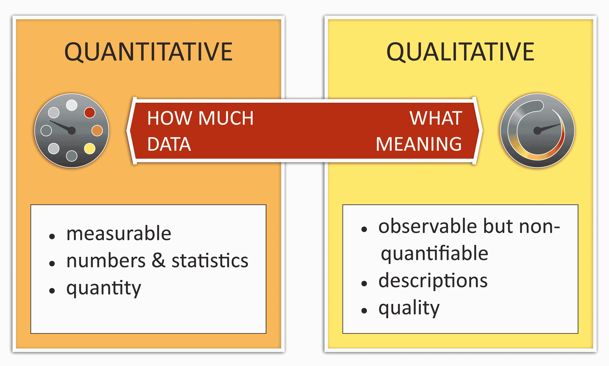

说明定量和定性分析之间差异的参考表

现在让我们来解决哪种类型的变量适合应用于回归问题的问题。

明确的答案是定量变量，因为数据分布的建模只能通过我们用来检测这些变量之间的规则对应关系的函数来完成，而不是基于元素的类或类型。回归需要一个连续的输出变量，这只是定量指标的情况。

在定性变量的情况下，我们将数据分配给分类问题，因为它的定义就是搜索非数字标签或标记以分配给样本。这就是分类的使命，我们将在下一章看到。


# 线性回归

所以，是时候从最简单但仍然非常有用的数据抽象开始了——线性回归函数。

在线性回归中，我们试图找到一个线性方程来最小化数据点和建模线之间的距离。模型函数采用以下形式:

y[I]=σx[I]+α+ε[I]

这里， *α* 是截距，*和*是模型线的斜率。变量 *x* 通常称为自变量， *y* 通常称为因变量，但也可以称为回归变量和响应变量。

ε [i] 变量是一个非常有趣的元素，它是从样本 *i* 到回归线的误差或距离。

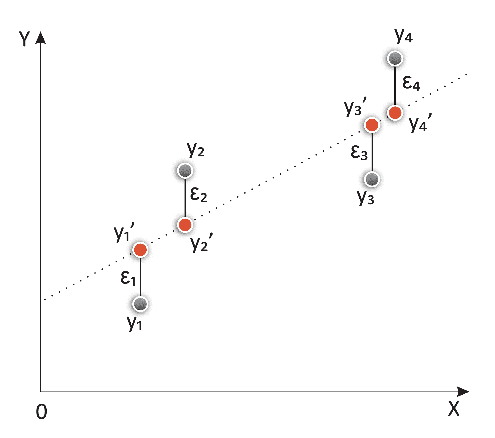

对回归线组成部分的描述，包括原始元素、估计元素(红色)和误差(ε)

所有这些距离的集合，以称为*成本*函数的函数形式计算，作为求解过程的结果，将为我们提供最小化成本的未知参数值。让我们开始工作吧。


# 成本函数的确定

与所有机器学习技术一样，学习的过程取决于最小化的损失函数，它向我们显示了我们在预测结果时的正确或错误程度，这取决于我们所处的学习阶段。

线性回归最常用的成本函数叫做*最小二乘法*。

为了简化起见，让我们用 2D 回归来定义这个成本函数，其中我们有一个数字元组列表 *(x [0] ，y [0] )* ， *(x [1] ，y [1] )* ... *(x [n] ，y [n] )* 和要查找的值，分别是*β[0]和*β[1]。在这种情况下，最小二乘成本函数可以定义如下:**

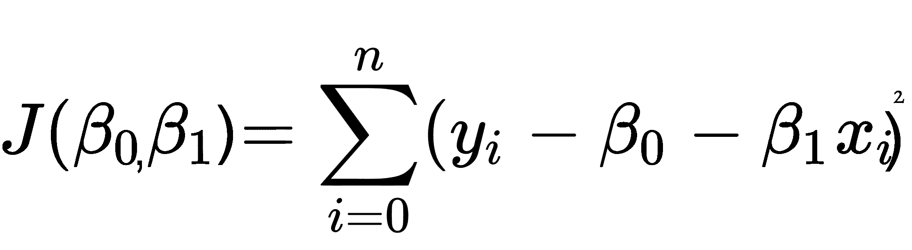

线性方程的最小平方函数，使用标准变量β [0] 和β [1] ，它们将在下一节中使用

每个元素的总和给出了一个唯一的全局数，它给出了所有值(y [i] )与我们的理想回归线中的对应点(β[0]+β1*x*[I])之间的总差异的全局概念。

这个操作的基本原理非常清楚:

*   求和给了我们一个唯一的全局数
*   差分模型-实点给我们的距离或 L1 误差
*   平方得到一个正数，这也以非线性方式惩罚距离，超过了一个错误的限制，所以我们犯的错误越多，我们就越愿意增加惩罚率

另一种表述方式是，此过程将最小化残差平方和，残差是我们从数据集获得的值与模型计算的预期值之间的差值，对于相同的输入值。


# 减少误差的许多方法

最小二乘误差函数有几种求解方法:

*   分析方法
*   使用协方差和相关值
*   机器学习方法家族中最熟悉的方法—梯度下降法


# 分析方法

为了得到精确解，分析方法采用了几种线性代数技术。

我们以非常简洁的方式介绍这项技术，因为它与我们在本书中讨论的机器学习技术没有直接关系。我们呈现它是为了完整性。

首先，我们以矩阵形式表示函数中的误差:

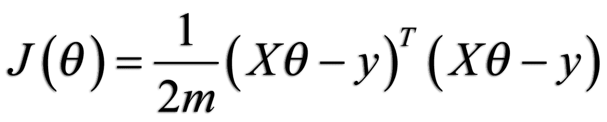

矩阵形式的线性回归方程的标准形

这里， *J* 是成本函数，并具有以下解析解:

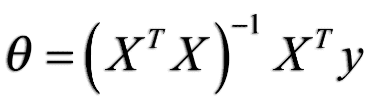

线性回归矩阵形式的解析解


# 分析方法的利弊

使用线性代数技术来计算最小误差解的方法是一种更简单的方法，因为我们可以给出一个非常简单的确定性表示，所以在应用运算后不需要额外的猜测。

但是这种方法可能存在一些问题:

*   首先，矩阵求逆和乘法是非常计算密集型的操作。它们通常有一个大约为 *O(n ²* *)* 到 *O(n ³ )* 的下界，所以当样本数量增加时，问题会变得棘手。
*   此外，根据具体实现，这种直接方法也可能具有有限的准确性，因为我们通常可以使用当前硬件浮点能力的限制。


# 协方差/相关方法

现在是时候介绍一种估计我们的回归线系数的新方法了，在这个过程中，我们将学习其他统计方法，如协方差和相关性，这也将有助于我们第一次分析数据集并得出我们的第一个结论。


# 协方差

**协方差**是一个统计术语，可以规范地定义如下:

一对随机变量之间系统关系的一种度量，其中一个变量的变化对应于另一个变量的相应变化。

协方差可以取-∞到+∞之间的任何值，其中负值表示负关系，而正值表示正关系。它还确定了变量之间的线性关系。

因此，当值为零时，表示没有直接的线性关系，并且这些值倾向于形成斑点状分布。

协方差不受度量单位的影响，即在改变单位时，两个变量之间的关系强度没有变化。然而，协方差的值会改变。它有以下公式，需要每个轴的平均值作为先决条件:

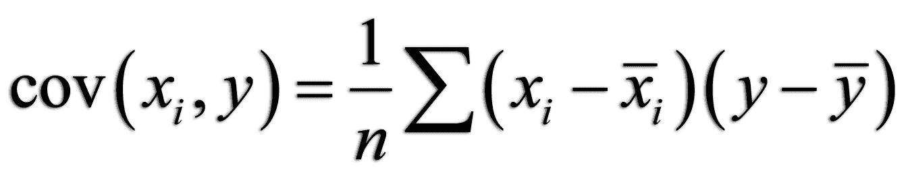

# 相互关系

还记得我们描述变量的规范化过程吗？我们通过减去平均值，并用数据集的标准偏差对变量进行缩放，使变量居中，公式如下:

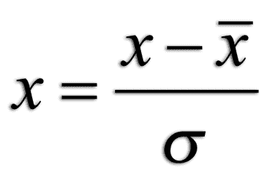

数据规范化操作的分析形式

这将是我们分析的起点，我们将用相关值将它扩展到每个轴。

相关值决定了两个或多个随机变量协同移动的程度。在研究两个变量的过程中，如果观察到一个变量的运动与另一个变量的等效运动一致，则称这些变量相关，确切的相关值由以下公式给出:

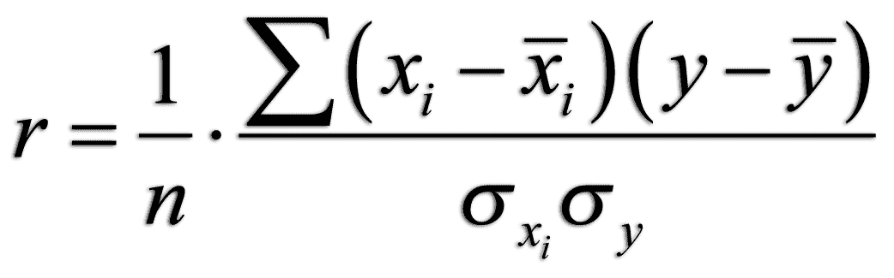

相关性的典型定义

作为一个真正的基于价值的指标，它可以有两种类型，积极或消极。当两个变量同向移动时，变量是正相关或直接相关的。当两个变量反向移动时，相关性为负或相反。

相关值在 *-1* 到 *+1* 之间，其中接近 *+1* 的值表示强正相关，接近 *-1* 的值表示强负相关；

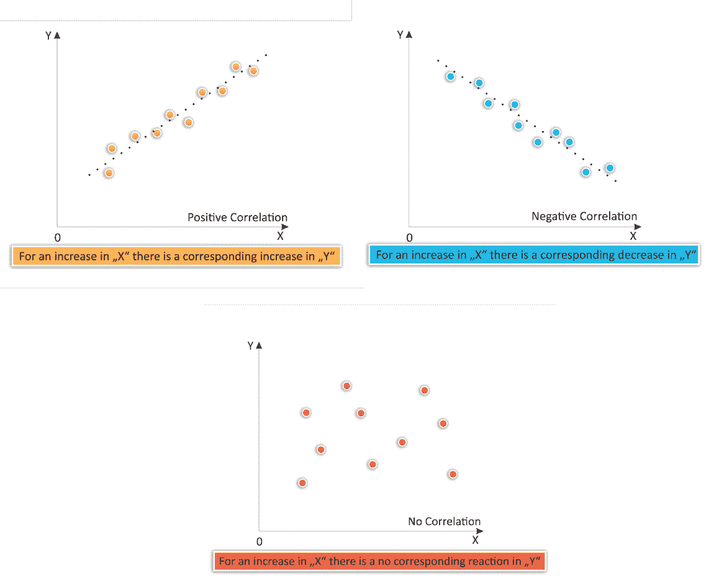

样本分布如何影响相关值的图形描述

还有其他测量相关性的方法。在本书中，我们将主要讨论线性相关性。还有其他研究非线性相关的方法，本书不会涉及。

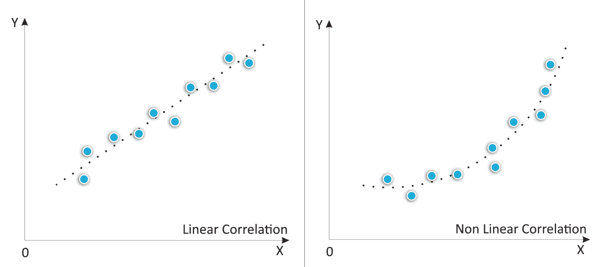

描述线性相关和非线性相关测量之间的差异

在本章的实际练习中，你会发现线性协方差和相关性的实现。


# 用协方差和相关性搜索斜率和截距

正如我们从一开始就知道的，我们需要的是找到一条线的方程，以下面的形式表示基础数据:

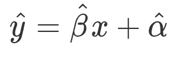

线性方程的近似定义

因为我们知道这条线通过所有点的平均值，我们可以估计截距，唯一未知的是估计的斜率:

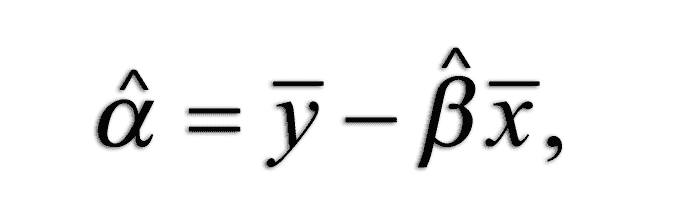

截距的导出定义

斜率代表因变量的变化除以自变量的变化。在这种情况下，我们处理的是数据的变化，而不是坐标之间的绝对差异。

由于数据具有非均匀性，我们将斜率定义为自变量中随因变量协变的方差的比例:

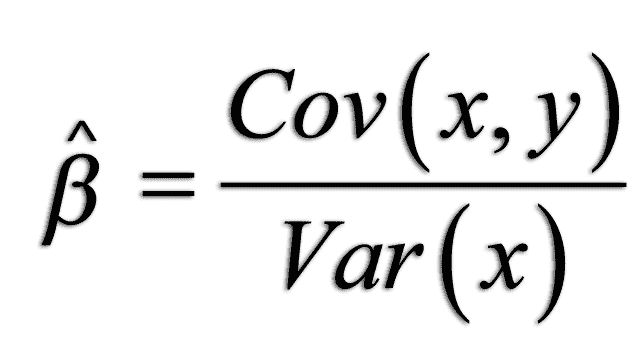

估计斜率系数

碰巧的是，如果我们的数据在绘制时实际上看起来像一个圆形云，我们的斜率将变成*零*，这表明 *x 和 *y* 、*的变化之间没有因果关系，如下表所示:

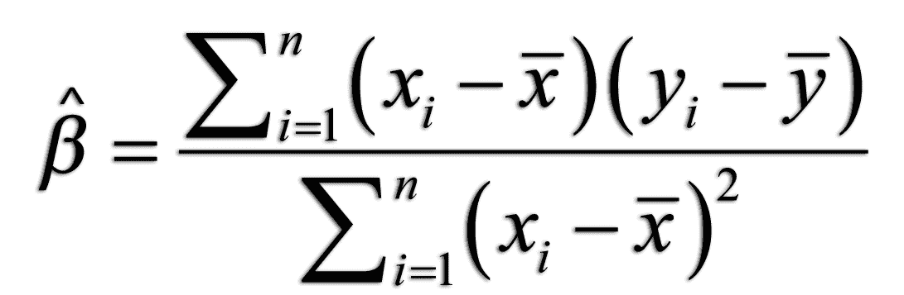

估计坡度系数的扩展形式

应用前面给出的公式，我们最终可以将估计回归线斜率的表达式简化为以下表达式:

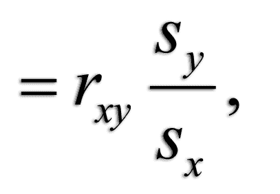

斜率系数的最终形式

这里，*S[y]是 *y* 中的标准差，*S[x]是 *x.* 中的标准差**

在等式中剩余元素的帮助下，我们可以基于线将到达平均数据集点的知识简单地导出截距:

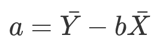

近似截距系数的最终形式

因此，我们完成了两种回归的初步形式的非常概括的表达，这也留下了许多分析元素供我们使用。现在是时候介绍当前机器学习技术的明星了，作为从业者，你肯定会在许多项目中使用它，称为**梯度下降**。


# 梯度下降

是时候谈谈将带我们进入现代机器学习核心的方法了。这里解释的方法将以类似的方式用于许多更复杂的模型，难度增加但原理相同。


# 一些直观的背景

为了介绍梯度下降法，我们首先来看看我们的目标——用一个直线函数来拟合一组提供的数据。我们有什么元素？

*   模型函数
*   误差函数

我们可以得到的另一个元素是任何参数组合的所有可能误差的表示。那会很酷，对吧？但是看看这样一个函数，对于一个简单的直线作为解的问题是什么样子的。这条曲线代表 *z= x ² + y ²* ，它遵循最小二乘误差函数的形式:

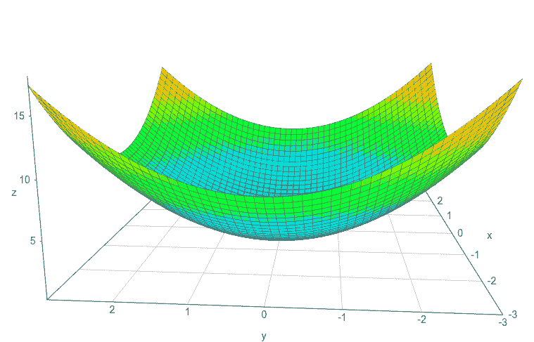

两个变量情况下的最小二乘误差曲面。在线性回归的情况下，它们是斜率和交点

如您所见，计算每行参数的所有可能结果会消耗太多的 CPU 时间。但是我们有一个优势:我们知道这样一条曲线的曲面是**c**onvex(超出本书范围的讨论)，所以它大致看起来像一个碗，而且它有一个唯一的最小值(如前一个文件夹所见)。这将省去我们定位局部点的问题，这些点看起来像最小值，但实际上只是表面上的凸起。


# 梯度下降循环

所以是时候寻找一种方法来收敛到一个函数的最小值，只知道我在曲面上的位置，可能还有我所站的曲面上的点的梯度:

*   从一个随机的位置开始(记住，我们对表面还一无所知)
*   寻找最大变化的方向(由于函数是凸的，我们知道它将引导我们到最小值)
*   在误差曲面上沿该方向前进，与误差量成比例
*   将下一步的起点调整到我们着陆的表面上的新点，并重复该过程

与蛮力方法相比，这种方法允许我们以迭代的方式在有限的时间内发现最小化我们的值的路径。

两个参数和最小二乘函数的过程如下:

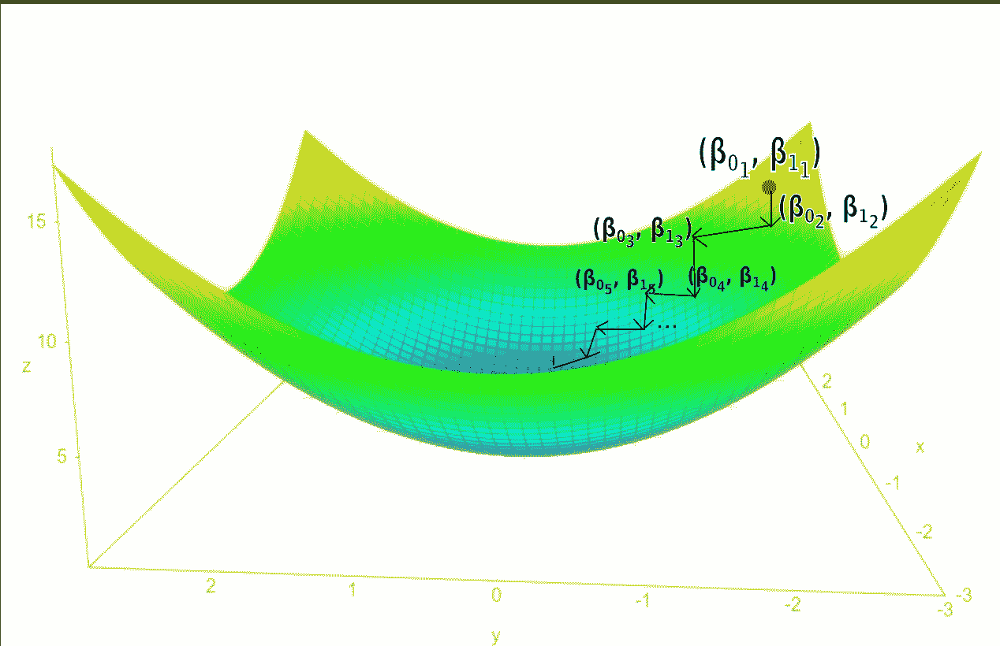

梯度下降算法的描述，从起始高误差点开始，向最大变化方向下降

当我们使用和选择好的和适当的初始参数时，这给我们一个过程函数在正常设置下如何工作的概念。

在接下来的章节中，我们将更详细地介绍梯度下降的过程，包括选择不同的元素(我们称之为超参数)如何改变过程的行为。


# 形式化我们的概念

现在让我们回顾一下这个过程的数学方面，这样在实际使用之前，我们就有了所有相关部分的参考。

我们方程的元素如下:

*   线性函数变量，*β*[0T5*β[1]*]
*   样本集中的样本数， *m*
*   样本集中的不同元素， *x ^((i))* 和 *y ^((i))*

让我们从误差函数开始， *J* 。它在前面的章节中被定义为最小二乘函数。为了实用，我们将在等式的开头添加 1/2m 项，如下所示:

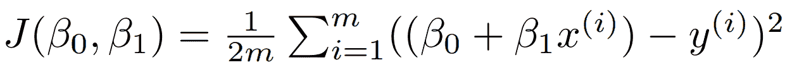

最小平方误差函数

下面介绍一个新的算子，它是后面所有工作的基础，梯度。

为了构建 it 概念，我们有以下内容:

*   一个或多个独立变量的函数
*   函数对所有自变量的偏导数

我们已经知道偏导数是如何工作的，只要说梯度是一个包含所有已经提到的偏导数的向量就足够了；在我们的例子中，它将如下:

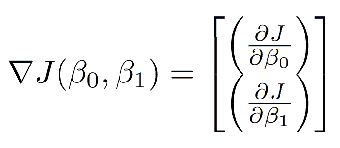

误差函数的梯度

这样的操作符目的是什么？如果我们能够计算它，它会给我们整个函数在单个点的变化方向。

首先，我们计算偏导数。你可以试着推导一下；基本上，它使用推导平方表达式的链式法则，然后乘以原始表达式。

在方程的第二部分，我们通过模型函数的名称来简化线性函数，*h[a]:*

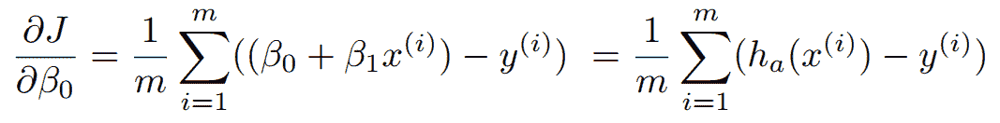

β [1] 变量的误差函数的偏导数

在 *β [1]* 的情况下，我们得到了 *x ^((i))* 元素的附加因子，因为*β[1]x*^(*(I)*)的导数是 *x ^((i))* :

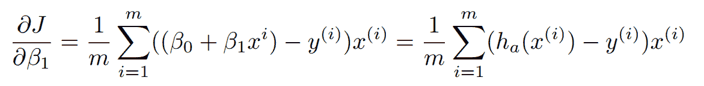

β [1] 变量的误差函数的偏导数

现在我们引入递归表达式，它将提供(迭代时和满足条件时)以收敛方式减少总误差的参数组合。

这里，我们引入一个非常重要的元素:步长，名为α。它的目的是什么？这将允许我们衡量一步能前进多少。我们会发现，没有选择合适的功率量会导致灾难性的后果，包括误差发散到无穷大。

注意，第二个公式只有乘以当前 *x* 值的微小差别:

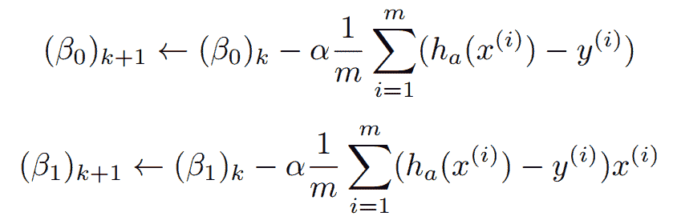

模型函数的递归方程

所以，我们准备好了！现在，我们将添加一点数学香料，以产生一个更紧凑的算法表示。现在让我们用向量的形式来表示未知量，所以所有的表达式将作为一个整体来表示:

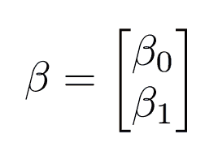

β在载体中的表达

有了这个新的表达式，我们的递归步骤可以用这个简单易记的表达式来表示:

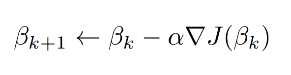

梯度下降递归的向量表示


# 将递归表示为一个过程

寻找最小误差的整个方法也可以用流程图来表示，这样我们就可以将所有元素放在同一个地方，并理解如果我们暂时不考虑有些复杂的分析机制，这看起来是多么容易:

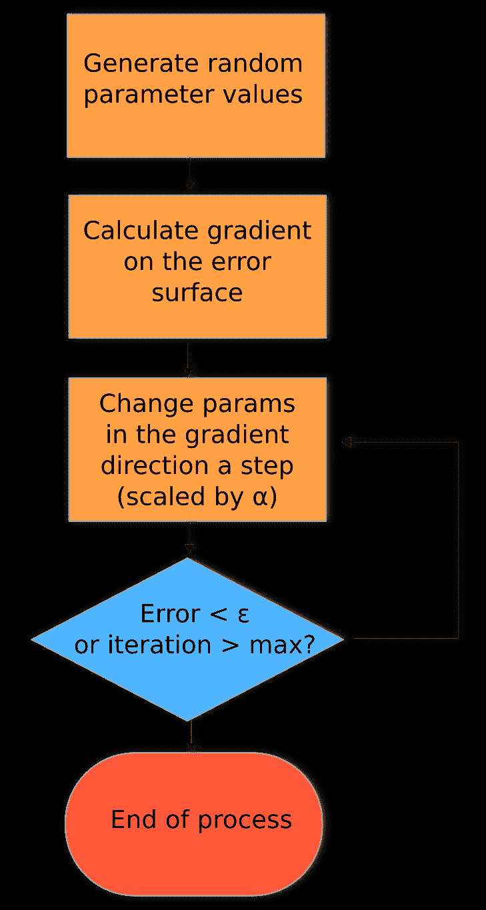

梯度下降法的流程图。请注意简单的构建模块，不要考虑它涉及的微妙数学

所以，有了梯度下降过程的最后一个程序性的观点，我们准备好继续本章更实际的部分。我们希望您喜欢这个寻找问题答案的旅程:以简单的方式表示我们的数据的最佳方式是什么？请放心，我们将在接下来的部分中使用更强大的工具。


# 走向实用——新方法的新工具

在本节中，我们将介绍一个新的库，它将帮助我们处理协方差和相关性，尤其是在数据可视化领域。

什么是 **Seaborn** ？

Seaborn 是一个用 Python 制作有吸引力和信息丰富的统计图形的库。此外，它还提供了非常有用的多元分析原语，这将帮助您决定是否以及如何对您的数据应用确定性回归分析。

Seaborn 提供的一些功能如下:

*   几个非常高质量的内置主题
*   用于选择调色板的工具，以制作揭示数据中模式的美丽绘图
*   非常重要的函数，用于可视化单变量和双变量分布，或者在数据子集之间进行比较
*   用于拟合和可视化不同种类自变量和因变量的线性回归模型的工具
*   当用最小的参数集调用时，试图做一些有用的事情的绘图函数；它们通过附加参数公开了许多可定制的选项

一个重要的附加特性是，鉴于 Seaborn 使用 matplotlib，可以使用这些工具进一步调整图形，并使用任何 matplotlib 后端进行渲染。

现在让我们来探索 Seaborn 将带来的最有用的实用程序。


# 变量探索的有用图表——成对图

对于数据探索阶段，我们可以采用的最有用的方法之一是对数据集中所有要素如何相互作用进行图形化描述，并以直观的方式发现联合变化:

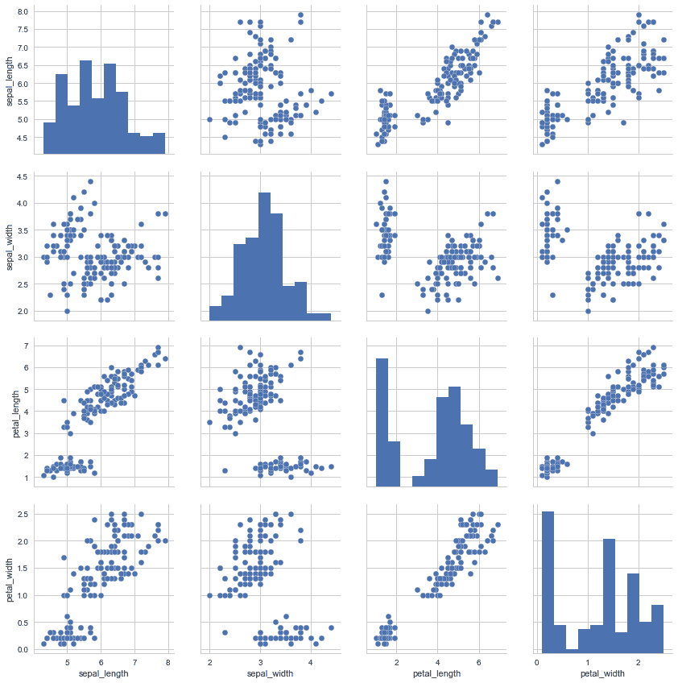

Iris 数据集中变量的配对图


# 相关图

相关图允许我们以更简洁的方式总结变量相关性，因为它使用调色板显示变量对之间的直接相关性。对角线值当然是 1，因为所有变量都与自身具有最大相关性:

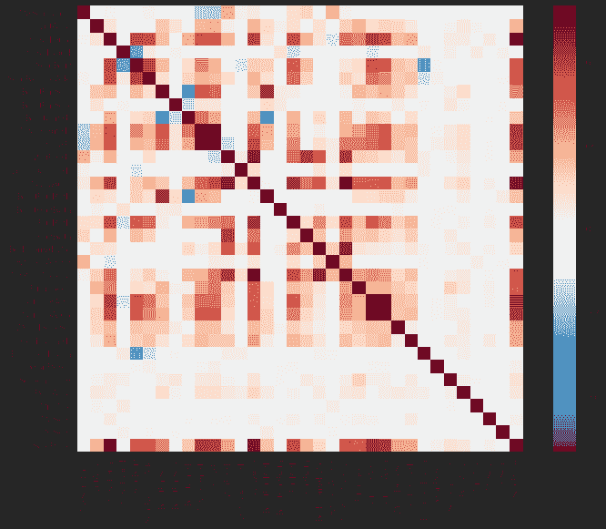

旧金山住房数据集的相关图。


# 实践中的数据探索和线性回归

在本节中，我们将开始使用最著名的 *toy* 数据集之一，探索它，并选择其中一个维度，以了解如何为其值构建线性回归模型。
让我们首先导入所有的库(`scikit-learn`、`seaborn`和`matplotlib`)；Seaborn 的一个优秀特性是它能够定义非常专业的样式设置。在这种情况下，我们将使用`whitegrid`样式:

```
import numpy as np from sklearn import datasets import seaborn.apionly as sns %matplotlib inline import matplotlib.pyplot as plt sns.set(style='whitegrid', context='notebook')
```


# 虹膜数据集

是时候加载*虹膜*数据集了。这是最著名的历史数据集之一。你会在许多书籍和出版物中找到它。鉴于数据的良好属性，它对于分类和回归示例非常有用。虹膜数据集([https://archive.ics.uci.edu/ml/datasets/Iris](https://archive.ics.uci.edu/ml/datasets/Iris))包含三种类型虹膜中每一种的 50 条记录，总共 150 条线超过 5 个字段。每条线都是以下各项的测量值:

*   萼片长度，单位为厘米
*   萼片宽度，单位为厘米
*   花瓣长度(厘米)
*   花瓣宽度(厘米)

最后一个字段是花的类型( *setosa* 、 *versicolor* 或 *virginica* )。让我们使用`load_dataset`方法从数据集中创建一个值矩阵:

```
iris2 = sns.load_dataset('iris')
```

为了理解变量之间的依赖关系，我们将实现协方差运算。它将接收两个数组作为参数，并将返回`covariance(x,y)`值:

```
def covariance (X, Y):
    xhat=np.mean(X)
    yhat=np.mean(Y)
    epsilon=0
    for x,y in zip (X,Y):
        epsilon=epsilon+(x-xhat)*(y-yhat)
    return epsilon/(len(X)-1)
```

让我们尝试一下实现的函数，并将其与 NumPy 函数进行比较。注意，我们计算了`cov(a,b)`，NumPy 生成了所有组合`cov(a,a)`、`cov(a,b)`的矩阵，所以我们的结果应该等于该矩阵的值`(1,0)`和`(0,1)`:

```
print (covariance ([1,3,4], [1,0,2]))
print (np.cov([1,3,4], [1,0,2]))

0.5
[[ 2.33333333  0.5       ]
 [ 0.5         1\.        ]]
```

对前面定义的相关函数做了最少量的测试后，接收两个数组，比如`covariance`，并使用它们获得最终值:

```
def correlation (X, Y):
    return (covariance(X,Y)/(np.std(X,  ddof=1)*np.std(Y,  ddof=1))) ##We have to indicate ddof=1 the unbiased std
```

让我们用两个样本数组测试这个函数，并将其与 NumPy 的相关矩阵的`(0,1)`和`(1,0)`值进行比较:

```
print (correlation ([1,1,4,3], [1,0,2,2]))
print (np.corrcoef ([1,1,4,3], [1,0,2,2]))

0.870388279778
[[ 1\.          0.87038828]
 [ 0.87038828  1\.        ]]
```


# 通过 Seaborn pairplot 获得直观的想法

开始处理一个问题时，一个非常好的想法是得到所有可能变量组合的图形表示。

Seaborn 的`pairplot`函数提供了所有变量对的完整图形摘要，表示为散点图，以及矩阵对角线的单变量分布的表示。

让我们看看这种绘图类型如何显示所有变量的相关性，并尝试寻找一种线性关系作为测试我们的回归方法的基础:

```
sns.pairplot(iris2, size=3.0)
<seaborn.axisgrid.PairGrid at 0x7f8a2a30e828>

```


数据集中所有变量的配对图。

让我们从最初的分析中选择两个变量，它们具有线性相关的性质。他们是`petal_width`和`petal_length`:

```
X=iris2['petal_width']
Y=iris2['petal_length']
```

现在让我们来看看这个变量组合，它显示了一个明显的线性趋势:

```
plt.scatter(X,Y)
```

这是所选变量在散点图中的表示:

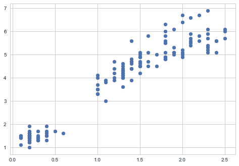

这是我们将尝试使用线性预测函数建模的当前数据分布。


# 创建预测函数

首先，让我们以线性函数的形式定义抽象表示建模数据的函数，其形式为 *y=beta*x+alpha* :

```
def predict(alpha, beta, x_i):
    return beta * x_i + alpha
```


# 定义误差函数

现在是定义函数的时候了，该函数将向我们展示训练期间预测和预期输出之间的差异。正如我们将在下一章深入解释的，我们有两个主要的选择:测量值之间的绝对差(或 L1)，或测量差的平方的变量(或 L2)。让我们定义两个版本，包括第二个版本中的第一个公式:

```
def error(alpha, beta, x_i, y_i): #L1
    return y_i - predict(alpha, beta, x_i)

def sum_sq_e(alpha, beta, x, y): #L2
    return sum(error(alpha, beta, x_i, y_i) ** 2
               for x_i, y_i in zip(x, y))
```


# 相关拟合

现在，我们将定义一个实现相关方法的函数，以找到我们回归的参数:

```
def correlation_fit(x, y):
    beta = correlation(x, y) * np.std(y, ddof=1) / np.std(x,ddof=1)
    alpha = np.mean(y) - beta * np.mean(x)
    return alpha, beta
```

然后让我们运行拟合函数并打印猜测的参数:

```
alpha, beta = correlation_fit(X, Y)
print(alpha)
print(beta)

1.08355803285
2.22994049512
```

现在让我们用数据绘制回归直线，以便直观地显示解决方案的适当性:

```
plt.scatter(X,Y)
xr=np.arange(0,3.5)
plt.plot(xr,(xr*beta)+alpha)
```

这是我们用最近计算的斜率和截距得到的最终图:

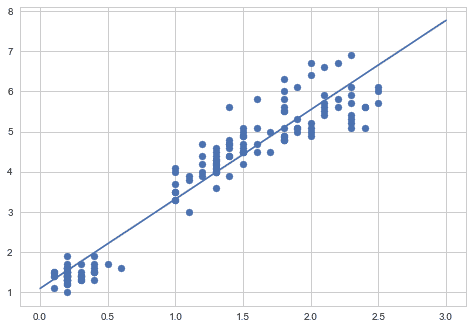

最终回归直线。


# 多项式回归以及欠拟合和过拟合介绍

在寻找模型时，我们寻找的一个主要特征是用简单的函数表达式进行概括的能力。当我们增加模型的复杂性时，我们可能正在构建一个对训练数据有益的模型，但对于特定的数据子集来说，它将过于优化。

另一方面，欠拟合适用于模型过于简单的情况，例如这种情况，可以用简单的线性模型很好地表示。

在下面的示例中，我们将像以前一样处理相同的问题，使用 scikit-learn 库搜索高阶多项式，以拟合越来越复杂的输入数据。

超出二次函数的正常阈值，我们将看到该函数如何拟合数据中的每一条皱纹，但当我们外推时，正常范围之外的值显然超出了范围:

```
from sklearn.linear_model import Ridge
from sklearn.preprocessing import PolynomialFeatures
from sklearn.pipeline import make_pipeline

ix=iris2['petal_width']
iy=iris2['petal_length']

# generate points used to represent the fitted function 
x_plot = np.linspace(0, 2.6, 100)

# create matrix versions of these arrays
X = ix[:, np.newaxis]
X_plot = x_plot[:, np.newaxis]

plt.scatter(ix, iy, s=30, marker='o', label="training points")

for count, degree in enumerate([3, 6, 20]):
    model = make_pipeline(PolynomialFeatures(degree), Ridge())
    model.fit(X, iy)
    y_plot = model.predict(X_plot)
    plt.plot(x_plot, y_plot, label="degree %d" % degree)

plt.legend(loc='upper left')
plt.show()
```

组合图显示了不同的多项式系数如何以不同的方式描述数据总体。20 次多项式清楚地显示了它如何完美地适应训练数据集，并且在已知值之后，它几乎惊人地发散，违背了对未来数据进行概化的目标。

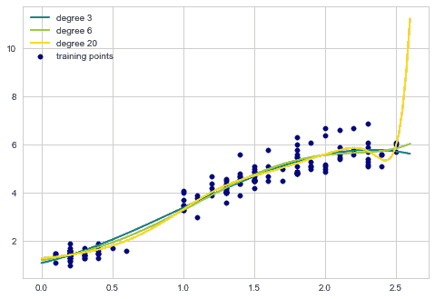

初始数据集的曲线拟合，具有递增值的多项式。


# 梯度下降线性回归在实践中的应用

所以现在我们第一次在实践中使用梯度下降技术！我们现在练习的概念将在本书的剩余部分很好地为我们服务。像往常一样，让我们从导入必备库开始。我们将使用 NumPy 进行数值处理，使用 Seaborn 和 matplotlib 进行表示:

```
import numpy as np
import seaborn as sns
%matplotlib inline
import matplotlib.pyplot as plt
sns.set(style='whitegrid', context='notebook')
```

损失函数将是我们知道我们做得有多好的向导。正如我们在理论部分看到的，将使用最小二乘法。

您可以查看前面章节中的 *J* 或损失函数定义和属性。

因此，这个`least_squares`函数将接收当前回归线参数， *b [0] 和 b [0] ，以及用于测量我们对现实的表示有多好的数据元素:*

```
def least_squares(b0, b1, points):
    totalError = 0
    N=float(len(points))
    for x,y in points:
        totalError += (y - (b1 * x + b0)) ** 2
    return totalError / 2.*N
```

这里，我们将定义循环的每个步骤。作为参数，我们将接收当前的 *b* [0] 和*b*1，用于训练模型的点数，以及学习率。在`step_gradient`函数的第五行，我们看到了两个梯度的计算，然后我们创建了`new_b0`和`new_b1`变量，在误差方向上更新它们的值，通过学习率进行缩放。在最后一行，我们返回更新的值和当前的误差水平，在所有的点都被用于梯度之后:

```
def step_gradient(b0_current, b1_current, points, learningRate):
    b0_gradient = 0
    b1_gradient = 0
    N = float(len(points))
    for x,y in points:
        b0_gradient += (1/N) * (y - ((b1_current * x) + b0_current))
        b1_gradient += (1/N) * x * (y - ((b1_current * x) + b0_current))
    new_b0 = b0_current + (learningRate * b0_gradient)
    new_b1 = b1_current + (learningRate * b1_gradient)
    return [new_b0, new_b1, least_squares(new_b0, new_b1, points)]
```

然后，我们定义一个函数，它将在模型之外运行完整的训练，这样我们就可以在一个地方检查所有的参数组合。该函数将初始化参数，并将梯度步骤重复固定次数:

```
def run_gradient_descent(points, starting_b0, starting_b1, learning_rate, num_iterations):
    b0 = starting_b0
    b1 = starting_b1
    slope=[]
    intersect=[]
    error=[]
    for i in range(num_iterations):
        b0, b1 , e= step_gradient(b0, b1, np.array(points), learning_rate)
        slope.append(b1)
        intersect.append(b0)
        error.append(e)
    return [b0, b1, e, slope, intersect,error]
```

当收敛速度很高时，这个过程可能被证明是低效的，浪费了宝贵的 CPU 迭代。一个更聪明的停止条件是添加一个可接受的误差值，这将停止迭代。

好了，是时候试试我们的模型了！让我们再次开始加载 Iris 数据集，以供参考，并作为检查结果正确性的一种手段。我们将使用`petal_width`和`petal_length`参数，我们已经看到并决定它们是线性回归的良好候选。NumPy 的`dstack`命令允许我们合并两列，我们将其转换为一个列表以丢弃列标题。唯一需要注意的是，结果列表有一个未使用的额外维度，我们使用`[0]`索引选择器将其丢弃:

```
iris = sns.load_dataset('iris')
X=iris['petal_width'].tolist()
Y=iris['petal_length'].tolist()
points=np.dstack((X,Y))[0]
```

所以，让我们用看起来很好的初始参数来尝试我们的模型，一个`0.0001`学习率，在`0`的初始参数，和`1000`迭代；让我们看看它是如何表现的:

```
learning_rate = 0.0001
initial_b0 = 0 
initial_b1 = 0 
num_iterations = 1000
[b0, b1, e, slope, intersect, error] = run_gradient_descent(points, initial_b0, initial_b1, learning_rate, num_iterations)

plt.figure(figsize=(7,5))
plt.scatter(X,Y)
xr=np.arange(0,3.5)
plt.plot(xr,(xr*b1)+b0);
plt.title('Regression, alpha=0.001, initial values=(0,0), it=1000');
```

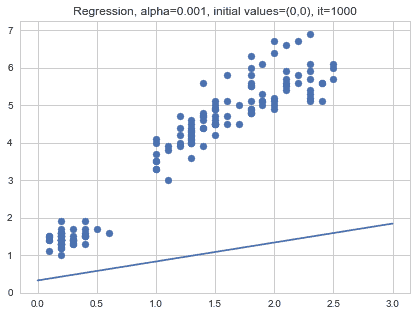

嗯，那就不好了；显然，我们还没有到那一步。让我们看看在训练过程中发生了什么错误:

```
plt.figure(figsize=(7,5))
xr=np.arange(0,1000)
plt.plot(xr,np.array(error).transpose());
plt.title('Error for 1000 iterations');
```

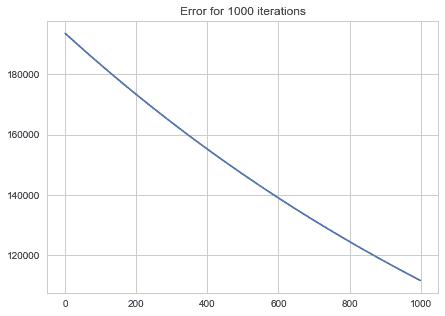

这个过程似乎在起作用，但是有点慢。也许我们可以尝试将步长增加 10 倍，看看它是否快速收敛？让我们检查一下:

```
learning_rate = 0.001 #Last one was 0.0001
initial_b0 = 0 
initial_b1 = 0 
num_iterations = 1000
[b0, b1, e, slope, intersect, error] = run_gradient_descent(points, initial_b0, initial_b1, learning_rate, num_iterations)
plt.figure(figsize=(7,5))
xr=np.arange(0,1000)
plt.plot(xr,np.array(error).transpose());
plt.title('Error for 1000 iterations, increased step by tenfold');

```

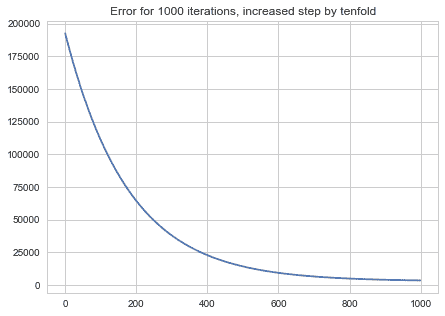

那更好！该过程收敛得更快。让我们看看现在回归的线是什么样子的:

```
plt.figure(figsize=(7,5))
plt.scatter(X,Y)
xr=np.arange(0,3.5)
plt.plot(xr,(xr*b1)+b0);
plt.title('Regression, alpha=0.01, initial values=(0,0), it=1000');
```

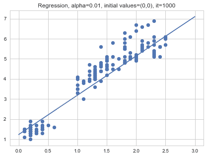

是啊！看起来好多了。我们可能认为我们已经完成了，但是开发人员总是想走得更快。让我们来看看如果我们想走得更快会发生什么，例如，一大步`2`:

```
learning_rate = 0.85 #LAst one was 0.0001
initial_b0 = 0 
initial_b1 = 0 
num_iterations = 1000
[b0, b1, e, slope, intersect, error] = run_gradient_descent(points, initial_b0, initial_b1, learning_rate, num_iterations)
plt.figure(figsize=(7,5))
xr=np.arange(0,1000)
plt.plot(xr,np.array(error).transpose());
plt.title('Error for 1000 iterations, big step');
```

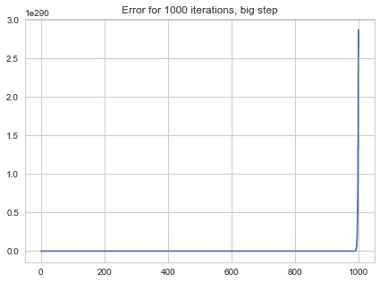

这是一个糟糕的举动；如你所见，误差最终趋于无穷大！这里发生了什么？简单地说，我们正在采取的步骤是如此激进，以至于我们没有切开我们之前描述的想象中的碗，我们只是在表面上跳来跳去，随着迭代的推进，我们开始不受控制地升级累积的错误。另一个可以采取的措施是提高我们的种子值，正如你已经看到的，它的值是`0`。对于这种技术来说，这通常是一个非常糟糕的想法，尤其是当您处理的数据没有被规范化的时候。还有更多原因，你可以在更高级的文献中找到。因此，让我们尝试在一个伪随机位置初始化参数，以使图形在代码示例中是相同的，看看会发生什么:

```
learning_rate = 0.001 #Same as last time
initial_b0 = 0.8 #pseudo random value
initial_b1 = 1.5 #pseudo random value
num_iterations = 1000
[b0, b1, e, slope, intersect, error] = run_gradient_descent(points, initial_b0, initial_b1, learning_rate, num_iterations)
plt.figure(figsize=(7,5))
xr=np.arange(0,1000)
plt.plot(xr,np.array(error).transpose());
plt.title('Error for 1000 iterations, step 0.001, random initial parameter values');
```

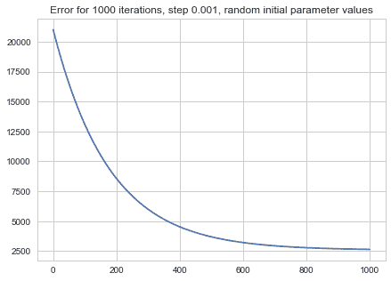

正如你所看到的，即使你有相同的草率错误率，初始误差值减少了 10 倍(从 2e5 到 2e4)。现在，让我们尝试最后一种技术，基于输入值的归一化来提高参数的收敛性。正如您在[第 2 章](fa27740b-e9e0-4ad1-ab13-dfe57b30a956.xhtml)、*中已经学习的，学习过程*包括对数据进行居中和缩放。该操作对数据有什么影响？使用图形图像，当数据未被归一化时，误差表面往往较浅，并且值振荡较大。归一化将该数据转换到更深的表面，具有更明确的朝向中心的梯度:

```
learning_rate = 0.001 #Same as last time
initial_b0 = 0.8 #pseudo random value
initial_b1 = 1.5 #pseudo random value
num_iterations = 1000
x_mean =np.mean(points[:,0])
y_mean = np.mean(points[:,1])
x_std = np.std(points[:,0])
y_std = np.std(points[:,1])

X_normalized = (points[:,0] - x_mean)/x_std
Y_normalized = (points[:,1] - y_mean)/y_std

plt.figure(figsize=(7,5))
plt.scatter(X_normalized,Y_normalized)

<matplotlib.collections.PathCollection at 0x7f9cad8f4240>
```

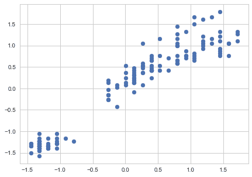

现在我们有了这组干净整洁的数据，让我们用最后的慢收敛参数再试一次，看看误差最小化速度会发生什么变化:

```
points=np.dstack((X_normalized,Y_normalized))[0]
learning_rate = 0.001 #Same as last time
initial_b0 = 0.8 #pseudo random value
initial_b1 = 1.5 #pseudo random value
num_iterations = 1000
[b0, b1, e, slope, intersect, error] = run_gradient_descent(points, initial_b0, initial_b1, learning_rate, num_iterations)
plt.figure(figsize=(7,5))
xr=np.arange(0,1000)
```

```
plt.plot(xr,np.array(error).transpose());
plt.title('Error for 1000 iterations, step 0.001, random initial parameter values, normalized initial values');
```

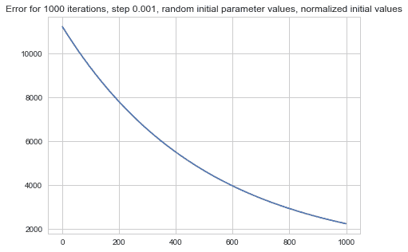

的确是一个很好的起点！仅仅通过标准化数据，我们就有了一半的初始误差值，在 1000 次迭代后，误差下降了 20%。我们唯一要记住的是，在我们有了结果之后，去规格化，才能有初始的规模和数据中心。这就是梯度下降的全部内容。我们将在接下来的章节中再次讨论新的挑战。


# 逻辑回归

这本书的方式是一种概括。在第一章中，我们从现实的更简单的表示开始，因此分组或预测信息结构的标准也更简单。

在回顾了线性回归(主要用于预测模型化线性函数后的真实值)之后，我们将进一步推广线性回归，这将允许我们从之前拟合的线性函数开始，分离二元结果(表明样本属于某个类别)。所以让我们从这项技术开始吧，它将在本书接下来的几乎所有章节中发挥重要作用。


# 线性回归和逻辑回归的问题域

为了直观地理解逻辑回归的问题域，我们将使用图形表示。

首先，我们展示了线性拟合函数，这是整个模型构建过程的主要目标，在底部，我们展示了目标数据分布。正如你清楚看到的，数据现在是二元的，一个样本属于一个或另一个选项，中间没有任何东西。此外，我们看到建模功能是一种新的类型；我们稍后将命名它并研究它的性质。你可能想知道这和线性函数有什么关系？正如我们稍后会看到的，它会在类 s 函数内部，调整它的形状。

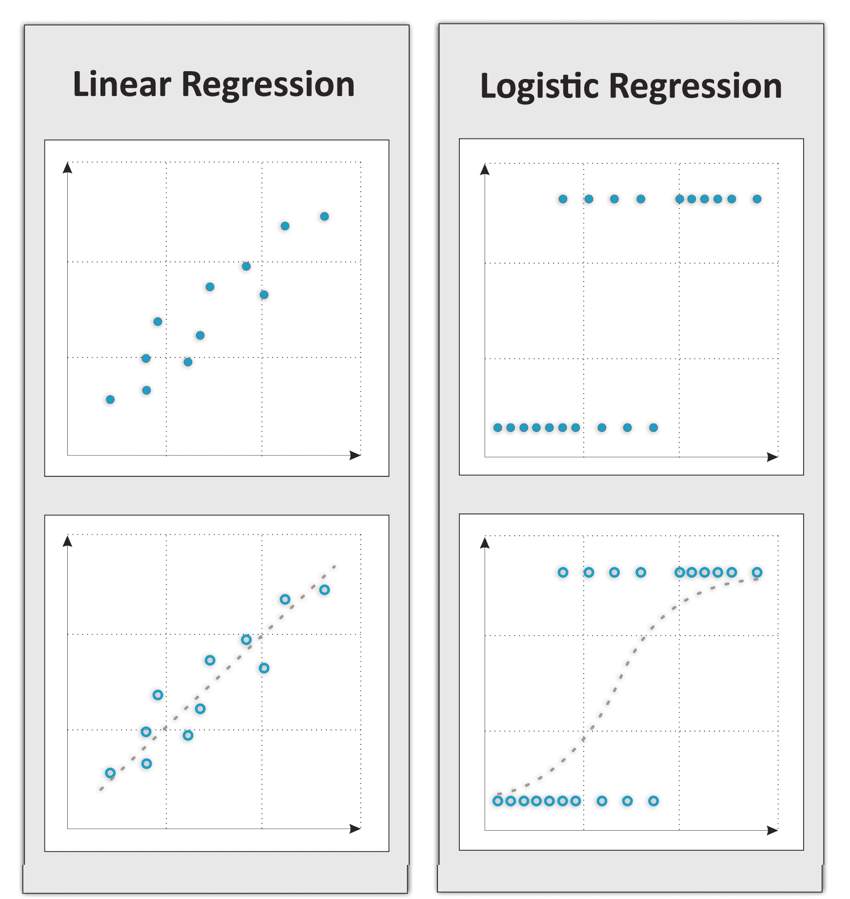

应用线性或逻辑回归的常见数据分布的简化描述。

总之，线性回归可以被想象成一个不断增长的值的连续体。另一个是基于 *x* 值的输出可以只有两个不同值的域。在图中所示的特殊情况下，随着自变量的增加，我们可以看到一个朝向可能结果之一的明显趋势，sigmoid 函数允许我们从两个结果转换，这两个结果在时间上没有明确的间隔，这为我们提供了非发生/发生区重叠区的估计概率。

在某些方面，该术语有点令人困惑，因为我们正在进行一个获得连续值的回归，但实际上，最终目标是为具有离散变量的分类问题构建一个预测。

这里的关键是理解我们将获得一个项目属于一个类的概率，而不是一个完全离散的值。


# 逻辑函数的前身 logit 函数

在我们研究逻辑函数之前，我们将回顾它所基于的原始函数，logit 函数，它赋予了它一些更一般的性质。

本质上，当我们谈论 logit 函数时，我们是在处理一个随机变量的函数*p*；更具体地说，对应于伯努利分布。


# 链接功能

当我们试图建立一个**广义线性模型**时，我们希望从一个线性函数开始，并从因变量获得一个概率分布的映射。

由于我们模型的输出类型是二元的，通常选择的分布是伯努利分布，倾向于逻辑函数的链接函数是 **logit 函数**。


# Logit 函数

我们可以利用的一个可能的变量是概率的自然对数，即 *p* 等于 1。该函数称为 logit 函数:

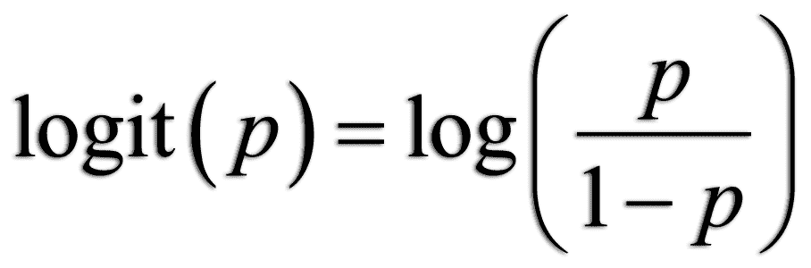

我们也可以将 logit 函数称为对数奇函数，因为我们正在计算给定概率 *p* 的概率 *(p/1-p)* 的对数。


# Logit 函数属性

因此，正如我们可以直观地推断的那样，我们用独立变量的组合来替换 *x* ，而不管它们的值是多少，并用从负无穷大到无穷大的任何值来替换 *x* 。我们正在将响应缩放到 *0* 和 *1* 之间。

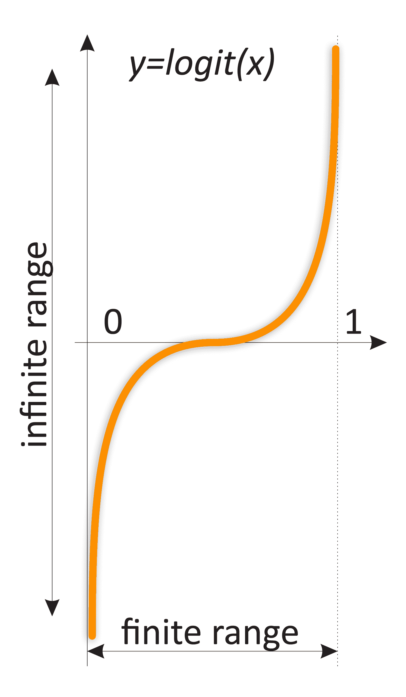

描述 logit 函数的主要范围特征


# logit 逆的重要性

假设我们计算 logit 函数的反函数。logit 的简单逆变换将给出以下表达式:

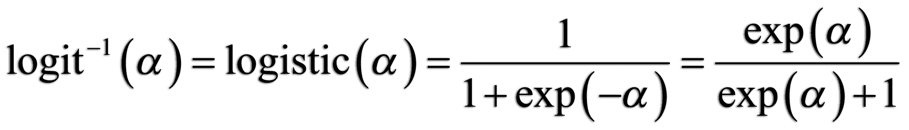

logit 函数的解析定义

这个函数不亚于一个 **sigmoid 函数**。


# 乙状结肠或逻辑函数

逻辑函数将表示我们在新的回归任务中表示的二元选项。逻辑函数定义如下(为清晰起见，将自变量从α改为 *t* ):

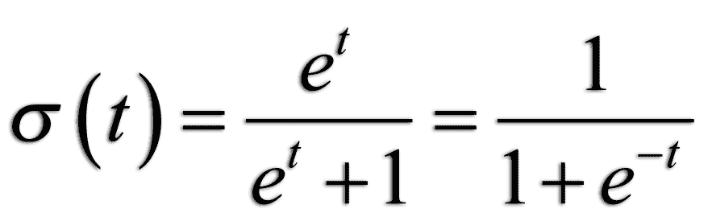

你会发现这个新的数字在下面的章节中很常见，因为它会非常频繁地被用作神经网络和其他应用程序的激活函数。在下图中，您将找到 sigmoid 函数的图形表示:

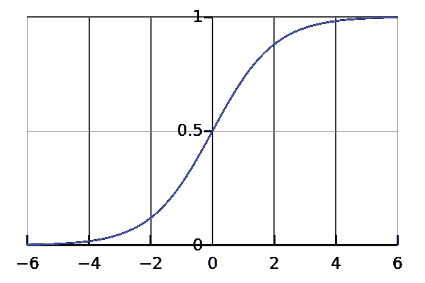Standard sigmoid

对于我们的建模任务，我们如何解释并赋予这个函数一个意义呢？这个方程通常的解释是 *t* 代表一个简单的自变量，但是我们将改进这个模型，假设 *t* 是单个解释变量 *x* 的线性函数(类似地处理 *t* 是多个解释变量的线性组合的情况)，表达如下:

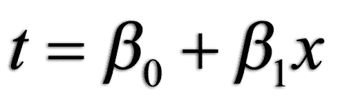

所以，我们可以从原始的 logit 方程重新开始:

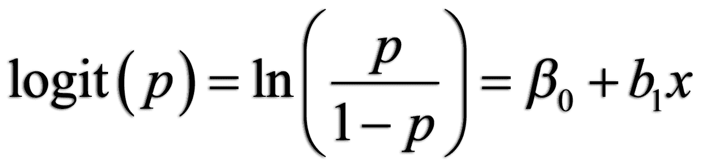

我们将到达回归方程，该方程将通过以下方程给出回归概率:

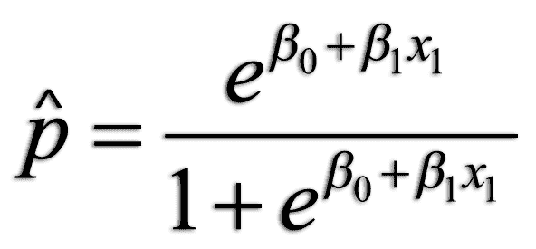

注意， *p* (hat)表示一个估计的概率。什么会给我们一个度量，我们有多接近解决方案？当然是精心选择的损失函数！

下图显示了如何从可能结果的无限域映射到最终缩减到*【0，1】*范围，其中 *p* 是所表示事件发生的概率。这显示在一个简单的模式中，该模式是 logit 函数的结构和域转换(从线性到由 Sigmoid 建模的概率):

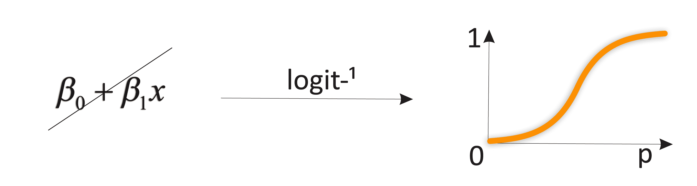

线性方程的对数的函数映射，产生 s 形曲线

什么变化会影响线性函数的参数？它们是将改变 sigmoid 函数的中心斜率和从零开始的位移的值，允许它更精确地减少回归值和真实数据点之间的误差。


# 逻辑函数的性质

函数空间中的每条曲线都可以用它可能应用的目标来描述。就后勤职能而言，它们如下:

*   根据一个或多个独立变量，对事件 *p* 的概率进行建模。例如，给定以前的资格，获得奖励的概率
*   估计(这是回归部分) *p* 对于确定的观察，与事件不发生的可能性有关。
*   使用二元响应预测独立变量变化的影响。
*   通过计算某个项目属于某个确定类别的概率来对观察结果进行分类。


# 多类应用–soft max 回归

到目前为止，我们一直是在只有两个类别的情况下进行分类，或者用概率语言来说，事件发生概率 *p* 。但是这种逻辑回归也可以方便地推广到许多类别。

正如我们之前看到的，在逻辑回归中，我们假设标签是二元的( *y(i)∈{0，1})* ，但是 softmax 回归允许我们处理 *y(i)∈{1，…，K}* ，其中 *K* 是类的数量，标签 *y* 可以采用 *K* 不同的值，而不是只有两个。

给定一个测试输入 *x* ，我们要估计 *k=1，…，K* 的每个值的 *P(y=k|x)* 的概率。softmax 回归将使该输出成为一个 *K* 维向量(其元素总和为 1)，从而给出我们的 *K* 估计概率:

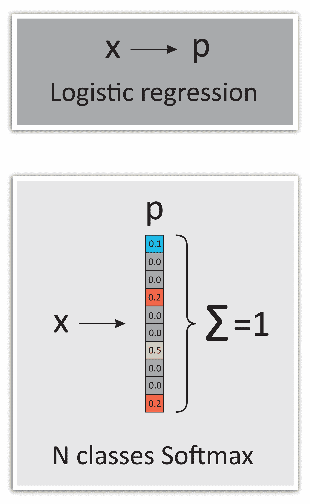

单变量逻辑回归结果与 N 类 softmax 回归结果的比较


# 实际例子——用逻辑回归进行心脏病建模

是时候在非常有用的逻辑回归的帮助下最终解决一个实际的例子了。在第一个练习中，我们将根据人群的年龄预测患冠心病的概率。很经典的问题，对于理解这类回归分析会是一个很好的开始。


# CHDAGE 数据集

对于第一个简单的例子，我们将使用一个非常简单且经常被研究的数据集，该数据集发表在*应用逻辑回归*中，来自 *David W. Hosmer* 、 *Jr. Stanley Lemeshow 和**Rodney x . Sturdivant*。我们在一项心脏病风险因素的假设性研究中列出了 100 名受试者的年龄(`AGE`)以及是否存在明显的**冠心病** ( **CHD** )。该表还包含一个标识符变量(`ID`)和一个年龄组变量(`AGEGRP`)。

结果变量是`CHD`，用值`0`编码表示`CHD`不存在，或`1`表示在个体中存在。一般来说，可以使用任何两个值，但是我们发现使用 0 和 1 最方便。我们将这个数据集称为`CHDAGE`数据。


# 数据集格式

`CHDAGE`数据集是一个两列的 CSV 文件，我们将从外部存储库下载它。在第一章中，我们使用本地 TensorFlow 方法读取数据集。在这一章中，我们将选择使用一个互补的和流行的库来获取数据。这一新增加的原因是，鉴于数据集只有 100 个元组，只在一行中读取它是可行的，而且，我们可以从 pandas 库中免费获得简单而强大的分析方法。

在这个项目的第一阶段，我们将开始加载一个`CHDAGE`数据集的实例。然后，我们将打印关于数据的重要统计数据，然后进行预处理。在对数据做了一些绘图后，我们将建立一个由激活函数组成的模型，这将是一个 softmax 函数，用于它成为标准逻辑回归的特殊情况，即当只有两个类别(疾病的存在与否)时。

让我们从导入所需的库开始:

```
import numpy as np
import pandas as pd
from sklearn import datasets
from sklearn import linear_model
import seaborn.apionly as sns
%matplotlib inline
import matplotlib.pyplot as plt
sns.set(style='whitegrid', context='notebook')
```

让我们使用熊猫的`read_csv`从 CSV 原始文件中读取数据集，并使用 matplotlib 的散点函数绘制数据分布。正如我们所看到的，随着年龄的增长，心脏病的出现有一个明确的模式:

```
df = pd.read_csv("data/CHD.csv", header=0)
plt.figure() # Create a new figure
plt.axis ([0,70,-0.2,1.2])
plt.title('Original data')
plt.scatter(df['age'],df['chd']) #Plot a scatter draw of the random datapoints
```

这是当前绘图的原始数据:

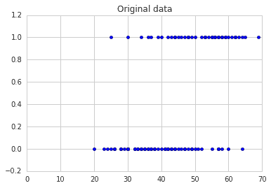

现在，我们将使用 scikit-learn 中的逻辑回归对象创建一个逻辑回归模型，然后我们将调用`fit`函数，该函数将创建一个优化的 sigmoid 来最小化我们的训练数据的预测误差:

```
logistic = linear_model.LogisticRegression(C=1e5)
logistic.fit(df['age'].reshape(100,1),df['chd'].reshape(100,1))

LogisticRegression(C=100000.0, class_weight=None, dual=False,
          fit_intercept=True, intercept_scaling=1, max_iter=100,
          multi_class='ovr', n_jobs=1, penalty='l2', random_state=None,
          solver='liblinear', tol=0.0001, verbose=0, warm_start=False)
```

现在是表现结果的时候了。这里，我们将生成一个从 10 年到 90 年的线性空间，有 100 个细分。

对于领域的每个样本，我们将显示出现的概率(1)和不出现的概率(0，或前一个的倒数)。

此外，我们将显示预测和原始数据点，这样我们就可以在单个图形中匹配所有元素:

```
x_plot = np.linspace(10, 90, 100)
oneprob=[]
zeroprob=[]
predict=[]
plt.figure(figsize=(10,10))
for i in x_plot:
    oneprob.append (logistic.predict_proba(i)[0][1]);
    zeroprob.append (logistic.predict_proba(i)[0][0]);
    predict.append (logistic.predict(i)[0]);

plt.plot(x_plot, oneprob);
plt.plot(x_plot, zeroprob)
plt.plot(x_plot, predict);
plt.scatter(df['age'],df['chd'])
```

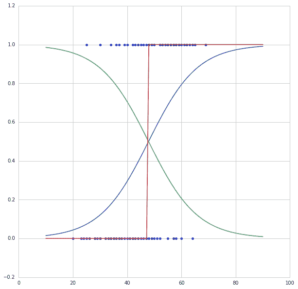

原始数据分布、建模逻辑曲线及其倒数的同步绘图


# 摘要

在这一章中，我们回顾了使用简单明确的函数来处理数据建模问题的主要方法。

在下一章中，我们将使用更复杂的模型，这些模型可以达到更高的复杂性并处理更高层次的抽象，对于最近出现的令人惊讶的各种数据集非常有用，从简单的**前馈网络**开始。


# 参考

弗朗西斯·高尔顿(Galton，Francis)，*世袭地位的退化。*《大不列颠及爱尔兰人类学研究所杂志》15 卷(1886): 246-263 页。

沃克、斯特罗瑟 h .和戴维 b .邓肯，*将一个事件的概率估计为几个独立变量的函数。生物计量学 54.1-2 (1967): 167-179。*

戴维·R·考克斯，*二元序列的回归分析。*《皇家统计学会杂志》。系列 B(方法论)(1958): 215-242。**