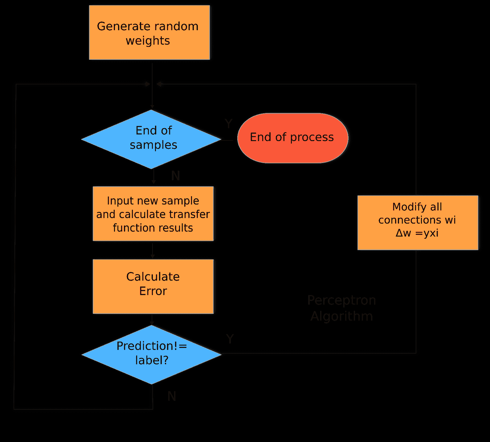

# 五、神经网络

作为一名开发人员，你肯定会对机器学习产生兴趣，因为你每天都会在普通设备上看到令人难以置信的惊人应用——自动语音翻译、图片风格转换、从样本图片生成新图片的能力，等等。振作起来...我们正直接进入使所有这些成为可能的技术领域。

线性和逻辑模型(如我们观察到的模型)在训练数据集的复杂性方面有一定的局限性，即使它们是非常清晰有效的解决方案的基础。

一个模型要有多复杂才能捕捉到一个作者的写作风格，一个猫和一只狗的图像的概念，或者一种植物基于视觉元素的分类？这些事情需要大量低级和高级细节的总和，在我们的大脑中是通过专门的神经元组，在计算机科学中是通过神经模型。

与预期相反，在本书中，我将省略对神经系统、其功能、神经系统中神经元的数量、其化学性质等的典型介绍。我发现这些主题给问题增加了一种不可能的气氛，但我们将要学习的模型是简单的数学方程，带有计算的对应项，我们将试图强调这一点，以便让您，一个对算法感兴趣的人，轻松理解它们。

在本章中，我们将讨论以下主题:

*   神经模型的历史，包括感知器和 ADALINE
*   神经网络和它们所解决的问题
*   多层感知器
*   实现一个简单的神经层来模拟一个二元函数

本章将允许你使用你每天看到的大多数令人敬畏的机器学习应用的构建模块。所以，让我们开始吧！


# 神经模型的历史

神经模型，从试图构建大脑内部工作表现的学科的意义上来说，起源于计算机科学的时间尺度相当遥远。它们甚至可以追溯到 20 世纪 40 年代中期现代计算机发明的时候。

那时，神经科学和计算机科学领域开始合作，从其组成单位——神经元开始，研究模拟大脑处理信息的方式。

代表人脑学习功能的第一个数学方法可以归于麦卡洛克和皮茨，他们在 1943 年的论文*中提出了神经活动中固有的逻辑思想演算:*


麦卡洛克和皮茨模型

这个简单的模型是学习算法的一个基本但现实的模型。如果我们用一个线性函数作为传递函数，你会惊讶会发生什么；这是一个简单的线性模型，就像我们在上一章看到的一样。

您可能已经注意到，我们现在使用`w`字母来指定模型要调整的参数。从此以此为新标准。线性回归模型中的旧参数`β`现在将是`w`。

但是这个模型还没有确定调整参数的方法。让我们回到 20 世纪 50 年代，回顾一下**感知机**模型。


# 感知器模型

感知器模型是实现人工神经元的最简单的方法之一。它最初是在 20 世纪 50 年代末开发的，第一次硬件实现是在 20 世纪 60 年代。先是一个机器的名字，后来变成了一个算法的名字。是的，感知机并不是我们一直认为的奇怪实体，它们是你作为开发人员每天处理的东西——算法！

让我们看看下面的步骤，并了解它是如何工作的:

1.  用随机(低值)分布初始化权重。
2.  选择一个输入向量并将其呈现给网络。
3.  针对指定的输入向量和权重值，计算网络的输出*y’*。

感知器的功能如下:


4.  如果 *y' ≠ y* ，通过添加变更*δw = yxi*来修改所有连接 *wi* 。
5.  返回到*步骤 2* 。

它基本上是一种学习二进制分类函数并将真实函数映射到单个二进制函数的算法。

让我们在下图中描绘感知器的新架构并分析算法的新方案:


感知器模型(突出显示与以前模型的变化)

感知器建立在它的前辈的思想之上，但是这里的新颖之处在于我们添加了一个适当的学习机制！在下图中，我们突出显示了模型的新属性，即反馈循环，在该循环中，我们计算结果的误差，并使用预先确定的公式调整权重:



感知器算法流程图


# 改进我们的预测 ADALINE 算法

ADALINE 是另一种用来训练神经网络的算法(没错，记得我们说的是算法)。ADALINE 在某些方面比感知器更先进，因为它增加了一种新的训练方法:梯度下降，现在你应该知道了。此外，它还改变了激活输出应用于权重求和之前的误差测量点:


Adaline 模型(突出显示了感知器添加的内容)

因此，这是以结构化方式表示 ADALINE 算法的标准方式。由于算法由一系列步骤组成，让我们以更详细的方式汇总这些步骤，并添加一些额外的数学细节:

1.  用随机(低值)分布初始化权重。
2.  选择一个输入向量并将其呈现给网络。
3.  针对指定的输入向量和权重值，计算网络的输出*y’*。
4.  我们将得到的输出值是求和后的值:

**y=Σ(xi * wi)**

5.  计算误差，将模型输出与正确的标签 *o* 进行比较:

*E=(o-y)²*

它看起来和我们已经看过的东西相似吗？是啊！我们基本上是在解决一个回归问题。

6.  使用以下梯度下降递归来调整权重:


7.  返回到*步骤 2* :


Adaline 算法流程图


# 感知器和 ADALINE 的异同

我们已经简单解释了现代神经网络的前身。正如你所看到的，现代模型的元素几乎都是在 20 世纪 50 年代和 60 年代布局的！在继续之前，让我们试着比较一下这些方法:

*   **相似之处**:
    *   它们都是算法(强调这一点很重要)
    *   它们适用于单层神经模型
    *   它们是用于二元分类的分类器
    *   两者都有一个线性决策边界
    *   两者都可以一个样本一个样本地迭代学习(自然是感知器，而 ADALINE 是通过随机梯度下降)
    *   两者都使用阈值函数
*   **差异**:
    *   感知器使用最终的类别决策来训练权重
    *   ADALINE 使用连续的预测值(来自净输入)来学习模型系数，并使用连续的浮点等级而不是布尔或整数来测量误差的细微变化

在我们完成单层架构和模型之前，我们将回顾一下 20 世纪 60 年代末的一些发现，这些发现在神经模型社区引起了轩然大波，据说产生了第一个人工智能冬天，或者说对机器学习研究的兴趣突然崩溃。令人高兴的是，几年后，研究人员找到了克服他们面临的限制的方法，但这将在本章中进一步讨论。


# 早期模型的局限性

这个模型本身现在拥有任何正常神经模型的大部分元素，但是它有自己的问题。经过几年的快速发展，Minsky 和 Papert 于 1969 年出版了《感知机》*P*er ceptrons,这本书在该领域引起了轰动，因为它的主要思想是感知机只能处理线性可分问题，而这些问题只是从业者认为可以解决的问题中非常小的一部分。从某种意义上说，这本书表明，除了最简单的分类任务之外，感知机几乎毫无用处。

这个新发现的缺陷可以通过模型不能表示 XOR 函数来表示，XOR 函数是一个`Boolean`函数，当输入不同时输出`1`，当输入相等时输出`0`:


XOR 函数的建模问题。没有任何一行能正确区分 0 和 1 值

正如我们在前面的图表中看到的，主要问题是两个类(十字和点)都不是线性可分的；也就是说，我们不能用平面上的任何一个线性函数把两者分开。

这个发现的问题导致该领域的活动减少，持续了大约五年，直到 20 世纪 70 年代中期开始开发反向传播算法。


# 单层和多层感知器

现在我们将讨论更现代的时代，在先前概念的基础上，允许更复杂的现实元素被建模。

在本节中，我们将直接研究最常用的配置**多层感知器** ( **多层感知器**)，并将考虑一个**单层感知器**作为前者的特例，突出区别。

单层和多层感知器是 20 世纪 70 年代和 80 年代最常用的架构，在神经系统的能力方面提供了巨大的进步。他们带来的主要创新如下:

*   它们是前馈网络，因为计算从输入开始，从一层流到另一层，没有任何循环(信息从不返回)
*   他们使用反向传播方法来调整他们的权重
*   使用`step`函数作为传递函数被非线性函数所取代，如 sigmoid 函数


# MLP 起源

在探索了单个单元神经模型的能力之后，一个明显的步骤是生成通常连接的单元的层或集合(我们将连接定义为将一个单元的输出作为另一个单元的总和的一部分进行发送的行为):


简单多层前馈神经网络的描述


# 前馈机制

在网络运行的这一阶段，数据将在第一层输入，并从每个单元流向随后各层的相应单元。然后在隐藏层进行求和传递，最后由输出层进行处理。这个过程完全是单向的，所以我们避免了数据流中的任何递归复杂性。

前馈机制在 MLP 建模过程的训练部分中有其对应部分，它将负责改进模型的性能。通常选择的算法被称为**反向传播**。


# 选择的优化算法–反向传播

从感知器算法开始，每种神经架构都有一种基于基础事实与模型输出的比较来优化其内部参数的方法。常见的假设是对(当时简单的)模型函数进行求导，并朝着最小值迭代工作。

对于复杂的多层网络，还有一个额外的开销，这与输出层的输出是一长串函数组合的结果有关，其中每一层的输出都由下一层的传递函数包裹。因此，输出的导数将涉及一个极其复杂的函数的导数。在这种情况下，反向传播方法被提出，并取得了良好的效果。

反向传播可以概括为一种用于计算导数的算法。主要属性是它的计算效率和复杂的功能。也是线性感知器中最小均方算法的推广，这个我们已经知道了！

在反向传播算法中，错误的责任将在应用于整个体系结构中的数据的所有函数之间分配。因此，目标是在一组深度复合函数上最小化误差，即损失函数的梯度，这将再次得到链式法则的帮助。

现在是时候按照以下步骤为我们的现代版神经网络定义通用算法了:

1.  计算从输入到输出的前馈信号。
2.  根据预测值*a[k]和目标值*t[k]计算输出误差 *E* 。**
3.  通过用先前层中的权重和相关激活函数的梯度对误差信号进行加权来反向传播误差信号。
4.  基于反向传播的误差信号和来自输入的前馈信号，计算参数的梯度𝛿 *E* /𝛿 *θ* 。
5.  使用计算的梯度 *θ ← θ - η* 𝛿E/𝛿θ *更新参数。*

现在让我们以图形方式回顾一下这一过程:


前馈和反向传播训练过程的逐步表示

在下图中，我们将用算法的方式来表示整个过程。您可以看到与之前的优化方法一致的数量，以及所涉及的少量计算块:


前馈/反向传播方案的流程图


# 需要解决的问题类型

神经网络可用于回归问题和分类问题。常见的架构差异存在于输出层:为了能够产生基于实数的结果，不应该应用任何标准化函数，如 sigmoid。通过这种方式，我们不会将变量的结果更改为许多可能的类值中的一个，而是得到一个可能结果的连续体。让我们来看看以下几类需要解决的问题:

*   **回归/函数逼近问题:**这类问题使用最小平方误差函数、线性输出激活和 sigmoidal 隐藏激活。这将给我们一个真实的输出值。
*   **分类问题(两个类，一个输出)**:在这类问题中，我们通常有一个交叉熵代价函数，一个 sigmoid 输出，和隐藏激活。sigmoid 函数将给出其中一类事件发生或不发生的概率。
*   **分类问题(多类，每类一个输出)**:在这类问题中，我们将有一个带有 softmax 输出和 sigmoid 隐藏激活的交叉熵成本函数，以便得到单个输入的任何可能类的概率输出。


# 用单层感知器实现一个简单的函数

看看下面的代码片段，用单层感知器实现一个函数:

```
    import numpy as np
    import matplotlib.pyplot as plt
    plt.style.use('fivethirtyeight')
    from pprint import pprint
    %matplotlib inline
    from sklearn import datasets
    import matplotlib.pyplot as plt
```


# 定义和绘制传递函数类型

仅在单变量线性分类器的帮助下，神经网络的学习特性不会很好。即使机器学习中的一些稍微复杂的问题也涉及多个非线性变量，因此开发了许多变体来替代感知器的传递函数。

为了表示非线性模型，可以在激活函数中使用许多不同的非线性函数。这意味着神经元对输入变量变化的反应方式会发生变化。在下面的章节中，我们将定义主要的不同传递函数，并通过代码来定义和表示它们。

在这一节中，我们将开始使用 Python 中的一些**面向对象编程** ( **OOP** )技术来表示问题域的实体。这将允许我们在示例中以更清晰的方式表示概念。

让我们从创建一个`TransferFunction`类开始，它将包含以下两个方法:

*   `getTransferFunction(x)`:该方法将返回一个由类类型决定的激活函数
*   `getTransferFunctionDerivative(x)`:这个方法显然会返回它的导数

对于这两个函数，输入将是一个 NumPy 数组，函数将逐个元素地应用，如下所示:

```
    >class TransferFunction:
        def getTransferFunction(x):
            raise NotImplementedError
        def getTransferFunctionDerivative(x):
            raise NotImplementedError
```


# 表示和理解传递函数

让我们看看下面的代码片段，看看传递函数是如何工作的:

```
    def graphTransferFunction(function):
        x = np.arange(-2.0, 2.0, 0.01)
        plt.figure(figsize=(18,8))
        ax=plt.subplot(121)
        ax.set_title(function.__name__)
        plt.plot(x, function.getTransferFunction(x))

        ax=plt.subplot(122)
        ax.set_title('Derivative of ' + function.__name__)
        plt.plot(x, function.getTransferFunctionDerivative(x))
```


# 乙状结肠或逻辑函数

sigmoid 或逻辑函数是规范激活函数，非常适合计算分类属性中的概率。首先，让我们准备一个函数，该函数将用于绘制所有传递函数及其导数，从`-2.0`到`2.0`的公共范围，这将允许我们看到它们围绕 *y* 轴的主要特征。
sigmoid 函数的经典公式如下:

```
    class Sigmoid(TransferFunction):  #Squash 0,1
        def getTransferFunction(x):
            return 1/(1+np.exp(-x))
        def getTransferFunctionDerivative(x):
        return x*(1-x)

    graphTransferFunction(Sigmoid)
```

请看下图:


# 玩乙状结肠

接下来，我们将做一个练习，了解 sigmoid 在乘以权重和偏移以适应最终函数的最小值时是如何变化的。然后，让我们首先改变单个乙状结肠的可能参数，并看到它拉伸和移动:

```
  ws=np.arange(-1.0, 1.0, 0.2)
    bs=np.arange(-2.0, 2.0, 0.2)
    xs=np.arange(-4.0, 4.0, 0.1)
    plt.figure(figsize=(20,10))
    ax=plt.subplot(121)
    for i in ws:
        plt.plot(xs,  Sigmoid.getTransferFunction(i *xs),label= str(i));
    ax.set_title('Sigmoid variants in w')
    plt.legend(loc='upper left');

    ax=plt.subplot(122)
    for i in bs:
        plt.plot(xs,  Sigmoid.getTransferFunction(i +xs),label= str(i));
    ax.set_title('Sigmoid variants in b')
    plt.legend(loc='upper left');
```

请看下图:


让我们来看看下面的代码片段:

```
    class Tanh(TransferFunction):  #Squash -1,1
        def getTransferFunction(x):
            return np.tanh(x)
        def getTransferFunctionDerivative(x):
            return np.power(np.tanh(x),2)
    graphTransferFunction(Tanh)
```

让我们来看看下图:


# 整流线性单位或 ReLU

**ReLU** 被称为校正线性单元，它的一个主要优势是不受消失梯度问题的影响，消失梯度问题一般由网络的第一层组成，这些层的值往往为零，或者是一个微小的ε:

```
    class Relu(TransferFunction):
        def getTransferFunction(x):
            return x * (x>0)
        def getTransferFunctionDerivative(x):
            return 1 * (x>0)
    graphTransferFunction(Relu)
```

让我们来看看下图:


# 线性传递函数

让我们看看下面的代码片段来理解线性传递函数:

```
    class Linear(TransferFunction):
        def getTransferFunction(x):
            return x
        def getTransferFunctionDerivative(x):
            return np.ones(len(x))
    graphTransferFunction(Linear)
```

让我们来看看下图:


# 定义神经网络的损失函数

正如机器学习中的每个模型一样，我们将探索我们将用来确定我们的预测和分类进行得有多好的可能函数。

我们要做的第一种区分是 L1 和 L2 误差函数类型。

L1，也称为**最小绝对偏差** ( **LAD** )或**最小绝对误差** ( **LAE** )，具有非常有趣的性质，它简单地由模型的最终结果和预期结果之间的绝对差组成，如下所示:


# L1 对 L2 房产公司

现在是时候对这两种损失函数进行面对面的比较了:

*   **稳健性** : L1 是一种更稳健的损失函数，可以表示为函数在受到离群值影响时的抵抗能力，将二次函数投影到非常高的值。因此，为了选择一个 L2 函数，我们应该进行非常严格的数据清理，以使其有效。
*   **稳定性**:稳定性属性评估对于一个大的误差值，误差曲线跳跃了多少。L1 更不稳定，特别是对于非标准化数据集(因为在`[-1, 1]`范围内的数字平方后会减少)。
*   **解的唯一性**:从它的二次性质可以推断，L2 函数确保我们在寻找最小值时有一个唯一的答案。L2 总是有一个独特的解决方案，但 L1 可以有许多解决方案，因为我们可以找到许多路径，与 L2 的单线距离相比，我们的模型具有分段线性函数形式的最小长度。

关于使用，过去属性的总和允许我们在正常情况下使用 L2 误差类型，特别是因为解的唯一性，这在开始最小化误差值时给了我们所需的确定性。在第一个例子中，出于教育目的，我们将从一个更简单的 L1 误差函数开始。

让我们通过绘制样本 L1 和 L2 损失误差函数的误差结果来探索这两种方法。在下一个简单的例子中，我们将向您展示这两种错误的不同性质。在前两个例子中，我们对`-1`和`1`之间的输入进行了标准化，然后使用该范围之外的值。

正如您所看到的，从样本`0`到`3`，二次误差稳步持续增加，但对于非标准化数据，它可能会爆炸，尤其是对于异常值，如以下代码片段所示:

```
    sampley_=np.array([.1,.2,.3,-.4, -1, -3, 6, 3])
    sampley=np.array([.2,-.2,.6,.10, 2, -1, 3, -1])

    ax.set_title('Sigmoid variants in b')
    plt.figure(figsize=(10,10))
    ax=plt.subplot()
    plt.plot(sampley_ - sampley, label='L1')
    plt.plot(np.power((sampley_ - sampley),2), label="L2")
    ax.set_title('L1 vs L2 initial comparison')
    plt.legend(loc='best')
    plt.show()
```

让我们来看看下图:


让我们以一个`LossFunction`类和一个`getLoss`方法的形式为 L1 和 L2 损失函数类型定义损失函数，接收两个 NumPy 数组作为参数，`y_`或估计函数值，`y`，期望值:

```
    class LossFunction:
        def getLoss(y_ , y ):
            raise NotImplementedError

    class L1(LossFunction):
        def getLoss(y_, y):
            return np.sum (y_ - y)

    class L2(LossFunction):
        def getLoss(y_, y):
            return np.sum (np.power((y_ - y),2))
```

现在是时候定义目标函数了，我们将它定义为一个简单的`Boolean`。为了加快收敛速度，第一个输入变量和函数结果之间将有直接关系:

```
    # input dataset
    X = np.array([  [0,0,1],
                    [0,1,1],
                    [1,0,1],
                    [1,1,1] ])

    # output dataset            
    y = np.array([[0,0,1,1]]).T
```

我们将使用的第一个模型是一个非常简单的神经网络，它有三个细胞，每个细胞都有一个权重，没有偏见，以便将模型的复杂性保持在最低水平:

```
    # initialize weights randomly with mean 0
    W = 2*np.random.random((3,1)) - 1
    print (W)
```

看一下运行上述代码生成的以下输出:

```
    [[ 0.52014909]
     [-0.25361738]
     [ 0.165037  ]]
```

然后，我们将定义一组变量来收集模型的误差、权重和训练结果进展:

```
    errorlist=np.empty(3);
    weighthistory=np.array(0)
    resultshistory=np.array(0)
```

然后是迭代误差最小化的时候了。在这种情况下，它将包括通过权重和神经元的传递函数将整个真实表馈送 100 次，在误差方向上调整权重。

请注意，该模型不使用学习率，因此它应该快速收敛(或发散):

```
    for iter in range(100):

        # forward propagation
        l0 = X
        l1 = Sigmoid.getTransferFunction(np.dot(l0,W))
        resultshistory = np.append(resultshistory , l1)

        # Error calculation
        l1_error = y - l1
        errorlist=np.append(errorlist, l1_error)

        # Back propagation 1: Get the deltas
        l1_delta = l1_error * Sigmoid.getTransferFunctionDerivative(l1)

        # update weights
        W += np.dot(l0.T,l1_delta)
        weighthistory=np.append(weighthistory,W)
```

让我们简单回顾一下最后的评估步骤，在`l1`打印输出值。现在我们可以看到，我们确实反映了原始函数的输出:

```
    print (l1)
```

看看下面的输出，它是通过运行前面的代码生成的:

```
    [[ 0.11510625]
     [ 0.08929355]
     [ 0.92890033]
     [ 0.90781468]]
```

为了更好地理解这一过程，让我们看看参数是如何随时间变化的。首先，让我们画出神经元权重。正如您所看到的，它们从随机状态到接受第一列的整个值(总是正确的)，到几乎第二列的`0`(有 50%的时间是正确的)，然后到第三列的`-2`(主要是因为它必须在表的前两个元素中触发`0`):

```
    plt.figure(figsize=(20,20))
    print (W)
    plt.imshow(np.reshape(weighthistory[1:],(-1,3))[:40], cmap=plt.cm.gray_r,     
    interpolation='nearest');
```

看看下面的输出，它是通过运行前面的代码生成的:

```
[[ 4.62194116]
 [-0.28222595]
 [-2.04618725]]
```

我们来看看下面的截图:


让我们也回顾一下我们的解决方案是如何发展的(在前 40 次迭代中)，直到我们到达最后一次迭代；我们可以清楚地看到向理想值的收敛:

```
    plt.figure(figsize=(20,20))
    plt.imshow(np.reshape(resultshistory[1:], (-1,4))[:40], cmap=plt.cm.gray_r,     
    interpolation='nearest');
```

我们来看看下面的截图:


我们可以看到误差在不同时期是如何演变并趋于零的。在这种情况下，我们可以观察到它从负到正摆动，这是可能的，因为我们首先使用了 L1 误差函数:

```
    plt.figure(figsize=(10,10))
    plt.plot(errorlist);
```

我们来看看下面的截图:


简单神经网络训练误差下降的描述


# 摘要

在这一章中，我们通过实现我们的第一个神经网络，朝着共同解决复杂问题迈出了非常重要的一步。现在，下面的架构将有熟悉的元素，我们将能够把本章学到的知识推广到新的架构。

在下一章中，我们将探索更复杂的模型和问题，使用更多的层和特殊的配置，如卷积层和漏失层。


# 参考

参考以下内容:

*   麦卡洛克、沃伦和沃尔特·皮茨。神经活动中固有观念的逻辑演算。数学生物物理学通报 5.4 (1943): 115-133。克莱尼，斯蒂芬·科尔。神经网络和有限自动机中事件的表示。不兰德-RM-704。兰德项目空军圣莫尼卡加州，1951 年。
*   法利、B. W. A. C .和 w .克拉克*、*、*用数字计算机模拟自组织系统。*信息理论 IRE 专业组汇刊 4.4 (1954): 76-84。
*   弗兰克·罗森布拉特*，《感知机:大脑中信息存储和组织的概率模型》，*《心理学评论》65.6 (1958): 386。罗森布拉特，弗兰克。x.
*   神经动力学原理:感知器和大脑机制理论。斯巴达图书，华盛顿 DC，1961 年
*   Werbos，P.J. (1975)，*超越回归:行为科学中预测和分析的新工具。*
*   普莱森特、佛朗哥·p 和迈克尔·伊恩·沙莫斯*。“引言。”计算几何。斯普林格纽约，1985 年。1-35.*
*   鲁梅尔哈特，大卫 e，杰弗里 e 辛顿，和罗纳德 J *，威廉姆斯。通过误差传播学习内部表征。不 ICS-8506。加州大学圣地亚哥分校认知科学研究所，1985 年。*
*   鲁梅尔哈特、詹姆士·l·麦克莱兰和 PDP 研究组。*并行分布式处理:认知微观结构的探索，第 1 卷:基础。麻省理工学院出版社，1986 年。*
*   Cybenko，G. 1989 *。控制、信号和系统的数学，2(4)，303–314。*
*   菲昂·默塔赫*。用于分类和回归的多层感知器。神经计算 2.5 (1991): 183-197。*
*   Schmidhuber，于尔根*。神经网络中的深度学习:综述。神经网络 61 (2015): 85-117。*