# 递归神经网络

在我们回顾了深度学习的最新发展之后，我们现在正在进入机器学习的前沿，我们现在正在通过一系列称为**递归神经网络(RNNs)** 的算法，为我们的模型添加一个非常特殊的维度(时间，以及输入序列)。


# 用顺序解决问题— RNNs

在前面的章节中，我们研究了许多模型，从简单的到更复杂的，都有一些共同的属性:

*   他们接受独特和孤立的输入
*   他们有独特的和固定大小的输出
*   输出将完全取决于当前的输入特性，而不依赖于过去或先前的输入

在现实生活中，大脑处理的信息片段具有内在的结构和顺序，我们感知的每一个现象的组织和顺序都影响着我们如何对待它们。这方面的例子包括语音理解(句子中单词的顺序)、视频序列(视频中帧的顺序)和语言翻译。这促使了新模型的产生。最重要的被归入 RNN 旗下。


# RNN 定义

rnn 是**人工神经网络** ( **ANN** )模型，其输入和输出是序列。更正式的定义可以表述如下:

“RNN 表示具有固定维度的高维向量(称为隐藏状态)的序列，该序列使用复杂的非线性函数合并新的观察值。”

rnn 具有很强的表达能力，可以实现任意内存受限的计算，因此，它们可以被配置为在困难的序列任务上实现不平凡的性能。


# 要建模的序列类型

rnn 在输入和输出领域都使用序列模型。基于此，我们可以有所有可能的组合来解决不同种类的问题。在下图中，我们展示了该领域中使用的主要架构，以及递归架构的参考:

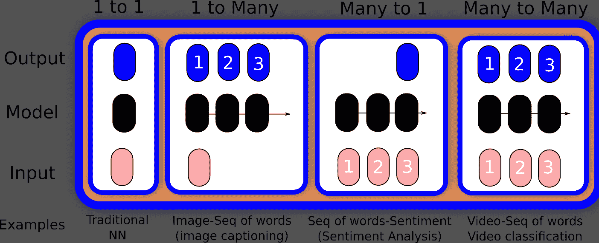

序列模式的类型


# RNN 的发展

RNNs 的起源与其他现代神经网络体系结构惊人地相似，可以追溯到 20 世纪 80 年代的 Hopfield 网络，但在 20 世纪 70 年代出现了对等物。

递归架构的第一次迭代的通用结构可以用以下方式表示:

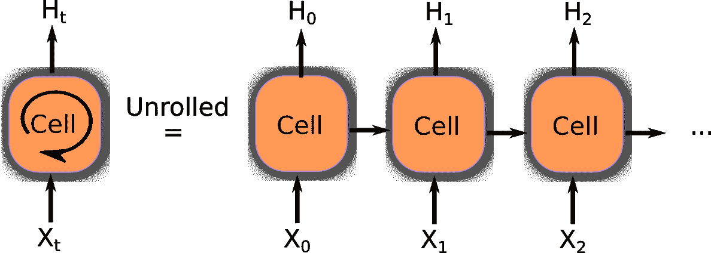

周期性细胞展开

经典的 RNN 节点与自身之间有循环连接，因此它们可以随着输入序列的进展而进化自己的权重。此外，在图的右侧，您可以看到网络如何能够*展开*以基于其内部保存的随机模型生成一组输出。它以激活的形式存储最近输入事件的表示(**短期记忆**，与**长期记忆**相反，体现为缓慢变化的权重)。这对于许多应用来说都具有潜在的重要意义，包括语音处理、音乐创作(如*莫泽尔，1992* )、**自然语言处理** ( **NLP** )以及许多其他领域。


# 训练方法——时间反向传播

在我们研究了大量的模型类型之后，您可能已经看到了训练步骤实现中的一种模式。

对于递归神经网络，最广为人知的误差最小化技术是众所周知的(对我们来说)反向传播方法的一种变体，它有一个简单的元素——通过时间的**反向传播** ( **BPTT** )通过展开所有输入时间步长来工作。每个时间步长有一个输入时间步长、一个整个网络的副本和一个输出。对每个时间步长计算并累积误差，最后网络被回滚并更新权重。

在空间上，展开的递归神经网络的每个时间步长可以被视为附加层，给定从一个时间步长到另一个时间步长的依赖性以及如何将每个时间步长输出作为后续时间步长的输入。这可能导致非常复杂的训练性能要求，因此，**随着时间的推移而缩短的反向传播**诞生了。

下面的伪代码代表了整个过程:

```
Unfold the network to contain k instances of the cell
While (error < ε or iteration>max):
    x = zeros(sequence_legth)
    for t in range (0, n-sequence_length)  # initialize the weights 
        copy sequence_length input values into the input x
        p = (forward-propagate the inputs over the whole unfolded network)
        e = y[t+k] - p;           # calculate error as target - prediction
        Back-propagate the error e, back across the whole unfolded network
        Sum the weight changes in the k model instances together.
            Update all the weights in f and g.
            x = f(x, a[t]);    # compute new input for the next time-step
```


# 传统 RNNs 的主要问题——爆炸梯度和消失梯度

然而，事实证明，rnn 很难训练，特别是在复杂的长时间结构问题上——这正是 rnn 最有用的地方。由于它们的潜力还没有实现，解决训练 rnn 的困难的方法是非常重要的。

然而，用于学习将什么放入短期记忆中的最广泛使用的算法花费太多时间或者根本不能很好地工作，尤其是当输入和相应的教师信号之间的最小时滞很长时。尽管理论上很吸引人，但是现有的方法并没有提供明显的优于传统前馈网络的实际优势。

RNNs 的一个主要问题发生在反向传播阶段。给定其循环性质，误差反向传播的步骤数对应于非常深的网络。这种梯度计算的级联可能在最后阶段导致非常不重要的值，或者相反，导致不断增加和无限制的参数。这些现象被称为消失梯度和爆炸梯度。这是 LSTM 成立的原因之一。

传统 BPTT 的问题在于，时间上向后传播的误差信号往往要么爆炸，要么消失——反向传播误差的时间演变指数地取决于权重的大小。这可能会导致摆锤，或者耗费大量的时间，或者根本无法工作。

作为解决消失和爆炸梯度问题的许多不同尝试的结果，最终在 1997 年， *Schmidhuber* 和 *Sepp* 发表了一篇关于 RNNs 和 LSTM 的基础论文，为该领域的所有现代发展铺平了道路。


# LSTM

**lstm**是 RNNs 中的一个基本步骤，因为它们将长期依赖性引入到单元中。展开的单元格包含两条不同的参数线:一条代表长期状态，另一条代表短期记忆。

在这两个步骤之间，长期记忆会忘记不太重要的信息，并从短期事件中添加过滤后的信息，将其纳入未来。

LSTMs 在它们可能的应用中确实是多才多艺的，它们是最常用的递归模型，还有 gru，我们将在后面解释。让我们试着将 LSTM 分解成几个部分，以便更好地理解它们是如何工作的。


# 门和乘法器操作

LSTMs 有两个基本价值:记住现在重要的事情，慢慢忘记过去不重要的事情。我们可以使用什么样的机制来应用这种过滤？这叫做**门**操作。

门操作基本上有一个多元向量输入和一个过滤向量，它将与输入点相乘，允许或拒绝来自输入的元素被传输。我们如何调整这个星门的过滤器？这个多变量控制向量(在图上用箭头标记)与具有 sigmoid 激活函数的神经网络层连接。如果我们应用控制向量并通过 sigmoid 函数，我们将得到一个类似二进制的输出向量。

在下图中，门将由一系列开关表示:

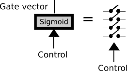

LSTM 门

该过程的另一个重要部分是乘法，它将训练好的滤波器正式化，有效地将输入乘以一个包含的门。箭头图标指示过滤信息的流向:

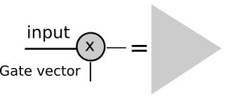

门倍增步骤

现在，是时候更详细地描述 LSTM 细胞了。

LSTM 有三个门来保护和控制单元状态:一个在数据流的开始，另一个在中间，最后一个在单元信息边界的结束。该操作将允许丢弃(希望不是重要的)不重要的状态数据并将(希望是重要的)新数据合并到状态中。

下图显示了一个 LSTM 单元操作中的所有概念。作为输入，我们有以下内容:

*   将存储长期信息的单元状态，因为它携带从单元训练的起点开始的优化权重

*   短期状态 *h(t)* ，它将在每次迭代中与当前输入直接结合，因此它将对输入的最新值有更大的影响:

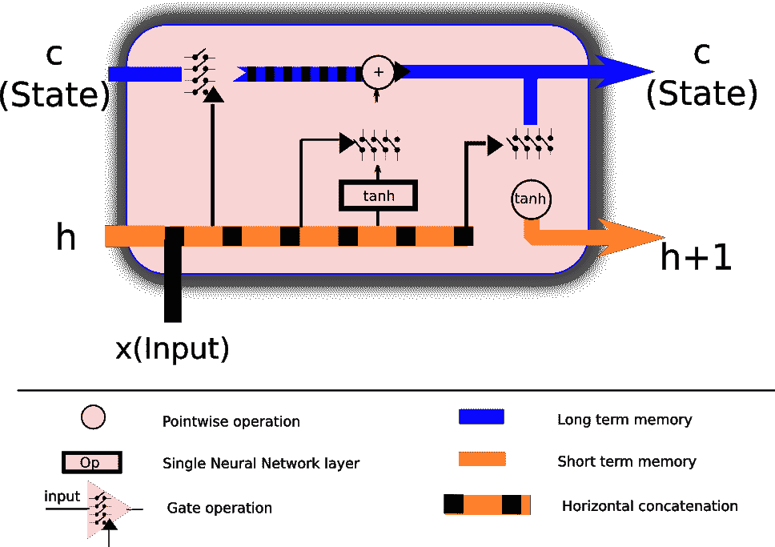

LSTM 细胞及其所有组成部分的描述

现在，让我们探索一下这个 LSTM 单元上的数据流，以便更好地理解不同的门和操作如何在单个单元中协同工作。


# 第 1 部分—设置要忽略的值(输入门)

在这个阶段，我们将来自短期记忆的值与输入本身结合起来，然后这些值将输出一个二元函数，用多变量 sigmoid 表示。根据输入和短期记忆值，sigmoid 输出将过滤长期知识，由细胞状态的权重表示:

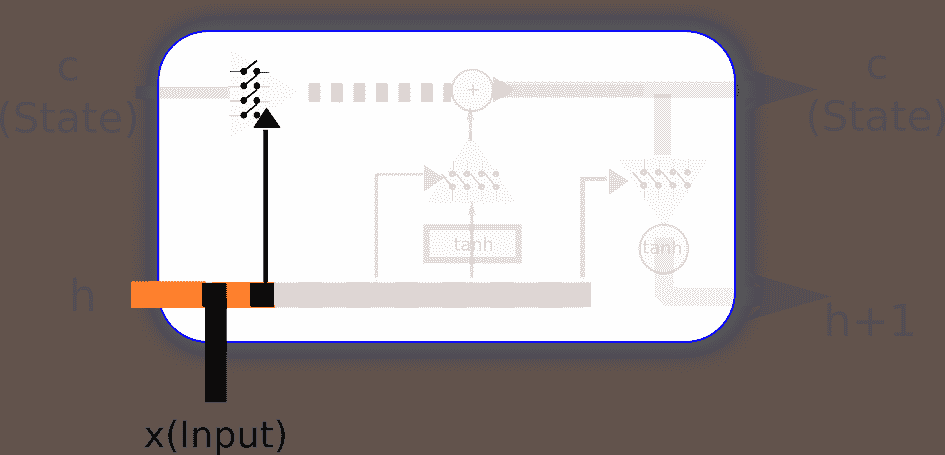

状态忘记参数设置


# 第 2 部分—设置要保留的值

现在，是时候设置过滤器，允许或拒绝新的短期记忆进入细胞的半永久状态。然后是时候设置过滤器，允许或拒绝新的和短期记忆进入细胞的半永久状态。

因此，在这个阶段，我们将确定有多少新的和半新的信息将被合并到单元的新状态中:

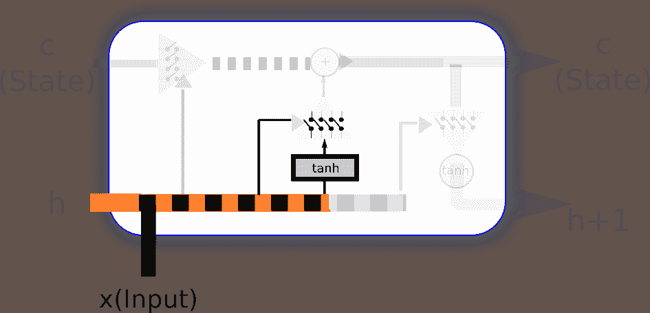

短期值选择步骤


# 第 3 部分—对单元格应用更改

在序列的这一部分，我们将最终通过我们一直在配置的信息过滤器，结果，我们将有一个更新的长期状态。

为了使新的短期信息正常化，我们通过激活了 **tanh** 的神经网络传递新的输入和短期状态。这将允许我们在归一化的 *[-1，1]* 范围内输入新信息:

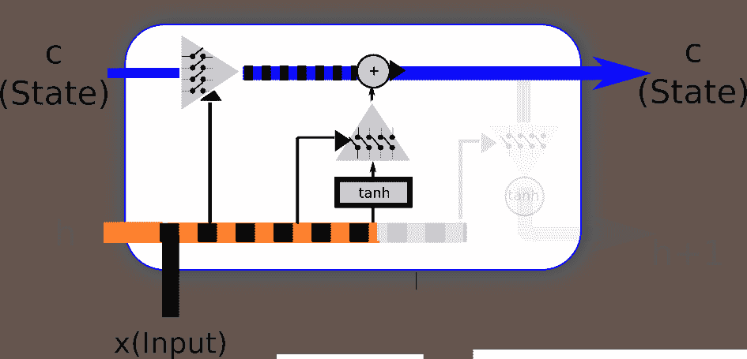

状态更改持续步骤


# 第 4 部分—输出滤波后的单元状态

现在，轮到短期状态了。它还将使用新的和先前的短期状态来设置过滤器，该过滤器将通过长期状态，点乘以双曲正切函数，再次归一化信息以结合 *(-1，1)* 范围:

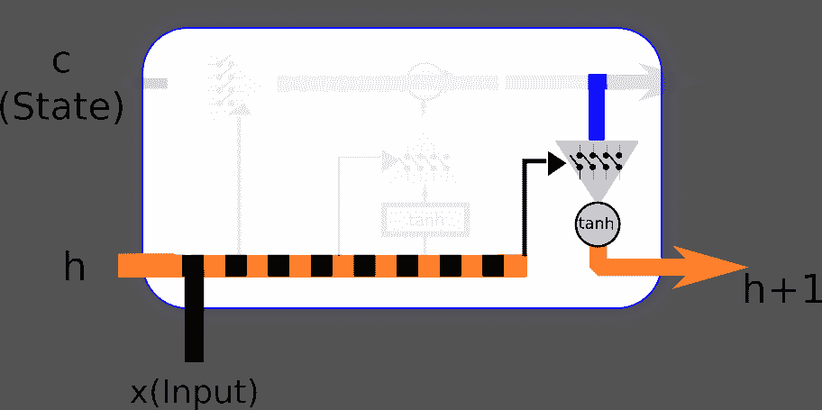

新的短期生成步骤


# 基于能耗数据的单变量时间序列预测

在这个例子中，我们将解决回归领域的一个问题。为此，我们将使用两个 LSTMs 构建一个多层 RNN。我们将进行的回归类型是多对一 T2 类型，因为网络将接收一系列能耗值，并尝试基于前四个寄存器输出下一个值。

我们将处理的数据集是一个家庭在一段时间内的许多电力消耗测量的概要。正如我们可能推断的那样，这种行为很容易遵循模式(当居住者在白天使用微波炉准备早餐和使用电脑时，它会增加，下午会减少一点，然后在晚上所有灯都亮着时增加，最后在居住者睡着时减少到零)。

让我们从设置适当的环境变量并加载所需的库开始:

```
%matplotlib inline
%config InlineBackend.figure_formats = {'png', 'retina'}

import numpy as np
import pandas as pd
import tensorflow as tf
from matplotlib import pyplot as plt

from keras.models import Sequential  
from keras.layers.core import Dense, Activation  
from keras.layers.recurrent import LSTM
from keras.layers import Dropout

Using TensorFlow backend.
```


# 数据集描述和加载

在本例中，我们将使用来自*Artur trind ade*([https://archive . ics . UCI . edu/ml/datasets/electricityloaddiagrams 2011 2014](https://archive.ics.uci.edu/ml/datasets/ElectricityLoadDiagrams20112014))的**电力负荷图数据集**。这是原始数据集的描述:

数据集没有丢失的值。
数值以每 15 分钟的千瓦为单位。要将值转换为 kWh，值必须除以 4。
每列代表一个客户端。有些客户端是 2011 年以后创建的。在这些情况下，消费量被视为零。
所有时间标签向葡萄牙小时报告。然而所有的日子都有 96 个小节(24*15)。每年三月的时间变更日(只有 23 小时)，凌晨 1:00 到 2:00 之间的值对于所有点都是零。每年 10 月的时间变化日(有 25 个小时)凌晨 1:00 到 2:00 之间的值合计消耗两个小时。

为了简化我们的模型描述，我们只取了一个客户的完整测量数据，并将其格式转换为标准 CSV 格式。它位于本章代码文件夹的`data`子文件夹中。

因此，我们将从数据集中加载样本住宅的前 1500 个消费值:

```
df = pd.read_csv("data/elec_load.csv", error_bad_lines=False)
plt.subplot()
plot_test, = plt.plot(df.values[:1500], label='Load')
plt.legend(handles=[plot_test])
```

下图显示了我们需要建模的数据子集:

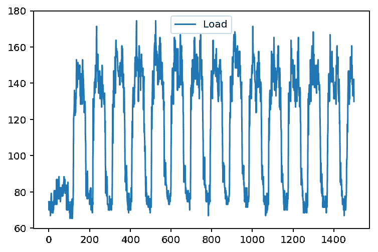

如果我们看一下这个表示(我们取了前 1500 个样本)，我们可以看到一个初始瞬态，可能是在测量到位时，然后我们看到一个非常清晰的高和低消费水平的循环。通过简单的观察，我们还可以看到周期大约为 100 个样本，非常接近这个数据集每天 96 个样本。


# 数据集预处理

为了保证反向传播方法的更好的收敛性，我们应该尽量使输入数据标准化。因此，我们将应用经典的缩放和居中技术，减去平均值，并通过最大值的`floor()`进行缩放。为了获得所需的值，我们使用 pandas `describe()`方法:

```
print(df.describe())
array=(df.values - 145.33) /338.21
plt.subplot()
plot_test, = plt.plot(array[:1500], label='Normalized Load')
plt.legend(handles=[plot_test])

                Load
count  140256.000000
mean      145.332503
std        48.477976
min         0.000000
25%       106.850998
50%       151.428571
75%       177.557604
max       338.218126
```

这是我们标准化数据的图表:

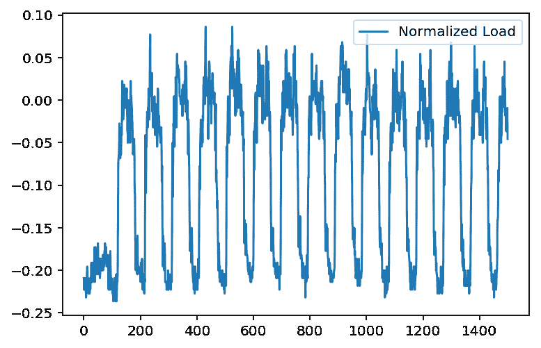

在这一步中，我们将准备我们的输入数据集，因为我们需要一个输入`x`(之前的 5 个值)和一个相应的输入`y`(5 个时间步之后的值)。然后，我们将把前 13，000 个元素分配给训练集，然后把下面的 1，000 个样本分配给测试集:

```
listX = []
listy = []
X={}
y={}

for i in range(0,len(array)-6):
    listX.append(array[i:i+5].reshape([5,1]))
    listy.append(array[i+6])

arrayX=np.array(listX)
arrayy=np.array(listy)

X['train']=arrayX[0:13000]
X['test']=arrayX[13000:14000]

y['train']=arrayy[0:13000]
y['test']=arrayy[13000:14000]
```

现在，我们将构建一个双 LSTM 模型，在每个模型的末端都有一个下降层:

```
#Build the model
model = Sequential()

model.add(LSTM( units=50, input_shape=(None, 1), return_sequences=True))

model.add(Dropout(0.2))

model.add(LSTM( units=200, input_shape=(None, 100), return_sequences=False))
model.add(Dropout(0.2))

model.add(Dense(units=1))
model.add(Activation("linear"))

model.compile(loss="mse", optimizer="rmsprop")  
```

现在是运行模型和调整权重的时候了。模型拟合器将使用 8%的数据集值作为验证集:

```
#Fit the model to the data

model.fit(X['train'], y['train'], batch_size=512, epochs=10, validation_split=0.08)

Train on 11960 samples, validate on 1040 samples
Epoch 1/10
11960/11960 [==============================] - 41s - loss: 0.0035 - val_loss: 0.0022
Epoch 2/10
11960/11960 [==============================] - 61s - loss: 0.0020 - val_loss: 0.0020
Epoch 3/10
11960/11960 [==============================] - 45s - loss: 0.0019 - val_loss: 0.0018
Epoch 4/10
11960/11960 [==============================] - 29s - loss: 0.0017 - val_loss: 0.0020
Epoch 5/10
11960/11960 [==============================] - 30s - loss: 0.0016 - val_loss: 0.0015
Epoch 6/10
11960/11960 [==============================] - 28s - loss: 0.0015 - val_loss: 0.0013
Epoch 7/10
11960/11960 [==============================] - 43s - loss: 0.0014 - val_loss: 0.0012
Epoch 8/10
11960/11960 [==============================] - 37s - loss: 0.0013 - val_loss: 0.0013
Epoch 9/10
11960/11960 [==============================] - 31s - loss: 0.0013 - val_loss: 0.0012
Epoch 10/10
11960/11960 [==============================] - 25s - loss: 0.0012 - val_loss: 0.0011

<keras.callbacks.History at 0x7fa435512588>
```

重定比例后，是时候看看我们的模型如何预测与实际测试值相比的值，实际测试值没有参与模型的训练，以了解模型如何概括样本房屋的行为:

```
# Rescale the test dataset and predicted data

test_results = model.predict( X['test'])

test_results = test_results * 338.21 + 145.33
y['test'] = y['test'] * 338.21 + 145.33

plt.figure(figsize=(10,15))
plot_predicted, = plt.plot(test_results, label='predicted')

plot_test, = plt.plot(y['test']  , label='test');
plt.legend(handles=[plot_predicted, plot_test]);
```

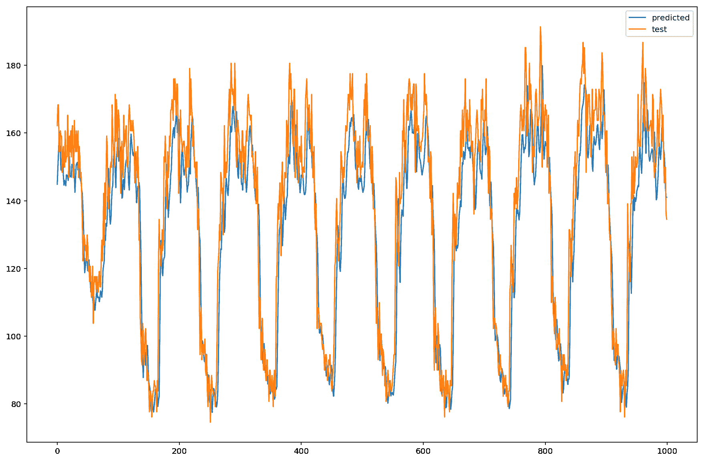

最终回归数据


# 摘要

在这一章中，我们的范围进一步扩大，在我们的概括中增加了重要的时间维度。此外，我们还学习了如何基于真实数据用 RNNs 解决实际问题。

但是如果您认为您已经涵盖了所有可能的选项，那么还有更多的模型类型可以查看！

在下一章中，我们将讨论尖端的架构，这些架构可以通过训练产生非常聪明的元素，例如，将著名画家的风格转移到一幅画中，甚至可以玩视频游戏！继续阅读强化学习和生成对抗网络。


# 参考

*   约翰·J·霍普菲尔德，*具有突发集体计算能力的神经网络和物理系统。*美国国家科学院院刊 79.8 (1982): 2554-2558。
*   Bengio，Yoshua，Patrice Simard 和 Paolo Frasconi，*学习梯度下降的长期依赖关系很困难。IEEE 神经网络汇刊 5.2 (1994): 157-166。*
*   Hochreiter，Sepp，和 Jürgen Schmidhuber，*长短期记忆*。神经计算 9.8 (1997): 1735-1780。
*   霍克雷特，赛普。*递归神经网络学习和消失梯度。《不确定性、模糊性和基于知识的系统国际期刊》6.2 (1998): 107-116。*
*   Sutskever，Ilya，*训练递归神经网络。*安大略省多伦多市多伦多大学。，加拿大(2013)。
*   Chung，Junyoung，et al .*门控递归神经网络对序列建模的经验评估。arXiv 预印本 arXiv:1412.3555 (2014)。*