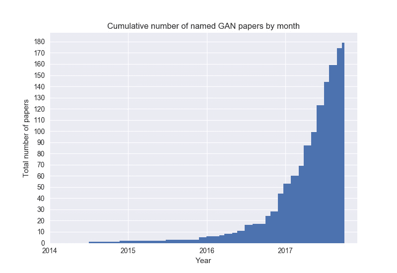
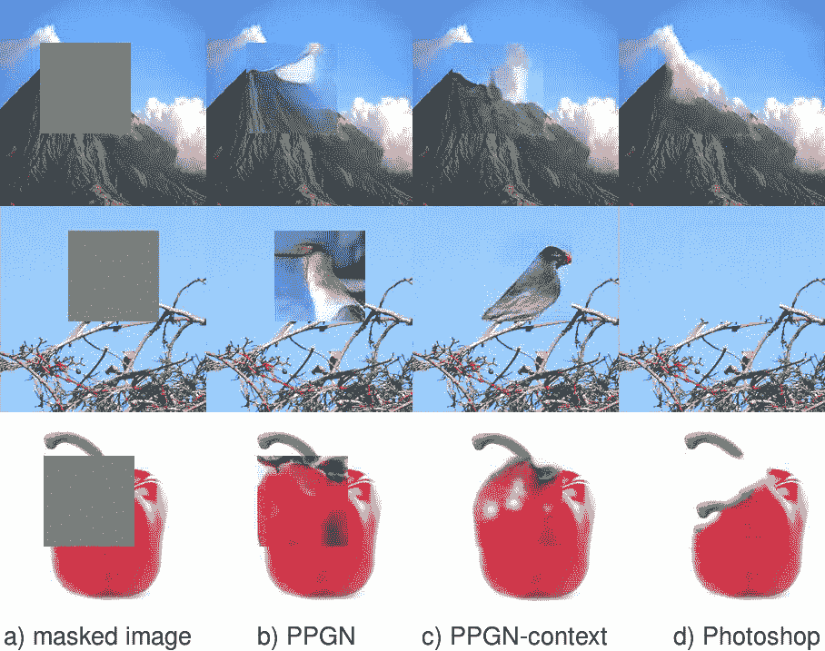
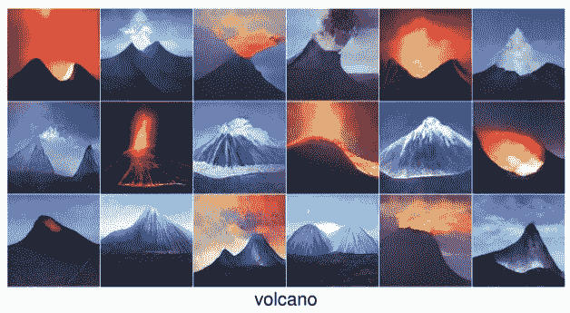
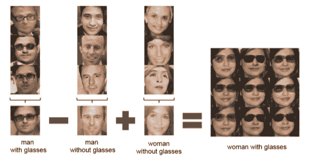
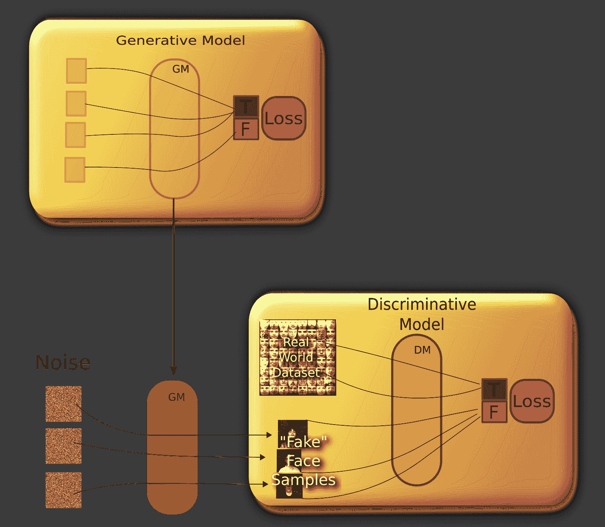

<title>Recent Models and Developments</title> 

# 最近的模型和发展

在前面的章节中，我们已经探索了大量用于机器学习模型的训练机制，从简单的传递机制开始，例如众所周知的前馈神经网络。然后，我们看了一个更复杂和受现实约束的机制，接受一个确定的输入序列作为训练输入，使用**递归神经网络** ( **RNNs** )。

现在是时候来看看最近的两个融入了现实世界其他方面的玩家了。在第一种情况下，我们将不仅有一个单一的网络优化其模型，而且还有另一个参与者，他们都将改善彼此的结果。**生成对抗网络** ( **GANs** )就是这种情况。

在第二种情况下，我们将讨论一种不同的模型，它将试图确定一组最佳步骤来最大化一个奖励:**强化学习**。

<title>GANs</title> 

# 甘斯

GANs 是一种新的无监督学习模型，是过去十年中为数不多的颠覆性模型之一。在整个迭代过程中，他们有两个相互竞争和改进的模型。

这种架构最初是基于监督学习和博弈论，其主要目标是基本上学会从同一类元素的原始数据集生成逼真的样本。

值得注意的是，对 GANs 的研究数量正以近乎指数的速度增长，如下图所示:



来源:甘动物园(https://github.com/hindupuravinash/the-gan-zoo)

<title>Types of GAN applications</title> 

# 氮化镓应用的类型

GANs 允许新的应用程序从以前的样本集中产生新的样本，包括补充缺失的信息。

在下面的截图中，我们描绘了在来自 LSUN 的五个场景数据集上使用 **LSGAN 架构**创建的多个样本，包括厨房、教堂、餐厅和会议室:


LSGAN 创建了模型

另一个真正有趣的例子是使用**即插即用生成网络(PPGN)** 的类条件图像采样，以填充实际 227 x 227 图像中 100 x 100 的缺失像素。

下面的屏幕截图比较了 PPGN 变体和等效的 Photoshop 图像补全:



PPGN 填充示例

PPGN 还可以合成生成高分辨率(227 x 227)的火山类图像。不仅许多图像近乎照片般真实，而且本课程中的样本也是多种多样的:



PPGN 生成的火山样本

下面的屏幕截图展示了视觉概念的过程向量算法。它允许使用表示图像中对象的操作数，并且可以添加或删除它们，在特征空间中移动:



特征空间的向量算术运算

<title>Discriminative and generative models</title> 

# 判别和生成模型

为了理解敌对网络的概念，我们将首先定义在典型 GAN 设置中交互的两个模型:

*   **生成器**:它的任务是从一个标准的随机分布中获取一个样本(例如，一个来自 n 维高斯分布的样本)，并产生一个看起来像是来自与 *XX* 相同的分布的点。可以说，生成器想要欺骗鉴别器输出 1。在数学上，它学习一个函数，该函数将输入数据( *x* )映射到某个期望的输出类标签( *y* )。在概率方面，它学习输入数据的条件分布 *P(y|x)* 。它可以区分两种(或更多种)不同类别的数据，例如，一个卷积神经网络被训练为在给定人脸图像的情况下输出 1，否则输出 0。

*   **鉴别器**:其任务是区分来自真实数据的样本和由生成器生成的人工数据。每个模型将试图击败另一个模型(生成器的目标是欺骗鉴别器，而鉴别器的目标是不被生成器欺骗):



GAN 的训练过程

更正式地说，生成器试图同时学习输入数据和标签的联合概率，即 *P(x，y)* 。因此，它也可以用于其他用途，比如创建可能的新 *(x，y)* 样本。它对数据的类别一无所知。相反，它的目的是生成符合训练数据分布的新数据。

在一般情况下，发生器和鉴别器都是神经网络，它们以交替的方式被训练。他们的每个目标都可以表示为一个损失函数，我们可以通过梯度下降来优化它。

最终的结果是，两种模式一前一后地自我完善；生成器生成更好的图像，鉴别器在确定生成的样本是否是假的方面变得更好。在实践中，最终的结果是一个产生真正好的和真实的新样本的模型(例如，自然环境的随机图片)。

**概括来说，GANs 的主要优点是:**

*   甘是生成模型，使用监督学习来近似一个棘手的成本函数
*   GANs 可以模拟许多成本函数，包括用于最大似然的函数
*   寻找高维、连续、非凸博弈中的纳什均衡是一个重要的开放性研究问题
*   gan 是 PPGNs 的关键组成部分，它能够从不同的图像类别中生成引人注目的高分辨率样本

<title>Reinforcement learning</title> 

# 强化学习

强化学习是最近重新出现的一个领域，它在控制领域变得更加流行，寻找游戏和情境问题的解决方案，其中必须实施许多步骤来解决问题。

强化学习的正式定义如下:

“强化学习是一个智能体面临的问题，它必须通过与动态环境的反复试验来学习行为。”(Kaelbling 等人，1996 年)。

为了对我们想要解决的问题类型有一个参考框架，我们将从回到 20 世纪 50 年代发展的一个数学概念开始，称为**马尔可夫决策过程**。

<title>Markov decision process</title> 

# 马尔可夫决策过程

在解释强化学习技术之前，我们将解释我们将用它们来解决的问题的类型。

当谈到强化学习时，我们希望优化马尔可夫决策过程的问题。它由一个数学模型组成，在结果部分是随机的，部分在代理人控制下的情况下帮助决策。

该模型的主要元素是一个**代理**、一个**环境**和一个**状态**，如下图所示:


强化学习过程的简化方案

代理可以执行某些操作(例如向左或向右移动挡板)。这些行为有时会导致奖励*r[t]，奖励可以是积极的，也可以是消极的(比如分数的增减)。动作改变了环境，可以导致新的状态*s[t+1]，此时代理可以执行另一个动作*a[t+1]。状态、动作和奖励的集合，以及从一个状态转换到另一个状态的规则，构成了马尔可夫决策过程。***

<title>Decision elements</title> 

# 决策要素

为了理解这个问题，让我们将自己置于解决问题的环境中，看看主要因素:

*   状态的集合
*   要采取的行动是从一个地方到另一个地方
*   奖励函数是由边表示的值
*   政策是完成任务的途径
*   折扣系数，决定未来奖励的重要性

与传统形式的监督和非监督学习的主要区别是计算奖励所花费的时间，而在强化学习中这不是即时的；它发生在一系列步骤之后。

因此，下一个状态依赖于当前状态和决策者的行动，而该状态不依赖于所有先前的状态(它没有记忆)，因此它符合马尔可夫性质。

由于这是一个马尔可夫决策过程，状态*s[t+1]的概率只取决于当前状态*s[t]和动作*a[t]:***


展开强化机制

整个过程的目标是生成一个使回报最大化的策略 *P，*。训练样本为元组， *< s，a，r >* 。

<title>Optimizing the Markov process</title> 

# 优化马尔可夫过程

强化学习是一个代理和环境之间的迭代交互。每个时间步都会发生以下情况:

*   流程处于一种状态，决策者可以选择该状态下可用的任何操作
*   这个过程在下一个时间点随机进入一个新的状态，并给予决策者相应的奖励
*   流程进入新状态的概率受状态转移函数形式的所选动作的影响

<title>Basic RL techniques: Q-learning</title> 

# 基本 RL 技术:Q-learning

最著名的强化学习技术之一，也是我们将在示例中实现的技术，是 **Q-learning** 。

Q-learning 可用于在有限马尔可夫决策过程中找到任何给定状态的最优动作。当我们在状态 *s* 中执行动作 *a* 时，Q-learning 试图最大化 Q-function 的值，该值代表最大的贴现未来回报。

一旦我们知道了 Q 函数，状态 *s* 中的最优动作 *a* 就是具有最高 Q 值的那个。然后，我们可以定义一个策略π*(s)*，它可以在任何状态下为我们提供最佳操作，如下所示:


我们可以根据下一点的 Q 函数( *s [t+1]* ， *a [t+1]* ， *r [t)来定义一个过渡点的 Q 函数( *s [t] ，a [t] ，r [t] ，s [t+1]* 这个方程被称为 Q 学习的**贝尔曼方程:**]*


在实践中，我们可以把 Q 函数想象成一个查找表(称为 **Q 表**)，其中状态(由 *s* 表示)是行，动作(由 *a* 表示)是列，元素(由 *Q(s，a)* 表示)是当你处于行给出的状态并采取列给出的动作时得到的奖励。在任何状态下采取的最佳行动都是奖励最高的行动:

```
initialize Q-table Q
observe initial state s
while (! game_finished):
 select and perform action a
 get reward r 
   advance to state s'
 Q(s, a) = Q(s, a) + α(r + γ max_a' Q(s', a') - Q(s, a))
 s = s'
```

你会意识到，该算法基本上是在贝尔曼方程上做随机梯度下降，通过状态空间(或插曲)反向传播奖励，并在许多试验(或时期)上求平均。这里，`α`是学习率，它决定了应该合并多少以前的 Q 值和贴现的新的最大 Q 值之间的差。

我们可以用下面的流程图来表示这个过程:

<title>References</title> 

# 参考

*   贝尔曼，理查德，*一个马尔可夫决策过程。*数学与力学学报(1957): 679-684。
*   Kaelbling，Leslie Pack，Michael L. Littman 和 Andrew W. Moore，*强化学习:一项调查。*人工智能研究杂志 4 期(1996): 237-285。
*   Goodfellow，Ian 等，*生成对抗网，a* *神经信息处理系统的进展，* 2014
*   拉德福德、亚历克、卢克·梅茨和苏史密斯·钦塔拉，*利用深度卷积生成对抗网络的无监督表示学习。* arXiv 预印本 arXiv:1511.06434 (2015)。
*   Isola，Phillip，et al., *条件对抗网络的图像到图像翻译*，arXiv 预印本 arXiv:1611.07004 (2016)。
*   毛，徐东，等，*最小二乘生成对抗网络。* arXiv 预印本 ArXiv:1611.04076 (2016)。
*   埃格巴尔-扎德、哈米德和格哈德·威德默，*生成性敌对网络的似然估计。* arXiv 预印本 arXiv:1707.07530 (2017)。
*   Nguyen，Anh 等人，*塞&玩生成网络:潜在空间中图像的条件迭代生成*。arXiv 预印本 arXiv:1612.00005 (2016)。

<title>Summary</title> 

# 摘要

在这一章中，我们回顾了最近出现的两个最重要和最具创新性的架构。每天，新的生成和强化模型都以创新的方式应用，无论是从以前已知的类别中生成可行的新元素，还是在策略游戏中战胜职业玩家。

在下一章，我们将提供精确的说明，这样你可以使用和修改提供的代码，以更好地理解你在整本书中获得的不同概念。