# 九、软件安装和配置

所以，是时候开始我们的告别了！在这一章中，我们将详细介绍构建开发环境的所有说明。

在本章中，您将了解:

*   在 Linux 上安装 Anaconda 和 pip 环境
*   在 macOS 上安装 Anaconda 和 easy install environment
*   在 Windows 上安装 Anaconda 环境

所以，让我们从一步一步的说明开始，从 Linux 开始。


# Linux 安装

在我们看来，Linux 是最灵活的平台，你可以在这个平台上从事机器学习项目。正如您可能知道的，在 Linux 领域有大量的替代产品，它们都有自己特定的包管理。

考虑到编写所有这些发行版的操作说明会占用大量的页面，我们将决定为 **Ubuntu 16.04** 发行版编写说明。

Ubuntu 无疑是最广泛的 Linux 发行版，在 Ubuntu 16.04 的特殊情况下，它是一个 LTS 版本，或长期支持。这意味着我们将在本书中运行的基础软件将支持到 2021 年。

你会在 https://wiki.ubuntu.com/LTS 的[找到更多关于 LTS 含义的信息。](https://wiki.ubuntu.com/LTS)

关于 Ubuntu 作为科学计算分发版的可行性，即使被很多人认为是面向新手的，但它对一个当前的机器学习环境所需要的所有技术都有必要的支持，并且拥有非常庞大的用户群。

本章的说明与基于 Debian 的发行版非常相似；它们只需很少的改动，甚至不需要改动。


# 初始分配要求

对于 Python 环境的安装，您将需要以下东西:

*   支持 AMD64 指令的计算机(通常称为 64 位处理器)

*   在云上运行的基于 AMD64 的映像

在 AWS 上，一个合适的**亚马逊机器镜像** ( **AMI** )是代码 [ami-cf68e0d8](https://console.aws.amazon.com/ec2/home?region=us-east-1#launchAmi=ami-cf68e0d8) 。


# 在 Linux 上安装 Anaconda

安装 Python 发行版的一种非常流行的方式是通过软件包 Anaconda。它包含一个完整的高性能 Python、Scala 和 R 生态系统，包括数据科学中使用的最知名的包。它还包括一系列通过`conda`可用的其他包，它是包的主要实用程序，管理环境、包和依赖项。

Anaconda 是由**Continuum Analytics**([Continuum . io](http://continuum.io))构建和发布的，该公司也维护这些包及其依赖项。

为了安装 Anaconda，让我们首先下载安装包，在撰写本文时版本为 4.2.0。

你可以在 https://www.anaconda.com/download/找到最新的软件包版本。

看看在 Linux 上安装 Anaconda 的以下步骤:

1.  让我们运行以下命令:

```
 curl -O https://repo.continuum.io/archive/Anaconda3-4.2.0-Linux-
      x86_64.sh
```

前面的命令将生成以下输出:

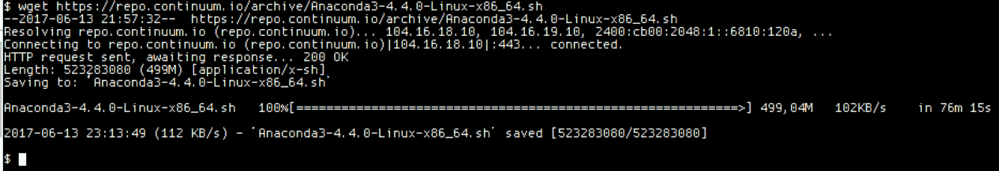

2.  然后，我们需要使用校验和或 SHA-256 类型来验证包的数据完整性。执行该操作的 Linux 命令是`sha256sum`，如下所示:

```
 sha256sum Anaconda3-4.4.0-Linux-x86_64.sh
```

前面的命令将生成以下输出:

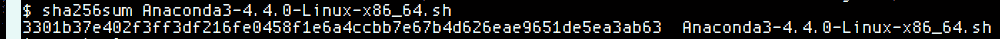

3.  然后，让我们使用`bash`解释器执行安装程序，如下所示:

```
 bash Anaconda3-4.2.0-Linux-x86_64.sh
```

上述命令会生成以下输出:

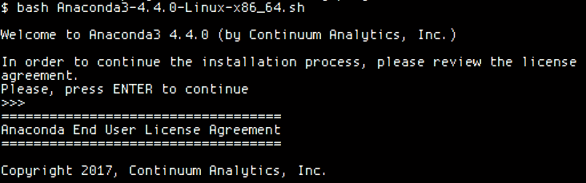

4.  按下*进入*后，我们会看到许可证，您可以在阅读后输入`yes`接受，如下截图所示:

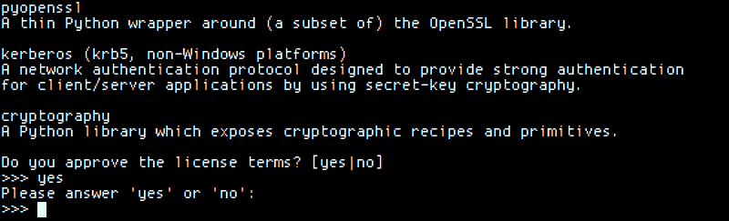

5.  然后，是时候选择位置并开始安装所有的包了，如下面的截图所示:

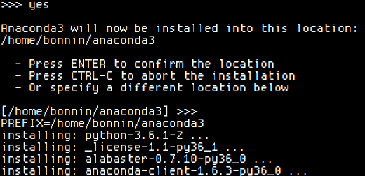

6.  在这之后，我们将被要求将已安装的 Anaconda 安装添加到路径中，主要是将库和二进制文件，尤其是`conda`实用程序，集成到系统中。然后安装完成，如下图所示:

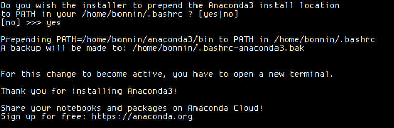

7.  然后，让我们通过运行以下命令来测试当前的 Anaconda 安装:

```
 source ~/.bashrc
 conda list
```

前面的命令将生成以下输出:

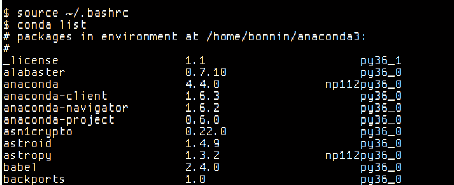

8.  现在是时候通过运行以下命令来创建 Python 3 环境了:

```
 conda create --name ml_env python=3
```

前面的命令将生成以下输出:

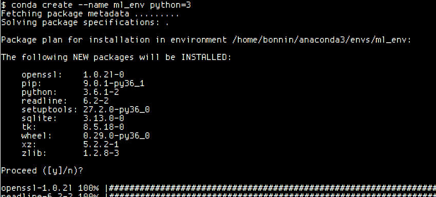

9.  要激活这个新环境，让我们通过运行以下命令来使用`source`命令:

```
 source activate ml_env
```

前面的命令将生成以下输出:


10.  激活环境后，您的命令提示符前缀将发生如下变化:

```
 python --version
```

前面的命令将生成以下输出:

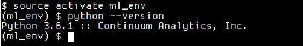

11.  当您不想再使用该环境时，运行以下命令:

```
 source deactivate
```

前面的命令将生成以下输出:


12.  如果您想要检查所有的 conda 环境，您可以使用下面的 conda 命令:

```
 conda info --envs
```

前面的命令将生成以下输出:

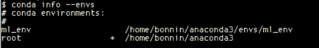

星号(`*`)表示当前活动的环境。

13.  通过运行以下命令安装其他软件包:

```
 conda install --name ml_env numpy
```

前面的命令将生成以下输出:

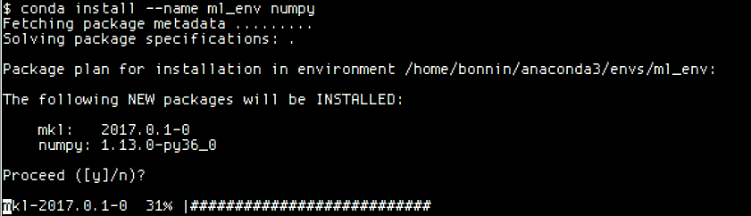

14.  要删除环境，可以使用以下命令:

```
 conda remove --name ml_env --all
```

15.  添加剩余的库:

```
conda install tensorflow conda install -c conda-forge keras
```


# pip Linux 安装方法

在本节中，我们将使用 pip ( `pip` installs packages)包管理器来安装项目所需的所有库。

Pip 是 Python 的默认包管理器，有非常多的可用库，包括几乎所有主要的机器学习框架。


# 安装 Python 3 解释器

Ubuntu 16.04 的默认解释器是 Python 2.7。因此，我们的第一步将是安装 Python 3 解释器和所需的库:

```
sudo apt-get install python3
```


# 安装 pip

为了安装`pip`包管理器，我们将使用 Ubuntu 自带的`apt-get`包管理器安装`python3-pip`包:

```
sudo apt-get install python3-pip
```


# 安装必要的库

执行以下命令安装剩余的必要库。本书中的实际例子需要用到它们中的许多:

```
sudo pip3 install pandas
sudo pip3 install tensorflow
sudo pip3 install keras
sudo pip3 install h5py
sudo pip3 install seaborn
sudo pip3 install jupyter 
```


# macOS X 环境安装

现在轮到 macOS X 安装了。安装过程与 Linux 非常相似，并且基于 **OS X 高地**版本。

安装需要安装用户的`sudo`权限。


# 蟒蛇装置

Anaconda 可以通过图形安装程序或基于控制台的安装程序来安装。在这一节中，我们将介绍图形安装程序。首先，我们将从[https://www.anaconda.com/download/](https://www.anaconda.com/download/)下载安装包，并选择 64 位包:

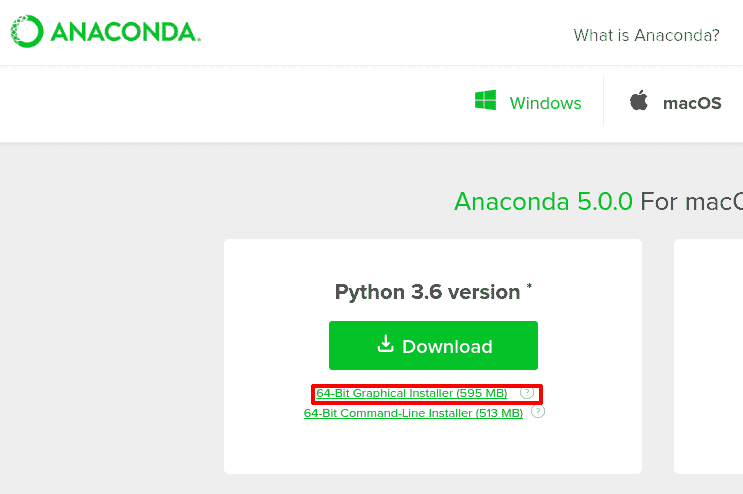

一旦我们下载了安装程序包，我们就执行安装程序，然后我们会看到一步一步的 GUI:

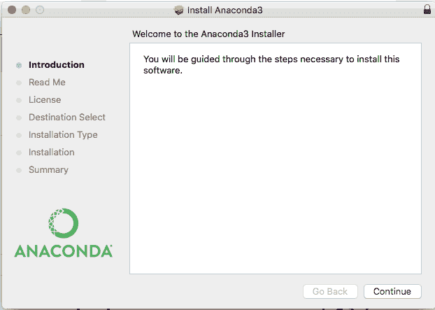

然后，我们选择安装位置(考虑到整个包需要差不多 2 GB 的磁盘来安装):

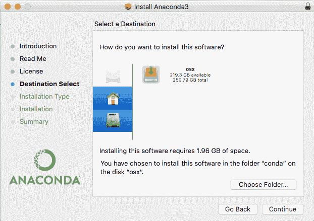

首先，在实际安装所有必需的文件之前，我们接受许可证:

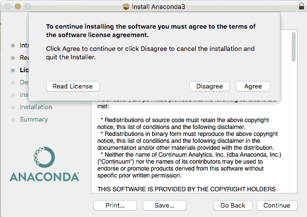

在必要的文件解压缩和安装过程之后，我们就可以开始使用 Anaconda 实用程序了:

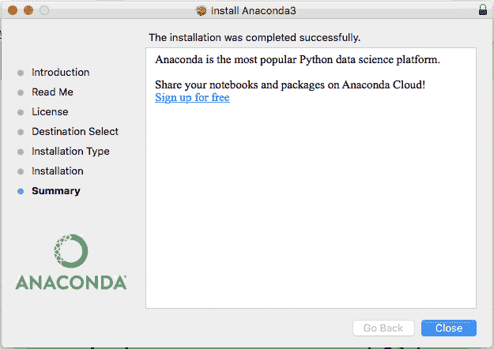

最后一步是用`conda`命令安装 Anaconda 发行版中缺少的包:

```
conda install tensorflow conda install -c conda-forge keras
```


# 安装 pip

在本节中，我们将安装`pip`包管理器，使用`setuptools` Python 包中的`easy_install`包管理器，默认情况下包含在操作系统中。

对于此过程，我们将在终端中执行以下命令:

```
/usr/bin/ruby -e "$(curl -fsSL https://raw.githubusercontent.com/Homebrew/install/master/install)"

$ sudo brew install python3
```


# 通过 pip 安装剩余的库

然后轮到安装所有剩余的库:

```
sudo pip3 install pandas
sudo pip3 install tensorflow
sudo pip3 install keras
sudo pip3 install h5py
sudo pip3 install seaborn
sudo pip3 install jupyter

```

这就结束了 Mac 的安装过程；让我们继续 Windows 安装过程。


# Windows 安装

Windows 是 Python 可以毫无问题运行的平台。在这一节中，我们将介绍在 Windows 平台上安装 Anaconda。


# Anaconda Windows 安装

由于图形安装程序的原因，安装 Anaconda 的过程与 macOS 非常相似。让我们从从[https://www.anaconda.com/download/](https://www.anaconda.com/download/)下载安装包并选择 64 位包开始:

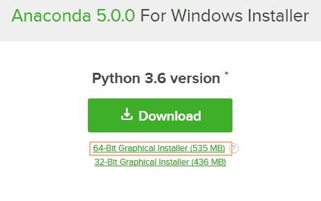

下载安装程序后，接受许可协议，并转到下一步:

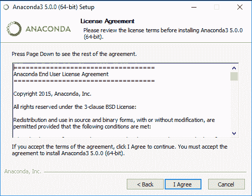

然后，您可以选择为当前用户或所有用户安装平台:

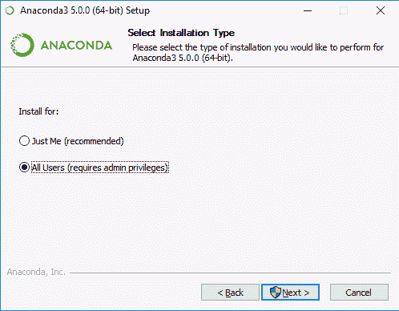

然后，为整个安装选择安装目录。请记住，这将需要将近 2 GB 的磁盘来安装:

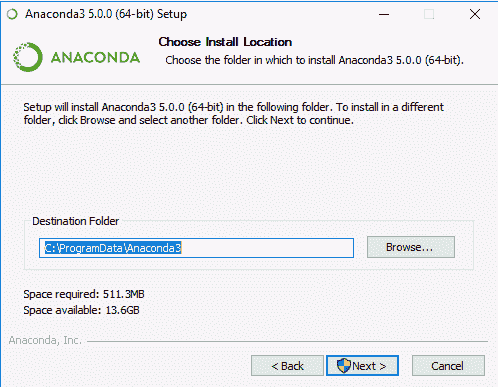

安装环境后，您将在 Windows 主菜单中找到 Jupyter 笔记本快捷方式:

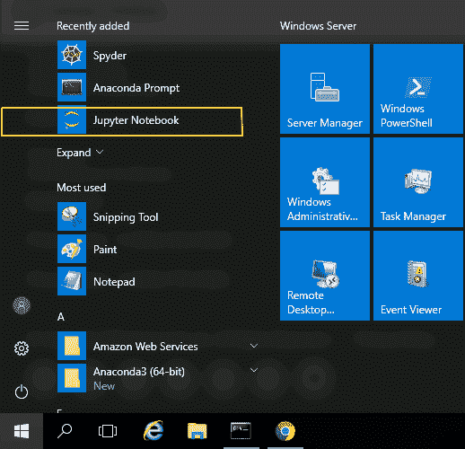

为了使用 Python 命令和`conda`实用程序，有一个方便的 Anaconda 提示符，它将加载所需的路径和环境变量:

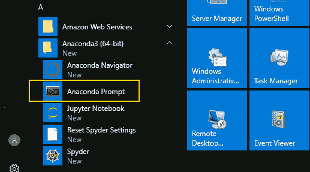

最后一步是在 Anaconda 提示符下执行下面的`conda`命令来安装缺失的包:

```
conda install tensorflow conda install -c conda-forge keras
```


# 摘要

恭喜你！你已经到了这个机器学习基本原理实用总结的结尾了。在最后一章中，我们介绍了许多帮助您构建机器学习计算环境的方法。

我们想借此机会真诚地感谢您的认真阅读，我们希望您已经发现所提供的材料有趣且引人入胜。希望您现在已经准备好开始处理新的挑战性问题，借助我们提供的工具以及一直在开发的新工具，并利用我们努力提供的知识。

对我们来说，写这本书并寻找以实用的方式帮助你理解概念的最佳方法是一件令人兴奋的事情。不要犹豫，将问题、建议或错误报告写给出版商提供的渠道。

祝福你，学习愉快！