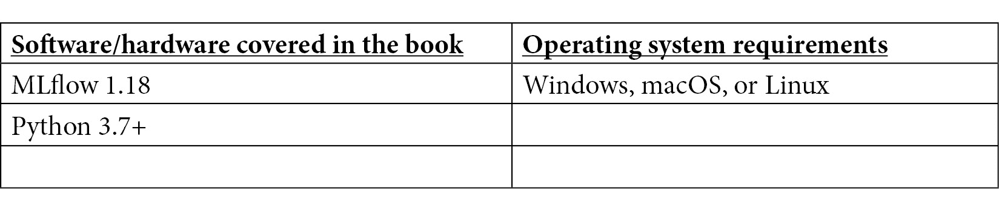

# 前言

实现基于机器学习的产品可能是一项艰巨的任务。普遍需要减少机器学习开发生命周期的不同步骤之间以及该过程中涉及的数据科学家和工程师团队之间的摩擦。

数据科学家和机器学习工程师等机器学习从业者使用不同的系统、标准和工具进行操作。虽然数据科学家大部分时间都在使用 Jupyter Notebook 等工具开发模型，但在生产环境中运行时，模型是在软件应用程序的环境中部署的，该环境在规模和可靠性方面要求更高。

在本书中，您将了解 MLflow 和机器学习工程实践，这将有助于您的机器学习生命周期，探索数据采集、准备、训练和部署。这本书的内容是基于一个开放的界面设计，将与任何语言或平台。在可伸缩性和可再现性方面，您也将从中受益。

到本书结束时，您将能够轻松地使用 MLflow 建立模型开发环境，构建您的机器学习问题，并使用标准化框架建立您自己的机器学习系统。如果你正在生产中实现你的第一个机器学习项目，这本书也特别方便。

# 这本书是给谁的

这本书面向软件、机器学习和数据科学专业人士或爱好者，他们希望探索生产中机器学习系统的工程方面。机器学习从业者将能够把他们的知识运用到 MLflow 的实践指南中。这本书采用了实际操作的实施方法和相关的方法，可以让您立即开始使用 MLflow。这本书的基本要求是具备 Python 编程经验以及 Bash 终端和命令的知识。

# 这本书涵盖了什么

[*第 1 章*](B16783_01_Final_SB_epub.xhtml#_idTextAnchor015) ，*介绍 MLflow* ，将概述 MLflow 的不同特性，指导您安装和探索平台的核心特性。阅读完本章后，您将能够在本地安装和操作 MLflow 环境。

[*第二章*](B16783_02_Final_SB_epub.xhtml#_idTextAnchor030) ，*你的机器学习项目*，介绍本书的重点。本书的方法是通过一个实际的商业案例，即股票市场预测，并通过这个用例，探索 MLflow 的所有不同功能。一个问题框架将被用来让你对书中的例子非常熟悉。将创建一个示例管道供本书的剩余部分使用。

[*第 3 章*](B16783_03_Final_SB_epub.xhtml#_idTextAnchor066) ，*您的数据科学工作台*，帮助您了解如何使用 MLflow 创建您的本地环境，以便您可以使用 MLflow 提供的所有不同功能在本地开发您的机器学习项目。

[*第四章*](B16783_04_Final_SB_epub.xhtml#_idTextAnchor081) ，*MLflow*中的实验管理，通过创建不同的模型，比较 ml flow 中不同运行的指标，获得股票预测的实践经验。您将被指导如何部署跟踪服务器，以便许多机器学习实践者可以共享指标并改进模型。

[*第 5 章*](B16783_05_Final_SB_epub.xhtml#_idTextAnchor094) ，*使用 MLflow 管理模型*，查看 MLflow 中模型创建的不同特性。内置模型，如 PyTorch 和 TensorFlow 模型，将与 MLflow 中不可用的自定义模型一起涵盖。模型生命周期将与 MLflow 的模型注册特性一起引入。

[*第 6 章*](B16783_06_Final_SB_epub.xhtml#_idTextAnchor106) ，*介绍 ML 系统架构*，讲述正确架构机器学习系统的必要性，以及 MLflow 如何融入端到端机器学习系统的图景。

[*第七章*](B16783_07_Final_SB_epub.xhtml#_idTextAnchor120) ，*数据和特征管理*，介绍数据和特征管理。将阐明特征生成的重要性，以及如何使用特征流通过 MLflow 记录模型结果。

[*第 9 章*](B16783_09_Final_SB_epub.xhtml#_idTextAnchor141) 、*使用 MLflow 的部署和推理*，是我们的机器学习系统的端到端部署基础设施，包括推理组件，将使用 MLflow 的 API 和批处理功能来展示。还将描述 MLflow 的支持云的特性。

[*第 10 章*](B16783_10_Final_SB_epub.xhtml#_idTextAnchor152) ，*扩展您的机器学习工作流*，涵盖了与高性能/大数据库的集成，允许 MLflow 系统针对大量数据进行扩展。

[*第 11 章*](B16783_11_Final_SB_epub.xhtml#_idTextAnchor161) ，*性能监控*，探讨了机器学习操作的重要领域，以及如何使用最佳实践和操作模式来确保本书中开发的生产系统平稳运行。

[*第 12 章*](B16783_12_Final_SB_epub.xhtml#_idTextAnchor173) ，*关于 MLFlow 的高级主题*，介绍了关于完整 MLflow 管道的高级案例研究。案例研究使用了与本书其余部分不同类型的模型，以确保 MLflow 的广泛功能覆盖。

# 为了充分利用这本书

理想情况下，在开始阅读这本书之前，你应该很好地掌握了 Python 编程语言，并且应该已经创建了基本的机器学习模型。一门机器学习的入门课程将有助于将书中讨论的概念融入语境。



如果你使用的是这本书的数字版，我们建议你自己输入代码或者从这本书的 GitHub 库获取代码(下一节有链接)。这样做将帮助您避免任何与复制和粘贴代码相关的潜在错误。

# 下载示例代码文件

你可以从 GitHub 的 https://GitHub . com/packt publishing/Machine-Learning-Engineering-with-ml flow 下载本书的示例代码文件。如果代码有更新，它会在 GitHub 库中更新。

我们在 https://github.com/PacktPublishing/也有丰富的书籍和视频目录中的其他代码包。看看他们！

# 下载彩色图片

我们还提供了一个 PDF 文件，其中有本书中使用的截图和图表的彩色图像。可以在这里下载:[https://static . packt-cdn . com/downloads/9781800560796 _ color images . pdf](https://static.packt-cdn.com/downloads/9781800560796_ColorImages.pdf)

# 使用的惯例

本书通篇使用了许多文本约定。

文本中的代码:表示文本中的代码字、数据库表名、文件夹名、文件名、文件扩展名、路径名、伪 URL、用户输入和 Twitter 句柄。下面是一个例子:“`model.pkl`文件包含了模型的序列化版本”

代码块设置如下:

```
import mlflow
from sklearn.linear_model import LogisticRegression
mlflow.sklearn.autolog()
with mlflow.start_run():
    clf = LogisticRegression()
    clf.fit(X_train, y_train)
```

任何命令行输入或输出都按如下方式编写:

```
docker build -t stockpred -f dockerfile
```

**粗体:**表示新术语、重要单词或您在屏幕上看到的单词。例如，菜单或对话框中的单词以粗体显示。这里有一个例子:“ **MLflow** 是一个用于**机器学习(ML)** 生命周期的开源平台”

提示或重要注意事项

像这样出现。

# 取得联系

我们随时欢迎读者的反馈。

**总体反馈:**如果您对本书的任何方面有疑问，请发邮件至 customercare@packtpub.com，并在邮件主题中提及书名。

**勘误表:**虽然我们已经尽一切努力确保内容的准确性，但错误还是会发生。如果你在这本书里发现了一个错误，请告诉我们，我们将不胜感激。请访问[www.packtpub.com/support/errata](http://www.packtpub.com/support/errata)并填写表格。

**盗版:**如果您在互联网上发现我们作品的任何形式的非法拷贝，如果您能提供我们的地址或网站名称，我们将不胜感激。请联系我们在 copyright@packt.com 与材料的链接。

**如果你有兴趣成为一名作家:**如果有一个你擅长的主题，并且你有兴趣写作或投稿，请访问[authors.packtpub.com](http://authors.packtpub.com)。

# 分享你的想法

一旦你用 MLflow 阅读了*机器学习工程，我们很想听听你的想法！扫描下面的二维码，直接进入这本书的亚马逊评论页面，分享你的反馈。*


[https://packt.link/r/1-800-56079-6](https://packt.link/r/1-800-56079-6)

您的评论对我们和技术社区非常重要，将有助于我们确保提供高质量的内容。