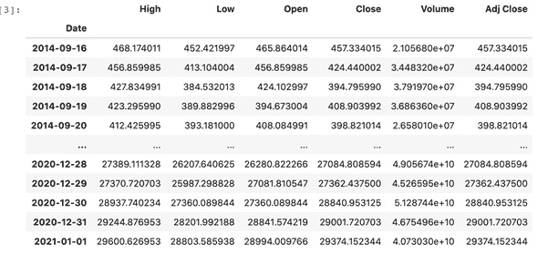
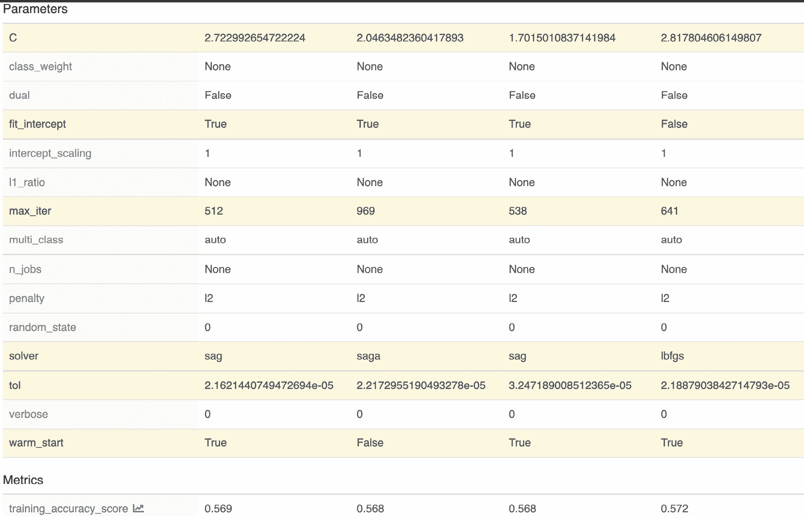

# *第四章*:ml flow 中的实验管理

在这一章中，我们将通过创建不同的模型和比较 MLflow 中不同运行的指标，为您提供股票预测的实践经验。您将在如何使用 MLflow 实验方法方面得到指导，以便不同的机器学习实践者可以共享指标并在同一模型上进行改进。

具体来说，我们将在本章中探讨以下主题:

*   实验模块入门
*   定义实验
*   添加实验
*   比较不同的模型
*   使用超参数优化调整您的模型

在这个阶段，我们目前有一个基于天真启发的基线管道。在这一章中，我们将在我们的技能组合中增加使用多种模型进行实验和使用 MLflow 调优一个特定模型的能力。

我们将深入研究我们的 **Psystock** 公司在 [*第二章*](B16783_02_Final_SB_epub.xhtml#_idTextAnchor030) 、*您的机器学习项目*中介绍的股票交易机器学习平台的用例。在这一章中，我们将添加到我们的平台中来比较多个模型，并在基准中运行实验，以便能够为特定的股票和报价机创建预测器。

在数据科学函数中，一种常见的方法是为特定的模型开发模型，该方法包括以下三个步骤:使用不同的模型类型创建基线模型，确定最佳性能模型，以及使用最佳模型进行预测。

# 技术要求

对于本章，您将需要以下先决条件:

*   最新版本的 Docker 安装在您的机器上。如果您还没有安装，请按照[https://docs.docker.com/get-docker/](https://docs.docker.com/get-docker/)的说明进行操作。
*   安装了最新版本的 Docker Compose。请按照[https://docs.docker.com/compose/install/](https://docs.docker.com/compose/install/)的指示。
*   在命令行中访问 Git，并按照[https://Git-SCM . com/book/en/v2/Getting-Started-Installing-Git](https://git-scm.com/book/en/v2/Getting-Started-Installing-Git)中的描述进行安装。
*   访问 bash 终端(Linux 或 Windows)。
*   访问浏览器。
*   Python 3.5 以上版本已安装。
*   你的机器学习的最新版本安装在本地并在 [*第三章*](B16783_03_Final_SB_epub.xhtml#_idTextAnchor066) 、*你的* *数据科学工作台*中描述。

# 实验模块入门

要开始学习技术模块，您需要从以下文件夹中为本章准备的环境开始:[https://github . com/packt publishing/Machine-Learning-Engineering-with-ml flow/tree/master/chapter 04](https://github.com/PacktPublishing/Machine-Learning-Engineering-with-MLflow/tree/master/Chapter04)

在这个阶段，您应该能够执行`make`命令，用本章需要的依赖项来构建您的工作台。您需要键入以下命令来移动到正确的目录:

```
$ cd Chapter04/gradflow/
```

要启动环境，您需要运行以下命令:

```
$ make
```

在 **MLflow** 中开始管理实验的切入点是*图 4.1* 所示的实验界面:

2

一


图 4.1–ml flow 中的实验界面

在左侧窗格(1)中，您可以管理和创建实验，在右侧窗格(2)中，您可以查询特定实验的详细信息。

要创建一个新的实验，您需要点击左侧窗格中的 **+** 按钮，并添加您的实验的详细信息，如图*图 4.2* 所示:


图 4.2–创建新实验

在高层次上介绍了跟踪服务器和实验管理功能后，我们现在将继续使用我们工作台上可用的功能来解决当前章节的挑战。

# 定义实验

使用机器学习问题框架方法，我们现在将定义本章定义的股票价格预测问题的主要组成部分:

.jpg).jpg)

表 4.1-机器学习问题框架概述

机器学习中的 **F-score** 度量是对二进制分类器的准确性的测量，并在错误分类(假阳性或假阴性)之间提供良好的平衡和折衷。更多细节可以在维基百科页面上找到:[https://en.wikipedia.org/wiki/F-score](https://en.wikipedia.org/wiki/F-score)。

## 探索数据集

正如在我们的机器学习问题框架中指定的，我们将使用雅虎数据 API 提供的 2020 年 1 月至 12 月期间的市场观察作为输入数据。

下面的代码摘录使用了我们的工作台中可用的`pandas_datareader`模块，允许我们轻松地检索我们想要的数据。完整的工作笔记本可在[https://github . com/packt publishing/Machine-Learning-Engineering-with-ml flow/blob/master/chapter 04/gradflow/notebooks/retrieve _ training _ data . ipynb](https://github.com/PacktPublishing/Machine-Learning-Engineering-with-MLflow/blob/master/Chapter04/gradflow/notebooks/retrieve_training_data.ipynb)获得:

```
import pandas as pd
import numpy as np
import datetime
import pandas_datareader.data as web
from pandas import Series, DataFrame
start = datetime.datetime(2014, 1, 1)
end = datetime.datetime(2020, 12, 31)
btc_df = web.DataReader("BTC-USD", 'yahoo', start, end)
```

对于这个特殊的问题，我们将检索从 2014 年到 2020 年底的数据，如*图 4.3* 中提供的表格所示。该表提供了交易部分的 BTC 股票的最高价、最低价、开盘价和收盘价的信息。此数据将用于训练当前章节中的模型:



图 4.3-列出从数据源(雅虎财经)检索到的数据

该数据可以通过绘制其中一个变量来轻松绘制，只是为了说明数据的连续性:

```
btc_df['Open'].plot()
```

为了更好地说明数据的性质，我们可以绘制数据的摘录:


图 4.4-BTC 公开从来源(雅虎财经)检索的一个变量的曲线图

在精确定义了我们将在这一部分进行的实验之后，我们将添加新的模型来进行实验和比较。

所需范围的数据方便地保存在`Chapter04/gradflow/notebooks/training_data.csv`下的一个文件中，从 2014 年到 2020 年(包括 2014 年和 2020 年)，因此可以在建模阶段轻松检索。

# 添加实验

因此，在本节中，我们将使用 **MLflow** 中的实验模块来跟踪不同模型的不同运行，并将它们发布到我们的工作台数据库中，以便可以并排比较性能结果。

这些实验实际上可以由不同的模型开发人员完成，只要他们都指向一个共享的 MLflow 基础设施。

为了创建我们的第一个，我们将挑选一组模型族，并评估每个案例中的问题。从广义上讲，分类的主要类别可以是基于树的模型、线性模型和神经网络。通过查看在每种情况下表现更好的指标，我们可以直接调优到最佳模型，并将其用作生产中的初始模型。

我们对此部分的选择包括以下内容:

*   **逻辑分类器**:基于线性模型家族的一部分，也是常用的基线。
*   **Xgboost** :这属于树提升算法家族，其中许多弱树分类器被组装以产生更强的模型。
*   **Keras** :这种类型的模型属于神经网络家族，通常用于有大量可用数据且特征之间的关系不是线性的情况。

建立一个新模型的步骤是很常见的，每个模型都会有重叠和重复的代码。接下来，我们将从基于逻辑回归的分类器开始。

## 建立基于逻辑的分类器的步骤

在这一小节中，我们将在`scikit-learn`中实现一个逻辑回归分类器，并用我们的输入数据训练一个模型。

该型号的完整笔记本可在该书的存储库中找到，并可用于跟进`Chapter04/gradflow/notebooks/mlflow_run_logistic_regression.ipynb`文件:

1.  `SKLearn`模型、`LogisticRegression`和指标功能、`f1_score`，这将使我们能够计算性能:

    ```
    import pandas import numpy as np import mlflow import tensorflow from tensorflow import keras import mlflow.keras from sklearn.metrics import f1_score,confusion_matrix from sklearn.model_selection import train_test_split
    ```

2.  `training_data.csv` file:

    ```
    pandas_df = pandas.read_csv("training_data.csv")
    X=pandas_df.iloc[:,:-1]
    Y=pandas_df.iloc[:,-1]
    X_train, X_test, y_train, y_test = \
    train_test_split(X, Y, test_size=0.33, 
                     random_state=4284, stratify=Y)
    ```

    使用`train_test_split`函数将数据分为训练和测试，该函数将三分之一的数据用于测试，其余数据用于训练。

3.  `mlflow.set_experiment`方法。这将创建一个实验(如果它不存在)或将您当前的运行与一个实验相关联。我们使用`mlflow.sklearn.autolog()`启用 MLflow 的自动化功能来捕获我们实验的指标:

    ```
    mlflow.set_experiment("Baseline_Predictions") mlflow.sklearn.autolog()
    ```

4.  `with`. The `mlflow.start_run` function is used to take care of registering your run with a specific `run_name` so that it can be identified and encloses the `fit` model, with evaluation code used to calculate the performance metrics of the `f1_score` experiment:

    ```
    with mlflow.start_run(run_name='logistic_regression_model_baseline') as run:
        model = LogisticRegression()
        model.fit(X_train, y_train)
        preds = model.predict(X_test)
        y_pred = np.where(preds>0.5,1,0)
        f1 = f1_score(y_test, y_pred)
        mlflow.log_metric(key="f1_experiment_score", 
                          value=f1)
    ```

    此外，我们需要用`mlflow.log_metric`函数记录我们的特定指标`f1_experiment_score`。添加我们的特定方法的主要原因是，对于每个模型， **MLflow** 中的自动登录功能使用每个底层框架使用的默认指标，通常，这些指标不匹配。

在执行了与模型开发相关的所有步骤后，我们现在可以导航到我们的运行，并可视化实验日志。在*图 4.5* 中，您可以看到与逻辑回归相关的特定参数、持续时间以及您跑步中使用的所有参数:


图 4.5–逻辑回归模型细节

对于`SKLearn`模型， **MLflow** 会自动记录混淆矩阵以及精度和召回曲线，这对检测模型在训练数据上的表现非常有用。例如，*图 4.6* 报告将存储在您运行的工件中:


图 4.6-混淆矩阵指标

MLflow 为 Sklearn 提供了内置的指标，提供了在训练过程中产生的模型的更好的可见性，而开发人员不需要产生额外的代码。

### 设置基于 XGBoost 的分类器的步骤

我们现在将使用`XGBoost`库实现一个基于梯度树的算法。

该型号的完整笔记本可在本书的存储库中找到，并可用于跟进`Chapter04/gradflow/notebooks/mlflow_run_xgboost.ipynb`文件:

**导入依赖关系**:XGBoost 库与 metrics 函数一起导入:

```
import pandas
import mlflow
import xgboost as xgb
from sklearn.metrics import f1_score
from sklearn.model_selection import train_test_split
```

1.  `training_data.csv`文件。
2.  `Baseline_Predictions`，我们需要通过`mlflow.xgboost.autolog` :

    ```
    mlflow.set_experiment("Baseline_Predictions") mlflow.xgboost.autolog()
    ```

    给 MLflow 自动 
log 模型的指令
3.  `f1_score` :

    ```
    with mlflow.start_run(   run_name='xgboost_model_baseline') as run:     model=xgb.train(dtrain=dtrain,params={})     preds = model.predict(dtest)     y_bin = [1\. if y_cont > threshold else 0\. for y_cont in preds]     f1= f1_score(y_test,y_bin)     mlflow.log_metric(key="f1_experiment_score",                        value=f1)
    ```

在执行了与模型开发相关的所有步骤之后，我们现在可以导航到我们的运行并可视化实验日志。在*图 4.7* 中，您可以看到与`xgboost_model_baseline`相关的具体参数、持续时间以及跑步中使用的所有参数:


图 4.7–ml flow 中的 XGBoost 分类器详细信息

对于 XGBoost 模型， **MLflow** 自动记录特征信息和重要性。我们可以在*图 4.8* 中看到存储在工作台*工件*部分的模型中我们特征的等级:


图 4.8–XG boost 特性对 MLflow 的重要性

*图 4.8* 中的特征重要性图允许开发者从数据中了解模型的内部。在这种特殊情况下，输入向量中 14 天中的第二天和第七天似乎是最有意义的两个特征。我们接下来将实现一个基于深度学习的模型。

### 设置基于深度学习的分类器的步骤

在这个部分，我们将实现一个神经网络算法来解决我们的分类问题。

该模型的完整笔记本可在本书的存储库中找到，并可在 chapter 04/gradflow/notebooks/ml flow _ run _ keras . ipynb 文件中使用:

1.  `tensorflow`，因为我们用它作为`keras` :

    ```
    import pandas import numpy as np import mlflow import tensorflow from tensorflow import keras import mlflow.keras from sklearn.metrics import f1_score,confusion_matrix from sklearn.model_selection import train_test_split
    ```

    的后端
2.  **检索数据**:参见*步骤中的步骤 2，设置基于 XGBoost 的分类器*部分。
3.  `Baseline_Predictions`, and we need to give MLflow the instruction to automatically log the model through `mlflow.tensorflow.autolog`:

    ```
     mlflow.set_experiment("Baseline_Predictions")
     mlflow.tensorflow.autolog()
    ```

    `Sklearn`或者 XGBoost 分类器，所以我们需要定义网络的层次和架构。在这种特殊情况下，`Sequential`架构和模型需要按照 Tensorflow 的要求进行编译:

    ```
    model = keras.Sequential([
      keras.layers.Dense(
        units=36,
        activation='relu',
        input_shape=(X_train.shape[-1],)
      ),
      keras.layers.BatchNormalization(),
      keras.layers.Dense(units=1, activation='sigmoid'),
    ])
    model.compile(
      optimizer=keras.optimizers.Adam(lr=0.001),
      loss="binary_crossentropy",
      metrics="Accuracy"
    )
    ```

4.  `run_name` and fitting the model followed by calculating the `f1_score` metrics:

    ```
    with mlflow.start_run(
      run_name='keras_model_baseline') as run:
        model.fit(
            X_train,
            y_train,
            epochs=20,
            validation_split=0.05,
            shuffle=True,
            verbose=0
        )
        preds = model.predict(X_test)
        y_pred = np.where(preds>0.5,1,0)
        f1 = f1_score(y_test, y_pred)
        mlflow.log_metric(key="f1_experiment_score", 
                          value=f1)
    ```

    对于`keras`模型， **MLflow** 自动记录无数的神经网络相关数据，即关于优化器和时段和批量大小，以及其他相关信息，可以在*图 4.9* 中看到:


图 4.9-Keras 分类器模型细节

此外， **TensorFlow** 圆木可以挂在一个张量板上。这是一个 TensorFlow 内置工具，为机器学习工作流提供可视化和度量。创建接口是为了让模型开发人员能够利用本机 TensorFlow 工具和专门的可视化工具。

在我们的平台中设置好分类器之后，在下一节中，我们准备比较使用 MLflow 开发的不同分类器的性能。

# 比较不同的型号

我们已经在这个部分中为每个模型运行了实验，并且验证了所有不同的工件。只需查看我们的基线实验表，并选择常见的自定义指标`f1_experiment_score`，我们就可以看到性能最好的模型是基于逻辑回归的模型，F 值为 0.66:


图 4.10-根据目标度量比较不同的模型性能

指标也可以并排比较，如*图 4.11* 中的摘录所示。左侧是`SKlearn`模型，右侧是 XGBoost 模型，带有自定义指标`f1_experiment_score`。我们可以看到，两者提供的指标是不同的，因此，当我们有不同的模型时，需要定制指标:


图 4.11-sk learn 模型的指标

在比较了这些指标之后，很明显最佳模型是逻辑回归。为了改进模型，在下一节中，我们将使用最先进的技术优化其参数，并使用 MLflow 实验功能来实现这一点。

# 使用超参数优化调整您的模型

机器学习模型有许多参数，允许开发人员提高性能并控制他们正在使用的模型，提供杠杆作用以更好地适应数据和生产用例。超参数优化是为您的机器学习模型确定最佳参数的系统化和自动化过程，对于这种系统的成功部署至关重要。

在上一节中，我们为我们的问题确定了最佳系列(换句话说，`LogisticRegression`)模型，所以现在是时候使用 MLflow 为我们的模型确定正确的参数了。您可以在项目存储库中的以下笔记本中跟随，chapter 04/grad flow/notebooks/hyperopt _ optimization _ logistic _ regresession _ ml flow . ipynb:

1.  `hyperopt`库，包含多种算法帮助我们进行模型调优:

    ```
    from hyperopt import tpe from hyperopt import STATUS_OK from hyperopt import Trials from hyperopt import hp from hyperopt import fmin from sklearn.linear_model import LogisticRegression from sklearn.model_selection import cross_val_score from sklearn.model_selection import train_test_split
    ```

2.  `f1_score`我们模型中的指标。在`hyperopt`中优化的工作方式是通过最小化，但是在我们的例子中，我们想要最大可能的`f1_score`度量。因此，我们定义损失(最小化的函数)的方式是我们的`f1_score`指标的倒数，如`loss = 1-fscore`，因此该函数的最小化将代表最佳的`f1_score`指标。对于模型参数的每次运行，我们将把它包含在一个`mlflow.start_run(nested=True)`中，这样每次优化迭代都将被记录为主作业的一次子运行，在比较不同运行的指标方面提供了多种优势:

    ```
    N_FOLDS = 3 MAX_EVALS = 10 def objective(params, n_folds = N_FOLDS):     # Perform n_fold cross validation with      #hyperparameters     # Use early stopping and evaluate based on ROC AUC     mlflow.sklearn.autolog()     with mlflow.start_run(nested=True):         clf = LogisticRegression(**params,                                  random_state=0,                                  verbose =0)         scores = cross_val_score(clf, X_train,                                   y_train, cv=5,                                   scoring='f1_macro')         # Extract the best score         best_score = max(scores)         # Loss must be minimized         loss = 1 - best_score         # Dictionary with information for evaluation         return {'loss': loss, 'params': params,                  'status': STATUS_OK}
    ```

3.  `best`可变。核心函数是由`fmin(fn = objective, space = space, algo = tpe.suggest, max_evals = MAX_EVALS, trials = bayes_trials)`表示的最小化，这里我们提供了之前定义的参数空间和目标函数:

    ```
    # Algorithm tpe_algorithm = tpe.suggest # Trials object to track progress bayes_trials = Trials() mlflow.set_experiment("Bayesian_param_tuning") with mlflow.start_run():     best = fmin(fn = objective, space = space,                  algo = tpe.suggest,                  max_evals = MAX_EVALS,                  trials = bayes_trials)
    ```

4.  After running the experiment for a few minutes, we can now review the experiments in `Hyperopt_Optimization` experiment:

    图 4.12–列出超参数调整的所有嵌套运行

5.  By clicking on the `training_f1_score` and the solver:

    图 4.13–列出超参数调整的所有嵌套运行

6.  我们可以在同一个界面中轻松比较不同的解算器和我们性能指标的含义，进一步深入我们的建模阶段:


图 4.14–列出超参数调整的所有嵌套运行

我们通过优化针对当前问题的最佳性能模型的参数来结束本节。在本书的下一章，我们将使用最佳模型提供的信息来深入研究 **MLflow** 中模型管理的生命周期。

# 总结

在本章中，我们介绍了 MLflow 的实验组件。我们必须理解 MLflow 中的日志度量和工件。我们详细介绍了在 MLflow 中跟踪实验的步骤。

在最后几节中，我们利用在本章中学到的概念探索了超参数优化的用例。

在下一章中，我们将使用本章中开发的模型，重点关注使用 MLflow 管理模型。

# 延伸阅读

要进一步巩固您的知识，您可以参考以下链接中的文档:

*   https://www.mlflow.org/docs/latest/tracking.html
*   h[ttps://en . Wikipedia . org/wiki/Hyperparameter _ optimization](https://en.wikipedia.org/wiki/Hyperparameter_optimization)